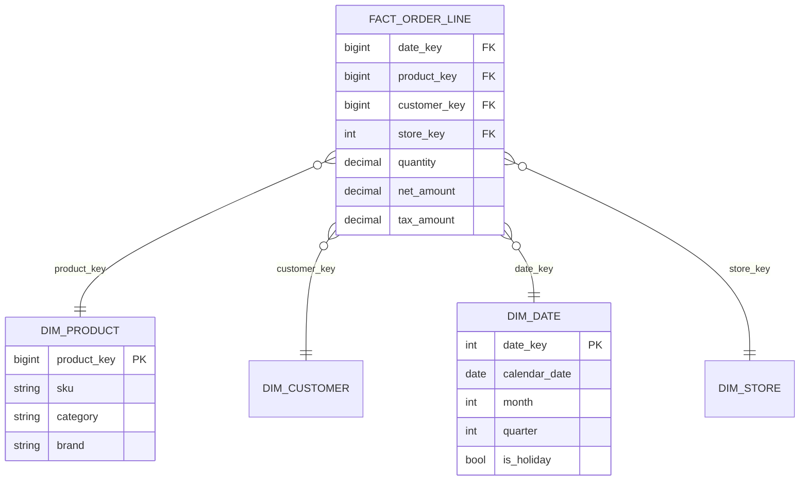
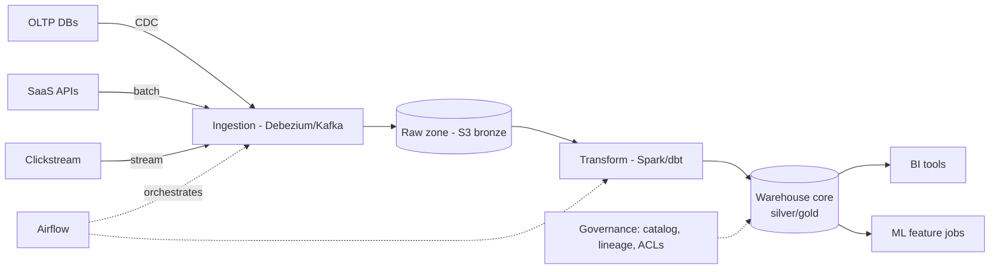
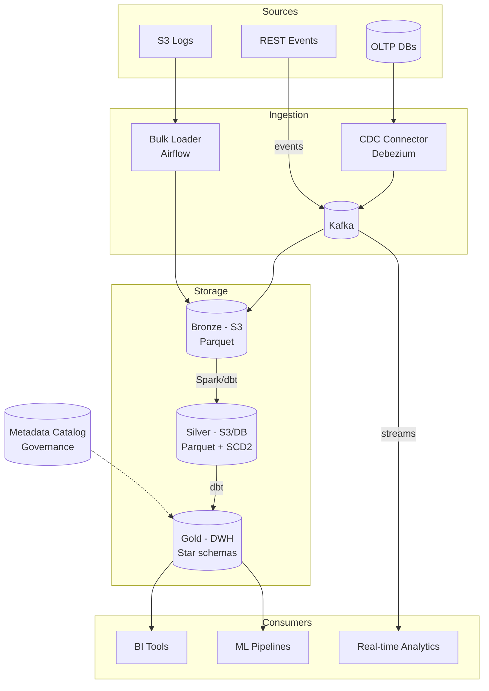
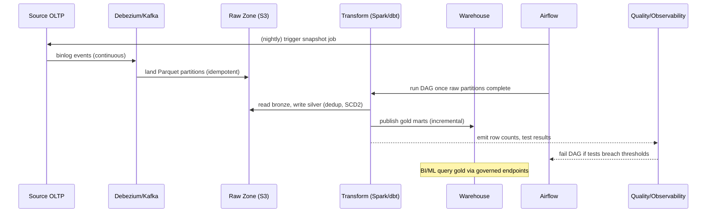

# Design Data Warehouse

## Blogs and websites

## Medium

## Youtube

- [Design a Data Warehouse | System Design](https://www.youtube.com/watch?v=NZ_-2RB-NU0)

---

## Theory

### What Is It?

A **data warehouse (DW)** is a centralized analytical store that integrates data from many operational systems (OLTP) into a form optimized for **analytics (OLAP)**: complex aggregations, historical trend analysis, and decision support — not transactional throughput. Classic definition (Bill Inmon): *subject-oriented, integrated, time-variant, and non-volatile*. Modern warehouses (Snowflake, BigQuery, Redshift, Databricks) separate storage from compute, run on object stores with columnar formats, and scale elastically.

### Why Does It Exist?

Transactional applications (OLTP) are optimized for single-row inserts, updates, and point reads at high QPS. Running analytics on them — multi-hour aggregations over billions of rows — would lock tables, bloat row stores, and degrade user-facing performance. A data warehouse exists to separate these two workloads: operational systems stay fast for transactions, while analytics run against a purpose-built, columnar, denormalized, and massively parallel store that can scan petabytes efficiently.

### What Problem Does It Solve?

* **Workload isolation**: analytics queries (full-table scans, joins, aggregations) degrade transactional databases. The warehouse absorbs analytical load without impacting OLTP systems.
* **Data integration**: operational systems each have their own schema, encoding, and semantics ("country" as "IN" vs "India", different currencies). The warehouse enforces a single, consistent, integrated representation across all sources.
* **Historical analysis**: transactional systems retain only current state; the warehouse preserves history (months/years) with SCD tracking so trends, seasonality, and "as-of" queries are answerable.
* **Performance via columnar + MPP**: analytics touch few columns across billions of rows; columnar storage, compression, zone maps, and massively parallel processing make these queries tractable in seconds rather than hours.
* **Governance and auditability**: a governed, catalogued, lineage-tracked dataset meets compliance (GDPR, SOX, RBI) requirements that scattered operational databases cannot.

### Important Subtopics

1. OLTP vs OLAP — why one database can't serve both
2. Dimensional modeling: facts, dimensions, star vs snowflake schema
3. ETL vs ELT pipelines
4. Batch ingestion vs streaming/CDC ingestion
5. Partitioning, clustering, and file layout
6. Columnar storage and compression
7. MPP execution engines and query optimization
8. Slowly Changing Dimensions (SCD Types 0–3)
9. Data lake + lakehouse relationship
10. Semantic layer / metrics layer
11. Data quality and observability
12. Governance: lineage, cataloging, access control, GDPR
13. Cost management in cloud DWs

### OLTP vs OLAP

| Aspect | OLTP (Postgres/MySQL) | OLAP (Warehouse) |
|---|---|---|
| Workload | Many short read/write txns | Few long analytical scans |
| Row orientation | Row-based; point reads/writes | Columnar; full-column scans |
| Schema | Normalized 3NF | Denormalized star schemas |
| Data age | Current state | Years of history |
| Metric | TPS, p99 latency | Scan throughput, query minutes |
| Example query | "Charge card X for order Y" | "Revenue by region by month, YoY" |

Running analytics on production OLTP systems degrades them (full scans lock/bloat row stores), hence the separation.

### Dimensional Modeling

The **star schema** is the canonical DW shape:

- **Fact table**: business events at grain (one row per order line, per click, per payment). Numeric *measures* (amount, quantity) + foreign keys to dimensions.
- **Dimension tables**: descriptive context (customer, product, date, store). Wide, denormalized.
- **Grain declaration** is the most important modeling step — "one row = one order line item" determines everything downstream.



*Star* = dimensions directly joined to fact (few joins, fast). *Snowflake* = normalized dimensions (e.g., product → subcategory → category); saves space but adds joins — modern columnar engines usually prefer flat stars since storage is cheap and joins are the cost.

### SCD (Slowly Changing Dimensions)

Dimensions change over time ("customer moved cities"). Handling options:

- **Type 1**: overwrite — lose history. Fine for typo fixes.
- **Type 2**: add new row with `valid_from` / `valid_to` / `is_current` flags — preserves history; the workhorse. Fact rows pin the dimension version via key, so "revenue from Mumbai customers *as of 2024*" is answerable.
- **Type 3**: add a column holding previous value — limited history, rarely used.

### Ingestion: ETL vs ELT

- **ETL** (classic): transform in an external engine (Spark/Informatica), load ready-made. Heavy cluster needed before load.
- **ELT** (modern): land raw data cheaply (object storage), transform inside the warehouse using SQL + its elastic compute (dbt-style). Faster iteration, raw data retained for replay/schema changes.
- **CDC streaming**: log-based capture (Debezium → Kafka) keeps warehouse near-real-time instead of nightly dumps; enables operational analytics (fraud dashboards on fresh data).

### Storage Physics: Why Columnar?

Analytics reads few columns across billions of rows ("SUM(amount) GROUP BY region"). Columnar layout:

- Only touched columns are read from disk (10–100× less I/O).
- Homogeneous values compress superbly (dictionary, RLE, delta encoding).
- Vectorized execution processes batches per CPU core.

Files organized as Parquet/ORC with internal statistics (min/max per block) enabling **zone maps/pruning** — queries skip blocks outside predicate range. Combine with **partitioning** (by date typically) and **clustering/sorting** (by frequently filtered keys like customer_id).

### MPP Execution

Modern warehouses shard data across nodes; each node scans/processes its local slices in parallel; coordinator stitches results. Snowflake separates virtual warehouses (compute clusters) from shared storage — teams get isolated compute against the same data, paying only while queries run. BigQuery goes further with serverless slots.

---

## Characteristics

- **Subject-oriented**: organized around entities (customers, orders) rather than applications; CRM + billing + web logs converge into unified customer view.
- **Integrated**: consistent encoding across sources (one "country" taxonomy, one currency policy, deduplicated identities).
- **Time-variant**: every fact anchored in time; history preserved; "as-of" queries supported (SCD2).
- **Non-volatile**: append-mostly; no in-place updates of historical facts — corrections arrive as new rows/retractions.
- **Read-optimized denormalization**: wide tables and stars deliberately sacrifice normalization for scan speed.
- **Separation of storage and compute**: multiple isolated compute clusters share one governed dataset.
- **Schema-on-write (DW) vs schema-on-read (data lake)**: warehouses enforce structure at ingest; lakes defer it — lakehouses blend both.

---

## Components

- **Source systems**
  *Purpose*: OLTP DBs, event streams, third-party SaaS APIs, files/logs. *Relationship*: feed ingestion; their schema churn drives pipeline maintenance cost. *Example*: Postgres order DB + Shopify API + app clickstream.

- **Ingestion layer**
  *Purpose*: move data reliably. *Responsibilities*: batch loaders (S COPY/Fivetran/Airbyte), CDC connectors (Debezium), streaming producers; schema-drift detection; exactly-once or idempotent loads. *Example*: Debezium reading MySQL binlog into Kafka, sink connector landing in S3 as Parquet.

- **Staging / raw zone**
  *Purpose*: immutable landing area preserving source fidelity. *Responsibilities*: append-only, cheap storage, replay source. *Real-world*: S3 bucket partitioned `dt=/source=/hour=`; the "bronze" layer in medallion architecture.

- **Transformation layer**
  *Purpose*: cleanse, conform, model. *Responsibilities*: dbt/SQL models building staging→marts, SCD2 logic, surrogate-key generation, tests (uniqueness, not-null, freshness). *Example*: dbt project where `dim_customer.sql` materializes SCD2 history.

- **Warehouse core**
  *Purpose*: columnar MPP storage + SQL engine. *Responsibilities*: query planning/execution, partition pruning, result caching, concurrency scaling. *Examples*: Snowflake, BigQuery, Redshift Serverless.

- **Orchestration**
  *Purpose*: schedule dependencies, retries, backfills. *Responsibilities*: DAGs (Airflow/Dagster/Prefect), SLA monitoring, idempotent task design. 

- **Semantic/metrics layer**
  *Purpose*: single definitions for "active user", "GMV". *Responsibilities*: metric DSL consumed by BI tools/APIs so two dashboards can't disagree. *Examples*: Cube, dbt Semantic Layer, LookML.

- **BI/consumption tools**
  *Examples*: Looker/Tableau/Superset; notebooks for data science.

- **Governance stack**
  *Catalog* (DataHub/OpenMetadata), *lineage*, *access control* (row/column policies), *quality monitors* (Great Expectations/Soda).



---

## Patterns

- **Star schema dimensional modeling** — *Problem*: analysts need predictable fast joins. *How*: facts + conformed dimensions. *When*: reporting/analytics marts. *Not when*: exploratory data science on raw events (wide tables/lakes fit better). *Pros*: simple mental model, optimizer-friendly. *Cons*: upfront design effort; schema changes ripple.

- **Medallion architecture (bronze/silver/gold)** — layered refinement: raw → cleansed/conformed → aggregated marts. Brings software-engineering discipline (staging, tests, contracts) to data.

- **Lambda vs Kappa architectures** — Lambda splits batch + speed layers (two codebases — costly); Kappa treats everything as streams with reprocessing via log replay. Choose Kappa when infra supports stream-first; Lambda when deep batch backfills dominate.

- **Incremental processing with watermarks** — process only new/changed data (`WHERE updated_at > last_watermark`), late arrivals handled via grace windows or retractions. Cuts compute dramatically versus daily full rebuilds.

- **SCD Type 2 for historical truth** — covered above; essential for point-in-time analysis (and ML feature correctness — training on today's attributes about yesterday's events is leakage!).

- **Elastically separated compute pools** — per-workload virtual warehouses (ETL pool ≠ BI pool ≠ ad-hoc pool) prevent a runaway notebook from starving payroll reports.

---

## Benefits

- **Single source of truth** ends "whose dashboard is right?" wars — one governed copy of revenue.
- **Historical intelligence** enables trends, forecasting, cohort analyses impossible on live OLTP (which keeps only current state).
- **OLTP protection**: heavy analytics lifted off production databases — checkout latency no longer suffers because someone ran a quarterly report.
- **Cross-source joins**: click behavior × purchases × support tickets — the joins that create business insight literally cannot happen inside any single source system.
- **Governed self-service**: analysts query safely without engineering tickets, within access controls.
- **ML enablement**: warehouses double as feature stores' source; training data reproducibility depends on DW history.

---

## Pros

- SQL remains the universal interface — enormous talent pool, tool ecosystem.
- Cloud DWs convert capex to opex with elastic concurrency; idle cost near zero (BigQuery) or pause-able (Snowflake).
- Mature optimization: partition pruning + columnar + vectorization deliver second-level queries over petabytes.
- Strong governance features (masking, row policies, lineage) built-in.

## Cons

- Cost surprises: per-scan pricing (BigQuery) punishes unpartitioned tables; Snowflake bills per-second-per-warehouse — a forgotten always-running cluster bleeds money.
- Latency floor for fresh data unless streaming CDC invested in; true realtime needs additional serving layer.
- Modeling rigidity: changing grain after the fact forces painful migrations.
- Vendor coupling: proprietary SQL dialects/features complicate migration.
- Pipeline sprawl: hundreds of dbt models need real software practices (CI, testing, ownership) or rot quickly.

---

## Challenges

- **Technical**: late/out-of-order data handling (watermarks, restatements); slowly-changing everything (sources alter schemas silently); deduplicating CDC update-streams; timezone hell (UTC everywhere internally, presentation-layer conversion).
- **Scalability**: small-files problem on object stores (compaction needed); concurrent BI load storms during Monday-morning dashboards (concurrency scaling costs).
- **Performance**: unpartitioned multi-TB scans from careless queries; skewed joins (celebrity customers).
- **Reliability**: silent data corruption from bad transforms propagates to every downstream dashboard — automated tests + anomaly detection mandatory; orchestrator outage halts freshness (SLA alerts).
- **Maintainability**: upstream API deprecations; metric-definition drift between teams; documentation debt.
- **Operational**: cost observability per team/query; capacity planning for seasonal peaks (Black Friday analytics surge).
- **Security/compliance**: PII minimization (tokenize emails before landing), GDPR erasure vs immutability tension (crypto-shredding or reprocessing patterns), fine-grained row/column ACLs, audit trails.

---

## Best Practices

- **Declare grain explicitly for every fact table** — undocumented grain is the root cause of most wrong-number incidents (double counting).
- **Partition by date, cluster by high-filter keys** — turns petabyte scans into gigabyte pruned ones; enforce via CI checks on table DDL.
- **Prefer ELT with dbt-style modularity**: staging (1:1 with sources) → intermediate → marts; test each layer; document lineage.
- **Idempotent, incremental pipelines**: deterministic outputs given same input; watermark-based increments with explicit late-data windows.
- **Automate data tests like code tests**: uniqueness of keys, accepted-value ranges, freshness SLAs, row-count anomaly alarms; block deploys on failures.
- **Conform dimensions across the org**: shared dim_customer/dim_date reused by all marts — cross-fact joins then align correctly.
- **Track cost per query/team** from day one; tag warehouses per workload; alert on burn anomalies (a junior analyst's cartesian join shouldn't bankrupt the month).
- **Version-control everything** (SQL, DAGs, configs); PR reviews apply to data code too.
- **Plan PII strategy pre-ingest**: hashing/tokenizing identifiers, column-level masking roles, retention schedules enforced mechanically.

---

## When to Use / Not Use

**Build/use a DW when**: multiple source systems need unified analysis; leadership demands trustworthy KPIs; ML needs historical training data; compliance requires auditable history.

**Skip/right-size when**: single-app startup with <10 GB data — direct SQL replicas + a BI tool suffice; realtime operational dashboards needing ms-freshness — build a dedicated serving store instead (warehouse complements, not replaces).

Alternatives/complements: **data lake** (raw cheap exploration, schema-on-read), **lakehouse** (Iceberg/Delta/Hudi bringing ACID + schema onto object storage — increasingly converging with DWs), **OLAP engines for embedded analytics** (ClickHouse/Druid/Pinot for user-facing sub-second aggregation at high concurrency).

Decision factors: data volume/variety, freshness requirements, query concurrency, team skills (SQL-heavy vs spark-heavy), compliance posture, budget predictability needs.

---

## Use Cases

- **Retail demand forecasting**
  *Problem*: 5,000 stores' POS + e-commerce + promotions data siloed. *Solution*: star-schema sales mart refreshed hourly via CDC; forecast models consume 5-year SCD2-corrected history. *Why suitable*: time-variance is the entire value — seasonality needs years. *Trade-off*: hourly freshness insufficient for intraday stock decisions → those use a separate ops-analytics path.

- **Fintech risk & regulatory reporting**
  *Problem*: RBI/central-bank filings demand consistent, auditable numbers across products. *Solution*: gold-layer marts with immutable restatement ledger; every published figure traceable to source snapshots. *Trade-off*: strictness slows iteration; sandbox zones give analysts freedom while filings stay locked.

- **Streaming-service content analytics**
  *Problem*: billions of play events/day inform licensing decisions. *Solution*: Kappa-style stream landing into warehouse tables; completion-rate marts per title/region refreshed continuously. *Trade-off*: massive event volume forces aggressive pre-aggregation tiers (raw → 5-min rollups → hourly).

---

## Architecture

### Architectural Style

**Layered lakehouse / medallion architecture**: data flows through three layers — Bronze (raw, untouched, idempotent ingestion), Silver (cleaned, deduplicated, conformed dimensions), and Gold (business-ready star-schema marts). This separates concerns: ingestion is replayable, cleansing is centralized, and analytics consumers see curated, governed tables. Modern implementations (Databricks, Snowflake, BigQuery) separate compute from storage and run on object stores, enabling elastic scaling.

**Batch + streaming blend**: batch handles backfills and heavy transforms (Spark, EMR Serverless); streaming/CDC handles real-time ingestion (Debezium → Kafka → warehouse). The two streams converge at the Silver layer.



*Diagram: Layered data-warehouse architecture. Sources feed ingestion (CDC + batch) into bronze raw storage. Transforms (Spark/dbt) clean into silver, then curate into gold star-schema marts. BI and ML consume gold tables; a metadata catalog governs access and lineage.*

### Component Responsibilities and Communication

| Component | Responsibility | Communication |
|---|---|---|
| CDC Connector | Log-based change capture from OLTP | Reads DB binlog → Kafka (exactly-once semantics) |
| Bulk Loader | Periodic full snapshots, backfills | Orchestrated by Airflow; writes to raw zone |
| Bronze Zone | Raw landed data, immutable, idempotent | Parquet files in S3, partitioned by ingestion date |
| Transform Engine | Cleaning, dedup, SCD handling, conformed dimensions | Reads bronze, writes silver; SQL/dbt models |
| Gold Marts | Business-ready dimensional tables | Curated schemas; read by BI/ML |
| Metadata Catalog | Schema registry, data lineage, access control, GDPR tags | API consumed by all layers; integrates with tools like Unity Catalog, AWS Glue |
| Orchestrator | DAG scheduling, dependency management, alerting | Airflow/Kestra; monitors quality tests |
| Quality/Observability | Row-count checks, freshness, anomaly detection | Emits metrics/alerts; gates DAG completion |

**Data flow**: source OLTP → CDC captures binlog → Kafka → bronze Parquet (idempotent) → Silver (dedup, conformed dims, SCD2) → Gold (star-schema marts) → BI/ML via governed endpoints. Quality checks on every stage; failures quarantine bad data rather than halting the pipeline.

**Scaling strategy**: ingestion scales via Kafka partitions; transformation on elastic Spark/EMR sized per DAG stage; warehouse concurrency via separate virtual warehouses per workload class; storage inherently elastic on object store.

**When to use this architecture**: analytics on integrated, historical, multi-source data where query performance and governance matter. **Avoid**: when you only need real-time serving of current data (use a serving layer like DynamoDB + cache) or when data variety and volume are low (a single database suffices).

## Design

### Design Considerations

The warehouse design centers on three decisions: (1) **data modeling approach** — dimensional (star schema) vs. normalized vs. data-vault; (2) **ingestion strategy** — batch ETL vs. streaming CDC vs. hybrid; (3) **storage-compute separation** — shared-disks cluster vs. decoupled elastic compute. Each has cascading effects on query performance, data freshness, and operational cost.

### Key Decisions

- **Star schema for analytics**: facts (events with measures) joined to denormalized dimensions (customers, products, dates). Minimizes joins on columnar engines where joins are the cost.
- **Silver-layer SCD2**: conformed dimensions track history with `valid_from`/`valid_to`/`is_current` so "as-of" queries and trend analysis are always correct.
- **Idempotent ingestion**: CDC keys (topic+partition+offset) and batch watermarks ensure re-runs never duplicate or miss data.
- **Compute isolation**: separate virtual warehouses per workload class (BI dashboards, ML training, ad-hoc analysis) prevents noisy-neighbor interference.
- **Governed metadata catalog**: schema, lineage, and access control centralized and queryable.

### Trade-offs

| Decision | Pro | Con |
|---|---|---|
| Star schema | Fast analytics, intuitive for analysts | ETL complexity, dimension maintenance overhead |
| SCD Type 2 | Full history, "as-of" queries | Row explosion, complex joins |
| Streaming CDC | Near-real-time freshness | Operational complexity, ordering challenges |
| Batch ELT | Simpler, cheaper, replayable | Data freshness = batch interval |
| Compute-storage separation | Pay-per-use, independent scaling | Cold-start latency, metadata service as bottleneck |

### Scalability Considerations

- Ingestion scales horizontally via Kafka partitions and parallel Spark executors.
- Transform complexity managed with dbt modularization and incremental models.
- Warehouse virtual warehouses scale independently; concurrency scaling for bursty BI loads.
- Gold marts partitioned by date and clustered by hot query dimensions.

### Reliability Considerations

- CDC gap detection via heartbeat tables → targeted re-snapshot of affected range.
- Transform tasks retry idempotently (deterministic writes keyed by partition).
- Bad-data quarantine zone isolates poison records instead of failing whole runs.
- Schema evolution with backward compatibility (additive changes only in Bronze/Silver).

### Performance Considerations

- Columnar file formats (Parquet) with zone maps for partition pruning.
- Clustering/sorting by frequently filtered columns (customer_id, date).
- Result caching for repeated BI queries.
- Materialized views for expensive aggregations.

### Security Considerations

- Row/column-level security on gold marts (PII masking).
- Encryption at rest (S3 SSE) and in transit (TLS between layers).
- Access control via catalog (Grants/AACLs) — least-privilege for service accounts.

### Maintainability Considerations

- dbt as the transformation framework — SQL-first, tested, documented, version-controlled.
- Data quality tests (schema, not-null, uniqueness) gate DAG completion.
- Lineage tracking for impact analysis on schema/source changes.

## API Contract

### SQL Interface (Primary Consumer API)

Modern cloud warehouses expose ANSI SQL as the primary interface — BI tools, notebooks, and applications connect via standard JDBC/ODBC drivers.

```sql
-- Dimension query
SELECT customer_id, name, city, registration_date
FROM dim_customer
WHERE city = 'Bangalore' AND registration_date >= '2024-01-01'

-- Fact aggregation with SCD2-corrected dimension
SELECT d.date_month, p.category, SUM(f.net_amount) AS revenue
FROM fact_order_line f
JOIN dim_date d ON f.date_key = d.date_key
JOIN dim_product p ON f.product_key = p.product_key
WHERE d.date_year = 2024
GROUP BY d.date_month, p.category
ORDER BY d.date_month
```

### Query Endpoints

| Endpoint | Purpose |
|---|---|
| JDBC/ODBC driver | BI tools (Tableau, Power BI, Looker) |
| REST API (BigQuery, Databricks SQL) | Programmatic query execution |
| Python/R notebooks | Data science / ML feature engineering |
| Airflow hooks | Pipeline orchestration |

### SQL API Semantics

- **Pagination**: `LIMIT`/`OFFSET` or keyset pagination for large result sets.
- **Filtering**: standard SQL predicates; partitioning/clustering makes date/category filters efficient.
- **Sorting**: `ORDER BY` supported; results sorted by clustering key are cheaper.
- **Versioning**: schema versions tracked in metadata catalog; additive changes (new columns) are backward-compatible.
- **Authentication**: service-account keys, OAuth, or cloud IAM integration.
- **Rate limiting**: per-warehouse concurrency limits; queueing for BI dashboards.

### Status Codes & Error Handling

```json
{
  "error": {
    "code": "INVALID_QUERY",
    "message": "Column 'nonexistent' not found in table 'fact_order_line'",
    "errors": [{ "reason": "invalid", "location": "SELECT" }]
  }
}
```

Standard codes: `200` (success with results), `400` (invalid query — syntax/semantics), `401` (auth required), `403` (access denied), `429` (rate/concurrency limit), `503` (warehouse overloaded, retry with backoff).

## High-Level Design



Failure handling: CDC gap detected via heartbeat tables → targeted re-snapshot of affected range; transform task retry idempotently (deterministic writes keyed by partition); bad-data quarantine zone isolates poison records instead of failing whole runs.

Scaling: ingestion scales horizontally via Kafka partitions; transformation on elastic Spark/emr-serverless sized per DAG stage; warehouse concurrency via separate virtual warehouses per workload class; storage inherently elastic on object store.

---

## Deep Dive

- **Compaction & file sizing**: target 128–512 MB Parquet files; small-file storms from streaming sinks require scheduled compaction jobs (or Iceberg's built-in maintenance) — otherwise metadata bloat slows planning more than scanning.
- **Join strategies in MPP**: broadcast joins (small dim to all nodes) vs shuffle joins (redistribute both sides by key); optimizer picks by size stats — stale stats cause catastrophic plan flips, hence auto-analyze settings matter.
- **Restatement semantics**: corrections modeled as retractions (+/- pairs) preserve auditability; downstream consumers must aggregate retractions-aware (never naive SUMs over mutable snapshots). This subtlety separates senior answers.
- **Late-arrival windows**: define per-source max lateness (e.g., payments may settle up to 7 days later); incremental jobs reprocess rolling window; beyond window, explicit adjustment entries.
- **Observability**: freshness (max source-timestamp in marts), volume anomalies (expected ±X%), distribution drift (schema/statistics shifts), lineage-impact analysis ("this broken upstream feeds which 40 dashboards?") — tools: Monte Carlo/OpenMetav2-style detectors plus dbt tests.

---

## Data Modeling (extended)

Beyond the star above:

- **Surrogate keys**: integer/UUID keys decoupled from source PKs; enable SCD versions and cross-system identity resolution.
- **Fact table types**: transaction (order lines), periodic snapshot (daily inventory levels), accumulating snapshot (order lifecycle milestones as columns).
- **Degenerate dimensions**: order-number stored in fact without dimension table — common and correct.
- **Junk dimensions**: bundle low-cardinality flags into one dimension to avoid flag sprawl.
- **Bridge tables** for many-to-many (account–customer hierarchies) with weighting allocation rules.
- Indexes mostly irrelevant in columnar DWs (pruning replaces B-trees); primary keys often informational-only (enforced by tests, not constraints — Snowflake doesn't enforce uniqueness; your pipeline must).

Lifecycle: raw retained forever (cheap), silver per compliance (7 yrs finance), gold indefinitely; GDPR deletes handled via scheduled reprocessing of affected users' partitions (documented crypto-shredding where encryption permits).

---

## Java and Spring Boot Implementation

Where Java fits: building **ingestion services** and **pipeline components** around the warehouse (the warehouse itself is vendor infrastructure).

A Spring Boot CDC consumer writing Parquet-ish batches (conceptually — production uses Flink/Spark, but the pattern shows):

```java
@Service
public class ChangeEventBatcher {

    private final ObjectStoreClient s3;
    private final WarehouseLoadGateway warehouse;

    @Value("${pipeline.batch.max-events:50000}")
    private int maxEvents;

    private final Map<String, List<ChangeEvent>> buffers = new ConcurrentHashMap<>();

    @KafkaListener(topics = "${topics.cdc.orders}", groupId = "dw-ingest")
    public void onChange(ChangeEvent evt) {
        buffers.computeIfAbsent(evt.partitionKey(), k -> Collections.synchronizedList(new ArrayList<>()))
               .add(evt);
        if (buffers.get(evt.partitionKey()).size() >= maxEvents) {
            flush(evt.partitionKey());
        }
    }

    @Scheduled(fixedDelay = 60_000)
    public void flushAll() {
        buffers.keySet().forEach(this::flush);
    }

    private synchronized void flush(String partition) {
        List<ChangeEvent> batch = buffers.remove(partition);
        if (batch == null || batch.isEmpty()) return;
        String path = String.format("s3://dw-raw/orders/dt=%s/batch-%s.parquet",
                LocalDate.now(), UUID.randomUUID());
        s3.writeParquet(path, batch);
        warehouse.registerPartition("raw_orders", path);   // ALTER TABLE ADD FILE equivalent
    }
}
```

Query gateway exposing governed marts to services (with read-only credentials):

```java
@Service
public class MartQueryService {

    private final JdbcTemplate dwh;

    public MartQueryService(@Qualifier("dwhJdbcTemplate") JdbcTemplate dwh) { this.dwh = dwh; }

    public List<DailyRevenueRow> dailyRevenue(String region, LocalDate from, LocalDate to) {
        return dwh.query("""
                SELECT date_key, SUM(net_amount) AS revenue, COUNT(*) AS orders
                FROM mart_sales_daily
                WHERE region_code = ? AND date_key BETWEEN ? AND ?
                GROUP BY date_key ORDER BY date_key
                """,
                (rs, i) -> new DailyRevenueRow(rs.getDate(1).toLocalDate(),
                        rs.getBigDecimal(2), rs.getLong(3)),
                region, from, to);
    }
}
```

Notes: connection pooling tuned for warehouse session limits; query timeouts mandatory (runaway analyst query shouldn't hold service threads); heavy exports go through async job patterns (submit → poll → download) rather than giant synchronous JDBC reads. Testing uses Testcontainers with an embedded DuckDB/trino-compatible stub for unit speed, plus nightly smoke suites against a dev warehouse.

---

## Real-World Examples

- **Amazon Redshift origin story** — AWS built it because internal teams were drowning in analytic workloads on OLTP replicas; RA3 nodes later adopted the storage-compute split, validating the Snowflake thesis.
- **Snowflake** — architected pure SaaS around object storage + virtual warehouses; its rapid rise demonstrated the elasticity economics described above.
- **Uber's big data platform** — documented evolution through Hadoop → Presto/ClickHouse hybrids; their blog details exactly the ingestion/compaction/cost-governance struggles covered here.
- **Netflix** — gen-1 Genie orchestration over EMR/Presto; thousands of daily jobs feeding personalization — showcases orchestration + multi-cluster isolation patterns at extreme scale.
- **Airbnb Minerva / Spotify Zettle** — dimensional-model-at-scale case studies: managing hundreds of conforming marts with dbt-like discipline.

---

## Interview Preparation

### Interview Questions

**Beginner**

1. **Difference between a database and a data warehouse?**
   Database optimizes transactions (current state, short operations, normalized); warehouse optimizes analysis (history, large scans, denormalized columns). They coexist: OLTP writes flow into OLAP for insight.
2. **What is a star schema?**
   Central fact table of measures keyed by surrounding dimension tables (product/customer/date/store). Few joins, fast scans, intuitive for analysts.

**Intermediate**

3. **Explain SCD Type 2 and why analytics needs it.**
   Dimension changes create new rows with validity ranges; facts reference specific versions. Enables "what was this customer's city when they bought?" — critical for attribution, compliance, and avoiding subtle ML leakage (using post-event attribute values on pre-event facts).
4. **ETL vs ELT — when does each win?**
   ELT wins with cheap elastic storage + powerful in-warehouse SQL (modern default): faster iteration, raw retained. ETL still wins when sensitive transformations must occur before landing (PII scrubbing under strict residency) or transform logic needs non-SQL horsepower upstream.
5. **How would you handle late-arriving data?**
   Watermarks with grace windows per source; within-window late data merges into existing partitions idempotently; beyond-window arrives as explicit adjustments/retractions. Emphasize: never assume data arrives in time order.

**Advanced**

6. **Design the warehouse for an e-commerce company ingesting orders (10M/day), clickstream (500M events/day), and support tickets.**
   Discuss: CDC for orders (small/fresh), streaming landing for clicks (huge/aggregatable), API pulls for Zendesk-class sources; medallion layers; conformed dims (customer resolved across all three via identity graph — the hard part!); marts: funnel analysis, fulfillment SLAs, CSAT correlation; cost controls via tiered retention and pre-aggregation.
7. **Your CEO's dashboard number differs from Finance's. Root-cause framework?**
   Trace lineage to divergence point: different grains (daily vs transactional)? Different filters (refunds included?)? Different refresh times? Stale vs fresh partition? Fix structurally: semantic layer owning the official definition, deprecate shadow metrics. This question tests data-politics maturity as much as tech.

**Senior / system design**

8. **Architect a near-realtime fraud analytics platform on top of warehouse principles.**
   Hybrid: streaming path (Kafka → Flink) computes features/scores in seconds; same events land in warehouse for model training/investigation; feedback loop — confirmed-fraud labels written back nightly improving online models. Discuss serving vs analytical store split, exactly-once challenges, and why you don't run fraud scoring itself in the DW.
9. **Cost exploded 3× month-over-month. Diagnose systematically.**
   Segment by warehouse/pool → top queries by bytes scanned (unpartitioned newcomers?), by duration (skew/regression?), by frequency (new cron loops?); storage growth vs compute growth; concurrency-scaling spikes (dashboard storm); dev clusters left running. Remedies: enforcement CI on partitioning, query timeouts/result caches, chargeback dashboards creating owner accountability.

### Common Mistakes

- Skipping grain declaration → duplicate-counting bugs discovered by CFO.
- Treating warehouse PKs as enforced constraints (Snowflake won't reject dupes — tests must).
- Nightly full-table rebuilds burning compute where incremental suffices.
- Landing raw PII "to clean up later" — later never comes until the auditor arrives.
- One shared warehouse for all workloads — one runaway query starves everyone.

### Expected discussion points

Storage-compute separation economics, columnar physics (why it matters), medallion discipline, retraction semantics, and the organizational side: ownership, data contracts with producing teams, and metric governance.
