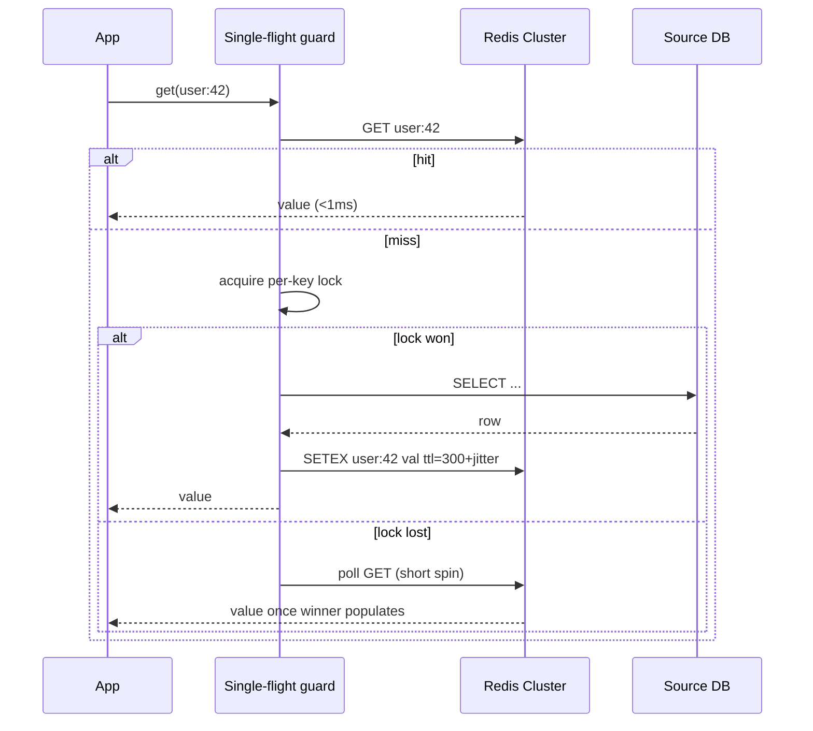

# Design Distributed Cache

## Blogs and websites

## Medium

## Youtube

## Theory

### Important Subtopics

1. Why caching exists (latency economics, read skew)
2. Cache placement patterns (cache-aside, read-through, write-through, write-behind)
3. Partitioning & consistent hashing
4. Replication & failover models (leader-follower vs leaderless)
5. Eviction policies (LRU/LFU/TTL) and their data structures
6. Expiration mechanics (lazy vs active)
7. Hot keys, thundering herds, and stampedes
8. Consistency between cache and source of truth (invalidation)
9. Persistence options (AOF/RDB) and when they matter
10. Multi-tier caching (local in-process + distributed + CDN)
11. Capacity planning & hit-ratio economics
12. Failure modes: avalanche, penetration (cache-miss storms on absent keys)
13. Security of cache tiers (auth, TLS, isolation)
14. Observability: hit ratio, latency, eviction rates

*(Each subtopic below expands the existing material — problem statement, requirements, architecture, partitioning, eviction, replication, write patterns, failure handling, and design decisions are covered in the subsections that follow.)*

### Why Caching Exists

A cache trades memory for latency: keep copies of expensive-to-compute or slow-to-fetch data close to the consumer. It works only because real workloads exhibit **locality of reference** — a small fraction of keys absorbs most traffic (typically 80/20 or worse). If access were uniform, every byte of cache would be wasted; with skew, a 10% memory footprint can absorb 90%+ of reads.

The economics: RAM costs ~10–100× more per GB than SSD/disk but is ~100–1000× faster in access latency. Caching buys back latency at RAM prices *for the hot subset* — which is why capacity planning always starts with measuring the actual key-access distribution, never with guessing.

### Problem Statement
Design a distributed caching system like Redis or Memcached that provides low-latency key-value storage across multiple nodes with high availability and consistency.

### Functional Requirements
- GET / SET / DELETE operations on key-value pairs
- TTL (time-to-live) expiration
- Support multiple data types (string, list, set, hash, sorted set)
- Pub/Sub messaging
- Atomic operations (INCR, DECR, CAS)
- Cache eviction policies (LRU, LFU, TTL)

### Non-Functional Requirements
- **Latency**: < 1ms for single-node, < 5ms for distributed
- **Throughput**: 100K+ operations/second per node
- **Availability**: 99.99%
- **Scalability**: Horizontal scaling to petabytes
- **Durability**: Optional persistence (AOF, RDB snapshots)

### High-Level Architecture

```
┌──────────┐     ┌──────────────────────────────────────┐
│  Client  │────▶│         Cache Proxy / Router          │
│  (App)   │     │  (Consistent hashing for routing)     │
└──────────┘     └───────────────┬──────────────────────┘
                                 │
                 ┌───────────────┼───────────────┐
                 ▼               ▼               ▼
          ┌────────────┐  ┌────────────┐  ┌────────────┐
          │  Cache     │  │  Cache     │  │  Cache     │
          │  Node 1    │  │  Node 2    │  │  Node 3    │
          │  (Primary) │  │  (Primary) │  │  (Primary) │
          │     │      │  │     │      │  │     │      │
          │     ▼      │  │     ▼      │  │     ▼      │
          │  Replica   │  │  Replica   │  │  Replica   │
          └────────────┘  └────────────┘  └────────────┘
```

### Data Partitioning

**Consistent Hashing:**
```
hash(key) → position on hash ring → find next node clockwise

Virtual nodes: Each physical node = 100-200 virtual nodes
  → Even distribution
  → Minimal rebalancing when nodes join/leave
```

**Key routing:**
```
Client library computes: node = hash(key) % N
  or
Proxy layer routes request to correct shard
```

### Cache Eviction Policies

```
LRU (Least Recently Used):
  Doubly-linked list + HashMap
  - Access: move to head → O(1)
  - Evict: remove tail → O(1)

LFU (Least Frequently Used):
  Frequency counter + min-heap
  - Better for hot/cold data
  - More complex

TTL (Time-To-Live):
  Lazy expiration: check on access
  Active expiration: periodic scan of expiring keys (10% sample)
```

### Replication Strategies

```
1. Leader-Follower (Redis default):
   Write → Primary → async replicate → Replicas
   Read → Any replica (read scaling)
   Failover: Sentinel promotes replica to primary

2. Leaderless (Memcached style):
   No replication — data on single node
   Lost on node failure
   Simple, fast, used when cache-miss is acceptable
```

### Write-Through vs Write-Behind

```
Write-Through:
  App → Cache → DB (synchronous)
  Pro: Cache always consistent
  Con: Higher write latency

Write-Behind (Write-Back):
  App → Cache → (async) → DB
  Pro: Low write latency
  Con: Data loss risk if cache fails before DB write

Cache-Aside (most common):
  Read: App checks cache → miss → read DB → populate cache
  Write: App writes DB → invalidate cache
```

### Handling Failures

| Failure | Solution |
|---------|----------|
| Node crash | Failover to replica (Sentinel/Cluster) |
| Network partition | Split-brain protection (quorum-based) |
| Hot key | Local cache + key replication to multiple nodes |
| Thundering herd | Request coalescing / cache stampede lock |

### Key Design Decisions

| Decision | Choice | Reason |
|----------|--------|--------|
| Partitioning | Consistent hashing | Minimal rebalancing |
| Replication | Async leader-follower | Low write latency |
| Eviction | LRU (default) | Simple, effective |
| Persistence | Optional AOF + RDB | Durability when needed |
| Protocol | RESP (Redis protocol) | Simple, fast text protocol |

### Expiration Mechanics in Detail

- **Lazy expiration**: on access, check TTL; expired → treat as miss and reclaim. Zero background cost but stale keys consume memory until touched.
- **Active expiration**: background job samples keys with TTL set (Redis samples ~10 per 100ms loop, escalating if >25% sampled were expired). Bounds memory growth for write-then-never-read workloads.
- Production systems rely on the combination; misjudging this is a classic memory-leak-by-TTL bug (millions of never-revisited session keys).

### Consistency With the Source of Truth

The cache-aside contract ("write DB, invalidate cache") has known races:

```
R1: read miss → fetch old value from DB
W1: write new value to DB → invalidate cache
R1: (late) writes OLD value into cache
→ stale until next TTL
```

Mitigations: short TTLs as backstop, versioned keys (include data version in key so stale writes target dead keys), distributed lock or delay-double-delete (delete → small sleep → delete again), or accepting brief staleness where business allows. Perfect cache/DB consistency without synchronous coupling is impossible — pick the staleness budget deliberately.

---

## Characteristics

- **Latency-first design**: every decision (in-memory storage, pipelined protocols, no joins) serves sub-millisecond responses; p99 matters more than averages because caches sit on hot paths.
- **Ephemeral by contract**: any key may vanish at any time (eviction, expiry, failover) — applications must treat cache misses as normal, not exceptional. Systems that *require* cache presence are using it wrongly.
- **Skew-exploiting**: value derives from locality of reference; monitoring hit ratio is monitoring the workload's skew shape.
- **Bounded memory with admission control**: eviction policy is effectively an online algorithm deciding which objects deserve RAM; LFU/admission filters improve on pure recency for scan-resistant workloads.
- **Shared-nothing partitioning + optional replication**: horizontal scale via consistent hashing; durability via replicas only where warm-failover matters.
- **Protocol efficiency**: text/binary protocols optimized for many-small-commands; batching (MGET/pipelines) often matters more than single-op latency.

---

## Components

- **Cache nodes**
  *Purpose*: store partitions of keyspace in RAM. *Responsibilities*: command execution (single-threaded event loop in Redis — atomicity for free), TTL bookkeeping, eviction under pressure, persistence threads if enabled. *Relationship*: members of hash ring; primaries own writes, followers serve reads. *Example*: Redis Cluster shards; ElastiCache nodes.

- **Client library / smart client**
  *Purpose*: routing + resilience at call site. *Responsibilities*: slot/ring calculation, connection pooling, MOVED/ASK redirect handling (Redis Cluster), retry/topology-refresh logic. *Relationship*: removes need for proxy hop in most deployments. *Example*: Lettuce/Jedis, Memcached clients with ketama hashing.

- **Proxy tier (optional)**
  *Purpose*: centralize routing/multi-tenancy. *Responsibilities*: consistent-hash routing, protocol translation, per-app quotas, metrics aggregation. *Example*: Twemproxy/Cortex-style fronting for fleets that can't upgrade all clients.

- **Replication/failover controller**
  *Purpose*: keep copies, promote on failure. *Responsibilities*: async replication streams, health probing, quorum-based promotion (Sentinel) or gossip slots (Cluster). *Example*: Redis Sentinel trios managing primary-replica pairs.

- **Persistence subsystem**
  *Purpose*: recover state after restarts. *Responsibilities*: fork-based RDB snapshots (point-in-time compact) vs AOF append log (fsync-policy configurable: always/everysec/never). *Trade-off note*: `everysec` bounds loss to ~1 s while keeping latency sane.

- **Eviction engine**
  *Purpose*: enforce memory ceiling. *Responsibilities*: approximate-LRU sampling (Redis samples N keys rather than maintaining exact list — O(1) with tiny footprint), LFU counters with decay, volatile-vs-allkeys scope selection.

```mermaid
flowchart TB
    APP[Application] --> CL[Smart client]
    CL -->|hash(key)| P1[Node 1 primary]
    CL -->|hash(key)| P2[Node 2 primary]
    P1 -->|async| R1[Node 1 replica]
    P2 -->|async| R2[Node 2 replica]
    SENT[Sentinel / cluster bus] -.monitors/promotes.- P1
    SENT -.-> P2
    P1 -.AOF/RDB.-> DISK[(Persistent volume)]
```

---

## Patterns

- **Cache-aside (lazy loading)**
  *What*: app queries cache first; on miss reads DB then populates cache with TTL. *Solves*: keeping cache populated only with actually-demanded data. *When*: default choice — read-heavy workloads with tolerant staleness. *Not when*: strict read-after-write consistency required. *Advantages*: only-used data cached; DB outage degrades to cache-only serving. *Disadvantages*: miss penalty (3 round-trips); the invalidation race above. *Spring example below*.

- **Read-through / write-through**
  *What*: cache itself owns the backing-store interaction; app sees one facade. *When*: platform teams standardizing access; libraries like Hazelcast/Ignite implement natively. *Pros*: simpler app code; consistent policies. *Cons*: cache product coupled to schema.

- **Write-behind (write-back)**
  *What*: writes land in cache; async flusher batches to DB. *When*: write-heavy telemetry/counters where losing ≤N seconds is acceptable. *Pros*: absorbs write bursts, batch amortization. *Cons*: data-loss window; complexity of flush ordering/retries.

- **Request coalescing (single-flight)**
  *Problem*: popular key expires → 10K concurrent misses hammer DB. *How*: per-key mutex — one request loads, others await result (in-process map or Redis SETNX lock + double-check). *Real-world*: essential for viral content; pairs with jittered TTLs (TTL ± random%) so mass-expiry can't synchronize.

- **Negative caching**
  *Problem*: repeated lookups of nonexistent IDs (scanners, deleted entities) bypass cache entirely. *How*: cache sentinel "NOT_FOUND" values with shorter TTL. *Pros*: shields DB from penetration attacks. *Cons*: must invalidate promptly when entity later exists.

- **Tiered caching (L1 local + L2 distributed)**
  *L1* = Caffeine in-process (µs); *L2* = Redis cluster (ms). Invalidation via pub/sub broadcasts. *Pros*: removes network hop for hottest keys. *Cons*: consistency window widens; memory duplicated per instance.

---

## Benefits

- **Orders-of-magnitude latency reduction** (100 ms DB → <1 ms cache): directly improves user experience and system throughput headroom.
- **Database load shedding** enables smaller DB fleets for the same traffic — frequently the cheapest scaling lever available.
- **Burst absorption**: flash crowds hit cache tier (elastic, cheap) instead of rigid DB capacity.
- **Atomic primitives unlock patterns**: INCR-based rate limiting, SETNX locks, sorted-set leaderboards without building coordination services.
- **Cross-service shared state** (sessions, feature flags) with uniform low latency regardless of app-instance count.

---

## Pros

- Simplest high-impact performance tool in the box; often days-not-months to adopt.
- Horizontal scaling well understood (consistent hashing is solved science).
- Rich data structures (Redis) eliminate whole microservices worth of code.
- Graceful degradation semantics: cache down ⇒ slower, not broken (if designed correctly).

## Cons

- **Staleness window inherent** to async invalidation — unsuitable as source of truth.
- **Loss-on-restart** unless persistence configured; even then, recent writes may vanish.
- **Memory economics**: expensive per GB; unbounded value sizes quietly destroy node budgets (enforce max-value-size).
- **Operational sharp edges**: split-brain promotions losing writes, hot-key melting one shard, migration resharding pain (Redis Cluster slot migrations).
- **Hidden application complexity**: stampede guards, negative caching, tier invalidation — each adds failure modes that must be tested.

---

## Challenges

- **Technical**: the cache-invalidation race (shown above); atomic multi-key ops across shards (hash-tags `{user123}` co-location trade-offs); large-value splitting.
- **Scalability**: hot keys concentrating on one shard (mitigations: replicate hot key across N nodes with client-side random pick, split counter into sub-keys summed at read); resharding live traffic.
- **Performance**: big-value latency spikes blocking single-threaded loops (protocol splits/lazy-free options); GC on JVM-managed proxies.
- **Reliability**: failover losing tail writes accepted explicitly; flapping primaries causing thundering reconnections (client backoff mandatory).
- **Maintainability**: TTL hygiene audits (orphaned keys), naming conventions/versioned prefixes for safe schema evolution.
- **Operational**: memory fragmentation monitoring (`activedefrag`), slowlog reviews, replication-lag alerting.
- **Security**: historically weak auth defaults — enable TLS+ACLs, isolate network paths, never expose cache ports publicly (memcached amplification attacks were a DDoS chapter of their own).

---

## Best Practices

- **Always set TTLs** — eternal keys are future incidents; exceptions require explicit review.
- **Jitter expirations and pre-warm predictable hot sets** before events; combine with single-flight locks.
- **Bound value sizes** (e.g., <100 KB typical); large blobs belong in object storage with metadata cached.
- **Monitor hit ratio per key-class**, not fleet-wide only — a dropping segment reveals regressions before users do.
- **Use hash-tags deliberately** for multi-key atomicity but watch for artificial hotspots.
- **Separate use cases onto separate clusters** (sessions vs rate-limiting vs caching) — blast-radius isolation and independent tuning.
- **Fail-open design**: timeouts + circuit breakers so cache outages degrade to origin, never hard-fail requests that could still be served slowly.
- **Version key namespaces** (`v2:user:{id}`) enabling clean flushes during deploys/format changes.

---

## When to Use / Not Use

**Use when**: read-heavy skewed workloads; computed values expensive to regenerate (aggregations, rendered fragments); cross-request state sharing needed; DB approaching read capacity.

**Avoid/limit when**: strong consistency required per read (use DB or sync-through designs); access pattern uniform (hit ratio won't justify cost); dataset fits in DB buffer pool anyway (double-caching wastes RAM); write-heavy with immediate-read-after-write semantics (invalidation churn dominates).

Alternatives: materialized views/pre-aggregations for fixed query shapes; CDN edge caching for static/global content; in-process caches alone for single-instance apps; read replicas when staleness tolerance is zero.

Decision inputs: measured access distribution (Zipfian?), staleness budget, invalidation pathway ownership, ops maturity for another stateful tier.

---

## Use Cases

- **Session storage for web fleet**
  *Problem*: sticky sessions kill elasticity. *Solution*: sessions in Redis keyed by SID, 30-min sliding TTL; any app instance serves any user. *Trade-off*: one more dependency on login path — mitigate with multi-AZ replication.

- **Rate limiting**
  *Problem*: enforce API quotas across horizontally scaled gateways. *Solution*: `INCR key:{clientId}:{window}` + `EXPIRE` atomically via Lua; deterministic windows or token-bucket hashes. *See* dedicated rate-limiter topic for deep dive.

- **Leaderboards/counters**
  *Problem*: realtime ranked lists under heavy concurrent updates. *Solution*: Redis sorted sets — O(log N) inserts, range queries by rank; sharding by score-bucket for extreme scale. *Example*: game leaderboards, trending topics.

---

## High-Level Design

Read-path flow with stampede protection:



Scaling strategy: start single primary+replica → Redis Cluster (16384 slots) as data grows; compute-side scale needs no cache changes (smart clients discover topology); multi-region: active-passive with geo-replication for sessions, region-local caches for derived data.

Failure handling: primary loss → Sentinel/Cluster promotes replica (seconds); lost-tail-writes accepted for cache semantics; full-cluster loss → circuit breaker opens, traffic flows to DB with autoscaling trigger — degraded but alive.

---

## Deep Dive

- **Redis internals**: single-threaded command execution (6.x adds threaded I/O) gives per-command atomicity; SDS strings, ziplists/listpacks for small collections, skiplists for sorted sets; event loop multiplexes sockets — why one core handles 100K+ ops/s.
- **Approximate LRU/LFU**: exact LRU list costs 24+ bytes/key overhead; Redis samples `maxmemory-samples` keys evicting the least-recently-used among them — near-perfect behavior at fraction of memory. LFU uses Morris-like probabilistic counters with periodic decay.
- **Slot migration mechanics**: Cluster moves 16384 slots between nodes via ASK redirects; migrating busy slots throttles throughput — schedule rebalances off-peak; client topology refresh storms after failovers are the classic operational surprise.
- **Memory accounting**: overhead per key ~50–90 bytes beyond value (dict entries, SDS header, expiry dict) — millions of tiny keys waste GBs; pack small related fields into hashes to amortize.
- **Observability**: track hit ratio, evicted_keys/sec, mem_fragmentation_ratio, replication lag, slowlog outliers, connected-clients vs maxclients; synthetic probes exercising real key classes continuously.

---

## Data Modeling

Caches model access patterns, not entities:

- Key taxonomy conventions: `entity:{id}:field` namespaces; hash-tags `{}` control co-location.
- Value encodings: JSON for rich objects (human-debuggable), MessagePack/Protobuf for size, plain strings for simple flags; include schema-version byte for evolution safety.
- Composite structures: Redis Hash for partial-field updates (HSET user:42 email …) avoiding read-modify-write races; Sorted Sets encode time-series/rankings natively; Streams provide consumer-group logs inside cache tier.
- Lifecycle: TTL per key class documented (session 30 m, tokens 5 m, aggregates 24 h); tombstones/negative entries with distinct shorter TTLs; no foreign-key semantics — referential integrity remains the DB's job.

```mermaid
flowchart LR
    subgraph Keyspace
      S[session:a1f3] --- U[user:42] --- RL[rate:{ip}:2025-08-25] --- LB[leaderboard:global] --- NEG[nf:user:999 -&gt; NOT_FOUND]
    end
```

*(Diagram shows representative key classes coexisting with distinct TTL/eviction profiles.)*

---

## Java and Spring Boot Implementation

Cache-aside service with Spring's cache abstraction:

```java
@Service
public class ProductService {

    private final ProductRepository repository;
    private final CacheManager caches;

    public ProductService(ProductRepository repository, CacheManager caches) {
        this.repository = repository;
        this.caches = caches;
    }

    @Cacheable(cacheNames = "products", key = "#id",
               unless = "#result == null")
    public ProductDto findById(String id) {
        return repository.findDto(id)
                .orElse(null);          // nulls not cached here; see negative-cache variant
    }

    @CachePut(cacheNames = "products", key = "#result.id")
    public ProductDto update(ProductUpdate cmd) {
        return repository.update(cmd);
    }

    @CacheEvict(cacheNames = "products", key = "#id")
    public void delete(String id) { repository.delete(id); }
}
```

Redis configuration with production-grade settings:

```java
@Configuration
@EnableCaching
public class CacheConfig {

    @Bean
    public RedisConnectionFactory connectionFactory() {
        RedisStandaloneConfiguration conf =
                new RedisStandaloneConfiguration("redis.internal", 6379);
        conf.setPassword(RedisPassword.of(System.getenv("REDIS_PASSWORD")));
        LettuceConnectionFactory f = new LettuceConnectionFactory(conf);
        f.setValidateConnection(true);
        return f;
    }

    @Bean
    public RedisCacheConfiguration cacheDefaults() {
        return RedisCacheConfiguration.defaultCacheConfig()
                .entryTtl(Duration.ofMinutes(10))
                .disableCachingNullValues()
                .serializeValuesWith(SerializationPair.fromSerializer(
                        new GenericJackson2JsonRedisSerializer()));
    }

    @Bean
    public RedisCacheManager cacheManager(RedisConnectionFactory cf) {
        Map<String, RedisCacheConfiguration> perCache = Map.of(
                "products", cacheDefaults().entryTtl(Duration.ofHours(1)),
                "negativeLookups", cacheDefaults().entryTtl(Duration.ofMinutes(2)));
        return RedisCacheManager.builder(cf)
                .cacheDefaults(cacheDefaults())
                .withInitialCacheConfigurations(perCache)
                .transactionAware()
                .build();
    }
}
```

Stampede-safe manual loader (single-flight):

```java
@Component
public class SingleFlightLoader {

    private final StringRedisTemplate redis;
    private final Striped<Lock> locks = Striped.lock(4_096);

    public SingleFlightLoader(StringRedisTemplate redis) { this.redis = redis; }

    public String loadThrough(String key, Supplier<String> dbLoader, Duration ttl) {
        String hit = redis.opsForValue().get(key);
        if (hit != null) return hit;

        Lock lock = locks.get(key);
        lock.lock();
        try {
            hit = redis.opsForValue().get(key);          // double-check
            if (hit != null) return hit;
            String value = dbLoader.get();
            redis.opsForValue().set(key, value,
                    ttl.plusMillis(ThreadLocalRandom.current().nextLong(30_000))); // jitter
            return value;
        } finally {
            lock.unlock();
        }
    }
}
```

Notes: annotations suit straightforward cases; the striped-lock loader prevents cross-JVM herds only partially (per-instance) — true cluster-wide coalescing uses Redis `SET NX PX` locks with owner-token release via Lua. Testing: Testcontainers Redis verifying TTL behavior, eviction config, and that DB is invoked exactly once under parallel misses.

---

## Real-World Examples

- **Twitter Timeline cache** — Memcached-at-monstrous-scale papers describe their L1/L2/in-RSS tiers and the "twemcache" fork; canonical case for consistent-hashing fleets and hot-key battles.
- **Instagram** — famously pre-computes feed media into Redis/Memcached; their engineering blog details caching Cassandra results and image metadata.
- **Netflix EVCache** — global replicated Memcached-derived layer for AWS multi-region, demonstrating geo-distribution of cache tiers with per-region availability guarantees.
- **Pinterest** — published their Redis usage evolution (sharded fleets per use case, Sonar monitoring).

---

## Interview Preparation

### Interview Questions

**Beginner**

1. **What problem does a distributed cache solve?**
   It moves hot, reusable data from slow durable storage into fast shared memory across machines — cutting read latency orders of magnitude and shielding databases from skewed read traffic.
2. **Explain cache-aside pattern.**
   Application checks cache; on miss reads database, populates cache with TTL, returns. Writes go to DB followed by invalidation. Simplest and most common integration.

**Intermediate**

3. **Why consistent hashing instead of modulo?**
   Modulo remaps nearly all keys when node count changes; consistent hashing relocates only keys between neighboring ring positions (~1/N), keeping hit ratios stable through scaling events. Virtual nodes smooth load imbalance.
4. **What is cache stampede and three ways to fix it?**
   Mass simultaneous misses for same key after expiry/flush overwhelm origin. Fixes: per-key locking/single-flight (one loader), probabilistic early refresh (XFetch-style), jittered TTLs plus pre-warming. Strong answers mention combining approaches.
5. **LRU vs LFU — when does each misbehave?**
   LRU flushed by one-time scans (backup jobs evicting entire workingset); LFU retains stale formerly-hot keys (yesterday's viral post blocking today's). Modern approximations add admission filters (TinyLFU) to get both right.

**Advanced**

6. **Design a cache layer for a news site where homepage widgets change unpredictably but traffic is 95% anonymous reads.**
   Layered answer: CDN for full-page/fragment caching with surrogate keys (purge by widget tag), Redis for personalized fragments, single-flight + stale-while-revalidate serving so rebuilds never block readers, negative caching for dead URLs. Discuss purge orchestration via publish events from CMS.
7. **How would you handle a single celebrity key receiving 500K req/s against one Redis shard limit of ~110K?**
   Replicate the key's value across N nodes; clients pick randomly (spreads reads); writes update all copies (low write rate for such keys typically). Alternatively sub-shard counter-style keys into K buckets summed client-side. Mention client-side memoization with short TTL as outer layer.

**Senior / system design**

8. **Design caching for a global e-commerce platform: product pages, inventory counts, carts, sessions.**
   Segment by staleness budget: product content (CDN + Redis, minutes OK), inventory (very short TTL or read-through with coalescing — oversell risk means DB remains truth at checkout), carts (write-through to KV with DB backup), sessions (pure cache with replication). Emphasize different consistency/availability choices per class and the checkout-time revalidation rule.
9. **Cache cluster is 99% hit ratio yet DB CPU is pegged. Hypotheses?**
   Penetration traffic on non-existent keys (never cached — add negative caching), tiny uncacheable remainder being enormous in absolute terms (1% of 2M rps = 20K DB qps), single hot missing key causing constant overwrite races, or TTL too short relative to compute cost. Teaches ratio-vs-absolute thinking.

### Common Mistakes

- Caching without TTLs — memory fills, forced evictions destroy hit ratio mysteriously.
- Serializing entire ORM graphs (lazy-loading bombs, huge values).
- Invalidating on every write for write-heavy keys — consider short-TTL-only strategies there.
- Ignoring serialization-version compatibility during deploys — deserialization errors cascade.
- Treating cache as reliable storage (no fallback path when it's down).

### Expected discussion points

Locality-of-reference assumptions behind every claim, invalidation-race awareness, stampede arithmetic, tier trade-offs (consistency window vs latency), and cost modeling (RAM price vs DB scale-out avoided).

