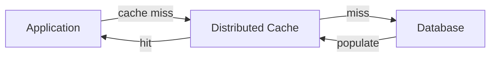
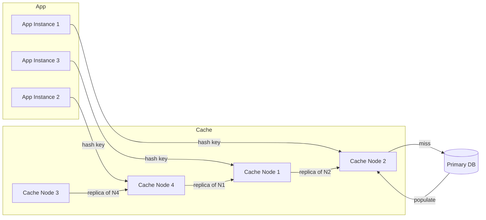
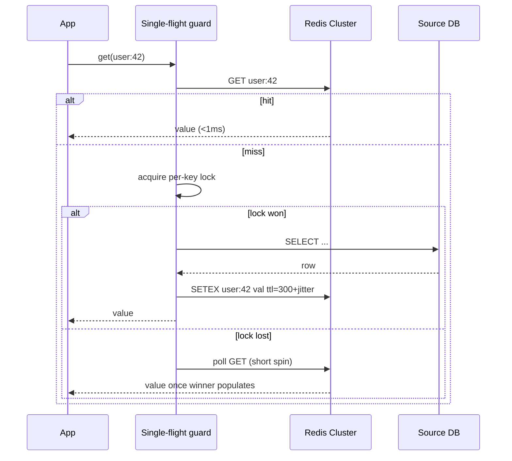
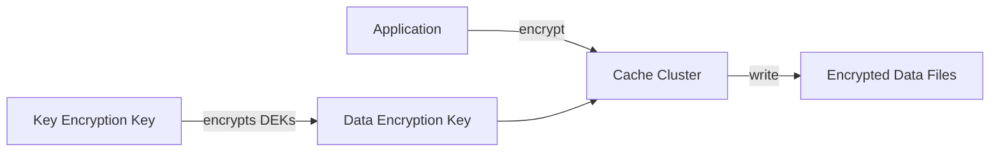
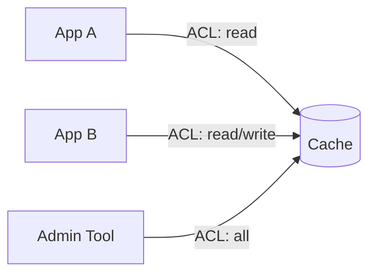
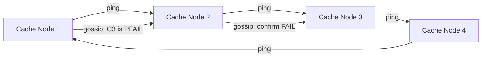
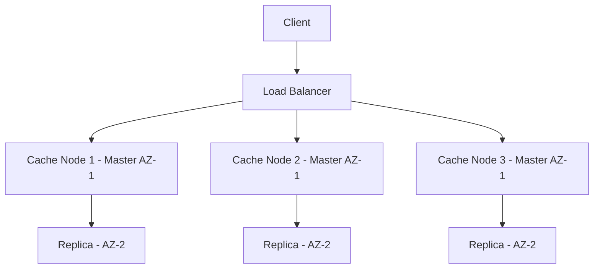
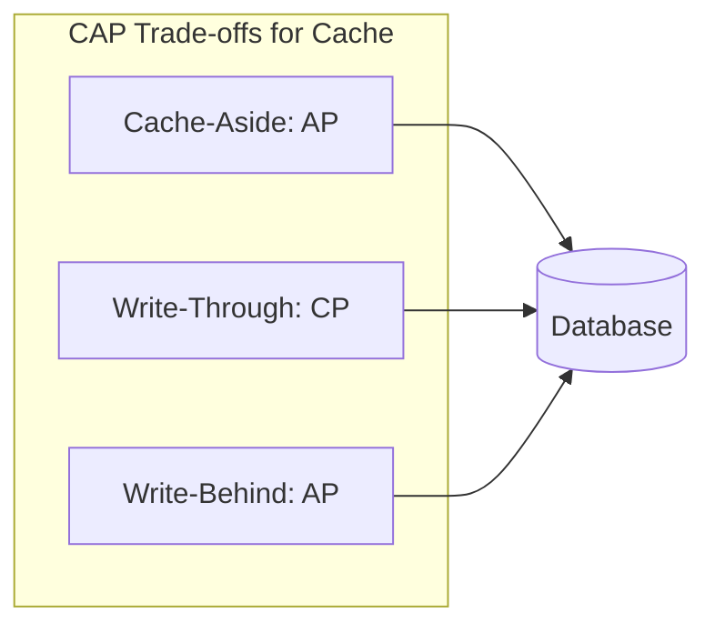
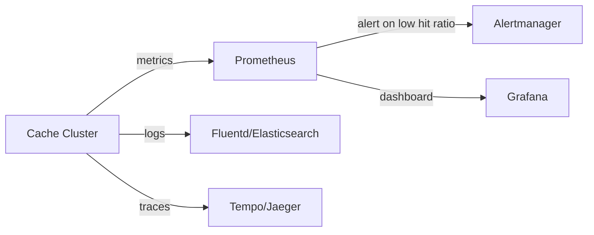

# Design Distributed Cache

## Blogs and websites

## Medium

## Youtube

---

## Theory

### What Is It?

A distributed cache is an in-memory key-value store spread across multiple machines that provides low-latency data access for read-heavy workloads. It sits between the application layer and the primary data store (database), acting as a high-speed buffer for frequently accessed data.

### Why Does It Exist?

A cache trades memory for latency — keep copies of expensive-to-compute or slow-to-fetch data close to the consumer. It works only because real workloads exhibit **locality of reference** — a small fraction of keys absorbs most traffic (typically 80/20 or worse). If access were uniform, every byte of cache would be wasted; with skew, a 10% memory footprint can absorb 90%+ of reads.

The economics: RAM costs ~10–100× more per GB than SSD/disk but is ~100–1000× faster in access latency. Caching buys back latency at RAM prices *for the hot subset* — which is why capacity planning always starts with measuring the actual key-access distribution, never with guessing.

### What Problem Does It Solve?

* **Latency mismatch**: databases (disk-based) serve reads in milliseconds; applications and users expect sub-millisecond responses. A cache sits in RAM, bridging the gap for hot data.
* **Throughput ceiling**: a single database instance can only handle so many concurrent reads; a distributed cache scales horizontally across nodes to serve 100K+ ops/sec.
* **Hot-spot relief**: popular keys (homepage product listings, session tokens, rendered pages) overwhelm individual database rows. Distributing these keys across cache nodes with consistent hashing balances load.
* **Cost efficiency**: serving reads from RAM is far cheaper per-request than scaling database read replicas, which still carry disk I/O and connection overhead.
* **Availability during partial failure**: a cache with replication can serve stale or degraded data when the primary database is slow or unavailable, improving user experience during brownouts.

### Topics Covered

1. [What Is It?](#what-is-it)
2. [Why Does It Exist?](#why-does-it-exist)
3. [What Problem Does It Solve?](#what-problem-does-it-solve)
4. [Introduction and Problem Statement](#introduction-and-problem-statement)
5. [Functional Requirements](#functional-requirements)
6. [Non-Functional Requirements](#non-functional-requirements)
7. [Capacity Estimation](#capacity-estimation)
8. [Why Caching Exists](#why-caching-exists)
9. [Data Partitioning](#data-partitioning)
10. [Cache Eviction Policies](#cache-eviction-policies)
11. [Replication Strategies](#replication-strategies)
12. [Write Strategies](#write-strategies)
13. [Consistency With the Source of Truth](#consistency-with-the-source-of-truth)
14. [Expiration Mechanations](#expiration-mechanations)
15. [Handling Failures](#handling-failures)
16. [Key Design Decisions](#key-design-decisions)
17. [Characteristics](#characteristics)
18. [Components](#components)
19. [Architectural Patterns](#architectural-patterns)
20. [Benefits](#benefits)
21. [Pros](#pros)
22. [Cons](#cons)
23. [Challenges](#challenges)
24. [Best Practices](#best-practices)
25. [When to Use](#when-to-use)
26. [Use Cases](#use-cases)
27. [API Design and Contract](#api-design-and-contract)
28. [Data Model and API](#data-model-and-api)
29. [High-Level Design](#high-level-design)
30. [Deep Dive](#deep-dive)
31. [Encryption and Key Management](#encryption-and-key-management)
32. [Authentication and Authorization](#authentication-and-authorization)
33. [Failure Detection and Membership](#failure-detection-and-membership)
34. [High Availability and Scalability](#high-availability-and-scalability)
35. [Performance and Optimization](#performance-and-optimization)
36. [CAP Theorem and Consistency Trade-offs](#cap-theorem-and-consistency-trade-offs)
37. [Security Threats and Mitigations](#security-threats-and-mitigations)
38. [Observability and Logging](#observability-and-logging)
39. [Real-World Implementations](#real-world-implementations)
40. [Java and Spring Boot Implementation Guide](#java-and-spring-boot-implementation-guide)
41. [Interview Questions and Answers](#interview-questions-and-answers)

---

### Introduction and Problem Statement

A distributed cache is an in-memory key-value store spread across multiple machines that provides low-latency data access for read-heavy workloads. It sits between the application layer and the primary data store (database), acting as a high-speed buffer for frequently accessed data.



*Diagram: Cache-aside interaction. On a cache hit, the application reads directly from the cache (sub-millisecond). On a miss, the cache misses and the application falls back to the database, then populates the cache for subsequent reads.*

**Problem Statement:** Design a distributed caching system like Redis or Memcached that provides low-latency key-value storage across multiple nodes with high availability, horizontal scalability, and graceful degradation when individual nodes or entire regions fail.

**Why caching exists:** A cache trades memory for latency — keep copies of expensive-to-compute or slow-to-fetch data close to the consumer. It works only because real workloads exhibit **locality of reference** — a small fraction of keys absorbs most traffic (typically 80/20 or worse). If access were uniform, every byte of cache would be wasted; with skew, a 10% memory footprint can absorb 90%+ of reads.

**The economics:** RAM costs ~10–100× more per GB than SSD/disk but is ~100–1000× faster in access latency. Caching buys back latency at RAM prices *for the hot subset* — which is why capacity planning always starts with measuring the actual key-access distribution, never with guessing.

---

### Functional Requirements

- GET / SET / DELETE operations on key-value pairs
- TTL (time-to-live) expiration
- Support multiple data types (string, list, set, hash, sorted set)
- Pub/Sub messaging
- Atomic operations (INCR, DECR, CAS)
- Cache eviction policies (LRU, LFU, TTL)
- Key tagging and namespacing

---

### Non-Functional Requirements

| Requirement | Target |
|---|---|
| **Latency** | Single-node: <1 ms; Distributed: <5 ms p99 |
| **Throughput** | 100K+ operations/second per node |
| **Availability** | 99.99% (four nines) |
| **Scalability** | Horizontal scaling to petabytes |
| **Durability** | Optional persistence (AOF, RDB snapshots) |
| **Hot path latency** | Sub-millisecond cache hits under all load |

---

### Capacity Estimation

For a typical e-commerce platform serving 10M DAU with cached product data and sessions:

**Request volume:**
- 10M DAU × 100 API calls each = 1B API calls/day
- Assume 80% read hits → 800M cache reads/day, 200M DB reads/day
- Read rate: ~9,200 reads/sec average, ~30K reads/sec peak
- Write rate: ~2,300 writes/sec average (cache population after DB writes)

**Memory sizing:**
- Average cache value size: 2 KB
- Working set (hot 20%): 10M unique keys × 2 KB = ~20 GB
- With replication factor 2: ~40 GB RAM per region
- Safety margin (30%): ~52 GB RAM

**Network:**
- Cache hit: 9K rps × 4 KB = ~36 MB/s ingress
- Cache miss + DB round-trip: additional latency, but lower volume (200M/day = ~2,300/sec)
- Redis Cluster with 6 nodes (3 primary, 3 replica): each node handles ~1,500 ops/sec

**Scaling out:**
- Add nodes when per-node CPU > 60% or memory > 70%
- Consistent hashing minimizes rebalancing impact (~1/N keys need migration per node addition)
- For 100B keys: need ~16,384 slots across 64+ nodes — standard Redis Cluster supports this

---

### Why Caching Exists

A cache trades memory for latency: keep copies of expensive-to-compute or slow-to-fetch data close to the consumer. It works only because real workloads exhibit **locality of reference** — a small fraction of keys absorbs most traffic (typically 80/20 or worse). If access were uniform, every byte of cache would be wasted; with skew, a 10% memory footprint can absorb 90%+ of reads.

The economics: RAM costs ~10–100× more per GB than SSD/disk but is ~100–1000× faster in access latency. Caching buys back latency at RAM prices *for the hot subset* — which is why capacity planning always starts with measuring the actual key-access distribution, never with guessing.

**Cache hit ratio economics:**

| Scenario | Hit Ratio | Effective Latency | ROI on Cache Memory |
|---|---|---|---|
| Perfect cache (100% hits) | 100% | 0.1 ms | Maximum |
| Good cache (95% hits) | 95% | 0.15 ms avg | High |
| Poor cache (80% hits) | 80% | 2.2 ms avg | Marginal |
| No cache | 0% | 10 ms avg | N/A |

The inflection point is typically 85–90% — below that, cache overhead may exceed the benefit.

---

### Data Partitioning

**Consistent Hashing:**
```
hash(key) → position on hash ring → find next node clockwise

Virtual nodes: Each physical node = 100-200 virtual nodes
  → Even distribution
  → Minimal rebalancing when nodes join/leave
```

Consistent hashing places nodes and keys on a logical ring (0–2^160). Both nodes and keys are hashed to positions on the ring. A key is stored on the next node clockwise from its position.

**Key routing:**
```
Client library computes: node = hash(key) % N
  or
Proxy layer routes request to correct shard
```

Two approaches:
1. **Client-side routing**: The client library computes the hash and knows the ring topology. It connects directly to the correct node. Lower latency (no proxy hop) but requires client library updates when topology changes.
2. **Proxy routing**: A proxy layer (like Twemproxy) handles routing. Clients connect to the proxy uniformly. Easier to manage but adds a hop.

**Partitioning strategies:**

| Strategy | How it works | Pros | Cons |
|---|---|---|---|
| **Hash partitioning** | `hash(key) % N` | Simple, even distribution | N*1 keys remapped when nodes change |
| **Consistent hashing** | Ring with virtual nodes | ~1/N keys remapped | More complex implementation |
| **Range partitioning** | Keys assigned by range | Efficient range scans | Hotspots at hot ranges |
| **Directory-based** | Central directory maps keys to nodes | Flexible | Single point of failure |

---

### Cache Eviction Policies

```
LRU (Least Recently Used):
  Doubly-linked list + HashMap
  - Access: move to head → O(1)
  - Evict: remove tail → O(1)

LFU (Least Frequently Used):
  Frequency counter + min-heap
  - Better for hot/cold data
  - More complex

TTL (Time-To-Live):
  Lazy expiration: check on access
  Active expiration: periodic scan of expiring keys (10% sample)
```

**LRU (Least Recently Used):**
Evicts the least recently accessed item. Uses a doubly-linked list (most recent at head, least at tail) plus a hash map for O(1) lookups. Every access moves the item to the head. Eviction removes from the tail.

*When to use*: General purpose, works well when recent access predicts future access.
*Limitation*: A one-time scan of 100M cold keys can flush the entire working set.

**LFU (Least Frequently Used):**
Counts access frequency and evicts the least frequently accessed. Uses a frequency-decay mechanism to account for changing access patterns over time.

*When to use*: Workloads where frequency is a better predictor than recency (e.g., hot keys that don't change often).
*Limitation*: Stale hot keys (former viral content) can block newer hot keys.

**TTL (Time-To-Live):**
Expired keys are evicted regardless of access pattern. Combined with LRU/LFU as the primary eviction within the TTL constraint.

*When to use*: When data has a natural expiration (sessions, temporary computations).
*Limitation*: Requires careful TTL tuning; too short reduces effectiveness, too long wastes memory.

**Modern approach — TinyLFU:**
Combines a tiny LRU for admission filtering with a count-min sketch for frequency estimation, and an LRU for eviction. This provides scan resistance (unlike pure LRU) and frequency-awareness (unlike pure LRU), while maintaining O(1) complexity.

---

### Replication Strategies

```
1. Leader-Follower (Redis default):
   Write → Primary → async replicate → Replicas
   Read → Any replica (read scaling)
   Failover: Sentinel promotes replica to primary

2. Leaderless (Memcached style):
   No replication — data on single node
   Lost on node failure
   Simple, fast, used when cache-miss is acceptable
```

**1. Leader-Follower (Primary-Replica):**
- Writes go to the primary node
- Primary asynchronously replicates to N replicas
- Reads can be served from any replica (read scaling)
- On primary failure, a replica is promoted (by Sentinel or Redis Cluster)

*Trade-offs*: Async replication means replicas may lag (eventual consistency). Network partitions can cause split-brain without quorum-based promotion.

**2. Quorum-based (Dynamo-style):**
- Each key is written to N nodes (replication factor)
- Reads query N nodes and return the most recent version (R+W > N for strong consistency)
- No single primary — any node can accept writes

*Trade-offs*: Higher consistency but more complex conflict resolution (vector clocks, last-write-wins). Higher latency due to coordination.

**3. Multi-primary (active-active):**
- Multiple nodes accept writes simultaneously
- Conflicts resolved via vector clocks or CRDTs

*Trade-offs*: Highest availability and write throughput but requires conflict resolution.

---

### Write Strategies

```
Write-Through:
  App → Cache → DB (synchronous)
  Pro: Cache always consistent
  Con: Higher write latency

Write-Behind (Write-Back):
  App → Cache → (async) → DB
  Pro: Low write latency
  Con: Data loss risk if cache fails before DB write

Cache-Aside (most common):
  Read: App checks cache → miss → read DB → populate cache
  Write: App writes DB → invalidate cache
```

**Cache-Aside (Lazy Loading):**
The application manages cache population and invalidation explicitly. On a read, the app checks the cache first; on a miss, it reads from the database and populates the cache. On a write, the app writes to the database and invalidates the cache entry.

*When to use*: Default choice — read-heavy workloads with tolerant staleness.
*Advantages*: Only-used data is cached; DB outage degrades to cache-only serving.
*Disadvantages*: Miss penalty (3 round-trips); the invalidation race condition.

**Read-Through:**
The cache itself owns the backing-store interaction. The application sees a single facade. The cache loads data on miss automatically.

*When to use*: Platform teams standardizing access; libraries like Hazelcast/Ignite implement natively.
*Advantages*: Simpler app code; consistent policies.
*Disadvantages*: Cache product coupled to schema.

**Write-Through:**
Writes go synchronously to both the cache and the database. The cache is always consistent with the database.

*When to use*: When strong read-after-write consistency is needed.
*Advantages*: Cache always has latest data; no invalidation needed.
*Disadvantages*: Higher write latency (must wait for both DB and cache); write amplification.

**Write-Behind (Write-Back):**
Writes go to the cache only; an asynchronous flusher batches writes to the database.

*When to use*: Write-heavy telemetry/counters where losing ≤N seconds is acceptable.
*Advantages*: Absorbs write bursts, batch amortization.
*Disadvantages*: Data-loss window if cache fails before flush; complexity of flush ordering/retries.

**Write-Around:**
Writes go directly to the database, bypassing the cache. The cache is only populated on reads.

*When to use*: Workloads with few re-reads of recently written data.
*Advantages*: No stale data in cache for written keys; simple.
*Disadvantages*: First read after write always misses the cache.

---

### Consistency With the Source of Truth

The cache-aside contract ("write DB, invalidate cache") has known races:

```
R1: read miss → fetch old value from DB
W1: write new value to DB → invalidate cache
R1: (late) writes OLD value into cache
→ stale until next TTL
```

This is the **cache invalidation race** — the most dangerous consistency problem in cache-aside patterns. It happens when a read misses the cache, fetches stale data from the DB (before a concurrent write completes), and then populates the cache with the stale data.

**Mitigations:**

1. **Short TTLs as backstop** — even if a stale value gets cached, it expires quickly.
2. **Versioned keys** — include data version in the cache key (e.g., `user:42:v3`), so stale writes target dead keys and don't corrupt the active key.
3. **Distributed lock** — use a lock during the DB read + cache populate phase. Only one reader populates the cache for a given key; others wait and then read from the cache.
4. **Delay-double-delete** — delete the cache entry, write to DB, wait a short period, then delete again. This catches stale values that were written to the cache between the first delete and the DB write.
5. **Accept brief staleness** — where business allows, treat the cache as eventually consistent with the DB.

**Perfect cache/DB consistency without synchronous coupling is impossible** — you must pick the staleness budget deliberately.

**Cache consistency patterns:**

| Pattern | Consistency | Latency | Complexity |
|---|---|---|---|
| Cache-aside (invalidate on write) | Eventual (race window) | Low | Medium |
| Read-through / Write-through | Strong | Medium | High |
| Write-behind | Eventual | Low | High |
| Versioned keys | Strong | Low | Low-Medium |

---

### Expiration Mechanations

**Lazy expiration**: on access, check TTL; expired → treat as miss and reclaim. Zero background cost but stale keys consume memory until touched.

**Active expiration**: background job samples keys with TTL set (Redis samples ~10 per 100ms loop, escalating if >25% sampled were expired). Bounds memory growth for write-then-never-read workloads.

Production systems rely on the combination; misjudging this is a classic memory-leak-by-TTL bug (millions of never-revisited session keys).

**TTL strategies:**

| Strategy | Description | Use Case |
|---|---|---|
| **Fixed TTL** | All keys expire after same duration | Simple, predictable |
| **Jittered TTL** | Random ±10–30% of base TTL | Prevents expiration storms |
| **Sliding TTL** | TTL resets on each access | Active sessions |
| **Absolute TTL** | Expires at fixed time regardless of access | Time-sensitive data |

**Expiration best practices:**
- Always set TTLs — eternal keys are future incidents
- Jitter expirations to prevent synchronized mass-expiration
- Monitor expiration rate and adjust TTLs based on access patterns

---

### Handling Failures

| Failure | Solution |
|---|---|
| Node crash | Failover to replica (Sentinel/Cluster) |
| Network partition | Split-brain protection (quorum-based) |
| Hot key | Local cache + key replication to multiple nodes |
| Thundering herd | Request coalescing / cache stampede lock |
| Cache avalanche | Multiple TTLs, circuit breaker, fallback to DB |
| Cache penetration | Bloom filter or negative caching |
| Redis OOM | Eviction policy, memory limits per use case |

**Thundering herd / cache stampede**: When a cached item expires, thousands of concurrent requests may miss the cache simultaneously and all hit the database. Mitigations:
1. **Request coalescing (single-flight)**: Per-key mutex — one request loads, others await result
2. **Probabilistic early refresh (XFetch)**: Proactively refresh keys before they expire, with randomization
3. **Serve stale while revalidate**: Return stale data immediately while refreshing in background

**Cache avalanche**: When many keys expire simultaneously (or a cache cluster fails entirely), the entire load falls to the database, potentially cascading to a full outage. Mitigations:
1. **TTL jitter**: Randomize expiration times
2. **Tiered caching**: L1 (in-process) + L2 (distributed) + CDN
3. **Circuit breaker**: Temporarily fail-open to serve degraded responses
4. **Rate limiting**: Throttle requests when DB is overwhelmed

**Cache penetration**: Attackers (or bugs) request non-existent keys repeatedly, bypassing the cache entirely and hammering the database. Mitigations:
1. **Negative caching**: Cache "NOT FOUND" results with short TTLs
2. **Bloom filter**: Probabilistic data structure to check if a key might exist before querying the DB
3. **Rate limiting**: Per-key rate limiting for hot missing keys

---

### Key Design Decisions

| Decision | Choice | Reason |
|---|---|---|
| Partitioning | Consistent hashing | Minimal rebalancing |
| Replication | Async leader-follower | Low write latency |
| Eviction | LRU (default) | Simple, effective |
| Persistence | Optional AOF + RDB | Durability when needed |
| Protocol | RESP (Redis protocol) | Simple, fast text protocol |
| Node communication | Gossip protocol | No single point of failure |
| Failure detection | Phi accrual | Adaptive, no fixed timeouts |
| Serialization | Binary+JSON hybrid | Efficient yet debuggable |

---

### Characteristics

- **Latency-first design**: every decision (in-memory storage, pipelined protocols, no joins) serves sub-millisecond responses; p99 matters more than averages because caches sit on hot paths.
- **Ephemeral by contract**: any key may vanish at any time (eviction, expiry, failover) — applications must treat cache misses as normal, not exceptional. Systems that *require* cache presence are using it wrongly.
- **Skew-exploiting**: value derives from locality of reference; monitoring hit ratio is monitoring the workload's skew shape.
- **Bounded memory with admission control**: eviction policy is effectively an online algorithm deciding which objects deserve RAM; LFU/admission filters improve on pure recency for scan-resistant workloads.
- **Shared-nothing partitioning + optional replication**: horizontal scale via consistent hashing; durability via replicas only where warm-failover matters.
- **Protocol efficiency**: text/binary protocols optimized for many-small-commands; batching (MGET/pipelines) often matters more than single-op latency.

**Detailed characteristic explanations:**

**Ephemeral by contract** — Unlike a database, a cache makes no durability guarantee. A node can crash, an OOM event can trigger mass eviction, or a network partition can isolate a shard. Applications must always handle cache misses gracefully and fall back to the source of truth. Treating cache presence as a requirement is an anti-pattern that leads to brittle systems.

**Skew-exploiting** — The cache's value is directly proportional to the access distribution's skewness. An 80/20 distribution means 20% of keys account for 80% of traffic. A well-tuned cache with 20% memory utilization can serve 80% of reads at cache-speed. This is why capacity planning starts with measuring key-access frequency (Zipfian distribution analysis), not guessing.

**Shared-nothing partitioning** — Each node owns an independent partition of the keyspace. No coordination is needed for single-key operations. Cross-partition operations (multi-key) require either hash-tagging for co-location or distributed transactions — both have costs.

---

### Components

- **Cache nodes**
  *Purpose*: store partitions of keyspace in RAM. *Responsibilities*: command execution (single-threaded event loop in Redis — atomicity for free), TTL bookkeeping, eviction under pressure, persistence threads if enabled. *Relationship*: members of hash ring; primaries own writes, followers serve reads. *Example*: Redis Cluster shards; ElastiCache nodes.

- **Client library / smart client**
  *Purpose*: routing + resilience at call site. *Responsibilities*: slot/ring calculation, connection pooling, MOVED/ASK redirect handling (Redis Cluster), retry/topology-refresh logic. *Relationship*: removes need for proxy hop in most deployments. *Example*: Lettuce/Jedis, Memcached clients with ketama hashing.

- **Proxy tier (optional)**
  *Purpose*: centralize routing/multi-tenancy. *Responsibilities*: consistent-hash routing, protocol translation, per-app quotas, metrics aggregation. *Example*: Twemproxy/Cortex-style fronting for fleets that can't upgrade all clients.

- **Replication/failover controller**
  *Purpose*: keep copies, promote on failure. *Responsibilities*: async replication streams, health probing, quorum-based promotion (Sentinel) or gossip slots (Cluster). *Example*: Redis Sentinel trios managing primary-replica pairs.

- **Persistence subsystem**
  *Purpose*: recover state after restarts. *Responsibilities*: fork-based RDB snapshots (point-in-time compact) vs AOF append log (fsync-policy configurable: always/everysec/never). *Trade-off note*: `everysec` bounds loss to ~1 s while keeping latency sane.

- **Eviction engine**
  *Purpose*: enforce memory ceiling. *Responsibilities*: approximate-LRU sampling (Redis samples N keys rather than maintaining exact list — O(1) with tiny footprint), LFU counters with decay, volatile-vs-allkeys scope selection.

```mermaid
flowchart TB
    APP[Application] --> CL[Smart client]
    CL -->|hash(key)| P1[Node 1 primary]
    CL -->|hash(key)| P2[Node 2 primary]
    P1 -->|async| R1[Node 1 replica]
    P2 -->|async| R2[Node 2 replica]
    SENT[Sentinel / cluster bus] -.monitors/promotes.- P1
    SENT -.-> P2
    P1 -.AOF/RDB.-> DISK[(Persistent volume)]
```

*Diagram: Distributed cache architecture. Applications connect through smart clients that compute the hash ring and route directly to the correct node. Primary nodes handle writes and asynchronously replicate to replicas. Sentinel or cluster bus monitors node health and handles failover. Optional persistence (AOF/RDB) writes to disk for recovery.*

**Component interaction flow:**
1. **App** calls the smart client with a `GET key` operation
2. **Smart client** hashes the key, determines the primary node, and routes the request
3. **Primary node** checks its in-memory hash table; if found and not expired → return value
4. **Primary node** replicates the write to replicas asynchronously
5. **Sentinel/cluster bus** monitors health; on primary failure, promotes a replica
6. **Persistence** writes snapshots/logs for crash recovery

---

### Architectural Patterns

- **Cache-aside (lazy loading)**
  *What*: app queries cache first; on miss reads DB then populates cache with TTL. *Solves*: keeping cache populated only with actually-demanded data. *When*: default choice — read-heavy workloads with tolerant staleness. *Not when*: strict read-after-write consistency required. *Advantages*: only-used data cached; DB outage degrades to cache-only serving. *Disadvantages*: miss penalty (3 round-trips); the invalidation race above.

- **Read-through / write-through**
  *What*: cache itself owns the backing-store interaction; app sees one facade. *When*: platform teams standardizing access; libraries like Hazelcast/Ignite implement natively. *Pros*: simpler app code; consistent policies. *Cons*: cache product coupled to schema.

- **Write-behind (write-back)**
  *What*: writes land in cache; async flusher batches to DB. *When*: write-heavy telemetry/counters where losing ≤N seconds is acceptable. *Pros*: absorbs write bursts, batch amortization. *Cons*: data-loss window; complexity of flush ordering/retries.

- **Request coalescing (single-flight)**
  *Problem*: popular key expires → 10K concurrent misses hammer DB. *How*: per-key mutex — one request loads, others await result (in-process map or Redis SETNX lock + double-check). *Real-world*: essential for viral content; pairs with jittered TTLs (TTL ± random%) so mass-expiry can't synchronize.

- **Negative caching**
  *Problem*: repeated lookups of nonexistent IDs (scanners, deleted entities) bypass cache entirely. *How*: cache sentinel "NOT_FOUND" values with shorter TTL. *Pros*: shields DB from penetration attacks. *Cons*: must invalidate promptly when entity later exists.

- **Tiered caching (L1 local + L2 distributed)**
  *L1* = Caffeine in-process (\u00b5s); *L2* = Redis cluster (ms). Invalidation via pub/sub broadcasts. *Pros*: removes network hop for hottest keys. *Cons*: consistency window widens; memory duplicated per instance.

---

### Benefits

- **Orders-of-magnitude latency reduction** (100 ms DB → <1 ms cache): directly improves user experience and system throughput headroom.
- **Database load shedding** enables smaller DB fleets for the same traffic — frequently the cheapest scaling lever available.
- **Burst absorption**: flash crowds hit cache tier (elastic, cheap) instead of rigid DB capacity.
- **Atomic primitives unlock patterns**: INCR-based rate limiting, SETNX locks, sorted-set leaderboards without building coordination services.
- **Cross-service shared state** (sessions, feature flags) with uniform low latency regardless of app-instance count.

**Quantified benefit example:**
A typical e-commerce product-detail page takes 80 ms to render from database (3 SQL queries + template rendering). With a distributed cache for product data, the same page renders in 2 ms (1 cache GET + template rendering). That's a 40× improvement — the difference between a good UX and an abandoned cart.

---

### Pros

- Simplest high-impact performance tool in the box; often days-not-months to adopt.
- Horizontal scaling well understood (consistent hashing is solved science).
- Rich data structures (Redis) eliminate whole microservices worth of code.
- Graceful degradation semantics: cache down ⇒ slower, not broken (if designed correctly).
- Atomic operations available natively (INCR, SETNX, HSET) — no need for locks in the application layer.

### Cons

- **Staleness window inherent** to async invalidation — unsuitable as source of truth.
- **Loss-on-restart** unless persistence configured; even then, recent writes may vanish.
- **Memory economics**: expensive per GB; unbounded value sizes quietly destroy node budgets (enforce max-value-size).
- **Operational sharp edges**: split-brain promotions losing writes, hot-key melting one shard, migration resharding pain (Redis Cluster slot migrations).
- **Hidden application complexity**: stampede guards, negative caching, tier invalidation — each adds failure modes that must be tested.
- **Network hop cost**: distributed cache adds 1 RTT per miss vs. in-process cache.

---

### Challenges

- **Technical**: the cache-invalidation race (shown above); atomic multi-key ops across shards (hash-tags `{user123}` co-location trade-offs); large-value splitting.
- **Scalability**: hot keys concentrating on one shard (mitigations: replicate hot key across N nodes with client-side random pick, split counter into sub-keys summed at read); resharding live traffic.
- **Performance**: big-value latency spikes blocking single-threaded loops (protocol splits/lazy-free options); GC on JVM-managed proxies.
- **Reliability**: failover losing tail writes accepted explicitly; flapping primaries causing thundering reconnections (client backoff mandatory).
- **Maintainability**: TTL hygiene audits (orphaned keys), naming conventions/versioned prefixes for safe schema evolution.
- **Operational**: memory fragmentation monitoring (`activedefrag`), slowlog reviews, replication-lag alerting.
- **Security**: historically weak auth defaults — enable TLS+ACLs, isolate network paths, never expose cache ports publicly (memcached amplification attacks were a DDoS chapter of their own).

**Challenge deep-dives:**

**Hot key problem**: A key receiving disproportionate traffic (e.g., a viral product page, a global counter) can overwhelm a single shard even if the cluster as a whole has ample capacity.

*Solutions*:
1. **Key splitting**: Split `counter:global` into `counter:global:0`, `counter:global:1`, ... `counter:global:N` — write to a random shard, sum at read.
2. **Replication**: Store the hot key on multiple nodes; clients pick randomly among them for reads.
3. **Local caching**: Cache the hot key in-process for a short TTL, reducing even the cache-cluster hit.
4. **Rate limiting**: Reject or queue requests exceeding the key's capacity.

**Cache stampede**: When a key expires, all concurrent requests miss the cache and hit the database simultaneously.

*Solutions*:
1. **Single-flight (request coalescing)**: Only one request loads the data; others wait for the result.
2. **Probabilistic early refresh**: Refresh keys before they expire, with random jitter.
3. **Exponential backoff**: Retry with increasing delay.
4. **Grace mode**: Serve stale data while asynchronously refreshing.

**Operational complexity**: Managing Redis/Sentinel/Cluster is non-trivial — network partitions, failover events, resharding, memory fragmentation, slow commands, replication lag.

*Solutions*: Use managed services (AWS ElastiCache, GCP Memorystore, Azure Cache for Redis) when possible; implement comprehensive observability; automate failover drills.

**Security exposure**: Cache tiers have historically weak authentication defaults and are not always on isolated networks.

*Solutions*: Enable TLS for all connections; configure ACLs (Redis 6+) to restrict commands per client; never expose cache ports to the internet; use VPC peering or private endpoints.

---

### Best Practices

- **Always set TTLs** — eternal keys are future incidents; exceptions require explicit review.
- **Jitter expirations and pre-warm predictable hot sets** before events; combine with single-flight locks.
- **Bound value sizes** (e.g., <100 KB typical); large blobs belong in object storage with metadata cached.
- **Monitor hit ratio per key-class**, not fleet-wide only — a dropping segment reveals regressions before users do.
- **Use hash-tags deliberately** for multi-key atomicity but watch for artificial hotspots.
- **Separate use cases onto separate clusters** (sessions vs rate-limiting vs caching) — blast-radius isolation and independent tuning.
- **Fail-open design**: timeouts + circuit breakers so cache outages degrade to origin, never hard-fail requests that could still be served slowly.
- **Version key namespaces** (`v2:user:{id}`) enabling clean flushes during deploys/format changes.

**Detailed best-practice explanations:**

**Always set TTLs**: Without TTLs, cache entries live forever until evicted by memory pressure. This leads to unpredictable eviction patterns, memory bloat, and stale data that never refreshes. Set TTLs based on the data's volatility — 5 minutes for live counters, 24 hours for product names, 30 minutes for user sessions.

**Jitter expirations**: If 10,000 keys all have the same TTL of 3600 seconds, they'll all expire at the same time, causing a thundering herd. Add ±10-30% jitter so expirations are spread out.

**Bound value sizes**: Large values (e.g., a 5 MB JSON blob) block the single-threaded event loop during serialization and network transfer. Enforce a max-value-size at the application layer; offload large blobs to object storage.

**Fail-open design**: When the cache cluster is unreachable, applications should fall back to the database (slower but correct), not fail outright. Use circuit breakers with fast fail-open after N consecutive timeouts.

---

### When to Use

**Use when**: read-heavy skewed workloads; computed values expensive to regenerate (aggregations, rendered fragments); cross-request state sharing needed; DB approaching read capacity.

**Avoid/limit when**: strong consistency required per read (use DB or sync-through designs); access pattern uniform (hit ratio won't justify cost); dataset fits in DB buffer pool anyway (double-caching wastes RAM); write-heavy with immediate-read-after-write semantics (invalidation churn dominates).

**Alternatives**: materialized views/pre-aggregations for fixed query shapes; CDN edge caching for static/global content; in-process caches alone for single-instance apps; read replicas when staleness tolerance is zero.

**Decision inputs**: measured access distribution (Zipfian?), staleness budget, invalidation pathway ownership, ops maturity for another stateful tier.

**When NOT to cache:**
1. Data with uniform access distribution (no locality) — cache hit ratio will be near-zero
2. Write-heavy workloads where invalidation churn exceeds the read benefit
3. Data that must be strongly consistent on every read
4. Small datasets that fit entirely in the database's buffer pool

---

### Use Cases

- **Session storage for web fleet**
  *Problem*: sticky sessions kill elasticity. *Solution*: sessions in Redis keyed by SID, 30-min sliding TTL; any app instance serves any user. *Trade-off*: one more dependency on login path — mitigate with multi-AZ replication.

- **Rate limiting**
  *Problem*: enforce API quotas across horizontally scaled gateways. *Solution*: `INCR key:{clientId}:{window}` + `EXPIRE` atomically via Lua; deterministic windows or token-bucket hashes. *See* dedicated rate-limiter topic for deep dive.

- **Leaderboards/counters**
  *Problem*: realtime ranked lists under heavy concurrent updates. *Solution*: Redis sorted sets — O(log N) inserts, range queries by rank; sharding by score-bucket for extreme scale. *Example*: game leaderboards, trending topics.

- **Distributed locks**
  *Problem*: coordinating access to a shared resource across multiple services. *Solution*: Redis `SET key value NX PX ttl` — if the key doesn't exist (NX), it's created with a TTL (PX). The client that holds the key has the lock. *Trade-off*: network partitions can cause lock loss; Redlock algorithm adds safety but complexity.

- **Cache warming before product launches**
  *Problem*: launching a new product page that will be hit by thousands of users simultaneously. *Solution*: pre-populate the cache with product data, set long TTLs, and use jittered expirations. *Trade-off*: stale data risk if product info changes before TTL expires.

---

### API Design and Contract

A distributed cache exposes a key-value API with rich data structures, atomic operations, and optional persistence. The most common interface is the Redis Serialization Protocol (RESP), though Memcached uses a simpler text protocol.

**Core API endpoints (Redis-style):**

| Command | Description | Atomicity |
|---|---|---|
| `GET key` | Retrieve value by key | Atomic |
| `SET key value [EX seconds]` | Store value with optional TTL | Atomic |
| `SET key value NX [EX seconds]` | Set only if key doesn't exist | Atomic (CAS) |
| `DEL key [key...]` | Delete one or more keys | Atomic (per key) |
| `EXISTS key [key...]` | Check if key(s) exist | Atomic |
| `INCR key` | Increment integer value by 1 | Atomic |
| `DECR key` | Decrement integer value by 1 | Atomic |
| `HSET key field value` | Set hash field | Atomic |
| `HGETALL key` | Get all hash fields | Atomic |
| `LPUSH key value` | Prepend to list | Atomic |
| `LRANGE key start stop` | Get list range | Atomic |
| `SADD key member` | Add to set | Atomic |
| `SINTER key [key...]` | Set intersection | Atomic (multi-key) |
| `ZADD key score member` | Add to sorted set | Atomic |
| `ZRANGE key start stop` | Get sorted set range by index | Atomic |
| `EXPIRE key seconds` | Set TTL on key | Atomic |
| `PERSIST key` | Remove TTL from key | Atomic |
| `FLUSHDB` / `FLUSHALL` | Delete all keys | Atomic (blocking) |

**Connection protocol (RESP):**

```text
*3
$3
SET
$3
foo
$5
hello
```

This is a RESP array of 3 bulk strings: `SET`, `foo`, `hello`. The protocol is binary-safe and line-delimited.

**Connection management:**
- Pool connections per thread/worker to avoid TCP handshake overhead
- Pipeline multiple commands to amortize RTT
- Use connection pinning for transactional operations (MULTI/EXEC)

**Error responses:**
- `-ERR wrong number of arguments for 'set' command`
- `-ERR value is not an integer`
- `-NOSCRIPT Map is closed` (cluster reconfiguration)
- `-LOADING Redis is loading the dataset in memory`

**Status responses:**
- `+OK` — command succeeded
- `-ERR` — error occurred
- `:integer` — integer reply (e.g., `1` for EXISTS, incremented value for INCR)
- `$bulk-string` — bulk string reply
- `*array` — array reply (e.g., HMGET, KEYS)

**Configuration and management API:**
- `CONFIG SET maxmemory 2gb` — runtime configuration change
- `CONFIG REWRITE` — persist runtime config to file
- `INFO server` — server statistics and status
- `SLOWLOG GET` — slow query log
- `CLIENT LIST` — connected clients
- `MONITOR` — real-time command stream (debugging only)

**Cluster management endpoints:**
- `CLUSTER NODES` — list all nodes and their roles
- `CLUSTER SLOTS` — hash slot ownership map
- `CLUSTER FAILOVER` — trigger manual failover
- `ASKING` — redirect response for slot migration

**Security considerations in the API contract:**
- Commands like `FLUSHALL` and `CONFIG` should be restricted via ACLs
- `MONITOR` and `DEBUG` commands should never be available in production
- All sensitive operations should require authentication (`AUTH` or TLS client certs)

---

### Data Model and API

Caches model access patterns, not entities:

- **Key taxonomy conventions**: `entity:{id}:field` namespaces; hash-tags `{}` control co-location.
- **Value encodings**: JSON for rich objects (human-debuggable), MessagePack/Protobuf for size, plain strings for simple flags; include schema-version byte for evolution safety.
- **Composite structures**: Redis Hash for partial-field updates (HSET user:42 email …) avoiding read-modify-write races; Sorted Sets encode time-series/rankings natively; Streams provide consumer-group logs inside cache tier.
- **Lifecycle**: TTL per key class documented (session 30 m, tokens 5 m, aggregates 24 h); tombstones/negative entries with distinct shorter TTLs; no foreign-key semantics — referential integrity remains the DB's job.

```mermaid
flowchart LR
    subgraph Keyspace
      S[session:a1f3] --- U[user:42] --- RL[rate:{ip}:2025-08-25] --- LB[leaderboard:global] --- NEG[nf:user:999 -&gt; NOT_FOUND]
    end
```

*Diagram: Representative key classes coexisting with distinct TTL/eviction profiles. Session keys have short sliding TTLs. User profile keys have longer TTLs (cache-aside from DB). Rate-limit keys use counter-based TTLs with atomic INCR. Negative-cache keys (nf:*) store NOT_FOUND sentinels with short TTLs to prevent cache penetration.*

**Data modeling best practices:**

1. **Namespace everything**: Use `service:entity:id:field` format to avoid key collisions across services
2. **Version your keys**: Prefix with `v1:`, `v2:` to enable safe migration
3. **Size-aware design**: Keep values < 100 KB; split large objects into chunks
4. **Use hashes for related fields**: Store `user:42` as a hash with fields `name`, `email`, `avatar` — enables partial updates without full rewrites
5. **Sorted sets for rankings**: `ZADD leaderboard 1000 user:42` — O(log N) insertion, O(log N) rank lookup
6. **Streams for event sourcing**: Use Redis Streams with consumer groups for message queue patterns within the cache tier
7. **Bloom filters for existence checks**: Probabilistically check if a key might exist before a costly DB round-trip

---

## Architecture

### Architectural Style

**Distributed key-value store with consistent hashing ring**: the cache cluster is a ring of nodes where each node owns a range of the keyspace. Consistent hashing minimizes reshuffling when nodes join/leave (only adjacent keys move) and distributes load evenly. Replication is achieved by placing N virtual nodes (vnodes) per physical node around the ring, with the next N successors owning replicas.

**Cache-aside integration pattern**: the application reads from the cache first; on a miss, it fetches from the database and writes the result back. This keeps the cache explicitly controlled by the application and avoids cache-database divergence on writes.



*Diagram: Distributed cache cluster. Applications hash keys to determine which node owns them. On a miss, the node fetches from the primary database and populates itself. Each node has replicas (successors on the ring) for fault tolerance. Consistent hashing ensures minimal key redistribution when nodes join or leave.*

### Component Responsibilities and Communication

| Component | Responsibility | Communication |
|---|---|---|
| Cache Nodes | Store key-value pairs in memory, handle GET/SET/DELETE | Peer-to-peer for replication; application via client protocol |
| Hash Ring Coordinator | Distributes keyspace, tracks node membership | Gossip protocol (SWIM) for membership changes |
| Replicas | Hold copies of primary data for failover | Asynchronous replication; read replicas may serve stale data |
| Eviction Manager | Enforces memory limits via LRU/LFU/TTL | Local to each node; no cross-node coordination |
| Client Library | Hash key → node, handle redirects/failover | Consistent hashing + retry logic |
| Source Database | System of record (cache-aside fill-on-miss) | Cache nodes fetch on miss; application initiates |

**Data flow**: application computes `hash(key)` → determines owning node → GET from that node → on miss, application fetches from DB → SET on cache node → subsequent requests hit cache. Writes go through cache-aside (application writes DB, then deletes cache key to avoid stale writes).

**Scaling strategy**: add nodes to the ring; consistent hashing redistributes ~1/N of keys per node added; rebalance happens in the background via async replication. Read replicas can be added on the same node or dedicated nodes.

**Failure handling**: node failure triggers failover to replicas (next N successors on the ring); clients retry on another replica; read availability degrades gracefully (stale reads) while write availability requires quorum (W+R > N for strong consistency).

## Design

### Design Considerations

The central design question for a distributed cache is: **what consistency model to guarantee, and at what availability/latency cost?** The CAP theorem forces a choice — you cannot simultaneously guarantee consistency, availability, and partition tolerance. A cache prioritizes availability and partition tolerance (AP), offering eventual consistency with tunable read/write quorums. Secondary decisions: cache invalidation strategy (write-through vs write-behind vs cache-aside), eviction policy, replication factor, and hot-key handling.

### Key Decisions

- **Cache-aside (application-managed)**: the application reads cache first; on miss, fetches from DB and populates cache. Writes go to DB then invalidate cache key. *Pro*: cache stays in sync with app logic; *Con*: read-miss penalty, invalidation races possible.
- **Read-through/write-through**: the cache transparently loads from and writes to the DB. *Pro*: simpler application code; *Con*: cache must know the DB integration, harder to tune per-query.
- **Replication factor N with quorum (W+R> N)**: tunable consistency — strong reads (R=N) or fast reads (R=1) depending on use case.
- **Consistent hashing with virtual nodes (vnodes)**: smooth key distribution and minimal rebalancing overhead on topology changes.
- **Probabilistic early expiration + jittered TTL**: prevents synchronized eviction causing cache-stampedes.

### Trade-offs

| Decision | Pro | Con |
|---|---|---|
| Cache-aside | Application controls cache lifecycle | Read-miss penalty; invalidation races |
| Write-through/behind | Automatic consistency | Cache must own DB integration |
| Strong consistency (R=N) | Linearizable reads | Slow, requires all replicas up |
| Eventual consistency (R=1) | Fast, highly available | Stale reads possible |
| Consistent hashing | Minimal rebalancing on node change | Virtual node count must be tuned (too low = skew, too high = overhead) |

### Scalability Considerations

- **Horizontal scale**: add nodes to the ring; consistent hashing redistributes ~1/N of keys per new node.
- **Hot keys**: skew (e.g., `homepage:products`) concentrates on one node — use key tagging/salting or dedicated sub-nodes to spread load.
- **Client-side sharding**: application hashes keys, avoiding a proxy hop; enables true parallel GETs.
- **Multi-tenant isolation**: key prefixes and separate cache clusters prevent noisy-neighbor eviction.

### Reliability Considerations

- **Node failure**: replicas (next N successors on ring) take over; clients retry transparently.
- **Cache stampede**: probabilistic early expiration + single-flight (only one request recomputes a missing key; others wait) prevents thundering herds.
- **Replication durability**: async replication can lose recent writes if the primary node fails before replication — trade-off for latency.
- **Memory pressure**: OOM kills evicted via LRU/LFU before hitting OS limits; `maxmemory-policy` tuning is critical.

### Performance Considerations

- **Memory fragmentation**: Redis uses a malloc-like allocator; fragmented memory can double RAM usage — monitor `mem_fragmentation_ratio`.
- **CPU vs I/O**: Redis is single-threaded per core (network is the bottleneck, not CPU); scale by adding instances rather than cores per instance.
- **Serialization**: optimize value encoding (protobuf/msgpack over JSON); consider compression for large values.
- **Pipeline**: batch multiple operations in one request to amortize round-trip latency.

### Security Considerations

- **No encryption by default**: Redis < 6 had no auth; deploy behind a VPC firewall, enable ACLs, and encrypt in transit (TLS).
- **Command injection via KEYS**: block dangerous commands (`FLUSHALL`, `CONFIG`) in production via rename/deny.
- **Cache poisoning**: validate key construction; avoid user-controlled keys without sanitization (cache key injection).
- **Multi-tenant data isolation**: use key prefixes or separate clusters; shared clusters risk cross-tenant data access if keys collide.

### Maintainability Considerations

- **Memory monitoring**: track hit ratio, eviction rate, and fragmentation ratio; alert on cache-thrashing.
- **Key naming conventions**: enforce a taxonomy (`entity:id:field`) for operability and TTL management.
- **Gradual rollout**: deploy new cache versions to a canary shard first; monitor eviction changes.
- **Backup/restore**: RDB snapshots for disaster recovery; AOF for durability (trade-off: AOF is slower but more durable).

## High-Level Design

Read-path flow with stampede protection:



*Diagram: Cache-aside read flow with single-flight protection. On a cache hit, the value is returned immediately. On a miss, the caller acquires a per-key lock; if it wins, it fetches from the database and populates the cache. Other concurrent callers poll the cache until the value is available.*

**Scaling strategy**: start single primary+replica → Redis Cluster (16384 slots) as data grows; compute-side scale needs no cache changes (smart clients discover topology); multi-region: active-passive with geo-replication for sessions, region-local caches for derived data.

**Failure handling**: primary loss → Sentinel/Cluster promotes replica (seconds); lost-tail-writes accepted for cache semantics; full-cluster loss → circuit breaker opens, traffic flows to DB with autoscaling trigger — degraded but alive.

**Deployment considerations:**
- Cache clusters should be in the same availability zone as application instances for lowest latency
- Use read replicas for read-heavy workloads but be aware of replication lag
- Monitor `evicted_keys/sec` — if consistently high, increase cache size or tune eviction policy
- Set `maxmemory` with an explicit eviction policy (`allkeys-lru`, `volatile-lru`, `allkeys-lfu`, etc.)

---

### Deep Dive

- **Redis internals**: single-threaded command execution (6.x adds threaded I/O) gives per-command atomicity; SDS strings, ziplists/listpacks for small collections, skiplists for sorted sets; event loop multiplexes sockets — why one core handles 100K+ ops/s. The reactor pattern: accept connections on a single thread, use epoll/kqueue for I/O multiplexing, and process commands from the queue sequentially. Threaded I/O (Redis 6.2+) offloads network I/O and background tasks (like RDB generation) to background threads while keeping command processing single-threaded for atomicity.

- **Approximate LRU/LFU**: exact LRU list costs 24+ bytes/key overhead; Redis samples `maxmemory-samples` keys evicting the least-recently-used among them — near-perfect behavior at fraction of memory. LFU uses Morris-like probabilistic counters with periodic decay. The sampling is configurable — increasing `maxmemory-samples` improves eviction accuracy at the cost of slightly higher CPU.

- **Slot migration mechanics**: Cluster moves 16384 slots between nodes via ASK redirects; migrating busy slots throttles throughput — schedule rebalances off-peak; client topology refresh storms after failovers are the classic operational surprise. During migration: node A is `MIGRATING`, node B is `IMPORTING` for the slot; `ASK` redirect tells clients to retry on B; `MOVED` redirect tells clients the slot has permanently moved.

- **Memory accounting**: overhead per key ~50–90 bytes beyond value (dict entries, SDS header, expiry dict) — millions of tiny keys waste GBs; pack small related fields into hashes to amortize. Use `DEBUG MEMORY` and `INFO MEMORY` to track actual usage. Memory fragmentation (`mem_fragmentation_ratio`) occurs when Redis allocates memory in different-sized chunks than the OS — use `activedefrag` to reduce fragmentation.

- **Observability**: track hit ratio, evicted_keys/sec, mem_fragmentation_ratio, replication lag, slowlog outliers, connected-clients vs maxclients; synthetic probes exercising real key classes continuously. Key metrics: `used_memory`, `used_memory_rss`, `keyspace_hits`, `keyspace_misses`, `evicted_keys`, `expired_keys`, `connected_clients`, `blocked_clients`, `rejected_connections`.

- **Persistence internals**: RDB creates point-in-time snapshots via `fork()` — child process writes memory to disk while parent continues serving. `SAVE` is synchronous (blocks all clients), `BGSAVE` is asynchronous. AOF logs every write operation; `fsync` policy controls durability: `always` (every write, safest but slowest), `everysec` (once per second, good balance), `no` (kernel decides, fastest but may lose data). AOF rewriting compresses the log by removing expired/deleted keys.

---

### Encryption and Key Management

A distributed cache may store sensitive data — user sessions, financial information, or
personally identifiable data retrieved from the primary store. Without encryption, a compromised
cache node or a network eavesdropper can access this data.

#### Encryption at Rest

- **OS-level disk encryption**: encrypt the cache node's data directory using LUKS/dm-crypt
  (Linux) or FileVault (macOS). Transparent but encrypts everything with a single key.
- **Application-level encryption**: the cache client encrypts sensitive values before writing
  them to the cache. Each record uses a separate data encryption key (DEK), allowing per-record
  access control and fine-grained key rotation.
- **Managed service encryption**: cloud-managed caches (ElastiCache, Memorystore) provide
  automatic at-rest encryption with KMS-managed keys.


*Cache encryption at rest: the application encrypts sensitive values before caching them.
Each value is encrypted with a DEK, which is itself encrypted by a KEK managed in a KMS/HSM.*

#### Encryption in Transit

- **TLS**: all client-to-cache and cache-to-cache communication uses TLS 1.2+.
- **Mutual TLS (mTLS)**: both client and server present certificates, providing strong
  authentication for inter-cache replication traffic.
- **Certificate management**: certificates are rotated automatically with OCSP/CRL checks.

#### Key Management

- **Key hierarchy**: a key encryption key (KEK) encrypts data encryption keys (DEKs).
  This allows key rotation without re-encrypting all data.
- **Hardware Security Module (HSM)**: stores the KEK in tamper-resistant hardware.
- **Key rotation policy**: KEKs rotated every 6–12 months; DEKs can be more frequent.

**Java example:**
```java
@Service
public class CacheEncryptionService {

    private final AWSEncryptionClient kmsClient;

    public String encryptForCache(String plaintext) {
        byte[] dek = kmsClient.generateDataKey().getPlaintext();
        byte[] encrypted = aesGcmEncrypt(plaintext, dek);
        return Base64.getEncoder().encodeToString(encrypted);
    }
}
```

- **Q: Should you encrypt all cache values?**
  **A:** No — encryption adds CPU overhead and increases cache entry size. Encrypt only
  sensitive data (PII, financial data, session tokens). Non-sensitive computed results
  (e.g., HTML fragments for a product listing page) can be stored unencrypted.

---

### Authentication and Authorization

An open cache cluster is a security liability — anyone who can reach it can read or modify cached
data, potentially poisoning the cache or stealing sensitive information.

#### Authentication

- **Password authentication**: Redis AUTH or Memcached SASL; simple but requires TLS to protect
  the password in transit.
- **Certificate-based auth**: mTLS between cache clients and the cluster; no shared secrets.
- **Token-based auth**: short-lived JWT tokens for ephemeral clients (serverless functions).

#### Authorization

- **ACL (Access Control Lists)**: Redis 6+ supports per-user permissions (read, write, admin).
  Each cache client gets a restricted user.
- **Namespace isolation**: multi-tenant caches use key prefixes to isolate tenant data.
- **Command-level permissions**: block dangerous operations (`FLUSHDB`, `CONFIG`) for
  non-admin users.


*Cache ACL model: each client has scoped permissions. App A is read-only
(health-check probes), App B has read/write for caching, and admin tools have full access.*

#### Java Example

```java
@Configuration
public class SecureCacheConfig {

    @Bean
    public LettuceConnectionFactory redisConnectionFactory() {
        RedisClusterConfiguration config = new RedisClusterConfiguration(
            Arrays.asList("cache-1:6379", "cache-2:6379")
        );
        config.setPassword("{redis-password}");
        config.setSsl(true);
        config.setVerifyPeer(true);

        return new LettuceConnectionFactory(config,
            LettuceClientConfiguration.builder()
                .commandTimeout(Duration.ofSeconds(5))
                .build());
    }
}
```

- **Q: Why use ACL instead of just network isolation?**
  **A:** Defense in depth. Network isolation (VPC, security groups) can fail due to
  misconfiguration. ACLs protect at the application layer — critical in shared cache clusters.

---

### Failure Detection and Membership

A distributed cache cluster must detect failed nodes, redistribute their data, and continue
serving with minimal disruption.

#### Gossip-Based Membership

- **Redis Cluster**: each node periodically sends PING to a random subset of peers. If a node
  doesn't respond within `cluster_node_timeout` (default 30s), it's marked PFAIL (possible
  failure). Other nodes confirm via gossip to mark it as FAIL.
- **Hazelcast**: uses heartbeat-based failure detection with phi accrual detectors.
- **Memcached**: uses client-side consistent hashing; node failure is detected on connection error.

#### Failure Detection Timing

- **Heartbeat interval**: 1–2 seconds for fast detection
- **Failure timeout**: 10–30 seconds to avoid false positives during network blips
- **Quorum confirmation**: multiple nodes must agree before marking a node as failed


*Cache cluster failure detection via gossip: pings verify liveness, gossip propagates
suspicions, and quorum confirmation marks a node as definitively failed.*

#### Rebalancing After Failure

- **Hash slot migration**: Redis Cluster redistributes the 16,384 hash slots among remaining
  nodes. `CLUSTER FAILOVER TAKEOVER` initiates the migration.
- **Replica promotion**: if a master fails, its replica is promoted. Requires replica sync to
  have completed before the failure.
- **Client redirection**: clients receive `MOVED` or `ASK` redirects and retry on the correct node.

**Java example:**
```java
@Component
public class CacheHealthMonitor {

    @Scheduled(fixedRate = 5000)
    public void checkNodeHealth() {
        connectionFactory.getClusterInfo().getNodes().forEach(node -> {
            boolean alive = checkNode(node);
            if (!alive) {
                handleNodeFailure(node);
            }
        });
    }
}
```

- **Q: What is the "thundering herd" problem in cache failover?**
  **A:** When a cache node fails, all clients simultaneously fetch data from the database
  (cache is gone), overwhelming it. Mitigations: backup cache tier, staggered re-fetch with
  jitter, or serving slightly stale data from replicas during failover.

---

### High Availability and Scalability

Cache clusters must be highly available and scalable to serve millions of requests per second.

#### High Availability

- **Multi-node cluster**: cache nodes deployed across multiple availability zones (AZs). If one
  AZ goes down, the remaining AZs continue serving with reduced capacity.
- **Replica nodes**: each master has replica(s) for failover. Redis Sentinel monitors masters
  and initiates automatic failover when a master becomes unavailable.
- **Active-active**: technologies like Hazelcast support writing to any node in any region.
- **Graceful degradation**: when capacity is reduced, the cache evicts less-frequently-used
  entries first, maintaining service for hot data.


*A highly available cache cluster: master nodes in AZ-1 with replicas in AZ-2 for failover.*

- **Q: What is "cache stampede" and how do you prevent it?**
  **A:** When a cache entry expires, all concurrent requests find a miss and all fetch from the
  database simultaneously, overwhelming it. Prevent with **probabilistic early expiration**
  (start refreshing at 0.8x TTL with jitter), **single-flight / request coalescing** (only one
  request fetches; others wait and share the result), or **lock-based refresh** (stale-while-revalidate).

- **Q: How does cache scaling differ from database scaling?**
  **A:** Cache scaling adds nodes and rebalances keys — caches are stateless and eventual
  consistency is acceptable. Database scaling involves transaction coordination, complex
  sharding, and data migration. Cache scaling is simpler because the cache can temporarily
  serve stale data or miss to the database during rebalancing.

---

### Performance and Optimization

A distributed cache's primary goal is to reduce latency — from milliseconds (database) to
microseconds (in-memory). Poor configuration can negate this benefit.

#### Latency Optimization

- **Cache hit ratio**: the single most important metric. Target ≥95% for read-heavy workloads.
  Each 1% of miss rate adds ~10ms latency to those requests.
- **Hot key mitigation**: when a key receives disproportionate traffic, use "fan-out caching" —
  split into N sub-keys distributed across cache nodes.
- **Cache warming**: pre-populate the cache with hot data before traffic spikes.

#### Throughput Optimization

- **Pipelining**: batch multiple cache commands into a single network round-trip.
- **Batching**: use `MGET`/`MSET` to reduce network round-trips.
- **Connection pooling**: reuse TCP connections instead of creating new ones per request.

```mermaid
flowchart LR
    App[Application] -->|pipeline| Pool[Connection Pool]
    Pool --> Cache[Cache Cluster]
    Cache -->|hit 1ms| Data[(Data)]
    Cache -->|miss| DB[(Database)
    DB -->|10ms| Cache
    Cache -->|populate| Data
```
*Cache performance pipeline: pipelined commands go through a connection pool.
Hit = ~1ms; miss = ~10ms (DB fetch) which populates the cache.*

#### Java Example

```java
@Service
public class OptimizedCacheService {

    private static final int FANOUT_SHARDS = 10;

    // Pipelined batch get — reduces N round-trips to 1
    public CompletableFuture<List<String>> batchGet(List<String> keys) {
        List<RedisFuture<String>> futures = keys.stream()
            .map(asyncRedis.get(.asyncRedis::get))
            .collect(Collectors.toList());
        return CompletableFuture.allOf(futures.toArray(new RedisFuture[0]))
            .thenApply(v -> futures.stream()
                .map(f -> safeGet(f))
                .collect(Collectors.toList()));
    }

    // Hot key fan-out
    public String getHotKey(String baseKey) {
        int shard = ThreadLocalRandom.current().nextInt(FANOUT_SHARDS);
        return safeGet(asyncRedis.get(baseKey + ":" + shard));
    }
}
```

- **Q: Should you increase cache size or optimize hit ratio?**
  **A:** Hit ratio first. Doubling cache size doesn't double hit ratio (logarithmic curve). A
  10GB cache with 95% hit ratio beats a 100GB cache with 85% — most requests are served in
  microseconds either way, but the smaller cache costs less and warms faster.

---

### CAP Theorem and Consistency Trade-offs

The CAP theorem states that during a network partition, a distributed system can guarantee at
most two of: Consistency, Availability, and Partition tolerance. Caches always operate over a
network, so partition tolerance is mandatory.

#### Cache-Aside — AP

The application checks the cache first, falls back to the database on miss. If the cache is
down, the application reads directly from the database. **Prioritizes availability** — users
experience higher latency but no errors.

- **Trade-off**: the cache may serve stale data until the entry expires or is invalidated.
- **Real-life**: Redis with async replication.

#### Read-Through / Write-Through — CP

The cache is a layer of the storage system. Writes go through the cache to the database
atomically. The cache always reflects the database state.

- **Trade-off**: if the database is unreachable, both reads and writes fail.
- **Real-life**: Hazelcast with CP mode, Redis with `WAIT` command.

#### Write-Behind — AP

Writes are acknowledged before reaching the database. The cache flushes asynchronously.

- **Trade-off**: data loss if the cache node fails before flushing.
- **Real-life**: Redis with AOF.

#### Consistency Models

| Model | Description | Use Case |
|---|---|---|
| **Strong (linearizable)** | Every read sees the latest write | User sessions |
| **Monotonic reads** | Once a client sees version N, never sees < N | Profile data |
| **Read-your-writes** | A client always sees its own writes | Shopping cart |
| **Eventual consistency** | Reads may return stale data | Product listings |


*Cache-aside and write-behind are AP (availability); write-through is CP (consistency).*

- **Q: How does TTL affect the CAP trade-off?**
  **A:** TTL bounds the staleness window. In AP caches, data is at most TTL-stale. A short
  TTL reduces stale data risk but increases miss rate; a long TTL improves hit rate but
  increases stale data window. Choose based on acceptable staleness for your use case.

---

### Security Threats and Mitigations

Cache clusters are attractive targets: they sit between the application and the database,
often contain sensitive data, and may have weaker authentication than the database.

#### Threat Model

- **Threat agents**: external attackers, malicious insiders, compromised services, automated bots
- **Assets**: cached user data, session tokens, PII, application secrets
- **Attack surface**: cache port (6379, 11211), cache API, replication protocol, management API

#### Common Threats and Mitigations

| Threat | Description | Mitigation |
|---|---|---|
| **Unauthorized access** | Open cache port accessible from the internet | Bind to private VPC; use AUTH/SASL; mTLS for all connections |
| **Cache poisoning** | Attacker overwrites cache entries with malicious data | Use key namespaces; validate data before caching; short TTL |
| **Data exfiltration** | Attacker reads sensitive data from cache | Encrypt sensitive values at rest; restrict network access; audit logs |
| **Memory exhaustion** | Attacker floods cache with large entries, evicting valid data | Set `maxmemory-policy`; limit entry size; per-client quotas |
| **Side-channel attacks** | Attacker infers data from cache timing or memory layout | Constant-time operations; random eviction jitter |
| **RCE via unauthenticated Redis** | Redis with no AUTH → arbitrary command execution → server compromise | Always set `requirepass`; disable dangerous commands (`FLUSHALL`, `CONFIG`); use Redis 6+ ACLs |
| **Replication hijacking** | Attacker joins as a fake replica node | Enable mTLS for replication; use `requirepass` for replicators |

#### Real-Life Use

- **Redis**: use ACLs (per-user permissions), `rename-command` to disable dangerous commands,
  and `protected-mode yes` to prevent exposure to the internet.
- **Memcached**: use SASL authentication, TLS (v1.2+), and binary protocol (not text).
- **ElastiCloud / Memorystore**: these managed services provide in-transit encryption and
  authentication by default.

- **Q: Is `protected-mode yes` enough to secure Redis?**
  **A:** No. Protected mode blocks external access but does not encrypt traffic or authenticate
  clients. A compromised container in the same VPC can still access Redis. Layer security:
  private VPC, TLS, AUTH/ACL, disabled dangerous commands, and regular audits.

---

### Observability and Logging

Cache performance and health must be observable — a misconfigured cache can silently degrade
application performance or cause outages.

#### Key Metrics

- **Hit ratio**: `(keyspace_hits) / (keyspace_hits + keyspace_misses)`. Target ≥95%.
- **Eviction rate**: `evicted_keys/sec`. Rising eviction rate indicates the cache is too small.
- **Memory usage**: `used_memory` vs `maxmemory`. Track fragmentation ratio (`mem_fragmentation_ratio`).
- **Network I/O**: `total_net_input_bytes`, `total_net_output_bytes`. Spikes indicate query issues.
- **Client connections**: `connected_clients`. Too many = resource exhaustion.
- **Replication lag**: for replicated caches, the delay between primary and replica.
- **Command latency**: slowlog entries for commands taking > N ms.

#### Logging

- **Access logs**: log cache operations (GET, SET, DEL) with key patterns (not values) for
  debugging hot keys and access patterns.
- **Security audit logs**: log authentication attempts, ACL denials, and configuration changes.
- **Replication events**: log failover, slot migration, and replica sync events.

#### Alerting Thresholds

- Hit ratio < 90% for 5 minutes → cache is too small or keys are wrong
- Eviction rate > 1000/sec → cache pressure, add nodes or increase memory
- `mem_fragmentation_ratio` > 1.5 → memory fragmentation issue
- Replication lag > 30s → network or performance issue in replica


*Cache observability stack: metrics to Prometheus, logs to Elasticsearch, traces to Tempo.
Grafana dashboards visualize hit ratio, eviction rate, and latency.*

#### Java Example

```java
@Component
public class CacheMetrics {

    private final MeterRegistry meterRegistry;

    @EventListener
    public void onCacheMiss(CacheMissEvent event) {
        Counter.builder("cache.miss")
            .tag("cache", event.getCacheName())
            .register(meterRegistry)
            .increment();
    }

    @EventListener
    public void onCacheHit(CacheHitEvent event) {
        Counter.builder("cache.hit")
            .tag("cache", event.getCacheName())
            .register(meterRegistry)
            .increment();
    }
}
```

- **Q: How do you detect a hot key in production?**
  **A:** Track per-key access rate using a probabilistic counter (Count-Min Sketch or Redis
  with per-key TTL counters). Set an alert threshold (e.g., > 1000 ops/sec for a single key).
  When detected, shard the key into N sub-keys (fan-out caching) to distribute load.

---

### Real-World Implementations

Distributed cache implementations vary in deployment model, consistency guarantees, and features.

#### Redis

- In-memory key-value store with persistence (RDB snapshots, AOF).
- Supports data structures: strings, hashes, lists, sets, sorted sets, bitmaps, HyperLogLog.
- Redis Cluster: automatic sharding across 16,384 hash slots, with master/replica replication.
- Redis Sentinel: high-availability monitoring and failover.
- Redis Streams: message queue support.
- **Companies**: GitHub, Stack Overflow, Twitter (for timelines).

#### Memcached

- Simple, multi-threaded, in-memory key-value store.
- Multi-threaded: unlike Redis, uses multiple cores (via thread-per-connection).
- No persistence: cache is ephemeral; all data lost on restart.
- No data structures beyond key-value.
- **Companies**: Facebook, Twitter, Reddit, YouTube.

#### Hazelcast

- In-memory computing platform with distributed maps, queues, and locks.
- Native client support for Java, .NET, Python, Node.js, Go, C++.
- CP Subsystem: strong consistency for maps using Raft consensus.
- Hot Restart Store: persistence to disk for restart.
- **Companies**: LinkedIn, Alibaba, Capital One.

#### Apache Ignite

- In-memory computing platform with SQL and key-value APIs.
- Shared-nothing architecture with ACID transactions.
- Native persistence: data is stored both in RAM and on disk (no external database needed).
- **Companies**: ING Bank, TomTom.

#### Cloud-Managed

- **Amazon ElastiCache** (Redis/Memcached): fully managed, supports clustering, automatic failover.
- **Google Cloud Memorystore** (Redis/Memcached): managed, integrated with Cloud Monitoring.
- **Azure Cache** (Redis): managed, supports Geo-replication and clustering.

- **Q: When should you use Redis vs. Memcached?**
  **A:** Use Redis when you need data structures beyond key-value, persistence, or Redis Streams.
  Use Memcached when you need absolute simplicity, multi-threaded performance, and can tolerate
  data loss on restart. For most applications, Redis is the safer default choice.

---

### Java and Spring Boot Implementation Guide

Cache-aside service with Spring's cache abstraction:

```java
@Service
@RequiredArgsConstructor
public class ProductService {

    private final ProductRepository repository;
    private final CacheManager caches;

    @Cacheable(cacheNames = "products", key = "#id",
               unless = "#result == null")
    public ProductDto findById(String id) {
        return repository.findDto(id)
                .orElse(null);          // nulls not cached — see negative-cache variant
    }

    @CachePut(cacheNames = "products", key = "#result.id")
    public ProductDto update(ProductUpdate cmd) {
        return repository.update(cmd);
    }

    @CacheEvict(cacheNames = "products", key = "#id")
    public void delete(String id) { repository.delete(id); }
}
```

The `@Cacheable` annotation transparently checks the cache before invoking the method. On a miss, the method executes, and the return value is stored in the cache. `@CachePut` updates the cache without skipping the method call. `@CacheEvict` removes entries, useful for invalidation on writes.

**Redis configuration with production-grade settings:**

```java
@Configuration
@EnableCaching
@RequiredArgsConstructor
public class CacheConfig {

    @Bean
    public RedisConnectionFactory connectionFactory() {
        RedisStandaloneConfiguration conf =
                new RedisStandaloneConfiguration("redis.internal", 6379);
        conf.setPassword(RedisPassword.of(System.getenv("REDIS_PASSWORD")));
        LettuceConnectionFactory f = new LettuceConnectionFactory(conf);
        f.setValidateConnection(true);
        return f;
    }

    @Bean
    public RedisCacheConfiguration cacheDefaults() {
        return RedisCacheConfiguration.defaultCacheConfig()
                .entryTtl(Duration.ofMinutes(10))
                .disableCachingNullValues()
                .serializeValuesWith(SerializationPair.fromSerializer(
                        new GenericJackson2JsonRedisSerializer()));
    }

    @Bean
    public RedisCacheManager cacheManager(RedisConnectionFactory cf) {
        Map<String, RedisCacheConfiguration> perCache = Map.of(
                "products", cacheDefaults().entryTtl(Duration.ofHours(1)),
                "negativeLookups", cacheDefaults().entryTtl(Duration.ofMinutes(2)));
        return RedisCacheManager.builder(cf)
                .cacheDefaults(cacheDefaults())
                .withInitialCacheConfigurations(perCache)
                .transactionAware()
                .build();
    }
}
```

**Configuration properties (application.yml):**

```yaml
spring:
  redis:
    host: redis.internal
    port: 6379
    timeout: 2000ms
    lettuce:
      pool:
        max-active: 8
        max-idle: 8
        min-idle: 2
  cache:
    type: redis
    redis:
      time-to-live: 600000
      cache-null-values: false
      use-key-prefix: true

app:
  cache:
    products-ttl-minutes: 60
    sessions-ttl-minutes: 30
    negative-lookups-ttl-minutes: 2
```

**Stampede-safe manual loader (single-flight):**

```java
@Component
@RequiredArgsConstructor
public class SingleFlightLoader {

    private final StringRedisTemplate redis;
    private final Striped<Lock> locks = Striped.lock(4_096);

    public String loadThrough(String key, Supplier<String> dbLoader, Duration ttl) {
        String hit = redis.opsForValue().get(key);
        if (hit != null) return hit;

        Lock lock = locks.get(key);
        lock.lock();
        try {
            hit = redis.opsForValue().get(key);          // double-check
            if (hit != null) return hit;
            String value = dbLoader.get();
            redis.opsForValue().set(key, value,
                    ttl.plusMillis(ThreadLocalRandom.current().nextLong(30_000))); // jitter
            return value;
        } finally {
            lock.unlock();
        }
    }
}
```

**Negative caching pattern:**

```java
@Service
@RequiredArgsConstructor
public class ProductQueryService {

    private final SingleFlightLoader loader;
    private final ProductRepository repository;

    @Value("${app.cache.negative-lookups-ttl-minutes:2}")
    private int negativeTtlMinutes;

    public Optional<ProductDto> findById(String id) {
        String key = "product:" + id;
        String cached = loader.loadThrough(key,
            () -> repository.findById(id)
                .map(ProductDto::toJson)
                .orElse(null),
            Duration.ofMinutes(60));

        if (cached == null) {
            // Cache sentinel for not-found
            loader.loadThrough("nf:" + key, () -> "NOT_FOUND",
                Duration.ofMinutes(negativeTtlMinutes));
            return Optional.empty();
        }
        return Optional.of(ProductDto.fromJson(cached));
    }
}
```

Notes: annotations suit straightforward cases; the striped-lock loader prevents cross-JVM herds only partially (per-instance) — true cluster-wide coalescing uses Redis `SET NX PX` locks with owner-token release via Lua. Testing: Testcontainers Redis verifying TTL behavior, eviction config, and that DB is invoked exactly once under parallel misses.

```java
@SpringBootTest
@Testcontainers
class ProductServiceTest {

    @Container
    static RedisContainer redis = new RedisContainer("redis:7-alpine");

    @Autowired ProductService productService;
    @MockBean ProductRepository repository;

    @Test
    void shouldReturnCachedValueOnSecondCall() {
        // Given
        var product = new ProductDto("1", "Widget", BigDecimal.valueOf(9.99));
        when(repository.findDto("1")).thenReturn(Optional.of(product));

        // When — first call hits DB, second hits cache
        productService.findById("1");
        productService.findById("1");

        // Then — DB called only once
        verify(repository, times(1)).findDto("1");
    }

    @Test
    void shouldHandleCacheMissGracefully() {
        when(repository.findDto("999")).thenReturn(Optional.empty());

        // Cache miss → null returned, cache should not store null
        var result = productService.findById("999");
        assertThat(result).isNull();

        // Second call also goes to DB (no null caching)
        productService.findById("999");
        verify(repository, times(2)).findDto("999");
    }
}
```

---

### Interview Questions and Answers

**Beginner**

1. **What problem does a distributed cache solve?**
   It moves hot, reusable data from slow durable storage into fast shared memory across machines — cutting read latency orders of magnitude and shielding databases from skewed read traffic. The cache is most effective when the access distribution is skewed (Zipfian/80-20), not uniform.

2. **Explain cache-aside pattern.**
   Application checks cache; on miss reads database, populates cache with TTL, returns. Writes go to DB followed by invalidation. Simplest and most common integration. The cache and database are decoupled — the application manages the cache lifecycle explicitly.

3. **What is the difference between Redis and Memcached?**
   Redis supports rich data structures (strings, hashes, lists, sets, sorted sets, streams, bitmaps), persistence (RDB/AOF), pub/sub, transactions, and Lua scripting. Memcached is simpler — just key-value strings with a multithreaded architecture. Redis is single-threaded (atomicity for free); Memcached is multi-threaded (higher throughput per node but no multi-command atomicity without external coordination).

4. **What does TTL mean and why is it important?**
   TTL (Time-To-Live) is the duration a key stays in the cache before it expires. It ensures stale data is eventually evicted, prevents unbounded memory growth, and provides a backstop against cache invalidation races.

**Intermediate**

5. **Why consistent hashing instead of modulo?**
   Modulo remaps nearly all keys when node count changes; consistent hashing relocates only keys between neighboring ring positions (~1/N), keeping hit ratios stable through scaling events. Virtual nodes smooth load imbalance. Without consistent hashing, adding a node would require redistributing almost all data — a major outage during scaling.

6. **What is cache stampede and three ways to fix it?**
   Mass simultaneous misses for same key after expiry/flush overwhelm origin. Fixes: per-key locking/single-flight (one loader), probabilistic early refresh (XFetch-style), jittered TTLs plus pre-warming. Strong answers mention combining approaches — e.g., jittered TTLs to prevent synchronized expiration AND single-flight locking for when jitter isn't enough.

7. **LRU vs LFU — when does each misbehave?**
   LRU flushed by one-time scans (backup jobs evicting entire workingset); LFU retains stale formerly-hot keys (yesterday's viral post blocking today's). Modern approximations add admission filters (TinyLFU) to get both right. LRU is better for workloads with recency-based access patterns; LFU is better when frequency matters more.

8. **What is the cache invalidation problem?**
   "There are only two hard things in Computer Science: cache invalidation and naming things." Cache invalidation is hard because it's nearly impossible to keep cache and database perfectly consistent without synchronous coordination. Cache-aside invalidation has a well-known race condition: a stale read can populate the cache after a write but before invalidation completes. Perfect cache/database consistency without coupling is impossible — pick the staleness budget deliberately.

9. **How do you handle hot keys in a distributed cache?**
   Solutions: (a) key splitting — split `counter:global` into `counter:0..N` and sum at read; (b) replicate the key across multiple nodes and have clients pick randomly; (c) local in-process caching with short TTL as an outer layer. The right solution depends on read/write ratio — if writes are infrequent, replication works; if writes are frequent, splitting is better.

10. **What is cache penetration and how do you prevent it?**
    Cache penetration happens when requests for non-existent keys bypass the cache and hit the database directly. Prevention: cache negative results ("NOT_FOUND") with short TTLs, use a Bloom filter to probabilistically check key existence before querying, rate-limit keys with excessive misses.

**Advanced**

11. **Design a cache layer for a news site where homepage widgets change unpredictably but traffic is 95% anonymous reads.**
    Layered answer: CDN for full-page/fragment caching with surrogate keys (purge by widget tag), Redis for personalized fragments, single-flight + stale-while-revalidate serving so rebuilds never block readers, negative caching for dead URLs. Discuss purge orchestration via publish events from CMS — when an editor publishes a widget, the CMS publishes an event that purges all CDN fragments containing that widget.

12. **How would you handle a single celebrity key receiving 500K req/s against one Redis shard limit of ~110K?**
    Replicate the key's value across N nodes; clients pick randomly (spreads reads); writes update all copies (low write rate for such keys typically). Alternatively sub-shard counter-style keys into K buckets summed client-side. Mention client-side memoization with short TTL as outer layer.

**Senior / system design**

13. **Design caching for a global e-commerce platform: product pages, inventory counts, carts, sessions.**
    Segment by staleness budget: product content (CDN + Redis, minutes OK), inventory (very short TTL or read-through with coalescing — oversell risk means DB remains truth at checkout), carts (write-through to KV with DB backup), sessions (pure cache with replication). Emphasize different consistency/availability choices per class and the checkout-time revalidation rule.

14. **Cache cluster is 99% hit ratio yet DB CPU is pegged. Hypotheses?**
    Penetration traffic on non-existent keys (never cached — add negative caching), tiny uncacheable remainder being enormous in absolute terms (1% of 2M rps = 20K DB qps), single hot missing key causing constant overwrite races, or TTL too short relative to compute cost. Teaches ratio-vs-absolute thinking.

15. **How would you design a multi-region cache with active-active replication?**
    Use Redis Cluster with read replicas in each region; or use a CRDT-based system like AntidoteDB or Redis with CRDT module. For session data, active-active with last-write-wins conflict resolution; for product data, active-passive with CDN for reads. Consider latency: clients should hit their local region; use async replication with conflict detection for active-active.

**Follow-up questions an interviewer may ask:**

- *What happens if two clients try to set the same key with NX simultaneously?* → Redis is single-threaded, so only one wins; the other gets nil. Atomicity is guaranteed by the single-threaded event loop.
- *How does Redis handle memory when it hits maxmemory?* → The configured eviction policy (noeviction, allkeys-lru, allkeys-lfu, volatile-lru, volatile-lfu, volatile-ttl) determines which keys are removed. `noeviction` returns errors on writes.
- *What's the difference between ASK and MOVED redirects in Redis Cluster?* → `ASK` is temporary (slot is migrating); `MOVED` is permanent (slot ownership has changed). Clients handle `ASK` by redirecting once, `MOVED` by updating their slot map.

**Common interview mistakes:**

- Caching without TTLs — memory fills, forced evictions destroy hit ratio mysteriously.
- Serializing entire ORM graphs (lazy-loading bombs, huge values).
- Invalidating on every write for write-heavy keys — consider short-TTL-only strategies there.
- Ignoring serialization-version compatibility during deploys — deserialization errors cascade.
- Treating cache as reliable storage (no fallback path when it's down).
- Not considering the cache-invalidation race condition.

**Expected discussion points:**

Locality-of-reference assumptions behind every claim, invalidation-race awareness, stampede arithmetic, tier trade-offs (consistency window vs latency), and cost modeling (RAM price vs DB scale-out avoided).

---

## Real-World Examples

- **Twitter Timeline cache** — Memcached-at-monstrous-scale papers describe their L1/L2/in-RSS tiers and the "twemcache" fork; canonical case for consistent-hashing fleets and hot-key battles.
- **Instagram** — famously pre-computes feed media into Redis/Memcached; their engineering blog details caching Cassandra results and image metadata.
- **Netflix EVCache** — global replicated Memcached-derived layer for AWS multi-region, demonstrating geo-distribution of cache tiers with per-region availability guarantees.
- **Pinterest** — published their Redis usage evolution (sharded fleets per use case, Sonar monitoring).
---


------
