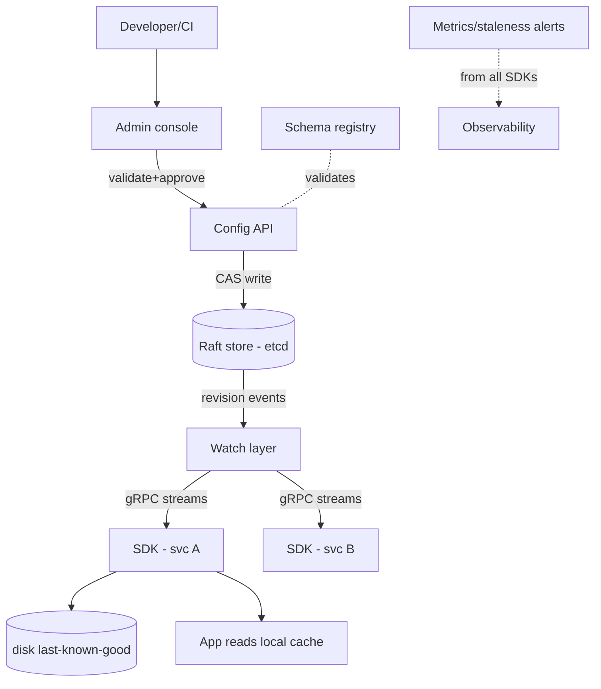
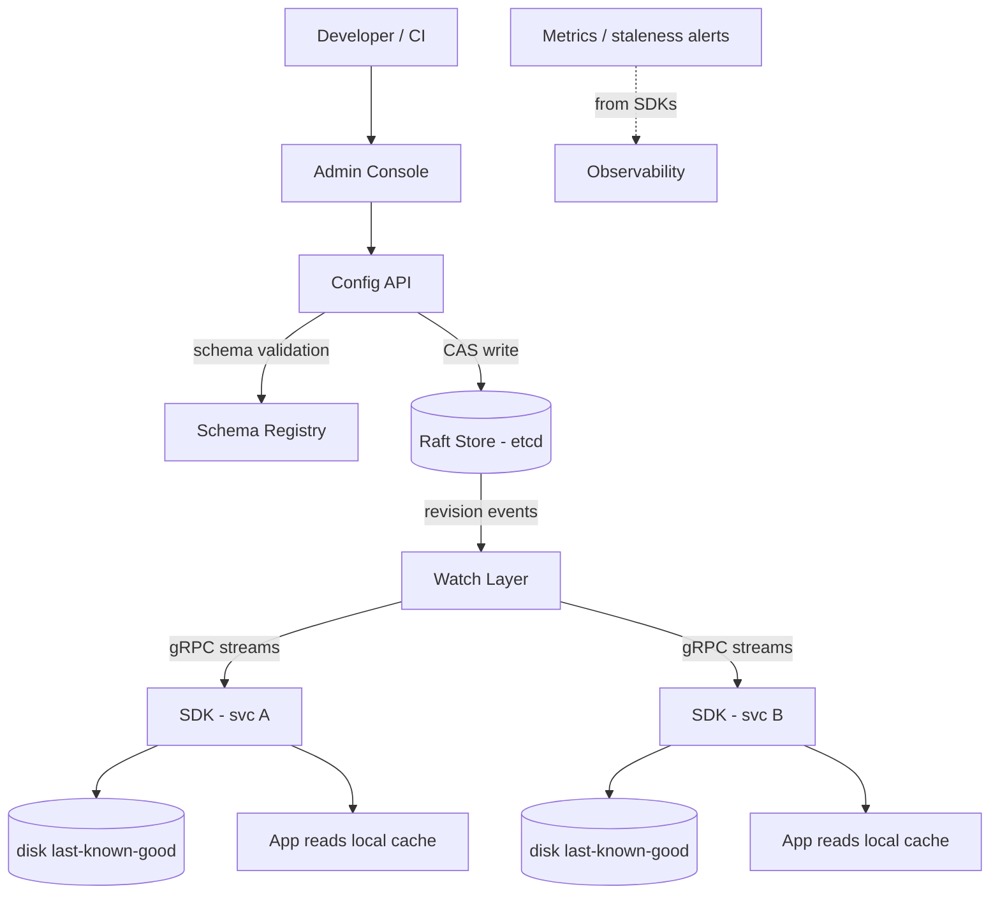
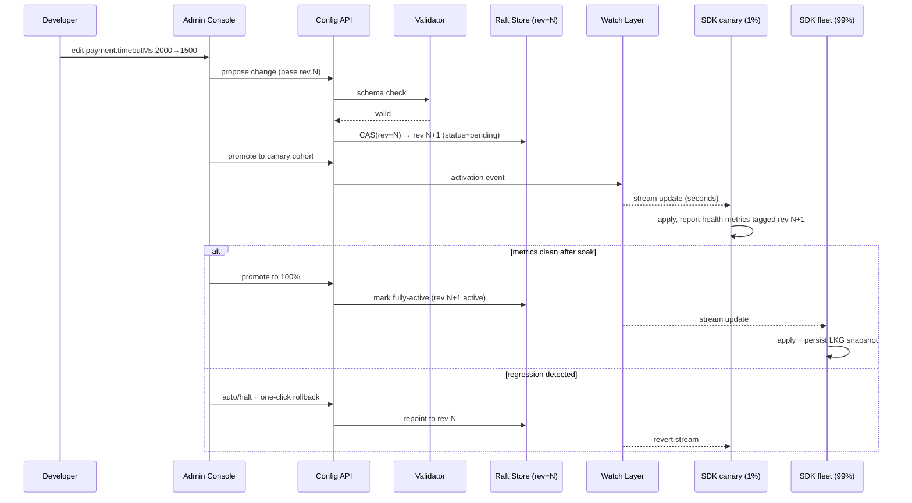
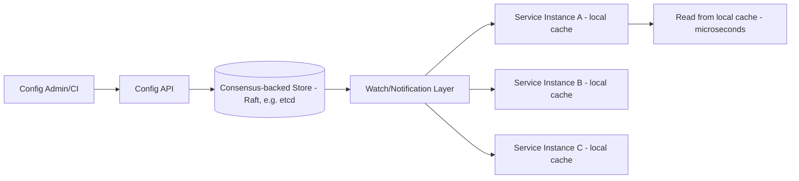

# Design a Distributed Configuration Management System

## Blogs and websites

## Medium

## Youtube

## Theory

### What Is It?

A **distributed configuration management system** is a centralized, highly available store for runtime configuration of a fleet of service instances. It lets administrators change system behavior (timeouts, feature flags, thresholds, connection strings) without redeploying binaries, and propagates those changes to thousands of running instances within seconds.

### Why Does It Exist?

In monolithic or static-config deployments, every configuration change requires a code change, CI/CD pipeline run, and binary redeploy — a process taking minutes to hours. For incident response (tightening a timeout to stop a cascading failure) or experimentation (tweaking a rate limit), this latency is unacceptable. Dynamic config decouples operational tuning from release cadence, enabling instant response to production issues and gradual rollouts without service restarts.

### What Problem Does It Solve?

* **Slow operational feedback loop**: incidents that need config changes (kill switches, timeouts) suffer minutes-to-hours delay with redeploy cycles. Dynamic config delivers changes in seconds.
* **Inconsistent runtime state across instances**: without a central config, individual deployments drift (snowflake servers). A distributed config system enforces fleet-wide consistency of behavior.
* **Configuration as a fleet-wide weapon**: a single bad value can instantly propagate to thousands of instances, causing widespread outages. The system must provide staging, validation, rollback, and staged rollout to make this safe.
* **Availability coupling**: if services depend on the config store being available on every request, the store becomes a single point of failure. Local caching with last-known-good snapshots decouples runtime behavior from store availability.
* **Audit and compliance**: who changed what, when, and why? Config changes are first-class incident-investigation events — the system must retain an immutable audit trail.

### Important Subtopics

1. Configuration taxonomy: static vs dynamic, bootstrap vs runtime config
2. Hierarchical namespacing & precedence resolution (global → region → env → service → instance)
3. Consistency models for config (strong writes, eventually-propagated reads)
4. Watch/push mechanisms: long-poll, streaming watch, pub/sub
5. Local caching & last-known-good behavior during outages
6. Versioning, rollback, and audit trails
7. Secret handling within configuration (encryption-at-rest, injection patterns)
8. Validation & schema enforcement before propagation (avoiding fleet-wide outages)
9. Canary/gradual rollout of configuration changes
10. Access control & change management workflows
11. Relationship to feature flags (see dedicated topic) and service discovery
12. Client SDK design: resilience, fallback files, metrics

### Problem Statement

Design a distributed configuration management system (like etcd/Consul/ZooKeeper-backed config, or a feature-flag-adjacent config service) that lets services fetch configuration values, watch for changes, and receive near-real-time updates across thousands of service instances, without a config change requiring a redeploy.

### What Counts as "Configuration"

Configuration is anything that varies behavior without code changes:

- **Static/bootstrap**: DB endpoints, ports — read once at startup; plain files/env vars suffice.
- **Runtime-dynamic**: connection-pool sizes, timeouts, log levels, retry policies, circuit-breaker thresholds — the domain of a *distributed* config system.
- **Secrets**: credentials/keys — technically config but with distinct storage requirements (Vault/KMS-backed; never in plain KV stores).
- **Adjacent systems**: feature flags (experimentation semantics — separate topic), service discovery (endpoint data — Consul does both but they're different problems).

The design below targets dynamic runtime config at fleet scale.

### Namespacing & Precedence

Keys follow a hierarchy resolved by overlaying layers, most-specific wins:

```
/global/payment.timeoutMs          = 3000
/region/eu/payment.timeoutMs       = 2500
/env/prod/payment.timeoutMs        = 4000
/svc/payments/payment.timeoutMs    = 2000
```

A payments instance in EU prod resolves 2000 — its own service key overrides env, which overrides region, which overrides global. Precedence must be deterministic and documented; debugging "why is this value X" requires exposing the full resolved layer stack per instance.

### Why Strong Writes + Eventual Reads

Config changes are rare (dozens/day) but catastrophic when wrong (one bad timeout pushed to 10K instances = outage). Reads are constant (every request may consult config). This asymmetry drives the architecture:

- **Write path**: consensus (Raft) serializes changes, assigns monotonic revision numbers, prevents lost updates between concurrent admins.
- **Read path**: each instance holds a full local snapshot served from memory — microseconds, zero network on hot path.
- **Propagation**: watch streams deliver revisions; brief staleness (seconds) acceptable because most config values tolerate it — but *which* values tolerate it is itself a decision (a rate-limit ceiling maybe not).

### Watch Mechanisms Compared

| Mechanism | How | Pros | Cons |
|---|---|---|---|
| Fixed-interval polling | GET every N sec | Trivial | Wasted load; latency = interval |
| Long polling | Hold GET until change/timeout | HTTP-friendly, firewall-safe | Connection churn; server-held state |
| Streaming watch (etcd-style) | gRPC/HTTP2 stream of revision events | True push, ordered, resumable via revision | Needs long-lived conn infra |
| Pub/sub fanout | Redis/Kafka topic per namespace | Scales delivery independently | Delivery ≠ state; needs reconciliation |

Production clients combine streaming watch with **periodic reconciliation polls** (e.g., every 60 s) — streams guarantee timeliness; polls guarantee eventual correctness if a stream silently died. Never trust the transport alone for correctness.

### Last-Known-Good & Fallback Files

Clients persist every successfully-applied snapshot to disk. On startup, if the config store is unreachable: boot from disk snapshot (stale-but-working beats dead), enter retry loop, alert. This converts config-store outages from fleet-wide outages into degraded-propagation incidents.

### Validation Before Propagation

Bad config is a loaded gun pointed at your own fleet. Defenses:

- **Schema validation** per key namespace (JSON Schema / typed descriptors): ranges ("timeout ∈ [0ms, 30s]"), types, required co-dependencies.
- **Dry-run evaluation**: simulate the resolved config against canary instances before fleet-wide publish.
- **Blast-radius controls**: staged rollout (1% → 10% → 100%) with automatic halt on health-metric regression (error-rate spike after config version bump).
- **Two-phase commit semantics**: write new revision as `pending`, activate explicitly (or auto-promote after soak).

---

## Characteristics

- **Extremely read-heavy** (millions of reads vs dozens of writes daily) → local-cache-first design where the central store mostly serves watches and startup fetches.
- **Low-volume, high-stakes writes**: each change potentially affects thousands of processes simultaneously; safety mechanisms (validation, staging, rollback speed) matter more than write throughput.
- **Strong consistency at the source, eventual at consumers**: single serialized history (revisions) with asynchronous fan-out — conflicts impossible at origin even though consumers converge asynchronously.
- **Availability-critical in both directions**: store down must not stop services (last-known-good); client bugs must not brick services (validation + safe defaults compiled into binaries).
- **Auditable by requirement**: who changed what, when, why — config changes are incident-investigation first-class citizens ("what changed at 03:14?").
- **Environment-aware**: same keys resolve differently across dev/staging/prod; cross-environment leaks are classic severe incidents (prod pointing at staging DBs).

---

## Components

- **Config API / control plane**
  *Purpose*: CRUD for keys, CAS-on-revision updates, activation workflow. *Responsibilities*: authentication of writers (human via SSO, machines via service identity), authorization per namespace, schema validation gate, revision assignment through consensus store. *Relationship*: sole writer path; feeds watchers indirectly via store events.

- **Consensus-backed store**
  *Purpose*: durable, linearizable key-value history. *Responsibilities*: Raft replication (3–5 nodes), revision numbering (etcd's MVCC revisions serve directly), compaction of old revisions, watch event emission. *Example*: etcd (Kubernetes' own config backbone), Consul KV.

- **Watch/notification layer**
  *Purpose*: stream changes to subscribers efficiently. *Responsibilities*: per-client streams filtered by prefix, resumable from client's last revision, backpressure handling for slow consumers. *Relationship*: reads from store's event log; scales horizontally since it's read-only fan-out.

- **Client SDK (per language)**
  *Purpose*: make correct usage the easy path. *Responsibilities*: initial fetch + local cache build, watch maintenance with reconnect/backoff, periodic reconciliation, disk persistence of snapshots, typed accessors with defaults, metrics emission (staleness age, refresh errors). *Example*: Netflix Archaius/Apollo-style clients; Spring Cloud Config client.

- **Admin console**
  *Purpose*: human interface with guardrails. *Responsibilities*: diff views between revisions, approval workflows (two-person rule for prod), one-click rollback, resolved-value inspector showing layer stack per target.

- **Schema registry**
  *Purpose*: machine-checkable contracts per namespace. *Responsibilities*: storing validators, enforcing at write time, evolution rules (widening ranges OK, narrowing flagged). 



---

## Patterns

- **Local snapshot + watch reconciliation**
  *What*: clients hold complete working set; streams update incrementally; polls reconcile. *Solves*: read latency and availability decoupling. *When*: any high-instance-count config consumer. *Pros*: µs reads; store outage tolerated. *Cons*: staleness windows; SDK complexity concentrated here.

- **Compare-and-swap (CAS) writes on revision**
  *Problem*: two admins editing concurrently — last-write-wins loses one silently. *How*: writes carry `expectedRevision`; mismatch rejects with current value returned. *When*: any multi-writer KV. *etcd transactions implement exactly this.*

- **Staged rollout with auto-halt**
  *What*: config publishes proceed cohort-by-cohort; health monitors compare error rates pre/post; regression auto-freezes rollout pending human review. *Solves*: bad-config blast radius. *Real-world*: Facebook's Gatekeeper-class systems; Apollo's grey-release.

- **Immutable revision log**
  *What*: store never overwrites; each change appends revision N; "current" is pointer. *Advantages*: free audit trail, trivial rollback (= repoint), time-travel debugging ("what config ran during incident?"). *Cost*: compaction policy needed.

- **Fail-static defaults**
  *What*: every config accessor requires a compiled-in default; missing/invalid config yields default, never exception or null cascade. *Why*: config systems fail in creative ways; apps must survive all of them.

- **Anti-pattern**: secrets in plaintext config KV — use dedicated secret stores with TTL'd leases and injection-time decryption; config tools' audit breadth becomes an attack surface otherwise.

---

## Benefits

- **Decouples release cadence from operational tuning** — timeout tweaks ship instantly without CI/CD pipelines touching binaries.
- **Fleet-wide consistency of behavior** achievable in seconds, ending snowflake server drift.
- **Instant rollback capability** turns config mistakes from outages into minutes-long blips.
- **Auditability satisfies compliance** (who authorized this limit change?) as a side effect of good design.
- **Emergency levers**: kill switches for flaky dependencies live in config — incident response tooling built on the same rails.
- **Central visibility**: one dashboard shows effective settings across environments, catching drift early.

---

## Pros

- Microsecond reads forever after startup (local caches).
- Store unavailability degrades propagation speed only — running systems unaffected.
- Revision model gives git-like semantics (diff, revert, blame) for operational state.
- Watch-based push eliminates polling waste at scale.

## Cons

- Consensus store operations burden (3–5 node quorum care, backups, upgrades) for modest data volumes.
- SDK quality determines everything — a weak SDK undermines perfect infrastructure (missing reconciliation → permanently stale clients).
- Propagation lag creates "works on my instance" confusion without per-instance version surfacing (must expose current revision in health endpoints).
- Secrets temptation: convenience pulls teams toward storing credentials alongside ordinary config unless guarded structurally.
- Multi-region adds another consistency dimension (cross-region replication strategy needed — usually async per-region Raft clusters with global overlay).

---

## Challenges

- **Technical**: watch-stream resurrection after network partitions (resume-from-revision correctness); clock skew irrelevant if design leans on logical revisions (it should); thundering herd of full-fetches when store recovers (rate-limit reconnections with jitter).
- **Scalability**: thousands of long-lived streams per store node (connection limits, gRPC flow control); fan-out amplification for popular namespaces.
- **Performance**: startup stampedes when fleets autoscale rapidly (cache warm reads behind CDN-like tiers).
- **Reliability**: split-brain avoidance is precisely why Raft — but misconfigured quorums (2-node clusters!) recreate the problem; disk-full on small etcd clusters is a notorious failure mode (compaction discipline).
- **Maintainability**: schema evolution across hundreds of services; deprecating old key paths safely (usage tracking).
- **Operational**: change management UX (approvals shouldn't be so heavy that emergency fixes bypass process); disaster recovery drills restoring store + verifying fleet convergence.
- **Security**: writer-authn rigor (compromised CI pipeline = fleet-wide compromise via config), least-privilege namespace ACLs, secret segregation.

---

## Best Practices

- **Require compiled-in defaults for every key read** — the binary must function with zero config-service contact.
- **Persist last-known-good snapshots to disk** and boot from them when store unreachable; alert loudly while degraded.
- **Validate at write time with typed schemas**, never trust admin input; reject dangerous transitions programmatically.
- **Expose applied-config revision in health/metrics endpoints** — debugging starts with "is this instance even current?"
- **Stage rollouts automatically** (canary cohorts) with metric-based halts; make 100% pushes require explicit promotion.
- **Keep revisions immutable and forever-queryable** (with compaction of *values*, not history metadata) for audit and time-travel debugging.
- **Separate secrets physically** into Vault/KMS-backed systems with different access logs.
- **Jittered reconnection and fetch pacing** in SDKs — recovering stores must not face synchronized stampedes.
- **Test the SDK like production software**: chaos-test store partitions, assert last-known-good boots, verify reconciliation closes silent gaps.

---

## When to Use / Not Use

**Build/adopt when**: fleet exceeds ~dozens of services needing coordinated runtime tuning; incident response demands instant kill switches; multiple datacenters need consistent behavior; compliance requires config auditing.

**Skip when**: few services with rare changes — environment variables + redeploy suffice; Kubernetes-native estates — ConfigMaps/Operators cover much ground; experimentation-heavy flag needs — dedicated flag platforms fit better (config≠experiments).

Alternatives/complements: Spring Cloud Config (git-backed, pull-model simplicity), etcd/Consul direct (DIY SDKs), Apollo/Nacos (batteries-included platforms), cloud-native (AWS App Config/GCP Runtime Config).

Decision inputs: scale of instance count × change frequency, availability tolerance, audit obligations, team capacity to run consensus infra and maintain SDKs.

---

## Use Cases

- **Global timeout/circuit-breaker retuning during dependency brownout**
  *Problem*: downstream payment provider slowing; every service's default timeout now too generous, threads piling up. *Solution*: push tightened timeouts + breaker thresholds via config; canary first (1% instances, 5 min soak), then fleet. *Trade-off*: seconds-level propagation delay accepted vs redeploy cycles measured in tens of minutes.

- **Multi-region consistency with regional autonomy**
  *Problem*: EU data-residency rules forbid some US-managed values; global defaults still wanted. *Solution*: layered stores — global cluster replicating async to regional clusters, regional overrides win locally. *Trade-off*: eventual global convergence; conflict window documented and monitored.

- **Emergency kill switch**
  *Problem*: new recommendation feature causing errors post-deploy at 3 AM. *Solution*: feature-flagged via config boolean; flip off in seconds, restore stability, fix forward calmly. *Why suitable*: demonstrates config-as-operational-lever rather than mere settings storage.

---

## Architecture

### Architectural Style

**Control-plane / data-plane split with consensus-backed source of truth**: the control plane (admin console + config API) writes changes through a Raft-backed consensus store (etcd/Consul), establishing a single, linearizable revision history. The data plane (client SDKs running in each service instance) holds local in-memory caches and receives updates via watch streams — reads never leave the process. This split exists because reads must be microsecond-latency at the call site, while writes are rare but must be strictly consistent and auditable.

**Layered configuration model**: keys resolve through an overlay stack (global → region → environment → service → instance), most-specific wins. This is implemented mechanically in the data model (overrides keyed by specificity) and enforced by the resolution engine.



*Diagram: Distributed config architecture. The control plane (admin console + API + schema registry) writes through a Raft-backed store. The watch layer fans out revision events to client SDKs via streaming gRPC. Each SDK maintains a local cache (microsecond reads) and persists last-known-good snapshots to disk. Metrics flow independently for observability.*

### Component Responsibilities and Communication

| Component | Responsibility | Communication |
|---|---|---|
| Admin Console | UI for config edits, diff views, approvals, rollback, canary staging | Human-facing; calls Config API |
| Config API | Write endpoint (CRUD + CAS-on-revision), activation workflow | Writes to Raft store; queries schema registry |
| Schema Registry | Typed validators per namespace; evolution rules | Called by Config API at write time |
| Raft Store | Linearizable key-value with MVCC revisions; watch event emission | Quorums (3–5 nodes); emits revision stream |
| Watch Layer | Stream revision events to subscribed SDKs | Reads from store's event log; gRPC/HTTP2 streams |
| Client SDK | Local cache + watch + reconciliation + disk persistence | Connects to watch layer; serves app reads locally |
| Metrics/Observability | Staleness-age, propagation latency, validation rejections | Pushed from SDKs; consumed by alerting |

**Data flow**: admin edits key → console validates → API CAS-writes to Raft store (new revision) → watch layer streams revision event → SDKs apply update to local cache + persist disk snapshot → applications read from local cache (microseconds).

**Scaling strategy**: store is tiny-but-quorum-solid (data volume trivial, availability paramount); watch layer scales horizontally (stateless, each client connects to any node, nodes subscribe to store feed); SDKs carry the real read load entirely offline.

**Failure handling**: store loss → SDKs continue on cached values + disk snapshots, alarm on staleness age; watch-stream death undetected by transport → periodic reconciliation poll catches divergence.

## Design

### Design Considerations

The fundamental design tension: **config changes are rare and high-stakes, but config reads are frequent and must be fast.** This asymmetry means the write path optimizes for safety (consensus, validation, staging) while the read path optimizes for speed (local cache, zero network on hot path). The design must also ensure that config-store outages do not cascade to service outages (last-known-good caching) and that propagation failures are detectable (reconciliation backstop).

### Key Decisions

- **Consensus-backed store (Raft) for writes**: guarantees a single, linearizable revision history; prevents split-brain config where two nodes each believe they hold the latest, conflicting value.
- **Local SDK cache with watch + periodic reconciliation**: streams deliver near-real-time updates; periodic polls (every 60 s) guarantee correctness if a stream silently dies. Never trust the transport alone.
- **Immutable revision log**: each write appends revision N; "current" is a pointer. Enables audit trail, trivial rollback, and time-travel debugging.
- **Staged rollout with auto-halt**: config publishes proceed cohort-by-cohort; health monitors compare error rates pre/post; regression auto-freezes rollout.
- **CAS-on-revision writes**: concurrent admin edits don't silently clobber each other — the proposal carries the expected base revision; mismatch rejects.

### Trade-offs

| Decision | Pro | Con |
|---|---|---|
| Raft consensus store | Linearizable writes, no split-brain | Operational burden (quorum care, backups, upgrades); overkill for tiny data volumes |
| Local SDK caching | µs reads; store outage tolerated | Staleness windows; SDK quality is critical |
| Immutable revisions | Free audit/rollback/time-travel | Compaction policy needed |
| Staged rollout | Bad-config blast radius minimized | Process overhead; emergency fixes need fast-track approvals |
| Watch + reconcile | Stream timeliness + poll correctness | Stream failure still needs detection via reconciliation |

### Scalability Considerations

- **Write path**: consensus stores handle modest write volumes (dozens/day) easily; the bottleneck is not throughput but quorum coordination and careful upgrades.
- **Watch fan-out**: 20K instances × 5 watched namespaces = 100K streams, manageable across a ~10-node watch tier; batch/coalesce events per stream window to reduce per-event overhead.
- **SDK local cache**: read load entirely offline from the store — no scaling concern on the read path.
- **Multi-region**: per-region Raft clusters with async global replication; clients connect region-locally; cross-region convergence monitored via revision-lag metrics.

### Reliability Considerations

- **Store outage**: SDKs continue on cached values + disk snapshots (stale-but-working beats dead); alerts fire on staleness age exceeding threshold.
- **Watch-stream death**: silent stream failures caught by periodic reconciliation polls — the correctness backstop.
- **Thundering herd on store recovery**: jittered reconnection pacing in SDKs prevents synchronized stampedes.
- **Disk-full on small Raft clusters**: a notorious failure mode — compaction discipline and alerting on disk usage is critical.

### Performance Considerations

- **Read path**: in-memory cache lookup = microseconds, zero network. The store is never on the request hot path.
- **Write path**: consensus quorum round-trips (ms-scale) — acceptable since config changes are rare.
- **Propagation**: targeted at seconds (p50/p99) from write to fleet-wide application; cross-region adds RTT but regional watch tiers mitigate.
- **Startup stampedes**: autoscale events triggering many simultaneous full-fetches — cache warm reads behind CDN-like tiers or fetch-throttling in SDKs.

### Security Considerations

- **Writer authentication rigor**: compromised CI pipeline = fleet-wide compromise via config. SSO or strict service-identity required for writes.
- **Namespace ACLs**: least-privilege per team/service; cross-environment leaks are classic severe incidents (prod pointing at staging DBs).
- **Secrets segregation**: never store secrets in ordinary KV — separate Vault/KMS-backed systems with different access logs.
- **Audit trail**: immutable record of every change (who, what, when, why) — compliance requirement.

### Maintainability Considerations

- **Schema evolution**: typed validators with evolution rules (widening ranges OK, narrowing flagged); deprecation of old key paths tracked via usage metrics.
- **Config versioning**: every change versioned; rollback tested under real conditions.
- **Operational UX**: approval workflows must not be so heavy that emergency fixes bypass process; runbooks for store restore + fleet convergence verification.

## API Contract

### Config API Endpoints

```
GET  /api/v1/config/{ns}/{key}            # current value + revision
PUT  /api/v1/config/{ns}/{key}            # CAS write (with If-Match: revision)
GET  /api/v1/config/{ns}                   # list all keys in namespace
POST /api/v1/config/{ns}/{key}/activate    # promote pending → canary → full
POST /api/v1/config/{ns}/{key}/rollback     # revert to a previous revision
GET  /api/v1/config/history/{ns}/{key}     # revision history
```

### Write Request (CAS)

```http
PUT /api/v1/config/payments/timeoutMs
If-Match: 42
Authorization: Bearer <sso-token>
Content-Type: application/json

{
  "value": "1500",
  "comment": "Reduce timeout during downstream provider slowdown",
  "canaryPercentage": 1
}
```

**Response** (HTTP 200):

```json
{
  "revision": 43,
  "status": "PENDING",
  "appliedToCanary": false
}
```

On revision mismatch, returns `412 Precondition Failed` with the current revision and value for rebase.

### Watch API (streaming)

```http
GET /api/v1/config/watch?prefix=payments.&fromRevision=42
Accept: text/stream  (or gRPC stream)
```

Streams JSON-lines of events:

```json
{"revision": 43, "ns": "payments", "key": "timeoutMs", "value": "1500", "action": "UPDATE"}
{"revision": 44, "ns": "payments", "key": "maxRetries", "value": "5", "action": "UPDATE"}
```

### Status Codes

* `200` — successful read/write
* `201` — new revision created
* `400` — invalid request body or schema violation
* `401` — unauthenticated
* `403` — authenticated but not authorized for namespace
* `409` / `412` — CAS conflict (revision mismatch); returns current revision
* `429` — rate limited (writes are rare; reads rate-limited per-instance)
* `503` — store unavailable; SDKs fall back to local cache

### Key Contracts

- **Idempotency**: PUT with the same `(ns, key, value, expectedRevision)` is idempotent — retries return the same revision.
- **CAS correctness**: the `If-Match` revision header prevents lost updates between concurrent writers.
- **Versioning**: every write increments the global revision counter; clients report their applied revision in health/metrics endpoints.
- **Watch resumption**: clients resume from their last observed revision, guaranteeing no missed events.
- **Validation**: schema validators (JSON Schema, typed ranges) run before write persistence — rejects bad config before fleet propagation.

## High-Level Design



Scaling: watch-layer stateless horizontally (each client connects to any node; nodes subscribe to store feed); store sized tiny-but-quorum-solid (data volume trivial; availability paramount); SDKs carry the real read load entirely offline from this path.

Failure handling: store loss → SDKs continue on cached values + disk snapshots, alarms fire on staleness age exceeding threshold (minutes not hours); watch-stream death undetected by transport → periodic reconciliation poll catches divergence (correctness backstop).

---

## Deep Dive

- **Revision/MVCC mechanics** (etcd-style): each write bumps global revision; keys carry mod-revisions enabling watch-from-X replay exactly once-per-event semantics; compaction drops superseded versions while keeping anchor points — clients resuming from compacted revisions trigger full refetch path.
- **Linearizability scope**: reads served from local caches are deliberately *not* linearizable — document that "current" means "latest observed"; operations needing strict reads (leader elections reading quorum values) hit the store directly.
- **Fan-out math**: 20K instances × 5 watched namespaces = 100K streams — manageable across a watch-tier of ~10 nodes; batching/coalescing events per stream window reduces per-event overhead dramatically during bursty changes.
- **Convergence verification**: SDKs periodically hash their resolved view and report; control plane compares against canonical hash — divergence alerts catch silent desync (the failure mode that keeps config-system authors awake).
- **Observability**: per-key change frequency, propagation percentiles (write→p50/p99 instance-application lag), staleness-age histograms, validation-rejection rates (spiking = schema drift upstream), rollback counts as quality signal.

---

## Data Modeling

```mermaid
erDiagram
    NAMESPACE ||--o{ CONFIG_KEY : contains
    CONFIG_KEY ||--o{ KEY_REVISION : "history of"
    KEY_REVISION ||--o{ ROLLOUT : published-via
    ENVIRONMENT ||--o{ OVERRIDE : scopes
    USER ||--o{ KEY_REVISION : authored

    NAMESPACE { string name PK  string owner_team }
    CONFIG_KEY {
        string ns PK,FK
        string key PK
        string value_type
        string validator_ref
    }
    KEY_REVISION {
        bigint revision PK
        string ns FK,key FK
        string value
        enum status
        string author FK
        timestamptz created_at
        string comment
    }
    OVERRIDE {
        string env PK,FK
        string ns PK,FK
        string key PK,FK
        string value
        bigint revision
    }
```

Choices: append-only revisions with status (`PENDING/CANARY/ACTIVE/SUPERSEDED/ROLLED_BACK`) encode the rollout lifecycle inside data model — queries like "active config at time T" become index lookups; overrides keyed by `(env, ns, key)` implementing precedence mechanically (ORDER BY specificity); unique constraint on `(ns,key)` for ACTIVE revision ensures single truth per layer. Partitioning: by namespace; retention: values compacted after 90 days, revision metadata kept indefinitely for audit.

---

## Java and Spring Boot Implementation

Spring ecosystem offers Spring Cloud Config (git-backed pull model) — but for a watch-driven dynamic system, a custom SDK atop etcd-style semantics looks like:

Typed config bean with dynamic refresh:

```java
@Component
@ConfigurationProperties(prefix = "payments")
@RefreshScope
public class PaymentsConfig {

    @Min(0) @Max(30000)
    private int timeoutMs = 3000;      // compiled-in default: fail-static

    @Min(1) @Max(100)
    private int maxRetries = 3;

    public int getTimeoutMs() { return timeoutMs; }
    public void setTimeoutMs(int v) { this.timeoutMs = v; }
    public int getMaxRetries() { return maxRetries; }
    public void setMaxRetries(int v) { this.maxRetries = v; }
}
```

Watch-client maintaining local snapshot with reconciliation (core SDK pattern):

```java
@Service
public class ConfigWatcher implements AutoCloseable {

    private final ConfigStoreGrpc stub;
    private final Map<String, String> cache = new ConcurrentHashMap<>();
    private final ScheduledExecutorService reconciler =
            Executors.newSingleThreadScheduledExecutor();
    private final AtomicLong lastRevision = new AtomicLong(0);
    private volatile StreamObserver<WatchRequest> stream;

    public ConfigWatcher(ConfigStoreGrpc stub, List<String> prefixes) {
        this.stub = stub;
        openStream(prefixes);
        reconciler.scheduleWithFixedDelay(this::reconcile, 60, 60, TimeUnit.SECONDS);
    }

    public String get(String key) {
        return cache.get(key);   // microseconds; never blocks on network
    }

    private void openStream(List<String> prefixes) {
        stream = stub.watch(new StreamObserver<>() {
            @Override public void onNext(WatchEvent evt) {
                evt.changesList().forEach(c -> {
                    if (c.deleted()) cache.remove(c.key());
                    else cache.put(c.key(), c.value());
                });
                lastRevision.set(evt.revision());
                persistSnapshot();           // last-known-good to disk
            }
            @Override public void onError(Throwable t) { scheduleReconnect(); }
            @Override public void onCompleted() { scheduleReconnect(); }
        });
        stream.onNext(WatchRequest.resumeFrom(prefixes, lastRevision.get()));
    }

    /** Correctness backstop: poll authoritative state in case stream silently died. */
    private void reconcile() {
        try {
            Snapshot s = stub.snapshot(SnapshotRequest.at(lastRevision.get()));
            s.entriesList().forEach(e -> cache.put(e.key(), e.value()));
            lastRevision.set(s.revision());
        } catch (Exception e) {
            // keep serving stale; alerting handled by staleness metrics
        }
    }

    private void scheduleReconnect() { /* exponential backoff + jitter, then openStream */ }

    @Override public void close() { reconciler.shutdownNow(); }
}
```

Admin-side controller demonstrating CAS + validation:

```java
@RestController
@RequestMapping("/api/v1/config")
public class ConfigController {

    private final ConfigStore store;
    private final SchemaValidator validator;

    @PutMapping("/{ns}/{key}")
    ResponseEntity<?> put(@PathVariable String ns, @PathVariable String key,
                          @Valid @RequestBody ConfigWriteRequest body,
                          @RequestHeader("If-Match") long expectedRevision,
                          Authentication actor) {
        validator.assertAllowed(ns, key, body.value());      // throws InvalidConfigException
        long newRev = store.compareAndSwap(ns, key, expectedRevision, body.value(),
                                           actor.getName());
        return ResponseEntity.ok(Map.of("revision", newRev));
    }

    @ExceptionHandler({InvalidConfigException.class})
    ResponseEntity<?> invalid(Exception ex) {
        return ResponseEntity.badRequest().body(Map.of("error", ex.getMessage()));
    }
}
```

Notes: `@ConfigurationProperties` + `@RefreshScope` give the Spring-native version of dynamic config; custom watchers suit etcd/gRPC stores; the double mechanism (stream + scheduled reconcile) embodies the reliability argument above; tests assert CAS conflicts, reconnect-with-jitter behavior, and that `get()` never touches the network.

---

## Real-World Examples

- **Netflix Archaius** — pioneered dynamic properties at scale feeding Hystrix breakers; the original "tune production from a dashboard" system.
- **etcd** — Kubernetes' entire desired-state machinery runs through it; proof that Raft-backed KV + watches carries planetary-scale coordination.
- **Apollo (CTrip)** — widely adopted in Chinese tech; grey-release (canary) publishing and per-env/cluster/namespace model match this doc's design closely.
- **HashiCorp Consul KV** — combines config with discovery; their docs discuss exactly the consistency-vs-read-latency trade-offs covered above.
- **Facebook's Gatekeeper / Google's Gflags lineage** — billion-user-scale config+flag platforms emphasizing staged rollouts and automated halt — the pattern this design generalizes.

---

## Interview Preparation

### Interview Questions

**Beginner**

1. **Why not just environment variables for configuration?**
   Env vars freeze at process start — changing them requires restart/redeploy. Dynamic config separates tuning from releases, enabling instant response to incidents and experiments without binary churn.
2. **What does "watch" mean in config systems?**
   A subscription where the server pushes each subsequent change to the client (long-poll or stream), so clients stay current without polling intervals that trade latency against load.

**Intermediate**

3. **How do you keep services alive when the config service dies?**
   Three layers: in-memory caches keep serving last values immediately; disk-persisted last-known-good snapshots enable cold restarts during prolonged outages; compiled-in defaults guarantee basic functionality even with no history. Degradation = stale values + alerts, never downtime.
4. **Design conflict prevention when two admins edit simultaneously.**
   CAS-on-revision: both proposals carry base revision; store accepts exactly one (first commit wins), rejects the other with current state shown for rebase. Same primitive git uses conceptually — linearizable history beats merge ambiguity for ops state.
5. **Why validate config at write time instead of letting services handle bad values?**
   One bad write propagates to thousands of instances atomically-by-broadcast — blast radius is the fleet. Write-time schemas convert fleet-wide outages into a rejected PUT. Follow-up: what slips past schemas? Semantic issues (timeout fine alone, breaks with retry budget) — hence canary soak stages.

**Advanced**

6. **Design propagation for 50K instances across 6 regions with <5s P99.**
   Regional read replicas/watch-tiers fed by async replication from home Raft cluster; clients connect region-locally (latency + partition isolation); cross-region convergence monitored via revision-lag metrics; global changes get region-staggered activation allowing abort mid-rollout. Discuss why single global quorum fails the latency goal (RTT physics).
7. **A service instances' config silently stopped updating three days ago. How did your design catch this?**
   Convergence hashing (clients report digest of resolved view), staleness-age metrics per SDK (alert at threshold), reconciliation polls whose success/failure is observable, and revision-tagged health checks. If none fired, the gap is in observability — postmortem action item. Tests understanding that detection ≠ transport guarantees.

**Senior / system design**

8. **Architect config + secrets + feature flags: one system or three?**
   Argue separation: flags need experimentation analytics + bucketing (different read/write shape); secrets need lease/TTL/rotation + tight audit (different threat model); config needs fleet broadcast. Shared substrate possible (same Raft infra) but products/APIs distinct. Merged systems grow worst-of-all-worlds coupling — cite real systems splitting these (Vault vs Consul vs Flag platforms).
9. **Walk through making a dangerous change safe end-to-end.**
   Schema-gated proposal → peer approval → canary cohort with metric comparison → staged promotion with auto-halt → fleet completion + verification sweep → post-change review notes attached to revision. Emphasize rollback rehearsed beforehand (rollback you haven't tested doesn't exist).

### Common Mistakes

- Polling intervals as primary freshness mechanism at scale (load ∝ instances × frequency — collapses).
- No compiled-in defaults: config-store hiccup cascades into total outage.
- Storing secrets in ordinary KV because "permissions are fine" — audit trails then leak credential values.
- Trusting watch streams for correctness without reconciliation backstop.
- Rollback implemented but never tested under real conditions.

### Expected discussion points

Read/write asymmetry driving architecture, Raft necessity arguments (split-brain horror stories), SDK-as-product thinking, staged rollout mechanics, and honest treatment of the consistency boundary (what "current" means at a consumer).


### Functional Requirements

- Store hierarchical/namespaced key-value configuration (per service, per environment)
- Serve reads with low latency from any service instance
- Push/notify subscribed clients when a watched key changes
- Support versioning and rollback of configuration changes
- Support access control over who can change which config keys

### Non-Functional Requirements

- **Scale**: Thousands of service instances polling/watching config, config change rate is low relative to read rate (read-heavy)
- **Latency**: Reads should be servable from a local cache in microseconds; propagation of a change to all watchers within a few seconds
- **Consistency**: Strong consistency for the write path (no two conflicting writes silently both "win"); eventual consistency acceptable for propagation to watchers
- **Availability**: Config reads must keep working (from cache) even if the central config store is temporarily unreachable

### High-Level Architecture



### Key Design Points

- Back the store with a consensus protocol (Raft, as used by etcd/Consul) so writes are strongly consistent and survive node failures without split-brain configuration state.
- Have every service instance keep a local in-memory cache of the config it needs, populated at startup and updated via a long-lived watch/streaming connection to the config store, so reads never leave the process and a brief config-store outage doesn't stop services from running with their last-known-good config.
- Version every config change and keep history, so a bad config push can be rolled back to a previous version instantly, and changes can be audited (who changed what, when).
- Use a watch mechanism (long-poll or streaming gRPC watch, like etcd's watch API) rather than clients polling on a fixed interval, to get near-real-time propagation without hammering the store with reads.

### Trade-offs

- Local per-instance caching trades a few seconds of propagation delay for near-total decoupling of the read-hot-path from the config store's availability - the right trade since config changes are rare relative to reads.
- A consensus-backed store (Raft) is more operationally heavy than a simple key-value DB, but is necessary to avoid split-brain configuration where two nodes each believe they hold the latest, conflicting value.
