# Design a Distributed Configuration Management System

## Blogs and websites

## Medium

## Youtube

- [Design a Distributed Configuration Management System | System Design](https://www.youtube.com/watch?v=6xKLY1lg7E)
- [Spring Cloud Config — Centralized Configuration | SpringOne](https://www.youtube.com/watch?v=PEU6LYFSBSI)
- [etcd: High Availability and Consensus | KubeCon](https://www.youtube.com/watch?v=h9c8bYrKdUE)
- [HashiCorp Consul Service Mesh | HashiConf](https://www.youtube.com/watch?v=8mbY6a5QZkE)
- [Building a Config Management Platform at Netflix | Netflix Tech Blog](https://netflixtechblog.com/building-config-management-at-netflix)

---

## Theory

### Topics Covered

1. [Introduction / Problem Statement](#introduction--problem-statement)
2. [Characteristics](#characteristics)
3. [Pros](#pros)
4. [Cons](#cons)
5. [Use Cases](#use-cases)
6. [Components](#components)
7. [Architectural Patterns](#architectural-patterns)
8. [Benefits](#benefits)
9. [Challenges](#challenges)
10. [Best Practices](#best-practices)
11. [When to Use / When Not to Use](#when-to-use--when-not-to-use)
12. [Data Model and API](#data-model-and-api)
13. [Domain-Specific: Configuration Management Deep Dive](#domain-specific-configuration-management-deep-dive)
14. [Replication Strategies](#replication-strategies)
15. [Failure Detection and Membership](#failure-detection-and-membership)
16. [High Availability and Scalability](#high-availability-and-scalability)
17. [Performance and Optimization](#performance-and-optimization)
18. [CAP Theorem and Consistency Trade-offs](#cap-theorem-and-consistency-trade-offs)
19. [Encryption and Key Management](#encryption-and-key-management)
20. [Authentication and Authorization](#authentication-and-authorization)
21. [Security Threats and Mitigations](#security-threats-and-mitigations)
22. [Observability and Logging](#observability-and-logging)
23. [Real-World Implementations](#real-world-implementations)
24. [Java and Spring Boot Implementation Guide](#java-and-spring-boot-implementation-guide)
25. [Interview Questions and Answers](#interview-questions-and-answers)

---

### Introduction / Problem Statement

A **distributed configuration management system** is a centralized, highly available store for runtime configuration of a fleet of service instances. It lets administrators change system behavior (timeouts, feature flags, thresholds, connection strings) without redeploying binaries, and propagates those changes to thousands of running instances within seconds.

#### What Is It?

A distributed configuration management system is a centralized, highly available store for runtime configuration of a fleet of service instances. It lets administrators change system behavior (timeouts, feature flags, thresholds, connection strings) without redeploying binaries, and propagates those changes to thousands of running instances within seconds.

#### Why Does It Exist?

In monolithic or static-config deployments, every configuration change requires a code change, CI/CD pipeline run, and binary redeploy — a process taking minutes to hours. For incident response (tightening a timeout to stop a cascading failure) or experimentation (tweaking a rate limit), this latency is unacceptable. Dynamic config decouples operational tuning from release cadence, enabling instant response to production issues and gradual rollouts without service restarts.

#### What Problem Does It Solve?

* **Slow operational feedback loop**: incidents that need config changes (kill switches, timeouts) suffer minutes-to-hours delay with redeploy cycles. Dynamic config delivers changes in seconds.
* **Inconsistent runtime state across instances**: without a central config, individual deployments drift (snowflake servers). A distributed config system enforces fleet-wide consistency of behavior.
* **Configuration as a fleet-wide weapon**: a single bad value can instantly propagate to thousands of instances, causing widespread outages. The system must provide staging, validation, rollback, and staged rollout to make this safe.
* **Availability coupling**: if services depend on the config store being available on every request, the store becomes a single point of failure. Local caching with last-known-good snapshots decouples runtime behavior from store availability.
* **Audit and compliance**: who changed what, when, and why? Config changes are first-class incident-investigation events — the system must retain an immutable audit trail.

#### Important Subtopics

1. Configuration taxonomy: static vs dynamic, bootstrap vs runtime config
2. Hierarchical namespacing & precedence resolution (global → region → env → service → instance)
3. Consistency models for config (strong writes, eventually-propagated reads)
4. Watch/push mechanisms: long-poll, streaming watch, pub/sub
5. Local caching & last-known-good behavior during outages
6. Versioning, rollback, and audit trails
7. Secret handling within configuration (encryption-at-rest, injection patterns)
8. Validation & schema enforcement before propagation (avoiding fleet-wide outages)
9. Canary/gradual rollout of configuration changes
10. Access control & change management workflows
11. Relationship to feature flags (see dedicated topic) and service discovery
12. Client SDK design: resilience, fallback files, metrics
13. Hot-reload mechanics: in-process refresh, class-reloading, signal handling
14. Storage backends: git-backed vs consensus KV vs relational

#### Problem Statement

Design a distributed configuration management system (like etcd/Consul/ZooKeeper-backed config, or a feature-flag-adjacent config service) that lets services fetch configuration values, watch for changes, and receive near-real-time updates across thousands of service instances, without a config change requiring a redeploy.

#### What Counts as "Configuration"

Configuration is anything that varies behavior without code changes:

- **Static/bootstrap**: DB endpoints, ports — read once at startup; plain files/env vars suffice.
- **Runtime-dynamic**: connection-pool sizes, timeouts, log levels, retry policies, circuit-breaker thresholds — the domain of a *distributed* config system.
- **Secrets**: credentials/keys — technically config but with distinct storage requirements (Vault/KMS-backed; never in plain KV stores).
- **Adjacent systems**: feature flags (experimentation semantics — separate topic), service discovery (endpoint data — Consul does both but they're different problems).

The design below targets dynamic runtime config at fleet scale.

### Characteristics

Each characteristic below explains **what** it is, **why** it matters, **how** it shapes the design, and an **example** of the design decision it drives.

- **Extremely read-heavy** (millions of reads vs dozens of writes daily) → local-cache-first design where the central store mostly serves watches and startup fetches. This means the API must support a *pull-once + long-poll/watch* model: clients fetch config at startup, then register a watch for incremental updates. The store itself can use a compact log-structured design optimized for reads.
- **Low-volume, high-stakes writes**: each change potentially affects thousands of processes simultaneously; safety mechanisms (validation, staging, rollback speed) matter more than write throughput. This drives a *staging + validation + canary rollout* pipeline before any change reaches production instances.
- **Strong consistency at the source, eventual at consumers**: single serialized history (revisions) with asynchronous fan-out — conflicts impossible at origin even though consumers converge asynchronously. The store uses a consensus protocol (Raft/etcd) so every write produces a monotonic revision number. Clients watch from a revision and receive changes in order; consumers may briefly lag but always converge. *Example: etcd's revision history ensures no two services see conflicting config versions.*
- **Availability-critical in both directions**: store down must not stop services (last-known-good); client bugs must not brick services (validation + safe defaults compiled into binaries). The SDK caches the last-known-good config in memory and optionally on disk (write-through fallback file) so a store outage lasts only until the cached value's TTL. Client-side validation + server-side schema checks prevent bad values from ever reaching running instances. *Example: Netflix Archaius falls back to `config.properties` on the classpath when the config server is unreachable.*
- **Auditable by requirement**: who changed what, when, why — config changes are first-class incident-investigation events ("what changed at 03:14?"). Every write produces an immutable revision with author, timestamp, diff, and optional reason/description. Revisions are append-only, so the full audit trail can always be reconstructed even after deletions. *Example: a sudden latency spike at 03:14 is traced to a config change that lowered a circuit-breaker threshold, recorded in the config audit log.*
- **Environment-aware**: same keys resolve differently across dev/staging/prod; cross-environment leaks are classic severe incidents (prod pointing at staging DBs). The store uses a hierarchical namespace (global → region → env → service → instance) with precedence resolution. Strict validation prevents lower-environment values from leaking into production. *Example: a `db.url` key resolves to a staging DB in `env=staging` and a production DB in `env=prod`, enforced by namespace scoping.*

```mermaid
flowchart LR
    APP[Services / App Instances] -->|HTTP GET| CFG[Config API - Control Plane]
    ADMIN[Admin / Operator / CI] --> CFG
    CFG -->|schema validation| SCHEMA[Schema Registry]
    CFG -->|CAS write| STORE[(Raft Store - etcd / Consul)]
    STORE -->|watch stream| SDK[Client SDK + Local Cache]
    SDK -->|memory read| APP2[App reads local cache]
    STORE -.secret ref-.> VAULT[Secrets Vault]
    MON[Metrics / Staleness] <--> SDK
```

*The high-level architecture: an operator or CI pipeline writes config changes through the Config API (control plane), which validates against the schema registry, persists a new revision to the Raft-backed consensus store, and streams the revision event to client SDKs. Each service's SDK maintains a local cache refreshed from the watch stream and serves reads from memory — reads never touch the central store on the hot path.*

---

### Pros

- Microsecond reads forever after startup (local caches).
- Store unavailability degrades propagation speed only — running systems unaffected.
- Revision model gives git-like semantics (diff, revert, blame) for operational state.
- Watch-based push eliminates polling waste at scale.
- Hot reload turns operational tuning into a seconds-scale activity instead of a deploy.

---

### Cons

- Consensus store operations burden (3–5 node quorum care, backups, upgrades) for modest data volumes.
- SDK quality determines everything — a weak SDK undermines perfect infrastructure (missing reconciliation → permanently stale clients).
- Propagation lag creates "works on my instance" confusion without per-instance version surfacing (must expose current revision in health endpoints).
- Secrets temptation: convenience pulls teams toward storing credentials alongside ordinary config unless guarded structurally.
- Multi-region adds another consistency dimension (cross-region replication strategy needed — usually async per-region Raft clusters with global overlay).
- Git-backed servers can have slow clone/slow poll semantics, making push latency unbounded by file-size rather than change-rate.

---

### Use Cases

- **Global timeout/circuit-breaker retuning during dependency brownout**
  *Problem*: downstream payment provider slowing; every service's default timeout now too generous, threads piling up. *Solution*: push tightened timeouts + breaker thresholds via config; canary first (1% instances, 5 min soak), then fleet. *Trade-off*: seconds-level propagation delay accepted vs redeploy cycles measured in tens of minutes.

- **Multi-region consistency with regional autonomy**
  *Problem*: EU data-residency rules forbid some US-managed values; global defaults still wanted. *Solution*: layered stores — global cluster replicating async to regional clusters, regional overrides win locally. *Trade-off*: eventual global convergence; conflict window documented and monitored.

- **Emergency kill switch**
  *Problem*: new recommendation feature causing errors post-deploy at 3 AM. *Solution*: feature-flagged via config boolean; flip off in seconds, restore stability, fix forward calmly. *Why suitable*: demonstrates config-as-operational-lever rather than mere settings storage.

- **Capacity-bound tuning per environment**
  *Problem*: prod traffic is 10× staging, so prod connection-pool sizes that work in staging deadlock in prod. *Solution*: per-env overrides (pool size, queue depth, thread counts) resolved at runtime from the global → env → service precedence stack. *Trade-off*: must validate that env-override does not exceed resource budgets.

- **Hot-reload of feature flagging thresholds**
  *Problem*: a feature flag's rollout percentage needs to climb from 1% to 50% during a controlled experiment without restarting the fleet. *Solution*: flag thresholds stored as dynamic config keys; SDKs watch the key and adjust the in-process bucketer immediately, with canary soak and metric-based auto-halt. *Trade-off*: flag evaluation must remain deterministic given the key value so the same user-id stays in/out across instances.

---

### Components

| Component | Purpose | Responsibilities | Relationship |
|---|---|---|---|
| Config API / control plane | Write endpoint | CRUD for keys, CAS-on-revision updates, activation workflow; authn/authz of writers (SSO/service identity); schema validation gate; revision assignment through consensus store | Sole writer path; feeds watchers indirectly via store events |
| Consensus-backed store | Durable linearizable KV | Raft replication (3–5 nodes), MVCC revision numbering (etcd revisions), compaction of old revisions, watch event emission | Quorums; emits revision stream consumed by watch layer |
| Watch/notification layer | Stream changes | Per-client streams filtered by prefix, resumable from client's last revision, backpressure handling for slow consumers | Reads from store's event log; scales as read-only fan-out |
| Client SDK (per language) | Make correct use easy | Initial fetch + local cache build, watch maintenance with reconnect/backoff, periodic reconciliation, disk persistence of snapshots, typed accessors with defaults, metrics emission (staleness age, refresh errors) | Connects to watch layer; serves app reads locally |
| Admin console | Human interface with guardrails | Diff views between revisions, approval workflows (two-person rule for prod), one-click rollback, resolved-value inspector showing layer stack per target | Calls Config API |
| Schema registry | Machine-checkable contracts | Storing validators, enforcing at write time, evolution rules (widening ranges OK, narrowing flagged) | Called by Config API at write time |
| Secrets vault | Secret lifecycle | Encryption-at-rest, TTL'd lease rotation, injection-time decryption, distinct audit log | Integrated with config resolution (reference by key, decrypt at inject) |

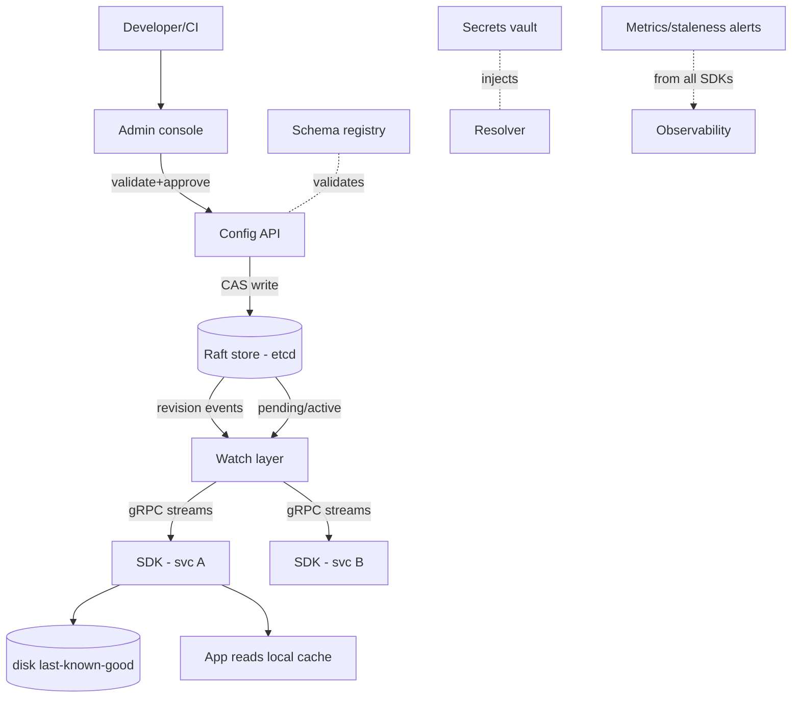

*Control-plane to data-plane flow: the admin console (or CI) submits a change through the Config API, which runs schema validation, applies a CAS write to the Raft-backed store, and the resulting revision is broadcast by the watch layer over long-lived gRPC streams to per-service SDKs. Each SDK builds and persists a local cache, serves application reads from memory, and emits staleness metrics to observability.*

---

### Architectural Patterns

- **Consensus-based KV store (etcd / Consul model):** Uses Raft or ZAB to maintain a linearizable key-value store with MVCC revision numbering. All writes go through a quorum (leader + followers); reads can be served from any node. The watch mechanism streams revision events to clients over long-lived gRPC or HTTP/2 connections. This is the dominant pattern for Kubernetes-native environments.
  *When to use*: you need strong consistency at the source, want built-in watch/push, and operate in a Kubernetes ecosystem.
  *When not to use*: you want Git as the source of truth for audit or have non-Kubernetes deployments without a managed etcd offering.

- **Git-backed config server (Spring Cloud Config / AWS AppConfig model):** Configuration is stored as YAML/JSON files in a Git repository. The config server reads from Git (via clone or pull), merges with environment-specific overrides, and serves to clients via HTTP. This provides built-in audit trail, branching, PR-based change management, and rollback via Git history. Config updates are pulled (polling) or pushed (via Git webhooks triggering server-side refresh).
  *When to use*: you want Git-native workflows (PRs, branches, CI gates), audit trails, and environment separation via directory structure (e.g., `application-prod.yml`).
  *When not to use*: you need sub-second propagation or have very high read volume that Git polling can't satisfy efficiently.

- **Push-based config distribution (XDS / Netflix Archaius model):** The config server maintains long-lived streaming connections and pushes updates to clients immediately upon change. Uses SSE, gRPC bidirectional streams, or WebSocket. Clients don't poll; the server initiates the push. This minimizes propagation latency.
  *When to use*: sub-second propagation is required (kill switches, dynamic throttling).
  *When not to use*: clients are behind restrictive proxies, or the fleet is very large and the server can't maintain millions of connections.

- **Pull-based polling (legacy model):** Clients periodically poll the config server for updates, comparing revision numbers. Simple but wasteful — every client makes a request on every polling interval, and propagation lag is bounded by the poll interval.
  *When to use*: simple deployments, constrained environments where streaming connections aren't possible.
  *When not to use*: large fleets where polling creates significant load or where sub-minute propagation is required.

- **Hybrid pull + push (Netflix Archaius 2 / AWS Systems Manager):** Combines pull for initial bootstrap (ensures a known-good state at startup) with push for real-time updates (streaming watches for active instances). Most production systems use this pattern.
  *When to use*: production deployments of any significant scale.
  *When not to use*: very small deployments where the overhead isn't justified.

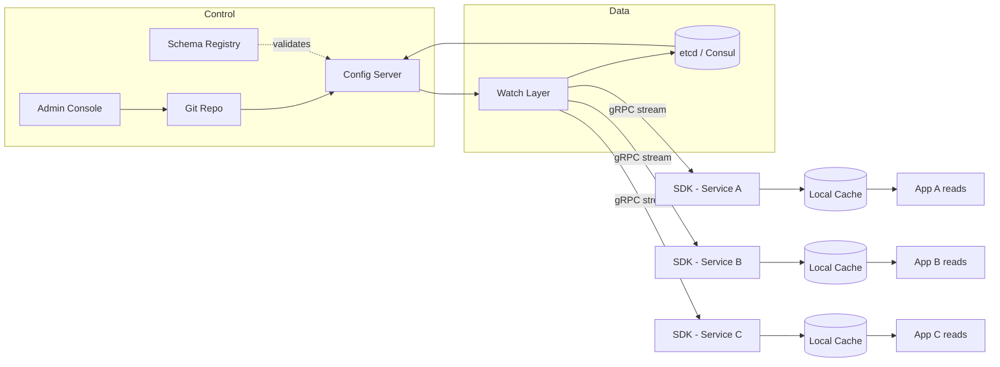

*Architectural patterns comparison: Git-backed config servers store configuration as files in version control, with the server reading from Git and optionally backing onto a consensus KV store. The watch layer streams changes to client SDKs over gRPC; each SDK maintains a local cache that the application reads from directly, never hitting the central store on the hot path.*

---

### Benefits

- **Operational agility:** configuration changes that historically required a full CI/CD pipeline run can now be applied in seconds, enabling rapid incident response and fine-tuned experimentation.
- **Consistency across the fleet:** a single source of truth ensures that all service instances in a given environment see the same configuration values, eliminating snowflake-server drift.
- **Zero-downtime changes:** hot reload allows applications to pick up new configuration values without restarting, maintaining availability during operational tuning.
- **Git-integrated workflows:** Git-backed systems provide a familiar PR-based review process, branch-based environment separation, and immutable audit history for every change.
- **Risk mitigation through gradual rollout:** canary deployment and staged rollout let you validate a config change on a small subset of instances before fleet-wide exposure, with automatic rollback on anomaly detection.
- **Audit and compliance:** every configuration change is versioned and attributed to an actor, with a full diff and timestamp — essential for SOC 2, PCI-DSS, and incident postmortems.
- **Secret lifecycle management:** secrets are decoupled from application code and binaries, with TTL-based rotation, encryption-at-rest, and audit logging of every decryption event.

---

### Challenges

- **Hot-reload race conditions:** when a config change is applied mid-request, the application must reload shared state without corrupting in-flight operations. A naive field re-assignment can cause partially-updated objects; solutions need atomic swaps (volatile references, immutable config objects, or thread-safe builders).
- **Propagation latency across a global fleet:** changes written in one region must reach instances in all regions. Cross-region async replication introduces a window of inconsistency (seconds to minutes). Services in the lagging region read stale values, which can cause behavioral discrepancies.
- **Schema evolution and backward compatibility:** a config key valid in one format (e.g., `timeout: 5000` in milliseconds) may be changed to a new format (e.g., `timeout: "5s"` with a duration string). Old clients must either gracefully degrade or the system must maintain backward-compatible aliases during a transition period.
- **Multi-region consistency and conflict resolution:** when regional config clusters accept writes independently (for availability), conflicting values can arise. Last-write-wins (LWW) via vector clocks resolves this but can silently discard a valid change. Cross-region writes should be routed to a single primary to avoid conflicts.
- **Client SDK resilience:** network blips, store unavailability, and connection resets must not leave clients permanently stale. SDKs must implement reconnection with exponential backoff, periodic reconciliation (re-fetch + diff to detect missed events), and graceful fallback to last-known-good snapshots on disk.
- **Securing sensitive data (secrets) in configuration:** convenience tempts teams to store DB passwords and API tokens alongside ordinary config. Without structural guards (separate secrets vault with access policies, encryption-at-rest, audit), a single compromised config read exposes credentials.
- **Change approval and governance workflows:** production config changes can cause immediate fleet-wide impact. Without approval workflows (two-person rule, canary soak, automated rollback on anomaly), a typo or wrong value can take down the entire service.
- **Configuration drift detection:** even with a central store, individual instances can diverge due to failed updates, SDK bugs, or manual overrides. Detecting drift requires clients to report their resolved config or revision back to the control plane for comparison.
- **Version control integration complexity:** Git-backed systems must handle large repositories, slow clones, and merge conflicts. A config change in a PR may be approved but not yet synced to the config server; the delay between PR merge and active deployment is a source of confusion.
- **Client-side version surfacing:** without exposing the current config revision on health endpoints, operators cannot correlate "works on my instance" issues. Each service must expose its resolved config revision or hash in `/health` or `/metrics` for debugging.

---

### Best Practices

- **Always validate config before propagation:** schema validation (field types, ranges, required keys) and semantic validation (e.g., `timeout_ms <= health_check_interval_ms`) should run before a write is committed. The Config API rejects invalid writes; clients also re-validate on receipt as defense-in-depth.
- **Use canary rollout with health checks:** never push a config change to the full fleet immediately. Route the change to a small canary cohort (1–5% of instances), monitor key metrics (error rate, latency, resource usage) for a soak period (5–15 minutes), then gradually increase to 100%.
- **Maintain last-known-good snapshots:** the client SDK should persist a successfully-applied config snapshot to disk after each successful update. On startup or store outage, the SDK loads from disk — the service starts with the last known-good config rather than failing or using unsafe defaults.
- **Use hierarchical namespaces for environment isolation:** organize config keys hierarchically (`/global/database.url`, `/prod/database.url`, `/prod/us-east-1/service-name/instance-001/`). Resolution follows a precedence stack (instance → service → region → environment → global), with most-specific winning. This prevents cross-environment leaks.
- **Implement circuit breakers in client SDKs:** if the config store becomes unavailable, the SDK should not block application startup or requests. After the initial fetch (which may use last-known-good), subsequent watch failures should be logged and the SDK should continue serving from local cache.
- **Encrypt secrets at rest and inject at runtime:** never store plaintext secrets in config files or the KV store. Reference secrets by key (e.g., `${vault:secret/data/db-password}`); the resolver fetches and decrypts them at injection time. The KV store stores only a reference, not the value.
- **Monitor config propagation latency and client staleness:** instrument the time between a config write (revision N) and the moment a client's SDK reports revision N. Alert if any region's staleness exceeds a threshold (e.g., 10 seconds for normal changes, 30 seconds for emergency changes).
- **Expose config revision on health endpoints:** every service should expose `GET /health` returning `{ "configRevision": "12345", "configLastUpdated": "2024-01-15T10:30:00Z" }`. This lets operators and dashboards identify which instances are running which config version.
- **Use feature flags for risky changes:** wrap new configuration values behind feature flags. Even if the config value is correct, the underlying code path can be enabled gradually, reducing the blast radius of a logic bug.
- **Design for idempotent config application:** the config reload handler should be idempotent — applying the same config twice produces the same state. This is critical for reconciliation loops where the SDK periodically re-fetches and re-applies config to recover from a missed watch event.

---

### When to Use / When Not to Use

**Use when:**

- You operate a microservices architecture with many service instances that need coordinated runtime settings (timeouts, retries, circuit-breaker thresholds) without redeployment.
- Incident response speed matters — you need to apply a kill switch or tighten a timeout across the fleet in seconds to stop a cascading failure.
- You run multiple environments (dev, staging, prod) or regions with overlapping but distinct configuration that must be managed centrally.
- Feature flagging and gradual rollout of operational parameters (not code) are part of your release process.
- You need an auditable, versioned history of every configuration change for compliance (SOC 2, PCI-DSS) or incident postmortems.

**Avoid when:**

- You have a monolithic application with static configuration that rarely changes. A simple environment variable or properties file is sufficient.
- Configuration changes are rare (< 1 per month) and always coordinated with code deploys. The operational overhead of a config system isn't justified.
- Your deployment is a single process or a handful of instances — the quorum requirements and operational burden outweigh the benefits.
- You can tolerate redeploy-based config changes (CI/CD pipeline takes seconds to minutes) and don't need sub-minute propagation.
- Secrets are your primary concern — a dedicated secrets manager (Vault, AWS Secrets Manager) is more appropriate than a general-purpose config store.

**Alternatives:**

- **Environment variables / property files:** Simple, no extra infrastructure. Works for monolithic or small deployments. No dynamic reload, no central audit, no cross-service consistency.
- **Feature flag platforms (LaunchDarkly, Split):** Specialized for gradual rollout and experimentation of feature toggles. Doesn't cover all configuration types (timeouts, pool sizes) but excels at boolean/feature toggles.
- **Kubernetes ConfigMaps / Secrets:** Built into Kubernetes, no additional infrastructure. Limited to k8s-native workloads; not suitable for non-k8s deployments. No built-in validation or staged rollout.
- **Infrastructure-as-Code (Terraform, CloudFormation):** Manages infrastructure-level configuration. Not suitable for application runtime config that needs to change without infrastructure recreation.

**Decision factors:**

- **Fleet size and change frequency:** If you have >100 instances and changes more than weekly, a config system pays for itself. Below that threshold, simpler tools suffice.
- **Propagation latency requirement:** Sub-second needs → consensus KV with push (etcd/Consul). Sub-minute needs → Git-backed with polling.
- **Operational maturity:** A config system adds operational burden (quorum management, backups, upgrades). Only adopt if your team can handle the added complexity.
- **Environment complexity:** If you have many environments/regions with divergent config, hierarchical namespacing provides clarity that flat files can't.

---

### Data Model and API

The data model for a distributed configuration management system is hierarchical: configuration is organized into namespaces (environment, region, service, instance) containing keys with values, metadata, and revision history. Each version of every key is immutable; changes create a new revision rather than overwriting in place.

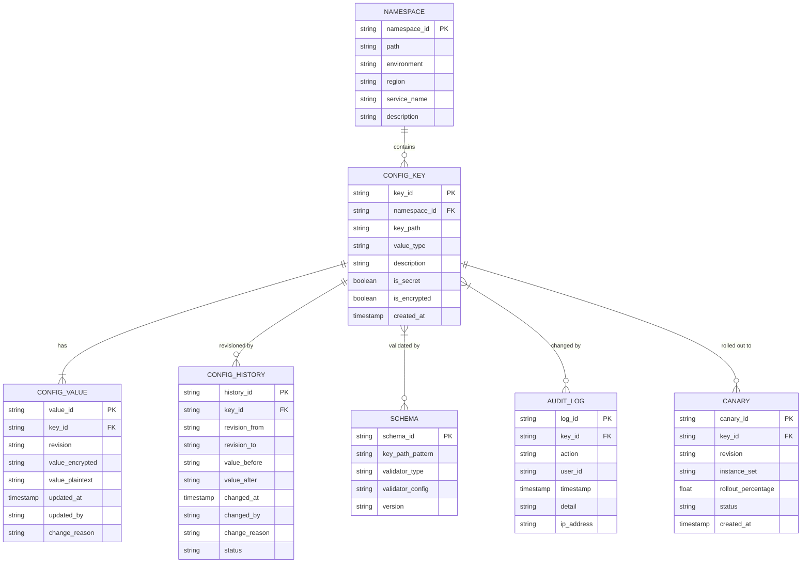

*The entity-relationship diagram for the configuration management data model: namespaces provide hierarchical organization (environment → region → service → instance); each namespace contains config keys; each key has a current value, a revision history (immutable before/after snapshots), a schema validator, an audit log, and optional canary rollout tracking. Values are stored encrypted at rest with metadata about who changed them and why.*

**Entity descriptions:**

- **NAMESPACE:** Hierarchical container for configuration keys. `namespace_id` (PK), `path` (e.g., `/prod/us-east-1/order-service/`), `environment` (dev/staging/prod), `region`, `service_name`. Namespaces enforce isolation — a key in the prod namespace is completely independent from the same key in staging.
- **CONFIG_KEY:** Metadata about a configuration key. `key_id` (PK), `namespace_id` (FK), `key_path` (e.g., `database.connection.timeout`), `value_type` (string/int/duration/bool/json), `is_secret` flag, `is_encrypted` flag. Keys are immutable in structure — only values change.
- **CONFIG_VALUE:** The current value for a key at a given revision. `value_id` (PK), `key_id` (FK), `revision` (monotonically increasing), `value_encrypted` (encrypted blob), `value_plaintext` (for non-secret values). Updated atomically via CAS (compare-and-swap) on revision.
- **CONFIG_HISTORY:** Immutable audit trail of every value change. `history_id` (PK), `key_id` (FK), `revision_from`, `revision_to`, `value_before`, `value_after`, `changed_by`, `change_reason`, `status` (applied/reverted). Enables git-like diff and rollback.
- **SCHEMA:** Validation rules for keys. `schema_id` (PK), `key_path_pattern` (regex or glob), `validator_type` (jsonschema, regex, range), `validator_config` (JSON), `version`. The Config API calls the appropriate validator before accepting a write.
- **AUDIT_LOG:** Every operation on every key. `log_id` (PK), `key_id` (FK), `action` (CREATE/UPDATE/DELETE/READ), `user_id`, `timestamp`, `detail`, `ip_address`. Separate from history — captures reads and admin actions too.
- **CANARY:** Staged rollout tracking. `canary_id` (PK), `key_id` (FK), `revision`, `instance_set` (set of instance IDs), `rollout_percentage`, `status` (pending/active/completed/reverted). Used by the canary engine to route values to specific instances.

**Indexes and Constraints:**

- `NAMESPACE.path` — UNIQUE index (prevents duplicate namespaces).
- `NAMESPACE(environment, region, service_name)` — composite index for namespace lookup.
- `CONFIG_KEY(namespace_id, key_path)` — composite index for key resolution within a namespace.
- `CONFIG_VALUE(key_id, revision)` — composite PK + index for version retrieval.
- `CONFIG_HISTORY(key_id, changed_at)` — index for time-range audit queries.
- `AUDIT_LOG(key_id, timestamp)` — index for forensic queries ("what happened to this key?").
- `AUDIT_LOG(user_id, timestamp)` — index for user activity audit.

**Partitioning / Sharding:**

- **NAMESPACE:** Sharded by `hash(environment + region)` — namespaces in the same environment/region are co-located, but different environments are isolated.
- **CONFIG_KEY:** Sharded by `hash(namespace_id)` — all keys in a namespace are on the same shard, enabling atomic multi-key transactions within a namespace.
- **CONFIG_VALUE:** Sharded by `hash(key_id)` — values for a given key are colocated, ensuring read consistency of the latest revision.
- **CONFIG_HISTORY:** Sharded by `hash(key_id)` with a secondary index on `(changed_by, timestamp)` for cross-key user audits.
- **AUDIT_LOG:** Time-based partitioning (monthly partitions) because audit logs are append-only and queried by time range.

**API Contract:**

| Method | Endpoint | Purpose | Rate Limit |
|---|---|---|---|
| GET | `/api/v1/config/{namespace}/{key}` | Fetch current value | 10,000 req/s |
| PUT | `/api/v1/config/{namespace}/{key}` | Set value (CAS on revision) | 100 req/s per writer |
| POST | `/api/v1/config/{namespace}/{key}/history` | Rollback to revision | 10 req/s per writer |
| GET | `/api/v1/config/{namespace}/{key}/history` | List revision history | 1,000 req/s |
| POST | `/api/v1/config/bulk` | Bulk update multiple keys | 10 req/s per writer |
| GET | `/api/v1/config/{namespace}/export` | Export all keys in namespace | 100 req/s |
| POST | `/api/v1/config/{namespace}/{key}/canary` | Start canary rollout | 10 req/s per writer |
| GET | `/api/v1/health` | Service health + config revision | 1,000 req/s |

**GET /api/v1/config/{namespace}/{key} — Response:**

```json
{
  "key": "database.connection.timeout",
  "value": "5000",
  "value_type": "duration",
  "revision": "142",
  "last_modified": "2024-06-14T10:30:00Z",
  "modified_by": "alice@company.com",
  "is_secret": false,
  "is_encrypted": false,
  "version": 142
}
```

**PUT /api/v1/config/{namespace}/{key} — Request:**

```json
{
  "value": "8000",
  "value_type": "duration",
  "expected_revision": 142,
  "change_reason": "increasing timeout to reduce timeout errors during peak",
  "is_canary": true,
  "canary_percentage": 5,
  "canary_instances": ["svc-a-001", "svc-a-002"]
}
```

**GET /api/v1/config/{namespace}/watch — Streaming Watch (Server-Sent Events):**

```http
GET /api/v1/config/prod/us-east-1/order-service/watch?keys=database.connection.timeout,feature.flag.new-ui HTTP/1.1
Accept: text/event-stream
Authorization: Bearer <jwt>
```

```http
HTTP/1.1 200 OK
Content-Type: text/event-stream

event: config_change
data: {"revision": 143, "namespace": "prod/us-east-1/order-service", "changes": [{"key": "database.connection.timeout", "old": "5000", "new": "8000"}]}
```

*The watch endpoint streams config change events as Server-Sent Events. Clients subscribe to specific keys or entire namespaces and receive events in real-time as they are committed. The `last_event_id` can be used to resume from a specific revision if the connection drops.*

**Status codes:** `200` OK, `201` Created, `400` Invalid request, `401` Auth required, `403` Forbidden (insufficient permissions), `404` Key or namespace not found, `409` Conflict (revision mismatch — another write occurred), `423` Locked (key is in an active canary), `503` Temporarily unavailable (store unavailable, fall back to last-known-good).

---

### Domain-Specific: Configuration Management Deep Dive

This section covers the core technical challenges unique to distributed configuration management: how changes are propagated to running instances (hot reload), how clients are notified of updates (watch mechanisms), how configuration integrates with version control (Git), how values are validated before propagation (schema and semantic validation), how keys are organized hierarchically (namespacing), and how conflicting values are resolved (precedence).

#### Hot Reload

Hot reload allows an application to pick up new configuration values while it is running, without a restart. This is the defining capability that separates a distributed config system from static config files.

**In-process refresh:** The client SDK listens for config change events (via watch streams or polling). When a key the application has bound to changes, the SDK invokes a registered callback that updates the in-memory configuration object. The application must be designed to read config values through indirection (a config holder object, not hardcoded constants) so that the callback can atomically swap the reference.

```java
@Service
public class RuntimeConfig {

    private volatile AppConfig currentConfig;

    @EventListener
    public void onConfigChange(ConfigChangedEvent event) {
        if (event.affects("database.connection.timeout")) {
            this.currentConfig = buildNewConfig(event);
        }
    }

    public int getDatabaseTimeoutMs() {
        return currentConfig.databaseTimeoutMs();
    }
}
```

*The `RuntimeConfig` bean uses a `volatile` field for the config object and an `@EventListener` callback for config changes. When a watched key changes, the callback atomically swaps the reference — in-flight threads either see the old or new value, never a partially-updated one. The application always reads through `getDatabaseTimeoutMs()` rather than a static constant, so the swap takes effect immediately.*

**Class-reloading (Spring):** In Spring Boot, `@RefreshScope` marks beans whose configuration should be re-created when a `/refresh` endpoint is called. The endpoint triggers the config client to fetch new values from the config server and then destroys and re-instantiates all `@RefreshScope` beans, injecting the new property values. This is heavier than in-process refresh (bean destruction + creation) but works for framework-managed properties.

```java
@ConfigurationProperties(prefix = "app")
@RefreshScope
public class AppProperties {

    private int databaseTimeoutMs = 5000;
    private boolean featureFlagNewUi = false;

    // getters and setters
}
```

*`AppProperties` is a `@ConfigurationProperties` bean with `@RefreshScope`. When the config server pushes an update and `/actuator/refresh` is invoked, Spring destroys the old `AppProperties` instance and creates a new one with the updated values from the config server. All beans that inject `AppProperties` receive the refreshed instance.*

**Signal handling (Unix):** Some systems use OS signals (SIGHUP, SIGUSR1) as a lightweight trigger. When the config store sends an update, it can signal the application process. The application's signal handler then fetches the new config. This avoids maintaining a long-lived watch connection but sacrifices fine-grained control (the app can't know *which* keys changed, so it must re-fetch everything).

**Atomic config swap:** The safest hot-reload pattern is to build the entire new config object, validate it, and then atomically swap the reference. This prevents readers from observing a partially-updated config.

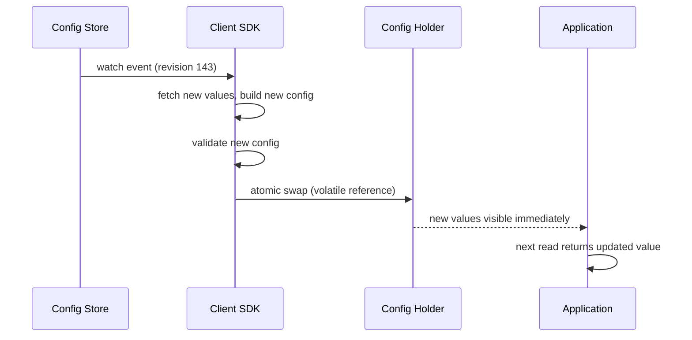

*Hot reload sequence: the config store emits a watch event with a new revision; the SDK fetches the updated values, builds and validates a new config object, then atomically swaps the reference in the config holder; all subsequent application reads immediately see the new values. No restart, no partial state.*

#### Watch Mechanisms

The watch mechanism is how the config store propagates changes to client SDKs. There are three primary approaches:

**Long-polling (HTTP):** The client sends a GET request with the current revision number. The server holds the request open until a new revision is available (or a timeout, typically 5–10 minutes). When the server responds, the client processes the change and immediately issues a new long-poll request. This is simple and firewall-friendly but creates one HTTP connection per client.

```http
GET /api/v1/config/watch?revision=142&timeout=300s HTTP/1.1
Host: config.example.com
```

```http
HTTP/1.1 200 OK
Content-Type: application/json

{"revision": 143, "changes": [{"key": "timeout", "old": "5000", "new": "8000"}]}
```

*Long-polling: the client sends its current revision and a timeout. The server blocks until a newer revision exists or the timeout expires. The response contains the changes since the client's revision. The client immediately re-issues the request, maintaining near-real-time push without a persistent connection.*

**Streaming watch (gRPC / HTTP/2):** The client opens a bidirectional or server-streaming gRPC connection. The server pushes events as they occur (no polling interval). The client can send acknowledgments and the server can detect if the client has fallen behind. This is the most efficient approach — a single connection per client carries all updates.

```java
public interface ConfigWatchService {
    stream<WatchEvent> watch(WatchRequest request);
}

// Client
configWatchService.watch(WatchRequest.newBuilder()
    .setNamespace("prod/us-east-1/order-service")
    .setSinceRevision(142)
    .build())
    .subscribe(this::onConfigChange);
```

*Streaming watch via gRPC: the client subscribes to a `WatchRequest` specifying the namespace and starting revision. The server pushes `WatchEvent` messages as they occur. The client subscribes to the stream and handles each event — no polling, no reconnects needed unless the connection drops.*

**Pub/Sub (message broker):** The config store publishes change events to a message broker (Kafka, Redis Pub/Sub, NATS). Clients subscribe to topics/patterns. This decouples the store from the clients and scales horizontally, but adds a broker dependency and can introduce additional latency.

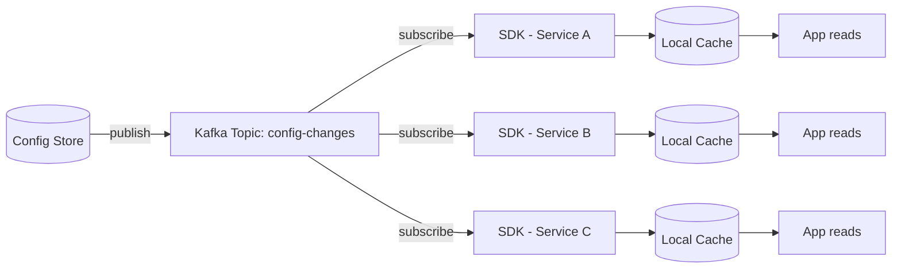

*Pub/Sub watch mechanism: the config store publishes change events to a Kafka topic. Each service's SDK subscribes to the topic (filtered by namespace/service pattern), receives events, updates its local cache, and the application reads from the cache. This decouples the store from clients and provides horizontal scalability through Kafka's partitioning.*

#### Version Control Integration

Git-backed configuration stores use Git as the source of truth for configuration data. Every change is a commit; every environment is a branch or directory; every rollback is a Git reset or checkout.

**Directory structure:** A typical Git-backed config repository uses a hierarchical directory structure:

```
config-repo/
├── application.yml              # global defaults
├── application-prod.yml         # prod overrides
├── application-staging.yml      # staging overrides
├── database/
│   ├── application-prod-us-east.yml
│   └── application-prod-eu-west.yml
└── services/
    ├── order-service/
    │   ├── application-prod.yml
    │   └── application-prod-us-east.yml
    └── payment-service/
        ├── application-prod.yml
        └── application-prod-us-east.yml
```

*Git-backed config repository structure: the base file (`application.yml`) contains global defaults. Environment-specific overrides (`application-prod.yml`) override defaults for that environment. Region-specific files and per-service files provide progressively narrower overrides following the precedence hierarchy.*

**Workflow:** Changes follow a GitOps workflow:
1. Developer submits a PR to the config repository with the proposed change.
2. The PR is reviewed (including automated schema validation as a CI check).
3. The PR is merged to the environment branch (e.g., `prod`).
4. A webhook triggers the config server to pull the new commit.
5. The config server publishes the change to the watch layer.
6. Client SDKs receive the update and hot-reload.

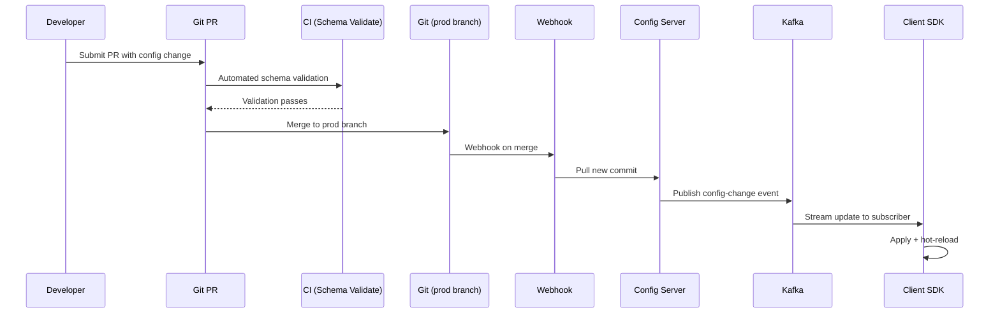

*GitOps workflow for config changes: a developer submits a PR; CI runs schema validation; on merge, a Git webhook triggers the config server to pull the new commit; the server publishes a change event to Kafka; the client SDK receives the event and hot-reloads. The entire flow from PR merge to client update takes seconds.*

**Branch strategies:**

- **Environment branches:** each environment (`dev`, `staging`, `prod`) has its own Git branch. Merging to `prod` makes the change live in production. This is the most common pattern.
- **Directory-based (single branch):** a single `main` branch with environment directories. The config server selects the right file based on the namespace label. Simpler but harder to review prod-only changes.
- **Trunk-based with tags:** changes land on `main` quickly; environments are selected by Git tags or labels. Fast iteration but less safe for prod.

```java
@Service
public class GitConfigService {

    @Value("${app.config.git-repo-uri}")
    private String gitRepoUri;

    @Scheduled(fixedDelay = 30000)
    public void syncFromGit() {
        var git = Git.open(repoDir);
        git.pull().call();
        var latestCommit = git.getRepository().getRef("HEAD").getObjectId(1).getName();

        if (!latestCommit.equals(lastSyncedCommit)) {
            var changes = computeDiff(lastSyncedCommit, latestCommit);
            publishChanges(changes, latestCommit);
            lastSyncedCommit = latestCommit;
        }
    }
}
```

*The `GitConfigService` bean periodically pulls from the Git repository (every 30 seconds by default). It compares the latest commit hash with the last synced commit; if different, it computes the diff and publishes the changes through the watch layer. This is how a Git-backed config server (like Spring Cloud Config) discovers and distributes changes.*

```yaml
# application.yml — config server bootstrap
spring:
  cloud:
    config:
      server:
        git:
          uri: https://github.com/company/config-repo
          search-paths: '{application}'
          clone-on-start: true
          label: prod
```

*Spring Cloud Config server bootstrap configuration: the server clones the Git repository on startup, searches for files matching the application name, and uses the `prod` branch (via the `label` property) for production configuration.*

#### Validation

Config validation prevents bad values from reaching the fleet. It operates at two layers: the control plane (before a write is committed) and the client SDK (before a value is applied locally).

**Schema validation:** A schema registry stores validation rules (JSON Schema, regex patterns, numeric ranges) keyed by config key path or pattern. When a write request arrives at the Config API, the API looks up the applicable schema and validates the value before committing.

```java
@Service
public class ConfigValidationService {

    private final SchemaRegistryClient schemaRegistry;

    public void validate(String keyPath, String value, String valueType) {
        var schema = schemaRegistry.getSchemaFor(keyPath);
        if (schema == null) {
            // No schema: accept any string value (with type coercion check)
            coerceOrThrow(value, valueType);
            return;
        }

        switch (schema.validatorType()) {
            case "jsonschema" -> validateJsonSchema(value, schema.config());
            case "regex" -> validateRegex(value, schema.config().path("pattern").asText());
            case "range" -> validateRange(value, schema.config().path("min").asInt(),
                                          schema.config().path("max").asInt());
            case "enum" -> validateEnum(value, schema.config().path("allowed").asText());
        }
    }

    private void validateRange(String value, int min, int max) {
        var num = Integer.parseInt(value);
        if (num < min || num > max) {
            throw new ConfigValidationException(
                "Value %s out of range [%d, %d]".formatted(value, min, max));
        }
    }
}
```

*The `ConfigValidationService` bean validates config values against schemas from the Schema Registry. For each key path, it looks up the schema and dispatches to the appropriate validator based on the validator type. Range validation ensures numeric values (like timeouts) stay within safe bounds. This runs at the Config API before committing a write.*

**Semantic validation:** Beyond type/range checks, some validations require context. For example, `read_timeout_ms` must be greater than `connect_timeout_ms`. Semantic validators run as part of the approval workflow, not at the API gateway.

```java
@Component
public class SemanticValidator {

    public void validateCrossField(ConfigChange change) {
        var timeout = Integer.parseInt(change.getNewValue("database.connection.timeout"));
        var retry = Integer.parseInt(change.getNewValue("database.connection.retries"));
        var totalWait = timeout * retry;

        if (totalWait > 30000) {
            throw new ConfigValidationException(
                "Total potential wait time (%d ms) exceeds maximum (30000 ms)".formatted(totalWait));
        }
    }
}
```

*The `SemanticValidator` component checks cross-field constraints that can't be expressed in a single-key schema. For example, it verifies that the product of `timeout` and `retries` doesn't exceed a safe maximum. This runs during the canary/gradual rollout workflow before the change is exposed to the full fleet.*

**Client-side re-validation:** The client SDK re-validates every received value before applying it locally. This is defense-in-depth: even if the control plane validation is bypassed or has a bug, the client can reject values that would cause a crash or unsafe behavior.

#### Namespacing

Configuration keys are organized into hierarchical namespaces to provide isolation and enable precedence-based overrides. A namespace path follows the pattern:

```
/{environment}/{region}/{service}/{instance}
```

- **Global (root):** `/global/` — default values for all services, environments, and regions. Contains non-sensitive defaults (e.g., default timeout, default log level).
- **Environment:** `/{env}/` (e.g., `/prod/`, `/staging/`) — environment-specific overrides (e.g., prod uses a higher DB pool size than staging).
- **Region:** `/{env}/{region}/` (e.g., `/prod/us-east-1/`) — region-specific overrides (e.g., prod EU uses a different DB endpoint than prod US).
- **Service:** `/{env}/{region}/{service}/` — per-service overrides (e.g., payment-service has stricter timeouts than notification-service).
- **Instance:** `/{env}/{region}/{service}/{instance}/` — per-instance overrides (rare; used for debugging or migration).

Each namespace can contain its own copy of a key. During config resolution, the system merges all applicable namespaces following the precedence stack, with the most specific namespace winning.

**Key naming conventions:**

- Keys use dot-notation for hierarchical structure within a namespace: `database.connection.timeout`, `feature.flag.new-ui`, `cache.redis.ttl`.
- Keys are case-sensitive and must be URL-safe.
- Secret keys are prefixed with `secret.` (e.g., `secret.database.password`) to signal that the value should be encrypted and handled differently from regular config.
- Versioned keys include a version suffix: `schema.version.v2` — allows gradual migration from v1 to v2 without breaking old clients.

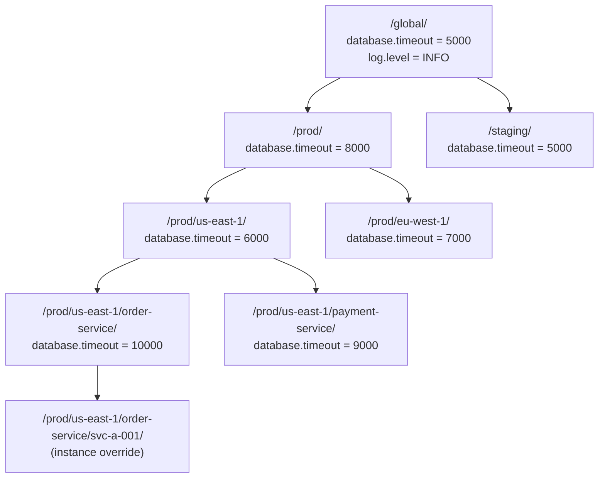

*Hierarchical namespace tree: the global namespace defines default values; each environment, region, service, and instance namespace can override. The resolution engine walks the tree from root to leaf, with each level overriding the previous. The `database.timeout` example shows how the value flows from 5000 (global) → 8000 (prod) → 6000 (us-east-1) → 10000 (order-service), with the most specific value winning.*

**Namespace isolation for security:**

- Each namespace has an access control policy (RBAC) — a service in `order-service` can read/write keys in `/prod/us-east-1/order-service/` but not in `/prod/us-east-1/payment-service/`.
- Cross-namespace reads require explicit delegation (an import policy that copies values from another namespace).
- Secrets in a namespace are scoped to that namespace only — a service cannot read secrets from a different service's namespace unless explicitly granted.

```java
@Service
public class NamespaceResolver {

    private static final List<String> PRECEDENCE_ORDER = List.of(
        "global", "environment", "region", "service", "instance"
    );

    public ResolvedConfig resolveConfig(String namespacePath, Map<String, String> flatKeys) {
        var layers = buildLayerStack(namespacePath);
        var resolved = new HashMap<String, ConfigValue>();

        for (String layer : layers) {
            var layerValues = fetchLayerValues(layer, flatKeys);
            for (var entry : layerValues.entrySet()) {
                // Most-specific layer wins
                resolved.put(entry.getKey(), entry.getValue());
            }
        }

        return new ResolvedConfig(resolved, layers);
    }

    private List<String> buildLayerStack(String namespacePath) {
        var parts = namespacePath.split("/");
        var layers = new ArrayList<String>();
        // Build from most general to most specific
        layers.add("/global/");
        if (parts.length > 1 && !parts[1].isBlank()) layers.add("/" + parts[1] + "/");
        if (parts.length > 2 && !parts[2].isBlank()) layers.add("/" + parts[1] + "/" + parts[2] + "/");
        if (parts.length > 3 && !parts[3].isBlank()) layers.add("/" + parts[1] + "/" + parts[2] + "/" + parts[3] + "/");
        if (parts.length > 4 && !parts[4].isBlank()) layers.add(namespacePath + "/");
        return layers;
    }
}
```

*The `NamespaceResolver` bean builds a layer stack from most general (global) to most specific (instance). It fetches values from each layer in order, with each layer overriding the previous. This produces the final resolved config where the most specific namespace always wins. The `ResolvedConfig` carries both the final values and the layer stack for debugging.*

#### Precedence

When multiple namespaces define the same key, precedence determines which value wins. The standard precedence stack (most general → most specific):

1. **Global defaults** — the base layer, lowest priority.
2. **Environment overrides** — per-environment (prod/staging/dev) overrides.
3. **Region overrides** — per-region (us-east-1/eu-west-1) overrides.
4. **Service overrides** — per-service overrides (order-service/payment-service).
5. **Instance overrides** — per-instance overrides (rare, for debugging).

**Conflict resolution strategies:**

- **Override (most common):** the most specific namespace's value replaces the less specific one. This is the default behavior — simple, predictable, and matches what operators expect.
- **Merge:** for structured values (JSON objects), merge at the field level rather than replacing the entire value. Useful for configs like logging configuration where you want to override only the log level but keep all other settings from the global default.
- **Explicit priority:** some systems allow setting a numeric priority per namespace. Higher priority wins regardless of specificity. This is useful for emergency overrides that must take precedence over all other layers.

**Example precedence resolution table:**

| Key | Global | Prod | us-east-1 | order-service | Instance | Resolved Value |
|---|---|---|---|---|---|---|
| `database.timeout` | 5000 | 8000 | 6000 | 10000 | — | 10000 |
| `database.timeout` | 5000 | 8000 | — | — | — | 8000 |
| `log.level` | INFO | WARN | — | DEBUG | — | DEBUG (service overrides) |
| `feature.flag.new-ui` | false | false | — | — | — | false |
| `feature.flag.new-ui` | false | false | — | true | — | true (canary in prod) |

*Precedence resolution example: `database.timeout` is overridden at each level, with the service-level value (10000) winning in the us-east-1 prod service. `log.level` shows how a service-specific override (DEBUG) takes precedence over both global (INFO) and environment (WARN). The feature flag shows canary deployment — initially false, then enabled for a specific service as a canary.*

**Canary precedence override:**

Canary deployments temporarily insert a higher-priority namespace between the service and instance layers. A canary namespace `/{env}/{region}/{service}/_canary_{id}/` has higher precedence than the service namespace, allowing a small set of instances to receive different values while the rest continue with the production value.

```java
@Service
public class CanaryConfigRouter {

    public String resolveWithCanary(String keyPath, ResolvedConfig resolved, String instanceId) {
        var canaryRevision = canaryRegistry.getActiveCanary(keyPath);
        if (canaryRevision != null && canaryRevision.includesInstance(instanceId)) {
            // Canary namespace has higher precedence
            return fetchFromCanary(canaryRevision.namespace(), keyPath);
        }
        // Normal precedence resolution
        return resolved.getValue(keyPath);
    }
}
```

*The `CanaryConfigRouter` bean checks if the current instance is part of an active canary rollout for the requested key. If so, it fetches the canary value (which has higher precedence than the normal service namespace). Otherwise, it falls back to the standard precedence resolution. This allows safe, gradual rollout of config changes.*

**Time-based precedence:**

Some values have time-based validity — a canary value is only effective during a specific time window. The resolution engine checks the current timestamp against the canary's start/end time and applies the canary value only within that window. After the window expires, the value reverts to the service-level default.

---

### Replication Strategies

A distributed configuration management system must replicate its key-value store across multiple nodes to ensure availability and durability. Three primary replication strategies apply: Raft consensus, leaderless replication, and multi-region async replication.

**Raft consensus (etcd / Consul model):** The store is a cluster of 3–5 nodes using the Raft consensus algorithm. All writes go through the elected leader; the leader replicates log entries to followers, and a write is committed when a majority (quorum) acknowledges. This provides strong consistency — every read from the leader (or a linearized read from any replica) returns the latest committed value. The watch mechanism is tied to the Raft revision number: events are emitted in the order they are committed, ensuring clients see changes in the correct sequence.

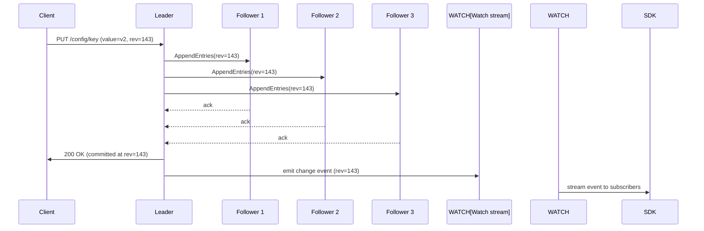

*Raft consensus write flow: the client writes to the leader; the leader replicates the log entry to all followers; once a quorum (3 of 5) acknowledges, the write is committed and a 200 OK is returned; the watch stream emits the change event in revision order, ensuring clients see changes in the correct sequence.*

**Read consistency levels:**

- **Strong (linearizable) read:** the read is served by the leader and includes a read index check. Guarantees the latest committed value. Used for critical reads (e.g., initial bootstrap fetch).
- **Stale read:** the read can be served by any follower without a round-trip to the leader. The value may be slightly behind the leader (eventual consistency). Used for the hot path (after initial bootstrap, the local cache + watch stream keeps clients up-to-date).

**Leaderless replication (DynamoDB / Cassandra model):** Some config stores use quorum-based replication (R/W) without a single leader. Any node can accept writes; a write is committed when W replicas acknowledge. Reads query R replicas and return the latest version (based on revision/timestamp). Conflict resolution uses vector clocks or last-write-wins. This provides higher write availability but weaker consistency.

**Multi-region async replication:** For global deployments, each region runs its own Raft cluster (3–5 nodes locally). Writes in one region are asynchronously replicated to other regions via a cross-region log. This provides regional autonomy (writes succeed even if cross-region connectivity is down) at the cost of eventual global consistency.

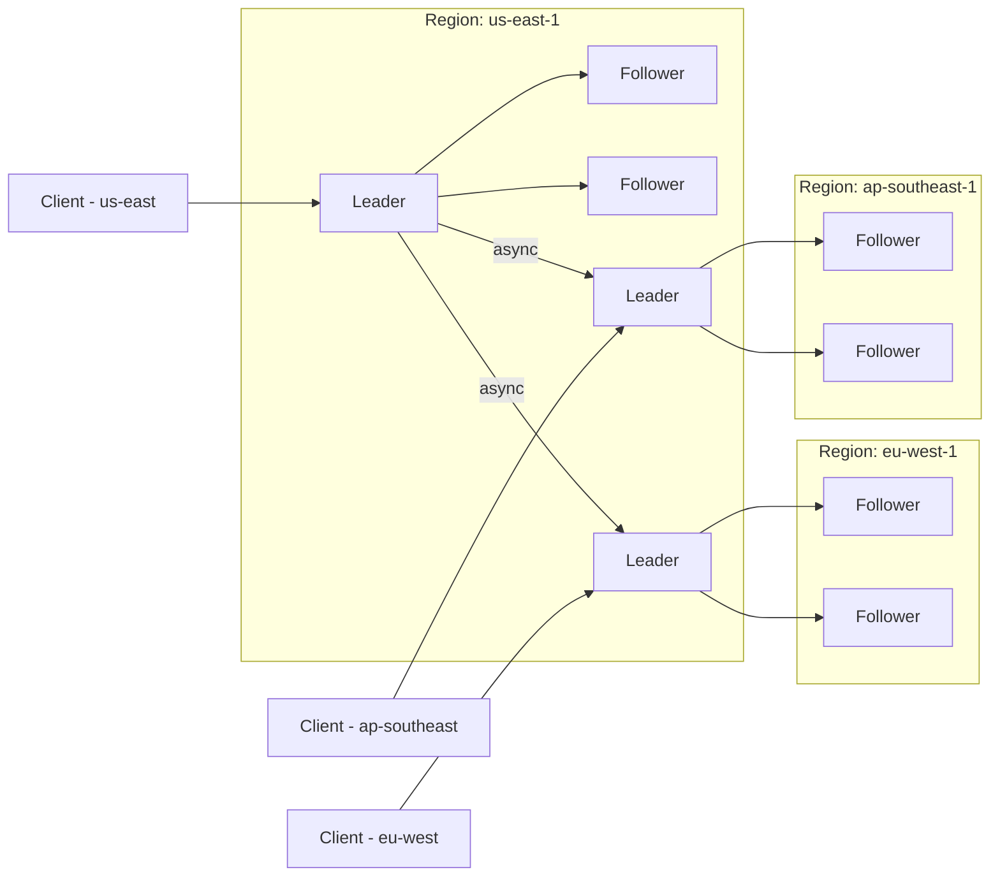

*Multi-region async replication: each region has its own local Raft cluster (leader + 2 followers) for strong consistency within the region. Cross-region replication is asynchronous — writes in us-east-1 are forwarded to eu-west-1 and ap-southeast-1 leaders via async log replication. This provides regional autonomy (users in each region get low-latency reads from their local cluster) with eventual global consistency.*

**Conflict resolution in multi-region:**

- **Single primary:** all writes go to a designated primary region (e.g., us-east-1); other regions are read-only. No conflicts possible, but cross-region write latency is high.
- **Multi-primary with conflict detection:** each region accepts writes; conflicts are detected via revision vectors and resolved by application-defined merge logic. Complex but allows region-local writes.
- **Last-write-wins (LWW):** each key has a timestamp; the latest timestamp wins. Simple but can silently discard valid writes during clock skew.

**Real-world use:** etcd uses Raft for Kubernetes config; Consul uses Raft for its catalog + gossip for membership; DynamoDB Global Tables use leaderless multi-region replication with LWW; ZooKeeper uses ZAB (similar to Raft).

---

### Failure Detection and Membership

A distributed config store must detect failed nodes, redistribute leadership, and continue serving during partial outages without data loss.

**Leader election and failover:** In a Raft cluster, if the leader stops responding (misses heartbeat for the election timeout, typically 1–3 seconds), followers initiate an election. A follower requests votes from peers; if it gets a majority, it becomes the new leader. During the election (typically 100–500 ms), the cluster is unavailable for writes but can still serve stale reads from followers. Clients retry writes with exponential backoff.

```mermaid
graph LR
    L[Leader] --|heartbeat| F1[Follower]
    L --|heartbeat X (missed)| F2[Follower]
    F2 --|election timeout| C1[Candidate - request vote]
    C1 --> F1
    F1 -->|vote| C1
    C1 --> L
    L -->|vote| C1
    C1 -->|majority| WIN[C1 becomes Leader]
    WIN -->|AppendEntries| F1
    WIN -->|AppendEntries| L
```

*Raft leader election on leader failure: the leader stops sending heartbeats; a follower times out (election timeout), becomes a candidate, requests votes from peers; if it gets a majority, it becomes the new leader and begins replicating the log. The old leader, upon recovery, steps down to follower. Clients reconnect to the new leader for writes.*

**Health checks:**

- **Liveness probes:** HTTP `/health` endpoint checked every 2–5 seconds. If unhealthy, the orchestrator (Kubernetes) restarts the pod or removes the node from the cluster.
- **Readiness probes:** Checks if the node can serve requests (e.g., can connect to the local data directory, Raft peer connections healthy). Not-ready nodes are removed from the load balancer.
- **Business health checks:** Custom checks like "Raft commit index is not lagging" or "watch event channel depth < 10,000".

**Failure detection timing for config stores:**

| Component | Check Interval | Timeout | Action |
|---|---|---|---|
| Raft leader heartbeat | 100ms | 1s | Trigger election if missed |
| Client watch connection | 30s | 60s | Reconnect with backoff |
| Cross-region replication | 10s | 60s | Mark region as degraded; queue writes |
| Client SDK reconciliation | 5min | 10min | Force full re-fetch |
| Schema registry health | 10s | 30s | Reject writes if unavailable |

**Gossip-based membership (Consul model):** Consul uses a gossip protocol (SWIM) for membership management alongside Raft for consensus. Each node periodically exchanges health information with a random subset of peers. Failed nodes are suspected after a few rounds of gossip. This provides fast, decentralized failure detection — useful for the service discovery aspect of config (which services are alive and should receive config updates).

```java
@Component
public class NodeHealthMonitor {

    private final MeterRegistry meterRegistry;
    private final ConfigStoreClient storeClient;

    @Scheduled(fixedRate = 30000)
    public void checkStoreHealth() {
        var start = System.nanoTime();
        try {
            var rev = storeClient.getRevision();
            var latency = System.nanoTime() - start;

            Gauge.builder("config.store.latency.ms")
                .register(meterRegistry, latency / 1_000_000.0);

            if (latency > 500_000_000) {
                meterRegistry.counter("config.store.slow").increment();
            }
        } catch (Exception e) {
            meterRegistry.counter("config.store.errors").increment();
            // Reconnect logic
            storeClient.reconnect();
        }
    }
}
```

*The `NodeHealthMonitor` bean runs a periodic (30s) health check against the config store by fetching the current revision number and measuring latency. If the store is slow (>500ms) or returns errors, it increments counters and triggers reconnection logic. Metrics are exposed via Micrometer for alerting on config store health.*

---

### High Availability and Scalability

A config management system sits at the base of the service stack — if it goes down, services can still run (thanks to local caches) but cannot adapt to changes. The system must be available during node failures, network partitions, and regional outages while scaling to handle millions of clients.

#### Multi-Region Deployment

Deploy active config clusters in at least 3 regions (e.g., us-east-1, eu-west-1, ap-southeast-1). Clients are routed to their nearest regional cluster via DNS or a regional load balancer. Each region is self-sufficient for writes and reads, with asynchronous cross-region replication for durability.

- **Active-standby for config writes:** All writes go to the designated primary region (e.g., us-east-1). Other regions accept reads from their local replica but redirect writes to the primary. Cross-region replication lag is typically 1–3 seconds.
- **Active-active for reads:** Each region serves reads from its local cluster. For config, reads are served from the local cache (updated via watch stream), so regional reads are effectively local even in active-standby write mode.
- **Global DNS:** Route53 or Cloudflare with latency-based routing directs clients to the nearest healthy region. If a region fails, DNS fails over to the next nearest.

#### Auto-Scaling

- **Stateless services (config API, watch layer):** Scale horizontally based on CPU and request latency. Kubernetes HPA adjusts replica count automatically. The watch layer scales by adding more gRPC stream handler pods behind a load balancer.
- **Stateful services (Raft store):** Scale by adding nodes to the Raft cluster (increasing fault tolerance from 1 to 2 failures). For higher write throughput, partition the key space across multiple Raft groups (sharding). Each shard is an independent Raft cluster.
- **Watch fan-out:** The watch layer is a read-only fan-out from the Raft store. Add more watch handler pods to handle more concurrent client streams. Each pod maintains a subset of client connections.

#### Graceful Degradation

When a component fails, the system should degrade rather than crash:

- **Config store down:** Client SDKs continue serving from their local cache with last-known-good values. New config changes can't propagate until the store recovers. Services remain operational with slightly stale config. If a service restarts during a store outage, it boots from its on-disk last-known-good snapshot.
- **Watch stream drops:** The SDK detects the stream interruption (no heartbeat for > 60 seconds) and reconnects with exponential backoff. After reconnection, it performs a reconciliation: fetches the current revision, compares with its local revision, and applies any missed changes.
- **Schema registry down:** Writes are rejected (fail fast) rather than allowing unvalidated config that could cause fleet-wide outages. Reads are unaffected — existing cached configs remain valid.
- **Cross-region replication lag:** Regional clusters serve stale-but-valid config from their local store. The lag is monitored and alerted on. If it exceeds a threshold (e.g., 60 seconds), new writes are paused on the secondary regions to prevent deep divergence.

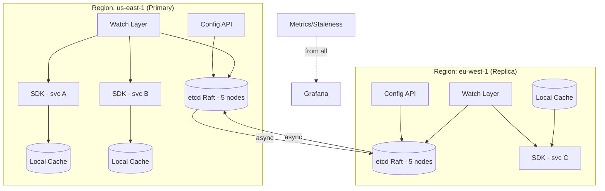

*Multi-region high availability: the primary region (us-east-1) handles all writes through its etcd Raft cluster; the replica region (eu-west-1) accepts reads from its local store with async replication from primary. Each region's watch layer streams changes to local SDKs. If the primary region fails, writes are paused and DNS fails over to the replica; if a client loses its watch stream, the SDK reconnects and reconciles. A global metrics dashboard monitors cross-region staleness.*

---

### Performance and Optimization

The performance of a config management system is measured by: write-to-ack latency (sub-second), propagation latency (seconds across a global fleet), and read latency (microseconds from local cache). Since reads dominate at scale, the optimization focus is on keeping local caches fresh and minimizing store load.

#### Latency Optimization

- **Local cache first, always:** After the initial bootstrap fetch, all config reads come from the in-process local cache (a thread-safe `ConcurrentHashMap` or immutable object swap). The central store is never on the read path. This achieves sub-microsecond read latency regardless of fleet size.
- **Watch-based push (not poll):** Clients receive changes via streaming watches, not polling. This eliminates polling overhead (millions of periodic requests) and minimizes propagation latency to near real-time.
- **Batch watch events:** When multiple keys change in a single revision (e.g., a bulk update), the watch event carries all changes in one message rather than N separate events. This reduces stream overhead and network round-trips.
- **Connection pooling:** SDKs maintain persistent connections (gRPC channel pooling, HTTP keep-alive) to the watch layer to avoid per-event handshake overhead. Connection reuse is especially important for the watch streams that carry millions of events.

#### Throughput Optimization

- **Sharding by namespace:** The Raft store partitions keys across multiple Raft groups (shards), each with its own leader. Writes for `/prod/us-east/order-service/` and `/prod/eu-west/payment-service/` go to different shards, allowing parallel writes. The number of shards scales with the fleet size.
- **Read replicas for bootstrap:** New instances bootstrapping their initial config can read from followers rather than the leader, reducing leader load. Strong consistency isn't needed for the initial fetch (the watch stream will bring them up to date).
- **Compression and delta encoding:** Watch events carry only the diff (changed keys), not the full config. The initial bootstrap fetch compresses the response (gzip/brotli) — for large config blobs (e.g., 5 MB of feature flag rules), compression reduces bandwidth by 5–10×.
- **Write coalescing:** If the same key is updated multiple times within a short window (e.g., rapid config iterations during debugging), the store can coalesce the updates — only the latest value is persisted and the intermediate revisions are compacted.

#### Caching Strategies

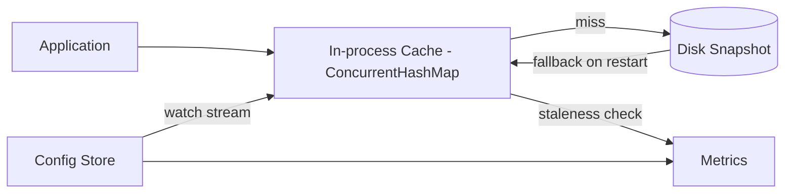

*Multi-tier caching in the client SDK: the application reads from the in-process cache (a thread-safe `ConcurrentHashMap`); on a cache miss (should never happen after bootstrap), the SDK falls back to the on-disk snapshot; the store pushes updates via the watch stream; the SDK reports staleness metrics to the observability layer.*

#### Write Path Optimization

- **Async initial fetch:** On startup, the SDK fetches the initial config asynchronously. The application can begin with compiled-in defaults and receive the real config once the fetch completes. This reduces startup latency.
- **CAS (compare-and-swap) for safe updates:** Writes include the expected current revision. If another write occurred between the client's read and write, the CAS fails and the client must re-read and retry. This prevents lost updates in concurrent write scenarios.
- **Bulk update endpoint:** For config migrations or environment setup, the API supports bulk updates (up to 100 keys per request) with a single transaction. This reduces the number of write operations and revision increments.

**Real-world use:** Netflix's Archaius 2 uses a background thread with a `ConcurrentMap` cache and polling with delta-based refresh. Spring Cloud Config + Bus uses Kafka/RabbitMQ to push refresh events via Spring Cloud Bus. Kubernetes ConfigMaps are watched via the kubelet's informer cache with delta-based updates.

---
### CAP Theorem and Consistency Trade-offs

The CAP theorem states that during a network partition, a distributed system can provide at most two of: Consistency, Availability, and Partition tolerance. Since config stores operate over networks, partition tolerance is always required. The key question is: when a partition occurs, do you sacrifice consistency (serve stale config) or availability (refuse to serve config)?

#### Config Store (Control Plane) — CP (Consistency + Partition Tolerance)

Config writes must be strongly consistent: if the API returns `200 OK` for a write, that write must be the committed value across the quorum. A stale write could cause a config change to appear lost, confusing operators during incident response. The Raft consensus algorithm provides this — writes require a quorum acknowledgment and are linearized.

However, during a partition where the leader is on the minority side, writes fail (no quorum). This sacrifices availability for consistency — the correct trade-off for the control plane. Clients retry with exponential backoff and may queue writes for replay.

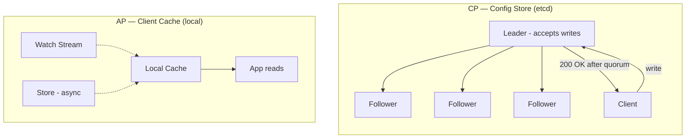

*CP vs AP split: the config store (etcd) uses Raft for CP — writes require quorum and are strongly consistent. The client-side cache is AP — it continues serving reads from memory even if the store is partitioned, accepting temporary staleness. The watch stream asynchronously updates the cache when the store is reachable.*

#### Client SDK Cache — AP (Availability + Partition Tolerance)

The client SDK's local cache prioritizes availability: if the store becomes unreachable (network partition, regional outage, client behind a firewall), the SDK continues serving the last known config from memory. This is critical — application requests must not fail because the config store is down. The trade-off is that the cache may serve stale values until the partition heals and the watch stream catches up.

- **Staleness window:** The time between a config write on the store and the SDK's cache reflecting it. Normal: 1–5 seconds (watch stream latency). During partition: indefinite until reconnection (bounded by the last-known-good snapshot age).
- **Stale read safety:** Most config values (timeouts, log levels, feature flags) are safe to serve stale. Critical security values (e.g., revoked API keys) should use a short TTL or a separate high-priority channel.
- **Reconciliation:** On reconnection, the SDK compares its local revision with the store's latest revision and applies any missed changes. If the revision gap is large (e.g., store was unreachable for hours), the SDK performs a full re-fetch.

#### Multi-Region Trade-offs

- **Strong global consistency (SPoF):** All writes go to a single global primary region. Strong consistency everywhere, but cross-region write latency is 100–500 ms and a primary region failure pauses all writes.
- **Eventual global consistency (default):** Each region has a local strong-consistency store; cross-region replication is asynchronous. Writes are fast locally, but global convergence takes 1–5 seconds. Acceptable for most config use cases.
- **Bounded staleness:** Some systems offer tunable consistency — reads with a `staleness` parameter (e.g., "config from the last 10 seconds") that route to the nearest replica. Used for read-heavy config where a few seconds of staleness is acceptable.

**Interview question:** *Is a config management system CP or AP?*
**Answer:** A nuanced choice — the **control plane** (config store) is **CP** (strong consistency for writes, since a lost config write during an incident is dangerous), while the **data plane** (client SDK cache) is **AP** (availability for reads, since application requests must not fail when the store is unreachable). The watch stream bridges them with eventual consistency (1–5 second propagation under normal conditions). This split is the key insight interviewers look for.

---

### Encryption and Key Management

A config management system stores sensitive operational data — database credentials, API tokens, encryption keys, service account tokens. Even non-secret config (e.g., internal service endpoints) can reveal architecture to an attacker. Encryption must protect data at rest, in transit, and during processing.

#### Encryption at Rest

**Config store encryption:** The Raft-backed KV store encrypts all data at rest using AES-256. etcd supports automatic encryption at rest with a configured key provider (cloud KMS, HashiCorp Vault, or a local key file). The encryption is transparent to applications — the store encrypts before persisting and decrypts on read.

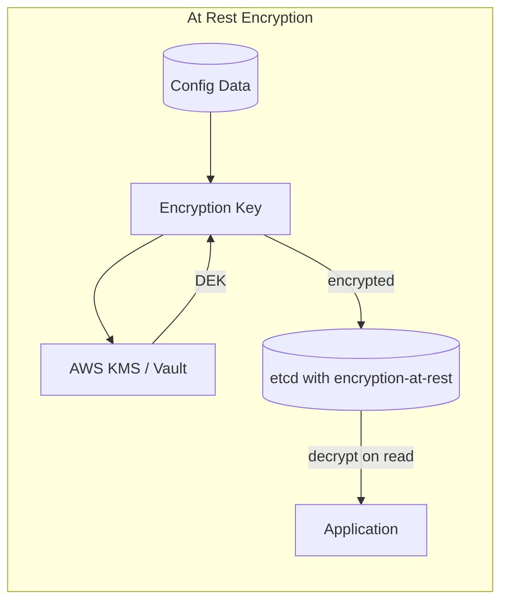

*Encryption at rest flow for the config store: the data encryption key (DEK) is wrapped by a key encryption key (KEK) managed by AWS KMS or HashiCorp Vault. The store encrypts data with the DEK before persisting to disk and decrypts with the DEK on read. The KEK never leaves the KMS/HSM.*

**Secret value encryption:** Individual secret values (passwords, tokens) within the config store are encrypted with a dedicated envelope encryption scheme. The store encrypts the plaintext value with a per-key data encryption key (DEK), and the DEK is encrypted with a master key from the KMS. The encrypted DEK is stored alongside the encrypted value.

```java
@Service
public class SecretEncryptionService {

    @Value("${app.encryption.kms-key-id}")
    private String kmsKeyId;

    private final KmsClient kmsClient;
    private final Cipher cipher;

    public EncryptedValue encrypt(String plaintext) {
        // Generate a data encryption key (DEK) via KMS
        var dek = kmsClient.generateDataKey(GenerateDataKeyRequest.builder()
                .keyId(kmsKeyId)
                .keySpec(DataKeySpec.AES_256)
                .build());

        // Encrypt the plaintext with the DEK
        cipher.init(Cipher.ENCRYPT_MODE, new SecretKeySpec(dek.plaintext(), "AES"));
        var ciphertext = cipher.doFinal(plaintext.getBytes(StandardCharsets.UTF_8));

        return new EncryptedValue(
            Base64.getEncoder().encodeToString(ciphertext),
            dek.encryptedDataKey(),
            Base64.getEncoder().encodeToString(cipher.getIV())
        );
    }

    public String decrypt(EncryptedValue encrypted) {
        // Decrypt the DEK via KMS
        var dek = kmsClient.decrypt(DecryptRequest.builder()
                .ciphertextBlob(SdkBytes.fromByteArray(encrypted.encryptedDek()))
                .build());

        // Decrypt the value with the DEK
        cipher.init(Cipher.DECRYPT_MODE,
            new SecretKeySpec(dek.plaintext().asByteArray(), "AES"),
            new GCMParameterSpec(128, Base64.getDecoder().decode(encrypted.iv())));
        return new String(cipher.doFinal(Base64.getDecoder().decode(encrypted.ciphertext())),
            StandardCharsets.UTF_8);
    }
}
```

*The `SecretEncryptionService` bean implements envelope encryption for config secrets. It generates a data encryption key (DEK) via AWS KMS, encrypts the plaintext secret value with the DEK using AES-GCM (authenticated encryption), and stores the encrypted DEK alongside the ciphertext. Decryption reverses the process — KMS decrypts the DEK, then AES-GCM decrypts the value. The KMS key ID is injected via `@Value`.*

#### Encryption in Transit

All client-to-store and client-to-SDK communication uses TLS 1.3 (minimum TLS 1.2). For internal service-to-service, mTLS (mutual TLS) with service-identity certificates is used. The watch stream (gRPC) uses TLS with certificate rotation (every 24 hours) to limit the blast radius of a compromised certificate.

#### Key Management

- **Key hierarchy:** A master key (KEK) in KMS/HSM encrypts per-namespace DEKs. Rotating the KEK requires re-encrypting all DEKs, not the underlying data — fast and cheap.
- **Key rotation:** KEKs rotated every 90 days; per-namespace DEKs rotated every 30 days. Rotation is triggered automatically by a scheduled job; services pick up the new key on their next config refresh.
- **Multi-region KMS:** Keys are available in all deployment regions. AWS KMS replicates keys automatically across regions (multi-region keys); on-prem deployments use HashiCorp Vault with integrated storage for HA.
- **Secret leasing:** Secrets (tokens, credentials) have a TTL. The secret resolver fetches them with a lease; when the lease expires, the secret is invalidated and a new one is fetched. This limits the window of exposure if a secret is compromised.

---

### Authentication and Authorization

A config management system must verify who is connecting (authentication), determine what they can do (authorization), and enforce fine-grained access control at the namespace and key level. Every request to every component must carry authenticated credentials.

#### Authentication Methods

- **OAuth 2.0 + JWT:** Operators authenticate via SSO (Google, Okta, Azure AD). The Auth Service issues a short-lived JWT (15 min) and a refresh token (7 days). The JWT contains the user ID, roles, and expiry. Used for admin console and Config API access.
- **Machine identity (service accounts):** Each service instance has a service account JWT or an X.509 certificate (mTLS). The JWT contains the service name, namespace, and allowed scopes. Used for SDK-to-store communication.
- **mTLS (mutual TLS):** Service-to-service communication uses mTLS with certificates issued by a private CA. No shared secrets — each party verifies the other's certificate. Used for inter-service RPC and SDK-to-watch-layer communication.
- **API keys (for CI/CD):** CI/CD pipelines authenticate with scoped API keys that can only modify keys under a specific namespace path. Keys are rotated every 90 days and revoked immediately on compromise.

#### Authorization Models

- **RBAC (Role-Based Access Control):** Operators have roles: `config-admin` (full access), `config-editor` (write in staging/dev only), `config-reader` (read-only across all namespaces), `auditor` (read-only + audit logs). Service accounts have roles like `service-config-reader` (read-only within their namespace).
- **Namespace-level ACLs:** Each namespace has an ACL defining who can read, write, and admin. A service in `order-service` namespace can read/write its own keys but cannot touch `payment-service` keys. ACLs are enforced at both the Config API and the Raft store level.
- **Key-level permissions:** Fine-grained control where individual keys can have additional restrictions. For example, `secret.database.password` requires `config-admin` role even to read, while `feature.flag.*` can be read by any service in the namespace.
- **Attribute-based (ABAC):** Access decisions based on request attributes (user department, resource tags, time of day). For example, only on-call engineers can modify prod config during their shift.

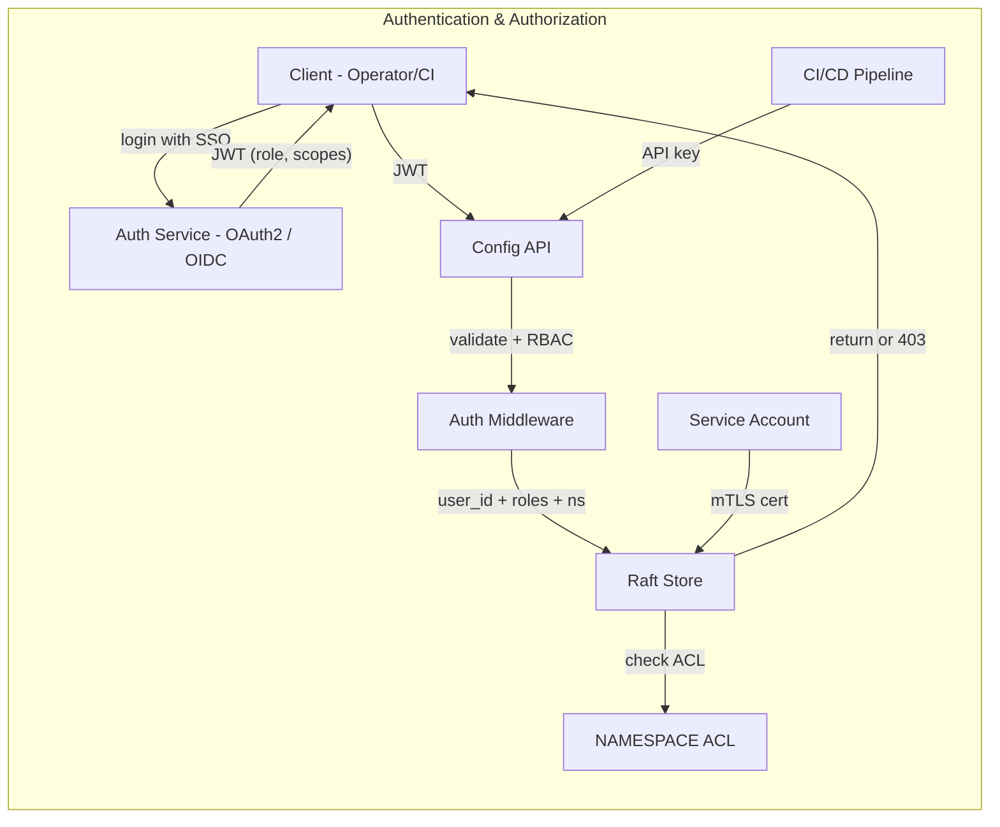

*Auth and authz flow: operators log in via SSO and receive a JWT with roles and scopes; CI/CD pipelines use scoped API keys; service instances use mTLS certificates. The Config API validates all credentials and enforces RBAC + namespace ACLs at the Raft store level before allowing any read or write operation.*

**Java example — authorization middleware:**

```java
@Component
@RequiredArgsConstructor
public class ConfigAuthorizationMiddleware implements WebFilter {

    private final AccessControlService accessControl;

    @Override
    public Mono<Void> filter(ServerWebExchange exchange, WebFilterChain chain) {
        var token = extractToken(exchange);
        var identity = JwtUtils.parse(token);

        var method = exchange.getRequest().getMethod().toString();
        var namespace = extractNamespace(exchange.getRequest().getPath());
        var key = extractKey(exchange.getRequest().getPath());

        // Check RBAC role first
        if (!accessControl.hasRole(identity, "config-reader")) {
            return unauthorized(exchange);
        }

        // Check namespace ACL for the specific operation
        if (!accessControl.canAccess(identity, namespace, key, method)) {
            return forbidden(exchange);
        }

        // Attach identity to request context
        exchange.getAttributes().put("identity", identity);
        return chain.filter(exchange);
    }
}
```

*The `ConfigAuthorizationMiddleware` bean (a Spring WebFilter) intercepts every request to the Config API. It extracts the JWT, validates the identity, checks RBAC roles, then checks namespace and key-level ACLs. If the identity lacks permission for the requested operation on the requested key, it returns 401 (unauthorized) or 403 (forbidden). The identity is attached to the request context for downstream audit logging.*

#### Authorization Example — Namespace ACL Check

```java
@Service
@Transactional(readOnly = true)
public class AccessControlService {

    private final AclRepository aclRepository;

    /**
     * Check if an identity can perform an operation on a key within a namespace.
     * ACLs are evaluated in order: explicit deny, role-based, namespace-based.
     */
    public boolean canAccess(Identity identity, String namespace, String key, String method) {
        // Explicit deny always wins
        if (aclRepository.isExplicitDeny(identity, namespace, key, method)) {
            return false;
        }

        // Role-based: admins can do anything in namespaces they're assigned to
        if (identity.hasRole("config-admin") && aclRepository.isAssignedTo(identity, namespace)) {
            return true;
        }

        // Namespace ACL: check the namespace's ACL entries
        var aclEntries = aclRepository.findByNamespace(namespace);
        return aclEntries.stream()
            .filter(entry -> entry.appliesTo(identity))
            .anyMatch(entry -> entry.allows(method, key));
    }
}
```

*The `AccessControlService` bean enforces namespace and key-level ACLs. It evaluates rules in order: explicit deny (always wins), role-based access (admins), and namespace ACL entries. The method is `@Transactional(readOnly = true)` since it only reads from the `aclRepository`. Each ACL entry can match an identity and grant specific HTTP methods (GET/PUT/DELETE) on specific key patterns within the namespace.*

---

### Security Threats and Mitigations

#### Threat: Malicious Config Write (Insider or Compromised Admin)

- **Risk:** An attacker with config-admin credentials writes a bad value (e.g., sets all timeouts to 0, disables a critical feature) that propagates instantly to the entire fleet, causing a cascading outage.
- **Mitigation:** (1) Two-person approval rule for prod writes — a second authorized person must approve within 5 minutes. (2) Schema validation rejects values outside safe bounds (e.g., timeout must be ≥ 100ms). (3) Canary rollout — the change goes to 1% of instances first; automated anomaly detection (error rate spike) triggers rollback. (4) Last-known-good fallback — if the store detects a rollback, all clients revert within seconds.

#### Threat: Secret Leakage via Config Store

- **Risk:** An attacker gains read access to the config store and retrieves plaintext database passwords, API tokens, or encryption keys stored alongside ordinary config values.
- **Mitigation:** (1) Secrets are encrypted at rest with envelope encryption (DEK + KMS-managed KEK); the store never has the plaintext. (2) Secrets are referenced by key, not stored inline — `${vault:secret/data/db-password}` is resolved at injection time. (3) Read access to secret keys requires additional RBAC (`secrets-reader` role, not just `config-reader`). (4) Audit logs record every secret access with user identity, timestamp, and IP.

#### Threat: Configuration Drift (Unauthorized Local Overrides)

- **Risk:** An operator SSHs into a server and manually edits the config file to fix an urgent issue. The next config push overwrites the fix, and the server silently runs with a different (stale) config than the rest of the fleet. This causes "works on my instance" mysteries and inconsistent behavior.
- **Mitigation:** (1) The SDK periodically reports its resolved config hash and revision back to the control plane. (2) A drift-detection service compares reported revisions across instances and alerts on discrepancies. (3) Immutable infrastructure — config is read-only from disk; local edits are wiped on restart. (4) The SDK refuses to accept a write that would regress to a known-bad revision.

#### Threat: Supply Chain (Compromised Config Repository)

- **Risk:** An attacker compromises the Git config repository (via a compromised CI token, a malicious PR, or a supply chain attack on the config server image) and injects malicious config that is then pushed to all environments.
- **Mitigation:** (1) Signed commits — require GPG-signed commits for production config. The config server verifies commit signatures before syncing. (2) CI gate — automated checks block PR merges if schema validation fails or if the PR modifies prod secrets. (3) Dependency scanning — scan the config server Docker image for known CVEs. (4) Network isolation — the config server can only push to the internal network; external access requires VPN + MFA.

```mermaid
graph LR
    subgraph "Defense-in-depth"
        ATT[Attacker] -->|"stolen admin creds"| API[Config API]
        API --> VAL[Validation (schema + semantic)]
        VAL --> CAN[CANARY (1% of fleet)]
        CAN --> MON[Anomaly Detection]
        MON -->|"spike?"| ROLL[Rollback]
        MON -->|"ok"| FLEET[Full Fleet Rollout]
        FLEET --> SDK[All SDKs]
    end
```

*Defense-in-depth against malicious config writes: an attacker with admin credentials attempts a write; the config API runs schema and semantic validation (rejecting invalid values); if validation passes, the change enters a canary rollout (1% of fleet); anomaly detection monitors the canary for spikes in error rate or latency; if an anomaly is detected, the system automatically rolls back; if healthy, the change rolls out to the full fleet.*

#### Threat: Watch Stream Hijacking (MITM on Streaming Updates)

- **Risk:** An attacker on the network path between the client SDK and the config store intercepts or modifies watch stream messages — injecting fake config updates or blocking legitimate ones.
- **Mitigation:** (1) mTLS between SDK and store — the SDK verifies the store's certificate, preventing MITM. (2) Watch events are signed with a revision-specific HMAC; the SDK verifies the signature before applying. (3) Periodic reconciliation — the SDK re-fetches the current revision and diffs with its cache, detecting missed or forged events. (4) Connection keep-alive with heartbeat — the server sends periodic heartbeats; the client detects stream hijacking or man-in-the-middle if heartbeats stop or are forged.

---
### Observability and Logging

A config management system generates telemetry about config writes, propagation, client staleness, and access patterns. Observability is critical because a silent config problem (a wrong value that was pushed but never reached some clients) can cause subtle, hard-to-diagnose production issues.

#### Key Metrics

- **Config propagation latency:** Milliseconds between a config write (revision N) and the moment the client SDK applies it. Alert if propagation latency exceeds 10 seconds for 95% of clients, or 30 seconds for emergency changes (kill switches).
- **Client staleness age:** For each client, the time since it last received a watch event for each namespace. Alert if any client is more than 60 seconds behind the store's latest revision.
- **Config store health:** Raft commit latency (should be < 50 ms), leader changes per minute (alert if > 1), disk space (alert if < 20% free), memory usage.
- **Watch stream health:** Connection count (active streams), drop rate (streams that disconnect), reconnect rate, average reconnect time. Alert if reconnect rate > 5% or average reconnect time > 30 seconds.
- **Write throughput:** Config writes per second, CAS failures (revision conflicts), validation failures (rejected writes). Alert if write latency > 500 ms or validation failure rate > 5%.
- **Audit access rate:** Number of config reads per key per minute. Alert on anomalous access patterns (e.g., a service reading config keys outside its namespace).

#### Logging

- **Access logs:** Every config read, write, and watch operation logged with identity, namespace, key, revision, and timestamp. Used for audit trails and anomaly detection.
- **Change logs:** Every config value change logged with before/after values, changed-by identity, change reason, and revision number. Correlate with application logs to diagnose behavioral changes.
- **Error logs:** Config validation failures, CAS conflicts, watch stream errors, SDK reconciliation failures. Correlation IDs (traceparent) for cross-service tracing.
- **Audit logs:** All admin actions (user creation, role assignment, ACL changes, schema updates, namespace creation/deletion) logged with before/after state. Separate, append-only log store with tamper-evident timestamps.

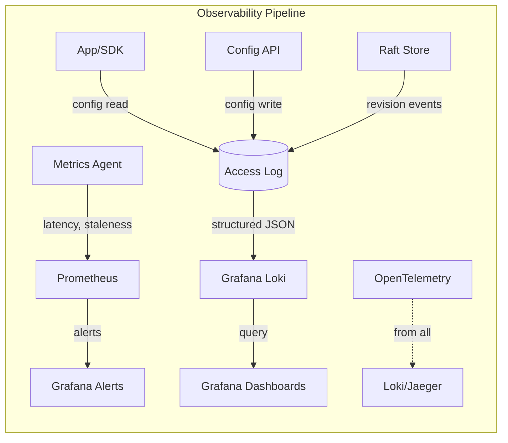

*Observability pipeline for the config management system: the app/SDK, Config API, and Raft store all emit structured JSON logs to Loki; a metrics agent scrapes latency and staleness metrics to Prometheus; OpenTelemetry traces span all operations for cross-service correlation; Grafana dashboards visualize metrics and enable log queries; alert rules in Grafana fire on propagation latency, client staleness, and store health.*

#### Distributed Tracing

Trace every config operation across all components — from the Config API write through the Raft store commit, watch stream emission, and client SDK application. Use OpenTelemetry with a trace context header (`traceparent`) propagated across all service boundaries. Key spans to instrument:

- Config API request handling (parse, validate, authorize)
- Schema registry validation
- Raft store write (log append, quorum, commit)
- Watch event emission (filter, serialize, stream)
- Client SDK watch event handling (deserialize, validate, apply)
- Config value deserialization and type coercion in the app

```java
@Service
@RequiredArgsConstructor
public class InstrumentedConfigService {

    private final ConfigRepository configRepository;
    private final MeterRegistry meterRegistry;

    @Timed(name = "config.write.latency", description = "Config write latency")
    public ConfigValue setConfig(String namespace, String key, String value, String expectedRevision) {
        Span span = tracer.spanBuilder("config.write")
            .setAttribute("namespace", namespace)
            .setAttribute("key", key)
            .startSpan();

        try (var ignored = span.makeCurrent()) {
            var result = configRepository.setWithCas(namespace, key, value, expectedRevision);

            Counter.builder("config.write.success")
                .tag("namespace", namespace)
                .register(meterRegistry).increment();

            return result;
        } catch (CasConflictException e) {
            Counter.builder("config.write.cas_conflict")
                .tag("namespace", namespace)
                .tag("key", key)
                .register(meterRegistry).increment();
            throw e;
        } finally {
            span.end();
        }
    }
}
```

*The `InstrumentedConfigService` bean wraps config writes with OpenTelemetry tracing and Micrometer metrics. The `@Timed` annotation records write latency; the manual `Span` adds attributes (namespace, key) for detailed tracing. On CAS conflict, a counter is incremented with namespace and key tags for debugging concurrent-write issues. Success writes are also counted. All metrics are exposed via Micrometer for Prometheus scraping.*

#### Alerting Strategy

- **Critical (page immediately):** Config store unavailable (no leader for > 5 seconds); propagation latency > 30 seconds for emergency changes; CAS conflict rate > 20% (indicates write storm); client staleness > 5 minutes for any region.
- **Warning (Slack, no page):** Propagation latency > 10 seconds for 95% of clients; watch reconnect rate > 5%; write latency > 500 ms; schema registry unavailable.
- **Info (dashboard only):** Daily config write volume; namespace creation rate; audit log volume; client SDK version distribution.

---

### Real-World Implementations

Distributed configuration management systems are built around three dominant paradigms: consensus KV stores (etcd, ZooKeeper), service mesh control planes (Consul, Istio), and Git-backed config servers (Spring Cloud Config, AWS AppConfig). Each makes different trade-offs between consistency, operational complexity, and developer experience.

#### etcd

Used for: Kubernetes cluster configuration (the source of truth for all cluster state), service discovery (endpoints), leader election for controllers, and feature flags. etcd uses the Raft consensus algorithm for linearizable reads and writes. Its watch mechanism streams revision events to clients over gRPC. Kubernetes controllers watch etcd for changes to ConfigMaps, Secrets, and Custom Resources — making etcd the de facto config backbone for cloud-native infrastructure.

**Companies:** Kubernetes (coreos), Alibaba Cloud (managed etcd service), CockroachDB (for internal config).

**Key design:** MVCC (multi-version concurrency control) with revision numbers; compacted revisions after a retention period; gRPC-based watch API; encryption at rest with KMS integration; multi-member clusters (3–9 nodes).

#### HashiCorp Consul

Used for: service discovery, health checking, KV config storage, service mesh (Connect), and multi-region service mesh. Consul uses Raft for its KV store and catalog, and a gossip protocol (SWIM) for membership and health checking. Unlike etcd, Consul provides both a key-value store and a service catalog API. Its ACL system provides fine-grained token-based access control.

**Companies:** HashiCorp customers, HashiCorp's own services, many Kubernetes ingress controllers.

**Key design:** Multi-datacenter federation (async replication between data centers); agent-based architecture (each node runs a local agent); DNS + HTTP API for service discovery; KV store with blocking queries (Consul's equivalent of watches).

```java
// Consul blocking query - equivalent to long-poll watch
Response<KeyValue> kv = consulClient.getKVValue("config/prod/database.timeout",
    QueryOptions.newBuilder()
        .setIndex(currentIndex)       // client's last known index
        .setWait("600s")              // block for up to 10 minutes
        .build());
// Returns when value changes or timeout expires
```

*Consul blocking query: the client sends its last known index (revision); the server blocks the request until either the value changes (returns new index + value) or the wait timeout expires. This is Consul's equivalent of a watch — long-polling rather than streaming.*

#### Spring Cloud Config

Used for: Git-backed configuration management in Spring Boot applications. The config server reads configuration from a Git repository (or a local filesystem, or a KV store like HashiCorp Vault or etcd as a backend), resolves environment-specific overrides, and serves to Spring Boot clients via REST. Clients use `@RefreshScope` to hot-reload config on changes. The server can also push updates via Spring Cloud Bus (RabbitMQ or Kafka).

**Companies:** Pivotal/VMware Tanzu customers, many enterprise Spring Boot deployments, organizations migrating from monoliths to microservices with existing Git workflows.

**Key design:** Git as the source of truth (audit trail, branches, PRs); profile-specific property files (`application-{profile}.yml`); environment-specific overrides; optional Vault/etcd backend for secrets; Spring Cloud Bus for push-based reload.

#### Apache ZooKeeper

Used for: Hadoop configuration management, Kafka broker registration and topic config, Solr cluster state, and HBase region server coordination. ZooKeeper uses the ZAB (ZooKeeper Atomic Broadcast) consensus protocol. Its watch mechanism is one-time (clients must re-register watches after each event) and its data model is hierarchical (znodes).

**Companies:** Apache ecosystem projects (Kafka, Hadoop, HBase, Solr), Netflix, eBay.

**Key design:** Hierarchical znode tree (like a filesystem); one-time watches (must re-register); ephemeral nodes (auto-deleted when session ends); sequential nodes (for leader election); ACLs for access control.

#### Netflix Archaius

Used for: dynamic property management in Netflix's microservices. Archaius 2 uses a combination of polling and push (via Prana sidecar + Eureka) for config updates. It maintains an in-process `ConcurrentMap` cache with concurrent refresh. Netflix's config is stored in a dynamic property store backed by both Git and an internal dynamic property service.

**Companies:** Netflix (primary user), other Zuul/Eureka-based microservices.

**Key design:** In-process cache with `ConcurrentMap`; polling with delta-based refresh; composite loader (multiple sources); dynamic property with type coercion; JMX exposure for runtime property inspection.

#### AWS AppConfig (part of AWS Systems Manager)

Used for: feature flagging, operational tuning, and application configuration for AWS-hosted applications. AppConfig supports multiple configuration sources (AppConfig extension, Amazon S3, AWS Systems Manager Parameter Store, feature flags). It provides built-in validation, deployment strategies (Linear, Canary, All-at-once, Time-based) with automatic rollback on CloudWatch alarms.

**Companies:** AWS customers, especially those already using AWS Systems Manager and Parameter Store.

**Key design:** Deployment strategies with automatic rollback; validators (JSON schema, Lambda validators); multiple config sources; integration with CloudWatch for alarm-based rollback; deployment history with rollback capability.

```yaml
# AWS AppConfig deployment profile
deployment:
  name: "Order Service Timeout Tuning"
  strategy: "Canary"
  growth-factor: 10        # 10% per step
  step-percentage: 5       # 5% per minute
  rollback-alarm: "HighErrorRate"   # auto-rollback if alarm fires
```

*AWS AppConfig canary deployment profile: the config change is rolled out in 5% increments per minute using a Canary strategy, with automatic rollback triggered by the `HighErrorRate` CloudWatch alarm. If any step causes elevated errors, AppConfig automatically rolls back to the previous configuration version.*

#### Comparison

| System | Consensus | Watch Type | Backend | Multi-region | Use Case |
|---|---|---|---|---|---|
| etcd | Raft | gRPC streaming | In-memory KV | Read replicas | Kubernetes, service discovery |
| Consul | Raft + Gossip | Blocking query | KV + Catalog | Async federation | Service mesh, multi-dc |
| Spring Cloud Config | None (Git) | Poll + Bus push | Git/Vault/etcd | Per-backend | Spring Boot apps, GitOps |
| ZooKeeper | ZAB | One-time watch | Znode tree | Follower mode | Legacy, Hadoop ecosystem |
| AWS AppConfig | None (SSM) | Poll | S3/Parameter Store | Global | AWS-hosted apps |

---
### Java and Spring Boot Implementation Guide

This section demonstrates how to build a Spring Boot service for a distributed configuration management system, showcasing key Spring Boot features: `@ConfigurationProperties`, `@RefreshScope`, `@RestController`, `@Service`, `@Repository`, `@Component`, `@Value`, records for DTOs, `@Valid`, `@ControllerAdvice`, constructor injection, `@Transactional`, `@Version`, `BigDecimal`, and `@EventListener`.

#### 1. DTO Records

Records provide immutable, concise data carriers for request/response payloads.

```java
public record CreateConfigRequest(
        @NotBlank String key,
        @NotBlank String value,
        @NotBlank String valueType,
        @NotBlank String expectedRevision,
        String changeReason,
        @Builder.Default boolean canary = false,
        @Builder.Default int canaryPercentage = 0) {}

public record ConfigValueResponse(
        String key,
        String value,
        String valueType,
        String revision,
        Instant lastModified,
        String modifiedBy,
        boolean isSecret,
        boolean isEncrypted,
        long version) {}

public record ConfigHistoryEntry(
        String revision,
        String valueBefore,
        String valueAfter,
        Instant changedAt,
        String changedBy,
        String changeReason,
        String status) {}

public record BulkConfigRequest(
        @NotEmpty List<CreateConfigRequest> updates) {}
```

*Four record types serve as the API contract: `CreateConfigRequest` is the PUT body with validation annotations (`@NotBlank`) enforced by `@Valid`; `ConfigValueResponse` is the enriched config DTO returned to clients with metadata (revision, modified-by, encryption status); `ConfigHistoryEntry` represents a single revision in the audit trail; `BulkConfigRequest` wraps multiple updates for the bulk endpoint. Records are immutable and ideal for thread-safe request/response objects.*

#### 2. Entity with Optimistic Locking

The `ConfigValue` entity uses `@Version` for optimistic locking to prevent lost updates when concurrent writes modify the same key.

```java
@Entity
@Table(name = "config_values", indexes = {
        @Index(name = "idx_namespace_key", columnList = "namespaceId, keyPath"),
        @Index(name = "idx_revision", columnList = "revision")
})
public class ConfigValue {

    @Id
    private String valueId;

    @Column(name = "key_id")
    private String keyId;

    @Column(name = "namespace_id")
    private String namespaceId;

    @Column(name = "key_path")
    private String keyPath;

    @Column(name = "revision")
    private String revision;

    @Column(name = "value_encrypted", columnDefinition = "TEXT")
    private String valueEncrypted;

    @Column(name = "value_type")
    private String valueType;

    @Column(name = "is_secret")
    private boolean isSecret;

    @Column(name = "is_encrypted")
    private boolean isEncrypted;

    @Column(name = "created_at")
    private Instant createdAt;

    @Column(name = "updated_at")
    private Instant updatedAt;

    @Column(name = "updated_by")
    private String updatedBy;

    @Column(name = "change_reason", columnDefinition = "TEXT")
    private String changeReason;

    @Version
    private Long version;

    // Constructors, getters, setters omitted for brevity

    public static ConfigValue create(String namespaceId, String keyPath, String value,
                                     String valueType, boolean isSecret, boolean isEncrypted,
                                     String updatedBy, String changeReason) {
        var cv = new ConfigValue();
        cv.valueId = UUID.randomUUID().toString();
        cv.namespaceId = namespaceId;
        cv.keyPath = keyPath;
        cv.revision = "0";
        cv.valueType = valueType;
        cv.isSecret = isSecret;
        cv.isEncrypted = isEncrypted;
        cv.createdAt = Instant.now();
        cv.updatedAt = Instant.now();
        cv.updatedBy = updatedBy;
        cv.changeReason = changeReason;
        return cv;
    }

    public ConfigValue withNewValue(String newValue, String newRevision, String updatedBy, String changeReason) {
        this.valueEncrypted = newValue;
        this.revision = newRevision;
        this.updatedAt = Instant.now();
        this.updatedBy = updatedBy;
        this.changeReason = changeReason;
        return this;
    }
}
```

*The `ConfigValue` entity maps to the `config_values` table with composite indexes on `(namespaceId, keyPath)` for namespace-scoped lookups and on `revision` for version retrieval. The `@Version` field enables JPA optimistic locking — concurrent writes to the same key fail with `OptimisticLockException`, preventing lost config updates. The `create` factory method initializes a new config value; `withNewValue` returns `this` for chaining after a value update, bumping the revision atomically.*

#### 3. Repository Layer

The `@Repository` layer provides persistence operations with Spring Data JPA, including CAS-on-revision semantics.

```java
@Repository
public interface ConfigValueRepository extends JpaRepository<ConfigValue, String> {

    @Query("SELECT cv FROM ConfigValue cv WHERE cv.namespaceId = :namespaceId AND cv.keyPath = :keyPath ORDER BY cv.version DESC LIMIT 1")
    Optional<ConfigValue> findLatestByNamespaceAndKey(@Param("namespaceId") String namespaceId,
                                                       @Param("keyPath") String keyPath);

    @Query("SELECT cv FROM ConfigValue cv WHERE cv.namespaceId = :namespaceId AND cv.keyPath = :keyPath AND cv.revision = :revision")
    Optional<ConfigValue> findByNamespaceKeyAndRevision(@Param("namespaceId") String namespaceId,
                                                        @Param("keyPath") String keyPath,
                                                        @Param("revision") String revision);

    @Query("SELECT cv FROM ConfigValue cv WHERE cv.namespaceId = :namespaceId AND cv.updatedAt > :since ORDER BY cv.updatedAt ASC")
    List<ConfigValue> findUpdatedSince(@Param("namespaceId") String namespaceId,
                                       @Param("since") Instant since);

    @Modifying
    @Query("INSERT INTO ConfigValue (valueId, keyId, namespaceId, keyPath, revision, valueEncrypted, valueType, isSecret, isEncrypted, createdAt, updatedAt, updatedBy, changeReason, version) VALUES (:cv.valueId, :cv.keyId, :cv.namespaceId, :cv.keyPath, :cv.revision, :cv.valueEncrypted, :cv.valueType, :cv.isSecret, :cv.isEncrypted, :cv.createdAt, :cv.updatedAt, :cv.updatedBy, :cv.changeReason, 0)")
    int insertNewVersion(@Param("cv") ConfigValue cv);
}
```

*The `ConfigValueRepository` interface extends `JpaRepository` with custom queries: `findLatestByNamespaceAndKey` returns the most recent version for a key (used on every read); `findByNamespaceKeyAndRevision` retrieves a specific version (used for rollback); `findUpdatedSince` finds all keys changed since a given revision (used for delta-based watch events). The `insertNewVersion` query inserts a new row for each revision, preserving immutability.*

#### 4. Service Layer — Config CRUD with CAS

The `ConfigService` implements the core CRUD operations with CAS (compare-and-swap) on revision to prevent lost updates.

```java
@Service
@RequiredArgsConstructor
@Slf4j
public class ConfigService {

    private final ConfigValueRepository configRepository;
    private final ConfigHistoryRepository historyRepository;
    private final AccessControlService accessControl;
    private final ConfigValidationService validationService;
    private final MeterRegistry meterRegistry;

    @Value("${app.config.revision-generator:snowflake}")
    private String revisionGenerator;

    @Transactional
    public ConfigValueResponse setConfig(String namespaceId, String keyPath,
                                         CreateConfigRequest request, Identity identity) {
        validationService.validate(keyPath, request.value(), request.valueType());

        var current = configRepository.findLatestByNamespaceAndKey(namespaceId, keyPath)
                .orElse(null);

        if (current == null && !"0".equals(request.expectedRevision())) {
            throw new ConfigNotFoundException(keyPath);
        }

        if (current != null && !current.getRevision().equals(request.expectedRevision())) {
            throw new CasConflictException(
                "Expected revision %s but found %s".formatted(request.expectedRevision(), current.getRevision()));
        }

        String newRevision;
        if (current == null) {
            newRevision = revisionGenerator.nextRevision(); // e.g., "143"
        } else {
            newRevision = String.valueOf(Long.parseLong(current.getRevision()) + 1);
        }

        var newVersion = (current == null)
                ? ConfigValue.create(namespaceId, keyPath, request.value(), request.valueType(),
                    request.isSecret(), request.isEncrypted(), identity.userId(), request.changeReason())
                : current.withNewValue(request.value(), newRevision, identity.userId(), request.changeReason());

        var saved = configRepository.save(newVersion);

        historyRepository.save(ConfigHistory.from(current, saved, identity, request.changeReason()));

        Counter.builder("config.write.success")
                .tag("namespace", namespaceId)
                .tag("key", keyPath)
                .register(meterRegistry).increment();

        log.info("Config change: namespace={}, key={}, revision={}→{}, by={}",
                namespaceId, keyPath, request.expectedRevision(), newRevision, identity.userId());

        return toResponse(saved);
    }

    @Transactional(readOnly = true)
    public ConfigValueResponse getConfig(String namespaceId, String keyPath, Identity identity) {
        accessControl.checkRead(identity, namespaceId, keyPath);

        var value = configRepository.findLatestByNamespaceAndKey(namespaceId, keyPath)
                .orElseThrow(() -> new ConfigNotFoundException(keyPath));

        Counter.builder("config.read").tag("namespace", namespaceId).tag("key", keyPath)
                .register(meterRegistry).increment();

        return toResponse(value);
    }
}
```

*The `ConfigService` bean implements the core write path with CAS (compare-and-swap) semantics. The `setConfig` method validates the value, checks the expected revision against the current value (throwing `CasConflictException` on mismatch), computes the new revision, saves the new version, records the change in history, emits metrics, and logs the change. The `getConfig` method enforces read authorization before returning the value. Constructor injection (`@RequiredArgsConstructor`) provides all dependencies; `@Value` injects the revision generation strategy.*

#### 5. REST Controller with Validation

The controller uses `@Valid` for request validation, `@AuthenticationPrincipal` for the authenticated identity, and constructor injection.

```java
@RestController
@RequestMapping("/api/v1/config")
@RequiredArgsConstructor
public class ConfigController {

    private final ConfigService configService;
    private final BulkConfigService bulkConfigService;

    @GetMapping("/{namespace}/{key}")
    public ResponseEntity<ConfigValueResponse> getConfig(
            @AuthenticationPrincipal Identity identity,
            @PathVariable String namespace,
            @PathVariable String key) {
        var namespaceId = resolveNamespace(namespace, identity);
        var response = configService.getConfig(namespaceId, key, identity);
        return ResponseEntity.ok(response);
    }

    @PutMapping("/{namespace}/{key}")
    public ResponseEntity<ConfigValueResponse> setConfig(
            @AuthenticationPrincipal Identity identity,
            @PathVariable String namespace,
            @PathVariable String key,
            @Valid @RequestBody CreateConfigRequest request) {
        var namespaceId = resolveNamespace(namespace, identity);
        var response = configService.setConfig(namespaceId, key, request, identity);
        return ResponseEntity.ok(response);
    }

    @PostMapping("/{namespace}/{key}/rollback/{revision}")
    public ResponseEntity<ConfigValueResponse> rollbackToRevision(
            @AuthenticationPrincipal Identity identity,
            @PathVariable String namespace,
            @PathVariable String key,
            @PathVariable String revision) {
        var namespaceId = resolveNamespace(namespace, identity);
        var response = configService.rollbackTo(namespaceId, key, revision, identity);
        return ResponseEntity.ok(response);
    }

    @PostMapping("/bulk")
    public ResponseEntity<List<ConfigValueResponse>> bulkUpdate(
            @AuthenticationPrincipal Identity identity,
            @Valid @RequestBody BulkConfigRequest request) {
        var responses = bulkConfigService.bulkUpdate(request, identity);
        return ResponseEntity.ok(responses);
    }

    private String resolveNamespace(String namespace, Identity identity) {
        return namespace.replace("-", "/"); // URL-safe namespace encoding
    }
}
```

*The `ConfigController` (annotated `@RestController` with constructor injection via `@RequiredArgsConstructor`) exposes the config management API. The GET endpoint fetches a config value with read authorization; the PUT endpoint sets a config value with CAS validation; the rollback endpoint reverts to a specific revision; the bulk endpoint updates multiple keys atomically. The `@Valid` annotation on `CreateConfigRequest` triggers bean validation (enforcing `@NotBlank` constraints). The namespace is URL-encoded (hyphens for slashes) and decoded server-side.*

#### 6. Controller Advice for Global Error Handling

A `@ControllerAdvice` bean centralizes exception handling across all controllers.

```java
@ControllerAdvice
public class GlobalExceptionHandler {

    @ExceptionHandler(ConfigNotFoundException.class)
    public ResponseEntity<ApiError> handleNotFound(ConfigNotFoundException ex) {
        var error = new ApiError(HttpStatus.NOT_FOUND, ex.getMessage());
        return ResponseEntity.status(HttpStatus.NOT_FOUND).body(error);
    }

    @ExceptionHandler(CasConflictException.class)
    public ResponseEntity<ApiError> handleConflict(CasConflictException ex) {
        var error = new ApiError(HttpStatus.CONFLICT, ex.getMessage());
        return ResponseEntity.status(HttpStatus.CONFLICT).body(error);
    }

    @ExceptionHandler(AccessDeniedException.class)
    public ResponseEntity<ApiError> handleForbidden(AccessDeniedException ex) {
        var error = new ApiError(HttpStatus.FORBIDDEN, ex.getMessage());
        return ResponseEntity.status(HttpStatus.FORBIDDEN).body(error);
    }

    @ExceptionHandler(MethodArgumentNotValidException.class)
    public ResponseEntity<ApiError> handleValidation(MethodArgumentNotValidException ex) {
        var messages = ex.getBindingResult().getFieldErrors().stream()
                .map(FieldError::getDefaultMessage)
                .toList();
        var error = new ApiError(HttpStatus.BAD_REQUEST,
                "Validation failed: " + String.join(", ", messages));
        return ResponseEntity.badRequest().body(error);
    }

    public record ApiError(HttpStatus status, String message) {}
}
```

*The `GlobalExceptionHandler` bean (annotated `@ControllerAdvice`) catches exceptions thrown by any `@RestController` and returns structured `ApiError` responses. It handles `ConfigNotFoundException` (404), `CasConflictException` (409 Conflict — CAS revision mismatch), `AccessDeniedException` (403 Forbidden), and `MethodArgumentNotValidException` (400 with field-level messages from `@Valid`). This avoids repetitive try-catch blocks in controllers and provides consistent error responses.*

#### 7. Client SDK — Local Cache with Watch Stream

The client SDK is the most critical component — it must maintain a local cache of config values, watch for changes, and serve reads from memory with microsecond latency.

```java
@Service
@RequiredArgsConstructor
@Slf4j
public class ConfigClient {

    private final ConfigStoreClient storeClient;
    private final MeterRegistry meterRegistry;
    private final ObjectWriter jsonWriter;

    private final AtomicReference<ResolvedConfig> currentConfig = new AtomicReference<>();
    private volatile String currentRevision = "0";
    private final Path snapshotPath;

    @PostConstruct
    public void initialize() {
        // Load from disk snapshot if available (last-known-good)
        if (Files.exists(snapshotPath)) {
            try {
                var saved = jsonReader.readValue(Files.readString(snapshotPath));
                currentConfig.set(saved.config());
                currentRevision = saved.revision();
                log.info("Loaded config snapshot from disk (revision {})", currentRevision);
            } catch (IOException e) {
                log.warn("Failed to load config snapshot, using defaults", e);
            }
        }

        // Fetch latest from store
        fetchAndApply();

        // Start watch stream
        startWatchLoop();

        // Periodic reconciliation (every 5 minutes)
        scheduler.scheduleAtFixedRate(this::reconcile, 5, 5, TimeUnit.MINUTES);
    }

    private void fetchAndApply() {
        var start = System.nanoTime();
        try {
            var response = storeClient.fetchAll(currentRevision);
            if (!response.revision().equals(currentRevision)) {
                applyChanges(response);
                persistSnapshot(response);
                Timer.Sample.builder("config.fetch.latency")
                        .register(meterRegistry)
                        .record(System.nanoTime() - start, TimeUnit.NANOSECONDS);
            }
        } catch (Exception e) {
            log.error("Failed to fetch config", e);
            Counter.builder("config.fetch.errors").register(meterRegistry).increment();
        }
    }

    private void startWatchLoop() {
        var currentRev = currentRevision;
        storeClient.watch(currentRev, event -> {
            applyChanges(event);
            persistSnapshot(event);
        }, error -> {
            log.warn("Watch stream error: {}, reconnecting in 5s", error.getMessage());
            scheduler.schedule(this::startWatchLoop, 5, TimeUnit.SECONDS);
            // Force reconciliation on reconnect
            scheduler.schedule(this::reconcile, 5, TimeUnit.SECONDS);
        });
    }

    private void reconcile() {
        var storeRev = storeClient.getCurrentRevision();
        if (!storeRev.equals(currentRevision)) {
            log.info("Reconciliation: local rev={}, store rev={}, re-fetching", currentRevision, storeRev);
            fetchAndApply();
        } else {
            log.debug("Reconciliation OK: rev={}", currentRevision);
        }
    }

    public String getConfigValue(String key) {
        var config = currentConfig.get();
        return config != null ? config.getValue(key) : null;
    }
}
```

*The `ConfigClient` bean is the client-side SDK. It uses an `AtomicReference` for the current config (enabling lock-free atomic swaps on hot reload). On startup, it loads from a disk snapshot (last-known-good), fetches the latest from the store, and starts a watch loop. The watch stream pushes changes in real-time; on stream failure, it reconnects with a 5-second backoff and triggers reconciliation. A 5-minute scheduled reconciliation catches any missed events. All reads come from the in-memory cache (sub-microsecond latency). Metrics capture fetch latency and errors.*

#### 8. Spring Cloud Config Server Integration

For Git-backed configuration, Spring Cloud Config provides a production-ready server. The server reads from a Git repository, resolves environment-specific overrides, and serves to clients. Clients use `@RefreshScope` to hot-reload.

```yaml
# bootstrap.yml — config server configuration
spring:
  cloud:
    config:
      server:
        git:
          uri: https://github.com/company/config-repo
          search-paths: '{application}'
          clone-on-start: true
          label: prod
          basedir: /tmp/config-repo
          force-pull: true
      fail-fast: true
      retry:
        max-attempts: 6
        multiplier: 1.5
```

*Spring Cloud Config server bootstrap configuration: the server clones the Git repository on startup, searches for files matching the application name, and uses the `prod` branch (via the `label` property). `force-pull: true` ensures the server always has the latest config. `fail-fast: true` with retry configuration ensures the client retries the config server on startup failure rather than giving up.*

```java
@SpringBootApplication
@EnableConfigServer
public class ConfigServerApplication {

    public static void main(String[] args) {
        SpringApplication.run(ConfigServerApplication.class, args);
    }
}
```

```java
@ConfigurationProperties(prefix = "app")
@RefreshScope
@Component
public class FeatureFlags {

    private Map<String, Boolean> flags = new HashMap<>();

    @PostConstruct
    public void init() {
        if (flags.isEmpty()) {
            flags.put("new-ui", false);
            flags.put("beta-feature", false);
            flags.put("database-timeout-ms", 5000);
        }
    }

    public boolean isFeatureEnabled(String feature) {
        return flags.getOrDefault(feature, false);
    }

    public void setFlags(Map<String, Boolean> flags) {
        this.flags = new ConcurrentHashMap<>(flags);
    }
}
```

*`FeatureFlags` is a `@RefreshScope` component that holds feature flag values. When a config change is pushed and `/actuator/refresh` is triggered, Spring destroys and re-creates this bean with the updated values from the config server. The application reads flags through `isFeatureEnabled()` rather than direct field access, ensuring the refreshed values are used. Default values are set in `@PostConstruct` as a fallback.*

```java
@RestController
@RefreshScope
public class FeatureToggleController {

    private final FeatureFlags featureFlags;

    @GetMapping("/api/features")
    public ResponseEntity<Map<String, Boolean>> getFeatures() {
        return ResponseEntity.ok(featureFlags.getFlags());
    }
}
```

*The `FeatureToggleController` is also `@RefreshScope`, ensuring it picks up the refreshed `FeatureFlags` bean. The `/api/features` endpoint returns the current feature flag state — after a refresh, the returned values reflect the config server's latest values.*

---

### Interview Questions and Answers

A curated set of interview questions organized by difficulty, focused on distributed configuration management system design.

**Beginner**

1. **What is a distributed configuration management system, and why do we need one?**
   **A:** It is a centralized, highly available store for runtime configuration that allows changing system behavior (timeouts, feature flags, thresholds) across a fleet of service instances without redeploying binaries. We need it because static config requires a full CI/CD cycle for every change — a process measured in minutes to hours, which is unacceptable for incident response (e.g., tightening a timeout during a cascading failure) or gradual rollouts.

2. **What is the difference between static config and dynamic config?**
   **A:** Static config is read once at application startup and never changes until the process restarts (environment variables, startup flags, properties files). Dynamic config can change while the application is running — the application picks up new values via hot reload, watching for changes from a central store. Dynamic config enables instant operational tuning without restarts.

3. **How does hot reload work in practice?**
   **A:** The client SDK subscribes to change events from the config store via a watch stream (gRPC, SSE, or pub/sub). When a watched key changes, the SDK receives the new value and atomically swaps the in-memory config object (using a volatile reference or AtomicReference). The application reads config through indirection (a config holder method, not a static constant), so the next read returns the new value. In Spring Boot, `@RefreshScope` beans are destroyed and re-created to inject the new values.

4. **What are the three layers of configuration precedence?**
   **A:** The standard precedence stack is: (1) Global defaults — the base layer with non-sensitive defaults; (2) Environment overrides — per-environment (prod/staging/dev) values; (3) Region/Service/Instance overrides — progressively more specific values. Resolution walks from global to instance, with the most specific namespace winning. This prevents cross-environment leaks (e.g., prod using staging DB credentials).

5. **How do you prevent a bad config value from taking down the fleet?**
   **A:** Multiple layers: (1) Schema validation at the control plane — reject values outside safe bounds (e.g., timeout must be ≥ 100ms). (2) Canary rollout — deploy to 1–5% of instances first and monitor for anomalies. (3) Last-known-good fallback — if the config store is down or sends a bad value, clients revert to the last known-good snapshot. (4) Client-side re-validation — the SDK re-validates before applying. (5) Health checks on config values — the application self-checks critical config at startup.

**Intermediate**

6. **How does the watch mechanism work in etcd vs. Consul?**
   **A:** etcd uses gRPC server-side streaming — the client opens a bidirectional stream and the server pushes `WatchResponse` messages as revisions are committed. The stream is long-lived and resumable from any revision. Consul uses blocking queries (HTTP long-polling) — the client sends its current index; the server holds the request until a newer value exists or a timeout (default 10 minutes) expires. etcd's streaming is more efficient (one connection per client); Consul's long-polling is simpler and firewall-friendly.

7. **What is the CAS (compare-and-swap) pattern, and why is it important for config writes?**
   **A:** CAS prevents lost updates: the write request includes the expected current revision. If the store's revision doesn't match (another write occurred), the write fails with a conflict, and the client must re-read and retry. This is critical because config writes are low-frequency but high-stakes — a lost update could silently overwrite a critical change. Without CAS, the "last write wins" could discard an important change.

8. **How do you handle multi-region configuration?**
   **A:** Deploy a Raft cluster per region (3–5 nodes locally). Writes go to the primary region and are asynchronously replicated to other regions. Each region's clients read from their local cluster (low latency). Conflict resolution: single-primary (writes only in primary region, no conflicts) or last-write-wins with vector clocks (multi-primary, risk of conflicts). For most configs, async replication with 1–5 second lag is acceptable. Critical security values (revoked credentials) use a separate high-priority channel with shorter TTL.

9. **What happens if the config store goes down?**
   **A:** The client SDKs continue serving from their local cache — reads never touch the store on the hot path. The SDK also persists a snapshot to disk; on restart, it loads from disk (last-known-good). New config changes can't propagate until the store recovers, but running services are unaffected. If the store is down during startup, the service boots from the disk snapshot. If no snapshot exists (first start), it uses compiled-in defaults and retries connecting to the store.

10. **How do you secure secrets in a config management system?**
    **A:** Secrets are never stored as plaintext in the KV store. Instead: (1) The store encrypts values at rest using envelope encryption (DEK encrypted with KMS-managed KEK). (2) Secrets are referenced by key (e.g., `${vault:secret/data/db-password}`) and decrypted at injection time by the resolver, not stored inline. (3) Read access to secret keys requires elevated RBAC (`secrets-reader` role). (4) Audit logs record every secret access. (5) Secrets have TTL-based leases that are rotated periodically.

**Advanced**

11. **How would you design a config system that guarantees sub-5-second propagation globally for 1 million service instances?**
    **A:** Key challenges: (1) Watch fan-out — a single config write must push to 1M clients. Use a hierarchical push: store → regional watch handlers (100+ pods) → client SDKs. Each regional handler maintains ~10K connections. (2) Cross-region latency — async replication between regions takes 1–3 seconds; use regional primaries with the store pushing to all regional clusters simultaneously. (3) Client connection management — gRPC streaming with connection multiplexing; each client maintains one stream per namespace, not per key. (4) Backpressure — if clients fall behind, the store applies backpressure (shed slow consumers) rather than queuing unbounded. (5) Monitoring — track 99th percentile propagation latency per region; alert if > 5 seconds.

12. **How do you handle the "thundering herd" problem when a large fleet reconnects to the config store after an outage?**
    **A:** Three techniques: (1) Staggered reconnect — the SDK uses exponential backoff with jitter (randomized delay of 1–30 seconds) so not all clients reconnect simultaneously. (2) Connection throttling — the watch layer rate-limits new connections per IP/pod; excess connections get a retry-after header. (3) Full re-fetch vs. delta — on reconnect, the SDK sends its last revision; the server sends only the delta (missed changes) rather than the full config. If the gap is large (>1000 revisions), the server instructs the SDK to do a full re-fetch to avoid excessive delta computation.

```java
// Exponential backoff with jitter for watch reconnection
private void scheduleReconnect(int attempt) {
    var baseDelay = 1000L; // 1 second
    var jitter = ThreadLocalRandom.current().nextLong(0, 1000); // 0-1s jitter
    var delay = Math.min(baseDelay * (1L << attempt) + jitter, 30_000); // cap at 30s
    scheduler.schedule(this::startWatchLoop, delay, TimeUnit.MILLISECONDS);
}
```

*The reconnection logic uses exponential backoff (doubling the delay each attempt) with added jitter (random 0–1 second) to prevent synchronized reconnection storms. The delay is capped at 30 seconds. This spreads reconnect attempts over time, preventing the watch layer from being overwhelmed.*

13. **How would you implement a config rollback feature?**
    **A:** The store maintains an immutable history of every config change (like git commits). Rollback works by: (1) Looking up the target revision in history. (2) Creating a new revision whose value is the same as the target revision's value (not restoring the old row — immutability means we append a new row). (3) Publishing a watch event for the new revision. (4) Clients receive the event and hot-reload to the old value. This approach is safe because it goes through the same write path (CAS, validation, canary) and the rollback itself becomes part of the audit trail. For emergencies, an "instant rollback" bypasses canary and pushes to the full fleet immediately.

14. **How do you prevent configuration drift between instances?**
    **A:** (1) Drift detection — each SDK periodically (every 5 minutes) reports its current config revision hash to the control plane; a drift detector compares reported revisions across instances and alerts on discrepancies. (2) Immutable infrastructure — config is read-only from the SDK's perspective; local file edits are wiped on restart. (3) Reconciliation — the SDK periodically re-fetches from the store and diffs with its cache, self-correcting any drift. (4) Health endpoint exposure — `GET /health` returns the config revision; load balancers and orchestrators can identify and restart out-of-date instances.

**Senior / System Design**

15. **How would you redesign the system to support 10x write traffic (from 100 writes/day to 1000 writes/day)?**
    **A:** Key challenges: (1) Store write throughput — 1000 writes/day is ~12 writes/minute, which is trivially small for a Raft store (etcd handles 10K+ writes/second). No scaling needed at the store level. (2) Watch fan-out — each write generates a watch event. With 1000 writes/minute and 1M clients, that's 16,667 events/second to fan out. The watch layer must scale horizontally (shard by namespace or key prefix). (3) Client-side processing — clients receiving frequent updates must handle them without blocking. Use a bounded event queue with drop-oldest policy for high-frequency keys. (4) Audit volume — 1000 writes/minute generates ~1.4M audit entries/day; partition the audit table by date and archive old entries. (5) Validation overhead — schema validation runs on every write; cache compiled validators to avoid re-parsing.

16. **How would you handle configuration changes that need to be applied atomically across multiple keys?**
    **A:** Multi-key atomicity requires a transaction. Options: (1) Single-revision transaction — the store assigns one revision to a group of key changes; clients applying that revision see all keys updated simultaneously. The SDK swaps the entire config atomically. (2) Two-phase commit (2PC) — if keys span multiple stores/shards, use 2PC to commit all or none. (3) Idempotent application — the application's config reload handler validates that all expected keys are present before activating the new config; if any key is missing, it rolls back to the previous state. (4) Staged application — apply non-conflicting keys immediately, then apply conflicting keys after a short grace period.

17. **How do you design the client SDK to handle network partitions gracefully without missing config updates?**
    **A:** The SDK must implement: (1) Persistent watch streams with automatic reconnection and exponential backoff. (2) Revision tracking — every watch event and response carries a revision number; the SDK tracks its current revision. (3) On reconnect, the SDK sends its last revision; the server sends events from that point. (4) Periodic reconciliation — every N minutes, the SDK does a full fetch and compares its local state with the store, detecting and applying any missed changes. (5) Disk persistence — the SDK writes its current config + revision to disk after every successful update, so even a hard crash (process killed) recovers the last state. (6) Heartbeat detection — the server sends periodic heartbeats on the watch stream; missing heartbeats indicate a partition.

18. **What is the trade-off between using etcd/Consul (consensus KV) vs. Spring Cloud Config (Git-backed) as the config store?**
    **A:** etcd/Consul provides strong consistency (linearizable reads), built-in watch streaming, and sub-second propagation. It's ideal for Kubernetes-native environments and critical config (service discovery, leader election). But it requires managing a 3–5 node Raft cluster (operational burden: backups, upgrades, quorum care). Spring Cloud Config uses Git as the source of truth — providing built-in audit trail, PR-based review, branches, and rollback via Git history, with zero quorum management. But it lacks strong consistency (Git is eventually consistent from the server's perspective), propagation depends on poll interval (or Spring Cloud Bus for push), and Git operations (clone, fetch) are slower than KV reads. For non-Kubernetes or Git-native workflows, Spring Cloud Config is simpler; for Kubernetes or sub-second propagation needs, etcd/Consul is the right choice.

---


