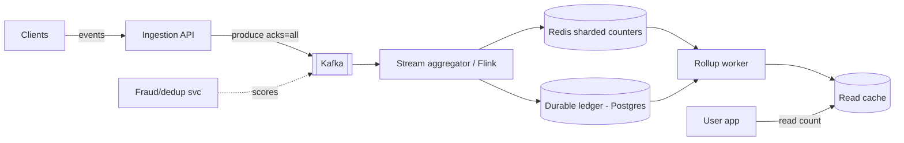
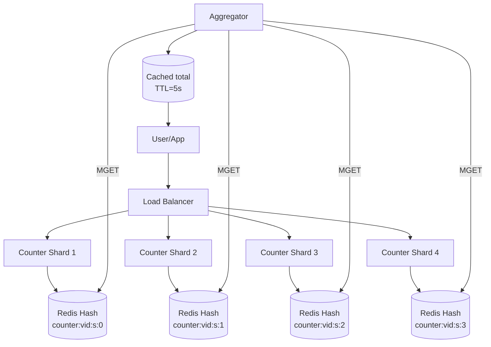
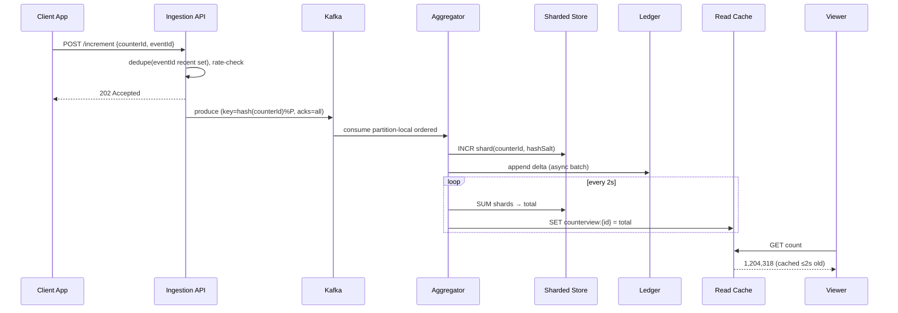
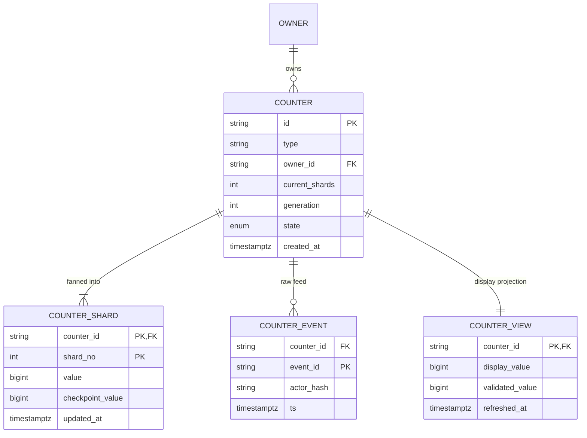

# Design Distributed Counter

## Blogs and websites

## Medium

## Youtube

## Theory

### What Is It?

A **distributed counter** is a counting primitive that maintains accurate (or approximately accurate) counts across a distributed system where the increment/decrement operations originate from many nodes simultaneously.

### Why Does It Exist?

In a single-node database, `UPDATE counters SET value = value + 1` is a simple row lock. But at scale — a viral TikTok video receiving 1M likes/second — that single row becomes a lock-contention hotspot that serializes all writes and creates a throughput ceiling. A distributed counter spreads the write load across multiple shards/nodes so throughput scales with the number of shards, not the number of cores on one machine.

### What Problem Does It Solve?

* **Hot-row lock contention**: a single counter row updated at high frequency becomes a bottleneck — every write waits on a lock. Sharding (sub-counters) distributes writes across many rows/nodes.
* **Single-node throughput ceiling**: one machine cannot sustain 1M+ increments/sec indefinitely. Distributed counters scale horizontally.
* **Global coordination cost**: computing the total count requires aggregating across all shards — this is the read-path cost that must be optimized (caching, rollups, approximation).
* **Durability vs. latency trade-off**: synchronous replication per increment is too slow; asynchronous write buffering improves latency but risks losing a small window of counts on failure.
* **Approximate vs. exact counting**: for metrics like "unique viewers," exact counting of billions of events is expensive — HyperLogLog provides 98% accuracy with 1KB of memory.
* **Counter lifecycle management**: counters must be created, reset (daily/monthly), and archived (cold storage) without disrupting ongoing writes.

### Important Subtopics

1. Why naive counting breaks (lock contention on hot rows)
2. Sharding/sub-counter strategy and adaptive shard scaling
3. Approximate counting structures (HyperLogLog, Count-Min Sketch)
4. Write buffering & batch flushing (loss-window trade-offs)
5. Read-path aggregation (materialized rollups, approximate display)
6. Consistency models: strong vs eventual counting
7. Deduplication (unique viewers vs raw events)
8. Time-windowed counters (rate limiting, analytics)
9. Persistence & durability of counts
10. Counter lifecycle (creation, reset, archival, deletion)
11. Fraud/abuse effects on counters
12. Display formatting and UX implications of approximation

*(The existing subsections below cover problem statement, requirements, sharding, write/read optimization, consistency trade-offs, and design decisions.)*

### Problem Statement
Design a distributed counter system that can accurately count events (likes, views, clicks) at massive scale with high throughput and acceptable consistency trade-offs.

### Functional Requirements
- Increment/decrement a counter by any value
- Read current counter value
- Support millions of distinct counters (per-post likes, per-video views)
- Reset counter
- Get counter value within a time window

### Non-Functional Requirements
- **Throughput**: 1M+ increments/second per counter (viral content)
- **Latency**: Write < 5ms, Read < 10ms
- **Consistency**: Eventually consistent (reads may lag by a few seconds)
- **Durability**: No permanent count loss
- **Scale**: Billions of counters

### The Problem with Naive Counting

```
Simple approach: UPDATE counters SET value = value + 1 WHERE id = X

Problem at scale:
  - Single row = single lock = bottleneck
  - 1M writes/sec to same row → massive contention
  - Database becomes the bottleneck
```

### Solution: Sharded Counters

```
Instead of 1 counter → N sub-counters (shards)

Counter "post:123:likes" → 
  shard_0: 1,234
  shard_1: 1,189
  shard_2: 1,301
  ...
  shard_N: 1,276

Write: increment random shard → no contention
Read:  SUM(all shards) → total count

Shard count adapts to write rate:
  Low traffic:  1 shard
  High traffic: 100+ shards (auto-scale)
```

### Architecture

```
┌──────────┐     ┌──────────┐     ┌──────────────────────┐
│  Client  │────▶│  API GW  │────▶│  Counter Service      │
└──────────┘     └──────────┘     │                       │
                                  │  ┌─────────────────┐  │
                                  │  │ Write Path:      │  │
                                  │  │  hash(request)   │  │
                                  │  │  → pick shard    │  │
                                  │  │  → increment     │  │
                                  │  ├─────────────────┤  │
                                  │  │ Read Path:       │  │
                                  │  │  sum all shards  │  │
                                  │  │  or read cache   │  │
                                  │  └────────┬────────┘  │
                                  └───────────┼───────────┘
                                              │
                                  ┌───────────┼───────────┐
                                  ▼                       ▼
                           ┌────────────┐         ┌────────────┐
                           │  Redis     │         │  Database  │
                           │  (shards)  │         │  (durable) │
                           └────────────┘         └────────────┘
```

### Write-Optimized Approaches

**1. In-Memory Buffering:**
```
Client → Buffer in local memory → Batch flush every N seconds → DB
  Pro: Extremely fast writes
  Con: Risk of count loss on crash
```

**2. Redis INCR (per-shard):**
```
INCR counter:post:123:shard:7
  → Atomic, O(1), in-memory
  → Periodic persistence to DB
```

**3. Kafka + Stream Processing:**
```
Events → Kafka → Flink/Spark → Aggregate → Write to DB
  → Handles burst traffic
  → Exactly-once with Kafka transactions
```

### Read Path Optimization

```
Problem: SUM across 100 shards is expensive if done per request

Solution: Materialized view / Read cache
  - Background job aggregates shards every 1-5 seconds
  - Writes aggregated total to a read-optimized cache
  - Reads hit the cache → O(1)
  - Display: "1.2M likes" (approximate, not exact)
```

### Consistency Trade-offs

| Approach | Consistency | Throughput | Use Case |
|----------|-------------|------------|----------|
| Single counter (DB) | Strong | Low | Financial transactions |
| Sharded counter | Eventual (~seconds) | Very High | Likes, views |
| Buffered + batch | Eventual (~minutes) | Extreme | Analytics counters |

### Key Design Decisions

| Decision | Choice | Reason |
|----------|--------|--------|
| Write path | Sharded Redis counters | High throughput, low latency |
| Read path | Periodically aggregated cache | Fast reads, acceptable lag |
| Persistence | Async flush to PostgreSQL | Durability without write penalty |
| Shard count | Auto-scale based on write rate | Adapt to traffic patterns |
| Display | Approximate ("1.2M") for large counts | Users don't need exact numbers |

### Approximate Counting Structures

When *unique* counting or memory-constrained cardinality matters, probabilistic structures dominate:

- **HyperLogLog (HLL)** — count unique elements (unique viewers) using ~12 KB for billions of distinct values with ~2% error. Redis ships it natively (`PFADD`/`PFCOUNT`). Mergeable: union of HLLs = HLL of union, enabling distributed aggregation.
- **Count-Min Sketch** — approximate frequency per key in fixed memory; answers "how many times did user X view this?" with over-estimation only. Used for heavy-hitter detection.
- **Approximate display math**: showing "1.2M" hides ±5% error invisibly; showing "1,204,317" makes a 2% error look like lying. UX and engineering agree here deliberately.

### Deduplication: Events vs Uniques

Raw increments count *events*; product requirements often want *unique actors*:

```
Event count (cheap):   every play event → INCR
Unique viewers (hard): need "did this user already count?"

Options:
  1. HLL add(userId) → approximate uniques (~2% error)
  2. Bloom filter gate → definitely-seen rejected; maybes pass to exact set
  3. Exact set with TTL (small scale only)
  4. Session-scoped dedup: count once per session per content
```

YouTube's view-count pipeline is the famous example: early views update a fast approximate number; a slower validation pipeline (dedup, fraud checks, watch-time thresholds) publishes the authoritative frozen count later.

### Durability Model

The loss window defines the design:

```
Buffer in RAM only        → lose seconds-to-minutes on crash (analytics OK)
Redis AOF everysec        → lose ≤1s, survives restarts
Kafka (acks=all) upstream → events durable before aggregation; replayable
DB flush every N sec      → bounded lag between cache and truth
```

Strong answers quantify the window and match it to business tolerance: a like lost silently hurts nobody; a payment count lost triggers reconciliation alarms.

---

## Characteristics

- **Write-dominated asymmetry**: viral content produces 100K+ increments/sec against one logical counter while reads stay comparatively rare — the architecture optimizes the write path first.
- **Contention is the enemy**: any design funnelling writes through one lock/row/leader fails at viral scale; sharding converts hot-row contention into parallel independent increments.
- **Approximation as feature**: at scale, exactness costs more than users value it; systems expose precision tiers (exact small counts, rounded large ones).
- **Mergeability requirement**: partial counts must combine cheaply across shards/regions — sum-based shards merge trivially; HLL merges via union; both preserve distributivity.
- **Bounded staleness**: eventual consistency acceptable but must be *bounded and observable* (display lag SLOs: p99 under 30 s).
- **Fraud-sensitive**: counters are attack surface (bot farms inflating views); validation pipelines separate raw from trusted counts.

---

## Components

- **Ingestion edge / event API**
  *Purpose*: accept increment events with authn + basic anti-spam. *Responsibilities*: rate limiting, schema validation, fast-ack into durable queue (Kafka) so bursts never hit storage directly. *Relationship*: decouples clients from aggregation tier. *Example*: YouTube's play-beacon endpoints.

- **Sharded counter store**
  *Purpose*: hold sub-counters with O(1) atomic increments. *Responsibilities*: shard placement (`hash(counterId, salt) % shardCount`), atomic INCR, TTL/reset handling, adaptive resharding signals (shard ops/sec metrics). *Example*: Redis Cluster with counter keys co-located by hash-tag.

- **Aggregation worker**
  *Purpose*: maintain read-optimized totals. *Responsibilities*: periodic SUM across shards (or stream-consuming deltas), write totals to read cache + durable rollup tables, detect shard drift. *Relationship*: bridges write-optimized and read-optimized stores.

- **Read cache**
  *Purpose*: serve display counts at O(1). *Responsibilities*: hold last aggregated total per counter, short TTL or push-updated, format-ready (rounded strings precomputed). *Example*: Redis `counterview:{id}` refreshed by aggregator every 1–5 s.

- **Durable ledger**
  *Purpose*: source of truth surviving all caches. *Responsibilities*: periodic checkpointing of shard sums, append-only delta log enabling replay/recompute, reconciliation jobs comparing cache vs ledger. *Example*: PostgreSQL table `counter_shards(counter_id, shard_no, value, version)` flushed asynchronously.

- **Dedup/fraud layer**
  *Purpose*: enforce unique-viewer semantics and filter bots. *Responsibilities*: Bloom/HLL gates, velocity analysis, trust scoring feeding validated vs raw counts. 



---

## Patterns

- **Adaptive sharding**
  *What*: shard count scales with observed write rate; quiet counters live on 1 shard, viral ones fan to 100+. *Solves*: resource allocation matching skew. *How*: monitor ops/shard; splitter migrates half the shards when threshold crossed (clients rehash via generation-numbered salts). *Real-world*: Instagram's documented approach to like-count scaling.

- **Buffered batch flush**
  *What*: aggregate deltas in memory, persist batches periodically. *Problem solved*: DB write amplification. *Trade-off*: crash loses buffer contents (bound it: max 1–2 s or max N deltas, whichever first). *When*: analytics-grade tolerance. *Not when*: money.

- **Lambda-style dual pipeline**
  *What*: fast path (in-memory/streaming) serves instant approximate numbers; slow path (batch validation, dedup, fraud) publishes authoritative counts that eventually overwrite. *Real-world*: YouTube views; Twitter impression counts.

- **Read-your-increment (session consistency)**
  *Problem*: user clicks like, count doesn't move → confusion/rapid re-clicks. *Solution*: client-side optimistic display (+1 locally) plus server returning updated projection on the mutation response itself. Cheap fix for the most visible staleness case.

- **CRDT-style merge** (G-Counter)
  *What*: each node keeps its own vector entry; value = sum of entries; merges are commutative/associative/idempotent. *Why interesting*: correctness without coordination even across partitions. *Cost*: vector size grows with writer count — practical for bounded clusters, not open-ended client sets.

---

## Benefits

- **Absorbs viral spikes without degradation**: sharding means the 1000× moment scales horizontally instead of melting a row lock.
- **Protects primary databases**: increment storms never reach OLTP stores; batch flushes amortize I/O.
- **Enables realtime UX** (live counters ticking) that pure-batch designs cannot deliver.
- **Cost-efficient at extreme scale**: RAM-backed increments cost fractions of a cent per million vs equivalent DB transactions.
- **Composable primitives**: same infrastructure powers rate limiters, leaderboards, analytics windows — one system, many products.

---

## Pros

- Near-linear horizontal scaling on the write path.
- Sub-millisecond increments; O(1) cached reads.
- Graceful approximation options where exactness is unaffordable.
- Durable-replay safety net: raw event logs allow recomputation after corruption bugs.

## Cons

- Eventual consistency surfaces visibly ("like count differs between devices").
- Multi-component stack (queue + aggregator + cache + ledger) multiplies failure modes and operational load.
- Exact-read requirements force expensive fallback paths (SUM across shards).
- Fraud filtering adds pipeline latency between raw event and trusted count.
- Resharding live counters safely (migration during traffic) is genuinely tricky.

---

## Challenges

- **Technical**: idempotency of retried increments (client retry storms double-counting); monotonic display guarantees (count must never visibly decrease despite shard rebalances/restorations); cross-region merging conflicts.
- **Scalability**: skew concentration (one celebrity post among billions of cold counters); Kafka partition hot spots keyed naively by counterId.
- **Performance**: SUM-over-shards latency growth as shard counts climb (mitigated by hierarchical aggregation trees).
- **Reliability**: aggregator crashes mid-flush (checkpoint discipline needed); Redis failovers losing tail increments (accepted within durability budget); clock skew in time-window counters.
- **Maintainability**: schema evolution of counter metadata; lifecycle policies (billions of dead counters accumulating).
- **Operational**: reconciliation drift alerts (cache vs ledger divergence), capacity planning for predictable bursts (product launches, sports finals).
- **Security/fraud**: bot inflation economics, click farms, self-dealing — detection pipelines and count-freezing policies (YouTube's 301+ phenomenon).

---

## Best Practices

- **Make increments idempotent at the event level**: attach eventId/client token; dedupe in ingestion window — retries then harmless.
- **Never let displayed counts decrease**: serve max(seen, current) per counter at display layer; investigate decreases as incidents.
- **Separate raw vs validated counts explicitly** in data model; freeze counts entering validation (the "301+" pattern) rather than displaying volatile numbers.
- **Bound and document the loss window** of buffering choices; align with business tolerance per counter class.
- **Key Kafka/aggregation by (counterId, bucket)** not raw counterId alone — spreads celebrities across partitions while preserving per-counter order.
- **Reconcile continuously**: background jobs compare shard sums vs ledger; drift beyond epsilon pages someone.
- **Pre-warm counters ahead of known events** (concert onsales, episode drops): create shards, warm caches, alert dashboards ready.
- **Archive cold counters aggressively**: TTL to object storage with rehydration path; keeps working set RAM-sized.

---

## When to Use / Not Use

**Use distributed counter architecture when**: event volumes overwhelm single-row updates (≥ thousands/sec per counter class); approximate reads acceptable; realtime display adds product value.

**Skip when**: low-volume counts (plain DB column fine until contention appears); strict exactness required synchronously (money ledgers use transaction systems instead); simple analytics served better by columnar warehouses.

Alternatives: warehouse-based counting (batch, minutes-fresh), Redis single-key INCR (until hot-key ceiling), specialized TSDBs for time-window analytics.

Decision inputs: peak per-counter write rate, uniqueness semantics needed, freshness SLOs, fraud exposure, infra appetite.

---

## Use Cases

- **Video platform view counts (YouTube-class)**
  *Problem*: billions of daily plays; viral videos spike to 100K+/sec; abuse rampant. *Solution*: dual pipeline — realtime approximate counter + validated authoritative count after dedup/watch-time/fraud gates; public display freezes during validation ("301+" era artifact). *Trade-off*: numbers lag reality briefly but earn trust.

- **Social likes/reactions**
  *Problem*: hot posts get massive concurrent likes; UI must feel immediate. *Solution*: sharded Redis INCR + optimistic client +1; aggregated display refreshes every few seconds; exactness irrelevant socially. *Trade-off*: occasional cross-device discrepancy accepted universally.

- **API rate-limiting windows**
  *Problem*: sliding-window quotas enforced across fleet. *Solution*: time-bucketed counters (`INCR {key}:{minuteBucket}` with TTL) summed over active buckets; see dedicated rate-limiter topic. *Trade-off*: slight over-admission at bucket boundaries vs O(1) enforcement cost.

---

## Architecture

### Architectural Style

**Sharded sub-counter architecture with aggregated reads**: a single logical counter (e.g., "likes on video X") is physically split across N sub-shards (Redis keys `counter:{videoId}:shard:{0..N-1}`). Increments are distributed across shards using `hash(videoId) % N` or by spreading across a fixed number of shards. Reads aggregate the sub-shards (via `MGET` or `SCRIPT`) to compute the total. This pattern is used by Twitter's Fatcache, Instagram's like system, and Redis-based counters at scale.

**Approximate structures for unique counts**: for "unique viewers," exact distinct counting is prohibitively expensive at billions of events. HyperLogLog (HLL) provides 0.81% standard error with only 12 KB of memory by hashing each element and tracking the longest run of leading zeros across registers. Count-Min Sketch serves similar purposes for frequency estimation.



*Diagram: Sharded counter architecture. Writes are distributed across N Redis hash shards based on the counter ID. Reads aggregate all shards via MGET, with results cached for a short TTL to reduce read amplification.*

### Component Responsibilities and Communication

| Component | Responsibility | Communication |
|---|---|---|
| Counter Shards | Store and increment sub-counter values | Key-value store (Redis/Memcached) per shard |
| Aggregator | Sum sub-counter values on read | MGET or Lua script across shards |
| Write Buffer | Batch increments before flushing | In-process buffer; periodic flush to shards |
| Read Cache | Cache computed totals to reduce aggregation | Short TTL (seconds); invalidated on write burst |
| HLL/Sketch Store | Approximate unique-count structures | Per-shard HLL registers for merging |
| Admin API | Counter lifecycle (create, reset, delete) | Auth-gated; writes to metadata store |

**Data flow**: client → load balancer → shard `hash(key) % N` → increment (Redis `HINCRBY` or `INCR`) → return. Read: aggregator `MGET` all shards → sum → cache with TTL → response.

**Scaling strategy**: increase shard count N for counters with extreme write rates; aggregator cached reads handle read scaling; HLL registers merged across shards for approximate unique counts.

**Failure handling**: lost increments during buffer flush → accept bounded loss window (document it); shard node down → route writes to remaining shards (reduced accuracy); read aggregation fails → serve stale cached total with grace.

## Design

### Design Considerations

The distributed counter design walks a tightrope: **write throughput** (scale increments across shards), **read latency** (aggregate N shards quickly), **accuracy** (exact vs. approximate), and **durability** (no lost counts). The key decision is whether to accept approximation (98% accurate, 1KB memory with HLL) for unique counts, or pay the exact cost (billions of distinct elements to track).

### Key Decisions

- **Sharding factor N**: fixed vs. adaptive scaling. For viral content (1M+ writes/sec on one counter), auto-scale shard count based on write throughput. For most counters, a fixed N (e.g., 512) suffices.
- **Write buffering**: batch increments in-process before flushing to reduce round-trips. Flush interval (e.g., 100 ms) defines the loss window on crash.
- **Read caching**: cache aggregated totals with a short TTL (e.g., 5 s). Trade a few seconds of staleness for O(1) reads instead of O(N) aggregation.
- **Approximate vs. exact**: use HLL for unique counting; exact counts for business-critical totals (e.g., payment metrics) where even 2% error is unacceptable.
- **Consistency model**: eventual consistency on reads (staleness acceptable) vs. strong consistency (block until all shards respond).

### Trade-offs

| Decision | Pro | Con |
|---|---|---|
| Sharding | Scales writes linearly with shard count | Reads require aggregating N shards (O(N)) |
| Write buffering | Fewer round-trips, higher throughput | Bounded loss window on crash |
| Read caching | O(1) reads, low latency | Stale values (seconds of lag) |
| HLL approximation | 98% accuracy, 1KB memory | Not exact; can't be used for business-critical totals |
| Strong consistency | Exact counts | Higher latency, lower throughput |

### Scalability Considerations

- **Auto-sharding**: monitor per-shard write rate; split a counter's shard count when any shard exceeds a threshold (e.g., 50K writes/sec).
- **Aggregator scaling**: cached reads handle the bulk; uncached reads batch MGET across shards in a single round-trip.
- **HLL merge**: each shard maintains its own HLL registers; merging is a register-wise max — O(shards × registers), done server-side.
- **Multi-region**: per-region counters with periodic cross-region aggregation for global totals.

### Reliability Considerations

- **Bounded loss window**: buffer flush interval defines maximum lost increments on crash; acceptable for analytics, not for financial totals.
- **Shard failure**: route writes to remaining shards; reduced accuracy but system keeps functioning. Alert on shard health.
- **Read degradation**: if aggregation fails, serve stale cached total with a staleness header.

### Performance Considerations

- Write path: Redis `HINCRBY` on sharded hash — sub-millisecond.
- Read path: cached total = microseconds; uncached = O(N) MGET (still sub-ms for small N).
- HLL memory: 1280 bytes for 0.81% error; merge is register-wise max.
- Buffer flush: batch size tuned to balance throughput vs. loss window.

### Security Considerations

- **Key injection**: never use raw user input in counter key names without sanitization — prevents key-space pollution or enumeration.
- **Rate limiting writes**: prevent a malicious client from inflating counters (DoS) — per-IP/per-user increment limits.
- **Access control**: only authorized services can create/reset/delete counters; all mutations are authenticated.

### Maintainability Considerations

- **Shard count management**: auto-scaling shard logic must be idempotent and handle partial failures.
- **Counter lifecycle**: daily/monthly resets via scheduled jobs; archival of historical counts to cold storage.
- **Monitoring**: per-counter write rate, read cache hit ratio, stale-read percentage, HLL error bounds, shard health.

## High-Level Design



Scaling: Kafka partitions sized for peak aggregate throughput; aggregators scale by partition; shard counts auto-adjust per counter heat; read-cache cluster sharded by counterId handles display QPS.

Failure handling: Kafka retained offsets enable aggregator replay after crashes (idempotent via eventId dedupe); Redis shard loss → rebuild from ledger checkpoints + post-crash deltas; cache loss → direct SUM fallback with throttling.

---

## Deep Dive

- **Monotonicity mechanics**: rebalancing splits shard sums; naive transitions can momentarily undercount (some shards migrated, others pending) — solve with two-phase handoff (source freezes + reports final, target absorbs, generation tag prevents double-add) or by serving stale-but-monotonic cached totals through transitions.
- **Hierarchical aggregation**: for 10K+ shards, tree-sum (groups of 64 → group-totals → grand-total) turns O(N) scans into O(log N) depth with incremental propagation — each level's workers handle tiny fan-ins.
- **HLL internals sketch**: registers array (2^14 × 5-bit typical); each element hashes to (register, rank-of-leading-zeros); register keeps max rank seen; cardinality ≈ harmonic-mean estimator with bias correction. Error ∝ 1.04/√m. Merge = register-wise max. This compactness is why 12 KB suffices for billions.
- **Time-window counters**: ring of buckets (e.g., 60 × 1-minute) rotated by lazy sweep or TTL'd keys; sliding-window queries sum live buckets; boundary over-admission bounded by bucket granularity — tune granularity vs memory per use case.
- **Observability**: per-class increment rates, shard heat maps, end-to-end lag (event→display percentiles), reconciliation drift metrics, dedup rejection ratios (fraud signal), and monotonicity-violation alarms treated as P1.

---

## API Contract

### Counter Operations API

```
POST   /api/v1/counters/{counterId}/increment
POST   /api/v1/counters/{counterId}/increment/batch
GET    /api/v1/counters/{counterId}
PUT    /api/v1/counters/{counterId}/reset
DELETE /api/v1/counters/{counterId}
GET    /api/v1/counters/{counterId}/unique-users
```

### Increment

```http
POST /api/v1/counters/likes:vid_123/increment
Content-Type: application/json

{
  "by": 1,
  "userId": "user_456",
  "timestamp": "2024-02-14T10:30:00Z"  // for time-windowed counters
}
```

**Response** (HTTP 204 — no body for fire-and-forget writes; counter value returned only if `returnTotal=true` in query):

```json
{
  "counterId": "likes:vid_123",
  "value": 1428571,
  "shardWritten": 3
}
```

### Batch Increment

```http
POST /api/v1/counters/views:vid_123/increment/batch
Content-Type: application/json

{
  "increments": [
    {"by": 1, "userId": "user_1"},
    {"by": 1, "userId": "user_2"}
  ]
}
```

**Response** (HTTP 202 — batch accepted, processed asynchronously):

```json
{
  "accepted": 2,
  "rejected": 0
}
```

### Read Counter

```
GET /api/v1/counters/likes:vid_123
```

**Response** (cached total, with staleness metadata):

```json
{
  "counterId": "likes:vid_123",
  "value": 1428571,
  "approximate": false,
  "lastUpdated": "2024-02-14T10:30:05Z",
  "stalenessSeconds": 2
}
```

### Unique Users (approximate)

```
GET /api/v1/counters/streams:vid_123/unique-users?window=24h
```

```json
{
  "counterId": "streams:vid_123",
  "uniqueUsers": 847332,
  "approximate": true,
  "errorBounds": 0.0081,
  "algorithm": "hyperloglog"
}
```

### Status Codes

* `200` — successful read
* `201` — counter created
* `202` — batch increment accepted (async processing)
* `204` — increment accepted (fire-and-forget)
* `400` — invalid request (malformed body, `by` out of range)
* `401` — unauthenticated
* `403` — not authorized to write to this counter
* `404` — counter not found
* `412` — CAS conflict (reset during active writes)
* `429` — rate limited (per-client increment limits prevent inflation/DoS)

### Key Contracts

- **Idempotency**: each increment carries a client-generated `eventId` UUID; the service dedupes by `(counterId, eventId)` within a retention window (e.g., 24 hours) to prevent double-counting on client retries.
- **Sharded writes**: increments are distributed across N shards using consistent hashing; the shard number is deterministic from the counter ID.
- **Approximate counters**: unique-user counts use HLL with bounded error; the API exposes `approximate: true` and `errorBounds` so consumers know the precision.
- **Rate limiting**: per-client increment rate limits prevent abuse (inflating counters via malicious clients).

## Data Modeling



Choices: composite PK `(counter_id, shard_no)` distributes naturally across KV/wide-column stores; `event_id` PK enforces dedupe structurally; `display_value` vs `validated_value` encodes the dual-pipeline split; `generation` supports safe resharding (old-generation writes ignored post-cutover). Retention: events 30–90 days (replay window), shards indefinitely while counter alive, archived counters moved to object storage as JSON snapshots.

---

## Java and Spring Boot Implementation

Sharded counter service:

```java
@Service
public class ShardedCounterService {

    private static final int MAX_SHARDS = 128;

    private final StringRedisTemplate redis;
    private final CounterLedgerRepository ledger;

    public ShardedCounterService(StringRedisTemplate redis, CounterLedgerRepository ledger) {
        this.redis = redis;
        this.ledger = ledger;
    }

    public long increment(String counterId, int generation, String eventId) {
        int shards = shardCountFor(counterId);
        int shard = ThreadLocalRandom.current().nextInt(shards);
        String key = "{%s:g%d}:s%d".formatted(counterId, generation, shard); // hash-tag co-location
        Long value = redis.opsForValue().increment(key);
        redis.persistLater(key, counterId, shard, value);     // async ledger flush
        return value;
    }

    public long readTotal(String counterId, int generation) {
        Long cached = redis.opsForValue().get("view:" + counterId);
        if (cached != null) return cached;
        long total = 0;
        for (int s = 0; s < shardCountFor(counterId); s++) {
            String v = redis.opsForValue().get("{%s:g%d}:s%d".formatted(counterId, generation, s));
            if (v != null) total += Long.parseLong(v);
        }
        redis.opsForValue().set("view:" + counterId, String.valueOf(total), Duration.ofSeconds(2));
        return total;
    }

    private int shardCountFor(String counterId) {
        return ledger.findActiveShardCount(counterId).orElse(1);
    }
}
```

Controller with idempotent ingest:

```java
@RestController
@RequestMapping("/api/v1/counters/{counterId}")
public class CounterController {

    private final ShardedCounterService counters;
    private final RecentEventCache recentEvents;

    @PostMapping("/increment")
    ResponseEntity<?> increment(@PathVariable String counterId,
                                @RequestHeader("X-Event-Id") String eventId) {
        if (!recentEvents.recordIfAbsent(eventId)) {
            return ResponseEntity.ok(Map.of("duplicate", true));   // retry-safe
        }
        long approx = counters.increment(counterId, CURRENT_GENERATION, eventId);
        return ResponseEntity.accepted()
                .body(Map.of("approximate", true, "value", approx));
    }

    @GetMapping
    Map<String, Object> read(@PathVariable String counterId) {
        long total = counters.readTotal(counterId, CURRENT_GENERATION);
        return Map.of("display", NumberFormat.getCompactNumberInstance()
                .format(total));                    // "1.2M"
    }
}
```

Notes: hash-tags `{...}` keep a counter's shards co-locable while random shard selection spreads load; `RecentEventCache` is a small TTL'd Redis set making retries free of double-count; production adds Kafka-driven aggregation replacing the synchronous flush, plus scheduled reconciliation comparing Redis sums to ledger rows. Testing: concurrent increment hammer asserting no lost updates; duplicate-event tests; monotonic-display regression tests simulating resharding.

---

## Real-World Examples

- **YouTube views** — the canonical raw-vs-validated dual pipeline; the infamous "301+" placeholder existed because early counts froze during validation — proof that trust beats freshness for authoritative numbers.
- **Instagram/Twitter likes** — documented Redis-sharded counters; Instagram's engineering posts describe exactly the adaptive-sharding approach above for celebrity posts.
- **Discord online-member counters** — presence-derived counts with aggressive approximation (they publish their HLL-ish trade-off reasoning).
- **Reddit vote counts** — fuzzed/vote-smoothing displays demonstrating deliberate display-layer manipulation against manipulation bots.

---

## Interview Preparation

### Interview Questions

**Beginner**

1. **Why does `UPDATE ... SET value = value + 1` fail at viral scale?**
   All increments serialize on one row lock — throughput collapses under contention regardless of DB power. Distributing increments across independent shards removes the shared lock entirely.
2. **Why show "1.2M" instead of the exact count?**
   At large magnitudes the underlying value is already approximate (lag, dedup, fraud filtering); rounding honestly reflects precision while reducing display churn and read cost.

**Intermediate**

3. **Design sharding for a counter expecting 50K increments/sec.**
   Start ~32 shards (headroom ≈ 1.5K ops/shard well within Redis), pick shard by uniform random per request, co-locate via hash-tags if atomic multi-shard ops ever needed, auto-split when per-shard ops exceed threshold. Discuss read path: cached SUM refreshed every few seconds rather than per-request scans.
4. **How do you prevent double counting on client retries?**
   Client-generated event IDs deduped server-side (TTL'd recent-set + structural unique constraint in the durable event log). Emphasize: idempotency belongs at event identity level, not transport.
5. **What breaks when you reshard a live counter, and how do you avoid visible glitches?**
   Mid-transition sums can transiently miss in-flight deltas → count dips. Fixes: two-phase migration freezing source shards before target activation, generation-tagged keys ignoring stragglers, and display-layer monotonic clamp serving max-ever-seen during transition.

**Advanced**

6. **Design unique-viewer counting for 500M daily video views with ±2% accuracy and minimal memory.**
   HyperLogLog per video (12 KB × millions of videos still modest), merged across regions via union; gate obvious duplicates with session tokens before HLL insertion to reduce noise; nightly exact recomputation from warehouse calibrates bias constants. Discuss why exact sets (memory-prohibitive) and Bloom-only (no count ability, just membership) fall short.
7. **Counts must never go backwards, yet shard recovery can undercount. Solve.**
   Layers: display clamp max(seen,current) per counter; recovery replays durable delta log from last checkpoint (making recovered ≥ pre-crash); reconciliation treats decreases as alarms not corrections. Deeper: distinguish *display* monotonicity (mandatory) from *storage* monotonicity (best-effort).

**Senior / system design**

8. **Architect the full counter platform for a social app: likes, views, follows, search-impressions — differing semantics included.**
   Segment by semantics: likes (per-user uniqueness, moderate rates), views (event streams, huge rates, fraud-heavy), follows (strongly consistent relational truth elsewhere; counters only projections). Shared substrate: ingestion queue + sharded store + rollups; per-type policies for dedup, validation, freshness. Discuss why forcing one pipeline onto all types fails (fraud needs differ wildly).
9. **Your displayed like-counts differ up to 15% across CDN regions. Root causes and remedies?**
   Regional rollup clocks drifting, uneven aggregator lag, cache TTL stacking at edges, cross-region replication lag. Remedies: centralized rollup origin with regional pull-through, tighter lag budgets/alerting, versioned snapshots (serve same snapshot epoch everywhere, advance epochs atomically). Tests understanding of where inconsistency creeps in layered caches.

### Common Mistakes

- Counting raw events where uniqueness intended (views ≠ viewers).
- Per-request shard SUMs — O(shards) reads collapsing under display traffic.
- Missing idempotency, then discovering doubled counts after mobile retry storms.
- Allowing visible count decreases during maintenance (users notice; screenshots circulate).
- One global shard-count constant: cold counters waste memory, hot ones melt.

### Expected discussion points

Skew-driven adaptivity, the raw-vs-validated pipeline philosophy, probabilistic structure fluency (HLL/CMS), monotonicity guarantees, and matching durability windows to business semantics.

