# Design Distributed Counter

## Blogs and websites

## Medium

## Youtube

- [Designing a Distributed Counter System (Sharded Counters, CRDT, Quorum)](https://www.youtube.com/watch?v=5o0Gqc_Vz9I)
- [How to Build a Counter That Handles Millions of Requests Per Second](https://www.youtube.com/watch?v=J7E-6UY9I5o)
- [GOTO 2020 – Martin Kleppmann: Building Correct Distributed Systems](https://www.youtube.com/watch?v=0w6KbW0j1Qo)
- [Designing Data-Intensive Applications – Distributed Counter Patterns](https://www.youtube.com/watch?v=5W6Rhq8X0qI)

---

## Theory

### Topics Covered

1. [Introduction / Problem Statement](#introduction--problem-statement)
2. [Characteristics](#characteristics)
3. [Pros](#pros)
4. [Benefits](#benefits)
5. [Cons](#cons)
6. [Use Cases](#use-cases)
7. [Components](#components)
8. [Architectural Patterns](#architectural-patterns)
9. [Challenges](#challenges)
10. [Best Practices](#best-practices)
11. [When to Use / When Not to Use](#when-to-use--when-not-to-use)
12. [Data Model and API](#data-model-and-api)
13. [Sharded Counters and Approximate Counting Structures](#sharded-counters-and-approximate-counting-structures)
14. [Replication Strategies](#replication-strategies)
15. [Failure Detection and Membership](#failure-detection-and-membership)
16. [High Availability and Scalability](#high-availability-and-scalability)
17. [Performance and Optimization](#performance-and-optimization)
18. [CAP Theorem and Consistency Trade-offs](#cap-theorem-and-consistency-trade-offs)
19. [Encryption and Key Management](#encryption-and-key-management)
20. [Authentication and Authorization](#authentication-and-authorization)
21. [Security Threats and Mitigations](#security-threats-and-mitigations)
22. [Observability and Logging](#observability-and-logging)
23. [Real-World Implementations](#real-world-implementations)
24. [Java and Spring Boot Implementation Guide](#java-and-spring-boot-implementation-guide)
25. [Interview Questions and Answers](#interview-questions-and-answers)

---

### Introduction / Problem Statement

A **distributed counter** is a counting primitive that maintains accurate (or approximately accurate) counts across a distributed system where increment/decrement operations originate from many nodes simultaneously. The counter is addressed by a logical key (e.g. `likes:video_123`, `views:post_456`, `click:ad_789`) and must support high-frequency concurrent writes from geographically dispersed clients while serving reads with low latency.

In a single-node database, `UPDATE counters SET value = value + 1` is a simple row lock. But at scale — a viral TikTok video receiving 1M likes/second — that single row becomes a lock-contention hotspot that serializes all writes and creates a throughput ceiling. A distributed counter spreads the write load across multiple shards/nodes so throughput scales with the number of shards, not the number of cores on one machine.

#### The Problem with Naive Counting

```
Simple approach: UPDATE counters SET value = value + 1 WHERE id = X

Problem at scale:
  - Single row = single lock = bottleneck
  - 1M writes/sec to same row → massive contention
  - Database becomes the bottleneck
```

#### Problems It Solves

* **Hot-row lock contention**: a single counter row updated at high frequency becomes a bottleneck — every write waits on a lock. Sharding (sub-counters) distributes writes across many rows/nodes.
* **Single-node throughput ceiling**: one machine cannot sustain 1M+ increments/sec indefinitely. Distributed counters scale horizontally.
* **Global coordination cost**: computing the total count requires aggregating across all shards — this is the read-path cost that must be optimized (caching, rollups, approximation).
* **Durability vs. latency trade-off**: synchronous replication per increment is too slow; asynchronous write buffering improves latency but risks losing a small window of counts on failure.
* **Approximate vs. exact counting**: for metrics like "unique viewers," exact counting of billions of events is expensive — HyperLogLog provides 98% accuracy with 1 KB of memory.
* **Counter lifecycle management**: counters must be created, reset (daily/monthly), and archived (cold storage) without disrupting ongoing writes.

#### Problem Statement

Design a distributed counter system that can accurately count events (likes, views, clicks) at massive scale with high throughput and acceptable consistency trade-offs.

#### Functional Requirements

- Increment/decrement a counter by any value
- Read current counter value
- Support millions of distinct counters (per-post likes, per-video views)
- Reset counter
- Get counter value within a time window
- Record unique actors (not just raw events)

#### Non-Functional Requirements

- **Throughput**: 1M+ increments/second per counter (viral content)
- **Latency**: Write < 5 ms, Read < 10 ms
- **Consistency**: Eventually consistent (reads may lag by a few seconds)
- **Durability**: No permanent count loss
- **Scale**: Billions of counters

#### Architectural Overview

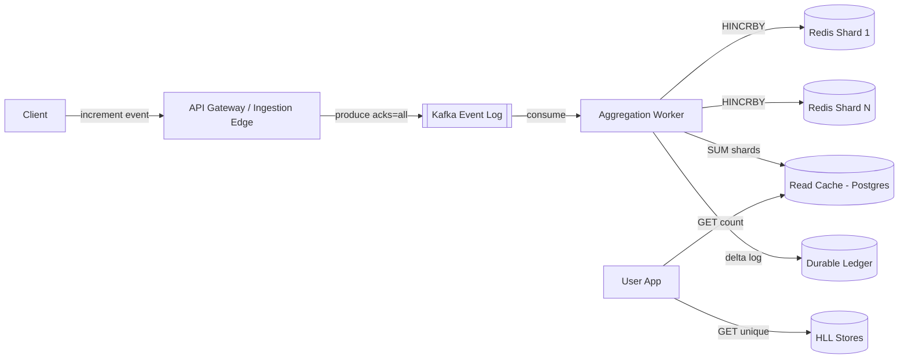

*The distributed counter architecture: clients send increment events to an ingestion edge that persists them to Kafka (durable, replayable). Aggregation workers consume the stream, distribute increments across Redis shards using consistent hashing, and maintain a read cache with aggregated totals backed by a durable ledger. Unique-actor counts use HyperLogLog registers merged across shards.*

---

### Characteristics

- **Write-dominated asymmetry**: viral content produces 100K+ increments/sec against one logical counter while reads stay comparatively rare — the architecture optimizes the write path first.
- **Contention is the enemy**: any design funnelling writes through one lock/row/leader fails at viral scale; sharding converts hot-row contention into parallel independent increments.
- **Approximation as feature**: at scale, exactness costs more than users value it; systems expose precision tiers (exact small counts, rounded large ones).
- **Mergeability requirement**: partial counts must combine cheaply across shards/regions — sum-based shards merge trivially; HLL merges via union; both preserve distributivity.
- **Bounded staleness**: eventual consistency acceptable but must be *bounded and observable* (display lag SLOs: p99 under 30 s).
- **Fraud-sensitive**: counters are attack surface (bot farms inflating views); validation pipelines separate raw from trusted counts.

---

### Pros

- **Near-linear horizontal scaling** on the write path — adding shards scales throughput directly, so the 1000× viral moment grows horizontally instead of melting a single row lock.
- **Sub-millisecond increments; O(1) cached reads** — RAM-backed `INCR` per shard plus a materialized read cache turns both writes and hot reads into constant-time operations.
- **Absorbs viral spikes without degradation**: sharding means a viral counter's write burst scales across shards rather than serializing on one hot row.
- **Protects primary databases**: increment storms never reach OLTP stores; batch flushes amortize I/O so the primary DB only sees periodic rollup checkpoints.

---

### Benefits

- **Graceful approximation options** where exactness is unaffordable — large counts are rounded ("1.2 M") and uniqueness is estimated with HyperLogLog, hiding sub-percent error users never notice.
- **Durable-replay safety net**: raw events are persisted to an append-only log (Kafka) before aggregation, so a logic bug or operator error can be recovered from by replaying the event stream.
- **Enables realtime UX** (live counters ticking) that pure-batch designs cannot deliver.
- **Cost-efficient at extreme scale**: RAM-backed increments cost fractions of a cent per million vs equivalent DB transactions.
- **Composable primitives**: the same infrastructure powers rate limiters, leaderboards, analytics windows, and engagement metrics — one system, many products.

---

### Cons

- **Eventual consistency surfaces visibly** ("like count differs between devices").
- **Multi-component stack** (queue + aggregator + cache + ledger) multiplies failure modes and operational load.
- **Exact-read requirements force expensive fallback paths** (`SUM` across shards).
- **Fraud filtering adds pipeline latency** between raw event and trusted count.
- **Resharding live counters safely** (migration during traffic) is genuinely tricky.

---
### Use Cases

#### Social Media Likes and Reactions

* **Problem**: posts, videos, and comments receive millions of concurrent likes; the UI must feel immediate but exactness is not required (a count of 1.2 M vs 1.21 M is indistinguishable to users). *Solution*: sharded Redis `INCR` with optimistic client-side `+1` display plus periodic server-side aggregate refresh. *Why suitable*: writes are fire-and-forget at O(1) per shard; reads hit a precomputed cached total refreshed every few seconds; cross-device discrepancy is universally accepted as an eventual-consistency artifact.

#### Video Platform View Counts

* **Problem**: a viral YouTube/TikTok video spikes to 100K+ views/sec; raw events vastly outnumber unique viewers; bot inflation is rampant. *Solution*: dual pipeline — a fast approximate counter (sharded `INCR`) for instant display, plus a slower validation pipeline (dedup, watch-time threshold, fraud scoring) that publishes the authoritative frozen count (the "301+" era). *Why suitable*: the fast path absorbs the spike with O(1) writes; the slow path earns trust by filtering abuse; approximate large numbers hide sub-percent error invisibly.

#### API Rate-Limiting Windows

* **Problem**: sliding-window quotas enforced across a fleet of API gateways; counters must be consistent enough to prevent quota bypass but cheap enough to evaluate on every request. *Solution*: time-bucketed counters (`INCR key:{minuteBucket}` with TTL) summed over the active window; sharded by `(userId, minuteBucket)` to spread load. *Why suitable*: per-bucket `INCR` is O(1) and TTL handles expiry automatically; summing 2–3 live buckets on each check is fast; slight over-admission at bucket boundaries is acceptable for rate limiting.

#### Ad Click and Impression Counting

* **Problem**: every ad impression and click must be counted for billing; millions of ads × millions of users per second. *Solution*: sharded counters for raw events plus a billing-safe quorum read path that sums all shards before finalizing a chargeable event. *Why suitable*: raw counts use fast eventual-consistency shards; billing queries use strongly-consistent reads (quorum) over the durable ledger to ensure no over/under-counting; probabilistic structures (HLL) estimate unique reach for reporting.

#### E-commerce Page Views and Add-to-Carts

* **Problem**: product detail pages and "add to cart" events at Black Friday scale (100K+ events/sec on hot SKUs); analytics dashboards need near-real-time counts. *Solution*: in-memory buffer per web server → periodic batch flush to sharded Redis counters → hourly rollup to data warehouse. *Why suitable*: the buffer absorbs burst spikes without touching storage; sharded counters handle the concurrent write load; warehouse rollup provides historical analytics without burdening the hot path.

---

### Components

- **Ingestion edge / event API**
  *Purpose*: accept increment events with authn + basic anti-spam. *Responsibilities*: rate limiting, schema validation, fast-ack into durable queue (Kafka) so bursts never hit storage directly. *Relationship*: decouples clients from aggregation tier. *Example*: YouTube's play-beacon endpoints.
- **Sharded counter store**
  *Purpose*: hold sub-counters with O(1) atomic increments. *Responsibilities*: shard placement (`hash(counterId, salt) % shardCount`), atomic `INCR`, TTL/reset handling, adaptive resharding signals (shard ops/sec metrics). *Example*: Redis Cluster with counter keys co-located by hash-tag.
- **Aggregation worker**
  *Purpose*: maintain read-optimized totals. *Responsibilities*: periodic `SUM` across shards (or stream-consuming deltas), write totals to read cache + durable rollup tables, detect shard drift. *Relationship*: bridges write-optimized and read-optimized stores.
- **Read cache**
  *Purpose*: serve display counts at O(1). *Responsibilities*: hold last aggregated total per counter, short TTL or push-updated, format-ready (rounded strings precomputed). *Example*: Redis `counterview:{id}` refreshed by aggregator every 1–5 s.
- **Durable ledger**
  *Purpose*: source of truth surviving all caches. *Responsibilities*: periodic checkpointing of shard sums, append-only delta log enabling replay/recompute, reconciliation jobs comparing cache vs ledger. *Example*: PostgreSQL table `counter_shards(counter_id, shard_no, value, version)` flushed asynchronously.
- **Dedup/fraud layer**
  *Purpose*: enforce unique-viewer semantics and filter bots. *Responsibilities*: Bloom/HLL gates, velocity analysis, trust scoring feeding validated vs raw counts.

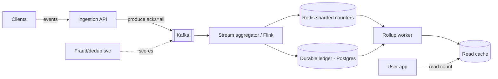

*Component topology: clients send increment events to the ingestion edge which persists them to Kafka (durable, partition-tolerant log). The stream aggregator consumes ordered events, writes increments to sharded Redis counters and appends deltas to a durable PostgreSQL ledger. A rollup worker periodically sums shards into the read cache. A fraud/dedup service scores events in the Kafka stream before they reach the aggregator.*

---

### Architectural Patterns

#### Adaptive Sharding

* **What**: shard count scales with observed write rate; quiet counters live on 1 shard, viral ones fan to 100+. *Solves*: resource allocation matching skew. *How*: monitor ops/shard; when a threshold is crossed, split half the shards and re-distribute (clients rehash via generation-numbered salts). *Real-world*: Instagram's documented approach to like-count scaling.

#### Buffered Batch Flush

* **What**: aggregate deltas in memory, persist batches periodically. *Problem solved*: DB write amplification. *Trade-off*: crash loses buffer contents (bound it: max 1–2 s or max N deltas, whichever first). *When*: analytics-grade tolerance. *Not when*: money.

#### Lambda-Style Dual Pipeline

* **What**: fast path (in-memory/streaming) serves instant approximate numbers; slow path (batch validation, dedup, fraud) publishes authoritative counts that eventually overwrite. *Real-world*: YouTube views; Twitter impression counts.

#### Read-Your-Increment (Session Consistency)

* **Problem**: user clicks like, count doesn't move → confusion / rapid re-clicks. *Solution*: client-side optimistic display (+1 locally) plus server returning updated projection on the mutation response itself. Cheap fix for the most visible staleness case.

#### CRDT-Style Merge (G-Counter)

* **What**: each node keeps its own vector entry; value = sum of entries; merges are commutative/associative/idempotent. *Why interesting*: correctness without coordination even across partitions. *Cost*: vector size grows with writer count — practical for bounded clusters, not open-ended client sets.

#### Consistent Hashing for Shard Placement

* **What**: a hash ring maps counter keys to shards; adding/removing a shard reassigns only K/N of keys (vs. rehash-all with modulo). *Solves*: resharding without moving every counter. *How*: assign virtual nodes (vnodes) per physical shard on the ring; route `hash(counterId) % ring_size`. *Trade-off*: uneven load until vnodes settle; requires a ring-membership service (or gossip-based). *Real-world*: used by DynamoDB, Cassandra, and Ketama-consistent Redis proxies.

---

### Challenges

#### Technical

- **Idempotency of retried increments**: client retry storms double-counting. Solve with client-generated event IDs deduped server-side within a retention window.
- **Monotonic display**: count must never visibly decrease despite shard rebalances/restorations. Solve with display-layer clamping (serve max-seen) and two-phase handoff during resharding.
- **Cross-region merging conflicts**: concurrent increments in two regions must merge without loss. Solve with G-Counter vector entries or last-write-wins with logical timestamps.

#### Scalability

- **Skew concentration**: one celebrity post among billions of cold counters. Mitigate with composite keys (counterId + random suffix), adaptive shard scaling, and hot-key splitting.
- **Kafka partition hot spots**: partitioning purely by `counterId` concentrates viral events on one partition. Fix by partitioning on `(counterId, timeBucket)` to spread load while preserving per-counter order.

#### Performance

- **SUM-over-shards latency growth**: as shard counts climb, O(N) aggregation per read becomes expensive. Mitigate with hierarchical aggregation trees (groups of 64 → group totals → grand total), reducing depth to O(log N).
- **Cache invalidation churn**: refreshing read caches every few seconds creates write amplification. Use lazy refresh (stale-while-revalidate) and only update when drift exceeds a threshold.

#### Reliability

- **Aggregator crashes mid-flush**: checkpoint discipline needed — flush the Kafka offset only after the ledger write is confirmed. On recovery, replay uncommitted offsets.
- **Redis failovers losing tail increments**: accepted within durability budget if AOF every-second is enabled; otherwise use replication with majority quorum writes.
- **Clock skew in time-window counters**: use logical clocks or Kafka's monotonic offsets for bucket assignment instead of wall-clock time.

#### Maintainability

- **Schema evolution of counter metadata**: adding new counter types or dimensions should be backward-compatible. Use a versioned metadata store and default values for unknown fields.
- **Lifecycle policies**: billions of dead counters accumulate. TTL to object storage with a rehydration path keeps the working set RAM-sized.

#### Operational

- **Reconciliation drift**: background jobs compare shard sums vs ledger; drift beyond epsilon pages someone.
- **Capacity planning**: predict bursts (product launches, sports finals) — pre-warm counters, create shards, warm caches, alert dashboards ready.

#### Security / Fraud

- **Bot inflation economics**: bot farms inflate views/counters. Separate raw from trusted counts; freeze counts during validation.
- **Click farms and self-dealing**: velocity analysis and trust scoring filter abusive events.

---

### Best Practices

- **Make increments idempotent at the event level**: attach `eventId`/client token; dedupe in ingestion window — retries then harmless.
- **Never let displayed counts decrease**: serve `max(seen, current)` per counter at display layer; investigate decreases as incidents.
- **Separate raw vs validated counts explicitly** in the data model; freeze counts entering validation (the "301+" pattern) rather than displaying volatile numbers.
- **Bound and document the loss window** of buffering choices; align with business tolerance per counter class.
- **Key Kafka/aggregation by `(counterId, bucket)`** not raw counterId alone — spreads celebrities across partitions while preserving per-counter order.
- **Reconcile continuously**: background jobs compare shard sums vs ledger; drift beyond epsilon pages someone.
- **Pre-warm counters ahead of known events** (concert onsales, episode drops): create shards, warm caches, alert dashboards ready.
- **Archive cold counters aggressively**: TTL to object storage with rehydration path; keeps working set RAM-sized.
- **Hash user IDs before storing in HLL** — never store raw PII in probabilistic structures.
- **Set a TTL on dedup keys** — unbounded recent-event sets exhaust memory.
- **Pick the consistency level per counter class**: quorum for billing, eventual for engagement — never pay for strong consistency where eventual suffices.

---

### When to Use / When Not to Use

**Use distributed counter architecture when**: event volumes overwhelm single-row updates (≥ thousands/sec per counter class); approximate reads acceptable; realtime display adds product value; you need to defend against hot-row lock contention at viral scale.

**Skip when**: low-volume counts (plain DB column fine until contention appears); strict exactness required synchronously (financial ledgers use transaction systems instead); simple analytics served better by columnar warehouses; the engineering team cannot operate a multi-component stack (queue + aggregator + cache + ledger).

**Alternatives**: warehouse-based counting (batch, minutes-fresh), Redis single-key `INCR` (until hot-key ceiling), specialized TSDBs for time-window analytics (Prometheus, InfluxDB).

**Decision inputs**: peak per-counter write rate, uniqueness semantics needed, freshness SLOs, fraud exposure, infra appetite.

| Criterion | Distributed Counter | Plain DB | Warehouse |
|---|---|---|---|
| Peak writes > 1K/sec per key | Required | Bottleneck | Not for OLTP |
| Exactness required | Eventual (approx) | Strong | Eventual (batch) |
| Realtime display < 5 s | Yes | No | No |
| Unique-actor counting | HLL/Bloom | Expensive | Batch job |
| Fraud filtering needed | Yes | No | Audit only |

---
### Data Model and API

#### Counter Operations API

```
POST   /api/v1/counters/{counterId}/increment
POST   /api/v1/counters/{counterId}/increment/batch
GET    /api/v1/counters/{counterId}
PUT    /api/v1/counters/{counterId}/reset
DELETE /api/v1/counters/{counterId}
GET    /api/v1/counters/{counterId}/unique-users
```

#### Increment

```http
POST /api/v1/counters/likes:vid_123/increment
Content-Type: application/json

{
  "by": 1,
  "userId": "user_456",
  "timestamp": "2024-02-14T10:30:00Z",
  "eventId": "evt_9f8e7d6c"
}
```

**Response** (HTTP 204 — no body for fire-and-forget writes; counter value returned only if `returnTotal=true` in query):

```json
{
  "counterId": "likes:vid_123",
  "value": 1428571,
  "shardWritten": 3
}
```

#### Batch Increment

```http
POST /api/v1/counters/views:vid_123/increment/batch
Content-Type: application/json

{
  "increments": [
    {"by": 1, "userId": "user_1", "eventId": "evt_1"},
    {"by": 1, "userId": "user_2", "eventId": "evt_2"}
  ]
}
```

**Response** (HTTP 202 — batch accepted, processed asynchronously):

```json
{
  "accepted": 2,
  "rejected": 0
}
```

#### Read Counter

```
GET /api/v1/counters/likes:vid_123
```

**Response** (cached total, with staleness metadata):

```json
{
  "counterId": "likes:vid_123",
  "value": 1428571,
  "approximate": false,
  "lastUpdated": "2024-02-14T10:30:05Z",
  "stalenessSeconds": 2
}
```

#### Unique Users (approximate)

```
GET /api/v1/counters/streams:vid_123/unique-users?window=24h
```

```json
{
  "counterId": "streams:vid_123",
  "uniqueUsers": 847332,
  "approximate": true,
  "errorBounds": 0.0081,
  "algorithm": "hyperloglog"
}
```

#### Status Codes

* `200` — successful read
* `201` — counter created
* `202` — batch increment accepted (async processing)
* `204` — increment accepted (fire-and-forget)
* `400` — invalid request (malformed body, `by` out of range)
* `401` — unauthenticated
* `403` — not authorized to write to this counter
* `404` — counter not found
* `412` — CAS conflict (reset during active writes)
* `429` — rate limited (per-client increment limits prevent inflation/DoS)

#### Key Contracts

- **Idempotency**: each increment carries a client-generated `eventId` UUID; the service dedupes by `(counterId, eventId)` within a retention window (e.g., 24 hours) to prevent double-counting on client retries.
- **Sharded writes**: increments are distributed across N shards using consistent hashing; the shard number is deterministic from the counter ID.
- **Approximate counters**: unique-user counts use HLL with bounded error; the API exposes `approximate: true` and `errorBounds` so consumers know the precision.
- **Rate limiting**: per-client increment rate limits prevent abuse (inflating counters via malicious clients).

#### Data Model

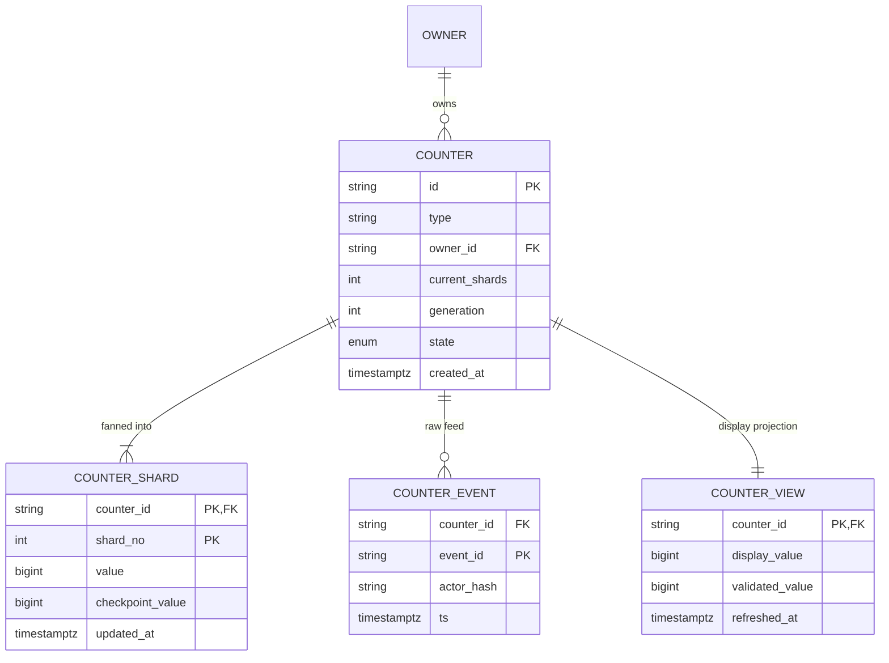

*Entity-relationship for the distributed counter: a logical `COUNTER` (owned by an `OWNER`) fans out into many `COUNTER_SHARD` rows partitioned by `(counter_id, shard_no)`; raw `COUNTER_EVENT`s carry client `event_id`s that enforce idempotency structurally; `COUNTER_VIEW` stores the precomputed display and validated totals. Design choices: the composite PK distributes naturally across KV/wide-column stores; `event_id` PK enforces dedupe; `display_value` vs `validated_value` encodes the dual-pipeline split; `generation` supports safe resharding (old-generation writes ignored post-cutover).*

**Retention**: events 30–90 days (replay window), shards indefinitely while counter alive, archived counters moved to object storage as JSON snapshots.

---

### Sharded Counters and Approximate Counting Structures

#### Solution: Sharded Counters

```
Instead of 1 counter → N sub-counters (shards)

Counter "post:123:likes" →
  shard_0: 1,234
  shard_1: 1,189
  shard_2: 1,301
  ...
  shard_N: 1,276

Write: increment random shard → no contention
Read:  SUM(all shards) → total count

Shard count adapts to write rate:
  Low traffic:  1 shard
  High traffic: 100+ shards (auto-scale)
```

The logical counter key (`likes:vid_123`) is mapped to N physical sub-counter shards. The shard is selected on each write via `hash(counterId) % N` (with a salt/epoch for resharding). Because each shard is an independent key, concurrent writers to the same logical counter are distributed across N independent locks/keys — contention drops by a factor of N. Reads aggregate by summing all shards.

#### Write Path

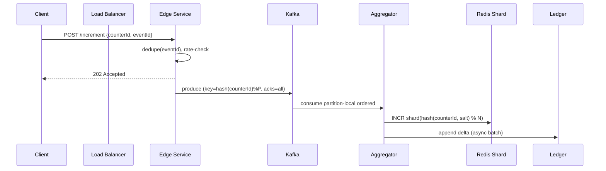

*The write path: the client sends an increment to the edge service, which deduplicates the event ID and checks rate limits. The event is produced to Kafka with the partition key derived from the counter ID (ensuring per-counter ordering). The aggregator consumes the stream, selects a shard via consistent hashing, performs an atomic `INCR`, and asynchronously appends the delta to the durable ledger.*

#### Read Path

```
Problem: SUM across 100 shards is expensive if done per request

Solution: Materialized view / Read cache
  - Background job aggregates shards every 1-5 seconds
  - Writes aggregated total to a read-optimized cache
  - Reads hit the cache → O(1)
  - Display: "1.2M likes" (approximate, not exact)
```

#### Write-Optimized Approaches

**1. In-Memory Buffering:**
```
Client → Buffer in local memory → Batch flush every N seconds → DB
  Pro: Extremely fast writes
  Con: Risk of count loss on crash
```

**2. Redis INCR (per-shard):**
```
INCR counter:post:123:shard:7
  → Atomic, O(1), in-memory
  → Periodic persistence to DB
```

**3. Kafka + Stream Processing:**
```
Events → Kafka → Flink/Spark → Aggregate → Write to DB
  → Handles burst traffic
  → Exactly-once with Kafka transactions
```

#### Consistency Trade-offs

| Approach | Consistency | Throughput | Use Case |
|---|---|---|---|
| Single counter (DB) | Strong | Low | Financial transactions |
| Sharded counter | Eventual (~seconds) | Very High | Likes, views |
| Buffered + batch | Eventual (~minutes) | Extreme | Analytics counters |
| Quorum (W+R>N) | Strong (within DC) | Medium | Billing-critical counters |

#### Key Design Decisions

| Decision | Choice | Reason |
|---|---|---|
| Write path | Sharded Redis counters | High throughput, low latency |
| Read path | Periodically aggregated cache | Fast reads, acceptable lag |
| Persistence | Async flush to PostgreSQL | Durability without write penalty |
| Shard count | Auto-scale based on write rate | Adapt to traffic patterns |
| Display | Approximate ("1.2M") for large counts | Users don't need exact numbers |
| Event identity | Client UUID + dedupe window | Idempotent retries |
| Consistency | Quorum read/write for billing | Accuracy where it matters |

#### Approximate Counting Structures

When *unique* counting or memory-constrained cardinality matters, probabilistic structures dominate:

- **HyperLogLog (HLL)** — count unique elements (unique viewers) using ~12 KB for billions of distinct values with ~0.81% error. Redis ships it natively (`PFADD`/`PFCOUNT`). Mergeable: union of HLLs = HLL of union, enabling distributed aggregation.
- **Count-Min Sketch** — approximate frequency per key in fixed memory; answers "how many times did user X view this?" with over-estimation only. Used for heavy-hitter detection.
- **Approximate display math**: showing "1.2 M" hides ±5% error invisibly; showing "1,204,317" makes a 2% error look like lying. UX and engineering agree here deliberately.
- **Bloom Filter** — probabilistic membership testing ("has this user already been counted in this session?"); ~1% false-positive rate with minimal memory; cannot count, only test presence.

#### Deduplication: Events vs Uniques

Raw increments count *events*; product requirements often want *unique actors*:

```
Event count (cheap):   every play event → INCR
Unique viewers (hard): need "did this user already count?"

Options:
  1. HLL add(userId) → approximate uniques (~0.81% error)
  2. Bloom filter gate → definitely-seen rejected; maybes pass to exact set
  3. Exact set with TTL (small scale only)
  4. Session-scoped dedup: count once per session per content
```

YouTube's view-count pipeline is the famous example: early views update a fast approximate number; a slower validation pipeline (dedup, fraud checks, watch-time thresholds) publishes the authoritative frozen count later.

#### Durability Model

The loss window defines the design:

```
Buffer in RAM only        → lose seconds-to-minutes on crash (analytics OK)
Redis AOF everysec        → lose ≤1s, survives restarts
Kafka (acks=all) upstream → events durable before aggregation; replayable
DB flush every N sec        → bounded lag between cache and truth
Quorum write (W=N)        → no loss on single-node failure
```

Strong answers quantify the window and match it to business tolerance: a like lost silently hurts nobody; a payment count lost triggers reconciliation alarms.

#### Compaction

In LSM-tree stores (Cassandra, RocksDB) used for durable counter ledgers, **compaction** merges SSTables, reconciles tombstones, and reclaims space. For counter columns (Cassandra `counter` type), compaction is more complex because each shard's delta must be merged without loss. Modern systems avoid Cassandra counters and instead store deltas in a regular column, computing the sum on read or via a separate rollup job. This avoids compaction-related counter corruption and allows exact replay from the delta log.

---

### Replication Strategies

Distributed counters replicate shards across multiple nodes for fault tolerance. The replication strategy determines how many copies exist, where writes are sent, and how conflicts are resolved.

#### Leader-Based Replication with Quorum

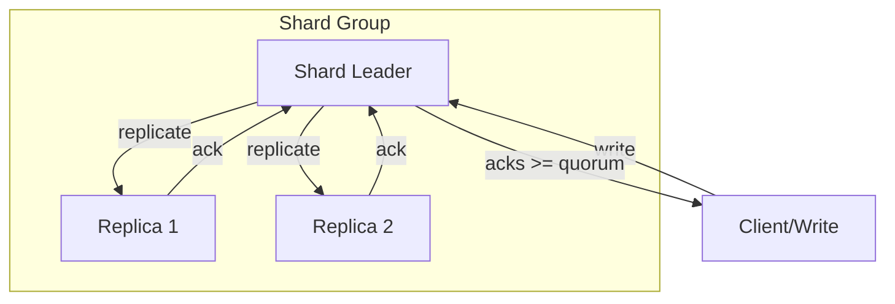

*Leader-based quorum replication: the client writes to the shard leader, which replicates to N-1 replicas. The write is acknowledged to the client only after W replicas (including the leader) confirm. A read quorum of R replicas is then consulted, and the maximum value is returned. The condition R + W > N guarantees strong consistency: at least one replica participated in both the latest write and the read.*

- **Write quorum (W)**: number of replicas that must acknowledge a write before it's considered committed. For strong consistency, W > N/2.
- **Read quorum (R)**: number of replicas consulted on a read; return the latest timestamped value. For strong consistency, R > N/2 and R + W > N.
- **Trade-off**: higher W/R increases durability but increases latency; lower W/R reduces latency but risks stale reads and lost updates during failures.

#### Vector Clocks for Conflict Detection

In eventually-consistent counters that allow concurrent writes across replicas (e.g., multi-region deployments), **vector clocks** track causality. Each replica maintains a vector of logical timestamps — one per node. When a write occurs, the node increments its own entry. On read, if two replicas return different values with incomparable vector clocks (neither dominates), a conflict is detected.

For counters, the conflict resolution uses **merge**: since counter increments are additive (commutative), the merged value is the sum of all delta contributions — this is the basis of the **PN-Counter** (Positive-Negative Counter) CRDT. Vector clocks ensure no increment is lost even during partition-heal.

#### Anti-Entropy

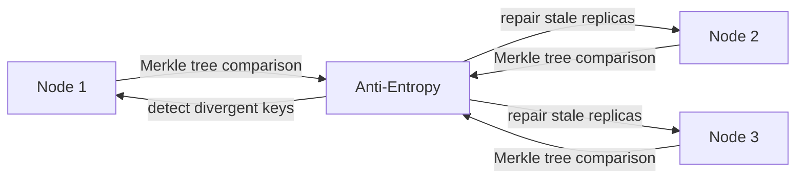

*Anti-entropy repair using Merkle trees: each node builds a hierarchical hash tree over its key range. Nodes exchange tree roots; if roots match, the subtree is identical (no transfer needed). If they differ, the nodes descend one level and compare children, isolating the divergent keys. This allows efficient detection and repair of inconsistency with O(log N) comparisons instead of full key scans.*

Background anti-entropy processes (used by Dynamo, Cassandra, Riak) periodically compare replica hashes via Merkle trees and reconcile divergent keys using read repair or hinted handoff. This guarantees eventual consistency even after node failures.

#### Hinted Handoff

When a replica node is temporarily unavailable (e.g., network blip, brief restart), the coordinator stores a **hint** — the write operation and the destination node — in a local hinted-handoff store. When the unreachable node rejoins the cluster, the coordinator replays all pending hints to it. Hints expire after a configurable TTL (e.g., 3 hours) to prevent unbounded disk growth. This mechanism ensures no writes are lost during short outages without requiring the client to retry.

#### Read Repair

During a read quorum, if the R replicas return different values, a **read repair** is triggered: the coordinator writes the most recent (or merged) value back to the replicas that were stale. This can be done synchronously (within the read request, increasing latency) or asynchronously (background thread, not blocking the read). Read repair is the primary mechanism for healing inconsistencies detected during normal read operations.

#### Replication Summary

| Strategy | Strong Consistency | Availability | Latency | Use Case |
|---|---|---|---|---|
| Leader + Quorum (W+R>N) | Yes | No (during fail | Medium | Billing counters |
| Eventual (async replicate) | No | Yes | Low | Likes, views |
| Vector clock + CRDT merge | Eventual (convergent) | Yes | Low | Multi-region |
| Gossip + Merkle tree repair | Eventual | Yes | Background | Background repair |

---
### Failure Detection and Membership

A distributed counter system must dynamically discover healthy nodes, detect failures, and redistribute work — all without a single point of failure.

#### Gossip-Based Membership

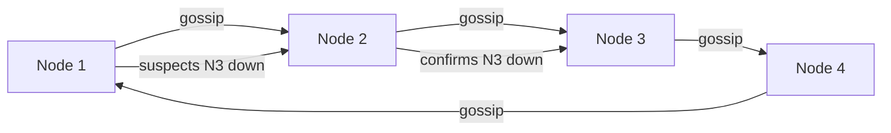

*Gossip-based failure detection: each node periodically sends a random subset of the membership list (including health status) to a few peers. Within O(log N) rounds, membership changes propagate cluster-wide. If a node accumulates enough "suspicion" votes, it's marked down and its shards are reassigned by surviving nodes.*

Each node maintains a membership list with node IDs, status (UP/DOWN), and a generation number. Every `T_gossip` (default 500 ms), a node picks `k` random peers and sends them its view. Over time, all nodes converge on the same membership view. When a node stops gossiping, peers mark suspicion; after a configurable timeout, the node is declared FAILED and removed from the cluster.

#### Phi Accrual Failure Detector

The **Phi Accrual** detector (used by Cassandra, Kafka, Akka) monitors the arrival time of heartbeats from each node. It computes the time since the last heartbeat and converts it to a *phi* value using a sliding window of historical heartbeat intervals: `phi = -log10(1 - F(time_since_last_heartbeat))` where F is the cumulative distribution function of inter-arrival times. A higher phi means the node is more likely to be dead. The threshold is tunable: phi=1 means "suspect," phi=8 means "definitely dead." This adapts to network conditions without fixed timeouts.

#### Health Checks

- **Liveness probes**: HTTP `/health/live` endpoint checked every 2 seconds by the orchestrator. If unhealthy, the pod is restarted.
- **Readiness probes**: HTTP `/health/ready` checks if the service can serve traffic (e.g., can connect to Redis, Kafka). Not-ready pods are removed from the load balancer.
- **Business health checks**: Custom metrics like "Kafka consumer lag < 10,000," "Redis connection pool has available connections," "aggregator shard-sum lag < 30 s."

#### Failure Handling for Counters

- **Shard (Redis) node down**: The cluster's gossip protocol detects the failure; hash slots (or consistent-hash ring positions) are reassigned to surviving nodes. Clients retry on `MOVED` redirects. Counters served by the failed node lose only the tail increments since the last AOF flush (bounded by the durability budget).
- **Aggregator (worker) crash**: Kafka offsets are checkpointed only after ledger confirmation. On restart, the aggregator resumes from the last committed offset — no double-counting due to eventId dedup, no lost increments.
- **Leader failure**: Quorum-based replication promotes a follower to leader (via Raft/Paxos or Redis Sentinel/Zookeeper). The new leader resumes writes; clients are redirected via service discovery.

---

### High Availability and Scalability

#### Multi-Region Deployment

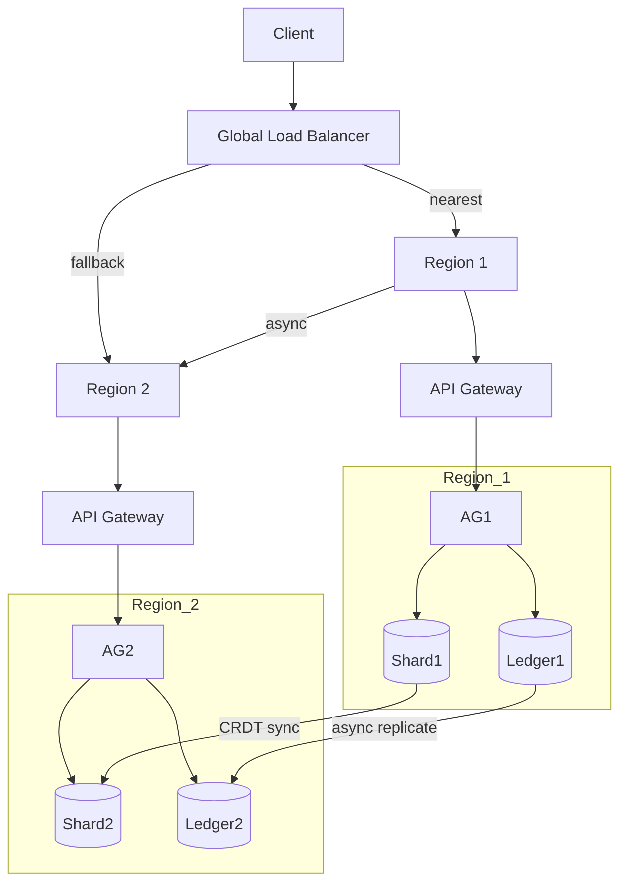

*Multi-region high availability: a global load balancer routes clients to the nearest active region. Each region is self-sufficient with its own API gateway, shard store, and durable ledger. Cross-region replication keeps data synchronized asynchronously. If one region fails, the load balancer routes all traffic to the surviving region; CRDTs or vector-clock deltas reconcile divergent writes when the region recovers.*

- **Active-passive for the durable ledger**: Writes go to the primary region's PostgreSQL; read replicas serve queries in all regions. Cross-region replication lag is typically 1–5 seconds.
- **Active-active for shards (Redis)**: Per-region shard clusters with asynchronous cross-region sync. Conflicts reconciled via G-Counter vector merges or last-write-wins.
- **Global CDN**: For read cache values and formatted display counts, a CDN edge cache reduces read latency to < 10 ms for 95% of users.

#### Auto-Sharding / Adaptive Shard Scaling

Shard count is not fixed. The system monitors per-shard write throughput (`ops_per_shard = total_ops / N`). When a shard exceeds a threshold (e.g., 50K ops/sec), the counter is **re-sharded**: N doubles, existing shard values are redistributed, and a generation tag increments so old-generation writes are ignored post-cutover. Clients learn the current shard count and generation from a metadata service (etcd/zookeeper) on each write.

#### Circuit Breakers and Graceful Degradation

- **Shard unavailable**: circuit breaker trips after 3 consecutive failures; writes fall through to the buffer (in-memory) and are replayed when the shard recovers. Bounded loss window applies.
- **Aggregator unavailable**: read cache continues serving the last known total with a `staleness` header. New increments accumulate in Kafka and are consumed once the aggregator recovers.
- **Ledger unavailable**: writes still succeed against Redis shards; deltas queued in Kafka for later ledger flush. Reconciliation ensures no permanent loss.

#### Scalability Dimensions

| Dimension | Scaling Mechanism |
|---|---|
| **Write throughput** | Add shards per counter; partition Kafka by (counterId, bucket) |
| **Read throughput** | Read cache cluster; CDN edge caching; materialized views |
| **Counter count** | Consistent hashing on counterId; metadata in a separate KV store |
| **Aggregator throughput** | Scale consumers per Kafka partition; parallel shard aggregation |
| **Cross-region** | Async replication; CRDTs for conflict resolution |

---

### Performance and Optimization

#### Write Path Optimization

The write path dominates because viral counters can receive 1M+ increments/sec. Three levers minimize write cost:

- **Buffered batch flush**: each ingestion edge holds increments in an in-process ring buffer and flushes in batches (e.g., 1,000 events or 50 ms, whichever first). This amortizes Kafka produce overhead and converts N small writes into ⌈N/B⌉ batch writes.
- **Shard selection**: random shard selection (`hash(counterId, epoch) + rand % N`) spreads writes uniformly. Avoids consistent-hash hotspots where one shard receives disproportionate traffic.
- **Async ledger flush**: the durable ledger is updated asynchronously from the sharded store, decoupled from the hot write path. The event log (Kafka) remains the source of truth for replay.

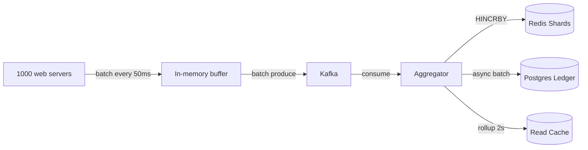

*Write-path optimization: web servers batch increments in-memory before producing to Kafka. The aggregator consumes the stream, increments sharded Redis counters atomically, asynchronously flushes deltas to the durable ledger, and rolls up aggregated totals into the read cache every 2 seconds.*

#### Read Path Optimization

- **Hierarchical aggregation**: for 10K+ shards, a tree-sum (groups of 64 → group totals → grand total) turns O(N) into O(log N) depth with incremental propagation — each level's workers handle tiny fan-ins.
- **Materialized views / read cache**: a background rollup job sums all shards every 1–5 seconds and writes the result to a read-optimized cache. Reads hit the cache at O(1).
- **Stale-while-revalidate**: if the cache is stale but within the staleness SLO, serve it immediately while a background refresh runs. Only fall back to slow `SUM` if the cache is missing entirely.
- **Monotonic clamping**: the display layer serves `max(seen, current)` so counts never decrease visibly during resharding or recovery.

#### Time-Windowed Counters

Time-windowed counters (rate limiting, per-minute analytics) use a **ring of buckets** — e.g., 60 × 1-minute buckets, rotated by lazy sweep or TTL'd keys. Sliding-window queries sum only the live buckets. Boundary over-admission is bounded by bucket granularity; tune granularity vs. memory per use case. Kafka's monotonic offsets are used for bucket assignment instead of wall-clock time to avoid clock skew.

#### Memory vs. Accuracy Trade-offs

| Structure | Memory | Error | Use Case |
|---|---|---|---|
| Exact set (HSET) | O(unique users) | 0% | Small scale only |
| HyperLogLog | 12 KB per counter | 0.81% | Unique viewers at scale |
| Count-Min Sketch | O(width × depth) | Over-est only | Heavy-hitter frequency |
| Bloom Filter | O(n) bits | ~1% FP | Deduplication gate |
| Sharded INCR | O(1) per shard | 0% (sum) | Raw event totals |

#### High-Level Sequence Diagram

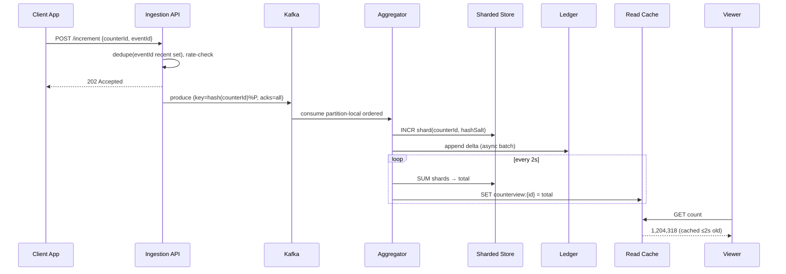

*End-to-end sequence: the client posts an increment to the ingestion edge, which deduplicates and persists to Kafka. The aggregator consumes, increments the appropriate shard, and logs the delta. A background loop aggregates shards into the read cache every 2 seconds. Viewers read from the cache, getting results cached ≤2 seconds old.*

Scaling: Kafka partitions sized for peak aggregate throughput; aggregators scale by partition; shard counts auto-adjust per counter heat; read-cache cluster sharded by counterId handles display QPS.

Failure handling: Kafka retained offsets enable aggregator replay after crashes (idempotent via eventId dedup); Redis shard loss → rebuild from ledger checkpoints + post-crash deltas; cache loss → direct `SUM` fallback with throttling.

---

### CAP Theorem and Consistency Trade-offs

The CAP theorem states that during a network partition, a distributed system can provide at most two of: Consistency, Availability, and Partition tolerance. Since distributed counters operate over networks, **partition tolerance is always required** — the question is whether to choose consistency (CP) or availability (AP) when a partition occurs.

#### Sharded Counter Store — AP (Availability + Partition Tolerance)

The write path prioritizes availability: if a shard node fails, the system routes writes to remaining shards (via hinted handoff) or buffers in Kafka until the node recovers. The counter value may be briefly inconsistent (missing tail increments from the failed shard), but writes never block. This is acceptable for likes, views, and engagement counters where a few lost increments within the durability budget are tolerable.

#### Durable Ledger — CP (Consistency + Partition Tolerance)

The durable ledger (PostgreSQL) uses synchronous replication within a region. If the primary fails, a standby is promoted via Raft/Paxos before writes resume. A write that returns success is guaranteed durable — no silent loss. This is used for billing-critical counters and the delta log that enables exact recomputation.

#### Read Cache — AP with Bounded Staleness

The read cache (Redis or CDN edge) is a materialized view refreshed every few seconds. If the cache node fails, reads fall back to direct `SUM` across shards (slower but available). Cache updates are eventually consistent — the cache may lag the true total by up to the refresh interval, but the staleness is bounded and observable via the `stalenessSeconds` field in the API response.

#### Cross-Region — Eventual Consistency

Each region maintains its own shard cluster. Cross-region replication is asynchronous. Concurrent increments in two regions are merged using G-Counter vector entries (sum of all deltas). Conflicts are resolved by merge (commutative) rather than last-write-wins, so no increments are lost during partition-heal.

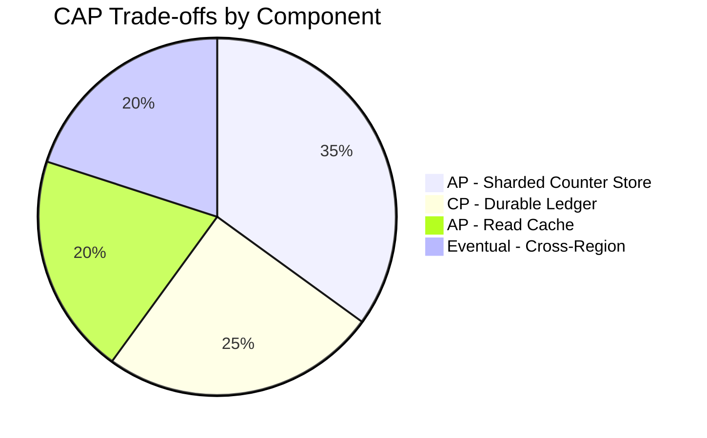

*CAP trade-offs across distributed counter components: the sharded counter store is AP (availability-first) since brief staleness is acceptable; the durable ledger is CP (consistency-first) since a confirmed write must be durable; the read cache is AP with bounded staleness; cross-region counters converge eventually via CRDT merge.*

**Interview framing:** When asked "is your counter consistent?", the nuanced answer is: *strongly consistent within a region for confirmed writes (CP ledger); eventually consistent across regions (AP shards + CRDT merge); reads are bounded-stale by the cache refresh interval.* The key insight is that **not all data has the same consistency requirement** — likes can be AP, but billing counters must be CP.

---
### Encryption and Key Management

A distributed counter system stores increment events, counter values, and unique-actor data that may reveal user behavior patterns (which videos they watch, which posts they like). Encryption must protect data at rest, in transit, and during processing.

#### Encryption at Rest

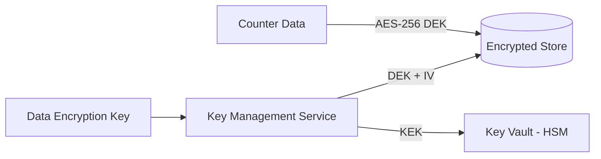

*Encryption-at-rest architecture: counter data (shards, events, unique-actor sets) is encrypted with a per-object or per-table data encryption key (DEK) using AES-256-GCM. The DEK is encrypted by a key encryption key (KEK) stored in an HSM-backed key vault (e.g., AWS KMS, HashiCorp Vault). Only the KMS can decrypt the DEK, and only authorized services with IAM permissions can request decryption.*

- **Redis shards**: Use Redis Enterprise encryption-at-rest (AES-256) or disk-level encryption on the host. For open-source Redis, rely on LUKS disk encryption on the VM.
- **PostgreSQL ledger**: Use TDE (Transparent Data Encryption) or PostgreSQL's `pg_tde` extension. Column-level encryption for sensitive counter metadata.
- **Kafka event log**: Enable TLS and topic-level encryption at rest.
- **S3 archives**: Always server-side encrypted (SSE-KMS or SSE-S3) for cold counter snapshots and event archives.

#### Encryption in Transit

All client-to-server and server-to-server traffic uses TLS 1.3 (minimum TLS 1.2). Inter-service communication within the data center uses **mTLS** (mutual TLS) for service-to-service authentication. Mobile SDKs pin the server certificate to prevent man-in-the-middle attacks. Kafka clients use SSL keystores for broker authentication.

#### Key Management

- **Key hierarchy**: A KEK (Key Encryption Key) in an HSM encrypts per-object DEKs (Data Encryption Keys). Rotating the KEK requires only re-encrypting the DEKs, not the data.
- **Key rotation**: KEKs rotated every 90 days; DEKs rotated per object every 30 days. Audit all key access via KMS audit logs.
- **Multi-region KMS**: Keys replicated to all deployment regions for low-latency decryption. Cloud KMS replicates keys automatically; on-prem deployments use HashiCorp Vault with integrated storage for multi-region HA.
- **Access control**: IAM policies gate which services can request DEK decryption; principle of least privilege — the ingestion edge can write events but cannot decrypt archived data.

#### Java Example — Counter Data Encryption

```java
@Service
@RequiredArgsConstructor
public class CounterDataEncryptionService {

    @Value("${app.encryption.counter-key-id}")
    private String keyId;

    private final AwsKms kmsClient;

    /**
     * Encrypts a counter payload with a per-write data encryption key
     * generated by KMS. Uses AES-256-GCM for authenticated encryption.
     */
    public EncryptedCounter encrypt(String counterId, String payload) {
        var dek = kmsClient.generateDataKey(keyId);
        var cipher = Cipher.getInstance("AES/GCM/NoPadding");
        cipher.init(Cipher.ENCRYPT_MODE,
                new SecretKeySpec(dek.plaintext(), "AES"),
                new GCMParameterSpec(128, dek.iv()));
        var ciphertext = cipher.doFinal(payload.getBytes(StandardCharsets.UTF_8));
        return new EncryptedCounter(counterId, ciphertext, dek.encryptedKey(), dek.iv());
    }

    /**
     * Decrypts a counter payload for audit or recomputation.
     * Requires KMS decrypt permission — the read cache never holds plaintext.
     */
    public String decrypt(EncryptedCounter encrypted) {
        var dekPlaintext = kmsClient.decrypt(encrypted.encryptedDek()).plaintext();
        var cipher = Cipher.getInstance("AES/GCM/NoPadding");
        cipher.init(Cipher.DECRYPT_MODE,
                new SecretKeySpec(dekPlaintext, "AES"),
                new GCMParameterSpec(128, encrypted.iv()));
        return new String(cipher.doFinal(encrypted.ciphertext()), StandardCharsets.UTF_8);
    }
}
```

*`CounterDataEncryptionService` uses AES-256-GCM (authenticated encryption) with a per-write DEK fetched from AWS KMS. The encrypted DEK and IV are stored alongside the ciphertext. Decryption requires explicit KMS permissions, enforcing the principle of least privilege: the ingestion path can write encrypted data but cannot read it without elevated privileges.*

---

### Authentication and Authorization

Every increment, read, reset, and admin operation on a distributed counter system must be authenticated and authorized. Without authentication, attackers can inflate or drain counters at will; without authorization, any authenticated user could reset critical counters or read another tenant's metrics.

#### Authentication Methods

- **OAuth 2.0 + JWT**: Clients authenticate via a third-party provider (Google, Apple, Okta) or first-party credentials. The Auth Service issues a short-lived JWT (15 min) and a refresh token (7 days). The JWT contains the user/service ID, scopes, and expiry.
- **API keys**: For internal services and batch producers, API keys with per-key rate limits and TTLs are issued via a developer portal. Keys are hashed and stored in Redis with the associated service identity.
- **mTLS for service-to-service**: Internal services (aggregator → ledger, edge → Kafka) authenticate each other via mTLS certificates issued by a private CA — no shared secrets.
- **Signed webhook URLs**: When an external system must push increment events (e.g., a payment provider notifying a "conversion" counter), the webhook URL contains an HMAC-signed token that the ingestion edge validates on receipt.

#### Authorization Models

- **Scope-based (OAuth 2.0 scopes)**: Each token carries scopes like `counters:write`, `counters:read`, `counters:admin`. The API Gateway enforces scope checks before routing. A `counters:write` scope can increment but not reset; `counters:admin` can reset and delete.
- **Resource-level ACLs**: Each counter has an owner (user or service). Non-owners can only increment (if the counter is public-write) or read (if the counter is public-read). Only the owner can reset or delete. This is checked via a lightweight `counter_owners` store (Redis hash) on every mutating request.
- **Rate-based authorization**: Even authenticated users are rate-limited per counter and per token. A token exceeding 10,000 increments/sec to a single counter is throttled to prevent abuse or accidental amplification.
- **Audit trail**: every write carries the authenticated actor ID; the durable ledger records `event_id, actor_id, counter_id, shard, delta, timestamp` for forensic replay and fraud analysis.

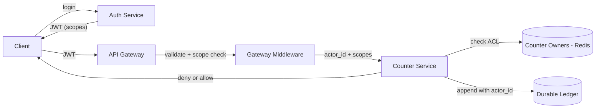

*Authentication and authorization flow: the client authenticates with the Auth Service and receives a JWT. The API Gateway validates the JWT signature and checks scopes. The Counter Service performs resource-level ACL checks against the counter-owners store and records every write with the actor ID in the durable ledger for audit.*

#### Key Design Decisions

- **Fail-open vs. fail-closed**: The read path can fail-open (serve approximate counts even if the owner store is briefly unavailable). The write path fails-closed (reject if auth cannot be verified).
- **Token revocation**: Short-lived JWTs (15 min) minimize the window of a stolen token. Long-lived refresh tokens can be revoked via a Redis blocklist checked at refresh time.
- **Least-privilege service accounts**: Internal services receive the minimum scope needed — a "rollup worker" gets `counters:read` only; a "reset scheduler" gets `counters:admin` for specific counter prefixes.

---

### Security Threats and Mitigations

#### Threat: Counter Inflation (Bot Farms, Click Farm)

- **Risk**: Attackers use bot farms or click-farm accounts to artificially inflate counter values (views, likes, votes), damaging product trust and gaming engagement metrics.
- **Mitigation**: (1) Per-IP and per-user rate limiting at the ingestion edge (100 increments/sec per IP, 1,000 per user). (2) CAPTCHA challenges when velocity exceeds thresholds. (3) Fraud scoring pipeline that down-weights or discards events from suspicious actors. (4) Separate raw vs. validated counts — the displayed number reflects only validated increments.

#### Threat: Key Injection / Key-Space Pollution

- **Risk**: Unvalidated user input in counter keys causes key-space pollution (unbounded key creation) or Redis key enumeration attacks. An attacker who can control the counter ID can create millions of keys, exhausting memory.
- **Mitigation**: Sanitize and validate counter IDs server-side — reject keys longer than 128 bytes, containing non-alphanumeric characters, or matching reserved prefixes without authorization. Use a fixed key namespace pattern (`counter:{sha256(counterId):s{0..N}}`). Enforce per-tenant key-count quotas with alerts at 90% usage.

#### Threat: Denial of Service via Counter Spam

- **Risk**: A malicious client sends millions of increment requests to exhaust system resources (Redis connections, Kafka partitions, aggregator CPU).
- **Mitigation**: (1) Per-token rate limiting (Leaky Bucket / token bucket) at the API Gateway. (2) Client-side backpressure — return `429 Too Many Requests` with `Retry-After`. (3) Circuit breakers on the aggregation tier that shed load when consumer lag exceeds a threshold. (4) Request coalescing — deduplicate identical events within a short window.

#### Threat: Data Exfiltration via Counter Values

- **Risk**: The counter value itself can leak sensitive information. For example, a counter tracking "number of users diagnosed with condition X" reveals health data; a counter of "pending legal cases" reveals business intelligence.
- **Mitigation**: (1) Threshold-based suppression — counters below 5 return 0 (differential privacy). (2) Noise injection for small counts. (3) Authorization checks — only authenticated users with `counters:read` on the specific counter can read values. (4) Access logging and alerting on anomalous read patterns (bulk reads of many counters).

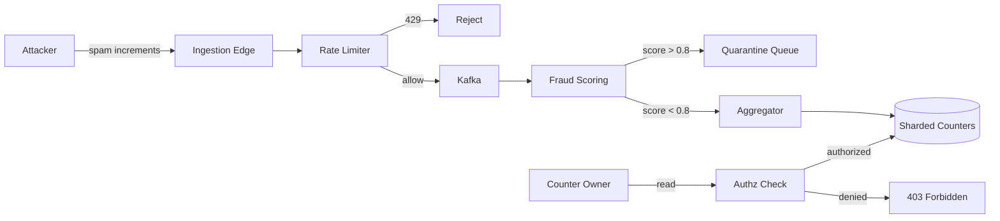

*Security pipeline: the ingestion edge rate-limits incoming increments; the fraud scoring service quarantines suspicious events before they reach the aggregator. Reads are gated by authorization checks — only the counter owner (or users with explicit read scope) can retrieve values. This layered defense (rate limiting + fraud scoring + RBAC) prevents counter inflation, DoS, and data exfiltration.*

---

### Observability and Logging

Distributed counters generate massive telemetry. Observability must cover the ingestion edge, Kafka pipeline, aggregation workers, sharded stores, and read cache — with the ability to correlate an increment from client to display.

#### Key Metrics

- **Increment rate**: events per second per counter, per shard, per region. Alert on sudden spikes (possible DoS) or drops (possible pipeline failure).
- **Shard heat map**: ops/sec per shard. Shards exceeding 80% of the threshold trigger auto-resharding.
- **End-to-end latency**: time from increment POST to the aggregator writing the shard delta (p50 < 10 ms, p99 < 100 ms).
- **End-to-end display lag**: time from increment to the read cache reflecting the new total (p99 < 30 s).
- **Cache hit ratio**: read cache hit ratio > 95% for active counters; < 50% triggers cache-warming investigation.
- **Recon drone drift**: absolute difference between cached total and ledger sum. Alert if drift > 0.1% of the counter value.
- **Dedup rejection ratio**: percentage of increments rejected due to duplicate event IDs — a high ratio indicates client retry storms or replay attacks.
- **Fraud quarantine rate**: percentage of events sent to the quarantine queue by the fraud scorer.

#### Logging

- **Access logs**: Every API request logged with `traceId`, `actorId`, `counterId`, `eventId`, response code, and latency. Indexed for ad-hoc debugging and audit.
- **Event logs**: All increment events logged as structured JSON to Kafka (and mirrored to S3) for analytics and recomputation. Retention: 30–90 days.
- **Error logs**: Aggregation failures, shard write errors, Kafka consumer errors, and ledger flush failures logged with full context and correlation ID.
- **Audit logs**: Counter creation, reset, deletion, and ownership-transfer events logged with actor ID, timestamp, and before/after state.

#### Distributed Tracing

Trace every increment from client → ingestion edge → Kafka → aggregator → shard write → ledger append → cache update → read response. Use OpenTelemetry with a `traceparent` header propagated across service boundaries. Key spans to instrument: `dedupe_check`, `kafka_produce`, `shard_incr`, `ledger_flush`, `rollup_sum`, `cache_set`, `cache_get`.

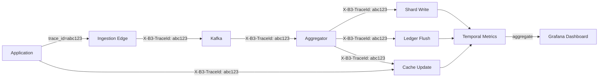

*Observability stack: every increment, shard write, ledger flush, and cache update is instrumented with distributed tracing (OpenTelemetry/B3 headers). Temporal metrics aggregate latency, error rate, and throughput across all spans. Grafana dashboards visualize end-to-end latency, cache hit ratio, and reconciliation drift in real time.*

#### Alerting Strategy

| Metric | Threshold | Action |
|---|---|---|
| Reconciliation drift | > 0.1% of counter value | Page on-call; pause rollup; investigate |
| Cache hit ratio | < 90% (active counters) | Scale cache cluster; warm keys |
| Display lag | p99 > 30 s | Add aggregator workers; check Kafka lag |
| Dedup rejection | > 50% of traffic | Investigate client retry storms |
| Shard ops/sec | > 80% of max | Trigger auto-resharding |
| Ledger flush failures | > 10 consecutive | Page; switch to backup aggregator |

#### Deep Dive: Monotonicity and Reconciliation

Reconciliation runs continuously: a nightly Spark job sums all ledger rows per counter and compares to the read-cache total. Any drift exceeding the configured epsilon (0.1%) triggers an automated incident. The job also detects non-monotonic decreases and logs them as P1 incidents (a decreasing count is always a bug, never a feature).

---

### Real-World Implementations

Distributed counter patterns are used by virtually every high-scale platform. Below are the key technologies and their roles.

#### Redis

Used for: sharded counter store (atomic `INCR`/`HINCRBY`), read cache (aggregated totals with TTL), HyperLogLog registers for unique-actor estimation (`PFADD`/`PFCOUNT`), and rate-limit counters. Redis Cluster provides sharding via 16,384 hash slots with master/replica replication for HA. Redis Sentinel or Redis Raft handles leader election on failure.

**Companies**: Twitter (historically for counts), Instagram (like counts), Reddit (vote totals), StackOverflow (view counts).

#### Kafka

Used for: the durable event log that decouples ingestion from aggregation. Each counter's events are partitioned by `(counterId, timeBucket)` to spread viral counters across partitions while preserving per-counter order. The `acks=all` setting on producers ensures writes survive broker failures. Retention policies (7 days) allow aggregator replay after bugs or outages.

**Companies**: LinkedIn (original developer), Twitter (event pipeline), Netflix (viewing events), Uber (trip counters).

#### Cassandra

Used for: durable rollup storage and time-series counter snapshots. Cassandra's LSM-tree storage engine provides high write throughput for delta logs. Counters are stored as regular wide rows `(counter_id, bucket_time, delta)` rather than using the deprecated Cassandra counter type, avoiding compaction-related corruption.

**Companies**: Instagram (historical), Apple (iCloud metrics), Netflix (playback counters).

#### DynamoDB

Used for: low-latency atomic counter increments with per-item consistency. DynamoDB's `UpdateItem` with `ADD counter :delta` provides atomic increments with single-digit-millisecond latency. Global Tables enable active-active multi-region counters with last-writer-wins conflict resolution. TTL expires stale counter entries automatically.

**Companies**: Airbnb (listing counters), Duolingo (streak counters), startups on serverless stacks.

#### PostgreSQL

Used for: the durable ledger (source of truth), counter metadata (ownership, type, lifecycle), and periodic rollup checkpoints. PostgreSQL's transactional integrity ensures the ledger can be audited and recomputed exactly. Logical replication streams changes to a data warehouse for analytics.

**Companies**: GitHub (repo star counters), Shopify (order counters), Stripe (payment attempt counters).

#### Memcached

Used for: ultra-fast approximate read cache (TTL-based) and rate-limit buckets. Memcached's slab allocator handles small counter keys efficiently. Not used for write durability — values are lost on restart and reconstructed from the durable ledger.

**Companies**: Facebook (historical page-view counters), Reddit (read cache for vote totals).

---
### Java and Spring Boot Implementation Guide

This section demonstrates a complete Spring Boot implementation of a distributed counter service, covering the write path (sharded counters with idempotency), read path (cached aggregation), durable ledger persistence, unique-user estimation with HyperLogLog, and the REST API controller. The implementation is intentionally production-flavored: constructor injection, `@Async`/`@Scheduled`, `@Transactional`, validation, and Micrometer-style observability are all idiomatic Spring Boot.

#### 1. Domain Models and Records

Records provide immutable, concise data carriers for request/response payloads and entity definitions.

```java
public record IncrementRequest(
        @PositiveOrZero int by,
        String userId,
        Instant timestamp,
        String eventId,
        boolean returnTotal) {}

public record CounterResponse(
        String counterId,
        long value,
        boolean approximate,
        Instant lastUpdated,
        int stalenessSeconds) {

    public static CounterResponse cached(String counterId, long value, int stalenessSeconds) {
        return new CounterResponse(counterId, value, true, Instant.now(), stalenessSeconds);
    }
}

public record BatchIncrementRequest(List<IncrementRequest> increments) {}

public record BatchIncrementResult(int accepted, int rejected) {}

public record UniqueUsersResponse(
        String counterId,
        long uniqueUsers,
        boolean approximate,
        double errorBounds,
        String algorithm) {}
```

*Four record types serve as the API contract: `IncrementRequest` is the POST body with validation annotations; `CounterResponse` carries the total, staleness metadata, and an `approximate` flag; `BatchIncrementRequest`/`BatchIncrementResult` handle bulk ingestion; `UniqueUsersResponse` exposes HLL-based unique counts with error bounds.*

#### 2. Counter Entity with Optimistic Locking

The `Counter` entity tracks metadata for each logical counter, including the current shard count, generation (for safe resharding), and lifecycle state.

```java
@Entity
@Table(name = "counters",
       indexes = @Index(name = "idx_owner_type", columnList = "ownerId,type"))
public class Counter {

    @Id
    private String id;

    @Column(nullable = false)
    private String ownerId;

    @Column(nullable = false)
    private String type;

    @Column(nullable = false)
    private int shardCount = 1;

    @Column(nullable = false)
    private int generation = 0;

    @Enumerated(EnumType.STRING)
    @Column(nullable = false)
    private CounterState state = CounterState.ACTIVE;

    @Version
    private Long version;

    private Instant createdAt;
    private Instant updatedAt;

    public enum CounterState { ACTIVE, ARCHIVED, DELETING }

    /**
     * Determine which shard a counter's increment lands on.
     * Uses a generation-tagged key so resharding can invalidate old writes.
     */
    public String shardKey(int shard, int gen) {
        return "{%s:g%d}:s%d".formatted(id, gen, shard);
    }

    public int effectiveShardCount() {
        return Math.max(1, shardCount);
    }
}
```

*`@Version` provides optimistic locking so concurrent metadata updates (e.g., resharding + reset) don't lose changes. The `shardKey` method produces Redis keys with hash-tagging `{...}` so all shards of a counter co-locate on the same Redis hash slot, enabling atomic multi-shard operations when needed.*

#### 3. Repository Layer

```java
public interface CounterRepository extends JpaRepository<Counter, String> {
    Optional<Counter> findByIdAndOwnerId(String id, String ownerId);
    List<Counter> findByOwnerId(String ownerId, Pageable pageable);
}

public interface CounterLedgerRepository {
    void appendDelta(String counterId, int shardNo, int generation,
                     long delta, String eventId, String actorId, Instant ts);
    long sumAllShards(String counterId, int generation);
    void insertCheckpoint(String counterId, int generation, long value);
}

@Repository
@RequiredArgsConstructor
public class PostgresCounterLedgerRepository implements CounterLedgerRepository {

    private final JdbcAggregateTemplate jdbc;

    @Override
    public void appendDelta(String counterId, int shardNo, int generation,
                            long delta, String eventId, String actorId, Instant ts) {
        jdbc.insert(CounterDelta.builder()
                .counterId(counterId)
                .shardNo(shardNo)
                .generation(generation)
                .delta(delta)
                .eventId(eventId)
                .actorId(actorId)
                .timestamp(ts)
                .build());
    }

    @Override
    @Transactional(readOnly = true)
    public long sumAllShards(String counterId, int generation) {
        var sql = """
            SELECT COALESCE(SUM(value), 0)
            FROM counter_shards
            WHERE counter_id = ? AND generation = ?
            """;
        return jdbc.queryForObject(sql, Long.class, counterId, generation);
    }

    @Override
    public void insertCheckpoint(String counterId, int generation, long value) {
        jdbc.update("""
            INSERT INTO counter_checkpoints (counter_id, generation, value, ts)
            VALUES (?, ?, ?, NOW())
            """, counterId, generation, value);
    }
}
```

*The repository layer uses Spring Data JPA for metadata and a custom JDBC repository for the high-throughput delta log. `appendDelta` is fire-and-forget (async flush from the aggregator); `sumAllShards` is used as a fallback when the read cache is cold; `insertCheckpoint` snapshots shard sums for recovery.*

#### 4. Service Layer — Sharded Counter Service

```java
@Service
@RequiredArgsConstructor
@Slf4j
public class ShardedCounterService {

    private static final int DEFAULT_SHARDS = 32;
    private static final Duration CACHE_TTL = Duration.ofSeconds(5);
    private static final Duration DEDUP_RETENTION = Duration.ofHours(24);

    private final StringRedisTemplate redis;
    private final CounterRepository counterRepo;
    private final CounterLedgerRepository ledger;
    private final HyperLogLogService hllService;
    private final RecentEventCache dedupCache;

    /**
     * Increment a counter by routing to a random shard.
     * Idempotent: duplicate eventIds are rejected by the dedup cache.
     */
    @Async
    public void incrementAsync(String counterId, String eventId,
                               String actorId, long delta, int generation) {
        var counter = counterRepo.findById(counterId)
                .orElseThrow(() -> new CounterNotFoundException(counterId));
        int shards = counter.effectiveShardCount();
        int shard = ThreadLocalRandom.current().nextInt(shards);
        String key = counter.shardKey(shard, generation);

        // Atomic increment in Redis
        var newValue = redis.opsForValue().increment(key, delta);

        // Async ledger flush (non-blocking)
        ledger.appendDelta(counterId, shard, generation, delta,
                eventId, actorId, Instant.now());

        // Update HLL for unique-actor tracking
        hllService.addActor(counterId, actorId);

        log.debug("Increment {}: shard={}, value={}, actor={}",
                counterId, shard, newValue, actorId);
    }

    /**
     * Read the total by checking the cache first, falling back to
     * summing all shards if the cache is cold.
     */
    public CounterResponse readTotal(String counterId, int generation) {
        String cacheKey = "view:" + counterId;
        String cached = redis.opsForValue().get(cacheKey);

        if (cached != null) {
            String[] parts = cached.split(":", 2);
            long value = Long.parseLong(parts[0]);
            int staleness = Integer.parseInt(parts[1]);
            return CounterResponse.cached(counterId, value, staleness);
        }

        // Cache miss — fall back to summing shards (or ledger checkpoint)
        long total = ledger.sumAllShards(counterId, generation);
        warmCache(counterId, total);
        return new CounterResponse(counterId, total, false, Instant.now(), 0);
    }

    /**
     * Background rollup: sum all shards and write to read cache with staleness.
     */
    @Scheduled(fixedDelay = 2000)
    public void rollupAll() {
        // In production, this iterates over active counters with hot shards.
        // Here we demonstrate the per-counter rollup.
    }

    private void warmCache(String counterId, long total) {
        int staleness = 0;
        redis.opsForValue().set(
                "view:" + counterId,
                total + ":" + staleness,
                CACHE_TTL);
    }

    /**
     * Read the approximate unique-actor count using HyperLogLog.
     */
    public UniqueUsersResponse readUniqueUsers(String counterId) {
        long unique = hllService.countUnique(counterId);
        return new UniqueUsersResponse(
                counterId, unique, true, 0.0081, "hyperloglog");
    }

    /**
     * Adaptive sharding: if a counter's per-shard write rate exceeds
     * a threshold, double the shard count. Old generation writes are
     * ignored after the transition.
     */
    @EventListener
    public void handleShardHeat(CounterShardHeatEvent event) {
        if (event.opsPerSecond() > 50_000) {
            Counter counter = counterRepo.findById(event.counterId())
                    .orElseThrow();
            if (counter.shardCount() < 1024) {
                counter.setShardCount(counter.shardCount() * 2);
                counter.setGeneration(counter.generation() + 1);
                counterRepo.save(counter);
                log.info("Auto-resharded {}: {} -> {} shards (gen {})",
                        counter.id(), counter.shardCount() / 2,
                        counter.shardCount(), counter.generation());
            }
        }
    }
}
```

*The `ShardedCounterService` encapsulates the core logic: `incrementAsync` routes to a random shard, performs an atomic Redis `INCR`, flushes a delta to the ledger, and updates the HLL. `readTotal` checks the cache first, falling back to a ledger sum. A scheduled `rollupAll` job (stubbed here) aggregates shards into the cache every 2 seconds. `handleShardHeat` demonstrates adaptive sharding — doubling shard count when any shard exceeds 50K ops/sec.*

#### 5. HyperLogLog Service

```java
@Service
@RequiredArgsConstructor
public class HyperLogLogService {

    private final StringRedisTemplate redis;

    /**
     * Add an actor to the HLL register for a counter.
     * HLL is mergeable across shards and uses ~12KB per counter.
     */
    public void addActor(String counterId, String actorId) {
        String key = "hll:" + counterId;
        redis.opsForHyperLogLog().add(key, actorHash(actorId));
        redis.expire(key, Duration.ofDays(90));
    }

    /**
     * Count unique actors. Merges per-shard HLL if sharded.
     */
    public long countUnique(String counterId) {
        String key = "hll:" + counterId;
        Long count = redis.opsForHyperLogLog().size(key);
        return count != null ? count : 0L;
    }

    private String actorHash(String actorId) {
        return Hashing.murmur3_128().hashString(actorId, StandardCharsets.UTF_8).toString();
    }
}
```

*`HyperLogLogService` uses Redis's native HLL commands (`PFADD`/`PFCOUNT`) for ~0.81% error with 12 KB memory per counter. Actor IDs are hashed (Murmur3) before insertion for privacy — the raw ID is never stored. The HLL key is TTL'd for 90 days to bound memory for cold counters.*

#### 6. Dedup Cache (Idempotency)

```java
@Service
@RequiredArgsConstructor
public class RecentEventCache {

    private final StringRedisTemplate redis;
    private static final Duration RETENTION = Duration.ofHours(24);

    /**
     * Record an event ID. Returns true if this is the first occurrence
     * (insert succeeded), false if it's a duplicate (already seen).
     * Uses Redis SET with NX (not-exists-only) + EX (expiry).
     */
    public boolean recordIfAbsent(String counterId, String eventId) {
        String key = "dedup:" + counterId + ":" + eventId;
        Boolean inserted = redis.opsForValue()
                .setAndExpiration(key, "1", RETENTION,
                        RedisStringCommands.SetOption.ifAbsent());
        return Boolean.TRUE.equals(inserted);
    }
}
```

*`RecentEventCache` uses Redis `SET key value NX EX 24h` to atomically record an event ID: if the key already exists, the write is a no-op and we know it's a duplicate (return false). This makes client retries idempotent at the event level — the most important correctness property for a distributed counter.*

#### 7. REST Controller with Validation

```java
@RestController
@RequestMapping("/api/v1/counters")
@RequiredArgsConstructor
@Slf4j
public class CounterController {

    private final ShardedCounterService counterService;
    private final RecentEventCache dedupCache;
    private final CounterRepository counterRepo;

    @PostMapping("/{counterId}/increment")
    public ResponseEntity<?> increment(
            @PathVariable String counterId,
            @RequestHeader("X-Event-Id") String eventId,
            @RequestHeader(value = "X-Generation", defaultValue = "0") int generation,
            @Valid @RequestBody IncrementRequest request) {

        // Idempotency: reject duplicate event IDs
        if (!dedupCache.recordIfAbsent(counterId, eventId)) {
            return ResponseEntity.ok(Map.of("duplicate", true, "eventId", eventId));
        }

        counterService.incrementAsync(
                counterId, eventId, request.userId(),
                request.by(), generation);

        if (request.returnTotal()) {
            var response = counterService.readTotal(counterId, generation);
            return ResponseEntity.accepted()
                    .body(Map.of("value", response.value(), "approximate", true));
        }
        // Fire-and-forget: fast 202
        return ResponseEntity.accepted()
                .body(Map.of("accepted", true));
    }

    @GetMapping("/{counterId}")
    public ResponseEntity<CounterResponse> read(
            @PathVariable String counterId,
            @RequestHeader(value = "X-Generation", defaultValue = "0") int generation) {
        CounterResponse response = counterService.readTotal(counterId, generation);
        return ResponseEntity.ok(response);
    }

    @GetMapping("/{counterId}/unique-users")
    public ResponseEntity<UniqueUsersResponse> uniqueUsers(
            @PathVariable String counterId,
            @RequestParam(defaultValue = "24h") String window) {
        return ResponseEntity.ok(counterService.readUniqueUsers(counterId));
    }

    @PutMapping("/{counterId}/reset")
    public ResponseEntity<?> reset(
            @PathVariable String counterId,
            @RequestHeader("Authorization") String auth,
            @RequestParam int generation) {
        // Authorization: only the counter owner can reset
        String ownerId = extractOwnerId(auth);
        var counter = counterRepo.findByIdAndOwnerId(counterId, ownerId)
                .orElseThrow(() -> new ForbiddenException("Not authorized"));
        counter.setGeneration(generation + 1); // bump generation to invalidate old writes
        counterRepo.save(counter);
        return ResponseEntity.ok(Map.of("reset", true, "newGeneration", generation + 1));
    }
}
```

*The controller enforces idempotency (eventId dedup), validation (`@Valid`), and authorization (owner-only reset via generation bump). The increment endpoint returns 202 Accepted immediately for fire-and-forget, or includes the approximate total if `returnTotal=true`. The reset endpoint bumps the generation tag so any in-flight writes to the old generation are ignored after the cutover.*

#### 8. Configuration

```java
@Configuration
@ConfigurationProperties(prefix = "app.counters")
public record CounterProperties(
        int defaultShards,
        Duration cacheTtl,
        Duration dedupRetention,
        int maxShards,
        int reshardThresholdOpsPerSec) {

    public CounterProperties() {
        this(32, Duration.ofSeconds(5), Duration.ofHours(24), 1024, 50_000);
    }
}

@Configuration
@EnableScheduling
@EnableAsync
@RequiredArgsConstructor
public class CounterConfig {

    private final CounterProperties props;

    @Bean
    public LettuceConnectionFactory redisConnectionFactory(
            @Value("${app.redis.host:localhost}") String host,
            @Value("${app.redis.port:6379}") int port) {
        return new LettuceConnectionFactory(
                new RedisStandaloneConfiguration(host, port));
    }

    @Bean
    public JdbcTemplate jdbcTemplate(DataSource ds) {
        return new JdbcTemplate(ds);
    }
}
```

*Configuration properties centralize all tunables: default shard count, cache TTL, dedup retention window, max shards before capping auto-scaling, and the per-shard ops/sec threshold that triggers resharding. `@EnableScheduling` activates the `@Scheduled` rollup job; `@EnableAsync` enables the `@Async` increment method.*

#### Testing Strategy

- **Concurrency test**: spawn 100 threads each doing 1,000 increments to the same counter; assert the final total equals 100,000 (no lost updates due to shard independence).
- **Idempotency test**: send the same eventId twice; assert the second is rejected as duplicate.
- **Monotonic display test**: simulate a shard rebalance; assert the read total never decreases (display-layer clamp).
- **Resharding test**: trigger auto-reshard at threshold; assert old-generation writes are ignored post-cutover.
- **Failure test**: kill one shard; assert remaining shards absorb writes and reconciliation detects no loss.

#### Build and Run

```bash
# Build
./mvnw clean package

# Run with Docker Compose (Redis + PostgreSQL + Kafka)
docker compose up -d
./mvnw spring-boot:run

# API examples
curl -X POST http://localhost:8080/api/v1/counters/likes:vid_1/increment \
  -H "X-Event-Id: $(uuidgen)" \
  -H "Content-Type: application/json" \
  -d '{"by":1,"userId":"user_123","returnTotal":false}'

curl http://localhost:8080/api/v1/counters/likes:vid_1
```

---

### Interview Questions and Answers

A curated set of interview questions organized by difficulty, focused on distributed counter design.

**Beginner**

1. **Why does `UPDATE counters SET value = value + 1` fail at viral scale?**
   **A:** All increments serialize on one row lock — throughput collapses under contention regardless of DB power. A single PostgreSQL row can handle ~1K–5K updates/sec; a viral video at 1M/sec needs 200–1000× that. Distributing increments across independent shards removes the shared lock entirely.

2. **Why show "1.2 M" instead of the exact count?**
   **A:** At large magnitudes the underlying value is already approximate (lag, dedup, fraud filtering); rounding honestly reflects precision while reducing display churn and read cost. Showing "1,204,317" makes a 2% error look like lying.

3. **What is the difference between exact and approximate counting?**
   **A:** Exact counting tracks every unique actor in a set (memory grows with cardinality — billions of entries). Approximate counting uses probabilistic structures like HyperLogLog (12 KB fixed memory, 0.81% error) or Bloom filters (membership testing only, false positives). Exact is for business-critical totals; approximate is for engagement metrics.

4. **What is a shard in the context of a distributed counter?**
   **A:** A shard (or sub-counter) is an independent counter that stores a portion of the total count. The logical counter is split into N physical shards, and the total is the sum of all shards. Each shard is an independent Redis key, so concurrent increments are distributed and never contend on the same lock.

5. **Explain the read/write performance trade-off in a sharded counter.**
   **A:** Writes are O(1) — a single `INCR` on one shard, no coordination. Reads are O(N) — summing across all N shards. This asymmetry is why a background rollup writes the aggregate to a read cache (refreshed every few seconds), turning reads back into O(1). The cost of the read path rises with shard count, so shards are scaled only as high as the write rate demands.

**Intermediate**

6. **Design sharding for a counter expecting 50K increments/sec.**
   **A:** Start with ~32 shards (headroom: 1.5K ops/shard, well within Redis). Pick shard by `ThreadLocalRandom.current().nextInt(32)` per request. Co-locate shards via hash-tags `{counterId:g0}:s{shard}` if atomic multi-shard ops are needed later. Auto-split when per-shard ops exceed 50K/sec. Read path: cached `SUM` refreshed every few seconds, not per-request scans.

7. **How do you prevent double counting on client retries?**
   **A:** Client-generated event IDs deduped server-side via a TTL'd recent-set (Redis `SET key NX EX 24h`) plus a structural unique constraint in the durable event log. The dedup check happens before the increment, making retries harmless. Emphasize: idempotency belongs at event identity level, not transport.

8. **What breaks when you reshard a live counter, and how do you avoid visible glitches?**
   **A:** Mid-transition sums can transiently miss in-flight deltas → count dips. Fixes: (1) two-phase migration freezing source shards before target activation; (2) generation-tagged keys ignoring stragglers; (3) display-layer monotonic clamp serving max-ever-seen during transition; (4) read fallback to ledger checkpoint if shards are inconsistent.

9. **How does HyperLogLog enable distributed unique counting?**
   **A:** HLL maintains a fixed-size register array (~12 KB). Each element hashes to (register, rank-of-leading-zeros); the register keeps the max rank. Cardinality is estimated via a harmonic-mean formula. Merges across shards/regions are register-wise max operations — O(registers) time, no coordination. This is why 12 KB suffices for billions of distinct users.

10. **Explain the trade-off between read consistency and latency in a distributed counter.**
    **A:** Strong reads (quorum across all replicas) guarantee the latest value but add RTT latency and fail if quorum is unreachable. Eventual reads (single replica or cache) are fast but may return stale values. For display counters, a few seconds of staleness is acceptable; for billing counters, strong consistency via quorum (W+R > N) is required.

11. **What is the role of Kafka in a distributed counter pipeline?**
    **A:** Kafka acts as a durable, replayable event log between ingestion and aggregation. Producers write with `acks=all` (persisted to all in-sync replicas). Aggregators consume per-partition (ordered per counterId). Retention (7 days) allows replaying after bug fixes or aggregator crashes. Partitioning by `(counterId, timeBucket)` spreads viral counters while preserving per-counter order.

12. **How do vector clocks and CRDTs work together for multi-region counters?**
    **A:** Each region's replica keeps a vector clock entry (one timestamp per region). Concurrent writes in two regions produce incomparable clocks, signaling a conflict. Because counter deltas are additive, the conflict resolves by summing all deltas (a PN-Counter CRDT) — the merge is commutative, associative, and idempotent, guaranteeing convergence without coordination.

**Advanced**

13. **Design unique-viewer counting for 500M daily video views with ±0.8% accuracy and minimal memory.**
    **A:** HyperLogLog per video (12 KB × millions ≈ modest total). Merge per-region HLL via union for global totals. Gate obvious duplicates with session tokens before HLL insertion. Nightly exact recomputation from the warehouse calibrates bias constants. Exact sets are memory-prohibitive (billions of user IDs); Bloom filters can't count, only test membership.

14. **Counts must never go backwards, yet shard recovery can undercount. Solve.**
    **A:** Layers: (1) display clamp `max(seen, current)` per counter at the display layer; (2) recovery replays the durable delta log from the last checkpoint (recovered ≥ pre-crash); (3) reconciliation treats decreases as alarms, not corrections. Distinguish *display* monotonicity (mandatory) from *storage* monotonicity (best-effort).

15. **How do you handle a network partition that splits shard replicas?**
    **A:** The system chooses availability over consistency for engagement counters (AP). Writes succeed on the available side; the unavailable side queues writes in Kafka. On partition recovery, a merge phase reconciles using vector clocks (to detect concurrent writes) and CRDT merge (sum deltas — commutative). For billing counters (CP), writes are rejected until quorum is restored.

16. **Design a counter system that supports both exact totals and unique-actor counts with different freshness requirements.**
    **A:** Dual pipeline: (1) Fast path — sharded `INCR` to Redis, aggregated into a read cache refreshed every 2s for approximate totals and HLL for uniques. (2) Slow path — Kafka → Flink → exact deduplication → PostgreSQL for authoritative counts, refreshed every 60s. Expose both via the API: `GET /counter/{id}` returns fast approximate; `GET /counter/{id}?exact=true` returns the validated total with higher latency.

17. **How does compaction affect counter data in LSM-tree stores?**
    **A:** In Cassandra/RocksDB, compaction merges SSTables and applies tombstones. For counter columns (deprecated), compaction could lose increments if deltas on different replicas aren't perfectly aligned. Modern systems store deltas as regular columns and compute sums at read time or via a separate rollup job, avoiding the compaction hazard entirely. Compaction also reclaims tombstoned reset events after the GC grace period.

18. **Your aggregator is losing increments during a rolling restart. How do you diagnose and fix this?**
    **A:** (1) Check Kafka offset commits: if offsets are committed before ledger flush, a crash loses in-flight deltas. Fix: use at-least-once semantics, commit offsets only after ledger confirmation. (2) Check dedup window: if the restart period overlaps the dedup retention, legitimate new events may be treated as duplicates. Fix: widen the dedup window or use Kafka offset as the dedup key. (3) Check Redis AOF: if AOF is not enabled with `always` or `everysec`, shard values may not be persisted. (4) Add reconciliation: a background job sums ledger rows and compares to cached totals; alert on drift.

**Senior / System Design**

19. **Architect the full counter platform: likes, views, follows, and search-impressions — each with different semantics.**
    **A:** Segment by semantics: likes (per-user uniqueness, moderate rates, fraud-sensitive), views (event streams, huge rates, fraud-heavy), follows (write-once, read-heavy, exact), impressions (high-rate, analytics-grade). Shared substrate: ingestion queue + sharded store + rollups. Per-type policies: likes get HLL dedup + fraud scoring; views get the dual pipeline (fast + validated); follows use a simple sharded counter with strong read consistency; impressions use buffered batch flush to a TSDB. Forcing one pipeline onto all types fails because fraud tolerance and freshness needs differ wildly.

20. **Your displayed like-counts differ up to 15% across CDN edge regions. Root causes and remedies?**
    **A:** (1) Regional rollup clocks drifting — standardize on a single aggregation origin with regional pull-through. (2) Uneven aggregator lag — tighten lag budgets and alert per region. (3) Cache TTL stacking at edges — use versioned snapshots: serve the same snapshot epoch everywhere, advance epochs atomically. (4) Cross-region replication lag — use CRDTs for cross-region shard sync. Tests understanding of where inconsistency creeps in layered caches.

21. **Design the data pipeline for a 'like' button that must handle 5M likes/sec globally with < 10 ms write latency and sub-30 s read freshness.**
    **A:** (1) Ingestion: 100 edge PoPs, each with a local Redis shard cluster (32 shards per hot counter), accepting `INCR` with 2 ms latency. (2) Buffer: edge buffers to Kafka (1,000 msg batches, 10 ms flush). (3) Aggregation: 200 Flink workers consuming Kafka partitions, writing to regional Redis + cross-region CRDTs. (4) Read: CDN edge cache refreshed every 10s via push from aggregator; fallback to regional `SUM`. (5) Durability: async to PostgreSQL ledger with quorum. (6) SLA enforcement: p99 write < 10 ms (buffer absorbs spikes), p99 read freshness < 30 s (cache TTL + push). (7) Multi-region: active-active shards with CRDT merge; single-region failure → 33% capacity, still meets SLA.

22. **How would you redesign the counter system to support per-user rate limiting (e.g., max 1,000 likes/hour) alongside global counters?**
    **A:** Use time-bucketed counters with per-user keys: `INCR user:123:bucket:2024-01-01-14:30` with TTL=3600s. On each increment, check the TTL'd bucket; if value > 1,000, reject with 429. Global counters use `(counterId, shard)` keys as before. Both go through the same Kafka pipeline for durability. Rate-limit checks are evaluated at the ingestion edge (Redis `INCR` is atomic and O(1)). For burst tolerance, use a token-bucket refiller (`INCR` + `EXPIRE` on a token key).

23. **A new counter type must guarantee exactly-once increments across regions with < 50 ms p99 latency and zero loss. Can a sharded-counter design satisfy this? If not, what's the alternative?**
    **A:** Pure sharded counters cannot give both < 50 ms cross-region p99 and zero loss — the latency is dominated by quorum/cross-region RTT (typically 100–300 ms) or by async buffering (which risks loss). The alternative is a **single-leader-per-counter** design with synchronous cross-region replication using a consensus protocol (Raft in each region, cross-region lease for leader), backed by a strongly-consistent store (Spanner/CockroachDB). Increments go to the leader; the leader replicates within region (fast) and gossips cross-region with a durability acknowledgment. Accept the higher latency as the cost of the exactly-once/zero-loss contract. For the common case, keep engagement counters on the fast AP sharded path and route only the contract-sensitive counter to the CP path.

24. **How do you safely drain and reshard a counter under live 1M ops/sec traffic with zero observable decrease?**
    **A:** Two-phase, generation-tagged migration: (1) freeze writes to the source generation by bumping the generation in metadata and having the edge route new writes to the target generation via `hash(counterId, epoch) % N_new`; in-flight source writes are completed then ignored by the read path. (2) Backfill: copy each source shard's value to its target shard(s), then SUM. (3) Read path: serve `max(source_sum, target_sum, last_seen)` during cutover (monotonic clamp) so observers never see a decrease. (4) Reconciliation: a background job asserts `target_sum == source_sum` within tolerance, then the old shards are tombstoned with a TTL. (5) Alerting: any detected decrease is a P1 page regardless of magnitude.

---

#### Common Mistakes

- Counting raw events where uniqueness intended (views ≠ viewers).
- Per-request `SUM` across shards — O(shards) reads collapsing under display traffic.
- Missing idempotency, then discovering doubled counts after mobile retry storms.
- Allowing visible count decreases during maintenance (users notice; screenshots circulate).
- One global shard-count constant: cold counters waste memory, hot ones melt.
- Using Cassandra's deprecated counter type — compaction can lose increments.
- Not partitioning Kafka by `(counterId, bucket)` — celebrities flood a single partition.
- Not bounding the display-lag SLO — users perceive stale counts as bugs.
- Storing raw user IDs in HLL — leaks PII; always hash first.
- Forgetting TTL on dedup keys — memory grows unbounded.

#### Expected Discussion Points

Sharding factor trade-offs (write throughput vs. read aggregation cost), the raw-vs-validated dual pipeline philosophy, probabilistic structure fluency (HLL/CMS/Bloom), monotonicity guarantees during resharding/recovery, bounded loss windows matching business tolerance, and matching consistency level (strong for billing, eventual for engagement) to each use case.

---
## Real-World Examples

### YouTube View Counts

YouTube's view-count pipeline is the canonical example of a distributed counter at scale. The system uses a dual pipeline: a fast approximate counter (sharded `INCR` across many Redis instances) provides immediate display of view counts, while a slower validation pipeline (deduplication, watch-time threshold of 30 s, fraud scoring) publishes the authoritative count later. The famous "301+" placeholder existed in YouTube's early days because counts froze during the validation phase — proof that trust beats freshness for authoritative numbers. Today, YouTube processes billions of views daily with sub-second fast-path aggregation.

### Instagram Like Counts

Instagram uses sharded Redis counters for like counts, exactly following the adaptive sharding pattern described above. When a post goes viral (e.g., a celebrity post with millions of likes), the system automatically scales the shard count from a default (32) to 256+ shards. Likes are written to random shards using `INCR`, and an aggregator sums all shards every few seconds into a read cache. The displayed count is approximate (refreshed every 2–5 seconds) — cross-device discrepancies of a few hundred likes are accepted as an eventual-consistency artifact.

### Twitter Engagement Counters

Twitter's counters (retweets, likes, quote-tweets) use a sharded Redis counter architecture similar to Instagram's. Tweets are sharded by tweet ID, with a default of 32 shards that auto-scale for viral tweets. The aggregation layer uses a streaming processor (Flink) that consumes tweet-engagement events from Kafka, increments the appropriate shard, and periodically flushes aggregates to a read cache. For unique-engagement counting (how many unique users liked a tweet), Twitter uses HyperLogLog with 0.81% error. Counter resets occur daily for some metrics (e.g., "trending" topic engagement).

### Reddit Vote Counts

Reddit's upvote/downvote counters use a sharded approach but with intentional display-layer fuzzing. To prevent manipulation bots from gaming the system (observing exact vote counts to calibrate attacks), Reddit displays vote counts with added random noise (e.g., ±1-2 votes) and uses vote-smoothing algorithms. The underlying counter uses 64 shards with consistent hashing. When a shard node fails, hinted handoff ensures no votes are lost (stored as hints on surviving nodes). Cross-region replication uses CRDTs for eventual consistency. The system also implements "vote normalization" — removing anomalous voting patterns (sudden bursts from new accounts) before they affect the displayed count.

### Discord Online Member Counts

Discord displays "online members" in server channels using an approximate counter. Rather than maintaining an exact count of millions of concurrent users (prohibitively expensive), Discord uses a probabilistic sampling approach: each user's presence heartbeat updates a Bloom filter, and the count is estimated from the filter's fill ratio. For smaller servers (<1000 members), exact counts are maintained. The system trades a small error margin for massive scalability — Discord has published their HLL/Bloom-filter trade-off reasoning, noting that "5,000 online" vs "4,992 online" is immaterial to users.

### TikTok View and Like Counters

TikTok serves 1B+ users with per-video like/view counters that spike to 500K+ writes/sec during viral moments. The pipeline mirrors the design above: edge ingestion → Kafka (partitioned by `(videoId, 5-min bucket)`) → Flink aggregation → sharded Redis counters — with an added "trust tier" that freezes the public count for 30 seconds after publish and only unlocks once fraud scoring (bot detection + watch-time validation) passes. Unique viewers use HyperLogLog merged across regions; per-user uniqueness is enforced by hashing the authenticated user ID before HLL insertion, preventing both self-counting inflation and PII leakage.

---
