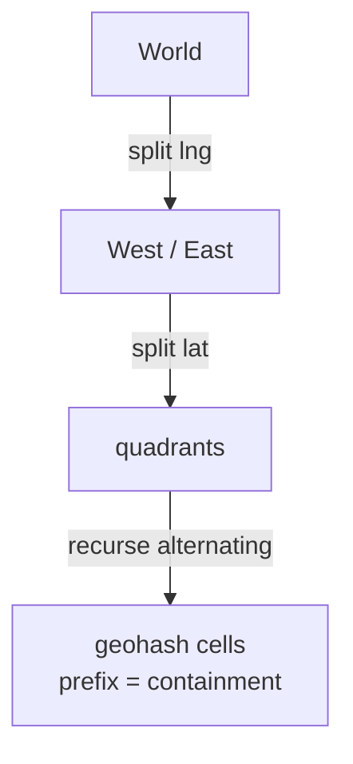
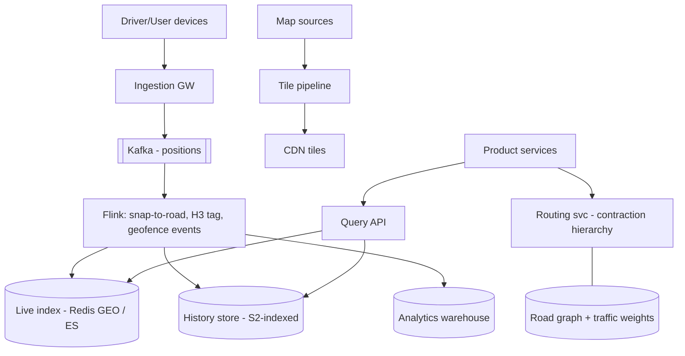
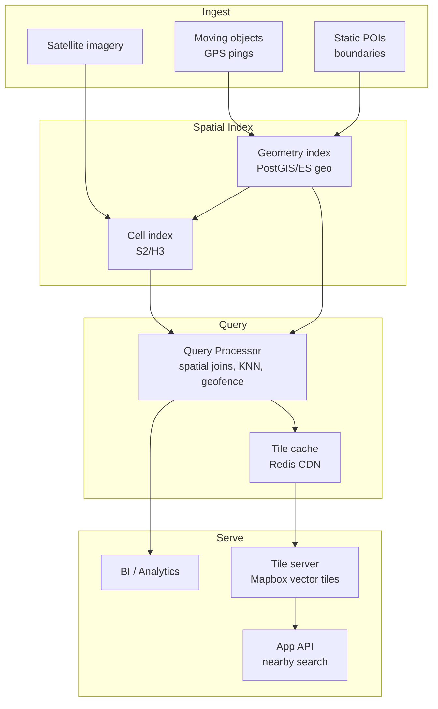
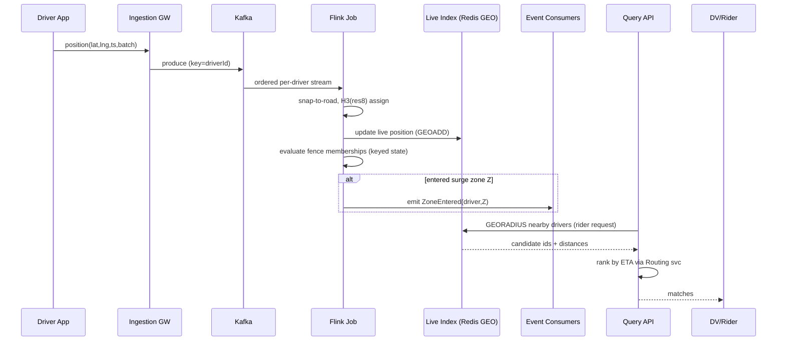
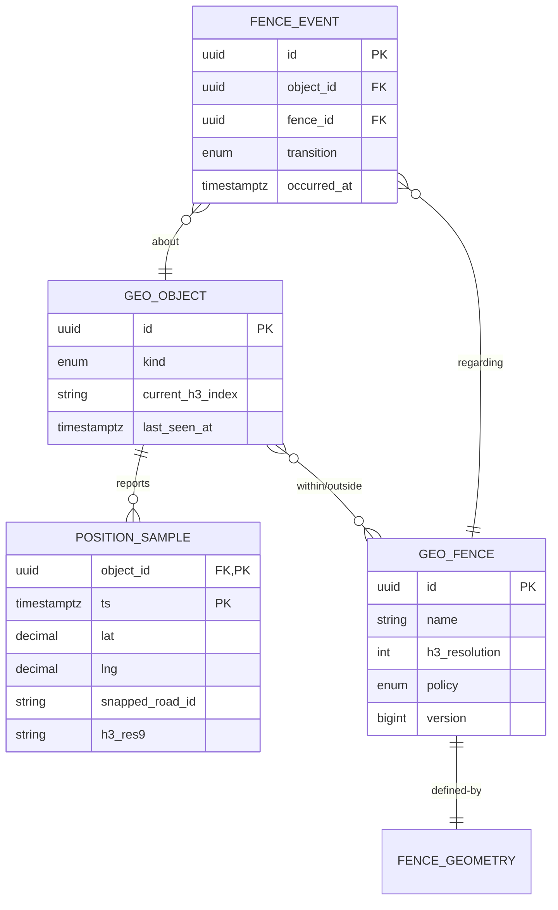

# Design a Distributed Geospatial Data Platform

## Blogs and websites

## Medium

## Youtube

- [Design a Distributed Geospatial Data Platform | System Design](https://www.youtube.com/watch?v=kZvLWRryiLc)

---

## Theory

### What Is It?

A geospatial platform stores, indexes, queries, and serves data whose defining dimension is **location on Earth** — points (drivers, POIs), lines (roads), polygons (delivery zones), and rasters (satellite tiles) — at global scale with millisecond query expectations. The core problem: Earth is a sphere that must be mapped onto finite, balanced data structures so "everything within 5 km of me" or "which zone contains this point?" stays fast at billions of objects.

### Why Does It Exist?

Modern applications — ride-hailing, food delivery, logistics, social check-ins, asset tracking, ad targeting — all depend on answering "what is near what?" at planet-wide scale. A naive approach (store lat/lng, compute distances one-by-one) fails because Earth's surface cannot be naively projected into a flat grid without distortion, and brute-force scans over billions of points are orders of magnitude too slow. A geospatial platform exists to map 2D spherical space into 1D sortable keys that existing key-value and search infrastructure can index and query efficiently.

### What Problem Does It Solve?

* **Spherical geometry on flat indexes**: longitude lines converge at the poles, so "nearest neighbors" in lat/lng space are not nearest in a naive grid. Spatial indexing systems (S2, H3, geohash) map Earth into hierarchical cells that preserve locality.
* **Query efficiency at scale**: "all taxis within 5 km" over millions of records must return in milliseconds. Pre-filtering via spatial indexes (cell IDs) narrows candidates before precise distance computation.
* **Dynamic data ingestion**: millions of moving objects (ride-hailing drivers) update positions every few seconds while staying queryable — requires real-time indexing pipelines, not batch rebuilds.
* **Multi-resolution analytics**: heatmaps, density analysis, and region-based aggregation need hierarchical spatial decompositions that support roll-up from fine to coarse cells.
* **Privacy of location data**: precise coordinates must be generalized/obfuscated for analytics while preserving utility — a system-level design concern.

### Important Subtopics

1. Coordinate systems & projections (lat/lng, Web Mercator, why care)
2. Spatial indexing: S2 geometry, H3, geohash, quadtrees, R-trees
3. Point-in-polygon and spatial join operations
4. K-nearest-neighbor queries
5. Geofencing (static + dynamic fences, event streams)
6. Map tile pipelines (vector vs raster tiles, pyramids, CDN delivery)
7. Route computation basics (graph model, contraction hierarchies)
8. Real-time location streaming (driver position ingestion, downsampling)
9. Spatio-temporal queries (history, heatmaps)
10. Storage engines: PostGIS, Elasticsearch geo, Redis GEO, specialized (GeoMesa/GeoWave)
11. Privacy of location data
12. Multi-resolution aggregation for analytics

### Coordinates & Projections

- **Lat/lng (WGS84)**: angular coordinates on the reference ellipsoid; lat ∈ [−90,90], lng ∈ [−180,180]. Storage canonical; never compute distances naively on them.
- **Web Mercator (EPSG:3857)**: projection used by nearly all web map tiles — conformal (shapes look right locally) but inflates areas toward poles (Greenland ≈ Africa-sized). Fine for display; wrong for area math.
- **Geodesic distance**: haversine formula for sphere approximations (~0.3% error); Vincenty/geodesic libraries for survey-grade accuracy.
- Rule of thumb taught by production scars: *store in WGS84, index in your cell system (S2/H3), project only at render time.*

### Spatial Indexing — The Heart of the Topic

The fundamental trick: **map 2D space to 1D keys** so existing sorted/KV infrastructure can answer spatial questions.

**Geohash** — base32-encoded interleaved lat/lng bits; each character halves the space. `u4pru` ≈ few km box.



Problems: cells vary wildly in usable size near poles; adjacent cells may have unrelated prefixes (edge-of-cell boundary problem — must search neighbor cells, not just prefix matches).

**Google S2** — projects Earth onto cube faces, then Hilbert-curve ordering. Key properties:

- Cells cover sphere uniformly-ish; Hilbert curve keeps locality (nearby places → nearby numbers).
- Arbitrary-precision regions (`S2RegionCoverer`) decompose any polygon into optimal covering-cell sets.
- Powers Google Maps, MongoDB's geo, Foursquare.

**Uber H3** — hexagonal hierarchical grid (icosahedron-projected). Hexagons' killer feature: all 6 neighbors are edge-neighbors with uniform distance — no corner-vs-edge ambiguity like squares. Powers Uber's market analysis, dispatch clustering.

| System | Shape | Best For |
|---|---|---|
| Geohash | Rect | Simple KV integration |
| S2 | Curved quadtree | Polygon coverings, point-in-poly at scale |
| H3 | Hexagon | Uniform adjacency, movement analytics |

### Core Query Types

- **Radius/range query**: candidates via cell covering of circle → refine with exact distance filter. Two-phase is universal: cheap over-approximation then precise check.
- **Point-in-polygon**: ray casting (count crossings) or winding number per polygon; scale via covering cells indexed so only polygons whose cells contain the point get tested.
- **KNN**: best-first search across cells ordered by min-distance bounds (branch-and-bound), avoiding full scans.
- **Spatial joins**: which drivers fall in surge zones? Index both sides by compatible cell systems, hash-join on cell IDs, refine pairs exactly.

### Geofencing

Static fences (airport zones, city boundaries) precompute coverings. Dynamic fences (surge pricing zones emerging from demand) require continuous evaluation: stream driver positions → assign to H3 cells → aggregate per cell → threshold rules fire enter/exit events. Latency budget typically seconds; architecture is stream-processing (Flink/Kafka) not request/response.

### Tile Pipelines

Maps render from **tile pyramids**: zoom z splits world into 2^z × 2^z tiles.

- **Raster tiles**: pre-rendered PNGs — fast, dumb clients, heavy bytes, styling fixed.
- **Vector tiles** (Mapbox Vector Format): geometry+attributes as protobufs; client styles/rotates them — smaller, crisp at any zoom, interactive. Modern default.
- Generation: ETL from source geometries (OSM etc.) → simplify/generalize per zoom level (Douglas-Peucker line simplification; label collision rules) → encode → publish to object storage/CDN. Immutable versioned tiles; updates regenerate affected regions asynchronously.

---

## Characteristics

- **Space-filling-curve-centric**: production systems convert geography to sortable integers (S2 cell IDs, H3 indices, geohashes) enabling range scans, sharding, and joins with ordinary database machinery.
- **Multi-resolution by nature**: every query has a natural granularity (city-level heatmap vs meter-level navigation); platforms maintain pyramided representations rather than one-size answers.
- **Boundary-aware**: any cell-based scheme needs neighbor-search discipline — queries crossing cell edges fail subtly if implemented naively (the classic geohash bug).
- **Stream + store duality**: live location feeds (high write, ephemeral) coexist with historical geometry (read-mostly, durable); different engines per side.
- **Projection-sensitive correctness**: distances, areas, buffering all depend on chosen CRS; mixing them silently corrupts results.
- **Privacy-critical**: precise location is among the most sensitive personal data; retention/aggregation policies are design constraints, not afterthoughts.

---

## Components

- **Location ingestion gateway**
  *Purpose*: receive device/driver position updates. *Responsibilities*: authn, batching (devices send every 3–10 s), protocol efficiency (compact binary), backpressure, forwarding into stream bus. *Example*: Uber driver app pings; fleet telematics ingest.

- **Stream processing layer**
  *Purpose*: enrich + react to positions in motion. *Responsibilities*: snap-to-road correction (GPS jitter removal), cell assignment (H3/S2 tagging), geofence event detection (enter/exit/dwell), surge aggregation windows. *Example*: Apache Flink jobs emitting `driver_moved(cellId)` events.

- **Spatial storage engines**
  *Points/objects*: PostGIS (full OGC SQL), Elasticsearch geo_shape (search-first), Redis GEO (small hot sets via geohash + sorted sets). *Massive-scale history*: GeoMesa/GeoWave over Cassandra/HBase/Accumulo, or S2-indexed tables in BigQuery/Snowflake (modern warehouses now ship native geo types).
  *Responsibilities*: indexing strategy per engine, partitioning by cell/time composite.

- **Tile generation service**
  *Purpose*: produce vector/raster pyramids. *Responsibilities*: source geometry ingestion (OSM extracts), per-zoom generalization, encoding, publishing immutable versions to CDN origins. *Examples*: Mapbox tile pipeline, open-source Tippecanoe.

- **Routing/graph service**
  *Purpose*: shortest/fastest paths. *Responsibilities*: directed weighted graph maintenance (traffic-weighted edge costs), contraction-hierarchy precomputation for ms-level queries, A* with landmark pruning. *Example*: OSRM/Valhalla deployments; GraphHopper embedded in Java fleets.

- **Query API / BFF**
  *Purpose*: unified facade for product features. *Responsibilities*: parse spatial predicates, route to correct engine, merge results, enforce privacy scopes. 

- **Geo-analytics warehouse**
  *Purpose*: heatmaps, market sizing, ETA model training data. *Responsibilities*: spatio-temporal aggregations at coarse cells, retention tiers.



---

## Patterns

- **Cell-covering two-phase query**
  *What*: approximate via covering cells (cheap index lookup), then exact geometric filter on candidates. *Solves*: making arbitrary shapes searchable with 1D indexes. *When*: every serious geo query. *Gotcha*: always include boundary neighbors; test at cell seams.

- **Hierarchical zoom-out (LOD pyramid)**
  *What*: precompute multiple granularities (H3 res 7→9; tiles z0–z16). Queries pick resolution matching need; analytics roll up children. *Real-world*: every map UI ever; Uber's city dashboards.

- **Snap-to-road (map matching)**
  *Problem*: raw GPS jitters across buildings. *How*: Hidden Markov Model matching position sequences to road graph paths (emission = distance-to-segment probability; transition = route plausibility). *Used by*: all ride-hailing ETA systems; OpenStreetMap trace processing.

- **Kafka+Flink geofence state machine**
  *What*: per-object fence membership held as keyed state; position stream drives transitions emitting business events (entered toll zone → charge). *Why pattern*: converts continuous geometry question into discrete event stream products consume naturally.

- **CDN-immutable tile versioning**
  *What*: tiles published under versioned paths; maps apps fetch manifests pinning versions; regeneration never invalidates caches (new URLs instead). *Advantage*: infinite TTLs, zero purge complexity.

- **Anti-pattern**: storing raw lat/lng doubles in relational rows without spatial index and filtering with bounding-box SQL — works until the demo becomes production.

---

## Benefits

- **Location becomes a first-class query dimension**, powering dispatch, ETA, fraud (impossible-travel), logistics optimization, and hyperlocal personalization from one substrate.
- **Uniform scaling story**: cell-based sharding spreads both load and data evenly regardless of where users concentrate.
- **Streaming reactivity**: geofence/surge reactions in seconds enable dynamic pricing and safety responses impossible batch-wise.
- **Ecosystem leverage**: S2/H3 open-source libraries + PostGIS/ES maturity mean hard problems arrive partially solved.
- **Analytics synergy**: same cell IDs join behavioral data to place — marketing, ops planning, ML features unified.

---

## Pros

- Elegant reduction of 2D problems to battle-tested 1D infrastructure.
- Multiple mature engines let teams match tool to query shape instead of forcing one DB.
- Cell hierarchies give free multi-resolution aggregation.
- Vector-tile + CDN architecture scales rendering globally at negligible marginal cost.

## Cons

- Concept stack is deep (projections × curves × hierarchies × engines) — steep team learning curve.
- Boundary/cell artifacts cause subtle bugs invisible in tests centered mid-cell.
- Engine fragmentation risk: Redis GEO for X, ES for Y, PostGIS for Z — consistency and ops burden multiply.
- Precise-location compliance exposure (GDPR special-category-adjacent, India DPDP, law-enforcement requests).
- Realtime layers add stateful stream-processing operational weight (Flink clusters).

---

## Challenges

- **Technical**: GPS noise handling in urban canyons; antimeridian (±180°) wraparound bugs; pole distortion effects on naive Mercator math; floating-point determinism in cell assignment across languages.
- **Scalability**: position-update floods (1M drivers × every 4 s = 250K msg/s sustained); hotspot cells (stadiums, airports) needing sub-splitting; history growth petabyte-ward.
- **Performance**: KNN latency tails when candidate sets explode (dense cities); routing graph fits RAM? (country graphs GBs — contraction hierarchies exist precisely for this).
- **Reliability**: stream processor recovery semantics (exactly-once geofence events); stale-position handling (device offline — last-known-age surfacing).
- **Maintainability**: map source updates (OSM daily diffs) cascading through tiles/graphs/indexes; schema evolution of cell systems (migrations between resolutions).
- **Operational**: monitoring spatial query quality (not just latency — correctness sampling), coordinate-system audit trails.
- **Security/privacy**: precision degradation policies (coarse cells for analytics, exact only when operationally needed), consent management, retention limits, aggregate-only exports for partners.

---

## Best Practices

- **Standardize one cell system org-wide** (usually H3 or S2) — cross-system joins become trivial string/int equality instead of conversion hell.
- **Always pair covering-cell lookup with exact refinement**; property-test seam boundaries explicitly.
- **Store timestamps with every position** and surface staleness in APIs — consumers must distinguish "here" from "was here".
- **Downsample aggressively upstream**: devices batch, gateways dedupe, streams keep latest-per-key state rather than append-everything to hot stores.
- **Separate live (seconds-fresh) from historical (minutes+) tiers** physically; different engines, retention, and SLAs per tier.
- **Version tiles and route graphs immutably**; consumers pin versions, upgrades roll forward cleanly.
- **Apply privacy-by-design**: minimum viable precision per feature, k-anonymity thresholds before publishing aggregates, short raw-precision retention.
- **Load-test with realistic spatial skew** (uniform random locations lie catastrophically about hotspot behavior).

---

## When to Use / Not Use

**Build/buy geospatial platform capability when**: location is core to product (mobility, delivery, real estate, logistics); realtime geo-reactivity needed; analytics requires spatial aggregation at scale.

**Skip when**: occasional store-locator — PostGIS alone suffices; simple proximity sorting — Elasticsearch geo_point covers it; static mapping — third-party maps SDKs (Google/Mapbox) beat DIY.

Alternatives/complements: managed maps stacks (Google Maps Platform, HERE, Mapbox), cloud geo-services (AWS Location Service), warehouse-native GIS (BigQuery GIS) for analytics-only needs.

Decision inputs: query latency budgets, update rates, engineering geo-expertise, data-residency constraints, differentiation value of owning the stack.

---

## Use Cases

- **Ride-hailing dispatch (Uber-class)**
  *Problem*: match riders to drivers sub-second citywide; surge by demand micro-region. *Solution*: H3-tagged positions streamed through Flink; supply/demand aggregates per cell drive surge multipliers; KNN-with-ETA ranking picks drivers (distance-as-the-crow-flies lies — minutes-away is the true metric). *Trade-off*: hexagon granularity balances fairness vs computational cost.

- **Food-delivery zone management**
  *Problem*: restaurant serviceability, courier batching, rain-mode surges defined by polygons changing frequently. *Solution*: polygon registry with versioned coverings; order stream evaluated against current zones; changes propagate via config-style revisioning. *Trade-off*: zone-boundary customers experience flip-flops — dampened by hysteresis rules.

- **Logistics fleet telemetry**
  *Problem*: thousands of trucks reporting continuously; geofenced yard/depot/country-crossing events drive billing and compliance. *Solution*: ingestion → map-matching → fence event state machine; history retained for dispute resolution. *Trade-off*: event exactly-once semantics needed for billing-grade correctness — pushes toward transactional stream processing.

---

## Architecture

### Architectural Style

**Spatial index + geo-partitioned storage + tile pipeline**: geospatial data is mapped into hierarchical spatial cells (S2/H3/geohash) that preserve locality when sorted as 1D keys. Data is partitioned by these cell IDs, enabling geo-partitioned sharding. A query engine resolves spatial predicates (range, KNN, polygon containment) via cell-prefix scans, then refines with exact geometry. A separate tile pipeline serves map tiles (vector or raster) through a CDN for visualization.



*Diagram: Geospatial platform architecture. Moving objects and static POIs feed into geometry indexes (PostGIS/Elasticsearch), while satellite imagery feeds into hierarchical cell indexes (S2/H3). A query processor resolves spatial predicates using both index types, cached results feed tile serving and app APIs.*

### Component Responsibilities and Communication

| Component | Responsibility | Communication |
|---|---|---|
| Spatial Ingest Pipeline | Decode GPS pings, normalize coordinates, assign cell IDs | Kafka → ingest workers → storage |
| Geometry Index | Store exact geometries (points, polygons) with spatial indexes | PostGIS R-tree / Elasticsearch geo-shapes |
| Cell Index | Map geometries to hierarchical cell IDs for partitioning | S2/H3 libraries; cell → shard mapping |
| Query Processor | Spatial joins, KNN, geofencing, range queries | Reads from both geometry and cell indexes |
| Tile Cache | Pre-rendered tiles (vector/raster) for map display | CDN-backed; populated by tile workers |
| Tile Server | Serve vector/raster tiles with style layers | HTTP/2; cache-aware |
| App API | Nearby search, geofence evaluation for applications | Low-latency queries via cached aggregates |

**Data flow**: raw GPS/stream → ingest pipeline normalizes + assigns cell ID → stored in cell-partitioned storage → query processor joins cell prefix scan with geometry refinement → results cached + served to tiles/APIs.

**Scaling strategy**: cell-based sharding distributes data; query processors scale horizontally on request volume; tile pipeline is embarrassingly parallel (generate tiles per cell in parallel).

**When to use**: applications with spatial queries at scale (ride-hailing, logistics, mapping, real estate). **Avoid**: when you have <10K spatial records and simple queries — a single PostGIS instance suffices.

## Design

### Design Considerations

The core design problem is **how to represent spherical geometry in flat, sortable storage**. Earth's lat/lng cannot be naively indexed as two numeric columns because longitude convergence breaks sorting locality. Spatial indexing systems (S2, H3, geohash) solve this by mapping 2D spherical coordinates to hierarchical 1D cell IDs that preserve spatial locality when sorted. The secondary decision is cell **resolution**: too coarse loses precision for nearby queries; too fine inflates storage and index size.

### Key Decisions

- **Cell system choice**: S2 (Google's, balanced, global coverage, used by Uber, Foursquare), H3 (Hexagon, uniform cell area, strong at aggregation), Geohash (simple, variable cell size, edge artifacts). Choose based on use case: H3 for heatmaps/analytics, S2 for general-purpose proximity, Geohash for simplicity.
- **Dual index (geometry + cell)**: store exact geometries in a geometry index (PostGIS/Elasticsearch) AND cell IDs in a sorted KV for fast pre-filtering. Cell prefix scan narrows candidates; exact geometry check refines.
- **Resolution hierarchy**: store multiple resolutions of the same geometry — coarse cells for city-level, fine cells for street-level — enabling multi-resolution queries without recomputation.
- **Tile scheme**: vector tiles (smaller, styleable client-side) vs. raster tiles (pre-rendered, simpler). Vector tiles scale better for interactive maps.
- **Privacy generalization**: at ingest time, reduce cell resolution for sensitive data in analytics layers while keeping full precision for real-time dispatch.

### Trade-offs

| Decision | Pro | Con |
|---|---|---|
| S2 cells | Balanced, battle-tested (Google/Uber) | Complex library; learning curve |
| H3 hexagons | Uniform area, great for aggregation | Less natural for point proximity |
| Geohash | Simple, wide tool support | Variable cell size, edge boundary issues |
| Dual index | Fast pre-filter + exact refinement | 2× storage + sync complexity |
| Vector tiles | Smaller, client-styled | Requires client support |
| High resolution | Precise proximity | More cells per object, larger indexes |

### Scalability Considerations

- Cell-ID sharding: objects partitioned by leading cell-ID bytes; hotspots concentrated in dense urban areas need finer sharding or cell splitting.
- Query fan-out: KNN and polygon queries may touch many cells — parallelize across query processors.
- Tile generation pipeline: per-cell tile generation is embarrassingly parallel; CDN caches absorb read load.
- Real-time ingestion: millions of GPS pings/sec → Kafka → ingest workers with batching.

### Reliability Considerations

- Cell boundary continuity: a query near a cell edge must also check neighbor cells; boundary bugs cause missing results (silent correctness failures).
- Index rebuild safety: regenerating cell indexes must not block queries — dual-write during migration.
- Tile cache invalidation: when underlying data changes, stale tiles must be invalidated within a known window.

### Performance Considerations

- Cell prefix scan: O(log N + results) on sorted KV; narrows millions of points to a few hundred candidates.
- Exact geometry check: Haversine or PostGIS ST_Distance on the narrowed candidate set.
- Tile rendering: generate tiles lazily (on request) for rare views, eagerly (pre-seed) for hot areas.
- KNN queries: use spatial indexes (R-tree) to avoid full scans; bound the search radius.

### Security Considerations

- Privacy of location traces: GPS data is highly sensitive PII — encrypt at rest, minimize retention, apply k-anonymity generalization for analytics.
- Geofence injection: user-supplied polygons must be validated (no massive multi-polygon attacks that trigger O(N²) intersection checks).
- Access control: restrict which clients can query which geographic regions (data-residency compliance).

### Maintainability Considerations

- Schema evolution in geometry format (GeoJSON → WKB vs proprietary): standardize on WKB/PostGIS binary for storage, GeoJSON for API.
- Cell resolution migration: changing resolution affects existing queries; provide migration tools and backward-compatible dual indexing.
- Tile versioning: style changes require cache busting; use versioned tile URLs.

## High-Level Design



Scaling: Kafka partitions by driverId (per-driver ordering); Flink parallelism matches partitions; Redis GEO cluster sharded by city/cell-range; history writes buffered to columnar/object storage async.

Failure handling: Flink checkpoint-restart resumes from committed offsets (at-least-once + idempotent position updates = effectively-once states); Redis shard loss rebuilds from stream replay window; ingestion outage → devices buffer and burst-sync (gateways shaped accordingly).

---

## Deep Dive

- **S2 covering internals**: `RegionCoverer` minimizes cells satisfying max-cells/max-level constraints using priority-queue refinement; result set guarantees superset of region — false positives filtered later. Understanding this clarifies why polygon queries stay O(candidates) not O(world).
- **H3 hexagon math**: aperture-7 hierarchy (each parent ≈ 7 children); exact neighbor enumeration via rotation algorithms; edge lengths ~uniform globally (±0.1%) unlike lat-lng grids — the reason movement analytics prefer it.
- **Contraction hierarchies**: preprocess graph by contracting low-importance vertices, producing shortcut edges; queries then bidirectional Dijkstra touching tiny node subsets — country-scale shortest paths in single-digit ms. Precomputation hours, query microseconds: the classic amortization trade.
- **Map-matching HMM scoring**: emission prob exp(−d²/2σ²) against candidate segments within GPS σ (~10–20 m urban); transition prob penalizes implausible detours; Viterbi resolves globally — explains why matching improves with sequence length, not just fixes.
- **Observability**: spatial correctness sampling (random ground-truth audits), cell-assignment drift metrics across library versions, per-engine query percentiles, stream lag per key-group, staleness histograms of served positions.

---

## API Contract

### Spatial Query API

```
GET  /api/v1/geofence/{fenceId}/contains?lat=12.97&lng=77.64
GET  /api/v1/nearby?lat=12.97&lng=77.64&radiusKm=5&type=restaurant
GET  /api/v1/search?bbox=12.9,77.6,13.0,77.7&category=hotel
GET  /api/v1/tiles/{z}/{x}/{y}.pbf              # vector tile
GET  /api/v1/distance?fromLat=12.97&fromLng=77.64&toLat=13.0&toLng=77.7
POST /api/v1/geofence/{fenceId}/evaluate         # bulk geofence check
```

**Nearby search response**:

```json
{
  "results": [
    {
      "id": "rest_abc123",
      "name": "MTR Restaurant",
      "location": { "lat": 12.9716, "lng": 77.6415 },
      "distanceMeters": 214,
      "category": "restaurant",
      "rating": 4.3
    }
  ],
  "center": { "lat": 12.97, "lng": 77.64 },
  "radiusKm": 5,
  "returned": 20, "total": 1542
}
```

**Geofence contains check**:

```http
GET /api/v1/geofence/zone_north/contains?lat=12.97&lng=77.64
```

```json
{
  "fenceId": "zone_north",
  "inside": true,
  "distanceToBoundaryMeters": 1250
}
```

### Status Codes

* `200` — successful query
* `400` — invalid parameters (lat/lng out of range, malformed bbox)
* `404` — fence ID or tile not found
* `413` — query too broad (radius too large, bbox too big)
* `429` — rate limited (spatial queries are expensive; per-key rate limits)
* `503` — spatial index degraded; fall back to approximate results

### Key Contracts

- **Coordinate system**: all inputs/outputs in WGS84 (lat/lng); internal computation uses the configured cell system (S2/H3).
- **Pagination**: cursor-based via `afterCellId` for large result sets.
- **Tile caching**: vector tiles cached with versioned URLs for cache busting on style updates.
- **Rate limiting**: per-API-key rate limits; complex polygon queries rate-limited more strictly.
- **Spatial precision**: results within radius/bbox are pre-filtered by cell prefix then refined by exact geometry; error bounds are sub-meter.

## Data Modeling



Choices: positions partitioned by `(object_id)` clustered by `ts` (wide-column fit); H3 index columns at multiple resolutions materialized for rollups; fence geometry stored once (GeoJSON/protobuf) with precomputed covering-cell lists in an auxiliary index table; unique constraint on `(object_id, fence_id, occurred_at, transition)` giving idempotent event replay. Retention: samples downsampled progressively (raw 7 days → minute-granularity 90 days → hourly forever), honoring privacy policy.

---

## Java and Spring Boot Implementation

Radius query against Redis GEO with exact refinement:

```java
@Service
public class NearbyService {

    private final StringRedisTemplate redis;
    private final DistanceCalculator calculator;

    public NearbyService(StringRedisTemplate redis, DistanceCalculator calculator) {
        this.redis = redis;
        this.calculator = calculator;
    }

    public List<MatchDto> findNearby(double lat, double lng,
                                     double radiusKm, int limit) {
        var results = redis.opsForGeo().radius("drivers:live",
                new Circle(new Point(lng, lat),
                           new Distance(radiusKm, Metrics.KILOMETERS)),
                RedisGeoCommands.GeoRadiusCommandArgs.newGeoRadiusArgs()
                        .includeCoordinates().includeDistance()
                        .sortAscending().limit(limit * 3));   // over-fetch for refinement
        return results.getContent().stream()
                .map(r -> new MatchDto(r.getContent().getName(),
                        r.getDistance().getValue()))
                .filter(m -> m.distanceKm() <= radiusKm)      // exact filter phase
                .limit(limit)
                .toList();
    }
}
```

Geofence evaluator using S2-style covering concept with JTS polygons:

```java
@Component
public class FenceEvaluator {

    private final Map<UUID, PreparedGeometry> fenceCache;
    private final CellIndex coveringIndex;   // maps cellId -> fences possibly containing it

    public FenceEvaluator(List<FenceRepository> repos) {
        this.fenceCache = repos.stream()
                .flatMap(r -> r.findAllActive().stream())
                .collect(toMap(Fence::id,
                        f -> PreparedGeometryFactory.prepare(f.toJtsPolygon())));
        this.coveringIndex = CellIndex.build(repos.stream()
                .flatMap(r -> r.findAllActive().stream()));
    }

    public List<FenceHit> evaluate(UUID objectId, double lat, double lng) {
        return coveringIndex.candidatesFor(Cell.of(lat, lng)).stream()
                .filter(fid -> fenceCache.get(fid).covers(point(lng, lat)))
                .map(fid -> new FenceHit(objectId, fid))
                .toList();
    }
}
```

Controller exposing proximity search with validation clamps:

```java
@RestController
@RequestMapping("/api/v1/geo")
public class GeoController {

    private final NearbyService nearby;

    @GetMapping("/nearby")
    ResponseEntity<?> nearby(@RequestParam @DecimalMin("-90") @DecimalMax("90") double lat,
                             @RequestParam @DecimalMin("-180") @DecimalMax("180") double lng,
                             @RequestParam @DecimalMax("50") double radiusKm,
                             @RequestParam(defaultValue = "20") @Max(100) int limit) {
        return ResponseEntity.ok(nearby.findNearby(lat, lng, radiusKm, limit));
    }
}
```

Notes: Redis GEO stores geohash-52-bit interleave internally over sorted sets — good enough for live hot sets; heavier geometry belongs in PostGIS/JTS. The prepared-geometry cache avoids reparsing polygons per evaluation; the covering index embodies the two-phase pattern. Testing emphasizes seam cases: points straddling cell borders, antimeridian crossings, and fence-cache invalidation on zone updates.

---

## Real-World Examples

- **Uber** — created and open-sourced H3 precisely because rectangular grids failed their analytics; their engineering blog details hexagon-based surge, ETAs, and marketplace health.
- **Google Maps/S2** — planetary tile serving, geocoding, and region queries on S2; MongoDB adopted S2 for its sphere queries — evidence of the design's portability.
- **Foursquare/Pilosa-era** — venue search over billions of check-ins using S2 cells as primary keys.
- **DoorDash** — published their switch to hierarchical zone systems balancing dispatch fairness; delivery-zone versioning mirrors patterns above.
- **OpenStreetMap ecosystem** — Tile38 (geofencing server), OSRM/Valhalla routing, Tippecanoe vector tiling: an entire open-source toolkit validating each component independently.

---

## Interview Preparation

### Interview Questions

**Beginner**

1. **Why can't we just index lat/lng like normal columns?**
   Proximity is inherently 2D — B-tree indexes handle one dimension; "near me" would degrade to full scans. Spatial indexes (cell curves/trees) reduce neighborhood questions to range lookups on sortable keys.
2. **What is a geohash and its main weakness?**
   Interleaved lat/lng bits producing prefix-shareable strings; weakness: cell-boundary problem (two close points may fall in distant-prefix cells) and polar distortion — mitigated by searching neighbor cells.

**Intermediate**

3. **Compare S2 and H3. When does each win?**
   S2: spherical coverage of arbitrary regions, great polygon indexing (region coverer), used inside databases. H3: uniform hexagon adjacency ideal for movement/aggregation analytics and fair regionalization. Choose S2 for shape-heavy indexing; H3 for statistical/marketplace computations. Strong answers mention both coexisting behind converters.
4. **Walk through "find 10 nearest drivers" efficiently.**
   Cover search area with cells ordered by distance bound → expand outward ring by ring (best-first) until 10 confirmed + closer-cell possibilities exhausted → exact distance filter → optionally replace straight-line with ETA ranking. Emphasize early termination logic and why naive ORDER-BY-distance-over-all fails.
5. **How does map-matching fix noisy GPS tracks?**
   HMM over candidate road segments per sample; emissions favor closeness, transitions penalize unrealistic jumps; Viterbi finds most plausible path. Mention practical knobs: sigma from device quality, break on long gaps.

**Advanced**

6. **Design realtime surge pricing zones for a metro area.**
   Positions → H3 res8 tags → rolling demand/supply windows per cell → ratio thresholds trigger surge levels → smoothing/hysteresis prevents flicker → publish per-cell multipliers to dispatch + pricing services; visualization via aggregated res6/7 parents. Discuss hotspot overflow (event venues) and fairness optics (why neighboring users see different prices — explain cell boundaries honestly).
7. **Petabytes of historical trajectories: how do you serve "traveled through this polygon last year"?**
   Store trajectory samples tagged with covering cells of registered polygons of interest (precomputed intersection flags) OR run batch jobs over S2-partitioned data warehouse; trade storage bloat vs scan cost; discuss partitioning by time+cell, predicate pushdown, and why exact geometry runs only on cell-pruned candidates.

**Senior / system design**

8. **Architect a full competitor to a ride-hail geo-stack end-to-end.**
   Cover: ingestion scale math, dual live/history tiers, cell-system standardization, routing service with traffic-weighted refresh cycles, tile pipeline for consumer maps, failure modes per tier, privacy posture. Senior signals: quantified budgets (msg/s, GB/day), explicit consistency choices per component, migration/versioning story for cell schemas.
9. **Your KNN P99 exploded in dense downtown areas only. Diagnose.**
   Candidate explosion (cells saturated), Redis hot shard for dense cell ranges, refinement cost ∝ density, GC pauses under allocation churn. Remedies: finer cell resolution adaptive by density, per-city index sharding, bounded candidate heaps, profiling refinement stage. Teaches skew-specific reasoning.

### Common Mistakes

- Neighbor-blind prefix searches (the geohash boundary bug).
- Mixing projected and geodesic math (areas computed in Mercator, distances in Euclidean lat/lng degrees).
- Storing unversioned tiles/graphs then discovering no cache can be purged safely.
- Ignoring staleness — serving 20-minute-old positions as live.
- One engine dogma: forcing Redis GEO to do polygon analytics it was never built for.

### Expected discussion points

Curve-locality intuition, covering-then-refine universality, resolution-selection reasoning, streaming exactly-once nuance, and privacy-driven precision minimization.
