# Design a Distributed Geospatial Data Platform

## Blogs and websites

## Medium

## Youtube

- [Design a Distributed Geospatial Data Platform | System Design](https://www.youtube.com/watch?v=kZvLWRryiLc)

---

## Theory

### Topics Covered

1. [Introduction / Problem Statement](#introduction--problem-statement)
2. [Characteristics](#characteristics)
3. [Pros](#pros)
4. [Cons](#cons)
5. [Use Cases](#use-cases)
6. [Components](#components)
7. [Architectural Patterns](#architectural-patterns)
8. [Benefits](#benefits)
9. [Challenges](#challenges)
10. [Best Practices](#best-practices)
11. [When to Use / When Not to Use](#when-to-use--when-not-to-use)
12. [Data Model and API](#data-model-and-api)
13. [Geospatial Data Processing and Spatial Indexing Deep Dive](#geospatial-data-processing-and-spatial-indexing-deep-dive)
14. [Replication Strategies](#replication-strategies)
15. [Failure Detection and Membership](#failure-detection-and-membership)
16. [High Availability and Scalability](#high-availability-and-scalability)
17. [Performance and Optimization](#performance-and-optimization)
18. [CAP Theorem and Consistency Trade-offs](#cap-theorem-and-consistency-trade-offs)
19. [Encryption and Key Management](#encryption-and-key-management)
20. [Authentication and Authorization](#authentication-and-authorization)
21. [Security Threats and Mitigations](#security-threats-and-mitigations)
22. [Observability and Logging](#observability-and-logging)
23. [Real-World Implementations](#real-world-implementations)
24. [Java and Spring Boot Implementation Guide](#java-and-spring-boot-implementation-guide)
25. [Interview Questions and Answers](#interview-questions-and-answers)

---

### Introduction / Problem Statement

A geospatial platform stores, indexes, queries, and serves data whose defining dimension is **location on Earth** — points (drivers, POIs), lines (roads), polygons (delivery zones), and rasters (satellite tiles) — at global scale with millisecond query expectations. The core problem: Earth is a sphere that must be mapped onto finite, balanced data structures so "everything within 5 km of me" or "which zone contains this point?" stays fast at billions of objects.

Modern applications — ride-hailing, food delivery, logistics, social check-ins, asset tracking, ad targeting — all depend on answering "what is near what?" at planet-wide scale. A naive approach (store lat/lng, compute distances one-by-one) fails because Earth's surface cannot be naively projected into a flat grid without distortion, and brute-force scans over billions of points are orders of magnitude too slow. A geospatial platform exists to map 2D spherical space into 1D sortable keys that existing key-value and search infrastructure can index and query efficiently.

**Problem Statement:** Design a distributed geospatial data platform that stores location data (points, lines, polygons, rasters) at global scale, supports real-time position updates from millions of moving objects (drivers, vehicles, devices) every few seconds, answers spatial queries (radius search, k-nearest-neighbors, point-in-polygon, geofence evaluation) in milliseconds, and serves map tiles to end-user applications — all while handling Earth's spherical geometry correctly, managing privacy of precise location data, and scaling write throughput to hundreds of thousands of position updates per second.

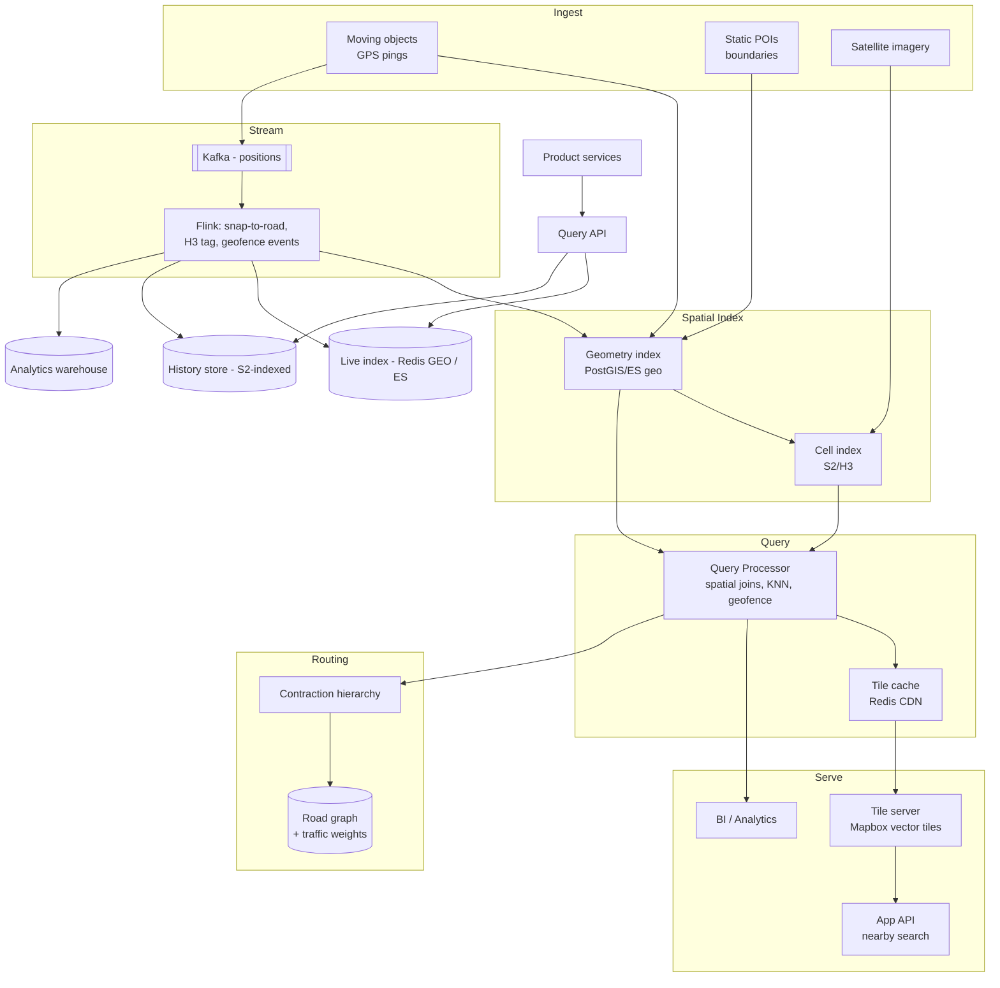

*Diagram: Geospatial platform architecture. Moving objects feed GPS pings both directly into geometry indexes (PostGIS/Elasticsearch) and into a Kafka stream for real-time enrichment (map-matching, cell assignment, geofence detection). Static POIs and satellite imagery feed into geometry and cell indexes respectively. A query processor resolves spatial predicates using both index types, cached results feed tile serving and app APIs. A separate routing service (with contraction hierarchy acceleration) serves path computation.*

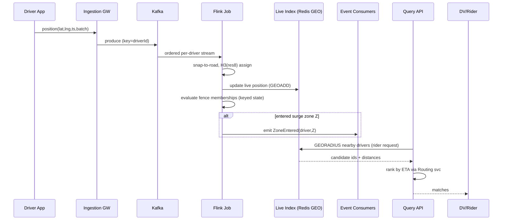

*High-level data flow: driver positions stream through Kafka to Flink for enrichment (snap-to-road, H3 cell tagging, geofence evaluation). The Query API reads from the live index for proximity searches and ranks results by ETA via the routing service.*

---

### Characteristics

- **Space-filling-curve-centric**: production systems convert geography to sortable integers (S2 cell IDs, H3 indices, geohashes) enabling range scans, sharding, and joins with ordinary database machinery.
- **Multi-resolution by nature**: every query has a natural granularity (city-level heatmap vs meter-level navigation); platforms maintain pyramided representations rather than one-size answers.
- **Boundary-aware**: any cell-based scheme needs neighbor-search discipline — queries crossing cell edges fail subtly if implemented naively (the classic geohash bug).
- **Stream + store duality**: live location feeds (high write, ephemeral) coexist with historical geometry (read-mostly, durable); different engines per side.
- **Projection-sensitive correctness**: distances, areas, buffering all depend on chosen CRS; mixing them silently corrupts results.
- **Privacy-critical**: precise location is among the most sensitive personal data; retention/aggregation policies are design constraints, not afterthoughts.
- **Heterogeneous data types**: points (GPS), lines (roads), polygons (zones), and rasters (tiles) each require different storage and indexing strategies within the same platform.
- **Real-time write pressure**: millions of moving objects updating positions every few seconds create sustained write throughput that must be absorbed without dropping or reordering updates.
- **Latency-sensitive queries**: proximity searches and nearest-neighbor lookups must return in low single-digit milliseconds to power interactive application UX.

---

### Pros

- Elegant reduction of 2D problems to battle-tested 1D infrastructure.
- Multiple mature engines let teams match tool to query shape instead of forcing one DB.
- Cell hierarchies give free multi-resolution aggregation.
- Vector-tile + CDN architecture scales rendering globally at negligible marginal cost.
- Unified substrate powers dispatch, ETA, fraud detection (impossible-travel), logistics optimization, and hyperlocal personalization.
- Cell-based sharding spreads both load and data evenly regardless of where users concentrate.
- Streaming reactivity enables geofence/surge reactions in seconds.
- Ecosystem leverage: S2/H3 open-source libraries + PostGIS/ES maturity mean hard problems arrive partially solved.

---

### Cons

- Concept stack is deep (projections × curves × hierarchies × engines) — steep team learning curve.
- Boundary/cell artifacts cause subtle bugs invisible in tests centered mid-cell.
- Engine fragmentation risk: Redis GEO for X, ES for Y, PostGIS for Z — consistency and ops burden multiply.
- Precise-location compliance exposure (GDPR special-category-adjacent, India DPDP, law-enforcement requests).
- Realtime layers add stateful stream-processing operational weight (Flink clusters).
- Spherical geometry correctness requires discipline — Euclidean shortcuts corrupt results silently.
- Tile storage costs grow with zoom levels and update frequency for dynamic map data.

---

### Use Cases

- **Ride-hailing dispatch (Uber-class)**
  *Problem*: match riders to drivers sub-second citywide; surge by demand micro-region. *Solution*: H3-tagged positions streamed through Flink; supply/demand aggregates per cell drive surge multipliers; KNN-with-ETA ranking picks drivers (distance-as-the-crow-flies lies — minutes-away is the true metric). *Trade-off*: hexagon granularity balances fairness vs computational cost.

- **Food-delivery zone management**
  *Problem*: restaurant serviceability, courier batching, rain-mode surges defined by polygons changing frequently. *Solution*: polygon registry with versioned coverings; order stream evaluated against current zones; changes propagate via config-style revisioning. *Trade-off*: zone-boundary customers experience flip-flops — dampened by hysteresis rules.

- **Logistics fleet telemetry**
  *Problem*: thousands of trucks reporting continuously; geofenced yard/depot/country-crossing events drive billing and compliance. *Solution*: ingestion → map-matching → fence event state machine; history retained for dispute resolution. *Trade-off*: event exactly-once semantics needed for billing-grade correctness — pushes towards transactional stream processing.

- **Asset tracking and geofencing (IoT, fleet)**
  *Problem*: track high-value shipments, vehicle fleets, or sensors across regions with enter/exit/dwell alerts. *Solution*: cell-indexed live positions with boundary-crossing detection in the stream processor; alerts published to notification channels. *Trade-off*: precision vs. battery life in device reporting frequency.

- **Location-based services and ads**
  *Problem*: serve hyperlocal recommendations, store locators, and geospatial ad targeting at scale. *Solution*: precompute cell coverage for serviceable areas; index by cell ID for fast proximity filtering; refine with exact geometry. *Trade-off*: cell resolution choice affects both accuracy and index size.

---

### Components

- **Location ingestion gateway**
  *Purpose*: receive device/driver position updates. *Responsibilities*: authn, batching (devices send every 3–10 s), protocol efficiency (compact binary), backpressure, forwarding into stream bus. *Example*: Uber driver app pings; fleet telematics ingest.

- **Stream processing layer**
  *Purpose*: enrich + react to positions in motion. *Responsibilities*: snap-to-road correction (GPS jitter removal), cell assignment (H3/S2 tagging), geofence event detection (enter/exit/dwell), surge aggregation windows. *Example*: Apache Flink jobs emitting `driver_moved(cellId)` events.

- **Spatial storage engines**
  *Points/objects*: PostGIS (full OGC SQL), Elasticsearch geo_shape (search-first), Redis GEO (small hot sets via geohash + sorted sets). *Massive-scale history*: GeoMesa/GeoWave over Cassandra/HBase/Accumulo, or S2-indexed tables in BigQuery/Snowflake (modern warehouses now ship native geo types).
  *Responsibilities*: indexing strategy per engine, partitioning by cell/time composite.

- **Tile generation service**
  *Purpose*: produce vector/raster pyramids. *Responsibilities*: source geometry ingestion (OSM extracts), per-zoom generalization, encoding, publishing immutable versions to CDN origins. *Examples*: Mapbox tile pipeline, open-source Tippecanoe.

- **Routing/graph service**
  *Purpose*: shortest/fastest paths. *Responsibilities*: directed weighted graph maintenance (traffic-weighted edge costs), contraction-hierarchy precomputation for ms-level queries, A* with landmark pruning. *Example*: OSRM/Valhalla deployments; GraphHopper embedded in Java fleets.

- **Query API / BFF**
  *Purpose*: unified facade for product features. *Responsibilities*: parse spatial predicates, route to correct engine, merge results, enforce privacy scopes.

- **Geo-analytics warehouse**
  *Purpose*: heatmaps, market sizing, ETA model training data. *Responsibilities*: spatio-temporal aggregations at coarse cells, retention tiers.

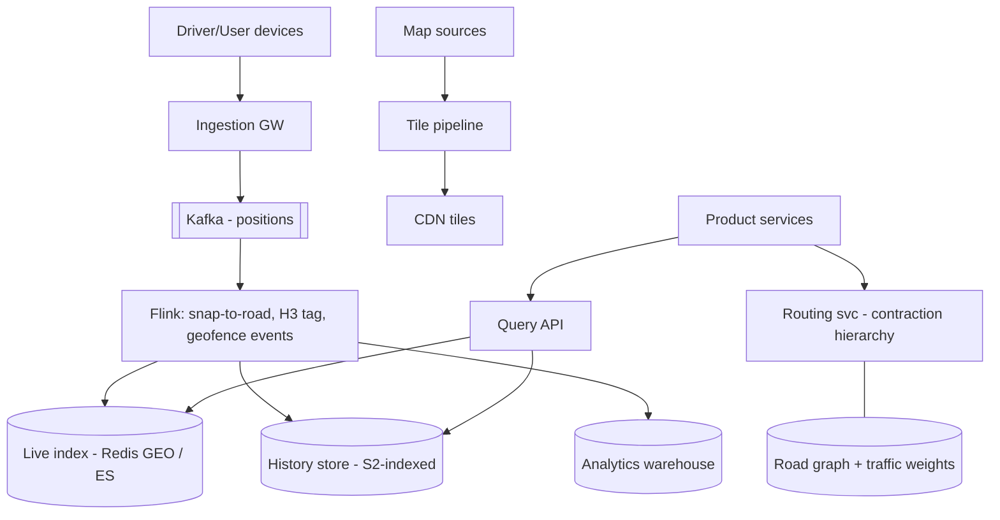

*Component interaction flow: driver position pings arrive at the ingestion gateway, are published to Kafka, consumed by Flink for enrichment (snap-to-road, H3 cell assignment, geofence evaluation), and the enriched data is written to a live index (Redis GEO/Elasticsearch), a history store (S2-indexed), and an analytics warehouse. Map sources feed the tile pipeline which publishes to CDN. Product services query the live and history indexes and use the routing service for path computation.*

**Component Responsibilities and Communication:**

| Component | Purpose | Responsibilities | Communication |
|---|---|---|---|
| Location Ingestion Gateway | Receive position updates | Authn, batching, backpressure, protocol efficiency | Devices → Kafka (partitioned by device ID) |
| Stream Processing Layer | Enrich + react to positions | Snap-to-road, cell assignment, geofence detection, surge aggregation | Kafka → Flink → live/history/analytic stores |
| Spatial Storage Engines | Store exact geometries | Spatial indexing (R-tree), partitioning by cell/time composite | Query API reads; stream layer writes |
| Tile Generation Service | Produce tile pyramids | Source geometry ingestion, per-zoom generalization, encoding, CDN publishing | OSM extracts → object storage → CDN |
| Routing/Graph Service | Compute paths | Directed weighted graph, contraction hierarchies, A* with landmarks | Road graph + traffic weights → Query API |
| Query API / BFF | Unified product facade | Parse spatial predicates, route to engines, merge results, enforce privacy | Product services → live + history stores |
| Geo-Analytics Warehouse | Spatio-temporal analytics | Heatmaps, market sizing, retention tiers, ML training data | Stream layer → BigQuery/Snowflake |

**Data flow**: raw GPS/stream → ingest pipeline normalizes + assigns cell ID → stored in cell-partitioned storage → query processor joins cell prefix scan with geometry refinement → results cached + served to tiles/APIs.

**Scaling strategy**: cell-ID sharding distributes data; query processors scale horizontally on request volume; tile pipeline is embarrassingly parallel (generate tiles per cell in parallel).

**When to use**: applications with spatial queries at scale (ride-hailing, logistics, mapping, real estate). **Avoid**: when you have <10K spatial records and simple queries — a single PostGIS instance suffices.

---

### Architectural Patterns

- **Cell-covering two-phase query**
  *What*: approximate via covering cells (cheap index lookup), then exact geometric filter on candidates. *Solves*: making arbitrary shapes searchable with 1D indexes. *When*: every serious geo query. *Gotcha*: always include boundary neighbors; test at cell seams.

- **Hierarchical zoom-out (LOD pyramid)**
  *What*: precompute multiple granularities (H3 res 7→9; tiles z0–z16). Queries pick resolution matching need; analytics roll up children. *Real-world*: every map UI ever; Uber's city dashboards.

- **Snap-to-road (map matching)**
  *Problem*: raw GPS jitters across buildings. *How*: Hidden Markov Model matching position sequences to road graph paths (emission = distance-to-segment probability; transition = route plausibility). *Used by*: all ride-hailing ETA systems; OpenStreetMap trace processing.

- **Kafka+Flink geofence state machine**
  *What*: per-object fence membership held as keyed state; position stream drives transitions emitting business events (entered toll zone → charge). *Why pattern*: converts continuous geometry question into discrete event stream products consume naturally.

- **CDN-immutable tile versioning**
  *What*: tiles published under versioned paths; maps apps fetch manifests pinning versions; regeneration never invalidates caches (new URLs instead). *Advantage*: infinite TTLs, zero purge complexity.

- **Anti-pattern**: storing raw lat/lng doubles in relational rows without spatial index and filtering with bounding-box SQL — works until the demo becomes production.

**Design Considerations:**

The core design problem is **how to represent spherical geometry in flat, sortable storage**. Earth's lat/lng cannot be naively indexed as two numeric columns because longitude convergence breaks sorting locality. Spatial indexing systems (S2, H3, geohash, R-tree, quadtree) solve this by mapping 2D spherical coordinates to hierarchical 1D cell IDs that preserve spatial locality when sorted. The secondary decision is cell **resolution**: too coarse loses precision for nearby queries; too fine inflates storage and index size.

**Key Decisions and Trade-offs:**

| Decision | Pro | Con |
|---|---|---|
| S2 cells | Balanced, battle-tested (Google/Uber) | Complex library; learning curve |
| H3 hexagons | Uniform area, great for aggregation | Less natural for point proximity |
| Geohash | Simple, wide tool support | Variable cell size, edge boundary issues |
| R-tree / Quadtree | Native DB support (PostGIS R-tree, JSQuad) | Variable node fan-out; rebuild cost |
| Dual index (geometry + cell) | Fast pre-filter + exact refinement | 2× storage + sync complexity |
| Vector tiles | Smaller, client-styled | Requires client support |
| High resolution | Precise proximity | More cells per object, larger indexes |

**Scalability considerations:**
- Cell-ID sharding: objects partitioned by leading cell-ID bytes; hotspots concentrated in dense urban areas need finer sharding or cell splitting.
- Query fan-out: KNN and polygon queries may touch many cells — parallelize across query processors.
- Tile generation pipeline: per-cell tile generation is embarrassingly parallel; CDN caches absorb read load.
- Real-time ingestion: millions of GPS pings/sec → Kafka → ingest workers with batching.
- Resolution selection: use coarse cells for regional analytics (res 4–6), medium for city queries (res 7–9), fine for street-level dispatch (res 10–12).

**Reliability considerations:**
- Cell boundary continuity: a query near a cell edge must also check neighbor cells; boundary bugs cause missing results (silent correctness failures).
- Index rebuild safety: regenerating cell indexes must not block queries — dual-write during migration.
- Tile cache invalidation: when underlying data changes, stale tiles must be invalidated within a known window.
- Position staleness handling: devices can go offline; last-known-age must be surfaced so consumers distinguish "here" from "was here".

---

### Benefits

- **Location becomes a first-class query dimension**, powering dispatch, ETA, fraud (impossible-travel), logistics optimization, and hyperlocal personalization from one substrate.
- **Uniform scaling story**: cell-based sharding spreads both load and data evenly regardless of where users concentrate.
- **Streaming reactivity**: geofence/surge reactions in seconds enable dynamic pricing and safety responses impossible batch-wise.
- **Analytics synergy**: same cell IDs join behavioral data to place — marketing, ops planning, ML features unified.
- **Ecosystem leverage**: open-source spatial libraries (S2, H3, GEOS/JTS) and mature database geo-extensions mean core indexing problems arrive partially solved.
- **Multi-resolution flexibility**: the same cell hierarchy serves meter-level navigation queries and city-level heatmaps without separate infrastructure.

---

### Challenges

- **Technical**: GPS noise handling in urban canyons; antimeridian (±180°) wraparound bugs; pole distortion effects on naive Mercator math; floating-point determinism in cell assignment across languages.
- **Scalability**: position-update floods (1M drivers × every 4 s = 250K msg/s sustained); hotspot cells (stadiums, airports) needing sub-splitting; history growth petabyte-ward.
- **Performance**: KNN latency tails when candidate sets explode (dense cities); routing graph fits RAM? (country graphs GBs — contraction hierarchies exist precisely for this).
- **Reliability**: stream processor recovery semantics (exactly-once geofence events); stale-position handling (device offline — last-known-age surfacing).
- **Maintainability**: map source updates (OSM daily diffs) cascading through tiles/graphs/indexes; schema evolution of cell systems (migrations between resolutions).
- **Operational**: monitoring spatial query quality (not just latency — correctness sampling), coordinate-system audit trails.
- **Security/privacy**: precision degradation policies (coarse cells for analytics, exact only when operationally needed), consent management, retention limits, aggregate-only exports for partners.

---

### Best Practices

- **Standardize one cell system org-wide** (usually H3 or S2) — cross-system joins become trivial string/int equality instead of conversion hell.
- **Always pair covering-cell lookup with exact refinement**; property-test seam boundaries explicitly.
- **Store timestamps with every position** and surface staleness in APIs — consumers must distinguish "here" from "was here".
- **Downsample aggressively upstream**: devices batch, gateways dedupe, streams keep latest-per-key state rather than append-everything to hot stores.
- **Separate live (seconds-fresh) from historical (minutes+) tiers** physically; different engines, retention, and SLAs per tier.
- **Version tiles and route graphs immutably**; consumers pin versions, upgrades roll forward cleanly.
- **Apply privacy-by-design**: minimum viable precision per feature, k-anonymity thresholds before publishing aggregates, short raw-precision retention.
- **Load-test with realistic spatial skew** (uniform random locations lie catastrophically about hotspot behavior).
- **Use prepared geometries** for static polygons (fences, zones) to avoid repeated parsing of complex shapes during high-volume event processing.
- **Prefer immutable, cell-partitioned storage** for historical data — Parquet with spatial partitioning enables predicate pushdown and efficient scans.

---

### When to Use / When Not to Use

**Build/buy geospatial platform capability when**: location is core to product (mobility, delivery, real estate, logistics); realtime geo-reactivity needed; analytics requires spatial aggregation at scale.

**Skip when**: occasional store-locator — PostGIS alone suffices; simple proximity sorting — Elasticsearch geo_point covers it; static mapping — third-party maps SDKs (Google/Mapbox) beat DIY.

Alternatives/complements: managed maps stacks (Google Maps Platform, HERE, Mapbox), cloud geo-services (AWS Location Service), warehouse-native GIS (BigQuery GIS) for analytics-only needs.

**Decision inputs:**
- **Query latency budgets**: proximity and KNN queries typically require <50 ms; tile serving <10 ms from edge.
- **Update rates**: millions of positions per second demand streaming architectures; thousands per second may suffice with batch.
- **Engineering geo-expertise**: spatial correctness requires understanding projections, cell systems, and boundary edge cases.
- **Data-residency constraints**: location data often has stricter residency requirements than other data types.
- **Differentiation value**: owning the full stack pays off when geo is a competitive moat; otherwise leverage managed services.

---

### Data Model and API

#### Spatial Query API

```
GET  /api/v1/geofence/{fenceId}/contains?lat=12.97&lng=77.64
GET  /api/v1/nearby?lat=12.97&lng=77.64&radiusKm=5&type=restaurant
GET  /api/v1/search?bbox=12.9,77.6,13.0,77.7&category=hotel
GET  /api/v1/tiles/{z}/{x}/{y}.pbf              # vector tile
GET  /api/v1/distance?fromLat=12.97&fromLng=77.64&toLat=13.0&toLng=77.7
POST /api/v1/geofence/{fenceId}/evaluate         # bulk geofence check
POST /api/v1/positions/batch                    # batch position ingest
GET  /api/v1/nearby/drivers?lat=12.97&lng=77.64&radiusKm=5  # KNN
```

**Nearby search response:**

```json
{
  "results": [
    {
      "id": "rest_abc123",
      "name": "MTR Restaurant",
      "location": { "lat": 12.9716, "lng": 77.6415 },
      "distanceMeters": 214,
      "category": "restaurant",
      "rating": 4.3
    }
  ],
  "center": { "lat": 12.97, "lng": 77.64 },
  "radiusKm": 5,
  "returned": 20, "total": 1542
}
```

**Geofence contains check:**

```http
GET /api/v1/geofence/zone_north/contains?lat=12.97&lng=77.64
```

```json
{
  "fenceId": "zone_north",
  "inside": true,
  "distanceToBoundaryMeters": 1250
}
```

**Batch position ingest:**

```http
POST /api/v1/positions/batch
Content-Type: application/json

{
  "positions": [
    {
      "objectId": "driver_42",
      "lat": 12.9716,
      "lng": 77.6415,
      "timestamp": "2024-06-14T10:30:00Z",
      "accuracyMeters": 5,
      "speedMps": 12.3,
      "heading": 180
    }
  ]
}
```

```json
HTTP/1.1 202 Accepted
{
  "accepted": 1,
  "rejected": 0,
  "cellAssignments": ["891ea6d6533ffff"],
  "staleCount": 0
}
```

#### Status Codes

| Code | Meaning | When |
|---|---|---|
| `200` | Successful query | Radius, KNN, or geofence check returned |
| `202` | Accepted (batch ingest) | Positions accepted for async processing |
| `400` | Invalid parameters | lat/lng out of range, malformed bbox, oversized batch |
| `401` | Authentication required | Missing or invalid JWT |
| `403` | Forbidden (spatial authorization) | Querying a region or fence you don't own |
| `404` | Fence ID or tile not found | Unknown fence, missing tile |
| `413` | Query too broad | radius too large, bbox too big, batch too large |
| `429` | Rate limited | Spatial queries are expensive; per-key rate limits |
| `503` | Spatial index degraded | Fall back to approximate results |

#### Key Contracts

- **Coordinate system**: all inputs/outputs in WGS84 (lat/lng); internal computation uses the configured cell system (S2/H3).
- **Pagination**: cursor-based via `afterCellId` for large result sets on cell-prefix scans.
- **Tile caching**: vector tiles cached with versioned URLs for cache busting on style updates.
- **Rate limiting**: per-API-key rate limits; complex polygon queries rate-limited more strictly.
- **Spatial precision**: results within radius/bbox are pre-filtered by cell prefix then refined by exact geometry; error bounds are sub-meter.
- **Staleness**: live position responses include `lastUpdatedAt` and `staleAfterSeconds`; consumers must handle stale data gracefully.

#### Data Model (ER Diagram)

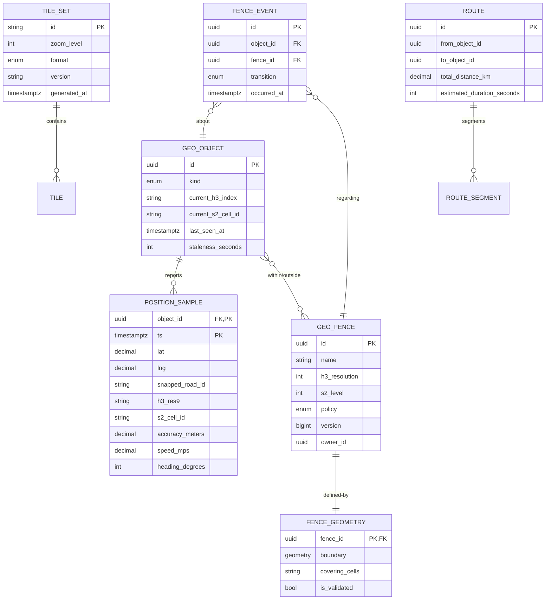

*Entity-relationship diagram showing the core geospatial domain model: GEO_OBJECTs (drivers, vehicles, devices) report POSITION_SAMPLEs with cell assignments (H3 + S2); GEO_FENCEs are defined by versioned FENCE_GEOMETRY with precomputed covering cells; FENCE_EVENTs record boundary transitions; TILE_SETs store multi-zoom map tiles; ROUTEs store precomputed paths.*

**Entity descriptions:**

- **GEO_OBJECT**: Core moving entity. `id` (UUID), `kind` (driver, vehicle, device), `current_h3_index` / `current_s2_cell_id` for live lookup, `last_seen_at` timestamp, `staleness_seconds` threshold. Partitioned by cell ID for geo-sharding.
- **POSITION_SAMPLE**: Raw GPS trace. `object_id` + `ts` composite PK (clustered by time for time-series access), `lat`/`lng` in WGS84, `snapped_road_id` (map-matching result), dual cell indices (`h3_res9`, `s2_cell_id`) for cross-engine queries. Retention: raw 7 days → downsampled.
- **GEO_FENCE**: Spatial boundary policy. `id`, `name`, `h3_resolution` and `s2_level` for covering granularity, `policy` (realtime/streaming/analytics), `version` for immutable updates, `owner_id` for access control.
- **FENCE_GEOMETRY**: Exact polygon + precomputed covering cells. `boundary` (PostGIS geometry with SRID 4326), `covering_cells` (serialized cell ID list for fast lookup), `is_validated` flag.
- **FENCE_EVENT**: State transition log. `(object_id, fence_id, occurred_at, transition)` with a unique constraint for idempotent event replay.
- **TILE_SET**: Map tile metadata. `id`, `zoom_level`, `format` (vector/raster), `version`, `generated_at`. Tile blobs stored in object storage, metadata in DB.
- **ROUTE**: Precomputed path. `from/to object IDs`, `total_distance_km`, `estimated_duration_seconds`. Edges stored as ROUTE_SEGMENT for traffic-weight updates.

**Indexes and Constraints:**

- `POSITION_SAMPLE(object_id, ts)` — clustered primary key for time-series access by object.
- `POSITION_SAMPLE(h3_res9, ts)` — composite index for cell-based spatial filtering.
- `POSITION_SAMPLE(s2_cell_id, ts)` — secondary index for S2-based queries.
- `GEO_OBJECT(current_h3_index)` — index for live proximity lookups.
- `FENCE_GEOMETRY(covering_cells)` — GIN index for cell-overlap queries.
- `FENCE_EVENT(object_id, fence_id, occurred_at, transition)` — unique constraint for idempotency.
- `TILE_SET(id, zoom_level, version)` — composite PK for tile version management.

**Partitioning / Sharding:**

- **POSITION_SAMPLE**: Partitioned by `h3_res7` (city-level cell) then clustered by `ts` — enables efficient time-range scans within a geographic region.
- **GEO_OBJECT**: Sharded by `current_h3_index` hash — live positions colocated with their cell region.
- **FENCE_EVENT**: Partitioned by `fence_id` hash, clustered by `occurred_at` — event log per fence.
- **TILE_SET**: Sharded by `zoom_level` then `id` hash — hot zoom levels (10–15) get more storage nodes.
- **ROUTE**: Sharded by `from_object_id` hash for point-to-point query locality.

---

### Geospatial Data Processing and Spatial Indexing Deep Dive

This section covers the core technical foundations unique to geospatial platforms: coordinate systems and projections, spatial indexing structures (geohash, S2, H3, R-tree, quadtree), tile systems and map rendering, and location-based query processing.

#### Coordinates & Projections

- **Lat/lng (WGS84)**: angular coordinates on the reference ellipsoid; lat ∈ [−90,90], lng ∈ [−180,180]. Storage canonical; never compute distances naively.
- **Web Mercator (EPSG:3857)**: projection used by nearly all web map tiles — conformal (shapes look right locally) but inflates areas toward poles (Greenland ≈ Africa-sized). Fine for display; wrong for area math.
- **Geodesic distance**: haversine formula for sphere approximations (~0.3% error); Vincenty/geodesic libraries for survey-grade accuracy.
- **Albers / Lambert**: equal-area projections used for statistical aggregation (e.g., population density maps) where preserving area matters more than shape.
- Rule of thumb taught by production scars: *store in WGS84, index in your cell system (S2/H3), project only at render time.*

#### Spatial Indexing — The Heart of the Topic

The fundamental trick: **map 2D space to 1D keys** so existing sorted/KV infrastructure can answer spatial questions.

**Geohash** — base32-encoded interleaved lat/lng bits; each character halves the space. `u4pru` ≈ few km box.

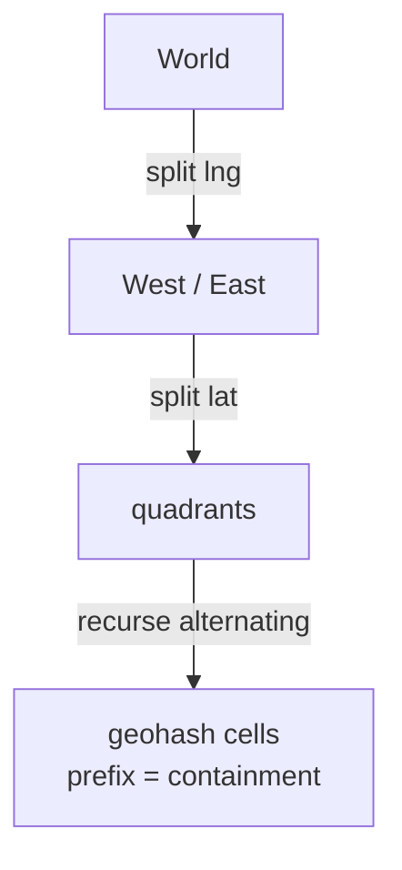

Problems: cells vary wildly in usable size near poles; adjacent cells may have unrelated prefixes (edge-of-cell boundary problem — must search neighbor cells, not just prefix matches).

**Google S2** — projects Earth onto cube faces, then Hilbert-curve ordering. Key properties:

- Cells cover sphere uniformly-ish; Hilbert curve keeps locality (nearby places → nearby numbers).
- Arbitrary-precision regions (`S2RegionCoverer`) decompose any polygon into optimal covering-cell sets.
- Powers Google Maps, MongoDB's geo, Foursquare.

**Uber H3** — hexagonal hierarchical grid (icosahedron-projected). Hexagons' killer feature: all 6 neighbors are edge-neighbors with uniform distance — no corner-vs-edge ambiguity like squares. Powers Uber's market analysis, dispatch clustering.

**R-tree** — balanced tree of bounding boxes; used natively by PostGIS (via `SP-GiST`/`GiST`) and Elasticsearch. Best for exact geometry operations on moderate datasets (thousands to millions of polygons). Nodes split when full; overlap between sibling nodes degrades query performance.

**Quadtree** — recursively subdivides 2D space into 4 quadrants. Simpler than R-tree but doesn't adapt to data distribution (empty regions still get subdivided). Useful for raster tiling and uniform point distributions.

| System | Shape | Best For |
|---|---|---|
| Geohash | Rect | Simple KV integration |
| S2 | Curved quadtree | Polygon coverings, point-in-poly at scale |
| H3 | Hexagon | Uniform adjacency, movement analytics |
| R-tree | Bounding boxes | Exact geometry ops, moderate datasets |
| Quadtree | Squares | Raster tiling, uniform distributions |

#### Spatial Index Selection by Query Type

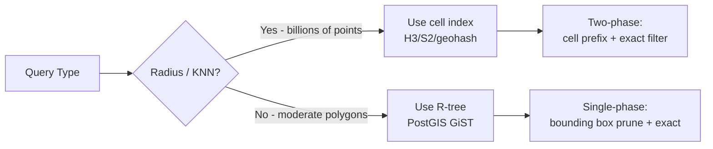

*The spatial index selection flowchart: for radius/KNN queries over billions of points, use a cell-based index (H3/S2/geohash) with the two-phase covering-then-refine pattern; for exact geometry operations on moderate datasets (thousands to millions of polygons), use an R-tree (PostGIS GiST) with single-phase bounding box pruning.*

---

#### Core Query Types

- **Radius/range query**: candidates via cell covering of circle → refine with exact distance filter. Two-phase is universal: cheap over-approximation then precise check.
- **Point-in-polygon**: ray casting (count crossings) or winding number per polygon; scale via covering cells indexed so only polygons whose cells contain the point get tested.
- **KNN (k-nearest-neighbors)**: best-first search across cells ordered by min-distance bounds (branch-and-bound), avoiding full scans. The query point's cell and expanding rings of neighbors are checked until k confirmed nearest candidates are found.
- **Spatial joins**: which drivers fall in surge zones? Index both sides by compatible cell systems, hash-join on cell IDs, refine pairs exactly.
- **Range/BBOX query**: decompose a bounding box into a covering set of cells; scan cell-prefix ranges and refine with exact geometry intersection.
- **Geospatial aggregation**: group objects by cell ID at a given resolution; supports heatmaps, density analysis, and region-based rollups from fine to coarse cells.

#### Geofencing

Static fences (airport zones, city boundaries) precompute coverings. Dynamic fences (surge pricing zones emerging from demand) require continuous evaluation: stream driver positions → assign to H3 cells → aggregate per cell → threshold rules fire enter/exit events. Latency budget typically seconds; architecture is stream-processing (Flink/Kafka) not request/response.

**Geofence evaluation flow:**

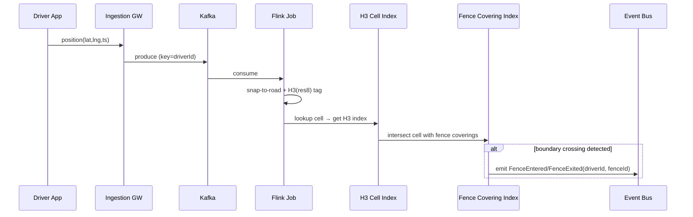

*Geofence evaluation sequence: the driver app sends a position ping to the ingestion gateway, which publishes it to Kafka. The Flink job consumes the position, performs map-matching (snap-to-road) and H3 cell assignment at resolution 8. The cell ID is looked up against a precomputed fence covering index (mapping cells to fence IDs). If the cell intersects a fence's covering set and represents a state transition (entering from outside, or exiting), a FenceEntered or FenceExited event is emitted to the event bus for downstream consumption (billing, notifications, analytics).*

#### Tile Pipelines

Maps render from **tile pyramids**: zoom z splits world into 2^z × 2^z tiles.

- **Raster tiles**: pre-rendered PNGs — fast, dumb clients, heavy bytes, styling fixed.
- **Vector tiles** (Mapbox Vector Format): geometry+attributes as protobufs; client styles/rotates them — smaller, crisp at any zoom, interactive. Modern default.
- Generation: ETL from source geometries (OSM etc.) → simplify/generalize per zoom level (Douglas-Peucker line simplification; label collision rules) → encode → publish to object storage/CDN. Immutable versioned tiles; updates regenerate affected regions asynchronously.

**Tile coordinate system:**

```
                      z=0 (1 tile: 0,0)
                      
          z=1 (4 tiles):                            
          
       (0,0) | (1,0)                              
       ------ ------                              
       (0,1) | (1,1)                              
        
z=2 (16 tiles): 4×4 grid                         
...
```

At zoom level 0, the entire world is a single tile. Each subsequent zoom level divides each tile into 4 quadrants, doubling the resolution. Tile (0,0) is always the top-left (northwest) corner.

#### Map Rendering

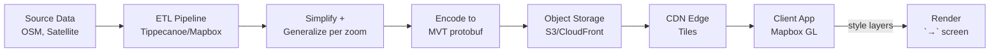

*Map tile rendering pipeline: source data (OpenStreetMap extracts, satellite imagery) flows through an ETL pipeline (Tippecanoe or Mapbox) that applies per-zoom simplification and Douglas-Peucker generalization, encodes the result into Mapbox Vector Tiles (MVT protobuf format), and publishes to object storage behind a CDN. Client-side SDKs (Mapbox GL) fetch tiles from the CDN edge, apply style layers, and render to the screen.*

#### Deep Dive: Spatial Indexing Internals

- **S2 covering internals**: `RegionCoverer` minimizes cells satisfying max-cells/max-level constraints using priority-queue refinement; result set guarantees superset of region — false positives filtered later. Understanding this clarifies why polygon queries stay O(candidates) not O(world).
- **H3 hexagon math**: aperture-7 hierarchy (each parent ≈ 7 children); exact neighbor enumeration via rotation algorithms; edge lengths ~uniform globally (±0.1%) unlike lat-lng grids — the reason movement analytics prefer it.
- **Contraction hierarchies**: preprocess graph by contracting low-importance vertices, producing shortcut edges; queries then bidirectional Dijkstra touching tiny node subsets — country-scale shortest paths in single-digit ms. Precomputation hours, query microseconds: the classic amortization trade.
- **Map-matching HMM scoring**: emission prob exp(−d²/2σ²) against candidate segments within GPS σ (~10–20 m urban); transition prob penalizes implausible detours; Viterbi resolves globally — explains why matching improves with sequence length, not just fixes.
- **R-tree node splitting**: Guttman's quadratic split or linear split minimizes overlap and coverage; R*-tree further reduces overlap via forced reinsertion. Node capacity (typically 50–200 entries) controls tree height vs. fan-out trade-off.

#### Location-Based Query Processing

```mermaid
flowchart TD
    Q1[Radius Query<br/>"within 5km"] --> P1[Phase 1: Cell Covering<br/>H3 res8 covering of circle]
    P1 --> P2[Phase 2: Candidate Scan<br/>H3 index prefix lookup]
    P2 --> P3[Phase 3: Exact Filter<br/>haversine distance]
    P3 --> R1[Results: sorted by distance]
    
    Q2[KNN Query<br/>"nearest 10 drivers"] --> P4[Phase 1: Start cell<br/>+ neighbor ring]
    P4 --> P5[Phase 2: Expand rings<br/>branch & bound by min-dist]
    P5 --> P6[Phase 3: Exact distance<br/>+ sort]
    P6 --> R2[Results: 10 nearest]
    
    Q3[Polygon Query<br/>"inside zone"] --> P7[Phase 1: Cell Covering<br/>of polygon boundary]
    P7 --> P8[Phase 2: Cell scan<br/>+ point-in-polygon test]
    P8 --> R3[Results: objects in zone]
```

*The three-phase spatial query processing pipeline: (1) Radius queries use cell covering of the circle → cell-prefix index scan → exact haversine distance computation. (2) KNN queries start at the query point's cell, expand neighbor rings in best-first order (branch-and-bound by minimum distance bound) until k nearest are confirmed. (3) Polygon queries cover the polygon boundary with cells → scan candidate cells → test point-in-polygon for each candidate. All three follow the same covering-then-refine pattern.*

---

### Replication Strategies

A geospatial platform replicates data across multiple dimensions: within a region (for availability), across regions (for global latency), and across storage systems (for different access patterns). The replication strategy varies by data type and access pattern.

**Leader-based replication (Geometry Store):** Static geometries (fences, road networks, POI polygons) are written to a primary PostGIS instance and replicated to read replicas. Writes go only to the leader; reads can be served from any replica. This gives strong consistency for geometry definitions — a fence boundary must be identical across all regions to avoid geofence evaluation discrepancies.

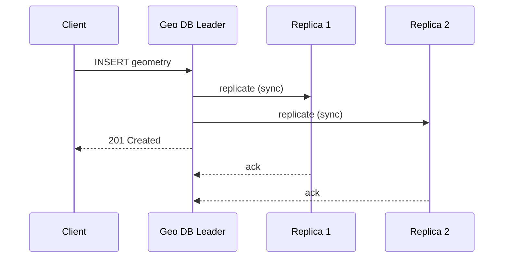

*Leader-based replication for the geometry store: the client writes a new geometry (e.g., a geofence boundary) to the leader PostGIS instance, which synchronously replicates to read replicas before acknowledging the write. Replicas serve read traffic (spatial queries, tile generation), accepting that reads may lag by milliseconds but benefiting from strong write consistency.*

**Leaderless replication (Live Position Store):** The live position store uses Redis Cluster with hash slots and master/replica pairs. Any master can accept writes; followers serve reads. This provides high availability — if a master fails, a replica is promoted. Position updates can tolerate brief staleness (eventual consistency). Conflict resolution uses last-write-wins by timestamp — the position with the most recent update timestamp wins.

**Multi-region replication:**

| Data Type | Strategy | Rationale |
|---|---|---|
| Static geometries | Active-passive, sync within region, async cross-region | Fence boundaries must be consistent; updates are infrequent |
| Live positions | Active-active, last-write-wins by timestamp | Drivers report from any region; global low-latency reads needed |
| Tile cache | CDN edge replication (immutable) | Tiles are immutable; CDN provides global low-latency reads |
| Historical traces | Async cross-region batch copy | Analytics data can tolerate high latency; batch-efficient |
| Routing graphs | Active-passive, daily full refresh + hourly traffic diffs | Road graph changes slowly; traffic weights update frequently |

**Stream replication:** Kafka replicates partitions across regions with MirrorMaker 2. Position updates are produced to a regional Kafka cluster, then mirrored to a global cluster for cross-region analytics and backup. Consumer groups in each region read from their local cluster to minimize latency.

**Conflict resolution for concurrent position updates:** When two position reports for the same driver arrive at different regional clusters simultaneously, the system uses the device-reported timestamp (not the server-received timestamp) to determine which is newer. Last-write-wins by device timestamp ensures consistency even if server timestamps differ.

---

### Failure Detection and Membership

Geospatial services must detect failed nodes, redistribute work, and continue serving with minimal disruption. Additionally, the streaming nature of position data introduces unique failure modes: GPS staleness, stream processor state loss, and boundary-crossing event duplication.

**Gossip-based membership:** Each geo-service instance (ingestion gateway, stream processor, query processor) periodically exchanges health information with a random subset of peers via a gossip protocol. This spreads membership changes through the cluster in O(log N) rounds without a central coordinator. Used by Kafka (for broker membership) and Elasticsearch (for cluster state).

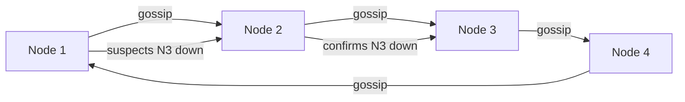

*Gossip-based failure detection: nodes periodically exchange health state with random peers. When a node suspects a peer is down, it propagates the suspicion through gossip; once confirmed by multiple nodes, the peer is removed from the cluster and its responsibilities (e.g., Kafka partition leadership, Redis hash slots) are redistributed.*

**Health checks:**

| Component | Liveness Check | Readiness Check | Business Health Check |
|---|---|---|---|
| Ingestion Gateway | TCP port open | Can reach Kafka | Batch throughput > threshold |
| Stream Processor (Flink) | Process alive | Checkpoint available | Stream lag < 10s |
| Query Processor | HTTP 200 | Can read live store | p95 query < 50ms |
| Tile Server | HTTP 200 | Can reach object store | Tile cache hit > 80% |
| Routing Engine | HTTP 200 | Graph loaded | Route compute < 10ms |
| Cell Index | HTTP 200 | Index available | Cell lookup < 5ms |

**GPS staleness detection:** Each position update carries a device timestamp. The system tracks the age of each object's last update — if `now - last_seen > staleness_threshold`, the position is marked stale and excluded from "nearby" queries. The threshold is configurable per object type (e.g., 10s for ride-hailing drivers, 60s for asset trackers, 300s for delivery trucks).

**Stream processor recovery:** Flink jobs use checkpointed state (RocksDB snapshots every 60s) and Kafka offsets. On failure, the job restarts from the last checkpoint. For billing-grade geofence events, exactly-once semantics are achieved via idempotent writes — the `(object_id, fence_id, occurred_at, transition)` tuple has a unique constraint, so replayed events are naturally deduplicated.

**Tile server failover:** If the primary tile server is unhealthy, the CDN automatically routes to a backup origin. Since tiles are immutable and versioned, failover is transparent to clients — they continue fetching from the CDN edge cache.

---

### High Availability and Scalability

The geospatial platform must remain available during node failures, network partitions, and regional outages while scaling to handle global traffic from millions of concurrent users and moving objects.

#### Data Flow and Scaling

The high-level data flow (shown in the Introduction) scales across several dimensions:

- **Cell-based sharding**: Live positions and historical traces are partitioned by cell ID (leading bytes of the H3/S2 index). Dense urban cells get split into finer sub-cells or replicated across more shards. Hotspot cells (stadiums, airports, city centers) are identified by monitoring write throughput per cell and split dynamically.
- **Stream parallelism**: Kafka partitions position updates by `device_id` hash (preserving per-device ordering). Flink parallelism matches the number of Kafka partitions — each parallel instance handles a disjoint set of devices.
- **Query fan-out**: Spatial range and KNN queries may touch many cells — query processors parallelize across cells. Each cell-prefix scan can be served by a different shard.
- **Tile generation parallelism**: Tile generation is embarrassingly parallel — each `(z, x, y)` tile can be generated independently. Workers pull from a tile-generation job queue partitioned by region.

#### Multi-Region Deployment

Deploy active services in at least 3 regions (e.g., us-east, eu-west, ap-southeast). Users are routed to the nearest region via GeoDNS or a latency-based load balancer. Each region is self-sufficient for read and write operations, with asynchronous cross-region replication for durability.

- **Active-passive for Geometry Store**: Writes go to the primary region's PostGIS; reads can be served from any region's read replica. Cross-region replication lag is typically 1–5 seconds.
- **Active-active for Live Position Store**: Redis with CRDT-based conflict resolution across regions. Drivers can update positions from any region; the most recent timestamped update wins.
- **Global CDN**: Map tiles and static assets are cached at edge locations worldwide, reducing latency to < 50 ms for media.
- **Regional routing**: Position updates are routed to the nearest regional ingestion gateway, which writes to the local Kafka cluster. Cross-region mirroring handles analytics and backup.

#### Auto-Scaling

- **Stateless services (Ingestion Gateway, Query API, BFF):** Scale horizontally based on CPU and request latency. Kubernetes HPA adjusts replica count automatically.
- **Stateful stream processors (Flink):** Scale by increasing parallelism. Kafka partitions are redistributed across the increased number of task slots. Scaling requires a savepoint to redistribute keyed state.
- **Stateful storage (Redis Cluster, PostGIS):** Scale by adding shards or partitions. Redis rebalances hash slots; PostGIS uses Citus for horizontal sharding.
- **Tile workers**: Scale based on the tile generation job queue depth. During map updates, thousands of workers generate tiles in parallel.

#### Graceful Degradation

- **Routing service down**: Serve straight-line distances instead of road-network ETAs. Accuracy degrades but core proximity queries still work.
- **Stream processor down**: Live positions become stale; the system falls back to serving last-known positions with increased staleness thresholds. New geofence events stop, but existing fence state is preserved.
- **Tile cache miss**: Serve a low-zoom fallback tile or a placeholder pattern. The client can display a loading spinner while the tile is generated.
- **Geometry store degraded**: Serve approximate results using only cell-level resolution (no exact polygon refinement). Return a warning header indicating reduced accuracy.
- **Cross-region link failure**: Continue serving from the local region's data. New cross-region replication is queued and replayed when connectivity is restored.

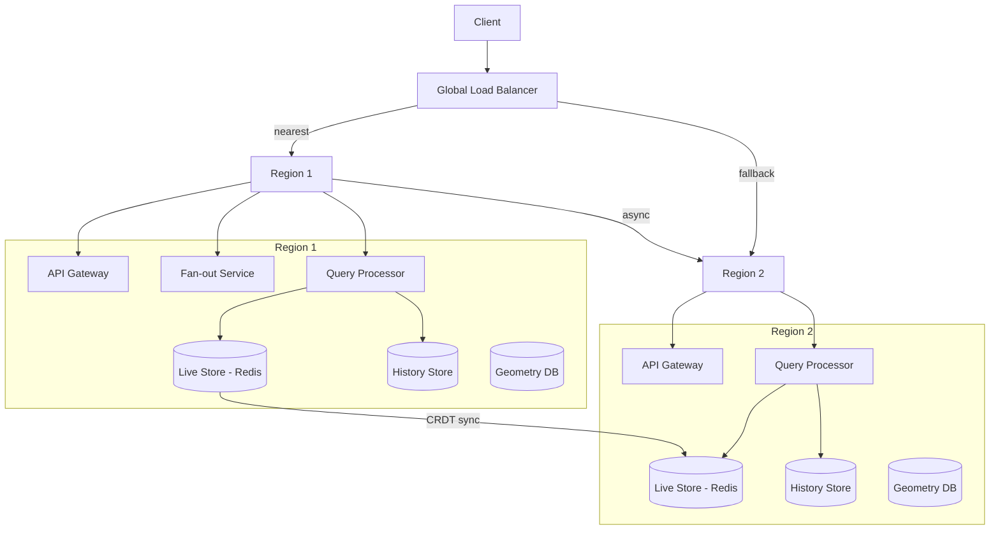

*Multi-region high availability: a global load balancer routes clients to their nearest region. Each region is self-sufficient with its own API Gateway, stream processors, query processors, live store (Redis), history store, and geometry database. Live stores synchronize via CRDTs (last-write-wins by timestamp). If one region fails, the load balancer routes traffic to the other region. Cross-region replication is asynchronous — positions may briefly lag but the system remains available.*

---

### Performance and Optimization

The performance of a geospatial platform is measured by spatial query latency (sub-50 ms SLA for proximity/KNN queries), stream processing lag (seconds of freshness for live positions), and tile serving latency (< 10 ms from edge).

#### Latency Optimization

- **Cell prefix scan**: O(log N + results) on sorted KV stores; narrows millions of points to a few hundred candidates before exact geometry filtering. The covering cell set for a radius query is typically 6–20 cells at resolution 8–9.
- **Exact distance filter**: haversine distance on the narrowed candidate set (typically <500 candidates for a 5km radius in a city). Precompute distances in the stream processor and store alongside the position for faster read-time filtering.
- **Bounding box pre-filter**: For polygon queries, first filter by the query's bounding box (using the spatial index), then apply the exact point-in-polygon test only to candidates within the box.
- **Prepared geometries**: For static fences/polygons, pre-parse into JTS `PreparedGeometry` or PostGIS internal representation. Avoids re-parsing complex geometries on every evaluation — critical for high-volume geofence event processing.
- **Memory-mapped tile cache**: Frequently accessed tiles at zoom levels 10–15 are memory-mapped from disk into Redis or an in-process LRU cache, reducing object store round-trips to near zero for hot tiles.

#### Query Latency Breakdown

| Stage | Typical Latency | Optimization |
|---|---|---|
| API routing + authn | 2–5 ms | Edge-located gateways |
| Cell covering computation | 1–3 ms | Precompute + cache coverings |
| Cell prefix index scan | 5–15 ms | Sorted KV store; composite cell+time index |
| Candidate set retrieval | 10–30 ms | Parallel fetch from sharded stores |
| Exact geometry filter | 5–20 ms | Prepared geometry; parallel stream |
| Distance sort + pagination | 1–5 ms | In-memory sorted set |
| **Total (p95)** | **< 50 ms** | |

#### Throughput Optimization

- **Stream batching**: Position updates are batched at the ingestion gateway (100–500ms windows) to reduce Kafka message overhead. Each batch is a single Kafka message.
- **Cell range queries**: A single cell-prefix scan retrieves all objects in a cell range, enabling batch processing of spatial joins and aggregations.
- **Tile pipeline parallelism**: Per-cell tile generation is embarrassingly parallel; thousands of workers generate tiles concurrently. CDN caches absorb read load.
- **Single-flight pattern**: When multiple concurrent queries request the same tile or the same region's data, coalesce them into a single backend fetch and share the result.
- **Resolution selection**: Use coarse cells (resolution 4–6) for regional analytics; medium cells (7–9) for city-level queries; fine cells (10–12) for street-level dispatch. Matching resolution to query scope reduces candidate set size.

#### Write Path Optimization

- **Async position updates**: Position updates are published to Kafka and acknowledged immediately (202 Accepted). The actual cell assignment and index update happen asynchronously in the stream processor, keeping the ingestion path sub-10ms.
- **Batch fan-out**: Stream processors batch cell-index updates (pipeline 100 writes per Redis pipeline / Postgres batch insert) to reduce per-write overhead.
- **Latest-per-key state**: The stream processor maintains latest-per-key state (latest position per device) using Flink's keyed state, reducing the volume of index updates — only changes trigger writes, not every ping.

**Real-world use:** Uber's dispatch system handles 50M+ position updates per day with sub-50ms query latency using H3 cell sharding. Google Maps serves trillions of tile requests monthly through CDN edge caching.

---

### CAP Theorem and Consistency Trade-offs

The CAP theorem states that during a network partition, a distributed system can provide at most two of: Consistency, Availability, and Partition tolerance. Since geospatial platforms operate over global networks, partition tolerance is always required. The system makes different CAP trade-offs per component.

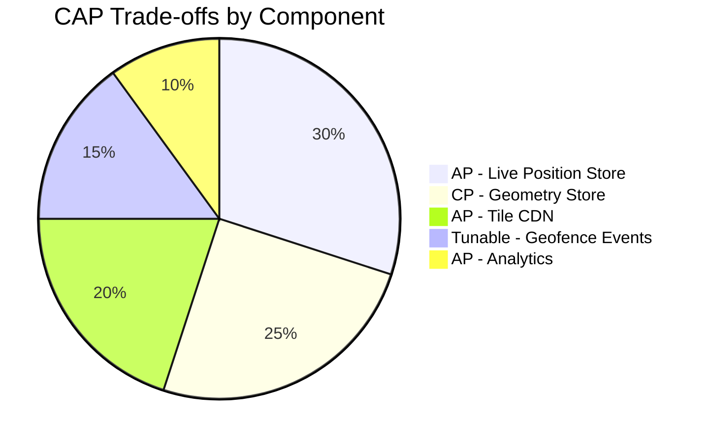

*CAP trade-offs across geospatial platform components: the live position store is AP (availability-first, stale positions acceptable); the geometry store is CP (consistency-first, fence boundaries must be identical); the tile CDN is AP (tile staleness is acceptable for map display); geofence events use tunable consistency (at-least-once for analytics, exactly-once for billing); analytics use AP with bounded staleness.*

#### Live Position Store — AP

The live position store prioritizes availability: if a Redis shard is unreachable, the system can serve slightly stale positions from replicas or fall back to last-known positions with increased staleness thresholds. Position staleness of a few seconds is acceptable for proximity queries — a driver who was 2 seconds ago is still ~50m away at city speeds. The system surfaces staleness in every response (`lastUpdatedAt`, `staleAfterSeconds`) so consumers can decide whether to accept the staleness.

#### Geometry Store — CP

Fence boundaries and road network geometry require strong consistency: a geofence event (entering a toll zone) must use the exact current boundary definition. If the PostGIS leader is unavailable, the system rejects geofence evaluation requests with 503 rather than serving potentially stale geometry. Writes are synchronously replicated to at least one replica before acknowledging.

#### Tile CDN — AP

Map tiles are immutable and versioned. If the origin is temporarily unavailable, the CDN continues serving cached tiles. Stale tiles (a few minutes old) are acceptable for map display — the world doesn't change that fast at the scale of a tile. Cache TTLs are set based on tile update frequency (1 hour for frequently updated areas, 1 week for stable tiles).

#### Geofence Events — Tunable Consistency

Geofence events use at-least-once delivery by default (Kafka at-least-once + idempotent event dedup via unique constraints). For billing-grade correctness (toll roads, paid zones), the system uses exactly-once semantics via Kafka transactions or Flink checkpoints. For analytics (surge pricing), at-least-once is sufficient — duplicate counts are deduplicated during aggregation.

#### Geo-Analytics — AP with Bounded Staleness

Analytics queries (heatmaps, density analysis, market sizing) use eventually consistent data replicated across regions. A bounded staleness window (typically 5–15 minutes) is acceptable — business decisions based on 15-minute-old data are still valid. The system trades strict consistency for global read availability and lower query latency.

**Interview question:** *Is a geospatial platform strongly consistent or eventually consistent?*
**Answer:** It makes per-component choices: strongly consistent for geometry definitions (fences must be identical everywhere), eventually consistent for live positions (a few seconds of staleness is fine), and tunable consistency for geofence events (at-least-once for analytics, exactly-once for billing). This pragmatic split is the key insight interviewers look for.

---

### Encryption and Key Management

Location data is among the most sensitive personal data — it reveals movement patterns, home/work addresses, social connections, and daily routines. Encryption must protect data at rest, in transit, and during processing.

#### Encryption at Rest

**Position traces and live stores:** Object storage (S3, GCS) encrypts all data with SSE-KMS by default. PostGIS uses TDE (Transparent Data Encryption). Redis live stores use encryption-at-rest (Redis Enterprise) or disk-level encryption. Raw position traces are additionally field-level encrypted — the precise lat/lng is stored as an encrypted blob, decryptable only by services with the position-decryption key.

**Tile storage:** Tiles are stored encrypted at rest in object storage. However, since tiles are served publicly (map display), the encryption is at the storage layer only — the application decrypts before serving to authorized clients. Sensitive overlays (private property boundaries, delivery zones) are served with access-controlled tile URLs.

```mermaid
graph LR
    App[Client App] -->|encrypt(E2E position)| E2E[End-to-End Encrypted<br/>position blob]
    App -->|HTTPS| Storage[(Encrypted Storage<br/>S3 + KMS)]
    KMS[Key Management Service] -->|DEK| Storage
    KMS -->|KEK| Vault[Key Vault - HSM]
    DEK[Data Encryption Key] --> KMS
```

*Encryption at rest architecture for geospatial data: end-to-end encrypted position blobs are stored in S3, encrypted with per-object data encryption keys (DEKs) managed by a KMS. The KMS master keys are stored in an HSM-backed key vault. Sensitive position data is additionally encrypted on the client device before transmission.*

**Media encryption:** Satellite imagery and map source data are encrypted with per-object DEKs before storage. For platforms with content moderation (AI scanning of map features), the server decrypts in a secure, isolated environment for analysis but never retains plaintext on disk.

#### Encryption in Transit

All client-to-server and server-to-server traffic uses TLS 1.3 (minimum TLS 1.2). Inter-service communication within the data center uses mTLS (mutual TLS) for service-to-service authentication. Mobile SDKs pin the server certificate to prevent man-in-the-middle attacks on position data.

#### Key Management

- **Key hierarchy:** A KEK (Key Encryption Key) in an HSM encrypts per-object or per-user DEKs (Data Encryption Keys). Rotating the KEK requires only re-encrypting the DEKs, not the data.
- **Key rotation:** KEKs rotated every 90 days; per-user position keys rotated monthly with key exchange via the authentication service.
- **Multi-region KMS:** Keys are available in all deployment regions. Cloud KMS services (AWS KMS, Google Cloud KMS) replicate keys automatically; on-prem deployments use HashiCorp Vault with integrated storage for multi-region HA.
- **Precision-based key separation:** Coarse-resolution cell IDs used for analytics are encrypted with a different key path than precise coordinates used for dispatch, enforcing data minimization at the key level.

**Java example — position encryption service:**

```java
@Service
@RequiredArgsConstructor
public class PositionEncryptionService {

    @Value("${app.encryption.position-key-id}")
    private String keyId;

    private final AwsKms kmsClient;

    public EncryptedPosition encrypt(double lat, double lng, Instant timestamp) {
        var dek = kmsClient.generateDataKey(keyId);
        var cipher = Cipher.getInstance("AES/GCM/NoPadding");
        cipher.init(Cipher.ENCRYPT_MODE,
                new SecretKeySpec(dek.plaintext(), "AES"),
                new GCMParameterSpec(128, dek.iv()));
        var plaintext = (lat + "," + lng + "," + timestamp.toEpochMilli()).getBytes(StandardCharsets.UTF_8);
        var ciphertext = cipher.doFinal(plaintext);
        return new EncryptedPosition(ciphertext, dek.encryptedKey(), dek.iv());
    }
}
```

*The `PositionEncryptionService` bean generates a per-position data encryption key (DEK) via AWS KMS, encrypts the lat/lng/timestamp payload with AES-GCM (providing both confidentiality and integrity via the authentication tag), and stores the encrypted DEK alongside the ciphertext. The KMS-managed key ID is injected via `@Value`. Only services with KMS decrypt permissions can recover the DEK to decrypt position data.*

---

### Authentication and Authorization

A geospatial platform must verify who is connecting (authentication), determine what they can do (authorization), and enforce spatial access control (which geographic regions or fences they can query). Position data and spatial queries are accessed by mobile clients, internal services, and partner integrations.

#### Authentication Methods

- **OAuth 2.0 + JWT:** Users authenticate via a third-party provider (Google, Apple) or email/password. The Auth Service issues a short-lived JWT (15 min) and a refresh token (7 days). The JWT contains the user ID, scopes, and expiry, plus a `home_region` claim used for geographic routing.
- **API keys:** Third-party partners (map integrators, fleet customers) authenticate with scoped API keys. Each key carries a rate limit tier and allowed geographic regions.
- **Service accounts:** Internal microservices authenticate with mTLS certificates issued by a private CA for inter-service spatial queries.
- **Anonymous access:** Map tile serving and public POI queries are available without authentication, but subject to IP-based rate limiting.

#### Authorization Models

- **Scope-based (OAuth 2.0 scopes):** Each token carries scopes like `positions:read`, `positions:write`, `fences:create`, `fences:delete`, `tiles:read`, `routes:compute`. The API Gateway enforces scope checks before routing to backend services.
- **Resource-level spatial authorization:** Each geofence and each geographic region has an owner. The Query API checks whether the requester has `positions:read` scope AND is authorized to query the requested geographic region (via a region-ownership ACL).
- **Object-level ownership:** Drivers can only update their own position (enforced by matching the JWT `sub` to the `objectId` in the position update). Admins can update any position in their managed fleet.
- **Tenant isolation:** Enterprise customers get logically isolated spatial data — their fences and positions are partitioned by `tenant_id` at the storage layer, enforced by row-level security policies.

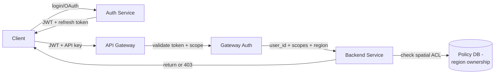

*Authentication and authorization flow for geospatial APIs: the client authenticates via OAuth 2.0 to the Auth Service, receives a JWT and refresh token; the API Gateway validates the JWT signature and scopes before forwarding to backend services; each service performs resource-level spatial authorization (checking if the user can access the requested geographic region) against a policy database.*

#### Rate Limiting

Spatial queries are expensive (cell covering + index scan + exact geometry). The system applies per-API-key rate limits:

| API Key Tier | Requests/minute | Spatial Query Cost Limit |
|---|---|---|
| Free | 1,000 | 100 km-radius queries |
| Developer | 10,000 | 500 km-radius queries |
| Enterprise | 1,000,000 | Unlimited |
| Internal | Unlimited | Unlimited |

Complex polygon queries (bulk geofence evaluation) are rate-limited more strictly — 100 requests/minute for free tier, 10,000 for enterprise.

#### Java example — spatial authorization check

```java
@Service
@RequiredArgsConstructor
public class SpatialAuthorizationService {

    private final PolicyRepository policyRepository;

    /**
     * Check if a user can query positions in the given geographic region.
     * Combines OAuth scope check with spatial ACL check.
     */
    @Transactional(readOnly = true)
    public boolean canQueryRegion(String userId, double lat, double lng,
                                  String requiredScope) {
        var h3Index = H3.geoToH3(lat, lng, 7);  // city-level cell
        var userRegions = policyRepository.getAuthorizedRegions(userId);
        return userRegions.stream()
                .anyMatch(region -> covers(region.h3Covering(), h3Index))
                && policyRepository.hasScope(userId, requiredScope);
    }

    public void enforceFenceOwnership(String userId, UUID fenceId) {
        if (!policyRepository.isFenceOwner(userId, fenceId)) {
            throw new ResponseStatusException(HttpStatus.FORBIDDEN,
                    "Not authorized to access this geofence");
        }
    }
}
```

*The `SpatialAuthorizationService` bean performs two-phase authorization: first, it converts the query coordinates to an H3 cell at resolution 7 (city-level) and checks if any of the user's authorized regions cover that cell; second, it verifies the user has the required OAuth scope. For fence operations, it checks fence ownership against the policy repository, throwing 403 Forbidden for unauthorized access.*

---

### Security Threats and Mitigations

#### Threat: Location Privacy Violation

- **Risk:** Precise GPS traces reveal sensitive patterns (home address, daily routine, medical visits). A data breach or insider threat could expose movement history for millions of users.
- **Mitigation:** Apply precision degradation at ingest time — store exact coordinates only for real-time dispatch (encrypted, short TTL), use coarse H3 cells (resolution 6–7) for analytics. Implement k-anonymity: never publish data where fewer than 10 users share a cell. Enforce minimum retention (raw precision 7 days, downsampled to hourly forever after). Use field-level encryption with separate key paths for precise vs. coarse coordinates.

#### Threat: Geofence Injection / DoS

- **Risk:** An attacker submits a massive multi-polygon geofence (100,000 vertices) that triggers O(N²) intersection checks during evaluation, causing CPU exhaustion and service degradation.
- **Mitigation:** Validate all user-supplied polygons at creation time: reject >10,000 vertices, enforce max cell covering size (max-cells parameter on S2RegionCoverer), apply simplification (Douglas-Peucker at 1m tolerance). Rate-limit fence creation per API key. Cache validated fence geometries with TTL. Use prepared geometries (JTS `PreparedGeometry`) for O(1) point-in-polygon tests after the initial O(N) preparation.

#### Threat: Data Residency / Jurisdiction Violation

- **Risk:** GDPR requires EU citizen data to remain in EU; other regions have similar data-residency laws. A misconfigured cross-region replication could route EU position data through US servers.
- **Mitigation:** Tag every object with its data-residency domain at ingest (derived from the device's country code or IP). Enforce routing: position updates from EU devices must be processed and stored in EU regions only. Use region-scoped Kafka topics and PostGIS instances. Audit all cross-region data transfers. Reject queries that would violate residency (return 403 with a clear error message).

#### Threat: Stale Position Exploitation

- **Risk:** An attacker could exploit stale position data to spoof their location — reporting an old position from a location they left hours ago to evade a geofence or appear in a different region.
- **Mitigation:** Every position response includes `lastUpdatedAt` and `staleAfterSeconds`. Client applications must reject positions older than their staleness threshold. The stream processor applies time-based validity windows — positions older than the threshold are removed from the live index. For security-critical fences (toll zones, restricted areas), the system requires position freshness < 5 seconds and falls back to denying entry if data is stale.

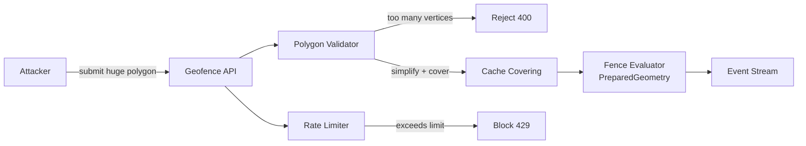

*Geofence injection and DoS protection: an attacker attempts to submit a massive polygon to the Geofence API. The Polygon Validator rejects polygons exceeding the vertex limit (returning 400) and simplifies valid polygons before computing their cell covering. The Rate Limiter blocks API keys exceeding their request budget (returning 429). Validated coverings are cached, and the Fence Evaluator uses JTS `PreparedGeometry` for efficient point-in-polygon testing during stream processing.*

---

### Observability and Logging

Geospatial platforms generate massive amounts of telemetry. Observability must cover the streaming pipeline, spatial query quality, tile serving, and position staleness — not just latency, but correctness.

#### Key Metrics

- **Stream processing lag**: seconds between position report and cell assignment completion. Alert if lag > 5s for live dispatch, >30s for analytics.
- **Spatial query latency**: p50 < 10 ms, p95 < 50 ms, p99 < 200 ms. Track by query type (radius, KNN, polygon).
- **Tile cache hit ratio**: >90% for zoom levels 10–15. Monitor miss rates by region to identify under-seeded tiles.
- **Position staleness distribution**: histogram of `now - last_updated_at` across all tracked objects. Alert if >5% of objects exceed their staleness threshold.
- **Cell coverage accuracy**: percentage of objects correctly assigned to their expected cell (sampled against known ground truth). Drift indicates library version mismatches or projection bugs.
- **Geofence event accuracy**: sample of fence events verified against ground truth (manual audit of boundary crossings). False positive/negative rates tracked per fence.
- **Hotspot cell detection**: cells with write throughput >3σ above the mean, indicating the need for sub-splitting or additional sharding.

#### Logging

- **Position logs**: Every position update is logged with `(objectId, cellId, lat, lng, timestamp, source, quality)`. Logs are structured JSON for ingestion by the analytics pipeline.
- **Fence event logs**: Every enter/exit/dwell event logged with `(objectId, fenceId, transition, occurredAt, cellId, confidence)`. Used for billing audit trails and analytics.
- **Query logs**: Spatial queries logged with `(queryType, boundingBox, cellCovering, resultCount, latencyMs, cacheHit)`. Used for query pattern analysis and performance tuning.
- **Audit logs**: All fence creation/deletion, geometry updates, and administrative actions logged with `(userId, action, fenceId, timestamp, ipAddress)`. Compliant with SOC 2 and GDPR audit requirements.
- **Error logs**: Stream processing failures, cell assignment errors, tile generation failures logged with full stack traces and correlation IDs for cross-service tracing.

#### Distributed Tracing

Trace every position update and spatial query across all services — from ingestion gateway through Kafka, Flink, live store, and query API. Use OpenTelemetry with a trace context header propagated across service boundaries. Key spans to instrument: cell assignment, fence evaluation, tile fetch, KNN expansion, and exact geometry refinement.

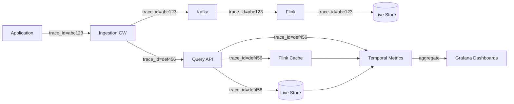

*Distributed tracing flow for geospatial observability: position updates and spatial queries each carry a trace ID propagated across all downstream calls. The Ingestion Gateway, Kafka, Flink stream processors, and Query API each record spans. These spans aggregate in a metrics backend (Jaeger, Datadog, or Temporal) and are visualized in Grafana dashboards, enabling end-to-end latency analysis from position report to query result.*

#### Alerting Strategy

- **Critical (page immediately):** Stream lag > 30s for 5 minutes; Live store unavailable; Flink job failed; tile origin errors > 5% for 10 minutes.
- **Warning (Slack, no page):** Position staleness > 10% of threshold; spatial query p99 > 200 ms; tile cache hit ratio < 80%; Kafka consumer group rebalancing.
- **Info (dashboard only):** Cell coverage accuracy < 99.9%; geofence false-positive rate > 1%; hotspot cell detection (cells > 3σ); new fence creation rate anomalies.

**Java example — spatial query latency metrics with Micrometer:**

```java
@Service
@RequiredArgsConstructor
public class InstrumentedGeoQueryService {

    private final GeoQueryRepository queryRepository;
    private final MeterRegistry meterRegistry;

    public List<NearbyResult> findNearby(double lat, double lng,
                                         double radiusKm, int limit) {
        var timer = Timer.Sample.start(meterRegistry);
        try {
            // Phase 1: cell covering (precomputed for common radii)
            var cellTimer = Timer.Sample.start(meterRegistry);
            var covering = queryRepository.getCellCovering(lat, lng, radiusKm);
            cellTimer.stop(Timer.builder("geo.query.cell_cover")
                    .register(meterRegistry));

            // Phase 2: index scan + exact filter
            var results = queryRepository.scanAndRefine(covering, lat, lng, radiusKm);

            timer.stop(Timer.builder("geo.query.latency")
                    .tag("query_type", "nearby")
                    .tag("region", cellToRegion(covering))
                    .register(meterRegistry));

            Counter.builder("geo.query.results")
                    .tag("query_type", "nearby")
                    .tag("region", cellToRegion(covering))
                    .register(meterRegistry)
                    .increment(results.size());

            return results;
        } catch (Exception e) {
            Counter.builder("geo.query.errors")
                    .tag("query_type", "nearby")
                    .tag("error_type", e.getClass().getSimpleName())
                    .register(meterRegistry).increment();
            throw e;
        }
    }
}
```

*The `InstrumentedGeoQueryService` bean records three metrics per spatial query: the cell covering computation latency (`geo.query.cell_cover`), the total query latency tagged by query type and geographic region (`geo.query.latency`), and the number of results returned (`geo.query.results`). A counter tracks errors by exception type. Tags enable slicing by region (identifying geographic hotspots) and query type (radius vs. KNN vs. polygon). The nested `Timer.Sample` pattern allows measuring sub-components within a larger operation.*

---

### Real-World Implementations

- **Uber**: Built the largest geo infrastructure in the industry — H3 hexagonal grid system (open-sourced), S2-like covering, 50M+ position updates per day across 900+ cities. Uses Spark for big-data geospatial analytics and Flink for real-time stream processing. H3 enables consistent geo-partitioning for trip assignment and ETA prediction.
- **Google Maps**: Uses S2 Geometry library (also open-sourced) for spatial indexing. Serves trillions of tile requests monthly via CDN. Real-time traffic layer built on crowdsourced GPS data from Android devices. Built-in vector rendering with client-side styling (Mapbox GL equivalent).
- **Mapbox**: Vector-tile pipeline (Tippecanoe), real-time traffic, navigation SDK, studio for custom map styling. Serves maps for Strava, Snapchat, and thousands of apps. Open-sourced several geospatial libraries (Tippecanoe, GL JS).
- **Foursquare/Swarm**: Pilgrim SDK for background location, Pilgrim places database, Pilgrim SDK. Pioneered place recognition from GPS traces.
- **Apple Maps**: Uses vector tiles (not raster), indoor mapping, Look Around (street view), and on-device processing for privacy. Integrates with iOS location services.
- **OpenStreetMap (OSM)**: Crowdsourced map data. Uses its own tile rendering (mod_tile + renderd). Data consumed by virtually every mapping service as a base layer.

| Company | Spatial Index | Live Updates/day | Tiles/month | Key Tech |
|---|---|---|---|---|
| Uber | H3 (hexagonal) | 50M+ | N/A | S2, Flink, Spark |
| Google Maps | S2 (spherical quadtrees) | 100M+ | Trillions | Tectonicus, Bigtable |
| Mapbox | S2 + custom H3-like | Variable | Billions | Tippecanoe, GL JS |
| Foursquare | Custom quadtrees | 10M+ | Millions | Pilgrim, Spark |
| Apple Maps | Quadtrees | 10M+ | Trillions | On-device ML, vector tiles |

**Key architectural patterns from production:**

- **Hexagonal indexing (H3)**: Uber's choice — uniform-area cells, efficient neighbor enumeration, good for density/aggregation analytics. Each cell has 6 neighbors (with edge distortions), enabling constant-time "find nearby" via ring expansion.
- **S2 cell decomposition (Google)**: Adaptive subdivision — cell sizes vary by area; small cells in dense areas, large cells in sparse areas. Enables consistent storage key ordering (S2 cells sort by area hierarchy).
- **Vector tiles over raster**: Modern platforms serve vector tiles (MVT/Mapbox Vector Tiles) — smaller payload, client-side styling, resolution-independent. Raster tiles are being phased out.
- **Edge-optimized serving**: Tiles and live positions are cached at CDN edge (Cloudflare, CloudFront) — 90%+ cache hit rates, < 50ms global latency.
- **Multi-layer indexing**: Companies use BOTH spatial indexing (for query acceleration) AND temporal indexing (for TTL/expiry) — composite keys `(cell_id, timestamp)` in KV stores.

---

### Java and Spring Boot Implementation Guide

Spring Boot service for a geospatial platform: spatial queries with cell covering, position updates, and tile serving.

#### 1. DTO Records

```java
public record NearbyResponse(
        double lat, double lng, double radiusKm,
        List<NearbyResult> results, int totalCount) {}

public record NearbyResult(
        String objectId, double lat, double lng,
        double distanceKm, Instant lastUpdated) {}

public record PositionUpdate(
        @NotBlank String objectId,
        @DecimalMin("-90") @DecimalMax("90") double lat,
        @DecimalMin("-180") @DecimalMax("180") double lng,
        @NotNull Instant timestamp) {}

public record TileRequest(
        @Min(0) @Max(22) int z,
        @Min(0) int x, @Min(0) int y) {}

enum SpatialQueryType { NEARBY, KNN, POLYGON }
```

 *`NearbyResponse` wraps spatial query results with metadata. `NearbyResult` includes distance and freshness. `PositionUpdate` is the position ping DTO with validation constraints on lat/lng. `TileRequest` specifies zoom and tile coordinates. `SpatialQueryType` enumerates query types for metrics.*

#### 2. Spatial Query Service with H3

```java
@Service
@RequiredArgsConstructor
@Slf4j
public class GeoQueryService {

    private static final int H3_RESOLUTION = 7;  // city-level

    private final LivePositionRepository positionRepository;
    private final H3Index h3;
    private final MeterRegistry meterRegistry;

    /**
     * Find nearby objects within a radius.
     * Three-phase: cell covering → candidate scan → exact distance filter.
     */
    public NearbyResponse findNearby(double lat, double lng, double radiusKm, int limit) {
        Timer.Sample sample = Timer.Sample.start(meterRegistry);
        try {
            // Phase 1: Compute H3 covering cells for the radius circle
            long[] covering = h3.circleToCells(lat, lng, radiusKm, H3_RESOLUTION,
                    new CircleToCellsOptions().containment(false));

            // Phase 2: Scan candidates from the covering cells
            List<LivePosition> candidates = positionRepository
                    .findByCellIn(covering, PageRequest.of(0, limit * 10));

            // Phase 3: Exact haversine distance filter
            List<NearbyResult> results = candidates.stream()
                    .filter(p -> haversine(lat, lng, p.lat(), p.lng()) <= radiusKm)
                    .map(p -> new NearbyResult(
                            p.objectId(), p.lat(), p.lng(),
                            haversine(lat, lng, p.lat(), p.lng()),
                            p.lastUpdated()))
                    .sorted(Comparator.comparingDouble(NearbyResult::distanceKm))
                    .limit(limit)
                    .toList();

            sample.stop(Timer.builder("geo.query.latency")
                    .tag("type", "nearby")
                    .register(meterRegistry));

            Counter.builder("geo.query.results")
                    .tag("type", "nearby")
                    .register(meterRegistry).increment(results.size());

            return new NearbyResponse(lat, lng, radiusKm, results, results.size());
        } catch (Exception e) {
            Counter.builder("geo.query.errors")
                    .tag("type", "nearby")
                    .tag("error", e.getClass().getSimpleName())
                    .register(meterRegistry).increment();
            throw e;
        }
    }

    private double haversine(double lat1, double lng1, double lat2, double lng2) {
        final double R = 6371.0; // Earth radius in km
        double dLat = Math.toRadians(lat2 - lat1);
        double dLng = Math.toRadians(lng2 - lng1);
        double a = Math.sin(dLat / 2) * Math.sin(dLat / 2) +
                Math.cos(Math.toRadians(lat1)) * Math.cos(Math.toRadians(lat2)) *
                Math.sin(dLng / 2) * Math.sin(dLng / 2);
        return 2 * R * Math.asin(Math.sqrt(a));
    }
}
```

 *`GeoQueryService.findNearby()` implements the three-phase spatial query: (1) H3 covering — computes the set of hexagonal cells covering the radius circle at resolution 7 (city-level). (2) Candidate scan — queries the live position store by H3 cell prefix (O(log N + candidates)). (3) Exact distance filter — applies the haversine formula to the narrowed candidate set, sorts by distance, and limits results. Micrometer metrics track query latency (tagged by type) and result counts. Error counter tracks failures by exception type.*

#### 3. Controller with Spatial Authorization

```java
@RestController
@RequestMapping("/api/v1/geo")
@RequiredArgsConstructor
public class GeoQueryController {

    private final GeoQueryService geoQueryService;
    private final SpatialAuthorizationService authService;

    @GetMapping("/nearby")
    public ResponseEntity<NearbyResponse> findNearby(
            @RequestParam double lat,
            @RequestParam double lng,
            @RequestParam(defaultValue = "5") double radiusKm,
            @RequestParam(defaultValue = "100") int limit,
            @RequestHeader("Authorization") String bearer) {

        authService.canQueryRegion(authService.getUserId(bearer), lat, lng, "positions:read");
        if (!authService.canQueryRegion(authService.getUserId(bearer), lat, lng, "positions:read")) {
            throw new ResponseStatusException(HttpStatus.FORBIDDEN);
        }

        var response = geoQueryService.findNearby(lat, lng, radiusKm, limit);
        return ResponseEntity.ok(response);
    }

    @PostMapping("/positions")
    public ResponseEntity<Void> updatePosition(
            @RequestBody PositionUpdate update,
            @RequestHeader("Authorization") String bearer) {

        if (!authService.canUpdatePosition(authService.getUserId(bearer), update.objectId())) {
            throw new ResponseStatusException(HttpStatus.FORBIDDEN);
        }

        geoQueryService.updatePosition(update);
        return ResponseEntity.accepted().build();
    }
}
```

 *`GeoQueryController` exposes `GET /nearby` for proximity searches and `POST /positions` for position updates. Both endpoints enforce spatial authorization via `SpatialAuthorizationService` — the user must have the `positions:read` scope AND be authorized for the requested geographic region (checked via H3 cell coverage). Position updates verify that the authenticated user can only update their own object's position (object-level ownership check).*

#### 4. Position Ingestion with Kafka

```java
@Service
@RequiredArgsConstructor
public class PositionIngestionService {

    private final KafkaTemplate<String, PositionUpdate> kafkaTemplate;
    private final RedisTemplate<String, String> redisTemplate;
    private final MeterRegistry meterRegistry;

    @Async
    public void ingestPosition(PositionUpdate update) {
        // Compute H3 cell
        long h3Cell = H3.geoToH3(update.lat(), update.lng(), 7);
        String cellKey = "cell:" + h3Cell;

        // Quick liveness/staleness check via Redis (TTL = 120s)
        redisTemplate.opsForValue().set("pos:" + update.objectId(),
                update.timestamp().toString(), Duration.ofSeconds(120));

        // Publish to Kafka (key = objectId for partitioning)
        kafkaTemplate.send("position-updates", update.objectId(), update);

        Counter.builder("positions.ingested")
                .tag("cell", cellKey)
                .register(meterRegistry).increment();
    }
}
```

 *`PositionIngestionService` updates the live position in Redis (with 120s TTL for liveness detection) and publishes to Kafka (partitioned by `objectId` for ordering). Micrometer tracks ingestion rate by cell for hotspot detection.*

---

### Interview Questions and Answers

**Beginner**

1. **How do you index data on a 2D plane for efficient proximity queries?**
   A: Use a spatial index. Common approaches: (1) **Geohash** — interleaves lat/lng bits into a single string; prefix matches nearby cells (but edge/corner cases where close points have different prefixes). (2) **S2/Cell/UFSC** — projects to sphere, partitions into hierarchical cells (Google S2, Uber H3, AWS S2). Cells sort lexicographically and hierarchically. (3) **Quadtree/R-tree** — tree structures that recursively partition space. For proximity: cover the query circle with cells → scan those cell prefixes → exact distance filter on candidates.

2. **What is the "three-phase" spatial query pattern?**
   A: (1) **Cell covering** — decompose the query region (circle, polygon) into a set of index cells (O(log N)). (2) **Candidate scan** — use the cell prefixes to fetch candidates from the KV store (O(log N + candidates)). (3) **Exact filter** — apply exact distance / point-in-polygon computation on the narrowed candidate set (typically hundreds, not millions). This avoids the O(N) full-table scan.

3. **What's the difference between Geohash and H3?**
   A: Geohash produces rectangular cells that vary in size (especially at high latitudes). H3 produces hexagonal cells of ~uniform area and has well-defined neighbor relationships (6 neighbors per cell). H3 supports efficient ring expansion — "find all cells within K rings" is trivial. Geohash requires prefix expansion for neighbors, and rectangle edges cause anomalies. H3 is better for analytics and proximity queries; Geohash is simpler and widely supported.

4. **How do map tiles work?**
   A: The world is divided into a pyramid: zoom 0 = 1 tile (whole world), zoom 1 = 4 tiles, zoom N = 4^N tiles. Each tile is identified by `(z, x, y)`. Two approaches: (1) **Raster tiles** — pre-rendered PNG/JPEG; simple, heavy, fixed styling. (2) **Vector tiles** (MVT/Mapbox Vector Tiles) — protobuf geometry + attributes; smaller, client-side styling, resolution-independent. Clients (Mapbox GL, Mapbox Mobile) request vector tiles from CDN edge, apply style layers, and render.

5. **What is fan-out and why is it important for tile caching?**
   A: Fan-out is how many tiles a single map update affects. When a road is updated, all zoom levels that contain that road need updating. Fine-grained tiles (high zoom) affect more tiles — a small road segment at zoom 18 might affect 100 tiles. Fan-out determines cache invalidation cost and CDN purge scope. Solutions: (1) Invalidate by zoom range (purge zooms 8–15 but keep 16+). (2) Use vector tiles (reduces count). (3) Immutable tiles (version by update time, never purge — old tiles expire via TTL).

**Intermediate**

6. **How would you implement geofencing at scale?**
   A: (1) **Index the fence geometry** — convert the polygon to cell coverings (H3/S2 cell lists). Store `cell → fence_id` in a KV store. (2) **Stream processing** — for each position update, compute its cell, look up fence IDs for that cell, evaluate point-in-polygon. Emit events on boundary crossing. (3) **Optimization** — precompute fence coverings; only evaluate fences whose cells intersect the object's cell. (4) **Stale position handling** — position updates carry timestamps; positions older than staleness threshold are excluded. (5) **Scalability** — partition by cell ID; parallelize evaluation across stream processing instances.

7. **How do you compute the distance between two lat/lng points?**
   A: Haversine formula: `a = sin²(Δφ/2) + cos φ1 ⋅ cos φ2 ⋅ sin²(Δλ/2); c = 2 ⋅ atan2(√a, √(1−a)); d = R ⋅ c`. Simpler: Equirectangular approximation (`x = Δλ ⋅ cos(φ1); y = Δφ; d = R ⋅ √(x² + y²)`) — fast, accurate for <100km. For production routing, use road-network distance (OSRM/Valhalla) not great-circle distance.

8. **How would you handle live position updates for 1M moving objects (cars/drones)?**
   A: (1) **Ingestion gateway** — HTTP endpoint, 202 Accepted immediately. (2) **Kafka** — 1000 partitions, keyed by object_id (ensures ordering per object). (3) **Stream processor** (Flink/Spark) — consumes, assigns to H3 cell, writes to live store (Redis with TTL). (4) **Live store** — Redis Cluster, `object_id → cell + lat/lng + timestamp`. TTL 60-120s (auto-expires stale). (5) **Scaling** — shard by cell ID; hotspot cells (city centers) split into sub-cells. (6) **Query** — proximity query scans candidate cells from live store + exact distance filter.

9. **How do you serve map tiles efficiently?**
   A: (1) **CDN** — immutable tiles cached at edge; cache TTL set by update frequency (1h for dynamic, 1wk for static). (2) **Tile generation** — ETL from source data (OSM) → simplify per zoom → encode as vector tiles → publish to object storage. (3) **On-demand rendering** — for custom styles, render vector tiles server-side. (4) **Single-flight** — coalesce concurrent requests for the same tile. (5) **Fallback** — lower zoom fallback on cache miss. (6) **Compression** — gzip/zlib for raster; protobuf (inherently compact) for vector.

10. **How do you handle the "hotspot cell" problem (e.g., all drivers reporting from Times Square)?**
    A: (1) **Cell sub-splitting** — monitor write throughput per cell; if >3σ above mean, split into finer resolution cells. (2) **Hotspot detection** — track write rate per cell; alert when a cell exceeds capacity. (3) **Multi-level indexing** — use coarse cells for routing, fine cells for storage. (4) **Batching** — batch writes per cell (pipeline 100 writes per Redis batch). (5) **Load shedding** — drop position updates below a staleness threshold (if last update < 5s, skip). (6) **Sharding** — shard the live store by (cell_prefix, object_id_hash) to distribute hot cells.

**Advanced**

11. **Design a geospatial platform serving 100M daily active users with real-time tracking for 10M moving objects. Scale it globally.**
    A: **Data plane**: Mobile clients → CDN edge → regional ingestion gateway (10 regions) → Kafka (10k partitions, keyed by object_id) → Flink (parallelism 2000) → Redis Cluster (100 shards, 5 regions). **Query plane**: API Gateway → Query API → parallel cell-prefix scan across 500 Redis shards → exact haversine filter → return results. **Spatial indexing**: H3 cell covering; cell-prefix index in Redis (`cell_prefix → Set(object_ids)`). **Hotspot handling**: Times Square cell split to H3 res10; sub-sharding by `(cell_prefix, hash(object_id) % N)`. **Tile serving**: Tippecanoe ETL → S3/CloudFront (immutable tiles, 90%+ hit ratio). **Cross-region**: active-active Redis with CRDT-based conflict resolution (last-write-wins by device timestamp); async Kafka MirrorMaker 2 for analytics. **Consistency**: live positions = AP (stale acceptable); geometry stores = CP (fences must be consistent). **Capacity**: 10M objects × 1 position/30s = ~350K writes/sec. With 10s latency target → 100 regions × 3500/sec each. Kafka: 10k partitions × 35 writes/sec. Flink: 2000 parallel tasks × 175 events/sec. Redis: 500 shards × 700 writes/sec. **Failure handling**: region failover < 30s (etcd-based leader election); position staleness < 30s in backup region; tile fallback to lower zoom on CDN miss. **Cost**: ~500 m5.large Kafka brokers, 200 r5.large Redis nodes, 100 c5.large Flink taskmanagers = ~$15K/month baseline + $2K/month at peak.

12. **How would you implement map-matching (snap GPS to road)?**
    A: **Map-matching pipeline**: (1) **Candidate generation** — for the GPS point, find nearby road segments within a search radius (e.g., 50m). Use quadkey/H3 cell to find nearby segments, or R-tree spatial index. (2) **Probability scoring** — emission probability: `exp(-distance² / 2σ²)` where σ is GPS error (~10–20m urban, ~5m highway). Transition probability: penalize implausible moves (impossible turns, backtracking, exceeding road-network distance). (3) **Viterbi alignment** — dynamic programming to find the optimal path through candidates, considering emission + transition scores. Longer GPS traces → better accuracy (more constraints). (4) **Optimization** — precompute road-network distances (Contraction Hierarchies for fast shortest-path); cache candidate segments per cell. (5) **Streaming** — process GPS points in order; maintain the Viterbi state (best path per candidate) incrementally. 6. **Edge cases**: GPS gap (missing points) — interpolate; tunnel (no GPS) — dead reckoning from last/good point + speed; highway ramps — allow transitions within search radius; one-way streets — validate direction.


