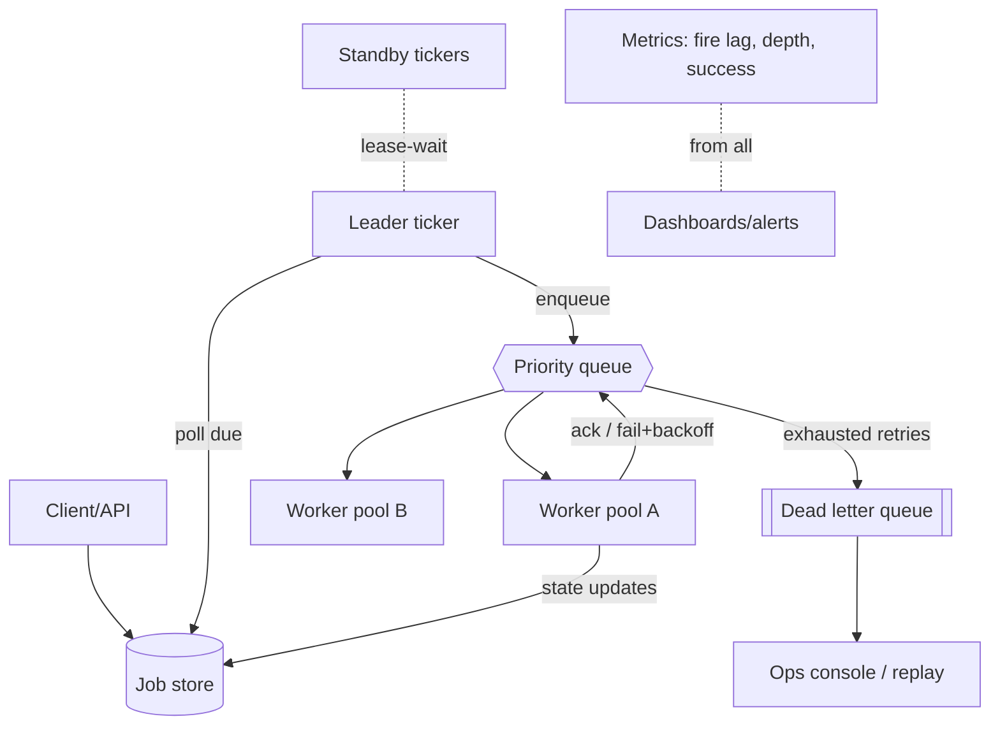
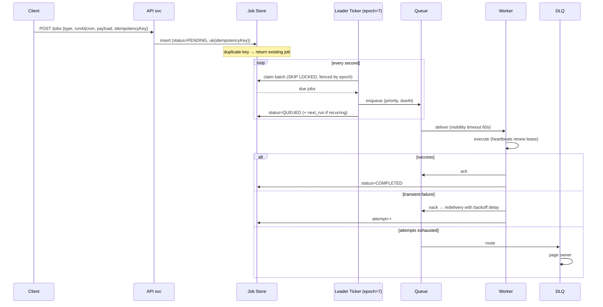
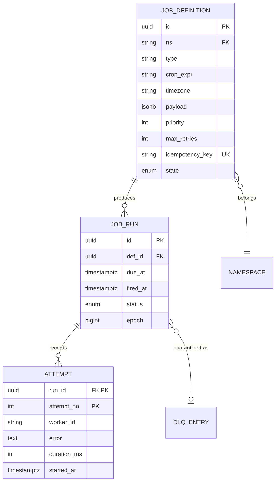

# Design Distributed Job Scheduler

## Blogs and websites

## Medium

## Youtube

## Theory

### What Is It?

A distributed job scheduler coordinates when and where units of work (jobs/tasks) execute across a fleet of worker machines, ensuring they run at the right time, with the right resources, exactly-once semantics, and appropriate retries — even as workers fail, restart, or get rescheduled.

### Why Does It Exist?

In a single-node system, a cron daemon or timer can schedule jobs. But at fleet scale, a job must run on exactly one node at a specific time, survive node failures, respect resource constraints (CPU/memory), honor dependencies (Task B runs after Task A), and handle retries with backoff. A centralized scheduler provides the global coordination that distributed workloads require, decoupling *what* runs and *when* from *where* it happens to be scheduled.

### What Problem Does It Solve?

* **At-most-once / exactly-once scheduling**: prevents duplicate execution (critical for billing jobs) and ensures no job silently drops (critical for SLA guarantees).
* **Resource contention**: multiple jobs competing for CPU/memory/disk — the scheduler must place jobs on nodes with available capacity, respecting priority and fairness.
* **Failure recovery**: when a worker dies mid-job, the scheduler must re-queue the job (after a grace period to detect true failure vs. slow progress) on another node.
* **Time accuracy and clock skew**: wall-clock-based scheduling across nodes with different clock offsets creates missed or duplicate triggers. Monotonic clocks and logical time sources help.
* **Cron complexity**: timezone handling, DST transitions (skip/repeat an hour), missed-fire policies (run once? skip? accumulate?).
* **Dependency orchestration**: DAGs of jobs (ETL pipelines) where Task C depends on Task A + Task B succeeding — requires topological scheduling and partial failure handling.

### Important Subtopics

1. Job taxonomy: one-time, delayed, recurring/cron, dependent DAGs
2. Time-source correctness (clock skew, monotonic vs wall time)
3. At-least-once execution + idempotency (why exactly-once is a myth at the transport layer)
4. Leader election & active-passive scheduling
5. Queue mechanics: visibility timeout, acknowledgment, dead-letter
6. Retry policies: backoff, jitter, budgets, DLQ handling
7. Priority and fairness (starvation prevention)
8. Sharding/partitioning of job space across schedulers and workers
9. Cron semantics: timezone handling, DST edge cases, missed-fire policies
10. Long-running jobs: heartbeats, leases, cancellation signals
11. Observability: queue depth, fire-time accuracy, success rates
12. Backpressure and worker autoscaling

*(The existing subsections below cover problem statement, requirements, architecture, core components, coordination, failure handling, scaling, and tech choices.)*

### Problem Statement
Design a distributed job scheduler that can reliably schedule, execute, and manage millions of jobs (one-time, recurring, delayed) across a cluster of workers.

### Functional Requirements
- Schedule one-time jobs at a specific time
- Schedule recurring jobs (cron-like)
- Delayed job execution (run after X minutes)
- Job prioritization
- Retry failed jobs with configurable backoff
- Job status tracking (pending, running, completed, failed)
- Job cancellation and pause/resume

### Non-Functional Requirements
- **Reliability**: Every job executes at least once (at-least-once semantics)
- **Scalability**: Handle millions of scheduled jobs
- **Low Latency**: Job fires within 1-2 seconds of scheduled time
- **Fault Tolerance**: No single point of failure, survive node crashes
- **Consistency**: No duplicate execution (ideally exactly-once)

### High-Level Architecture

```
┌──────────┐     ┌─────────────────┐     ┌──────────────────┐
│  Client  │────▶│   API Gateway   │────▶│  Scheduler       │
│  (API/   │     │                 │     │  Service         │
│   UI)    │     └─────────────────┘     │                  │
└──────────┘                             │ ┌──────────────┐ │
                                         │ │ Job Store    │ │
                                         │ │ (metadata)   │ │
                                         │ └──────┬───────┘ │
                                         └────────┼─────────┘
                                                  │
                                         ┌────────▼─────────┐
                                         │   Job Queue       │
                                         │   (Priority Q)    │
                                         └────────┬─────────┘
                                                  │
                              ┌────────────────────┼────────────────────┐
                              ▼                    ▼                    ▼
                        ┌───────────┐        ┌───────────┐       ┌───────────┐
                        │  Worker 1 │        │  Worker 2 │       │  Worker N │
                        └───────────┘        └───────────┘       └───────────┘
```

### Core Components

**1. Job Store (Database)**
```sql
jobs table:
  id, name, type (ONE_TIME | RECURRING), cron_expression,
  scheduled_at, payload, priority, max_retries, retry_count,
  status (PENDING | QUEUED | RUNNING | COMPLETED | FAILED),
  locked_by, locked_at, created_at, updated_at
```

**2. Scheduler (Ticker)**
```
Every second:
  1. Query jobs WHERE scheduled_at <= NOW() AND status = PENDING
  2. Move them to the job queue
  3. For recurring jobs: compute next_run and insert new job row
```

**3. Job Queue**
- Priority queue (Redis Sorted Set or Kafka with priority topics)
- Score = scheduled_time (earlier = higher priority)
- Dequeue guarantees: visibility timeout + acknowledgment

**4. Workers**
- Pull jobs from queue (competing consumers pattern)
- Execute job payload
- Report result (success/failure) back to job store
- Heartbeat to indicate liveness

### Distributed Coordination

**Leader Election (for Scheduler):**
```
Multiple scheduler instances → Only 1 active (leader)
Use: ZooKeeper / etcd / Redis RedLock for leader election
Failover: If leader dies, another takes over within seconds
```

**Preventing Duplicate Execution:**
```
1. Optimistic locking: UPDATE jobs SET locked_by=worker_id
   WHERE id=X AND locked_by IS NULL
2. Visibility timeout: Job invisible to others for N seconds
3. Idempotency: Jobs should be idempotent (safe to retry)
```

### Handling Failures

```
Job fails → Retry with exponential backoff
  Attempt 1: immediate
  Attempt 2: after 1 min
  Attempt 3: after 5 min
  Attempt N: after min(2^N minutes, 1 hour)

After max_retries → Move to Dead Letter Queue (DLQ)
  → Alert operators
  → Manual retry option
```

### Scaling Strategies

| Component | Strategy |
|-----------|----------|
| **Job Store** | Sharded by job_id, partition by scheduled_at |
| **Queue** | Partitioned topics (Kafka) or multiple Redis instances |
| **Workers** | Horizontal scaling, auto-scale based on queue depth |
| **Scheduler** | Active-passive with leader election |

### Tech Choices
- **Job Store**: PostgreSQL (strong consistency) or Cassandra (scale)
- **Queue**: Redis Sorted Sets (simple) or Kafka (durable, high throughput)
- **Coordination**: etcd or ZooKeeper
- **Workers**: Stateless containers (K8s Jobs / ECS Tasks)

---

## Characteristics

- **Time-driven triggering**: the system's correctness hinges on firing near schedule time (1–2 s SLO) despite distributed clocks — achieved via monotonic tickers per leader plus DB timestamps as truth, never trusting any single node's wall clock.
- **At-least-once by design**: crashes between execution-start and completion-ack force re-execution; idempotency of job payloads converts this from correctness bug into design assumption.
- **Decoupled scheduling from execution**: scheduler decides *when*, workers decide *how*; queue between them absorbs bursts and lets each tier scale independently.
- **Bounded resource fairness**: priorities must coexist with anti-starvation guarantees (weighted fair queuing or aging), else low-priority jobs live forever.
- **Stateful metadata, stateless workers**: job store holds all state; workers are replaceable cattle whose death costs at most one visibility-timeout delay.
- **Recurring-job materialization**: cron entries expand into concrete runnable instances ahead of time (materialized view pattern), keeping hot paths free of expression evaluation.

---

## Components

- **API service**
  *Purpose*: submit/cancel/query jobs. *Responsibilities*: validation (cron parse, payload size caps, authz per namespace), dedupe via client request IDs, writing to job store. *Relationship*: only writer of user intent; scheduler owns state transitions after.

- **Job store**
  *Purpose*: durable source of truth for definitions + state machine. *Responsibilities*: indexed lookups (`(status, scheduled_at)`), optimistic locking on claims, history retention. *Schema shown in Theory.* *Real-world*: Postgres with partial indexes on PENDING rows.

- **Ticker/scheduler (leader-elected)**
  *Purpose*: fire due jobs into queue. *Responsibilities*: poll due batch (`LIMIT n FOR UPDATE SKIP LOCKED`), enqueue atomically-ish, compute recurring next-runs with timezone-aware libraries, maintain fire-time accuracy metrics. *Relationship*: single active leader (lease via etcd/Postgres advisory lock); standbys hot.

- **Queue**
  *Purpose*: buffer due work with delivery guarantees. *Responsibilities*: priority ordering, visibility timeouts on unacked deliveries, DLQ routing after retry exhaustion. *Options*: Redis sorted sets (score = due-time, ZPOPMIN polling + lock), Kafka (partition-per-priority, consumer-group rebalancing), SQS-class managed queues. 

- **Worker fleet**
  *Purpose*: execute payloads. *Responsibilities*: claim → heartbeat lease renewal → execute → ack/fail-report; enforce per-execution timeouts; expose concurrency slots as autoscaling signal. *Example*: Celery workers, Spring `@Scheduled` alternatives at scale, custom executors over Kafka consumers.

- **DLQ & ops console**
  *Purpose*: quarantine poison jobs. *Responsibilities*: retention, inspection UI, guarded replay (with edit), alerting on depth growth.



---

## Patterns

- **Competing consumers with visibility timeout**
  *Problem*: parallel execution without duplicates; crashed worker's task recovers. *How*: claim marks invisible N seconds; ack deletes/reports; timeout elapsing re-delivers. *When*: default queue semantics. *Not when*: tasks longer than sane visibility windows without heartbeats (renew leases instead).

- **Leader election + fencing tokens**
  *What*: one ticker active; etcd/ZK session or DB lease decides leadership; actions carry epoch/fencing numbers so a zombie old leader's writes get rejected post-failover. *Solves*: split-brain double-firing. *Critical detail*: fencing at the *store*, not just election — election alone is insufficient.

- **Materialized cron instances**
  *What*: recurring definition expands to concrete rows (next 100 runs or rolling window). *Pros*: due-scan stays simple equality/range query; timezone/DST resolved once at materialization. *Cons*: expansion bookkeeping; mitigated by lazy top-up during scans.

- **Exponential backoff with jitter + budgets**
  *Formula*: `delay = min(cap, base × 2^attempt) ± random jitter`; budget = total retry spend cap preventing infinite cost spirals. *Why jitter*: synchronized retries create periodic thundering herds against struggling dependencies.

- **`SKIP LOCKED` batch claiming** (Postgres-native)
  ```sql
  UPDATE jobs SET status='QUEUED', locked_by=$leader
  WHERE id IN (
    SELECT id FROM jobs
    WHERE status='PENDING' AND scheduled_at <= now()
    ORDER BY priority DESC, scheduled_at
    LIMIT 500
    FOR UPDATE SKIP LOCKED)
  RETURNING *;
  ```
  *Advantage*: no leader contention even multi-active; DB does serialization. Modern schedulers (e.g., Graphile-worker style) run entirely on this.

- **DAG orchestration boundary**
  *What*: dependencies between jobs (run B after A succeeds) graduate the system toward workflow engines (Airflow/Temporal). Know when to stop: simple dependency graphs fit in-job-scheduler tables; complex branching/retries/humans-in-loop belong to workflow products.

---

## Benefits

- **Temporal decoupling** lets producers and consumers evolve independently — submission rate independent of processing capacity.
- **Reliable automation backbone**: retries + DLQs convert flaky operations into self-healing ones, cutting operational toil measurably.
- **Elastic throughput**: worker pools scale with queue depth; nightly batch storms don't require permanent capacity.
- **Uniform platform effects**: every team gets priorities, observability, and failure handling free instead of reinventing cron-on-a-box.
- **Auditability**: state-machine history answers "did this run? when? what failed?" — compliance-friendly by construction.

---

## Pros

- Simple mental model (store + fire + execute) yet production-proven across decades.
- Heterogeneous worker support (any language consuming the queue).
- Failure behavior explicit and tunable (timeouts, backoffs, budgets all configuration).
- Leader-failure recovery measured in lease-expiry seconds, not human intervention.

## Cons

- Fire-time accuracy bounded by scan cadence + queue latency — sub-second precision requires extra machinery.
- Idempotency burden lands on job authors; non-idempotent jobs (payments!) need wrapping infrastructure.
- Priority queues + fairness = complexity (aging logic, per-tenant quotas); naive versions starve.
- Recurring-job timezone/DST bugs are notorious and surface months later.
- Store scaling pressure from state updates on every transition (batch them or shard early).

---

## Challenges

- **Technical**: clock skew between leader and store (use DB `now()` as authority); duplicate firing during failover races (fencing); long jobs outliving leases (heartbeat renewals + cancellation checks mid-run); exactly-once appearance via idempotency keys.
- **Scalability**: millions of pending futures (index bloat — partition by due-date buckets); scan hot-spotting at second boundaries; queue partition skew.
- **Performance**: fire-lag percentiles under burst submissions; store write amplification from status churn.
- **Reliability**: leader crash mid-batch (idempotent enqueue makes replays safe); queue data loss (durable persistence before acking producer); DLQ flooding masking fresh failures (alert thresholds per job-type).
- **Maintainability**: cron dialect sprawl across teams; payload schema evolution (versioned envelopes); deprecating zombie recurring jobs nobody admits owning.
- **Operational**: capacity planning for peak windows (e-commerce midnight sales); chaos drills killing leaders/workers verifying recovery SLOs; backlog burn-down playbooks after upstream incidents.
- **Security**: payload contents may carry secrets (encrypt at rest, redact logs); authz so tenants can't cancel each other's jobs; worker code supply-chain trust.

---

## Best Practices

- **Design every job idempotently** (dedupe keys inside payloads, upserts over inserts); treat re-execution as certainty, not anomaly.
- **Use DB time as single authority** for due-ness comparisons; node clocks only order local events.
- **Fence all mutations with leadership epochs** — election without fencing is theater.
- **Bound everything**: payload sizes, execution timeouts, retry counts, queue depths, DLQ retention. Unbounded anything becomes the incident.
- **Jitter all retries and scans**; synchronize nothing that can be staggered.
- **Heartbeat long jobs and check cancellation flags between steps** — responsiveness to cancellation is a feature users test.
- **Alert on fire-lag percentiles and DLQ growth**, not just failures — silent lateness erodes trust before anything "fails".
- **Partition job store by due-date windows**; archive completed states aggressively; keep hot indexes small.
- **Version payload schemas**; consumers reject unknown versions loudly rather than misinterpreting silently.
- **Rehearse failover quarterly**: kill leader under load; measure duplicate executions (should be zero post-fencing) and gap duration (lease TTL).

---

## When to Use / Not Use

**Build/deploy when**: many services need delayed/recurring execution with reliability guarantees; bursty batch loads need elastic workers; cross-team standardization valuable.

**Skip/simplify when**: single app with modest needs — OS cron/Spring `@Scheduled` + DB locking suffices; complex workflow orchestration is the real requirement — adopt Temporal/Airflow directly; ultra-low-latency trading triggers — event loops, not schedulers.

Managed/build trade-offs: cloud schedulers (EventBridge Scheduler, Cloud Scheduler) remove ops but cap scale/customization; open-source (Quartz clustered, db-scheduler, Celery beat) balances; bespoke justified by unique fairness/multi-tenancy demands.

Decision inputs: job volumes, latency precision needs, payload complexity, team ops maturity, ecosystem alignment (JVM vs Python shops).

---

## Use Cases

- **E-commerce abandoned-cart reminders**
  *Problem*: nudges at personalized delays (1 h/24 h) at millions-of-users scale. *Solution*: one-time delayed jobs per cart milestone; cancellation job on purchase event; idempotency keyed by (cartId, stage). *Trade-off*: cancellation race handled by checking cart state inside job body — cheap correctness over complex revocation machinery.

- **Financial report generation (T+1 batches)**
  *Problem*: hundreds of interdependent reports at market close, strict SLAs. *Solution*: DAG-lite dependencies in scheduler (report B enqueued on A-success callback), priorities ensuring regulatory filings outrank internal analytics, DLQ + pager integration. *Trade-off*: full workflow engine deferred until DAG complexity truly demands it.

- **IoT device maintenance scheduling**
  *Problem*: firmware updates staged across 2M devices over maintenance windows, resumable after failures. *Solution*: recurring-window jobs materializing per-device shards; heartbeat-checked long executions; regional worker pools honoring data residency. *Trade-off*: rollout velocity throttled deliberately by safety budgets.

---

## Architecture

### Architectural Style

**Leader-elected scheduler + worker fleet + durable job queue**: one scheduler instance (chosen via leader election) acts as the global coordinator that evaluates schedules, dispatches jobs, and manages the queue. Workers are stateless and pull jobs from the queue. The job state is persisted in a durable store (SQL/NoSQL) with visibility-timeout semantics for at-least-once delivery. For DAG orchestration, a separate DAG engine manages topological ordering and dependencies.

```mermaid
flowchart TB
    subgraph Schedulers
        LEADER[Active Scheduler<br/>(leader)]
        FOLLOWER[Standby Scheduler]
    end
    LEADER -->|leader elect| STORE[(Job Store<br/>SQL/NoSQL)]
    FOLLOWER -- standby --> STORE
    STORE -->|pull jobs| W1[Worker 1]
    STORE -->|pull jobs| W2[Worker 2]
    STORE -->|pull jobs| W3[Worker 3]
    W1 -->|ack/done| STORE
    W2 -->|ack/done| STORE
    W3 -->|ack/done| STORE
    SCHED[Schedule DB<br/>cron/interval] --> LEADER
    ALERT[(Alerting/Monitoring)] <--> LEADER
```

### Component Responsibilities and Communication

| Component | Responsibility | Communication |
|---|---|---|
| Active Scheduler | Evaluate schedules, dispatch jobs to queue | Reads from schedule DB; writes job state to store |
| Standby Scheduler | Leader-elected backup; takes over on failure | Watches consensus for leader change |
| Job Store | Durable job state (pending, running, done, failed) | SQL/NoSQL with visibility timeout; workers poll |
| Worker Fleet | Execute jobs, report completion, heartbeat | PULL from job store; ack on completion |
| Schedule Repository | Cron expressions, DAG definitions, dependencies | Config-driven; loaded by scheduler |
| Visibility Timeout Manager | Track in-flight jobs, requeue on timeout | Store with TTL; workers extend lease |
| Orchestrator (DAG) | Topological scheduling of dependent jobs | Reads DAG graph; triggers dependent jobs |

**Data flow**: schedule definitions → active scheduler evaluates fire-time → creates job in store (status=pending) → worker polls store (visibility-timeout) → picks up job → executes → acks (status=done/failed) → requeue on timeout. DAG engine monitors job completion and triggers dependents.

**Scaling strategy**: schedulers are leader-elected (one active); workers scale horizontally on job throughput; job store sharded by time-bucket or job-type for high throughput; visibility-timeout TTLs tuned per job class.

**Failure handling**: scheduler crash → standby takes over via leader election; worker crash mid-job → visibility timeout expires → job requeued for retry; job store replication ensures durability; dead-letter queue for repeatedly failed jobs.

## Design

### Design Considerations

The central design challenge: **at-least-once execution without duplicates**. Network partitions, worker crashes, and scheduler failures mean a job may be dispatched multiple times — the system must ensure idempotent execution (via client-generated job IDs and deduplication) while never silently dropping a job. Secondary concerns: preventing job loss on scheduler failover, managing hot queues during bursty workload, and handling DAG dependency failures gracefully.

### Key Decisions

- **Leader election for scheduler**: ensures exactly one scheduler dispatches jobs; prevents duplicate dispatch. Use etcd/Consul/Zookeeper or Raft-based election.
- **Visibility timeout for at-least-once**: jobs become visible again if a worker doesn't ack within a timeout (TTL). The TTL defines the deduplication window.
- **Job ID design**: client-generated UUID + dedup key → duplicate submissions collapse to one job.
- **Retry backoff with jitter**: exponential backoff prevents thundering-herd retries; jitter spreads retries.
- **DAG orchestration**: topological sort with dependency tracking; partial DAG failure handled by continuing independent branches.
- **Dead-letter queue (DLQ)**: jobs failing N times are moved to DLQ for manual inspection.

### Trade-offs

| Decision | Pro | Con |
|---|---|---|
| Leader-election scheduler | No duplicate dispatch | One active scheduler is a single point; needs fast failover |
| Visibility timeout | At-least-once without loss | Duplicate execution possible; requires idempotency |
| Batch dispatch | Higher throughput | Higher latency for individual jobs |
| DAG-aware orchestrator | Complex dependency graphs | Dependency hell; partial failure handling |
| DLQ | Isolates poison jobs | Manual intervention required |

### Scalability Considerations

- Job store sharding by time-buckets or job-type reduces hot-spots.
- Workers scale horizontally on queue depth.
- Scheduler leader failover must be fast (<1s) to avoid dispatch gaps.
- Visibility timeout tuned per job class (short for quick jobs, long for batch).

### Reliability Considerations

- **Durable job state**: all job state persisted before dispatch; no in-memory-only state on scheduler.
- **Idempotent workers**: job execution must be safe to retry — use idempotency keys.
- **Scheduler failover**: standby scheduler takes over via consensus; in-flight dispatches re-evaluated.
- **DLQ for poison jobs**: prevents one bad job from blocking the queue.

### Performance Considerations

- Scheduler dispatch latency: schedule evaluation → job enqueue → worker pickup must be sub-second for interactive jobs.
- Worker throughput: batch fetch from queue amortizes polling overhead.
- Visibility-timeout tuning: too short → duplicate execution; too long → slow recovery from worker failure.

### Security Considerations

- **Job isolation**: malicious or buggy jobs must not access other jobs' resources or escape containers.
- **Access control**: only authorized services can schedule jobs; job payloads validated.
- **Rate limiting**: prevent job-spam DoS from compromised clients.

### Maintainability Considerations

- **Schema evolution**: job definition format versioned; backward-compatible changes only.
- **Retry policy evolution**: can retry policies be changed for in-flight jobs? Usually not — define at submission.
- **Monitoring**: queue depth, fire-time accuracy, success/failure rates, retry counts, scheduler leader-uptime.

## High-Level Design

End-to-end lifecycle:



Scaling: store sharded by hash(jobId) with due-index per shard; multiple leaders partitioned by job-namespace (epoch fencing per partition); queue partitions aligned to worker pools; autoscaling on oldest-unclaimed-age rather than raw depth (depth lies during poison floods).

Failure handling: leader loss → lease expiry (≤15 s) → standby assumes with epoch+1; in-flight enqueues idempotent via (jobId, epoch) uniqueness; worker fleet loss → visibility timeouts re-deliver; store failover → RPO≈0 with synchronous replicas for this write-critical path.

---

## Deep Dive

- **Fire-accuracy engineering**: leader ticks at 200 ms cadence claiming micro-batches; queue enqueue timestamped with intended-due vs actual-enqueue delta exported as histogram — regressions here catch GC pauses/deployment stalls before users do. Sub-second SLOs push toward in-memory heaps with WAL, trading complexity for precision.
- **Cron correctness**: use battle-tested parsers (cron-utils in JVM land); store IANA tz per job; DST-spring-forward nonexistent times policy documented (skip vs next-valid); missed-fire policy configurable (fire-immediately vs skip-to-next) since "correct" varies by business meaning.
- **Fencing mechanics concretely**: leader reads epoch from etcd lease; every store mutation includes `WHERE epoch = $current`; store rejects stale epochs. Combined with idempotent enqueue keys, failover races resolve deterministically regardless of timing pathology.
- **Backpressure signals**: workers advertise slot availability; queue exposes oldest-message age; scheduler throttles *new* materialization when either saturates — protecting system from death-by-submission during downstream brownouts.
- **Observability**: golden signals per job-class (submission rate, fire lag p50/p99/p999, success ratio, retry distribution, DLQ inflow); synthetic canary jobs every minute asserting end-to-end health; trace propagation from submission through execution for cross-service attribution.

---

## API Contract

### Job Operations API

```
POST   /api/v1/jobs                     # submit a job (one-time, delayed, or recurring)
GET    /api/v1/jobs/{jobId}             # get job status + history
PUT    /api/v1/jobs/{jobId}/cancel      # cancel pending/running job
POST   /api/v1/jobs/{jobId}/retry       # force retry a failed job
GET    /api/v1/schedules                # list all cron/recurring schedules
POST   /api/v1/schedules                # create/update a schedule
GET    /api/v1/dlq                      # dead-letter queue (failed jobs)
POST   /api/v1/dags                     # submit a DAG workflow
```

### Submit Job

```http
POST /api/v1/jobs
Content-Type: application/json
Idempotency-Key: 97b8c302-...

{
  "name": "send-daily-email",
  "type": "cron",
  "schedule": "0 9 * * *",              // daily at 9 AM
  "timezone": "Asia/Kolkata",
  "payload": { "template": "daily_digest", "userId": "u_123" },
  "maxRetries": 3,
  "retryPolicy": {
    "backoffType": "exponential",
    "initialDelaySeconds": 10,
    "jitter": true,
    "maxDelaySeconds": 600
  },
  "timeoutSeconds": 300,
  "priority": 10
}
```

**Response** (HTTP 201):

```json
{
  "jobId": "job-a1b2c3",
  "status": "SCHEDULED",
  "nextFireAt": "2024-02-15T09:00:00+05:30",
  "createdAt": "2024-02-14T10:30:00Z"
}
```

### Get Job Status

```
GET /api/v1/jobs/job-a1b2c3
```

```json
{
  "jobId": "job-a1b2c3",
  "name": "send-daily-email",
  "status": "COMPLETED",
  "attempts": 1,
  "lastAttemptAt": "2024-02-14T09:00:05Z",
  "result": { "delivered": 98, "failed": 2 },
  "history": [
    { "attempt": 1, "status": "RUNNING", "startedAt": "2024-02-14T09:00:00Z" },
    { "attempt": 1, "status": "COMPLETED", "completedAt": "2024-02-14T09:00:05Z" }
  ]
}
```

### Cancel Job

```http
PUT /api/v1/jobs/job-a1b2c3/cancel
Idempotency-Key: 8831f456-...
```

```json
{ "jobId": "job-a1b2c3", "status": "CANCELLED", "cancelledAt": "2024-02-14T10:35:00Z" }
```

### Submit DAG

```http
POST /api/v1/dags
Content-Type: application/json

{
  "name": "etl-pipeline",
  "nodes": [
    { "id": "extract", "job": { "name": "extract-data", "payload": {...} } },
    { "id": "transform", "job": { "name": "transform-data", "payload": {...} } },
    { "id": "load", "job": { "name": "load-data", "payload": {...} } }
  ],
  "edges": [
    { "from": "extract", "to": "transform" },
    { "from": "transform", "to": "load" }
  ]
}
```

### Status Codes

* `201` — job created
* `200` — successful read/update
* `202` — cancel/retry accepted (async)
* `400` — invalid schedule expression, bad payload schema
* `401` — unauthenticated
* `403` — not authorized to schedule/manage jobs
* `409` — job already exists (idempotency-key collision)
* `429` — rate limited (per-client submission rate)
* `503` — scheduler unavailable, queued for retry

### Key Contracts

- **Idempotency**: `POST /jobs` accepts `Idempotency-Key`; retries collapse to the same job. `PUT /cancel` is idempotent — cancelling an already-cancelled job returns 200.
- **At-least-once**: if the scheduler crashes after writing the job to the store but before ack, the client retries with the same idempotency-key — the store dedups.
- **Retry policy**: backoff type (exponential/linear), initial delay, jitter, and max delay are declared per job; dead-letter queue after `maxRetries`.
- **Cron semantics**: timezone-aware; DST edge cases handled (skip or repeat based on `missedFirePolicy`).

## Data Modeling



Choices: separation of definition (what) from runs (when) keeps recurring logic clean; `(due_at)` index filtered by `status='PENDING'` (partial index — small and hot); `epoch` column enables fencing at row level; attempts append-only forming audit trail; idempotency unique constraint spans definition table giving client-retry safety. Partitioning: runs range-partitioned monthly; completed partitions archived to cold storage after 90 days.

---

## Java and Spring Boot Implementation

DB-backed claim with SKIP LOCKED (Spring JDBC):

```java
@Repository
public class JobClaimDao {

    private final JdbcTemplate jdbc;

    public JobClaimDao(JdbcTemplate jdbc) { this.jdbc = jdbc; }

    @Transactional
    public List<JobRow> claimDueBatch(int leaderEpoch, int limit) {
        return jdbc.query("""
                UPDATE jobs
                   SET status='QUEUED', locked_by=?, locked_at=now(), epoch=?
                 WHERE id IN (
                       SELECT id FROM jobs
                        WHERE status='PENDING' AND due_at <= now()
                        ORDER BY priority DESC, due_at
                        LIMIT ?
                        FOR UPDATE SKIP LOCKED)
                RETURNING id, type, payload, priority
                """,
                (rs, i) -> new JobRow(rs.getString("id"), rs.getString("type"),
                                      rs.getString("payload"), rs.getInt("priority")),
                "leader-" + leaderEpoch, leaderEpoch, limit);
    }
}
```

Leader election via Postgres lease (no external coordination server needed):

```java
@Component
public class LeaseLeadership {

    private final JdbcTemplate jdbc;

    @Value("${scheduler.lease.ttl-seconds:15}")
    private int ttlSeconds;

    @Scheduled(fixedDelay = 5_000)
    public void renewOrAcquire() {
        int updated = jdbc.update("""
            UPDATE leader_lease SET holder=?, expires_at=now() + interval '%s seconds'
            WHERE name='ticker' AND (holder=? OR expires_at < now())
            """.formatted(ttlSeconds), instanceId(), instanceId());
        boolean leader = updated > 0;
        LeadershipState.setLeader(leader);
        if (leader) ticker.runDueScan();   // only the leader fires jobs
    }
}
```

Retry policy with jittered backoff:

```java
@Service
public class RetryPolicy {

    @Value("${jobs.retry.base-seconds:30}")
    private long base;
    @Value("${jobs.retry.cap-seconds:3600}")
    private long cap;

    public Instant nextAttempt(int failedAttempts) {
        long exponential = base * (1L << Math.min(failedAttempts, 20));
        long capped = Math.min(exponential, cap);
        long jittered = capped / 2 + ThreadLocalRandom.current().nextLong(capped); // full jitter
        return Instant.now().plusSeconds(jittered);
    }
}
```

Worker skeleton with heartbeats:

```java
@Component
public class JobWorker {

    private final QueueConsumer queue;
    private final ScheduledExecutorService heartbeats =
            Executors.newSingleThreadScheduledExecutor();

    public void onDelivery(Delivery d) {
        var hb = heartbeats.scheduleAtFixedRate(
                () -> queue.renewVisibility(d.handle(), Duration.ofSeconds(60)),
                20, 20, TimeUnit.SECONDS);
        try {
            handlerFor(d.type()).execute(d.payload());     // handlers idempotent by contract
            queue.ack(d.handle());
            store.markCompleted(d.runId());
        } catch (TransientException te) {
            queue.nackWithDelay(d.handle(), retryPolicy.nextAttempt(d.attempt()));
            store.recordFailure(d.runId(), te);
        } finally {
            hb.cancel(false);
        }
    }
}
```

Notes: the SQL claim gives atomicity without external locks; lease leadership trades ZooKeeper ops for DB primitives acceptable at most scales; full-jitter backoff follows AWS-recommended formulas; heartbeat renewal pattern handles jobs exceeding naive visibility windows. Testing: Testcontainers Postgres asserting exactly-one claim under concurrent leaders, DST-transition cron tests with fixed clocks, chaos tests cancelling worker threads mid-execution.

---

## Real-World Examples

- **Airflow / Dagster** — workflow-layer schedulers demonstrating DAG patterns, sensor-based waiting, and backfill-first thinking at data-org scale.
- **Temporal / Cadence** — durable-execution engines where "job" = fault-tolerant function; represent the sophisticated endpoint this architecture can grow toward.
- **Kafka-connected ecosystems** — LinkedIn used Kafka+Azkaban historically; modern stacks lean on Kafka for transport with bespoke tickers, matching this design's shape.
- **Google Cloud Scheduler / AWS EventBridge Scheduler** — managed incarnations validating demand; their limits (min intervals, target constraints) mark where bespoke builds begin.
- **Quartz clustered** — the JVM classic; its JDBC-job-store mode is essentially the SKIP-LOCKED pattern industrialized, still running in countless enterprises.

---

## Interview Preparation

### Interview Questions

**Beginner**

1. **Why at-least-once instead of exactly-once delivery?**
   Exactly-once delivery is impossible to guarantee across crashes without application participation — receiver cannot distinguish "never ran" from "ran but ack lost". At-least-once plus idempotent receivers yields effectively-once outcomes, which is what businesses actually need.
2. **What prevents two schedulers firing the same job?**
   Claim atomicity: conditional update (or SKIP LOCKED select) means only one instance transitions a job to QUEUED; combined with leadership leases + epoch fencing, even failover races stay single-fire.

**Intermediate**

3. **Design retry semantics: what goes wrong with naive exponential backoff?**
   Synchronized cohorts retry simultaneously hammering recovering dependencies; fix with full jitter. Also missing: retry budgets (cap total attempts/time), distinguishing transient vs permanent errors (4xx-style shouldn't retry), and per-dependency circuit breaking so retries stop while breaker open.
4. **How do you handle cron jobs across timezones and DST shifts?**
   Store IANA zone per definition; evaluate with timezone-aware library at materialization; document policies: spring-forward gaps skip-or-shift (choose per business), fall-back ambiguity resolved by first-occurrence convention; tests pinned to historical transition instants. Mention real-world breakage stories to show scar tissue.
5. **A worker dies holding a 3-hour job after 40 minutes. What happens?**
   Visibility timeout expires → redelivery → fresh worker restarts job from scratch (hence idempotency). Better: heartbeat-renewed leases let healthy long jobs keep their slot; cancellation checkpoints allow resume-from-step if handlers support it. Discuss trade-off: checkpoint complexity vs recomputation cost.

**Advanced**

6. **Scale to 50M pending future jobs with second-level fire accuracy.**
   Partition store by due-month; hot window (next hour) in Redis ZSET consumed by sharded tickers; hand-off from cold to hot tier by sweeper; accuracy preserved because only hot tier needs precision. Cover memory math (50M × ~200 B = manageable), fan-out enqueue throughput, and why single global sorted set eventually fails (single-shard ceiling).
7. **During an incident, thousands of jobs piled up; recovery would fire them all at once onto a limping dependency. Design the safe drain.**
   Rate-limited release (token bucket per downstream), priority reshuffling (fresh business-critical ahead of stale batch), expiry policy for stale jobs (skip-with-log vs execute-stale — business decision!), gradual ramp with automatic halt on error-rate regression. Demonstrates systems-thinking beyond happy paths.

**Senior / system design**

8. **Architect multi-tenant scheduling: 500 teams, noisy neighbors, per-team SLAs.**
   Namespace-isolated queues with weighted fair sharing of worker capacity; admission quotas per tenant; priority ceilings preventing abuse; per-tenant metrics/dashboards; chargeback by compute-seconds. Trade-offs: isolation (predictable SLAs) vs bin-packing efficiency (cost) — solve with tiered pools (dedicated for gold tier, shared best-effort otherwise).
9. **When does this design need to become Temporal/Airflow, and how do you migrate?**
   Signals: human-in-loop approvals, complex compensation sagas, long-lived stateful workflows needing versioning, rich DAG visualization demands. Migration: wrap legacy jobs as activities, dual-write new workflows, strangle by domain. Shows judgment about build-vs-adopt lifecycle.

### Common Mistakes

- Trusting application-server clocks for due-ness (NTP drift fires jobs late/early inconsistently).
- Elections without fencing → zombie leaders double-fire during partitions.
- Unbounded retries without budgets → poison messages costing forever.
- Storing secrets in plaintext payloads logged freely.
- Treating cron as "set and forget": no ownership metadata, no review cycle, zombie jobs accumulate until one breaks catastrophically.

### Expected discussion points

Idempotency as architectural contract, fencing rigor, fairness-vs-priority tension, fire-accuracy economics (what precision actually costs), and knowing the workflow-engine boundary honestly.

