# Design Distributed Job Scheduler

## Blogs and websites

## Medium

## Youtube

- [GOTO 2020: Tim Berglund — Event-Driven Systems & the Distributed Scheduler](https://www.youtube.com/watch?v=ZKYRqDQmEPc)
- [Distributed Job Scheduling at Netflix — TechTalk](https://netflixtechblog.com/)
- [Temporal: A Modern Scheduler Architecture](https://temporal.io/blog/)

---

## Theory

### Topics Covered

1. [Introduction / Problem Statement](#introduction--problem-statement)
2. [Characteristics](#characteristics)
3. [Pros](#pros)
4. [Cons](#cons)
5. [Use Cases](#use-cases)
6. [Components](#components)
7. [Architectural Patterns](#architectural-patterns)
8. [Benefits](#benefits)
9. [Challenges](#challenges)
10. [Best Practices](#best-practices)
11. [When to Use / When Not to Use](#when-to-use--when-not-to-use)
12. [Data Model and API](#data-model-and-api)
13. [Domain-Specific: Job Scheduling Architecture Deep Dive](#domain-specific-job-scheduling-architecture-deep-dive)
14. [Replication Strategies](#replication-strategies)
15. [Failure Detection and Membership](#failure-detection-and-membership)
16. [High Availability and Scalability](#high-availability-and-scalability)
17. [Performance and Optimization](#performance-and-optimization)
18. [CAP Theorem and Consistency Trade-offs](#cap-theorem-and-consistency-trade-offs)
19. [Encryption and Key Management](#encryption-and-key-management)
20. [Authentication and Authorization](#authentication-and-authorization)
21. [Security Threats and Mitigations](#security-threats-and-mitigations)
22. [Observability and Logging](#observability-and-logging)
23. [Real-World Implementations](#real-world-implementations)
24. [Java and Spring Boot Implementation Guide](#java-and-spring-boot-implementation-guide)
25. [Interview Questions and Answers](#interview-questions-and-answers)

---

### Introduction / Problem Statement

A **distributed job scheduler** coordinates when and where units of work (jobs/tasks) execute across a fleet of worker machines, ensuring they run at the right time, with the right resources, exactly-once semantics, and appropriate retries — even as workers fail, restart, or get rescheduled.

In a single-node system, a cron daemon or timer can schedule jobs. But at fleet scale, a job must run on exactly one node at a specific time, survive node failures, respect resource constraints (CPU/memory), honor dependencies (Task B runs after Task A), and handle retries with backoff. A centralized scheduler provides the global coordination that distributed workloads require, decoupling *what* runs and *when* from *where* it happens to be scheduled.

```mermaid
graph TD
    subgraph Edge
        C[Client / API / UI]
    end
    C -->|submit / cancel / query| GW[API Gateway]
    GW -->|REST / gRPC| API[Scheduler API Service]
    subgraph Coordinators
        T[Active Ticker<br/>(leader-elected)]
        ST[Standby Tickers]
    end
    API --> JS[(Job Store<br/>PostgreSQL / Cassandra)]
    T -->|poll due + epoch| JS
    T -->|enqueue| Q{{Priority Queue<br/>Redis / Kafka / SQS}}
    ST -.|lease-wait| T
    Q --> W1[Worker Pool A]
    Q --> W2[Worker Pool B]
    Q --> W3[Worker Pool N]
    W1 -->|ack / fail+backoff| Q
    W1 -->|state transition| JS
    Q -->|exhausted retries| DLQ[[Dead Letter Queue]]
    DLQ --> OPS[Ops Console / Replay]
    MON[Metrics: fire-lag depth success] -.from all.- GRAF[Grafana / Alerts]
```

*The high-level architecture of a distributed job scheduler: clients submit jobs through an API Gateway to the Scheduler API Service, which persists job definitions in the Job Store. A leader-elected Active Ticker polls due jobs from the store and enqueues them into a priority queue. Standby tickers wait on a lease to take over. Stateless worker pools pull jobs, execute them, and report completion or failure back to both the queue and the store. Exhausted-retry jobs are routed to a Dead Letter Queue for manual inspection. Telemetry from all components feeds monitoring dashboards.*

**Problem Statement:** Design a distributed job scheduler that can reliably schedule, execute, and manage millions of jobs (one-time, recurring, delayed) across a cluster of workers, guaranteeing at-least-once execution semantics, sub-second fire-time accuracy, automatic failure recovery, and graceful degradation under overload.

**Core challenges at scale:**

- **At-most-once / exactly-once scheduling**: prevents duplicate execution (critical for billing jobs) and ensures no job silently drops (critical for SLA guarantees).
- **Resource contention**: multiple jobs competing for CPU/memory/disk — the scheduler must place jobs on nodes with available capacity, respecting priority and fairness.
- **Failure recovery**: when a worker dies mid-job, the scheduler must re-queue the job (after a grace period to detect true failure vs. slow progress) on another node.
- **Time accuracy and clock skew**: wall-clock-based scheduling across nodes with different clock offsets creates missed or duplicate triggers. Monotonic clocks and logical time sources help.
- **Cron complexity**: timezone handling, DST transitions (skip/repeat an hour), missed-fire policies (run once? skip? accumulate?).
- **Dependency orchestration**: DAGs of jobs (ETL pipelines) where Task C depends on Task A + Task B succeeding — requires topological scheduling and partial failure handling.

---

### Characteristics

- **Time-driven triggering**: the system's correctness hinges on firing near schedule time (1–2 s SLO) despite distributed clocks — achieved via monotonic tickers per leader plus DB timestamps as truth, never trusting any single node's wall clock.
- **At-least-once by design**: crashes between execution-start and completion-ack force re-execution; idempotency of job payloads converts this from correctness bug into design assumption.
- **Decoupled scheduling from execution**: scheduler (the "when") is decoupled from workers (the "how"); the queue between them absorbs bursts and lets each tier scale independently.
- **Bounded resource fairness**: priorities must coexist with anti-starvation guarantees (weighted fair queuing or aging), else low-priority jobs live forever.
- **Stateful metadata, stateless workers**: job store holds all state; workers are replaceable cattle whose death costs at most one visibility-timeout delay.
- **Recurring-job materialization**: cron entries expand into concrete runnable instances ahead of time (materialized view pattern), keeping hot paths free of expression evaluation.
- **Cron/time semantics over calendar math**: a job scheduled "every day at 2 AM" must account for DST spring-forward (skip/nonexistent) and fall-back (duplicate). The scheduler stores IANA timezones per job and resolves ambiguity at materialization time.
- **Visibility-window based deduplication**: in-flight jobs are invisible to other consumers for a configurable TTL; this window bounds the dedup guarantee without requiring distributed locks on every fetch.
- **Retry budgets**: retries are bounded not only by count but by cumulative wall-clock time and downstream-cost budgets, preventing infinite retry spirals against failing dependencies.
- **Poison-message isolation**: jobs that consistently fail (e.g., malformed payloads, permanently unavailable downstreams) are routed to a dead-letter queue rather than blocking the main queue.

---

### Pros

- Simple mental model (store + fire + execute) yet production-proven across decades.
- Heterogeneous worker support (any language consuming the queue — Java, Python, Go, Rust).
- Failure behavior explicit and tunable (timeouts, backoffs, budgets all configuration).
- Leader-failure recovery measured in lease-expiry seconds, not human intervention.
- Natural backpressure absorption via the queue buffer — upstream submission rate never directly couples to downstream processing capacity.
- Auditability: state-machine history answers "did this run? when? what failed?" — compliance-friendly by construction.
- Uniform platform effects: every team gets priorities, observability, and failure handling free instead of reinventing cron-on-a-box.

---

### Cons

- Fire-time accuracy bounded by scan cadence + queue latency — sub-second precision requires extra machinery (in-memory timers, priority heaps, or dedicated fire-at-time queues).
- Idempotency burden lands on job authors; non-idempotent jobs (payments!) need wrapping infrastructure.
- Priority queues + fairness = complexity (aging logic, per-tenant quotas); naive versions starve.
- Recurring-job timezone/DST bugs are notorious and surface months later.
- Store scaling pressure from state updates on every transition (batch them or shard early).
- Cron dialect sprawl across teams — standardization and linting become operational concerns.
- Poison jobs still require human investigation after DLQ routing — automation ends at isolation.

---

### Use Cases

- **E-commerce abandoned-cart reminders**
  *Problem*: nudges at personalized delays (1 h/24 h) at millions-of-users scale. *Solution*: one-time delayed jobs per cart milestone; cancellation job on purchase event; idempotency keyed by (cartId, stage). *Trade-off*: cancellation race handled by checking cart state inside job body — cheap correctness over complex revocation machinery.

- **Financial report generation (T+1 batches)**
  *Problem*: hundreds of interdependent reports at market close, strict SLAs. *Solution*: DAG-lite dependencies in scheduler (report B enqueued on A-success callback), priorities ensuring regulatory filings outrank internal analytics, DLQ + pager integration. *Trade-off*: full workflow engine deferred until DAG complexity truly demands it.

- **IoT device maintenance scheduling**
  *Problem*: firmware updates staged across 2M devices over maintenance windows, resumable after failures. *Solution*: recurring-window jobs materializing per-device shards; heartbeat-checked long executions; regional worker pools honoring data residency. *Trade-off*: rollout velocity throttled deliberately by safety budgets.

- **Data pipeline cron (ETL)**
  *Problem*: daily/hourly extraction from source systems into a data warehouse. *Solution*: cron-triggered jobs with downstream dependency chains; each stage writes to a staging table and signals completion via a callback handler that enqueues the next stage. *Trade-off*: late-arriving source data requires catchup jobs; idempotency on staging-table upserts is mandatory.

- **SLA breach alerting and escalation**
  *Problem*: detect when a dependent system has been unresponsive for N minutes and escalate through on-call tiers. *Solution*: recurring health-check jobs that query the downstream; on failure, schedule an escalation job with exponential backoff and a hard TTL beyond which it pages an engineer. *Trade-off*: alert storms are suppressed via de-duplication keys and grouping windows.

---

### Components

- **API service**
  *Purpose*: submit/cancel/query jobs. *Responsibilities*: validation (cron parse, payload size caps, authz per namespace), dedupe via client request IDs, writing to job store. *Relationship*: only writer of user intent; scheduler owns state transitions after.

- **Job store**
  *Purpose*: durable source of truth for definitions + state machine. *Responsibilities*: indexed lookups (`(status, scheduled_at)`), optimistic locking on claims, history retention. *Schema shown in Data Model section.* *Real-world*: Postgres with partial indexes on PENDING rows.

- **Ticker/scheduler (leader-elected)**
  *Purpose*: fire due jobs into queue. *Responsibilities*: poll due batch (`LIMIT n FOR UPDATE SKIP LOCKED`), enqueue atomically-ish, compute recurring next-runs with timezone-aware libraries, maintain fire-time accuracy metrics. *Relationship*: single active leader (lease via etcd/Postgres advisory lock); standbys hot.

- **Queue**
  *Purpose*: buffer due work with delivery guarantees. *Responsibilities*: priority ordering, visibility timeouts on unacked deliveries, DLQ routing after retry exhaustion. *Options*: Redis sorted sets (score = due-time, ZPOPMIN polling + lock), Kafka (partition-per-priority, consumer-group rebalancing), SQS-class managed queues.

- **Worker fleet**
  *Purpose*: execute payloads. *Responsibilities*: claim → heartbeat lease renewal → execute → ack/fail-report; enforce per-execution timeouts; expose concurrency slots as autoscaling signal. *Example*: Celery workers, Spring `@Scheduled` alternatives at scale, custom executors over Kafka consumers.

- **DLQ & ops console**
  *Purpose*: quarantine poison jobs. *Responsibilities*: retention, inspection UI, guarded replay (with edit), alerting on depth growth.

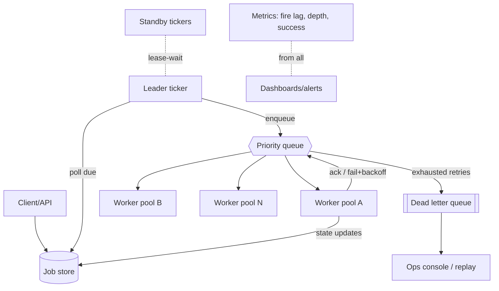

---

### Architectural Patterns

- **Competing consumers with visibility timeout**
  *Problem*: parallel execution without duplicates; crashed worker's task recovers. *How*: claim marks invisible N seconds; ack deletes/reports; timeout elapsing re-delivers. *When*: default queue semantics. *Not when*: tasks longer than sane visibility windows without heartbeats (renew leases instead).

- **Leader election + fencing tokens**
  *What*: one ticker active; etcd/ZK session or DB lease decides leadership; actions carry epoch/fencing numbers so a zombie old leader's writes get rejected post-failover. *Solves*: split-brain double-firing. *Critical detail*: fencing at the *store*, not just election — election alone is insufficient.

- **Materialized cron instances**
  *What*: recurring definition expands to concrete rows (next 100 runs or rolling window). *Pros*: due-scan stays simple equality/range query; timezone/DST resolved once at materialization. *Cons*: expansion bookkeeping; mitigated by lazy top-up during scans.

- **Exponential backoff with jitter + budgets**
  *Formula*: `delay = min(cap, base × 2^attempt) ± random jitter`; budget = total retry spend cap preventing infinite cost spirals. *Why jitter*: synchronized retries create periodic thundering herds against struggling dependencies.

- **`SKIP LOCKED` batch claiming** (Postgres-native)
  ```sql
  UPDATE jobs SET status='QUEUED', locked_by=$leader
  WHERE id IN (
    SELECT id FROM jobs
     WHERE status='PENDING' AND scheduled_at <= now()
     ORDER BY priority DESC, scheduled_at
     LIMIT 500
     FOR UPDATE SKIP LOCKED)
  RETURNING *;
  ```
  *Advantage*: no leader contention even multi-active; DB does serialization. Modern schedulers (e.g., db-scheduler, Graphile-worker style) run entirely on this.

- **DAG orchestration boundary**
  *What*: dependencies between jobs (run B after A succeeds) graduate the system toward workflow engines (Airflow/Temporal). Know when to stop: simple dependency graphs fit in-job-scheduler tables; complex branching/retries/humans-in-loop belong to workflow products.

---

### Benefits

- **Temporal decoupling** lets producers and consumers evolve independently — submission rate independent of processing capacity.
- **Reliable automation backbone**: retries + DLQs convert flaky operations into self-healing ones, cutting operational toil measurably.
- **Elastic throughput**: worker pools scale with queue depth; nightly batch storms don't require permanent capacity.
- **Uniform platform effects**: every team gets priorities, observability, and failure handling free instead of reinventing cron-on-a-box.
- **Auditability**: state-machine history answers "did this run? when? what failed?" — compliance-friendly by construction.

---

### Challenges

- **Technical**: clock skew between leader and store (use DB `now()` as authority); duplicate firing during failover races (fencing); long jobs outliving leases (heartbeat renewals + cancellation checks mid-run); exactly-once appearance via idempotency keys.
- **Scalability**: millions of pending futures (index bloat — partition by due-date buckets); scan hot-spotting at second boundaries; queue partition skew.
- **Performance**: fire-lag percentiles under burst submissions; store write amplification from status churn.
- **Reliability**: leader crash mid-batch (idempotent enqueue makes replays safe); queue data loss (durable persistence before acking producer); DLQ flooding masking fresh failures (alert thresholds per job-type).
- **Maintainability**: cron dialect sprawl across teams; payload schema evolution (versioned envelopes); deprecating zombie recurring jobs nobody admits owning.
- **Operational**: capacity planning for peak windows (e-commerce midnight sales); chaos drills killing leaders/workers verifying recovery SLOs; backlog burn-down playbooks after upstream incidents.
- **Security**: payload contents may carry secrets (encrypt at rest, redact logs); authz so tenants can't cancel each other's jobs; worker code supply-chain trust.

---

### Best Practices

- **Design every job idempotently** (dedupe keys inside payloads, upserts over inserts); treat re-execution as certainty, not anomaly.
- **Use DB time as single authority** for due-ness comparisons; node clocks only order local events.
- **Fence all mutations with leadership epochs** — election without fencing is theater.
- **Bound everything**: payload sizes, execution timeouts, retry counts, queue depths, DLQ retention. Unbounded anything becomes the incident.
- **Jitter all retries and scans**; synchronize nothing that can be staggered.
- **Heartbeat long jobs and check cancellation flags between steps** — responsiveness to cancellation is a feature users test.
- **Alert on fire-lag percentiles and DLQ growth**, not just failures — silent lateness erodes trust before anything "fails".
- **Partition job store by due-date windows**; archive completed states aggressively; keep hot indexes small.
- **Version payload schemas**; consumers reject unknown versions loudly rather than misinterpreting silently.
- **Rehearse failover quarterly**: kill leader under load; measure duplicate executions (should be zero post-fencing) and gap duration (lease TTL).
- **Rate-limit submissions per client/tenant** — a runaway client can flood the queue and starve everyone else.
- **Tag metrics by job type, priority tier, and namespace** — aggregate-only dashboards hide the noisy-neighbor story until it's too late.
- **Run synthetic canary jobs every second** — a simple end-to-end ping that asserts the full pipeline (submit → fire → execute → complete) in under budget.

---

### When to Use / When Not to Use

**Build/deploy when**: many services need delayed/recurring execution with reliability guarantees; bursty batch loads need elastic workers; cross-team standardization valuable.

**Skip/simplify when**: single app with modest needs — OS cron/Spring `@Scheduled` + DB locking suffices; complex workflow orchestration is the real requirement — adopt Temporal/Airflow directly; ultra-low-latency trading triggers — event loops, not schedulers.

Managed/build trade-offs: cloud schedulers (EventBridge Scheduler, Cloud Scheduler) remove ops but cap scale/customization; open-source (Quartz clustered, db-scheduler, Celery beat) balances; bespoke justified by unique fairness/multi-tenancy demands.

Decision inputs: job volumes, latency precision needs, payload complexity, team ops maturity, ecosystem alignment (JVM vs Python shops).

---

### Data Model and API

```mermaid
erDiagram
    NAMESPACE ||--o{ JOB_DEFINITION : owns
    JOB_DEFINITION ||--o{ JOB_RUN : produces
    JOB_DEFINITION }o--|| SCHEDULE_DEF : references
    JOB_RUN ||--o{ ATTEMPT : records
    JOB_RUN }o--o| DLQ_ENTRY : quarantined-as

    NAMESPACE {
        uuid id PK
        string name UK
        string owner_team
        jsonb quotas
    }
    SCHEDULE_DEF {
        uuid def_id FK
        string cron_expr
        string timezone
        enum missed_fire
        timestamptz next_run
    }
    JOB_DEFINITION {
        uuid id PK
        string ns_id FK
        string name
        enum kind ONE_TIME|RECURRING|DELAYED
        jsonb payload
        int priority
        int max_retries
        interval retry_backoff
        int timeout_seconds
        string idempotency_key UK
        enum state ENABLED|PAUSED|DELETED
    }
    JOB_RUN {
        uuid id PK
        uuid def_id FK
        bigint epoch
        timestamptz due_at
        timestamptz fired_at
        timestamptz started_at
        timestamptz completed_at
        enum status PENDING|QUEUED|RUNNING|COMPLETED|FAILED|CANCELLED
        string locked_by
        int attempt
        text last_error
    }
    ATTEMPT {
        uuid run_id FK,PK
        int attempt_no PK
        string worker_id
        text error
        int duration_ms
        timestamptz started_at
    }
    DLQ_ENTRY {
        uuid run_id PK
        string reason
        timestamptz quarantined_at
        jsonb snapshot
    }
```

Choices: separation of definition (what) from runs (when) keeps recurring logic clean; `(due_at)` index filtered by `status='PENDING'` (partial index — small and hot); `epoch` column enables fencing at row level; attempts append-only forming audit trail; idempotency unique constraint spans definition table giving client-retry safety. Partitioning: runs range-partitioned monthly by `due_at`; completed partitions archived to cold storage after 90 days.

**API Contract:**

| Method | Endpoint | Purpose | Rate Limit |
|---|---|---|---|
| POST | `/api/v1/jobs` | Submit a job | 1000 req/min per namespace |
| GET | `/api/v1/jobs/{jobId}` | Get job status + attempts | 3000 req/min |
| PUT | `/api/v1/jobs/{jobId}/cancel` | Cancel pending/running job | 100 req/min |
| POST | `/api/v1/jobs/{jobId}/retry` | Force retry a failed job | 100 req/min |
| GET | `/api/v1/schedules` | List cron/recurring schedules | 500 req/min |
| POST | `/api/v1/schedules` | Create/update a schedule | 100 req/min |
| GET | `/api/v1/dlq` | Dead-letter queue (failed jobs) | 500 req/min |
| POST | `/api/v1/dags` | Submit a DAG workflow | 100 req/min |

#### Submit Job

```http
POST /api/v1/jobs
Content-Type: application/json
Idempotency-Key: 97b8c302-...
Authorization: Bearer <jwt>

{
  "name": "send-daily-email",
  "type": "cron",
  "schedule": "0 9 * * *",
  "timezone": "Asia/Kolkata",
  "payload": { "template": "daily_digest", "userId": "u_123" },
  "maxRetries": 3,
  "retryPolicy": {
    "backoffType": "exponential",
    "initialDelaySeconds": 10,
    "jitter": true,
    "maxDelaySeconds": 600
  },
  "timeoutSeconds": 300,
  "priority": 10,
  "namespace": "notifications"
}
```

**Response** (HTTP 201):

```json
{
  "jobId": "job-a1b2c3",
  "status": "SCHEDULED",
  "nextFireAt": "2024-02-15T09:00:00+05:30",
  "createdAt": "2024-02-14T10:30:00Z"
}
```

#### Get Job Status

```http
GET /api/v1/jobs/job-a1b2c3
```

```json
{
  "jobId": "job-a1b2c3",
  "name": "send-daily-email",
  "status": "COMPLETED",
  "attempts": 1,
  "lastAttemptAt": "2024-02-14T09:00:05Z",
  "result": { "delivered": 98, "failed": 2 },
  "history": [
    { "attempt": 1, "status": "RUNNING", "startedAt": "2024-02-14T09:00:00Z" },
    { "attempt": 1, "status": "COMPLETED", "completedAt": "2024-02-14T09:00:05Z" }
  ]
}
```

#### Cancel Job

```http
PUT /api/v1/jobs/job-a1b2c3/cancel
Idempotency-Key: 8831f456-...

{ "jobId": "job-a1b2c3", "status": "CANCELLED", "cancelledAt": "2024-02-14T10:35:00Z" }
```

#### Submit DAG

```http
POST /api/v1/dags
Content-Type: application/json

{
  "name": "etl-pipeline",
  "nodes": [
    { "id": "extract", "job": { "name": "extract-data", "payload": {...} } },
    { "id": "transform", "job": { "name": "transform-data", "payload": {...} } },
    { "id": "load", "job": { "name": "load-data", "payload": {...} } }
  ],
  "edges": [
    { "from": "extract", "to": "transform" },
    { "from": "transform", "to": "load" }
  ]
}
```

**Status codes**: `201` — job created; `200` — successful read/update; `202` — cancel/retry accepted (async); `400` — invalid schedule expression, bad payload schema; `401` — unauthenticated; `403` — not authorized; `409` — job already exists (idempotency-key collision); `429` — rate limited; `503` — scheduler unavailable.

**Key contracts**: Idempotency — `POST /jobs` accepts `Idempotency-Key`; retries collapse to the same job. `PUT /cancel` is idempotent. At-least-once — if the scheduler crashes after writing the job but before ack, the client retries with the same idempotency-key and the store dedups. Retry policy — backoff type (exponential/linear), initial delay, jitter, and max delay are declared per job; dead-letter queue after `maxRetries`. Cron semantics — timezone-aware; DST edge cases handled (skip or repeat based on `missedFirePolicy`).

---

### Domain-Specific: Job Scheduling Architecture Deep Dive

This section is the technical heart of job-scheduling architecture: job taxonomy, scheduling algorithms, distributed locking, retry/dead-letter mechanics, worker pools, cron/queue semantics, and the concrete design trade-offs that make or break a scheduler at scale.

#### Architectural Style

**Leader-elected scheduler + worker fleet + durable job queue**: one scheduler instance (chosen via leader election) acts as the global coordinator that evaluates schedules, dispatches jobs, and manages the queue. Workers are stateless and pull jobs from the queue. The job state is persisted in a durable store (SQL/NoSQL) with visibility-timeout semantics for at-least-once delivery. For DAG orchestration, a separate DAG engine manages topological ordering and dependencies.

```mermaid
flowchart TB
    subgraph Schedulers
        LEADER[Active Scheduler<br/>(leader-elected)]
        FOLLOWER[Standby Scheduler]
    end
    LEADER -->|leader elect| STORE[(Job Store<br/>SQL/NoSQL)]
    FOLLOWER -- standby --> STORE
    STORE -->|pull jobs| W1[Worker 1]
    STORE -->|pull jobs| W2[Worker 2]
    STORE -->|pull jobs| W3[Worker 3]
    W1 -->|ack/done| STORE
    W2 -->|ack/done| STORE
    W3 -->|ack/done| STORE
    SCHED[Schedule DB<br/>cron/interval defs] --> LEADER
    ALERT[(Alerting/Monitoring)] <--> LEADER
```

#### Component Responsibilities and Communication

| Component | Responsibility | Communication |
|---|---|---|
| Active Scheduler | Evaluate schedules, dispatch jobs to queue | Reads from schedule DB; writes job state to store |
| Standby Scheduler | Leader-elected backup; takes over on failure | Watches consensus for leader change |
| Job Store | Durable job state (pending, running, done, failed) | SQL/NoSQL with visibility timeout; workers poll |
| Worker Fleet | Execute jobs, report completion, heartbeat | PULL from job store; ack on completion |
| Schedule Repository | Cron expressions, DAG definitions, dependencies | Config-driven; loaded by scheduler |
| Visibility Timeout Manager | Track in-flight jobs, requeue on timeout | Store with TTL; workers extend lease |
| Orchestrator (DAG) | Topological scheduling of dependent jobs | Reads DAG graph; triggers dependent jobs |

**Data flow**: schedule definitions → active scheduler evaluates fire-time → creates job in store (status=pending) → worker polls store (visibility-timeout) → picks up job → executes → acks (status=done/failed) → requeue on timeout. DAG engine monitors job completion and triggers dependents.

**Scaling strategy**: schedulers are leader-elected (one active); workers scale horizontally on job throughput; job store sharded by time-bucket or job-type for high throughput; visibility-timeout TTLs tuned per job class.

**Failure handling**: scheduler crash → standby takes over via leader election; worker crash mid-job → visibility timeout expires → job requeued for retry; store replication ensures durability; dead-letter queue for repeatedly failed jobs.

#### Job Types

A scheduler must support a taxonomy of job kinds, each with distinct lifecycle and delivery semantics:

- **One-time jobs** (`AT` semantics): fire exactly once at `scheduled_at`. Stored as a single row; no recurrence computation. Ideal for reminders, delayed notifications, SLA callbacks.
- **Delayed jobs** (`AFTER` semantics): fire once after a relative delay (`run_after = now + delay`). Common pattern: "retry this notification in 5 minutes if user is still cart-abandoning."
- **Recurring jobs** (`CRON` semantics): fire on a cron expression (e.g., `0 2 * * *` for daily at 2 AM). Each fire produces a concrete `JOB_RUN` row; the definition stays constant. Materialization strategy determines how far ahead runs are expanded (rolling window vs. pre-computed N).
- **Dependent DAGs**: jobs with directed edges (Task A → Task B → Task C). The scheduler tracks which upstream tasks have succeeded and only fires a task when all its predecessors report `COMPLETED`. Partial failures propagate: if A fails, B and C never fire; independent branches continue.

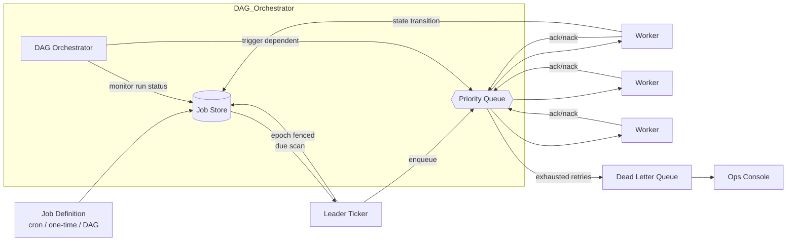

#### Scheduling Algorithms

The scheduler's ticking loop and dispatch strategy determine fire-accuracy, throughput, and fairness:

- **Time-wheel / hierarchical timer heap**: O(1) amortized insertion for short-delay jobs; O(log N) for long-delay. At scale, a two-level design (hot near-term wheel + cold DB-backed bucket) keeps memory bounded while preserving sub-second precision for imminent jobs.
- **Cron expression evaluator**: parse with a battle-tested library (cron-utils on JVM). Resolve timezone at materialization time, not evaluation time. Handle DST: spring-forward (nonexistent time → skip or shift to next valid); fall-back (ambiguous time → first occurrence convention). Store the resolved IANA zone per job definition.
- **Priority-based dispatch**: jobs carry a priority (0–100). The due-batch query sorts `ORDER BY priority DESC, scheduled_at ASC`. Starvation is prevented via aging: a job waiting > T (e.g., 5 min) gets its effective priority boosted by a fixed increment each sweep.
- **Rate-limited per-namespace dispatch**: high-volume tenants can flood the queue. The dispatcher enforces a per-namespace tokens-per-second cap (token bucket), spilling excess into a per-namespace backlog that drains at the configured rate.
- **Dependency-aware dispatch (DAG)**: when a job completes, the orchestrator looks up all dependent jobs, decrements their pending-parent counter, and enqueues any whose parents are all done. Implemented via a reverse-edge index (`job_id → [dependent_job_ids]`) materialized from the DAG definition.

```java
// Scheduling decision tree inside the leader ticker
public class ScheduleDispatchLogic {
    public List<DispatchedJob> dispatchDueBatch(int epoch, int limit) {
        // 1. Time-ordered, priority-weighted scan with SKIP LOCKED for concurrency safety
        var due = jobStore.findDueJobs(epoch, limit);
        // 2. For each, check dependency satisfaction
        return due.stream()
                .filter(j -> dependencyGraph.allParentsDone(j))
                .map(j -> {
                    queue.enqueue(j.priority(), j.dueAt(), j.runId());
                    jobStore.markQueued(j.runId(), epoch);
                    return j;
                })
                .toList();
    }
}
```

#### Distributed Locking for Jobs

The core correctness question: **how does the scheduler guarantee a job fires exactly once (no duplicate dispatch) even when multiple scheduler instances contend?**

Three mechanisms, layered:

1. **Claim atomicity via SQL** (`SKIP LOCKED`): the leader ticker runs `UPDATE ... WHERE id IN (SELECT ... FOR UPDATE SKIP LOCKED) RETURNING *`. Even if two leaders race, only one wins each row. No external lock needed. This is the foundation of single-fire.

2. **Epoch/fencing tokens at the store**: every store mutation carries `WHERE epoch = $current`. The leader's epoch is read from an etcd lease (or DB advisory lock). A stale/zombie leader whose epoch doesn't match is rejected. This prevents split-brain double-firing during failover.

3. **Visibility timeout on the queue**: once enqueued, the job is invisible to other workers for TTL seconds. A worker that crashes mid-execution has its claim auto-expire, and the queue redelivers. The worker must heartbeat to extend the lease for long jobs.

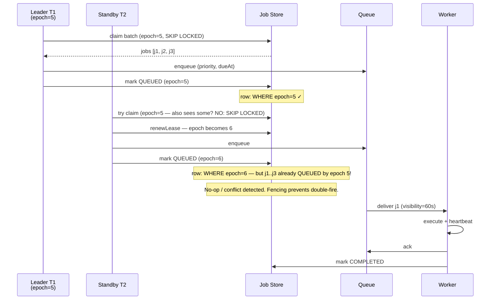

#### Retry Policies

Retry logic converts transient failures into eventual success while bounding cost:

- **Exponential backoff**: `delay_n = min(cap, base × 2^n)`. Base typically 10–30 s; cap typically 1 h.
- **Full jitter** (AWS-recommended): `delay = random(0, min(cap, base × 2^n))`. Breaks synchronization so cohorts don't retry in lockstep against a recovering dependency.
- **Retry budgets**: beyond a max-attempt count (e.g., 5), a job that has consumed more than `total_retry_seconds` (e.g., 3,600) is permanently quarantined. This prevents infinite retry spirals against permanently-down services.
- **Error classification**: `TransientException` (retry) vs. `PermanentError` (skip retries, go straight to DLQ). A 404 from a downstream API is permanent; a 503 is transient. Jobs can override classification via metadata.
- **Jittered requeue**: after a NACK, the worker computes the next delay and schedules a re-enqueue with `queue.nackWithDelay(handle, nextAttemptTime)`.

```
Job fails → Retry with jittered exponential backoff
  Attempt 1: immediate (delay = base ± jitter)
  Attempt 2: after ~base*2 seconds (± jitter)
  Attempt 3: after ~base*4 seconds
  Attempt N: after min(2^N * base, cap) seconds
  │
  ├── transient error?  → retry (if budget remains)
  ├── permanent error?  → DLQ immediately
  └── attempts exhausted → DLQ (alert operators)
```

#### Dead-Letter Queue (DLQ)

Jobs that exhaust retry budgets or throw permanent errors are routed to a DLQ:

- **Quarantine, don't block**: the DLQ is a separate queue; jobs in it do not block the main pipeline. Workers drain the main queue unaffected.
- **Retention + inspection**: DLQ entries are retained for 7–30 days. An ops console lists them with error context, attempt count, payload snapshot, and last-error stack trace.
- **Replay with edit**: operators can replay a DLQ'd job after fixing the root cause, optionally editing the payload (e.g., correcting a bad API key in the job envelope). Replay is a new `JOB_RUN` with a fresh idempotency key.
- **Alerting**: depth growth rate and error-type distribution are tracked. A sudden spike in DLQ inflow for a specific job type triggers a PagerDuty alert before the queue fills.

#### Worker Pools

Workers are stateless, horizontally scalable consumers of the job queue:

- **Competing consumers pattern**: N worker instances each pull from the queue. The queue's visibility timeout + ack ensures each job is processed by exactly one live worker at a time.
- **Concurrency per worker**: each worker process runs a configurable number of concurrent executors (e.g., 10 threads). Bounded to prevent overwhelming downstream dependencies. Concurrency is tuned per worker pool based on the downstream's capacity.
- **Heterogeneous worker pools**: different job types route to dedicated worker pools (e.g., `email-workers`, `report-workers`, `webhook-workers`). Each pool scales independently based on its queue's depth and oldest-unacked-age.
- **Autoscaling signal**: the canonical signal is **oldest-unclaimed-age** (the age of the oldest job in the PENDING queue), not raw depth (depth lies during poison floods). When oldest-unclaimed-age > threshold, scale up; when < threshold for a sustained period, scale down.
- **Graceful shutdown**: on SIGTERM, the worker stops pulling new jobs, finishes in-flight executions (or checkpoints them), extends leases where possible, and acks/fails before exit. This prevents work loss during rolling deployments.

#### Cron and Queue-Based Scheduling

- **Cron-based**: schedules defined as cron expressions (`0 9 * * MON-FRI`). The scheduler materializes concrete run instances ahead of time (rolling window of next 100 runs). Timezone stored per schedule; DST transitions resolved at materialization. Missed-fire policy configurable: `FIRE_NOW` (catch up), `SKIP` (skip missed), `SMART` (skip past, fire future).
- **Queue-based**: jobs are pushed to a priority queue keyed by `scheduled_at`. The scheduler's ticker polls for due jobs every `tick_interval` (e.g., 200 ms). Queue ordering ensures earlier-due jobs are dequeued first. This is the dominant pattern for modern schedulers (Kafka, SQS, Redis).
- **Hybrid**: long-term recurring jobs are cron-materialized; short-term/delayed one-time jobs are queue-inserted with an absolute `scheduled_at`. The queue handles both transparently since the sort key is time.

#### End-to-End Lifecycle


**Scaling**: store sharded by hash(jobId) with due-index per shard; multiple leaders partitioned by job-namespace (epoch fencing per partition); queue partitions aligned to worker pools; autoscaling on oldest-unclaimed-age rather than raw depth (depth lies during poison floods).

**Failure handling**: leader loss → lease expiry (≤15 s) → standby assumes with epoch+1; in-flight enqueues idempotent via (jobId, epoch) uniqueness; worker fleet loss → visibility timeouts re-deliver; store failover → RPO≈0 with synchronous replicas for this write-critical path.

#### Deep Dive: Fire-Accuracy Engineering

The leader ticker ticks at 200 ms cadence, claiming micro-batches (LIMIT 100–500) of due jobs. The queue enqueue is timestamped with `intended_due` vs `actual_enqueue` delta, exported as a histogram metric. Sub-second SLOs push toward in-memory priority heaps (timing wheels) with WAL persistence, trading implementation complexity for precision. Regression in the p99 of fire-lag catches GC pauses, deployment stalls, and clock issues before users do.

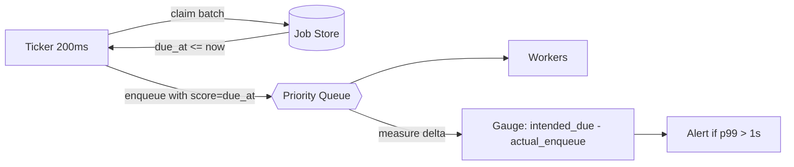

#### Deep Dive: Cron Correctness

Use battle-tested parsers (cron-utils on JVM). Store IANA tz per job. DST-spring-forward nonexistent times policy documented (skip vs next-valid). Fall-back ambiguity resolved by first-occurrence convention. Missed-fire policy configurable (fire-immediately vs skip-to-next). Tests pinned to historical transition instants with fixed clocks.

```java
// Cron materialization with timezone awareness
public class CronMaterializer {
    public Instant nextFire(Instant from, Cron cron, ZoneId zone) {
        ZonedDateTime zoned = from.atZone(zone);
        ZonedDateTime next = cron.trigger(zoned).nextExecution();
        return next.toInstant(); // resolves DST gaps/overlaps per policy
    }
}
```

#### Deep Dive: Fencing Mechanics

The leader reads epoch from an etcd lease. Every store mutation includes `WHERE epoch = $current`. The store rejects stale epochs. Combined with idempotent enqueue keys, failover races resolve deterministically regardless of timing pathology. Election alone is insufficient — fencing must happen at the store.

#### Deep Dive: Backpressure and Worker Autoscaling

Workers advertise slot availability; the queue exposes oldest-message age; the scheduler throttles *new* materialization when either saturates — protecting the system from death-by-submission during downstream brownouts. Rate-limited release (token bucket per downstream), priority reshuffling (fresh business-critical ahead of stale batch), and expiry policy for stale jobs (skip-with-log vs execute-stale) are all configurable.

#### Deep Dive: Observability (Golden Signals)

Golden signals per job-class: submission rate, fire lag p50/p99/p999, success ratio, retry distribution, DLQ inflow. Synthetic canary jobs every second asserting end-to-end health. Trace propagation from submission through execution for cross-service attribution.

---

### Replication Strategies

A distributed job scheduler replicates data across two axes: **(1) the job store** (metadata + state machine) for durability and fast failover, and **(2) the priority queue** (in-flight work buffer) for delivery guarantees and availability.

#### Job Store Replication

**Leader-based replication (PostgreSQL with synchronous replicas):** Job definitions and run state are written to a primary leader. Each write is synchronously replicated to at least one standby before ack (`synchronous_commit = on`). This guarantees RPO=0 for the critical write path — a job marked QUEUED by the leader is durably recorded.

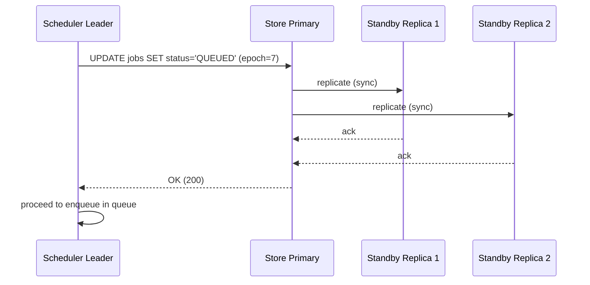

*Leader-based synchronous replication for the job store: the scheduler leader writes state transitions to the primary, which waits for synchronous acknowledgment from standbys before returning OK. This ensures zero data loss on the critical path (job status transitions), at the cost of write latency.*

**Quorum-based replication (Cassandra):** For write-heavy workloads with millions of concurrent status updates, Cassandra's tunable consistency (`QUORUM` writes) distributes replicas by consistent hash ring. A write succeeds when a majority of replicas ack. This trades single-digit-ms write latency for eventual consistency during partitions.

**Cross-region replication:** Job store is synchronously replicated within a region and asynchronously across regions. Cross-region async lag is typically 1–5 s. If a region fails, the standby region's scheduler takes over with its local (eventually-consistent) copy. Stale jobs from the failed region are reconciled via a background catch-up process.

#### Queue Replication

**Managed queues (SQS, EventBridge Scheduler):** The cloud provider handles replication transparently. SQS queues are multi-AZ in a region; messages are durably stored with configurable durability. SQS FIFO queues provide ordering and exactly-once delivery (at cost of lower throughput).

**Redis Cluster:** Master/replica pairs with automatic failover (Redis Sentinel or Redis Cluster). Sorted-set members (job scores = due-time) replicate to replicas. In-flight visibility-timeout state lives in the master; a master failure triggers failover and in-flight jobs are re-delivered after their visibility timeout expires.

**Kafka:** Topic replication factor ≥ 3 with in-sync replicas (ISR). Partition-per-priority enables ordered delivery per partition. Consumer group rebalancing handles worker membership changes. Kafka's durability (configurable `retention.ms` and `log.segment.bytes`) makes it suitable as both queue and commit log.

#### Real-world use:
- **PostgreSQL synchronous standby replication** for job definitions and run state (status transitions are the critical write path).
- **Kafka with replication factor 3** for the priority queue — each priority level is a partition, consumer groups handle worker rebalancing.
- **Redis Cluster** for in-flight visibility timeout tracking (short-lived, high-churn data).

---

### Failure Detection and Membership

A job scheduler must detect when schedulers and workers fail, redistribute their responsibilities, and continue operating without duplicate execution or work loss.

#### Gossip-Based Membership (for Scheduler Cluster)

Scheduler instances use a gossip protocol (à la Consul / HashiCorp memberlist) to share health state. Each instance periodically pings a random subset of peers; membership changes propagate in O(log N) rounds. When a scheduler is suspected of failure, its lease expires and a standby takes over.

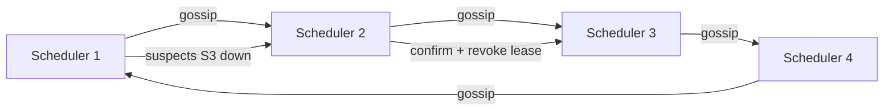

*Gossip-based failure detection in the scheduler cluster: nodes exchange health state with random peers. When S1 suspects S3 is down, it propagates the suspicion; once confirmed by quorum, S3's lease is revoked and its standby takes over.*

#### Heartbeat-Based Worker Liveness

Workers send a heartbeat (extend lease) every `heartbeat_interval` (e.g., 10 s). If the store doesn't see a heartbeat within `lease_ttl` (e.g., 30 s), the job is considered abandoned and re-queued. The visibility timeout serves as the failure-detection signal for workers — no separate health-check infrastructure is needed.

#### Health Checks

- **Liveness probes**: HTTP `/health/live` checked by Kubernetes every 5 s. A hung scheduler (deadlocked ticker) fails liveness and is restarted.
- **Readiness probes**: HTTP `/health/ready` checks that the scheduler can acquire its DB connection and the queue is reachable. Not-ready pods are removed from the load balancer; in-flight work is drained.
- **Business health checks**: "Kafka consumer lag < 1,000 messages", "job store latency < 50 ms", "leader lease is held". These are exposed as custom metrics and trigger alerts.

#### Failure Detection Timing for Job Scheduler

| Component | Check Interval | Timeout | Action |
|---|---|---|---|
| Scheduler leader lease | 5s | 15s | Standby takes over; epoch+1 |
| Worker heartbeat | 10s | 30s | Visibility timeout re-delivers job |
| Job store primary | 2s | 30s | Failover to standby; RPO≈0 with sync replicas |
| Queue (Kafka) | 10s | 30s | Consumer rebalancing; re-deliver uncommitted |
| DLQ monitor | 30s | 300s | Alert on depth growth / error-type spike |

#### Circuit Breakers

For downstream dependencies (email API, webhook target, database), a circuit breaker (Resilience4j) trips after N consecutive failures and stops sending requests for a cool-down period. During cool-down, the scheduler holds jobs destined for that dependency and retries via the normal backoff path once the breaker closes. This prevents cascading failures — e.g., if the email service is down, retry storms don't amplify the outage.

```java
// Circuit breaker around downstream calls inside job execution
@Service
public class ResilientJobHandler {
    private final CircuitBreaker emailCircuitBreaker =
        CircuitBreaker.ofDefaults("email-service");

    public void execute(JobPayload payload) {
        CircuitBreaker.decorateRunnable(emailCircuitBreaker,
            () -> callDownstream(payload));
    }
}
```

#### Lease-Based Failover (no external coordination server needed)

```java
@Component
public class LeaseLeadership {

    private final JdbcTemplate jdbc;

    @Value("${scheduler.lease.ttl-seconds:15}")
    private int ttlSeconds;

    @Scheduled(fixedDelay = 5_000)
    public void renewOrAcquire() {
        int updated = jdbc.update("""
            UPDATE leader_lease SET holder=?, expires_at=now() + interval '%s seconds'
            WHERE name='ticker' AND (holder=? OR expires_at < now())
            """.formatted(ttlSeconds), instanceId(), instanceId());
        boolean leader = updated > 0;
        LeadershipState.setLeader(leader);
        if (leader) ticker.runDueScan();   // only the leader fires jobs
    }
}
```

*The `LeaseLeadership` bean uses a Postgres advisory lease (no ZooKeeper/etcd dependency at smaller scales). Every 5 s, the scheduler attempts to update the `leader_lease` row for `name='ticker'`. The `WHERE` clause matches either its own instance ID or an expired lease. A successful UPDATE means this instance is now the leader; it runs the due-scan. A failed UPDATE means another instance holds the lease; this instance stays in standby.*

---

### High Availability and Scalability

A production job scheduler must survive scheduler, worker, store, and queue failures — and scale to millions of pending jobs — without data loss or extended downtime.

#### Multi-Region Deployment

Deploy active schedulers in at least 3 regions (e.g., us-east, eu-west, ap-southeast). Each region runs its own scheduler leader, job store (read replica of the primary), and worker pool. Users are routed to the nearest region via GeoDNS or latency-based load balancing. Cross-region replication is asynchronous (typical lag 1–5 s). If a region fails, traffic fails over to the next-nearest region; its scheduler picks up where the failed region left off (jobs due in the gap are fire-immediately per missed-fire policy).

```mermaid
graph TD
    C[Client] --> LB[Global Load Balancer]
    LB -->|nearest| R1[Region 1]
    LB -->|fallback| R2[Region 2]
    R1 -->|async| R2
    R1 --> API1[API Gateway]
    R1 --> FB1[Scheduler Leader]
    R1 --> Q1[Queue]
    R1 --> W1[Workers]
    R1 --> DB1[(Job Store Primary)]
    R2 --> API2[API Gateway]
    R2 --> FB2[Scheduler Standby]
    R2 --> Q2[Queue]
    R2 --> W2[Workers]
    R2 --> DB2[(Job Store Replica]
    DB1 -->|sync replica| DB2
    subgraph Region 1
        API1
        FB1
        Q1
        W1
        DB1
    end
    subgraph Region 2
        API2
        FB2
        Q2
        W2
        DB2
    end
```

*Multi-region HA: a global load balancer routes clients to the nearest active region. Each region is self-sufficient with its own API gateway, scheduler leader, queue, and workers. The job store primary in Region 1 synchronously replicates to standby. Cross-region replication is async. If Region 1 fails, the load balancer fails over to Region 2, whose standby scheduler takes leadership.*

#### Auto-Scaling

| Component | Scale Metric | Mechanism |
|---|---|---|
| Scheduler | Number of jobs / namespaces | Add standby scheduler instances; leadership partitions by namespace range |
| Queue (Kafka) | Throughput (msgs/sec) | Add partitions; each partition served by one consumer |
| Worker pools | Oldest-unacked-age, queue depth | Kubernetes HPA on custom metric; max N per namespace |
| Job store | Write throughput | Shard by `hash(job_id)`; 16+ shards for millions of jobs |

#### Graceful Degradation

When a component fails, the system degrades rather than crashing:

- **Queue down**: the API service rejects `POST /jobs` with 503 (queued-for-retry). Existing in-flight jobs continue on workers that already have them. No new dispatches.
- **Worker fleet partially down**: remaining workers handle the load; visibility timeouts re-deliver jobs from dead workers after TTL. Autoscaling triggers to replace capacity.
- **Job store slow**: the scheduler's due-scan query has a deadline; if it doesn't complete in time, the scan is aborted and retried next tick (job is simply delayed by one tick, not lost).
- **Downstream dependency down**: circuit breaker holds jobs for that dependency; retries proceed with backoff; no thundering herd.

#### Scaling Strategy

- **Job store**: sharded by `hash(job_id) % N` with 16+ shards. Each shard owns a range of due-indexes. Hot time windows (next hour) are additionally cached in Redis for sub-millisecond due-scans.
- **Queue**: Kafka topic with 64+ partitions per priority level. Consumer groups rebalance as workers join/leave. Partition key = `hash(job_id)` ensures ordering per job.
- **Scheduler leader**: for >1M jobs/scan, the leader is partitioned by namespace range — each partition has its own leader with its own epoch fence. This avoids a single leader being the bottleneck.
- **Workers**: horizontally scaled by namespace/priority. Each worker pool is dedicated to a class of jobs (email, reports, webhooks) and autoscales on oldest-unacked-age.

#### Failure Domains

Jobs are isolated by namespace and priority tier. A failure in the `notifications` namespace (e.g., email API down) does not affect `billing` namespace jobs. Queue partitions are isolated — a hot partition doesn't throttle other partitions. Multi-region deployment ensures no single AZ/region is a failure domain for the entire system.

---

### Performance and Optimization

Performance in a job scheduler is measured by **fire-lag** (time between `scheduled_at` and actual execution start), **throughput** (jobs/sec dispatched and executed), and **store write efficiency**.

#### Latency Optimization (Fire-Accuracy)

- **Tick cadence**: the leader ticker polls the store every 200 ms (configurable). Sub-200-ms ticks risk store saturation; coarser ticks increase fire-lag. A two-tier approach: DB-backed scan at 200 ms for the hot window, in-memory timing wheel for the next 60 s.
- **Micro-batching**: each due-scan claims a batch of up to 500 jobs in a single `UPDATE ... SKIP LOCKED`. This amortizes DB round-trips. The batch size is tuned: larger batches reduce per-job overhead but increase fire-lag variance for high-priority jobs.
- **Priority interleaving**: the due-scan sorts by `priority DESC, scheduled_at ASC`. To prevent low-priority starvation, aging boosts effective priority after a wait threshold (e.g., +5 every 2 min).
- **Cold-to-hot handoff**: jobs due >60 s out live in the cold store (DB); a background sweeper moves them to the hot queue (Redis ZSET) as their due time approaches within 60 s. Only the hot tier needs sub-second precision.

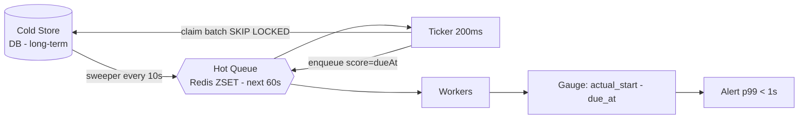

*Cold-to-hot handoff for fire-accuracy: long-term scheduled jobs live in the DB; a background sweeper moves jobs approaching their due time into a Redis sorted-set. The ticker polls the hot tier at 200 ms cadence for sub-second accuracy. The gap between `due_at` and `actual_start` is measured as a gauge metric; p99 must stay under 1 s.*

#### Throughput Optimization

- **Batch dispatch**: the `UPDATE ... RETURNING` claim returns up to 500 rows in one round-trip; the enqueue to Kafka/Redis is pipelined/batched (100 per pipeline).
- **Write coalescing**: status transitions (PENDING→QUEUED→RUNNING→COMPLETED) are batched per worker — the worker accumulates completions and flushes every N seconds or N completions, reducing store write amplification.
- **Read replicas**: worker reads of job definitions (payloads) are served from a read-replica pool; the leader handles only writes (status transitions + claims).
- **Pipeline parallelism**: within a dispatcher, the due-scan, enqueue, and status-update phases overlap using an async pipeline (CompletableFuture chain), so the next batch is scanning while the previous batch is being enqueued.

#### Caching Strategies

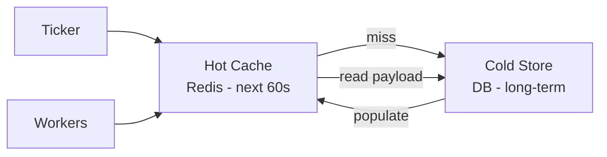

*Multi-tier caching: the hot cache (Redis ZSET) holds jobs due within the next 60 seconds for low-latency dispatch. Worker payload reads check the hot cache first, falling back to the cold DB store on miss. The ticker populates the hot tier from the cold store as jobs approach their due window.*

- **Hot cache**: Redis ZSET of `(due_at, job_id)` for the next 60-second window. O(log N) ZPOPMIN to claim the earliest due batch.
- **Definition cache**: job definitions (payload, retry policy) cached in Redis with TTL=60s. Workers read from cache; cache miss hits the store. Eviction is LRU.
- **Negative caching**: jobs that completed successfully within the last 10 minutes are cached as "known completed" to short-circuit duplicate submission checks on retry.

#### Store Write Optimization

- **Partitioning**: jobs table range-partitioned by `due_at` (monthly partitions). Completed partitions are moved to cheaper storage after 30 days.
- **Partial indexes**: `CREATE INDEX ON jobs (scheduled_at, priority) WHERE status='PENDING'` — this index is small (only pending rows) and hot (scanned every tick).
- **Append-only attempts**: each retry attempt is an insert into a separate `attempts` table, not an update to the jobs table. This avoids row-level contention on the jobs row during retries.

---

### CAP Theorem and Consistency Trade-offs

The CAP theorem states that during a network partition, a distributed system can provide at most two of: Consistency, Availability, and Partition tolerance. Since job schedulers operate over unreliable networks, partition tolerance is always required. Each component makes its own CAP trade-off.

#### Job Store — CP (Consistency + Partition Tolerance)

Job definitions and state transitions require strong consistency. If the API returns `201 Created` for a job submission, the job must be durably recorded — a client retry with the same idempotency key must collapse to the same job, not create a duplicate. The job store uses leader-based replication with synchronous acknowledgment from at least one standby (`synchronous_commit = on` in PostgreSQL, or `QUORUM` writes in Cassandra). During a partition, writes to the minority side fail (return errors) rather than create divergent state — this is the correct choice for correctness-critical metadata.

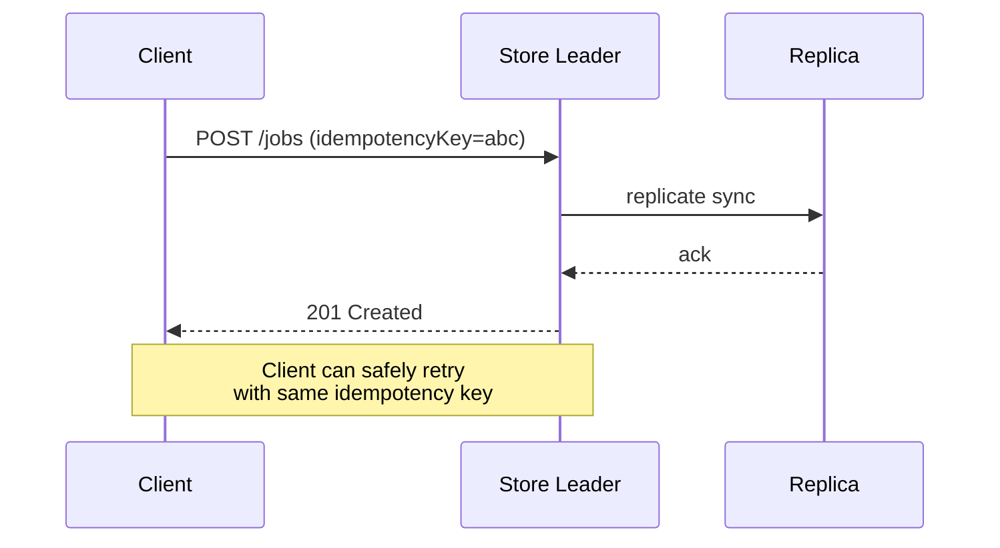

#### Queue — AP (Availability + Partition Tolerance)

The priority queue prioritizes availability: if a queue shard is unavailable, jobs are still accepted (buffered in the API service or a local WAL) and delivered once the queue recovers. Feed entries (queued jobs) may be briefly stale or re-delivered (at-least-once delivery semantics), which is acceptable because the worker is idempotent. The queue does not sacrifice availability for consistency — a brief duplicate delivery is handled by idempotent job execution, not by blocking the pipeline.

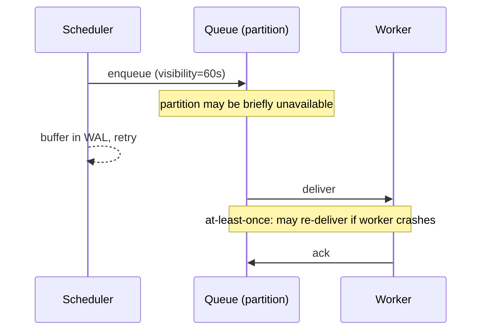

#### Dead Letter Queue — AP

The DLQ is availability-first: quarantined jobs are durably stored but the system continues processing the main queue. DLQ depth and error-type distribution are monitored asynchronously. A DLQ partition failure doesn't block the main pipeline.

#### DAG Engine — CP for state, AP for dispatch

DAG job state (which nodes completed) requires consistency — partial completion must be reconciled correctly. But DAG dispatch events (triggering a dependent job) can tolerate brief duplication, since the dependent job's execution is idempotent.

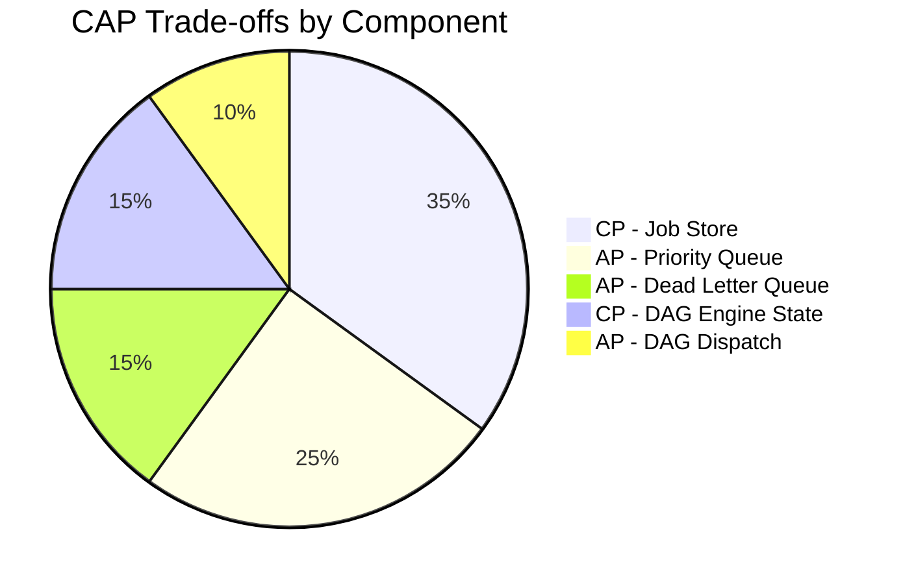

*The CAP trade-offs are split by component: the Job Store and DAG state are CP (consistency-critical), while the priority queue, dead-letter queue, and DAG dispatch are AP (availability-critical, with idempotency covering duplicates).*

**Interview question:** *Is a job scheduler strongly consistent or eventually consistent?*
**Answer:** It's a **nuanced split** — the job store (definitions, state transitions) is strongly consistent (CP) because a duplicate or lost state transition breaks correctness. The queue (job delivery) is eventually consistent (AP) because at-least-once delivery + idempotent workers yields effectively-once execution. This is the key insight interviewers look for: you don't get to pick one consistency model for the whole system.

---

### Encryption and Key Management

A job scheduler stores potentially sensitive data: job payloads (which may contain API keys, PII, or internal endpoints), worker credentials, and audit logs. Encryption must protect data at rest, in transit, and during processing.

#### Encryption at Rest

- **Job store**: PostgreSQL TDE (Transparent Data Encryption) or AWS RDS encryption. For PII-heavy payloads, application-level encryption with per-namespace DEKs (Data Encryption Keys).
- **Queue**: Redis encryption-at-rest (Redis Enterprise) or disk-level encryption; Kafka SSL with encrypted logs.
- **DLQ payloads**: DLQ snapshots are encrypted with a dedicated key; access requires multi-party approval (break-glass procedure).

#### Encryption in Transit

All client-to-server and server-to-server traffic uses TLS 1.3 (minimum TLS 1.2). Inter-service communication (scheduler ↔ store, scheduler ↔ queue, worker ↔ queue) uses mTLS (mutual TLS) for service-to-service authentication. Certificate rotation is automated via cert-manager.

#### Key Hierarchy

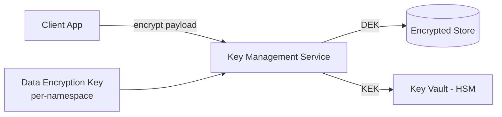

*Encryption key hierarchy: a KEK (Key Encryption Key) in an HSM-backed key vault encrypts per-namespace DEKs. Rotating the KEK requires only re-encrypting the DEKs, not the data itself. The KMS wraps/unwraps DEKs on demand; the application never handles the KEK directly.*

- **Key hierarchy**: A KEK in an HSM encrypts per-namespace or per-tenant DEKs. Rotating the KEK requires re-encrypting only the DEKs, not the data.
- **Key rotation**: KEKs rotated every 90 days; per-namespace DEKs rotated every 30 days; E2E-encrypted payloads are never rotated by the server.
- **Multi-region KMS**: Keys available in all regions. Cloud KMS services replicate automatically; on-prem uses HashiCorp Vault with integrated storage.

#### Java Example — Payload Encryption Service

```java
@Service
@RequiredArgsConstructor
public class JobPayloadEncryptionService {

    @Value("${app.encryption.kms-key-id}")
    private String keyId;

    private final AwsKms kmsClient;

    /**
     * Encrypts a job payload with a per-namespace DEK fetched from KMS.
     * The encrypted DEK is stored alongside the ciphertext.
     */
    public EncryptedPayload encrypt(String namespace, byte[] plaintext) {
        var dek = kmsClient.generateDataKey(keyId); // returns plaintext + ciphertext DEK
        var cipher = Cipher.getInstance("AES/GCM/NoPadding");
        cipher.init(Cipher.ENCRYPT_MODE,
                new SecretKeySpec(dek.plaintext(), "AES"),
                new GCMParameterSpec(128, dek.iv()));
        var ciphertext = cipher.doFinal(plaintext);
        return new EncryptedPayload(ciphertext, dek.encryptedKey(), dek.iv(), namespace);
    }

    public byte[] decrypt(EncryptedPayload encrypted) {
        var dek = kmsClient.decrypt(encrypted.encryptedKey());
        var cipher = Cipher.getInstance("AES/GCM/NoPadding");
        cipher.init(Cipher.DECRYPT_MODE,
                new SecretKeySpec(dek.plaintext(), "AES"),
                new GCMParameterSpec(128, dek.iv()));
        return cipher.doFinal(encrypted.ciphertext());
    }

    public record EncryptedPayload(byte[] ciphertext, byte[] encryptedKey,
                                   byte[] iv, String namespace) {}
}
```

*The `JobPayloadEncryptionService` bean generates a per-namespace DEK via AWS KMS, encrypts the payload with AES-GCM (confidentiality + integrity via the authentication tag), and stores the encrypted DEK alongside the ciphertext. The KMS key ID is injected via `@Value`. Decryption wraps the DEK via KMS `decrypt`. This is envelope encryption — the application never handles the master KEK.*

---

### Authentication and Authorization

A distributed job scheduler must verify who is connecting (authentication), determine what they can do (authorization), and enforce namespace/isolation so tenants cannot cancel or inspect each other's jobs. Every request to every service must carry authenticated credentials.

#### Authentication Methods

- **OAuth 2.0 + JWT**: Users authenticate via a third-party provider (Google, Okta) or service account. The Auth Service issues a short-lived JWT (15 min) and a refresh token (7 days). The JWT contains the user ID, scopes, namespace, and expiry.
- **Service-to-service (mTLS)**: For internal services calling the scheduler API, mutual TLS certificates issued by a private CA. No shared secrets. The `client_certificate.cn` maps to a service identity with pre-assigned scopes.
- **API keys with HMAC**: For non-interactive clients (CI/CD pipelines scheduling cron jobs), an API key is issued per namespace. Requests are signed with HMAC-SHA256 over the request body using the key secret. This is stateless, revocable, and works without an auth round-trip.
- **MFA**: Required for human operators performing destructive actions (cancel running jobs, replay DLQ, change retry budgets).

#### Authorization Models

- **Scope-based (OAuth 2.0 scopes)**: Each token carries scopes like `jobs:submit`, `jobs:cancel`, `jobs:read`, `schedules:manage`, `dlq:replay`. The API Gateway enforces scope checks before routing.
- **Namespace isolation (RBAC)**: Each job belongs to a namespace (e.g., `billing`, `notifications`, `infra`). A user/service with `namespace=notifications` scope can only submit, cancel, and query jobs in that namespace. Cross-namespace access requires explicit `admin` scope.
- **Resource-level permissions**: Within a namespace, jobs can be tagged with labels (`env=prod`, `team=payments`). Cancel/retry actions require the `jobs:cancel` scope AND a matching label selector. This lets a platform team manage only their own jobs.
- **DLQ access control**: Replaying from the dead-letter queue requires `dlq:replay` scope — a stricter permission than normal job submission. Only on-call engineers and designated operators have this scope.

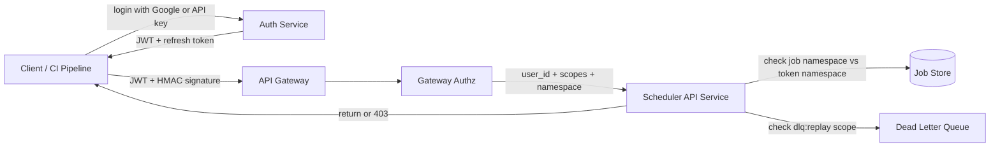

*Authentication and authorization flow: the client authenticates via the Auth Service (Google SSO for humans, API keys for services) and receives a JWT with scopes and namespace. The API Gateway validates the JWT signature and enforces scope checks. The Scheduler API Service performs resource-level authorization: job namespace must match the token's namespace, and DLQ replay requires an additional scope. Unauthorized actions receive 403.*

#### Java Example — JWT Validation Filter

```java
@Component
@RequiredArgsConstructor
public class JwtAuthenticationFilter implements Filter {

    @Value("${app.auth.jwt-public-key-uri}")
    private String jwksUri;

    private final UserDetailsService userDetailsService;

    @Override
    public void doFilter(ServletRequest request, ServletResponse response,
                         FilterChain chain) throws IOException, ServletException {
        var token = extractToken((HttpServletRequest) request);
        if (token != null && JwtUtils.isValidSignature(token, jwksUri)) {
            var claims = JwtUtils.parseClaims(token);
            var userId = claims.getSubject();
            var namespace = claims.get("namespace", String.class);
            var scopes = claims.get("scope", String.class).split(" ");
            var userDetails = userDetailsService.loadUserById(userId, namespace, scopes);
            var auth = new UsernamePasswordAuthenticationToken(
                    userDetails, null, userDetails.getAuthorities());
            SecurityContextHolder.getContext().setAuthentication(auth);
        }
        chain.doFilter(request, response);
    }

    private String extractToken(HttpServletRequest request) {
        var header = request.getHeader("Authorization");
        if (header != null && header.startsWith("Bearer ")) {
            return header.substring(7);
        }
        return null;
    }
}
```

*The `JwtAuthenticationFilter` bean intercepts every HTTP request. It extracts the bearer token from the `Authorization` header, validates the JWT signature against the JWKS URI (injected via `@Value`), and extracts claims (user ID, namespace, scopes). It loads the `UserDetails` with the appropriate authorities and sets the Spring Security context. Requests without a valid token proceed unauthenticated — subsequent `@PreAuthorize` annotations return 401.*

#### Java Example — Namespace-Level Authorization

```java
@Service
@RequiredArgsConstructor
public class JobAuthorizationService {

    /**
     * Checks if the authenticated user/service can access a job.
     * Enforces namespace isolation: a token scoped to namespace "billing"
     * cannot read or cancel jobs in namespace "notifications".
     */
    @Transactional(readOnly = true)
    public void checkJobAccess(String jobId, Authentication auth,
                               String requiredScope) {
        var namespace = jobRepository.findNamespaceByJobId(jobId);
        var userNamespace = getUserNamespace(auth);

        if (!namespace.equals(userNamespace) && !hasScope(auth, "admin")) {
            throw new AccessDeniedException(
                "Access denied to job " + jobId + " in namespace " + namespace);
        }

        if (!hasScope(auth, requiredScope) && !hasScope(auth, "admin")) {
            throw new AccessDeniedException(
                "Missing scope " + requiredScope + " for job " + jobId);
        }
    }

    private String getUserNamespace(Authentication auth) {
        var details = (UserDetails) auth.getPrincipal();
        return details.getNamespace(); // injected from JWT claim
    }

    private boolean hasScope(Authentication auth, String scope) {
        return auth.getAuthorities().stream()
                .anyMatch(a -> a.getAuthority().equals(scope));
    }
}
```

*The `JobAuthorizationService` bean enforces namespace isolation and scope-based access control. Before any job mutation (cancel, retry, replay), it looks up the job's namespace from the store and compares it against the authenticated principal's namespace (extracted from the JWT). Admin scope bypasses namespace checks. The method also verifies the required scope for the action (e.g., `jobs:cancel` for cancellation, `dlq:replay` for DLQ replay).*

---

### Security Threats and Mitigations

#### Threat: Job Payload Injection / Payload Poisoning

- **Risk:** A malicious or buggy client submits a job with a payload containing code injection vectors (e.g., shell commands, SQL in fields meant for command execution). The worker executes it and the scheduler is compromised.
- **Mitigation:** Workers run payloads in a sandboxed execution environment (gVisor, seccomp, or separate containers). The scheduler validates payload schemas against a strict JSON Schema before accepting. Payloads are never interpreted as code — workers receive typed commands via a handler registry, not raw shell strings.

#### Threat: Scheduler Takeover (Split-Brain Double-Fire)

- **Risk:** During a network partition, two scheduler instances both believe they are the leader and fire the same job twice, causing duplicate execution.
- **Mitigation:** Fencing tokens at the store level — every mutation carries `WHERE epoch = $current`. A stale leader whose epoch doesn't match gets its writes rejected. Combined with idempotent enqueue keys (`UNIQUE(job_id, epoch)`), the second leader's enqueue is a no-op. Lease-based leadership with short TTL (15 s) minimizes the window.

#### Threat: Tenant Data Leakage / Noisy Neighbor Job Spam

- **Risk:** A compromised client in tenant A floods the queue with millions of low-priority jobs, starving tenant B's high-priority jobs. Or a client reads another tenant's job payloads.
- **Mitigation:** Per-namespace rate limiting (token bucket: 1000 submits/min per namespace). Per-namespace queue quotas (max 10K pending jobs per namespace without approval). Namespace isolation in the store (`WHERE namespace = $current_user_namespace`). API responses filter out fields the caller isn't authorized to see.

#### Threat: Worker Credential Compromise

- **Risk:** A worker container is compromised; the attacker uses the worker's credentials to read job payloads, exfiltrate data, or cancel other tenants' jobs.
- **Mitigation:** Workers use short-lived, scope-limited credentials (OAuth 2.0 token exchange, 10-min TTL). The worker IAM role can only read from the queue and write status to the job store — no delete, no cross-namespace access, no DDL. Credentials are injected at runtime via a secrets manager (Vault, AWS Secrets Manager), not baked into images.

#### Threat: Replay / Job Replay Poisoning

- **Risk:** An attacker intercepts a legitimate job submission and replays it, causing duplicate work (e.g., sending duplicate payment emails).
- **Mitigation:** All job submissions require an `Idempotency-Key` header (UUIDv7). The store enforces a unique constraint on `(namespace, idempotency_key)`. Duplicate submissions collapse to a single job. For replay from DLQ, the operator must have `dlq:replay` scope, and the replay generates a new run ID while preserving the original idempotency key for audit.

#### Threat: Cron Storm (Thundering Herd)

- **Risk:** A recurring cron job scheduled for "every minute" fires 1M times simultaneously, overwhelming downstream dependencies.
- **Mitigation:** Jittered start times — the scheduler adds ±5 s of jitter to each recurring fire. Rate-limited dispatch (token bucket per downstream). Circuit breakers on downstream dependencies that trip if error rate exceeds threshold.

```mermaid
graph LR
    Attacker[Attacker / Compromised Client] -->|submit payloads| API[Scheduler API]
    API --> RL[Rate Limiter<br/>per namespace]
    RL -->|exceeds quota| Block[Reject 429]
    RL --> JS[Job Store<br/>namespace-isolated]
    JS --> W[Workers<br/>sandbox + short-lived creds]
    W --> DS[Downstream<br/>circuit breaker]
    DS -->|too many errors| CB[Open Circuit]
    CB --> W
    Note over RL,Block: stops job spam
```

---

### Observability and Logging

Job schedulers are critical infrastructure — when they fail, downstream jobs silently stop. Observability must cover the scheduler's own health (cluster membership, queue backpressure, dispatch latency) and the jobs it orchestrates (per-job success/failure/retry metrics, execution duration, queue wait time, DLQ growth).

**Metrics:**

| Category | Metric | SLA / Threshold |
|---|---|---|
| Scheduler health | Leader election time | < 5 s |
| Scheduler health | Queue dispatch latency (p99) | < 100 ms |
| Scheduler health | Partition rebalance time | < 30 s |
| Queue | Queue depth per topic | < 10K (alert at 5K) |
| Queue | Enqueue rate (events/sec) | Monitored for capacity planning |
| Jobs | Job success rate | > 99.9% |
| Jobs | Job execution latency p95 | < SLA per job type |
| Jobs | Retry rate (1st vs. max retries) | Track retry storms |
| Jobs | DLQ size growth rate | Alert at 10/min sustained |
| Jobs | Worker utilization | 60–80% (over/under provisioned) |

**Structured logging:** Every scheduler and worker event is logged as JSON with a `traceId` correlating to the job run.

- **Scheduler events**: `leader_elected`, `partition_rebalanced`, `dispatch_attempt`, `dispatch_success`, `dispatch_failure`, `rate_limited_drop`, `circuit_breaker_open`.
- **Job lifecycle events**: `job_queued`, `job_dispatched`, `job_started`, `job_completed`, `job_failed`, `job_retried`, `job_dlq_enqueued`, `job_dlq_requeued`. Each includes `namespace`, `jobType`, `workerRegion`, `payloadSize`, `executionTimeMs`, `errorCode`.
- **Worker events**: `worker_heartbeat`, `worker_shutdown`, `worker_crash`, `sandbox_violation`, `payload_rejected`.

**Distributed tracing:** Each job run is traced end-to-end: API Gateway → Scheduler dispatch → Worker → downstream services. The `JobTraceContext` (traceId, spanId) is injected into the job payload, propagated through the worker's HTTP/gRPC calls to downstream services, and logged. Tracing identifies slow downstream dependencies, retry amplification, and the exact point of failure in the job chain.

**Alerting strategy:**
- **Critical alert**: Leader election > 3 times in 5 min (scheduler instability).
- **Critical alert**: DLQ growth rate > 10/min sustained for 2 min.
- **Critical alert**: Worker crash rate > 5% in 5 min.
- **Warning**: Queue depth > 50% capacity for 5 min.
- **Warning**: Circuit breaker open on 3+ downstream services.
- **SLO alert**: Job execution p95 > SLA (latency budget burn).
- **Daily**: Retry storm detection — same job retried > 100 times.

---

### Real-World Implementations

- **Netflix Conductor**: Orchastration engine; JSON-based workflow DSL; handles 100M+ workflows/month; built-in retries, pauses, escalations.
- **Temporal**: Workflow-as-code (Go/Java/TS); strong durability; 100M+ workflow tasks/day.
- **Cadence** (Uber → Meta): Predecessor to Temporal; handles 1M+ workflows at Meta.
- **Apache Airflow**: DAG-based batch workflow; Python-n; popular for ETL.
- **Kubernetes CronJob**: Schedules K8s Jobs on cron; integrates with K8s ecosystem.
- **Amazon EventBridge / Scheduler**: Managed event bus; cron-like scheduling; AWS service integration.
- **Google Cloud Scheduler**: Fully managed cron; triggers Cloud Functions, Pub/Sub, HTTP.

| Platform | Workflow Engine | Multi-region | Key Feature |
|---|---|---|---|
| Netflix Conductor | Orchestration | Yes | JSON workflow DSL |
| Temporal | Orchestration | Yes | Code-based workflows |
| Cadence | Orchestration | Yes | Uber-scale, task-list routing |
| Airflow | DAG | No | ETL, Python-native |
| Kubernetes CronJob | Cron | Via replicas | K8s-native |
| EventBridge | Event routing | Yes | AWS service integration |

---

### Java and Spring Boot Implementation Guide

Spring Boot service for a job scheduler: job persistence, scheduling, execution with retries, and DLQ handling.

#### 1. DTO Records

```java
public record CreateJobRequest(
        @NotBlank String jobType,
        String payload,
        @NotBlank String namespace,
        int maxRetries,
        Duration timeout) {}

public record JobSummary(
        String jobId,
        String namespace,
        String jobType,
        JobStatus status,
        Instant createdAt,
        int retryCount) {}

enum JobStatus { QUEUED, RUNNING, SUCCEEDED, FAILED, DLQ_ENQUEUED }
```

*`CreateJobRequest` captures job type, payload, namespace, retry config. `JobSummary` shows job state. `JobStatus` enumerates lifecycle stages.*

#### 2. Entity with Optimistic Locking

```java
@Entity
@Table(name = "jobs", indexes = {
        @Index(name = "idx_namespace_status", columnList = "namespace,status,createdAt"),
        @Index(name = "idx_priority", columnList = "priorityScore,createdAt")
})
public class Job {

    @Id
    private String jobId;

    @Column(nullable = false)
    private String namespace;

    @Column(nullable = false)
    private String jobType;

    @Column(length = 4000)
    private String payload;

    @Enumerated(EnumType.STRING)
    @Column(nullable = false)
    private JobStatus status = JobStatus.QUEUED;

    @Column(nullable = false)
    private int retryCount = 0;

    @Column(name = "max_retries")
    private int maxRetries = 3;

    @Column(name = "priority_score")
    private double priorityScore = 0.0;

    @Column(name = "created_at")
    private Instant createdAt;

    @Column(name = "next_retry_at")
    private Instant nextRetryAt;

    @Version
    private Long version;

    public void markRunning() { this.status = JobStatus.RUNNING; }
    public void markSucceeded() { this.status = JobStatus.SUCCEEDED; }
    public void markFailed() {
        this.retryCount++;
        if (retryCount >= maxRetries) {
            this.status = JobStatus.DLQ_ENQUEUED;
        } else {
            this.status = JobStatus.QUEUED;
            this.nextRetryAt = Instant.now().plus(calculateBackoff(retryCount));
        }
    }

    private Duration calculateBackoff(int attempt) {
        return Duration.ofSeconds((long) Math.pow(2, attempt) * 3)
                .plusSeconds(ThreadLocalRandom.current().nextLong(5));
    }
}
```

*`Job` entity with composite index on `(namespace, status, createdAt)` for dispatch queries and `(priorityScore, createdAt)` for priority ordering. `@Version` provides optimistic locking. State machine methods implement retry with exponential backoff + jitter. `nextRetryAt` column supports delayed retries.*

#### 3. Service Layer

```java
@Service
@RequiredArgsConstructor
public class SchedulerService {

    private final JobRepository jobRepository;
    private final JobExecutor jobExecutor;
    private final DLQService dlqService;
    private final MeterRegistry meterRegistry;

    @Transactional
    public JobSummary scheduleJob(CreateJobRequest request) {
        var job = new Job();
        job.setJobId(UUID.randomUUID().toString());
        job.setNamespace(request.namespace());
        job.setJobType(request.jobType());
        job.setPayload(request.payload());
        job.setMaxRetries(request.maxRetries());
        job.setPriorityScore(calculatePriority(request));
        job.setCreatedAt(Instant.now());
        jobRepository.save(job);
        meterRegistry.counter("jobs.submitted", "namespace", request.namespace()).increment();
        return JobSummary.from(job);
    }

    @Transactional
    public void dispatchReadyJobs(String namespace, int limit) {
        List<Job> ready = jobRepository.findReadyJobs(namespace,
                Instant.now(), PageRequest.of(0, limit));
        for (Job job : ready) {
            job.markRunning();
            jobRepository.save(job);
            executeJob(job);
        }
    }

    private void executeJob(Job job) {
        Timer.Sample sample = Timer.Sample.start(meterRegistry);
        try {
            jobExecutor.execute(job);
            job.markSucceeded();
            jobRepository.save(job);
            meterRegistry.counter("jobs.succeeded", "type", job.getJobType()).increment();
            sample.stop(Timer.builder("jobs.execution.duration")
                    .tag("type", job.getJobType())
                    .register(meterRegistry));
        } catch (Exception e) {
            job.markFailed();
            jobRepository.save(job);
            if (job.getStatus() == JobStatus.DLQ_ENQUEUED) {
                dlqService.enqueue(job);
                meterRegistry.counter("jobs.dlq", "type", job.getJobType()).increment();
            }
            meterRegistry.counter("jobs.failed", "type", job.getJobType()).increment();
            sample.stop(Timer.builder("jobs.execution.duration")
                    .tag("type", job.getJobType()).tag("outcome", "failure")
                    .register(meterRegistry));
        }
    }
}
```

 *`SchedulerService.scheduleJob()` creates and persists a Job with priority. `dispatchReadyJobs()` finds jobs with `nextRetryAt < now` using optimistic locking (`@Version`), marks them RUNNING, and executes them. `executeJob()` handles success/failure with retry/backoff/DLQ escalation. Micrometer tracks submitted, succeeded, failed, DLQed, and execution latency.*

#### 4. Controller

```java
@RestController
@RequestMapping("/api/v1/jobs")
@RequiredArgsConstructor
public class JobController {

    private final SchedulerService schedulerService;

    @PostMapping
    public ResponseEntity<JobSummary> submitJob(@Valid @RequestBody CreateJobRequest request) {
        var job = schedulerService.scheduleJob(request);
        return ResponseEntity.accepted().body(job);
    }

    @GetMapping
    public ResponseEntity<List<JobSummary>> listJobs(@RequestParam String namespace) {
        return ResponseEntity.ok(schedulerService.listJobs(namespace));
    }
}
```

---

### Interview Questions and Answers

**Beginner**

1. **Design a job scheduler handling 1M jobs/day with retries. Key components?**
   A: (1) **Job Store** — persistent queue (PostgreSQL or Kafka) preventing job loss on crash. (2) **Scheduler** — polls for ready jobs, atomically assigns using conditional `UPDATE ... WHERE status = 'QUEUED'`. (3) **Workers** — stateless, pull from queue, execute + ack/nack. (4) **DLQ** — failed jobs go to dead-letter queue for inspection. (5) **Retry with backoff** — exponential backoff + jitter. (6) **Observability** — queue depth, dispatch latency, success rate. (7) **Rate limiting** per downstream endpoint. (8) **Idempotency** — jobs must be idempotent for safe retries.

2. **How do you handle job retries?**
   A: On failure: increment retry count → compute backoff (`base * 2^retry + jitter`) → set `next_retry_at` → requeue with priority drop. Cap retries (3–5). Jobs exhausting retries go to DLQ. Jobs must be idempotent — retry = safe no-op for already-completed work.

3. **What happens if the scheduler dies mid-dispatch?**
   A: Jobs assigned to the dead scheduler are in `RUNNING` state. A **heartbeat monitor** or **reaper** detects they haven't been acked within `ack_timeout` (e.g., 30s) and resets them to `QUEUED` with a penalty (priority drop + backoff). The job is redispatched to a healthy worker. Atomic assignment (conditional SQL `UPDATE ... WHERE status = 'QUEUED'`) ensures only one worker wins the claim.

4. **What is at-least-once delivery? How is it different from exactly-once?**
   A: At-least-once: a job may execute 1+ times; removed from queue only after successful ack. If worker dies before ack, the job is redelivered. Exactly-once: each job executed exactly once. Requires idempotent jobs + transactional processing (Kafka Transactions, idempotent consumer pattern). In practice, most systems use at-least-once with idempotent handlers.

**Intermediate**

5. **How do you implement delayed jobs?**
   A: **Polling-based** — store `scheduled_for` timestamp; poll `WHERE scheduled_for <= now()`. **Time-wheel** (hierarchical, like Netty's) — fires at right time, but in-memory. **Delayed queue** — Redis `ZADD` with score=fire_time; `ZRANGEBYSCORE` (blocking) to pop. **Timer service** — Quartz (short delays), SQS Delay Queue/Kafka (longer). For 2h delays, polling every 5s or a time-wheel suffices.

6. **How do you scale the scheduler horizontally?**
   A: **Namespace sharding** — `hash(namespace) % N` partitions jobs; each shard independently operable. **Leader election** per shard (etcd/ZK/K8s lease). **Queue partitioning** — Kafka topic partitioned by namespace. **Backpressure** — if a shard falls behind, apply rate limiting. **Auto-rebalancing** — move namespaces based on load.

7. **How do you prevent a retry storm?**
   A: (1) **Jittered exponential backoff** — spreads retries. (2) **Circuit breakers** — if failure rate > threshold, open breaker. (3) **Rate limiting** — token bucket per downstream service. (4) **Priority drop** — each retry halves priority. (5) **Batch retry** — group retried jobs with minimum interval.

**Advanced**

8. **Design a distributed job scheduler handling 10M jobs/day with exactly-once execution across 5 regions. How do you handle network partitions?**
   A: **Multi-region active-passive leader election per namespace** — etcd's linearizable leases across 5 regions select one global leader per namespace. Non-leader regions forward writes. **Exactly-once via distributed transactions** — 2PC-style: Scheduler assigns → Worker executes → Worker writes result to globally replicated log → Scheduler commits. If Worker dies before commit, `next_retry_at` triggers reassignment. **Partition handling**: if a region loses connectivity, the global leader (in another region) continues serving that namespace's jobs; local workers switch to standby. **Clock sync** via TrueTime or hybrid logical clocks. **Recovery**: after partition heals, reaper finds orphaned RUNNING jobs and resets them. Capacity: 10M/day = ~115 jobs/sec avg, ~1000/sec peak. 10 scheduler shards per region, 50 shards total. Kafka 10 consumers per partition (consumer groups).


