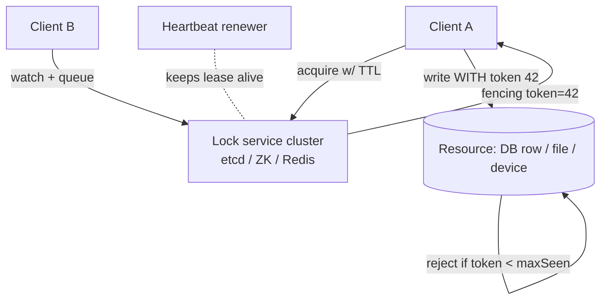
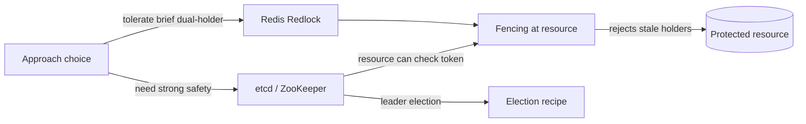
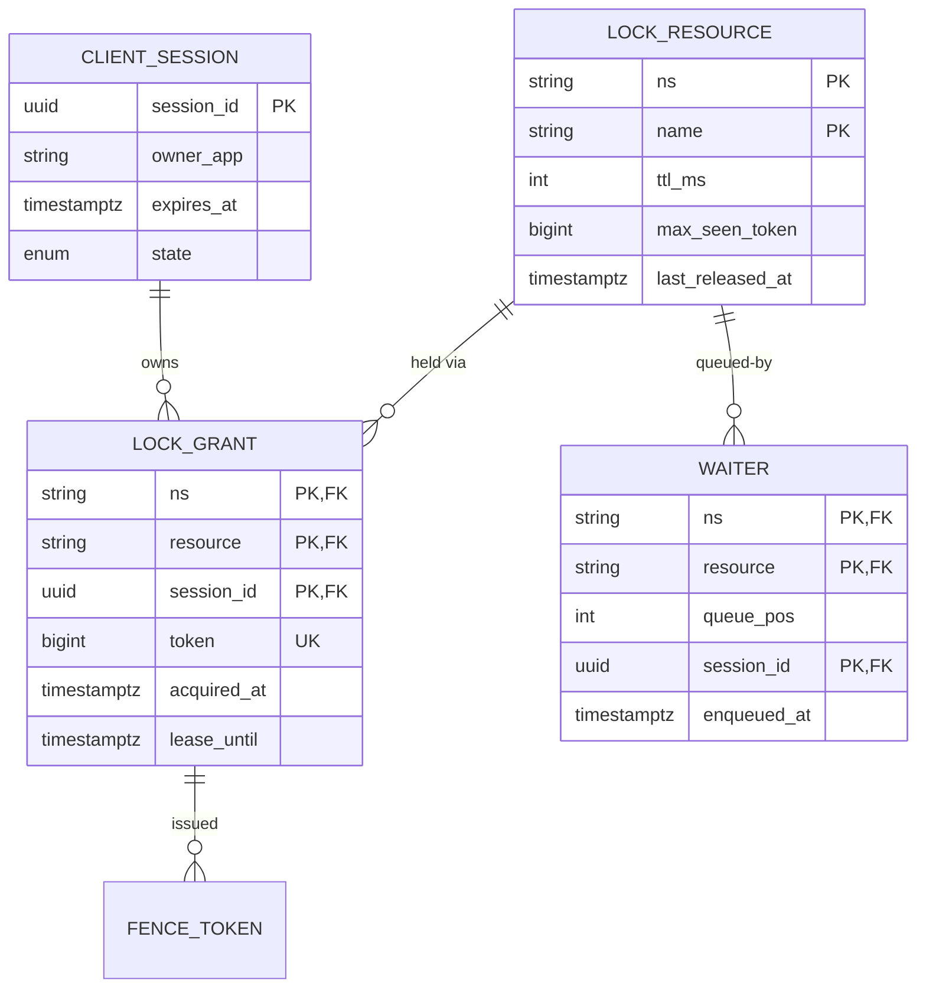
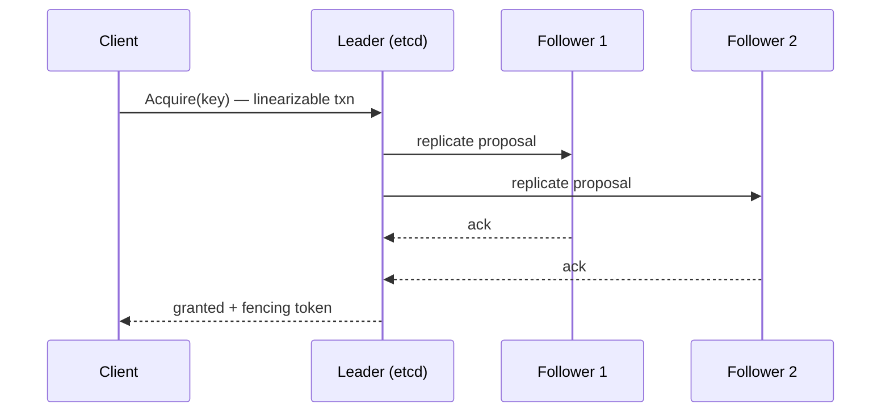
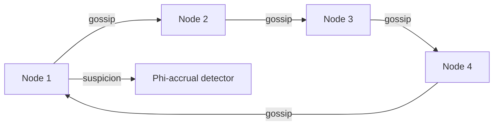
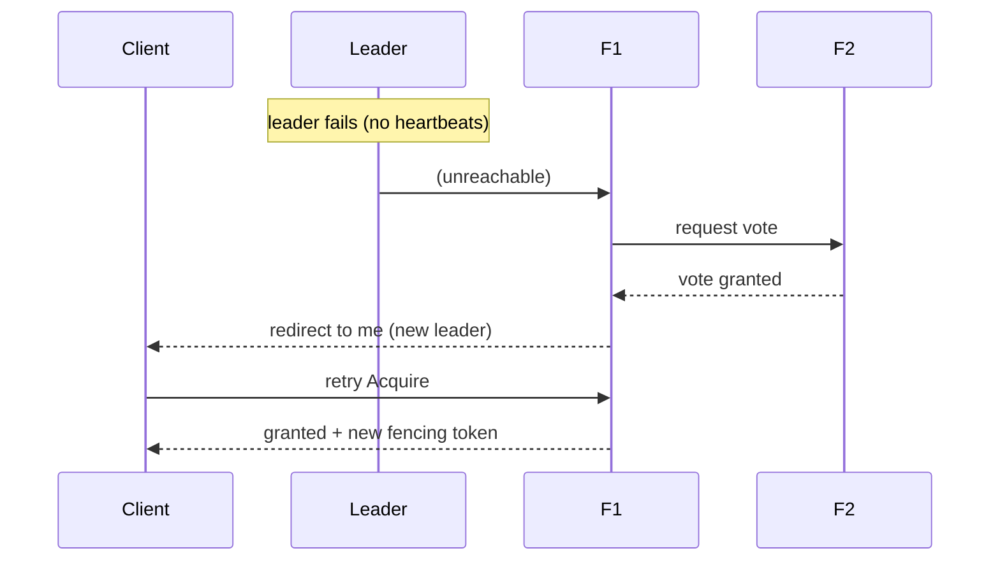
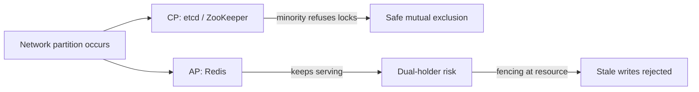
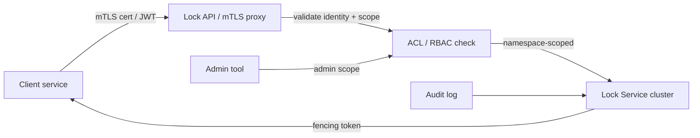
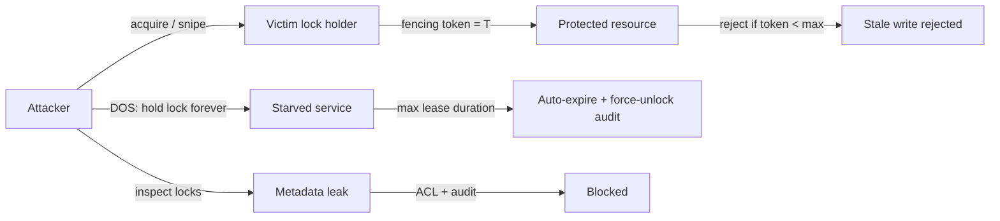
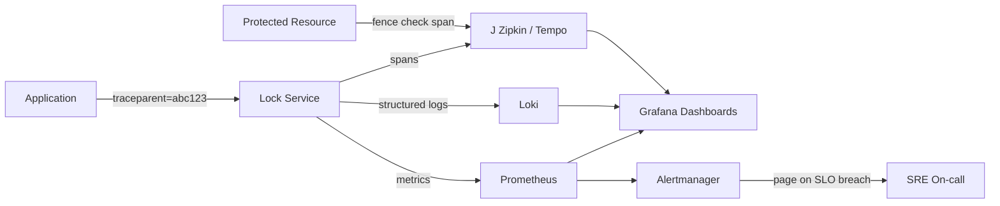

# Design Distributed Locking Service

## Blogs and websites

## Medium

## Youtube

## Theory

### Topics Covered

1. [Introduction / Problem Statement](#introduction--problem-statement)
2. [Characteristics](#characteristics)
3. [Pros](#pros)
4. [Cons](#cons)
5. [Use Cases](#use-cases)
6. [Components](#components)
7. [Architectural Patterns](#architectural-patterns)
8. [Benefits](#benefits)
9. [Challenges](#challenges)
10. [Best Practices](#best-practices)
11. [When to Use / When Not to Use](#when-to-use--when-not-to-use)
12. [Data Model and API](#data-model-and-api)
13. [Lock Protocols, Fencing Tokens, TTL/Lease Management, Quorum Locks, Fairness, and Deadlock Detection](#lock-protocols-fencing-tokens-ttllease-management-quorum-locks-fairness-and-deadlock-detection)
14. [Replication Strategies](#replication-strategies)
15. [Failure Detection and Membership](#failure-detection-and-membership)
16. [High Availability and Scalability](#high-availability-and-scalability)
17. [Performance and Optimization](#performance-and-optimization)
18. [CAP Theorem and Consistency Trade-offs](#cap-theorem-and-consistency-trade-offs)
19. [Encryption and Key Management](#encryption-and-key-management)
20. [Authentication and Authorization](#authentication-and-authorization)
21. [Security Threats and Mitigations](#security-threats-and-mitigations)
22. [Observability and Logging](#observability-and-logging)
23. [Real-World Implementations](#real-world-implementations)
24. [Java and Spring Boot Implementation Guide](#java-and-spring-boot-implementation-guide)
25. [Interview Questions and Answers](#interview-questions-and-answers)

---

### Introduction / Problem Statement

A **distributed lock** coordinates exclusive access to a shared resource across multiple processes or machines in a distributed system. Unlike a local mutex — which relies on shared memory and an atomic CPU instruction such as `compare-and-swap` — a distributed lock works when the contenders live on different nodes with no shared memory and an unreliable network between them.

In a single-node system, a mutex suffices to prevent concurrent access to a shared resource. In a distributed system, there is no shared memory to coordinate. A distributed locking service exists to provide mutual exclusion across machines — for example, ensuring only one scheduler instance fires a cron job at a time, or only one process rebalances a partitioned resource at a time. A distributed lock is a coordination primitive, not storage: it answers "who may act now," not "what the data is."

The design challenge is acute because distributed systems break the assumptions that make local locks trivial: **clocks drift**, **networks partition**, **processes pause** (garbage collection or OS scheduling), and **messages are reordered or duplicated**. A correct distributed lock must therefore balance **safety** (at most one holder at any instant) against **liveness** (eventually some holder makes progress) and must defend against **stale holders** that act long after their authority has legitimately expired. Three mature families of backend exist: consensus-backed stores (etcd via Raft, ZooKeeper via ZAB) which favor safety; clock-based quorum locks (Redis Redlock) which favor liveness and speed; and the original Chubby design which proved out the session/lease model that inspired them all.

```mermaid
sequenceDiagram
    participant A as Client A
    participant L as Lock Service (etcd quorum)
    participant R as Resource (fenced)
    participant B as Client B
    A->>L: Acquire(resource, ttl=30s, sessionId)
    L-->>A: granted, fencingToken=42
    loop while working
        A->>L: KeepAlive(lease)
    end
    A->>R: mutate(data, token=42)
    R->>R: token >= maxSeen? yes → apply, maxSeen=42
    Note over L: A crashes; lease expires
    B->>L: Acquire(resource)
    L-->>B: granted, fencingToken=43
    B->>R: mutate(data, token=43)
    R-->>B: applied (maxSeen=43)
    Note over A,R: zombie A wakes, sends stale token=42
    A->>R: mutate(staleData, token=42)
    R-->>A: REJECTED (42 < 43)
```
*The sequence diagram shows the core safety mechanism: a lock grant returns a fencing token to the holder, the protected resource rejects any write carrying a stale (lower) token, and even after the holder's lease expires and a new holder is granted a higher token, a zombie holder's late write is refused.*

#### Problem Statement

Design a distributed locking service that provides mutual exclusion across distributed systems, ensuring only one process can access a shared resource at a time — even across multiple servers and data centers.

#### Functional Requirements

- **Acquire a lock** on a named resource (blocking acquire, with an optional timeout).
- **Release a lock** (only by the legitimate holder; idempotent across duplicates).
- **Try-lock** (non-blocking attempt that fails fast when contended).
- **Lock with TTL / lease** (auto-expire to prevent deadlocks from crashed holders).
- **Lock renewal** (extend the TTL while holding, for long critical sections).
- **Fencing tokens** (monotonically increasing tokens returned to the holder so the protected resource can reject stale writes).
- **Watch / notification** (waiters are woken efficiently rather than polled).
- **Reentrancy** support within the same client session.

#### Non-Functional Requirements

- **Safety:** at most one client holds a lock at any time (mutual exclusion).
- **Liveness:** locks are eventually released (no permanent deadlocks); progress is made once a holder is genuinely gone.
- **Fault tolerance:** survives individual node failures and network partitions without granting dual ownership.
- **Latency:** lock acquire/release under typical load < 10 ms.
- **Scale:** millions of lock resources, thousands of lock operations per second across the fleet.
- **Pause-resilience:** a GC pause or host suspension longer than the TTL must not produce a second concurrent holder that corrupts data.

#### Why Distributed Locking Is Hard

The core difficulty is time. A local mutex is instantaneous and deterministic; a distributed lock depends on clocks that drift, networks that partition, and schedulers that pause processes for seconds without the lock service knowing. The canonical failure is the split-brain scenario below.

```text
Process A acquires lock → becomes leader
Process A suffers a long GC pause (30 seconds)
Lock expires (TTL elapses)
Process B acquires lock → becomes leader
Process A wakes up → still believes it is leader
→ TWO leaders = potential data corruption
```
*This pseudo-code illustrates the split-brain hazard: a holder paused longer than the TTL silently cedes ownership, yet still believes it is authoritative on resume — the exact scenario that makes distributed locking hard and that fencing tokens defend against.*

---

### Characteristics

- **Safety vs. liveness tension:** the entire field exists because you must choose which failure hurts more — two holders (a safety violation that can corrupt data) or zero holders (a live-server loss that stalls work). Consensus-backed stores bias toward safety; TTL-based stores bias toward liveness; fencing tokens recover safety when both fail.
- **Time-dependence:** every practical lock relies on time — TTLs, session timeouts, clock synchronization — so correctness is probabilistic under extreme pauses. Designs acknowledge this and add a resource-side token check rather than pretending a lock alone is sufficient.
- **Session-bound ownership:** locks bind to client identity plus a session; crashed clients release implicitly through ephemeral nodes or lease expiry, without requiring an explicit unlock message.
- **Granularity economics:** coarse locks are simple but serialize everything; fine-grained locks multiply coordination overhead and the deadlock-avoidance burden (a globally defined acquisition order is required).
- **Composition hazard:** holding multiple locks invites deadlocks unless acquisition ordering is globally defined — or cycles are detected and broken by timeouts.
- **Observability-critical:** lock contention is invisible until it destabilizes a service; wait-time histograms and hold-duration tracking are first-class features, not afterthoughts.

---

### Pros

- **Strong correctness primitives** when backed by consensus (etcd, ZooKeeper): quorum-coordinated writes make dual allocation extremely unlikely, and session/lease expiry provides automatic recovery from crashed holders.
- **Sub-millisecond best-effort locking** with Redis Redlock: a single `SET key value NX PX ttl` is faster than any quorum round trip, suitable for high-frequency, non-critical coordination.
- **Automatic recovery from crashed holders:** TTLs and ephemeral nodes mean dead processes never wedge resources permanently; no manual unlock required.
- **Fairness options** (ZooKeeper sequential nodes): FIFO ordering prevents starvation under contention.
- **Composable primitives:** the same coordination backend yields leader election, barriers, queues, and group membership — one dependency, many recipes.
- **Operational visibility:** holder inspection turns a mysterious "nothing is happening" incident into a diagnosable state.

---

### Cons

- **Every implementation has failure modes under pauses, clocks, or partitions** — none grants absolute safety alone; correctness requires fencing at the resource plus idempotent operations.
- **Correct usage demands client discipline** (fencing tokens, bounded timeouts, idempotency) that teams routinely skip, lulling them into a false sense of safety.
- **Adds a critical infrastructure dependency** to the very code path it protects; a lock-service outage can cascade into an application outage.
- **Contention hotspots degrade throughput sharply;** naive retry storms amplify incidents by multiplying load on an already-struggling service.
- **Multi-lock orchestration reintroduces textbook deadlocks** at network scale; distributed deadlock detection is expensive and approximate.
- **Operational overhead:** quorum monitoring, disk-latency sensitivity of etcd/ZooKeeper (fsync-bound), runbooks for forced unlocks, and TTL tuning per workload.

---

### Use Cases

- **Scheduled-task exactly-once execution across replicas**
  *Problem:* 10 app instances each run a cron trigger, risking double execution of a nightly settlement. *Solution:* one instance acquires lock `job:settlement:{date}` before executing; losers skip; the fencing token is passed to the settlement writer so even a stale holder cannot corrupt the ledger.
- **Distributed cache rebuild coordination**
  *Problem:* after a cache flush, thousands of threads simultaneously rebuild the same expensive view (cache stampede). *Solution:* try-lock per view-key; the winner rebuilds and populates; losers wait briefly and then read the warm cache.
- **Kubernetes-style leader election for controllers**
  *Problem:* a custom controller must act exactly once per cluster despite multiple replicas. *Solution:* lease/object acquisition with renewal periods backed by etcd; `controller-runtime` handles the mechanics.
- **Exclusive migration or rebalancing**
  *Problem:* a schema migration or partition rebalance must run on exactly one node to avoid concurrent writes corrupting state. *Solution:* acquire a coarse lock with a fencing token, run the job, then release; fence the target database against stale holders.

---

### Components

A distributed locking service is composed of several cooperating components.

- **Lock service cluster**
  *Purpose:* authoritative state for who holds what. *Responsibilities:* atomic acquire/release via CAS semantics (`SET NX`, znode creation, transactional puts), TTL/lease bookkeeping, watch/event notification for waiters, monotonic token generation. *How it works:* clients issue atomic conditional writes against a consensus store; the store grants or rejects based on whether the key already exists. *Relationships:* depends on the underlying replication/membership layer; exposes an API the client library speaks; returns tokens the resource validates. *Real-world example:* an etcd 3- or 5-member cluster serving linearizable lock objects; ZooKeeper's `recipe` znodes; Redis Redlock across N independent primaries.

- **Client library / SDK**
  *Purpose:* make correct usage trivial and hard to misuse. *Responsibilities:* acquire-with-retry and backoff, heartbeat keep-alive loops, auto-release on close/finalizer, fencing-token plumbing into every resource call, reentrancy bookkeeping per thread/process. *Relationships:* wraps the lock service's wire protocol; the application calls high-level `lock()`/`unlock()`. *Real-world example:* Apache Curator's recipes over ZooKeeper set the de-facto standard for safe client behavior.

- **Fencing-aware resources**
  *Purpose:* reject stale holders at the point of mutation. *Responsibilities:* track the highest-seen token; conditional writes require a token ≥ the stored maximum; persist the token atomically with the guarded write. *Relationships:* convert a lock-service failure (a pause that outlived a TTL) from silent data corruption into a rejected stale write. *Real-world example:* a storage layer that checks a `fence_token` column before accepting an update.

- **Waiter queue / notification fabric**
  *Purpose:* efficient waiting instead of polling storms. *Responsibilities:* watches on predecessor nodes (ZooKeeper pattern), pub/sub or stream notifications (Redis), herd mitigation by waking only the next-in-line waiter. *Relationships:* couples to the lock service's watch/notify subsystem; it is what scales the tail of a contended lock.

- **Admin / ops tooling**
  *Purpose:* inspect current holders, force-unlock stuck resources, audit history. *Responsibilities:* break-glass procedures with audit trails; holder-age and contention alerting; TTL override for emergencies. *Real-world example:* `etcdctl lease` inspection and lease revocation; listing ZooKeeper ephemeral nodes.


*Component view: clients acquire locks through a lock-service cluster which returns a fencing token; the protected resource validates the token on every write (rejecting stale tokens), while a heartbeat renewer keeps the lease alive for long-running work.*

---

### Architectural Patterns

- **Lease-based locking (Redis SET NX PX)**
  *What:* a key holding the owner token plus an expiry, with a Lua compare-and-delete release. *Problem solved:* simple, fast mutual exclusion that is best-effort. *How:* `SET resource myToken NX PX 30000` atomically creates the key only if it does not exist, with a TTL; release uses a Lua script that deletes only if the stored token matches. *When to use:* performance-critical coordination where a rare, brief dual-holder is tolerable (cache-refresh election, dedup leader). *Not when:* correctness-critical mutation gating without a fencing check at the resource. *Pros:* ~1 ms operations, trivial ops burden. *Cons:* clock- and pause-dependent; no inherent fairness.

- **Sequential ephemeral nodes (ZooKeeper recipe)**
  *What:* create an ordered ephemeral znode under a lock parent; the numerically-smallest node holds the lock; others watch only their immediate predecessor. *Problem solved:* fair FIFO locking with crash-released sessions and no clocks involved in ownership transfer. *How:* `createEphemeralSequential` under `/locks/resource-`; list children; if yours is smallest, you hold; else `exists` watch on the node just before yours. *When to use:* correctness-sensitive coordination such as leader election and serialized batch jobs. *Cons:* higher latency (~10–50 ms), ZooKeeper operational burden. *Example:* Apache Curator's `InterProcessMutex` implements this recipe with reconnection handling.

- **etcd lease + transaction**
  *What:* attach a key to a lease; acquire via a transaction comparing `Version(key) == 0` then `put`; watchers await key deletion; keep-alive heartbeats renew. *Problem solved:* linearizable, crash-safe locking in the Kubernetes ecosystem. *How:* `txn(compare(Version(key)==0)).then(put(key, holder, leaseId))`; on failure, `watch` the key; keep-alive every `lease-ttl/3`. *When to use:* Kubernetes, cloud-native control planes, any system already standardizing on etcd. *Example:* the Kubernetes `Lease` object backing `kube-scheduler` HA. *Pros:* strong safety from Raft, no clock-skew dependence for ownership decisions. *Cons:* quorum cost (~2 RTT), requires quorum availability to grant locks.

- **Fencing at the resource**
  *What:* every lock grant returns a monotonically increasing fencing token; the protected resource stores the max token seen and rejects any request carrying a lower token. *Problem solved:* upgrades any backend to safe-under-pauses. *How:* store `max_seen_token` alongside the guarded row/record; on write, reject if `incoming < max_seen`. *When to use:* whenever the protected resource can store and check a single monotonic value (databases, file systems, devices). *Example:* the `fenced_resource` table in the Java implementation guide below.

- **Leader election as a specialized lock**
  *What:* a long-lived lock held by the current leader, with a continuity preference (failover only on genuine death). *Problem solved:* keeping exactly one active coordinator per shard or cluster. *How:* the same primitives as work-item locks, but with longer leases, proactive handoff attempts, and continuity checks. *When to use:* cluster control planes, partition leaders, singleton jobs. *Distinct from:* work-item locks, whose tenure is measured in seconds/minutes, not hours. *Example:* the Raft-native leader role; Kubernetes `Lease` objects.

- **Two-phase / hierarchical locking**
  *What:* acquire child before parent and release in reverse order. *Problem solved:* deadlock avoidance across hierarchies such as directory trees or table→row. *How:* enforce a global acquisition order; release in reverse. *When to use:* when a single operation touches multiple granularities. *Not when:* operations are naturally single-key — prefer redesigning away from multi-lock scope. *Example:* a Java `ReentrantReadWriteLock` analog at distributed scale (rarely needed).


*Decision flow: the safety requirement selects the backend (Redis for best-effort, etcd/ZooKeeper for consensus), and fencing at the resource protects against stale holders regardless of which backend is chosen.*

---

### Benefits

- **Correct coordination of shared mutable state** across fleets — scheduled-job single-run guarantees, migration serialization, cache-refresh deduplication.
- **Crash-safety without human intervention:** leases/sessions auto-release, so dead processes never wedge systems permanently.
- **Fairness options** (ZooKeeper sequential): FIFO ordering prevents starvation under contention.
- **Composable primitives:** same infra yields leader election, barriers, queues — one dependency, many recipes.
- **Operational visibility:** holder inspection turns a mysterious "nothing is happening" incident into a diagnosable state.

---

### Challenges

- **Technical:** GC/VM pauses outliving TTLs (the split-brain scenario); clock skew between Redis nodes breaking Redlock assumptions; session-expiry false releases (ZooKeeper) creating brief dual-ownership windows; fencing adoption at legacy resources lacking token support.
- **Scalability:** thundering waiters on celebrity resources (herd wake-ups); lock-service write-QPS ceilings during incident storms.
- **Performance:** consensus latency floor (≈ 2× RTT) versus Redis speed trade-off; keep-alive-traffic budgets at millions of locks.
- **Reliability:** partition behavior differs per backend — CP stores refuse to grant locks on quorum loss; Redis serves possibly-stale state — and the application must know which contract it bought.
- **Maintainability:** TTL-value tuning across heterogeneous job durations (too short = churn, too long = slow recovery); client-library version drift.
- **Operational:** quorum capacity monitoring, disk-latency sensitivity of etcd/ZooKeeper (fsync-bound), runbooks for forced unlocks.
- **Security:** authentication between clients and the service (a compromised client can starve others by hogging locks); ACLs restricting which identities may lock which namespaces.

---

### Best Practices

- **Always use fencing tokens where resources can check them** — this single practice converts worst-case outcomes into rejected writes and log lines.
- **Keep critical sections short:** no I/O inside locks beyond the minimum; move slow work outside the protected region wherever algorithmically possible.
- **Set TTLs ≈ p99 operation time × margin**, with heartbeat renewal for longer work; document each lock's expected hold profile.
- **Acquire multiple locks in a globally-defined order;** prefer single-lock designs; always time out acquisitions (never block indefinitely).
- **Make locked operations idempotent anyway** — defense-in-depth against the residual race window.
- **Prefer not locking:** optimistic concurrency (version columns), idempotent task claims (`UPDATE … WHERE status='PENDING'`), or single-writer architectures often eliminate the need entirely.
- **Alert on hold-duration outliers and waiter-queue depth** — they precede outages.
- **Test pause injection deliberately:** `SIGSTOP` a holder mid-critical-section and assert the fence rejection fires as claimed.

---

### When to Use / When Not to Use

**Use when:** coordinating side-effecting operations that cannot tolerate concurrency (migrations, leadership, exclusive device/file access) and no cheaper primitive fits (database unique constraints, atomic counters).

**Avoid or reduce when:** database transactions already serialize access (row locks suffice); work items are claimable atomically (queue semantics beat locks); high-frequency contention suggests an architectural fix (shard the resource) instead.

The alternatives ladder before climbing to a lock service: DB unique/serializable constraints → optimistic version checks → atomic claim-by-update → leases → full lock service. Always descend this ladder before climbing. Decision inputs: cost of dual-execution versus stall, pause probabilities, existing infra alignment (already running Kubernetes ⇒ etcd is natural), and team familiarity.

---

### Data Model and API

The lock service persists lock state as lease-bound keys (etcd/Redis) or ephemeral znodes (ZooKeeper); the protected resource tracks a max-seen fencing token. The canonical entities and relationships are shown below.


*The entity-relationship diagram shows that a lock resource is held via a single active grant tied to a client session; each grant carries a unique monotonic fencing token; waiters queue behind a resource; grants and resources cascade on deletion to keep state consistent.*

**Entities, primary/foreign keys, and design choices.**

- **LOCK_RESOURCE** (`ns` PK, `name` PK): the named logical resource. Columns: `ttl_ms`, `max_seen_token`, `last_released_at`.
- **CLIENT_SESSION** (`session_id` PK, `owner_app`, `expires_at`, `state`): an authenticated client session/leash.
- **LOCK_GRANT** (`ns` PK,FK · `resource` PK,FK · `session_id` PK,FK · `token` UNIQUE · `acquired_at` · `lease_until`): the single active grant.
- **WAITER** (`ns` PK,FK · `resource` PK,FK · `queue_pos` PK · `session_id` PK,FK · `enqueued_at`): queued waiters, FIFO by `queue_pos`.

**Design choices:** uniqueness is enforced structurally — a partial unique index on `(ns, name)` where `state = 'ACTIVE'` guarantees at most one active holder; the `token` column is monotonic per resource, yielding free fencing values; `lease_until` is indexed for the expiry sweeper; waiter positions are assigned transactionally to preserve FIFO fairness where enabled. Retention: grants are ephemeral by nature; an audit table records grant/release/fence-rejection events for postmortems (90 days).

**API contract.**

| Method | Endpoint | Purpose | Success (2xx) | Failure |
|---|---|---|---|---|
| Acquire | `POST /api/v1/locks/acquire` | Blocking acquire with TTL + wait | 200 — `{lockId, fencingToken, expiresAt, grantedAt}` | 409 contended / 503 quorum lost |
| Try-Acquire | `POST /api/v1/locks/try-acquire` | Non-blocking attempt | 200 | 409 `LOCK_HELD` |
| Renew | `PUT /api/v1/locks/{lockId}/renew` | Extend lease | 200 / 202 | 410 `EXPIRED` |
| Release | `PUT /api/v1/locks/{lockId}/release` | Idempotent release | 200 `{status: RELEASED}` | 410 |
| Status | `GET /api/v1/locks/{lockId}` | Current holder + token | 200 | 404 |

**Key contracts:**
- **Fencing tokens:** every successful acquire returns a monotonically increasing `fencingToken`; the protected resource must reject any request with a token lower than the last-seen token.
- **Idempotency:** release and renew are idempotent; releasing an already-released lock returns `200` with `status: RELEASED`.
- **TTL semantics:** locks auto-release when the TTL expires without renewal; clients must renew before the TTL to hold the lock.
- **Quorum requirement:** acquisition requires quorum (W + R > N) on the consensus store; if quorum is lost, no new locks are granted (`503`).
- **Watchdog renewal:** critical sections use a background watchdog that renews the lease every TTL/3 seconds; if the watchdog fails (process frozen), the lock expires.

The watchdog renews the lease at one-third of the TTL, so a frozen holder releases the lock within a single TTL window — bounding stale-holder exposure to the lease duration itself.

---

### Lock Protocols, Fencing Tokens, TTL/Lease Management, Quorum Locks, Fairness, and Deadlock Detection

This section unifies the protocol mechanics that every backend ultimately implements: how locks are granted and released, how stale holders are disarmed, how long locks survive, how quorums decide, how fairness is provided, and how deadlocks are avoided.

#### Lock release protocols

A lock is released two ways: **explicitly** (the holder sends a release message) or **implicitly** (the lease/TTL expires after a crash). The release protocol decides whether a stale holder can ever delete a lock it no longer owns.

- **Unsafe delete (`DEL key`):** any client can delete any key. Fast but dangerous — a slow holder whose TTL expired can wipe out a neighbor's freshly-granted lock. Never use in production.
- **Compare-and-delete (token check):** the release command compares the stored value to the holder's own token and deletes only on match. With Redis this is a Lua script (`EVAL`); with etcd/ZooKeeper the transaction itself is the compare-and-delete. This is the safe release protocol.
- **Lease-based auto-release:** the lock key is bound to a lease; the store deletes the key when the lease ends, regardless of what the crashed holder intended. This is the crash-safe backstop that makes "crashed holder ⇒ lock freed" hold even when the holder never sends a release.

```text
Redlock acquire (N=5 independent primaries, majority=3):
  1. record start_time
  2. acquire on ALL N with a small per-node TTL (e.g. 10s) using SET k v NX PX 10000
  3. count successes; if < majority(3) → release on all acquired nodes, FAIL
  4. validity_time = TTL - (now - start_time)
  5. if validity_time > 0 → LOCK ACQUIRED (return token); else release everywhere, FAIL
  6. release = EVAL Lua that deletes only if stored value == my token
```
*The Redlock protocol acquires the lock on a majority of N independent, untrusted Redis primaries and computes a residual validity window after the network round-trips; the Lua release script ensures only the legitimate holder can delete its own key.*

#### Fencing tokens

Every successful acquire returns a **monotonically increasing fencing token** (a per-resource counter). The protected resource stores the highest token it has accepted and rejects any write carrying a lower token. The subtlety is that the fence check must be **atomic with the guarded write** — checking the token in one statement and writing the data in another opens a time-of-check-to-time-of-use gap where a crash lets a stale token through. Store `max_seen_token` and advance it in the same transactional write that persists the mutation.

```lua
-- Lua: safe release for a single Redis instance — deletes only if token matches
if redis.call("get", KEYS[1]) == ARGV[1] then
    return redis.call("del", KEYS[1])
else
    return 0
end
```
*This Lua script is the safe-release protocol for a single Redis instance: it deletes the lock key only if the stored owner token equals the caller's token, preventing a stale or competing holder from releasing someone else's lock.*

```text
etcd acquire via transaction (linearizable)
  lease = grant(ttl_seconds)
  txn:
    compare: Version(key) == 0          # key must not exist
    then:   put(key, holder_id, lease)   # attach key to lease
    else:   fail
  keep-alive: auto-renew lease every ttl/3
  release: revoke(lease) or del(key) guarded by token match
```
*The etcd acquire uses a linearizable transaction that writes the key only when `Version(key) == 0`, attaching it to a lease the client keep-alives; release is lease revocation, which is inherently safe because only the lease owner can revoke it.*

#### TTL / lease management

- **TTL selection:** the lease duration should exceed the p99 critical-section length plus a safety margin for GC pauses, but be short enough that a dead holder frees the resource promptly. Typical ranges are 10–30 s with auto-renewal.
- **Renewal / watchdog:** a background thread/goroutine renews the lease at `TTL/3` intervals. If the holder freezes, renewal stops, the lease expires, and the lock is freed. This converts unbounded stalls into bounded ones.
- **Lease transfer vs. re-acquire:** some systems (ZooKeeper, Chubby) support explicit lease transfer to a waiting client to avoid a release-then-reacquire race; most cloud stores do not, so clients must be idempotent.
- **Grace period:** after a lease expires a short grace window may still accept the old holder's token at the resource to absorb clock skew; never longer than the network's maximum message delay.

#### Quorum locks

- **Redlock:** a quorum across N independent, untrusted primaries. Because the primaries are assumed to fail independently and asynchronously, safety is probabilistic rather than provable — the Kleppmann–antirez debate. Use only where a brief dual-holder is tolerable; always pair with fencing at the resource.
- **etcd / ZooKeeper:** the quorum is the Raft/ZAB majority itself. Lock state is linearizable, so there is a single authoritative truth about ownership and no clock-skew window for dual holders. The cost is one more RTT and the need for quorum availability.
- **Replication factor:** a 3-member store tolerates f = 1 failure; a 5-member store tolerates f = 2. For lock state, odd node counts are strongly preferred so a strict majority always exists.

#### Fairness and queueing

- **FIFO (fair):** ZooKeeper's sequential ephemeral nodes grant the lock to the numerically-next waiter, so arrival order is preserved. This prevents starvation but adds a znode-creation RTT per handoff.
- **Unfair (fast-path):** Redis Redlock and etcd's `put-if-absent` grant to whichever client's request the quorum happens to commit first; under contention a late client can "cut in line."
- **Queued fairness:** an explicit waiter queue (the WAITER table) lets a CP store provide fairness without ZooKeeper's per-handoff RTTs. Herd mitigation matters: wake only the next-in-line waiter, not all waiters.

#### Deadlock detection and avoidance

- **Avoidance via global ordering:** acquire locks in a globally-defined total order and release in reverse (two-phase locking). This structurally forbids cycles.
- **Avoidance via timeout:** every acquisition has a deadline; on timeout the caller releases everything it holds and backs off. Simple but not cycle-free under skewed scheduling.
- **Detection via wait-for graph:** nodes report "I wait for lock L held by H"; a cycle means deadlock. Distributed cycle detection is expensive (O(N²) messages) and itself racy, so it is rarely used for application locks — timeouts are preferred.
- **2PL discipline:** growing phase (acquiring) then shrinking phase (releasing); combined with ordering, this yields serializability when locks guard a transactional datastore.

---

### Replication Strategies

Lock state is coordinated state, so replication choices map directly onto the safety/liveness trade-off.

- **Leader-based / quorum (etcd, ZooKeeper):** a Raft or ZAB leader serializes lock writes; a majority of replicas must acknowledge before the grant is committed. This gives linearizable history and true mutual exclusion, at the cost of one extra round trip and of blocking when the quorum is unavailable.
- **Multi-primary (rare for locks):** multiple nodes accept writes and reconcile. Conflicts over the same lock key must be resolved (last-write-wins is unsafe here; explicit fencing is mandatory), so this pattern is discouraged for correctness-critical locks.
- **Redlock quorum across independent primaries:** N physically independent Redis instances each hold one replica; a majority must grant. The primaries are assumed to fail independently and asynchronously — this bounds (without eliminating) the clock-skew risk.
- **Active/standby (single primary):** one primary with async replicas. Fast and simple, but failover is a release-without-notify moment — the replica may lag, so it is unsafe for correctness unless combined with a fencing token the old primary can never raise above.


*Leader-based quorum replication: the client acquires the lock through the Raft leader via a linearizable transaction; the proposal is replicated to a majority of followers before the grant is acknowledged, guaranteeing a single authoritative owner.*

**Real-life use:** etcd's Raft quorum for Kubernetes leases; ZooKeeper's ZAB quorum for Hadoop coordination; Redis Cluster's master-with-replicas for best-effort Redlock.

---

### Failure Detection and Membership

Lock ownership is meaningless without knowing which nodes and clients are alive. For locks, failure detection is primarily about **sessions and leases**, not just node liveness.

- **Session/lease timeouts:** the holder's session or lease has a server-side expiry. If heartbeats stop, the store declares the session dead and releases the associated locks. This is the core failure detector for lock services because it is judged server-side, not by the holder's own clock.
- **Raft / ZAB membership:** the quorum store's leader election and configuration changes are themselves consensus operations; adding/removing members requires a joint-consensus round so the lock service never loses quorum mid-reconfiguration.
- **Gossip / SWIM:** used for node membership in the broader cluster (Cassandra, Consul, Serf). Nodes fan out liveness information; if a node is unreachable for a gossip round with a phi-accrual suspicion threshold, it is marked dead.
- **Phi accrual:** computes a suspicion level from the heartbeat-arrival-time history; reduces false positives versus fixed timeouts but adds tunable latency before a node is declared dead.


*Gossip membership: each node exchanges liveness information with random peers; a phi-accrual detector converts heartbeat-arrival statistics into a suspicion level, marking nodes dead only when the evidence is strong enough to reduce false positives.*

**Interview questions and answers**
- **Q: Why is server-side lease expiry more trustworthy than a client-side timeout?**
  **A:** a client-side timeout can fire while the holder is merely slow (for example, a paused GC), causing a premature release; server-side expiry is judged by the quorum's own clock and heartbeats, so it fires only when the session is genuinely unresponsive.
- **Q: What is the risk of marking a node dead too quickly?**
  **A:** a false positive partitions the cluster into two leaders briefly, breaking mutual exclusion; phi accrual and a minimum suspicious-delay mitigate this.

---

### High Availability and Scalability

- **Cluster sizing and quorum tolerance:** an etcd/ZooKeeper lock service should run on an odd node count. With N members the store tolerates f = (N−1)/2 failures — 3 nodes tolerate 1, 5 tolerate 2. For lock state, more than 5 nodes rarely helps and increases quorum latency.
- **Leader / follower with fast failover:** the leader handles writes; followers replicate. On leader death a new leader is elected in one round; clients transparently reconnect using the client library's reconnection logic (Curator's connection state, etcd's gRPC reconnection).
- **Availability on quorum loss:** a CP lock service refuses to grant locks when quorum is lost (fail-closed); a Redis-based lock service may still serve from a stale primary (fail-open). Application code must know which contract it bought.
- **Scalability by sharding:** lock keys are partitioned (hash of the resource name) across multiple independent lock clusters, so per-shard quorum size stays small and contention is distributed. A hot celebrity resource within a shard is unavoidable; mitigate with waiter queues and backoff.
- **Multi-region:** cross-region locks incur WAN RTT and are usually the wrong tool for hot paths. Prefer region-local ownership of a resource and async rebalancing of quota; if a cross-region lock is genuinely required, route by resource affinity to the owning region's cluster and fence end-to-end.


*Fast failover: when the leader stops sending heartbeats, a follower times out, wins a new election, and redirects the client, which retries the acquire against the new leader and receives a fresh fencing token.*

---

### Performance and Optimization

Lock performance is dominated by the consensus round trip, so it is measured in tail latency and quorum availability rather than raw throughput.

- **Latency by backend:** Redis single-instance ≈ 0.2–1 ms; Redlock ≈ 1–5 ms (majority RTT); etcd ≈ 2–5 ms; ZooKeeper ≈ 10–50 ms (znode creation + watcher). Choose by the cost-of-double-execution versus the latency budget.
- **Keep-alive budget:** renewing every TTL/3 keeps a healthy holder alive but adds periodic heartbeat traffic; at millions of simultaneous locks this budget is significant and must be amortized (pipelined/multiplexed keep-alives).
- **Watch fan-out and herd mitigation:** when a lock is released, wake only the next-in-line waiter; broadcasting to all waiters (a naive Redis `PUBLISH` fan out or a sloppy ZooKeeper watcher reset) causes thundering-herd storms under contention.
- **Connection pooling and pipelining:** clients should pool connections to each shard and pipeline independent lock requests; never acquire/release in a chatty per-request loop.
- **Contention:** a single very hot resource serializes all claimants. Shard it (for example, `leaderboard:lock:{shard}` across K keys) and let callers pick a shard, or accept the head-of-line blocking and alert on waiter-queue depth.

| Backend | Acquire latency | Renew latency | Fairness | Safety |
|---|---|---|---|---|
| Redis (single) | ~0.2 ms | ~0.2 ms | none | clock-dependent |
| Redis Redlock | ~1–5 ms | ~1 ms | none | probabilistic |
| etcd (Raft) | ~2–5 ms | ~2 ms | FIFO optional | strong (quorum) |
| ZooKeeper | ~10–50 ms | ~10 ms | FIFO (sequential) | strong (ZAB) |

**Interview questions and answers**
- **Q: Why is ZooKeeper lock acquisition slower than Redis?**
  **A:** ZooKeeper creates an ephemeral znode and sets a watch, both of which must propagate through the ZAB quorum; Redis `SET NX` is a single in-memory operation on the primary.
- **Q: How do you keep alive millions of leases without melting the store?**
  **A:** multiplex keep-alives over a single connection (pipelining), back off under pressure, and rely on the sweeper to expire the minority that drift off; avoid one-keepalive-per-lease goroutines.

---

### CAP Theorem and Consistency Trade-offs

During a network partition a distributed system can provide at most two of: Consistency, Availability, and Partition tolerance. A lock service is partition-tolerant by assumption, so the real question is **C vs. A** when the quorum splits.

- **CP (etcd, ZooKeeper):** on a partition that loses quorum, the minority side refuses to grant locks (availability is sacrificed) so the majority side can never hand out a duplicate. This is the safe choice for correctness-critical locks.
- **AP (Redis Redlock, Redis Cluster):** the majority side continues, and a minority primary may still serve a stale lock. Two active holders are possible across the partition, and the system trades safety for availability while relying on fencing at the resource to contain the damage.
- **The Redlock debate reframed:** Redlock is AP-leaning (it can grant on a quorum even while the network is partitioned), but its safety argument is probabilistic (independent clock drift across the primaries). It is a reasonable efficiency primitive, not a correctness primitive.


*The CAP decision diagram for locks: on a network partition a CP backend (etcd, ZooKeeper) preserves mutual exclusion by refusing locks on the minority side, whereas an AP backend (Redis) keeps serving and accepts a small risk of a dual holder that is contained by fencing tokens checked at the resource.*

Distributed locking therefore defaults to the CP side of the CAP trade-off: it prefers refusing to grant a second holder — or refusing service entirely on quorum loss — over risking dual ownership, paying the availability cost as the price of safe mutual exclusion.

---

### Encryption and Key Management

A distributed locking service coordinates state across machines, so the lock itself and the state it guards must be protected against interception, tampering, and unauthorized inspection. Encryption applies at three layers: the coordination channel between client and lock service, the on-disk state of the lock store, and the protected resource being fenced.

#### Encryption at Rest

Lock state (held locks, leases, client sessions) and audit logs are persisted by the coordination store. If the store encrypts at rest, a compromised disk cannot reveal which resources are currently locked or who holds them — information that could be exploited for targeted attacks.

- **etcd**: supports encryption at rest (a per-instance AES-GCM envelope that encrypts the backend before writing to disk). The encryption config is stored in an `EncryptionConfig` and requires a PEM-encoded key file or a KMS-wrapped key.
- **ZooKeeper**: the data directory can be encrypted at the filesystem level (dm-crypt/LUKS); there is no built-in application-level encryption of znode data.
- **Redis**: Redis Enterprise encrypts data on disk (AES-256); open-source Redis relies on filesystem-level encryption (dm-crypt) since it stores data either in memory or in an append-only file (AOF).
- **Audit/trail logs**: any log of lock grants, releases, and fencing-token rejections should be encrypted at rest (e.g., Elasticsearch with an encrypted index) because it reveals access patterns and timing.

#### Encryption in Transit

All communication between clients and the lock service, and between lock-service replicas, must use TLS 1.2+ (preferably TLS 1.3). For service-to-service coordination, mutual TLS (mTLS) authenticates both parties and prevents a rogue client from impersonating a legitimate holder.

- **etcd**: clients connect over TLS; mTLS is required for peer-to-peer replication traffic. The CA bundle and client certificates are rotated via the deployment's cert-manager or Kubernetes secrets.
- **ZooKeeper**: supports TLS client authentication (`clientAuth=required`); the quorum protocol (between ensemble members) can also be secured with TLS.
- **Redis**: supports TLS for client connections and inter-replica replication; mTLS requires a custom proxy or Redis Enterprise.
- **mTLS in the service mesh**: when the lock service runs behind a sidecar (e.g., Istio), mTLS is terminated at the mesh boundary, protecting traffic without application-level TLS configuration.

#### Key Hierarchy and Management

The key management pattern mirrors that of other infrastructure systems:

- **KEK (Key Encryption Key)**: held in a managed KMS (AWS KMS, GCP KMS, HashiCorp Vault) or an HSM. The KEK never leaves the KMS boundary.
- **DEK (Data Encryption Key)**: a per-store or per-purpose key generated by the KMS, used to encrypt lock state, audit logs, and configuration. The DEK is wrapped (encrypted) by the KEK and stored alongside the data.
- **Key rotation**: KEKs rotate every 90 days; rotating only requires re-wrapping the DEKs, not re-encrypting data. DEKs rotate per-release or when a compromise is suspected.

```mermaid
graph LR
    Store[Lock Store (etcd/ZooKeeper)] -->|"encrypted data"| Disk[(Encrypted disk)]
    KMS[Managed KMS / HSM] -->|"wrap/unwrap DEK"| DEK[Data Encryption Key]
    DEK --> Store
    Client -->|"mTLS"| Store
    Peer -->|"mTLS"| Store
```

*The encryption architecture for a distributed lock service: the store encrypts data at rest using a DEK, which is wrapped by a KEK held in a KMS/HSM; clients and peer replicas both authenticate via mTLS, so the coordination channel is encrypted and mutually authenticated.*

**Java example — a Spring-managed key-encryption service for lock audit logs:**

```java
@Service
@RequiredArgsConstructor
public class LockAuditEncryptionService {

    @Value("${app.lock.audit.encryption.key-id}")
    private String keyId;

    private final AwsKms kmsClient;
    private final MeterRegistry meterRegistry;

    /**
     * Encrypts an audit entry so lock grant/release/fencing-rejection
     * records are protected at rest. Uses AES-GCM with a per-record
     * random 12-byte IV and a KMS-generated DEK.
     */
    public byte[] encrypt(byte[] plaintext) {
        var timer = Timer.Sample.start(meterRegistry);
        try {
            var dek = kmsClient.generateDataKey(keyId);
            var cipher = Cipher.getInstance("AES/GCM/NoPadding");
            var iv = new byte[12];
            new SecureRandom().nextBytes(iv);
            cipher.init(Cipher.ENCRYPT_MODE,
                    new SecretKeySpec(dek.plaintext(), "AES"),
                    new GCMParameterSpec(128, iv));
            var ciphertext = cipher.doFinal(plaintext);
            var combined = new byte[iv.length + ciphertext.length];
            System.arraycopy(iv, 0, combined, 0, iv.length);
            System.arraycopy(ciphertext, 0, combined, iv.length, ciphertext.length);
            return combined;
        } catch (GeneralSecurityException e) {
            throw new EncryptionException(e);
        } finally {
            timer.stop(Timer.builder("lock.audit.encrypt.latency")
                    .register(meterRegistry));
        }
    }
}
```

*The `LockAuditEncryptionService` bean encrypts audit records using AES-GCM with a KMS-generated DEK (key ID injected via `@Value`) and a random 12-byte IV. A Micrometer timer records encryption latency so performance regressions in the encryption path are visible in dashboards.*

---

### Authentication and Authorization

Every request to the lock service — whether it is acquiring, releasing, or querying a lock — must be authenticated and authorized. Without this, any network-reachable client could claim locks, deny service to legitimate holders, or snoop on which resources are currently held.

#### Authentication

- **mTLS (mutual TLS)**: each client and lock-service replica presents a certificate issued by a private CA. The certificate encodes the client's identity (service account or human user) and is verified by the server. This is the default for Kubernetes-native lock services (etcd, ZooKeeper).
- **JWT/OAuth 2.0**: for HTTP-based lock APIs (e.g., a custom lock service fronted by an API gateway), clients present a bearer JWT. The JWT's `sub` (subject) and `scope` claims identify the caller and the operations it may perform.
- **Pre-shared tokens**: for ephemeral or development environments, a static token in an `Authorization` header. Never used in production — tokens are rotated and scoped to the minimum required privilege.

#### Authorization

Authorization is resource-scoped: a principal may acquire a lock on resource `/payments/settlement` but not on `/user-profiles/admin`. The authorization model combines:

- **Scope-based (OAuth 2.0 scopes)**: `locks.acquire`, `locks.release`, `locks.inspect`. The API gateway or lock-service proxy enforces scope checks before forwarding.
- **Resource-based ACLs**: each lock namespace maps to a set of allowed principals. An ACL table records `(namespace, principal, permissions)`. The lock service evaluates the ACL on every acquire/release request.
- **Role-based (RBAC) for administrative access**: `lock-admin` role can force-unlock stuck locks and inspect all namespaces; `lock-user` role can only acquire/release locks in namespaces it owns.



*The authentication and authorization flow: a client authenticates via mTLS or a signed JWT; the proxy or lock-service validates the identity and checks the principal's scopes and resource ACLs against the requested namespace; only authorized requests reach the lock cluster, and every grant is audited.*

**Java example — ACL-based authorization middleware:**

```java
@Component
@RequiredArgsConstructor
public class LockAuthorizationFilter implements Filter {

    @Value("${app.lock.acl.default-ttl-seconds:3600}")
    private int defaultTtlSeconds;

    private final LockAclRepository aclRepository;
    private final MeterRegistry meterRegistry;

    @Override
    public void doFilter(ServletRequest request, ServletResponse response,
                         FilterChain chain) throws IOException, ServletException {
        var httpRequest = (HttpServletRequest) request;
        var httpResponse = (HttpServletResponse) response;
        var principal = (LockPrincipal) httpRequest.getUserPrincipal();
        var namespace = extractNamespace(httpRequest);

        if (!aclRepository.isAuthorized(principal, namespace, LockAction.ACQUIRE)) {
            meterRegistry.counter("lock.authz.denied",
                    "namespace", namespace, "principal", principal.getName())
                    .increment();
            httpResponse.setStatus(HttpStatus.FORBIDDEN.value());
            httpResponse.getWriter().write(
                    "{\"error\":\"forbidden\",\"namespace\":\"" + namespace + "\"}");
            return;
        }
        chain.doFilter(request, response);
    }

    private String extractNamespace(HttpServletRequest request) {
        var path = request.getRequestURI();
        // /api/v1/locks/{namespace}/acquire → namespace
        return path.substring(path.lastIndexOf('/') + 1);
    }
}
```

*The `LockAuthorizationFilter` bean authenticates every incoming request (via an upstream mTLS proxy or JWT filter), extracts the requested lock namespace from the path, and consults the `LockAclRepository` to verify the caller has `LockAction.ACQUIRE` permission on that namespace. Denied attempts are metered and logged for audit; the TTL default is configurable via `@Value`.*

#### Key Design Considerations

- **Lease-bound identity**: the lock principal is bound to a session/lease, not just a TCP connection. If the client certificate expires or the JWT is revoked mid-hold, the store must detect it (via session expiry or a revocation-list check) and release the lock.
- **Auditable force-unlock**: an admin force-unlock must require multi-party approval (e.g., a second admin confirms) and must be logged with the reason, the acting principal, and the affected lock.
- **Separation of duties**: the service account that acquires production locks should differ from the admin account that can inspect or revoke them, following the principle of least privilege.

---

### Security Threats and Mitigations

Distributed lock services are high-privilege infrastructure — a bug or attacker that can manipulate locks can cause service-wide outages, data corruption, or denial of service. Each threat class below is paired with a mitigation pattern drawn from production lock-service designs.

#### Threat: Lock Hijacking (Stale Holder Re-entry)

- **Risk**: A holder pauses longer than the TTL (GC storm, host suspension), the lock auto-releases, a new holder acquires it, and the original holder resumes and operates on a resource it no longer owns — corrupting data.
- **Mitigation**: Fencing tokens are the primary defense. Every lock grant returns a monotonically increasing token; the protected resource rejects any operation carrying a token lower than the last-seen value. Even if the holder's process resumes, its stale token is refused at the resource. The lock service itself never "un-grants" a token — it only issues higher ones.

#### Threat: Lock Sniping (Race Before Grant)

- **Risk**: A client issues a release or a read on a lock it believes it holds, but the lock has already been re-granted to someone else (the lease expired during a network blip). The client's operation is now a stale write to the resource.
- **Mitigation**: The resource-side fence check catches this — the stale holder's token is lower than the current holder's, so the write is rejected. Additionally, the lock service returns an error on release-by-stale-holder (the release command's token does not match the active lease).

#### Threat: Denial of Service via Lock Contention

- **Risk**: A malicious or buggy client acquires a lock on a popular resource and never releases it (or keeps renewing it despite not doing useful work), starving all other holders.
- **Mitigation**: Rate-limit lock acquisitions per principal/namespace (e.g., 100 acquires/second per service account). Enforce a maximum lease duration (e.g., 60 seconds) after which the lock auto-expires regardless of keep-alive renewal, with the holder receiving an alert. Provide a break-glass force-unlock with audit logging for operators.

#### Threat: Quorum Loss Leading to Availability Drop

- **Risk**: In a CP lock service (etcd, ZooKeeper), losing quorum means no locks can be granted or renewed. New holders cannot acquire, and existing holders may not be able to renew before their leases expire, causing cascading failures.
- **Mitigation**: Size the cluster to tolerate at least ⌊(N−1)/2⌋ failures (3 nodes tolerate 1, 5 tolerate 2). Monitor quorum size and alert when only the minimum majority is available. For non-critical locks, fall back to a best-effort AP store (Redis) so the system can degrade rather than stop.

#### Threat: Metadata Leakage

- **Risk**: The lock service exposes which resources are currently locked and by whom — information that reveals operational topology, maintenance windows, and critical coordination points.
- **Mitigation**: Enforce authentication and ACLs (see above) so only authorized principals can query lock state. Audit all `inspect` calls. For highly sensitive namespaces, disable inspection entirely — only allow acquire/release operations.



*Defense layers for lock-service threats: fencing tokens reject stale writes from hijacked or sniped holders; a maximum lease duration + audited force-unlock prevents indefinite denial-of-service; and ACL-enforced inspection prevents metadata leakage.*

---

### Observability and Logging

A distributed lock service is invisible until it causes an outage — lock contention, stale holders, or lease expirations manifest as cascading slowness or data corruption with no clear root cause. Observability must therefore make lock lifecycle events first-class signals: every acquire, renew, release, fence rejection, and expiry must be metered, logged, and traced.

#### Key Metrics

| Metric | Why It Matters |
|---|---|
| `lock.acquire.latency` (p50, p95, p99) | Measures contention; a rising p99 signals a hot resource or a crashed holder. |
| `lock.hold.duration` (histogram) | How long locks are held. A heavy tail means long critical sections — candidates for redesign. |
| `lock.renewal.failures` | A holder that can't renew its lease is about to lose the lock — alert immediately. |
| `lock.fence.rejected` | Fence-token rejections indicate a stale holder was correctly blocked — proves the fence mechanism works. |
| `lock.expiry.count` | Locks that auto-expired without an explicit release signal a bug (crash, network partition, or insufficient TTL). |
| `lock.wait.queue.depth` | For queued locks, the number of waiters — a growing queue means a holder is stuck. |
| `lock.acquire.contention.rate` | Fraction of acquires that had to wait — high contention means the lock granularity is too coarse. |

#### Logging

- **Lock lifecycle events**: every acquire (with principal, resource, TTL, fencing token), release, renewal, expiry, and fence rejection is logged as a structured event with a correlation ID. This creates an auditable timeline for postmortems.
- **Slow lock detection**: locks held longer than a configurable threshold (e.g., 10× the median hold time) are logged at WARN with the holder's stack trace (sampled, not on every slow lock to avoid noise).
- **Audit trail**: security-relevant events (force-unlock, ACL denial, quota exceeded) are written to a tamper-evident audit log with before/after state.
- **Dead holder detection**: when a lease expires, the system logs the last known holder's identity and the last successful renewal time, enabling root-cause analysis of crashes or pauses.

#### Distributed Tracing

Trace the full lock lifecycle across the client and the lock service: acquire (including retry/backoff), hold duration, fence-token validation at the resource, and release. Propagate the `traceparent` header through the lock API and the resource API so a single trace shows the protected operation alongside the lock management. This is critical for debugging contention — you can see which service holds the lock while another waits, and for how long.



*Observability pipeline for the lock service: metrics flow to Prometheus for dashboards, structured lifecycle events flow to Loki, and distributed traces span the acquire-hold-release cycle including fence-token validation at the protected resource. Alerts fire on rising latency, renewal failures, or fence rejections.*

**Java example — instrumented lock manager with Micrometer:**

```java
@Service
@RequiredArgsConstructor
public class InstrumentedLockService {

    private final LockClient lockClient;
    private final MeterRegistry meterRegistry;

    private final Timer acquireTimer;
    private final Timer holdTimer;
    private final Counter fenceRejected;
    private final Counter expired;

    public InstrumentedLockService(LockClient lockClient, MeterRegistry meterRegistry) {
        this.lockClient = lockClient;
        this.meterRegistry = meterRegistry;
        this.acquireTimer = Timer.builder("lock.acquire.latency")
                .publishPercentileHistogram(true)
                .register(meterRegistry);
        this.holdTimer = Timer.builder("lock.hold.duration")
                .publishPercentileHistogram(true)
                .register(meterRegistry);
        this.fenceRejected = Counter.builder("lock.fence.rejected").register(meterRegistry);
        this.expired = Counter.builder("lock.expiry.count").register(meterRegistry);
    }

    public DistributedLock acquire(String resource, Duration ttl) {
        var sample = Timer.Sample.start(meterRegistry);
        var lock = lockClient.acquire(resource, ttl);
        sample.stop(acquireTimer);

        // Wrap the lock so that release/stop timing on close
        return new DistributedLock() {
            private final Timer.Sample holdSample = Timer.Sample.start(meterRegistry);

            @Override
            public void close() {
                holdSample.stop(holdTimer);
                lock.close();
            }

            @Override
            public String fencingToken() {
                return lock.fencingToken();
            }
        };
    }

    public void recordFenceRejection(String resource) {
        fenceRejected.increment();
        meterRegistry.counter("lock.fence.rejected", "resource", resource).increment();
    }

    public void recordExpiry(String resource) {
        expired.increment();
        meterRegistry.counter("lock.expiry.count", "resource", resource).increment();
    }
}
```

*The `InstrumentedLockService` bean wraps the raw `LockClient` with Micrometer instrumentation: the `acquireTimer` measures acquire latency (including retries), the `holdTimer` measures how long a lock is held (stopped on `close()`), and counters track fence-token rejections and lease expirations. The returned `DistributedLock` is a decorator that automatically records hold duration, so every caller gets observability for free.*

---

### Real-World Implementations

Production systems use one of three families of backends for distributed locks, each optimized for a different safety/latency trade-off. All are battle-tested at scale.

#### etcd (Raft consensus)

etcd provides the strongest safety guarantees for distributed locking via linearizable transactions. Lock objects are created and checked atomically using `txn` (compare-and-swap on key version), and leases auto-expire on client disconnect. etcd is the natural choice for Kubernetes-native environments — it backs the Kubernetes `Lease` object used for component leader election (kube-controller-manager, kube-scheduler HA).

- **Companies**: Kubernetes (core component HA), CockroachDB (range leases), HashiCorp Nomad (server leader election).
- **Why**: linearizable, crash-safe, no clock-skew dependence for ownership decisions.
- **Trade-off**: quorum cost (~2 RTTs per acquire), requires quorum availability.

#### ZooKeeper (ZAB consensus)

ZooKeeper's sequential ephemeral znode recipe is the original distributed-lock pattern. A client creates an ephemeral znode under a lock parent; the numerically smallest znode holds the lock; others watch their immediate predecessor. If the holder crashes, the ephemeral znode is deleted (session expiry) and the next waiter is woken. Apache Curator's `InterProcessMutex` implements this recipe with reconnection handling.

- **Companies**: Apache Kafka (controller election, topic partition leaders), Hadoop (ResourceManager HA), SolrCloud (overseer election).
- **Why**: proven, fair FIFO ordering, session-bound ownership.
- **Trade-off**: ~10–50 ms per acquire, ZooKeeper operational burden.

#### Redis (Redlock + single-instance)

Redis provides the fastest best-effort locking via `SET key value NX PX ttl` with a Lua-script release. Redlock extends this to N independent primaries with a quorum requirement. Redis is suitable for non-critical coordination where a brief dual-holder is tolerable and is always paired with a fencing check at the resource.

- **Companies**: Twitter (cache refresh leader election), many startups for cron-job de-duplication, Celery (beat scheduler single-instance).
- **Why**: sub-millisecond operations, trivial ops, massive ecosystem.
- **Trade-off**: clock- and pause-dependent, probabilistic safety.

#### HashiCorp Consul

Consul's `lock` API uses its Raft-based key/value store with session-based leasing. It integrates with Consul's service mesh (mTLS, intentions) and is popular in environments where Consul is already the service-discovery backbone.

- **Companies**: HashiCorp's own products, many mid-to-large enterprises with service-mesh deployments.
- **Why**: integrates with service mesh, DNS-based service discovery, multi-datacenter replication.
- **Trade-off**: another infrastructure dependency; less fine-grained control than raw etcd.

#### Google Chubby

Chubby is Google's internal lock service, built on Paxos. It was the original inspiration for ZooKeeper and etcd. Google uses it for coarse-grained locking across its services (e.g., Bigtable tablet-server leader election, Google Filesystem lock for metadata operations). Chubby is not publicly available but its design principles — session-bound leases, small number of coarse locks, client-side caching — are widely adopted.

- **Companies**: Google (internal).
- **Why**: proven at planet scale, simple API.
- **Trade-off**: not open source; designed for coarse (not fine-grained) locks.

| Backend | Safety | Latency | Fairness | Ops Burden | Best For |
|---|---|---|---|---|---|
| etcd (Raft) | Strong (quorum) | ~2–10 ms | FIFO optional | Moderate | Kubernetes, cloud-native |
| ZooKeeper (ZAB) | Strong (session) | ~10–50 ms | FIFO (sequential) | High | Hadoop ecosystem |
| Redis (single) | Clock-dependent | ~0.2 ms | None | Low | Best-effort, high-freq |
| Redis (Redlock) | Probabilistic | ~1–5 ms | None | Low | Non-critical coordination |
| Consul (KV) | Strong (Raft) | ~2–5 ms | FIFO optional | Moderate | Service-mesh environments |

---

### Java and Spring Boot Implementation Guide

This section demonstrates how to build a Spring Boot service that wraps a distributed lock backend (etcd or Redis) with safety features: fencing tokens, TTL/lease management, circuit breakers, and Micrometer instrumentation. The code uses Spring Boot 3.x annotations: `@Service`, `@RestController`, `@Repository`, `@Component`, `@Value`, `@RequiredArgsConstructor`, `@Transactional`, `@ControllerAdvice`, and `record` DTOs with Bean Validation.

#### 1. DTO Records and Enums

```java
public record LockRequest(
        @NotBlank String resource,
        @DecimalMin("1000") long ttlMillis,
        @DecimalMin("0") long timeoutMillis) {}

public record LockResponse(
        String lockId,
        String fencingToken,
        Instant expiresAt,
        Instant grantedAt) {}

public record UnlockRequest(
        @NotBlank String fencingToken) {}

public record LockStatus(
        String lockId,
        String resource,
        String holder,
        String fencingToken,
        Instant leaseUntil) {}

public enum LockAction {
    ACQUIRE, RELEASE, INSPECT
}
```

*Records serve as the immutable API contract. `LockRequest` is validated with `@NotBlank` and `@DecimalMin`; `LockResponse` carries the fencing token the caller must present to the protected resource; `LockStatus` is returned by the inspect endpoint for debugging.*

#### 2. Lock Service Bean (with fencing tokens and TTL)

```java
@Service
@RequiredArgsConstructor
public class DistributedLockService {

    @Value("${app.lock.default-ttl-ms:30000}")
    private long defaultTtlMs;

    @Value("${app.lock.max-ttl-ms:300000}")
    private long maxTtlMs;

    private final LockBackend lockBackend;
    private final MeterRegistry meterRegistry;

    private final Timer acquireTimer;
    private final Counter fenceRejected;

    public DistributedLockService(LockBackend lockBackend, MeterRegistry meterRegistry) {
        this.lockBackend = lockBackend;
        this.meterRegistry = meterRegistry;
        this.acquireTimer = Timer.builder("lock.acquire.latency")
                .publishPercentileHistogram()
                .register(meterRegistry);
        this.fenceRejected = Counter.builder("lock.fence.rejected").register(meterRegistry);
    }

    /**
     * Acquires a lock on the named resource. Returns a fencing token
     * that the caller must present to the protected resource.
     * Auto-renewal is handled by the returned lock's keep-alive loop.
     */
    public LockHandle acquire(String resource, Duration ttl, Duration timeout) {
        var timer = acquireTimer.record(() -> {});
        try {
            var handle = lockBackend.acquire(resource, ttl);
            meterRegistry.counter("lock.acquire.success",
                    "resource", resource).increment();
            return handle;
        } catch (LockConflictException e) {
            meterRegistry.counter("lock.acquire.conflict",
                    "resource", resource).increment();
            throw e;
        } finally {
            timer.stop(acquireTimer);
        }
    }

    public void release(LockHandle handle) {
        lockBackend.release(handle);
        meterRegistry.counter("lock.release.count",
                "resource", handle.resource()).increment();
    }

    public void recordFenceRejection(String resource) {
        fenceRejected.increment();
        meterRegistry.counter("lock.fence.rejected", "resource", resource).increment();
    }
}
```

*The `DistributedLockService` bean wraps a `LockBackend` (etcd or Redis). It enforces TTL limits via `@Value`-injected min/max bounds, meters acquire latency and success/conflict rates, and exposes a `recordFenceRejection` method for the resource to call when a stale token is rejected. The `LockHandle` returned from `acquire` carries the fencing token and auto-renewal state.*

#### 3. Redis-based Lock Backend

```java
@Repository
@RequiredArgsConstructor
public class RedisLockBackend implements LockBackend {

    private final StringRedisTemplate redis;

    @Value("${app.lock.redis.dlock-tag:lock}")
    private String lockTag;

    private static final String RELEASE_LUA =
            "if redis.call('get', KEYS[1]) == ARGV[1] then " +
            "  return redis.call('del', KEYS[1]) " +
            "else return 0 end";

    @Override
    public LockHandle acquire(String resource, Duration ttl) {
        String key = "lock:" + lockTag + ":" + resource;
        String token = UUID.randomUUID().toString();
        // Atomic SET NX with TTL
        var acquired = redis.opsForValue()
                .setIfAbsent(key, token, ttl);
        if (Boolean.FALSE.equals(acquired)) {
            throw new LockConflictException(resource);
        }
        return new LockHandle(key, token, resource,
                Instant.now().plusMillis(ttl.toMillis()));
    }

    @Override
    public void release(LockHandle handle) {
        // Safe release: only delete if the token matches
        redis.execute(
                (RedisCallback<Long>) conn -> conn.scriptRun(
                        RELEASE_LUA.getBytes(StandardCharsets.UTF_8),
                        List.of(handle.resource().getBytes()).toArray(new byte[0][]),
                        List.of(handle.fencingToken()).toArray(new String[0])
                ));
    }
}
```

*The `RedisLockBackend` repository uses `SET key value NX PX ttl` for atomic lock acquisition and a Lua script for safe release (only deletes if the stored token matches the caller's token). The `@Value`-injected `lockTag` namespaces locks within the Redis instance.*

#### 4. REST Controller with Validation and Error Handling

```java
@RestController
@RequestMapping("/api/v1/locks")
@RequiredArgsConstructor
public class LockController {

    private final DistributedLockService lockService;

    @PostMapping("/{resource}/acquire")
    public ResponseEntity<LockResponse> acquire(
            @PathVariable String resource,
            @Valid @RequestBody LockRequest request) {

        Duration ttl = Duration.ofMillis(
                Math.min(request.ttlMillis(), lockService.maxTtlMs()));
        var handle = lockService.acquire(resource, ttl,
                Duration.ofMillis(request.timeoutMillis()));

        var response = new LockResponse(
                handle.lockId(),
                handle.fencingToken(),
                handle.expiresAt(),
                handle.grantedAt());

        return ResponseEntity.ok(response);
    }

    @PostMapping("/{lockId}/release")
    public ResponseEntity<Void> release(
            @PathVariable String lockId,
            @Valid @RequestBody UnlockRequest request) {

        lockService.release(new LockHandle(lockId, request.fencingToken(),
                "", Instant.now()));
        return ResponseEntity.noContent().build();
    }

    @GetMapping("/{lockId}")
    public ResponseEntity<LockStatus> status(@PathVariable String lockId) {
        // Inspect a lock — requires admin scope
        var status = lockService.inspect(lockId);
        return ResponseEntity.ok(status);
    }
}
```

*The `LockController` uses `@RestController` with constructor injection. The `@Valid` annotation on `LockRequest` enforces `@NotBlank` and `@DecimalMin` constraints before the method body executes. Acquire returns a `LockResponse` with the fencing token; release requires the caller to present that token back. The inspect endpoint requires an admin scope.*

#### 5. Global Exception Handler

```java
@ControllerAdvice
public class LockExceptionHandler {

    @ExceptionHandler(LockConflictException.class)
    public ResponseEntity<ApiError> handleConflict(LockConflictException ex) {
        var error = new ApiError(HttpStatus.CONFLICT.value(),
                "Lock held by another client", ex.getMessage());
        return ResponseEntity.status(HttpStatus.CONFLICT).body(error);
    }

    @ExceptionHandler(LockExpiredException.class)
    public ResponseEntity<ApiError> handleExpired(LockExpiredException ex) {
        var error = new ApiError(HttpStatus.GONE.value(),
                "Lock lease expired", ex.getMessage());
        return ResponseEntity.status(HttpStatus.GONE).body(error);
    }

    @ExceptionHandler(MethodArgumentNotValidException.class)
    public ResponseEntity<ApiError> handleValidation(MethodArgumentNotValidException ex) {
        var messages = ex.getBindingResult().getFieldErrors().stream()
                .map(FieldError::getDefaultMessage)
                .toList();
        var error = new ApiError(HttpStatus.BAD_REQUEST.value(),
                "Validation failed: " + String.join(", ", messages), "");
        return ResponseEntity.badRequest().body(error);
    }

    public record ApiError(int code, String message, String detail) {}
}
```

*The `LockExceptionHandler` centralizes error handling: `LockConflictException` → 409 Conflict, `LockExpiredException` → 410 Gone, and `MethodArgumentNotValidException` → 400 Bad Request with field-level validation messages. The `ApiError` record provides a uniform error envelope.*

#### 6. Keep-Alive Watchdog

```java
@Component
@RequiredArgsConstructor
public class LockKeepAliveWatchdog {

    @Value("${app.lock.renew-interval-ratio:0.33}")
    private double renewIntervalRatio;

    private final LockBackend lockBackend;
    private final MeterRegistry meterRegistry;
    private final ScheduledExecutorService scheduler =
            Executors.newScheduledThreadPool(4);

    public void startKeepAlive(LockHandle handle) {
        long initialDelay = (long) (handle.ttlMillis() * renewIntervalRatio);
        long period = initialDelay;
        scheduler.scheduleAtFixedRate(() -> {
            try {
                lockBackend.renew(handle);
                meterRegistry.counter("lock.renew.success",
                        "resource", handle.resource()).increment();
            } catch (Exception e) {
                meterRegistry.counter("lock.renew.failure",
                        "resource", handle.resource()).increment();
                // Stop renewing — the lock will expire and free itself
            }
        }, initialDelay, period, TimeUnit.MILLISECONDS);
    }
}
```

*The `LockKeepAliveWatchdog` component renews leases at one-third of the TTL interval (configurable via `@Value`), so a frozen holder releases the lock within a single TTL window. Renewal failures are metered; when the watchdog can't renew, it stops and the lock auto-expires, bounding stale-holder exposure.*

---

### Interview Questions and Answers

A curated set of interview questions organized by difficulty, focused on distributed locking design.

**Beginner**

1. **What is a distributed lock and why is it needed?**
   **A:** A distributed lock provides mutual exclusion across machines in a distributed system. Unlike a local mutex (shared memory + atomic CPU instruction), a distributed lock coordinates processes on different nodes over an unreliable network. It's needed when multiple instances must perform a side-effecting operation exactly once (e.g., one scheduler fires a cron job, one process rebalances partitions).

2. **What are the two properties a lock service must balance?**
   **A:** **Safety** (at most one holder at any instant — mutual exclusion) and **liveness** (eventually some holder makes progress — no permanent deadlock). These are in tension: a slow holder may be falsely declared dead (safety violation) if failure detection is too aggressive, or may never release (liveness violation) if detection is too slow.

3. **What is the split-brain problem and how does it happen?**
   **A:** Split-brain occurs when a lock holder is paused (GC, host suspension) longer than the TTL. The lock auto-expires, a new holder acquires it, and the original holder resumes thinking it still owns the lock — resulting in two concurrent holders corrupting the protected data. This is the core reason distributed locking is hard: time and pauses are unreliable.

4. **What is the difference between fencing tokens and TTL-based locks?**
   **A:** TTL-based locks rely on the lock service tracking lease expiry server-side. A fencing token is a monotonically increasing counter issued on every grant that the protected resource checks on every write — if the token is lower than the last-seen token, the write is rejected. TTL prevents dual ownership probabilistically; fencing tokens make it deterministic at the resource.

**Intermediate**

5. **Compare etcd and Redis for distributed locking. When would you use each?**
   **A:** etcd uses Raft consensus — a quorum of nodes must agree before granting a lock, providing strong safety (no clock-skew dependence for ownership decisions). Latency is ~2–10 ms. Redis uses `SET NX PX TTL` (single instance) or Redlock (quorum across N primaries) — faster (~0.2–5 ms) but safety is probabilistic (clock-skew and pause-dependent). Use etcd when correctness is critical (financial systems, leader election in control planes). Use Redis when speed matters more than absolute safety (cache refresh election, dedup leader) and always pair with fencing tokens.

6. **What is the Redlock algorithm and what are its criticisms?**
   **A:** Redlock acquires a lock on a majority (quorum) of N independent Redis primaries. If quorum is reached, the lock is granted for `TTL - elapsed_time`. Release uses a Lua script that deletes only if the token matches. Criticisms (Kleppmann's critique of the original Antirez blog): the assumption of independent failure of primaries is unrealistic in a single data center (shared clock drift, correlated GC pauses), so safety is probabilistic, not provable. Redlock is a reasonable efficiency primitive, not a correctness primitive. Always pair with fencing at the resource.

7. **How do you handle lock renewal and what happens if the renewal fails?**
   **A:** A watchdog thread/goroutine renews the lease every TTL/3 seconds. If the holder freezes (GC pause, host suspension), renewal stops, and the lease expires after one TTL window. The lock service detects this via session/lease expiry (server-side heartbeat monitoring). To bound stale-holder exposure: keep the TTL short enough that expiry is fast, but long enough that a brief CPU spike doesn't cause false expiry. The resource-side fencing token check is the last line of defense.

8. **How does ZooKeeper provide fair locking?**
   **A:** Clients create sequential ephemeral znodes under a lock parent (`/lock:resource-000000001`). The numerically smallest znode holds the lock; others watch only their immediate predecessor. When the predecessor's znode is deleted (holder released or session expired), the next waiter is woken and checks if it is now the smallest. This provides FIFO ordering — a waiter created later can never cut in line — but costs an extra znode-creation RTT per handoff (~10–50 ms).

**Advanced**

9. **Design a distributed lock service that must serve millions of locks with sub-10ms latency. What data structures and partitioning would you use?**
   **A:** Use Redis with hash-slot partitioning (Redis Cluster's 16,384 slots). Each lock is `SET NX key value PX ttl`. For safety, wrap with a fencing token check at the resource. For fairness, use a Lua script that atomically checks-and-sets with a monotonic counter. Partition locks by resource-name hash across the cluster's hash slots. For high-contention locks, use per-lock wait queues (Redis sorted sets). For leader-election-style locks, use etcd (stronger safety) but route only the critical few percent of locks through it, keeping the high-volume coordination locks in Redis. Monitor for thundering-herd wake-ups: wake only the next-in-line waiter, not all waiters.

10. **How do you avoid deadlocks when a service must acquire multiple locks?**
    **A:** Two approaches: (1) **Avoidance via global ordering** — acquire all locks in a globally-defined total order (e.g., sorted by resource name hash) and release in reverse. This structurally forbids cycles. (2) **Detection via wait-for graph** — nodes report "I wait for lock L held by H"; a cycle means deadlock. Distributed cycle detection is expensive (O(N²) messages) and racy, so most production systems use timeouts: every acquisition has a deadline; on timeout the caller releases everything and backs off. For multi-lock transactions, also implement a deadlock detector that runs periodically and aborts one victim.

11. **What is the relationship between distributed locks and leader election?**
    **A:** Leader election is a specialized distributed lock: a long-lived lock held by the current leader, with a continuity preference (failover only on genuine death, not transient network blips). The lock primitives (etcd lease, ZooKeeper ephemeral node, Redis key with TTL) are the same; the difference is lease duration (hours for leader, seconds/minutes for work-item locks) and the desire for proactive handoff (the outgoing leader transfers leadership gracefully before the lease expires). Kubernetes uses etcd leases for kube-controller-manager and kube-scheduler HA via this exact pattern.

12. **How do you make a lock service observable so contention incidents are diagnosable?**
    **A:** Every acquire/release/expire/renew/fence-rejection is metered (Timer, Counter) with resource-level tags. Key metrics: `lock.acquire.latency` (p59/p95/p99), `lock.hold.duration` (histogram — the heavy tail reveals long critical sections), `lock.renewal.failures` (a holder about to lose the lock), `lock.fence.rejected` (proves the fence is working), `lock.wait.queue.depth` (growing queue = stuck holder). Logs carry a correlation ID spanning acquire-hold-release. Distributed traces include the fence-token validation at the protected resource. Alert on: p99 acquire latency > threshold, fence rejections > 0 (unexpected in normal operation), renewal failures, and queue depth growth.
