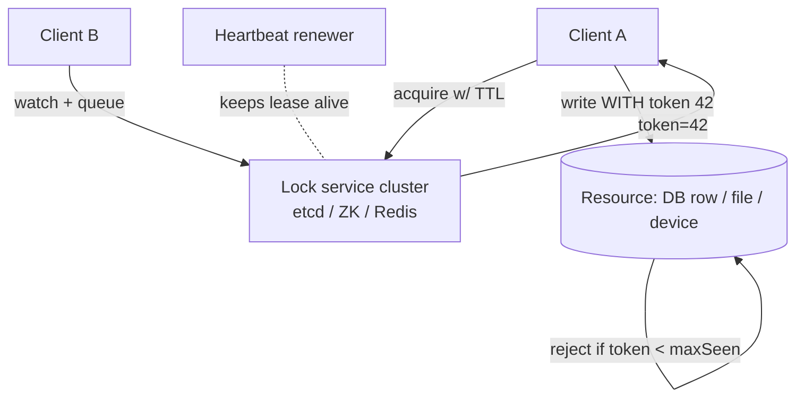
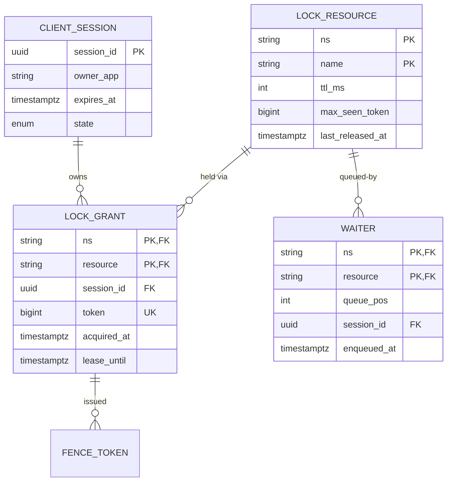

# Design Distributed Locking Service

## Blogs and websites

## Medium

## Youtube

## Theory

### Important Subtopics

1. Mutual exclusion semantics: safety vs liveness guarantees
2. Lease/TTL-based locking and deadlock prevention
3. Consensus-backed locks (ZooKeeper, etcd) vs clock-based (Redlock)
4. Fencing tokens and stale-holder protection
5. Fairness & queueing (lock convoys, starvation)
6. Reentrancy and lock upgrade/downgrade
7. Session/lease heartbeats and failure detection
8. Lock granularity hierarchies
9. The Kleppmann–antirez Redlock debate
10. Alternatives to locks: optimistic concurrency, leases on data itself
11. Client-side correctness (GC pauses, process freezes)
12. Testing lock correctness (chaos, pause injection)

*(The existing subsections below cover the problem statement, requirements, why locking is hard, Redis/Redlock, ZooKeeper, etcd approaches, fencing tokens, architecture, comparison, and design decisions.)*

### Problem Statement
Design a distributed locking service that provides mutual exclusion across distributed systems, ensuring only one process can access a shared resource at a time — even across multiple servers and data centers.

### Functional Requirements
- Acquire a lock on a named resource
- Release a lock
- Lock with TTL (auto-expire to prevent deadlocks)
- Try-lock (non-blocking attempt)
- Lock renewal (extend TTL while holding)
- Fencing tokens (monotonically increasing tokens to detect stale locks)

### Non-Functional Requirements
- **Safety**: At most one client holds a lock at any time (mutual exclusion)
- **Liveness**: Locks are eventually released (no deadlocks)
- **Fault tolerance**: Survives individual node failures
- **Latency**: Lock acquire/release < 10ms
- **Scale**: Millions of locks, thousands of lock operations/sec

### Why Distributed Locking is Hard

```
Scenario: Leader election with a lock

Process A acquires lock → becomes leader
Process A: long GC pause (30 seconds)
Lock expires (TTL)
Process B acquires lock → becomes leader
Process A wakes up → thinks it's still leader
→ TWO leaders = data corruption

This is the "split-brain" problem. 
Fencing tokens solve this (see below).
```

### Approach 1: Redis-Based (Redlock)

```
Single Redis instance:
  ACQUIRE: SET resource_name my_token NX PX 30000
    NX = only if not exists
    PX = TTL in milliseconds
    my_token = unique per client (UUID)
  
  RELEASE: Lua script
    if redis.call("get", key) == my_token then
      redis.call("del", key)
    end
    → Only release your own lock (compare token)

Problem: Single point of failure

Redlock (multi-node):
  1. Try to acquire lock on N independent Redis nodes (N=5)
  2. If acquired on majority (≥3), lock is held
  3. Lock validity = TTL - time_spent_acquiring
  4. If failed, release on all nodes

Criticism (Martin Kleppmann):
  - Clock drift can violate safety
  - Process pauses can cause split-brain
  - Not suitable for correctness-critical systems
```

### Approach 2: ZooKeeper-Based

```
Uses ZooKeeper's sequential ephemeral nodes:

1. Client creates ephemeral sequential node:
   /locks/resource-1/lock-000000001

2. Client reads all children of /locks/resource-1/
   → If my node is the smallest → I hold the lock

3. Otherwise, watch the node just before mine
   → When it's deleted → check again

4. On client crash → ephemeral node auto-deleted → lock released

Advantages:
  - No TTL needed (ephemeral = session-based)
  - Total ordering via sequential nodes
  - Consensus-based (ZAB protocol) → strong guarantees
  
Disadvantages:
  - Higher latency than Redis (~10-50ms)
  - Session timeout can cause false lock release
```

### Approach 3: etcd-Based

```
Uses etcd's lease mechanism:

  1. Create a lease: etcdctl lease grant 30 → lease_id
  2. Put key with lease: etcdctl put /lock/resource-1 "holder-A" --lease=lease_id
     → Key exists only while lease is alive
  3. Compete: Use etcd transactions (compare-and-swap)
     → If key doesn't exist → put (acquire)
     → If key exists → watch for deletion
  4. Keep-alive: Client sends heartbeats to renew lease
  5. On crash: Lease expires → key deleted → lock released

etcd uses Raft consensus → strong consistency
  → True mutual exclusion (no split-brain from clock drift)
```

### Fencing Tokens

```
Problem: Stale lock holders can corrupt data

Solution: Monotonically increasing fencing token

Lock Service:
  Lock acquired → return token = 34
  Lock expires, re-acquired → return token = 35

Resource (e.g., database):
  Tracks highest token seen
  Request with token 34 arrives AFTER token 35
  → Reject (stale lock holder)

Implementation:
  ZooKeeper: use znode version (czxid)
  etcd: use revision number
  Redis: use a counter key incremented on each lock grant
```

### Architecture

```
┌──────────┐                    ┌─────────────────────────┐
│ Service A │──acquire lock────▶│   Lock Service           │
│           │◀──token: 42──────│                          │
└─────┬─────┘                   │  Backend options:        │
      │                         │   - Redis (Redlock)      │
      │ write with token=42     │   - ZooKeeper            │
      ▼                         │   - etcd                 │
┌──────────┐                    └─────────────────────────┘
│ Database │
│ (checks  │
│  token)  │
└──────────┘
```

### Comparison

| Feature | Redis (Redlock) | ZooKeeper | etcd |
|---------|----------------|-----------|------|
| Latency | ~1-5ms | ~10-50ms | ~5-20ms |
| Safety | Weak (clock-dependent) | Strong (consensus) | Strong (consensus) |
| Liveness | TTL-based | Session-based (ephemeral) | Lease-based |
| Complexity | Simple | Moderate | Moderate |
| Use case | Performance-critical, best-effort | Correctness-critical | Kubernetes ecosystem |

### Key Design Decisions

| Decision | Choice | Reason |
|----------|--------|--------|
| Backend | etcd for correctness, Redis for speed | Match safety needs to use case |
| Deadlock prevention | TTL / lease expiration | Crashed clients don't hold locks forever |
| Stale lock protection | Fencing tokens | Prevent data corruption from paused clients |
| Lock granularity | Named resources (/lock/{resource}) | Fine-grained locking |
| Availability | 3-5 node cluster with consensus | Survive minority failures |

---

## Characteristics

- **Safety over liveness tension**: the entire field exists because you must choose which failure hurts — two holders (safety violation, corrupts data) or zero holders (liveness violation, stalls work). Consensus systems bias safety; TTL systems bias liveness; fencing recovers safety when both fail.
- **Time-dependence**: every practical lock relies on time (TTLs, session timeouts, clock sync) — meaning correctness is probabilistic under extreme pauses. Designs acknowledge this and add token checks at the resource rather than pretending otherwise.
- **Session-bound ownership**: locks bind to client identity + session; crashed clients release implicitly (ephemeral nodes/lease expiry) without explicit unlock messages.
- **Granularity economics**: coarse locks are simple but serialize everything; fine-grained multiply coordination overhead and deadlock-avoidance burden (ordering discipline).
- **Composition hazard**: holding multiple locks invites deadlocks unless acquisition ordering is globally defined — or cycles detected/broken by timeouts.
- **Observability-critical**: lock contention is invisible until it melts something; wait-time histograms and hold-duration tracking are first-class features.

---

## Components

- **Lock service cluster**
  *Purpose*: authoritative state for who holds what. *Responsibilities*: atomic acquire/release via CAS semantics (SET NX, znode creation, transactional puts), TTL/lease bookkeeping, watch/event notification for waiters, monotonic token generation. *Examples*: etcd quorum (Raft), ZooKeeper ensemble (ZAB), Redis primary+replicas.

- **Client library / SDK**
  *Purpose*: make correct usage trivial. *Responsibilities*: acquire-with-retry/backoff, heartbeat keep-alive loops, auto-release on close/finalizer, fencing-token plumbing to resource calls, reentrancy bookkeeping per thread/process. *Real-world*: Apache Curator's recipes over ZooKeeper set the standard.

- **Fencing-aware resources**
  *Purpose*: reject stale holders. *Responsibilities*: track highest-seen token; conditional writes require token ≥ stored; persist tokens with data. *Relationship*: converts lock-service failures from silent corruption into rejected stale writes. *Example*: storage layer checking `token` column before accepting updates.

- **Waiter queue/notification fabric**
  *Purpose*: efficient waiting instead of polling storms. *Responsibilities*: watches on predecessor nodes (ZK pattern), pub/sub channels (Redis), stream notifications; herd-mitigation by waking only the next-in-line. 

- **Admin/ops tooling**
  *Purpose*: inspect current holders, force-unlock stuck resources, audit history. *Responsibilities*: break-glass procedures with audit trails; holder-age alerting.



---

## Patterns

- **Lease-based locking (Redis SET NX PX)**
  *What*: key with owner token + expiry; Lua compare-and-delete release. *Solves*: simple fast mutual exclusion best-effort. *When*: perf-critical coordination where rare dual-holder tolerable (dedup leaders, cache refresh election). *Not when*: correctness-critical mutation gating without fencing. *Advantages*: ~1 ms ops, trivial ops burden. *Disadvantages*: clock/pause dependence; no fairness.

- **Sequential ephemeral nodes (ZooKeeper recipe)**
  *What*: create numbered ephemeral znode; smallest number holds lock; others watch immediate predecessor only. *Solves*: fair FIFO locking with crash-released sessions, no clocks involved in ownership transfer. *When*: correctness-sensitive coordination (leader elections, serialized batch jobs). *Cons*: latency (~10–50 ms), ZK ops burden.

- **etcd lease + transaction**
  *What*: attach key to lease; txn `compare(version(key)=0) then put`; watchers await deletion; keep-alive heartbeats. *Modern default* in Kubernetes ecosystem; Raft gives linearizable history immune to clock drift for ownership decisions.

- **Fencing at the resource** — covered in existing Theory; the pattern that upgrades any backend to safe-under-pauses.

- **Leader election as specialized lock**
  Long-lived "lock" held by current leader with continuity preference (failover only on genuine death); implementations: ZK leader recipe, Kubernetes Lease objects, Raft-native roles (embedded consensus). Distinct from work-item locks: tenure measured in minutes/hours.

- **Two-phase / hierarchical locking**
  Acquire child→parent order, release parent→child; prevents deadlock across hierarchies (directory trees, table→row). Java's ReentrantReadWriteLock analog at distributed scale rarely needed — prefer redesigning away multi-lock scopes.

---

## Benefits

- **Correct coordination of shared mutable state** across fleets — scheduled-job single-run guarantees, migration serialization, cache-refresh deduplication.
- **Crash-safety without human intervention**: leases/sessions auto-release, so dead processes never wedge systems permanently.
- **Fairness options** (ZK sequential): FIFO ordering prevents starvation under contention.
- **Composable primitives**: same infra yields leader election, barriers, queues — one dependency, many recipes.
- **Operational visibility**: holder inspection turns mysterious "nothing is happening" incidents into diagnosable states.

---

## Pros

- Well-understood theory + battle-hardened implementations (Curator, etcd clientv3, Redlock libraries).
- Millisecond-scale overhead acceptable for most coordination frequencies.
- Failure semantics explicit and testable (kill clients in staging, verify release).

## Cons

- Every implementation has failure modes under pauses/clocks/partitions — none grants absolute safety alone.
- Correct usage demands client discipline (fencing, idempotency) that teams routinely skip.
- Adds a critical infrastructure dependency to paths it protects.
- Contention hotspots degrade throughput sharply; naive retry storms amplify incidents.
- Multi-lock orchestration reintroduces textbook deadlocks at network scale.

---

## Challenges

- **Technical**: GC/VM pauses outliving TTLs (the Kleppmann scenario); clock skew between Redis nodes breaking Redlock assumptions; session-expiry false releases (ZK) causing brief dual-ownership windows; fencing adoption at legacy resources lacking token support.
- **Scalability**: thundering waiters on celebrity resources (herd wake-ups); lock-service write QPS ceilings during incident storms.
- **Performance**: consensus latency floor (~RTT×2) vs Redis speed trade-off; heartbeat traffic budgets at millions of locks.
- **Reliability**: lock-service partition behavior differs radically per backend (CP services refuse ops; Redis serves possibly-stale) — application must know which contract it bought.
- **Maintainability**: TTL value tuning across heterogeneous job durations (too short = churn, too long = stalled recovery); library version drift.
- **Operational**: capacity/quorum monitoring, disk-latency sensitivity of etcd/ZK (fsync-bound), runbooks for forced unlocks.
- **Security**: authn between clients and service (a compromised client can DoS by hogging locks); ACLs restricting which identities may lock which namespaces.

---

## Best Practices

- **Always use fencing tokens where resources can check them** — this single practice converts worst-case outcomes into log lines.
- **Keep critical sections short**: no I/O inside locks beyond the minimum; move slow work outside the protected region wherever algorithmically possible.
- **Set TTLs ≈ p99 operation time × margin**, with heartbeat renewal for longer work; document each lock's expected hold profile.
- **Acquire multiple locks in globally-defined order**; prefer single-lock designs; timeout all acquisitions (never block indefinitely).
- **Make locked operations idempotent anyway** — defense-in-depth against the residual race window.
- **Prefer not locking**: optimistic concurrency (version columns), idempotent task claims (`UPDATE ... WHERE status='PENDING'`), or single-writer architectures often eliminate the need entirely.
- **Alert on hold-duration outliers and waiter-queue depth** — they precede outages.
- **Test pause injection deliberately**: `-XX:+GCLogFilePath` chaos harnesses or `SIGSTOP` mid-critical-section verifying fence rejection works as claimed.

---

## When to Use / Not Use

**Use when**: coordinating side-effecting operations that cannot tolerate concurrency (migrations, leadership, exclusive device/file access); no cheaper primitive fits (DB unique constraints, atomic counters).

**Avoid/reduce when**: database transactions already serialize access (row locks suffice); work items claimable atomically (queue semantics beat locks); high-frequency contention suggests architectural fix (shard the resource) instead.

Alternatives ladder: DB unique constraints → optimistic version checks → atomic claim-by-update → leases → full lock service. Always descend this ladder before climbing.

Decision inputs: cost of dual-execution vs stall, pause probabilities, existing infra alignment (already running K8s ⇒ etcd natural), team familiarity.

---

## Use Cases

- **Scheduled-task exactly-once across replicas**
  *Problem*: 10 app instances with cron triggers would double-run nightly settlements. *Solution*: instance acquires lock `job:settlement:{date}` before executing; losers skip; fencing token passed to settlement writer. *Trade-off*: brief failover gap if holder dies mid-run — recovery path documented.

- **Distributed cache rebuild coordination**
  *Problem*: cache stampede after flush; thousands of threads rebuilding same expensive view. *Solution*: try-lock per key; winner rebuilds+populates; losers poll/wait then read warm cache. *Trade-off*: adds latency tail for losers vs DB collapse.

- **Kubernetes-style leader election for operators**
  *Problem*: custom controller must run once per cluster. *Solution*: Lease object acquisition with renewal periods (etcd underneath); controller-runtime handles mechanics. *Why suitable*: demonstrates locks-as-infrastructure-pattern rather than app-level curiosity.

---

## High-Level Design

```mermaid
sequenceDiagram
    participant A as Client A
    participant L as Lock Svc (etcd quorum)
    participant R as Resource (fenced)
    participant B as Client B

    A->>L: Acquire(res1, ttl=30s, sessionId)
    L-->>A: granted, token=42
    loop while working
        A->>L: KeepAlive(lease)
    end
    A->>R: mutate(data, token=42)
    R->>R: token >= maxSeen? yes → apply, maxSeen=42
    Note over L: A crashes; lease expires
    B->>L: Acquire(res1)
    L-->>B: granted, token=43
    B->>R: mutate(data, token=43)
    R-->>B: applied (maxSeen=43)
    Note over A,R: zombie A wakes, sends token=42
    A->>R: mutate(staleData, token=42)
    R-->>A: REJECTED (42 < 43)
```

Scaling strategy: namespace-partitioned lock service shards (hash(resource)); consensus clusters sized 3–5 per shard; waiter fan-out via watches avoids poll amplification; global operations routed to owning shard.

Failure handling: minority node loss → quorum continues; whole-cluster loss → configured policy (fail-open for perf locks, fail-closed for correctness locks) applied uniformly by SDK; partition heal → fencing resolves any transient dual-holders deterministically.

---

## Deep Dive

- **Redlock critique formalized**: safety requires knowing elapsed real time between events; process pauses violate knowledge locally; majority-quorum across independent-clock nodes narrows but doesn't eliminate the window. Antirez's rebuttal: finite uncertainty acceptable given fencing available. Interview-grade position: use Redlock for efficiency-locks; consensus+fencing for correctness-locks.
- **ZK herd avoidance internals**: watcher fires once per state change → re-set after handling; sequential-node design means each waiter watches exactly one predecessor, so N waiters generate O(N) total events per handoff rather than O(N²) broadcast storms.
- **Token persistence subtlety**: fencing only protects resources that durably store max-seen *atomically with* the guarded write; otherwise a crash between check and store replays the vulnerability — schema design includes token columns on guarded tables.
- **Clock-free liveness**: ZK sessions rely on server-side timeouts (not client clocks) — client learns of loss only via reconnect failure; hence dual-check pattern (verify session alive immediately before acting on lock assumption) in Curator's recipes.
- **Observability**: histograms of acquire-wait, hold-time, renewal-failure counts, fence-rejection rate (spike = paused/stale holders active!), per-resource contention top-K dashboards feeding auto-sharding suggestions.

---

## Data Modeling



Choices: uniqueness enforced structurally — at most one ACTIVE grant per `(ns,name)` (partial unique index); `token BIGSERIAL`-style monotonic per resource provides fencing values free; `lease_until` indexed for expiry sweepers; waiter positions assigned transactionally preserving FIFO fairness where enabled. Retention: grants ephemeral by nature; audit table records grant/release/fence-rejection events for postmortems (90 days).

---

## Java and Spring Boot Implementation

Redis-backed lock with fencing token (Lettuce + Lua release):

```java
@Service
public class RedisFencingLockService {

    private final StringRedisTemplate redis;
    private final AtomicLong localTokenFloor = new AtomicLong(0);

    private static final DefaultRedisScript<Long> RELEASE = new DefaultRedisScript<>("""
            if redis.call('get', KEYS[1]) == ARGV[1] then
                return redis.call('del', KEYS[1])
            else
                return 0
            end""", Long.class);

    public RedisFencingLockService(StringRedisTemplate redis) { this.redis = redis; }

    public Optional<FencedLock> tryAcquire(String resource, Duration ttl) {
        String ownerToken = UUID.randomUUID().toString();
        Boolean ok = redis.opsForValue().setIfAbsent(
                "lock:" + resource, ownerToken, ttl);
        if (!Boolean.TRUE.equals(ok)) return Optional.empty();

        long fencing = redis.opsForValue().increment("fence:" + resource);
        return Optional.of(new FencedLock(resource, ownerToken, fencing,
                () -> redis.execute(RELEASE, List.of("lock:" + resource), ownerToken)));
    }
}

public record FencedLock(String resource, String owner, long fencingToken, Runnable releaser)
        implements AutoCloseable {
    public void unlock() { releaser.run(); }
    @Override public void close() { unlock(); }
}
```

Usage with fenced resource write:

```java
@Component
public class SettlementJob {

    private final RedisFencingLockService locks;
    private final SettlementRepository repo;

    public void runDaily() {
        try (var lock = locks.tryAcquire("settlement:" + today(), Duration.ofMinutes(30)).orElse(null)) {
            if (lock == null) {
                log.info("Another instance holds settlement lock; skipping");
                return;
            }
            repo.executeWithFence(lock.fencingToken(), computeSettlement());
        }
    }
}
```

Repository enforcing the fence:

```java
@Repository
public class SettlementRepository {

    private final JdbcTemplate jdbc;

    @Transactional
    public void executeWithFence(long token, SettlementBatch batch) {
        Integer applied = jdbc.queryForObject("""
            INSERT INTO settlement_fence(resource, max_seen_token)
            VALUES (?, ?)
            ON CONFLICT (resource) DO UPDATE
              SET max_seen_token = EXCLUDED.max_seen_token
            WHERE settlement_fence.max_seen_token < EXCLUDED.max_seen_token
            RETURNING 1
            """, Integer.class, "settlement", token);
        if (applied == null) {
            throw new StaleLockException("Rejected stale fencing token " + token);
        }
        // ... proceed with the actual settlement writes ...
    }
}
```

Notes: the conditional upsert makes fence advancement atomic with acceptance; try-with-resources guarantees release even on exceptions; production adds renewal scheduling for long sections (recompute TTL at ⅓ remaining), Curator `InterProcessMutex` equivalents for ZooKeeper estates, and chaos tests SIGSTOP-ing holders to assert fence rejections. Spring Integration also ships `RedisLockRegistry`/`JdbcLockRegistry` when bespoke code isn't warranted.

---

## Real-World Examples

- **Kubernetes Lease objects** — every HA control-plane component (kube-scheduler, controllers) elects via etcd-backed leases; the planet's most-deployed locking deployment.
- **Apache Curator recipes** — standardize ZK locking/election/barriers; countless Hadoop-era systems still depend on them, proving API ergonomics matter as much as guarantees.
- **Chubby (Google)** — the original influential design: coarse-grained advisory locks with sessions/leases; its paper shaped ZooKeeper and a generation of coordination thinking (and famously anchored BigTable master elections).
- **Elasticsearch master elections / Kafka controller election** — production systems where lock semantics determine cluster stability; their historical split-brain incidents illustrate stakes directly.

---

## Interview Preparation

### Interview Questions

**Beginner**

1. **Why do distributed locks need TTLs at all?**
   Holders die without releasing; without expiry, resources stay locked forever requiring manual cleanup. TTL converts permanent wedges into bounded stalls — trading theoretical mutual exclusion (holder may outlive its lease) for guaranteed forward progress.
2. **What is a fencing token?**
   A monotonically increasing number returned with each lock grant; resources reject operations carrying tokens older than their max-seen, neutralizing stale holders who lost the lock without noticing (pauses, partitions).

**Intermediate**

3. **Explain the split-brain scenario with GC pauses and how each backend mitigates it.**
   Holder pauses past TTL; another acquires; original resumes unaware. Redis: pure TTL race — mitigated only via fencing at resources. ZooKeeper/etcd: session/lease death is server-judged, so resumed client discovers loss on next interaction — narrower window, still fenced for full safety. Walk the sequence diagram above.
4. **Compare Redlock against a single Redis with replication for locking. Which fails how?**
   Single-node+async-replica: failover loses the lock key entirely → dual holders trivially. Redlock: quorum across N independent primaries survives individual failures and bounds clock-skew damage; still vulnerable to long pauses absent fencing. Both fine for efficiency purposes; neither substitutes consensus+fences for correctness.
5. **How does ZooKeeper's sequential-node recipe provide fairness?**
   Creation order assigns strictly increasing sequence numbers; lock passes to numerically-next node, so waiters acquire in arrival order — FIFO by construction, unlike TTL races where luck decides.

**Advanced**

6. **Design locking for a workflow engine where steps must run exactly once across 200 executors.**
   Prefer claim-over-lock: atomic `UPDATE step SET status='RUNNING', executor=?, fence=? WHERE status='PENDING'` in the workflow DB — no separate lock service, crash recovery = reset RUNNING→PENDING past lease. Reserve true locks for non-database resources. Discuss why embedding coordination in the data's own transaction beats external locks when possible.
7. **Your etcd cluster's P99 write latency jumped 20× and locks are timing out fleet-wide. Root causes?**
   Disk fsync saturation (co-located noisy neighbor), compaction storms, huge watch fan-out after mass reconnects, or quorum loss leaving minority serving errors. Remedies: dedicated NVMe, tuned compaction, watch-batching, quorum alerts preceding user impact. Shows operational fluency with consensus systems' real failure shapes.

**Senior / system design**

8. **Architect a global locking service spanning regions for inventory reservation.**
   Challenge premise first: cross-region locks impose WAN RTTs on hot commerce paths — usually wrong tool. Better: home-region ownership of SKU inventory with async rebalancing of quota pools; locks only within region. If genuinely needed: region-partitioned consensus clusters, routing by resource affinity, fencing end-to-end. Senior signal: questioning requirements before scaling machinery.
9. **How would you prove your lock implementation correct?**
   Model checking (TLA+ spec of grant/release/expiry/fencing), linearizability testing against histories (Porcupine-style), chaos injection (pause holders, partition service, skew clocks) asserting invariant "at most one successful unfenced write per interval". Emphasize invariants-first thinking.

### Common Mistakes

- Unlocking without ownership checks (deleting someone else's key) — Lua/token compare mandatory.
- Treating lock acquisition as transaction substitute — DB constraints still required beneath.
- Infinite blocking acquires without timeouts — one wedged holder freezes caller fleets.
- Ignoring renewal for long sections → mid-operation eviction chaos.
- Skipping fencing because "our jobs are short" until one bad GC day corrupts ledger data.

### Expected discussion points

Safety-vs-liveness framing, time's unavoidable role, fencing as universal patch, ladder-of-alternatives before locking, and honest comparison fluency across Redis/ZK/etcd including operational costs.

