# Distributed Messaging Queue — Kafka vs RabbitMQ

> A distributed messaging queue decouples producers from consumers through a durable, replicated, partitioned log (Kafka) or a broker-routed queue (RabbitMQ), providing temporal decoupling, failure isolation, delivery semantics, and replayable event streams at scale.

## Blogs and websites

## Medium

## Youtube

- [16. System Design - Distributed Messaging Queue | Design Messaging Queue like Kafka, RabbitMQ](https://www.youtube.com/watch?v=oVZtzZVe9Dg)

---

## Theory

### Topics Covered

1. [Introduction / Problem Statement](#introduction--problem-statement)
2. [Characteristics](#characteristics)
3. [Pros](#pros)
4. [Cons](#cons)
5. [Use Cases](#use-cases)
6. [Components](#components)
7. [Architectural Patterns](#architectural-patterns)
8. [Benefits](#benefits)
9. [Challenges](#challenges)
10. [Best Practices](#best-practices)
11. [When to Use / When Not to Use](#when-to-use--when-not-to-use)
12. [Data Model and API](#data-model-and-api)
13. [Partitions & Consumer Groups](#partitions--consumer-groups)
14. [Delivery Semantics](#delivery-semantics)
15. [Offsets, Acknowledgments & Visibility](#offsets-acknowledgments--visibility)
16. [Replication & Durability](#replication--durability)
17. [Ordering Reality](#ordering-reality)
18. [Schema Management](#schema-management)
19. [Two Philosophies (Kafka log vs RabbitMQ broker)](#two-philosophies-kafka-log-vs-rabbitmq-broker)
20. [Replication Strategies](#replication-strategies)
21. [Failure Detection and Membership](#failure-detection-and-membership)
22. [High Availability and Scalability](#high-availability-and-scalability)
23. [Performance and Optimization](#performance-and-optimization)
24. [CAP Theorem and Consistency Trade-offs](#cap-theorem-and-consistency-trade-offs)
25. [Encryption and Key Management](#encryption-and-key-management)
26. [Authentication and Authorization](#authentication-and-authorization)
27. [Security Threats and Mitigations](#security-threats-and-mitigations)
28. [Observability and Logging](#observability-and-logging)
29. [Real-World Implementations](#real-world-implementations)
30. [Java and Spring Boot Implementation Guide](#java-and-spring-boot-implementation-guide)
31. [Interview Questions and Answers](#interview-questions-and-answers)

---

### Introduction / Problem Statement

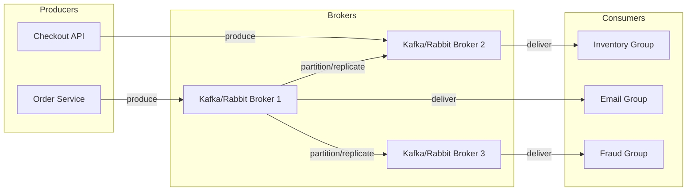

*A distributed messaging queue inserts a durable, replicated, partitioned buffer between producers and consumers so that services communicate through an append-only log rather than synchronous calls.* The core problem it solves is temporal and failure-domain coupling: producers emit events and resume immediately, while consumers process at their own pace, retry on failure, and re-read history when needed — turning intermittent outages, bursty traffic, and buggy consumers into recoverable, replayable conditions rather than cascading failures.

**Why this matters**

- Synchronous request/response chains fail fast and propagate pressure: a slow downstream service stalls its callers, and an unavailable one breaks the call entirely.
- A message queue replaces the call with a durable record, so producers and consumers drift independently and independently scale, deploy, and fail.
- Replayability turns consumer bugs into rollbacks instead of data-loss incidents — reset the offset and re-process history with the fixed code.

---

### Characteristics

Each point is explained in detail below.

- **Durable append-only log (Kafka) or broker-routed queue (RabbitMQ)**
  Kafka persists records to replicated segment files on disk; RabbitMQ persists to an Erlang term store or pluggable backends. Durability turns the queue into an incident-recovery buffer and a replayable source of truth for derived systems.

- **Horizontal parallelism via partitioning**
  Topics are split into partitions (Kafka) or queues (RabbitMQ) distributed across broker nodes. Throughput scales by adding partitions/consumers; ordering is preserved per-partition for a given key without global serialization.

- **Decoupled lifecycles**
  Producers never block on consumer readiness; consumers join, leave, and fail independently. Retention decouples processing speed from data lifetime.

- **At-least-once default posture**
  Retries and rebalances routinely duplicate deliveries; idempotency is designed in (unique keys, upserts) rather than assumed absent.

- **Backpressure tolerance**
  The queue absorbs bursts — consumers poll at a sustainable rate (pull model) or brokers throttle pushes (RabbitMQ credit flow), so downstream brownouts do not stall producers.

- **Replay transforms architecture**
  Fix a buggy consumer by resetting the offset and reprocessing history — impossible in delete-on-consume brokers and transformative operationally.

- **Delivery-semantics spectrum**
  at-most-once (fast, lossy), at-least-once (default, duplicates possible), exactly-once (idempotent producers + transactional writes, with application-level dedupe still essential).

- **Rich routing vs. log append**
  RabbitMQ offers exchanges/bindings (topic, headers, fanout) with server-side routing. Kafka offers client-side partition selection; routing logic lives with the producer.

---

### Pros

- **Extreme throughput per commodity node**
  Sequential disk appends, zero-copy sends, and micro-batched requests let Kafka reach millions of messages/second per cluster while RabbitMQ handles tens of thousands to ~100K messages/second comfortably.

- **Clean horizontal scaling story**
  Add partitions for parallelism, add brokers for storage/throughput, add consumer-group members to parallelize processing — bounded by partition count.

- **Multi-subscriber reuse without duplication infrastructure**
  One produced event serves unlimited future subscribers; each group reads independently from the log.

- **Replayability for recovery and backfills**
  Resetting consumer offsets reprocesses history for bug fixes, backfills, or new downstream systems built atop an existing stream.

- **Replayability for analytics and audit**
  Retained topics satisfy compliance replays, ML feature recomputation, and audit-trail reconstruction from a single durable source.

- **Ecosystem gravity**
  Kafka offers Connectors, ksqlDB, Streams, and First/Apache Flink/Spark integration. RabbitMQ offers plugins (Shovel, Federation, MQTT, STOMP) and a mature client ecosystem.

- **Rich delivery semantics and routing (RabbitMQ)**
  Per-message acknowledgments, priorities, TTL, dead-lettering per queue, and header/topic exchange routing give fine-grained control over delivery behavior.

- **Operational clarity for task queues**
  RabbitMQ's delete-on-ack model makes storage reasoning simple for short-lived work-distribution workloads.

---

### Cons

- **Operational weight (Kafka)**
  JVM tuning, disk capacity planning (retention × ingress), rebalance storms, partition-count rigidity (increasing later is disruptive for keyed topics), and a richer metric surface to monitor.

- **Ordering subtleties misunderstood**
  Guarantees exist only within a partition and erode across rebalances, retries, and parallel processing — a frequent source of intermittent "impossible" bugs.

- **Pull-model tail latency**
  Kafka consumers poll, adding millisecond-class latency versus push brokers for low-latency tasking.

- **Rebalancing pauses**
  Without cooperative protocols tuned, rebalances can pause consumption and violate SLOs.

- **Schema governance requires discipline**
  Tooling cannot force organizational convention; breaking changes still reach consumers without CI-checked compatibility gates.

- **RabbitMQ scale boundaries**
  Cluster-wide coordination and single-queue throughput ceilings make multi-million-message-per-second fan-outs a better fit for Kafka-class logs.

- **RabbitMQ mirroring limits**
  Classic queue mirroring does not scale across many nodes safely; quorum queues (Raft) trade some performance for safety.

- **Dual-philosophy complexity**
  Mixing Kafka and RabbitMQ means two security, monitoring, and operational models — only justified when each matches a distinct workload.

---

### Use Cases

- **E-commerce order event backbone**
  *Problem*: 30 services react to order lifecycle events; synchronous coupling created outage chains. *Solution*: `orders.events` topic keyed by `orderId`; each service is its own consumer group; CDC-outbox publishing from the order-management system ensures atomicity. *Trade-off*: eventual downstream views (seconds) accepted for total decoupling; per-order ordering guaranteed via key partitioning.

- **Clickstream ingestion → analytics**
  *Problem*: 500K events/sec peak; warehouse loads must not drop events nor block user-experience latency. *Solution*: lightweight SDK → Kafka (`acks=1` tolerable for clickstream) → Flink enrichment → Iceberg sink, batch-committed; raw topic retained for 30 days for reprocessing after model or schema changes. *Trade-off*: storage cost versus recompute flexibility — retention tuned quarterly against actual replay usage.

- **Payment processing work distribution**
  *Problem*: payment-service-provider calls are slow and flaky; bursts at flash-sale events. *Solution*: payment-request queue (RabbitMQ/SQS-style) with visibility timeouts matched to provider latencies, bounded-retry dead-letter topology, and priority lanes separating card-present from batch settlements. *Trade-off*: a push broker chosen over a log because per-message ack and priority semantics fit better than replay.

- **Cross-service communication / event-driven microservices**
  *Problem*: services share growing numbers of integration points; deploys couple. *Solution*: services emit domain events to shared topics consumed by independent groups; each team owns its consumer and its schema evolution. *Trade-off*: eventual consistency between services — acceptable where idempotent upserts absorb ordering drift.

---

### Components

- **Broker cluster**
  *Purpose*: store and serve streams/queues. *Responsibilities*: partition leadership, replication, produce/fetch handling, retention/compaction enforcement, controller coordination (KRaft replaced ZooKeeper in modern Kafka). *Relationships*: fronted by producers and consumers; coordinates via controller; governed by schema registry. *Real-world example*: a 6-broker Kafka cluster with replication factor 3, or a 3-node RabbitMQ cluster with quorum queues.

- **Partition / log**
  *Purpose*: ordered, durable, immutable sequence — the unit of parallelism and ordering. *Responsibilities*: segment files on disk, offset→position indexing for O(1) reads, sequential writes (the throughput secret), truncation and compaction. *Relationships*: replicates to followers within an ISR; assigned to exactly one consumer in a group. *Real-world example*: a Kafka topic-partition stored across segment files per broker.

- **Producer client**
  *Purpose*: emit messages into the correct partition. *Responsibilities*: batching (linger.ms vs batch.size), compression (lz4/zstd/snappy), partitioner logic (key→partition hashing), idempotent retries, schema registration. *Relationships*: talks to any broker's partition leader; optionally consults the schema registry. *Real-world example*: the `kafka-clients` Producer or a `RabbitTemplate`.

- **Consumer clients & groups**
  *Purpose*: read streams at their own pace and acknowledge progress. *Responsibilities*: subscription, partition-assignment protocol (group coordinator + generation IDs), offset commits, processing loops, cooperative rebalancing participation. *Relationships*: one group member owns a partition; many groups fan out independently. *Real-world example*: a Kafka consumer group `fulfillment` reading `orders.events`.

- **Schema registry**
  *Purpose*: contract enforcement across producers and consumers. *Responsibilities*: schema storage and versioning, compatibility validation (backward/forward/full), serving deserializers. *Relationships*: consulted by producers before write and consumers before read. *Real-world example*: Confluent Schema Registry or Apicurio.

- **Coordinator / controller plane**
  *Purpose*: group management and partition leadership. *Responsibilities*: broker controller election, partition leader election within ISR, consumer-group rebalance orchestration, under-replicated-partition detection. *Relationships*: brokers gossip state; lag-exporters scrape the coordinator. *Real-world example*: Kafka's controller broker or RabbitMQ's quorum queue leaders.

- **Offset store**
  *Purpose*: track consumption position per group+partition. *Responsibilities*: persist last-committed offset, expose lag via group-coordinator APIs. *Relationships*: written by consumers, read by lag monitors. *Real-world example*: Kafka's internal `__consumer_offsets` topic.

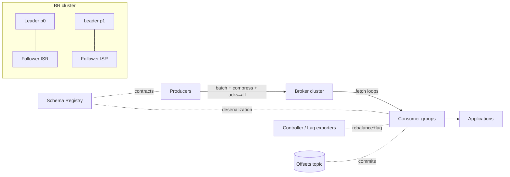

*Producers write batched, compressed records to partition leaders (acks=all); followers replicate within the ISR; consumer groups fetch independently while the schema registry and offset store provide contracts and position tracking.*

---

### Architectural Patterns

- **Competing consumers (work queue)**
  *Problem*: distribute a unit of work across a fleet without double execution. *How*: a single partitioned queue whose group members split partitions; only one member processes each partition's records. *When*: embarrassingly parallel jobs. *Ordering note*: within-partition serial only — shard tasks deliberately if cross-task ordering matters.

- **Publish-subscribe fan-out**
  *Multiple independent consumer groups* each receive every message (analytics + email + audit reading the same `order-events` topic). Decoupling win: adding a subscriber touches nothing upstream — it only subscribes.

- **Transactional outbox → CDC**
  *Problem*: a database write and an event publish must be atomic without a distributed transaction. *How*: write an outbox row in the same DB transaction; Debezium tails the WAL into Kafka. Solves dual-write anomalies permanently. Ubiquitous in serious estates.

- **Dead-letter + retry-topology**
  *What*: failures route to `{topic}.retry.5m` → re-drive; exhausted → `.dlq`. *Why separate topics not in-place redelivery*: backoff becomes natural, poison isolation is clean, and monitoring is trivial per stage. *Anti-pattern*: infinite immediate retries melting downstream during incidents.

- **Log compaction for state**
  *What*: compacted topics retain only the latest-per-key forever — table semantics inside a log. *Uses*: changelog feeds, key-value state restoration for stream processors, config broadcast.

- **Claim-check pattern**
  *Large payloads offloaded to object storage; the message carries only a reference.* Keeps brokers fast (small records), storage tiered appropriately, and network/disk I/O low.

- **Exactly-once pipeline (Kafka Streams)**
  Consume-transform-produce inside transactions with offsets committed atomically to output partitions; consumers of outputs use `read_committed`. Works within Kafka-to-Kafka boundaries; external side effects still need idempotency.

- **Request-reply over messaging**
  *What*: a producer publishes a request to a queue and blocks on a reply queue keyed by a correlation ID. *When*: RPC-style decoupling with durable delivery and retries. *Trade-off*: added latency and complexity — prefer native RPC unless durability matters.

---

### Benefits

- **Absorbs any burst** between mismatched capacities — checkout spikes stop cascading into fulfillment outages.
- **Temporal decoupling enables independent deploys and scaling** of producers and consumers, cutting organizational coordination costs.
- **Replay turns bugs into rollbacks**: a bad enrichment deployed can be fixed, the offset rewound, and downstream state regenerated.
- **Backpressure made structural**: consumer-lag metrics give hours of warning before user-visible impact.
- **Fan-out economics**: one produced event serves unlimited future subscribers — new products launch atop existing streams.
- **Durable audit spine**: retained topics satisfy compliance replays and ML feature recomputation alike.
- **Failure isolation**: a slow or down consumer stalls only itself; producers and other subscribers are unaffected.
- **Operational leverage**: a single backbone supports task queues, event streams, CDC, and analytics integration rather than each needing bespoke plumbing.

---

### Challenges

- **Technical**: duplicate suppression across rebalances (commit-vs-process races); poison-message quarantine; large-message handling (claim-check discipline); clock skew in timestamp-based operations; commit-placement errors that convert at-least-once into at-most-once (loss) or at-most-once into at-least-once-with-unbounded-lag.

- **Scalability**: partition-count planning (too few = throughput ceiling, too many = open-file/memory overhead and painfully long rebalances); hot partitions from skewed keys (celebrity tenant) needing key-salting strategies; consumer groups cannot exceed partition count without idle members.

- **Performance**: consumer-lag death-spirals during downstream brownouts; fetch tuning (`fetch.min.bytes` vs latency); JVM garbage-collection pauses on brokers causing ISR flapping; tail-latency coupling when a single slow consumer in a group stalls the group's commit cadence.

- **Reliability**: unclean leader election silently losing data when misconfigured; `min.insync.replicas` misalignment with `acks` settings voiding durability promises; cross-cluster replication (MirrorMaker 2 / Cluster Linking) consistency during failovers; retention-expiry of records still needed by a late consumer.

- **Maintainability**: schema evolution discipline across many teams; topic sprawl governance; live cluster protocol rolling upgrades; dead-letter and retry-topic taxonomy drift.

- **Operational**: capacity forecasting (retention × ingress); disk balancing across brokers (especially with tiered storage hybrids); security hardening (SASL/TLS/ACLs) without collapse under certificate rotation churn; rebalance-storm attribution.

- **Security**: multi-tenancy isolation; encryption in transit and at rest; authorization granularity (topic/cluster-level ACLs, not just transport); audit trails for produce/consume/delete.

---

### Best Practices

- **Design keys for ordering and load balance together**: hash stable business IDs; salt pathological hot keys (`orderId + shardSuffix`) accepting cross-shard aggregation costs consciously.
- **Make consumers structurally idempotent**: upsert sinks keyed by event ID; dedupe tables for non-idempotent side effects; never assume at-most-once delivery.
- **Set retention by recovery needs, not habit**: enough to survive the worst-case rebuild plus reprocessing windows; compacted topics for state streams and changelog feeds.
- **Monitor consumer lag as the primary health metric**: alert on trend divergence, not just static thresholds — lag is the leading indicator of downstream brownout.
- **Use dead-letter topologies deliberately**: bounded retries with backoff stages; page on DLQ inflow rate; never retry instantly and infinitely.
- **Enforce schemas at produce time** with CI-checked compatibility gates; forbid unregistered schema deployments.
- **Right-size acks and durability per topic class**: `acks=all, min.insync.replicas=2` for money paths; relaxed for clickstream where loss tolerance exists.
- **Prefer cooperative-sticky assignment** and avoid aggressive `max.poll.interval` misconfiguration — when poll-interval is shorter than processing time, the consumer is kicked out and triggers a rebalance loop.
- **Isolate blast radius by environment and domain**: never share production topics with experiments; use separate clusters or principals.
- **Right-size partition count** at provisioning time: partitions ≥ max consumers in any group; account for future scale but avoid over-partitioning.
- **Test failure modes with Testcontainers**: assert exactly-once processing under redelivery storms; simulate rebalances by stopping containers mid-batch; verify DLQ behavior with poison messages.

---

### When to Use / When Not to Use

**Choose a log (Kafka-class) when** you need event streaming, an integration backbone, replay-driven pipelines, high-throughput telemetry, CDC transport, or anywhere multiple subscribers evolve independently over time. It is the right choice when the stream itself is a product, when replayability has value, or when throughput far exceeds what a broker-routed queue can sustain.

**Choose a classic broker/queue (RabbitMQ/SQS-class) when** you need rich server-side routing, per-message acknowledgments with priorities, request-reply patterns, TTL and dead-lettering per queue, or simpler operations at moderate scale where delete-on-ack keeps storage reasoning trivial.

**Skip a dedicated messaging system when**: simple background jobs within a single application exist (DB-backed job tables suffice — see the job-scheduler topic); synchronous request/response dominates (native RPC beats messaging ceremony); scale is tiny and Redis Streams covers the need; or the fan-out and durability guarantees of a real queue provide no marginal benefit over a periodic poll of a shared table.

Decision inputs that should drive the choice: throughput targets, subscriber multiplicity and evolution, replay value, ordering-requirement shape, team operational maturity, and latency-sensitivity profile.

---

### Data Model and API

The operational metadata of a distributed messaging system can be modeled as entities with primary and foreign keys, while the message payload itself is described by schemas (Avro/Protobuf) with versioning rules.

Core entities and their keys:

- **CLUSTER** (`id` PK) — a logical broker group.
- **BROKER** (`id` PK, `cluster_id` FK) — a node participating in a cluster.
- **TOPIC** (`name` PK, `cluster_id` FK) — a named stream category.
- **PARTITION** (`topic` PK,FK, `id` PK) — an ordered, immutable slice of a topic; `leader_broker` FK references BROKER, `isr_list` references BROKER.
- **CONSUMER_GROUP** (`group_id` PK) — a named set of consumers sharing a subscription.
- **GROUP_PARTITION_ASSIGNMENT** (`group_id` PK,FK, `topic` PK,FK, `partition` PK,FK) — binds a group to the partitions it owns.
- **SCHEMA** (`id` PK) — a versioned contract; **SCHEMA_VERSION** (`schema_id` PK,FK, `version` PK) evolves it.

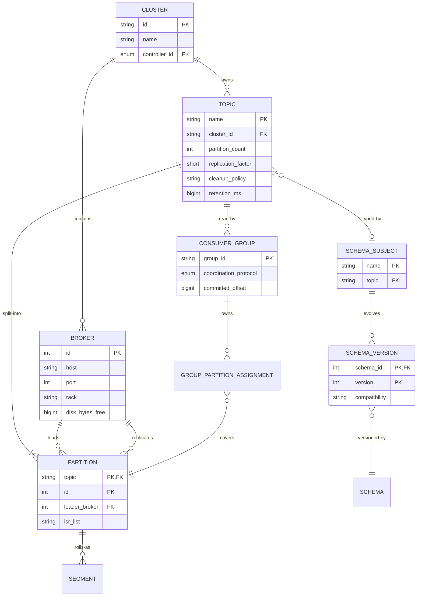

*The entity diagram models operational metadata — clusters, brokers, topics, partitions, consumer groups, and schema subjects — with their primary and foreign keys; the message payload itself is versioned separately by the schema registry.*

#### API Contract (produce / consume / manage)

| Method | Endpoint | Purpose | Request Body | Response |
|---|---|---|---|---|
| POST | `/topics/{topic}` | Create a topic | `{ "partitions": 6, "configs": {"replication.factor": 3} }` | 201 Created |
| POST | `/topics/{topic}/partitions` | Add partitions | `{ "count": 12 }` | 202 Accepted |
| POST | `/topics/{topic}/records` | Produce a message | `{ "records":[{"key":"...","value":"..."}] }` | 200 OK + base offsets |
| GET | `/topics/{topic}/records` | Consume (long-poll) | `?partition=0&offset=0&timeout=1000&max_bytes=1048576` | JSON array of records |
| POST | `/consumers/{group}` | Create consumer | `{ "name":"c1","format":"json" }` | 200 OK + instance_id |
| POST | `/consumers/{group}/instances/{name}/subscription` | Subscribe | `{ "topics":["my-topic"] }` | 200 OK |
| GET | `/consumers/{group}/instances/{name}/records` | Fetch records | `?timeout=1000&max_bytes=1048576` | JSON array |
| POST | `/consumers/{group}/instances/{name}/offsets` | Commit offsets | `{ "offsets":[{"partition":0,"offset":100}] }` | 200 OK |
| DELETE | `/consumers/{group}/instances/{name}` | Destroy consumer | — | 204 No Content |

#### HTTP Status Codes

| Code | Meaning |
|---|---|
| 200 | Request successful, data returned |
| 201 | Resource created |
| 202 | Request accepted (async operation) |
| 204 | No content (successful delete/consume) |
| 400 | Bad request (invalid payload) |
| 401 | Authentication required |
| 403 | Forbidden (insufficient permissions) |
| 404 | Topic/consumer not found |
| 409 | Conflict (topic exists, concurrent modification) |
| 429 | Rate limited |
| 503 | Service unavailable (broker down) |

**Interview questions and answers**

- **Q: How does a partition's log give you O(1)-ish reads by offset?**
  **A:** Each segment maintains an offset→position index (and a time→offset index); the broker seeks directly to the byte position, so fetching by offset avoids scanning.

- **Q: What is the relationship between a topic, a partition, and a consumer group?**
  **A:** A topic is split into N partitions; a consumer group subscribes to the topic and is assigned a subset of partitions such that each partition is owned by exactly one member — giving ordered, exclusive, parallel consumption.

---

### Partitions & Consumer Groups

The scaling unit is the **partition**: an ordered, immutable append-only sequence replicated across in-sync replicas. Partitions give both parallelism and per-partition ordering simultaneously, which is the tension that defines the scalability ceiling.

```mermaid
flowchart TB
    P1[Producer] -->|key=A → p0| T0[Topic T - partition 0]
    P1 -->|key=B → p1| T1[partition 1]
    P1 -->|key=C → p2| T2[partition 2]
    subgraph CG[Consumer group G]
        C0[Consumer 1] -->|assigned| T0
        C1[Consumer 2] -->|assigned| T1 + T2
    end
    T0 --> C0
    T1 --> C1
    T2 --> C1
```

*Partitions are sharded by key so a single consumer owns each one (preserving order) while many consumers in a group process different partitions in parallel.*

Rules that make this work:

- Only **one consumer within a group** owns a partition at a time → per-partition ordering without locks.
- Different groups read independently (fan-out by subscription) — adding a subscriber creates a new group and never steals capacity from existing ones.
- **Rebalancing** redistributes partitions when members join/leave. The historical "eager" rebalance stops the world (revoke-all-then-assign); the **incremental cooperative** rebalancing protocol only moves the partitions that need to move, avoiding full pauses.
- **Key→partition hashing** preserves ordering per entity (all events for `order-123` land on one partition), which is the primary reason business keys are partitioned by rather than round-robin.
- The group's steady-state throughput is capped at `min(consumers, partitions)`; extra consumers sit idle, so partition count is a deliberate provisioning decision.

**Interview questions and answers**

- **Q: Why can't you simply add more consumers than partitions to increase throughput?**
  **A:** A partition is owned by exactly one consumer in a group, so a consumer with zero partitions contributes nothing. To scale further you must add partitions — but for keyed topics that changes the key→partition mapping and is effectively a migration requiring dual-write.

- **Q: How does a consumer know where to resume after a crash?**
  **A:** It resumes from the last committed offset for each partition it is re-assigned. If rebalances or crashes occur between processing and committing, the offset reverts to the last commit and the records are redelivered — hence idempotency is mandatory.

---

### Delivery Semantics

Delivery semantics define what happens to a message if a consumer crashes or a retry occurs. They are the single most important correctness decision a team makes.

- **At-most-once**: consume, then commit the offset before processing. If the process crashes after commit but before finishing, the message is lost. Fast and lossy — rarely acceptable for business-critical streams.

- **At-least-once** (the default in Kafka and RabbitMQ with manual acks): process the message, then commit. If the crash happens between processing and committing, the message is redelivered — so duplicates are assumed, and the application must be idempotent. This is the industry workhorse.

- **Effectively-once**: at-least-once plumbing plus **idempotent consumers** (upserts keyed by event ID, dedupe tables). Kafka adds mechanical support that reduces plumbing burden: **idempotent producers** (`PID` + sequence numbers prevent broker-side duplicates on retry) and **transactional produce-consume-commit loops** for stream pipelines that read, transform, and write atomically. Application-level dedupe for external side effects remains essential regardless.

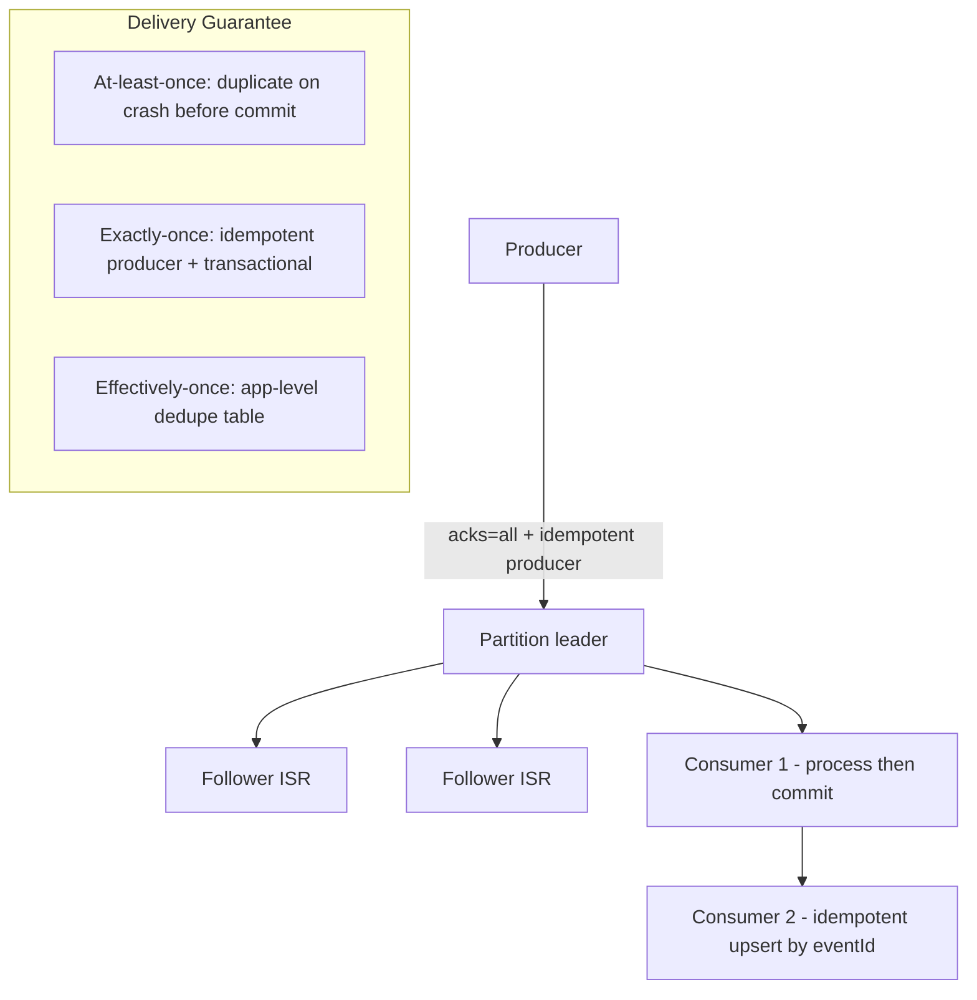

*The delivery guarantee is not a broker setting alone — it is the composition of producer acks, broker replication, producer idempotence, consumer commit timing, and application-level dedupe.*

**Interview questions and answers**

- **Q: Where do duplicates arise in an "at-least-once" system?**
  **A:** (1) consumer processes a record then crashes before committing the offset → rebalance redelivers it; (2) producer times out with `acks=all`, retries, and the original batch was actually committed. Fixes: idempotent consumers for case 1, idempotent producers for case 2.

- **Q: True or false — enabling the idempotent producer gives you exactly-once delivery.**
  **A:** False. It gives exactly-once *production* (no broker-side duplicates), but the consumer can still redeliver on rebalance. End-to-end exactly-once requires idempotent consumers plus (for multi-partition effects) transactions.

---

### Offsets, Acknowledgments & Visibility

This section unifies the three ways systems track "has this message been handled."

- **Kafka**: consumers commit offsets (to the internal `__consumer_offsets` topic via `commitSync`/`commitAsync`) representing "processed through here." Committing *before* processing yields at-most-once; committing *after* yields at-least-once. Auto-commit is convenient but dangerous during rebalances.

- **RabbitMQ / AMQP**: explicit `basic.ack` (and `nack`/`reject` with requeue). Unacked deliveries are redelivered on channel close — this is RabbitMQ's analog of a visibility timeout. `autoAck=false` is mandatory for any durability guarantee.

- **SQS-style visibility timeout**: a message is hidden while being processed; if not deleted within the timeout it reappears for redelivery. This is the polling-friendly variant of the same idea and maps onto a consumer's commit timing.

- **Manual vs auto**: auto-commit/auto-ack shifts commit timing out of the application's control, which is the most common cause of silent data loss or unbounded duplicates. Prefer manual commits acks aligned with business-commit boundaries.

- **Transactional commits**: in Kafka Streams and transactional producers, consumed offsets are committed as part of the transaction so a downstream failure rolls the consume+produce both back atomically.

**Interview questions and answers**

- **Q: What is the danger of `enable.auto.commit=true` with a long processing time?**
  **A:** The offset auto-commits on a timer regardless of processing completion. If processing is slower than the commit interval and the consumer crashes, the message is lost. Conversely it can also re-deliver records still in flight during a rebalance.

- **Q: How does a visibility timeout compare to a Kafka offset commit?**
  **A:** Both are a "claim then confirm" contract. The visibility timeout starts a clock when the message is delivered, while a Kafka offset commit is explicit and position-based — you choose when "done" means.

---

### Replication & Durability

Each partition has one **leader** and N **followers**; only **in-sync replicas (ISR)** count toward `acks=all`. Durability is a property of the *write path configuration*, not a default.

- Leader handles all reads and writes for a partition; followers replicate the log by fetching from the leader (followers fetch like consumers).
- `acks=all` (producer) + `min.insync.replicas=2` with replication factor 3 survives one broker loss **without availability or durability loss**. These three settings form the canonical durability contract.
- Leader election prefers the **most-caught-up ISR member**; if no ISR member is available, **unclean leader election** (off by default) would promote an out-of-sync replica, trading availability for potential data loss — the setting that separates ledgers from caches.
- **Retention** bounds durability on the read side: a topic with 7-day retention cannot satisfy a consumer that rebalances later than that. **Log compaction** retains the latest-per-key indefinitely for changelog/table semantics.
- **Segment files** and `fsync` policy (`log.flush.interval.messages` / `log.flush.scheduler.interval.ms`) control when data hits disk; Kafka's default of relying on the OS page cache + replication (rather than per-message fsync) is why throughput is high and latency is bounded.

**Interview questions and answers**

- **Q: How many broker failures can a replication-factor-3 topic tolerate without data loss?**
  **A:** One — because two ISR replicas remain, satisfying `min.insync.replicas=2`. A second failure with both remaining replicas in the ISR would breach the quorum and producers using `acks=all` would (correctly) start erroring.

- **Q: Why does turning on unclean leader election risk data loss?**
  **A:** It allows a replica that lagged behind the leader to become leader, so some acknowledged records (present only on the old leader) are gone. For money-leash paths this is forbidden; for best-effort telemetry it may be acceptable.

---

### Ordering Reality

The honest answer is: ordering is **only** within a partition, **only** while it has a single producer-side writer sequence, **only** until a rebalance or redelivery interleaves, and **only** on the consumer side if you don't parallelize processing of one partition across threads.

- Per-partition ordering is strict as long as a single producer sequence writes the partition and the consumer processes it serially.
- **Retried batches** with `max.ins.flight > 1` *can* reorder without idempotent producers; idempotent producers preserve per-partition order on the broker side.
- **Consumers processing partitions in parallel threads break ordering** unless keyed dispatch into a single thread per key is used.
- Cross-partition ordering is **not** guaranteed — never assume global order across a topic. If you need global order you must use a single partition (a throughput and scaling ceiling).
- Rabbit reordering can occur with multiple consumers on a queue, multiple delivery threads, or `x-single-phase` (ack reordering) unless queue FIFO modes are enabled.

**Interview questions and answers**

- **Q: A consumer sees events for the same `orderId` out of order. Name every mechanism that could have caused it.**
  **A:** (1) the events were routed to different partitions (key partitioning broken); (2) the partition was consumed by more than one thread in parallel; (3) a rebalance redelivered already-processed records; (4) idempotent-producer was off and `max.ins.flight>1` reordered on the broker; (5) for RabbitMQ, multiple consumers or ack reordering on a non-FIFO queue.

- **Q: When can you safely drop to a single partition to preserve global order?**
  **A:** Only when throughput and key-distribution constraints make the single-partition ceiling acceptable. It eliminates parallelism, so treat it as a last resort — and design the key schema so the hot-key problem is bounded.

---
### Schema Management

Messages outlive code; payloads need contracts. Without them, a silent field rename breaks 40 downstream jobs at deploy time.

- **Avro/Protobuf schemas** are registered centrally (Confluent Schema Registry, Apicurio). Producers are blocked on **breaking changes** by compatibility modes: `BACKWARD` (new consumers read old data), `FORWARD` (old consumers read new data), `FULL` (both), and `TRANSITIVE`/`NON_TRANSITIVE` scoping.
- **Envelope convention**: every event carries `eventId`, `schemaVersion`, `traceId`, and `occurredAt` uniformly across topics. `eventId` is the dedupe key; `traceId` propagates through the pipeline; `occurredAt` supports time-based compaction and windowing.
- **Evolution rules**: additive optional fields are safe (backward compatible); removing a required field or tightening a type breaks compatibility. Defaults must be chosen so older producers' payloads remain valid.
- **Producer validation**: the producer serializes against the schema fetched from the registry and fails fast if the schema is not registered or not compatible — shifting breakage left to CI rather than runtime.
- **Consumer deserialization**: consumers fetch the writer's schema by ID from the payload and the reader's schema from the registry, resolving via schema evolution rules. Unknown fields are ignored; missing fields fall back to defaults.
- **Topic-typed subjects**: schemas are typically named `<topic>-value`, `<topic>-key`, and (for JSON Schema) `<topic>-key` — tying schema lifecycle to topic lifecycle so a deleted topic can drop its schemas too.

**Interview questions and answers**

- **Q: Why prefer Avro over JSON for the event payload?**
  **A:** Compact binary, schema-in-registry (no per-message field names), schema evolution with compatibility checks, and a reader/writer schema resolution model that lets producers and consumers evolve independently — at the cost of human-readability in the log.

- **Q: What does BACKWARD compatibility buy you, and when is it not enough?**
  **A:** It lets a *new* consumer read data written by an *old* producer. It is not enough when an *old* consumer must read data written by a *new* producer — that requires FORWARD or FULL compatibility.

---

### Two Philosophies (Kafka log vs RabbitMQ broker)

| Aspect | Kafka-style log | RabbitMQ-style broker |
|---|---|---|
| Model | Append-only partitioned log; consumers track offsets | Queues with routing (exchanges); messages deleted on ack |
| Replay | Yes — rewind offsets within retention | No — gone once consumed (unless shoveled) |
| Ordering | Per-partition strict (single owner) | Per-queue FIFO with single consumer; multi-consumer breaks it |
| Throughput | Millions msg/s per cluster (sequential I/O, batching) | Tens-of-thousands to ~100K msg/s |
| Routing | Client-side (choose partition/topic) | Rich server-side (topic exchanges, headers) |
| Persistence model | Always-on, retained log | Delete-on-ack; TTL per message/queue |
| Fan-out | Implicit (extra consumer groups) | Explicit bindings, exchanges |
| Fit | Event streaming, pipelines, replay-driven architectures | Task queues, complex routing, lower-latency delivery |

Modern systems often use both: Kafka as the backbone for events, and RabbitMQ/SQS-class for work distribution where ack-priority semantics and per-queue TTL matter more than replay.

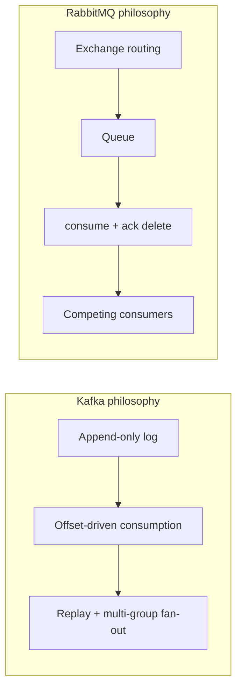

*The two philosophies diverge on persistence: Kafka keeps everything until retention, RabbitMQ deletes once acknowledged — a choice that determines whether replay, fan-out, and audit are cheap or impossible.*

**Interview questions and answers**

- **Q: When does "Kafka is just a big queue" break down?**
  **A:** The moment you need replay, multiple independent subscribers, or throughput beyond a single broker's per-queue ceiling. At that point the log model stops being a queue and starts being an integration backbone.

---
### Replication Strategies

Replication in a messaging system keeps partition logs available and durable across broker failures. The choice of strategy shapes both consistency and availability.

#### Leader-based replication

One partition replica is the leader; all writes go to the leader and are pushed to followers. Reads can be served by the leader or by in-sync followers. This gives a clear write ordering per partition and simple conflict handling.

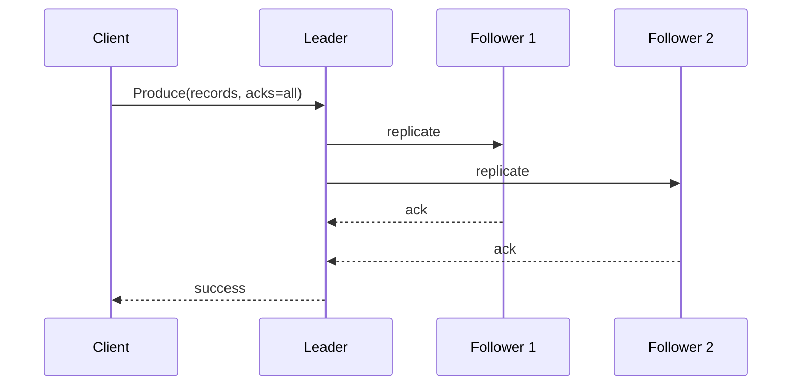

*Leader-based replication funnels writes through one leader and requires acknowledgments from followers before replying, giving a clean write ordering but a potential write bottleneck.*

- **Pros**: simple consistency, clear ordering, easy to reason about.
- **Cons**: the leader can become a bottleneck; failover requires leader election.
- **Real-life use**: Kafka partitions, RabbitMQ quorum queues.

#### Leaderless replication

Any replica in a quorum can accept writes; clients write to multiple replicas and read from multiple replicas using quorum rules (`W + R > N`). This maximizes availability for writes.

- **Pros**: no leader bottleneck, no leader election, survives multiple replica failures.
- **Cons**: weaker ordering, requires read repair and anti-entropy to converge.
- **Real-life use**: DynamoDB, Cassandra, Riak — applied to event logs where any broker can accept a produce for a given partition.

#### Multi-leader replication

Multiple brokers accept writes and replicate to each other. Useful for active-active multi-datacenter setups.

- **Pros**: lower latency locally, survives a whole datacenter loss.
- **Cons**: concurrent writes need conflict resolution and are incompatible with strict per-partition ordering.
- **Real-life use**: cross-datacenter Kafka (MirrorMaker / Cluster Linking), multi-region RabbitMQ federation.

**Interview questions and answers**

- **Q: Why does Kafka use leader-based replication instead of leaderless?**
  **A:** A partitioned log needs a single total order *within* a partition for replay correctness. Leader-based replication gives exactly that; leaderless would require quorum ordering and complicate consumer offset semantics.

---

### Failure Detection and Membership

A distributed messaging cluster must know which brokers are alive and which partitions they own, because an unavailable leader means a partition stops serving.

- **Heartbeats**: brokers periodically exchange liveness signals via the controller/gossip layer. Missing heartbeats move a broker to *suspect* and then *down*.
- **Gossip protocol**: brokers exchange membership and state with random peers; information spreads probabilistically through the cluster (used by older Kafka via ZooKeeper and by RabbitMQ's clustering).
- **Phi accrual failure detector**: computes a suspicion level from heartbeat inter-arrival history, reducing false positives over static timeouts — the basis of Kafka's `replica.lag.time.max.ms`.
- **SWIM**: a scalable, weakly-consistent infection-style membership protocol; the modern basis for many controller designs.
- **Controller election**: when the controller fails, the remaining brokers run an election (Raft in modern Kafka's KRaft) to pick a new controller, which owns partition-leader election.

```mermaid
flowchart LR
    N1[Broker 1] -->|gossip heartbeat| N2[Broker 2]
    N2 -->|gossip heartbeat| N3[Broker 3]
    N3 -->|gossip heartbeat| N4[Broker 4]
    N4 -->|gossip heartbeat| N1
    CTRL[Controller] -.> N1
    CTRL -.> N2
    CTRL -.> N3
    CTRL -.> N4
```

*Brokers exchange heartbeats via gossip; the elected controller orchestrates partition-leader election when a broker is declared down.*

**Interview questions and answers**

- **Q: What is `replica.lag.time.max.ms` and why does it matter?**
  **A:** It is the duration a follower may trail the leader before being removed from the ISR. Set too low, healthy-but-slow replicas get evicted and shrink the ISR; set too high, truly-dead replicas linger, risking an unavailable partition on leader loss.

---
### High Availability and Scalability

High availability comes from replication across brokers (and ideally racks/AZs); scalability comes from partitioning and consumer-group parallelism. The two are coupled: a partition's availability degrades if its ISR shrinks below the configured write quorum.

#### Replication for availability

- Each partition is stored on N brokers (replication factor 3 is standard; 5 for money-leash paths).
- Only ISR members may become leader on failover, so `min.insync.replicas` gates durability.
- **Cross-AZ placement** ensures a single AZ loss does not drop below the write quorum.

#### Leader election and failover

When a broker or its partition leader fails, the controller elects a new leader from the ISR. The failover window is typically sub-second when an ISR replica exists; producers using `acks=all` see a brief error spike during election. Clients should retry transparently.

- **Rack-aware / AZ-aware replica assignment** places followers in different failure domains.
- **Graceful shutdown** hands off leadership before terminating a broker so partitions migrate cleanly rather than failing over.

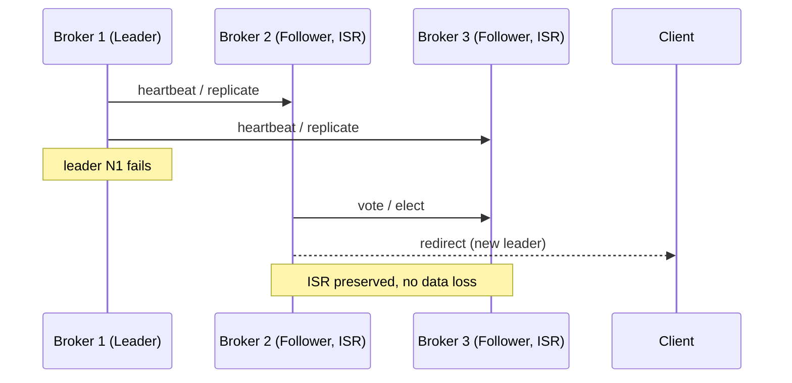

*When the leader fails, an ISR follower is elected leader within sub-seconds and clients are redirected, preserving availability and (with proper config) durability.*

#### Scaling strategies

- **Horizontal (scale-out)**: add brokers for storage/throughput, add partitions for parallelism, add consumer-group members up to the partition count.
- **Vertical (scale-up)**: larger brokers (faster SSD, more CPU) improve per-partition throughput — useful when partition count is constrained.
- **Elastic scaling**: brokers are added or removed dynamically; the controller reassigns partitions (via Cruise Control or admin tools) to rebalance.

#### Auto-rebalancing

When nodes are added or brokers' partition count grows, partitions must be redistributed to keep load even.

- **Partition count planning**: partitions ≥ max consumers in any group; over-provisioning buys future parallelism without a keyed-repartition migration.
- **Decommissioning**: on broker removal, the controller drains its leadership and reassigns its partitions to other brokers.
- **Load-based rebalancing**: Cruise Control (Kafka) and the RabbitMQ perf tool / `rabbitmqadmin` rebalancing detect hot partitions and migrate them.

**Real-life use**: Kafka Cruise Control for rebalancing; DynamoDB automatic partition splits; Cassandra's virtual nodes for even token distribution; RabbitMQ's queue-location and quorum placement.

**Interview questions and answers**

- **Q: How many AZs do you need for RF=3 to survive one AZ fault?**
  **A:** At least three AZs with one replica each; with only two AZs, two replicas share a failure domain, so an AZ loss can drop below the min-insync threshold and stall producers.

---

### Performance and Optimization

Performance is measured jointly by latency (single-request completion) and throughput (requests/second). Optimizations target different parts of the produce and consume paths.

#### Producer-side optimization

- **Batching**: small records are buffered and flushed together, amortizing network round-trips. `linger.ms` and `batch.size` trade latency vs throughput.
- **Compression**: `snappy`, `lz4`, or `zstd` reduces network and storage at CPU cost — zstd is usually the sweet spot.
- **Idempotent producer** (`enable.idempotence=true`) avoids broker-side dedup cost and preserves per-partition order under retries.

#### Consumer-side optimization

- **Fetch tuning**: `fetch.min.bytes` and `fetch.max.wait.ms` balance throughput (bigger batches) against latency (smaller, faster responses).
- **Max-poll-loop discipline**: processing time must stay under `max.poll.interval.ms`; otherwise the consumer is kicked out and a rebalance begins. Long processing should use a separate thread or pause the partition.
- **Cooperative sticky** assignment minimizes the partitions moved each rebalance.

#### Caching and I/O

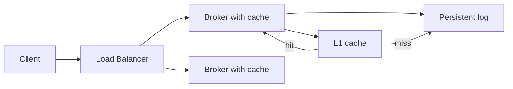

*Producers and consumers hit the broker's OS page cache for hot data; cache misses fall through to sequential segment files, which is why append-only logs beat random writes on latency and throughput.*

#### Throughput levers

- **Pipelining/coalescing** on the producer (batch) and broker (merged fetch responses).
- **Multi-threaded brokers** for replication I/O and request handling.
- **Tiered storage**: cold segments offloaded to object storage while local disk holds the hot window — retention cost decoupled from broker disk.
- **Partition sizing**: size partitions so `target_throughput / per-partition_ceiling` gives the partition count, and keep brokers' ingress within disk/IOPS headroom.

**Real-life use**: Kafka's zero-copy `sendfile`, RabbitMQ's lazy-queue and stream-queue plugins, Redis Streams as a lightweight tier, Flink's watermarking for bounded-output-latency windows over the log.

**Interview questions and answers**

- **Q: Why are appends faster than random writes for a message log?**
  **A:** Appends are sequential; the OS and SSDs both favor sequential writes, the page cache absorbs reads, and zero-copy syscall paths avoid copies between kernel and user space — the entire design aligns with storage physics instead of fighting it.

---
### CAP Theorem and Consistency Trade-offs

The CAP theorem states that during a network partition a distributed system can provide either consistency or availability, but not both, while remaining partition-tolerant. Messaging systems typically choose partition tolerance and then position themselves on the consistency-availability axis per workload.

- **Consistency**: every read returns the most recent write. For a message log this means a consumer reading a partition always sees the latest produced records and never sees out-of-order or stale records from a different leader epoch.
- **Availability**: every request receives a response, even if it returns a possibly stale value. A broker that is up but isolated still accepts produces and consumes from its view of the log.
- **Partition tolerance**: the system continues operating despite network partitions between brokers (or between a broker and the controller).

Most practical messaging systems are best described not by a single CAP point but by **per-operation** choices: `acks=all` with `min.insync.replicas` leans toward consistency; `acks=1` or `acks=0` leans toward availability.

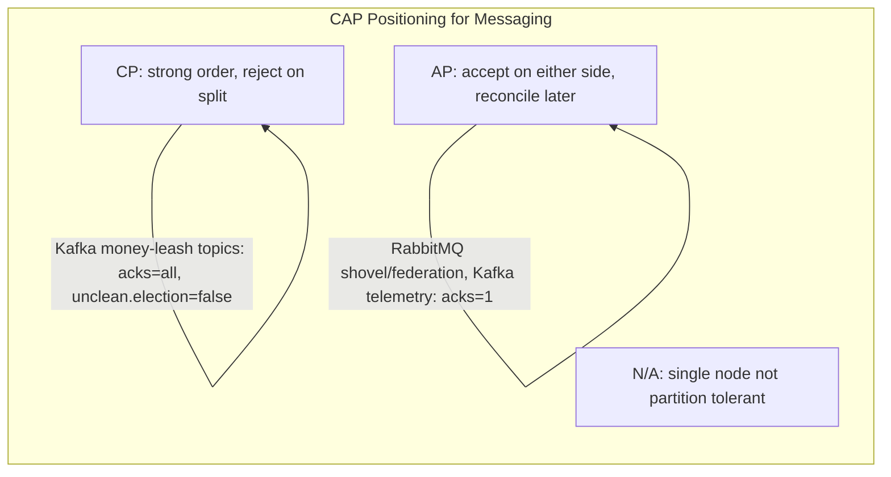

*CAP positioning is per-topic and per-ack configuration, not a single cluster property — money-leash streams choose consistency, telemetry streams choose availability.*

**Real-life mapping**

- **CP-leaning**: Kafka money topics (`acks=all`, `min.insync.replicas=2`, `unclean.leader.election=false`), RabbitMQ quorum queues with strict acks.
- **AP-leaning**: Kafka clickstream/telemetry (`acks=1`), RabbitMQ classic queues with lazy mirroring, best-effort delivery topics.

**Interview questions and answers**

- **Q: Is Kafka CP or AP?**
  **A:** Neither categorically — it is tunable per topic. A money topic configured `acks=all + min.insync=2 + unclean.election=false` is effectively CP; a telemetry topic with `acks=1` is AP. The cluster offers both on different topics.

---

### Encryption and Key Management

Encryption protects a messaging system's data at rest and in transit. A production-grade deployment must consider multiple layers, from broker disk encryption to key rotation policies.

#### Encryption at Rest

Data persisted to disk — segment logs, index files, and the internal offset group topic — must be encrypted so a compromised disk or backup cannot reveal payloads.

- **File-system encryption**: encrypt the entire log volume at the OS level (dm-crypt/LUKS on Linux). Transparent but encrypts everything with one key.
- **Application/broker-level encryption**: the broker encrypts each record before writing it to the segment files. Allows per-topic keys but adds CPU overhead and complicates compaction/retention logic.
- **Key rotation during log rolling**: when a key rotates, old segments still hold data encrypted with the previous key. The system tracks which key encrypted which segment so it can decrypt on read; re-encryption happens lazily at segment deletion.

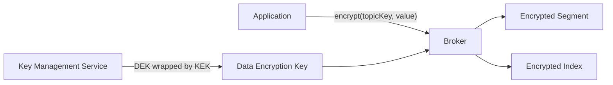

*At-rest encryption layer: the broker encrypts records with a per-topic data key that is itself wrapped by a key-encryption key managed by a KMS; old data is decrypted with the key that was current when the segment was written.*

#### Encryption in Transit

All client-to-broker and inter-broker replication traffic must use TLS to protect data from eavesdropping and tampering.

- **Mutual TLS (mTLS)**: both client and broker present certificates — strong authentication for replication traffic where any broker talks to any other broker.
- **TLS termination at the load balancer**: the LB terminates TLS and forwards decrypted traffic to backends — simpler to manage but requires a trusted internal network.
- **Certificate rotation**: certificates should be rotated automatically (every 30–90 days) with revocation checked via OCSP or CRL.

#### Key Management

Key management is the foundation of encryption; poor key management negates its benefits entirely.

- **Key hierarchy**: a key-encryption key (KEK) encrypts data-encryption keys (DEKs), which encrypt actual data. This allows rotating the KEK without re-encrypting all data — only the DEKs are re-wrapped.
- **Hardware Security Module (HSM)**: stores the KEK in tamper-resistant hardware; the raw key material never leaves the HSM.
- **Key rotation policy**: KEKs rotated every 6–12 months; DEKs rotated per-topic or per-segment more frequently.
- **Multi-region key management**: for multi-region deployments, keys must be available in each region; cloud KMS services replicate keys across regions automatically.

**Java example: a TLS-configured Kafka producer bean**

```java
import org.apache.kafka.clients.producer.ProducerConfig;
import org.apache.kafka.clients.producer.ProducerFactory;
import org.apache.kafka.common.serialization.StringSerializer;
import org.springframework.beans.factory.annotation.Value;
import org.springframework.context.annotation.Bean;
import org.springframework.context.annotation.Configuration;

import java.util.HashMap;
import java.util.Map;

@Configuration
public class KafkaProducerConfig {

    @Bean
    public ProducerFactory<String, String> producerFactory(
            @Value("${app.kafka.brokers}") String brokers,
            @Value("${app.kafka.ssl.keystore.location}") String keystore,
            @Value("${app.kafka.ssl.truststore.location}") String truststore) {
        Map<String, Object> props = new HashMap<>();
        props.put(ProducerConfig.BOOTSTRAP_SERVERS_CONFIG, brokers);
        props.put(ProducerConfig.KEY_SERIALIZER_CLASS_CONFIG, StringSerializer.class);
        props.put(ProducerConfig.VALUE_SERIALIZER_CLASS_CONFIG, StringSerializer.class);
        props.put(ProducerConfig.ACKS_CONFIG, "all");
        props.put(ProducerConfig.ENABLE_IDEMPOTENCE_CONFIG, true);
        // TLS configuration: keystore for client cert (mTLS), truststore for CA
        props.put("ssl.keystore.location", keystore);
        props.put("ssl.keystore.password", System.getenv("KAFKA_KEYSTORE_PASSWORD"));
        props.put("ssl.truststore.location", truststore);
        props.put("ssl.endpoint.identification.algorithm", "https");
        props.put(ProducerConfig.SECURITY_PROTOCOL_CONFIG, "SSL");
        return new DefaultKafkaProducerFactory<>(props);
    }
}
```

*The `KafkaProducerConfig` bean externalizes broker addresses and TLS paths via `@Value`, reads the keystore password from the environment (never from source), and enables `acks=all` with idempotent production — placing durability and encryption configuration at the producer entry point.*

**Interview questions and answers**

- **Q: Should you encrypt all message payloads by default?**
  **A:** Not necessarily. If the threat is a stolen disk, TLS + filesystem/disk encryption suffices and is cheaper. If the threat is an attacker who already has broker access, application-level record encryption with per-topic DEKs is needed. The trade-off is CPU overhead and key-management complexity.

---

### Authentication and Authorization

A messaging system must verify who is connecting (authentication) and what they may do (authorization). In distributed brokers any node can accept requests, so authentication and authorization are enforced independently on each broker.

#### Authentication Methods

- **Username and password (SASL/PLAIN, SASL/SCRAM)**: the simplest method; passwords hashed with bcrypt/scrypt/Argon2 and never stored in plaintext. SCRAM avoids sending the password over the wire.
- **X.509 certificates**: clients and brokers present certificates issued by a trusted CA — common for service-to-service and inter-broker replication (mTLS).
- **OAuth / JWT bearer tokens**: short-lived tokens issued by an identity provider; the broker validates the signature and claims (issuer, expiry, scopes) before accepting requests.
- **Kerberos (SASL/GSSAPI)**: strong mutual authentication for enterprise environments where a central KDC is available.

#### Authorization Models

- **Role-Based Access Control (RBAC)**: users are assigned roles (`admin`, `producer`, `consumer`) and roles grant permissions on resources (topics/queues).
- **Attribute-Based Access Control (ABAC)**: permissions derived from attributes of the user, resource, action, and environment (e.g., `user.team == topic.owner`).
- **Access Control Lists (ACLs)**: per-topic or per-queue rules specifying which principals may `READ`/`WRITE`/`DESCRIBE` — Kafka's Simple ACL Provider and RabbitMQ's topic/queue ACLs both implement this.

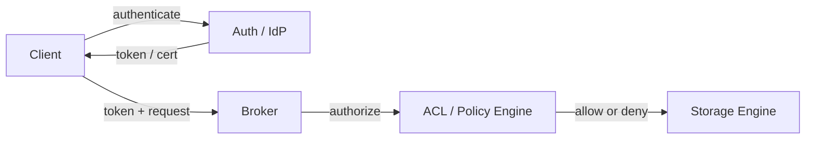

*Authentication verifies identity (via token or certificate) before the broker consults an ACL or policy engine to authorize the specific READ/WRITE action on the requested topic or queue.*

#### Real-Life Implementations

- **Kafka**: SASL/SCRAM or OAuthBearer for authentication; Simple ACL Provider grants `ALLOW`/`DENY` on topics per principal.
- **RabbitMQ**: SASL/PLAIN or OAuth2 for auth; fine-grained ACLs on vhosts, exchanges, and queues per user.
- **SQS/SNS**: AWS IAM policies control access to queues and topics.

**Java example: a Spring-authorized producer factory selecting principals per tenant**

```java
import org.springframework.beans.factory.annotation.Value;
import org.springframework.context.annotation.Bean;
import org.springframework.context.annotation.Configuration;
import org.springframework.kafka.core.KafkaTemplate;
import org.springframework.kafka.core.ProducerFactory;

@Configuration
public class TenantKafkaProducerConfig {

    @Bean
    public KafkaTemplate<String, String> kafkaTemplate(
            ProducerFactory<String, String> pf,
            @Value("${app.kafka.sasl.jaas.config}") String jaasConfig,
            @Value("${app.kafka.sasl.mechanism}") String mechanism) {
        // JAAS config injects the tenant's SASL principal credentials;
        // the cluster ACL layer then enforces READ/WRITE per topic.
        var template = new KafkaTemplate<>(pf);
        template.setProducerListener((topic, data) -> {
            // log produce success/failure for audit; principal is in the SASL context
            return true;
        });
        return template;
    }
}
```

*The `TenantKafkaProducerConfig` bean wires the tenant's SASL principal into the producer (via the JAAS config) so that broker-side ACLs can enforce per-topic permissions without the application duplicating authorization logic — security is delegated to the messaging layer.*

**Interview questions and answers**

- **Q: How do you prevent a compromised service from reading every topic?**
  **A:** Enforce least-privilege ACLs: each service's principal gets `WRITE`-only on its own emit topics and `READ`-only on topics it is allowed to consume. Deny-by-default ACLs plus a zero-trust network make a compromised principal useful only within its narrow grant.

- **Q: What is the difference between authentication and authorization?**
  **A:** Authentication proves *who* the client is; authorization determines *what* the authenticated client may do. Conflating the two is a common interview trap — a system can authenticate a user and still authorize them for nothing (deny by default).

---
### Security Threats and Mitigations

A messaging system faces several categories of threats. Layered, defense-in-depth controls are essential for production deployments.

#### Threat: Unauthenticated Access

- **Risk**: an attacker connects to a broker port without valid credentials and produces or consumes messages.
- **Mitigation**: enforce authentication on all connections; disable anonymous access; require TLS client certificates or SASL/OAuth for every client and every inter-broker link.

#### Threat: Data Interception (Eavesdropping)

- **Risk**: an attacker on the network sniffs unencrypted traffic and reads or captures message payloads.
- **Mitigation**: encrypt all traffic with TLS (mTLS for inter-broker replication); never expose brokers directly to the public internet; terminate TLS at the edge.

#### Threat: DoS / Resource Exhaustion

- **Risk**: an attacker floods brokers with produces or fetches, exhausting CPU, memory, disk, or connections.
- **Mitigation**: per-client rate limiting and quotas; aggressive timeouts; connection limits; request-size limits; circuit breakers that shed load when brokers are unhealthy.

```mermaid
flowchart LR
    Attacker[Attacker] -->|flood| LB[Load Balancer / Proxy]
    LB --> RL[Rate Limiter / Quotas]
    RL -->|allow| Broker[Broker]
    RL -->|reject| Drop[Reject / Throttle]
    Broker --> Mem[Memory]
    Broker --> Disk[Disk]
    Note over Mem,Disk: monitor for exhaustion
```

*Rate limiting and quotas at the proxy/broker boundary reject abusive traffic before it exhausts broker memory or disk, and the remaining load is monitored for saturation.*

#### Threat: Data Tampering

- **Risk**: an attacker alters messages in transit or forged segment files on disk.
- **Mitigation**: TLS provides integrity (AES-GCM / ChaCha20-Poly1305 include authentication tags); segment checksums detect on-disk corruption; producer idempotency keys let consumers detect and drop duplicates that tampering might induce.

#### Threat: Credential Theft

- **Risk**: passwords or tokens are intercepted in transit or stolen from configuration files or environment variables.
- **Mitigation**: short-lived tokens with automatic refresh; frequent credential rotation; store secrets in a vault (HashiCorp Vault, AWS Secrets Manager) rather than in config files or plaintext environment variables.

#### Threat: Insider Threat / Over-Privileged Access

- **Risk**: a legitimate user or service account with broad permissions reads or deletes topics it should not.
- **Mitigation**: least-privilege RBAC; key-prefix / topic-name scoping; audit logging of every produce, consume, and administrative action; separate admin and application credentials.

#### Threat: Message Spoofing / Poison Messages

- **Risk**: a producer injects a malformed or maliciously crafted message that crashes consumers or poisons downstream state.
- **Mitigation**: enforce schemas at produce time (registry compatibility gates block malformed payloads); circuit-breaker the consumer on repeated poison messages into a dead-letter topic; validate payloads at the consumer boundary before business logic.

**Interview questions and answers**

- **Q: What is the single most common security misconfiguration you see in messaging deployments?**
  **A:** Leaving authentication disabled by default and exposing broker ports internally without TLS — the combination lets any compromised internal host produce/consume as an unauthenticated peer.

- **Q: How does defense in depth apply to a Kafka cluster?**
  **A:** TLS in transit (mTLS), authentication (SASL/OAuth), authorization (ACLs), quotas/rate limits at the broker, topic-level isolation, network segmentation, and audit logging — each layer must be breached independently before data is exposed.

---

### Observability and Logging

A messaging system must expose metrics, logs, and traces so operators can detect anomalies, diagnose problems, and verify SLAs. This is especially critical in distributed brokers where failures can be partial and hard to reproduce.

#### Metrics

Key metrics to monitor at every broker and the cluster level:

- **Latency**: p50, p95, p99 for produce and fetch requests — the most user-visible signal.
- **Throughput**: records/second produced and consumed, and bytes/second on the wire.
- **Error rate**: percentage of failed produce/fetch requests (timeouts, not-leader-for-partition, authorization failures).
- **Replica lag / ISR**: under-replicated partitions and follower-fetch lag; shrinking ISR is the leading indicator of a failing broker.
- **Consumer lag**: per group and per partition — the single best predictor of downstream brownout.
- **Disk usage and segment roll rate**: retention planning and hot-partition sizing.
- **Connection and quota usage**: active connections, quota-exhaustion count, request-handler queue depth.
- **Garbage-collection pause time** (JVM brokers): long pauses cause ISR flapping.

#### Logging

Structured logs should capture:

- **Access/audit logs**: who produced/consumed/admin-controlled which topic, with timestamps, principals, and outcomes.
- **Error logs**: failed produce/fetch requests, replication errors, controller/failover events.
- **Slow-request logs**: produce/fetch operations exceeding a latency threshold.
- **Rebalance logs**: group-coordinator rebalance reason and duration, to attribute latency spikes.

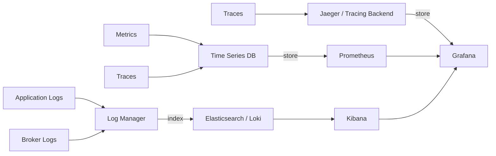

*Observability pipeline: logs flow to a log manager; metrics to a time-series database; traces to a tracing backend — all unified in a dashboard where consumer-lag and ISR-shrink events can be correlated with tail-latency and GC-pause signals.*

#### Tracing

Distributed tracing follows a request from producer through the broker network to the consumer, including the group coordinator and any stream-processing intermediary.

- **Trace context propagation**: `traceparent`/`tracestate` headers (W3C Trace Context) are injected into produce/fetch metadata.
- **Key operations to instrument**: produce request, fetch request, rebalance, and the processing duration inside the consumer.
- **Hot-path sampling**: sample 100% of slow requests and a small percentage of normal requests to balance detail against overhead.

#### Alerting

Alerts should be actionable and tuned to avoid noise:

- p99 produce/fetch latency exceeds the SLA threshold for 5 minutes.
- Consumer lag exceeds the recovery window for 2 consecutive samples.
- Under-replicated-partitions count > 0 for more than 2 minutes.
- Unplanned leader or controller elections exceed one per hour.
- Disk usage exceeds 85% on any broker.
- Error-rate spike > 1% for 2 minutes correlated with a recent deploy.

#### Java example: Micrometer instrumentation of a message-producing service

```java
import io.micrometer.core.instrument.Counter;
import io.micrometer.core.instrument.MeterRegistry;
import io.micrometer.core.instrument.Timer;
import org.springframework.kafka.core.KafkaTemplate;
import org.springframework.stereotype.Service;

@Service
public class InstrumentedMessageProducer {

    private final KafkaTemplate<String, String> kafkaTemplate;
    private final Counter produceCounter;
    private final Counter errorCounter;
    private final Timer produceTimer;

    public InstrumentedMessageProducer(KafkaTemplate<String, String> kafkaTemplate,
                                       MeterRegistry meterRegistry) {
        this.kafkaTemplate = kafkaTemplate;
        this.produceCounter = Counter.builder("messaging.produces")
                .description("Number of messages produced")
                .register(meterRegistry);
        this.errorCounter = Counter.builder("messaging.errors")
                .description("Number of produce errors")
                .register(meterRegistry);
        this.produceTimer = Timer.builder("messaging.produce.latency")
                .description("Produce request latency")
                .register(meterRegistry);
    }

    public void send(String topic, String key, String value) {
        produceTimer.record(() -> {
            produceCounter.increment();
            try {
                kafkaTemplate.send(topic, key, value);
            } catch (Exception ex) {
                errorCounter.increment();
                throw ex;
            }
        });
    }
}
```

*The `InstrumentedMessageProducer` bean wraps every produce call with a Micrometer timer and outcome counters tagged for produce/error, feeding a Prometheus/Grafana stack whose alerts fire on rising p99 latency, error-rate spikes, and consumer-lag trend divergence before user-visible impact.*

**Interview questions and answers**

- **Q: Which metric best predicts an imminent user-visible incident?**
  **A:** Consumer lag, when correlated with arrival rate. A rising lag trend means consumers cannot keep up — typically hours of warning before the backlog stalls downstream SLOs.

- **Q: How do you debug a sudden p99 latency spike without a p50 increase?**
  **A:** The p50/p99 gap isolates tail-causing events. Correlate with GC pauses on JVM brokers, ISR shrinkage evicting healthy replicas, a single hot partition skewing one consumer, or a network queue building on the load balancer.

---
### Real-World Implementations

- **LinkedIn / Kafka origin** — built precisely for activity-stream fan-out at scale; its design paper remains the canonical partition-log reference. Kafka Streams and KRaft (the in-built Raft metadata quorum) evolved from these foundations.
- **Uber** — operates thousands of topics at trillions of messages/day; their consumer-proxy architecture, hot-partition battles, and MirrorMaker experiences map directly onto this doc's operational sections.
- **Netflix** — the Keystone pipeline standardizes produce/consume across hundreds of teams, demonstrating the platform-team pattern (self-serve topics, schema governance, and cost attribution) at scale.
- **Shopify** — documented moving to Kafka for flash-sale burst absorption with exactly the durability-plus-replay rationale described here, including retention and tiered-storage economics.
- **Airbnb** — SpinalTap/CDC over MySQL shards feeding Kafka validates the transactional-outbox and CDC patterns industrially; dedupe on `eventId` handles producer-retry duplicates.
- **RabbitMQ** — used broadly for RPC-style decoupling, task queues with priorities, and protocol bridging (MQTT, STOMP) where Kafka's throughput model is overkill.
- **Amazon SQS / SNS** — managed queueing and fan-out as a service; chosen when broker operations are explicitly unwanted and feature depth matches the workload.

---

### Java and Spring Boot Implementation Guide

This section builds a practical, Spring-Boot-native messaging service using Kafka, with idempotent consumers, an outbox relay, and a managed producer — all expressed as Spring beans.

#### 1. Domain event record (DTO)

```java
import java.math.BigDecimal;
import java.time.Instant;

/**
 * Immutable event DTO carried on the wire. Uses a BigDecimal for the monetary
 * amount so the serialized value is exact and rounding errors do not leak into
 * financial downstream processing.
 */
public record OrderEvent(
        String eventId,       // dedupe key; unique per business event
        BigDecimal amount,
        String currency,
        long occurredAtEpochSecond
) {
    public OrderEvent {
        if (amount == null || amount.compareTo(BigDecimal.ZERO) < 0) {
            throw new IllegalArgumentException("amount must be non-negative");
        }
    }
}
```

*The `OrderEvent` record is a serializable DTO; its `eventId` is the idempotency key and `amount` is a `BigDecimal` to avoid floating-point errors in financial calculations.*

#### 2. Producer factory with idempotence and TLS

```java
import org.apache.kafka.clients.producer.ProducerConfig;
import org.apache.kafka.clients.producer.ProducerFactory;
import org.apache.kafka.common.serialization.StringSerializer;
import org.springframework.beans.factory.annotation.Value;
import org.springframework.context.annotation.Bean;
import org.springframework.context.annotation.Configuration;
import org.springframework.kafka.core.KafkaTemplate;
import org.springframework.kafka.core.DefaultKafkaProducerFactory;
import org.springframework.kafka.support.serializer.JsonSerializer;

import java.util.HashMap;
import java.util.Map;

@Configuration
public class KafkaProducerConfig {

    @Bean
    public ProducerFactory<String, OrderEvent> producerFactory(
            @Value("${app.kafka.brokers}") String brokers,
            @Value("${app.kafka.ssl.keystore.location:#{null}}") String keystore,
            @Value("${app.kafka.ssl.truststore.location:#{null}}") String truststore) {
        Map<String, Object> props = new HashMap<>();
        props.put(ProducerConfig.BOOTSTRAP_SERVERS_CONFIG, brokers);
        props.put(ProducerConfig.KEY_SERIALIZER_CLASS_CONFIG, StringSerializer.class);
        props.put(ProducerConfig.VALUE_SERIALIZER_CLASS_CONFIG, JsonSerializer.class);
        // Durability + idempotence: acks all, infinite retries, broker-side dedupe by PID+sequence
        props.put(ProducerConfig.ACKS_CONFIG, "all");
        props.put(ProducerConfig.ENABLE_IDEMPOTENCE_CONFIG, true);
        props.put(ProducerConfig.RETRIES_CONFIG, Integer.MAX_VALUE);
        props.put(ProducerConfig.LINGER_MS_CONFIG, 5);
        props.put(ProducerConfig.COMPRESSION_TYPE_CONFIG, "zstd");
        if (keystore != null) {
            props.put("ssl.keystore.location", keystore);
            props.put("ssl.keystore.password", System.getenv("KAFKA_KEYSTORE_PASSWORD"));
        }
        if (truststore != null) {
            props.put("ssl.truststore.location", truststore);
        }
        props.put(ProducerConfig.SECURITY_PROTOCOL_CONFIG, "SSL");
        return new DefaultKafkaProducerFactory<>(props);
    }

    /**
     * KafkaTemplate is the Spring-friendly producer facade. It wraps the
     * ProducerFactory and gives futures, error handlers, and send-result
     * listening that the rest of the service depends on.
     */
    @Bean
    public KafkaTemplate<String, OrderEvent> kafkaTemplate(
            ProducerFactory<String, OrderEvent> producerFactory) {
        return new KafkaTemplate<>(producerFactory);
    }
}
```

*`KafkaProducerConfig` externalizes broker and TLS paths through `@Value`, reads secrets from the environment, and configures `acks=all` with idempotent production so retries cannot duplicate records on the broker side.*

#### 3. Outbox relay (transactional publish from a JPA outbox)

```java
import jakarta.validation.Valid;
import org.springframework.scheduling.annotation.Scheduled;
import org.springframework.stereotype.Service;
import org.springframework.transaction.annotation.Transactional;

@Service
public class OutboxRelay {

    private final OutboxRepository outbox;
    private final KafkaTemplate<String, OrderEvent> kafka;

    public OutboxRelay(OutboxRepository outbox, KafkaTemplate<String, OrderEvent> kafka) {
        this.outbox = outbox;
        this.kafka = kafka;
    }

    /**
     * Periodically drains the local outbox and publishes events. Each row is
     * claimed (FOR UPDATE SKIP LOCKED) inside the same transaction that
     * updates business state, so the outbox row and the event are atomic.
     */
    @Scheduled(fixedDelay = 500)
    @Transactional
    public void publishPending() {
        for (OutboxRow row : outbox.claimBatch(200)) {
            kafka.send(row.topic(), row.key(), row.payload())
                 .thenAccept(meta -> outbox.markSent(row.id()))
                 .exceptionally(ex -> { outbox.releaseForRetry(row.id()); return null; });
        }
    }
}
```

*The `OutboxRelay` bean pairs a `@Transactional` DB claim with a `KafkaTemplate.send`, solving the dual-write anomaly: the event appears in Kafka only if the local DB transaction commits; a failed send releases the row for the next tick's retry.*

---
#### 4. Idempotent consumer with manual acks

```java
import org.apache.kafka.clients.consumer.ConsumerRecord;
import org.springframework.kafka.KafkaException;
import org.springframework.kafka.annotation.KafkaListener;
import org.springframework.kafka.listener.Acknowledgment;
import org.springframework.kafka.support.KafkaHeaders;
import org.springframework.messaging.handler.annotation.Header;
import org.springframework.messaging.handler.annotation.Payload;
import org.springframework.stereotype.Component;

@Component
public class OrderEventConsumer {

    private final ProcessedEventRepository processed;  // dedupe table, unique(eventId)
    private final FulfillmentService fulfillment;

    public OrderEventConsumer(ProcessedEventRepository processed,
                              FulfillmentService fulfillment) {
        this.processed = processed;
        this.fulfillment = fulfillment;
    }

    /**
     * Manual-ack listener: the offset is committed only after the business
     * effect succeeds. The record is recorded in a dedupe table keyed by
     * eventId so rebalance-induced redeliveries cannot double-fulfill.
     */
    @KafkaListener(topics = "orders.events", groupId = "fulfillment",
                   containerFactory = "manualAckFactory")
    public void onEvent(@Payload OrderEvent evt,
                        Acknowledgment ack,
                        @Header(KafkaHeaders.RECEIVED_PARTITION_ID) int partition,
                        @Header(KafkaHeaders.OFFSET) long offset) {
        if (!processed.recordIfAbsent(evt.eventId(), partition, offset)) {
            ack.acknowledge();            // already handled previously
            return;
        }
        try {
            fulfillment.process(evt);
            ack.acknowledge();            // commit offset after success
        } catch (KafkaException transientFailure) {
            // seek-recoverable: container retries with backoff
            throw transientFailure;
        } catch (PoisonMessageException poison) {
            // quarantine without blocking partition headway
            throw new IllegalArgumentException("poison: " + evt.eventId(), poison);
        }
    }
}
```

*`OrderEventConsumer` commits the Kafka offset only after the fulfillment side effect succeeds, and relies on a unique `eventId` dedupe table so a redelivered record after a rebalance is detected and skipped rather than re-processed.*

#### 5. Validation + global error handler

```java
import org.springframework.http.ResponseEntity;
import org.springframework.validation.annotation.Validated;
import org.springframework.web.bind.MethodArgumentNotValidException;
import org.springframework.web.bind.annotation.*;

import jakarta.validation.ConstraintViolationException;

@RestController
@RequestMapping("/api/events")
@Validated
public class EventController {

    private final KafkaTemplate<String, OrderEvent> kafka;

    public EventController(KafkaTemplate<String, OrderEvent> kafka) {
        this.kafka = kafka;
    }

    /**
     * Accepts a validated event and produces it to the orders.events topic.
     * @Valid triggers bean-validation on the incoming DTO before it reaches
     * the producer, so malformed payloads fail fast at the edge.
     */
    @PostMapping
    public ResponseEntity<Void> post(@Valid @RequestBody OrderEvent evt) {
        kafka.send("orders.events", evt.eventId(), evt);
        return ResponseEntity.accepted().build();
    }
}

@ControllerAdvice
class MessagingErrorHandler {
    @ExceptionHandler(MethodArgumentNotValidException.class)
    ResponseEntity<String> onBadRequest(MethodArgumentNotValidException ex) {
        return ResponseEntity.badRequest().body("validation failed: " + ex.getMessage());
    }
}
```

*`EventController` is a thin REST facade that validates incoming events with `@Valid` and hands them to `KafkaTemplate`; `MessagingErrorHandler` is a `@ControllerAdvice` that converts validation failures into 400s, keeping the controller surface small and failures uniform.*

#### Notes

- `recordIfAbsent` exploits a unique constraint so rebalance-induced redeliveries cannot double-fulfill business state.
- Throwing a transient exception lets Spring's error handler/backoff manage retries while manual acks keep offsets exact.
- The outbox relay pairs with Debezium/CDC or stays app-managed as shown.
- Testing: Testcontainers Kafka asserts exactly-once processing under redelivery storms; simulate rebalances by stopping containers mid-batch.

**Interview questions and answers**

- **Q: Where does the producer write when it sends to a topic?**
  **A:** To the partition leader; the leader is chosen by the controller and may live on any broker. The producer only needs `bootstrap.servers`; metadata requests discover leaders per partition.
- **Q: How do you achieve end-to-end exactly-once across two topics?**
  **A:** Use a transactional producer (idempotent + `transactional.id`) that reads the source topic with `read_committed`, transforms, and writes the destination topic within the same transaction; the consumed offsets are committed as part of the transaction so a failure rolls back both the consume and the produce together.
- **Q: How do you size partitions and consumers?**
  **A:** Partitions ≥ max consumers in any group; target throughput ≤ (partitions × per-partition throughput ceiling). Extra consumers beyond the partition count sit idle.

---

### Interview Questions and Answers

A curated set of interview questions organized by difficulty, focusing on distributed-messaging correctness and design decisions.

**Beginner**

- **Q: What is the difference between a queue, pub/sub, and a log?**
  **A:** A queue delivers each message to one consumer; pub/sub delivers to all current subscribers; a log is a persistent, ordered, replayable append-only sequence that supports both patterns (consumers read by offset) and retains history after "delivery."

- **Q: Why does Kafka achieve such high throughput?**
  **A:** Sequential disk appends (not random writes), zero-copy `sendfile` to consumers from the page cache, micro-batched produce/fetch requests, and compression (zstd/lz4). Latency is bounded by storage/network physics rather than application overhead.

- **Q: What is a consumer group?**
  **A:** A set of consumers sharing a subscription where each partition is owned by exactly one member, giving ordered, exclusive, parallel consumption. Adding members scales throughput up to the partition count.

**Intermediate**

- **Q: Walk through how a message gets duplicated despite "reliable" configuration.**
  **A:** (1) consumer processes a record then crashes before committing the offset → rebalance redelivers it; (2) producer times out with `acks=all`, retries, and the original batch was actually committed. Fixes: idempotent consumers for case 1, idempotent producers for case 2.

- **Q: How do consumer groups provide scalability while keeping ordering?**
  **A:** The partition is the unit of both parallelism and ordering: one member owns each partition (serial processing there), while N partitions process in parallel. Scale consumers up to the partition count; scale partitions for more parallelism.

- **Q: When would you pick RabbitMQ over Kafka?**
  **A:** Complex routing (topic/header exchanges), per-message priorities, TTL and dead-lettering per queue, lower-latency push delivery, moderate throughput, and a simpler ops footprint where replay holds no value.

- **Q: What are the three durability settings that define a Kafka money-leash topic?**
  **A:** Producer `acks=all`, broker `min.insync.replicas=2`, and `unclean.leader.election=false` — together they guarantee a write is on at least two in-sync replicas before acknowledgement and that an out-of-sync replica cannot silently win leadership.

- **Q: What causes a rebalance, and how do you keep it from hurting?**
  **A:** Members joining/leaving, `max.poll.interval.ms` exceeded (slow processing), or group-coordinator failover. Keep `max.poll.interval` above worst-case processing, use cooperative-sticky assignment, and keep member count stable to avoid stop-the-world revocations.

**Advanced**

- **Q: Design exactly-once processing from Kafka into an external database.**
  **A:** Within-Kafka: transactions cover it. For an external sink: at-least-once into an idempotent sink (upsert by `eventId`) is the pragmatic universal answer; alternatively, write to a staging table inside the same DB transaction as the business row and commit the offset only after the staging row commits. Pure Kafka transactions cover source→sink only within Kafka.

- **Q: A critical topic shows steadily growing consumer lag for one group. Diagnose systematically.**
  **A:** (1) isolate the layer — processing time per batch vs arrival rate (capacity gap); (2) `max.poll.interval` exceeded → rebalance loops; (3) hot-partition skew within the group; (4) downstream dependency latency poisoning throughput; (5) GC pauses on consumer hosts. Remedies ladder accordingly: scale members/partitions, fix configs, reshard keys.

- **Q: You are moving a keyed topic to more partitions to add parallelism. What breaks?**
  **A:** The key→partition hash changes, so the relative order of a key's records changes and any downstream state keyed by partition (e.g., partition-based sharding) must be rebuilt. The safe migration is dual-write during a coexistence window plus an offset reset or a compaction-based rebuild of downstream state.

- **Q: What is the relationship between a transactional producer and the consumer-side `read_committed` isolation?**
  **A:** A transactional producer writes control markers into the log that delineate a transaction's span; `read_committed` consumers skip records in open/aborted transactions and only surface committed ones, plus they observe a consistent transactional `commit`/`abort` decision.

**Senior / System Design**

- **Q: Architect the messaging backbone for a payments company: regulatory audit, multi-region DR, zero observable data loss.**
  **A:** Money topics use `acks=all + min.insync.replicas=2 + unclean.leader.election=false`; synchronous in-region replication on three AZs; cross-region MirrorMaker 2 in active-passive with RPO alarms on lag; immutable retention per regulation backed by tiered-storage economics; schema registry with audit-grade compatibility gates; per-environment cluster ACLs; chaos drills proving RTO/RPO. Trade-offs named: latency budgets vs durability, and retention cost vs compliance.

- **Q: Your org wants "one giant shared Kafka". Argue.**
  **A:** Push back on blast-radius isolation (environment/domain clusters), quota fairness (noisy neighbors on a shared cluster), upgrade-train coupling, and security segmentation (prod traffic and experiment traffic share principals). Propose federated domains with standard contracts instead, then concede platform economics favor consolidation up to a point — the senior answer draws the boundary explicitly with criteria (tenant, throughput, and SLA thresholds).

- **Q: How do you operate a multi-tenant Kafka cluster without letting one customer's hot key starve others?**
  **A:** (1) key-salting on hot keys to spread load across partitions; (2) per-tenant `client-id` and byte-rate quotas enforced by the broker to cap noisy neighbors; (3) monitor per-partition throughput and lag; (4) reserve partition count and broker capacity headroom; (5) for the most critical tenants, isolate onto dedicated clusters or min-ISRs with dedicated quotas.

- **Q: Compare Kafka's KRaft mode to ZooKeeper mode and explain why it matters.**
  **A:** KRaft replaces ZooKeeper as the metadata quorum with an in-built Raft implementation, removing the separate quorum cluster, its operational surface, and the dual-recovery path. It simplifies deployment (one quorum to run), reduces tail latency of metadata operations, and unifies security to the broker. The trade-off is a newer, less battle-tested consensus path and tooling that still references ZK-centric concepts.

---
