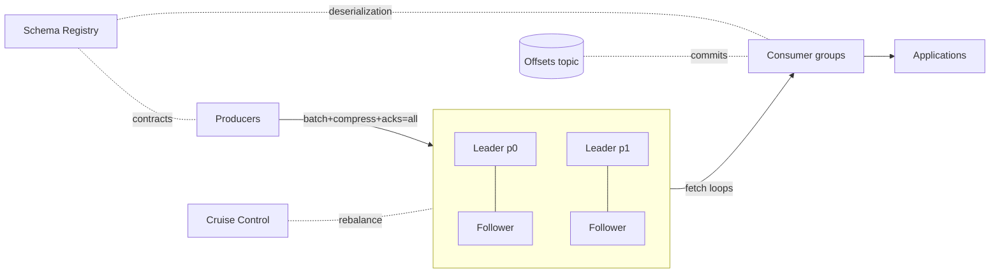
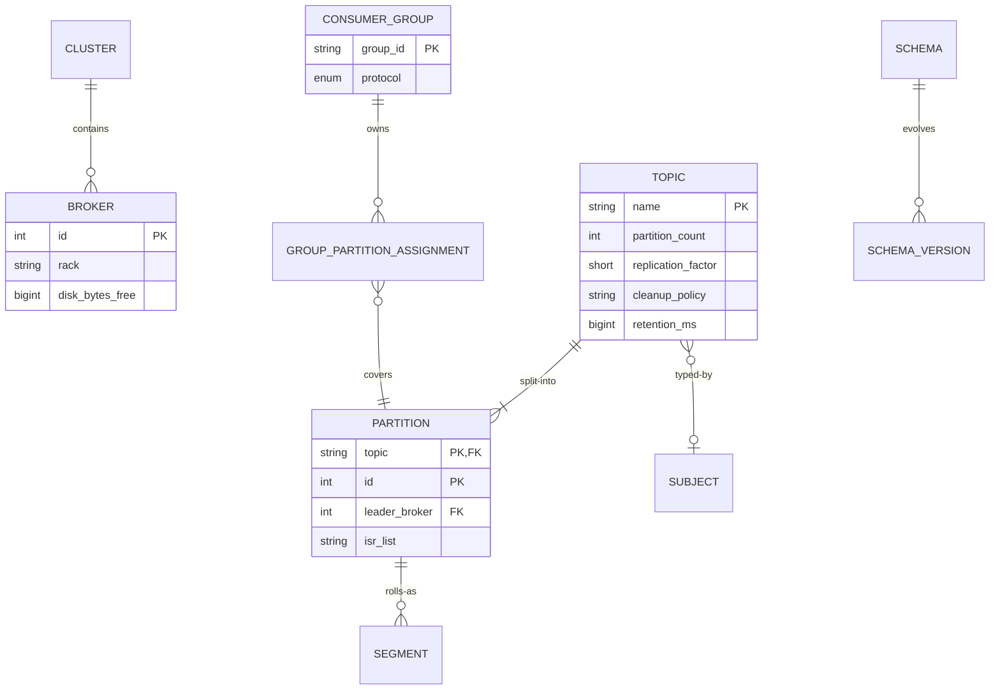

# Distributed Messaging Queue like Kafka, RabbitMQ

## Blogs and websites

## Medium

## Youtube

- [16. System Design - Distributed Messaging Queue | Design Messaging Queue like Kafka, RabbitMQ](https://www.youtube.com/watch?v=oVZtzZVe9Dg)

---

## Theory

A distributed message queue (or log) decouples producers from consumers: senders append messages and move on; receivers process at their own pace, in their own failure domain. Kafka generalizes this into a **persistent, partitioned, replayable log**; RabbitMQ represents the classic **broker-routed queue** with rich delivery semantics. The design space is dominated by three axes: *delivery guarantees* (at-most/at-least/exactly-once), *ordering scope* (per-partition vs per-queue), and *retention* (delete-after-consume vs time-based replayable log).

### Important Subtopics

1. Point-to-point queues vs publish-subscribe topics vs logs
2. Partitioning & consumer groups (parallelism model)
3. Delivery semantics & idempotent consumers
4. Offset management / acknowledgments / visibility timeouts
5. Replication & ISR (in-sync replicas)
6. Ordering guarantees and what breaks them
7. Backpressure, flow control, and slow-consumer handling
8. Dead-letter queues & retry topologies
9. Retention, compaction, and tiered storage
10. Exactly-once processing (Kafka transactions, idempotent producers)
11. Push (RabbitMQ) vs pull (Kafka) consumption models
12. Message formats, schemas & compatibility (Avro/Protobuf + schema registry)

### Two Philosophies

| Aspect | Kafka-style log | RabbitMQ-style broker |
|---|---|---|
| Model | Append-only partitioned log; consumers track offsets | Queues with routing (exchanges); messages deleted on ack |
| Replay | Yes — rewind offsets | No — gone once consumed |
| Ordering | Per-partition strict | Per-queue (single consumer) |
| Throughput | Millions msg/s per cluster (sequential I/O, batching) | Tens-of-thousands to ~100K msg/s |
| Routing | Client-side (choose partition/topic) | Rich server-side (topic exchanges, headers) |
| Fit | Event streaming, pipelines, replay-driven architectures | Task queues, complex routing, lower-latency delivery |

Modern systems often use both: Kafka as backbone for events, RabbitMQ/SQS-class for work distribution.

### Partitions & Consumer Groups

The scaling unit is the **partition**: an ordered, immutable append-only sequence replicated across brokers.

```mermaid
flowchart TB
    P1[Producer] -->|key=A → p0| T0[Topic T - partition 0]
    P1 -->|key=B → p1| T1[partition 1]
    P1 -->|key=C → p2| T2[partition 2]
    subgraph CG[Consumer group G]
        C0[Consumer 1] -->|assigned| T0
        C1[Consumer 2] -->|assigned| T1 + T2
    end
    T0 --> C0
    T1 --> C1
    T2 --> C1
```

Rules that make this work:

- Only **one consumer within a group** owns a partition at a time → per-partition ordering without locks.
- Different groups read independently (fan-out by subscription).
- **Rebalancing** redistributes partitions when members join/leave — stop-the-world historically ("eager" rebalance); incremental cooperative rebalancing avoids full pauses.
- Key→partition hashing preserves ordering per entity (all events for order-123 land on one partition).

### Delivery Semantics

- **At-most-once**: consume then commit offset before processing — fast, lossy on crash. Rarely acceptable.
- **At-least-once** (default): process then commit — duplicates possible on retry/rebalance; industry workhorse.
- **Effectively-once**: at-least-once plumbing + **idempotent receivers**. Kafka adds mechanical support: idempotent producers (`PID` + sequence numbers prevent broker-side dupes) and transactional produce-consume-commit loops for stream pipelines. The application-level dedupe (unique keys, upserts) remains essential regardless.

### Offsets, Acks & Visibility

- Kafka consumers commit offsets (to `__consumer_offsets` topic or via `commitSync/Async`) representing "processed through here".
- RabbitMQ: explicit `basic.ack`; unacked deliveries redelivered on channel close (its visibility-timeout analog).
- SQS-style visibility timeout: message hidden while being processed; reappears if not deleted — the polling-friendly variant of the same idea.

### Replication & Durability

Each partition has one leader + N followers; only **in-sync replicas (ISR)** count toward `acks=all`. Leader election prefers the most-caught-up ISR member; `min.insync.replicas=2` with RF=3 survives one broker loss without availability loss. Unclean leader election (`unclean.leader.election=false`) trades availability for no-data-loss — the setting that separates ledgers from caches.

### Ordering Reality

Guarantee: *only* within a partition, only while it has a single producer-side writer sequence, only until a rebalance/redelivery interleaves retries. Retried batches (max.in.flight > 1) can reorder without idempotent producers. Consumers processing partitions in parallel threads break ordering again unless keyed dispatch is used. Senior-level answers enumerate these erosion points explicitly.

### Schema Management

Messages outlive code; payloads need contracts: Avro/Protobuf schemas registered centrally, producers blocked on breaking changes (compatibility modes: backward/forward/full), consumers deserialize against registry-fetched schemas. This converts "silent field rename broke 40 downstream jobs" into a rejected deploy.

---

## Characteristics

- **Durability-first buffering**: unlike in-memory queues, messages persist (replicated logs/WALs) before acks — the queue doubles as incident-recovery buffer and replayable source of truth for derived systems.
- **Horizontal parallelism via partitioning**: throughput scales by adding partitions/consumers; ordering preserved where business needs it (per-key) without global serialization.
- **Decoupled lifecycles**: producers never wait on consumers; consumers join/leave/fail independently; retention decouples processing speed from data survival.
- **Backpressure-tolerant**: queue absorbs bursts; consumers poll at sustainable rates (pull model) or brokers throttle pushes (RabbitMQ credit flow).
- **Replayability transforms architecture**: fixing a buggy consumer = reset offset + reprocess history — impossible in delete-on-consume brokers and transformative operationally.
- **At-least-once default posture**: duplicates assumed; idempotency designed-in rather than bolted-on.

---

## Components

- **Broker cluster**
  *Purpose*: store and serve streams/queues. *Responsibilities*: partition leadership, replication, fetch/produce handling, retention enforcement, controller coordination (KRaft in modern Kafka replaced ZooKeeper). *Example*: 6-broker Kafka cluster, RF=3.

- **Partition/log**
  *Purpose*: ordered durable sequence. *Responsibilities*: segment files on disk, index lookups (offset→position), sequential writes (the throughput secret), truncation/compaction policies. 

- **Producer client**
  *Responsibilities*: batching (linger.ms/batch.size trade latency-vs-throughput), compression (lz4/zstd/snappy), partitioner logic, retry with idempotence settings, schema registration. 

- **Consumer clients & groups**
  *Responsibilities*: subscription, partition assignment protocol (group coordinator + generation IDs), offset commits, processing loops, cooperative rebalancing participation. 

- **Schema registry**
  *Purpose*: contract enforcement. *Responsibilities*: schema storage/versioning, compatibility validation, serving deserializers. *Example*: Confluent SR, Apicurio.

- **Monitoring/controller plane**
  *Responsibilities*: ISR health, under-replicated-partition alerts, lag metrics per group/partition, rebalance storm detection. Tools: Cruise Control (rebalancing), Burrow/lag exporters.



---

## Patterns

- **Competing consumers (work queue)**
  *Problem*: distribute tasks across fleet. *How*: single topic/partitioned queue; group members split partitions. *When*: parallelizable jobs. *Ordering note*: within-partition serial only — shard tasks deliberately if cross-task ordering matters.

- **Publish-subscribe fan-out**
  *Multiple independent groups* each get every message (analytics + email + audit reading same order-events topic). Decoupling win: adding a subscriber touches nothing upstream.

- **Transactional outbox → CDC**
  *Problem*: DB write + event publish must be atomic. *How*: write outbox row in same txn; Debezium tails WAL into Kafka. Solves dual-write anomalies permanently. *Ubiquitous in serious estates.*

- **Dead-letter + retry-topology**
  *What*: failures route to `{topic}.retry.5m` → re-drive; exhausted → `.dlq`. *Why separate topics not in-place redelivery*: backoff becomes natural, poison isolation clean, monitoring trivial per stage. *Anti-pattern*: infinite immediate retries melting downstream during incidents.

- **Log compaction for state**
  *What*: compacted topics retain latest-per-key forever — table semantics inside a log. *Uses*: changelog feeds, KV state restoration for stream processors, config broadcast.

- **Claim-check pattern**
  *Large payloads offloaded to object storage; message carries reference.* Keeps brokers fast (small records), storage tiered appropriately.

- **Exactly-once pipeline (Kafka Streams)**
  Consume-transform-produce inside transactions with offsets committed atomically to output partitions; consumers of outputs use `read_committed`. Works within Kafka-to-Kafka boundaries; external side effects still need idempotency.

---

## Benefits

- **Absorbs any burst** between mismatched capacities — checkout spikes stop cascading into fulfillment outages.
- **Temporal decoupling enables independent deploys/scaling** of producers and consumers, cutting coordination costs organizationally.
- **Replay turns bugs into rollbacks**: bad enrichment deployed? Fix, rewind, regenerate downstream states.
- **Backpressure made structural**: lag metrics give hours of warning before user-visible impact.
- **Fan-out economics**: one produced event serves unlimited future subscribers — new products launch atop existing streams.
- **Durable audit spine**: retained topics satisfy compliance replays and ML feature recomputation alike.

---

## Pros

- Extreme throughput per commodity node (sequential disk I/O + zero-copy sends + micro-batching).
- Horizontal scaling story clean (add partitions/brokers).
- Multi-subscriber reuse without duplication infrastructure.
- Ecosystem gravity: Connectors, Streams ksqlDB, Flink/Spark integration mature.

## Cons

- Operational weight: JVM tuning, disk capacity planning, rebalance storms, partition-count rigidity (increasing later is disruptive for keyed topics).
- Ordering subtleties routinely misunderstood → intermittent "impossible" bugs.
- Pull-model tail latency (~ms) versus push brokers for low-latency tasking.
- Rebalancing pauses can violate SLOs without cooperative protocols tuned.
- Schema governance requires organizational discipline tooling alone can't force.

---

## Challenges

- **Technical**: duplicate suppression across rebalances (commit-vs-process races); poison-message quarantine; large-message handling (claim-check discipline); clock skew in timestamp-based ops.
- **Scalability**: partition-count planning (too few = ceiling, too many = open-file/memory overhead and rebalance pain); hot partitions from skewed keys (celebrity tenant) needing key-salting strategies.
- **Performance**: consumer lag death-spirals during downstream brownouts; fetch tuning (fetch.min.bytes vs latency); GC pauses on brokers causing ISR flapping.
- **Reliability**: unclean elections silently losing data when misconfigured; min.insync misalignment with acks settings voiding durability promises; cross-cluster replication (MirrorMaker2) consistency during failovers.
- **Maintainability**: schema evolution discipline; topic sprawl governance; upgrading clusters live (protocol rolling upgrades).
- **Operational**: capacity forecasting (retention × ingress), disk balancing across brokers, security hardening (SASL/TLS/ACLs) without performance collapse.
- **Security**: multi-tenancy isolation, encryption in transit/at rest, authorization granularity (topic-level ACLs), audit trails.

---

## Best Practices

- **Design keys for ordering + load balance together**: hash stable business IDs; salt pathological hot keys (`orderId + shardSuffix`) accepting cross-shard aggregation costs consciously.
- **Make consumers idempotent structurally**: upsert sinks keyed by event ID; dedupe tables for non-idempotent side effects.
- **Set retention by recovery needs**, not habit: enough to survive worst rebuild + reprocessing windows; compacted topics for state streams.
- **Monitor consumer lag as the primary health metric** — alert on trend divergence, not just thresholds.
- **Use DLQ topologies deliberately** (bounded retries with backoff stages); page on DLQ inflow rate.
- **Enforce schemas at produce time** with CI-checked compatibility gates; forbid unregistered schema deployments.
- **Right-size acks/durability per topic class**: `acks=all, min.insync=2` for money paths; relaxed for clickstream where loss tolerance exists.
- **Prefer cooperative-sticky assignment** and avoid aggressive poll-timeout misconfigurations (max.poll.interval < processing time = rebalance loop hell).
- **Isolate environments/clusters** by blast radius; never share production topics with experiments.

---

## When to Use / Not Use

**Choose a log (Kafka-class)** for event streaming, integration backbones, replay-driven pipelines, high-throughput telemetry, CDC transport, and anywhere multiple subscribers evolve independently.

**Choose classic broker/queue (RabbitMQ/SQS-class)** for task distribution with rich routing needs, per-job acks with priorities, request-reply patterns, and simpler ops footprints at moderate scale.

**Skip dedicated MQ entirely when**: simple background jobs within one app (DB-backed job tables suffice — see job-scheduler topic); synchronous request/response dominates (RPC beats messaging ceremony); tiny scale where Redis streams cover needs.

Decision inputs: throughput targets, subscriber multiplicity evolution, replay value, ordering requirements shape, team operational maturity, latency sensitivity profile.

---

## Use Cases

- **E-commerce order event backbone**
  *Problem*: 30 services react to order lifecycle; coupling them synchronously created outage chains. *Solution*: `orders.events` topic (compacted=false, 7-day retention, key=orderId); each service its own consumer group; CDC-outbox publishing from OMS. *Trade-off*: eventual downstream views (seconds) accepted for total decoupling; ordering per-order guaranteed via keying.

- **Clickstream ingestion → analytics**
  *Problem*: 500K events/sec peak; warehouse loads mustn't drop events nor block UX. *Solution*: lightweight SDK → Kafka (acks=1 tolerable) → Flink enrichment → Iceberg sink batch-committed; raw topic retained 30 days for reprocessing after model changes. *Trade-off*: storage cost vs recompute flexibility — retention tuned quarterly against actual replay usage.

- **Payment processing work distribution**
  *Problem*: PSP calls are slow/flaky; bursts at sales events. *Solution*: payment-request queue (SQS/RabbitMQ) with visibility timeouts matched to PSP latencies, bounded-retry DLQ topology, priority lanes separating card-present from batch settlements. *Trade-off*: push-broker chosen over log because per-message ack/priority semantics fit better than replay.

---

## High-Level Design

Produce-consume flow with durability:

```mermaid
sequenceDiagram
    participant PR as Producer
    participant B as Broker (leader p3)
    participant F as Followers (ISR)
    participant C as Consumer (group G)
    participant OS as Offset store

    PR->>PR: batch(200 msgs, linger 5ms), zstd
    PR->>B: Produce(batch, acks=all)
    B->>F: replicate entries
    F-->>B: caught up (min.insync=2 met)
    B-->>PR: ack(baseOffset)
    Note over B: segments fsync per policy<br/>retention rolls hourly
    loop long-poll fetch
        C->>B: Fetch(p3, offset=1042, maxBytes)
        B-->>C: batch
        C->>C: process (idempotent upserts)
        C->>OS: commitSync(offset=1075)
    end
    Note over C,B: crash after process, before commit → redelivery; idempotency absorbs it
```

Scaling: partitions sized `max(target throughput / per-partition ceiling, consumer parallelism)`; brokers scaled by ingress bytes/day; consumer groups scaled to ≤ partition count (extra members idle); cross-region via MirrorMaker2 active-passive or Confluent Cluster Linking.

Failure handling: broker loss → ISR re-election (<seconds, no data loss with proper config); consumer crash → partitions reassigned, offsets resume; whole-AZ loss → RF=3 across AZs keeps quorum; poisoned message → retry topology isolates without blocking partition headway (careful: DLQ per-partition ordering caveat documented).

---

## Deep Dive

- **Sequential-I/O physics**: logs append contiguously; disks (even SSDs) reward this enormously; combined with OS page cache serving consumers (read-your-write locality) and zero-copy `sendfile`, per-broker throughputs reach hundreds of MB/s — the reason Kafka outpaces naive designs by orders of magnitude.
- **ISR mechanics**: followers fetch like consumers; `replica.lag.time.max.ms` evicts stragglers; shrinking ISR + `min.insync.replicas` produces producer errors rather than durability lies — alerting on under-replicated partitions catches degradation before failures do.
- **Rebalance internals**: group coordinator assigns via JoinGroup/SyncGroup rounds; eager protocol revokes-all-then-assigns (stop-the-world); cooperative protocol revokes only moved partitions — configuring `partition.assignment.strategy=cooperative-sticky` plus stable membership (session heartbeats tuned) eliminates most SLO blips.
- **Transactions internals**: producer obtains PID, bumps epochs; transaction coordinator logs markers; consumers filter uncommitted via LSO (last stable offset). Cost: added latency (~tens of ms) — reserve for pipelines genuinely needing atomic multi-partition effects.
- **Tiered storage (modern)**: cold segments offloaded to object storage while local disk holds hot window — retention decoupled from broker disk, enabling cheap long retention; changes capacity planning math fundamentally (2023+ clusters).
- **Observability**: bytes/sec in/out per topic, request-handler queue times, ISR shrink/expand events, rebalance frequency/duration histograms, per-group lag percentiles, end-to-end produce-to-consume latency sampled via embedded timestamps.

---

## Data Modeling



Note: this models *operational metadata* (what you'd build for admin UIs); the message payload itself is modeled by schemas (Avro/Protobuf) with versioning rules — backward-compatible additive fields, never renames; envelope carries `eventId`, `schemaVersion`, `traceId`, `occurredAt` uniformly across topics for platform-wide conventions.

Retention/lifecycle: hot window local disk; tiered/object beyond; compacted topics exempt; GDPR erasure handled via key-deletion events into compacted topics (consumers apply tombstones) since physical log rewrite is impractical — document this honestly in privacy reviews.

---

## Java and Spring Boot Implementation

Producer configuration with idempotence:

```java
@Configuration
public class KafkaProducerConfig {

    @Bean
    public ProducerFactory<String, OrderEvent> producerFactory() {
        Map<String, Object> props = new HashMap<>();
        props.put(ProducerConfig.BOOTSTRAP_SERVERS_CONFIG, "kafka1:9092,kafka2:9092");
        props.put(ProducerConfig.KEY_SERIALIZER_CLASS_CONFIG, StringSerializer.class);
        props.put(ProducerConfig.VALUE_SERIALIZER_CLASS_CONFIG, JsonSerializer.class);
        props.put(ProducerConfig.ACKS_CONFIG, "all");
        props.put(ProducerConfig.ENABLE_IDEMPOTENCE_CONFIG, true);
        props.put(ProducerConfig.LINGER_MS_CONFIG, 5);
        props.put(ProducerConfig.COMPRESSION_TYPE_CONFIG, "zstd");
        props.put(ProducerConfig.RETRIES_CONFIG, Integer.MAX_VALUE);
        return new DefaultKafkaProducerFactory<>(props);
    }

    @Bean
    public KafkaTemplate<String, OrderEvent> kafkaTemplate() {
        return new KafkaTemplate<>(producerFactory());
    }
}
```

Idempotent consumer with manual offset control:

```java
@Component
public class OrderEventConsumer {

    private final ProcessedEventRepository processed;   // dedupe table
    private final FulfillmentService fulfillment;

    @KafkaListener(topics = "orders.events", groupId = "fulfillment",
                   containerFactory = "manualAckFactory")
    public void onEvent(OrderEvent evt, Acknowledgment ack,
                        @Header(KafkaHeaders.RECEIVED_PARTITION) int partition,
                        @Header(KafkaHeaders.OFFSET) long offset) {
        // Structural idempotency: unique(event_id) makes replays harmless
        if (!processed.recordIfAbsent(evt.eventId(), partition, offset)) {
            ack.acknowledge();          // already handled previously
            return;
        }
        try {
            fulfillment.process(evt);
            ack.acknowledge();
        } catch (TransientException te) {
            throw te;                    // seek-recoverable: container retries w/ backoff
        } catch (PoisonMessageException pe) {
            dltSender.send("orders.events.dlt", evt, pe);
            ack.acknowledge();           // quarantined; don't block partition
        }
    }
}
```

Outbox relay (transactional publish):

```java
@Service
public class OutboxRelay {

    private final OutboxRepository outbox;
    private final KafkaTemplate<String, DomainEvent> kafka;

    @Scheduled(fixedDelay = 500)
    @Transactional
    public void publishPending() {
        for (OutboxRow row : outbox.claimBatch(200)) {   // FOR UPDATE SKIP LOCKED
            kafka.send(row.topic(), row.key(), row.payload())
                 .whenComplete((meta, ex) -> {
                     if (ex == null) outbox.markSent(row.id());
                     else outbox.releaseForRetry(row.id());   // next tick redelivers
                 });
        }
    }
}
```

Notes: `recordIfAbsent` exploits a unique constraint so rebalance-induced redeliveries can't double-fulfill; throwing transient exceptions lets Spring's error handler/backoff manage retries while manual acks keep offsets exact; the outbox relay pairs with Debezium or stays app-managed as shown. Testing: Testcontainers Kafka asserting exactly-one processing under redelivery storms, rebalance simulation by stopping containers mid-batch.

---

## Real-World Examples

- **LinkedIn/Kafka origin** — built precisely for activity-stream fan-out at scale; its paper remains the canonical partition-log design reference.
- **Uber** — published extensively on Kafka at trillions of messages/day: their consumer-proxy architecture, hot-partition battles, and MirrorMaker experiences map directly onto this doc's deep-dive sections.
- **Netflix** — Keystone pipeline standardizes produce/consume across hundreds of teams; demonstrates the platform-team pattern (self-serve topics, schema governance).
- **Airbnb SpinalTap / Change-Data-Capture at scale** — CDC over MySQL shards feeding Kafka validating the outbox/CDC patterns industrially.
- **Shopify** — documented moving to Kafka for peak-event absorption (flash sales) with exactly the burst-buffer rationale above.

---

## Interview Preparation

### Interview Questions

**Beginner**

1. **Queue vs pub/sub vs log — core difference?**
   Queue: each message to one consumer. Pub/sub: each to all current subscribers. Log: persistent ordered append enabling both patterns *plus* replay — subscribers are just offset readers, so history remains accessible after "delivery".
2. **Why does Kafka achieve such high throughput?**
   Sequential disk appends, zero-copy transfers, micro-batched requests, and reliance on OS page cache instead of application caches — engineering aligned with storage/network physics rather than against them.

**Intermediate**

3. **How do consumer groups provide scalability while keeping ordering?**
   Partitions are the unit of parallelism and ordering simultaneously: one group-member owns each partition (serial processing there), while N partitions process in parallel. Scale consumers up to partition count; scale partitions for more. Follow-up probes: rebalance behavior, why exceeding partition count wastes instances.
4. **Walk through how a message gets duplicated despite "reliable" config.**
   Consumer processes message → crashes before committing → rebalance hands partition elsewhere → redelivery processes it again. Or: producer timeout with acks=all → retries → original actually committed. Each case's fix: idempotent receivers / idempotent producers respectively. Interviewers test whether candidates know *where* duplicates arise, not slogans.
5. **When would you pick RabbitMQ over Kafka?**
   Complex routing (topic/header exchanges), per-message priorities, TTL/dead-letter per queue, lower-latency push delivery, moderate throughput, simpler ops. Also short-lived task semantics where replay holds no value and delete-on-ack simplifies storage thinking.

**Advanced**

6. **Design exactly-once processing from Kafka into an external database.**
   Within-Kafka: transactions cover it. External sink: at-least-once into idempotent sink (upsert by eventId) or two-phase via staging table with final commit marker; discuss why sink-side idempotency is the pragmatic universal answer, and where Kafka Connect's exactly-once source connectors change calculus.
7. **A critical topic shows steadily growing consumer lag for one group. Diagnose systematically.**
   Isolate layer: consumer processing time per batch vs arrival rate (capacity gap?), max.poll.interval exceeded → rebalance loops (config bug), hot partition skew within group, downstream dependency latency poisoning throughput, GC pauses on consumer hosts. Remedies ladder accordingly (scale members/partitions, fix configs, reshard keys). Show measurement-first instinct.

**Senior / system design**

8. **Architect the messaging backbone for a payments company: regulatory audit, multi-region DR, zero-loss guarantee.**
   Sync replication everywhere on money topics (acks=all + min.insync=2 + unclean.election=false), cross-region async MM2 with RPO alarms, immutable retention per regulation (tiered storage economics), schema governance with audit-grade compatibility enforcement, per-environment ACL isolation, chaos drills proving failover RTO/RPO numbers. Trade-offs named: latency budgets vs durability, cost of retention vs compliance.
9. **Your org wants "one giant shared Kafka". Argue.**
   Counter with blast-radius isolation (environment/domain clusters), quota fairness, upgrade-train coupling, and security segmentation — propose federated domains with standard contracts instead. Then concede platform economics favor consolidation up to a point; the senior answer draws the boundary explicitly with criteria.

### Common Mistakes

- Committing offsets before processing (loss) or never (lag explosion) — commit placement defines semantics.
- Ignoring key skew until a celebrity tenant melts one partition.
- Treating partition counts as easily-changeable later (keyed repartitioning is a migration project).
- Unbounded in-flight retries without DLQ — poison message freezes partition head.
- Sharing clusters across prod/dev — noisy neighbors and security holes bundled.

### Expected discussion points

Delivery-semantics precision, ordering-erosion enumeration, replication-config literacy (the three settings that define durability), rebalance mechanics, and matching queue philosophy (log vs broker) to workload honestly.
