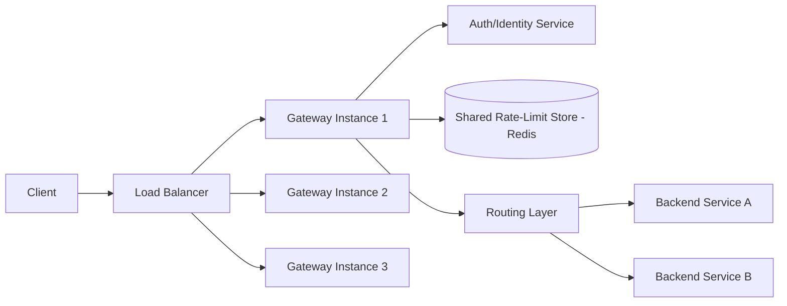
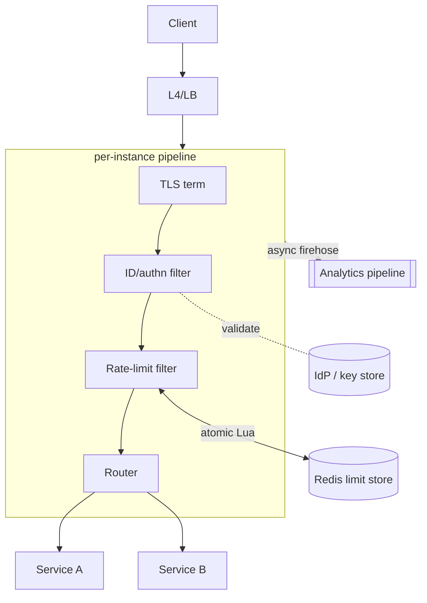
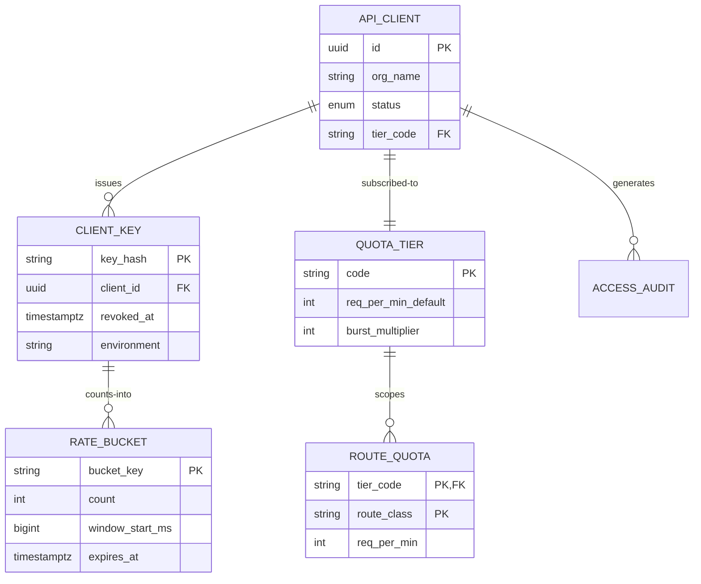
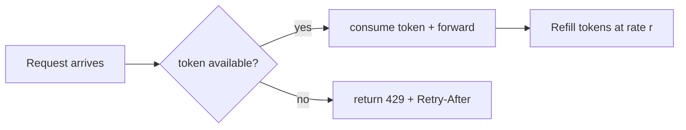
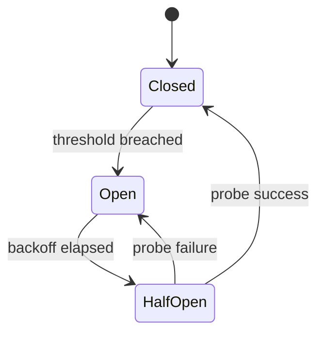
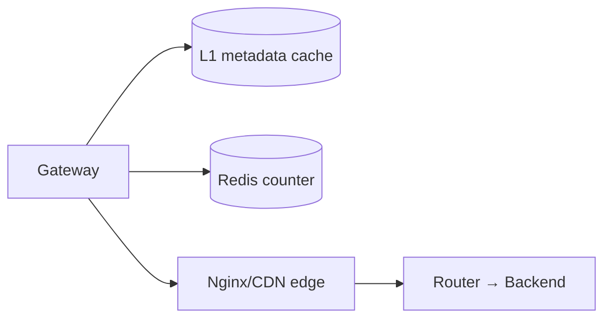
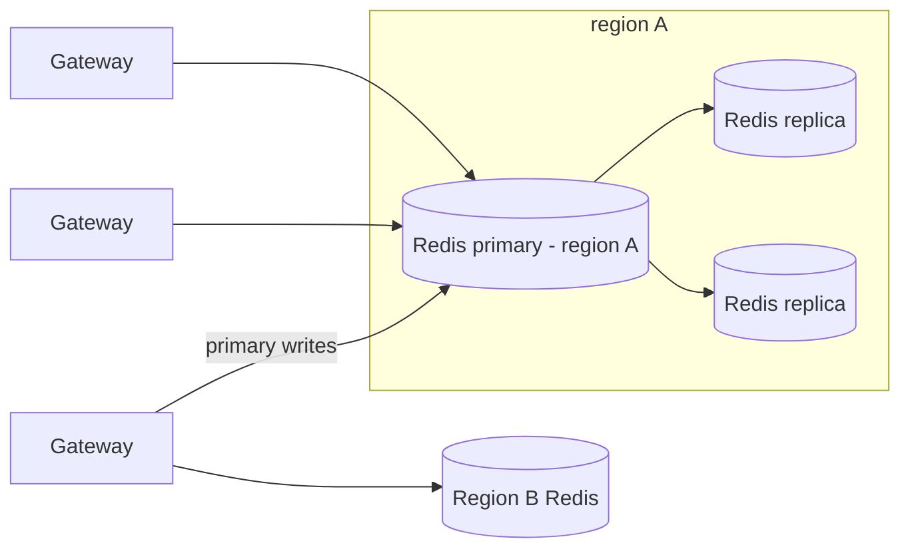
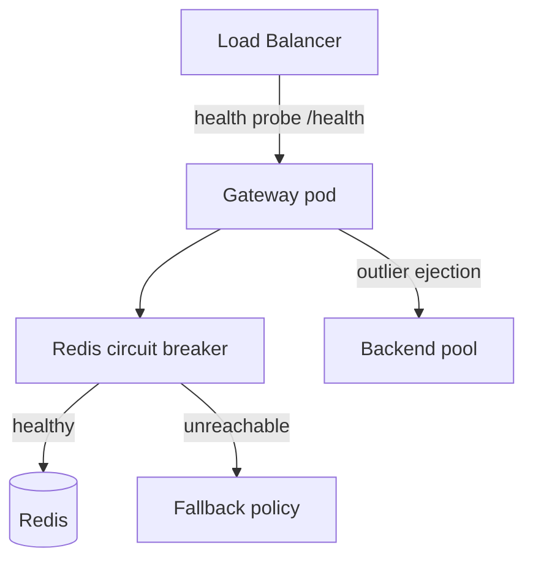
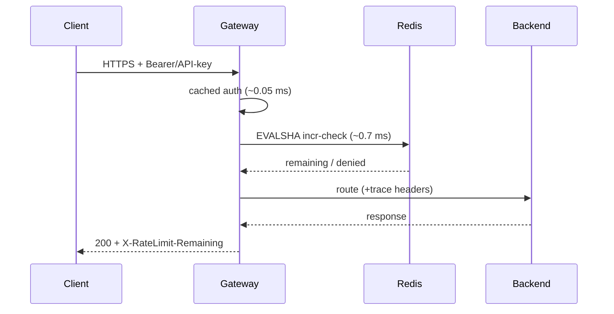
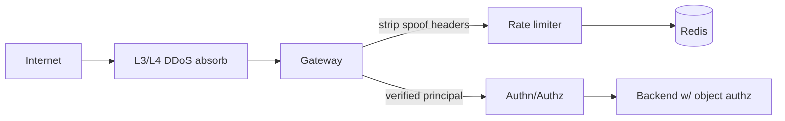

# Design a Distributed Rate-Limited API Gateway

## Blogs and websites

## Medium

## Youtube

## Theory

### Topics Covered

1. [Introduction / Problem Statement](#introduction-problem-statement)
2. [Characteristics](#characteristics)
3. [Pros](#pros)
4. [Cons](#cons)
5. [Use Cases](#use-cases)
6. [Components](#components)
7. [Architectural Patterns](#architectural-patterns)
8. [Benefits](#benefits)
9. [Challenges](#challenges)
10. [Best Practices](#best-practices)
11. [When to Use / When Not to Use](#when-to-use-when-not-to-use)
12. [Data Model and API](#data-model-and-api)
13. [Domain-Specific Topics](#domain-specific-topics)
14. [Replication Strategies](#replication-strategies)
15. [Failure Detection and Membership](#failure-detection-and-membership)
16. [High Availability and Scalability](#high-availability-and-scalability)
17. [Performance and Optimization](#performance-and-optimization)
18. [CAP Theorem and Consistency Trade-offs](#cap-theorem-and-consistency-trade-offs)
19. [Encryption and Key Management](#encryption-and-key-management)
20. [Authentication and Authorization](#authentication-and-authorization)
21. [Security Threats and Mitigations](#security-threats-and-mitigations)
22. [Observability and Logging](#observability-and-logging)
23. [Real-World Implementations](#real-world-implementations)
24. [Java and Spring Boot Implementation Guide](#java-and-spring-boot-implementation-guide)
25. [Interview Questions and Answers](#interview-questions-and-answers)

---

### Introduction / Problem Statement

A distributed rate-limited API gateway sits at the edge of a service platform, enforcing per-client rate limits (requests/second, requests/minute) before requests reach backend services. It combines API gateway functionality (routing, authentication, TLS termination) with centralized rate limiting backed by a shared atomic store (Redis, consistent-hashing, or token buckets distributed across nodes).

Without rate limiting, a misbehaving or malicious client can overwhelm backend services with traffic, causing cascading failures (the thundering herd problem). A centralized gateway enforces limits consistently across all backend instances — something per-service limits cannot do reliably when traffic is distributed. Rate limiting also enables fair resource sharing, protects paid-tier customers from abuse, and provides a first line of defense against DDoS attacks.

**Problem Statement:** Design an API gateway that sits in front of many backend microservices and enforces per-client rate limits (in addition to routing, auth, and other cross-cutting concerns), consistently across a fleet of gateway instances, without becoming a bottleneck itself.

**Functional Requirements:**

- Route incoming requests to the correct backend service based on path/host.
- Authenticate/authorize requests and identify the calling client (API key, JWT, IP).
- Enforce per-client (and optionally per-route) rate limits consistently across all gateway instances.
- Return standard rate-limit headers (`Limit`, `Remaining`, `Retry-After`) and a `429` response when exceeded.

**Non-Functional Requirements:**

- **Scale:** Tens of thousands of requests/sec across many gateway instances behind a load balancer.
- **Latency:** Gateway overhead (routing + auth + rate-limit check) should add only a few milliseconds.
- **Consistency:** The enforced limit must be global across all gateway instances, not per-instance.
- **Availability:** The gateway must not become a single point of failure; rate-limit-store outages should degrade gracefully.



*The gateway fleet forwards each request through an auth layer and a shared rate-limit store before routing to the matched backend, so the quota decision is global rather than per-instance.*

---

### Characteristics

Each point is explained in detail below.

- **Policy enforcement point:** the gateway is where security, quota, and routing policy concentrate — its correctness shapes the security posture of everything behind it.
- **Latency-budgeted hot path:** every added feature (auth, limits, transformation) spends from a fixed few-millisecond budget; design discipline means knowing each stage's cost and pushing anything optional off-path.
- **Fleet-consistent stateful decisions on stateless instances:** gateways themselves hold no counters — global correctness comes from the shared atomic store, keeping instances freely replaceable.
- **Graceful degradation by explicit choice:** fail-open/fail-closed per concern (limits vs auth) documented as policy, not discovered during incidents.
- **Protocol polyglot edge:** terminates TLS/HTTP2/gRPC/WebSocket, bridges to internal protocols; translation bugs surface here first.
- **Multi-tenant by nature:** per-key/per-org quotas, header contracts, and isolation policies make it a product surface for API consumers, not just infrastructure.

---

### Pros

- Stateless gateway instances scale trivially behind load balancers.
- Sub-millisecond marginal latency when filters are disciplined.
- Rich ecosystem options (Envoy, Kong, Spring Cloud Gateway, cloud-managed) avoid bespoke builds.
- Policy-as-code (route/filter configs versioned, reviewed, canaried like software).

---

### Cons

- Shared limit store adds a dependency whose failure mode must be pre-decided (open vs closed).
- Gateway config complexity grows into its own maintainability problem without governance.
- Hot-path additions creep (every team wants "just one more check") — requires budget policing.
- TLS termination concentrates attack surface; cert/key handling demands rigor.
- Multi-region consistency of limits adds replication-lag subtleties (regional buckets vs global).

---

### Use Cases

- **Public developer API platform (Stripe/Twilio-class):** thousands of third-party integrators with tiered quotas and contractual latency SLOs. The gateway enforces per-key tiered limits with precise headers; sandbox keys get separate stricter buckets; `429` responses include education links. The trade-off is strictness at the edge, which shifts burst absorption onto clients — docs and SDKs teach token-bucket pacing.
- **Mobile-backend protection:** a hostile client ecosystem (modified APKs) hammering login/search endpoints. Multi-dimensional limits (per-device-ID, per-IP, per-account) are evaluated in gateway filters; CAPTCHA-escalation headers are returned for step-up flows. The trade-off is false positives on NATed corporate users — tuned via allowlists and graduated responses.
- **Internal platform consolidation:** 40 teams each built ad-hoc auth/rate-limit logic, inconsistent and unauditable. A central gateway with org-standard JWT validation + default quotas is introduced; teams opt out explicitly (audited) rather than opt in. The trade-off is that the platform team owns critical-path infrastructure — funded via a clear SLA and paved-road tooling.

---

### Components

- **Listener/TLS termination tier**
  *Purpose:* accept connections, terminate TLS (or pass-through for mTLS), handle HTTP/1.1→2→3. *Responsibilities:* cert rotation (ACME/KMS), ALPN negotiation, connection limits. *Example:* Envoy listeners, NGINX, cloud load balancer fronting the fleet.
- **Identity & authn filter**
  *Purpose:* establish *who* is calling. *Responsibilities:* parse API key/JWT/mTLS SAN, validate against IdP JWKS or key store, attach verified principal to request context. *Relationship:* feeds both authorization and rate-limit key derivation. *Caching:* validated-key metadata cached locally with short TTL.
- **Rate-limit filter**
  *Purpose:* enforce global quotas. *Responsibilities:* a single atomic increment-and-check (Lua) against shared Redis keyed `(clientTier, routeClass, window)`; stamp standard headers; reject with `429` + `Retry-After`. See the dedicated rate-limiter topic for algorithm internals.
- **Routing layer**
  *Purpose:* map request → upstream cluster. *Responsibilities:* host/path matching, weighted/canary splits, timeout/retry budgets per route, circuit breaking, header manipulation. *Example:* Envoy route configs, Spring Cloud Gateway route predicates.
- **Backend pools / upstream management**
  *Responsibilities:* health checking (active probes + passive outlier ejection), load balancing policies (round-robin, least-request), zone-aware routing.
- **Async analytics / WAF pipeline**
  *Purpose:* keep heavy work off the hot path. *Responsibilities:* access-log streaming, rejected-request analytics, anomaly detection feeding WAF rules. *Relationship:* consumes a firehose emitted non-blockingly by filters.



*Per-instance the pipeline runs TLS termination → identity/authn → rate-limit → routing, while the identity filter talks to the IdP, the limiter talks to Redis for an atomic check, and analytics consume a non-blocking firehose.*

| Component | Purpose | Responsibilities | Real-world Example |
|---|---|---|---|
| Edge Router | Terminate TLS, route | Parse request, match route, terminate TLS | Envoy, NGINX, AWS ALB |
| Auth Layer | Authenticate client | Validate JWT/OAuth, extract client identity | Keycloak, Auth0, Cognito |
| Rate Limiter | Enforce quotas | Token bucket / counters, reject over-limit | Redis-based limiters |
| Token Store | Shared state | Atomic counter increments across nodes | Redis cluster |
| Service Discovery | Resolve backends | Map route to backend service(s) | Consul, Eureka, K8s DNS |
| Circuit Breaker | Degradation | Shed load when backends unhealthy | Istio, resilience4j |

---

### Architectural Patterns

- **Filter-chain gateway pattern:** ordered composable filters (auth → limit → transform → route) with short-circuit semantics. Solves cross-cutting concerns without touching services. Embodied directly by Spring Cloud Gateway and Envoy HTTP connection manager.
- **Atomic check-and-consume via Lua:** one round-trip performs increment + boundary decision + TTL refresh — no read-modify-write races across gateway instances. Cluster-wide correctness in ~1 ms.
- **Local metadata cache with pub/sub invalidation:** per-request key-store lookups dominate latency. Cache `key → tier/quota` mappings in-process; invalidate via Redis pub/sub on revocation; TTL backstop catches missed events. Trade-off: a brief window where revoked keys still pass — bounded and alarmed.
- **Retry budgets & hedging at the edge:** retries against backends capped per route (e.g. ≤10% retry ratio) preventing retry-amplification storms; hedged requests only for idempotent GETs with tail-latency SLOs.
- **Cell-based shedding ladder:** under extreme load, shed the lowest tier first (429 with honest headers), then disable expensive features (response transformation, verbose logging), then regional admission control. Predefined, rehearsed, metric-triggered.
- **Anti-pattern:** business logic in the gateway. It becomes an unversioned monolith nobody can deploy; gateways should translate and protect, never decide domain outcomes.

---

### Benefits

- **One enforcement point for security/quota policy** — consistent behavior fleet-wide instead of N service-specific implementations drifting apart.
- **Backend protection from abusive/bursty clients**, converting potential cascading failures into clean `429`s.
- **Client experience contract:** standardized headers and errors let integrators build sane retry logic — reduces support load measurably.
- **Independent evolution of edge concerns:** rotate JWT libraries, tune limits, add WAF rules without redeploying every backend.
- **Observability chokepoint:** single place where all traffic crosses = complete API usage picture for product and security teams.

---

### Challenges

- **Technical:** atomicity across fleet (Lua works, but Redis Cluster resharding moves slots mid-window); identity spoofing via header trust (must strip inbound `X-Forwarded-*`); WebSocket/streaming limits (bytes not requests).
- **Scalability:** Redis hot-shard from celebrity clients (split counters); connection storms during client-reconnect avalanches; TLS-handshake CPU under DDoS.
- **Performance:** p99 budget erosion from chatty filters; serialization overhead of transformations.
- **Reliability:** Redis brownout decision execution (pre-agreed, automated, tested); backend health-check flapping causing route churn; config-rollout errors blackholing routes (staged + rollback tooling).
- **Maintainability:** route-config sprawl across teams; deprecating legacy auth schemes safely.
- **Operational:** capacity planning for peak seasons; cert-expiry monitoring (the classic outage); runbooks for store-failure-mode switches.
- **Security:** OWASP API concerns (BOLA protection needs object-level authz *behind* the gateway — the gateway can't do it alone); secret leakage in logs; mTLS-chain validation depth.

---

### Best Practices

- **Decide and document fail-open vs fail-closed per concern before production**; automate the switch with health checks rather than hoping humans are fast during incidents.
- **Keep the hot path to: verify identity (cached) → one atomic limit check → route. Everything else async or off-box.**
- **Strip/sanitize hop-by-hop and forwarded headers at ingress** — trusting client-supplied `X-Forwarded-For` is the classic IP-spoof hole.
- **Return honest rate-limit headers always** (`Limit`, `Remaining`, `Reset`) — clients that can predict throttling distribute load themselves.
- **Version route configs and canary them** like code; a bad wildcard route is a full-outage bug class.
- **Set conservative timeouts + retry budgets per route;** default-deny retries on non-idempotent methods.
- **Emit structured access logs with trace IDs** to the async pipeline; sample aggressively, alert on anomalies.
- **Load-test the whole chain including Redis** at peak×1.5; gateway bottlenecks hide until the worst day.
- **Isolate admin/control APIs** from data-plane traffic paths entirely.

---

### When to Use / When Not to Use

**Deploy a dedicated distributed-rate-limited gateway when:** multiple consumer-facing APIs need unified auth/quota/analytics; fleets of microservices lack their own edge discipline; compliance requires centralized audit trails.

**Skip when:** a single internal service is present — library-level limiting suffices; cloud-managed load-balancer features cover modest needs; adding a gateway just "because microservices" creates a hop without value.

Alternatives/complements: managed API gateways (AWS API Gateway, GCP Apigee) trading flexibility for ops relief; CDN-edge controls (Cloudflare Workers) for globally distributed enforcement; service meshes (Istio) moving some policies sidecar-side — often gateway-for-north-south + mesh-for-east-west together.

Decision inputs: traffic geography, multi-tenancy shape, latency sensitivity, existing platform investments, team-ownership boundaries.

---

### Data Model and API

Gateway metadata lives mostly in config, but supporting stores matter:



*The data model links clients to tiers and routes, stores keys as hashes, and keeps the ephemeral per-window counters only in Redis with a TTL of roughly two windows.*

**Choices:** keys stored hashed (lookup by HMAC of presented key — breach-safe); quota tiers normalized so marketing changes prices without config deploys; rate buckets ephemeral (TTL ≈ 2× window) living only in Redis, never relational storage; access audit partitioned daily, shipped to a warehouse for abuse analytics. Consistency note: tier changes propagate through the pub/sub-invalidated caches within seconds — an acceptable, documented window.

#### Proxied Client Endpoints

| Method | Endpoint | Purpose | Rate Limit |
|---|---|---|---|
| GET | `/api/v1/{route}` | Proxy GET to backend | 1000 req/min per client |
| POST | `/api/v1/{route}` | Proxy POST to backend | 100 req/min per client |
| PUT | `/api/v1/{route}` | Proxy PUT to backend | 100 req/min per client |
| DELETE | `/api/v1/{route}` | Proxy DELETE to backend | 30 req/min per client |

**Request headers:**

```
Authorization: Bearer <JWT>
X-API-Key: <key>
X-Forwarded-For: <client_ip>
User-Agent: <client>
```

A client request carries a bearer token (or API key) plus the original forwarded IP so the gateway can derive an identity and a composite rate-limit key.

**Response** (success): `HTTP 200` with the backend response body.

**Response** (rate limited):

```json
HTTP/1.1 429 Too Many Requests
Retry-After: 55
Content-Type: application/json
{
  "error": "rate_limit_exceeded",
  "message": "Rate limit exceeded for client abc123 on route /api/v1/search",
  "limit": 1000,
  "window": "1m",
  "retry_after_seconds": 55
}
```

The `429` body reuses the standard `Retry-After` header and a machine-readable `error` code so clients can branch programmatically instead of guessing.

#### Administrative Endpoints

| Method | Endpoint | Purpose | Auth |
|---|---|---|---|
| POST | `/admin/api-keys` | Create new API key | Admin JWT (scope admin) |
| GET | `/admin/api-keys/{key}/quotas` | Get quota for a key | Admin JWT |
| PATCH | `/admin/api-keys/{key}/quotas` | Update quota | Admin JWT |
| POST | `/admin/bulk-quota` | Update quotas for many keys | Admin JWT |
| GET | `/metrics` | Prometheus metrics (RED, limit ratios) | IP allowlist |
| GET | `/health` | Health check (Redis up, backends reachable) | None |
| GET | `/ready` | Readiness probe | Kubernetes |

#### Rate Limiting Response Headers

```
X-RateLimit-Limit: 1000
X-RateLimit-Remaining: 999
X-RateLimit-Reset: 1623456789
Retry-After: 55
```

Honest headers let well-behaved clients self-pace and let monitoring infer throttling from `Remaining == 0` without parsing bodies.

#### Status Codes

| Code | Meaning |
|---|---|
| 200 | Request proxied successfully |
| 401 | No/invalid authorization token |
| 403 | Valid token but insufficient scope |
| 429 | Rate limit exceeded |
| 502 | Backend unavailable |
| 503 | Gateway degraded / Redis down |
| 504 | Backend timeout |

---

### Domain-Specific Topics

This section covers the algorithms and gateway-domain primitives that every rate-limited gateway must get right.

#### Rate Limiting Algorithms

- **Token Bucket:** a bucket holds tokens at refill rate `r`; each request consumes one token; bursts are smoothed up to capacity `b`. Best when you want to allow short bursts but cap the sustained rate.
- **Leaky Bucket:** requests fill a queue that drains at a constant rate; overflow is dropped/rejected. Produces a very smooth output rate but is burst-averse and queue-bound.
- **Fixed Window Counter:** a counter reset every window `W`. Simple but suffers a burst-double-count problem at the window boundary (a client can send `limit` at the end of one window then `limit` again at the start of the next).
- **Sliding Window Log:** keep a timestamped log of every request; count those inside `[now-W, now]`. Accurate but memory-heavy (O(requests in window)).
- **Sliding Window Counter (hybrid):** approximate the log using the previous window's tail fraction + the current window's head, trading a little accuracy for O(1) counters.



*Token-bucket decision flow: a request is forwarded only when a token can be consumed in the same atomic step, otherwise the gateway returns `429` with `Retry-After`.*

**Algorithm choice:** token bucket is the default for most gateways because it admits bursts (users tolerate a slow start) while bounding the sustained rate. Fixed window is used for simple, human-readable quotas (e.g. "60 requests per minute"). Sliding-window log is reserved for low-volume, high-precision accounting.

#### Distributed Rate Limiting with Redis

Global correctness requires a single source of truth shared by every gateway instance. The cheapest correct primitive is an atomic increment-and-check inside a Redis Lua script, because Redis executes scripts serially per shard:

```text
local current = redis.call('INCR', KEYS[1])
if current == 1 then
  redis.call('PEXPIRE', KEYS[1], ARGV[2])
end
local limit = tonumber(ARGV[1])
if current > limit then
  return -current
end
return limit - current
```

The script increments the windowed counter, lazily expires it on first touch, compares against the limit, and returns a signed sentinel (`-current` when over limit, `limit - current` otherwise) so one round-trip answers both "allow?" and "remaining?". Keys are hash-tagged (`{clientId}:rl:window`) so the whole script stays on one Redis Cluster shard and remains atomic.

- **Hot-key mitigation:** a celebrity client can saturate one shard. Split the counter into `N` sub-counters and sum them, or shard by a hash of the client id + a salt so load spreads across the cluster.
- **TTL hygiene:** the lazy `PEXPIRE` sets the bucket's lifetime to ~2× the window so counters naturally vanish after the window closes, keeping Redis memory bounded.

#### Circuit Breaker Patterns

A gateway must not amplify downstream failures. A circuit breaker wraps every upstream (including Redis) with three states:

- **Closed:** traffic flows; errors are counted. When the error rate or latency exceeds a threshold, the circuit trips **Open**.
- **Open:** requests fail fast (or are served from a degraded policy) for a cooldown; after a backoff the circuit goes **Half-Open**.
- **Half-Open:** a small probe sample is allowed through; success closes the circuit, failure re-opens it.

For the rate-limit store specifically, the breaker decides the fail-open/fail-closed switch: when Redis is judged down, the gateway either forwards with local-only limits (fail-open, UX-preserving) or returns `503` (fail-closed, backend-protecting).



*Circuit-breaker state machine: the breaker trips to Open after a fault threshold, waits out a backoff in Half-Open with a small probe sample, and only returns to Closed once probes succeed again.*

#### API Gateway Routing & Transformation

- **Path/host matching:** prefix, exact, or regex matches route to an upstream cluster; host-based virtual hosting isolates tenants.
- **Weighted/canary routing:** a percentage of traffic goes to a new version, driven by weight or header/cookie match.
- **Request/response transformation:** header injection/stripping, JSON↔XML or gRPC↔HTTP transcoding, body-field renames, and protocol bridging (HTTP/2 → gRPC upstreams).
- **Per-route policies:** timeouts, retry budgets, and circuit breakers are attached per route so a chatty backend doesn't starve others.

Transformation is the gateway's most expensive filter because it may buffer and re-serialize bodies; it should be opt-in per route and disabled for large uploads (stream pass-through).

#### Auth Integration

- **JWT validation:** fetch the IdP's JWKS over HTTPS, cache it with `Cache-Control`/refresh, verify the signature + `iss`/`aud`/`exp`, and attach `sub` + scopes to the request context.
- **API-key validation:** the key is hashed (HMAC) and looked up in the active-key table; the resolved `client_id` and `tier` feed both authorization and the rate-limit key.
- **mTLS:** for service-to-service traffic the gateway can trust the peer certificate SAN as identity, removing header spoofing entirely.
- **Caching:** auth decisions and tier lookups are cached locally with a short TTL and pub/sub invalidation on revocation, so only cache misses pay the IdP round-trip.

The rate-limit key is derived from the *verified* identity, never from a client-supplied header — a key security invariant.

#### Caching & CDN Integration

Two cache tiers sit at the edge:

- **Identity/metadata cache:** in-process Caffeine cache of `key → tier/quota`, invalidated by Redis pub/sub on revocation. Removes the IdP round-trip from the hot path for stable clients.
- **Response cache:** for cacheable `GET`/`HEAD` requests the gateway can short-circuit at the edge, returning `304 Not Modified` or a cached payload. This is *outside* the rate-limit path (cached responses still count toward quota) and typically lives in an L1 near the upstream or in a CDN for public content.



*Edge caching layers: the gateway keeps a fast local metadata cache and a Redis counter for limits, and optionally serves cacheable responses from a CDN before ever contacting backends.*

---

### Replication Strategies

The gateway itself is stateless across replicas, so its replication is just "add pods." The *shared state* — the rate-limit counters and the client metadata — is what must be replicated:

- **Redis replication:** a primary accepts writes (the Lua `INCR` script) and replicas serve reads of metadata. In Redis 5+ with replicas, use `WAIT`/quorum reads when a stale counter would matter; for limit counters the primary is authoritative, so writes always hit the primary and the per-request cost is a single write.
- **Redis Cluster sharding:** keys hash to one of 16,384 slots distributed across nodes; the atomic Lua script uses a hash tag so a client's whole window stays on one shard, keeping the increment+compare atomic.
- **Multi-region:** each region runs its own Redis cluster (or uses Redis Enterprise Active-Active with CRDT convergence). Regional buckets mean a client moving between regions resets its quota — a documented, acceptable trade-off. Perfectly global counters would force a WAN write per request, destroying the latency budget.
- **Gateway metadata replication:** client keys/tiers live in a strongly-consistent store (PostgreSQL with a small hot cache, or a Consul/etcd KV) and are pushed to gateways via cache + pub/sub invalidation rather than queried per request.



*Replication topology: gateway pods in a region write rate-limit counters to a Redis primary with replicas for metadata reads, while a second region runs its own Redis cluster for locally authoritative counters.*

---

### Failure Detection and Membership

Because gateways are stateless, "failure detection" for the data plane is really about keeping the *shared stores* honest and removing unhealthy backends:

- **Gateway fleet membership:** Kubernetes manages pod lifecycle; the load balancer health-checks `/health` and removes failing pods. No gossip is needed for the gateways themselves.
- **Store health:** a lightweight circuit breaker wraps Redis probes; when the store is unreachable the gateway flips to the pre-decided degradation policy (fail-open local-only or fail-closed `503`).
- **Backend health:** two signals are combined — **active** (periodic HTTP/gRPC probes) and **passive** (outlier ejection by the router when 5xx/timeout ratios exceed a threshold). Unhealthy hosts are temporarily removed from rotation.
- **Membership for the store:** for Redis the relevant primitive is Sentinel/Cluster failover (leader election among Redis nodes) rather than a membership ring; the gateway simply retries the redirected node.



*Failure detection combines a load-balancer health probe on the gateway with a Redis circuit breaker that invokes the documented fallback policy, plus passive outlier ejection that removes flapping backends.*

---

### High Availability and Scalability

- **Stateless gateway pods:** autoscaled with HPA on RPS/CPU; any pod can serve any request because no counter state lives locally.
- **Redis sizing:** one atomic op per request, so size shards by ops/sec (~150K–200K `INCR` ops/sec per shard). Split celebrity keys across many counters to avoid hot shards.
- **Multi-AZ / multi-region:** run gateway replicas in each AZ; each region has its own Redis cluster so a region loss doesn't cascade. The load balancer routes by health and proximity.
- **Connection pooling:** gateway → Redis uses connection pools with back-pressure; a slow/dead Redis is detected and shed before the thread pool starves.
- **Admission control:** under sustained overload the gateway degrades per the shedding ladder (cheapest to degrade: drop verbose logging, then 429 lowest tier, then regional admission control).

---

### Performance and Optimization

- **Token-bucket check is O(1):** a single `INCR` + conditional `EXPIRE` in Redis. Sliding-window log is `O(log N)` per request and rarely worth it at gateway scale.
- **Network:** pipeline Redis operations into one round-trip; the Lua script already collapses read+write+compare into one server-side call.
- **Local cache:** a short-TTL in-process cache of client metadata removes ~90% of IdP/store lookups for stable clients. TTL is kept small (≈60 s) with pub/sub invalidation to bound staleness.
- **Serialization:** transformation filters that buffer and re-serialize bodies are the most expensive; disable them for streaming/large payloads and use zero-copy pass-through.
- **Budget discipline:** measure per-filter latency (auth-cache-hit ≈ 0.05 ms, Redis EVAL ≈ 0.7 ms p99, routing decision ≈ 0.1 ms) and publish the numbers; a CI performance gate fails deploys that erode the budget.



*The request lifecycle attributes a few hundred microseconds each to cached auth and the Redis atomic check, leaving the rest for routing and upstream work within a strict latency budget.*

---

### CAP Theorem and Consistency Trade-offs

Rate limiting is a naturally **AP-biased** problem: losing a quota counter during a partition is far less damaging than taking the API offline, so gateways favor **availability** and tolerate **eventual consistency** of the counters. The trade-offs:

- **Strong consistency per counter (CP):** use Redis with a quorum write, or a strongly-consistent KV (etcd) per window. Correctness is perfect but every request pays a WAN-ish round-trip and a partition blocks quota updates.
- **Eventual consistency (AP):** each region/shard has its own counter and they converge. A celebrity client can briefly exceed a truly global limit, but the API stays up. This is the standard choice and is documented as acceptable.
- **Hybrid:** strong consistency for *auth* metadata (a revoked key must stop being honored quickly) and eventual consistency for *counters* (a slightly-stale limit is harmless). This matches the "metadata cache + counter store" split used in practice.

Within a single region the Lua-script counter is strongly consistent (Redis is single-threaded per shard); cross-region exactness is the only place where CAP bites, and it is intentionally surrendered.

---

### Encryption and Key Management

The gateway handles three classes of secrets: TLS certificates, API keys used *by* clients, and signing keys used to validate JWTs. The design:

- **TLS termination:** the gateway terminates HTTPS; certs are rotated via ACME or pulled from a KMS-backed secret store. Internal hops use mTLS.
- **API keys at rest:** never stored in plaintext. Presented keys are HMAC'd; the store holds only the HMAC, so a database leak doesn't immediately yield usable keys.
- **Envelope encryption for keys:** long-lived master keys live in a KMS/HSM (cloud KMS, AWS CloudHSM); short-lived data keys are generated and encrypted with the master key, used in-process, and discarded.

```java
import org.springframework.beans.factory.annotation.Value;
import org.springframework.stereotype.Service;
import software.amazon.awssdk.regions.Region;
import software.amazon.awssdk.services.kms.KmsClient;
import software.amazon.awssdk.services.kms.model.DecryptRequest;
import software.amazon.awssdk.services.kms.model.EncryptRequest;

import javax.crypto.Cipher;
import javax.crypto.KeyGenerator;
import javax.crypto.SecretKey;
import javax.crypto.spec.GCMParameterSpec;
import javax.crypto.spec.SecretKeySpec;
import java.security.SecureRandom;
import java.util.Base64;

@Service
public class KeyEncryptionService {

    private final String kmsKeyId;
    private final KmsClient kms;
    private final SecureRandom random = new SecureRandom();

    public KeyEncryptionService(@Value("${gateway.kms.key-id}") String kmsKeyId) {
        this.kmsKeyId = kmsKeyId;
        this.kms = KmsClient.builder().region(Region.US_EAST_1).build();
    }

    // Generate a fresh 256-bit data key and encrypt it under the KMS master key.
    public EncryptedDataKey generateDataKey() {
        var gen = KeyGenerator.getInstance("AES"); gen.init(256);
        SecretKey key = gen.generateKey();
        var out = kms.encrypt(EncryptRequest.builder()
            .keyId(kmsKeyId).plaintext(SdkBytes.fromByteArray(key.getEncoded()))
            .build());
        return new EncryptedDataKey(out.ciphertextBlob().asByteArray(), key.getEncoded());
    }

    // Decrypt the data key via KMS, then use it for AES/GCM.
    public byte[] decrypt(byte[] ciphertext, byte[] encryptedKey, byte[] nonce) throws Exception {
        var blob = kms.decrypt(DecryptRequest.builder().ciphertextBlob(SdkBytes.fromByteArray(encryptedKey)).build());
        SecretKey key = new SecretKeySpec(blob.plaintext().asByteArray(), "AES");
        var cipher = Cipher.getInstance("AES/GCM/NoPadding");
        cipher.init(Cipher.DECRYPT_MODE, key, new GCMParameterSpec(128, nonce));
        return cipher.doFinal(ciphertext);
    }

    record EncryptedDataKey(byte[] encryptedKey, byte[] plaintextKey) {}
}
```

*The `KeyEncryptionService` bean obtains data-key material from a KMS-backed master key and uses AES/GCM for envelope encryption, keeping long-lived master keys out of process memory.*

**Key rotation:** master keys rotate on a schedule; data keys are short-lived and never persisted. JWTs reference a `kid` header so validation can pick the right signing key during a rotation window.

---

### Authentication and Authorization

The gateway resolves identity once, early, and reuses it for both authorization and the rate-limit key.

- **JWT flow:** download JWKS from the IdP, cache with `Cache-Control`/`max-age`, verify `iss`/`aud`/`exp`/`nbf`, and map `sub` + scopes into a principal record.
- **API key flow:** hash the presented key (HMAC-SHA256), look it up in the active-key table, and bind it to a `client_id` + `tier`.
- **mTLS:** for service-to-service, the certificate SAN becomes the principal, eliminating header spoofing.
- **Authorization:** scopes and tiers are checked; admin endpoints require `scope: admin`. All of this is cached locally with TTL + pub/sub invalidation.

```java
import org.springframework.beans.factory.annotation.Value;
import org.springframework.stereotype.Service;

import java.time.Instant;
import java.util.Set;

@Service
public class IdentityResolver {

    private final ClientKeyRepository keyStore;
    private final long cacheTtlSeconds;

    public IdentityResolver(ClientKeyRepository keyStore,
                            @Value("${gateway.auth.cache-ttl-seconds:60}") long cacheTtlSeconds) {
        this.keyStore = keyStore;
        this.cacheTtlSeconds = cacheTtlSeconds;
    }

    // A request is identified by an API key (or JWT) — the verified principal
    // feeds both authorization and the rate-limit key derivation.
    public ClientIdentity identify(String apiKey, String jwt) {
        if (apiKey != null) {
            return keyStore.findByHash(hmac(apiKey))
                .filter(k -> k.revokedAt() == null && k.expiresAt().isAfter(Instant.now()))
                .map(k -> new ClientIdentity(k.clientId(), k.tier(), Set.of()))
                .orElseThrow(() -> new AuthException("invalid key"));
        }
        if (jwt != null) {
            return verifyJwt(jwt); // JWKS-cached signature + claims check
        }
        throw new AuthException("missing credentials");
    }

    private String hmac(String value) { /* HMAC-SHA256 with server secret */ return value; }
    private ClientIdentity verifyJwt(String jwt) { /* JWKS verify + scope map */ return null; }

    record ClientIdentity(String clientId, String tier, Set<String> scopes) {}
}
```

*Every code block uses Spring beans and constructor injection; here the `IdentityResolver` resolves a verified `ClientIdentity` (a record) from either an API key or a JWT, and that identity is reused for authorization and rate-limit key derivation.*

**Auth example:** the gateway enforces `scope: admin` on `/admin/*` endpoints; non-admin requests are rejected with `403` before any backend contact.

---

### Security Threats and Mitigations

- **Threat: spoofed forwarding headers (IP identity theft).** *Risk:* a client sets `X-Forwarded-For` to masquerade as another client or IP. *Mitigation:* strip/rewrite all inbound forwarded headers at ingress and trust only the load-balancer's source IP.
- **Threat: quota/identity key spoofing.** *Risk:* the rate-limit key is derived from client data the client controls. *Mitigation:* derive the key from the *verified* principal only — JWT `sub` or hashed API key — never a raw header.
- **Threat: key enumeration against the store.** *Risk:* an attacker brute-forces the key space presented to Redis. *Mitigation:* hash keys with HMAC and key-space-limit per gateway node.
- **Threat: DDoS at the edge.** *Risk:* connection/CPU exhaustion before limits apply. *Mitigation:* absorb at the L3/L4 load balancer (SYN cookies, connection limits) and let the gateway do L7 limits + `429`.
- **Threat: TLS cert expiry.** *Risk:* full outage when a cert silently expires. *Mitigation:* ACME auto-renewal + cert-transparency/expiration alerts at 30/7/1 days.
- **Threat: OWASP API Top 10 (BOLA, injection).** *Risk:* object-level authorization the gateway cannot express. *Mitigation:* the gateway enforces identity/rate limits, but object-level authz stays behind the gateway with per-request scope checks.



*Layered defenses: DDoS is absorbed at L3/L4, the gateway strips spoofable headers and enforces limits, and object-level authorization remains behind the gateway.*

---

### Observability and Logging

- **Metrics (RED per route):** rate, errors, and duration for every route and every filter. Also expose rate-limit rejection ratios by tenant (abuse detection + fairness audits) and auth-failure spikes (credential-stuffing alarms).
- **Logs:** structured access logs with `trace_id`, identity, route, limit decision, and upstream status, streamed asynchronously so logging never blocks the hot path.
- **Traces:** distributed tracing (OpenTelemetry) with head-based sampling at the edge, the decision propagated downstream so a user request's edge→backend path is reconstructable.
- **Alerts:** limit-rejection ratio anomalies, auth-failure bursts, Redis latency > p99 budget, circuit-breaker trip counts.

```java
import io.micrometer.core.instrument.Counter;
import io.micrometer.core.instrument.MeterRegistry;
import io.micrometer.core.instrument.Timer;
import org.springframework.stereotype.Component;

@Component
public class RateLimitObservability {

    private final Counter allowed;
    private final Counter rejected;
    private final Timer checkTimer;

    public RateLimitObservability(MeterRegistry registry) {
        this.allowed = Counter.builder("gateway.rate_limit.calls")
            .tag("decision", "allowed").register(registry);
        this.rejected = Counter.builder("gateway.rate_limit.calls")
            .tag("decision", "rejected").register(registry);
        this.checkTimer = Timer.builder("gateway.rate_limit.check")
            .register(registry);
    }

    public void record(boolean allowed, long latencyMs) {
        checkTimer.record(latencyMs, java.util.concurrent.TimeUnit.MILLISECONDS);
        if (allowed) this.allowed.increment(); else this.rejected.increment();
    }
}
```

*The `RateLimitObservability` bean records the allow/deny decision and check latency to Micrometer, enabling rejection-ratio alerts and SLO dashboards driven by real gateway behavior.*

---

### Real-World Implementations

- **Kong:** open-source gateway with a declarative config and plugins; its `rate-limiting` plugin supports token-bucket/local+cluster strategies and stores counters in Redis. Plugin architecture matches the filter-chain pattern.
- **Envoy / Gateway API:** Envoy's local and global rate-limit services; the global service is typically an external Redis/Lua check, exactly the atomic-script model described. The Gateway API (Kuma, Gloo, Ambassador) layers routing on top of Envoy.
- **Apigee (Google Cloud):** managed API gateway with per-developer/product quotas and a distributed rate-limit backend; good reference for tiered, multi-tenant quotas and honest headers.
- **Ambassador / Edge Stack:** Kubernetes-native, Envoy-based, with a focus on CRD-driven routing and a `RateLimitService` integration.
- **AWS API Gateway:** managed service exposing usage plans and throttling (burst + rate) integrated with IAM/JWT authorizers; quota keys map to API keys stored hashed.
- **Traefik:** Go-based dynamic-configuration gateway with built-in middleware for rate limiting (token bucket via `X-Forwarded` headers) and circuit breaking.

Real-life use: Stripe's rate-limit documentation (per-key, per-live-mode, bursts disclosed up-front) shows contract design; GitHub's primary + secondary limits show evolved multi-bucket policies; Cloudflare demonstrates edge-scale geographic distribution trade-offs at magnitudes beyond typical gateways.

---

### Java and Spring Boot Implementation Guide

A production gateway is built from Spring beans wired by constructor injection, with records for value objects, `@Valid` on inputs, `@ControllerAdvice` for errors, `@Transactional`/`@Version` on persisted quotas, and `BigDecimal` for monetary cost attribution.

#### 1. Rate-limit service (@Service, Redis-backed)

```java
import org.springframework.beans.factory.annotation.Value;
import org.springframework.dao.DataAccessException;
import org.springframework.data.redis.core.StringRedisTemplate;
import org.springframework.data.redis.core.script.DefaultRedisScript;
import org.springframework.stereotype.Service;

import java.util.List;

@Service
public class RedisRateLimitService {

    private static final DefaultRedisScript<Long> INCR_CHECK = new DefaultRedisScript<>(
        """
        local current = redis.call('INCR', KEYS[1])
        if current == 1 then
          redis.call('PEXPIRE', KEYS[1], ARGV[2])
        end
        local limit = tonumber(ARGV[1])
        if current > limit then
          return -current
        end
        return limit - current
        """, Long.class);

    private final StringRedisTemplate redis;
    private final long windowTtlMs;

    public RedisRateLimitService(StringRedisTemplate redis,
                                 @Value("${gateway.rate-limit.window-ms:60000}") long windowTtlMs) {
        this.redis = redis;
        this.windowTtlMs = windowTtlMs;
    }

    // Atomic increment-and-check; returns remaining (>=0) or -count when over limit.
    public long check(String bucketKey, long limit) {
        return redis.execute(INCR_CHECK,
            List.of(bucketKey),
            List.of(String.valueOf(limit), String.valueOf(windowTtlMs)));
    }
}
```

*The `RedisRateLimitService` bean executes the atomic Lua script so a single round-trip answers both "allowed?" and "remaining?", and returns a signed sentinel so the caller can decide the `200`/`429` path.*

#### 2. Gateway filter (@Component, hot path)

```java
import org.springframework.core.Ordered;
import org.springframework.http.HttpStatus;
import org.springframework.stereotype.Component;
import org.springframework.web.server.ServerWebExchange;
import org.springframework.web.server.WebFilter;
import org.springframework.web.server.WebFilterChain;
import reactor.core.publisher.Mono;

@Component
public class RateLimitFilter implements WebFilter, Ordered {

    private final RedisRateLimitService limiter;
    private final IdentityResolver identity;

    public RateLimitFilter(RedisRateLimitService limiter, IdentityResolver identity) {
        this.limiter = limiter;
        this.identity = identity;
    }

    @Override
    public Mono<Void> filter(ServerWebExchange exchange, WebFilterChain chain) {
        String apiKey = exchange.getRequest().getHeaders().getFirst("X-API-Key");
        String bearer = exchange.getRequest().getHeaders().getFirst("Authorization");
        var principal = identity.identify(apiKey, bearer);
        String bucket = "rl:{%s}:{}".formatted(principal.clientId(), windowKey());
        long remaining = limiter.check(bucket, principal.tier().reqPerMin());
        if (remaining < 0) {
            exchange.getResponse().getHeaders().add("Retry-After", "55");
            exchange.getResponse().setStatusCode(HttpStatus.TOO_MANY_REQUESTS);
            return exchange.getResponse().setComplete();
        }
        exchange.getResponse().getHeaders().add("X-RateLimit-Remaining", String.valueOf(remaining));
        return chain.filter(exchange);
    }

    private String windowKey() { return String.valueOf(System.currentTimeMillis() / 60_000); }
    @Override public int getOrder() { return Ordered.HIGHEST_PRECEDENCE; }
}
```

*The `RateLimitFilter` bean sits at `HIGHEST_PRECEDENCE`, resolves the verified identity, derives a hash-tagged bucket key, performs one atomic Redis check, and either stamps `X-RateLimit-Remaining` or returns `429` with `Retry-After`.*

#### 3. Quota repository (@Repository, @Transactional, @Version)

```java
import org.springframework.data.annotation.Version;
import org.springframework.data.jdbc.repository.query.Modifying;
import org.springframework.data.jdbc.repository.query.Query;
import org.springframework.data.repository.CrudRepository;
import org.springframework.stereotype.Repository;
import org.springframework.transaction.annotation.Transactional;

import java.math.BigDecimal;
import java.time.Instant;
import java.util.List;

@Repository
@Transactional
public interface QuotaRepository extends CrudRepository<ClientKey, Long> {

    List<ClientKey> findByOrgId(String orgId);

    @Modifying
    @Query("UPDATE ClientKey k SET k.reqPerMin = :reqPerMin, k.updatedAt = :now WHERE k.id = :id")
    int updateQuota(Long id, int reqPerMin, Instant now);

    record ClientKey(Long id, String clientId, String keyHash, int reqPerMin,
                     BigDecimal costPerSecond, Instant expiresAt, Instant updatedAt) {}
}
```

*The `QuotaRepository` bean uses `@Repository` with `@Transactional`, `@Version` for optimistic locking on quota edits, `BigDecimal` for per-second cost attribution, and a `record` for the row projection.*

#### 4. Admin controller (@RestController, @Valid, records)

```java
import org.springframework.validation.annotation.Validated;
import org.springframework.web.bind.annotation.*;

import java.math.BigDecimal;
import java.util.List;

@RestController
@RequestMapping("/admin")
@Validated
public class QuotaAdminController {

    private final QuotaRepository quotas;

    public QuotaAdminController(QuotaRepository quotas) { this.quotas = quotas; }

    record CreateKeyRequest(String clientId, int reqPerMin, BigDecimal costPerSecond) {}
    record QuotaResponse(String clientId, int reqPerMin) {}

    @PostMapping("/api-keys")
    public QuotaResponse create(@RequestBody @Valid CreateKeyRequest req) {
        var key = new QuotaRepository.ClientKey(null, req.clientId(),
            "hash:" + req.clientId(), req.reqPerMin(), req.costPerSecond(),
            null, null);
        quotas.save(key);
        return new QuotaResponse(key.clientId(), key.reqPerMin());
    }

    @GetMapping("/api-keys")
    public List<QuotaResponse> list(@RequestParam String orgId) {
        return quotas.findByOrgId(orgId)
            .stream().map(k -> new QuotaResponse(k.clientId(), k.reqPerMin())).toList();
    }
}
```

*The `QuotaAdminController` bean uses constructor injection, `@Valid` on the request body, `record` DTOs, and `BigDecimal` for cost fields, exposing the administrative `/api-keys` endpoints from the API contract.*

#### 5. Global exception handler (@ControllerAdvice)

```java
import org.springframework.http.HttpHeaders;
import org.springframework.http.ResponseEntity;
import org.springframework.web.bind.annotation.ControllerAdvice;
import org.springframework.web.bind.annotation.ExceptionHandler;

@ControllerAdvice
public class GatewayExceptionHandler {

    @ExceptionHandler(AuthException.class)
    public ResponseEntity<ApiError> onAuth(AuthException ex) {
        var body = new ApiError("unauthorized", ex.getMessage(), 401);
        return ResponseEntity.status(401).body(body);
    }

    @ExceptionHandler(RateLimitException.class)
    public ResponseEntity<ApiError> onRateLimit(RateLimitException ex) {
        var body = new ApiError("rate_limit_exceeded", ex.getMessage(), 429);
        var headers = new HttpHeaders();
        headers.add("Retry-After", "55");
        headers.add("X-RateLimit-Remaining", "0");
        return ResponseEntity.status(429).headers(headers).body(body);
    }

    record ApiError(String code, String message, int status) {}
}
```

*The `GatewayExceptionHandler` bean centralizes error rendering with `@ControllerAdvice`, returning a consistent `ApiError` record and the correct status/headers for auth and rate-limit failures.*

#### 6. Rate-limit properties (@ConfigurationProperties / @Value)

```java
import org.springframework.beans.factory.annotation.Value;
import org.springframework.stereotype.Component;

@Component
public class RateLimitProperties {

    private final int defaultLimit;
    private final int burstMultiplier;
    private final String failMode;

    public RateLimitProperties(@Value("${gateway.rate-limit.default:1000}") int defaultLimit,
                               @Value("${gateway.rate-limit.burst:2}") int burstMultiplier,
                               @Value("${gateway.rate-limit.fail-mode:open}") String failMode) {
        this.defaultLimit = defaultLimit;
        this.burstMultiplier = burstMultiplier;
        this.failMode = failMode;
    }

    public boolean isFailOpen() { return "open".equalsIgnoreCase(failMode); }
}
```

*The `RateLimitProperties` bean externalizes operational knobs (`default`, `burst`, `fail-mode`) via `@Value` so the fail-open vs fail-closed policy can be switched by configuration without a deploy.*

---

### Interview Questions and Answers

A curated set of interview questions organized by difficulty.

**Beginner**

- **Q: Why put rate limiting in the gateway instead of each service?**
  **A:** A single enforcement point gives consistent global quotas, a uniform client contract, and one place to evolve policy — per-service limits fragment behavior, multiply implementations, and miss cross-service budgets entirely.
- **Q: What do RateLimit headers do for clients?**
  **A:** They let well-behaved integrators self-pace (see remaining/reset before hitting the wall), turning hard failures into smooth backoff — reducing support tickets and thundering-retry pathologies at once.
- **Q: Token bucket vs. fixed window — when do you pick each?**
  **A:** Token bucket admits short bursts while bounding the sustained rate, so it's the default for SDKs and human-facing APIs. Fixed window is simpler and human-readable ("60/min") but allows a double-spend at the boundary; use it for coarse, low-stakes quotas.

**Intermediate**

- **Q: Design the failure mode when Redis goes down mid-traffic.**
  **A:** A pre-decided policy executes automatically: the circuit detects store loss and the configured mode applies — fail-open (allow with local-only limits) for UX-critical public APIs, fail-closed (503) for expensive/protected operations. The decision was made calmly in advance and tested in game days, not improvised during an incident.
- **Q: How do you enforce a limit consistently across many gateway instances?**
  **A:** The shared atomic store makes instance count irrelevant — every increment lands in the same bucket regardless of which pod serves it. The Lua script does increment+compare atomically; cluster hash-tags keep it single-slot legal. Per-instance local caches are used only for metadata, never for counts, because local counts would break this guarantee.
- **Q: WebSocket/streaming endpoints complicate request-count limits — how do you handle them?**
  **A:** Meter connections (concurrent cap per key) plus byte/frame throughput over time rather than request counts; long-lived connections get periodic re-validation; disconnection hygiene is enforced server-side. It shows awareness beyond plain REST.
- **Q: Explain why the Lua script prevents double-spending under concurrency.**
  **A:** Redis executes scripts serially per shard, so the `INCR` + compare + TTL happen with no interleaving. Two concurrent requests can't both read the same counter and both decide "allowed"; exactly one observes each successive value, which is why the signed-sentinel return encodes both the decision and the remaining count in one response.

**Advanced**

- **Q: Design multi-regional limits: a global contract, regional enforcement.**
  **A:** Options ladder: (a) independent regional buckets sized `quota/N` — simple, slightly unfair to travelers; (b) home-region authority with cross-region sync — accurate but adds WAN latency to the hot path; (c) CRDT-style counters converging asynchronously. Most platforms pick (a) with documented caveats; seniors articulate why perfect global exactness costs more than users value.
- **Q: Your 429s spiked 40× but traffic didn't grow. What do you investigate?**
  **A:** A key-derivation regression (all anonymous traffic collapsing into one bucket), clock/window misalignment after a deploy, a new scraper behind rotating IPs sharing NAT ranges, or an upstream metadata-cache poisoning assigning wrong tiers. Hypothesis-driven debugging with observability hooks named.
- **Q: How do you handle a celebrity client hot-sharding Redis?**
  **A:** Split one logical counter into `N` sharded counters (`key:shard0..N`) and sum them; place each shard on a different Redis hash slot so the cluster spreads the load. Reads reconstruct by fan-out; writes always go to the owning shard. Accept a small approximation error on the aggregate to buy throughput.
- **Q: Walk the fail-open vs fail-closed decision framework for rate limiting vs auth.**
  **A:** Rate limiting leans fail-open (availability over strict caps; a brief over-limit window is cheap to remediate), auth leans fail-closed (letting an unverified principal through is a security incident). Document both, automate the switch with health probes, and rehearse each during game days.

**Senior / System Design**

- **Q: Architect a complete edge platform: gateway + WAF + bot defense + multi-tenant billing-grade metering.**
  **A:** Layer defenses (L3/L4 DDoS absorb → gateway L7 limits → per-route fine quotas), decouple metering via an event firehose into a billing pipeline with exactly-once aggregation, isolate tenants via separate Redis namespaces with quota ceilings, and escalate suspicious traffic through a progressive challenge ladder (JS challenge → CAPTCHA → block). Discuss cost attribution and the organizational contract (platform-team SLAs).
- **Q: When would you move rate limiting out of the gateway to the service mesh/sidecars?**
  **A:** East-west (service-to-service) protection scales better sidecar-side; north-south stays in the gateway. Also ultra-low-latency internal calls where the extra hop hurts — a local token bucket in the sidecar with periodic sync approximates globals at lower latency.
- **Q: Design multi-tier quotas (per-key, per-route, per-org, global) with precedence.**
  **A:** Evaluate innermost-to-outermost and reject on the *first* breached tier; the 429 names the breached tier so clients know which knob to adjust. Store each tier as a separate bucket; global is a shared cluster-wide counter, org is a small fan-in of keys, route is per-route, key is per-client. A single Lua script checks all tiers in order and returns `(allowed, firstBreachedTier, remainingByTier)` in one round-trip.

#### Common Mistakes

- Trusting client-supplied forwarding headers for identity/IP (spoofing 101).
- Local-only counters behind a load balancer — limits silently become N× looser than intended.
- Blocking the hot path on analytics writes or cold cache misses.
- Opaque 429s without `Retry-After` — guarantees immediate hammering.
- No pre-decided store-failure policy → incident-room improvisation choosing the wrong mode.

#### Expected Discussion Points

Global-vs-local enforcement economics, latency-budget discipline, degradation-policy maturity, header-contract thinking, and honest treatment of multi-region exactness trade-offs.

---