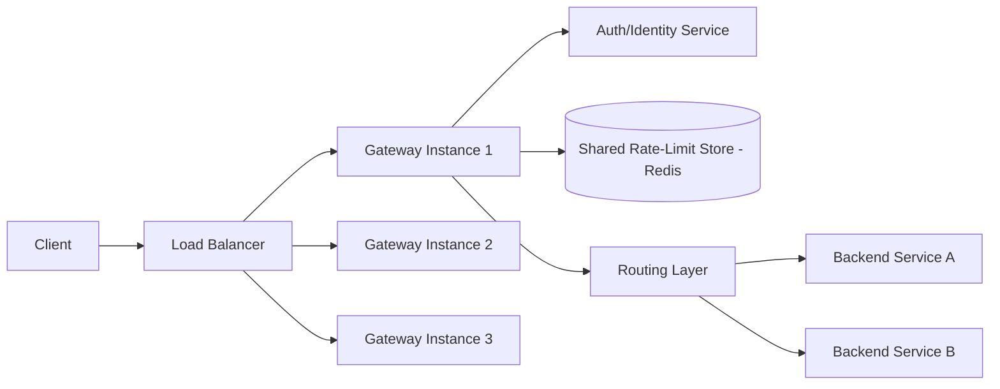
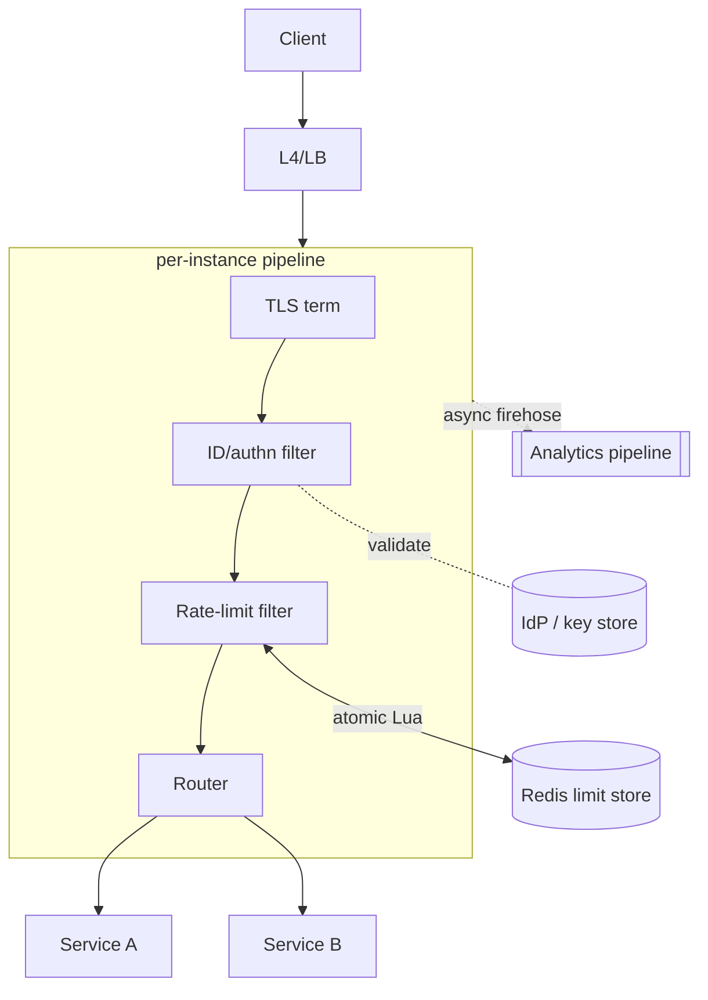
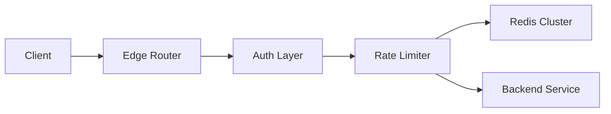
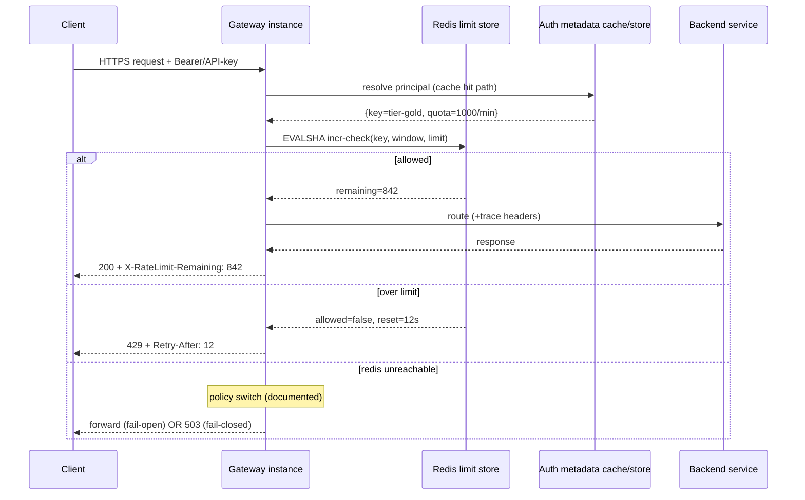
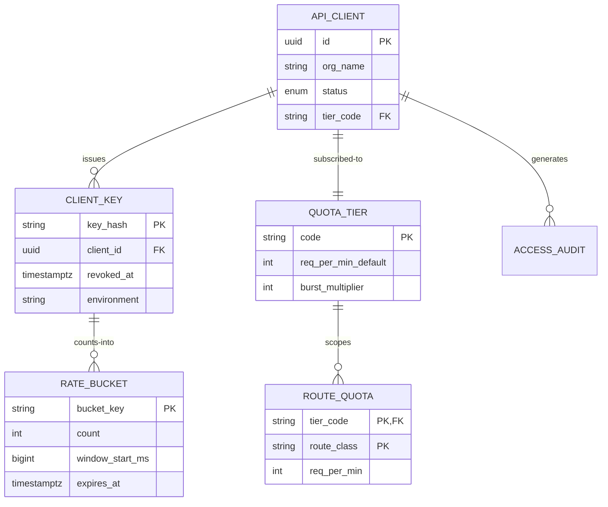

# Design a Distributed Rate-Limited API Gateway

## Blogs and websites

## Medium

## Youtube

## Theory

### What Is It?

A distributed rate-limited API gateway sits at the edge of a service platform, enforcing per-client rate limits (requests/second, requests/minute) before requests reach backend services. It combines API gateway functionality (routing, authentication, TLS termination) with centralized rate limiting backed by a shared atomic store (Redis, consistent-hashing, or token buckets distributed across nodes).

### Why Does It Exist?

Without rate limiting, a misbehaving or malicious client can overwhelm backend services with traffic, causing cascading failures (the thundering herd problem). A centralized gateway enforces limits consistently across all backend instances — something per-service limits cannot do reliably when traffic is distributed. Rate limiting also enables fair resource sharing, protects paid-tier customers from abuse, and provides a first line of defense against DDoS attacks.

### What Problem Does It Solve?

* **Backend protection**: unbounded request rates from a single client can exhaust backend connections, memory, or CPU — rate limiting caps the blast radius.
* **Fairness across clients**: premium customers get prioritized access; free-tier clients get rate-limited first during contention.
* **DDoS absorption**: the gateway absorbs and sheds abusive traffic before it reaches backend services.
* **Cost control**: protects expensive backend resources (databases, ML inference) from being overwhelmed by automated clients or scrapers.
* **Consistent enforcement**: per-service limits are inconsistent across instances; a centralized gateway ensures uniform policy application.

### Important Subtopics

1. Gateway responsibilities vs backend responsibilities (where cross-cutting concerns live)
2. Client identity resolution (API keys, JWTs, mTLS, IP) and key hierarchy
3. Global rate-limit enforcement across a fleet (shared atomic store)
4. Routing layer design: path/host rules, weighted routing, retries
5. Authentication/authorization at the edge with caching of decisions
6. Rate-limit headers & client contract (X-RateLimit-*, Retry-After)
7. Fail-open vs fail-closed degradation policies
8. Hot-path budget: what may block, what must be async
9. Multi-tier limits (per-key, per-route, per-org, global)
10. Request/response transformation & protocol bridging
11. Observability at the edge (access logs, traces, WAF metrics)
12. Security concerns: DDoS absorption, TLS termination, header sanitization

*(The existing subsections below cover problem statement, requirements, architecture, key design points, and trade-offs.)*

### Problem Statement

Design an API gateway that sits in front of many backend microservices and enforces per-client rate limits (in addition to routing, auth, and other cross-cutting concerns), consistently across a fleet of gateway instances, without becoming a bottleneck itself.

### Functional Requirements

- Route incoming requests to the correct backend service based on path/host
- Authenticate/authorize requests and identify the calling client (API key, JWT, IP)
- Enforce per-client (and optionally per-route) rate limits consistently across all gateway instances
- Return standard rate-limit headers (limit, remaining, retry-after) and a 429 response when exceeded

### Non-Functional Requirements

- **Scale**: Tens of thousands of requests/sec across many gateway instances behind a load balancer
- **Latency**: Gateway overhead (routing + auth + rate-limit check) should add only a few milliseconds
- **Consistency**: The enforced limit must be global across all gateway instances, not per-instance
- **Availability**: The gateway must not become a single point of failure; rate-limit-store outages should degrade gracefully

### High-Level Architecture



### Key Design Points

- Implement rate limiting as a gateway-level filter/plugin that runs before routing, checking a shared store (Redis with an atomic Lua script, as in the standalone distributed rate limiter design) keyed by client identity, so the limit is enforced identically no matter which gateway instance handles a given request.
- Resolve client identity (API key/JWT subject) once, early in the pipeline, and reuse it for both authorization and the rate-limit key, avoiding duplicate lookups.
- Cache authentication/authorization decisions and rate-limit-tier lookups (e.g., "this API key is on the paid tier with 1000 req/min") locally with a short TTL to avoid a network round-trip on every single request for mostly-static client metadata.
- Keep the rate-limit check on the hot path minimal (a single atomic increment-and-check call) and push logging/analytics about rejected requests to an asynchronous pipeline.

### Trade-offs

- Enforcing limits via a shared external store (rather than per-instance in-memory counters) is necessary for a globally correct limit across a horizontally scaled gateway fleet, at the cost of an extra network hop per request; caching non-volatile client metadata locally offsets most of that cost.
- Failing open (allowing traffic) versus failing closed (rejecting traffic) when the rate-limit store is unreachable is a business decision: failing open protects availability but risks temporary over-limit traffic reaching backends; failing closed protects backends but can cause a full outage from a single dependency failure.

---

## Characteristics

- **Policy enforcement point**: the gateway is where security, quota, and routing policy concentrate — its correctness shapes the security posture of everything behind it.
- **Latency-budgeted hot path**: every added feature (auth, limits, transformation) spends from a fixed few-millisecond budget; design discipline means knowing each stage's cost and pushing anything optional off-path.
- **Fleet-consistent stateful decisions on stateless instances**: gateways themselves hold no counters — global correctness comes from the shared atomic store, keeping instances freely replaceable.
- **Graceful degradation by explicit choice**: fail-open/fail-closed per concern (limits vs auth) documented as policy, not discovered during incidents.
- **Protocol polyglot edge**: terminates TLS/HTTP2/gRPC/WebSocket, bridges to internal protocols; translation bugs surface here first.
- **Multi-tenant by nature**: per-key/per-org quotas, header contracts, and isolation policies make it a product surface for API consumers, not just infrastructure.

---

## Components

- **Listener/TLS termination tier**
  *Purpose*: accept connections, terminate TLS (or pass-through for mTLS), HTTP/1.1→2→3 handling. *Responsibilities*: cert rotation (ACME/KMS), ALPN negotiation, connection limits. *Example*: Envoy listeners, NGINX, cloud LB fronting.

- **Identity & authn filter**
  *Purpose*: establish *who* is calling. *Responsibilities*: parse API key/JWT/mTLS SAN, validate against IdP JWKS or key store, attach verified principal to request context. *Relationship*: feeds both authorization and rate-limit key derivation. *Caching*: validated-key metadata cached locally with short TTL.

- **Rate-limit filter**
  *Purpose*: enforce global quotas. *Responsibilities*: single atomic increment-and-check (Lua) against shared Redis keyed `(clientTier, routeClass, window)`; stamp standard headers; reject with 429 + Retry-After. *See* dedicated rate-limiter topic for algorithm internals.

- **Routing layer**
  *Purpose*: map request → upstream cluster. *Responsibilities*: host/path matching, weighted/canary splits, timeout/retry budgets per route, circuit breaking, header manipulation. *Example*: Envoy route configs; Spring Cloud Gateway route predicates.

- **Backend pools / upstream management**
  *Responsibilities*: health checking (active probes + passive outlier ejection), load balancing policies (RR, least-request), zone-aware routing.

- **Async analytics/WAF pipeline**
  *Purpose*: keep heavy work off hot path. *Responsibilities*: access-log streaming, rejected-request analytics, anomaly detection feeding WAF rules. *Relationship*: consumes firehose emitted non-blockingly by filters.



---

## Patterns

- **Filter-chain gateway pattern**
  *What*: ordered composable filters (auth → limit → transform → route) with short-circuit semantics. *Solves*: cross-cutting concerns without touching services. *When*: any microservice estate. *Spring Cloud Gateway embodies this directly.*

- **Atomic check-and-consume via Lua** (from standalone limiter)
  One round-trip performs increment + boundary decision + TTL refresh — no read-modify-write races across gateway instances. Cluster-wide correctness in ~1 ms.

- **Local metadata cache with pub/sub invalidation**
  *Problem*: per-request key-store lookups dominate latency. *How*: cache key→tier/quota mappings in-process; invalidate via Redis pub/sub on revocation; TTL backstop catches missed events. *Trade-off*: brief window where revoked keys still pass — bounded and alarmed.

- **Retry budgets & hedging at the edge**
  Retries against backends capped per-route (e.g., ≤10% retry ratio) preventing retry amplification storms; hedged requests only for idempotent GETs with tail-latency SLOs.

- **Cell-based shedding ladder**
  Under extreme load: shed lowest tier first (429 with honest headers), then disable expensive features (response transformation, verbose logging), then regional admission control. Predefined, rehearsed, metric-triggered.

- **Anti-pattern**: business logic in the gateway. It becomes an unversioned monolith nobody can deploy; gateways should translate and protect, never decide domain outcomes.

---

## Benefits

- **One enforcement point for security/quota policy** — consistent behavior fleet-wide instead of N service-specific implementations drifting apart.
- **Backend protection from abusive/bursty clients**, converting potential cascading failures into clean 429s.
- **Client experience contract**: standardized headers and errors let integrators build sane retry logic — reduces support load measurably.
- **Independent evolution of edge concerns**: rotate JWT libraries, tune limits, add WAF rules without redeploying every backend.
- **Observability chokepoint**: single place where all traffic crosses = complete API usage picture for product and security teams.

---

## Pros

- Stateless gateway instances scale trivially behind LBs.
- Sub-millisecond marginal latency when filters are disciplined.
- Rich ecosystem options (Envoy, Kong, Spring Cloud Gateway, cloud-managed) avoid bespoke builds.
- Policy-as-code (route/filter configs versioned, reviewed, canaried like software).

## Cons

- Shared limit store adds a dependency whose failure mode must be pre-decided (open vs closed).
- Gateway config complexity grows into its own maintainability problem without governance.
- Hot-path additions creep (every team wants "just one more check") — requires budget policing.
- TLS termination concentrates attack surface; cert/key handling demands rigor.
- Multi-region consistency of limits adds replication-lag subtleties (regional buckets vs global).

---

## Challenges

- **Technical**: atomicity across fleet (solved by Lua but Redis cluster resharding moves slots mid-window); identity spoofing via header trust (must strip inbound X-Forwarded-*); WebSocket/streaming limits (bytes not requests).
- **Scalability**: Redis hot-shard from celebrity clients (split counters); connection storms during client reconnect avalanches; TLS handshake CPU under DDoS.
- **Performance**: p99 budget erosion from chatty filters; serialization overhead of transformations.
- **Reliability**: Redis brownout decision execution (pre-agreed, automated, tested); backend health-check flapping causing route churn; config rollout errors blackholing routes (staged + rollback tooling).
- **Maintainability**: route-config sprawl across teams; deprecating legacy auth schemes safely.
- **Operational**: capacity planning for peak seasons; cert expiry monitoring (the classic outage); runbooks for store-failure mode switches.
- **Security**: OWASP-API concerns (BOLA protection needs object-level authz *behind* gateway — gateway can't do it alone); secret leakage in logs; mTLS chain validation depth.

---

## Best Practices

- **Decide and document fail-open vs fail-closed per concern before production**; automate the switch with health checks rather than hoping humans are fast during incidents.
- **Keep the hot path to: verify identity (cached) → one atomic limit check → route. Everything else async or off-box.**
- **Strip/sanitize hop-by-hop and forwarded headers at ingress** — trusting client-supplied X-Forwarded-For is the classic IP-spoof hole.
- **Return honest rate-limit headers always** (`Limit`, `Remaining`, `Reset`) — clients that can predict throttling distribute load themselves.
- **Version route configs and canary them** like code; a bad wildcard route is a full-outage bug class.
- **Set conservative timeouts + retry budgets per route**; default-deny retries on non-idempotent methods.
- **Emit structured access logs with trace IDs** to the async pipeline; sample aggressively, alert on anomalies.
- **Load-test the whole chain including Redis** at peak×1.5; gateway bottlenecks hide until the worst day.
- **Isolate admin/control APIs** from data-plane traffic paths entirely.

---

## When to Use / Not Use

**Deploy a dedicated distributed-rate-limited gateway when**: multiple consumer-facing APIs need unified auth/quota/analytics; fleets of microservices lack their own edge discipline; compliance requires centralized audit trails.

**Skip when**: single internal service — library-level limiting suffices; cloud-managed LB features cover modest needs; adding a gateway just "because microservices" creates a hop without value.

Alternatives/complements: managed API gateways (AWS API Gateway, GCP Apigee) trading flexibility for ops relief; CDN-edge controls (Cloudflare Workers) for globally distributed enforcement; service meshes (Istio) moving some policies sidecar-side — often gateway-for-north-south + mesh-for-east-west together.

Decision inputs: traffic geography, multi-tenancy shape, latency sensitivity, existing platform investments, team ownership boundaries.

---

## Use Cases

- **Public developer API platform (Stripe/Twilio-class)**
  *Problem*: thousands of third-party integrators, tiered quotas, contractual latency SLOs. *Solution*: gateway enforces per-key tiered limits with precise headers; sandbox keys get separate stricter buckets; 429 responses include education links. *Trade-off*: strictness at edge shifts burst absorption onto clients — docs and SDKs teach token-bucket pacing.

- **Mobile-backend protection**
  *Problem*: hostile client ecosystem (modified APKs) hammering login/search endpoints. *Solution*: multi-dimensional limits (per-device-ID, per-IP, per-account) evaluated in gateway filters; CAPTCHA escalation headers returned for step-up flows. *Trade-off*: false positives on NATed corporate users — tuned via allowlists and graduated responses.

- **Internal platform consolidation**
  *Problem*: 40 teams each built ad-hoc auth/rate-limit logic, inconsistent and unauditable. *Solution*: central gateway with org-standard JWT validation + default quotas; teams opt out explicitly (audited) rather than opt in. *Trade-off*: platform team owns critical path infra — funded via clear SLA and paved-road tooling.

## Architecture

A rate-limited API gateway follows a **layered edge-proxy** architecture. Incoming requests hit an edge router (Envoy/NGINX/managed L7 LB), which terminates TLS and forwards to an **auth layer** (JWT/OAuth validation), then to the **rate-limiter**, then to the matched **backend service** (via service discovery). The rate-limiter is a **distributed counter** — a single node cannot be the bottleneck, so state is sharded across a Redis cluster using consistent hashing, with local caches for burst tolerance.



| Component | Purpose | Responsibilities | Real-world Example |
|---|---|---|---|
| Edge Router | Terminate TLS, route | Parse request, match route, terminate TLS | Envoy, NGINX, AWS ALB |
| Auth Layer | Authenticate client | Validate JWT/OAuth, extract client identity | Keycloak, Auth0, Cognito |
| Rate Limiter | Enforce quotas | Token bucket / counters, reject over-limit | Redis-based limiters |
| Token Store | Shared state | Atomic counter increments across nodes | Redis cluster |
| Service Discovery | Resolve backends | Map route to backend service(s) | Consul, Eureka, K8s DNS |
| Circuit Breaker | Degradation | Shed load when backends unhealthy | Istio, resilience4j |

**Communication**: Edge → Auth (local/remote) → Rate Limiter (Redis round-trip ~0.1–0.5 ms) → Backend. For low-latency, local token buckets with periodic sync to Redis.

**Scaling**: Add edge-router pods; shard Redis by key (consistent hash ring); use local caches to reduce Redis round-trips.

**Failure handling**: If Redis is down, fall back to local-only limiting (fail-open) or reject with 503 (fail-closed). Circuit breaker on backend calls.

## Design

### Design Considerations

* **Rate limiting algorithm**: token bucket (smooths bursts) vs. fixed window (simple, boundary issues) vs. rolling log (accurate, memory-heavy). Token bucket is preferred for most gateway use cases.
* **Key hierarchy**: limits per-API-key, per-user, per-IP, per-route, or combinations. Composite key (`client_id:route:ip`).
* **Local vs. remote**: local counting is fast but inconsistent; centralized (Redis) is consistent but adds latency. Hybrid: local token buckets with periodic sync.
* **Degradation mode**: fail-open (allow all, risk overload) vs. fail-closed (reject all, risk availability). Banking → fail-closed; public APIs → fail-open.

### Key Decisions

| Decision | Options | Trade-off | Recommendation |
|---|---|---|---|
| Algorithm | Token bucket | Smooth bursts, simple | Default choice |
| | Sliding window log | Accurate, memory heavy | Low-volume, high-precision |
| | Fixed window | Simple, bursty at edge | Avoid |
| Counter store | Redis (single) | Simple, SPOF | < 100K req/s |
| | Redis cluster + consistent hash | Scalable, eventual consistency | Production |
| | In-memory per node | Fastest, inconsistent | With sync fallback |
| Degradation | Fail-open | No downtime, DDoS risk | Non-critical APIs |
| | Fail-closed | Protection, 503s | Critical APIs |

### Scalability Considerations

* Redis cluster with consistent hashing distributes keys; each shard handles ~100K-200K INCR ops/sec.
* Local token buckets per gateway node with async sync reduce Redis load by 10–100x.
* Hierarchical limits: global (Redis) + per-node (local).

### Reliability Considerations

* Set quorum for distributed counter updates to avoid split-brain double-counting.
* Circuit breaker on Redis calls prevents gateway failure when Redis is slow/down.
* Graceful degradation: local-only mode with relaxed limits when Redis is unreachable.

### Performance Considerations

* Token bucket check is O(1) (single INCR + EXPIRE in Redis); sliding log is O(log N).
* Pipeline Redis operations into one round-trip.
* Local cache with TTL reduces 90%+ of Redis calls for stable clients.

### Security Considerations

* Rate limit keys must not be spoofable (use JWT-derived client identity, not client-supplied).
* Prevent key enumeration attacks on Redis cluster (use HMAC of client_id).
* Rate-limiting itself can be a DoS vector — apply key-space limits per gateway node.

### Maintainability Considerations

* Centralized config store (etcd/Consul) for quota definitions; hot-reload without restart.
* Audit logs of all limit changes for compliance.
* Canary rollout of new limits on subset of routes.

## High-Level Design

Request lifecycle with degradation branches:



Scaling: gateway pods HPA on RPS/CPU; Redis cluster sized by ops/sec (~1 op per request) with hot-key splitting for celebrity tenants; multi-region = regional Redis + region-scoped buckets (global exactness sacrificed deliberately — document why).

Failure handling: backend pool unhealthy → outlier ejection routes away; gateway fleet loss → LB health checks shift regions; analytics pipeline down → buffers fill then drop logs (never block requests).

---

## Deep Dive

- **Lua atomicity details**: script does `INCR` then `EXPIRE`-if-new then compares against limit, returning remaining/reset atomically — no interleaving possible because Redis executes scripts serially; cluster deployments hash-tag the key `{key123}:rl` so script stays single-slot legal.
- **Latency accounting**: measure per-filter (auth-cache-hit ~0.05 ms, Redis eval ~0.7 ms p99, routing decision ~0.1 ms) and publish budgets; regressions caught by CI perf gates prevent death-by-a-thousand-features.
- **Header contract precision**: `RateLimit-Limit/Remaining/Reset` (IETF draft standardized) plus legacy `X-RateLimit-*` dual-emitted during migration windows; `Retry-After` seconds-based; clock alignment between gateway and store matters for reset honesty (use store-returned values, never local guesses).
- **Degradation automation**: health-probe wrapper around Redis flips a circuit; gateway reads mode (OPEN/CLOSED) from local config watcher; switching logged + alerted; quarterly game-days flip it deliberately verifying both directions behave.
- **Observability**: RED metrics per route (rate/errors/duration), limit-rejection ratios by tenant (abuse detection + fairness audits), auth-failure spikes (credential-stuffing alarms), upstream saturation signals feeding autoscalers, distributed traces sampled at edge with head-based decisions propagating downstream.

## API Contract

The rate-limited API gateway exposes both proxied backend endpoints and administrative endpoints for quota management.

### Proxied Client Endpoints

| Method | Endpoint | Purpose | Rate Limit |
|---|---|---|---|
| GET | `/api/v1/{route}` | Proxy GET to backend | 1000 req/min per client |
| POST | `/api/v1/{route}` | Proxy POST to backend | 100 req/min per client |
| PUT | `/api/v1/{route}` | Proxy PUT to backend | 100 req/min per client |
| DELETE | `/api/v1/{route}` | Proxy DELETE to backend | 30 req/min per client |

**Headers**:
```
Authorization: Bearer <JWT>
X-API-Key: <key>
X-Forwarded-For: <client_ip>
User-Agent: <client>
```

**Response** (success): HTTP 200 with backend response body.

**Response** (rate limited):
```json
HTTP/1.1 429 Too Many Requests
Retry-After: 55
Content-Type: application/json
{
  "error": "rate_limit_exceeded",
  "message": "Rate limit exceeded for client abc123 on route /api/v1/search",
  "limit": 1000,
  "window": "1m",
  "retry_after_seconds": 55
}
```

### Administrative Endpoints

| Method | Endpoint | Purpose | Auth |
|---|---|---|---|
| POST | `/admin/api-keys` | Create new API key | Admin JWT (POST /api-keys) |
| GET | `/admin/api-keys/{key}/quotas` | Get quota for a key | Admin JWT |
| PATCH | `/admin/api-keys/{key}/quotas` | Update quota | Admin JWT |
| POST | `/admin/bulk-quota` | Update quotas for many keys | Admin JWT |
| GET | `/metrics` | Prometheus metrics (RED, limit ratios) | IP allowlist |
| GET | `/health` | Health check (Redis up, backends reachable) | None |
| GET | `/ready` | Readiness probe | Kubernetes |

### Request Structure (proxied)

```
GET /api/v1/users?page=1&limit=20 HTTP/1.1
Host: api.example.com
Authorization: Bearer <jwt>
X-API-Key: <key>
Accept: application/json
```

### Rate Limiting Response Headers

```
X-RateLimit-Limit: 1000
X-RateLimit-Remaining: 999
X-RateLimit-Reset: 1623456789  (epoch seconds)
Retry-After: 55  (seconds, on 429)
```

### Status Codes

| Code | Meaning |
|---|---|
| 200 | Request proxied successfully |
| 401 | No/invalid authorization token |
| 403 | Valid token but insufficient scope |
| 429 | Rate limit exceeded |
| 502 | Backend unavailable |
| 503 | Gateway degraded / Redis down |
| 504 | Backend timeout |

### Authentication & Authorization

* Client identity resolved from JWT sub + API key + IP. The resolved identity is part of the rate-limit key (hashed).
* Admin endpoints require `scope: admin` in the JWT.

### Versioning

* API versioning via URL prefix (`/api/v1/`, `/api/v2/`).
* Quota definitions stored in config store with versioning; hot-reloaded without gateway restart.

---

## Data Modeling

Gateway metadata lives mostly in config, but supporting stores matter:



Choices: keys stored hashed (lookup by HMAC of presented key — breach-safe); quota tiers normalized so marketing changes prices without config deploys; rate buckets ephemeral (TTL ≈ 2× window) living only in Redis, never relational storage; access audit partitioned daily, shipped to warehouse for abuse analytics. Consistency note: tier changes propagate through the pub/sub-invalidated caches within seconds — acceptable window documented.

---

## Java and Spring Boot Implementation

Spring Cloud Gateway filter performing global rate limiting:

```java
@Component
public class GlobalRateLimitFilter implements GlobalFilter, Ordered {

    private final ReactiveStringRedisTemplate redis;
    private final ClientMetadataCache metadataCache;

    private static final DefaultRedisScript<Long> INCR_CHECK = new DefaultRedisScript<>("""
            local current = redis.call('incr', KEYS[1])
            if current == 1 then
                redis.call('pexpire', KEYS[1], ARGV[2])
            end
            local limit = tonumber(ARGV[1])
            if current > limit then
                return -current
            end
            return limit - current
            """, Long.class);

    public GlobalRateLimitFilter(ReactiveStringRedisTemplate redis,
                                 ClientMetadataCache metadataCache) {
        this.redis = redis;
        this.metadataCache = metadataCache;
    }

    @Override
    public Mono<Void> filter(ServerWebExchange exchange, GatewayFilterChain chain) {
        String apiKey = exchange.getRequest().getHeaders().getFirst("X-Api-Key");
        if (apiKey == null) {
            return reject(exchange, HttpStatus.UNAUTHORIZED);
        }
        ClientMetadata meta = metadataCache.get(apiKey);   // locally cached, pub/sub invalidated
        if (meta == null) return reject(exchange, HttpStatus.FORBIDDEN);

        String bucketKey = "rl:{%s}:%d".formatted(meta.keyHash(),
                System.currentTimeMillis() / 60_000);

        return redis.execute(INCR_CHECK,
                        List.of(bucketKey),
                        List.of(String.valueOf(meta.reqPerMin()), "60000"))
                .next()
                .flatMap(remaining -> {
                    if (remaining < 0) {
                        exchange.getResponse().getHeaders()
                                .add("Retry-After", "5");
                        return reject(exchange, HttpStatus.TOO_MANY_REQUESTS);
                    }
                    exchange.getResponse().getHeaders()
                            .add("X-RateLimit-Remaining", String.valueOf(remaining));
                    return chain.filter(exchange);
                });
    }

    private Mono<Void> reject(ServerWebExchange ex, HttpStatus status) {
        ex.getResponse().setStatusCode(status);
        return ex.getResponse().setComplete();
    }

    @Override
    public int getOrder() { return -10; }   // run before routing
}
```

Metadata cache with invalidation:

```java
@Service
public class ClientMetadataCache {

    private final LoadingCache<String, Optional<ClientMetadata>> cache;

    public ClientMetadataCache(ClientStore store,
                               @Value("${gateway.auth.cache-ttl-seconds:60}") long ttlSeconds) {
        this.cache = Caffeine.newBuilder()
                .expireAfterWrite(Duration.ofSeconds(ttlSeconds))
                .maximumSize(100_000)
                .build(key -> Optional.ofNullable(store.findActive(key)));
        // revocation listener shortens the staleness window
        // (Redis pub/sub "keys.revoked" -> cache.invalidate(key))
    }

    public ClientMetadata get(String apiKey) {
        return cache.getUnchecked(hash(apiKey)).orElse(null);
    }
}
```

Notes: fully reactive filter keeps thread-per-core model intact under load; hash-tags make the Lua call cluster-legal; the negative-result sentinel (-count) lets one script answer allow/deny and remaining in a single round trip. Testing: Testcontainers Redis + WebTestClient asserting 429 sequencing, header correctness, and degraded-mode behavior when Redis container pauses.

---

## Real-World Examples

- **Kong / Envoy Gateway** — open-source embodiments: Envoy's ratelimit service uses exactly the shared-Redis atomic model; its filter architecture matches the patterns above.
- **Stripe** — famously thorough rate-limit documentation (per-key, per-live-mode, bursts disclosed up-front); their API-expansion philosophy shows the client-contract benefits of disciplined headers.
- **GitHub API** — long-running real-world evolution: primary + secondary rate limits (search/GraphQL separately), honest 429s with reset times — studying their docs teaches contract design.
- **Cloudflare** — edge-scale rate limiting demonstrating geographic distribution trade-offs (regional buckets vs global) at magnitudes beyond typical gateways.

---

## Interview Preparation

### Interview Questions

**Beginner**

1. **Why put rate limiting in the gateway instead of each service?**
   Single enforcement point gives consistent global quotas, uniform client contracts, and one place to evolve policy — per-service limits fragment behavior, multiply implementations, and miss cross-service budgets entirely.
2. **What do RateLimit headers do for clients?**
   They let well-behaved integrators self-pace (see remaining/reset before hitting walls), turning hard failures into smooth backoff — reducing support tickets and thundering-retry pathologies simultaneously.

**Intermediate**

3. **Design the failure mode when Redis goes down mid-traffic.**
   Pre-decided policy executes automatically: circuit detects store loss → configured mode applies (fail-open for UX-critical public APIs with backend-side secondary limits; fail-closed for expensive/protected operations). Emphasize: the decision was made calmly in advance, tested in game days — not improvised during an incident.
4. **How do you handle a client exceeding limits across many gateway instances simultaneously?**
   The shared atomic store makes instance count irrelevant — every increment lands in the same bucket regardless of which pod serves it. Walk the Lua script; discuss cluster hash-tags; note per-instance local caches would break exactly this guarantee (why they're used only for metadata, never counts).
5. **WebSocket/streaming endpoints complicate request-count limits — how do you handle them?**
   Meter connections (concurrent cap per key) plus byte/frame throughput over time rather than request counts; long-lived connections get periodic re-validation; disconnection hygiene enforced server-side. Shows awareness beyond plain REST.

**Advanced**

6. **Design multi-regional limits: global contract, regional enforcement.**
   Options ladder: (a) regional independent buckets sized quota/N — simple, slightly unfair to travelers; (b) home-region authority with cross-region sync — accurate but adds WAN latency to hot path; (c) CRDT-style counters converging asynchronously. Most platforms pick (a) with documented caveats; senior candidates articulate why perfect global exactness costs more than users value.
7. **Your 429s spiked 40× but traffic didn't grow. What do you investigate?**
   Key-derivation regression (all anonymous traffic collapsing into one bucket), clock/window misalignment after deploy, a new scraper behind rotating IPs sharing NAT ranges, or upstream metadata cache poisoning assigning wrong tiers. Teaches hypothesis-driven debugging with observability hooks named.

**Senior / system design**

8. **Architect a complete edge platform: gateway + WAF + bot defense + multi-tenant billing-grade metering.**
   Layer defenses (edge L3/L4 DDoS absorb → gateway L7 limits → per-route fine quotas), metering decoupled via event firehose into billing pipeline (exactly-once aggregation), tenant isolation via separate Redis namespaces with quota ceilings, progressive challenge ladders for suspicious traffic. Discuss cost attribution and the organizational contract (platform team SLAs).
9. **When would you move rate limiting out of the gateway to service mesh/sidecars?**
   East-west (internal service-to-service) protection scales better sidecar-side; north-south stays gateway. Also ultra-low-latency internal calls where extra hop hurts — local token-bucket in sidecar with periodic sync approximates globally. Shows topology-aware judgment.

### Common Mistakes

- Trusting client-supplied forwarding headers for identity/IP (spoofing 101).
- Local-only counters behind a load balancer — limits silently become N× looser than intended.
- Blocking hot path on analytics writes or cold cache misses.
- Opaque 429s without Retry-After — guarantees immediate hammering.
- No pre-decided store-failure policy → incident-room improvisation choosing wrong.

### Expected discussion points

Global-vs-local enforcement economics, latency budget discipline, degradation-policy maturity, header-contract thinking, and honest treatment of multi-region exactness trade-offs.

