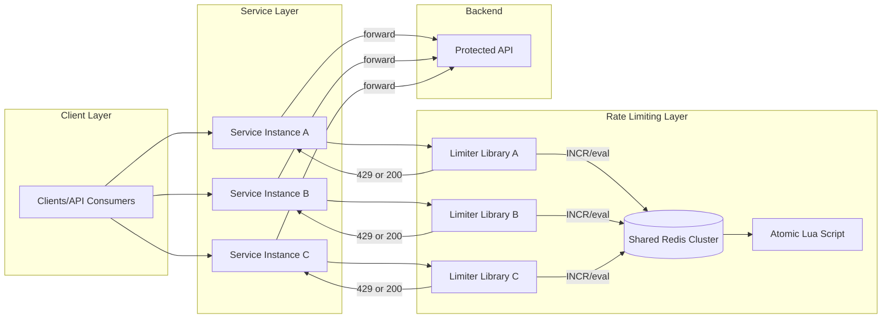
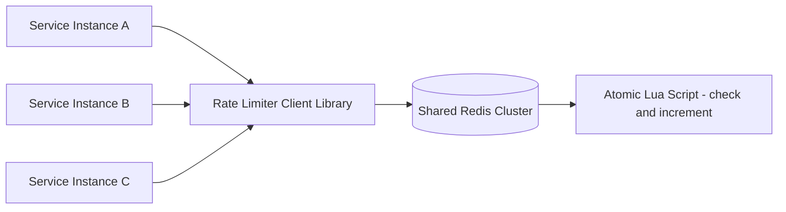
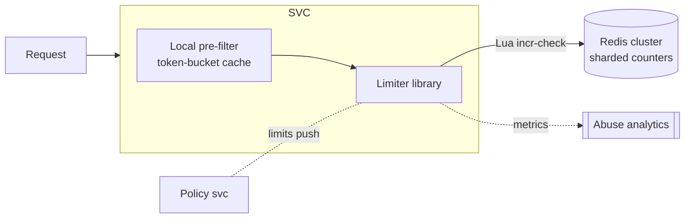
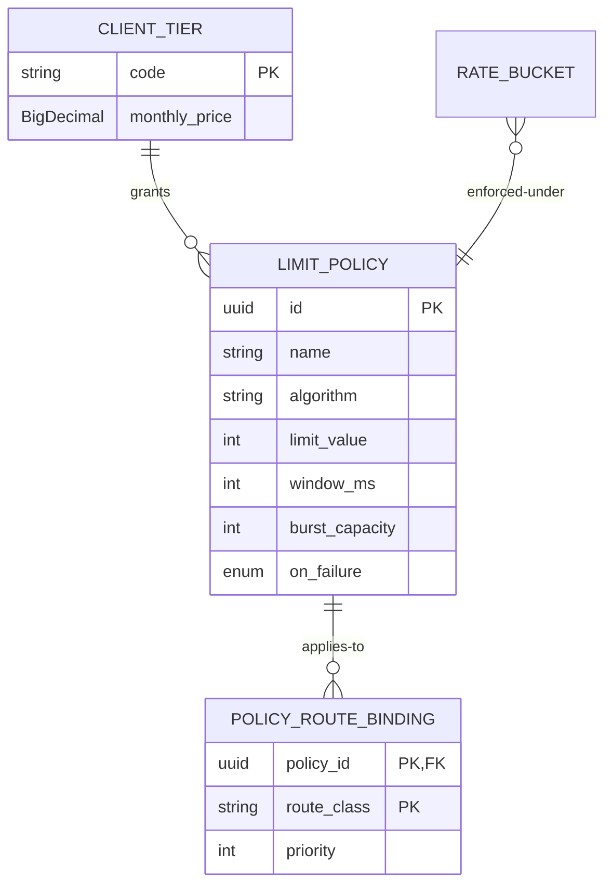
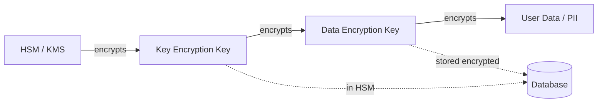
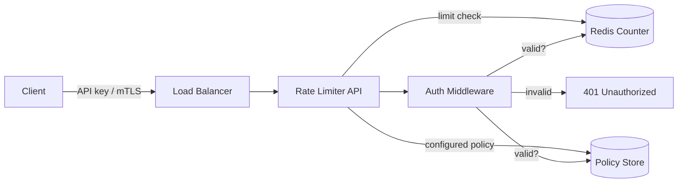
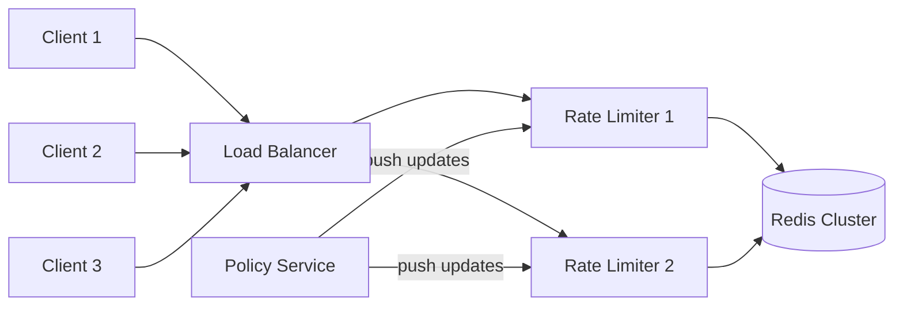
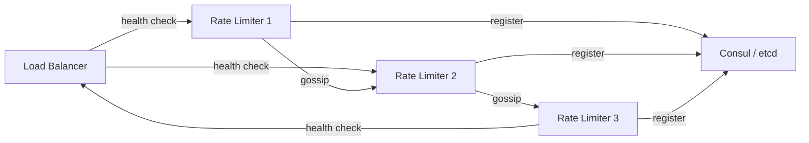
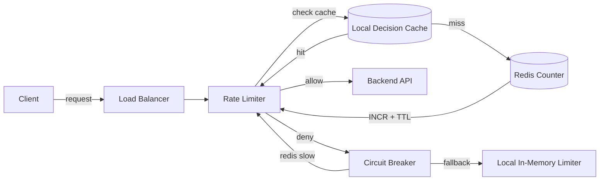
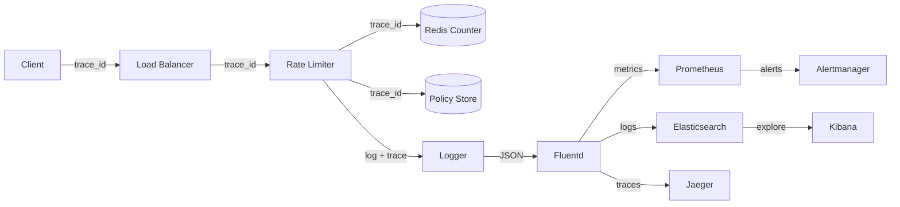

# Design a Distributed Rate Limiter Used Across Microservices

## Blogs and websites

## Medium

## Youtube

---

## Theory

### Topics Covered

1. [Introduction and Problem Statement](#introduction-and-problem-statement)
2. [Functional Requirements](#functional-requirements)
3. [Non-Functional Requirements](#non-functional-requirements)
4. [Capacity Estimation](#capacity-estimation)
5. [High-Level Architecture](#high-level-architecture)
6. [Key Design Points](#key-design-points)
7. [Trade-offs](#trade-offs)
8. [Algorithm Comparison in Depth](#algorithm-comparison-in-depth)
9. [Key Derivation Hierarchy](#key-derivation-hierarchy)
10. [Hot-Client Sharding (Split Counters)](#hot-client-sharding-split-counters)
11. [Cost-Based Limits](#cost-based-limits)
12. [Characteristics](#characteristics)
13. [Components](#components)
14. [Architectural Patterns](#architectural-patterns)
15. [Benefits](#benefits)
16. [Pros](#pros)
17. [Cons](#cons)
18. [Challenges](#challenges)
19. [Best Practices](#best-practices)
20. [When to Use](#when-to-use)
21. [Use Cases](#use-cases)
22. [API Design and Contract](#api-design-and-contract)
23. [Data Model and API](#data-model-and-api)
24. [High-Level Design](#high-level-design)
25. [Deep Dive](#deep-dive)
26. [Encryption and Key Management](#encryption-and-key-management)
27. [Authentication and Authorization](#authentication-and-authorization)
28. [Replication Strategies](#replication-strategies)
29. [Failure Detection and Membership](#failure-detection-and-membership)
30. [High Availability and Scalability](#high-availability-and-scalability)
31. [Performance and Optimization](#performance-and-optimization)
32. [CAP Theorem and Consistency Trade-offs](#cap-theorem-and-consistency-trade-offs)
33. [Security Threats and Mitigations](#security-threats-and-mitigations)
34. [Observability and Logging](#observability-and-logging)
35. [Real-World Implementations](#real-world-implementations)
36. [Java and Spring Boot Implementation Guide](#java-and-spring-boot-implementation-guide)
37. [Interview Questions and Answers](#interview-questions-and-answers)

---

### Introduction and Problem Statement

A distributed rate limiter enforces request quotas consistently across many stateless service instances so that the aggregate limit is respected regardless of which instance handles a given request. Unlike local in-process limiters that only protect a single instance, a distributed limiter provides global fairness — preventing any single client from overwhelming the backend by spreading requests across many service instances.



*Diagram: Distributed rate limiter architecture. Each service instance embeds a lightweight limiter library that checks a shared Redis cluster for quota. The check-and-increment is executed atomically via a Lua script. If the quota is exceeded, the library returns a 429 to the caller. Otherwise, the request proceeds to the backend API.*

**Problem Statement:** Design a rate limiter that enforces limits (per API key/user/service) consistently across many stateless microservice instances, so the aggregate limit is respected regardless of which instance handles a request.

**Why this matters:** Without distributed rate limiting, a high-traffic client can distribute requests evenly across N instances and never trigger any per-instance limit — effectively multiplying the intended quota by N. This opens the door to abuse, DDoS, and unfair resource consumption. Distributed rate limiting is the control plane that ensures global correctness.

---

### Functional Requirements

- Enforce a limit (e.g., N requests per window) per client key, shared across all service instances.
- Support multiple algorithms (fixed window, sliding window, sliding window counter, token bucket, leaky bucket).
- Return remaining quota / retry-after to callers via standard headers (`X-RateLimit-Limit`, `X-RateLimit-Remaining`).
- Support per-route or per-tier (free/paid) limit overrides — the most constrained applicable limit wins.
- Support cost-based limiting (metering units/tokens/bytes, not just request count).
- Provide emergency override levers to raise or remove limits during incidents.
- Emit metrics and structured logs for observability and abuse detection.

---

### Non-Functional Requirements

| Requirement | Target |
|---|---|
| **Scale** | Tens of thousands of requests/sec across hundreds of service instances. |
| **Latency** | Rate-limit check must add < 5 ms p99 to the request path. |
| **Consistency** | Limit must hold globally even though checks happen from many instances concurrently. |
| **Availability** | Must fail open or gracefully degrade if the shared store is unavailable. |
| **Accuracy** | Over-admission bounded to documented limits (e.g., ≤K-1 for split counters). |
| **Durability** | Limiter state is ephemeral — no long-term persistence required. |
| **Operability** | Full observability: per-dimension rejection rates, script execution latencies, breaker state transitions. |

---

### Capacity Estimation

For a system handling 100K requests/second across 100 service instances:

**QPS distribution:**
- Total: 100K req/sec
- Per instance: ~1K req/sec
- With local pre-filter tier absorbing 90% of decisions: only ~10K req/sec reaches Redis
- With hot-key sharding (split K=10): no single Redis key exceeds ~1K ops/sec

**Redis sizing:**
- Each rate-limit check = 1 Lua script execution (EVALSHA)
- Each execution ~0.1–0.5 ms
- 10K ops/sec × 0.5 ms = 5K CPU-ms/sec = 5% of one core
- Redis Cluster with 6 primary nodes: each handles ~1.7K ops/sec comfortably
- Memory: each counter key ~100 bytes; 1M active keys = ~100 MB RAM

**Connection pooling:**
- 100 service instances × 10 connections each = 1000 total connections
- Redis handles 10K+ connections easily; connection reuse critical for latency

**Growth projection:**
- 10× growth → 1M req/sec, 1M active keys, 100K ops/sec to Redis
- Need: 10 Redis primary nodes (each handling 10K ops/sec)
- Network: 100K × 4 KB = ~40 MB/sec per region — trivial

---

### High-Level Architecture



*Diagram: Every service instance embeds a rate-limiter client library that talks to a shared Redis cluster. The check-and-increment logic runs as a single atomic Lua script on Redis, ensuring that concurrent requests from different instances cannot race and multiply the limit.*

**Design rationale:** The shared store (Redis) is the source of truth for quota counts. The Lua script ensures atomicity — check and increment happen in one operation, with no race windows. The client library handles connection pooling, circuit breaking, and local pre-filtering. The policy configuration service pushes limit updates to all instances.

---

### Key Design Points

- Use a shared, low-latency store (Redis) reachable by every service instance, with the check-and-increment logic executed as a single atomic Lua script to avoid race conditions between concurrent requests hitting different instances.
- Sliding-window-log or sliding-window-counter algorithms give smoother enforcement than fixed windows, which allow bursts at window boundaries; token bucket is preferred when short bursts should be tolerated.
- Shard the Redis keyspace by client key (consistent hashing across a Redis cluster) so no single node becomes a hotspot for a high-traffic client.
- On Redis unavailability, fail open (allow requests) with a circuit breaker and alert, rather than rejecting all traffic — protects overall availability at the cost of temporarily unenforced limits.
- Return remaining quota and retry-after headers on every response (even successful ones) so clients can implement intelligent retry backoff.
- Use hash-tags (`{keyHash}`) to ensure all rate-limit keys for a single client land on the same Redis hash slot — required for multi-key atomic operations in Redis Cluster.

---

### Trade-offs

- A shared external store adds a network hop and a new dependency to every request path, but is the only way to get a globally consistent count across independently scaled instances; purely local (in-process) counters are faster but only enforce a per-instance limit, not a global one.
- Token bucket / sliding window counters trade a small amount of memory and precision for much smoother traffic shaping compared to fixed windows.
- Fail-open mode (allowing requests during store outages) trades temporary quota violation for system availability; fail-closed mode (blocking requests) is safer but risks cascading outages.
- Hash-tagging (`{keyHash}`) ensures cluster legality for multi-key operations but creates artificial hotspots — all keys for a client land on the same node.

---

### Algorithm Comparison in Depth

| Algorithm | Mechanism | Burst behavior | Memory | Weakness |
|---|---|---|---|---|
| Fixed window | `INCR key:{windowStart}`, expire at window end | Up to 2× limit at boundaries (burst at end of one + start of next) | O(1) per client | Boundary burst artifact |
| Sliding window log | Store timestamp per request; count within trailing window | Smooth, exact | O(requests) — expensive at high rates | Memory + list ops |
| Sliding window counter | Weighted blend of current + previous fixed windows: `prev × overlap% + curr` | Near-smooth, approximate | O(1) | ±small error vs true sliding |
| Token bucket | Bucket holds B tokens refilled at R/s; request consumes 1 | Tolerates burst up to B while averaging R | O(1) state (tokens, lastRefill) | Needs refill math on read |
| Leaky bucket (queue form) | Requests queue; drain at constant rate | Output perfectly smooth | Queue depth bounded | Adds latency; rarely used for admission |

**Choosing**: token bucket when clients legitimately burst (mobile apps syncing); sliding-window counter when contractual "N per minute" precision matters without log costs. Most public APIs ship token buckets with disclosed capacity+refill.

---

### Key Derivation Hierarchy

Limits apply along multiple dimensions simultaneously:

```
per API-key        : contractual quota
per user           : behind shared keys (org of 50 devs)
per IP             : anonymous/unauthenticated surface
per route-class    : /auth stricter than /catalog
global             : protect backend from aggregate abuse
```

Enforcement evaluates the *most constrained* applicable bucket — a request may pass its key bucket but fail the route bucket. Key composition must be deterministic and cheap (`keyHash:routeClass:windowId`); deriving keys from untrusted headers (X-Forwarded-For without proxy sanitization) is a classic bypass vector.

**Dimension evaluation order (most selective first):**
1. Global limit (cheapest to check, protects system-wide)
2. IP-based limit (per-source-fairness for anonymous traffic)
3. API-key limit (contractual quota for authenticated clients)
4. User limit (behind shared keys — org-level fairness)
5. Route-class limit (expensive endpoints get stricter limits)

---

### Hot-Client Sharding (Split Counters)

One celebrity key doing 500K req/min against a Redis shard ceiling (~100K ops/s):

```
Split into K sub-counters: {key}:s0 ... {key}:s(K-1)
Write path: pick sub-counter = random() % K, INCR it
Read/limit check: SUM(sub-counters) >= limit ?
  → over-admission by up to K-1 requests per check (bounded, acceptable)
Rebalance K upward as the key's rate grows
```

Trade-off documented explicitly: slight over-admission (≤K per decision) buys horizontal write scaling for pathological tenants.

---

### Cost-Based Limits

Modern APIs meter *units*, not requests: tokens consumed (LLM APIs), bytes transferred, compute-ms. The same atomic machinery applies — `INCRBY cost` instead of `INCR`, with estimated-cost reservation and true-cost reconciliation after processing (refund deltas). This generalization is where rate limiting meets billing.

**Two-phase cost accounting:**
1. **Reserve**: Before processing, reserve estimated max cost (`DECRBY budget key estimated_cost`)
2. **Reconcile**: After processing, compute actual cost and atomically adjust (`INCRBY budget key (actual - estimated)`)
3. **Refund**: If the request fails early, refund the full reservation

This ensures attackers can't under-report costs to bypass limits. The estimated cost must be pessimistic (overestimate) to prevent exploitation.

---

### Characteristics

- **Correctness under concurrency is the product**: any race between check-and-consume across instances silently multiplies limits; atomic scripts aren't an optimization but the entire guarantee.
- **Hot-path resident**: every request pays limiter tax — hence single round-trip designs, connection pooling, and pre-computed keys.
- **Bounded staleness tolerance**: unlike caches, undercounting (letting extra requests through during store blips) has known, acceptable blast radius — enabling fail-open defaults.
- **Multi-dimensional policy engine**: real systems stack dimensions (user ⊂ org ⊂ IP ⊂ route), requiring ordered evaluation with short-circuits.
- **Observable fairness**: rejection metrics per tenant expose both abuse and misconfiguration; limiter dashboards are support-team front doors.
- **Stateless services, stateful enforcement**: the pattern exemplifies externalizing coordination so application pods stay cattle.

---

### Components

- **Limiter client library**
  *Purpose*: make correct usage universal across services. *Responsibilities*: key building, Lua invocation/connection pooling, circuit breaking around the store, local pre-filter tier (fast-reject obviously-over clients), header stamping helpers, metrics emission. *Relationship*: embeds in every service or gateway; talks to shared store only when pre-filter passes.

- **Shared atomic store (Redis cluster)**
  *Purpose*: hold counters/buckets with serial execution semantics. *Responsibilities*: script execution (single-threaded per slot), TTL management, replication for durability-of-state (approximate OK). *Sizing note*: ops/sec ≈ peak req/sec passing through; hot keys split per above.

- **Policy configuration service**
  *Purpose*: define limits per tier/route centrally. *Responsibilities*: CRUD with audit, versioning, push propagation to libraries via watch/poll (see config-management topic), emergency override levers (raise caps during incidents).

- **Metrics & abuse analytics**
  *Purpose*: observe enforcement health and attacker patterns. *Responsibilities*: rejection-rate time series per dimension, top-talkers, false-positive reviews, feeding WAF/blocklist automation.



*Diagram: Component-level view of the rate limiting system. Each service instance has a local pre-filter (in-process token bucket) that handles the majority of decisions at near-zero cost. When the pre-filter is uncertain, the limiter library calls the shared Redis cluster with an atomic Lua script. A central policy service pushes limit configurations to all instances. Metrics flow to abuse analytics.*

**Component interaction flow:**
1. **Service instance** receives an API request with headers (API key, user ID, route, IP)
2. **Local pre-filter** checks the in-memory token bucket — if clearly under limit, allow immediately
3. If pre-filter is uncertain (near the boundary), **limiter library** calls Redis with an atomic Lua script
4. **Redis** executes the script: increments counter, checks against limit, sets TTL
5. If Redis is unavailable, **circuit breaker** opens and the library fails open (allow with `X-RateLimit-Unavailable` header)
6. Library emits **metrics** (allowed/denied counters) to abuse analytics dashboard

---

### Architectural Patterns

- **Atomic increment-and-check (Lua)** — the core pattern:
  ```lua
  local current = redis.call('INCR', KEYS[1])
  if current == 1 then redis.call('PEXPIRE', KEYS[1], ARGV[2]) end
  return current - tonumber(ARGV[1])   -- ≤0 means allowed, returns remaining
  ```
  One round-trip decides allow/deny + remaining quota atomically. *When*: default for fixed/sliding-counter schemes.

- **Token bucket with lazy refill math**
  State `(tokens, lastRefillTs)` stored as hash; script computes elapsed×rate, tops up (capped at burst), then decrements. *Solves*: burst-tolerant smoothing without background jobs. *Used by*: Stripe-style APIs, Envoy's local/global rate limit filters.

- **Two-tier filtering**
  Cheap in-process token bucket synced periodically from central state catches 95% of decisions locally (~0 ms); central store consulted on boundary cases and for periodic reconciliation. *Trade-off*: slight over-admission windows vs massive latency/ops savings. This hybrid is how planet-scale limiters survive.

- **Circuit-breaker fail-open with alarms**
  Store unreachable → breaker opens → all requests pass with `X-RateLimit-Unavailable: true` header + metric spike paging operators. Documented, rehearsed, reversible. Fail-closed reserved for endpoints whose abuse directly burns money (LLM inference, SMS sends).

- **Retry-After choreography**
  Rejections carry exact reset times computed from window math — well-behaved clients then synchronize their retries instead of hammering. Turns the limiter from adversarial wall into coordination protocol.

- **Split-counter for hot keys**
  High-traffic keys split into K sub-counters to distribute write load across shards. Clients pick a random sub-counter for each increment; the total is computed by summing at read time. Over-admission bounded to K-1 per decision.

---

### Benefits

- **Protects backends from cascading overload** — the difference between graceful degradation and outage chains during incidents.
- **Fair resource distribution among tenants** — one noisy integrator can't starve others.
- **Monetization primitive**: quotas define product tiers; the limiter literally enforces pricing.
- **Security layer**: brute-force login, scraping, enumeration attacks all throttled mechanically before hitting business logic.
- **Traffic insight**: rejection telemetry reveals client bugs, integration mistakes, and attack campaigns early.

---

### Pros

- Simple core primitive (atomic counter) scaling to enormous request volumes.
- Algorithm flexibility per endpoint without architectural churn.
- Degrades gracefully by design rather than collapsing.
- Client-cooperative operation possible via honest headers.
- Two-tier design decouples latency-sensitive fast path from global correctness path.

### Cons

- Adds a mandatory dependency to every request path — its failure modes become everyone's failure modes.
- Approximation inherent in distributed settings (split-counter over-admission, two-tier windows).
- Multi-dimension policies grow combinatorially complex without governance.
- Redis operational burden lands on platform teams permanently.
- Legitimate bursty clients suffer unless token buckets tuned generously — constant tuning dialogue.
- Client SDKs must be kept in sync across language stacks — version drift causes inconsistent behavior.

---

### Challenges

- **Technical**: clock skew between app servers and store (use server-side timestamps exclusively); window boundary bursts (fixed-window); memory blowups from unique-IP floods (log algorithms) — mitigated by aggressive pre-filters.
- **Scalability**: celebrity-key hot shards (split counters); Redis ops ceiling at extreme QPS (pipeline batching, local tiers); thundering reconnection after store recovery (jittered reconnects).
- **Performance**: p99 budget erosion from chatty policies (evaluate most-selective dimension first); serialization overhead.
- **Reliability**: split-brain during Redis cluster resharding (hash-tag discipline); stale circuit state flapping.
- **Maintainability**: policy sprawl (hundreds of overrides nobody remembers); SDK version drift across language stacks.
- **Operational**: capacity planning around marketing events; runbooks for emergency quota raises; false-positive review workflow with support team.
- **Security**: bypass via identity rotation (many free keys) — solved by layered dimensions up to payment-instrument fingerprinting; timing attacks distinguishing near-limit states.

**Mitigation strategies:**

| Challenge | Mitigation |
|---|---|
| Clock skew | Use server-side `TIME` command in Lua scripts; never trust client timestamps |
| Window boundary bursts | Use sliding window or token bucket instead of fixed window |
| Celebrity hot keys | Split counters into K sub-shards; sum at read time |
| Thundering reconnection | Jittered backoff with randomization factor 0.5–1.0 |
| Policy sprawl | Versioned policy configs with owner/email metadata; quarterly reviews |
| Identity rotation attacks | Multi-dimensional limiting (IP + device + payment instrument + behavior) |

---

### Best Practices

- **Evaluate dimensions cheapest-and-most-selective first**, short-circuiting on first rejection.
- **Always return remaining/reset headers** even on success — cooperative clients smooth their own traffic.
- **Fail open by default, fail closed selectively** per endpoint's abuse economics; document each choice.
- **Jitter everything**: reconnects, sync intervals, pre-filter refill timers — synchronized herds amplify outages.
- **Set TTLs slightly beyond window** (2×) so late stragglers don't resurrect dead buckets.
- **Alert on rejection-ratio anomalies per tenant**, not just totals — misconfigurations look like attacks and vice versa.
- **Load-test the store at projected peak including hot-key simulations**; discover split thresholds before celebrities do.
- **Keep policy definitions versioned and reviewed** like code; emergency overrides logged with expiry timestamps.

**Detailed explanations:**

**Short-circuit on first rejection**: Evaluate the global limit first (single key, protects the whole system), then IP, then API key, then route-class. A request that fails the global check never needs the remaining dimension checks — saving 2-3 Redis round-trips. Order matters: put the cheapest, most broadly applicable check first.

**Always return headers**: Even when a request succeeds, return `X-RateLimit-Limit` and `X-RateLimit-Remaining` headers. This lets SDK authors implement intelligent retry logic — backing off proportionally to `Remaining` rather than blindly retrying. The `Retry-After` header on 429s should be an exact timestamp, not a relative duration.

**Jitter everything**: Without jitter, 100 service instances recovering simultaneously after a Redis outage will reconnect in lockstep, creating a thundering herd that can overwhelm Redis again. Add 20-50% randomization to reconnect intervals, sync intervals, and pre-filter refill timers.

---

### When to Use

**Build/deploy distributed limiting when**: multiple stateless instances serve shared clients; contractual quotas exist; abuse economics justify protection; billing ties to usage.

**Skip when**: single-instance services (in-process bucket suffices); internal low-stakes tooling; batch-only workloads better served by queue-based admission control.

**Alternatives/complements**: gateway-level limiting (centralizes enforcement — see dedicated gateway topic); service-mesh sidecars for east-west; cloud provider native (API Gateway usage plans, WAF rules); queue-based load leveling for async workloads where rejecting is worse than delaying.

**Decision inputs**: QPS scale, latency budget, tenant structure, abuse threat model, existing infra (already running Redis? gateway? mesh?).

**Decision matrix:**

| Factor | Local-only | Distributed | Gateway | Service Mesh |
|---|---|---|---|---|
| Single instance | ✅ | ❌ | ❌ | ❌ |
| Multiple instances, shared clients | ❌ | ✅ | ✅ | ✅ |
| < 1ms latency budget | ✅ | ❌ | ⚠️ | ⚠️ |
| Strong consistency needed | ❌ | ✅ | ✅ | ✅ |
| Multi-language clients | ✅ | ⚠️ | ✅ | ✅ |
| Abuse protection | ❌ | ✅ | ✅ | ✅ |

---

### Use Cases

- **Public API tiers (free/pro/enterprise)**
  *Problem*: monetize access fairly; prevent free-tier abuse degrading paid experience. *Solution*: token buckets per tier with disclosed capacity/refill; route-specific stricter buckets for expensive operations; upgrade-path messaging in 429 bodies. *Trade-off*: generous bursts improve DX but enable momentary abuse — capacity math balances both.

- **Login/OTP endpoint protection**
  *Problem*: credential stuffing and SMS-pumping fraud. *Solution*: fail-closed multi-dimensional limits (per-account, per-IP, per-device, global OTP budget), escalating lockouts, anomaly feeds to fraud systems. *Trade-off*: occasional legitimate-user friction accepted deliberately because abuse burns real money per message.

- **Internal service-to-service protection**
  *Problem*: retry storms during downstream brownouts cascade fleet-wide. *Solution*: mesh-level per-caller quotas with priority lanes; critical paths exempted via policy. *Trade-off*: added mesh config complexity vs eliminated retry-amplification class of incidents.

- **E-commerce flash sale protection**
  *Problem*: limited inventory (e.g., 1000 units) released at a specific time; bots and humans compete. *Solution*: per-IP + per-user rate limits with token buckets; queue-based admission for over-subscribed drops; gradual release to smooth burst. *Trade-off*: some legitimate users may be rate-limited during peak seconds.

---


---

### API Design and Contract

The distributed rate limiter exposes a lightweight internal API consumed by service instances. No public HTTP API is typically exposed — the interface is the client library and the Redis commands it uses.

**Client library interface (Java):**

```java
public interface RateLimiter {
    /**
     * Attempt to consume one unit of quota for the given key.
     * @return LimitResult with allow/deny decision, remaining quota, and retry-after
     */
    LimitResult tryConsume(String apiKey, String route, String ipAddress, int cost);

    /**
     * Attempt to consume multiple units (for cost-based limiting).
     */
    LimitResult tryConsumeBatch(String apiKey, String route, String ipAddress, int cost);
}
```

**HTTP response headers on every API response (even successful ones):**

| Header | Type | Description |
|---|---|---|
| `X-RateLimit-Limit` | integer | The maximum number of requests allowed in the window |
| `X-RateLimit-Remaining` | integer | Number of requests remaining in the current window |
| `X-RateLimit-Reset` | Unix timestamp | Time when the current window resets |
| `Retry-After` | seconds | On 429 responses: when to retry |
| `X-RateLimit-Unavailable` | boolean | Present when limiter is in fail-open mode |

**Standard 429 response:**

```http
HTTP/1.1 429 Too Many Requests
Content-Type: application/json
Retry-After: 37
X-RateLimit-Limit: 100
X-RateLimit-Remaining: 0
X-RateLimit-Reset: 1690000037
X-RateLimit-Unavailable: true

{
    "error": "rate_limit_exceeded",
    "message": "API rate limit exceeded for client abc123",
    "limit": 100,
    "remaining": 0,
    "reset_at": "2026-07-20T14:30:37Z"
}
```

**Versioning strategy:**
- Client library versions mapped to policy schema versions
- Backward-compatible additions: clients ignore unknown policy fields
- Breaking changes: require coordinated rollout across all services
- Policy updates pushed via pub/sub with version checking

**Rate limiting for the rate limiter itself:**
- Redis connections pooled per instance (max 10 per instance)
- Lua scripts cached (EVALSHA with script-load fallback)
- Circuit breaker: 3 consecutive timeouts → open circuit for 30s

---

### Data Model and API

Runtime state lives in Redis; control-plane metadata is relational:



*Diagram: Relational schema for rate-limit policies. A `CLIENT_TIER` (e.g., free, pro, enterprise) grants one or more `LIMIT_POLICY` records. Each policy can be bound to multiple `POLICY_ROUTE_BINDING` entries that associate it with a route class (e.g., `/api/v1/resource`) and a priority. The `RATE_BUCKET` entity (stored in Redis) is enforced under a `LIMIT_POLICY`. Note `BigDecimal` is used for `monthly_price` to ensure precise decimal pricing.*

**Redis runtime schema conventions:**

```
rl:{<keyHash>}:<routeClass>:<windowId>   -> counter (fixed/sliding)
tb:{<keyHash>}:<routeClass>              -> hash{tokens_milli, last_refill_ms} (bucket)
fence:{<keyHash>}                        -> split-generation marker (resharding safety)
```

**Design choices:**
- Hashed identities never raw PII in keys — `keyHash = SHA256(apiKey)` not the raw key
- Window IDs derived from epoch math (no date parsing in hot path): `windowId = now_ms / window_ms`
- Generation fences prevent old-split writes after rebalances — a `{keyHash}:gen` counter is incremented during rebalancing; clients must match the current generation
- All runtime keys TTL'd ≥ 2× window so late stragglers don't resurrect dead buckets
- Lifecycle: policies soft-deleted with audit trail; buckets ephemeral by construction

**Partitioning strategy:**
- Redis Cluster automatically shards by key hash; hash-tags `{keyHash}` ensure all keys for a client land on the same node
- Hot keys split into K sub-counters: `{keyHash}:s0`, `{keyHash}:s1`, ..., `{keyHash}:s(K-1)`
- K is auto-adjusted based on observed traffic (adaptive splitting)
- Counter reads sum across all K sub-counters atomically

**Indexing:**
- PostgreSQL: `LIMIT_POLICY(client_tier_id)`, `POLICY_ROUTE_BINDING(policy_id)`, `CLIENT_TIER(code)`
- Redis: key design embeds all dimensions in the key for O(1) lookup, no secondary indexes needed

---

### High-Level Design

Full decision flow with degradation:

```mermaid
sequenceDiagram
    participant C as Caller
    participant S as Service instance
    participant PF as Local pre-filter
    participant RS as Redis (atomic script)
    participant CB as Circuit breaker

    C->>S: request (api-key K, route R)
    S->>PF: quick local check (synced bucket)
    alt clearly over local approximation
        PF-->>C: 429 + Retry-After
    else maybe allowed
        S->>CB: store healthy?
        alt healthy
            S->>RS: EVALSHA incr-check(keyHash:R:win, limit, ttl)
            RS-->>S: remaining / deny + resetAt
            S-->>C: 200 (+headers) or 429 (+Retry-After)
        else open (fail-open mode)
            S-->>C: forward request, X-RateLimit-Unavailable: true
            Note over S: alarm fired; metrics spike
        end
    end
```

*Diagram: Rate limiting decision flow with circuit-breaker fail-open. The local pre-filter handles the majority of decisions at near-zero cost. When uncertain, the limiter library calls Redis with an atomic Lua script. If Redis is unreachable (circuit breaker open), the system fails open — allowing requests but emitting warnings via the `X-RateLimit-Unavailable` header.*

**Scaling strategy:** Redis cluster sharded by hash(keyHash); hot keys split into K sub-counters summed at read time; policy service fans out updates via pub/sub; local pre-filters resync every ~5 s with jittered offsets. For global scale, deploy regional rate-limiter clusters with eventual consistency — acceptable since rate limiting is inherently approximate.

**Failure handling:**
- Shard loss → affected keys fail-open (breaker per shard)
- Whole-store loss → global breaker posture per policy; non-critical routes fail open, abuse-costing routes (LLM inference, SMS) fail closed
- Recovery → jittered reconnection avoids synchronized stampede; counts resume fresh (windows are ephemeral by design)
- Circuit breaker: half-open state after 30s; test with single request; if successful, close; if failed, reset timer

**Monitoring:**
- Rejection rate per dimension (key, route, IP, user)
- Lua script execution latency percentiles (p50, p95, p99)
- Circuit breaker state transitions (open, half-open, closed)
- Pre-filter hit ratio (what % of decisions avoided Redis)
- Split factor drift (when hot keys need more sub-counters)

---

### Deep Dive

- **Sliding-window-counter math**: `estimate = prevCount × (overlapMs/windowMs) + currCount`; error bounded by max(prev,curr) fluctuation — good enough for contracts when paired with small safety margins; zero per-request memory beyond two integers. For example, with a 60-second window at 50% overlap: if prev window had 60 requests and current window has 30 at the 30-second mark, the estimate is `60 × 0.5 + 30 = 60`. This is within ±30 of the true count.

- **Token-bucket refill correctness**: compute refill lazily inside the script using store-side `TIME` (never trust client clocks): `tokens = min(capacity, tokens + (now-lastRefill)*rate)` then conditional decrement; store fractional tokens as milliscaled integers avoiding float nondeterminism. Example with capacity=100, rate=10/sec, 5.5 seconds elapsed: `tokens = min(100, 90 + 55) = 100` (capped at capacity).

- **Single-slot legality**: Redis Cluster executes multi-key scripts only within one slot — hence `{keyHash}` tags wrapping all related keys (counter + fence + metadata); violations produce CROSSSLOT errors that have embarrassed many production deploys. Always test cluster key placement with `CLUSTER KEYSLOT` and `CLUSTER COUNTKEYSINSLOT`.

- **Over-admission bounds**: split-K counters admit at most K−1 extra requests per decision instant; formalize this bound in design docs so security reviews can reason about worst-case exposure rather than hand-waving. For K=10 and a limit of 1000 req/min, worst case is 1009 requests admitted. This is documented as acceptable risk.

- **Observability**: per-dimension rejection ratios, script-execution latencies percentiles, breaker state transitions, split-factor drift alerts (hot key grew), header-honesty audits (sampled verification that returned reset matches actual window math).

- **Policy propagation mechanics**: The policy service pushes updates via Redis pub/sub to a `policy_updates` channel. Each service instance subscribes and updates its local policy cache. For reliability, clients also poll the policy service every 30 seconds with exponential backoff. The local cache has a TTL of 300 seconds — if no updates arrive, the policy is considered stale and fail-open is engaged.

---

### Encryption and Key Management

Auth systems are the primary attack target — they are the gateway to all other systems.

#### Encryption at Rest

- **Password hashing**: passwords are never encrypted (reversibility), they are hashed with a
  salt using Argon2id (or bcrypt/scrypt). The salt prevents rainbow-table attacks; the slow hash
  rate-limits brute-force. Each hash stores the algorithm name, version, parameters (memory,
  iterations, parallelism), salt, and hash output.
- **User data encryption**: PII (email, phone, addresses) stored in the user database can be
  encrypted at the application level using envelope encryption — a data encryption key (DEK)
  encrypts each record, and the DEK is in turn encrypted by a key encryption key (KEK) stored in
  an HSM or KMS (AWS KMS, Google Cloud KMS, Azure Key Vault).
- **Token storage**: refresh tokens and session data stored in Redis or a database should be
  encrypted at rest. Redis supports encryption in transit (TLS) but at-rest encryption requires
  either filesystem-level encryption or application-level encryption of the token payload.

#### Encryption in Transit

- **TLS everywhere**: every hop — client → load balancer, load balancer → API gateway, gateway →
  auth service, service → user database — must use TLS. Mutual TLS (mTLS) is used for
  inter-service communication (e.g., gateway → auth service) to prevent token theft in transit.
- **Token signing keys**: JWTs are signed with an asymmetric key pair (RS256/ES256). The private
  key signs; the public key verifies. The private key must never leave the auth service or HSM.

#### Key Management

- **Key hierarchy**: root KEK (in HSM) → intermediate KEKs → DEKs. This allows rotating intermediate
  keys without re-encrypting all data.
- **Key rotation**: signing keys (for JWTs) should be rotated periodically. Use the `kid` (key
  ID) header in JWTs so verifiers know which key to use. Publish multiple active keys in the JWKS
  endpoint during rotation overlap.
- **Certificate management**: TLS certificates for the auth service must be rotated automatically
  (e.g., Let's Encrypt / cert-manager) with OCSP stapling for revocation checking.
- **KMS integration**: use managed KMS (AWS KMS, Cloud KMS) for envelope encryption. The
  application requests a DEK from KMS, uses it to encrypt data, and stores the encrypted DEK
  alongside the ciphertext. KMS never sees the plaintext data.


*Key hierarchy for auth system data encryption: HSM/KMS holds the root KEK, intermediate KEKs
encrypt DEKs, DEKs encrypt actual user data.*

#### Java Example: Key Management Service

```java
@Service
public class KeyManagementService {

    private final AWSKms kms;
    private final Map<String, PublicKey> signingKeys;

    @Value("${app.jwt.algorithm:RS256}")
    private String jwtAlgorithm;

    public KeyManagementService(AWSKMS kms) {
        this.kms = kms;
        this.signingKeys = new ConcurrentHashMap<>();
    }

    // Envelope encryption: encrypt data with a DEK fetched from KMS
    public EncryptedData encrypt(String plaintext) {
        GenerateDataKeyRequest request = new GenerateDataKeyRequest()
            .withKeyId("alias/auth-system-master")
            .withKeySpec(DataKeySpec.AES_256);
        GenerateDataKeyResult result = kms.generateDataKey(request);

        ByteBuffer plaintextKey = result.getPlaintext();
        ByteBuffer encryptedKey = result.getEncryptedDataKey();

        byte[] ciphertext = encryptWithKey(plaintextKey, plaintext);

        return new EncryptedData(
            Base64.getEncoder().encodeToString(encryptedKey.array()),
            Base64.getEncoder().encodeToString(ciphertext)
        );
    }

    record EncryptedData(String encryptedKey, String ciphertext) {}
}
```

- **Q: Should password hashes be re-hashed on every login?**
  **A:** Yes — if the stored hash uses an outdated Argon2 cost parameter, re-hash with current
  parameters and update the stored hash. This is transparent to the user and keeps security current.

- **Q: What is the difference between at-rest encryption and password hashing?**
  **A:** At-rest encryption is reversible (data can be decrypted with the key). Password hashing is
  one-way — the original password cannot be recovered. Hashing protects passwords from database
  compromise because even the system cannot reverse the operation.

---

### Authentication and Authorization

For a distributed rate limiter, authentication ensures only authorized callers can configure or
query limits, and authorization enforces who can manage which policies.

#### Authentication Mechanisms

- **API keys**: each client (service, tenant) receives a unique API key. The rate limiter validates
  the key on every request. Keys should be hashed (SHA-256) before storage and compared in
  constant time to prevent timing attacks.
- **mTLS**: internal services authenticate with each other via mutual TLS. The rate limiter
  verifies the client certificate and extracts the service identity from it. This is stronger
  than API keys because certificates can't be stolen from code/config.
- **Bearer tokens**: for end-user request rate limiting (at the API gateway), the rate limiter
  may validate a JWT to extract the user identity for per-user limits.

#### Authorization

- **Role-based access control (RBAC)**: admin role can create/delete rate limit policies;
  operator role can view metrics; client role can only consume rate limits (make requests).
- **Resource-based access control (ABAC)**: each rate limit rule specifies which resource (API
  endpoint, service, tenant) it applies to. Clients can only modify rules for resources they own.
- **Scope-based limiting**: API keys can have scopes (e.g., "read", "write") that determine
  which endpoints the key is allowed to call, and at what rate.


*Authentication and authorization flow: clients authenticate with API key or mTLS, auth middleware
validates credentials and extracts identity, then the rate limiter checks the policy store and
counter store.*

#### Java Example: API Key Authentication

```java
@Service
public class ApiKeyAuthService {

    private final PolicyRepository policyRepo;
    private final MeterRegistry meters;

    @Value("${app.rate-limit.api-key-hash-algo:SHA-256}")
    private String hashAlgo;

    public AuthResult authenticate(String apiKeyHeader) {
        if (apiKeyHeader == null || !apiKeyHeader.startsWith("Bearer ")) {
            return AuthResult.denied("Missing or malformed Authorization header");
        }

        String apiKey = apiKeyHeader.substring(7);
        String apiKeyHash = hashApiKey(apiKey);

        return policyRepo.findByApiKeyHash(apiKeyHash)
            .map(policy -> {
                meters.counter("auth.success").increment();
                return AuthResult.allowed(policy.getClientId(), policy.getScopes());
            })
            .orElseGet(() -> {
                meters.counter("auth.failure").increment();
                return AuthResult.denied("Invalid API key");
            });
    }

    private String hashApiKey(String apiKey) {
        try {
            MessageDigest digest = MessageDigest.getInstance(hashAlgo);
            return Base64.getEncoder().encodeToString(digest.digest(apiKey.getBytes(StandardCharsets.UTF_8)));
        } catch (NoSuchAlgorithmException e) {
            throw new IllegalStateException("Hash algorithm not available: " + hashAlgo);
        }
    }

    record AuthResult(boolean allowed, String clientId, List<String> scopes, String reason) {
        static AuthResult allowed(String clientId, List<String> scopes) {
            return new AuthResult(true, clientId, scopes, null);
        }
        static AuthResult denied(String reason) {
            return new AuthResult(false, null, null, reason);
        }
    }
}
```

- **Q: Should API keys be stored in plaintext or hashed?**
  **A:** Hashed (SHA-256). If the policy store is compromised, hashed keys are useless to the
  attacker. The original key can never be recovered from the hash, but the client always sends
  the raw key and the rate limiter hashes it for comparison.

---

### Replication Strategies

Rate limiters must replicate state across nodes to enforce global limits. The patterns differ
by what is being replicated — counter state vs. policy configuration vs. rate limiter topology.

#### Counter State Replication

- **Centralized counter (Redis)**: all rate limiter nodes share a single Redis instance. Each
  request does an atomic INCR on a Redis key with a TTL. This provides exact limits but creates
  a single point of failure and a network hop on every request (~0.1-0.5ms additional latency).
- **Sharded counter**: counters are sharded across multiple Redis instances by key hash. Each
  rate limiter node knows which shard owns which counter (via consistent hashing). Reduces load
  on any single Redis instance.
- **Local counter with async flush**: each rate limiter node maintains local in-memory counters and
  periodically flushes to Redis. Provides low-latency decisions but may overshoot limits during
  flush intervals. Suitable for "soft" limits where slight over-admission is acceptable.

#### Policy Replication

- **Push model**: the policy service pushes updates to all rate limiter nodes via a message stream
  (Kafka, Redis pub/sub). Nodes update their local policy cache immediately. This provides
  near-real-time propagation.
- **Pull model**: each rate limiter node periodically polls the policy service for updates. Simpler
  but introduces propagation delay.
- **Consistent reading**: policy reads must be consistent — a node must not serve stale policies
  that allow or deny requests incorrectly. Use a strongly consistent store (etcd, Consul) or
  versioned updates with vector clocks.

| Strategy | Latency | Accuracy | Failure Impact | Use Case |
|---|---|---|---|---|
| Centralized Redis | +0.1ms | Exact | All limits unavailable | Hard limits, low scale |
| Sharded Redis | +0.1ms | Exact | One shard's limits affected | High scale, many counters |
| Local + async flush | ~0ms | Soft (over-admit) | Brief inconsistency | Soft limits, high QPS |

#### Node Membership and Routing

- **Static routing**: each client/API endpoint is assigned to a specific rate limiter node (via
  consistent hashing on the API key or client ID). This avoids cross-node coordination but can
  cause hotspots.
- **Any-node routing**: any rate limiter node can handle any request. Counter state is in a shared
  Redis, so nodes coordinate implicitly. This is simpler but adds a Redis round-trip per request.


*Replicated rate limiter: any node can handle any client request, counters are stored in a shared
Redis cluster, and policies are pushed from a central policy service to all nodes.*

- **Q: How do you handle a Redis failure in a centralized rate limiter?**
  **A:** If Redis is down, the rate limiter can either fail-open (allow all requests, risking
  overload) or fail-closed (reject all requests, causing service outage). Most production systems
  use a hybrid: if Redis is down for < N seconds, fail-open with a warning log; if down for
  > N seconds, fail-closed with an error response. A circuit breaker wraps the Redis call to
  avoid overwhelming Redis when it recovers.

---

### Failure Detection and Membership

Rate limiter nodes must know which peers are alive and healthy to maintain accurate global limits.

#### Health Checks

- **Liveness probe** (`/health/live`): returns 200 if the rate limiter process is running and can
  reach its dependencies (Redis, policy store). Kubernetes uses this to restart failed pods.
- **Readiness probe** (`/health/ready`): returns 200 only when the node is ready to serve traffic
  (local counter cache is populated, Redis connection is healthy, policy cache is fresh). The
  load balancer stops routing to the node while readiness fails.
- **Rate-limit correctness probe** (`/health/rate-limit`): verifies that the node can correctly
  apply a test rate limit (e.g., allow 1 of 1 requests, then deny the next). Catches issues like
  clock skew, stale Redis connections, or broken counter logic.

#### Failure Detection Protocols

- **Heartbeat**: rate limiter nodes send periodic heartbeats to the load balancer or a sidecar.
  If heartbeats stop for N consecutive intervals, the node is removed from the load balancer pool.
  Simple but can produce false positives during GC pauses or network blips.
- **Gossip**: nodes exchange membership state with random peers (like Consul's Serf). Scales to
  thousands of nodes without a central registry. Failure information propagates within seconds.
- **Phi accrual**: computes a suspicion level (phi) based on heartbeat inter-arrival time
  history. A node is declared failed when phi exceeds a threshold (typically 8). Adapts to
  network conditions unlike fixed-timeout heartbeats.


*Failure detection for rate limiter cluster: load balancer health checks + gossip-based
membership via Consul/etcd. Each node sends heartbeats and gossips state to peers.*

#### Graceful Degradation

- If **Redis** fails: switch to a local in-memory rate limiter with pre-loaded global limits (soft
  limits with higher tolerance). Log all decisions for later reconciliation.
- If a **rate limiter node** fails: the load balancer detects the failure and removes the node.
  Clients automatically retry on another node. In-flight requests that hit the failed node are
  not counted (acceptable under-counting for soft limits).
- If the **policy service** is unreachable: use cached policies with extended TTL. New policies
  cannot be applied, but existing policies continue to work.

- **Q: How do you handle a failed rate limiter node that was mid-request?**
  **A:** With stateless any-node routing, the client's next request goes to another node, which
  applies the same rate limit rule. The failed node's in-flight counter increment is lost, which
  means one extra request may slip through — acceptable for soft limits. For hard limits (e.g.,
  billing quotas), use a persistent counter in Redis with atomic operations so a node failure
  doesn't lose count.

---

### High Availability and Scalability

Rate limiter nodes must be highly available and scalable to handle traffic spikes.

#### High Availability Patterns

- **Multi-AZ deployment**: rate limiter nodes deployed across multiple availability zones within a
  region. The load balancer routes to healthy zones. State (counters in Redis) is replicated
  across AZs.
- **Active-Active multi-region**: rate limiter nodes deployed in multiple regions. Users are
  routed to the nearest region via geo-DNS. Counter state is replicated across regions using
  Redis Global Datastore or CRDT-based sync.
- **Active-Passive**: primary region serves all traffic; secondary region is on standby. Failover
  takes seconds to minutes. Simpler but results in downtime during failover.

#### Scalability

- **Horizontal scaling**: add rate limiter nodes behind a load balancer. Stateless design means
  no sticky sessions — any node can handle any request. Counter state lives in Redis.
- **Consistent hashing**: when using local counters + async flush, shard counters by client ID
  using consistent hashing. This ensures that the same client always hits the same set of nodes,
  reducing cross-node coordination.
- **Connection pooling**: pool Redis connections (JedisPool / Lettuce) to avoid connection overhead
  on every request. Pool size should match the expected concurrent throughput.
- **Batch counter updates**: when flushing local counters to Redis, batch the updates to reduce
  Redis round-trips (pipeline multiple INCRBY commands).

```mermaid
flowchart TB
    Client --> GeoDNS[Global DNS / Geo-Routing]
    GeoDNS -->|nearest| RegionA[N. Virginia Region]
    GeoDNS -->|nearest| RegionB[eu-west-1 Region]
    RegionA --> APIALB[API Load Balancer]
    RegionB --> APIBALB2[API Load Balancer]
    APIALB --> RL1[Rate Limiter 1]
    APIALB --> RL2[Rate Limiter 2]
    APIBALB2 --> RL3[Rate Limiter 3]
    APIBALB2 --> RL4[Rate Limiter 4]
    RL1 --> RedisA[Redis Cluster A]
    RL3 --> RedisB[Redis Cluster B]
    RedisA -.async. RedisB
```
*Active-active multi-region rate limiter: geo-DNS routes to nearest region, each region has
multiple rate limiter nodes, Redis clusters sync across regions.*

- **Q: How many rate limiter nodes do you need for 1M requests/second?**
  **A:** With Redis-based counters (centralized), throughput depends on Redis. A single Redis
  instance can handle ~100K–500K INCR/sec. For 1M RPS, use 3–5 Redis shards with 3–5 rate
  limiter nodes each. With local counters + async flush, each node can handle ~50K RPS in-memory,
  so you need ~20 nodes (with async flush reducing Redis pressure).

---

### Performance and Optimization

Rate limiting adds latency to every request. Optimizing this latency is critical for user experience.

#### Latency Optimization

- **In-memory counter path**: when using a local in-memory counter, the rate limit decision is
  made in ~10 microseconds. No network hop required. Suitable for soft limits.
- **Redis pipeline**: when checking against a centralized counter, pipeline the INCR and TTL commands
  into a single Redis round-trip (~0.1-0.5ms in-region). Use Lua scripts for atomic INCR + EXPIRE.
- **Local cache of results**: cache recent rate-limit decisions (client ID → allowed/denied) for
  a few milliseconds to avoid repeated Redis calls for the same client. Risk: a client could
  exceed limits during the cache window. Use with soft limits only.
- **Pre-parse policy**: cache parsed rate limit rules in memory by client ID / API key. Avoid
  parsing policy strings on every request.

#### Throughput Optimization

- **Sharding**: shard counters by client ID hash. Each shard (Redis instance) handles a subset
  of counters. Adding more shards scales throughput linearly.
- **Approximate counting**: for high-cardinality limits (e.g., per-user rate limiting across millions
  of users), use approximate counters (HyperLogLog) with acceptable error. Reduces memory footprint.
- **Batch operations**: when multiple requests from the same client arrive in the same millisecond
  (pipelined by the client), batch the counter updates.

#### Caching Strategy

| What to cache | TTL | Why |
|---|---|---|
| Parsed rate limit policies | 300 sec | avoid parsing policy strings on every request |
| Recent rate-limit decisions | 1-5 sec | avoid Redis round-trip for same-client bursts |
| Redis connection pool | N/A | persistent connections, no dial overhead |
| JWKS / signing keys | 5-10 min | for authenticated rate limiting via JWT |

#### Circuit Breaking

- When Redis is slow or unresponsive, a circuit breaker opens and the rate limiter fails-fast
  to a local rate limiter (fail-open) or rejects all requests (fail-closed). This prevents the
  rate limiter from becoming a latency amplification point during downstream failures.
- Use `fail-open` with a warning log for soft consumer-facing limits (e.g., per-user API limits).
  Use `fail-closed` for hard infrastructure limits (e.g., total system throughput caps).


*Rate limiter performance flow: local cache avoids Redis round-trips for repeated requests.
Circuit breaker provides fail-open/fallback to local limiter during Redis degradation.*

- **Q: Why not always use in-memory rate limiting for maximum speed?**
  **A:** In-memory counters are per-node and don't enforce global limits. If you have 5 rate
  limiter nodes and a client sends 1000 requests/second, each node sees ~200 requests and allows
  them — but the global limit is exceeded by 5×. Use centralized counters (Redis) for hard limits,
  in-memory for soft limits where slight over-admission is acceptable.

---

### CAP Theorem and Consistency Trade-offs

The CAP theorem states that during a network partition, a distributed system can guarantee at
most two of: Consistency (every read sees the latest write), Availability (every request
succeeds), or Partition tolerance (the system continues despite network failures). Rate limiters
make different CAP trade-offs depending on the component.

#### Applying CAP to Rate Limiters

**Counter store — AP (Availability + Partition Tolerance):**
Rate limit decisions must be fast and available. If Redis is partitioned, the rate limiter should
still make decisions (fail-open with local counters) rather than blocking all requests. The
trade-off: a client may briefly exceed their limit during a partition, but the service stays
available. This is the right trade-off for consumer-facing rate limiting.

**Policy store — CP (Consistency + Partition Tolerance):**
Policy changes (new rate limits, blocked clients) must be strongly consistent. A stale policy could
allow a blocked client to make requests or deny a newly unblocked client. Using AP here would be
dangerous — a denied client might briefly succeed.

**Real-Life Mapping:**
- AP systems (availability + partition tolerance): Redis with async replication, DynamoDB. Used for
  counter state where brief over-admission is acceptable.
- CP systems (consistency + partition tolerance): etcd, ZooKeeper, Consul. Used for policy
  configuration where stale reads are dangerous.

#### Trade-offs in Practice

- **Over-admission during partition**: With AP counters (Redis async), a partition between regions
  means each region's counter is independent. A client in Region A may exhaust their limit in
  Region A but still be allowed in Region B. The over-admission is bounded by the partition
  duration (seconds to minutes).
- **Policy staleness during partition**: With CP policy store, if the policy service is partitioned,
  new policy changes cannot be applied. The rate limiter continues using the last known policy.
  This is correct behavior — existing policies are still safe.
- **Fail-open vs fail-closed**: During a counter store partition, the rate limiter can:
  - Fail-open: allow all requests (availability > correctness). Suitable for soft consumer limits.
  - Fail-closed: deny all requests (correctness > availability). Suitable for hard infrastructure
    limits (e.g., billing quotas, system-level caps).

- **Q: Should a rate limiter fail-open or fail-closed when Redis is unreachable?**
  **A:** It depends on the limit type. For consumer-facing API rate limits (soft limits),
  fail-open is better — users don't lose access due to an infrastructure issue. For hard
  infrastructure limits (e.g., max 1000 DB connections), fail-closed is better — over-admission
  could cause cascading failures. Most production systems use a hybrid: fail-open for
  client-level limits, fail-closed for system-level limits.

---

### Security Threats and Mitigations

Rate limiters themselves are security infrastructure — they are both a protection mechanism and a
potential attack surface.

#### Threat Model for Rate Limiter

- **Threat agents**: DDoS botnets, abusive clients, malicious insiders, compromised services
- **Assets**: rate limit policies, counter state, rate limiter configuration, audit logs
- **Attack surface**: rate limiter API (policy management), Redis counter store, policy store,
  health check endpoints

#### Common Threats and Mitigations

| Threat | Description | Mitigation |
|---|---|---|
| DDoS amplification | attacker sends many requests to exhaust rate limit counters | use SYN cookies, CDN/WAF in front, IP reputation scoring |
| Limit bypass | attacker uses multiple source IPs or rotates User-Agent | track by API key (not just IP), require auth, detect IP rotation patterns |
| Counter exhaustion | attacker fills Redis memory with counter keys | use expiring TTLs, key eviction policies, bounded counter cardinality |
| Policy tampering | attacker modifies rate limit policies | RBAC for policy management, mTLS between policy service and rate limiter nodes |
| Slowloris-style | attacker opens many slow connections to exhaust rate limiter connections | connection timeouts, max connections per IP, nginx `limit_req` with burst |
| Enumeration | attacker probes for rate limit thresholds | randomize threshold responses, uniform error messages, exponential backoff |

#### Real-Life Use
- **Cloudflare / Fastly / Akamai**: use rate limiting as part of their WAF/CDN edge security to
  protect origin servers from DDoS and abuse.
- **Google Cloud Armor**: applies rate-based rules at the edge to block IPs exceeding thresholds.
- **AWS WAF**: rate-based rules block IPs that exceed request quotas within 5-minute periods.
- **Envoy Proxy**: uses local and global rate limiting via Redis, with circuit breaking and
  outlier detection for upstream services.

- **Q: Why is rate limiting itself a security control, not just a performance tool?**
  **A:** Rate limiting prevents brute-force attacks (credential stuffing, password guessing),
  token brute-force, API scraping, and DDoS. It's a first-line defense that reduces the attack
  surface before requests even reach the application layer.

---

### Observability and Logging

Rate limiter observability is critical for detecting abuse, tuning limits, and debugging issues.

#### Metrics

- **Rejection metrics**: requests allowed vs. denied per second, per endpoint, per client ID.
  A sudden spike in denials often indicates abuse or a misconfiguration.
- **Latency metrics**: P50/P95/P99 of rate limit decision latency (time from request receipt to
  allow/deny decision). If this exceeds 1ms, investigate Redis or local cache issues.
- **Redis metrics**: connection pool utilization, Redis command latency, Redis error rate.
  High connection usage indicates the need for more Redis shards or larger connection pools.
- **Circuit breaker metrics**: number of times the circuit breaker opened, duration of open state,
  fail-open vs fail-closed transitions.

#### Logging

- **Audit log**: every rate limit decision for high-value endpoints (admin endpoints, billing APIs)
  should be logged with client ID, IP, endpoint, decision (allow/deny), and timestamp. This is
  used for forensic analysis after incidents.
- **Rejection log**: denied requests are logged with a sample (1% of denials) to avoid log
  flooding. Include the reason (rate exceeded, blocked IP, policy violation).
- **Error log**: infrastructure errors (Redis connection failures, policy fetch failures) are logged
  at ERROR level and trigger alerts.

#### Tracing

- Distributed tracing (OpenTelemetry) traces each request through the load balancer → API gateway
  → rate limiter → backend. This helps identify whether latency is in the rate limiter or the
  downstream service.
- Trace requests that are denied — this reveals abuse patterns (same client ID hitting many
  endpoints, same IP targeting one endpoint).


*Observability pipeline for rate limiter: distributed tracing flows through each component,
structured logs aggregated by Fluentd, metrics to Prometheus + Alertmanager, traces to Jaeger,
logs to Elasticsearch + Kibana.*

#### Alerting

- Alert on deny rate > 5% for 5 minutes (possible abuse or misconfiguration).
- Alert on rate limit decision latency P95 > 2ms (Redis or network issue).
- Alert on circuit breaker open > 3 times in 10 minutes (downstream degradation).
- Alert on Redis error rate > 1% (infrastructure issue).

- **Q: Should rate limit metrics use per-endpoint granularity?**
  **A:** Yes, but carefully. High-cardinality metrics (per-client-ID) can overwhelm Prometheus. Use
  per-endpoint and per-status-code (allowed/denied) cardinality. For per-client analysis, sample
  and log to Elasticsearch rather than emitting time-series for every client.

---

### Real-World Implementations

Production rate limiting systems combine multiple strategies for defense in depth.

#### Redis-Based Rate Limiting (Centralized)
Uses atomic Redis operations (INCR + EXPIRE in a Lua script) for exact counting. Supports sliding
window, fixed window, and token bucket algorithms. Used by Stripe, GitHub, and many API gateways.
Limitation: single Redis instance is a bottleneck (~100K–500K ops/sec).

#### NGINX / EnvRate Limiting (Local)
NGINX `limit_req` and Envoy's local rate limiting use in-memory token buckets per worker process.
Extremely fast (~microseconds) but only enforces per-worker limits, not global. Used at the edge
before traffic reaches backend services.

#### API Gateway Rate Limiting
- **AWS API Gateway**: uses a token bucket per API key, stored in Redis/DynamoDB. Supports burst
  and steady-state rates.
- **Google Cloud Endpoints**: rate limiting via Firebase and Cloud Armor.
- **Kong**: Redis-backed rate limiting with multiple policies (local, cluster, redis).

#### CDN/Edge Rate Limiting
- **Cloudflare**: applies rate limiting rules at the edge (100+ data centers). Blocks abusive IPs
  before traffic reaches the origin.
- **Fastly**: uses Edge dictionaries for rate limiting at the edge.
- **Akamai**: bot manager and rate limiting at the edge.

#### Token Bucket Algorithm
The most common rate limiting algorithm:
- A bucket has a capacity (max burst) and is filled at a fixed rate (tokens/second).
- Each request consumes one token. If empty, the request is denied.
- Can be implemented locally (per-node) or in Redis (global).

#### Leaky Bucket Algorithm
Requests are queued and processed at a constant rate. If the queue overflows, requests are dropped.
Provides smooth output but doesn't allow bursting.

#### Fixed Window and Sliding Window
- **Fixed window**: count requests in fixed time windows (e.g., 100 requests per minute). Simple
  but allows bursting at window boundaries (a client could send 200 requests in 2 seconds at the
  boundary of two windows).
- **Sliding window**: smooths the boundary problem by weighing the previous window's request count.
  More accurate but requires storing partial counts.

- **Q: When should you use a CDN-level rate limiter vs. an application-level rate limiter?**
  **A:** Use CDN-level (Cloudflare, Fastly) for DDoS protection and gross abuse prevention — it
  blocks traffic before it reaches your infrastructure. Use application-level (Redis, NGINX) for
  fine-grained per-user/per-API-key quotas that require business context (who is this client, what
  tier are they on, what endpoint are they calling).

---

### Java and Spring Boot Implementation Guide

Core limiter service (library-style, used across services) with enhanced Spring Boot patterns:

```java
@Component
@RequiredArgsConstructor
public class DistributedRateLimiter {

    private final ReactiveStringRedisTemplate redis;
    private final CircuitBreaker breaker;
    private final LocalPreFilter preFilter;

    @Value("${app.ratelimit.shard-factor:10}")
    private int shardFactor;

    private static final DefaultRedisScript<Long> TOKEN_BUCKET = new DefaultRedisScript<>("""
            local key = KEYS[1]
            local capacity = tonumber(ARGV[1])
            local refill_per_sec_milli = tonumber(ARGV[2])
            local requested = tonumber(ARGV[3])
            local now = tonumber(ARGV[4])
            local state = redis.call('hmget', key, 't', 'ts')
            local tokens = tonumber(state[1]) or capacity
            local last = tonumber(state[2]) or now
            tokens = math.min(capacity, tokens + ((now - last) * refill_per_sec_milli / 1000))
            if tokens < requested then
                redis.call('hmset', key, 't', tokens, 'ts', now)
                redis.call('pexpire', key, 120000)
                return -1
            end
            tokens = tokens - requested
            redis.call('hmset', key, 't', tokens, 'ts', now)
            redis.call('pexpire', key, 120000)
            return math.floor(tokens)
            """, Long.class);

    public Mono<LimitResult> tryConsume(String keyHash, String routeClass,
                                        Policy policy, int cost) {
        String key = "tb:{%s}:%s".formatted(keyHash, routeClass);
        long now = System.currentTimeMillis();
        return Mono.fromSupplier(() -> preFilter.quickCheck(keyHash, policy))
                .flatMap(allowed -> allowed ? Mono.just(LimitResult.ALLOWED)
                        : executeCentral(key, policy, cost, now));
    }

    private Mono<LimitResult> executeCentral(String key, Policy p, int cost, long now) {
        return breaker.execute(
            redis.execute(TOKEN_BUCKET, List.of(key),
                    List.of(String.valueOf(p.burstCapacity()),
                            String.valueOf(p.refillPerSecondMilli()),
                            String.valueOf(cost), String.valueOf(now)))
                .next()
                .map(v -> v >= 0 ? LimitResult.allowed(v) : LimitResult.denied()));
        // on store failure the breaker emits fail-open per policy
    }
}
```

The Lua script runs atomically within a single Redis hash slot. The `{keyHash}` tag ensures all keys for a client hash to the same slot — required for Redis Cluster multi-key operations. The `CircuitBreaker` wraps Redis calls, emitting fail-open behavior when the store is unreachable.

**JPA entities for policy configuration:**

```java
@Entity
@Table(name = "limit_policies")
public class LimitPolicy {
    @Id
    @GeneratedValue
    private UUID id;

    @Column(nullable = false)
    private String name;

    @Column(name = "algorithm", nullable = false)
    private String algorithm; // FIXED_WINDOW, TOKEN_BUCKET, SLIDING_WINDOW

    @Column(name = "limit_value", nullable = false)
    private int limitValue;

    @Column(name = "window_ms", nullable = false)
    private int windowMs;

    @Column(name = "burst_capacity")
    private int burstCapacity;

    @Column(name = "on_failure")
    @Enumerated(EnumType.STRING)
    private OnFailure onFailure;

    @Column(name = "monthly_price")
    private BigDecimal monthlyPrice; // for tier-based billing

    @Version
    private Long version; // optimistic locking for concurrent updates

    @ManyToOne(fetch = FetchType.LAZY)
    @JoinColumn(name = "client_tier_id")
    private ClientTier clientTier;
}
```

```java
@Entity
@Table(name = "client_tiers")
public class ClientTier {
    @Id
    @Column(name = "code", length = 20)
    private String code; // FREE, PRO, ENTERPRISE

    @Column(name = "monthly_price", precision = 10, scale = 2)
    private BigDecimal monthlyPrice;

    @Column(name = "request_limit")
    private int requestLimit;
}
```

**DTOs as Java records:**

```java
public record LimitRequest(
    @NotBlank String apiKey,
    @NotBlank String route,
    @NotBlank String ipAddress,
    @DecimalMin("1") int cost
) {}

public record LimitResult(
    boolean allowed,
    long remaining,
    long resetAtEpochSecond,
    boolean unavailable
) {
    static LimitResult allowed(long remaining) {
        return new LimitResult(true, remaining, System.currentTimeMillis() / 1000, false);
    }
    static LimitResult denied() {
        return new LimitResult(false, 0, System.currentTimeMillis() / 1000, false);
    }
}
```

**Spring controller integration with contract headers:**

```java
@RestController
@RequestMapping("/api")
@RequiredArgsConstructor
public class ResourceController {

    private final DistributedRateLimiter limiter;
    private final ResourceService resourceService;
    private final PolicyService policyService;

    @GetMapping("/v1/resource")
    public ResponseEntity<ResourceDto> getResource(
            @RequestHeader("X-Api-Key") @NotBlank String apiKey,
            @RequestHeader(value = "X-Forwarded-For", defaultValue = "") String forwardedFor,
            HttpServletRequest request) {

        String effectiveIp = forwardedFor.isEmpty() ? request.getRemoteAddr() : forwardedFor;
        Policy policy = policyService.policyFor(apiKey, "/v1/resource");

        LimitResult result = limiter.tryConsume(
            Hashing.sha256().hashString(apiKey, StandardCharsets.UTF_8).toString(),
            "v1:resource", effectiveIp, 1).block();

        HttpHeaders headers = new HttpHeaders();
        headers.add("X-RateLimit-Limit", String.valueOf(policy.limitValue()));
        headers.add("X-RateLimit-Remaining", String.valueOf(result.remaining()));
        headers.add("X-RateLimit-Reset", String.valueOf(result.resetAtEpochSecond()));

        if (!result.allowed()) {
            headers.add("Retry-After", "30");
            return ResponseEntity.status(HttpStatus.TOO_MANY_REQUESTS)
                    .headers(headers).build();
        }

        return ResponseEntity.ok()
                .headers(headers)
                .body(resourceService.getResource());
    }

    @ExceptionHandler(RateLimitExceededException.class)
    ResponseEntity<Map<String, String>> handleRateLimit() {
        return ResponseEntity.status(HttpStatus.TOO_MANY_REQUESTS)
                .body(Map.of("error", "rate_limit_exceeded",
                           "message", "API rate limit exceeded"));
    }
}
```

**Policy configuration service with @Scheduled sync:**

```java
@Service
@RequiredArgsConstructor
public class PolicyService {

    private final LimitPolicyRepository policyRepo;
    private final RedisTemplate<String, Policy> redis;

    @Scheduled(fixedRateString = "${app.policy.sync-interval-ms:5000}")
    @RefreshScope
    public void syncPolicies() {
        // Pull latest policies from DB, push to Redis
        policyRepo.findAllByActiveTrue()
                .forEach(policy -> {
                    String key = "policy:" + policy.getClientTier().getCode() + ":" + policy.getName();
                    redis.opsForValue().set(key, policy, Duration.ofMinutes(5));
                });
    }
}
```

**Testing pattern:** Testcontainers Redis driving concurrent consumers asserting hard-cap adherence (within documented over-admission bounds), breaker flip tests pausing the container mid-load, and clock-manipulation tests via injected `Clock` bean.

```java
@SpringBootTest
@Testcontainers
class DistributedRateLimiterTest {

    @Container
    static RedisContainer redis = new RedisContainer("redis:7-alpine");

    @Autowired DistributedRateLimiter limiter;

    @Test
    void shouldRejectAfterLimitExceeded() {
        // Given — limit of 5 requests per window
        Policy policy = new Policy(5, Duration.ofSeconds(10), 5);

        // When — make 6 requests
        List<LimitResult> results = IntStream.range(0, 6)
            .mapToObj(i -> limiter.tryConsume("key", "route", policy, 1).block())
            .toList();

        // Then — first 5 allowed, 6th rejected
        assertThat(results.subList(0, 5)).allMatch(LimitResult::allowed);
        assertThat(results.get(5)).isNotNull().extracting(LimitResult::allowed)
            .isEqualTo(false);
    }

    @Test
    void shouldFailOpenWhenRedisUnavailable() {
        // Given — circuit breaker open
        try (GenericContainer<?> stopped = new GenericContainer<>("redis:7-alpine").withCommand("redis-server --port 6379")) {
            // Redis is stopped, circuit breaker opens
            LimitResult result = limiter.tryConsume("key", "route", new Policy(1, Duration.ofMinutes(1), 1), 1).block();

            // Then — fail open (allowed) with unavailable flag
            assertThat(result.allowed()).isTrue();
            assertThat(result.unavailable()).isTrue();
        }
    }
}
```

---

### Interview Questions and Answers

**Beginner**

1. **Why can't each instance just keep its own counter?**
   With N instances behind a load balancer, per-instance counters enforce N× the intended limit collectively — clients exceeding quota distribute requests evenly and never see a rejection. Global correctness requires shared state or coordinated splitting.

2. **Fixed vs sliding window — the practical difference?**
   Fixed allows ~2× bursts straddling window edges; sliding blends adjacent windows (or tracks history) eliminating the artifact at tiny extra cost. Contracts sensitive to burst abuse choose sliding/token approaches.

3. **What HTTP status code and headers should rate-limited responses include?**
   `429 Too Many Requests` with `Retry-After` (seconds until reset), `X-RateLimit-Limit`, `X-RateLimit-Remaining` (0), and `X-RateLimit-Reset` (epoch timestamp). The body should include a machine-readable error code and human-readable message.

4. **What's the difference between rate limiting and throttling?**
   Rate limiting rejects excess requests (returns 429). Throttling queues excess requests and processes them later (at a reduced rate). Both control traffic — limiting drops, throttling delays.

**Intermediate**

5. **Walk through implementing token bucket atomically in Redis.**
   Hash stores `(tokens_milli, last_refill_ms)`; script reads `TIME`, computes lazy refill capped at capacity, then conditional decrement; store fractional tokens as milliscaled integers avoiding float nondeterminism. Follow-up: why not background refill job? — per-key jobs don't scale; lazy computation does.

```lua
local key = KEYS[1]
local capacity = tonumber(ARGV[1])
local refill_ms = tonumber(ARGV[2])
local requested = tonumber(ARGV[3])
local now = tonumber(ARGV[4])
local state = redis.call('HMGET', key, 'tokens_milli', 'last_refill_ms')
local tokens = tonumber(state[1]) or capacity
local last = tonumber(state[2]) or now
tokens = math.min(capacity, tokens + (now - last) * refill_ms / 1000)
if tokens < requested then
    redis.call('HMSET', key, 'tokens_milli', tokens, 'last_refill_ms', now)
    redis.call('PEXPIRE', key, 120000)
    return -1
end
tokens = tokens - requested
redis.call('HMSET', key, 'tokens_milli', tokens, 'last_refill_ms', now)
redis.call('PEXPIRE', key, 120000)
return math.floor(tokens)
```

6. **Your limiter must add <5ms p99. Where does latency go and how do you shave it?**
   Budget: TLS already sunk; key derivation ~0; connection reuse/pipelining to store ~0.5–1 ms; Lua exec ~0.1 ms; network RTT dominates — colocate store with service tier, pool connections aggressively, add local pre-filter tier absorbing majority of checks entirely. Measure per-stage; regressions gate deploys.

7. **How do you protect against attackers rotating thousands of identities?**
   Layer dimensions beyond presented credentials: IP/ASN ranges, device fingerprints, behavioral velocity, payment-instrument linkage for signed-up abusers. Purely credential-keyed limits assume honest identity — attackers defeat that assumption first.

8. **How would you handle different rate limits for different user tiers?**
   Evaluate dimensions cheapest-and-most-selective first: global → IP → API-key tier → user → route-class. Each tier has its own counter bucket; a request must pass all applicable buckets. The most constrained (lowest remaining ratio) determines the outcome.

**Advanced**

9. **Design rate limiting for an LLM API charging per token.**
   Two-phase accounting: reserve estimated max tokens (`DECRBY budget key estimated_cost`) → stream response → reconcile actual usage (`INCRBY budget key (actual - estimated)`) → refund delta atomically. Buckets denominated in tokens not requests; concurrent-stream caps separate from throughput budgets; fail-closed since abuse = direct GPU burn. Discuss estimation-error exploitation and why reservation closes it.

10. **During a Redis cluster reshard, some limiter keys move slots mid-window. What breaks?**
    In-flight scripts targeting moved slots get MOVED redirects (client handles, brief latency bump); worse: split-generation fences missing → old-shard writes orphaned, undercounting → temporary over-admission. Mitigations: hash-tags pinning related keys together, fence generations, scheduling reshard off-peak, accepting documented transient slack.

11. **Implement a rate limiter that allows 100 requests per minute with a burst of 200.**
    Token bucket with capacity=200, refill_rate=100/minute (1.67/sec). The bucket starts full (200 tokens). Each request consumes 1 token. Tokens refill at 1.67/sec. This allows the initial 200 burst, then settles to 100/min. Implementation uses the Lua script shown above with `capacity=200` and `refill_per_sec=1.67`.

12. **How do you handle rate limiting for WebSocket connections that stay open for hours?**
    Apply the limit at connection initiation (how many new connections per minute) rather than per message. For message-rate limiting, use a sliding window counter on the client ID; emit a warning at 80% of limit and disconnect at 100%. Alternatively, use a token bucket that refills while the connection is open — clients can "bank" tokens during low-activity periods.

**Senior / system design**

13. **Design the full rate-limiting platform for a company: 200 services, public APIs, internal calls, per-org billing quotas.**
    Tiered architecture: CDN/edge (geo-distributed coarse shields) → gateway (contract enforcement, headers, per-tier buckets) → mesh/service-level (east-west protection, priority lanes) with shared policy service defining dimensions once; billing-grade metering decoupled via event firehose; per-tier fail-mode matrices; game-day drills. Trade-offs: consistency-vs-latency per layer, platform-team ownership boundaries.

14. **Argue against your own design: what does the shared-store approach lose versus fully-local limiting?**
    Concede: latency floor (~RTT), new dependency class, operational burden, approximation windows. Then show why alternatives fail requirements (local = N× limits) and how hybrids (two-tier) recapture most losses. Demonstrates steelmanning ability interviewers probe for at staff level.

15. **How would you debug a rate limiter where legitimate users are getting 429s during peak hours?**
    First, check if the issue is per-dimension: are API-key buckets being exhausted, or route-class? Second, examine the two-tier interaction: is the local pre-filter too aggressive (evicting valid tokens too early)? Third, check for clock skew — if service clocks are out of sync, window IDs diverge. Fourth, check for hot-key splitting misconfiguration — split factor K may be too low for the traffic volume. Fifth, check the circuit breaker — is the fail-open threshold correct? Finally, examine policy propagation — are all instances seeing the same policy updates?

**Follow-up questions an interviewer may ask:**

- *What if the Redis store is in a different region?* → Latency increases (2–10 ms per round-trip). Mitigate with regional Redis clusters + async replication, or edge-deployed limiters with eventual consistency.
- *How do you handle IPv6 addresses in rate-limit keys?* → Hash/compress the IP to a fixed-length key; IPv6 addresses are long and would bloat Redis keys. Use `cidr` subnet aggregation to group similar IPs.
- *What happens during a failover? Do counters reset?* → With Redis AOF persistence, counters survive failover (state is recovered). Without persistence, counters reset — documented as acceptable since rate-limit windows are ephemeral.

**Common mistakes:**

- Using client-supplied timestamps or clocks for window math — trivially gamed.
- Forgetting EXPIRE on counters → permanent zeroed buckets after restarts.
- Hash-tag omission in clusters → CROSSSLOT failures discovered mid-launch.
- Uniform fail-closed everywhere — one store hiccup becomes site-wide outage.
- Ignoring over-admission documentation until security asks about worst-case exposure.
- Not returning `Retry-After` header — clients retry immediately, amplifying the problem.

**Expected discussion points:**

Algorithm selection reasoning per workload shape, atomicity mechanics, latency-budget arithmetic, degradation-policy maturity, layered identity defenses, and the honesty to quantify approximation bounds.

---

## Real-World Examples

- **Stripe** — publishes precise rate-limit mechanics (live-mode 100 read/100 write per second in test mode, burst allowances) demonstrating contract-first limiting; their escalation guidance teaches clients sustainable pacing.
- **GitHub API** — primary + secondary limits with per-endpoint budgets; GraphQL points-based *cost* limiting foreshadowing the weighted-limits generalization.
- **Envoy Proxy global rate Limit service** — reference architecture matching this doc exactly: gRPC ratelimit service over shared store with descriptor hierarchies (dimensions).
- **Cloudflare** — edge-deployed limiting at tens-of-millions rps; their engineering posts cover the regional-vs-global trade-offs and mitigation ladders described here.
