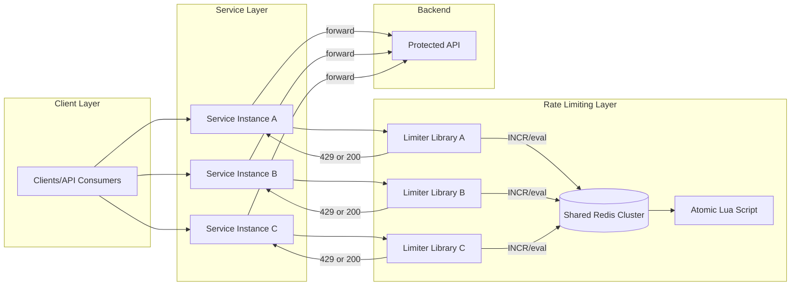
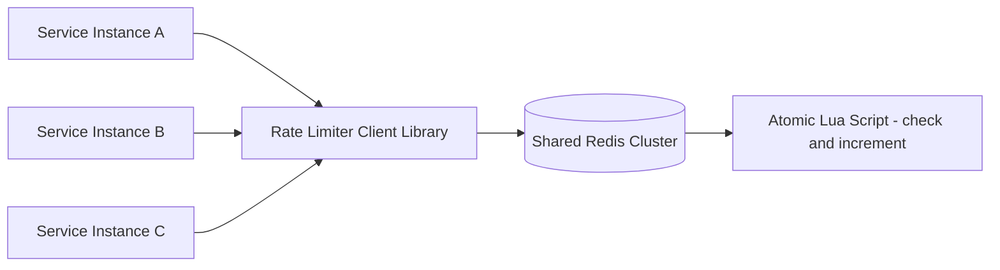
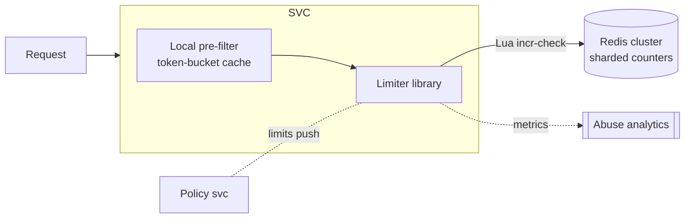
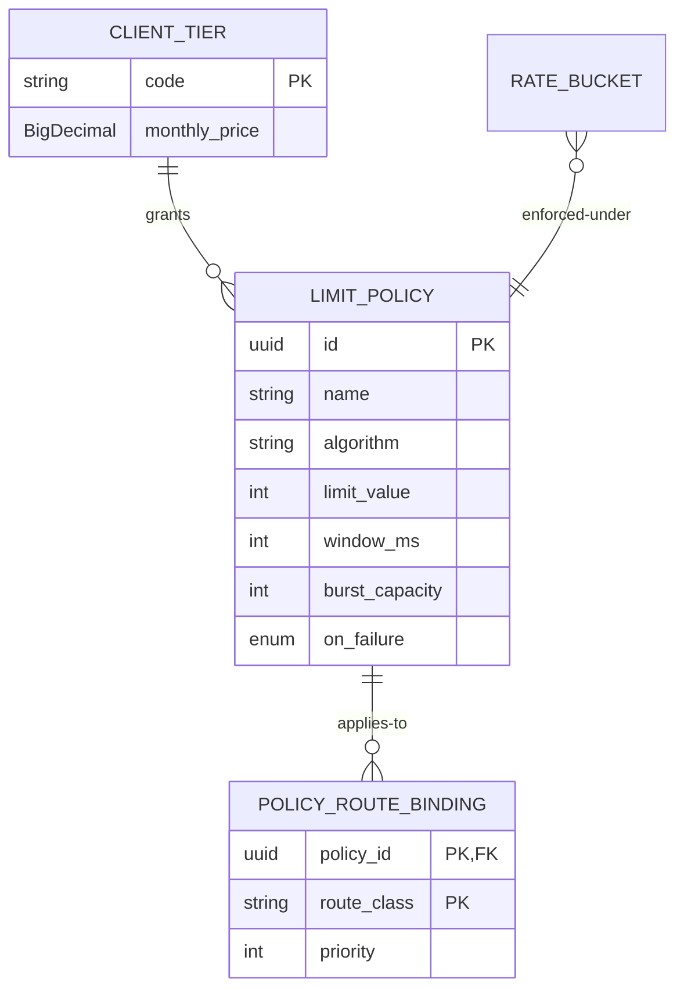

# Design a Distributed Rate Limiter Used Across Microservices

## Blogs and websites

## Medium

## Youtube

---

## Theory

### Topics Covered

1. [Introduction and Problem Statement](#introduction-and-problem-statement)
2. [Functional Requirements](#functional-requirements)
3. [Non-Functional Requirements](#non-functional-requirements)
4. [Capacity Estimation](#capacity-estimation)
5. [High-Level Architecture](#high-level-architecture)
6. [Key Design Points](#key-design-points)
7. [Trade-offs](#trade-offs)
8. [Algorithm Comparison in Depth](#algorithm-comparison-in-depth)
9. [Key Derivation Hierarchy](#key-derivation-hierarchy)
10. [Hot-Client Sharding (Split Counters)](#hot-client-sharding-split-counters)
11. [Cost-Based Limits](#cost-based-limits)
12. [Characteristics](#characteristics)
13. [Components](#components)
14. [Patterns](#patterns)
15. [Benefits](#benefits)
16. [Pros](#pros)
17. [Cons](#cons)
18. [Challenges](#challenges)
19. [Best Practices](#best-practices)
20. [When to Use](#when-to-use)
21. [Use Cases](#use-cases)
22. [API Design and Contract](#api-design-and-contract)
23. [Data Modeling](#data-modeling)
24. [High-Level Design](#high-level-design)
25. [Deep Dive](#deep-dive)
26. [Java and Spring Boot Implementation Guide](#java-and-spring-boot-implementation-guide)
27. [Interview Questions and Answers](#interview-questions-and-answers)

---

### Introduction and Problem Statement

A distributed rate limiter enforces request quotas consistently across many stateless service instances so that the aggregate limit is respected regardless of which instance handles a given request. Unlike local in-process limiters that only protect a single instance, a distributed limiter provides global fairness — preventing any single client from overwhelming the backend by spreading requests across many service instances.



*Diagram: Distributed rate limiter architecture. Each service instance embeds a lightweight limiter library that checks a shared Redis cluster for quota. The check-and-increment is executed atomically via a Lua script. If the quota is exceeded, the library returns a 429 to the caller. Otherwise, the request proceeds to the backend API.*

**Problem Statement:** Design a rate limiter that enforces limits (per API key/user/service) consistently across many stateless microservice instances, so the aggregate limit is respected regardless of which instance handles a request.

**Why this matters:** Without distributed rate limiting, a high-traffic client can distribute requests evenly across N instances and never trigger any per-instance limit — effectively multiplying the intended quota by N. This opens the door to abuse, DDoS, and unfair resource consumption. Distributed rate limiting is the control plane that ensures global correctness.

---

### Functional Requirements

- Enforce a limit (e.g., N requests per window) per client key, shared across all service instances.
- Support multiple algorithms (fixed window, sliding window, sliding window counter, token bucket, leaky bucket).
- Return remaining quota / retry-after to callers via standard headers (`X-RateLimit-Limit`, `X-RateLimit-Remaining`).
- Support per-route or per-tier (free/paid) limit overrides — the most constrained applicable limit wins.
- Support cost-based limiting (metering units/tokens/bytes, not just request count).
- Provide emergency override levers to raise or remove limits during incidents.
- Emit metrics and structured logs for observability and abuse detection.

---

### Non-Functional Requirements

| Requirement | Target |
|---|---|
| **Scale** | Tens of thousands of requests/sec across hundreds of service instances. |
| **Latency** | Rate-limit check must add < 5 ms p99 to the request path. |
| **Consistency** | Limit must hold globally even though checks happen from many instances concurrently. |
| **Availability** | Must fail open or gracefully degrade if the shared store is unavailable. |
| **Accuracy** | Over-admission bounded to documented limits (e.g., ≤K-1 for split counters). |
| **Durability** | Limiter state is ephemeral — no long-term persistence required. |
| **Operability** | Full observability: per-dimension rejection rates, script execution latencies, breaker state transitions. |

---

### Capacity Estimation

For a system handling 100K requests/second across 100 service instances:

**QPS distribution:**
- Total: 100K req/sec
- Per instance: ~1K req/sec
- With local pre-filter tier absorbing 90% of decisions: only ~10K req/sec reaches Redis
- With hot-key sharding (split K=10): no single Redis key exceeds ~1K ops/sec

**Redis sizing:**
- Each rate-limit check = 1 Lua script execution (EVALSHA)
- Each execution ~0.1–0.5 ms
- 10K ops/sec × 0.5 ms = 5K CPU-ms/sec = 5% of one core
- Redis Cluster with 6 primary nodes: each handles ~1.7K ops/sec comfortably
- Memory: each counter key ~100 bytes; 1M active keys = ~100 MB RAM

**Connection pooling:**
- 100 service instances × 10 connections each = 1000 total connections
- Redis handles 10K+ connections easily; connection reuse critical for latency

**Growth projection:**
- 10× growth → 1M req/sec, 1M active keys, 100K ops/sec to Redis
- Need: 10 Redis primary nodes (each handling 10K ops/sec)
- Network: 100K × 4 KB = ~40 MB/sec per region — trivial

---

### High-Level Architecture



*Diagram: Every service instance embeds a rate-limiter client library that talks to a shared Redis cluster. The check-and-increment logic runs as a single atomic Lua script on Redis, ensuring that concurrent requests from different instances cannot race and multiply the limit.*

**Design rationale:** The shared store (Redis) is the source of truth for quota counts. The Lua script ensures atomicity — check and increment happen in one operation, with no race windows. The client library handles connection pooling, circuit breaking, and local pre-filtering. The policy configuration service pushes limit updates to all instances.

---

### Key Design Points

- Use a shared, low-latency store (Redis) reachable by every service instance, with the check-and-increment logic executed as a single atomic Lua script to avoid race conditions between concurrent requests hitting different instances.
- Sliding-window-log or sliding-window-counter algorithms give smoother enforcement than fixed windows, which allow bursts at window boundaries; token bucket is preferred when short bursts should be tolerated.
- Shard the Redis keyspace by client key (consistent hashing across a Redis cluster) so no single node becomes a hotspot for a high-traffic client.
- On Redis unavailability, fail open (allow requests) with a circuit breaker and alert, rather than rejecting all traffic — protects overall availability at the cost of temporarily unenforced limits.
- Return remaining quota and retry-after headers on every response (even successful ones) so clients can implement intelligent retry backoff.
- Use hash-tags (`{keyHash}`) to ensure all rate-limit keys for a single client land on the same Redis hash slot — required for multi-key atomic operations in Redis Cluster.

---

### Trade-offs

- A shared external store adds a network hop and a new dependency to every request path, but is the only way to get a globally consistent count across independently scaled instances; purely local (in-process) counters are faster but only enforce a per-instance limit, not a global one.
- Token bucket / sliding window counters trade a small amount of memory and precision for much smoother traffic shaping compared to fixed windows.
- Fail-open mode (allowing requests during store outages) trades temporary quota violation for system availability; fail-closed mode (blocking requests) is safer but risks cascading outages.
- Hash-tagging (`{keyHash}`) ensures cluster legality for multi-key operations but creates artificial hotspots — all keys for a client land on the same node.

---

### Algorithm Comparison in Depth

| Algorithm | Mechanism | Burst behavior | Memory | Weakness |
|---|---|---|---|---|
| Fixed window | `INCR key:{windowStart}`, expire at window end | Up to 2× limit at boundaries (burst at end of one + start of next) | O(1) per client | Boundary burst artifact |
| Sliding window log | Store timestamp per request; count within trailing window | Smooth, exact | O(requests) — expensive at high rates | Memory + list ops |
| Sliding window counter | Weighted blend of current + previous fixed windows: `prev × overlap% + curr` | Near-smooth, approximate | O(1) | ±small error vs true sliding |
| Token bucket | Bucket holds B tokens refilled at R/s; request consumes 1 | Tolerates burst up to B while averaging R | O(1) state (tokens, lastRefill) | Needs refill math on read |
| Leaky bucket (queue form) | Requests queue; drain at constant rate | Output perfectly smooth | Queue depth bounded | Adds latency; rarely used for admission |

**Choosing**: token bucket when clients legitimately burst (mobile apps syncing); sliding-window counter when contractual "N per minute" precision matters without log costs. Most public APIs ship token buckets with disclosed capacity+refill.

---

### Key Derivation Hierarchy

Limits apply along multiple dimensions simultaneously:

```
per API-key        : contractual quota
per user           : behind shared keys (org of 50 devs)
per IP             : anonymous/unauthenticated surface
per route-class    : /auth stricter than /catalog
global             : protect backend from aggregate abuse
```

Enforcement evaluates the *most constrained* applicable bucket — a request may pass its key bucket but fail the route bucket. Key composition must be deterministic and cheap (`keyHash:routeClass:windowId`); deriving keys from untrusted headers (X-Forwarded-For without proxy sanitization) is a classic bypass vector.

**Dimension evaluation order (most selective first):**
1. Global limit (cheapest to check, protects system-wide)
2. IP-based limit (per-source-fairness for anonymous traffic)
3. API-key limit (contractual quota for authenticated clients)
4. User limit (behind shared keys — org-level fairness)
5. Route-class limit (expensive endpoints get stricter limits)

---

### Hot-Client Sharding (Split Counters)

One celebrity key doing 500K req/min against a Redis shard ceiling (~100K ops/s):

```
Split into K sub-counters: {key}:s0 ... {key}:s(K-1)
Write path: pick sub-counter = random() % K, INCR it
Read/limit check: SUM(sub-counters) >= limit ?
  → over-admission by up to K-1 requests per check (bounded, acceptable)
Rebalance K upward as the key's rate grows
```

Trade-off documented explicitly: slight over-admission (≤K per decision) buys horizontal write scaling for pathological tenants.

---

### Cost-Based Limits

Modern APIs meter *units*, not requests: tokens consumed (LLM APIs), bytes transferred, compute-ms. The same atomic machinery applies — `INCRBY cost` instead of `INCR`, with estimated-cost reservation and true-cost reconciliation after processing (refund deltas). This generalization is where rate limiting meets billing.

**Two-phase cost accounting:**
1. **Reserve**: Before processing, reserve estimated max cost (`DECRBY budget key estimated_cost`)
2. **Reconcile**: After processing, compute actual cost and atomically adjust (`INCRBY budget key (actual - estimated)`)
3. **Refund**: If the request fails early, refund the full reservation

This ensures attackers can't under-report costs to bypass limits. The estimated cost must be pessimistic (overestimate) to prevent exploitation.

---

### Characteristics

- **Correctness under concurrency is the product**: any race between check-and-consume across instances silently multiplies limits; atomic scripts aren't an optimization but the entire guarantee.
- **Hot-path resident**: every request pays limiter tax — hence single round-trip designs, connection pooling, and pre-computed keys.
- **Bounded staleness tolerance**: unlike caches, undercounting (letting extra requests through during store blips) has known, acceptable blast radius — enabling fail-open defaults.
- **Multi-dimensional policy engine**: real systems stack dimensions (user ⊂ org ⊂ IP ⊂ route), requiring ordered evaluation with short-circuits.
- **Observable fairness**: rejection metrics per tenant expose both abuse and misconfiguration; limiter dashboards are support-team front doors.
- **Stateless services, stateful enforcement**: the pattern exemplifies externalizing coordination so application pods stay cattle.

---

### Components

- **Limiter client library**
  *Purpose*: make correct usage universal across services. *Responsibilities*: key building, Lua invocation/connection pooling, circuit breaking around the store, local pre-filter tier (fast-reject obviously-over clients), header stamping helpers, metrics emission. *Relationship*: embeds in every service or gateway; talks to shared store only when pre-filter passes.

- **Shared atomic store (Redis cluster)**
  *Purpose*: hold counters/buckets with serial execution semantics. *Responsibilities*: script execution (single-threaded per slot), TTL management, replication for durability-of-state (approximate OK). *Sizing note*: ops/sec ≈ peak req/sec passing through; hot keys split per above.

- **Policy configuration service**
  *Purpose*: define limits per tier/route centrally. *Responsibilities*: CRUD with audit, versioning, push propagation to libraries via watch/poll (see config-management topic), emergency override levers (raise caps during incidents).

- **Metrics & abuse analytics**
  *Purpose*: observe enforcement health and attacker patterns. *Responsibilities*: rejection-rate time series per dimension, top-talkers, false-positive reviews, feeding WAF/blocklist automation.



*Diagram: Component-level view of the rate limiting system. Each service instance has a local pre-filter (in-process token bucket) that handles the majority of decisions at near-zero cost. When the pre-filter is uncertain, the limiter library calls the shared Redis cluster with an atomic Lua script. A central policy service pushes limit configurations to all instances. Metrics flow to abuse analytics.*

**Component interaction flow:**
1. **Service instance** receives an API request with headers (API key, user ID, route, IP)
2. **Local pre-filter** checks the in-memory token bucket — if clearly under limit, allow immediately
3. If pre-filter is uncertain (near the boundary), **limiter library** calls Redis with an atomic Lua script
4. **Redis** executes the script: increments counter, checks against limit, sets TTL
5. If Redis is unavailable, **circuit breaker** opens and the library fails open (allow with `X-RateLimit-Unavailable` header)
6. Library emits **metrics** (allowed/denied counters) to abuse analytics dashboard

---

### Patterns

- **Atomic increment-and-check (Lua)** — the core pattern:
  ```lua
  local current = redis.call('INCR', KEYS[1])
  if current == 1 then redis.call('PEXPIRE', KEYS[1], ARGV[2]) end
  return current - tonumber(ARGV[1])   -- ≤0 means allowed, returns remaining
  ```
  One round-trip decides allow/deny + remaining quota atomically. *When*: default for fixed/sliding-counter schemes.

- **Token bucket with lazy refill math**
  State `(tokens, lastRefillTs)` stored as hash; script computes elapsed×rate, tops up (capped at burst), then decrements. *Solves*: burst-tolerant smoothing without background jobs. *Used by*: Stripe-style APIs, Envoy's local/global rate limit filters.

- **Two-tier filtering**
  Cheap in-process token bucket synced periodically from central state catches 95% of decisions locally (~0 ms); central store consulted on boundary cases and for periodic reconciliation. *Trade-off*: slight over-admission windows vs massive latency/ops savings. This hybrid is how planet-scale limiters survive.

- **Circuit-breaker fail-open with alarms**
  Store unreachable → breaker opens → all requests pass with `X-RateLimit-Unavailable: true` header + metric spike paging operators. Documented, rehearsed, reversible. Fail-closed reserved for endpoints whose abuse directly burns money (LLM inference, SMS sends).

- **Retry-After choreography**
  Rejections carry exact reset times computed from window math — well-behaved clients then synchronize their retries instead of hammering. Turns the limiter from adversarial wall into coordination protocol.

- **Split-counter for hot keys**
  High-traffic keys split into K sub-counters to distribute write load across shards. Clients pick a random sub-counter for each increment; the total is computed by summing at read time. Over-admission bounded to K-1 per decision.

---

### Benefits

- **Protects backends from cascading overload** — the difference between graceful degradation and outage chains during incidents.
- **Fair resource distribution among tenants** — one noisy integrator can't starve others.
- **Monetization primitive**: quotas define product tiers; the limiter literally enforces pricing.
- **Security layer**: brute-force login, scraping, enumeration attacks all throttled mechanically before hitting business logic.
- **Traffic insight**: rejection telemetry reveals client bugs, integration mistakes, and attack campaigns early.

---

### Pros

- Simple core primitive (atomic counter) scaling to enormous request volumes.
- Algorithm flexibility per endpoint without architectural churn.
- Degrades gracefully by design rather than collapsing.
- Client-cooperative operation possible via honest headers.
- Two-tier design decouples latency-sensitive fast path from global correctness path.

### Cons

- Adds a mandatory dependency to every request path — its failure modes become everyone's failure modes.
- Approximation inherent in distributed settings (split-counter over-admission, two-tier windows).
- Multi-dimension policies grow combinatorially complex without governance.
- Redis operational burden lands on platform teams permanently.
- Legitimate bursty clients suffer unless token buckets tuned generously — constant tuning dialogue.
- Client SDKs must be kept in sync across language stacks — version drift causes inconsistent behavior.

---

### Challenges

- **Technical**: clock skew between app servers and store (use server-side timestamps exclusively); window boundary bursts (fixed-window); memory blowups from unique-IP floods (log algorithms) — mitigated by aggressive pre-filters.
- **Scalability**: celebrity-key hot shards (split counters); Redis ops ceiling at extreme QPS (pipeline batching, local tiers); thundering reconnection after store recovery (jittered reconnects).
- **Performance**: p99 budget erosion from chatty policies (evaluate most-selective dimension first); serialization overhead.
- **Reliability**: split-brain during Redis cluster resharding (hash-tag discipline); stale circuit state flapping.
- **Maintainability**: policy sprawl (hundreds of overrides nobody remembers); SDK version drift across language stacks.
- **Operational**: capacity planning around marketing events; runbooks for emergency quota raises; false-positive review workflow with support team.
- **Security**: bypass via identity rotation (many free keys) — solved by layered dimensions up to payment-instrument fingerprinting; timing attacks distinguishing near-limit states.

**Mitigation strategies:**

| Challenge | Mitigation |
|---|---|
| Clock skew | Use server-side `TIME` command in Lua scripts; never trust client timestamps |
| Window boundary bursts | Use sliding window or token bucket instead of fixed window |
| Celebrity hot keys | Split counters into K sub-shards; sum at read time |
| Thundering reconnection | Jittered backoff with randomization factor 0.5–1.0 |
| Policy sprawl | Versioned policy configs with owner/email metadata; quarterly reviews |
| Identity rotation attacks | Multi-dimensional limiting (IP + device + payment instrument + behavior) |

---

### Best Practices

- **Evaluate dimensions cheapest-and-most-selective first**, short-circuiting on first rejection.
- **Always return remaining/reset headers** even on success — cooperative clients smooth their own traffic.
- **Fail open by default, fail closed selectively** per endpoint's abuse economics; document each choice.
- **Jitter everything**: reconnects, sync intervals, pre-filter refill timers — synchronized herds amplify outages.
- **Set TTLs slightly beyond window** (2×) so late stragglers don't resurrect dead buckets.
- **Alert on rejection-ratio anomalies per tenant**, not just totals — misconfigurations look like attacks and vice versa.
- **Load-test the store at projected peak including hot-key simulations**; discover split thresholds before celebrities do.
- **Keep policy definitions versioned and reviewed** like code; emergency overrides logged with expiry timestamps.

**Detailed explanations:**

**Short-circuit on first rejection**: Evaluate the global limit first (single key, protects the whole system), then IP, then API key, then route-class. A request that fails the global check never needs the remaining dimension checks — saving 2-3 Redis round-trips. Order matters: put the cheapest, most broadly applicable check first.

**Always return headers**: Even when a request succeeds, return `X-RateLimit-Limit` and `X-RateLimit-Remaining` headers. This lets SDK authors implement intelligent retry logic — backing off proportionally to `Remaining` rather than blindly retrying. The `Retry-After` header on 429s should be an exact timestamp, not a relative duration.

**Jitter everything**: Without jitter, 100 service instances recovering simultaneously after a Redis outage will reconnect in lockstep, creating a thundering herd that can overwhelm Redis again. Add 20-50% randomization to reconnect intervals, sync intervals, and pre-filter refill timers.

---

### When to Use

**Build/deploy distributed limiting when**: multiple stateless instances serve shared clients; contractual quotas exist; abuse economics justify protection; billing ties to usage.

**Skip when**: single-instance services (in-process bucket suffices); internal low-stakes tooling; batch-only workloads better served by queue-based admission control.

**Alternatives/complements**: gateway-level limiting (centralizes enforcement — see dedicated gateway topic); service-mesh sidecars for east-west; cloud provider native (API Gateway usage plans, WAF rules); queue-based load leveling for async workloads where rejecting is worse than delaying.

**Decision inputs**: QPS scale, latency budget, tenant structure, abuse threat model, existing infra (already running Redis? gateway? mesh?).

**Decision matrix:**

| Factor | Local-only | Distributed | Gateway | Service Mesh |
|---|---|---|---|---|
| Single instance | ✅ | ❌ | ❌ | ❌ |
| Multiple instances, shared clients | ❌ | ✅ | ✅ | ✅ |
| < 1ms latency budget | ✅ | ❌ | ⚠️ | ⚠️ |
| Strong consistency needed | ❌ | ✅ | ✅ | ✅ |
| Multi-language clients | ✅ | ⚠️ | ✅ | ✅ |
| Abuse protection | ❌ | ✅ | ✅ | ✅ |

---

### Use Cases

- **Public API tiers (free/pro/enterprise)**
  *Problem*: monetize access fairly; prevent free-tier abuse degrading paid experience. *Solution*: token buckets per tier with disclosed capacity/refill; route-specific stricter buckets for expensive operations; upgrade-path messaging in 429 bodies. *Trade-off*: generous bursts improve DX but enable momentary abuse — capacity math balances both.

- **Login/OTP endpoint protection**
  *Problem*: credential stuffing and SMS-pumping fraud. *Solution*: fail-closed multi-dimensional limits (per-account, per-IP, per-device, global OTP budget), escalating lockouts, anomaly feeds to fraud systems. *Trade-off*: occasional legitimate-user friction accepted deliberately because abuse burns real money per message.

- **Internal service-to-service protection**
  *Problem*: retry storms during downstream brownouts cascade fleet-wide. *Solution*: mesh-level per-caller quotas with priority lanes; critical paths exempted via policy. *Trade-off*: added mesh config complexity vs eliminated retry-amplification class of incidents.

- **E-commerce flash sale protection**
  *Problem*: limited inventory (e.g., 1000 units) released at a specific time; bots and humans compete. *Solution*: per-IP + per-user rate limits with token buckets; queue-based admission for over-subscribed drops; gradual release to smooth burst. *Trade-off*: some legitimate users may be rate-limited during peak seconds.

---


---

### API Design and Contract

The distributed rate limiter exposes a lightweight internal API consumed by service instances. No public HTTP API is typically exposed — the interface is the client library and the Redis commands it uses.

**Client library interface (Java):**

```java
public interface RateLimiter {
    /**
     * Attempt to consume one unit of quota for the given key.
     * @return LimitResult with allow/deny decision, remaining quota, and retry-after
     */
    LimitResult tryConsume(String apiKey, String route, String ipAddress, int cost);

    /**
     * Attempt to consume multiple units (for cost-based limiting).
     */
    LimitResult tryConsumeBatch(String apiKey, String route, String ipAddress, int cost);
}
```

**HTTP response headers on every API response (even successful ones):**

| Header | Type | Description |
|---|---|---|
| `X-RateLimit-Limit` | integer | The maximum number of requests allowed in the window |
| `X-RateLimit-Remaining` | integer | Number of requests remaining in the current window |
| `X-RateLimit-Reset` | Unix timestamp | Time when the current window resets |
| `Retry-After` | seconds | On 429 responses: when to retry |
| `X-RateLimit-Unavailable` | boolean | Present when limiter is in fail-open mode |

**Standard 429 response:**

```http
HTTP/1.1 429 Too Many Requests
Content-Type: application/json
Retry-After: 37
X-RateLimit-Limit: 100
X-RateLimit-Remaining: 0
X-RateLimit-Reset: 1690000037
X-RateLimit-Unavailable: true

{
    "error": "rate_limit_exceeded",
    "message": "API rate limit exceeded for client abc123",
    "limit": 100,
    "remaining": 0,
    "reset_at": "2026-07-20T14:30:37Z"
}
```

**Versioning strategy:**
- Client library versions mapped to policy schema versions
- Backward-compatible additions: clients ignore unknown policy fields
- Breaking changes: require coordinated rollout across all services
- Policy updates pushed via pub/sub with version checking

**Rate limiting for the rate limiter itself:**
- Redis connections pooled per instance (max 10 per instance)
- Lua scripts cached (EVALSHA with script-load fallback)
- Circuit breaker: 3 consecutive timeouts → open circuit for 30s

---

### Data Modeling

Runtime state lives in Redis; control-plane metadata is relational:



*Diagram: Relational schema for rate-limit policies. A `CLIENT_TIER` (e.g., free, pro, enterprise) grants one or more `LIMIT_POLICY` records. Each policy can be bound to multiple `POLICY_ROUTE_BINDING` entries that associate it with a route class (e.g., `/api/v1/resource`) and a priority. The `RATE_BUCKET` entity (stored in Redis) is enforced under a `LIMIT_POLICY`. Note `BigDecimal` is used for `monthly_price` to ensure precise decimal pricing.*

**Redis runtime schema conventions:**

```
rl:{<keyHash>}:<routeClass>:<windowId>   -> counter (fixed/sliding)
tb:{<keyHash>}:<routeClass>              -> hash{tokens_milli, last_refill_ms} (bucket)
fence:{<keyHash>}                        -> split-generation marker (resharding safety)
```

**Design choices:**
- Hashed identities never raw PII in keys — `keyHash = SHA256(apiKey)` not the raw key
- Window IDs derived from epoch math (no date parsing in hot path): `windowId = now_ms / window_ms`
- Generation fences prevent old-split writes after rebalances — a `{keyHash}:gen` counter is incremented during rebalancing; clients must match the current generation
- All runtime keys TTL'd ≥ 2× window so late stragglers don't resurrect dead buckets
- Lifecycle: policies soft-deleted with audit trail; buckets ephemeral by construction

**Partitioning strategy:**
- Redis Cluster automatically shards by key hash; hash-tags `{keyHash}` ensure all keys for a client land on the same node
- Hot keys split into K sub-counters: `{keyHash}:s0`, `{keyHash}:s1`, ..., `{keyHash}:s(K-1)`
- K is auto-adjusted based on observed traffic (adaptive splitting)
- Counter reads sum across all K sub-counters atomically

**Indexing:**
- PostgreSQL: `LIMIT_POLICY(client_tier_id)`, `POLICY_ROUTE_BINDING(policy_id)`, `CLIENT_TIER(code)`
- Redis: key design embeds all dimensions in the key for O(1) lookup, no secondary indexes needed

---

### High-Level Design

Full decision flow with degradation:

```mermaid
sequenceDiagram
    participant C as Caller
    participant S as Service instance
    participant PF as Local pre-filter
    participant RS as Redis (atomic script)
    participant CB as Circuit breaker

    C->>S: request (api-key K, route R)
    S->>PF: quick local check (synced bucket)
    alt clearly over local approximation
        PF-->>C: 429 + Retry-After
    else maybe allowed
        S->>CB: store healthy?
        alt healthy
            S->>RS: EVALSHA incr-check(keyHash:R:win, limit, ttl)
            RS-->>S: remaining / deny + resetAt
            S-->>C: 200 (+headers) or 429 (+Retry-After)
        else open (fail-open mode)
            S-->>C: forward request, X-RateLimit-Unavailable: true
            Note over S: alarm fired; metrics spike
        end
    end
```

*Diagram: Rate limiting decision flow with circuit-breaker fail-open. The local pre-filter handles the majority of decisions at near-zero cost. When uncertain, the limiter library calls Redis with an atomic Lua script. If Redis is unreachable (circuit breaker open), the system fails open — allowing requests but emitting warnings via the `X-RateLimit-Unavailable` header.*

**Scaling strategy:** Redis cluster sharded by hash(keyHash); hot keys split into K sub-counters summed at read time; policy service fans out updates via pub/sub; local pre-filters resync every ~5 s with jittered offsets. For global scale, deploy regional rate-limiter clusters with eventual consistency — acceptable since rate limiting is inherently approximate.

**Failure handling:**
- Shard loss → affected keys fail-open (breaker per shard)
- Whole-store loss → global breaker posture per policy; non-critical routes fail open, abuse-costing routes (LLM inference, SMS) fail closed
- Recovery → jittered reconnection avoids synchronized stampede; counts resume fresh (windows are ephemeral by design)
- Circuit breaker: half-open state after 30s; test with single request; if successful, close; if failed, reset timer

**Monitoring:**
- Rejection rate per dimension (key, route, IP, user)
- Lua script execution latency percentiles (p50, p95, p99)
- Circuit breaker state transitions (open, half-open, closed)
- Pre-filter hit ratio (what % of decisions avoided Redis)
- Split factor drift (when hot keys need more sub-counters)

---

### Deep Dive

- **Sliding-window-counter math**: `estimate = prevCount × (overlapMs/windowMs) + currCount`; error bounded by max(prev,curr) fluctuation — good enough for contracts when paired with small safety margins; zero per-request memory beyond two integers. For example, with a 60-second window at 50% overlap: if prev window had 60 requests and current window has 30 at the 30-second mark, the estimate is `60 × 0.5 + 30 = 60`. This is within ±30 of the true count.

- **Token-bucket refill correctness**: compute refill lazily inside the script using store-side `TIME` (never trust client clocks): `tokens = min(capacity, tokens + (now-lastRefill)*rate)` then conditional decrement; store fractional tokens as milliscaled integers avoiding float nondeterminism. Example with capacity=100, rate=10/sec, 5.5 seconds elapsed: `tokens = min(100, 90 + 55) = 100` (capped at capacity).

- **Single-slot legality**: Redis Cluster executes multi-key scripts only within one slot — hence `{keyHash}` tags wrapping all related keys (counter + fence + metadata); violations produce CROSSSLOT errors that have embarrassed many production deploys. Always test cluster key placement with `CLUSTER KEYSLOT` and `CLUSTER COUNTKEYSINSLOT`.

- **Over-admission bounds**: split-K counters admit at most K−1 extra requests per decision instant; formalize this bound in design docs so security reviews can reason about worst-case exposure rather than hand-waving. For K=10 and a limit of 1000 req/min, worst case is 1009 requests admitted. This is documented as acceptable risk.

- **Observability**: per-dimension rejection ratios, script-execution latencies percentiles, breaker state transitions, split-factor drift alerts (hot key grew), header-honesty audits (sampled verification that returned reset matches actual window math).

- **Policy propagation mechanics**: The policy service pushes updates via Redis pub/sub to a `policy_updates` channel. Each service instance subscribes and updates its local policy cache. For reliability, clients also poll the policy service every 30 seconds with exponential backoff. The local cache has a TTL of 300 seconds — if no updates arrive, the policy is considered stale and fail-open is engaged.

---

### Java and Spring Boot Implementation Guide

Core limiter service (library-style, used across services) with enhanced Spring Boot patterns:

```java
@Component
@RequiredArgsConstructor
public class DistributedRateLimiter {

    private final ReactiveStringRedisTemplate redis;
    private final CircuitBreaker breaker;
    private final LocalPreFilter preFilter;

    @Value("${app.ratelimit.shard-factor:10}")
    private int shardFactor;

    private static final DefaultRedisScript<Long> TOKEN_BUCKET = new DefaultRedisScript<>("""
            local key = KEYS[1]
            local capacity = tonumber(ARGV[1])
            local refill_per_sec_milli = tonumber(ARGV[2])
            local requested = tonumber(ARGV[3])
            local now = tonumber(ARGV[4])
            local state = redis.call('hmget', key, 't', 'ts')
            local tokens = tonumber(state[1]) or capacity
            local last = tonumber(state[2]) or now
            tokens = math.min(capacity, tokens + ((now - last) * refill_per_sec_milli / 1000))
            if tokens < requested then
                redis.call('hmset', key, 't', tokens, 'ts', now)
                redis.call('pexpire', key, 120000)
                return -1
            end
            tokens = tokens - requested
            redis.call('hmset', key, 't', tokens, 'ts', now)
            redis.call('pexpire', key, 120000)
            return math.floor(tokens)
            """, Long.class);

    public Mono<LimitResult> tryConsume(String keyHash, String routeClass,
                                        Policy policy, int cost) {
        String key = "tb:{%s}:%s".formatted(keyHash, routeClass);
        long now = System.currentTimeMillis();
        return Mono.fromSupplier(() -> preFilter.quickCheck(keyHash, policy))
                .flatMap(allowed -> allowed ? Mono.just(LimitResult.ALLOWED)
                        : executeCentral(key, policy, cost, now));
    }

    private Mono<LimitResult> executeCentral(String key, Policy p, int cost, long now) {
        return breaker.execute(
            redis.execute(TOKEN_BUCKET, List.of(key),
                    List.of(String.valueOf(p.burstCapacity()),
                            String.valueOf(p.refillPerSecondMilli()),
                            String.valueOf(cost), String.valueOf(now)))
                .next()
                .map(v -> v >= 0 ? LimitResult.allowed(v) : LimitResult.denied()));
        // on store failure the breaker emits fail-open per policy
    }
}
```

The Lua script runs atomically within a single Redis hash slot. The `{keyHash}` tag ensures all keys for a client hash to the same slot — required for Redis Cluster multi-key operations. The `CircuitBreaker` wraps Redis calls, emitting fail-open behavior when the store is unreachable.

**JPA entities for policy configuration:**

```java
@Entity
@Table(name = "limit_policies")
public class LimitPolicy {
    @Id
    @GeneratedValue
    private UUID id;

    @Column(nullable = false)
    private String name;

    @Column(name = "algorithm", nullable = false)
    private String algorithm; // FIXED_WINDOW, TOKEN_BUCKET, SLIDING_WINDOW

    @Column(name = "limit_value", nullable = false)
    private int limitValue;

    @Column(name = "window_ms", nullable = false)
    private int windowMs;

    @Column(name = "burst_capacity")
    private int burstCapacity;

    @Column(name = "on_failure")
    @Enumerated(EnumType.STRING)
    private OnFailure onFailure;

    @Column(name = "monthly_price")
    private BigDecimal monthlyPrice; // for tier-based billing

    @Version
    private Long version; // optimistic locking for concurrent updates

    @ManyToOne(fetch = FetchType.LAZY)
    @JoinColumn(name = "client_tier_id")
    private ClientTier clientTier;
}
```

```java
@Entity
@Table(name = "client_tiers")
public class ClientTier {
    @Id
    @Column(name = "code", length = 20)
    private String code; // FREE, PRO, ENTERPRISE

    @Column(name = "monthly_price", precision = 10, scale = 2)
    private BigDecimal monthlyPrice;

    @Column(name = "request_limit")
    private int requestLimit;
}
```

**DTOs as Java records:**

```java
public record LimitRequest(
    @NotBlank String apiKey,
    @NotBlank String route,
    @NotBlank String ipAddress,
    @DecimalMin("1") int cost
) {}

public record LimitResult(
    boolean allowed,
    long remaining,
    long resetAtEpochSecond,
    boolean unavailable
) {
    static LimitResult allowed(long remaining) {
        return new LimitResult(true, remaining, System.currentTimeMillis() / 1000, false);
    }
    static LimitResult denied() {
        return new LimitResult(false, 0, System.currentTimeMillis() / 1000, false);
    }
}
```

**Spring controller integration with contract headers:**

```java
@RestController
@RequestMapping("/api")
@RequiredArgsConstructor
public class ResourceController {

    private final DistributedRateLimiter limiter;
    private final ResourceService resourceService;
    private final PolicyService policyService;

    @GetMapping("/v1/resource")
    public ResponseEntity<ResourceDto> getResource(
            @RequestHeader("X-Api-Key") @NotBlank String apiKey,
            @RequestHeader(value = "X-Forwarded-For", defaultValue = "") String forwardedFor,
            HttpServletRequest request) {

        String effectiveIp = forwardedFor.isEmpty() ? request.getRemoteAddr() : forwardedFor;
        Policy policy = policyService.policyFor(apiKey, "/v1/resource");

        LimitResult result = limiter.tryConsume(
            Hashing.sha256().hashString(apiKey, StandardCharsets.UTF_8).toString(),
            "v1:resource", effectiveIp, 1).block();

        HttpHeaders headers = new HttpHeaders();
        headers.add("X-RateLimit-Limit", String.valueOf(policy.limitValue()));
        headers.add("X-RateLimit-Remaining", String.valueOf(result.remaining()));
        headers.add("X-RateLimit-Reset", String.valueOf(result.resetAtEpochSecond()));

        if (!result.allowed()) {
            headers.add("Retry-After", "30");
            return ResponseEntity.status(HttpStatus.TOO_MANY_REQUESTS)
                    .headers(headers).build();
        }

        return ResponseEntity.ok()
                .headers(headers)
                .body(resourceService.getResource());
    }

    @ExceptionHandler(RateLimitExceededException.class)
    ResponseEntity<Map<String, String>> handleRateLimit() {
        return ResponseEntity.status(HttpStatus.TOO_MANY_REQUESTS)
                .body(Map.of("error", "rate_limit_exceeded",
                           "message", "API rate limit exceeded"));
    }
}
```

**Policy configuration service with @Scheduled sync:**

```java
@Service
@RequiredArgsConstructor
public class PolicyService {

    private final LimitPolicyRepository policyRepo;
    private final RedisTemplate<String, Policy> redis;

    @Scheduled(fixedRateString = "${app.policy.sync-interval-ms:5000}")
    @RefreshScope
    public void syncPolicies() {
        // Pull latest policies from DB, push to Redis
        policyRepo.findAllByActiveTrue()
                .forEach(policy -> {
                    String key = "policy:" + policy.getClientTier().getCode() + ":" + policy.getName();
                    redis.opsForValue().set(key, policy, Duration.ofMinutes(5));
                });
    }
}
```

**Testing pattern:** Testcontainers Redis driving concurrent consumers asserting hard-cap adherence (within documented over-admission bounds), breaker flip tests pausing the container mid-load, and clock-manipulation tests via injected `Clock` bean.

```java
@SpringBootTest
@Testcontainers
class DistributedRateLimiterTest {

    @Container
    static RedisContainer redis = new RedisContainer("redis:7-alpine");

    @Autowired DistributedRateLimiter limiter;

    @Test
    void shouldRejectAfterLimitExceeded() {
        // Given — limit of 5 requests per window
        Policy policy = new Policy(5, Duration.ofSeconds(10), 5);

        // When — make 6 requests
        List<LimitResult> results = IntStream.range(0, 6)
            .mapToObj(i -> limiter.tryConsume("key", "route", policy, 1).block())
            .toList();

        // Then — first 5 allowed, 6th rejected
        assertThat(results.subList(0, 5)).allMatch(LimitResult::allowed);
        assertThat(results.get(5)).isNotNull().extracting(LimitResult::allowed)
            .isEqualTo(false);
    }

    @Test
    void shouldFailOpenWhenRedisUnavailable() {
        // Given — circuit breaker open
        try (GenericContainer<?> stopped = new GenericContainer<>("redis:7-alpine").withCommand("redis-server --port 6379")) {
            // Redis is stopped, circuit breaker opens
            LimitResult result = limiter.tryConsume("key", "route", new Policy(1, Duration.ofMinutes(1), 1), 1).block();

            // Then — fail open (allowed) with unavailable flag
            assertThat(result.allowed()).isTrue();
            assertThat(result.unavailable()).isTrue();
        }
    }
}
```

---

### Interview Questions and Answers

**Beginner**

1. **Why can't each instance just keep its own counter?**
   With N instances behind a load balancer, per-instance counters enforce N× the intended limit collectively — clients exceeding quota distribute requests evenly and never see a rejection. Global correctness requires shared state or coordinated splitting.

2. **Fixed vs sliding window — the practical difference?**
   Fixed allows ~2× bursts straddling window edges; sliding blends adjacent windows (or tracks history) eliminating the artifact at tiny extra cost. Contracts sensitive to burst abuse choose sliding/token approaches.

3. **What HTTP status code and headers should rate-limited responses include?**
   `429 Too Many Requests` with `Retry-After` (seconds until reset), `X-RateLimit-Limit`, `X-RateLimit-Remaining` (0), and `X-RateLimit-Reset` (epoch timestamp). The body should include a machine-readable error code and human-readable message.

4. **What's the difference between rate limiting and throttling?**
   Rate limiting rejects excess requests (returns 429). Throttling queues excess requests and processes them later (at a reduced rate). Both control traffic — limiting drops, throttling delays.

**Intermediate**

5. **Walk through implementing token bucket atomically in Redis.**
   Hash stores `(tokens_milli, last_refill_ms)`; script reads `TIME`, computes lazy refill capped at capacity, then conditional decrement; store fractional tokens as milliscaled integers avoiding float nondeterminism. Follow-up: why not background refill job? — per-key jobs don't scale; lazy computation does.

```lua
local key = KEYS[1]
local capacity = tonumber(ARGV[1])
local refill_ms = tonumber(ARGV[2])
local requested = tonumber(ARGV[3])
local now = tonumber(ARGV[4])
local state = redis.call('HMGET', key, 'tokens_milli', 'last_refill_ms')
local tokens = tonumber(state[1]) or capacity
local last = tonumber(state[2]) or now
tokens = math.min(capacity, tokens + (now - last) * refill_ms / 1000)
if tokens < requested then
    redis.call('HMSET', key, 'tokens_milli', tokens, 'last_refill_ms', now)
    redis.call('PEXPIRE', key, 120000)
    return -1
end
tokens = tokens - requested
redis.call('HMSET', key, 'tokens_milli', tokens, 'last_refill_ms', now)
redis.call('PEXPIRE', key, 120000)
return math.floor(tokens)
```

6. **Your limiter must add <5ms p99. Where does latency go and how do you shave it?**
   Budget: TLS already sunk; key derivation ~0; connection reuse/pipelining to store ~0.5–1 ms; Lua exec ~0.1 ms; network RTT dominates — colocate store with service tier, pool connections aggressively, add local pre-filter tier absorbing majority of checks entirely. Measure per-stage; regressions gate deploys.

7. **How do you protect against attackers rotating thousands of identities?**
   Layer dimensions beyond presented credentials: IP/ASN ranges, device fingerprints, behavioral velocity, payment-instrument linkage for signed-up abusers. Purely credential-keyed limits assume honest identity — attackers defeat that assumption first.

8. **How would you handle different rate limits for different user tiers?**
   Evaluate dimensions cheapest-and-most-selective first: global → IP → API-key tier → user → route-class. Each tier has its own counter bucket; a request must pass all applicable buckets. The most constrained (lowest remaining ratio) determines the outcome.

**Advanced**

9. **Design rate limiting for an LLM API charging per token.**
   Two-phase accounting: reserve estimated max tokens (`DECRBY budget key estimated_cost`) → stream response → reconcile actual usage (`INCRBY budget key (actual - estimated)`) → refund delta atomically. Buckets denominated in tokens not requests; concurrent-stream caps separate from throughput budgets; fail-closed since abuse = direct GPU burn. Discuss estimation-error exploitation and why reservation closes it.

10. **During a Redis cluster reshard, some limiter keys move slots mid-window. What breaks?**
    In-flight scripts targeting moved slots get MOVED redirects (client handles, brief latency bump); worse: split-generation fences missing → old-shard writes orphaned, undercounting → temporary over-admission. Mitigations: hash-tags pinning related keys together, fence generations, scheduling reshard off-peak, accepting documented transient slack.

11. **Implement a rate limiter that allows 100 requests per minute with a burst of 200.**
    Token bucket with capacity=200, refill_rate=100/minute (1.67/sec). The bucket starts full (200 tokens). Each request consumes 1 token. Tokens refill at 1.67/sec. This allows the initial 200 burst, then settles to 100/min. Implementation uses the Lua script shown above with `capacity=200` and `refill_per_sec=1.67`.

12. **How do you handle rate limiting for WebSocket connections that stay open for hours?**
    Apply the limit at connection initiation (how many new connections per minute) rather than per message. For message-rate limiting, use a sliding window counter on the client ID; emit a warning at 80% of limit and disconnect at 100%. Alternatively, use a token bucket that refills while the connection is open — clients can "bank" tokens during low-activity periods.

**Senior / system design**

13. **Design the full rate-limiting platform for a company: 200 services, public APIs, internal calls, per-org billing quotas.**
    Tiered architecture: CDN/edge (geo-distributed coarse shields) → gateway (contract enforcement, headers, per-tier buckets) → mesh/service-level (east-west protection, priority lanes) with shared policy service defining dimensions once; billing-grade metering decoupled via event firehose; per-tier fail-mode matrices; game-day drills. Trade-offs: consistency-vs-latency per layer, platform-team ownership boundaries.

14. **Argue against your own design: what does the shared-store approach lose versus fully-local limiting?**
    Concede: latency floor (~RTT), new dependency class, operational burden, approximation windows. Then show why alternatives fail requirements (local = N× limits) and how hybrids (two-tier) recapture most losses. Demonstrates steelmanning ability interviewers probe for at staff level.

15. **How would you debug a rate limiter where legitimate users are getting 429s during peak hours?**
    First, check if the issue is per-dimension: are API-key buckets being exhausted, or route-class? Second, examine the two-tier interaction: is the local pre-filter too aggressive (evicting valid tokens too early)? Third, check for clock skew — if service clocks are out of sync, window IDs diverge. Fourth, check for hot-key splitting misconfiguration — split factor K may be too low for the traffic volume. Fifth, check the circuit breaker — is the fail-open threshold correct? Finally, examine policy propagation — are all instances seeing the same policy updates?

**Follow-up questions an interviewer may ask:**

- *What if the Redis store is in a different region?* → Latency increases (2–10 ms per round-trip). Mitigate with regional Redis clusters + async replication, or edge-deployed limiters with eventual consistency.
- *How do you handle IPv6 addresses in rate-limit keys?* → Hash/compress the IP to a fixed-length key; IPv6 addresses are long and would bloat Redis keys. Use `cidr` subnet aggregation to group similar IPs.
- *What happens during a failover? Do counters reset?* → With Redis AOF persistence, counters survive failover (state is recovered). Without persistence, counters reset — documented as acceptable since rate-limit windows are ephemeral.

**Common mistakes:**

- Using client-supplied timestamps or clocks for window math — trivially gamed.
- Forgetting EXPIRE on counters → permanent zeroed buckets after restarts.
- Hash-tag omission in clusters → CROSSSLOT failures discovered mid-launch.
- Uniform fail-closed everywhere — one store hiccup becomes site-wide outage.
- Ignoring over-admission documentation until security asks about worst-case exposure.
- Not returning `Retry-After` header — clients retry immediately, amplifying the problem.

**Expected discussion points:**

Algorithm selection reasoning per workload shape, atomicity mechanics, latency-budget arithmetic, degradation-policy maturity, layered identity defenses, and the honesty to quantify approximation bounds.

---

## Real-World Examples

- **Stripe** — publishes precise rate-limit mechanics (live-mode 100 read/100 write per second in test mode, burst allowances) demonstrating contract-first limiting; their escalation guidance teaches clients sustainable pacing.
- **GitHub API** — primary + secondary limits with per-endpoint budgets; GraphQL points-based *cost* limiting foreshadowing the weighted-limits generalization.
- **Envoy Proxy global rate Limit service** — reference architecture matching this doc exactly: gRPC ratelimit service over shared store with descriptor hierarchies (dimensions).
- **Cloudflare** — edge-deployed limiting at tens-of-millions rps; their engineering posts cover the regional-vs-global trade-offs and mitigation ladders described here.
