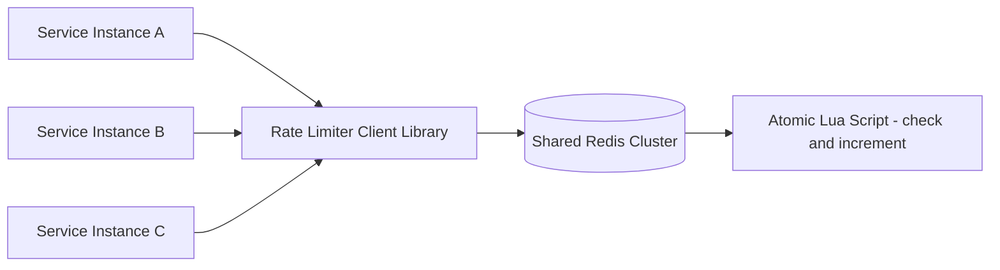
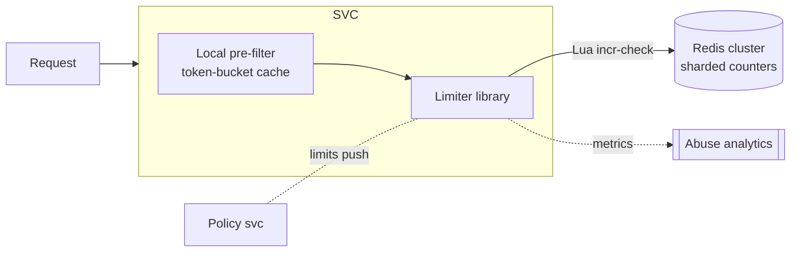
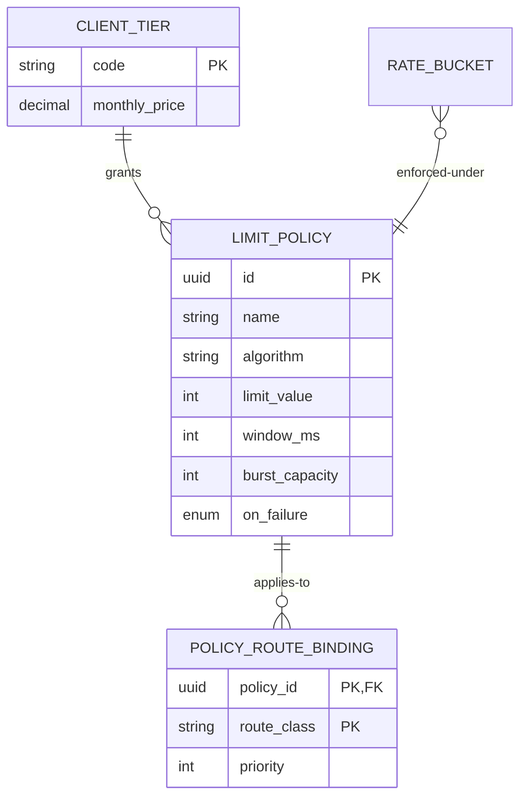

# Design a Distributed Rate Limiter Used Across Microservices

## Blogs and websites

## Medium

## Youtube

## Theory

### Important Subtopics

1. Limit dimensions & key derivation (per-key, per-user, per-IP, per-route, hierarchical)
2. Algorithm deep dive: fixed window, sliding window log, sliding window counter, token bucket, leaky bucket
3. Atomicity across a fleet: Lua scripts, single-slot semantics, hash-tags
4. Latency engineering on the hot path (< 5 ms p99 budget)
5. Fail-open vs fail-closed degradation policies
6. Burst tolerance vs average-rate enforcement
7. Sharding strategy and hot-client mitigation (split counters)
8. Client contract: headers, Retry-After, 429 semantics
9. Distributed-window edge cases (clock, boundary effects)
10. Local pre-filtering tiers (cheap in-process guards before the shared store)
11. Cost-based / weighted limits (counting bytes or compute units, not just requests)
12. Testing limiter correctness under concurrency

*(The existing subsections below cover problem statement, requirements, architecture, key design points, and trade-offs.)*

### Problem Statement

Design a rate limiter that enforces limits (per API key/user/service) consistently across many stateless microservice instances, so the aggregate limit is respected regardless of which instance handles a request.

### Functional Requirements

- Enforce a limit (e.g., N requests per window) per client key, shared across all service instances
- Support multiple algorithms (fixed window, sliding window, token bucket)
- Return remaining quota / retry-after to callers
- Support per-route or per-tier (free/paid) limit overrides

### Non-Functional Requirements

- **Scale**: Tens of thousands of requests/sec across hundreds of service instances
- **Latency**: Rate-limit check must add < 5ms p99 to the request path
- **Consistency**: Limit must hold globally even though checks happen from many instances concurrently
- **Availability**: The limiter must fail open or gracefully degrade if the shared store is unavailable, rather than taking down every service

### High-Level Architecture



### Key Design Points

- Use a shared, low-latency store (Redis) reachable by every service instance, with the check-and-increment logic executed as a single atomic Lua script to avoid race conditions between concurrent requests hitting different instances.
- Sliding-window-log or sliding-window-counter algorithms give smoother enforcement than fixed windows, which allow bursts at window boundaries; token bucket is preferred when short bursts should be tolerated.
- Shard the Redis keyspace by client key (consistent hashing across a Redis cluster) so no single node becomes a hotspot for a high-traffic client.
- On Redis unavailability, fail open (allow requests) with a circuit breaker and alert, rather than rejecting all traffic - protects overall availability at the cost of temporarily unenforced limits.

### Trade-offs

- A shared external store adds a network hop and a new dependency to every request path, but is the only way to get a globally consistent count across independently scaled instances; purely local (in-process) counters are faster but only enforce a per-instance limit, not a global one.
- Token bucket / sliding window counters trade a small amount of memory and precision for much smoother traffic shaping compared to fixed windows.

### Algorithm Comparison in Depth

| Algorithm | Mechanism | Burst behavior | Memory | Weakness |
|---|---|---|---|---|
| Fixed window | `INCR key:{windowStart}`, expire at window end | Up to 2× limit at boundaries (burst at end of one + start of next) | O(1) per client | Boundary burst artifact |
| Sliding window log | Store timestamp per request; count within trailing window | Smooth, exact | O(requests) — expensive at high rates | Memory + list ops |
| Sliding window counter | Weighted blend of current + previous fixed windows: `prev × overlap% + curr` | Near-smooth, approximate | O(1) | ±small error vs true sliding |
| Token bucket | Bucket holds B tokens refilled at R/s; request consumes 1 | Tolerates burst up to B while averaging R | O(1) state (tokens, lastRefill) | Needs refill math on read |
| Leaky bucket (queue form) | Requests queue; drain at constant rate | Output perfectly smooth | Queue depth bounded | Adds latency; rarely used for admission |

**Choosing**: token bucket when clients legitimately burst (mobile apps syncing); sliding-window counter when contractual "N per minute" precision matters without log costs. Most public APIs ship token buckets with disclosed capacity+refill.

### Key Derivation Hierarchy

Limits apply along multiple dimensions simultaneously:

```
per API-key        : contractual quota
per user           : behind shared keys (org of 50 devs)
per IP             : anonymous/unauthenticated surface
per route-class    : /auth stricter than /catalog
global             : protect backend from aggregate abuse
```

Enforcement evaluates the *most constrained* applicable bucket — a request may pass its key bucket but fail the route bucket. Key composition must be deterministic and cheap (`keyHash:routeClass:windowId`); deriving keys from untrusted headers (X-Forwarded-For without proxy sanitization) is a classic bypass vector.

### Hot-Client Sharding (Split Counters)

One celebrity key doing 500K req/min against a Redis shard ceiling (~100K ops/s):

```
Split into K sub-counters: {key}:s0 ... {key}:s(K-1)
Write path: pick sub-counter = random() % K, INCR it
Read/limit check: SUM(sub-counters) >= limit ?
  → over-admission by up to K-1 requests per check (bounded, acceptable)
Rebalance K upward as the key's rate grows
```

Trade-off documented explicitly: slight over-admission (≤K per decision) buys horizontal write scaling for pathological tenants.

### Cost-Based Limits

Modern APIs meter *units*, not requests: tokens consumed (LLM APIs), bytes transferred, compute-ms. The same atomic machinery applies — `INCRBY cost` instead of `INCR`, with estimated-cost reservation and true-cost reconciliation after processing (refund deltas). This generalization is where rate limiting meets billing.

---

## Characteristics

- **Correctness under concurrency is the product**: any race between check-and-consume across instances silently multiplies limits; atomic scripts aren't an optimization but the entire guarantee.
- **Hot-path resident**: every request pays limiter tax — hence single round-trip designs, connection pooling, and pre-computed keys.
- **Bounded staleness tolerance**: unlike caches, undercounting (letting extra requests through during store blips) has known, acceptable blast radius — enabling fail-open defaults.
- **Multi-dimensional policy engine**: real systems stack dimensions (user ⊂ org ⊂ IP ⊂ route), requiring ordered evaluation with short-circuits.
- **Observable fairness**: rejection metrics per tenant expose both abuse and misconfiguration; limiter dashboards are support-team front doors.
- **Stateless services, stateful enforcement**: the pattern exemplifies externalizing coordination so application pods stay cattle.

---

## Components

- **Limiter client library**
  *Purpose*: make correct usage universal across services. *Responsibilities*: key building, Lua invocation/connection pooling, circuit breaking around the store, local pre-filter tier (fast-reject obviously-over clients), header stamping helpers, metrics emission. *Relationship*: embeds in every service or gateway; talks to shared store only when pre-filter passes.

- **Shared atomic store (Redis cluster)**
  *Purpose*: hold counters/buckets with serial execution semantics. *Responsibilities*: script execution (single-threaded per slot), TTL management, replication for durability-of-state (approximate OK). *Sizing note*: ops/sec ≈ peak req/sec passing through; hot keys split per above.

- **Policy configuration service**
  *Purpose*: define limits per tier/route centrally. *Responsibilities*: CRUD with audit, versioning, push propagation to libraries via watch/poll (see config-management topic), emergency override levers (raise caps during incidents).

- **Metrics & abuse analytics**
  *Purpose*: observe enforcement health and attacker patterns. *Responsibilities*: rejection-rate time series per dimension, top-talkers, false-positive reviews, feeding WAF/blocklist automation.



---

## Patterns

- **Atomic increment-and-check (Lua)** — the core pattern:
  ```lua
  local current = redis.call('INCR', KEYS[1])
  if current == 1 then redis.call('PEXPIRE', KEYS[1], ARGV[2]) end
  return current - tonumber(ARGV[1])   -- ≤0 means allowed, returns remaining
  ```
  One round-trip decides allow/deny + remaining quota atomically. *When*: default for fixed/sliding-counter schemes.

- **Token bucket with lazy refill math**
  State `(tokens, lastRefillTs)` stored as hash; script computes elapsed×rate, tops up (capped at burst), then decrements. *Solves*: burst-tolerant smoothing without background jobs. *Used by*: Stripe-style APIs, Envoy's local/global rate limit filters.

- **Two-tier filtering**
  Cheap in-process token bucket synced periodically from central state catches 95% of decisions locally (~0 ms); central store consulted on boundary cases and for periodic reconciliation. *Trade-off*: slight over-admission windows vs massive latency/ops savings. This hybrid is how planet-scale limiters survive.

- **Circuit-breaker fail-open with alarms**
  Store unreachable → breaker opens → all requests pass with `X-RateLimit-Unavailable: true` header + metric spike paging operators. Documented, rehearsed, reversible. Fail-closed reserved for endpoints whose abuse directly burns money (LLM inference, SMS sends).

- **Retry-After choreography**
  Rejections carry exact reset times computed from window math — well-behaved clients then synchronize their retries instead of hammering. Turns the limiter from adversarial wall into coordination protocol.

---

## Benefits

- **Protects backends from cascading overload** — the difference between graceful degradation and outage chains during incidents.
- **Fair resource distribution among tenants** — one noisy integrator can't starve others.
- **Monetization primitive**: quotas define product tiers; the limiter literally enforces pricing.
- **Security layer**: brute-force login, scraping, enumeration attacks all throttled mechanically before hitting business logic.
- **Traffic insight**: rejection telemetry reveals client bugs, integration mistakes, and attack campaigns early.

---

## Pros

- Simple core primitive (atomic counter) scaling to enormous request volumes.
- Algorithm flexibility per endpoint without architectural churn.
- Degrades gracefully by design rather than collapsing.
- Client-cooperative operation possible via honest headers.

## Cons

- Adds a mandatory dependency to every request path — its failure modes become everyone's failure modes.
- Approximation inherent in distributed settings (split-counter over-admission, two-tier windows).
- Multi-dimension policies grow combinatorially complex without governance.
- Redis operational burden lands on platform teams permanently.
- Legitimate bursty clients suffer unless token buckets tuned generously — constant tuning dialogue.

---

## Challenges

- **Technical**: clock skew between app servers and store (use server-side timestamps exclusively); window boundary bursts (fixed-window); memory blowups from unique-IP floods (log algorithms) — mitigated by aggressive pre-filters.
- **Scalability**: celebrity-key hot shards (split counters); Redis ops ceiling at extreme QPS (pipeline batching, local tiers); thundering reconnection after store recovery (jittered reconnects).
- **Performance**: p99 budget erosion from chatty policies (evaluate most-selective dimension first); serialization overhead.
- **Reliability**: split-brain during Redis cluster resharding (hash-tag discipline); stale circuit state flapping.
- **Maintainability**: policy sprawl (hundreds of overrides nobody remembers); SDK version drift across language stacks.
- **Operational**: capacity planning around marketing events; runbooks for emergency quota raises; false-positive review workflow with support team.
- **Security**: bypass via identity rotation (many free keys) — solved by layered dimensions up to payment-instrument fingerprinting; timing attacks distinguishing near-limit states.

---

## Best Practices

- **Evaluate dimensions cheapest-and-most-selective first**, short-circuiting on first rejection.
- **Always return remaining/reset headers** even on success — cooperative clients smooth their own traffic.
- **Fail open by default, fail closed selectively** per endpoint's abuse economics; document each choice.
- **Jitter everything**: reconnects, sync intervals, pre-filter refill timers — synchronized herds amplify outages.
- **Set TTLs slightly beyond window** (2×) so late stragglers don't resurrect dead buckets.
- **Alert on rejection-ratio anomalies per tenant**, not just totals — misconfigurations look like attacks and vice versa.
- **Load-test the store at projected peak including hot-key simulations**; discover split thresholds before celebrities do.
- **Keep policy definitions versioned and reviewed** like code; emergency overrides logged with expiry timestamps.

---

## When to Use / Not Use

**Build/deploy distributed limiting when**: multiple stateless instances serve shared clients; contractual quotas exist; abuse economics justify protection; billing ties to usage.

**Skip when**: single-instance services (in-process bucket suffices); internal low-stakes tooling; batch-only workloads better served by queue-based admission control.

Alternatives/complements: gateway-level limiting (centralizes enforcement — see dedicated gateway topic); service-mesh sidecars for east-west; cloud provider native (API Gateway usage plans, WAF rules); queue-based load leveling for async workloads where rejecting is worse than delaying.

Decision inputs: QPS scale, latency budget, tenant structure, abuse threat model, existing infra (already running Redis? gateway? mesh?).

---

## Use Cases

- **Public API tiers (free/pro/enterprise)**
  *Problem*: monetize access fairly; prevent free-tier abuse degrading paid experience. *Solution*: token buckets per tier with disclosed capacity/refill; route-specific stricter buckets for expensive operations; upgrade-path messaging in 429 bodies. *Trade-off*: generous bursts improve DX but enable momentary abuse — capacity math balances both.

- **Login/OTP endpoint protection**
  *Problem*: credential stuffing and SMS-pumping fraud. *Solution*: fail-closed multi-dimensional limits (per-account, per-IP, per-device, global OTP budget), escalating lockouts, anomaly feeds to fraud systems. *Trade-off*: occasional legitimate-user friction accepted deliberately because abuse burns real money per message.

- **Internal service-to-service protection**
  *Problem*: retry storms during downstream brownouts cascade fleet-wide. *Solution*: mesh-level per-caller quotas with priority lanes; critical paths exempted via policy. *Trade-off*: added mesh config complexity vs eliminated retry-amplification class of incidents.

---

## High-Level Design

Full decision flow with degradation:

```mermaid
sequenceDiagram
    participant C as Caller
    participant S as Service instance
    participant PF as Local pre-filter
    participant RS as Redis (atomic script)
    participant CB as Circuit breaker

    C->>S: request (api-key K, route R)
    S->>PF: quick local check (synced bucket)
    alt clearly over local approximation
        PF-->>C: 429 + Retry-After
    else maybe allowed
        S->>CB: store healthy?
        alt healthy
            S->>RS: EVALSHA incr-check(keyHash:R:win, limit, ttl)
            RS-->>S: remaining / deny + resetAt
            S-->>C: 200 (+headers) or 429 (+Retry-After)
        else open (fail-open mode)
            S-->>C: forward request, X-RateLimit-Unavailable: true
            Note over S: alarm fired; metrics spike
        end
    end
```

Scaling: Redis cluster sharded by hash(keyHash); hot keys split into K sub-counters summed at read time; policy service fans out updates via pub/sub; local pre-filters resync every ~5 s with jittered offsets.

Failure handling: shard loss → affected keys fail-open (breaker per shard); whole-store loss → global breaker posture per policy; recovery → jittered reconnection avoids synchronized stampede, counts resume fresh (windows are ephemeral anyway).

---

## Deep Dive

- **Sliding-window-counter math**: `estimate = prevCount × (overlapMs/windowMs) + currCount`; error bounded by max(prev,curr) fluctuation — good enough for contracts when paired with small safety margins; zero per-request memory beyond two integers.
- **Token-bucket refill correctness**: compute refill lazily inside the script using store-side `TIME` (never trust client clocks): `tokens = min(capacity, tokens + (now-lastRefill)*rate)` then conditional decrement; store fractional tokens as milliscaled integers avoiding float nondeterminism.
- **Single-slot legality**: Redis Cluster executes multi-key scripts only within one slot — hence `{keyHash}` tags wrapping all related keys (counter + fence + metadata); violations produce CROSSSLOT errors that have embarrassed many production deploys.
- **Over-admission bounds**: split-K counters admit at most K−1 extra requests per decision instant; formalize this bound in design docs so security reviews can reason about worst-case exposure rather than hand-waving.
- **Observability**: per-dimension rejection ratios, script-execution latencies percentiles, breaker state transitions, split-factor drift alerts (hot key grew), header-honesty audits (sampled verification that returned reset matches actual window math).

---

## Data Modeling

Runtime state lives in Redis; control-plane metadata relational:



Redis runtime schema conventions:

```
rl:{<keyHash>}:<routeClass>:<windowId>   -> counter (fixed/sliding)
tb:{<keyHash>}:<routeClass>              -> hash{tokens_milli, last_refill_ms} (bucket)
fence:{<keyHash>}                        -> split-generation marker (resharding safety)
```

Choices: hashed identities never raw PII in keys; window IDs derived from epoch math (no date parsing in hot path); generation fences prevent old-split writes after rebalances; all runtime keys TTL'd ≥2× window. Lifecycle: policies soft-deleted with audit trail; buckets ephemeral by construction.

---

## Java and Spring Boot Implementation

Core limiter service (library-style, used across services):

```java
@Component
public class DistributedRateLimiter {

    private final ReactiveStringRedisTemplate redis;
    private final CircuitBreaker breaker;
    private final LocalPreFilter preFilter;

    private static final DefaultRedisScript<Long> TOKEN_BUCKET = new DefaultRedisScript<>("""
            local key = KEYS[1]
            local capacity = tonumber(ARGV[1])
            local refill_per_sec_milli = tonumber(ARGV[2])
            local requested = tonumber(ARGV[3])
            local now = tonumber(ARGV[4])
            local state = redis.call('hmget', key, 't', 'ts')
            local tokens = tonumber(state[1]) or capacity
            local last = tonumber(state[2]) or now
            tokens = math.min(capacity, tokens + ((now - last) * refill_per_sec_milli / 1000))
            if tokens < requested then
                redis.call('hmset', key, 't', tokens, 'ts', now)
                redis.call('pexpire', key, 120000)
                return -1
            end
            tokens = tokens - requested
            redis.call('hmset', key, 't', tokens, 'ts', now)
            redis.call('pexpire', key, 120000)
            return math.floor(tokens)
            """, Long.class);

    public Mono<LimitResult> tryConsume(String keyHash, String routeClass,
                                        Policy policy, int cost) {
        String key = "tb:{%s}:%s".formatted(keyHash, routeClass);
        long now = System.currentTimeMillis();
        return Mono.fromSupplier(() -> preFilter.quickCheck(keyHash, policy))
                .flatMap(allowed -> allowed ? Mono.just(LimitResult.ALLOWED)
                        : executeCentral(key, policy, cost, now));
    }

    private Mono<LimitResult> executeCentral(String key, Policy p, int cost, long now) {
        return breaker.execute(
            redis.execute(TOKEN_BUCKET, List.of(key),
                    List.of(String.valueOf(p.burstCapacity()),
                            String.valueOf(p.refillPerSecondMilli()),
                            String.valueOf(cost), String.valueOf(now)))
                .next()
                .map(v -> v >= 0 ? LimitResult.allowed(v) : LimitResult.denied()));
        // on store failure the breaker emits fail-open per policy
    }
}
```

Spring controller integration returning contract headers:

```java
@RestController
public class ApiController {

    private final DistributedRateLimiter limiter;

    @GetMapping("/api/v1/resource")
    public Mono<ResponseEntity<ResourceDto>> get(@RequestHeader("X-Api-Key") String apiKey) {
        return limiter.tryConsume(hash(apiKey), "resource", policyFor(apiKey), 1)
                .map(result -> {
                    var headers = new HttpHeaders();
                    headers.add("X-RateLimit-Limit", "600");
                    headers.add("X-RateLimit-Remaining", String.valueOf(result.remaining()));
                    if (!result.allowed()) {
                        headers.add("Retry-After", result.retryAfterSeconds());
                        return ResponseEntity.status(429).headers(headers).build();
                    }
                    return ResponseEntity.ok().headers(headers).body(fetchResource());
                });
    }
}
```

Notes: bucket state kept in integer milliseconds sidesteps float nondeterminism across Redis versions; the reactive pipeline never blocks event-loop threads; Resilience4j's CircuitBreaker supplies the fail-open transition with alert hooks. Testing: Testcontainers Redis driving concurrent consumers asserting hard-cap adherence (within documented over-admission bounds), breaker flip tests pausing the container mid-load, and clock-manipulation tests via injected `now`.

---

## Real-World Examples

- **Stripe** — publishes precise rate-limit mechanics (live-mode 100 read/100 write per second in test mode, burst allowances) demonstrating contract-first limiting; their escalation guidance teaches clients sustainable pacing.
- **GitHub API** — primary + secondary limits with per-endpoint budgets; GraphQL points-based *cost* limiting foreshadowing the weighted-limits generalization.
- **Envoy Proxy global rate limit service** — reference architecture matching this doc exactly: gRPC ratelimit service over shared store with descriptor hierarchies (dimensions).
- **Cloudflare** — edge-deployed limiting at tens-of-millions rps; their engineering posts cover the regional-vs-global trade-offs and mitigation ladders described here.

---

## Interview Preparation

### Interview Questions

**Beginner**

1. **Why can't each instance just keep its own counter?**
   With N instances behind a load balancer, per-instance counters enforce N× the intended limit collectively — clients exceeding quota distribute requests evenly and never see a rejection. Global correctness requires shared state or coordinated splitting.
2. **Fixed vs sliding window — the practical difference?**
   Fixed allows ~2× bursts straddling window edges; sliding blends adjacent windows (or tracks history) eliminating the artifact at tiny extra cost. Contracts sensitive to burst abuse choose sliding/token approaches.

**Intermediate**

3. **Walk through implementing token bucket atomically in Redis.**
   Hash stores `(tokens_milli, last_refill_ms)`; script reads TIME, computes lazy refill capped at capacity, conditionally decrements, persists, expires. Emphasize: server-side time source, integer math, single-script atomicity, hash-tag for cluster legality. Follow-up: why not background refill job? — per-key jobs don't scale; lazy computation does.
4. **Your limiter must add <5ms p99. Where does latency go and how do you shave it?**
   Budget: TLS already sunk; key derivation ~0; connection reuse/pipelining to store ~0.5–1 ms; Lua exec ~0.1 ms; network RTT dominates — colocate store with service tier, pool connections aggressively, add local pre-filter tier absorbing majority of checks entirely. Measure per-stage; regressions gate deploys.
5. **How do you protect against attackers rotating thousands of identities?**
   Layer dimensions beyond presented credentials: IP/ASN ranges, device fingerprints, behavioral velocity, payment-instrument linkage for signed-up abusers. Purely credential-keyed limits assume honest identity — attackers defeat that assumption first.

**Advanced**

6. **Design rate limiting for an LLM API charging per token.**
   Two-phase accounting: reserve estimated max tokens (script decrements estimate) → stream response → reconcile actual usage (refund delta atomically). Buckets denominated in tokens not requests; concurrent-stream caps separate from throughput budgets; fail-closed since abuse = direct GPU burn. Discuss estimation-error exploitation and why reservation closes it.
7. **During a Redis cluster reshard, some limiter keys move slots mid-window. What breaks?**
   In-flight scripts targeting moved slots get MOVED redirects (client handles, brief latency bump); worse: split-generation fences missing → old-shard writes orphaned, undercounting → temporary over-admission. Mitigations: hash-tags pinning related keys together, fence generations, scheduling reshard off-peak, accepting documented transient slack. Shows operational depth.

**Senior / system design**

8. **Design the full rate-limiting platform for a company: 200 services, public APIs, internal calls, per-org billing quotas.**
   Tiered architecture: CDN/edge (geo-distributed coarse shields) → gateway (contract enforcement, headers, per-tier buckets) → mesh/service-level (east-west protection, priority lanes) with shared policy service defining dimensions once; billing-grade metering decoupled via event firehose; per-tier fail-mode matrices; game-day drills. Trade-offs: consistency-vs-latency per layer, platform-team ownership boundaries.
9. **Argue against your own design: what does the shared-store approach lose versus fully-local limiting?**
   Concede: latency floor (~RTT), new dependency class, operational burden, approximation windows. Then show why alternatives fail requirements (local = N× limits) and how hybrids (two-tier) recapture most losses. Demonstrates steelmanning ability interviewers probe for at staff level.

### Common Mistakes

- Using client-supplied timestamps or clocks for window math — trivially gamed.
- Forgetting EXPIRE on counters → permanent zeroed buckets after restarts.
- Hash-tag omission in clusters → CROSSSLOT failures discovered mid-launch.
- Uniform fail-closed everywhere — one store hiccup becomes site-wide outage.
- Ignoring over-admission documentation until security asks about worst-case exposure.

### Expected discussion points

Algorithm selection reasoning per workload shape, atomicity mechanics, latency-budget arithmetic, degradation-policy maturity, layered identity defenses, and the honesty to quantify approximation bounds.

