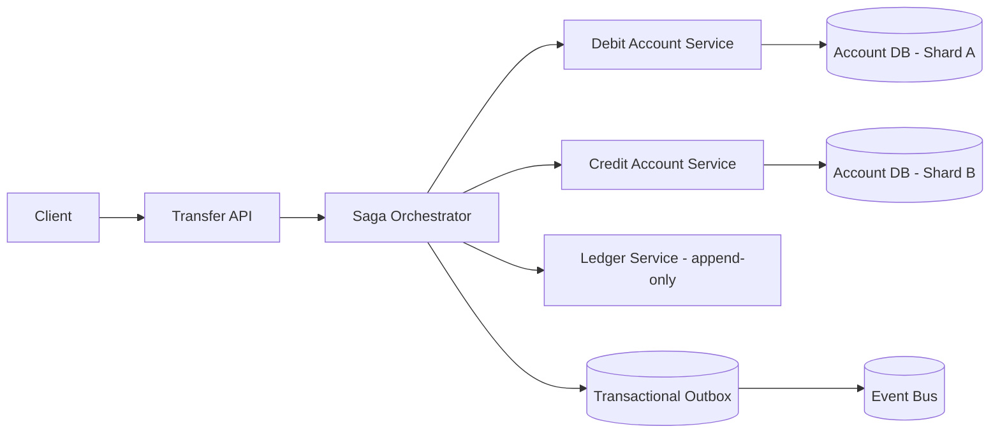
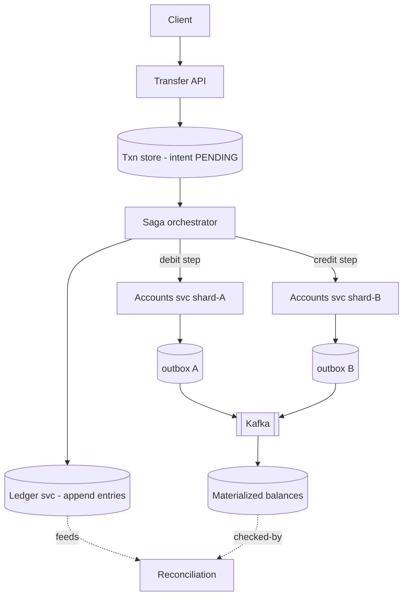
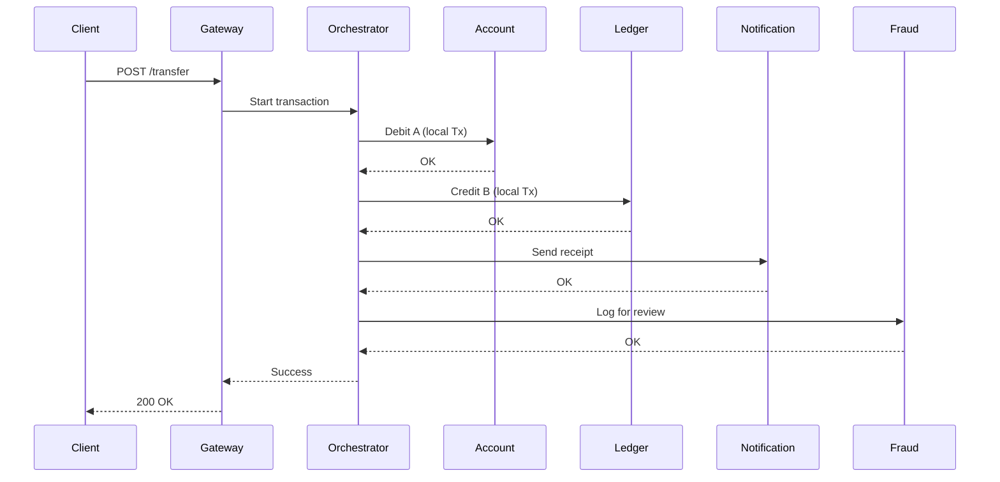
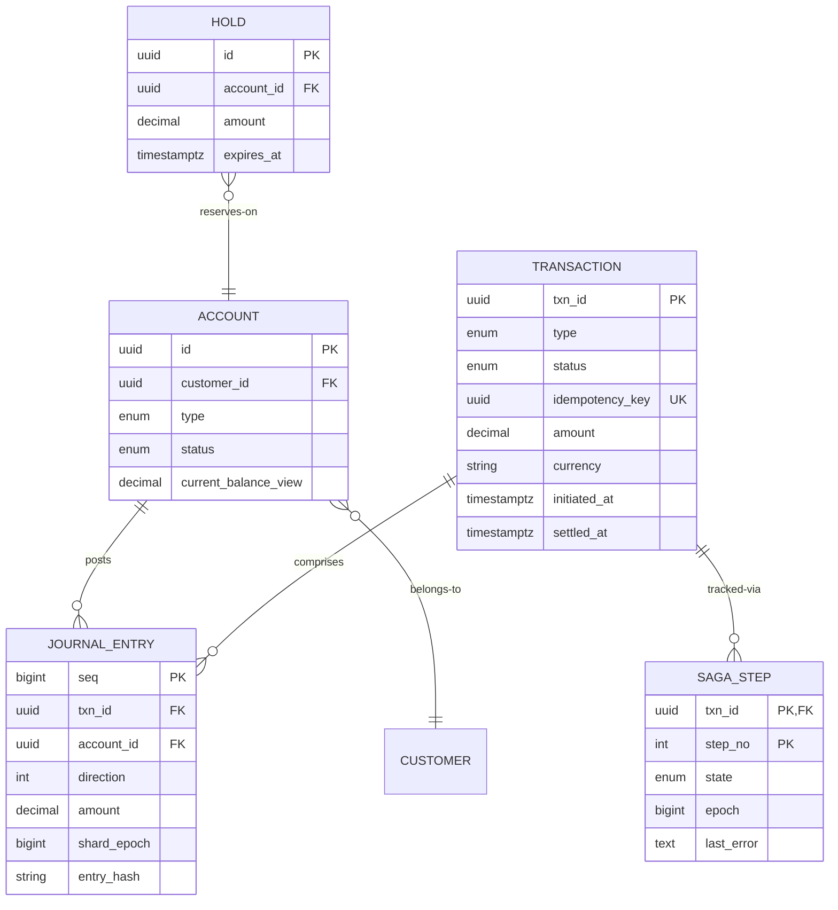

# Design a Distributed Transaction System for a Banking Application

## Blogs and websites

## Medium

## Youtube

## Theory

### What Is It?

A distributed transaction system in banking coordinates money movements across multiple accounts, services, or databases while preserving **monetary invariants**: debits always equal credits, no double-spending, and balances never go negative without explicit overdraft handling. In a microservices world, a single "transfer" may touch a user-balance service, a ledger service, a notification service, and an external payment provider — all of which must succeed or fail together atomically.

### Why Does It Exist?

Traditional ACID transactions (single-database `BEGIN/COMMIT`) guarantee atomicity and consistency. But in a distributed system — especially banking, where money moves across services and databases — no single database transaction can span multiple services. A distributed transaction system exists to coordinate these multi-service operations, ensuring that either all services commit the transfer or all roll back, preserving the conservation of money across the entire system.

### What Problem Does It Solve?

* **Atomicity across services**: a transfer must debit Account A and credit Account B — if the debit succeeds but the credit fails, money vanishes. The system must ensure all-or-nothing.
* **Distributed deadlock**: concurrent transfers involving the same accounts can deadlock (A→B and B→A) — the system must detect and resolve these.
* **Partial failure recovery**: if a service crashes mid-transfer, the system must determine the outcome and compensate (refund, reverse) without losing or duplicating the transaction.
* **Concurrency control on hot accounts**: celebrity accounts receive thousands of concurrent transfers — the system must serialize these without contention bottlenecks.
* **Audit and immutability**: financial transactions are legally required to be auditable and immutable — every state change must be append-only and traceable.
* **Regulatory compliance**: banking regulations (PCI-DSS, SOX, RBI) mandate specific consistency, retention, and audit requirements that generic transaction systems cannot meet.

### Important Subtopics

1. Money invariants: conservation (debits = credits), no double-spend, monotonic balances where required
2. Double-entry bookkeeping as the data model
3. ACID vs BASE for money movement; isolation levels and anomalies (lost update, write skew, read skew)
4. Distributed transactions: 2PC/3PC and why they fail operationally
5. Saga pattern: orchestrated vs choreographed; compensations design
6. Transactional outbox & CDC
7. Idempotency keys across every mutation
8. Concurrency control on hot accounts: row locks, optimistic retries, serialization via single-writer partitions
9. Ledger partitioning/sharding strategies
10. Reconciliation pipelines (internal vs external/Nostro)
11. Pending/in-flight states and user-facing semantics
12. Regulatory concerns: audit trails, immutability, retention

*(The existing subsections below cover problem statement, requirements, architecture, key design points, and trade-offs.)*

### Problem Statement

Design a system that executes money-movement transactions (transfers, payments) that may span multiple independently-owned services/databases (accounts service, ledger service, notification service) while guaranteeing that money is never created or destroyed, even under partial failures.


### Functional Requirements

- Transfer funds between two accounts, possibly owned by different services/shards
- Guarantee atomicity: either both the debit and credit apply, or neither does
- Support compensating actions if a later step in a multi-step transaction fails
- Provide a durable, queryable ledger of every transaction and its final state

### Non-Functional Requirements

- **Scale**: Millions of accounts, high transaction volume with strict correctness requirements
- **Consistency**: Strong consistency for the balance-affecting operations; no double-spend or lost updates
- **Durability**: Every transaction outcome must be durably recorded before being reported as final
- **Availability**: The system should not be a single point of failure; individual service outages should not corrupt balances

### High-Level Architecture



### Key Design Points

- Use the Saga pattern (orchestrated) instead of a classic two-phase commit across services: debit the source account, then credit the destination; if the credit step fails, run a compensating transaction to reverse the debit. This avoids holding distributed locks across services for the duration of the transfer.
- Record every step transactionally with the transactional outbox pattern: within the same local DB transaction that changes a balance, write an outbox event; a separate relay process publishes outbox events to the rest of the system, guaranteeing the state change and the event are never inconsistent with each other.
- Make every step idempotent (keyed by a unique transaction ID) so retries after a timeout/crash never double-debit or double-credit.
- Maintain an append-only ledger of debits/credits (double-entry bookkeeping) as the ultimate source of truth; account "balance" is a materialized view that can always be recomputed/reconciled from the ledger.

### Trade-offs

- Sagas trade strict two-phase-commit atomicity (which doesn't scale well and can deadlock across services) for eventual consistency with compensating actions - this means there is a brief window where money has left one account but hasn't yet arrived in the other, which must be handled carefully in what the system reports to the user (e.g., "transfer pending").
- Double-entry ledger plus materialized balances is more storage/compute than storing only a running balance, but makes every historical state auditable and reconciliation possible after any failure.

### The Double-Entry Foundation

Every money movement is recorded as **balanced journal entries**: a debit to one account and an equal credit to another. "Debit"/"credit" here mean sign conventions, not increase/decrease — the invariant is simply that every transaction's entries sum to zero:

```
Transfer ₹500: A → B
  entry 1: account=A, amount=-500
  entry 2: account=B, amount=+500   → sum = 0 ✓
```

Consequences that shape everything:

- **Money cannot be created/destroyed by construction** — any code path producing unbalanced entries is a bug detectable mechanically.
- Account balance = `SUM(entries WHERE account_id = ?)` — a materialized aggregate, always re-derivable.
- Append-only journals make history immutable: corrections are new reversing entries, never edits. This matches both audit law and event-sourcing discipline.

### Why Not 2PC Across Services

Two-phase commit locks resources between prepare and commit phases:

- A crashed coordinator leaves participants holding locks indefinitely (blocking protocol).
- One slow/hung service stalls every concurrent transfer touching shared rows.
- Availability suffers: any participant unreachable ⇒ transaction cannot resolve.

Banking-grade systems instead use **sagas** (per-service local ACID + compensation) with idempotency, accepting temporary intermediate states visible as "pending". Where a single logical database suffices (monolithic ledger), plain local transactions remain the correct answer — distribution is adopted only when scale/organizational boundaries force it.

### Isolation Anomalies That Lose or Duplicate Money

| Anomaly | Scenario | Defense |
|---|---|---|
| Lost update | Two transfers read balance 1000, both write 900 | Row-level locking (`SELECT ... FOR UPDATE`) or atomic conditional update |
| Write skew | Two on-call doctors each go off-call (analog: overdraft checks reading stale) | Serializable isolation / explicit locking |
| Double-spend | Same funds spent concurrently twice | Atomic conditional decrement `WHERE balance >= amount` |

The workhorse SQL pattern:

```sql
UPDATE accounts SET balance = balance - :amt
WHERE id = :src AND balance >= :amt;
-- affected-rows = 0 ⇒ insufficient funds, rollback
```

Single statement = atomic check-and-debit regardless of concurrency.

---

## Characteristics

- **Correctness trumps availability**: during serious incidents, rejecting new debits beats risking unbalanced books; the CAP choice is explicit and conservative.
- **Append-only truth**: journals never mutate; state is derived, versioned, replayable — enabling audits, reconciliation, and bug recovery via replay.
- **Idempotency everywhere**: every client call carries an idempotency key; every internal step keyed by `(txnId, step)` so at-least-once delivery yields exactly-once effects.
- **Eventual visibility, atomic reality**: users see "processing" states while saga steps complete; the underlying per-account operations remain strictly consistent locally.
- **Regulatory-grade auditability**: who/what/when/why recorded immutably with retention measured in years, not days.
- **Sharded but conservatively**: accounts shard by owner; cross-shard transfers route through sagas rather than spanning transactions.

---

## Components

- **Transfer API**
  *Purpose*: accept client intents. *Responsibilities*: authn/authz, schema validation, idempotency-key registration, initial persistence of transaction intent (PENDING), response contract with txnId. *Relationship*: sole entry point; delegates orchestration downstream.

- **Saga orchestrator**
  *Purpose*: drive multi-step flows to completion. *Responsibilities*: persisted state machine (step, status), invoking steps with retry/backoff, executing compensations on failure, crash-resume from last durable step, timeout policies. *Real-world*: Temporal-style durable execution or hand-built state tables.

- **Account services (sharded)**
  *Purpose*: own balances within shards. *Responsibilities*: atomic conditional debit/credit inside local transactions, outbox writes in same txn, hold/reservation management. *Relationship*: execute exactly one saga step each; never coordinate among themselves.

- **Ledger service**
  *Purpose*: append balanced journal entries. *Responsibilities*: enforce sum-zero invariant mechanically, sequence assignment, immutable storage with hash-chaining (tamper evidence), feed materialized-balance updaters.

- **Outbox relay + event bus**
  *Purpose*: publish committed state changes reliably. *Responsibilities*: tail outbox tables (or CDC), publish to Kafka with per-aggregate ordering, track publication state. *Guarantee*: events exist iff their transactions committed.

- **Reconciliation engine**
  *Purpose*: continuously prove internal consistency + match external systems (switches, correspondent banks). *Responsibilities*: sum-checks per shard, cross-system file matching (see settlement-reconciliation topic), drift alarms, auto-repair of known classes.



---

## Patterns

- **Orchestrated saga**
  *What*: central coordinator executes debit→ledger→credit with compensations (`reverse-debit`) pre-defined per step. *Solves*: distributed atomicity without distributed locks. *When*: multi-service money flows needing audit-visible progress. *Not when*: single-database scope (use local ACID). *Pros*: explicit flow, easy timeout/recovery semantics. *Cons*: coordinator is critical infra; compensation logic doubles surface area.

- **Transactional outbox**
  Covered in existing Key Design Points; the mechanism preventing dual-write anomalies between DBs and the bus. Relay idempotence via unique event IDs.

- **Atomic conditional mutation**
  Single-statement check-and-apply (`balance >= amt` guard) — converts concurrency correctness into one round-trip with zero application-level races.

- **Reservation/hold pattern**
  For long user flows (checkout): place hold (reserved amount) immediately, capture later, expire holds via sweeper. Prevents overspend without blocking funds invisibly forever.

- **Ledger hash chaining**
  Each journal batch includes hash(prev_batch, entries) — tampering breaks chains detectably. Cheap cryptographic insurance satisfying auditors.

- **Compensation ≠ rollback subtlety**
  Compensations are forward-recovering business actions (new reversing entries), not database rollbacks — they themselves must be idempotent, retryable, and audited. Interviewers probe this distinction regularly.

---

## Benefits

- **Provable conservation of money** via mechanical invariant checking rather than hope.
- **Complete forensic history** — every balance explainable from journal replay; disputes resolved from records, not memory.
- **Failure containment**: service crashes leave pending-but-resumable transactions, never half-mutated books.
- **Horizontal scaling** through sharding with well-understood cross-shard saga paths.
- **Regulatory readiness**: append-only + hash chains + retention satisfies examiners efficiently.

---

## Pros

- Saga+outbox+idempotency stack is battle-proven across fintech at massive scale.
- Local transactions keep each service's logic simple and fast.
- Reconciliation provides continuous assurance, catching bugs before customers do.

## Cons

- Compensation completeness burden: every new forward action needs a designed, tested reverse — easy to forget edge cases.
- Pending-state UX complexity across channels (app shows processing while core settles).
- Orchestrator availability becomes critical-path; needs HA investment.
- Eventual consistency windows complicate integrations expecting synchronous finality.
- Sharding strategy decisions (by customer vs currency vs product) constrain future products.

---

## Challenges

- **Technical**: exactly-once effects under at-least-once plumbing; hot-account contention (salary credits landing same instant); saga timeout-vs-slow-PSP ambiguity (did credit land? — reconcile before compensating!); timezone-aware settlement windows.
- **Scalability**: ledger write amplification (entries per txn × volume); balance recomputation costs (mitigated by incremental materialized views); Kafka partition planning for ordering guarantees per account.
- **Performance**: strict durability (synchronous replication, fsync policies) taxes latency deliberately — p99 targets set accordingly.
- **Reliability**: orchestrator failover mid-saga (state-table fencing); PSP partial-failure ambiguity windows; DR with RPO=0 for ledger tier.
- **Maintainability**: evolving transaction schemas across years of history (versioned envelopes); compensations kept in lockstep with features via review checklists.
- **Operational**: reconciliation break investigation workflows; regulatory reporting pipelines; capacity for festival/salary-day peaks (predictable 10× spikes).
- **Security/fraud**: authorization rigor (mTLS internally, step-up externally), velocity limits, real-time fraud scoring inline, segregation-of-duties enforced in tooling.

---

## Best Practices

- **Make the ledger the only writer of truth; balances are views** — teams violating this recreate corruption bugs annually.
- **Design compensations alongside every forward step** (definition-of-done checklist item), tested with fault injection.
- **Never compensate on ambiguous timeouts without first reconciling** with the external party — refunding money that actually arrived creates loss.
- **Use deterministic idempotency keys end-to-end** (client-supplied, server-validated uniqueness windows).
- **Keep saga steps small and independently resumable**; giant steps maximize crash-recovery pain.
- **Monitor invariants continuously** (sum-zero checks, balance-vs-ledger diffs) with paging alerts — silent drift precedes disasters.
- **Encrypt PII, tokenize account numbers**, enforce field-level access; log redaction verified by tests.
- **Load-test salary-day patterns** specifically: bursty credits to thousands of accounts sharing employer remitter rows.

---

## When to Use / Not Use

**Full distributed saga machinery when**: organizational boundaries genuinely split ownership (payments team vs core banking), scale exceeds single-writer capacity, or regulatory separation demands it.

**Prefer single-database ACID when**: one ledger service with sharded Postgres can hold the whole flow locally — dramatically simpler; distribute only proven-necessary boundaries.

Alternatives/complements: workflow engines (Temporal) replacing bespoke orchestrators; event sourcing frameworks for ledger-native designs; blockchain-flavored approaches only when multi-party distrust genuinely exists (rarely true internally).

Decision inputs: org topology, TPS targets, consistency-latency tolerance, regulatory regime, team's distributed-systems maturity.

---

## Use Cases

- **UPI-class instant retail transfers**
  *Problem*: millions of P2P transfers/day, sub-second expectations, NPCI switch dependency. *Solution*: saga per transfer (debit-local → switch request → credit-local), pending states bridging switch latency, reconciliation against NPCI files twice daily. *Trade-off*: brief pending windows universal; disputes handled via reversal sagas.

- **Payroll batch disbursement**
  *Problem*: employer sends 50K salaries simultaneously — thundering herd on bank-side systems. *Solution*: batch ingestion creating staged saga instances with controlled release rates, priority lanes for RTGS-size amounts, per-employee idempotency keyed by (batchId, employeeId). *Trade-off*: completion spread over minutes accepted for stability.

- **Card authorization with offline risk**
  *Problem*: network partitions must not enable double-spending. *Solution*: issuer-side reservation holds with strict TTLs, risk-based online-forcing thresholds, offline queue reconciliation prioritizing high-value reversals. *Trade-off*: occasional false declines under degraded connectivity — tuned against fraud-loss economics.

## Architecture

A distributed banking transaction system follows a **saga-orchestrator** architecture layered over microservices. Incoming requests hit an API gateway, then a **transaction orchestrator** that drives a sequence of local transactions across services (account, ledger, notification, fraud) via an **event bus** or direct RPC. Each service performs its local ACID commit independently; if any step fails, the orchestrator triggers **compensations** (reverse debit, send refund) for already-completed steps. An **audit service** appends immutable records for compliance, and a **reconciliation engine** periodically checks invariants (debits = credits) to detect drift.



| Component | Purpose | Responsibilities | Real-world Example |
|---|---|---|---|
| API Gateway | Entry point | Auth, rate limiting, routing | Kong, Ambassador |
| Transaction Orchestrator | Coordinate flows | Drive saga steps, handle rollbacks | Temporal, Cadence |
| Account Service | Manage balances | Debit/credit, balance check, overdraft | Core banking services |
| Ledger Service | Record transactions | Append-only double-entry, tamper-proof | Event-sourced ledgers |
| Notification Service | Inform users | Send emails, SMS, push | Twilio, FCM integrations |
| Event Bus | Decouple services | Event propagation, async processing | Kafka, RabbitMQ |
| Audit Service | Compliance trail | Immutable logging, export for regulators | Append-only audit store |
| Compensation Engine | Rollback failed txns | Generate and execute reversals | Saga compensations |

**Communication**: Orchestrator → services (synchronous RPC with timeouts). Event bus for async notifications and audit. All services write to their own local DB (transactional outbox pattern for event publishing).

**Scaling**: Partition by account_id hash; account service instances scaled per shard. Orchestrator scaled horizontally (stateless).

**Failure handling**: If any service fails, orchestrator triggers compensations for completed steps. If the orchestrator crashes, recovery from persisted state (event log). Timeouts at each step to prevent hanging.

## Design

### Design Considerations

* **Orchestration vs. choreography**: orchestration gives the orchestrator full visibility and control (easier to debug/reason about); choreography is more decentralized but harder to maintain complex flows. Banking prefers orchestration for regulatory traceability.
* **Saga granularity**: coarse-grained sagas (one per transfer) vs. fine-grained (one per step) — finer gives more recovery points but more overhead.
* **Compensation semantics**: compensations must be idempotent (a refund may be invoked multiple times); use a dedup table keyed by transaction_id + step.
* **Hot account contention**: accounts with high transaction volume need special handling (sharding, queue depth monitoring, batching).

### Key Decisions

| Decision | Options | Trade-off | Recommendation |
|---|---|---|---|
| Pattern | Saga orchestration | Centralized control, visible history | Banking (traceability required) |
| | Saga choreography | Decentralized, flexible | Microservices with simple flows |
| Locking | Pessimistic (row locks) | Simple, contention on hot keys | Low concurrency |
| | Optimistic (MVCC) | High concurrency, retry overhead | High throughput |
| | No locks (saga + compensation) | Highest throughput, complex | Banking (with reservations) |
| Consistency | Strong | ACID, available if single DB | Single service |
| | Eventual | Scalable, stale reads | Cross-service |

### Scalability Considerations

* Partition accounts by hash for parallel processing.
* Use eventual consistency for non-critical reads (e.g., balance display) with strong consistency for transaction processing.
* Horizontal scaling of orchestrator (stateless) and account service (sharded).

### Reliability Considerations

* **Reservations with TTLs**: For a transfer, lock/reserve funds in both accounts with a short TTL; if the saga doesn't complete, the reservation expires and funds are released. Prevents double-spending under network partitions.
* **Idempotency**: All saga steps and compensations must be idempotent. Use a deduplication table with (transaction_id, step_name) as the key.
* **Timeouts at every step**: Prevent indefinite hanging if a service is slow/dead.

### Performance Considerations

* **Hot account bottleneck**: Celebrity accounts receive thousands of concurrent transfers. Use queue-based processing with a per-account lock (Redis lock or DB advisory lock). Batch small transfers for the same account.
* **Two-phase commit overhead**: Sagas avoid 2PC but add compensation complexity. For single-service operations, use local ACID transactions.

### Security Considerations

* **Fencing tokens**: When a lock is acquired, the lock manager issues a token; the service includes it in its DB update. If the lock expires due to timeout, the token invalidates the update (prevents a slow/stale writer from corrupting data).
* **Network partition protection**: Never allow a debit without a credit. Reserve with strict TTLs; offline queue reconciliation prioritizes high-value reversals.
* **PII handling**: Transaction data must be encrypted at rest; access logs must be audit-trail-compliant.

### Maintainability Considerations

* **State machine diagrams**: Model each saga as an explicit state machine (e.g., using Temporal workflows) so the lifecycle is visible and testable.
* **Reconciliation jobs**: Run periodic invariant checks (total debits = total credits) with automated alerting on drift.
* **Audit trail**: Every state transition must be append-logged for regulatory compliance (SOX, PCI-DSS).

## High-Level Design

Saga execution with compensation path:


Scaling: account shards by customer hash; ledger cluster partitioned by time with hot window NVMe; orchestrators horizontally scaled over disjoint saga partitions (lease-based claim); Kafka topics keyed accountId for consumer ordering.

Failure handling: orchestrator crash → another instance resumes saga from durable state table (epoch-fenced); PSP ambiguity → saga parks in AWAITING_CONFIRMATION until reconciliation resolves; shard outage → affected transfers queue in PENDING with honest user messaging.

---

## Deep Dive

- **Hot-row mitigation math**: employer account receiving 50K debits/min serializes on its row (~1 ms each ⇒ ~60K/min ceiling — marginal!). Fixes: fan-out batching (aggregate N debits into one entry-set per flush), split virtual sub-accounts, or accept serialization with queue-backed pacing. Quantify before choosing.
- **Isolation level selection**: PostgreSQL REPEATABLE READ plus explicit row locks on mutated accounts covers classic anomalies without full SERIALIZABLE cost; SERIALIZABLE reserved for complex multi-row business rules (credit-limit evaluations). Document per-endpoint expectations — anomaly reviews are code-review checklist items.
- **Exactly-once composition**: at-least-once Kafka + idempotent consumers (dedupe table keyed eventId) + conditional SQL mutations = effectively-once pipeline; each layer's residual gap enumerated and covered by reconciliation sweeps (defense-in-depth, not any-single-guarantee).
- **Ledger physical layout**: entries partitioned monthly, clustered by account_id within partition; covering index `(account_id, seq)` serves balance-window scans; older partitions compressed columnar for archival analytics. Hash-chain per partition segment; chain heads anchored externally (published digests) for tamper evidence.
- **Observability**: per-step saga latency histograms, pending-age distributions (aging pendings = incidents forming), invariant-check results dashboard, compensation-rate alarms (>x% = systemic issue), end-to-end money-flow canaries executing tiny real transfers hourly.

## API Contract

The banking transaction system exposes REST/HTTP and gRPC endpoints for initiating transfers, checking status, and querying transaction history.

### Transfer API

| Method | Endpoint | Purpose |
|---|---|---|
| POST | `/api/v1/transfers` | Initiate a transfer |
| GET | `/api/v1/transfers/{id}` | Get transfer status |
| POST | `/api/v1/transfers/{id}/cancel` | Cancel a pending transfer |
| GET | `/api/v1/transfers` | List transfers (filtered) |
| GET | `/api/v1/accounts/{id}/balance` | Get account balance |

**POST /api/v1/transfers — Request Body**:
```json
{
  "transaction_id": "txn_abc123",
  "debit_account": "ACC_001",
  "credit_account": "ACC_002",
  "amount": 1500.00,
  "currency": "USD",
  "description": "Invoice payment",
  "reference_id": "INV-2024-001"
}
```

**POST /api/v1/transfers — Response (201 Created)**:
```json
{
  "transaction_id": "txn_abc123",
  "status": "PENDING",
  "debit_account": "ACC_001",
  "credit_account": "ACC_002",
  "amount": 1500.00,
  "currency": "USD",
  "created_at": "2024-06-14T10:30:00Z",
  "estimated_completion": "2024-06-14T10:30:05Z"
}
```

**GET /api/v1/transfers/{id} — Response (200 OK)**:
```json
{
  "transaction_id": "txn_abc123",
  "status": "COMPLETED",
  "debit_account": "ACC_001",
  "credit_account": "ACC_002",
  "amount": 1500.00,
  "currency": "USD",
  "created_at": "2024-06-14T10:30:00Z",
  "completed_at": "2024-06-14T10:30:04Z",
  "steps": [
    {"step": "DEBIT", "status": "SUCCESS", "timestamp": "2024-06-14T10:30:01Z"},
    {"step": "CREDIT", "status": "SUCCESS", "timestamp": "2024-06-14T10:30:03Z"},
    {"step": "NOTIFY", "status": "SUCCESS", "timestamp": "2024-06-14T10:30:04Z"}
  ]
}
```

### Pagination, Filtering, Sorting

**GET /api/v1/transfers**:
```
GET /api/v1/transfers?from=2024-06-01&to=2024-06-14&account=ACC_001&status=COMPLETED&sort=-created_at&limit=50&offset=100
```

| Parameter | Type | Description |
|---|---|---|
| from | date | Filter: created after this date |
| to | date | Filter: created before this date |
| account | string | Filter: debit or credit account |
| status | string | Filter: PENDING, COMPLETED, FAILED, CANCELLED |
| sort | string | `-created_at` (desc) or `created_at` (asc) |
| limit | int | Page size (max 100, default 20) |
| offset | int | Pagination offset |

### HTTP Status Codes

| Code | Meaning |
|---|---|
| 200 | Request successful |
| 201 | Transfer created |
| 202 | Transfer submitted (async processing) |
| 400 | Invalid request (malformed amount, same account) |
| 401 | Authentication required |
| 403 | Insufficient authorization |
| 404 | Account or transfer not found |
| 409 | Conflict (duplicate transaction_id, concurrent modification) |
| 429 | Too many requests |
| 503 | Service unavailable |

### Error Response

```json
HTTP/1.1 400 Bad Request
Content-Type: application/json
{
  "error": "invalid_request",
  "message": "debit_account and credit_account must be different",
  "field_errors": [
    {"field": "credit_account", "message": "must differ from debit_account"}
  ],
  "request_id": "req_98765"
}
```

### Idempotency

* The `transaction_id` field serves as an idempotency key. Re-submitting a transfer with the same `transaction_id` returns the existing transfer (200 OK) instead of creating a new one (201 Created).
* All mutating operations (transfer initiation, cancellation) are idempotent.
* The orchestrator dedupes by `transaction_id` via a deduplication table.

### Authentication & Authorization

* OAuth 2.0 with scope-based authorization: `scope: transfers:write` for initiating transfers, `scope: transfers:read` for querying.
* PKI/mTLS between internal services (orchestrator ↔ account service).
* All requests are logged with audit metadata (who, when, what, from where) for compliance.

### Versioning

* API versioning via URL path (`/api/v1/`, `/api/v2/`) — v1 supports single transfer; v2 may add batch transfers.
* Internal gRPC APIs use proto3 with field numbers reserved for backward compatibility.

---

## Data Modeling



Choices: journal PK `seq` globally ordered (ledger service assigns via batching allocator); `(account_id, seq)` index serves statement queries; `direction` ±1 with positive amount keeps sums simple; balance view denormalized for read speed but *always* subordinate to SUM(entries) — nightly verification enforces this hierarchy; holds TTL-indexed for sweeper; saga steps carry epoch fencing for orchestrator failovers.

---

## Java and Spring Boot Implementation

Atomic transfer within a shard:

```java
@Service
public class AccountService {

    private final JdbcTemplate jdbc;
    private final OutboxWriter outbox;

    @Transactional
    public void debit(UUID txnId, UUID accountId, BigDecimal amount) {
        int applied = jdbc.update("""
            UPDATE accounts SET balance = balance - ?, updated_at = now()
            WHERE id = ? AND status='ACTIVE' AND balance >= ?
            """, amount, accountId, amount);
        if (applied == 0) {
            throw new InsufficientFundsException(accountId);
        }
        jdbc.update("""
            INSERT INTO journal_entries(txn_id, account_id, direction, amount)
            VALUES (?, ?, -1, ?)
            """, txnId, accountId, amount);
        outbox.write(new FundsDebited(txnId, accountId, amount)); // same tx
    }

    /** Idempotent credit: replays after crash are no-ops. */
    @Transactional
    public boolean creditIfAbsent(UUID txnId, UUID accountId, BigDecimal amount) {
        Integer inserted = jdbc.queryForObject("""
            WITH ins AS (
              INSERT INTO processed_credits(txn_id, account_id)
              VALUES (?, ?)
              ON CONFLICT DO NOTHING
              RETURNING 1)
            SELECT count(*) FROM ins
            """, Integer.class, txnId, accountId);
        if (inserted == null || inserted == 0) return false; // already credited
        jdbc.update("UPDATE accounts SET balance = balance + ? WHERE id = ?", amount, accountId);
        jdbc.update("""
            INSERT INTO journal_entries(txn_id, account_id, direction, amount)
            VALUES (?, ?, 1, ?)""", txnId, accountId, amount);
        outbox.write(new FundsCredited(txnId, accountId, amount));
        return true;
    }
}
```

Saga orchestrator step execution with fencing:

```java
@Service
public class TransferSaga {

    private final SagaStateRepository state;
    private final AccountClient accounts;

    /** Resumable: safe to invoke repeatedly for same txn (crash recovery). */
    public void advance(UUID txnId) {
        var saga = state.findWithLock(txnId);           // SELECT ... FOR UPDATE
        switch (saga.phase()) {
            case PENDING_DEBIT -> {
                try {
                    accounts.debit(saga.debitRef(), saga.from(), saga.amount());
                    state.transition(txnId, Phase.PENDING_CREDIT);
                    advance(txnId);                      // continue synchronously
                } catch (InsufficientFundsException e) {
                    state.fail(txnId, "INSUFFICIENT_FUNDS");
                }
            }
            case PENDING_CREDIT -> {
                boolean firstTime = accounts.creditIfAbsent(txnId, saga.to(), saga.amount());
                if (!firstTime) { /* replay after crash — fine */ }
                state.complete(txnId);
            }
            case COMPENSATING -> accounts.reverseDebitIfAbsent(txnId, saga.from(), saga.amount());
            default -> { /* terminal */ }
        }
    }
}
```

Controller with idempotency handling:

```java
@RestController
@RequestMapping("/api/v1/transfers")
public class TransferController {

    private final TransferService transfers;

    @PostMapping
    public ResponseEntity<TransferResult> create(
            @Valid @RequestBody TransferRequest req,
            @RequestHeader("Idempotency-Key") String idemKey,
            Authentication caller) {
        var result = transfers.createOrReturnExisting(req, idemKey, caller.getName());
        return result.pending()
                ? ResponseEntity.accepted().body(result)
                : ResponseEntity.ok(result);
    }

    @GetMapping("/{txnId}")
    public TransferStatus status(@PathVariable UUID txnId, Authentication caller) {
        return transfers.statusForCaller(txnId, caller.getName()); // authz: owner-only
    }
}
```

Notes: the conditional-update debit makes insufficient-funds handling race-free; credit idempotency rides a unique constraint so saga replays can't double-pay; saga resumability means orchestrator crashes cost nothing beyond lease-expiry delay; production layers Resilience4j around inter-service calls, adds Testcontainers fault-injection tests (kill mid-step, assert convergence), and wires reconciliation consumers off the Kafka events.

---

## Real-World Examples

- **UPI ecosystem (NPCI)** — two-phase-ish switch model with mandatory reversal windows; banks implement precisely the saga+reconciliation stack above behind it.
- **Stripe** — documented their migration to a ledger-centric double-entry core ("balance-affecting" APIs backed by journals); validates ledger-as-truth industrially.
- **Plaid-adjacent core banking (Thought Machine Vault)** — cloud-native cores built explicitly on event-sourced ledgers with derived balances; the architecture described here is essentially their sales pitch.
- **Settlement at exchanges (NSE/Clearing corps)** — netting runs are batch sagas over journals with regulatory reconciliation cadences.

---

## Interview Preparation

### Interview Questions

**Beginner**

1. **Why double-entry instead of just updating balances?**
   Balanced journal entries make money-conservation mechanical — every transaction self-evidences validity, histories stay immutable, balances become derivable aggregates. Balance-only updates lose the ability to prove anything after the fact.
2. **What does idempotency protect against here?**
   Retries: client resends after timeout, orchestrator resumes post-crash, message buses redeliver. Without idempotency each retry risks duplicate debits/credits — i.e., losing or minting money.

**Intermediate**

3. **Walk through what happens when the credit step fails after debit succeeded.**
   Saga transitions to compensating phase; orchestrator invokes reverse-debit (new reversing journal entries, idempotent by txnId); user sees failed-transfer with funds restored; reconciliation verifies no orphaned amounts. Emphasize compensation-as-forward-action, not DB rollback.
4. **How do you prevent two concurrent transfers overdrawing one account?**
   Atomic conditional mutation: `UPDATE ... SET balance = balance - x WHERE balance >= x` — second transfer's guard fails at row-lock moment. Follow-ups: hot-row throughput ceiling, mitigations (batching/sub-accounts).
5. **Why is the outbox pattern necessary — why not just publish to Kafka after commit?**
   Publish-after-commit loses events on crash between commit and publish; publish-before-commit emits phantoms on rollback. Outbox ties event existence atomically to state change via the same local transaction; relay bridges to the bus with its own retry/idempotency story.

**Advanced**

6. **Design cross-currency transfer with FX rate locking.**
   Saga grows: debit source (INR) → reserve FX quote (rate-lock TTL) → execute conversion leg (external dealer/PSP) → credit destination (USD) with converted amount; compensations unwind in reverse order with quote-idempotency; ambiguity on conversion leg parks saga pending reconciliation with dealer confirmations. Discuss exposure windows and why quote-TTL bounds them.
7. **Your invariant checker reports sum≠0 for one shard. Response playbook?**
   Freeze affected accounts' outward movements (holds), snapshot evidence (hash-chained exports), bisect recent batches/journals, replay-from-ledger rebuild of balances isolating whether view-drift vs journal-corruption, engage audit/comms early. Emphasize: never "fix silently" — regulators and trust demand documented remediation.

**Senior / system design**

8. **Architect UPI-scale banking backend end-to-end.**
   Cover: entry validation + fraud scoring inline, saga orchestration at switch-latency budgets (sub-second acks via async completion), sharded account services with hot-account strategies, ledger tier sized for peak TPS × entries-per-txn, reconciliation against NPCI files with break workflows, DR posture (RPO=0 metro replication for money tiers, RTO minutes), compliance artifacts (audit trails, retention). Trade-offs named at each layer — latency vs certainty, availability vs conservatism.
9. **When would you choose 2PC anyway?**
   Narrow cases: homogeneous databases with stable participants, short-lived transactions, low contention, strong tooling support (Xa within one app-server estate) — and even then usually only as transition-state tech. Senior signal: knowing 2PC's blocking-prepared failure mode cold and why industry fled it for sagas at scale.

### Common Mistakes

- Balances updated without journal entries ("just this once" optimizations) — invariant blindness follows.
- Compensations firing on ambiguous timeouts without external confirmation — creates real money loss.
- Idempotency scoped too narrowly (per-request instead of per-business-intent).
- Trusting materialized balances as truth during incident triage instead of replaying journals.
- Timezone-naive settlement windows breaking daily cutoffs twice a year.

### Expected discussion points

Conservation-invariant mechanics, saga-vs-2PC economics with concrete failure stories, idempotency layering, reconciliation as continuous proof, and regulatory-driven design constraints (audit, retention, segregation).
