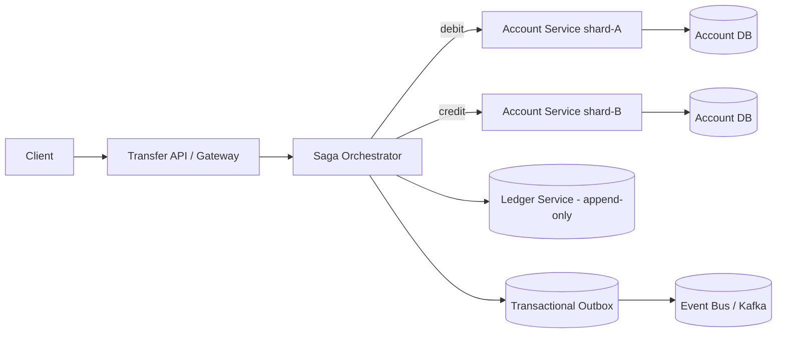
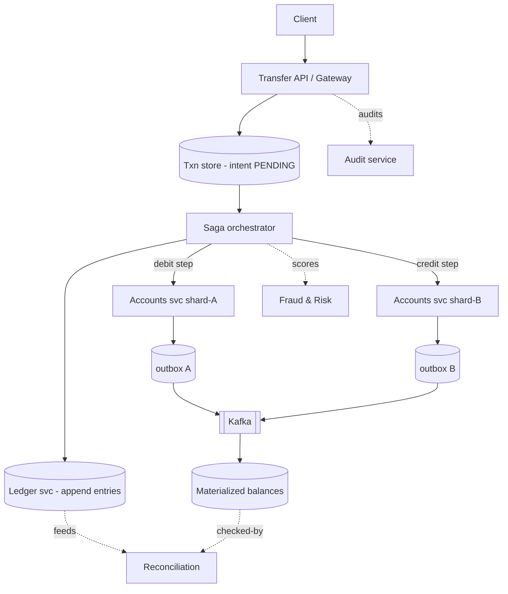
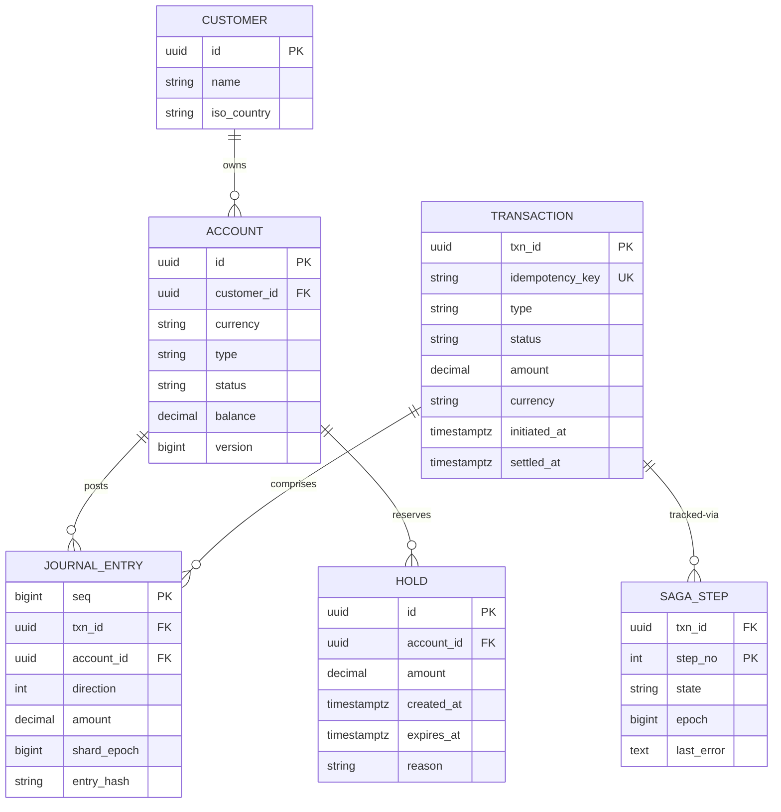
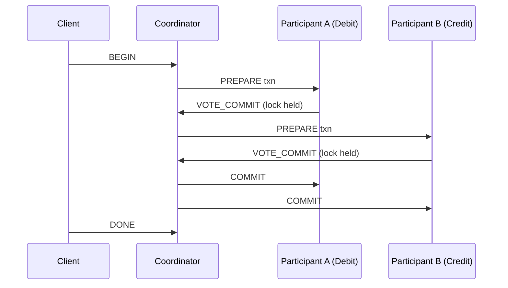
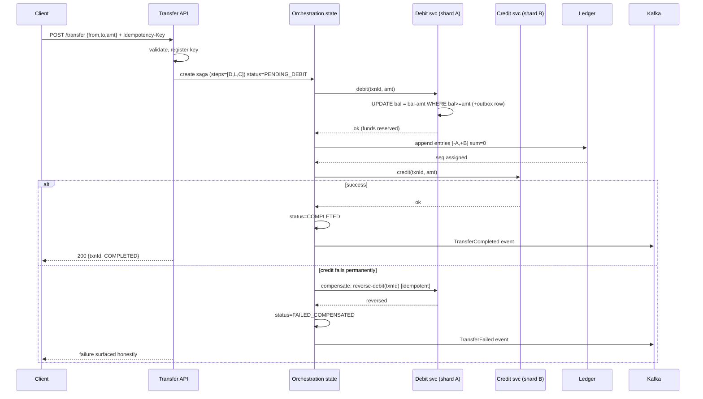
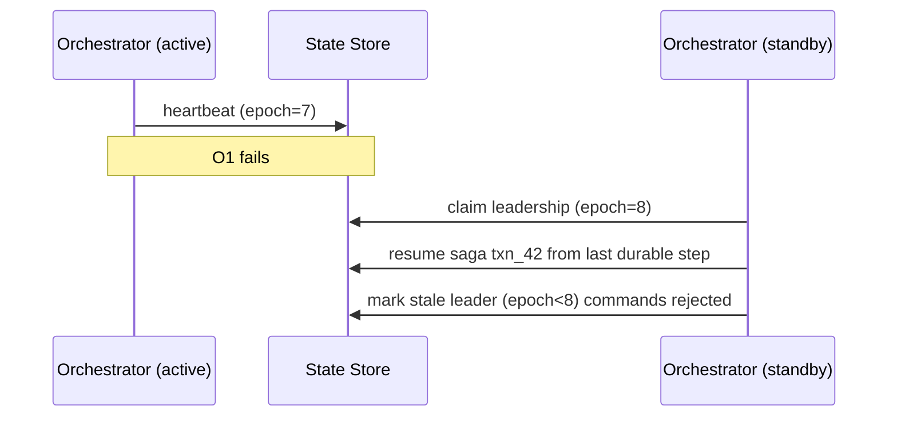
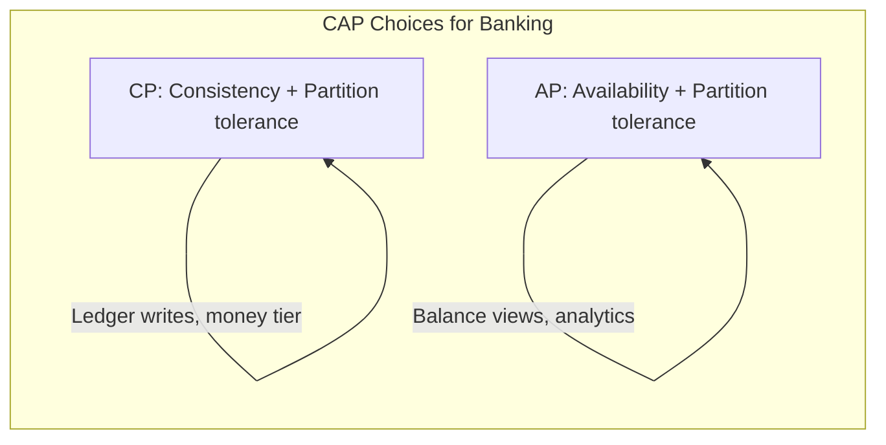
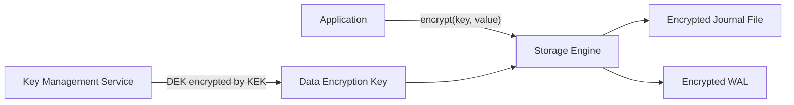
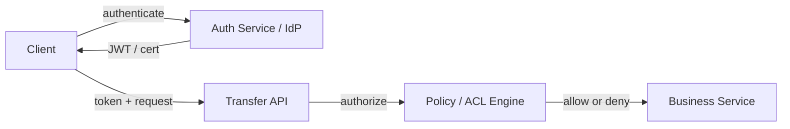
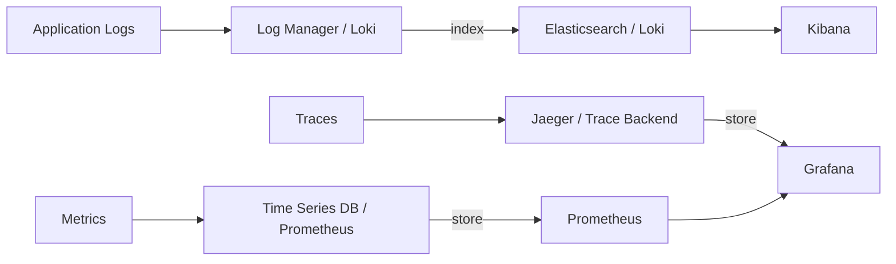

# Design a Distributed Transaction System for a Banking Application

> Design a distributed transaction system for banking that moves money across multiple services and databases while preserving monetary invariants: debits always equal credits, no double-spending, and balances never go negative without explicit overdraft handling.

## Blogs and websites

- [Stripe Atlas — Building a double-entry ledger](https://stripe.com/atlas/blog/double-entry-bookkeeping)
- [Martin Fowler — Saga pattern](https://martinfowler.com/articles/sagas.html)
- [Google Cloud — Two-phase commit and the XA protocol](https://cloud.google.com/architecture/two-phase-commit)

## Medium

- [The Hardest Parts of Distributed Transactions — by Ben Stopford](https://medium.com/@benstopford/the-hardest-part-of-distributed-transactions-4c0b8ac8c9d9)

## Youtube

- [GOTO 2014 — Keynote: Distributed Transactions - Pat Helland](https://www.youtube.com/watch?v=crPIzqsAajQ)
- [Designing Data-Intensive Applications — Distributed Transactions](https://www.youtube.com/watch?v=j4KlaDhdjZA)

---

## Theory

### Topics Covered

1. [Introduction / Problem Statement](#introduction--problem-statement)
2. [Characteristics](#characteristics)
3. [Pros](#pros)
4. [Cons](#cons)
5. [Use Cases](#use-cases)
6. [Components](#components)
7. [Architectural Patterns](#architectural-patterns)
8. [Benefits](#benefits)
9. [Challenges](#challenges)
10. [Best Practices](#best-practices)
11. [When to Use / When Not to Use](#when-to-use--when-not-to-use)
12. [Data Model and API](#data-model-and-api)
13. [Transaction Patterns and Ledger Design](#transaction-patterns-and-ledger-design)
14. [Replication Strategies](#replication-strategies)
15. [Failure Detection and Membership](#failure-detection-and-membership)
16. [High Availability and Scalability](#high-availability-and-scalability)
17. [Performance and Optimization](#performance-and-optimization)
18. [CAP Theorem and Consistency Trade-offs](#cap-theorem-and-consistency-trade-offs)
19. [Encryption and Key Management](#encryption-and-key-management)
20. [Authentication and Authorization](#authentication-and-authorization)
21. [Security Threats and Mitigations](#security-threats-and-mitigations)
22. [Observability and Logging](#observability-and-logging)
23. [Real-World Implementations](#real-world-implementations)
24. [Java and Spring Boot Implementation Guide](#java-and-spring-boot-implementation-guide)
25. [Interview Questions and Answers](#interview-questions-and-answers)

---

### Introduction / Problem Statement

A distributed banking transaction system coordinates money movements across multiple accounts, services, or databases while preserving **monetary invariants**: debits always equal credits, no double-spending, and balances never go negative without explicit overdraft handling. In a microservices world, a single "transfer" may touch a user-balance service, a ledger service, a notification service, and an external payment provider — all of which must succeed or fail together atomically.



*The transfer lifecycle: the API registers the intent, the orchestrator drives debit then credit as local ACID transactions, the ledger records balanced journal entries, and the outbox relays events only after the local DB commits.*

Traditional ACID transactions (single-database `BEGIN/COMMIT`) guarantee atomicity and consistency. But in a distributed system — especially banking, where money moves across services and databases — no single database transaction can span multiple services. A distributed transaction system exists to coordinate these multi-service operations, ensuring that either all services commit the transfer or all roll back, preserving the conservation of money across the entire system.

The problem has six sharp edges that every solution must address:

- **Atomicity across services**: a transfer must debit Account A and credit Account B — if the debit succeeds but the credit fails, money vanishes. The system must ensure all-or-nothing.
- **Distributed deadlock**: concurrent transfers involving the same accounts can deadlock (A→B and B→A) — the system must detect and resolve these.
- **Partial failure recovery**: if a service crashes mid-transfer, the system must determine the outcome and compensate (refund, reverse) without losing or duplicating the transaction.
- **Concurrency control on hot accounts**: celebrity accounts receive thousands of concurrent transfers — the system must serialize these without contention bottlenecks.
- **Audit and immutability**: financial transactions are legally required to be auditable and immutable — every state change must be append-only and traceable.
- **Regulatory compliance**: banking regulations (PCI-DSS, SOX, RBI) mandate specific consistency, retention, and audit requirements that generic transaction systems cannot meet.

---

### Characteristics

Each point below explains a property that distinguishes a banking-grade distributed transaction system from a generic one.

- **Correctness trumps availability**: during serious incidents, rejecting new debits beats risking unbalanced books; the CAP choice is explicit and conservative.
- **Append-only truth**: journals never mutate; state is derived, versioned, replayable — enabling audits, reconciliation, and bug recovery via replay.
- **Idempotency everywhere**: every client call carries an idempotency key; every internal step is keyed by `(txnId, step)` so at-least-once delivery yields exactly-once effects.
- **Eventual visibility, atomic reality**: users see "processing" states while saga steps complete; the underlying per-account operations remain strictly consistent locally.
- **Regulatory-grade auditability**: who, what, when, and why are recorded immutably with retention measured in years, not days.
- **Sharded but conservatively**: accounts shard by owner; cross-shard transfers route through sagas rather than spanning transactions.
- **Strong local invariants**: each shard enforces its own balance constraints (no negative balance, sum-zero journal) inside local ACID transactions.
- **Deterministic reconciliation**: the system can prove to itself and to auditors, continuously, that debits equal credits at every layer.
- **Defense in depth**: cryptography, network segmentation, rate limiting, and real-time fraud scoring are layered, not bolted on.

---

### Pros

- **Provable conservation of money** via mechanical invariant checking rather than hope.
- **Complete forensic history** — every balance explainable from journal replay; disputes resolved from records, not memory.
- **Failure containment**: service crashes leave pending-but-resumable transactions, never half-mutated books.
- **Horizontal scaling** through sharding with well-understood cross-shard saga paths.
- **Regulatory readiness**: append-only + hash chains + retention satisfies examiners efficiently.
- **Sagas scale where 2PC stalls**: local ACID per step avoids distributed locks and their deadlock/stall risks.
- **Replayability for recovery**: the immutable ledger lets operators rebuild any derived view after a bug.
- **Composability**: sagas compose; a transfer is itself a step inside a larger payment workflow.

---

### Cons

- **Compensation completeness burden**: every new forward action needs a designed, tested reverse — easy to forget edge cases.
- **Pending-state UX complexity** across channels (app shows "processing" while core settles).
- **Orchestrator availability becomes critical-path**; needs HA investment.
- **Eventual consistency windows** complicate integrations expecting synchronous finality.
- **Sharding strategy decisions** (by customer vs currency vs product) constrain future products.
- **Operational surface grows**: outbox relays, reconcilers, sweeper jobs, and hash-chain verifiers are all production concerns.
- **Debugging is temporal**: root-cause analysis must reconstruct a saga's timeline across services.

---

### Use Cases

Detailed real-world scenarios are described for each use case.

- **Instant retail transfers (UPI-style)**
  Millions of peer-to-peer transfers per day with sub-second expectations and a switch dependency. Solution: a saga per transfer (debit-local → switch request → credit-local), pending states bridging switch latency, and reconciliation against switch files twice daily. Trade-off: brief pending windows are universal; disputes are handled via reversal sagas.

- **Payroll batch disbursement**
  An employer sends tens of thousands of salaries simultaneously — a thundering herd on bank-side systems. Solution: staged saga instances with controlled release rates, priority lanes for large amounts, per-employee idempotency keyed by `(batchId, employeeId)`. Trade-off: completion is spread over minutes, which is accepted for stability.

- **Card authorization with offline risk**
  Network partitions must not enable double-spending. Solution: issuer-side reservation holds with strict TTLs, risk-based online-forcing thresholds, and an offline queue reconciliation that prioritizes high-value reversals. Trade-off: occasional false declines under degraded connectivity, tuned against fraud-loss economics.

- **Cross-border remittance**
  Money moves in one currency and lands in another, with an FX leg and an external dealer. Solution: debit source → reserve FX quote (rate-lock TTL) → execute conversion → credit destination with converted amount, with compensations unwinding in reverse order. Trade-off: exposure windows bounded by the quote TTL.

---

### Components

A distributed banking transaction system is composed of several cooperating components, each owning a clear responsibility.

- **API / Gateway**
  *Purpose*: the single entry point for every money-movement intent. *Responsibilities*: authenticate the caller, authorize the action (scope-based), validate the request schema, register the idempotency key, persist the transaction intent as `PENDING`, and return a `txnId` and response contract. *Relationship*: it never mutates balances directly; it delegates orchestration downstream. *Real-world*: Kong or Ambassador fronting a fleet of Java services.

- **Saga Orchestrator**
  *Purpose*: drive multi-step flows to completion. *Responsibilities*: persist a durable state machine (current step, status, epoch), invoke each step with retry/backoff, execute compensations on failure, crash-resume from the last durable step, and enforce timeout policies. *How it works*: each step is invoked over local transactions in each service; progress is checkpointed before each invocation so a crash never loses work. *Real-world*: Temporal-style durable execution or hand-built state tables.

- **Account Services (sharded)**
  *Purpose*: own balances within shards. *Responsibilities*: perform atomic conditional debit/credit inside local transactions, write to the outbox in the same transaction, and manage hold/reservation state. *Relationship*: execute exactly one saga step each; they never coordinate among themselves. *Real-world*: core banking microservices partitioned by customer or account range.

- **Ledger Service**
  *Purpose*: append balanced journal entries. *Responsibilities*: enforce the sum-zero invariant mechanically, assign sequence numbers, store immutable records with hash-chaining (tamper evidence), and feed materialized-balance updaters. *Real-world*: event-sourced journals like those powering Stripe's balance APIs.

- **Outbox Relay + Event Bus**
  *Purpose*: publish committed state changes reliably. *Responsibilities*: tail outbox tables (or read CDC), publish to Kafka with per-aggregate ordering, and track publication state. *Guarantee*: events exist if and only if their transactions committed. *Real-world*: Debezium connectors publishing to Kafka.

- **Reconciliation Engine**
  *Purpose*: continuously prove internal consistency and match external systems. *Responsibilities*: per-shard sum checks, cross-system file matching against switches and correspondent banks, drift alarms, and auto-repair of known classes. *Real-world*: settlement engines that reconcile GL against bank statements.

- **Fraud / Risk Service**
  *Purpose*: score transactions in real time. *Responsibilities*: velocity limits, anomaly detection, AML screening, and step-up authentication for high-value flows. *Relationship*: the orchestrator consults risk before committing high-value legs. *Real-world*: Feedzai, Sift, or proprietary neural models.

- **Audit Service**
  *Purpose*: satisfy compliance. *Responsibilities*: write immutable, retention-managed logs of every state transition and access, and export tamper-evident reports for regulators. *Real-world*: append-only object stores with WORM retention.



*End-to-end component relationships: the API persists intent and hands off to the orchestrator, which drives sharded account services whose outbox events feed Kafka and materialized balances, while the ledger feeds reconciliation and the fraud service scores each leg.*

---

### Architectural Patterns

Banking systems compose several architectural patterns; each fits a different subsystem.

- **Leader-based replication**
  One node accepts writes and replicates them to followers. Reads can be served by followers or only by the leader. This pattern gives strong consistency and simple conflict handling. Used for the ledger tier, where a single writer serializes journal appends.

- **Leaderless / quorum replication**
  Any replica can accept writes; clients write to a quorum and read from a quorum. If `W + R > N`, reads and writes overlap. Used for read-heavy, eventually-consistent views such as balance displays where stale reads are acceptable.

- **Multi-region active/passive**
  A primary region owns writes; secondary regions hold synchronous or asynchronous replicas and take over on failover. Required for disaster recovery with bounded data loss.

- **Consistent hashing ring**
  Accounts are placed on a hash ring; each account maps to the first owning node clockwise. This minimizes data movement when nodes are added or removed and underpins account sharding.

- **Event-driven choreography**
  Services react to events rather than being commanded by a central orchestrator. Useful for loose-coupling steps like notification and analytics, but harder to reason about for money-critical paths.

- **Transactional outbox**
  Within the same local DB transaction that changes a balance, write an outbox event. A separate relay publishes events to the bus, guaranteeing state change and event are never inconsistent.

- **Atomic conditional mutation**
  A single-statement check-and-apply (`balance >= amount`) converts concurrency correctness into one round-trip with zero application-level races.

- **Read-through / cache-aside**
  A cache layer loads a missing key from the backing ledger and caches it for subsequent reads, reducing tail latency for statement queries.

- **Reservation / hold pattern**
  For long user flows (checkout), place a hold (reserved amount) immediately, capture later, and expire holds via a sweeper. Prevents overspend without blocking funds invisibly forever.

---

### Benefits

- **Strong local invariants hold per shard** — each account service enforces its own balance constraints inside local ACID transactions.
- **Cross-shard atomicity without distributed locks** — sagas chain local transactions with compensations, avoiding the blocking-prepared failure mode of 2PC.
- **Auditable from any point in time** — the append-only journal lets operators rebuild any derived view after a bug or migration.
- **Scalable hot-account handling** — per-account single-writer partitions serialize contention without global bottlenecks.
- **Continuous reconciliation** — the system proves debits equal credits to itself, daily, not just in annual audits.
- **Regulatory alignment** — immutable, hash-chained, retention-managed records satisfy SOX, PCI-DSS, and local banking law.

---

### Challenges

- **Technical**: achieving exactly-once effects under at-least-once plumbing; hot-account contention when salary credits land simultaneously; ambiguity between saga timeouts and slow payment-service provider responses (reconcile before compensating!); timezone-aware settlement windows.
- **Scalability**: ledger write amplification (entries per transaction × volume); balance recomputation costs (mitigated by incremental materialized views); Kafka partition planning for ordering guarantees per account.
- **Performance**: strict durability (synchronous replication, fsync policies) taxes latency deliberately — p99 targets must be set accordingly.
- **Reliability**: orchestrator failover mid-saga (state-table fencing with epochs); payment-service-provider partial-failure ambiguity windows; disaster recovery with RPO=0 for the ledger tier.
- **Maintainability**: evolving transaction schemas across years of history (versioned envelopes); compensations kept in lockstep with features via review checklists.
- **Operational**: reconciliation-break investigation workflows; regulatory reporting pipelines; capacity for festival/salary-day peaks (predictable 10× spikes).
- **Security and fraud**: authorization rigor (mTLS internally, step-up externally), velocity limits, real-time fraud scoring inline, and segregation of duties enforced in tooling.

---

### Best Practices

- **Make the ledger the only writer of truth; balances are views** — teams violating this recreate corruption bugs annually.
- **Design compensations alongside every forward step** (definition-of-done checklist item), tested with fault injection.
- **Never compensate on ambiguous timeouts without first reconciling** with the external party — refunding money that actually arrived creates real loss.
- **Use deterministic idempotency keys end-to-end** (client-supplied, server-validated uniqueness windows).
- **Keep saga steps small and independently resumable**; giant steps maximize crash-recovery pain.
- **Monitor invariants continuously** (sum-zero checks, balance-vs-ledger diffs) with paging alerts — silent drift precedes disasters.
- **Encrypt PII and tokenize account numbers**, enforce field-level access, and verify log redaction with tests.
- **Load-test salary-day patterns specifically**: bursty credits to thousands of accounts sharing remitter rows.
- **Version every message envelope** so the ledger schema can evolve without breaking replay.
- **Run money-flow canaries** that execute tiny real transfers hourly and assert end-to-end convergence.

---

### When to Use / When Not to Use

**Use the full distributed saga machinery when**: organizational boundaries genuinely split ownership (payments team vs core banking), scale exceeds single-writer capacity, or regulatory separation demands it.

**Prefer single-database ACID when**: one ledger service with sharded Postgres can hold the whole flow locally — dramatically simpler; distribute only proven-necessary boundaries.

**When not to use it**: a single monolithic ledger on one database is still the correct answer for low-scale, single-regulator setups. Two-phase commit across services should be avoided unless participants are stable, homogeneous, and short-lived — and even then, only as a transitional technology.

**Alternatives and complements**:
- Workflow engines (Temporal) replacing bespoke orchestrators.
- Event-sourcing frameworks for ledger-native designs.
- Blockchain-flavored approaches only when multi-party distrust genuinely exists (rarely true internally).

**Decision inputs**: org topology, TPS targets, consistency-latency tolerance, regulatory regime, and the team's distributed-systems maturity.

---

### Data Model and API

The data model is grounded in double-entry bookkeeping, where every money movement is recorded as balanced journal entries. A debit to one account is paired with an equal credit to another. The invariant is simple: every transaction's entries must sum to zero. Account balance is a materialized aggregate, always re-derivable from the journal.



*The relational core: a customer owns accounts; every transaction produces balanced journal entries; saga steps track orchestrator progress; holds reserve funds for long-running flows. The ledger (`JOURNAL_ENTRY`) is the system of record; `ACCOUNT.balance` and `HOLD` are derived or auxiliary.*

**Design choices**: journal `seq` is globally ordered (the ledger service assigns it via a batching allocator); an `(account_id, seq)` index serves statement queries; `direction` ±1 with a positive `amount` keeps sums simple; the balance view is denormalized for read speed but *always* subordinate to `SUM(entries)` — nightly verification enforces this hierarchy; holds are TTL-indexed for a sweeper; saga steps carry an `epoch` for orchestrator failover fencing.

#### API Contract

The system exposes REST/HTTP endpoints for initiating transfers, checking status, and querying history. All monetary fields use `BigDecimal` semantics with fixed scale, never floating point.

| Method | Endpoint | Purpose |
|---|---|---|
| POST | `/api/v1/transfers` | Initiate a transfer |
| GET | `/api/v1/transfers/{id}` | Get transfer status |
| POST | `/api/v1/transfers/{id}/cancel` | Cancel a pending transfer |
| GET | `/api/v1/transfers` | List transfers (filtered) |
| GET | `/api/v1/accounts/{id}/balance` | Get account balance |

**POST /api/v1/transfers — Request Body**:

```json
{
  "transaction_id": "txn_abc123",
  "debit_account": "ACC_001",
  "credit_account": "ACC_002",
  "amount": 1500.00,
  "currency": "USD",
  "description": "Invoice payment",
  "reference_id": "INV-2024-001"
}
```

**POST /api/v1/transfers — Response (201 Created)**:

```json
{
  "transaction_id": "txn_abc123",
  "status": "PENDING",
  "debit_account": "ACC_001",
  "credit_account": "ACC_002",
  "amount": 1500.00,
  "currency": "USD",
  "created_at": "2024-06-14T10:30:00Z",
  "estimated_completion": "2024-06-14T10:30:05Z"
}
```

**GET /api/v1/transfers/{id} — Response (200 OK)**:

```json
{
  "transaction_id": "txn_abc123",
  "status": "COMPLETED",
  "debit_account": "ACC_001",
  "credit_account": "ACC_002",
  "amount": 1500.00,
  "currency": "USD",
  "created_at": "2024-06-14T10:30:00Z",
  "completed_at": "2024-06-14T10:30:04Z",
  "steps": [
    {"step": "DEBIT", "status": "SUCCESS", "timestamp": "2024-06-14T10:30:01Z"},
    {"step": "CREDIT", "status": "SUCCESS", "timestamp": "2024-06-14T10:30:03Z"},
    {"step": "NOTIFY", "status": "SUCCESS", "timestamp": "2024-06-14T10:30:04Z"}
  ]
}
```

#### Pagination, Filtering, Sorting

`GET /api/v1/transfers?from=2024-06-01&to=2024-06-14&account=ACC_001&status=COMPLETED&sort=-created_at&limit=50&offset=100`

| Parameter | Type | Description |
|---|---|---|
| from | date | Filter: created after this date |
| to | date | Filter: created before this date |
| account | string | Filter: debit or credit account |
| status | string | Filter: PENDING, COMPLETED, FAILED, CANCELLED |
| sort | string | `-created_at` (desc) or `created_at` (asc) |
| limit | int | Page size (max 100, default 20) |
| offset | int | Pagination offset |

#### HTTP Status Codes

| Code | Meaning |
|---|---|
| 200 | Request successful |
| 201 | Transfer created |
| 202 | Transfer submitted (async processing) |
| 400 | Invalid request (malformed amount, same account) |
| 401 | Authentication required |
| 403 | Insufficient authorization |
| 404 | Account or transfer not found |
| 409 | Conflict (duplicate transaction_id, concurrent modification) |
| 429 | Too many requests |
| 503 | Service unavailable |

#### Error Response

```json
HTTP/1.1 400 Bad Request
Content-Type: application/json
{
  "error": "invalid_request",
  "message": "debit_account and credit_account must be different",
  "field_errors": [
    {"field": "credit_account", "message": "must differ from debit_account"}
  ],
  "request_id": "req_98765"
}
```

#### Idempotency

The `transaction_id` field serves as an idempotency key. Re-submitting a transfer with the same `transaction_id` returns the existing transfer (200 OK) instead of creating a new one (201 Created). All mutating operations are idempotent, and the orchestrator deduplicates by `(txnId, step)` via a deduplication table.

#### Authentication & Authorization

OAuth 2.0 with scope-based authorization: `scope: transfers:write` for initiating transfers, `scope: transfers:read` for querying. PKI/mTLS secures internal service-to-service traffic (orchestrator ↔ account service). Every request is logged with audit metadata (who, when, what, where) for compliance.

#### Versioning

API versioning uses URL paths (`/api/v1/`, `/api/v2/`) — v1 supports single transfers; v2 may add batch transfers. Internal gRPC APIs use proto3 with reserved field numbers for backward compatibility.

---

### Transaction Patterns and Ledger Design

This section is the heart of the system: the protocols and data structures that make money safe.

#### Two-phase commit (2PC)

Two-phase commit locks resources between a prepare and a commit phase:



*In 2PC the coordinator asks each participant to prepare (voting) and then commits only if all voted yes; participants hold locks across both phases.*

Why 2PC fails operationally in banking:

- A **crashed coordinator** leaves participants holding locks indefinitely (blocking protocol).
- One **slow or hung service stalls** every concurrent transfer touching shared rows.
- **Availability suffers**: any participant unreachable means the transaction cannot resolve.

Because of these failure modes, banking-grade systems avoid 2PC across organizational service boundaries. Where a single logical database suffices (monolithic ledger), plain local transactions remain correct — distribution is adopted only when scale or organizational boundaries force it.

#### Saga pattern (orchestration vs choreography)

The workhorse pattern is the **saga**: a sequence of local ACID transactions where each step has a compensating transaction.

- **Orchestrated saga**: a central orchestrator commands each step and drives compensations. Solves distributed atomicity without distributed locks. Best for multi-service money flows needing audit-visible progress and explicit timeout/recovery semantics. Real-world: Temporal-style durable execution.
- **Choreographed saga**: each service publishes events that trigger the next step; there is no central coordinator. More decentralized and loosely coupled, but harder to maintain complex flows and to guarantee compensation ordering. Best for loosely-coupled, non-money-critical steps like notifications and analytics.

The double-entry foundation makes the saga ledger-native:

Every money movement is recorded as **balanced journal entries**: a debit to one account and an equal credit to another. The invariant is that every transaction's entries sum to zero:

```
Transfer ₹500: A → B
  entry 1: account=A, amount=-500
  entry 2: account=B, amount=+500   → sum = 0 ✓
```

Consequences that shape everything:

- **Money cannot be created or destroyed by construction** — any code path producing unbalanced entries is a bug detectable mechanically.
- Account balance = `SUM(entries WHERE account_id = ?)` — a materialized aggregate, always re-derivable.
- Append-only journals make history immutable: corrections are new reversing entries, never edits. This matches both audit law and event-sourcing discipline.

**Compensation ≠ rollback subtlety**: compensations are forward-recovering business actions (new reversing entries), not database rollbacks — they themselves must be idempotent, retryable, and audited. Interviewers probe this distinction regularly.



*The orchestrated saga: intent is persisted as PENDING, the orchestrator drives debit then credit as local ACID transactions, the ledger records balanced entries, and on credit failure a compensating reverse-debit restores funds — all keyed by the transaction ID so a crash mid-flow is resumed, not duplicated.*

#### Idempotency and deduplication

Every client call carries an idempotency key, and every internal step is keyed by `(txnId, step)`. The workhorse SQL pattern is an atomic conditional mutation:

```sql
UPDATE accounts SET balance = balance - :amt
WHERE id = :src AND balance >= :amt;
-- affected-rows = 0 ⇒ insufficient funds, rollback
```

A single statement equals an atomic check-and-debit regardless of concurrency. Credits use an upsert-based idempotency guard so a saga replay after a crash cannot double-pay:

```sql
WITH ins AS (
  INSERT INTO processed_credits(txn_id, account_id)
  VALUES (:txnId, :accountId)
  ON CONFLICT DO NOTHING
  RETURNING 1)
SELECT count(*) FROM ins;
-- 0 ⇒ already credited elsewhere, skip
```

#### Distributed ledger model

The ledger is the system of record. It is append-only, globally ordered, and mechanically enforces sum-zero. Design points:

- **Sequence allocation**: the ledger service owns a batching sequence allocator so entries are globally ordered without per-row locking on a hot counter.
- **Hash chaining**: each journal batch includes `hash(prev_batch, entries)` — tampering breaks the chain detectably. Chain heads are published externally as digests for third-party verification.
- **Partition layout**: entries are partitioned monthly and clustered by `account_id` within a partition; a covering index `(account_id, seq)` serves statement scans; older partitions are compressed columnar for archival analytics.
- **Derived balances**: balance views are updated asynchronously and are always subordinate to `SUM(entries)`. A nightly job recomputes every balance from the raw journal and pages drift alarms to operators.

```mermaid
flowchart LR
    subgraph Ledger[(Ledger Service)]
        JE[Journal Entries\nappend-only, sum=0]
        SC[Sequence Allocator]
        HC[Hash Chain]
    end
    API -->|append entries| JE
    SC -->|assigns seq| JE
    JE -->|hash(prev,entries)| HC
    JE -->|feeds| BV[Materialized Balances]
    BV -->|verified nightly| INV[Invariant Checker]
```

*The ledger appends balanced entries assigned by a sequence allocator; each batch is hash-chained for tamper evidence; materialized balances are derived views continuously verified against the raw journal.*

#### Balance management

- **Conditional updates**: debit uses `balance >= amount` as a guard so overdrafts are impossible without an explicit overdraft product path.
- **Reservations and holds**: for long flows, reserve funds immediately with a short TTL; a sweeper releases expired holds. This prevents overspend without blocking funds invisibly forever.
- **Hot-row mitigation**: a celebrity account receiving thousands of credits per minute serializes on its row (~1 ms each ⇒ ~60K/min ceiling). Fixes: fan-out batching (aggregate N debits into one entry-set per flush), virtual sub-accounts, or queue-backed pacing. Quantify the ceiling before choosing.

#### Reconciliation

Reconciliation is continuous proof, not a month-end ritual:

- **Per-shard sum checks**: `SUM(JOURNAL_ENTRY) GROUP BY shard` should net to zero; any drift blocks outward movement.
- **Cross-system matching**: match internal journals against external switch files (NPCI), correspondent-bank statements (Nostro/Vostro), and card-network settlement files.
- **Drift response**: freeze affected accounts' outward movements, snapshot hash-chained evidence, bisect recent batches, replay the ledger to isolate view-drift from journal corruption, and engage audit/comms early. Regulators and trust demand documented remediation — never "fix silently."

#### Audit trails

- **Append-only**: every state transition is immutably logged.
- **Retention**: years, not days, per SOX and PCI-DSS.
- **Tamper evidence**: hash chaining plus externally published digests.
- **Segregation of duties**: the team that can mutate balances is not the team that can alter audit exports.

---

### Replication Strategies

The ledger tier demands stronger guarantees than analytics views, so replication is tiered.

- **Synchronous replication for the ledger tier**: a write is acknowledged only after a quorum of replicas (typically 2-of-3 or 3-of-5) confirm it. This gives RPO=0 within a region at the cost of higher latency on the write path.
- **Asynchronous replication for reads**: balance views and statement caches replicate with eventual consistency so reads can be served globally without cross-region latency.
- **Multi-region quorum**: for global durability, a write requires acknowledgment from at least one replica in two regions, giving cross-region durability at the cost of cross-region RTT.
- **Leader lease fencing**: the leader holds a lease; if it expires, replicas reject writes from the stale leader. This prevents split-brain during failover.
- **Read repair and anti-entropy**: when a quorum read observes divergent versions, the newest value is written back to stale replicas; background Merkle-tree anti-entropy reconciles missing data.

```mermaid
flowchart LR
    subgraph RegionA[Region A (primary)]
        LA[L1 Leader]
        LAF1[L1 Follower]
        LAF2[L1 Follower]
    end
    subgraph RegionB[Region B (secondary)]
        LB[L2 Leader]
        LBF[LB Follower]
    end
    API -->|write quorum| LA
    LA -->|sync| LAF1
    LA -->|sync| LAF2
    LA -->|async| LB
    LB -->|async| LBF
```

*A regional leader holds synchronous followers for strong within-region consistency and pumps asynchronous replicas in a secondary region for cross-region durability; cross-region quorum writes require a majority of replicas across both regions.*

---

### Failure Detection and Membership

In a distributed banking system, knowing which nodes and shards are alive is as important as knowing which balances are correct.

- **Heartbeats**: account-service shards and ledger replicas emit periodic liveness signals. Missed heartbeats mark a node as suspect, then failed after a configurable grace period.
- **Gossip protocol**: nodes exchange membership and shard-ownership state with random peers; the information spreads epidemically, removing a single point of failure and scaling well at the cost of eventual accuracy in membership knowledge.
- **Phi accrual failure detector**: computes a suspicion level based on heartbeat arrival times, reducing false positives compared with a fixed timeout.
- **SWIM (Scalable Weakly-consistent Infection-style Process Group)**: a membership protocol where each node pings a random peer and, upon suspecting failure, pushes that suspicion to others with a random fan-out. Used by HashiCorp Serf and many banks' internal control planes.
- **Orchestrator failover**: when the saga orchestrator fails, a standby must resume sagas. It uses epoch fencing — a monotonically increasing generation stored with each saga row — so a stale leader's commands are rejected even if it briefly holds a write lock.



*When the active orchestrator dies, a standby claims leadership with a higher epoch and resumes any in-flight sagas from their last checkpoint; the epoch fends off the stale leader if it briefly regains connectivity. The state store's heartbeat is the source of truth for failover.*

---

### High Availability and Scalability

A banking transaction system must stay up and scale out under bursty, peak-load patterns (salary days, festival peaks of 10× normal traffic).

- **Account sharding**: accounts are partitioned by a consistent-hash ring of `(customerId, accountId)`. Each shard has a primary and synchronous followers; a shard outage queues affected transfers in PENDING with honest user messaging rather than corrupting balances.
- **Stateless orchestrators**: the saga orchestrator is horizontally scalable because state is durable in the transaction store, not on the orchestrator. Orchestrators lease disjoint saga partitions (lease-based claim) to avoid double-driving a saga.
- **Single-writer partitions for hot accounts**: a celebrity account's transfers are funneled to one writer shard (per-account single-writer partition) to serialize contention, while the rest of the system scales independently.
- **Ledger tier sizing**: the ledger is provisioned for peak TPS × entries-per-transaction. Because each transfer produces at least two entries (debit + credit), the ledger must absorb roughly 2× the API TPS at peak.
- **Kafka partition planning**: events are keyed by `accountId` so a consumer reading from a single partition observes a strict per-account order, enabling correct balance derivation.

Scaling: account shards by customer hash; ledger cluster partitioned by time with a hot window on NVMe; orchestrators scaled over disjoint saga partitions; Kafka topics keyed by accountId for consumer ordering.

Failure handling: orchestrator crash → another instance resumes the saga from durable state (epoch-fenced); payment-service-provider ambiguity → the saga parks in AWAITING_CONFIRMATION until reconciliation resolves; shard outage → affected transfers queue in PENDING with honest user messaging.

---

### Performance and Optimization

Performance in banking is correctness-bound: every millisecond of latency is a business cost, but every sacrificed invariant is a potential loss of funds.

- **Latency**: tail latency (p99) is the first metric users notice. Strict durability — synchronous replication and `fsync` — taxes latency deliberately; p99 targets are set against the business SLA, not the database's theoretical optimum.
- **Hot-row mitigation math**: an employer account receiving 50K debits per minute serializes on its row (~1 ms each ⇒ ~60K/min ceiling — marginal!). Fixes: fan-out batching (aggregate N debits into one entry-set per flush), virtual sub-accounts, or queue-backed pacing. Quantify the ceiling before choosing.
- **Isolation level selection**: PostgreSQL REPEATABLE READ plus explicit row locks on mutated accounts covers classic anomalies without full SERIALIZABLE cost; SERIALIZABLE is reserved for complex multi-row business rules like credit-limit evaluations.
- **Write path**: WAL batching amortizes `fsync` cost; memtable sizing trades recovery time for write throughput; values are compressed (Snappy/LZ4) to trade CPU for disk bandwidth.
- **Read path**: per-account caches and a `(account_id, seq)` covering index serve statement scans; Bloom filters skip SSTables that cannot contain a key; pipelining and connection pooling cut per-request overhead.

---

### CAP Theorem and Consistency Trade-offs

The CAP theorem states that during a network partition, a distributed system can provide either consistency or availability, but not both, while still maintaining partition tolerance.

- **Consistency**: every read returns the most recent write.
- **Availability**: every request receives a response, even if some data may be stale.
- **Partition tolerance**: the system continues operating despite network partitions.

Most practical distributed systems choose partition tolerance, then make a trade-off between consistency and availability — but banking narrows the choice.



*Banking applies CAP per data tier: the money-affecting ledger tier is CP (it would rather reject a write than return stale money), while balance-display views are AP (stale-but-available is acceptable for a few seconds).*

- **Money-affecting tier (CP)**: debit, credit, and journal append are strongly consistent. During a partition, the system prefers to reject new debits rather than risk unbalanced books. This is the explicit, conservative CAP choice.
- **Read-only view tier (AP)**: balance displays, statement lists, and marketing dashboards use eventually-consistent replicas. Stale-but-fast is acceptable here.
- **Nostro/Vostro matching (eventual)**: reconciliation with external banks converges over daily file batches; brief divergence is expected and resolved by the reconciliation engine.

The banking answer to "can a system be both strongly consistent and highly available during a partition?" is: **not for money-bearing operations**. For everything else, yes — but each tier is chosen deliberately.

---

### Encryption and Key Management

Encryption protects banking data at rest and in transit. A production-grade system must consider multiple layers, from disk-level encryption to key-rotation policies.

#### Encryption at Rest

Data persisted to disk — journal entries, account balances, audit logs, and outbox tables — must be encrypted so that a compromised disk or backup cannot reveal sensitive data.

- **File-system encryption**: encrypt the entire data directory at the OS level (e.g., `dm-crypt` on Linux). Transparent but encrypts everything with one key.
- **Application-level encryption**: the storage layer encrypts each sensitive value before writing it to disk. This allows per-record keys and fine-grained access control but adds CPU overhead.
- **Key rotation during compaction**: when a key is rotated, old journal partitions still hold data encrypted with the previous key. Lazy re-decryption happens during background consolidation, and the system tracks which key encrypted which partition so it can decrypt on read.



*Encryption layer: the application encrypts sensitive values with a data key managed by a KMS/HSM before the storage engine writes them to disk, keeping the raw key material out of process memory and config files.*

**Real-life use**: MongoDB's encrypted storage engine, DynamoDB and Azure Cosmos DB encrypt at rest by default, AWS KMS manages keys, and HashiCorp Vault provides centralized key management.

#### Encryption in Transit

All client-to-server and inter-node replication traffic uses TLS to protect data from eavesdropping and tampering.

- **Mutual TLS (mTLS)**: both the client and each server node present certificates, providing strong authentication for replication traffic where any node can talk to any other node.
- **TLS termination at the load balancer**: the load balancer terminates TLS and forwards decrypted traffic to backend nodes. Simpler to manage but requires a trusted internal network.
- **Certificate rotation**: certificates are rotated automatically (e.g., every 30–90 days) with revocation checked via OCSP or CRL.

#### Key Management

Key management is the foundation of encryption. Poor key management negates the benefits of encryption entirely.

- **Key hierarchy**: a key encryption key (KEK) encrypts data encryption keys (DEKs), which encrypt actual data. This allows rotating the KEK without re-encrypting all data — only re-encrypting the DEKs.
- **Hardware Security Module (HSM)**: stores the KEK in tamper-resistant hardware. Even the application cannot extract the raw key material.
- **Key rotation policy**: KEKs are rotated every 6–12 months; DEKs can be rotated per-session or per-file more frequently.
- **Multi-region key management**: for multi-region stores, keys must be available in each region. Cloud KMS services replicate keys across regions automatically.

**Java example: encryption service as a Spring bean**

```java
@Service
public class DataEncryptionService {

    private static final int GCM_IV_LENGTH = 12;
    private static final int GCM_TAG_LENGTH = 128;

    private final SecretKey dataKey;
    private final SecureRandom random = new SecureRandom();

    public DataEncryptionService(@Value("${app.encryption.data-key-b64}") String keyB64) {
        this.dataKey = new SecretKeySpec(Base64.getDecoder().decode(keyB64), "AES");
    }

    public String encrypt(String plaintext) throws GeneralSecurityException {
        byte[] iv = new byte[GCM_IV_LENGTH];
        random.nextBytes(iv);
        Cipher cipher = Cipher.getInstance("AES/GCM/NoPadding");
        cipher.init(Cipher.ENCRYPT_MODE, dataKey, new GCMParameterSpec(GCM_TAG_LENGTH, iv));
        byte[] encrypted = cipher.doFinal(plaintext.getBytes(StandardCharsets.UTF_8));
        byte[] output = new byte[iv.length + encrypted.length];
        System.arraycopy(iv, 0, output, 0, iv.length);
        System.arraycopy(encrypted, 0, iv.length, encrypted.length);
        return Base64.getEncoder().encodeToString(output);
    }

    public String decrypt(String encoded) throws GeneralSecurityException {
        byte[] input = Base64.getDecoder().decode(encoded);
        byte[] iv = Arrays.copyOfRange(input, 0, GCM_IV_LENGTH);
        byte[] ciphertext = Arrays.copyOfRange(input, GCM_IV_LENGTH, input.length);
        Cipher cipher = Cipher.getInstance("AES/GCM/NoPadding");
        cipher.init(Cipher.DECRYPT_MODE, dataKey, new GCMParameterSpec(GCM_TAG_LENGTH, iv));
        byte[] decrypted = cipher.doFinal(ciphertext);
        return new String(decrypted, StandardCharsets.UTF_8);
    }
}
```

*The `DataEncryptionService` bean wraps AES-GCM encryption with a per-message random IV and authenticated encryption (the GCM tag detects tampering). In production the data key comes from a KMS or HSM and is rotated automatically; the `@Value` injection lets the operational key be supplied via configuration without hard-coding it.*

---

### Authentication and Authorization

A banking system must verify who is connecting (authentication) and what they may do (authorization). In distributed stores where any node can accept requests, these checks are enforced at each entry point.

#### Authentication Methods

- **OAuth 2.0 / OpenID Connect**: short-lived bearer tokens issued by an identity provider, validated via JWKS. The system checks signature, expiry, and scopes (`transfers:write`, `transfers:read`).
- **X.509 certificates**: clients (especially other services) present a certificate issued by a trusted CA. Common for inter-service replication traffic.
- **API keys with scoping**: for machine-to-machine calls, an API key maps to a principal and a set of permitted accounts.

#### Authorization Models

- **Role-Based Access Control (RBAC)**: principals are assigned roles (`admin`, `teller`, `auditor`), and roles grant permissions on resources.
- **Attribute-Based Access Control (ABAC)**: permissions depend on attributes of the user, the resource, the action, and the environment (e.g., `user.region == account.region`).
- **Access Control Lists (ACLs)**: per-resource rules specify which principals may read or write.



*Authentication confirms identity at the API gateway; authorization checks a policy/ACL engine before any business logic touches money-bearing state.*

**Real-life use**: Stripe uses OAuth scopes; Visa/Mastercard rails use X.509 mTLS between acquirer and issuer endpoints.

**Java example: RBAC-based authorization service**

```java
@Service
public class TransferAuthorizationService {

    private final Map<String, Set<String>> rolePermissions = new ConcurrentHashMap<>();
    private final Map<String, List<String>> userRoles = new ConcurrentHashMap<>();

    public TransferAuthorizationService(@Value("${app.rbac.enabled:true}") boolean enabled) {
        rolePermissions.put("admin", Set.of("transfer:create", "transfer:cancel", "balance:read"));
        rolePermissions.put("teller", Set.of("transfer:create", "balance:read"));
        rolePermissions.put("auditor", Set.of("balance:read", "audit:read"));
    }

    public boolean isAuthorized(String user, String action, UUID accountId) {
        List<String> roles = userRoles.getOrDefault(user, List.of());
        for (String role : roles) {
            Set<String> permissions = rolePermissions.getOrDefault(role, Set.of());
            if (permissions.contains(action) && accountInScope(user, accountId)) {
                return true;
            }
        }
        return false;
    }

    private boolean accountInScope(String user, UUID accountId) {
        // In production, resolve the user's customer and verify account ownership.
        return true;
    }
}
```

*The `TransferAuthorizationService` bean enforces RBAC before money moves: each principal holds roles, each role grants a set of actions (`transfer:create`, `balance:read`, `audit:read`), and the service verifies both the action and account scope. The `@Value` flag lets RBAC be toggled for tests. In production the permission check would include key-prefix or account-id scoping against ACL rules.*

---

### Security Threats and Mitigations

A banking transaction system faces several categories of threats; layered defenses are essential.

#### Threat: Double-Spend and Concurrent Overspend

- **Risk**: concurrent transfers can read a balance twice and both succeed, withdrawing more than exists.
- **Mitigation**: atomic conditional mutation (`UPDATE ... WHERE balance >= amount`), row-level locks for hot accounts, and idempotent step keys `(txnId, step)` so retries never double-apply.

#### Threat: Unauthenticated Access

- **Risk**: an attacker submits transfers without legitimate credentials.
- **Mitigation**: OAuth 2.0 with scope-based authorization at the gateway; mTLS between services; API keys scoped to permitted accounts; mutual auth on the ledger append path.

#### Threat: Credential and Key Theft

- **Risk**: passwords or tokens are intercepted or stolen from configuration.
- **Mitigation**: short-lived tokens; frequent rotation; secrets stored in a vault (HashiCorp Vault, AWS Secrets Manager), never in config files; HSM-backed KEKs for encryption at rest.

#### Threat: Insider Threat / Over-Privileged Access

- **Risk**: a legitimate user or application with broad permissions reads or modifies data they should not.
- **Mitigation**: least-privilege RBAC; account-prefix scoping; immutable audit logs of all access; separation of duties between balance writers and audit exporters.

#### Threat: Payment-Service-Provider Ambiguity

- **Risk**: a timeout after a debit reaches the external processor — did the credit land? Compensating on ambiguity creates real money loss.
- **Mitigation**: never compensate on ambiguous timeouts without first reconciling with the external party; park the saga in `AWAITING_CONFIRMATION` and resolve from settlement files.

#### Threat: Data Exfiltration / Non-Disclosure

- **Risk**: account numbers or PII leak through logs or backups.
- **Mitigation**: tokenize account numbers (store only tokens in logs and non-ledger tiers); encrypt PII at rest; redact logs verified by automated tests; WORM retention on audit exports.

**Real-life use**: PCI-DSS mandates TLS, tokenization, and access logging for cardholder data; SOX mandates transaction traceability and segregation of duties for financial reporting.

**Interview questions and answers**

- **Q: Why is double-entry bookkeeping critical to security, not just accounting?**
  **A:** It makes conservation of money a mechanical invariant. Any code path that breaks sum-zero is a detected bug, not a silent loss. Attackers cannot mint money without the journal noticing.

---

### Observability and Logging

A banking transaction system must expose metrics, logs, and traces so operators can detect anomalies, diagnose problems, and verify SLAs. Observability is especially critical because distributed failures can be partial and hard to reproduce.

#### Metrics

Key metrics to monitor for every service and at the cluster level:

- **Latency**: p50, p95, p99 for each saga step (debit, credit, notify). Tail latency on money-affecting steps is the first signal users notice.
- **Throughput**: transactions per second, step success/failure ratio.
- **Error rate**: percentage of failed requests (timeouts, insufficient funds, optimistic-lock conflicts).
- **Idempotency dedup hits**: how often duplicate submissions are caught — a rising rate signals client retries or a slow upstream.
- **Reconciliation results**: sum-zero check outcomes; any non-zero result pages immediately.
- **Compensation rate**: the fraction of sagas that compensate; above a baseline means a systemic issue.
- **Pending-age distribution**: aging PENDING transactions signal incidents forming.
- **Ledger lag**: how far behind the outbox relay and balance updaters are from committed journals.
- **GC pressure and disk I/O**: resource contention that causes tail latency spikes.

#### Logging

Structured logs should capture:

- **Access logs**: who initiated which transfer, with idempotency key and outcome.
- **Audit logs**: every state transition (PENDING→DEBITED, DEBITED→CREDITED, CREDITED→COMPLETED), credential rotations, permission changes.
- **Error logs**: insufficient funds, optimistic-lock conflicts, outbox publish failures.
- **Compensation logs**: every reverse action, keyed by `(txnId, step)`, for forensic replay.

All PII and account numbers are tokenized before logging; redaction is verified by tests.



*Observability pipeline: application logs flow to a log manager; metrics to a time-series database; traces to a distributed-tracing backend. All are visualized in dashboards with alerting tuned to avoid noise.*

#### Tracing

Distributed tracing follows a transfer as it moves through the orchestrator and each service.

- **Trace context propagation**: trace IDs and span IDs are passed in W3C Trace Context headers across service boundaries.
- **Key operations to instrument**: each saga step, the conditional debit/credit SQL, outbox publish, and reconciliation checks.
- **Hot path sampling**: sample 100% of slow or failing requests and a small percentage of normal requests to balance detail and overhead.

#### Alerting

Alerts are actionable and tuned to avoid noise:

- p99 latency on debit/credit steps exceeds the SLA threshold for 5 minutes.
- Compensation rate exceeds the baseline for 2 minutes (systemic issue).
- Sum-zero invariant check fails (money-drift — pages immediately).
- Ledger lag exceeds 30 seconds.
- Orchestrator failover occurs more than once per hour (instability).
- Pending transfer age exceeds the configured timeout window.

**Java example: instrumented transfer service with Micrometer**

```java
@Service
public class InstrumentedTransferService {

    private final Counter transferCounter;
    private final Counter compensationCounter;
    private final Counter errorCounter;
    private final Timer transferTimer;
    private final MeterRegistry registry;

    public InstrumentedTransferService(MeterRegistry meterRegistry) {
        this.registry = meterRegistry;
        this.transferCounter = Counter.builder("transfers.total")
            .tag("outcome", "success")
            .register(meterRegistry);
        this.compensationCounter = Counter.builder("transfers.compensated")
            .register(meterRegistry);
        this.errorCounter = Counter.builder("transfers.errors")
            .register(meterRegistry);
        this.transferTimer = Timer.builder("transfer.duration")
            .publishPercentiles(0.5, 0.95, 0.99)
            .register(meterRegistry);
    }

    public TransferResult execute(TransferCommand command) {
        return transferTimer.recordCallable(() -> {
            try {
                TransferResult result = doExecute(command);
                transferCounter.increment();
                return result;
            } catch (Exception ex) {
                errorCounter.increment();
                if (ex instanceof CompensatedException) {
                    compensationCounter.increment();
                }
                throw ex;
            }
        });
    }
}
```

*The `InstrumentedTransferService` bean wraps each transfer in a Micrometer `Timer` tagged by outcome and publishes counters for successes, compensations, and errors. In production these metrics feed Prometheus, and alerts are defined in Grafana based on thresholds; the p99 of `transfer.duration` and the rate of `transfers.compensated` are the two leading indicators of trouble.*

---

### Real-World Implementations

- **Stripe**
  Migrated to a ledger-centric double-entry core: "balance-affecting" APIs (charges, transfers, reversals) are all backed by journals whose entries sum to zero. Validates ledger-as-truth industrially. The design described here is essentially their sales pitch.

- **PayPal**
  Built on a distributed ledger and settlement model where every payment splits the debit and credit across risk, compliance, and settlement systems via orchestrated sagas. PayPal's risk engine scores each leg in real time, and PayPal's vaults tokenize card data so the application never holds PANs.

- **Square (Block)**
  Cash App balances are derived from an append-only ledger; the `balance` shown to users is a materialized view reconciled nightly against journal entries. Reservation holds with TTLs back instant-issue card authorizations.

- **Adyen**
  The payments hub routes each transaction through acquiring, risk, and settlement legs as a saga, with compensating reversals for partial failures. Adyen's audit trail records every state transition with WORM retention for merchant disputes.

- **Visa / Mastercard rails**
  Operate a two-phase-ish switch model: an authorization leg holds funds, and a separate clearing+settlement leg moves final value hours later, with mandatory reversal windows. Banks implement the saga+reconciliation stack above behind these rails.

- **NPCI (UPI)**
  Two-phase-ish switch model with mandatory reversal windows; banks implement precisely the saga+reconciliation stack described above behind it.

---

### Java and Spring Boot Implementation Guide

This section shows how to build a practical, compliant banking transaction service with Spring Boot. Every monetary value uses `BigDecimal` with a fixed scale; every money-affecting operation runs inside a `@Transactional`; concurrency is protected with `@Version` optimistic locking and atomic conditional mutations.

#### 1. Domain entity with optimistic locking

```java
@Entity
@Table(name = "accounts")
public class Account {

    @Id
    @Column(name = "id")
    private UUID id;

    @Column(name = "customer_id", nullable = false)
    private UUID customerId;

    @Column(name = "currency", nullable = false, length = 3)
    private String currency;

    @Column(name = "balance", nullable = false, precision = 19, scale = 4)
    private BigDecimal balance;

    @Version
    @Column(name = "version")
    private Long version;

    protected Account() {}

    public Account(UUID id, UUID customerId, String currency, BigDecimal balance) {
        this.id = id;
        this.customerId = customerId;
        this.currency = currency;
        this.balance = balance;
    }

    public void debit(BigDecimal amount) {
        this.balance = this.balance.subtract(amount);
    }

    public void credit(BigDecimal amount) {
        this.balance = this.balance.add(amount);
    }

    public UUID getId() { return id; }
    public UUID getCustomerId() { return customerId; }
    public String getCurrency() { return currency; }
    public BigDecimal getBalance() { return balance; }
    public Long getVersion() { return version; }
}
```

*The `Account` JPA entity stores the balance as a `BigDecimal` with `precision=19, scale=4` so money is never a floating-point value. The `@Version` field enables optimistic locking: any concurrent update that raced on this row throws `OptimisticLockException`, surfacing a double-spend attempt for the orchestrator to retry as a compensation-safe replay.*

#### 2. Repository with atomic conditional mutations

```java
@Repository
public interface AccountRepository extends JpaRepository<Account, UUID> {

    @Lock(LockModeType.OPTIMISTIC_FORCE_INCREMENT)
    Optional<Account> findById(UUID id);

    @Modifying(clearAutomatically = true)
    @Query("update Account a set a.balance = a.balance - :amount " +
           "where a.id = :accountId and a.balance >= :amount")
    int safeDebit(@Param("accountId") UUID accountId,
                  @Param("amount") BigDecimal amount);

    @Modifying(clearAutomatically = true)
    @Query("update Account a set a.balance = a.balance + :amount " +
           "where a.id = :accountId")
    int credit(@Param("accountId") UUID accountId,
               @Param("amount") BigDecimal amount);
}
```

*The `AccountRepository` bean exposes `safeDebit` as a single conditional `UPDATE` so the check (`balance >= amount`) and the debit happen atomically in one statement — no application-level race can overdraw an account. `credit` is unconditional because credits cannot overdraw. `@Lock(OPTIMISTIC_FORCE_INCREMENT)` pairs with `@Version` to detect concurrent writers.*

#### 3. Transactional service (saga step execution)

```java
@Service
public class TransferService {

    private final AccountRepository accounts;
    private final JournalRepository journal;
    private final OutboxRepository outbox;
    private final IdempotencyKeyRepository keys;

    @Value("${app.transfer.debit-timeout-ms:5000}")
    private long debitTimeoutMs;

    @Transactional
    public TransferResult executeTransfer(TransferCommand command) {
        if (command.debitAccount().equals(command.creditAccount())) {
            throw new IllegalArgumentException("debit and credit accounts must differ");
        }
        keys.registerOrReturn(command.transactionId(), command.idempotencyKey());

        // Debit leg — atomic conditional mutation.
        int debited = accounts.safeDebit(command.debitAccount(), command.amount());
        if (debited == 0) {
            throw new InsufficientFundsException(command.debitAccount(), command.amount());
        }
        journal.append(new JournalEntry(command.transactionId(),
                command.debitAccount(), Direction.DEBIT, command.amount()));
        outbox.write(new FundsDebited(command.transactionId(),
                command.debitAccount(), command.amount()));

        // Credit leg — idempotent via processed-credits guard.
        boolean firstCredit = journal.isFirstCredit(command.transactionId(), command.creditAccount());
        if (firstCredit) {
            accounts.credit(command.creditAccount(), command.amount());
            journal.append(new JournalEntry(command.transactionId(),
                    command.creditAccount(), Direction.CREDIT, command.amount()));
            outbox.write(new FundsCredited(command.transactionId(),
                    command.creditAccount(), command.amount()));
        }

        return new TransferResult(command.transactionId(), TransferStatus.COMPLETED,
                command.amount(), command.currency());
    }
}
```

*`TransferService` is a Spring `@Service` bean using constructor injection for its collaborators. The whole flow runs inside a single `@Transactional` so the debit journal entry, the outbox event, and the credit are committed atomically to the local shard — a crash here leaves the row either fully changed or fully rolled back. The `safeDebit` call returns 0 for insufficient funds, and the credit leg is guarded so a saga replay cannot double-pay. The `@Value`-injected timeout externalizes the SLA.*

#### 4. REST controller with validation and records

```java
@RestController
@RequestMapping("/api/v1/transfers")
public class TransferController {

    private final TransferService transferService;
    private final IdempotencyService idempotencyService;

    public TransferController(TransferService transferService,
                              IdempotencyService idempotencyService) {
        this.transferService = transferService;
        this.idempotencyService = idempotencyService;
    }

    @PostMapping
    public ResponseEntity<TransferResult> createTransfer(
            @Valid @RequestBody TransferRequest request,
            @RequestHeader("Idempotency-Key") String idempotencyKey,
            Authentication authentication) {

        var existing = idempotencyService.lookupExisting(idempotencyKey);
        if (existing != null) {
            return ResponseEntity.ok(existing);
        }

        var command = new TransferCommand(
                UUID.randomUUID(), idempotencyKey,
                request.debitAccount(), request.creditAccount(),
                request.amount(), request.currency(), request.description());
        var result = transferService.executeTransfer(command);

        return result.pending()
                ? ResponseEntity.accepted().body(result)
                : ResponseEntity.ok(result);
    }

    @GetMapping("/{txnId}")
    public TransferResult status(@PathVariable UUID txnId,
                                 Authentication authentication) {
        return transferService.statusForCaller(txnId, authentication.getName());
    }
}

record TransferRequest(@NotNull UUID debitAccount,
                       @NotNull UUID creditAccount,
                       @DecimalMin(value = "0.01", inclusive = true) BigDecimal amount,
                       @NotBlank String currency,
                       String description) {}

record TransferCommand(UUID transactionId,
                       String idempotencyKey,
                       UUID debitAccount,
                       UUID creditAccount,
                       BigDecimal amount,
                       String currency,
                       String description) {}

record TransferResult(UUID transactionId,
                      TransferStatus status,
                      BigDecimal amount,
                      String currency) {
    boolean pending() { return status == TransferStatus.PENDING; }
}
```

*`TransferController` is a thin `@RestController` using constructor injection and `@Valid` on the request body, which contains bank-transfer objects defined as `record`s. Money is a `BigDecimal` everywhere. Re-submitting a transfer with the same idempotency key returns the existing result (200 OK) instead of creating a duplicate — the idempotency key is the contract that turns at-least-once delivery into exactly-once effects.*

#### 5. Global exception handling

```java
@RestControllerAdvice
public class GlobalExceptionHandler {

    @ExceptionHandler(InsufficientFundsException.class)
    public ResponseEntity<ErrorResponse> handleInsufficientFunds(InsufficientFundsException ex) {
        return ResponseEntity.status(HttpStatus.PAYMENT_REQUIRED)
                .body(new ErrorResponse("insufficient_funds",
                        "Source account lacks sufficient funds", ex.getAccountId().toString()));
    }

    @ExceptionHandler(OptimisticLockException.class)
    public ResponseEntity<ErrorResponse> handleConflict(OptimisticLockException ex) {
        return ResponseEntity.status(HttpStatus.CONFLICT)
                .body(new ErrorResponse("concurrent_modification",
                        "Account was modified concurrently; retry the transfer", null));
    }

    @ExceptionHandler(MethodArgumentNotValidException.class)
    public ResponseEntity<ErrorResponse> handleValidation(MethodArgumentNotValidException ex) {
        var fields = ex.getBindingResult().getFieldErrors().stream()
                .map(fe -> Map.of("field", fe.getField(), "message", fe.getDefaultMessage()))
                .toList();
        return ResponseEntity.badRequest()
                .body(new ErrorResponse("validation_error", "Request validation failed", fields));
    }

    record ErrorResponse(String error, String message, Object details) {}
}
```

*`GlobalExceptionHandler` is a `@RestControllerAdvice` bean that centralizes error mapping: insufficient funds become `402 Payment Required`, optimistic-lock races become `409 Conflict` (signaling a retry), and validation errors become `400 Bad Request` with field-level details. Centralizing this keeps each controller thin and makes error contracts stable for clients.*

#### 6. Repository sketch for journal and idempotency

```java
@Repository
public interface JournalRepository extends JpaRepository<JournalEntry, Long> {
    @Modifying
    @Query("insert into JournalEntry(txnId, accountId, direction, amount) " +
           "values (:txnId, :accountId, :direction, :amount)")
    void append(@Param("txnId") UUID txnId, @Param("accountId") UUID accountId,
                @Param("direction") Direction direction, @Param("amount") BigDecimal amount);

    boolean existsByTxnIdAndAccountId(UUID txnId, UUID accountId);
}

enum Direction { DEBIT(-1), CREDIT(1); }
```

*`JournalRepository` persists the immutable, append-only journal entries that are the system of record. The `append` writes a balanced entry, and `existsByTxnIdAndAccountId` supports the credit-idempotency guard so a replayed saga cannot credit twice. Together with the `Account` balance view, this is the minimal, correct data core.*

---

### Interview Questions and Answers

A curated set of interview questions organized by difficulty.

**Beginner**

- **Q: Why double-entry instead of just updating balances?**
  **A:** Balanced journal entries make money-conservation mechanical — every transaction self-evidences validity, histories stay immutable, and balances become derivable aggregates. Balance-only updates lose the ability to prove anything after the fact.

- **Q: What does idempotency protect against here?**
  **A:** Retries: the client resends after a timeout, the orchestrator resumes after a crash, and message buses redeliver. Without idempotency, each retry risks a duplicate debit or credit — i.e., losing or minting money.

- **Q: What is the difference between a debit and a credit in double-entry bookkeeping?**
  **A:** They are sign conventions, not "increase" or "decrease". The invariant is that a transaction's entries sum to zero. Whether a debit increases or decreases an account depends on the account type (asset vs liability vs equity).

**Intermediate**

- **Q: Walk through what happens when the credit step fails after the debit succeeded.**
  **A:** The saga transitions to the compensating phase; the orchestrator invokes a reverse-debit (new reversing journal entries, idempotent by `txnId`); the user sees a failed transfer with funds restored; reconciliation verifies no orphaned amounts. Emphasize compensation-as-a-forward-action, not a database rollback.

- **Q: How do you prevent two concurrent transfers from overdrawing one account?**
  **A:** Atomic conditional mutation: `UPDATE ... SET balance = balance - x WHERE balance >= x`. The second transfer's guard fails at the row-lock moment. Follow-ups discuss the hot-row throughput ceiling and mitigations (batching, sub-accounts).

- **Q: Why is the outbox pattern necessary — why not just publish to Kafka after commit?**
  **A:** Publish-after-commit loses events on a crash between commit and publish; publish-before-commit emits phantoms on rollback. The outbox ties event existence atomically to the state change via the same local transaction; a relay bridges to the bus with its own retry and idempotency story.

- **Q: What are the failure modes of two-phase commit across services?**
  **A:** A crashed coordinator leaves participants holding locks indefinitely (blocking protocol); one slow service stalls every concurrent transfer; any unreachable participant means the transaction cannot resolve — availability suffers. That is why banking prefers sagas with local ACID.

- **Q: How does the ledger let you recover from a bug?**
  **A:** Because the journal is append-only and balances are derived, you can replay the ledger from the start to rebuild any view, isolate exactly which entries a buggy version affected, and correct forward with new reversing entries rather than rewriting history.

**Advanced**

- **Q: Design a cross-currency transfer with FX rate locking.**
  **A:** The saga grows: debit the source (INR) → reserve an FX quote (rate-lock TTL) → execute the conversion leg against an external dealer/PSP → credit the destination (USD) with the converted amount. Compensations unwind in reverse order with quote idempotency. Ambiguity on the conversion leg parks the saga in `AWAITING_CONFIRMATION` until reconciliation resolves it against dealer confirmations. Discuss exposure windows and why the quote TTL bounds them.

- **Q: Your invariant checker reports sum ≠ 0 for one shard. Response playbook?**
  **A:** Freeze that shard's outward movements (place holds), snapshot hash-chained evidence for forensics, bisect recent batches and journals, replay-from-ledger to rebuild balances and isolate whether it is view-drift or journal corruption, then engage audit and communications early. Emphasize: never "fix silently" — regulators and trust demand documented remediation.

- **Q: How do you handle a celebrity account that receives thousands of concurrent transfers?**
  **A:** Funnel all transfers to that account through a single-writer shard (per-account partition) so balance mutations serialize without a global lock. Mitigate the throughput ceiling with fan-out batching (aggregate N debits into one flush), virtual sub-accounts, and queue-backed pacing. Monitor pending-age and the shard's p99.

- **Q: When would you choose 2PC anyway?**
  **A:** Narrow cases only: homogeneous databases with stable participants, short-lived transactions, low contention, and battle-tested XA tooling within a single application-server estate. Even then, usually as transitional tech. The senior signal is knowing 2PC's blocking-prepared failure mode cold and why industry moved to sagas at scale.

**Senior / System Design**

- **Q: Architect a UPI-scale banking backend end to end.**
  **A:** Cover: entry validation + inline fraud scoring; saga orchestration at switch-latency budgets (sub-second acks via async completion); sharded account services with hot-account strategies; a ledger tier sized for peak TPS × entries-per-transaction; reconciliation against NPCI files with break-resolution workflows; and DR posture (RPO=0 metro replication for money tiers, RTO of minutes). Name the trade-offs at each layer — latency vs certainty, availability vs conservatism.

- **Q: How do you size and protect the ledger tier?**
  **A:** Size for peak TPS × entries-per-transaction (a transfer is ≥2 entries) with headroom for festival/salary-day spikes (predictable 10×). Protect with synchronous quorum replication, hash chaining for tamper evidence, sequence allocation that avoids hot counters, and monthly partitioning with a hot NVMe window. Verify continuously with sum-zero checks.

- **Q: How do you ensure audit compliance under PCI-DSS and SOX?**
  **A:** Immutable, WORM-retained audit logs of every state transition and access; tokenization of account numbers/PANs so the app never holds them; encryption at rest with HSM-backed KEKs; mTLS between services; segregation of duties so balance writers cannot silence audits; and automated retention/export pipelines feeding the compliance team.

**Common Mistakes**

- Balances updated without journal entries ("just this once" optimizations) — invariant blindness follows.
- Compensations firing on ambiguous timeouts without external confirmation — creates real money loss.
- Idempotency scoped too narrowly (per-request instead of per-business-intent).
- Trusting materialized balances as truth during incident triage instead of replaying journals.
- Timezone-naive settlement windows breaking daily cutoffs twice a year.
- Using floating-point types for money instead of `BigDecimal`.

---

> Design notes: money is always `BigDecimal` with a fixed scale; every money-affecting operation is `@Transactional`; concurrent writers are fenced by `@Version`; every external call carries an idempotency key that the outbox relay and the ledger both honor.
