# Design E-commerce System

> Design an e-commerce platform that supports catalog browsing and search, a persistent shopping cart, promotions and pricing, fault-tolerant checkout with payments, an audited order lifecycle, inventory correctness, recommendations, and observability — engineered to absorb 10–100× traffic spikes during sales without losing a single rupee or overselling a single unit.

## Blogs and websites

## Medium

## Youtube

- [Design a Fault Tolerant E-commerce System | System Design](https://www.youtube.com/watch?v=wiBSjzDyA48)

## Github

---

## Theory

### Topics Covered

1. [Introduction / Problem Statement](#introduction--problem-statement)
2. [Characteristics](#characteristics)
3. [Pros](#pros)
4. [Cons](#cons)
5. [Use Cases](#use-cases)
6. [Components](#components)
7. [Architectural Patterns](#architectural-patterns)
8. [Benefits](#benefits)
9. [Challenges](#challenges)
10. [Best Practices](#best-practices)
11. [When to Use / When Not to Use](#when-to-use--when-not-to-use)
12. [Data Model and API](#data-model-and-api)
13. [E-commerce Architecture Deep Dive](#e-commerce-architecture-deep-dive)
14. [Replication Strategies](#replication-strategies)
15. [Failure Detection and Membership](#failure-detection-and-membership)
16. [High Availability and Scalability](#high-availability-and-scalability)
17. [Performance and Optimization](#performance-and-optimization)
18. [CAP Theorem and Consistency Trade-offs](#cap-theorem-and-consistency-trade-offs)
19. [Encryption and Key Management](#encryption-and-key-management)
20. [Authentication and Authorization](#authentication-and-authorization)
21. [Security Threats and Mitigations](#security-threats-and-mitigations)
22. [Observability and Logging](#observability-and-logging)
23. [Real-World Implementations](#real-world-implementations)
24. [Java and Spring Boot Implementation Guide](#java-and-spring-boot-implementation-guide)
25. [Interview Questions and Answers](#interview-questions-and-answers)

---

### Introduction / Problem Statement

An e-commerce system is the general form of the marketplace problem: catalog discovery, cart management, checkout, payments, order lifecycle, and fulfillment composed into one customer journey. Where the Amazon/Flipkart topic emphasizes planetary scale, this topic covers the **canonical architecture** — the design you'd build for a serious mid-to-large retailer — with fault tolerance as the organizing requirement: every subsystem must fail without taking revenue down.

E-commerce systems exist to digitize commerce — replacing physical stores and manual order processing with software that can operate 24/7, at global scale, with rich personalization and analytics. Unlike traditional retail, e-commerce can instrument every interaction (browse, click, purchase, return), enabling data-driven optimization of catalog placement, pricing, and user experience. The system must also handle the full customer journey end-to-end: discovery → cart → payment → fulfillment → returns — each stage potentially handled by a different service team.

* **Catalog scale**: millions of products with variants, SKUs, categories, and dynamic pricing — all searchable and browsable without overwhelming the user.
* **Cart session management**: a user may add items across sessions and devices; the cart must persist and survive service failures.
* **Checkout reliability**: the highest-stakes moment — a failure here means lost revenue. PSP calls, inventory checks, tax calculation, and address validation must all succeed or fail gracefully.
* **Payment orchestration**: integrating multiple payment providers (credit cards, digital wallets, bank transfers), handling retries, refunds, and chargebacks.
* **Inventory synchronization**: stock levels change in real time; the system must prevent overselling (selling more than available) under concurrent load.
* **Order lifecycle**: tracking from placement through payment, picking, packing, shipping, delivery, and returns — each step potentially handled by different teams/systems.
* **Fulfillment integration**: connecting to warehouses (WMS), shipping carriers (FedEx, UPS), and last-mile delivery providers.
* **Fault isolation**: a failure in the recommendation service must not break checkout.

#### Requirements Scoping

This topic decomposes the problem across three surfaces: the **customer journey** (browse → cart → checkout → fulfill), the **seller/admin portal** (catalog ingest, inventory, pricing, returns), and **platform operations** (observability, sales engineering, fraud). The customer journey is the spine; everything else hangs off domain events it emits.

**Functional**: browse by category/browse/filter/sort; full-text + faceted search; product detail pages (variants, pricing, stock, reviews, media); persistent cart across anonymous and logged-in sessions; promotions and couponing; address book; checkout with shipping + tax + payment; order placement, status tracking, returns/refunds; customer support ticketing; seller/admin portals.

**Non-functional**: sub-200 ms p95 for catalog/browse; sub-500 ms for checkout including payment; 99.95% availability during sales (revenue = uptime); strong consistency only where money/stock demand it; horizontal scalability per service; graceful degradation under overload; PCI-DSS compliance; audit trail for every money movement.

**Scale**: catalog of ~10M products/SKUs; 50M MAU; steady-state ~5K orders/min, but flash sales push to 500K orders/min for minutes.

#### Customer Journey Decomposition

```
Discover  → search/browse → PDP (product detail page)
Evaluate  → reviews, Q&A, recommendations, price history
Commit    → add to cart → cart review → apply offers
Convert   → checkout (address, shipping, payment) → confirm
Fulfill   → warehouse pick/pack → ship → deliver
Post      → returns/refunds → reviews → support
```

Each stage has distinct traffic shape, consistency needs, and failure tolerance:

| Stage | Read:Write | Consistency | Can degrade? |
|---|---|---|---|
| Discover/Evaluate | ~1000:1 | Eventual | Yes — cached/stale fine |
| Commit (cart) | 10:1 | Session-strong | Partially |
| Convert (checkout/pay) | 1:1 | Strong (money+stock) | No |
| Fulfill | Write-heavy events | Eventually consistent | Queue-and-retry |

This table *is* the architecture: cache everything above the line, serialize correctness below it.

#### Catalog Modeling

- **Product** = abstract sellable concept ("Nike Air Max 90"); **Variant/SKU** = concrete purchasable unit ("size 42, white") carrying its own price/stock/images.
- Attributes modeled as typed facets (brand, color, size) powering both filters and SEO pages.
- Denormalized read models per surface: `pdp_view` blob (product+variants+media+badges), `listing_row` (title+price+rating+thumb), rebuilt via CDC on catalog changes — page renders become single lookups.
- Categories as DAG not tree (a product lives in multiple taxonomies); navigation facets computed offline.

#### Inventory Correctness

The reserve→confirm→release lifecycle (detailed in the amazon-flipkart and bookmyshow topics) applies identically here. The mid-size nuance: many retailers run **oversell buffers** — display stock minus safety margin — trading rare oversells (apologized with gift cards) against lost sales from conservative counts. Policy is a business lever, not just an engineering constant.

#### Payment Integration

Abstract PSPs behind an internal interface: authorize/capture/refund operations + webhook normalization. Rules that prevent classic incidents: never trust client-reported payment status; treat webhooks as truth; reconcile daily against settlement files; support retry-with-idempotency on all money calls. See payment-gateway and stripe topics for depth.

#### Order Lifecycle Events

Order placement emits `OrderConfirmed` onto Kafka; consumers own notifications, warehouse dispatch, invoicing, loyalty, analytics, fraud review. The OMS persists a state machine (`CREATED→CONFIRMED→PICKED→SHIPPED→DELIVERED` + cancel/return branches) with every transition audited — the spine other systems trust.

---

### Characteristics

- **Read-dominant with narrow write-critical paths**: browsing scales horizontally forever via caches; only inventory/payment/order writes demand strict serialization.
- **Burst-susceptible demand**: campaigns create 10–100× spikes in minutes; capacity planning and degradation ladders are core competencies, not afterthoughts.
- **Multi-surface consistency**: app, web, kiosk, marketplace feeds must show coherent prices/stock — solved by shared read-model services rather than N integrations.
- **Money-adjacent correctness**: pricing errors and duplicate charges carry legal/regulatory weight; server-side recomputation of totals is non-negotiable.
- **Seasonal capacity economics**: infrastructure sized for Black Friday sits idle most of the year — elasticity (autoscaling, serverless edges) converts capex to opex.
- **Integration-heavy**: PSPs, carriers, ERPs, marketplaces each bring flaky APIs — anti-corruption layers and circuit breakers throughout.
- **Personalization-permeated**: recommendations, ranking, and offers touch every surface; feature stores and experimentation platforms sit beneath.

---

### Pros

- Proven decomposition pattern reusable from startup to enterprise scale.
- Clear separation between cheap-correct (caches) and expensive-correct (money paths).
- Rich managed-services ecosystem (Stripe/Shippo/Algolia/Shopify components) accelerates assembly.

---

### Cons

- Distributed complexity tax: sagas, eventual consistency, and observability demands are real costs before first customer.
- Peak-capacity spend or sophisticated autoscaling investment unavoidable.
- Integration sprawl multiplies incident surfaces (every external API a liability).
- Data consistency UX work (stale prices resolved at checkout, stock disappointment messaging) is perpetual product effort.

---

### Use Cases

- **D2C brand scaling past Shopify limits**
  *Problem*: subscription + customization options break SaaS constraints; fees scale painfully. *Solution*: headless frontend over custom order/cart services, keep Shopify-lite for catalog admin initially. *Trade-off*: engineering investment vs margin recovery and flexibility.

- **Marketplace expansion (single-retailer → multi-vendor)**
  *Problem*: vendor onboarding, split payments, commission accounting. *Solution*: seller portal as new bounded context; checkout composes multi-seller baskets into per-seller sub-orders; PSP split-captures (Stripe Connect-class) settle commissions mechanically. *Trade-off*: return/refund flows fragment per seller policy.

- **Flash-sale resilience retrofit**
  *Problem*: campaigns crash the site exactly when ROI peaks. *Solution*: waiting-room admission for deal SKUs, pre-warmed caches, cell-isolated inventory for hero products, degradation ladder armed. *Trade-off*: queue honesty frustrates some users but converts crashes into sales.

- **Quick-commerce last-mile delivery**
  *Problem*: customers expect groceries/essentials in <30 min, but inventory is scattered. *Solution*: regional micro-fulfillment centers + inventory-visibility service that projects ETA from SKU→warehouse→courier; BFF tailors assortment by geolocation. *Trade-off*: higher inventory carrying cost offset by premium margin.

---

### Components

- **Web/mobile BFF**
  *Purpose*: tailor APIs per client class. *Responsibilities*: aggregation, authn, A/B exposure, telemetry. *Example*: GraphQL federation serving app-specific shapes from shared domain services.

- **Catalog service**
  *Purpose*: product/SKR truth + read models. *Responsibilities*: ingestion pipelines (feeds, PIM sync), denormalization, media metadata. *Relationship*: feeds search indexers and pricing.

- **Search service**
  *Purpose*: query understanding + ranked retrieval. *Responsibilities*: autocomplete, typo tolerance, facet filtering, relevance tuning, merchandising slots. *See* dedicated search-engine and ecommerce-search-ranking-system topics.

- **Cart service**
  *Purpose*: persistent carts across devices/sessions. *Responsibilities*: merge-on-login rules, price revalidation hooks, promotion placeholders. Storage: Redis/DynamoDB-class KV.

- **Pricing & promotions engine**
  *Purpose*: compute authoritative totals. *Responsibilities*: base prices, markdown schedules, coupon stacking rules, tax calculation, deterministic replay for audits. Must be the single source customers can't argue with.

- **Inventory service**
  *Purpose*: availability truth + reservations. Covered in Theory.

- **Checkout orchestrator**
  *Purpose*: coordinate the conversion saga. *Responsibilities*: validate cart → price → reserve stock → take payment → create order, with compensation at each step and idempotency keys throughout.

- **Payment service**
  *Purpose*: PSP abstraction + ledger of attempts. *Responsibilities*: routing across PSPs (cost/failure-based), webhook verification, refund orchestration, reconciliation feeds.

- **OMS**
  *Purpose*: order state authority. Covered in Theory.

- **Fulfillment integration**
  *Purpose*: WMS/carrier bridges. *Responsibilities*: pick/pack instructions out, tracking events in, exception handling (damaged, lost).

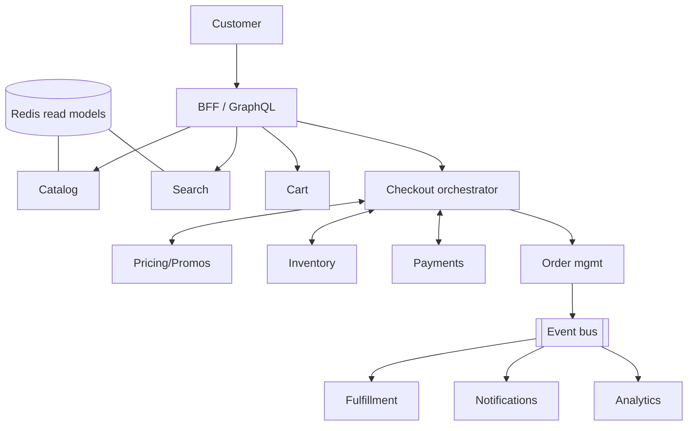

---

### Architectural Patterns

- **CQRS-lite with CDC refresh**: normalized operational stores, denormalized read blobs, change-data-capture keeping them fresh within seconds. Solves read-scale without distributed transactions.
- **Saga-based checkout**: reserve → price-lock → capture → confirm with compensations (release, refund). Orchestrated for auditability.
- **Bulkhead isolation**: critical conversion path (checkout pool) separated from browsing path so a recommendation-service meltdown can't block "Buy Now". Pool-per-dependency thread/connection isolation plus circuit breakers (Resilience4j).
- **Graceful degradation ladder**: pre-defined feature shedding under load — kill recs, then reviews, then faceted filters, never cart/checkout. Feature-flagged, rehearsed in game days.
- **Idempotency-key protocol** on all mutating client APIs — mobile networks guarantee retries.
- **Anti-corruption layers** around PSP/carrier/ERP SDKs normalizing their quirks into internal contracts.
- **Event-carried state transfer**: order events carry enough payload (items, address snapshot) for consumers to act without read-back — decoupling availability of downstream systems.

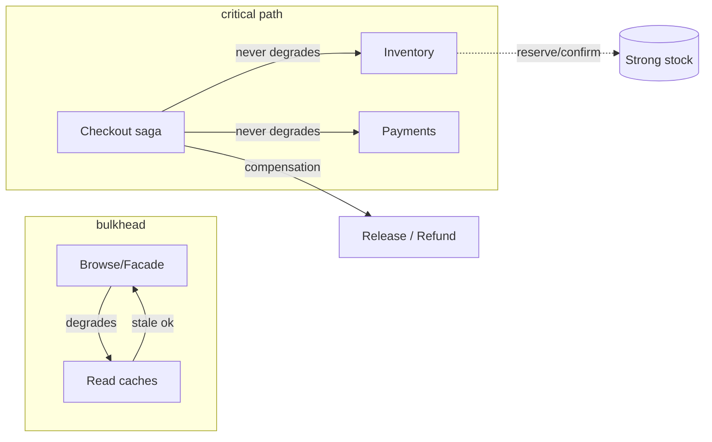

---

### Benefits

- **Revenue resilience**: degradation ladders convert potential outage-days into slightly-degraded-hours during peaks.
- **Independent team velocity**: bounded contexts let squads ship weekly without cross-team lockstep releases.
- **Cost proportionality**: caching + CDN means infrastructure spend tracks actual usage skew rather than worst-case uniform load.
- **Extensibility**: new surfaces (voice, kiosk, marketplace syndication) consume existing read models instead of rebuilding commerce logic.
- **Auditability**: event-spined orders make disputes, refunds, and financial reporting mechanical.

---

### Challenges

- **Technical**: cart-merge conflicts at login; promotion stacking rule explosions; timezones in flash-sale windows; image/media pipeline throughput.
- **Scalability**: hot product launches melting single-SKU inventory rows; search-index rebuild storms during mass repricing; notification bursts post-campaign.
- **Performance**: PDP p95 budgets (<300 ms) while composing 6+ sources — read-model caching answers; checkout latency directly correlates with abandonment (every 100 ms measurable).
- **Reliability**: PSP brownouts during peak (multi-PSP failover routing); carrier API flakiness (queue-and-retry with tracking backfills); partial checkout failures needing precise compensations.
- **Maintainability**: catalog schema evolution across years; promotion-engine rule debt; deprecated-client long tails.
- **Operational**: sale-readiness rehearsals; DR drills; cost observability per campaign.
- **Security/fraud**: card-testing attacks (small auths en masse), account takeover on saved cards, promo abuse rings, scraping of catalog/pricing — layered defenses from gateway limits through ML risk scoring.

---

### Best Practices

- **Recompute all monetary amounts server-side**; treat client totals as display-only.
- **Make every mutation idempotent** with documented key lifetimes (24 h typical).
- **Reserve-then-confirm inventory** with TTLs tuned to payment-method latency profiles (UPI fast → short holds; COD → longer).
- **Cache aggressively above the money line**, invalidate precisely via CDC events.
- **Build degradation modes as features** — flag-gated, load-tested, dashboard-visible; never improvised.
- **Isolate payment retries behind idempotency + circuit breakers**; duplicate charges destroy trust faster than downtime.
- **Emit domain events for everything post-order**; analytics/ML/notifications hang off this spine without touching checkout code.
- **Load-test at 1.5× forecast with realistic journeys** (browse-heavy mixes, bot floods, payment-failure rates elevated).
- **Instrument the funnel end-to-end**: view→cart→checkout-start→pay-attempt→success ratios pinpoint revenue leaks precisely.

---

### When to Use / When Not to Use

**Build custom when**: differentiation lives in commerce experience itself; scale/complexity outgrows SaaS; data/control requirements (custom pricing engines, B2B contracts) exceed platform extensibility.

**Buy/platform-first when**: early-stage validation (Shopify/BigCommerce gets you selling in days); small teams; standard B2C retail without exotic needs. Headless commerce (composable: commercetools, Medusa, Saleor) splits the difference — platform cores with custom frontends.

Decision factors: expected GMV trajectory, team size/composition, uniqueness of business model (subscriptions? rentals? B2B terms?), total-cost-of-ownership appetite, regulatory footprint.

---

### Data Model and API

#### Entity Relationship

The core data model centers on the order placement event. Product → SKU → Price/Stock are the catalog spine; Cart → CartItem references SKU; Order → OrderLine references SKU; PaymentIntent settles the order; InventoryReservation is the concurrency guard at checkout.

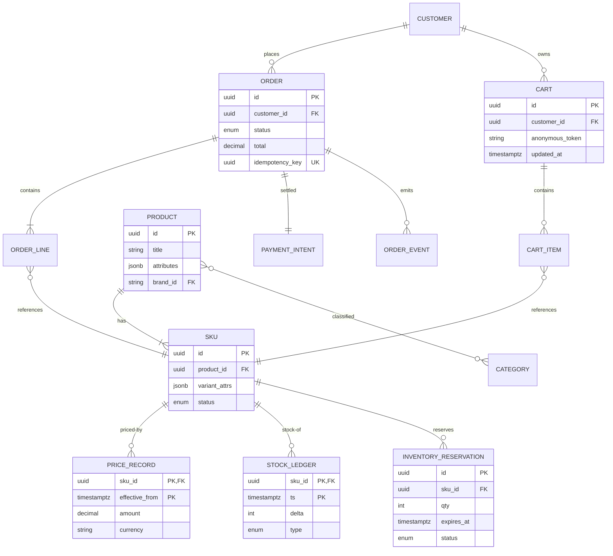

Choices: price history as effective-dated records (auditable, supports "was/now" displays); stock as an append-only ledger (replays to any point in time, supports audits); reservations TTL-indexed for sweepers; unique idempotency constraint structuralizes dedupe; categories many-to-many via bridge. Partitioning: orders by month (archive-friendly); carts ephemeral-ish in KV with DB backup snapshots.

#### API Contract

The platform exposes a REST/HTTP API for the customer journey, with separate admin and public endpoints. Every mutating endpoint accepts an `Idempotency-Key`.

##### Public Client API

| Method | Endpoint | Purpose | Rate Limit |
|---|---|---|---|
| GET | `/api/v1/categories` | List categories | 1000 req/min |
| GET | `/api/v1/categories/{id}/products` | Browse products in category | 500 req/min |
| GET | `/api/v1/products/{id}` | Product detail | 1000 req/min |
| GET | `/api/v1/search` | Search products | 200 req/min |
| GET | `/api/v1/cart` | Get cart | 100 req/min |
| POST | `/api/v1/cart/items` | Add to cart | 100 req/min |
| POST | `/api/v1/checkout/sessions` | Start checkout | 30 req/min |
| POST | `/api/v1/checkout/sessions/{id}/pay` | Submit payment | 10 req/min |
| GET | `/api/v1/orders/{id}` | Order status | 200 req/min |
| GET | `/api/v1/tracking/{id}` | Shipment tracking | 200 req/min |

##### Admin API

| Method | Endpoint | Purpose | Auth Scope |
|---|---|---|---|
| POST | `/admin/api/v1/products` | Create product | `products:write` |
| PATCH | `/admin/api/v1/products/{id}` | Update product | `products:write` |
| POST | `/admin/api/v1/inventory/{sku}/reserve` | Reserve stock | `inventory:write` |
| DELETE | `/admin/api/v1/inventory/{sku}/reserve` | Release stock | `inventory:write` |
| GET | `/admin/api/v1/orders` | List orders (filtered) | `orders:read` |

##### Request Example — Create Checkout Session

```http
POST /api/v1/checkout/sessions
Content-Type: application/json
Authorization: Bearer <jwt>
Idempotency-Key: <uuid>

{
  "cart_id": "cart_abc123",
  "payment_method": {
    "type": "card",
    "token": "tok_xyz789"
  },
  "shipping_address": {
    "line1": "123 Main St",
    "city": "San Francisco",
    "state": "CA",
    "zip": "94102",
    "country": "US"
  },
  "return_url": "https://shop.example.com/checkout/complete"
}
```

##### Response Example — Checkout Session Created

```json
HTTP/1.1 201 Created
Content-Type: application/json
{
  "session_id": "cs_987xyz",
  "status": "PENDING_PAYMENT",
  "amount": 129.99,
  "currency": "USD",
  "expires_at": "2024-06-14T11:00:00Z"
}
```

##### Status Codes

| Code | Meaning |
|---|---|
| 200 | Success |
| 201 | Resource created |
| 400 | Invalid request (validation error) |
| 401 | Authentication required |
| 403 | Insufficient permissions |
| 404 | Resource not found |
| 409 | Conflict (cart checkout in progress) |
| 429 | Rate limited |
| 503 | Service unavailable |

##### Idempotency

- All `POST` mutating endpoints accept an `Idempotency-Key` header. Re-submitting with the same key returns the original response, enabling safe retries.

##### Filtering & Pagination

- List endpoints (`GET /admin/api/v1/orders`) support `?limit=50&offset=100&status=shipped&date_from=2024-01-01`.

##### Versioning

- API versioning via URL prefix (`/api/v1/`, `/api/v2/`).

---

### E-commerce Architecture Deep Dive

An e-commerce platform follows a **microservice architecture** decomposed along business domains. Each service owns its data and exposes APIs; an API gateway routes external requests; an internal service mesh handles inter-service communication (mTLS, retries, circuit breaking). Key services include: Catalog (products, variants, pricing), Cart (session-based), Checkout (orchestrates payment + inventory), Payment (PSP integration), Order (lifecycle state machine), Inventory (stock levels), Fulfillment (picking, packing, shipping), Search (product discovery), and Recommendation.

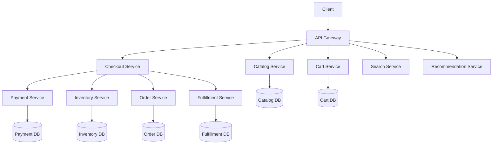

| Component | Purpose | Responsibilities | Real-world Example |
|---|---|---|---|
| API Gateway | Entry point | Routing, TLS, auth, rate limiting | AWS ALB, Kong |
| Catalog Service | Product data | CRUD products, variants, categories, pricing | Shopify Products API |
| Cart Service | Cart state | Add/remove items, persist across sessions | Redis + service |
| Checkout Service | Orchestrate checkout | Validate cart, reserve stock, charge, create order | Custom orchestration |
| Payment Service | PSP integration | Tokenize cards, charge, refund, handle webhooks | Stripe, Adyen |
| Order Service | Order lifecycle | State machine (created→paid→shipped→delivered→returned) | Event-sourced state |
| Inventory Service | Stock management | Track stock levels, prevent overselling | DB with reservations |
| Fulfillment Service | Shipping | Create shipments, track carriers | FedEx/UPS API |
| Search Service | Discovery | Indexing, querying, ranking | Elasticsearch, Solr |
| Recommendation | Personalization | ML models, collaborative filtering | Amazon Personalize |

**Communication**: Synchronous REST/gRPC between services; asynchronous events via message queue for eventual consistency (order created → inventory decrement → shipment creation). Database-per-service pattern: each service has its own schema, no shared DB.

**Scaling**: Each service scales independently. Catalog is read-heavy (CDN caching); Cart is session-heavy (Redis); Checkout is critical-path (low-latency, autoscaling). Hot data (product prices, stock) cached in Redis with pub/sub invalidation.

**Failure handling**: Circuit breakers on inter-service calls; fallback content for recommendations; dead-letter queues for failed events; retry with exponential backoff for PSP calls. The "bulkhead" pattern isolates failures — a recommendation engine outage must not affect checkout.

#### Design Considerations

* **Service decomposition**: split by business capability (not technical layer). Keep payment, inventory, and order as separate services — they have different scaling and reliability characteristics.
* **Data consistency**: choose between strong (single DB transaction) and eventual (eventual consistency via events). Checkout requires strong consistency for payment+inventory; catalog updates can be eventually consistent.
* **Database per service**: each service owns its database. Cross-service queries use APIs or event-driven denormalization, never shared DB joins.
* **Fault isolation**: the checkout flow must not depend on non-critical services (recommendations, reviews). Use timeouts and circuit breakers aggressively.

#### Key Decisions

| Decision | Options | Trade-off | Recommendation |
|---|---|---|---|
| Cart storage | Session DB | Persistent, survives crashes | Production |
| | Redis | Fast, volatile | Cache layer |
| | Client-side | Stateless server | Low scale |
| Inventory | Strong consistency | Accurate, contention | High-value items |
| | Eventual + reservation | Scalable, over-sell risk | General catalog |
| Payment model | Synchronous | Simple, blocking | Low volume |
| | Async + webhook | Resilient, complex | Production |
| Search | Elasticsearch | Full-text, faceted | Standard |
| | Solr | Mature, scalable | Alternative |
| Event flow | Event-driven choreography | Decentralized | Simple flows |
| | Orchestration | Centralized control | Complex sagas |

#### Scalability Considerations

* **Read scaling**: CDN for static assets; catalog/search read from read replicas; cart from Redis.
* **Write scaling**: inventory updates via reservation pattern (reserve-then-confirm) to distribute lock contention.
* **Checkout autoscaling**: checkout is the critical path — scale preemptively based on traffic forecasts; keep warm pool to handle sudden spikes.
* **Catalog sharding**: shard by product category or merchant ID; use global secondary indexes for cross-category queries.

#### Reliability Considerations

* **Idempotency**: all mutating API calls accept an idempotent-request-id header, enabling safe retries without duplicate writes.
* **Circuit breakers**: per-service circuit breakers with configurable failure thresholds; open state returns degraded but functional responses.
* **Dead letter queues**: failed asynchronous events (order → inventory) go to DLQ for manual inspection; alert on DLQ growth.
* **Graceful degradation**: if the recommendation service is down, show popular items; if search is down, fall back to category browsing.

#### Performance Considerations

* **Latency budgets**: catalog browse ≤ 100 ms, search ≤ 50 ms, checkout ≤ 500 ms (including PSP call).
* **Caching**: product details, pricing, and stock cached in Redis with TTL; invalidate on update via pub/sub.
* **Database optimization**: connection pooling, read replicas, async materialized views for analytics.
* **Connection pooling**: reuse HTTP/gRPC connections to downstream services to avoid connection overhead.

#### Peak-Event Engineering (Sales & Launches)

The single hardest scaling exercise in e-commerce: traffic surges 10–100× in minutes. The playbook:

1. **Cell isolation**: route sale traffic into dedicated capacity pools (separate queues, separate inventory rows, separate DB partitions) so a runaway hero SKU cannot exhaust general capacity.
2. **Admission control / waiting rooms**: cap concurrent checkout attempts at a sustainable rate; queue the rest and admit fairly (FIFO by entry). Queue honesty > site crash.
3. **Pre-warmed caches**: seed Redis with PDP/listing blobs for sale SKUs hours ahead; use CDC to refresh within seconds of price/stock changes.
4. **Hero-SKU contention control**: for "drops" (celebrity sneakers), funnel all buyers through a single sharded counter or queue (bookmyshow-style) rather than a hot DB row — serialized decrements beat thundering-herd selects.
5. **Rehearsal culture**: game-day drills run at 1.5× forecast load every quarter; sale-readiness checklist gated on dashboard green.

#### Checkout Flow (with compensation)

The conversion saga: validate cart → price-lock → reserve stock → take payment → create order, with a compensation step wired to each forward step.

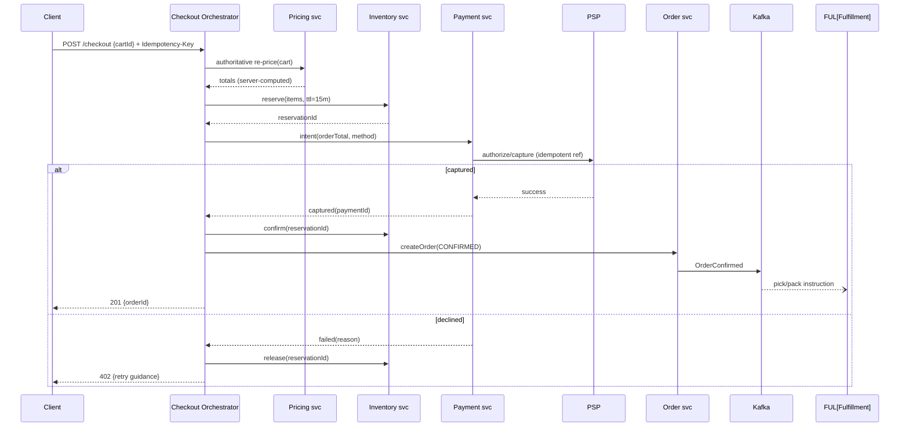

Scaling: static+catalog reads offloaded to CDN/Redis (95%+ hit targets); checkout/inventory sized for peak-write with headroom; Kafka partitions keyed orderId; autoscaling on funnel-stage RPS.

Failure handling: any step failure triggers defined compensation; ambiguous payment states park in `AWAITING_CONFIRMATION` pending webhook/reconciliation; region loss shifts traffic with cart/session replication lag accepted (re-auth flows).

#### Deep Dive: Inventory Reserve/Confirm

- `reserve(sku, qty, ttl)`: atomically decrement a reservation counter; if insufficient real stock, reject. The reservation record is the source of truth during the hold window.
- `confirm(reservationId)`: move reserved qty to "sold" ledger, decrement available stock.
- `release(reservationId)`: return reserved qty to available (TTL sweeper + explicit release both call this).
- Hot-SKU strategy: for launches, write through a single partitioned counter (shard by `skuId % 32`) and use a queue for admission — avoids row-level lock contention while keeping the total strictly bounded.

#### Deep Dive: Pricing & Promotions Determinism

Same cart+time must yield identical totals across app/server/support tools — achieved by pure functions over versioned rule sets with effective-dating; disputes replay historical rule versions. Non-deterministic personalization discounts isolated to clearly-labeled surfaces.

#### Deep Dive: Search Freshness vs Cost

Three-tier freshness matching each field's volatility: full reindex nightly, incremental CDC updates hourly, instant price/stock overlays at query time (fetched from Redis). Facet counts approximated under load (documented error budget).

---

### Replication Strategies

E-commerce replicates data across three axes: durability within a region, availability across zones, and read-scale for hot catalogs. The strategy is per-subsystem, chosen by consistency needs.

**Catalog / read models (PostgreSQL + read replicas):** The operational catalog DB is the write master with synchronous streaming replicas in two AZs of the primary region (strong read-after-write within the region). Cross-region replicas are asynchronous for DR. Denormalized blobs (PDP/listing caches) are refreshed via CDC and replicated to all edge read-models. A quorum of `(N/2)+1` accepts each write; failover automated via Patroni/etcd.

**Inventory (single-writer + reservation log):** True stock must be CP. A single primary shard per SKU (or SKU-group sharded by hash) owns the authoritative ledger; replicas provide fast reads of available counts for display. The reservation table is the concurrency guard — written only to the primary, with TTL-indexed rows swept by background tasks. For hero SKUs under launch contention, the writer shard is pinned to one node and clients queue.

**Orders (sharded by date, multi-AZ sync):** Orders partitioned by month for archive-friendliness; each partition synchronously replicated across AZs of the region where it was created, with async cross-region replication for DR. The idempotency-key unique constraint is global and enforced via a dedicated lightweight idempotent-write table (write-through to the partitioned order table on commit).

**Cart (Redis Cluster + replica sync):** Carts are hot, low-value data — replicated in Redis Cluster (16,384 hash slots) with one replica per master. Async replication lag is acceptable (merge-on-login reconciles). For logged-in users the canonical store is the DB; Redis is the hot cache.

**Payments ledger (triple-write + quorum):** Money data is CP globally. Payment intents and ledger rows are written to the primary payment DB with synchronous multi-AZ commit, plus an append-only journal in object storage, plus a parallel ledger in the settlement DB — a triple write that is compared nightly by reconciliation jobs.

**Search index (ES cluster with replicas):** Elasticsearch indices are split into primary + 1–2 replicas per shard. Cross-region replica sets give read locality; reindex snapshots back up to object storage hourly.

**Event bus (Kafka ISR):** Each topic partition has a leader + `N-1` followers; `acks=all` means a write is durable when all in-sync replicas have it. Leader election on failure is automatic; cross-region mirroring via MirrorMaker keeps a warm standby.

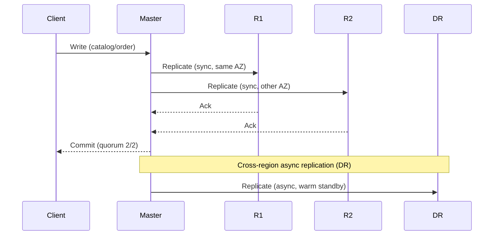

*Replication across layers: a client write to the PostgreSQL primary is synchronously replicated to in-region replicas (two AZs) before acknowledgment; cross-region replication is asynchronous for disaster recovery. Inventory uses a single-writer-primary with reservation rows as the concurrency guard; the payments ledger triple-writes (DB journal + object-store log + settlement ledger) and reconciles nightly.*

---

### Failure Detection and Membership

In a microservice mesh, detection is as important as replication: a stalled checkout service must be ejected from rotation before it drags down the funnel, and a dead inventory writer must trigger failover without a split-brain double-sell.

**Application health & circuit breakers:** Every service exposes `/health` (liveness) and `/ready` (readiness) endpoints scraped by Kubernetes probes. Callers wrap downstream calls in Resilience4j circuit breakers that open after N consecutive failures (fail-fast), then half-open after a cooldown — preventing cascading failures. Timeout budgets (read 100 ms, write 500 ms) are enforced uniformly.

**Service discovery & membership:** Spring Cloud / Consul holds the registry; services register with TTL leases. Gossip-based membership (Serf-style) spreads health state; phi-accrual failure detectors convert heartbeat timing into a suspicion level, reducing false positives from transient blips.

**Kafka consumer group management:** If a recommendation server dies, its partitions rebalance to surviving members within the session.timeout window. Consumer-lag metrics alert if rebalance outpaces processing — a stuck consumer silently starves downstream.

**Leader election for stateful singletons:** Inventory writers (for hero SKUs) and payment-journal appenders use ZooKeeper/etcd leader election with ephemeral nodes. A new leader is elected within seconds; the old leader's in-flight reservations expire via TTL, preventing double-commit.

```java
@Service
@RequiredArgsConstructor
public class ResilienceConfig {

    @Value("${app.checkout.inventory.timeout-ms:200}")
    private int inventoryTimeoutMs;

    @Value("${app.checkout.inventory.failure-threshold:5}")
    private int failureThreshold;

    @Bean
    public CircuitBreaker inventoryCircuitBreaker() {
        var config = CircuitBreakerConfig.custom()
                .failureRateThreshold(failureThreshold)
                .timeoutDuration(Duration.ofMillis(inventoryTimeoutMs))
                .waitDurationInOpenState(Duration.ofSeconds(30))
                .permittedNumberOfCallsInHalfOpenState(2)
                .slidingWindowType(CircuitBreakerConfig.SlidingWindowType.TIME_BASED)
                .build();
        return CircuitBreaker.of("inventory", config);
    }
}
```

*The `ResilienceConfig` bean externalizes timeout and failure thresholds via `@Value`, then builds a Resilience4j `CircuitBreaker` with a 30-second cool-off and a 2-call half-open probe — enough to detect a stalled inventory service without flapping.*

---

### High Availability and Scalability

Availability comes from redundancy + fast failover; scalability from independent scaling of each service tier + caching. The two are coupled: you can't scale what you can't detect (see Failure Detection).

#### Multi-Region Deployment

Deploy active services in at least 3 regions (e.g., us-east, eu-west, ap-southeast). Users are routed to the nearest region via a global load balancer that health-checks each region end-to-end. Each region is self-sufficient for reads and writes, with asynchronous cross-region replication for durability.

- **Active-active for metadata**: User profiles, catalog, and the follow graph replicate across regions via logical replication + a conflict-resolution policy (last-writer-wins by `updated_at`, with a manual review queue for money-adjacent rows).
- **Active-active for cart/session**: Session affinity with `SameSite` cookies plus Redis CRDTs for cart merge-on-login; brief replication lag accepted (re-auth on conflict).
- **Global CDN**: Product images, PDP/static assets cached at edge PoPs worldwide, reducing latency to < 50 ms for media.
- **Per-region feature stores**: Each region caches its own read-model projections from local DB replicas — a region outage degrades to stale-but-served content, never a hard 500.

#### Auto-Scaling

- **Stateless services (BFF, catalog browse, search)**: Scale horizontally on CPU + request latency via Kubernetes HPA; warm-start replicas to absorb step-function traffic.
- **Checkout / inventory writers**: Scale on RPS of `/checkout` with a concurrency cap (admission control), not raw CPU — throughput is bounded by inventory writes, so headroom is reserved in a dedicated pool.
- **Cart**: Redis Cluster nodes autoscale on ops/sec and memory; masters rebalance hash slots automatically.
- **Event processors (Kafka consumers)**: Scale by partition count; add consumers until lag falls below a budget (e.g., < 5 s).

#### Graceful Degradation Ladder

- **Recommendation/Promotions down**: PDPs still render (prices fall back to last-known catalog price; "you may also like" hides). Cart and checkout untouched.
- **Search down**: Fall back to category browse + curated lists.
- **Review service down**: Hide reviews, show a "reviews temporarily unavailable" placeholder — never block checkout.
- **Carrier tracking down**: Show "tracking unavailable, we'll email you when your package moves."

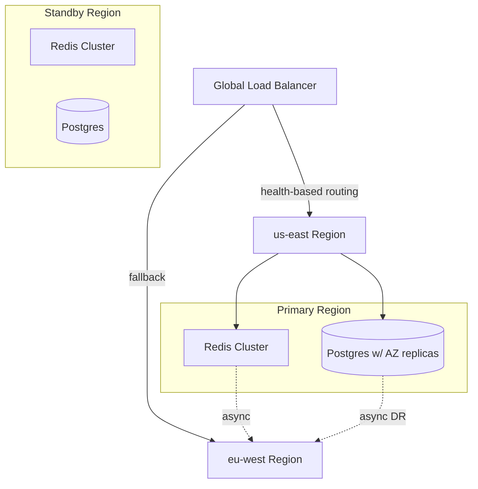

---

### Performance and Optimization

Performance here means: revenue-preserving latency (checkout p95 < 500 ms), browse p95 < 200 ms for PDP, and funnel conversion that doesn't erode during peaks. The optimization is therefore tiered — aggressive caching where staleness is tolerable, strict serialization only where money is on the line.

#### Latency Budget

| Stage | Target p95 | Notes |
|---|---|---|
| Catalog browse | < 100 ms | CDN + Redis blob |
| Product detail (PDP) | < 200 ms | single read-model lookup |
| Search | < 50 ms | Elasticsearch + query cache |
| Cart add | < 100 ms | Redis + async DB write |
| Checkout (end-to-end) | < 500 ms | includes PSP round-trip |
| Order placement | < 300 ms | async event publish |

#### Caching Strategies

- **L1 (process-local / BFF)**: user session + recently viewed products, in-heap, ~5 min TTL.
- **L2 (Redis)**: PDP blobs, listing rows, price/stock overlays, session carts. TTL 300 s for volatile, 3600 s for static; invalidated via CDC `product.updated`/`price.updated`/`stock.changed` events.
- **L3 (CDN)**: immutable assets (images, JS bundles, static catalog pages) with 24-hour TTL; edge-side includes for personalized fragments.
- **Negative caching**: 404s on PDP/search cached for 60 s to survive cache-stampede (e.g., a bad link in a mass email driving 2M users to a dead product).

#### Database & Connection Optimization

- Connection pooling (HikariCP) sized to peak concurrency with a 25% safety headroom.
- Read replicas for browse; the master handles only writes (inventory, payments, orders).
- Async materialized views for analytics (daily rollup) decoupled from OLTP latency.
- HTTP/gRPC connection reuse (keep-alive) between services to avoid TLS handshake overhead on every call.

#### Checkout Latency

Every 100 ms of checkout latency measurably increases abandonment, so the checkout path avoids any fan-out: pricing, inventory reservation, and payment intent are issued concurrently only after a single authoritative re-price, and the order is written in the same DB transaction as the reservation-confirm (or compensated). Circuit breakers on PSP calls fail fast to the `declined` branch rather than blocking the funnel.

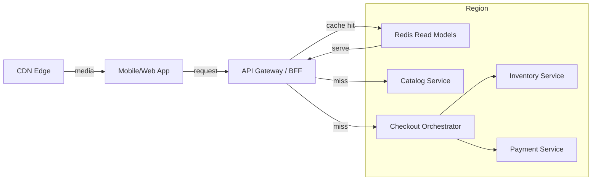

*Multi-tier caching + latency isolation: the BFF checks the Redis read-model first; catalog PDPs/listings are served from cache (stale-tolerant) while checkout is served on a dedicated, headroom-reserved pool that never shares capacity with browsing. Media is served from CDN edge PoPs.*

---

### CAP Theorem and Consistency Trade-offs

A platform operating across regions is partition-tolerant by assumption, so the CAP trade-off is C vs. A per component. The design's north star: money and stock are CP; everything else that humans won't notice a few seconds of staleness on is AP.

#### Metadata (User, Catalog, Orders) — CP within region

Product catalog, user profiles, and order records must be consistent: a price change or a successful payment should be visible before the next dependent action. PostgreSQL with synchronous multi-AZ replication enforces this — writes go to the leader and are confirmed by a quorum of replicas before acknowledgment. Cross-region replication is asynchronous (for DR), accepting a seconds-level lag that is masked by read-models.

#### Inventory / Payments — CP, single writer

Stock and money cannot be eventually consistent — "eventually sold" is oversold. A single primary shard per SKU (or SKU-group) owns the authoritative ledger; replicas serve read-only counts for display. Payments use synchronous commit to a quorum before a charge is confirmed; the idempotency-key constraint is itself a strongly-consistent write that deduplicates retries. The trade-off: during a partition that isolates the primary, writes are rejected (unavailable) rather than risking a duplicate charge — correct for money.

#### Catalog cache / recommendations — AP

The PDP/listing cache and recommendation feed are cached in Redis with short TTLs. If a node fails, followers' pages are served from replicas or reconstructed from the metadata DB with reduced personalization. Brief staleness (a few minutes) is acceptable — users won't notice if a price updates 60 seconds later, and even if they do, checkout re-prices server-side before payment.

#### Fulfillment events — AP with bounded staleness

Tracking events flow through Kafka (durable, ordered within a key) into the notification/analytics consumers. A few seconds (or, in degradation, minutes) of lag between a warehouse scan and the customer seeing "shipped" is acceptable and far cheaper than blocking the warehouse feed on a customer-facing read.

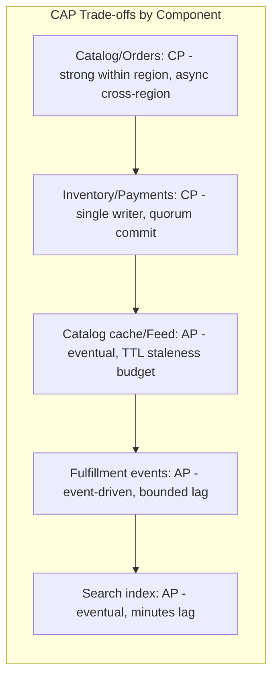

*E-commerce CAP trade-offs: catalog and orders are CP (strong consistency within a region, async cross-region for DR); inventory and payments are CP with a single writer (unavailability beats double-spend); catalog cache, feeds, fulfillment events, and search are AP with explicit staleness budgets — checkout always re-prices server-side before payment, which is what makes the AP cache safe.*

---

### Encryption and Key Management

E-commerce handles payment instruments, PII, and order data — so encryption spans PCI-DSS requirements for card data, residency laws for customer data, and key-rotation hygiene that auditors will test.

#### Encryption at Rest

- **Payment DB / ledger**: Database-level TDE (AES-256) plus column-level encryption for PAN tokens and CVV-equivalents are never stored (tokenized at the PSP boundary — only the PSP's vault token is retained).
- **Object store (media, documents)**: SSE-KMS with customer-managed keys; each bucket encrypted with its own KEK.
- **PostgreSQL (catalog, orders, users)**: TDE at the page level; PII columns (email, phone, address) encrypted with application-level AES-GCM so a DB dump is useless without the app's DEK.
- **Redis (carts, sessions)**: Redis at-rest encryption (AES-256) + in-transit TLS; sessions stored as opaque IDs only — no PII in the value.
- **Kafka**: broker log encryption (AES-256) + TLS; sensitive event fields (card token, email) encrypted with field-level AEAD before publishing.

#### Encryption in Transit

- **Edge**: TLS 1.3 terminates at the CDN/ALB; HSTS enforced.
- **Service mesh**: mTLS (Istio/Linkerd) between all microservices carries identity + encryption.
- **Media**: pre-signed HTTPS URLs with short expirations for uploads; downloads served over HTTPS from the CDN edge.

#### Key Hierarchy

A KEK (Key Encryption Key) in a managed KMS/HSM encrypts per-service DEKs (Data Encryption Keys). Rotating the KEK requires only re-wrapping the DEKs, not the data. Keys are regional with a global root for multi-region failover; rotation is automated quarterly with a 2× overlap window.

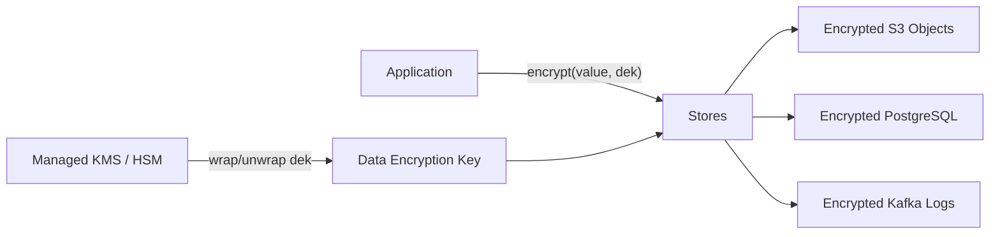

*Encryption key hierarchy for e-commerce: the application encrypts values with per-service data encryption keys (DEKs), which are wrapped by a key-encryption key (KEK) in a managed KMS/HSM. Stores persist only ciphertext; rotating the KEK re-wraps DEKs without re-encrypting data.*

```java
@Service
@RequiredArgsConstructor
public class PaymentCryptoService {

    @Value("${app.payment.encryption.key-id}")
    private String keyId;

    private final AwsKms kmsClient;
    private final MeterRegistry meterRegistry;

    public EncryptedField encrypt(String plaintext) {
        var timer = Timer.Sample.start(meterRegistry);
        try {
            var dek = kmsClient.generateDataKey(keyId);
            var cipher = Cipher.getInstance("AES/GCM/NoPadding");
            var iv = new byte[12];
            new SecureRandom().nextBytes(iv);
            cipher.init(Cipher.ENCRYPT_MODE,
                    new SecretKeySpec(dek.plaintext(), "AES"),
                    new GCMParameterSpec(128, iv));
            var ciphertext = cipher.doFinal(plaintext.getBytes(StandardCharsets.UTF_8));
            var combined = new byte[iv.length + ciphertext.length];
            System.arraycopy(iv, 0, combined, 0, iv.length);
            System.arraycopy(ciphertext, 0, combined, iv.length, ciphertext.length);
            return new EncryptedField(
                    Base64.getEncoder().encodeToString(combined),
                    Base64.getEncoder().encodeToString(dek.encrypted()));
        } catch (GeneralSecurityException e) {
            throw new EncryptionException(e);
        } finally {
            timer.stop(Timer.builder("payment.encryption.latency")
                    .register(meterRegistry));
        }
    }

    record EncryptedField(String encryptedData, String encryptedDek) {}
}
```

*The `PaymentCryptoService` bean generates a fresh data-encryption key per batch via AWS KMS (keypair injected via `@Value`), encrypts PII with AES-GCM using a random 12-byte IV, and returns a record holding ciphertext+IV and the KMS-wrapped DEK. Micrometer records encryption latency for SLO monitoring.*

#### PCI-DSS Scope Reduction

Cardholder data never touches application hosts: the React SPA collects card details directly via the PSP's Elements/iFrame; the application sees only a one-time token. The payment service stores only `psp_reference`, `status`, `amount`, and the idempotency key — PCI scope is limited to the tokenization boundary.

---

### Authentication and Authorization

Every API request, user action, and internal service call must be authenticated and authorized. The model is layered: OAuth 2.0 + JWT for client authn, mTLS for service-to-service, and RBAC/ABAC for authorization — with PCI scope minimization for payment data.

#### Authentication Methods

- **OAuth 2.0 + JWT**: Customers authenticate via phone (SMS OTP) or social login (Google/Apple/Facebook). The Auth Service issues a short-lived access JWT (~15 min) and a long-lived refresh token (~30 days), stored in an HttpOnly, Secure, SameSite=Strict cookie. The JWT carries `sub`, `exp`, `scope`, and `roles`.
- **mTLS client certificates**: Internal service-to-service calls present a certificate from the private CA encoding the service identity and allowed scopes.
- **Device fingerprinting**: Each device registers a token used for push and for anomaly detection (new device, new location).
- **MFA**: Required for seller portals, admin tools, and high-risk actions (changing payout method, email, password).

#### Authorization Models

- **Scope-based (OAuth scopes)**: Each JWT carries scopes like `catalog:read`, `cart:write`, `checkout:create`, `order:read`. The API Gateway enforces scope checks before forwarding.
- **Role-based (RBAC)**: Users have roles (`customer`, `seller`, `support_agent`, `admin`). Support agents can refund/void; admins manage platform settings.
- **Resource-level visibility**: Each product/order has a visibility rule. Sellers can only edit their own catalog; support agents see only their region's orders.
- **ABAC for pricing/promotions**: Promo codes are authorized by attributes (minimum order value, eligible categories, user segment) evaluated server-side by the pricing engine — client-submitted discounts are never trusted.

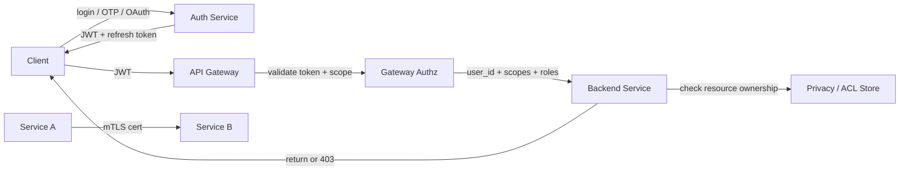

*Authentication and authorization flow: a client logs in via phone/OAuth, receives a JWT + refresh token; the API Gateway validates the JWT and checks scopes before forwarding to backend services with an established identity; each service enforces resource-level ownership/privacy. Internal service calls use mTLS.*

```java
@Component
@RequiredArgsConstructor
public class JwtAuthenticationFilter implements Filter {

    @Value("${app.auth.jwt-public-key}")
    private String publicKeyPem;

    private final UserDetailsService userDetailsService;

    @Override
    public void doFilter(ServletRequest request, ServletResponse response,
                         FilterChain chain) throws IOException, ServletException {
        var token = extractToken((HttpServletRequest) request);
        if (token != null && JwtUtils.isValid(token, publicKeyPem)) {
            var userId = JwtUtils.getUserId(token);
            var userDetails = userDetailsService.loadUserById(userId);
            var auth = new UsernamePasswordAuthenticationToken(
                    userDetails, null, userDetails.getAuthorities());
            SecurityContextHolder.getContext().setAuthentication(auth);
        }
        chain.doFilter(request, response);
    }

    private String extractToken(HttpServletRequest request) {
        var header = request.getHeader("Authorization");
        if (header != null && header.startsWith("Bearer ")) {
            return header.substring(7);
        }
        return null;
    }
}
```

*The `JwtAuthenticationFilter` bean intercepts every HTTP request, extracts the bearer token from the `Authorization` header, validates its signature against the public key (injected via `@Value` from a JWKS endpoint), loads the user details, and sets the Spring Security `Authentication` context. If the token is missing or invalid, the request proceeds unauthenticated and subsequent authorization annotations return 401.*

#### Authorization Enforcement

Scope and role checks live at the API Gateway (coarse) and inside each service (fine-grained, resource-level). The pricing engine is authoritative — it recomputes every discount against the user's session, cart contents, and the active promotion set; the client submits only a coupon code, never a discount amount.

---

### Security Threats and Mitigations

E-commerce is a primary target — money changes hands, PII is abundant, and automated fraud is profitable at scale. The mitigations are layered from the edge inward.

#### Threat: Overselling & Double Charges

- **Risk**: Concurrent buyers on a hot SKU both succeed; or a retry triggers a duplicate charge.
- **Mitigation**: Inventory uses a single-writer reservation ledger with TTL; the idempotency-key constraint on payments is a strongly-consistent unique index, so a retried capture returns the original result. Checkout compensation (release on payment failure) is wired to every forward step.

#### Threat: Card-Testing Attacks

- **Risk**: Bots blast thousands of small $1 authorizations to validate stolen card lists.
- **Mitigation**: At the gateway, per-IP and per-token rate limits; velocity scoring (N attempts in M minutes → challenge or block); PSP-level rules (minimum amount, velocity, BIN blacklists); machine-learning risk scoring on `payment_intent.created` that blocks high-risk attempts before they hit the PSP.

#### Threat: Account Takeover (ATO)

- **Risk**: Credential stuffing and SIM-swap attacks drain saved cards and loyalty balances.
- **Mitigation**: MFA required for high-risk actions and seller portals; device fingerprinting + new-device challenge flows; session invalidation on password change; breached-password checks against HaveIBeenPwned on login.

#### Threat: Promo / Coupon Abuse

- **Risk**: Ringers create fake accounts to consume one-time coupons, or chain incompatible reductions to underpay.
- **Mitigation**: Promotion engine is single-sourced-of-truth (client submits code, server recomputes the stack); coupon redemption is a strongly-consistent reservation (deduct one use atomically); ML models flag abuse patterns (same IP, same device fingerprint, shipping to multiple addresses).

#### Threat: Catalog/Pricing Scraping & Price Wars

- **Risk**: Competitors scrape prices to undercut; resellers automate purchases of flash-sale stock.
- **Mitigation**: Per-client rate limits; bot-Mitigation (Cloudflare/Fastly) on listing+search endpoints; hero-SKU waiting rooms that reject non-human traffic during drops; dynamic pricing surfaces the "was/now" only via signed, short-TTL read models.

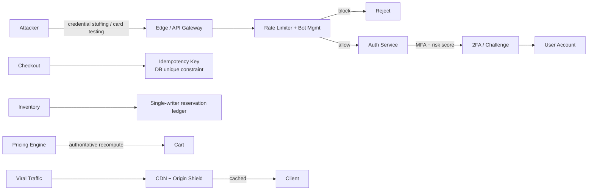

*Defensive layers for e-commerce's threat model: the edge rate-limits credential-stuffing and card-testing storms and challenges suspicious logins with MFA; the payments idempotency key is a DB unique constraint so retries can't double-charge; inventory is a single-writer reservation ledger that cannot oversell; the pricing engine recomputes all discounts server-side; viral traffic is absorbed by CDN edge caching and origin shielding.*

#### Threat: Supply-Chain & Integration Risk

- **Risk**: A compromised PSP SDK or carrier API injects malicious behavior.
- **Mitigation**: All third-party SDKs are wrapped in anti-corruption layers that normalize their contracts; PSP calls are pinned to vetted library versions with dependency scanning; secrets are never in client bundles.

---

### Observability and Logging

E-commerce observability is split into two planes: **infrastructure health** (service up, latency, errors) and **business funnel health** (browse → cart → checkout → pay → convert). The business plane drives more alerts than the infra plane, because a 5% checkout regression is a revenue event, not a pager event.

#### Key Metrics

| Category | Metric | Target |
|---|---|---|
| Funnel | `checkout.start` → `payment.success` conversion | Platform baseline, daily comparison |
| Checkout | `checkout.latency` p50/p95/p99 | p99 < 500 ms |
| Catalog | `pdp.render.latency` p95 | p95 < 200 ms |
| Payments | `payment.declined_rate` | < 5% (excluding fraud) |
| Inventory | `inventory.reserve.latency` p95 | p95 < 100 ms |
| Errors | `api.error_rate` (5xx) | < 0.1% |
| Cache | `readmodel.hit_ratio` | > 95% |
| Events | `order_created` → `shipment_created` lag | < 60 s p95 |

#### Logging

- **Request logs**: Every API request logged with trace ID, user ID (or anon token), endpoint, response code, and latency. Correlated to infra metrics for SLO attribution.
- **Business-event logs**: `cart_created`, `checkout_started`, `payment_captured`, `order_confirmed`, `inventory_reserved` — structured, with the idempotency key as the join key. These are the source of truth for revenue reconciliation.
- **Audit logs**: Every state transition in the order state machine, every promotion application, every refund — append-only, tamper-evident (WORM storage).
- **Security logs**: Auth successes/failures, MFA challenges, rate-limit rejections, risk-score thresholds crossed, idempotency-key collisions (potential duplicate-charge probe).

#### Distributed Tracing

Trace every request across services with OpenTelemetry, propagating a `traceparent` header. Key spans: checkout orchestrator → pricing → inventory reserve → payment capture; and the post-order fan-out (OrderConfirmed → warehouse, notifications, analytics). Sampling is 100% for the checkout path (revenue-critical), 1% for browse.

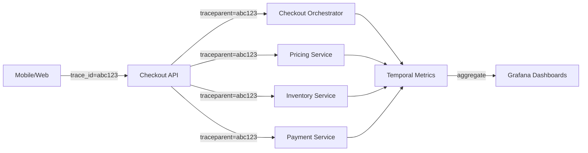

*Distributed tracing for the conversion funnel: each request carries a trace ID propagated across the Checkout API, Orchestrator, Pricing, Inventory, and Payment services. Spans aggregate in a metrics backend (Prometheus/Jaeger) and are visualized in Grafana, with SLO dashboards surfaced to on-call and revenue teams alike.*

#### Alerting Strategy

- **Critical (page)**: checkout p99 > 500 ms for 2 min; payment-declined spike > 2× baseline; duplicate idempotency-key collisions; order-confirmation → shipment lag > 5 min for 5 min.
- **Warning (ticket)**: PDP p95 > 200 ms for 5 min; cart-abandonment > baseline by 10%; DLQ depth > 1K for 10 min.
- **Info (dashboard)**: campaign ROI vs. forecast, per-PSP success rates, price-change propagation lag.

#### Synthetic + Game Days

An hourly synthetic purchase journey (regional, across PSPs) catches regressions in the full funnel before real customers do. Quarterly game days rehearse the degradation ladder: recommendation service killed, search degraded, carrier API faked as flaky — confirming the site still converts.

---

### Real-World Implementations

- **Shopify** — powers millions of stores proving the platform-first thesis; its architecture talks (multi-tenant sharding, checkout isolation) inform even custom builds.
- **Amazon** — the reference for read-model CQRS at extreme scale; "available to promise" inventory and service-per-team org-design lessons embedded throughout this doc.
- **Flipkart Big Billion Days** — published war-room practices: cell isolation, rehearsal culture, degradation ladders — the peak-engineering playbook.
- **Zalando** — fashion-specific challenges (size-curve inventory, returns >50%) driving their move to composable architecture; their engineering blog documents the evolution honestly.

| Platform | Architecture | Checkout | Inventory | Pricing | Key Innovation |
|---|---|---|---|---|---|
| Shopify | Multi-tenant SaaS | Isolated checkout tier | Reservation w/ TTL | Server-side | Checkout scaling isolation |
| Amazon | Microservices + CQRS | Idempotent saga | ATP inventory | A/B tested | Ownable money services |
| Flipkart | Cell-isolated | Async + webhooks | Sharded | Event-sourced | Sale-day cell isolation |
| Zalando | Composable | Orchestrated | Event-sourced | Feature flags | Size-curve inventory |

**Shopify's tech stack (publicly known):** Ruby/Rails monolith historically, migrating to a services mesh; multi-tenant sharding by shop ID; checkout runs in a separate tier to isolate flash-sale load; payments via Shopify Payments (acquires + settles in-house for control).

**Amazon's tech stack:** ~1,500 microservices; DynamoDB for high-throughput reads (catalog, cart), Aurora for money-adjacent writes (orders, payments), SQS/SNS for event flow, S3 + CloudFront for media, Elasticsearch for search; "available to promise" inventory is computed across fulfillment centers; the org is famously split into one-team-per-service (you build it, you run it).

---

### Java and Spring Boot Implementation Guide

This section demonstrates how to build the critical, money-adjacent pieces of the e-commerce platform in Spring Boot 3.x. Code uses `@Service`, `@RestController`, `@Repository`, `@Component`, `@Value`, `record` DTOs with Bean Validation, `@Transactional`, `@ControllerAdvice`, constructor injection, `BigDecimal` for money, Resilience4j circuit breakers, and idempotency-key enforcement.

#### 1. DTO Records with Validation

```java
public record CreateVideoRequest(
        @NotBlank String title,
        @NotBlank String description,
        @NotEmpty List<String> tags,
        String musicId,
        @NotBlank String visibility) {}
```

```java
public record CheckoutRequest(
        @NotBlank String cartId,
        @NotBlank String paymentMethodToken,
        @NotBlank String shippingAddressId,
        String returnUrl) {}
```

```java
public record CheckoutResult(UUID orderId, String status, BigDecimal total, String currency) {}
public record OrderDto(UUID orderId, String status, BigDecimal total, Instant createdAt) {}
```

#### 2. Entity with Optimistic Locking

```java
@Entity
@Table(name = "orders", indexes = {
        @Index(name = "idx_customer_status", columnList = "customerId,status"),
        @Index(name = "idx_created", columnList = "createdAt")
})
public class Order {

    @Id
    private UUID orderId;

    @Column(nullable = false)
    private UUID customerId;

    @Column(nullable = false)
    private BigDecimal total;

    @Column(nullable = false)
    private String currency;

    @Column(nullable = false)
    private String status;

    @Column(unique = true)
    private UUID idempotencyKey;

    @Column(nullable = false)
    private Instant createdAt;

    @Version
    private Long version;

    // state-machine transitions
    public void confirm()  { this.status = "CONFIRMED"; }
    public void pick()     { this.status = "PICKED"; }
    public void ship()     { this.status = "SHIPPED"; }
    public void deliver()  { this.status = "DELIVERED"; }
    public void cancel()   { this.status = "CANCELLED"; }
}
```

*Optimistic locking (`@Version`) prevents lost updates on concurrent state transitions; the unique `idempotencyKey` structurally deduplicates retry-driven double orders.*

#### 3. Repository Layer

```java
@Repository
public interface OrderRepository extends JpaRepository<Order, UUID> {

    Optional<Order> findByIdempotencyKey(UUID idempotencyKey);

    @Query("SELECT o FROM Order o WHERE o.customerId = :customerId ORDER BY o.createdAt DESC")
    List<Order> findRecentByCustomer(@Param("customerId") UUID customerId, Pageable pageable);
}

@Repository
public interface InventoryRepository extends JpaRepository<InventoryReservation, UUID> {

    @Lock(LockModeType.OPTIMISTIC_FORCE_INCREMENT)
    @Query("SELECT i FROM InventoryReservation i WHERE i.skuId = :skuId")
    Optional<InventoryReservation> lockForUpdate(@Param("skuId") UUID skuId);

    @Modifying(clearAutomatically = true)
    @Query("UPDATE InventoryReservation i SET i.available = i.available - :qty WHERE i.skuId = :skuId AND i.available >= :qty")
    int reserveIfAvailable(@Param("skuId") UUID skuId, @Param("qty") int qty);
}
```

#### 4. Service Layer — Cart Merge + Reservation

```java
@Service
@RequiredArgsConstructor
public class CartService {

    private final CartRepository carts;
    private final PricingClient pricing;

    @Transactional
    public Cart mergeOnLogin(String anonToken, UUID customerId) {
        var anon = carts.findByAnonymousToken(anonToken);
        if (anon.isEmpty()) return carts.activeFor(customerId);
        var user = carts.activeFor(customerId);
        anon.get().items().forEach(item ->
                user.mergeItem(item.skuId(), item.qty()));   // sums quantities, caps at max
        carts.release(anonToken);
        return carts.save(user);
    }

    @Transactional(readOnly = true)
    public CartWithTotals reprice(UUID cartId) {
        var cart = carts.findById(cartId).orElseThrow(NotFound::new);
        var totals = pricing.recalculate(cart.items());
        return new CartWithTotals(cart, totals);
    }
}
```

#### 5. Checkout Orchestrator with Compensation

```java
@Service
@RequiredArgsConstructor
public class CheckoutOrchestrator {

    private final PricingClient pricing;
    private final InventoryClient inventory;
    private final PaymentClient payments;
    private final OrderRepository orders;

    @Transactional
    public CheckoutResult start(CheckoutRequest req, UUID idemKey, UUID customerId) {
        // dedupe: an identical idempotency key means a previous attempt already resolved
        var existing = orders.findByIdempotencyKey(idemKey);
        if (existing.isPresent()) {
            return CheckoutResult.confirmed(existing.get().getOrderId(),
                    existing.get().getTotal(), existing.get().getCurrency());
        }

        var totals = pricing.recalculate(req.cartId());          // authoritative, server-side
        var rsv = inventory.reserve(req.cartId(), Duration.ofMinutes(15));
        try {
            var cap = payments.capture(totals.grandTotal(), idemKey);
            var order = orders.save(Order.builder()
                    .orderId(UUID.randomUUID())
                    .customerId(customerId)
                    .total(totals.grandTotal())
                    .currency(totals.currency())
                    .status("CONFIRMED")
                    .idempotencyKey(idemKey)
                    .createdAt(Instant.now())
                    .build());
            inventory.confirm(rsv.id());
            // order-created event published async via @TransactionalEventListener
            return CheckoutResult.confirmed(order.getOrderId(), order.getTotal(), order.getCurrency());
        } catch (PaymentDeclinedException e) {
            inventory.release(rsv.id());                         // compensation
            orders.deleteById(idemKey);                          // allow retry with new key
            throw e;
        }
    }
}
```

*The orchestrator keeps the happy path linear and compensations adjacent to their steps — reviewable at a glance. Clients see precise error classes enabling targeted UX (retry-payment vs remove-item).*

#### 6. Idempotency Filter + Key Enforcement

```java
@Component
@RequiredArgsConstructor
public class IdempotencyFilter implements Filter {

    @Override
    public void doFilter(ServletRequest request, ServletResponse response,
                         FilterChain chain) throws IOException, ServletException {
        var http = (HttpServletRequest) request;
        if ("POST".equals(http.getMethod())
                || "PUT".equals(http.getMethod())
                || "DELETE".equals(http.getMethod())) {
            var key = http.getHeader("Idempotency-Key");
            if (key == null || key.isBlank()) {
                ((HttpServletResponse) response).sendError(
                        HttpServletResponse.SC_PRECONDITION_FAILED,
                        "Idempotency-Key header required");
                return;
            }
        }
        chain.doFilter(request, response);
    }
}
```

*All mutating calls are gated on an `Idempotency-Key` header at the filter layer — the application never has to guess whether a retry is a duplicate.*

#### 7. Exception Mapping

```java
@RestControllerAdvice
public class CommerceApiExceptionHandler {

    @ExceptionHandler(PaymentDeclinedException.class)
    ResponseEntity<?> declined(PaymentDeclinedException ex) {
        return ResponseEntity.status(HttpStatus.PAYMENT_REQUIRED)
                .body(Map.of("error", "PAYMENT_DECLINED", "reason", ex.reason()));
    }

    @ExceptionHandler(OutOfStockException.class)
    ResponseEntity<?> oos(OutOfStockException ex) {
        return ResponseEntity.status(HttpStatus.CONFLICT)
                .body(Map.of("error", "OUT_OF_STOCK", "skuIds", ex.skuIds()));
    }

    @ExceptionHandler(OptimisticLockException.class)
    ResponseEntity<?> conflict(OptimisticLockException ex) {
        return ResponseEntity.status(HttpStatus.CONFLICT)
                .body(Map.of("error", "CONFLICT", "reason", "concurrent modification"));
    }
}
```

#### 8. REST Controller

```java
@RestController
@RequestMapping("/api/v1")
@RequiredArgsConstructor
public class CheckoutController {

    private final CheckoutOrchestrator orchestrator;

    @PostMapping("/checkout/sessions")
    public ResponseEntity<CheckoutResult> startCheckout(
            @AuthenticationPrincipal JwtUser user,
            @Valid @RequestBody CheckoutRequest request,
            @RequestHeader("Idempotency-Key") UUID idemKey) {
        var result = orchestrator.start(request, idemKey, user.userId());
        return ResponseEntity.status(HttpStatus.CREATED).body(result);
    }

    @GetMapping("/orders/{id}")
    public ResponseEntity<OrderDto> getOrder(@PathVariable UUID id) {
        // fetch + map to DTO
        return ResponseEntity.ok(/* ... */);
    }
}
```

#### Testing Strategy

The checkout path is the highest-leverage code to test because its bugs lose money. The test pyramid here is:

- **Testcontainers** for `OrderRepository` + `InventoryRepository` (real Postgres, real constraints) — assertions on the idempotency unique-key collision and `reserveIfAvailable` atomicity.
- **WireMock** for the PSP — scenarios: success, decline, 5xx brownout (exercises idempotent retries), and duplicate captures.
- **Concurrent last-unit test**: N threads race on `reserveIfAvailable` for a SKU with stock=1; assert exactly one wins and the rest see `available < 1`.
- **Saga compensation test**: force payment decline mid-flow; assert inventory is released and no `Order` row persists.

```java
@SpringBootTest
@Testcontainers
class CheckoutOrchestratorTest {

    @Container
    static PostgreSQLContainer<?> pg = new PostgreSQLContainer<>("postgres:16")
            .withDatabaseName("commerce")
            .withUsername("test")
            .withPassword("test");

    @Autowired CheckoutOrchestrator orchestrator;
    @MockBean   PaymentClient payments;

    @Test
    void lastUnitWins_singleWinner() throws Exception {
        // 50 threads race for a SKU with stock = 1
        ExecutorService exec = Executors.newFixedThreadPool(50);
        AtomicInteger winners = new AtomicInteger();
        for (int i = 0; i < 50; i++) {
            exec.submit(() -> {
                try {
                    orchestrator.start(req, UUID.randomUUID(), customerId);
                    winners.incrementAndGet();
                } catch (OutOfStockException expected) { /* lost */ }
            });
        }
        exec.shutdown();
        assertTrue(exec.awaitTermination(30, TimeUnit.SECONDS));
        assertEquals(1, winners.get());   // exactly one buyer
    }
}
```

---

### Interview Questions and Answers

A curated set of interview questions for e-commerce system design, grouped by difficulty.

**Beginner**

1. **What are the core functional requirements of an e-commerce system?**
   Catalog browse/search, product details, cart/wishlist, promotions, checkout with payment, order tracking, returns; plus seller/admin surfaces. Non-functional: HA, low-latency reads, strict correctness on money/stock, burst tolerance.

2. **Why is the read path cached so aggressively?**
   Reads outnumber writes ~1000:1 and tolerate seconds of staleness; caching converts massive browse traffic into manageable origin loads while reserving strong-consistency machinery for the tiny write-critical path.

3. **What is the difference between a product and a SKU?**
   A product is the abstract concept (e.g., "Air Max 90"); a SKU/Variant is the concrete purchasable unit ("size 42, white") with its own price and stock. Customers buy SKUs, not products.

**Intermediate**

4. **Walk through what happens between "Place Order" and confirmation.**
   Server-side re-pricing → inventory reservation (TTL hold) → payment authorization/capture with idempotent reference → order creation → reservation confirmation → event emission. Each step's failure path named (release reservation, refund capture, park-on-ambiguity). Interviewers listen for compensation completeness.

5. **How do you handle stale cart prices discovered at checkout?**
   Deliberate UX contract: carts show indicative prices; checkout always re-validates server-side; discrepancies surfaced explicitly ("price changed") with accept/update choices. Never silently charge either old or new without disclosure — trust mechanics matter more than convenience.

6. **Design the inventory model for a product with 500 variants.**
   Per-SKU stock rows (variant-level truth), product-level aggregate views for display, reservation table keyed SKU with TTLs, hot-SKU strategies available (bucketed counters) for launch moments. Discuss where "size runs low" badges come from (aggregate projections).

7. **How do you prevent overselling under concurrent buyers?**
   A single-writer reservation ledger (or DB row lock) is the source of truth during the hold; `reserveIfAvailable` returns the new count and the row is decremented atomically. For hero SKUs, funnel buyers through a serialized queue. Oversell buffers (display stock minus margin) are a business policy, not a technical accident.

**Advanced**

8. **A marketing email accidentally links 2M users to a dead product page simultaneously. What happens and how does good design absorb it?**
   Cache stampede on 404 (negative-cache it), redirect logic serves nearest-alternative from precomputed recommendations, no origin storm due to edge caching of misses coalescing, monitoring flags anomaly. Contrast with naive design (origin melts). Teaches defensive-cache thinking.

9. **Design multi-country operation: currencies, tax, localization.**
   Currency-aware price books (FX-refresh cadence, rounding rules per locale), tax engines as pluggable regional services (GST/VAT/sales-tax differ structurally), locale-specific catalogs (assortment restrictions), payment-method matrices per market (UPI/iDEAL/cards), data-residency shaping storage topology. Emphasize composition over monolithic "internationalization".

10. **How do you size capacity for Black Friday when steady-state is 100× lower?**
    Cell-based architecture isolating sale traffic, pre-provisioned + autoscaled hybrid, waiting rooms, degradation ladder rehearsed quarterly, cost model accepting idle-vs-spot mix. The senior signal: treating the calendar as the primary capacity artifact — peak capacity is planned, not emergent.

11. **You see a 3% checkout conversion drop at 9 AM PST every Tuesday. How do you triage?**
   Slice funnel metrics by region/time/device — the weekly cadence points to a recurring batch job (e.g., price-index rebuild) starting at 8:45 AM that blocks on a lock the checkout reads. Confirm via the trace: a `pricing.recalculate` span blowing its budget exactly then. Fix: decouple the rebuild to an async read model, or shard the lock. The lesson: business-funnel metrics + per-stage latency attribution localize root cause faster than infra dashboards.

**Senior / System Design**

12. **Architect for a company doing $1B GMV with 80% of revenue in 6 sale hours/year.**
    Cell-based architecture isolating sale traffic, pre-provisioned + autoscaled hybrid, waiting rooms, degradation ladder rehearsed quarterly, cost model accepting idle-vs-spot mix, chaos drills scheduled against the calendar. The senior signal: treating the calendar as the primary capacity artifact.

13. **When should a retailer NOT build this themselves?**
    Under ~$10M GMV without unique model constraints — SaaS wins decisively (build-vs-buy math: engineering salaries vs platform fees); also regulated verticals lacking compliance teams. Articulate switching costs both directions honestly.

#### Common Mistakes

- Trusting client-submitted totals/prices anywhere near payment execution.
- Missing idempotency on payment/order endpoints — duplicate charges during mobile retries.
- Holding DB locks across payment calls (connection-pool death during PSP slowness).
- Uniform strong consistency everywhere — browse latency becomes unusable.
- No degradation plan: first traffic spike becomes first outage.
- Storing card data on application hosts — blows PCI scope.

#### Expected Discussion Points

Consistency-tier mapping per journey stage, compensation completeness, peak-calendar economics, buy-vs-build judgment, security posture spanning payments/fraud/abuse, and CAP trade-offs (where money/stock mandate CP).

---
