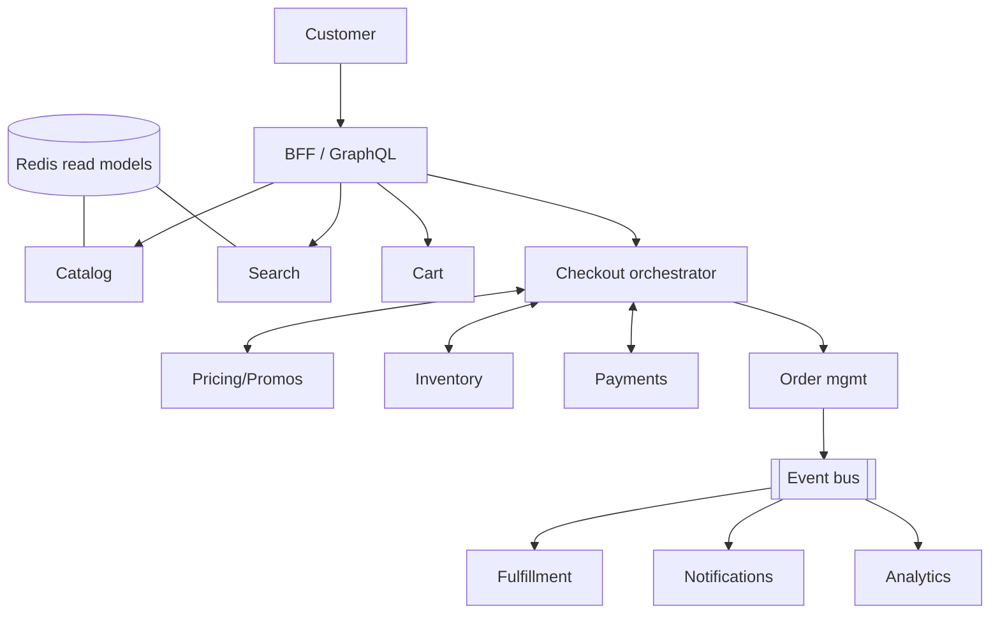
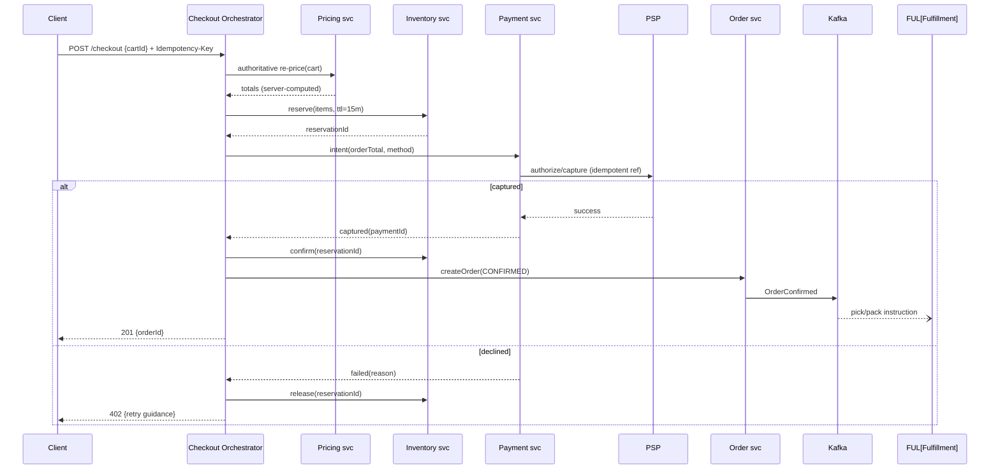
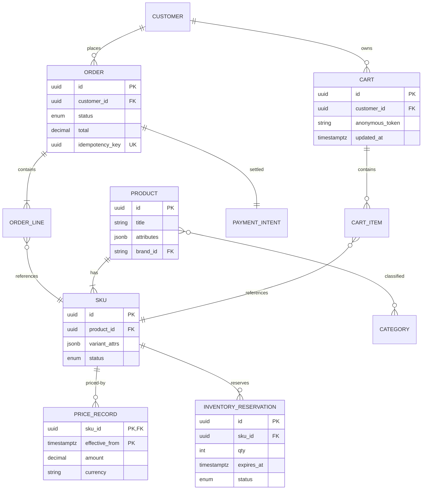

# Design E-commerce System

## Blogs and websites

## Medium

## Youtube

- [Design a Fault Tolerant E-commerce System | System Design](https://www.youtube.com/watch?v=wiBSjzDyA48)

---

## Theory

An e-commerce system is the general form of the marketplace problem: catalog discovery, cart management, checkout, payments, order lifecycle, and fulfillment composed into one customer journey. Where the Amazon/Flipkart topic emphasizes planetary scale, this topic covers the **canonical architecture** — the design you'd build for a serious mid-to-large retailer — with fault tolerance as the organizing requirement: every subsystem must fail without taking revenue down.

### Important Subtopics

1. Requirements scoping (customer journey vs seller portal vs admin)
2. Catalog modeling: products, variants, SKUs, categories
3. Read-path scaling: caching tiers and CDN strategy
4. Cart & session design
5. Pricing/promotions evaluation
6. Inventory correctness at checkout (reserve/confirm)
7. Checkout orchestration & idempotency
8. Payment integration patterns (PSP abstraction)
9. Order state machine & event-driven downstreams
10. Search & browse infrastructure
11. Fault-tolerance patterns: bulkheads, circuit breakers, graceful degradation
12. Peak-event engineering (sales, launches)

### Customer Journey Decomposition

```
Discover → search/browse → PDP (product detail page)
Evaluate → reviews, Q&A, recommendations, price history
Commit   → add to cart → cart review → apply offers
Convert  → checkout (address, shipping, payment) → confirm
Fulfill  → warehouse pick/pack → ship → deliver
Post     → returns/refunds → reviews → support
```

Each stage has distinct traffic shape, consistency needs, and failure tolerance:

| Stage | Read:Write | Consistency | Can degrade? |
|---|---|---|---|
| Discover/Evaluate | ~1000:1 | Eventual | Yes — cached/stale fine |
| Commit (cart) | 10:1 | Session-strong | Partially |
| Convert (checkout/pay) | 1:1 | Strong (money+stock) | No |
| Fulfill | Write-heavy events | Eventually consistent | Queue-and-retry |

This table *is* the architecture: cache everything above the line, serialize correctness below it.

### Catalog Modeling

- **Product** = abstract sellable concept ("Nike Air Max 90"); **Variant/SKU** = concrete purchasurable unit ("size 42, white") carrying its own price/stock/images.
- Attributes modeled as typed facets (brand, color, size) powering both filters and SEO pages.
- Denormalized read models per surface: `pdp_view` blob (product+variants+media+badges), `listing_row` (title+price+rating+thumb), rebuilt via CDC on catalog changes — page renders become single lookups.
- Categories as DAG not tree (a product lives in multiple taxonomies); navigation facets computed offline.

### Inventory Correctness

The reserve→confirm→release lifecycle (detailed in the amazon-flipkart and bookmyshow topics) applies identically here. The mid-size nuance: many retailers run **oversell buffers** — display stock minus safety margin — trading rare oversells (apologized with gift cards) against lost sales from conservative counts. Policy is a business lever, not just an engineering constant.

### Payment Integration

Abstract PSPs behind an internal interface: authorize/capture/refund operations + webhook normalization. Rules that prevent classic incidents: never trust client-reported payment status; treat webhooks as truth; reconcile daily against settlement files; support retry-with-idempotency on all money calls. See payment-gateway and stripe topics for depth.

### Order Lifecycle Events

Order placement emits `OrderConfirmed` onto Kafka; consumers own notifications, warehouse dispatch, invoicing, loyalty, analytics, fraud review. The OMS persists a state machine (`CREATED→CONFIRMED→PICKED→SHIPPED→DELIVERED` + cancel/return branches) with every transition audited — the spine other systems trust.

---

## Characteristics

- **Read-dominant with narrow write-critical paths**: browsing scales horizontally forever via caches; only inventory/payment/order writes demand strict serialization.
- **Burst-susceptible demand**: campaigns create 10–100× spikes in minutes; capacity planning and degradation ladders are core competencies, not afterthoughts.
- **Multi-surface consistency**: app, web, kiosk, marketplace feeds must show coherent prices/stock — solved by shared read-model services rather than N integrations.
- **Money-adjacent correctness**: pricing errors and duplicate charges carry legal/regulatory weight; server-side recomputation of totals is non-negotiable.
- **Seasonal capacity economics**: infrastructure sized for Black Friday sits idle most of the year — elasticity (autoscaling, serverless edges) converts capex to opex.
- **Integration-heavy**: PSPs, carriers, ERPs, marketplaces each bring flaky APIs — anti-corruption layers and circuit breakers throughout.
- **Personalization-permeated**: recommendations, ranking, and offers touch every surface; feature stores and experimentation platforms sit beneath.

---

## Components

- **Web/mobile BFF**
  *Purpose*: tailor APIs per client class. *Responsibilities*: aggregation, authn, A/B exposure, telemetry. *Example*: GraphQL federation serving app-specific shapes from shared domain services.

- **Catalog service**
  *Purpose*: product/SKR truth + read models. *Responsibilities*: ingestion pipelines (feeds, PIM sync), denormalization, media metadata. *Relationship*: feeds search indexers and pricing.

- **Search service**
  *Purpose*: query understanding + ranked retrieval. *Responsibilities*: autocomplete, typo tolerance, facet filtering, relevance tuning, merchandising slots. *See* dedicated search-engine and ecommerce-search-ranking topics.

- **Cart service**
  *Purpose*: persistent carts across devices/sessions. *Responsibilities*: merge-on-login rules, price revalidation hooks, promotion placeholders. Storage: Redis/DynamoDB-class KV.

- **Pricing & promotions engine**
  *Purpose*: compute authoritative totals. *Responsibilities*: base prices, markdown schedules, coupon stacking rules, tax calculation, deterministic replay for audits. Must be the single source customers can't argue with.

- **Inventory service**
  *Purpose*: availability truth + reservations. Covered in Theory.

- **Checkout orchestrator**
  *Purpose*: coordinate the conversion saga. *Responsibilities*: validate cart → price → reserve stock → take payment → create order, with compensation at each step and idempotency keys throughout.

- **Payment service**
  *Purpose*: PSP abstraction + ledger of attempts. *Responsibilities*: routing across PSPs (cost/failure-based), webhook verification, refund orchestration, reconciliation feeds.

- **OMS**
  *Purpose*: order state authority. Covered in Theory.

- **Fulfillment integration**
  *Purpose*: WMS/carrier bridges. *Responsibilities*: pick/pack instructions out, tracking events in, exception handling (damaged, lost).



---

## Patterns

- **CQRS-lite with CDC refresh**: normalized operational stores, denormalized read blobs, change-data-capture keeping them fresh within seconds. Solves read-scale without distributed transactions.
- **Saga-based checkout**: reserve → price-lock → capture → confirm with compensations (release, refund). Orchestrated for auditability.
- **Bulkhead isolation**: critical conversion path (checkout pool) separated from browsing path so a recommendation-service meltdown can't block "Buy Now". Pool-per-dependency thread/connection isolation plus circuit breakers (Resilience4j).
- **Graceful degradation ladder**: pre-defined feature shedding under load — kill recs, then reviews, then faceted filters, never cart/checkout. Feature-flagged, rehearsed in game days.
- **Idempotency-key protocol** on all mutating client APIs — mobile networks guarantee retries.
- **Anti-corruption layers** around PSP/carrier/ERP SDKs normalizing their quirks into internal contracts.
- **Event-carried state transfer**: order events carry enough payload (items, address snapshot) for consumers to act without read-back — decoupling availability of downstream systems.

---

## Benefits

- **Revenue resilience**: degradation ladders convert potential outage-days into slightly-degraded-hours during peaks.
- **Independent team velocity**: bounded contexts let squads ship weekly without cross-team lockstep releases.
- **Cost proportionality**: caching + CDN means infrastructure spend tracks actual usage skew rather than worst-case uniform load.
- **Extensibility**: new surfaces (voice, kiosk, marketplace syndication) consume existing read models instead of rebuilding commerce logic.
- **Auditability**: event-spined orders make disputes, refunds, and financial reporting mechanical.

---

## Pros

- Proven decomposition pattern reusable from startup to enterprise scale.
- Clear separation between cheap-correct (caches) and expensive-correct (money paths).
- Rich managed-services ecosystem (Stripe/Shippo/Algolia/Shopify components) accelerates assembly.

## Cons

- Distributed complexity tax: sagas, eventual consistency, and observability demands are real costs before first customer.
- Peak-capacity spend or sophisticated autoscaling investment unavoidable.
- Integration sprawl multiplies incident surfaces (every external API a liability).
- Data consistency UX work (stale prices resolved at checkout, stock disappointment messaging) is perpetual product effort.

---

## Challenges

- **Technical**: cart-merge conflicts at login; promotion stacking rule explosions; timezones in flash-sale windows; image/media pipeline throughput.
- **Scalability**: hot product launches melting single-SKU inventory rows; search-index rebuild storms during mass repricing; notification bursts post-campaign.
- **Performance**: PDP p95 budgets (<300 ms) while composing 6+ sources — read-model caching answers; checkout latency directly correlates with abandonment (every 100 ms measurable).
- **Reliability**: PSP brownouts during peak (multi-PSP failover routing); carrier API flakiness (queue-and-retry with tracking backfills); partial checkout failures needing precise compensations.
- **Maintainability**: catalog schema evolution across years; promotion-engine rule debt; deprecated-client long tails.
- **Operational**: sale-readiness rehearsals; DR drills; cost observability per campaign.
- **Security/fraud**: card-testing attacks (small auths en masse), account takeover on saved cards, promo abuse rings, scraping of catalog/pricing — layered defenses from gateway limits through ML risk scoring.

---

## Best Practices

- **Recompute all monetary amounts server-side**; treat client totals as display-only.
- **Make every mutation idempotent** with documented key lifetimes (24 h typical).
- **Reserve-then-confirm inventory** with TTLs tuned to payment-method latency profiles (UPI fast → short holds; COD → longer).
- **Cache aggressively above the money line**, invalidate precisely via CDC events.
- **Build degradation modes as features** — flag-gated, load-tested, dashboard-visible; never improvised.
- **Isolate payment retries behind idempotency + circuit breakers**; duplicate charges destroy trust faster than downtime.
- **Emit domain events for everything post-order**; analytics/ML/notifications hang off this spine without touching checkout code.
- **Load-test at 1.5× forecast with realistic journeys** (browse-heavy mixes, bot floods, payment-failure rates elevated).
- **Instrument the funnel end-to-end**: view→cart→checkout-start→pay-attempt→success ratios pinpoint revenue leaks precisely.

---

## When to Use / Not Use

**Build custom when**: differentiation lives in commerce experience itself; scale/complexity outgrows SaaS; data/control requirements (custom pricing engines, B2B contracts) exceed platform extensibility.

**Buy/platform-first when**: early-stage validation (Shopify/BigCommerce gets you selling in days); small teams; standard B2C retail without exotic needs. Headless commerce (composable: commercetools, Medusa, Saleor) splits the difference — platform cores with custom frontends.

Decision factors: expected GMV trajectory, team size/composition, uniqueness of business model (subscriptions? rentals? B2B terms?), total-cost-of-ownership appetite, regulatory footprint.

---

## Use Cases

- **D2C brand scaling past Shopify limits**
  *Problem*: subscription + customization options break SaaS constraints; fees scale painfully. *Solution*: headless frontend over custom order/cart services, keep Shopify-lite for catalog admin initially. *Trade-off*: engineering investment vs margin recovery and flexibility.

- **Marketplace expansion (single-retailer → multi-vendor)**
  *Problem*: vendor onboarding, split payments, commission accounting. *Solution*: seller portal as new bounded context; checkout composes multi-seller baskets into per-seller sub-orders; PSP split-captures (Stripe Connect-class) settle commissions mechanically. *Trade-off*: return/refund flows fragment per seller policy.

- **Flash-sale resilience retrofit**
  *Problem*: campaigns crash the site exactly when ROI peaks. *Solution*: waiting-room admission for deal SKUs, pre-warmed caches, cell-isolated inventory for hero products, degradation ladder armed. *Trade-off*: queue honesty frustrates some users but converts crashes into sales.

---

## High-Level Design

Checkout flow with compensation:



Scaling: static+catalog reads offloaded to CDN/Redis (95%+ hit targets); checkout/inventory sized for peak-write with headroom; Kafka partitions keyed orderId; autoscaling on funnel-stage RPS.

Failure handling: any step failure triggers defined compensation; ambiguous payment states park in AWAITING_CONFIRMATION pending webhook/reconciliation; region loss shifts traffic with cart/session replication lag accepted (re-auth flows).

---

## Deep Dive

- **Promotion determinism**: same cart+time must yield identical totals across app/server/support tools — achieved by pure functions over versioned rule sets with effective-dating; disputes replay historical rule versions. Non-deterministic personalization discounts isolated to clearly-labeled surfaces.
- **Hot-SKU launch mechanics**: celebrity sneaker drop = bookmyshow-style contention; solutions transfer directly (serialized decrements, admission control, honest queues). Difference: e-commerce often prefers oversell-buffer + apology over hard queue walls for brand reasons.
- **Search freshness vs cost**: full reindex nightly + incremental CDC updates hourly + instant price/stock overlays at query time — three-tier freshness matching each field's volatility. Facet counts approximated under load (documented).
- **Observability**: business-funnel metrics as first-class alerts (conversion drops precede infra alerts!), synthetic purchase journeys per region hourly, per-step checkout latency attribution, inventory-drift reconciliations continuous.

---

## Data Modeling



Choices: price history as effective-dated records (auditable, supports "was/now" displays); reservations TTL-indexed for sweepers; unique idempotency constraint structuralizes dedupe; categories many-to-many via bridge. Partitioning: orders by month (archive-friendly); carts ephemeral-ish in KV with DB backup snapshots.

---

## Java and Spring Boot Implementation

Cart merge on login:

```java
@Service
public class CartService {

    private final CartRepository carts;

    @Transactional
    public Cart mergeOnLogin(String anonToken, UUID customerId) {
        var anon = carts.findByAnonymousToken(anonToken);
        if (anon.isEmpty()) return carts.activeFor(customerId);
        var user = carts.activeFor(customerId);
        anon.get().items().forEach(item ->
            user.mergeItem(item.skuId(), item.qty()));   // sums quantities, caps at maxPerSku
        carts.release(anonToken);
        return carts.save(user);
    }
}
```

Checkout orchestrator skeleton with compensation:

```java
@Service
public class CheckoutOrchestrator {

    private final PricingClient pricing;
    private final InventoryClient inventory;
    private final PaymentClient payments;
    private final OrderService orders;

    @Transactional
    public CheckoutResult start(CheckoutRequest req, String idemKey, String customerId) {
        Totals totals = pricing.recalculate(req.cartId());          // authoritative
        Reservation rsv = inventory.reserve(req.cartId(), Duration.ofMinutes(15));
        try {
            Capture cap = payments.capture(totals.grandTotal(), idemKey);
            Order order = orders.createConfirmed(req.cartId(), totals, cap.paymentId());
            inventory.confirm(rsv.id());
            return CheckoutResult.confirmed(order.id());
        } catch (PaymentDeclinedException e) {
            inventory.release(rsv.id());                             // compensation
            throw e;                                                 // mapped to 402 upstream
        }
    }
}
```

Exception mapping:

```java
@RestControllerAdvice
public class CommerceApiExceptionHandler {

    @ExceptionHandler(PaymentDeclinedException.class)
    ResponseEntity<?> declined(PaymentDeclinedException ex) {
        return ResponseEntity.status(HttpStatus.PAYMENT_REQUIRED)
                .body(Map.of("error", "PAYMENT_DECLINED", "reason", ex.reason()));
    }

    @ExceptionHandler(OutOfStockException.class)
    ResponseEntity<?> oos(OutOfStockException ex) {
        return ResponseEntity.status(HttpStatus.CONFLICT)
                .body(Map.of("error", "OUT_OF_STOCK", "skuIds", ex.skuIds()));
    }
}
```

Notes: orchestrator keeps the happy path linear and compensations adjacent to their steps — reviewable at a glance; clients see precise error classes enabling targeted UX (retry-payment vs remove-item). Testing: Testcontainers suites driving decline/release paths, concurrent last-unit purchases asserting single winner, WireMock PSP brownout scenarios exercising idempotent retries.

---

## Real-World Examples

- **Shopify** — powers millions of stores proving the platform-first thesis; its architecture talks (multi-tenant sharding, checkout isolation) inform even custom builds.
- **Amazon** — the reference for read-model CQRS at extreme scale; "available to promise" inventory and service-per-team org-design lessons embedded throughout this doc.
- **Flipkart Big Billion Days** — published war-room practices: cell isolation, rehearsal culture, degradation ladders — the peak-engineering playbook.
- **Zalando** — fashion-specific challenges (size-curve inventory, returns >50%) driving their move to composable architecture; their engineering blog documents the evolution honestly.

---

## Interview Preparation

### Interview Questions

**Beginner**

1. **What are the core functional requirements of an e-commerce system?**
   Catalog browse/search, product details, cart/wishlist, promotions, checkout with payment, order tracking, returns; plus seller/admin surfaces. Non-functional: HA, low-latency reads, strict correctness on money/stock, burst tolerance.
2. **Why is the read path cached so aggressively?**
   Reads outnumber writes ~1000:1 and tolerate seconds of staleness; caching converts massive browse traffic into manageable origin loads while reserving strong-consistency machinery for the tiny write-critical path.

**Intermediate**

3. **Walk through what happens between "Place Order" and confirmation.**
   Server-side re-pricing → inventory reservation (TTL hold) → payment authorization/capture with idempotent reference → order creation → reservation confirmation → event emission. Each step's failure path named (release reservation, refund capture, park-on-ambiguity). Interviewers listen for compensation completeness.
4. **How do you handle stale cart prices discovered at checkout?**
   Deliberate UX contract: carts show indicative prices; checkout always re-validates server-side; discrepancies surfaced explicitly ("price changed") with accept/update choices. Never silently charge either old or new without disclosure — trust mechanics matter more than convenience.
5. **Design the inventory model for a product with 500 variants.**
   Per-SKU stock rows (variant-level truth), product-level aggregate views for display, reservation table keyed SKU with TTLs, hot-SKU strategies available (bucketed counters) for launch moments. Discuss where "size runs low" badges come from (aggregate projections).

**Advanced**

6. **A marketing email accidentally links 2M users to a dead product page simultaneously. What happens and how does good design absorb it?**
   Cache stampede on 404 (negative-cache it), redirect logic serves nearest-alternative from precomputed recommendations, no origin storm due to edge caching of misses coalescing, monitoring flags anomaly. Contrast with naive design (origin melts). Teaches defensive-cache thinking.
7. **Design multi-country operation: currencies, tax, localization.**
   Currency-aware price books (FX-refresh cadence, rounding rules per locale), tax engines as pluggable regional services (GST/VAT/sales-tax differ structurally), locale-specific catalogs (assortment restrictions), payment-method matrices per market (UPI/iDEAL/cards), data-residency shaping storage topology. Emphasize composition over monolithic "internationalization".

**Senior / system design**

8. **Architect for a company doing $1B GMV with 80% of revenue in 6 sale hours/year.**
   Cell-based architecture isolating sale traffic, pre-provisioned + autoscaled hybrid, waiting rooms, degradation ladder rehearsed quarterly, cost model accepting idle-vs-spot mix, chaos drills scheduled against the calendar. The senior signal: treating the calendar as the primary capacity artifact.
9. **When should a retailer NOT build this themselves?**
   Under ~$10M GMV without unique model constraints — SaaS wins decisively (build-vs-buy math: engineering salaries vs platform fees); also regulated verticals lacking compliance teams. Articulate switching costs both directions honestly.

### Common Mistakes

- Trusting client-submitted totals/prices anywhere near payment execution.
- Missing idempotency on payment/order endpoints — duplicate charges during mobile retries.
- Holding DB locks across payment calls (connection-pool death during PSP slowness).
- Uniform strong consistency everywhere — browse latency becomes unusable.
- No degradation plan: first traffic spike becomes first outage.

### Expected discussion points

Consistency-tier mapping per journey stage, compensation completeness, peak-calendar economics, buy-vs-build judgment, and security posture spanning payments/fraud/abuse.
