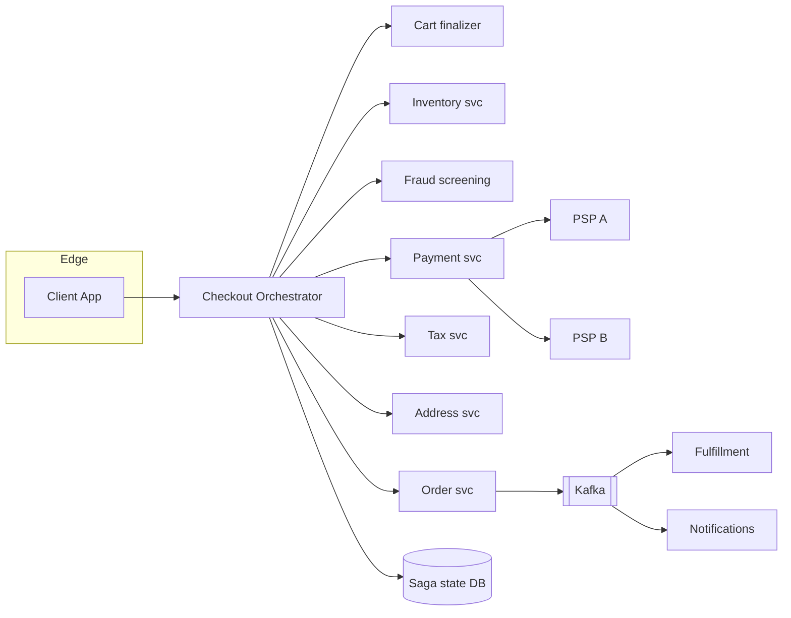
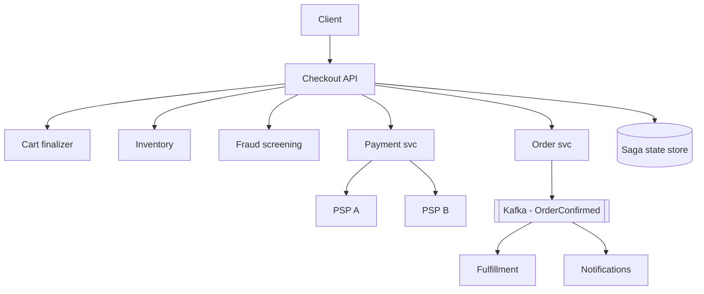
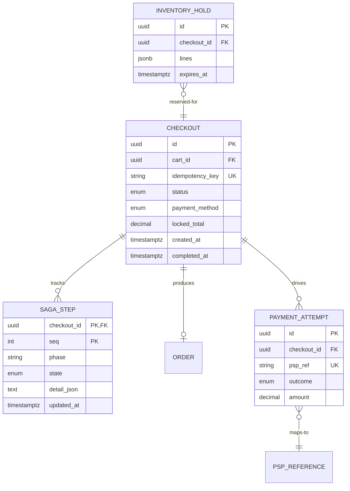
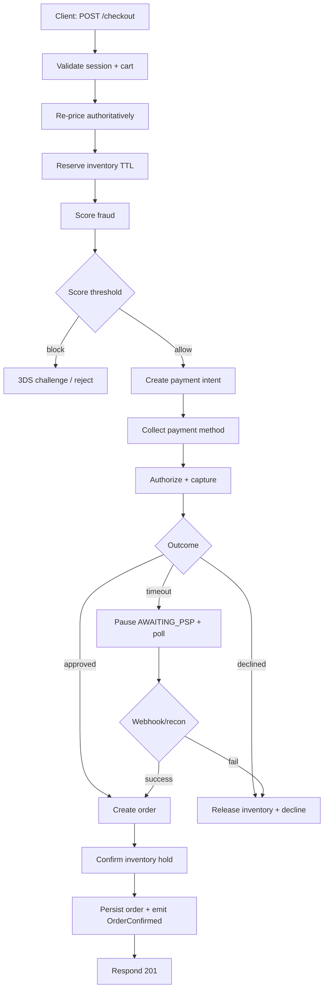
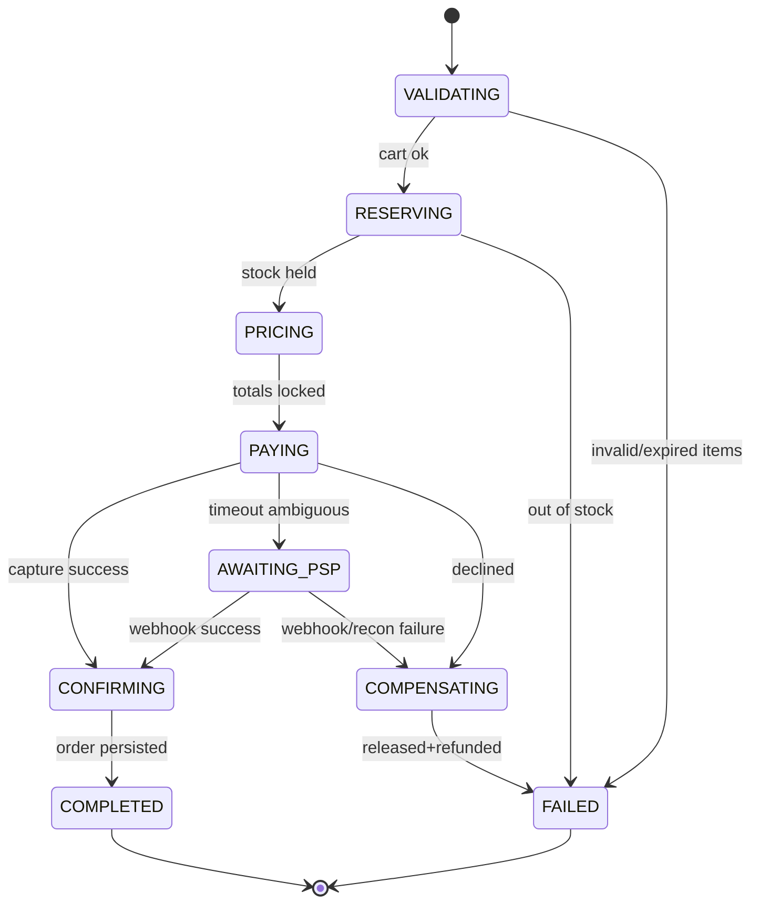
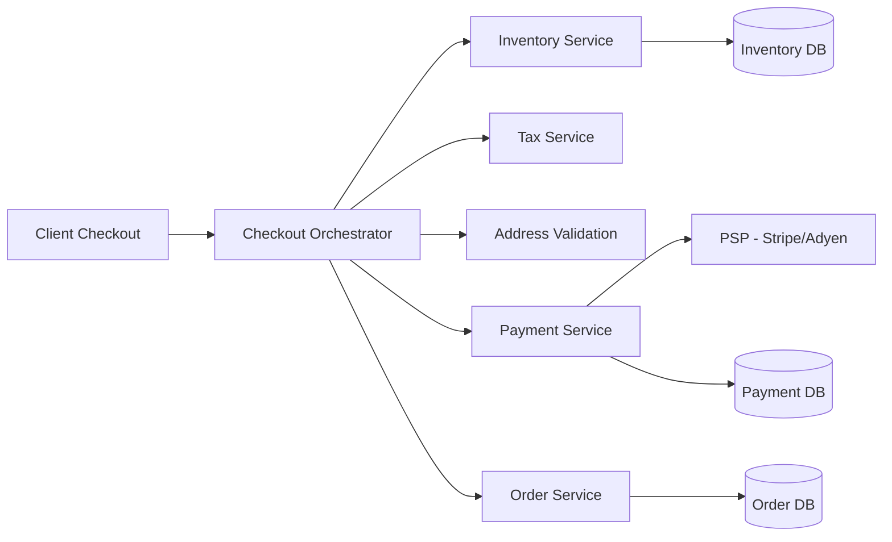
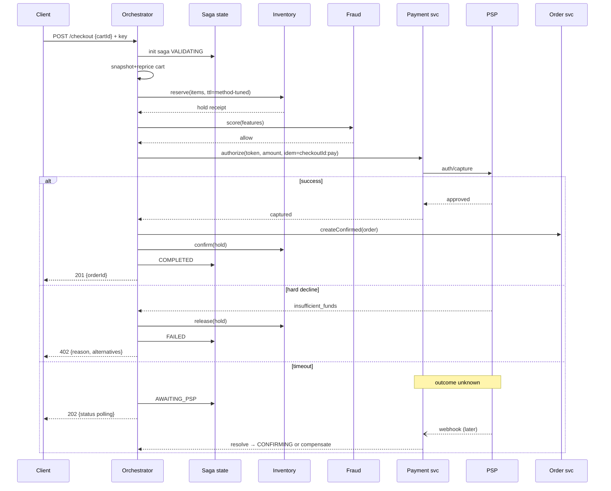

# Design E-commerce Checkout System

> Design a fault-tolerant e-commerce checkout flow that coordinates cart finalization, server-side re-validation, inventory reservation, tax/promotion computation, payment orchestration across multiple PSPs, order creation, and reconciliation — delivering sub-800 ms p95 latency for card payments while surviving PSP outages, ambiguous responses, and flash-sale bursts without losing a single rupee or overselling a single unit.

## Blogs and websites

## Medium

- [Building an E-commerce Checkout System: Distributed Transactions, Saga Patterns, and Reliability](https://towardsdev.com/building-an-e-commerce-checkout-system-distributed-transactions-saga-patterns-and-reliability-44743ae650d6)

## Youtube

---

## Theory

### Topics Covered

1. [Introduction / Problem Statement](#introduction--problem-statement)
2. [Characteristics](#characteristics)
3. [Pros](#pros)
4. [Cons](#cons)
5. [Use Cases](#use-cases)
6. [Components](#components)
7. [Architectural Patterns](#architectural-patterns)
8. [Benefits](#benefits)
9. [Challenges](#challenges)
10. [Best Practices](#best-practices)
11. [When to Use / When Not to Use](#when-to-use--when-not-to-use)
12. [Data Model and API](#data-model-and-api)
13. [Checkout and Payment Orchestration Deep Dive](#checkout-and-payment-orchestration-deep-dive)
14. [Replication Strategies](#replication-strategies)
15. [Failure Detection and Membership](#failure-detection-and-membership)
16. [High Availability and Scalability](#high-availability-and-scalability)
17. [Performance and Optimization](#performance-and-optimization)
18. [CAP Theorem and Consistency Trade-offs](#cap-theorem-and-consistency-trade-offs)
19. [Encryption and Key Management](#encryption-and-key-management)
20. [Authentication and Authorization](#authentication-and-authorization)
21. [Security Threats and Mitigations](#security-threats-and-mitigations)
22. [Observability and Logging](#observability-and-logging)
23. [Real-World Implementations](#real-world-implementations)
24. [Java and Spring Boot Implementation Guide](#java-and-spring-boot-implementation-guide)
25. [Interview Questions and Answers](#interview-questions-and-answers)

---

### Introduction / Problem Statement

Checkout is the highest-stakes flow in commerce: it converts intent into money movement and stock commitment within a few seconds while the user watches. Everything that can fail — PSPs, inventory, address validation, tax engines — sits directly on this path. The design goal is **linearizable correctness on the money/stock path wrapped in an experience that survives every dependency's bad day**, because every 100 ms of latency and every unexplained failure measurably reduces conversion.

Checkout systems exist to make this critical path as reliable and fast as possible — orchestrating payment processors, inventory systems, tax calculators, and shipping estimators while maintaining data integrity across all of them. Unlike browsing or cart management (where a timeout means a delayed UX), a checkout failure means a lost sale that may never come back. The system must ensure both succeed or both roll back.

**Problem Statement:** Design an e-commerce checkout system that takes a finalized cart, authoritatively re-prices it, reserves inventory, screens fraud, authorizes a payment through one or more PSPs, creates an order, and reconciles every ambiguous outcome — all under a sub-800 ms p95 latency budget for card payments while remaining correct during PSP outages, network partitions, and flash-sale bursts.

The defining tensions are:

- **Money + stock atomicity**: a successful charge with a failed reservation creates an unfulfillable phantom stockout; a released reservation after a completed charge loses revenue. The system must guarantee both succeed or both roll back.
- **PSP unreliability**: payment providers are slow and flaky, especially during sales. The system must handle timeouts, retries, and ambiguous responses without double-charging.
- **Latency vs. correctness**: payment authorization can take 300 ms–3 s; everything else must be cached, parallelized, or pre-computed so PSP latency is the only whale.
- **Race conditions**: two concurrent checkouts for the last unit must be serialized so only one succeeds.



*The orchestration topology: a stateless Checkout Orchestrator owns the saga and persisted state, fanning out to specialized services (pricing, inventory, fraud, payment, tax, address) and coordinating compensations; downstream events flow through Kafka to fulfillment and notifications.*

---

### Characteristics

- **Latency-sensitive conversion mechanics**: abandonment curves are steep; every architectural choice trades milliseconds against reliability.
- **Money-and-stock atomicity island**: inside a mostly-eventual commerce system, this flow demands saga discipline with full compensation coverage.
- **Dependency-dominated**: PSP latency/failure profiles dictate UX shape more than internal code quality does.
- **Idempotency-permeated**: mobile networks retry constantly; orchestrators crash mid-step; every mutation keyed accordingly.
- **Fraud-contested**: velocity checks and ML scores gate progression without adding perceptible latency for good customers.
- **Multi-modal**: guest checkout, express one-click, subscription renewals share the pipeline with different entry points but identical core saga.
- **Ambiguity-bound**: PSP timeouts are the norm, not the exception; the system must park and reconcile rather than guess.
- **Multi-PSP**: routing across acquirers for availability, latency, and cost; decline-code anti-corruption normalises vendor-specific responses.

---

### Pros

- Well-bounded problem with industry-standard solutions (saga, idempotency, reservation).
- Per-step instrumentation yields unusually actionable observability.
- Compensation discipline generalizes to the rest of the commerce platform.
- Honest pending states preserve customer trust through incidents.
- Extensible method matrix — new payment methods plug in as routing entries.

---

### Cons

- State-machine machinery adds real complexity for what looks like "just a form".
- PSP ambiguity windows create genuine engineering pain (reconciliation loops).
- Latency budgets constrain implementation choices (no chatty microservice chains).
- Testing requires extensive fault-injection harnesses to be meaningful.

---

### Use Cases

- **Flash-sale checkout surge**
  *Problem*: 50K users hit Buy Now simultaneously; hero SKU has 500 units. *Solution*: admission control upstream (waiting room), per-SKU serialized reservation, express-path prioritization (saved-instrument users convert fastest), honest sold-out messaging with waitlist capture. *Trade-off*: queue fairness vs conversion speed tension resolved by product policy.
- **UPI-heavy market checkout**
  *Problem*: 60% of payments are UPI intents with 5–30 s approval latencies and high abandonment. *Solution*: long-poll status endpoints, reservation TTLs auto-extended once, push-notification nudges, explicit cancel affordances releasing stock immediately. *Trade-off*: extended holds reduce sellable stock briefly — tuned via measured completion distributions.
- **B2B checkout with credit terms**
  *Problem*: purchase orders, credit limits, approvals replace card flows. *Solution*: saga branches to credit-check + PO-validation services; multi-step approvals parked with SLA timers; invoicing events feed ERP integration. *Trade-off*: longer cycle times accepted; fraud profile shifts to identity/limit abuse.
- **Express one-click reordering**
  *Problem*: returning customers with saved instruments demand < 2 s checkout. *Solution*: network-token vaulting cuts PSP latency, saved address/instrument skip user-input stages, risk automation keeps fraud low. *Trade-off*: trust calibration — aggressive auto-capture raises fraud, conservative capture drops conversion.
- **Cross-border checkout**
  *Problem*: multi-currency, tax-inclusive pricing, customs duties on a single order. *Solution*: currency service locks FX rates at finalize; tax service computes import duties; PSP routes by region. *Trade-off*: rate-lock windows vs. price changes; duty-estimation accuracy vs. surprise charges at delivery.
- **Guest vs. authenticated checkout**
  *Problem*: friction of account creation loses 20%+ of carts. *Solution*: first-class guest path with optional account creation post-purchase; idempotent customer-stitch on email if an account later exists. *Trade-off*: guest recoverability (no order history) vs. conversion rate.

---

### Components

- **Checkout API/orchestrator**
  *Purpose*: own the saga end-to-end. *Responsibilities*: step sequencing, persisted saga state (resumable), compensation execution, idempotency enforcement, timeout policies per step. *Relationship*: coordinates pricing/inventory/payment/address services.
- **Cart finalizer**
  *Responsibilities*: snapshot cart contents immutably at start (cart edits mid-checkout can't corrupt the run), detect expired/changed SKUs, structured-diff responses.
- **Inventory gateway**
  *Responsibilities*: reserve/confirm/release with TTLs tuned per payment method; expose hold receipts consumed at confirm.
- **Payment service**
  *Purpose*: PSP abstraction + method routing. *Responsibilities*: instrument tokenization handling, authorization/capture/refund calls with idempotent refs, webhook endpoint verification, multi-PSP failover routing, attempt ledger.
- **Fraud screening service**
  *Responsibilities*: pre-auth feature assembly (device fingerprint, velocity, basket anomalies), score thresholds → allow/challenge/deny, post-auth review queue feeds.
- **Order creator**
  *Responsibilities*: persist confirmed order atomically with confirmation event (outbox), trigger fulfillment fan-out.
- **Notification service**
  *Responsibilities*: confirmation emails/SMS/push; pending-state updates for slow methods (UPI).



*Component wiring: the orchestrator is the only component that touches all others; each downstream service owns its data and emits events for async fan-out (order → fulfillment, notifications).*

---

### Architectural Patterns

- **Orchestrated saga with persisted state**
  *What*: each step transition recorded (`(checkoutId, phase)` rows) enabling crash-resume; compensations pre-declared per step. *Solves*: distributed atomicity with operational visibility. *When*: any multi-service conversion flow. *Pros*: resumability, audit trail, per-step metrics. *Cons*: state-store becomes critical (replicate well).
- **Idempotency-key protocol**
  Client generates UUID per checkout attempt; all downstream calls derive keys deterministically (`checkoutId:step`). Retries anywhere collapse safely. Non-negotiable baseline.
- **Reservation-with-TTL (payment-aware)**
  Hold duration parameterised by chosen method; expiry sweeper releases; confirm converts holds permanent. Prevents both oversell and stock-stranding.
- **Ambiguity parking (AWAITING_PSP)**
  Explicit terminal-pending state with resolution paths (webhook, reconciler). Converts unknown-outcomes into managed workflows instead of support tickets.
- **Anti-corruption around PSPs**
  Normalise heterogeneous decline codes/webhooks into internal taxonomy (`INSUFFICIENT_FUNDS`, `ISSUER_UNAVAILABLE`, …) driving consistent UX across acquirers.
- **Progressive enhancement for express paths**
  One-click flows reuse the same saga with pre-supplied steps (saved address/instrument skip user-input stages) — not a separate fragile fast-path.

---

### Benefits

- **Conversion protection**: sub-second reliable checkout measurably lifts revenue versus flaky flows; the ROI of this architecture is direct.
- **Failure containment**: PSP outages degrade to clear messaging + alternate-method prompts rather than order black holes.
- **Operational clarity**: per-step metrics pinpoint exactly which dependency regressed when conversion drops overnight.
- **Trust preservation**: honest pending states + guaranteed no-double-charges preserve the customer relationship through incidents.
- **Extensibility**: new payment methods integrate as new routing entries without touching orchestration logic.

---

### Challenges

- **Technical**: exactly-once charge semantics over at-least-once transports; saga crash-resume correctness; clock-skew in TTL enforcement; concurrent checkouts racing last units.
- **Scalability**: flash-sale bursts hitting step-4 inventory serialization; PSP rate limits during campaigns (token-bucket pacing toward acquirers).
- **Performance**: step-6 whale dominating p99 — mitigations: pre-auth optimizations, network tokens, regional PSP routing.
- **Reliability**: multi-PSP health-based routing; saga-state store HA; webhook endpoint availability under attack.
- **Maintainability**: PSP API deprecations (annual migration treadmill); fraud-model retraining cadence.
- **Operational**: reconciliation break queues; decline-rate anomaly triage; peak-event readiness drills.
- **Security**: PCI scope containment (tokenization everywhere), card-testing absorption (gateway limits + bot defense), account-takeover on saved instruments (step-up auth).

---

### Best Practices

- **Snapshot the cart at checkout start** — immutable inputs make replays/debugging deterministic.
- **Tune reservation TTLs per payment method**; sweep expiries aggressively with observable lag metrics.
- **Never trust client-side totals**; return structured diffs on mismatch rather than errors.
- **Design the ambiguity path deliberately**: park → webhook-or-reconcile → resolve; never blind-refund on timeout.
- **Instrument the funnel per step per method per region**; alert on stage-conversion drops (they precede revenue alarms).
- **Keep PSP integrations behind anti-corruption facades** with contract tests against sandbox fixtures.
- **Load-test with realistic failure mixes** (elevated declines, PSP latency injections, partial inventory contention).
- **Encrypt/tokenize ruthlessly**: PANs never touch your systems beyond PSP-hosted fields; audit-log redaction verified.

---

### When to Use / When Not to Use

**Full saga machinery when**: multiple payment methods, meaningful scale (>few orders/min), PSP diversity, brand tolerance for pending-states over lost orders.

**Simplify when**: tiny volume single-PSP shops — a transactional monolith (order+payment in one DB txn against hosted checkout pages) is legitimately better early.

Alternatives/complements: PSP-hosted checkout (Stripe Checkout shifts PCI+UX burden out entirely), buy-now-pay-later SDKs embedding their own flows, wallet-only models collapsing the method matrix.

Decision factors: GMV scale, method mix, team size, PCI appetite, differentiation value of checkout UX itself.

---

### Data Model and API

The checkout domain persists four core aggregates: the immutable `Checkout` (saga root), per-step `SagaStep` rows, append-only `PaymentAttempt` ledger entries, and `InventoryHold` rows. Together they give full auditability plus deterministic crash-resume.



*Entity relationships: a `Checkout` owns an ordered chain of `SagaStep` rows (the durable state machine), drives append-only `PaymentAttempt` rows (each mapping to a `PSP_REFERENCE`), and holds an `InventoryHold`. An `Order` is produced only at the terminal CONFIRMED phase. Cart contents are snapshotted at start so the checkout is self-contained.*

**Design choices:**

- Cart snapshot embedded as JSONB on the `Checkout` row → checkouts are self-contained and replays are deterministic.
- Unique `idempotency_key` structuralises dedupe at the API edge.
- `PaymentAttempt` rows are append-only → they form the payment audit spine used by the reconciliation job.
- `InventoryHold.expires_at` is TTL-indexed for the sweeper.
- `SagaStep` rows carry an epoch for lease fencing.

**Partitioning & retention:** checkouts by month (UUID v7 sort key); hot window on NVMe; archive to columnar storage after 90 days (analytics retain forever). `PaymentAttempt` and `SagaStep` are append-heavy → partitioned by `(checkout_id, seq)` hash.

#### Checkout Session API

| Method | Endpoint | Purpose |
|---|---|---|
| POST | `/api/v1/checkout/sessions` | Create a new checkout session |
| GET | `/api/v1/checkout/sessions/{id}` | Get session status + available actions |
| POST | `/api/v1/checkout/sessions/{id}/payment` | Submit payment instrument |
| POST | `/api/v1/checkout/sessions/{id}/confirm` | Confirm and finalize order |
| POST | `/api/v1/checkout/sessions/{id}/cancel` | Cancel the session |
| POST | `/api/v1/checkout/sessions/{id}/expire` | Expire due to timeout |

**POST /api/v1/checkout/sessions — Request Body:**
```json
{
  "cart_id": "cart_abc123",
  "customer_id": "cus_xyz",
  "return_url": "https://shop.example.com/checkout/complete",
  "cancel_url": "https://shop.example.com/cart"
}
```

**GET /api/v1/checkout/sessions/{id} — Response:**
```json
{
  "session_id": "cs_987xyz",
  "status": "AWAITING_PAYMENT",
  "step": "payment",
  "amount": { "total": 129.99, "currency": "USD", "tax": 11.23 },
  "cart": {
    "items": [{"name": "Widget", "quantity": 1, "price": 99.99}],
    "shipping_options": ["standard", "express"]
  },
  "next_actions": ["submit_payment", "cancel"]
}
```

#### Payment API

| Method | Endpoint | Purpose |
|---|---|---|
| POST | `/api/v1/payments/intents` | Create payment intent |
| GET | `/api/v1/payments/intents/{id}` | Get payment status |
| POST | `/api/v1/payments/intents/{id}/capture` | Capture authorized payment |

**POST /api/v1/payments/intents — Response:**
```json
{
  "intent_id": "pi_abc123",
  "status": "REQUIRES_PAYMENT_METHOD",
  "client_secret": "pi_abc123_secret_xyz",
  "amount": 129.99,
  "currency": "USD"
}
```

#### Status Codes

| Code | Meaning |
|---|---|
| 200 | Session retrieved |
| 201 | Session created |
| 400 | Invalid request or session in wrong state |
| 404 | Session not found |
| 409 | State conflict (e.g., confirm while pending payment) |
| 429 | Rate limited |
| 503 | PSP unavailable |

**Idempotency & Timeout:** `POST /api/v1/checkout/sessions` accepts an `Idempotency-Key` header for safe retries. Sessions expire after 15 minutes of inactivity (`expires_at` field). Versioned via URL prefix (`/api/v1/`).

---

### Checkout and Payment Orchestration Deep Dive

This deep dive covers the cart-to-payment flow, payment-gateway integration, order creation, payment-failure handling, and refunds — the part of checkout where money, stock, and distributed state machines collide. It is organised as a latency-budgeted step anatomy, the resumable saga, the payment-method matrix, deliberate ambiguity handling, a complete flow diagram, the crash-resume and reconciliation mechanics, and a Spring Boot reference orchestrator.

#### Cart-to-Payment Flow & Latency Budgets

A typical checkout POST sequence with target budgets:

```
1. Validate session/cart integrity        ~20 ms   (cached lookups)
2. Re-price cart authoritatively          ~30 ms   (pricing svc, cached rules)
3. Validate/normalize address             ~50 ms   (address svc + carrier validation)
4. Reserve inventory                      ~40 ms   (atomic decrements)
5. Screen fraud signals                   ~30 ms   (rules+ML scoring inline)
6. Authorize payment                     300–3000 ms (PSP-bound — the whale)
7. Create order + confirm reservation     ~40 ms
8. Emit events, respond                   ~10 ms
─────────────────────────────────────────────────
Total p95 target                          < 800 ms (card), < 3 s worst-PSP
```

Step 6 dominates; the design implication is that everything else must be parallelized or cached, and payment UX must stream progress honestly ("contacting your bank…").

#### Cart-to-Payment Flow Diagram



*The canonical cart-to-payment flow: validation and re-pricing happen first against cached/authoritative sources, inventory is reserved with a payment-aware TTL, fraud is scored inline, then the payment intent is created and authorized. A successful capture produces the order and confirms inventory; a decline releases stock; a timeout parks in `AWAITING_PSP` and is resolved only by a verified webhook or reconciliation job.*

#### Server-Side Re-Validation

Clients display stale data by definition. At finalize:

- **Prices recomputed** from effective-dated price books + promotion engine replay (same cart+time = same total, always).
- **Stock re-checked** via reservation attempt — display counts advisory only.
- **Address normalized** (carrier APIs correct ZIP/city mismatches silently where legal).
- **Promotions re-evaluated** with their own terms (per-user caps, expiry windows).

Any mismatch returns a structured diff so UI can present precise choices instead of generic errors.

#### The Checkout Saga



Compensation ordering matters: release reservations before refunding (never leave money taken with stock held); both compensations idempotent keyed by checkoutId.

#### Payment Gateway Integration

Checkout never speaks to acquirers directly. A **Payment service** sits between the orchestrator and the PSPs as an anti-corruption layer that normalises tokenisation, authorisation/capture/refund, and webhook verification, then routes across multiple acquirers.

| Method | Typical latency | Failure mode | Design impact |
|---|---|---|---|
| Saved card (network token) | 0.5–2 s | Decline codes | Fast retry UX, instant fallback prompt |
| UPI intent | 2–30 s (user approves on phone!) | Timeout/user-abandon | Long-poll status, generous reservation TTL |
| COD | ~0 ms "payment" | Risk-based rejection | Eligibility checks replace PSP call |
| Wallet | <1 s | Balance shortfall | Top-up flow branching |

Reservation TTLs tune to these profiles automatically — one-size TTL either wastes stock (UPI users) or loses impatient card users.

**Integration patterns:**

- **Client-side tokenisation**: card data is tokenised by the PSP's hosted fields / SDK directly in the browser; raw PANs never reach checkout hosts (PCI scope reduction).
- **Webhook verification**: every PSP webhook is signature-verified, deduplicated by `psp_ref`, and idempotently funnels into `advance()`.
- **Multi-PSP routing**: a router selects the acquirer per `(region, currency, method)` from a health-weighted table; decline-code anti-corruption maps vendor codes into the internal taxonomy (`INSUFFICIENT_FUNDS`, `ISSUER_UNAVAILABLE`, `DO_NOT_HONOR`, `FRAUDULENT`) so the UI and retry policy are identical across providers.
- **Idempotent references**: every authorise/capture/refund call carries a deterministic key (`checkoutId:pay`, `checkoutId:refund`) so PSP-side retries collapse.

#### Order Creation

Order creation is the *commit point* of the saga and must be atomic with its confirmation event:

1. Orchestrator has a captured `PaymentAttempt` (outcome = CAPTURED, PSP ref stored).
2. `Order svc.createConfirmed(snapshot, paymentRef)` writes the `Order` row **and** the `OrderConfirmed` event into the same DB transaction via an outbox pattern (or a transactional outbox table).
3. A separate poller publishes the outbox row to Kafka (`OrderConfirmed`) → fulfillment + notifications fan out.
4. Inventory `confirm(holdReceipt)` converts the hold to a permanent allocation.

Because the order write and the event are in one local transaction, a crash after step 2 but before publish never loses the order — the outbox is replayed. Duplicate `OrderConfirmed` events are idempotent at every downstream consumer (keyed by `orderId`).

#### Payment Failure Handling & Refunds

Failures come in three flavours, each with a distinct, deterministic resolution:

- **Hard decline** (synchronous): PSP returns e.g. `INSUFFICIENT_FUNDS` within the timeout. Orchestrator immediately runs `COMPENSATING` — release inventory hold, no funds were captured so no refund needed; return structured 402 with suggested alternatives (different card, different method).
- **Partial capture / over-capture**: the acquirer captures a different amount. The attempt ledger records the delta; the order-total is recomputed; a corrective refund of the delta is issued (idempotent `checkoutId:refund:<delta>`).
- **Refund lifecycle**: refunds are a separate saga keyed by `(checkoutId, originalPspRef)`. They go through the same payment service (idempotent key `checkoutId:refund`), are recorded as new `PaymentAttempt` rows (outcome = REFUNDED), and emit `PaymentRefunded` for accounting/webhooks. Refunds to the *original* instrument are synchronous; refunds to a *different* instrument (e.g. store credit) are gated by fraud/risk policy and may require manual review.

**Compensation safety rules:**
1. Never auto-refund on timeout — reconcile first.
2. Release inventory **before** issuing a refund, never the reverse (never leave money taken with stock held).
3. All compensations idempotent keyed by `checkoutId`.

#### Architecture

The checkout system follows a **checkout orchestrator** architecture. The orchestrator coordinates a multi-step flow: cart finalization → inventory reservation → tax calculation → address validation → payment capture → order creation. Each step is handled by a dedicated service; the orchestrator manages the state machine and compensations (rollbacks) on failure. The payment service integrates with external PSPs (Stripe, Adyen) and must handle ambiguous responses (timeout before PSP confirms).



| Component | Purpose | Responsibilities | Real-world Example |
|---|---|---|---|
| Checkout Orchestrator | Drive the flow | Coordinate steps, manage state, trigger compensations | Temporal, Cadence |
| Cart Service | Cart data | Retrieve finalized cart contents | Session store |
| Inventory Service | Stock check | Reserve stock, release on failure | DB with row locks |
| Tax Service | Tax calc | Calculate taxes based on address | Avalara, Vertex |
| Address Validation | Verify inputs | Normalize, validate addresses | Google Maps API |
| Payment Service | PSP integration | Charge cards, handle webhooks | Stripe, Adyen |
| Order Service | Order creation | Create order record after payment | Event-sourced |

**Communication:** Orchestrator → services (synchronous gRPC/REST with timeouts). Payment service ↔ PSP (async webhook for confirmation). Events published for downstream (fulfillment, analytics).

**Scaling:** Orchestrator is stateless (horizontally scalable). Payment service handles PSP rate limits. Inventory service uses row-level locking or Redis locks for hot SKUs.

**Failure handling:** If any step fails, orchestrator triggers compensating actions (release inventory, void payment). Idempotency on all steps prevents duplicates on retry.

#### Design Considerations

* **Atomicity of money + stock**: the critical invariant — if payment succeeds, stock must be reserved; if stock cannot be reserved, payment must be reversed. Use a two-phase approach: reserve stock → charge → confirm stock (or release if charge fails).
* **Idempotency**: every step (reserve, charge, create order) must be idempotent — identified by a unique transaction key. Retries are safe.
* **Payment ambiguity**: PSP calls may time out without a confirmed response. The system must reconcile via webhooks and polling before proceeding.
* **Latency budgeting**: the entire checkout must complete in < 5 seconds. PSP calls can take 2+ seconds — parallelize non-dependent steps.

#### Key Decisions

| Decision | Options | Trade-off | Recommendation |
|---|---|---|---|
| Flow model | Orchestration | Visible state machine, easy debug | Recommended |
| | Choreography | Decentralized, harder to trace | Avoid for checkout |
| Payment | Synchronous | Simple, blocking | Low volume |
| | Async + compensation | Resilient, complex | Production |
| Inventory | Pessimistic lock | Accurate, contention | Hot items |
| | Optimistic | Scalable, retry overhead | General catalog |

#### Scalability Considerations

* **Hot SKUs**: popular items (iPhone, PS5) have high concurrent checkout demand. Use Redis distributed locks with short TTLs to serialize.
* **PSP rate limits**: payment providers rate-limit; queue payment requests and throttle gracefully.
* **Parallelize steps**: tax calculation, address validation, and recommendation fetching can be done in parallel.

#### Reliability Considerations

* **Compensating transactions**: if payment succeeds but order creation fails, issue a refund. If inventory reservation is confirmed but payment fails, release the stock.
* **Timeout handling**: every external call has a timeout (e.g., 3s for PSP). On timeout, mark as "pending" and poll for confirmation.
* **Idempotency keys**: all mutating operations accept an idempotency key (e.g., `checkout_session_id`) so retries are safe.

#### Performance Considerations

* **Pre-fetching**: tax rates and address validation can be pre-fetched during cart finalization.
* **Connection pooling**: reuse connections to PSP and payment gateway.
* **Caching**: tax rates cached by ZIP code; shipping rates cached by destination.

#### Full High-Level Design (happy path + compensation)



Scaling: orchestrator pods stateless (state externalised); saga-state store replicated strongly (this is the durability anchor); inventory/payment tiers sized to peak with PSP-pacing token buckets.

Failure handling: orchestrator crash → another pod resumes from saga rows (lease-fenced); PSP outage → router fails-over to secondary acquirer mid-campaign; webhook flood → queue-buffered processing with dedupe.

#### Deep Dive: Crash-Resume Mechanics

Every step writes its result before advancing phase; recovery replays `advance()` idempotently — steps built as conditional operations (`creditIfAbsent`-style) make replays harmless. Epoch fencing prevents zombie orchestrators double-advancing after lease handover.

#### Deep Dive: PSP Pacing & Routing

Acquirers throttle per-merchant TPS; outbound token buckets per PSP prevent 3am "all payments failing" mysteries during sales; health-score routing shifts traffic proactively using rolling decline-latency stats.

#### Deep Dive: Fraud Latency Budget

Feature assembly precomputed asynchronously (session telemetry streamed during browsing), leaving inference ~5 ms inline; challenges (3DS/OTP) branch the saga into human-latency phases with their own TTLs.

#### Deep Dive: Reconciliation Loop

Hourly jobs match PSP settlement files against the attempt ledger; breaks classified (missing-webhook vs amount-mismatch vs phantom-capture) with automated repair for known classes, human workflow for the rest.

#### Deep Dive: Observability

Per-phase duration histograms, funnel-stage conversion dashboards, ambiguity-window aging alerts, compensation-rate monitors (>threshold = systemic issue), synthetic purchase probes per region/method continuously.

---

### Replication Strategies

- **Saga state store (PostgreSQL)**: Synchronous replication within AZ; async to secondary region for disaster recovery.
- **Payment attempt ledger**: Append-only table with logical replication; immutable for audit and reconciliation.
- **Inventory reservation store**: Redis with replication; holds are short-lived (TTL-based), so eventual consistency is acceptable.
- **Order database**: PostgreSQL with synchronous multi-AZ replication; strong consistency required for financial accuracy.
- **Event log (Kafka)**: Replication factor 3 across AZs; mirror to secondary region for cross-region failover.

---

### Failure Detection and Membership

- **Orchestrator health**: Kubernetes liveness/readiness probes; if an orchestrator pod crashes, another pod resumes from persisted saga state (idempotent `advance()`).
- **Inventory service down**: Fall back to stale stock counts with a wider safety buffer (reduce reservation quantity); queue reservations for later confirmation.
- **PSP outage**: Multi-PSP failover router; route to backup acquirer automatically based on health checks and latency.
- **Tax service timeout**: Use pre-cached tax rates; compute exact tax asynchronously post-purchase via batch reconciliation.
- **Saga state store partition**: Lease-based fencing with epoch numbers prevents zombie orchestrators from double-advancing after failover.

---

### High Availability and Scalability

- **Multi-AZ orchestrator**: Stateless pods behind a regional load balancer; saga state externalised in replicated PostgreSQL.
- **Flash-sale surge**: Upstream admission control (waiting room) limits concurrency; per-SKU reservation serialization using Redis locks.
- **PSP rate limits**: Per-acquirer token buckets; queue non-urgent payment requests during rate-limit windows.
- **Hot SKU handling**: Redis distributed locks with short TTLs (e.g., 30s) serialize concurrent checkouts for the last units of popular items.
- **Inventory pre-warming**: Popular SKUs pre-loaded into Redis with TTLs aligned to peak windows; cold SKUs loaded lazily on first reservation.

---

### Performance and Optimization

- **Latency budget**: Total checkout < 800 ms p95 — all non-PSP steps must complete in < 500 ms, leaving 300 ms for PSP round-trip.
- **Pre-computation**: Tax rates, shipping options, and currency FX rates cached by ZIP/country; refreshed every 6 hours.
- **Connection pooling**: HTTP/gRPC connection pools to PSPs and downstream services (pre-warmed at pod startup).
- **Network token vaulting**: Saved card network tokens reduce PSP latency from 2 s → 0.5 s for returning customers.
- **Parallel non-dependent steps**: Tax lookup, address validation, and fraud pre-checks run concurrently against the payment authorization.
- **Tail latency reduction**: Monitor Redis P99 latency, JVM GC pauses, connection-pool exhaustion — these cause spikes from p95 to p99.

---

### CAP Theorem and Consistency Trade-offs

- **Saga state (CP)**: The orchestrator's state must be strongly consistent — a double-charge or double-reservation is catastrophic. Use PostgreSQL with synchronous replication.
- **Inventory holds (AP)**: Short-lived holds with TTLs — eventual consistency is acceptable within the hold window; oversell protection is statistical (safety buffer).
- **Pricing rules (CP)**: Price books and promotion rules must be globally consistent — a stale price causes revenue leakage. Use etcd/ZooKeeper.
- **Order confirmations (CP)**: Once a payment is captured, the order must be persisted exactly once. Strong consistency on the order DB.
- **Async events (A)**: Order → fulfillment → notifications via Kafka — partitioned ordering per order_id, eventual consistency across consumers.

---

### Encryption and Key Management

- **PCI-DSS scope**: Card data handled exclusively via PSP hosted fields / network tokens — raw PANs never touch checkout hosts (tokenization everywhere).
- **PII encryption at rest**: Customer name, email, phone encrypted with AES-256 (envelope encryption via Vault); database-level encryption as defense-in-depth.
- **TLS everywhere**: mTLS between all services; TLS to PSPs enforced; HSTS + secure cookies for web clients.
- **Key rotation**: Data encryption keys rotated quarterly; master keys annually via HashiCorp Vault or AWS KMS; zero-downtime rotation with dual-key support during rotation window.
- **Tokenization**: Network tokenization via Visa/Mastercard — card numbers replaced with tokens at the PSP boundary.

---

### Authentication and Authorization

- **Customer-facing API**: JWT-based auth (issued by the auth service); short-lived access tokens (15 min) with refresh-token rotation.
- **Service-to-service**: mTLS + signed JWT (service accounts with least-privilege scopes) for all inter-service calls.
- **Admin console**: OAuth 2.0 / OIDC with SSO; RBAC roles — Checkout Admin (view sagas, manual compensations), Finance (view payments, initiate refunds), Support (view orders, release holds).
- **API idempotency**: All mutating endpoints accept an `Idempotency-Key` header; the orchestrator stores and deduplicates by key.
- **Webhook verification**: PSP webhooks verified via signature + idempotency (by `psp_ref`); unverified webhooks rejected.

---

### Security Threats and Mitigations

- **Card testing attacks**: Velocity limits per card/IP/device; bot-detection (reCAPTCHA, device fingerprinting); progressive friction (3DS challenge).
- **Account takeover (ATO)**: Saved payment methods require step-up auth (MFA) on sensitive changes; session anomaly detection.
- **Double-charging**: Idempotency keys on all PSP calls; attempt ledger is the source of truth; reconciliation jobs detect and auto-refund duplicates.
- **Stock oversampling**: Atomic DB row locks or Redis distributed locks on hot SKUs during reservation; oversell protection via consistency checks.
- **PSP ambiguity abuse**: Park ambiguous (timeout) transactions in `AWAITING_PSP` state; never auto-refund on timeout — reconcile via webhooks or batch reconciliation.
- **PCI scope creep**: Tokenization + hosted fields keep card data out of internal systems; regular PCI DSS scanning + penetration testing.

---

### Observability and Logging

- **Per-phase duration histograms**: Each saga step (validate, reserve, score, authorize, confirm) instrumented with Prometheus timers.
- **Conversion funnel dashboard**: Stage-by-stage drop-off rates (cart→validate→reserve→pay→confirm); per-PSP and per-region breakdowns.
- **Ambiguity window aging alert**: Fires if any checkout sits in `AWAITING_PSP` past the configured threshold (default 15 min).
- **Compensation dashboard**: Tracks refunds vs. stock releases; spikes indicate systemic PSP issues.
- **PSP latency heatmap**: Per-acquirer p50/p95/p99 latency; triggers routing changes if an acquirer degrades.
- **Synthetic probes**: Continuous fake purchases per region/method validate end-to-end latency and error rates.
- **Audit log**: Every saga state transition, payment attempt, and compensation event logged with traceability IDs for dispute resolution.

---

### Real-World Implementations

- **Shopify**: Uses a saga-orchestrated checkout with multi-PSP routing (Shopify Payments + external acquirers); handles Black Friday Cyber Monday surges with reservation TTLs and circuit breakers.
- **Stripe**: Checkout + Payment Intents handle payment ambiguity via explicit states (requires_action, processing, succeeded); multi-acquirer routing for availability.
- **Amazon**: Multi-tier checkout with inventory reservation, tax calculation service, and PSP orchestration; one of the first to implement network tokenization at scale.
- **Adyen**: Platform pay-in architecture with single-message and deferred-capture flows; real-time risk scoring + 3DS 2.0 orchestration.
- **Flipkart**: Two-phase checkout (cart → payment → order) with distributed transaction patterns; inventory reservation with TTLs; multi-PSP failover for Indian payment methods.
- **WooCommerce**: Plugin-based checkout with hooks for payment gateways; simpler than enterprise but illustrates the extension points needed.

---

### Java and Spring Boot Implementation Guide

#### DTO Records

```java
public record CheckoutSession(
    UUID id,
    UUID cartId,
    UUID customerId,
    String returnUrl,
    String cancelUrl,
    Money lockedTotal
) {}

public record Money(BigDecimal amount, String currency) {}

public enum CheckoutStatus {
    VALIDATING, RESERVING, PRICING, PAYING, AWAITING_PSP,
    CONFIRMING, COMPLETED, FAILED, COMPENSATING
}

public enum SagaPhase {
    VALIDATE_CART, RESERVE_INVENTORY, CALCULATE_TAX,
    SCORE_FRAUD, AUTHORIZE_PAYMENT, CREATE_ORDER
}
```

#### Entity and Repository

```java
@Entity
@Table(name = "checkout_sessions")
public record CheckoutSession(
    @Id @Column(columnDefinition = "uuid") UUID id,
    UUID cartId,
    UUID customerId,
    String idempotencyKey,
    @Enumerated(EnumType.STRING) CheckoutStatus status,
    @Enumerated(EnumType.STRING) SagaPhase currentPhase,
    int epoch,
    Money lockedTotal,
    ZonedDateTime createdAt,
    ZonedDateTime updatedAt
) {
    public CheckoutSession transition(CheckoutStatus newStatus, SagaPhase newPhase) {
        return new CheckoutSession(id, cartId, customerId, idempotencyKey,
            newStatus, newPhase, epoch + 1, lockedTotal, createdAt, ZonedDateTime.now());
    }
}

interface CheckoutRepository extends JpaRepository<CheckoutSession, UUID> {
    Optional<CheckoutSession> findByIdempotencyKey(String key);
}
```

#### Saga Step and State Store

```java
@Entity
@Table(name = "saga_steps")
public record SagaStep(
    @Id @Column(columnDefinition = "uuid") UUID id,
    @Column(columnDefinition = "uuid") UUID checkoutId,
    int seq,
    String phase,
    @Enumerated(EnumType.STRING) String state,
    String detailJson,
    ZonedDateTime updatedAt
) {}

interface SagaStepRepository extends JpaRepository<SagaStep, UUID> {
    @Lock(LockModeType.OPTIMISTIC_FORCE_INCREMENT)
    List<SagaStep> findByCheckoutIdOrderBySeq(UUID checkoutId);
}
```

#### Orchestrator Service

```java
@Service
@RequiredArgsConstructor
public class CheckoutOrchestrator {
    private final CheckoutRepository checkoutRepo;
    private final SagaStepRepository sagaRepo;
    private final InventoryService inventory;
    private final PaymentService payment;
    private final OrderService order;
    private final IdempotencyService idempotency;

    @Transactional
    public CheckoutSession advance(UUID checkoutId, SagaPhase phase, String key) {
        if (!idempotency.isUnique(key)) {
            return sagaRepo.findByCheckoutIdOrderBySeq(checkoutId).getLast().toSession();
        }
        var session = checkoutRepo.findById(checkoutId)
            .orElseThrow(() -> new CheckoutNotFoundException(checkoutId));
        
        return switch (phase) {
            case RESERVE_INVENTORY -> {
                var hold = inventory.reserve(session.lockedTotal(), session.id());
                sagaRepo.save(new SagaStep(UUID.randomUUID(), session.id(),
                    session.currentPhase.ordinal(), "RESERVED", 
                    hold.toJson(), ZonedDateTime.now()));
                yield session.transition(CheckoutStatus.PRICING, SagaPhase.CALCULATE_TAX);
            }
            case AUTHORIZE_PAYMENT -> {
                var attempt = payment.authorize(session.id(), session.lockedTotal(), key);
                if (attempt.status() == PaymentStatus.DECLINED) {
                    yield session.transition(CheckoutStatus.FAILED, SagaPhase.AUTHORIZE_PAYMENT);
                } else if (attempt.status() == PaymentStatus.AWAITING) {
                    yield session.transition(CheckoutStatus.AWAITING_PSP, SagaPhase.AUTHORIZE_PAYMENT);
                } else {
                    yield session.transition(CheckoutStatus.CONFIRMING, SagaPhase.CREATE_ORDER);
                }
            }
            case CREATE_ORDER -> {
                var order = order.create(session, payment.lastAttempt(session.id()));
                inventory.confirm(session.id());
                sagaRepo.save(new SagaStep(UUID.randomUUID(), session.id(),
                    session.currentPhase.ordinal(), "COMPLETED", order.id().toString(), ZonedDateTime.now()));
                yield session.transition(CheckoutStatus.COMPLETED, SagaPhase.CREATE_ORDER);
            }
            default -> session;
        };
    }
}
```

#### Payment Service

```java
@Service
@RequiredArgsConstructor
public class PaymentService {
    private final WebClient webClient;
    private final PaymentAttemptRepository attemptRepo;
    private final List<PspClient> pspClients;

    @Retryable(maxAttempts = 3, backoff = @Backoff(delay = 100))
    public PaymentAttempt authorize(UUID checkoutId, Money amount, String idempotencyKey) {
        String pspRef = "checkout:" + checkoutId + ":auth";
        // Route to best PSP based on health + latency
        var psp = route(amount.currency());
        var response = psp.authorize(amount, pspRef);
        
        var attempt = new PaymentAttempt(UUID.randomUUID(), checkoutId, pspRef,
            response.status(), response.pspReference(), ZonedDateTime.now());
        attemptRepo.save(attempt);
        
        // Handle ambiguity: timeout, pending, or unclear response
        if (response.isAmbiguous()) {
            return attempt.withStatus(PaymentStatus.AWAITING);
        }
        return attempt;
    }
}
```

#### Controller

```java
@RestController
@RequiredArgsConstructor
@RequestMapping("/api/v1/checkout")
public class CheckoutController {
    private final CheckoutOrchestrator orchestrator;
    private final CheckoutRepository checkoutRepo;

    @PostMapping("/sessions")
    public ResponseEntity<CheckoutSession> create(@RequestBody CreateCheckoutRequest req,
                                                   @RequestHeader("Idempotency-Key") String key) {
        var session = new CheckoutSession(UUID.randomUUID(), req.cartId(), req.customerId(),
            key, CheckoutStatus.VALIDATING, SagaPhase.VALIDATE_CART, 0, req.lockedTotal(),
            ZonedDateTime.now(), ZonedDateTime.now());
        checkoutRepo.save(session);
        return ResponseEntity.status(HttpStatus.CREATED).body(session);
    }

    @PostMapping("/sessions/{id}/confirm")
    public ResponseEntity<CheckoutSession> confirm(@PathVariable UUID id) {
        var session = orchestrator.advance(id, SagaPhase.AUTHORIZE_PAYMENT,
            "confirm:" + id);
        return switch (session.status()) {
            case COMPLETED -> ResponseEntity.ok(session);
            case AWAITING_PSP -> ResponseEntity.accepted().body(session);
            case FAILED -> ResponseEntity.unprocessableEntity().build();
            default -> ResponseEntity.badRequest().build();
        };
    }
}
```

#### Exception Handler

```java
@ControllerAdvice
public class CheckoutExceptionHandler {
    @ExceptionHandler(CheckoutNotFoundException.class)
    public ResponseEntity<ApiError> handleNotFound(CheckoutNotFoundException e) {
        return ResponseEntity.notFound().build();
    }

    @ExceptionHandler(CompensationFailureException.class)
    public ResponseEntity<ApiError> handleCompensation(CompensationFailureException e) {
        // Critical: log loudly and alert — money/stock mismatch
        log.error("Compensation failed for checkout {}", e.checkoutId(), e);
        return ResponseEntity.status(HttpStatus.CONFLICT)
            .body(new ApiError("COMPENSATION_FAILED", e.getMessage()));
    }
}
```

---

### Interview Questions and Answers

#### Beginner

**Q1: How does a checkout saga ensure money-and-stock atomicity?**
**A:** The saga uses idempotent, reversible steps — reserve inventory → authorize payment → create order. If any step fails, compensations run: release inventory before refunding (never leave money taken with stock held). Every step is keyed by a deterministic idempotency key so retries collapse safely.

**Q2: What is payment ambiguity and how is it handled?**
**A:** PSPs may time out without confirming success or failure — the outcome is unknown. The system parks the checkout in an `AWAITING_PSP` state and resolves only via verified webhooks or a batch reconciliation job. Never auto-refund on timeout.

**Q3: Why not use distributed transactions (2PC)?**
**A:** 2PC is a blocking protocol and a single point of failure — unacceptable for a latency-sensitive checkout path. Sagas provide the same atomicity with compensating transactions that don't block the system.

#### Intermediate

**Q4: How do you prevent double-charging a customer?**
**A:** Every PSP call carries a deterministic idempotency key (`checkoutId:step`). The PSP de-duplicates by this key. Additionally, the attempt ledger records every call; reconciliation jobs detect duplicate charges and auto-refund.

**Q5: How do you handle flash sales with 100K concurrent checkouts for 500 units?**
**A:** Upstream admission control (waiting room) limits concurrency. Per-SKU Redis distributed locks with short TTLs serialize access to the last units. Express checkout (saved cards) gets priority. Honest "sold out" messaging + waitlist capture for those who didn't win.

**Q6: How do you deal with multi-PSP routing?**
**A:** A health-score router selects the acquirer per `(region, currency, method)` based on rolling latency, decline rate, and failure rate. Fallover is automatic; decline codes are normalized via an anti-corruption layer so UX is identical across providers.

**Q7: What is the role of idempotency in checkout?**
**A:** Every mutating operation (reserve, authorize, create order) is keyed by an idempotency key derived from the checkout session. This makes retries safe — a client retry or orchestrator crash-and-restart never double-reserves stock or double-charges.

#### Advanced

**Q8: How do you design crash-resume for the checkout saga?**
**A:** Each saga step writes its result to a durable `SagaStep` table before advancing. Recovery replays `advance()` idempotently. Lease-based fencing with epoch numbers prevents zombie orchestrators (crashed pods whose state is stale) from double-advancing after failover.

**Q9: How would you scale the inventory reservation service?**
**A:** For hot SKUs, use Redis with distributed locks + short TTLs. For the general catalog, use eventually-consistent stock counts with over-selling protection via a safety buffer. Separate hot-path (reservation) from cold-path (analytics) storage. Use CQRS: writes go to a strongly consistent store, reads from a replicated cache.

**Q10: How do you tune reservation TTLs for different payment methods?**
**A:** Card payments: 15-min TTL (fast auth). UPI: 30-min TTL (user opens app). Wallet: 10-min TTL. Each method has a measured completion distribution; TTL is set to the P95 completion time + buffer. Expiry sweepers release held stock asynchronously.

#### Senior / System Design

**Q11: Design an e-commerce checkout system handling 100K orders/minute at peak.**
**A:** Stateless orchestrator tier (Kubernetes, auto-scaled) with externally-durable saga state. Inventory via Redis for hot SKUs (locks with TTLs), PostgreSQL for general catalog. Payment routing across 3-4 PSPs with health-based failover. Kafka for event fan-out (fulfillment, notifications). Admission control (waiting room) for flash sales. Per-method TTLs and idempotency everywhere. Regional sharding by merchant geography.

**Q12: How do you maintain strong consistency for money while keeping the checkout fast?**
**A:** Only the saga state store and payment attempt ledger need strong consistency (CP). Inventory holds and stock counts can tolerate bounded staleness (AP with TTL). Use PostgreSQL synchronous replication for the money path; Redis with TTLs for inventory. Pre-compute everything non-financial (tax, shipping) to keep the critical path < 800ms.

**Q13: How would you design the reconciliation system for ambiguous PSP responses?**
**A:** Hourly batch job matches PSP settlement files against the attempt ledger. Classifies breaks: missing-webhook (settled transaction with no webhook → create order, mark payment captured), amount-mismatch, phantom-capture. Automated repair for known classes; human workflow for edge cases. Dashboard tracks reconciliation SLA (all breaks resolved within 24h).

**Q14: How would you redesign for a fully async (event-sourced) checkout?**
**A:** Model the entire checkout as an event stream (CartFinalized → InventoryReserved → PaymentAuthorized → OrderCreated). Each step emits an event to Kafka; a stateful saga processor handles compensation. Reads from a materialized view (CQRS). Pro: fully decoupled, unlimited scale. Con: harder debugging, eventual consistency means customer sees "pending" longer, compensation logic is more complex.

Common mistakes and expected discussion points:
- Confusing orchestration (central coordinator) with choreography (event-driven) — both viable, orchestration preferred for checkout due to observability.
- Forgetting idempotency on retries — leads to double-charges and double-reservations.
- Not designing the ambiguity path deliberately — results in support nightmares and revenue leakage.
- Treating PSP webhooks as trusted — always verify signatures.
- Overselling inventory under load — always reserve before charging.

---