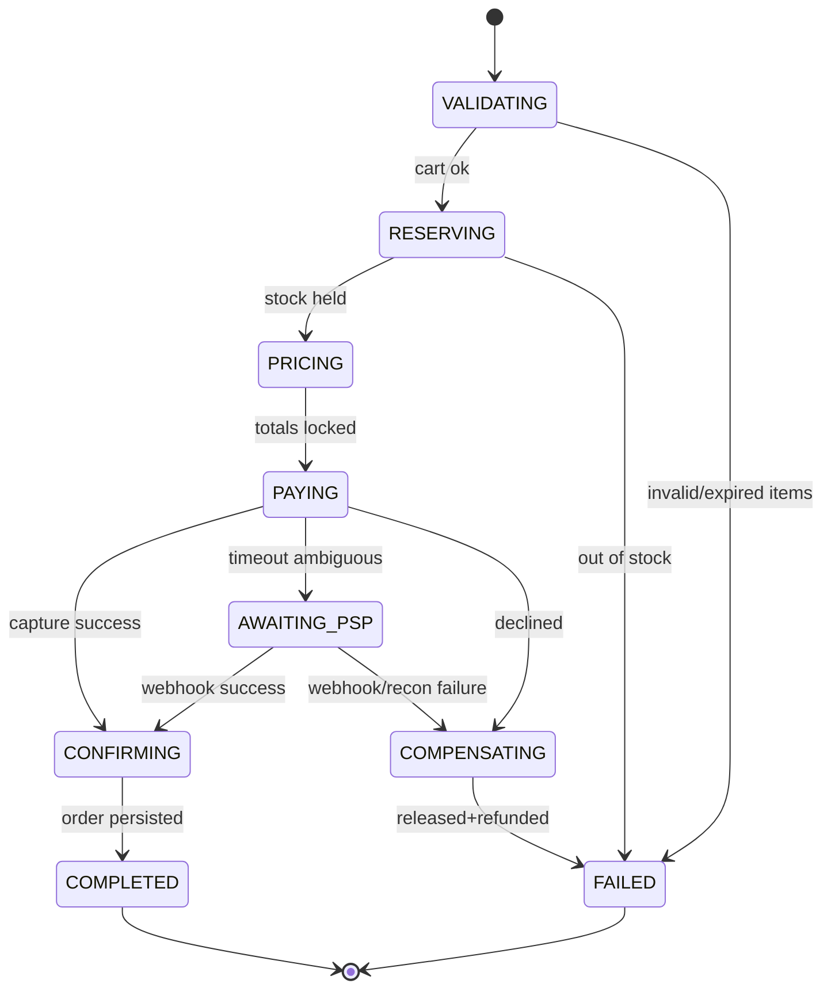
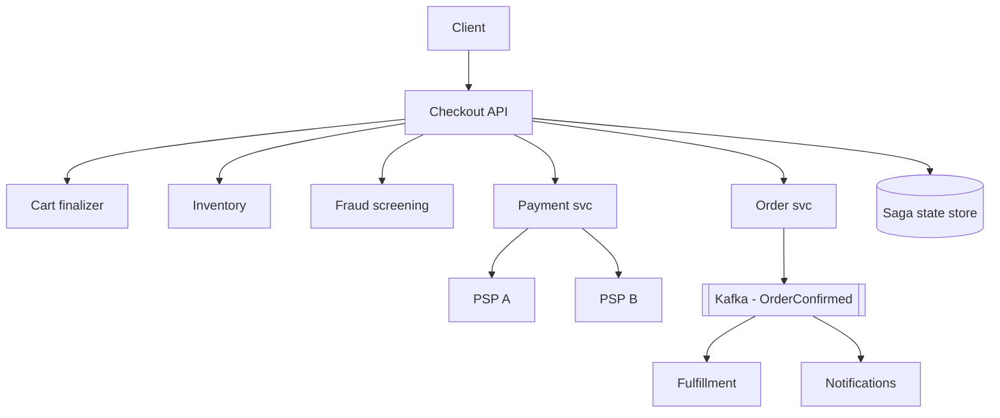
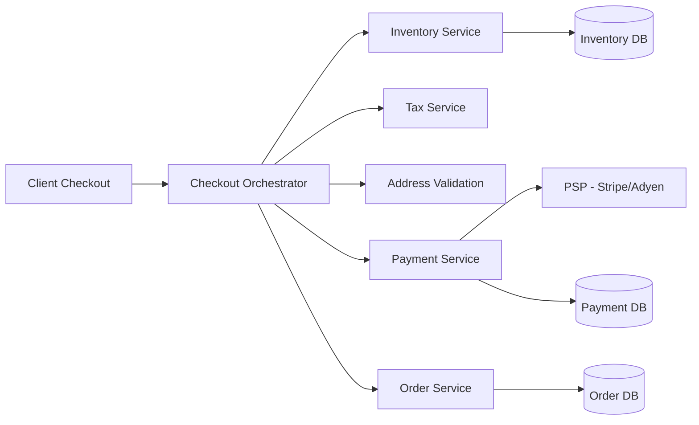
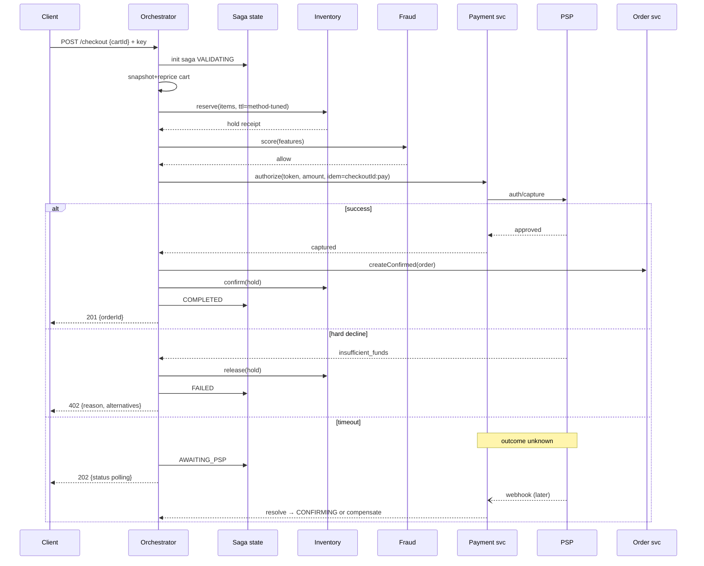
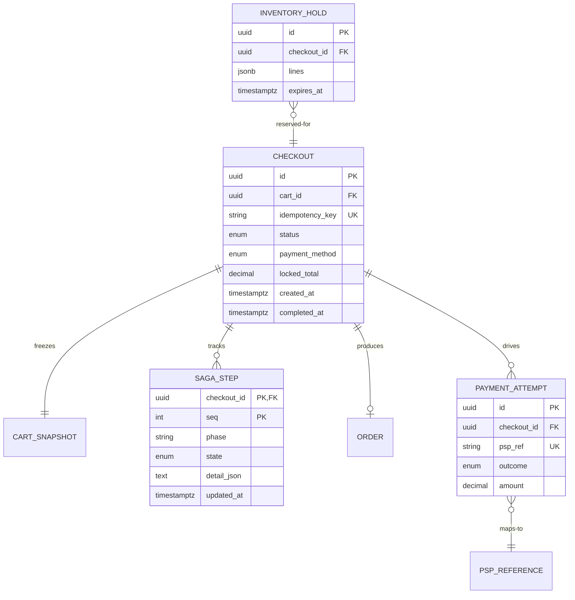

# Design E-commerce Checkout System

## Blogs and websites

## Medium

- [Building an E-commerce Checkout System: Distributed Transactions, Saga Patterns, and Reliability](https://towardsdev.com/building-an-e-commerce-checkout-system-distributed-transactions-saga-patterns-and-reliability-44743ae650d6)

## Youtube

---

## Theory

### What Is It?

Checkout is the highest-stakes flow in commerce: it converts intent into money movement and stock commitment within a few seconds while the user watches. Everything that can fail — PSPs, inventory, address validation, tax engines — sits directly on this path. The design goal is **linearizable correctness on the money/stock path wrapped in an experience that survives every dependency's bad day**, because every 100 ms of latency and every unexplained failure measurably reduces conversion.

### Why Does It Exist?

The checkout flow is the single point where user intent converts to revenue. Unlike browsing or cart management (where a timeout means a delayed UX), a checkout failure means a lost sale that may never come back. Checkout systems exist to make this critical path as reliable and fast as possible — orchestrating payment processors, inventory systems, tax calculators, and shipping estimators while maintaining data integrity across all of them.

### What Problem Does It Solve?

* **Atomicity of money + stock**: a successful charge but failed inventory reservation creates a phantom stockout that can't be fulfilled. The system must ensure both succeed or both roll back.
* **PSP unreliability**: payment providers are slow and flaky, especially during sales events. The system must handle timeouts, retries, and ambiguous responses without double-charging.
* **Address/tax validation**: incorrect addresses or tax calculations must be caught early, not after the user has entered payment details.
* **Race conditions**: two concurrent checkouts for the last item must be serialized so only one succeeds.
* **User experience under failure**: the system must gracefully degrade (offer alternative payment methods, suggest alternative shipping) rather than showing a generic error.

### Important Subtopics

1. Anatomy of checkout steps and their latency budgets
2. Cart finalization & server-side re-validation (prices, stock, addresses)
3. The checkout saga: reserve → price-lock → pay → confirm
4. Idempotency across client retries and orchestrator crashes
5. Payment method matrix (cards/UPI/COD/wallets) and their timing profiles
6. Address & shipping selection (validation, split shipments)
7. Tax/promotion computation at finalize time
8. Guest vs authenticated checkout; account creation races
9. Pending states, timeouts, and user communication
10. Fraud screening placement (pre/post auth)
11. Express checkout paths (saved instruments, wallets, one-click)
12. Conversion analytics and funnel instrumentation

### Step Anatomy & Budgets

A typical checkout POST sequence with target budgets:

```
1. Validate session/cart integrity        ~20 ms   (cached lookups)
2. Re-price cart authoritatively          ~30 ms   (pricing svc, cached rules)
3. Validate/normalize address             ~50 ms   (address svc + carrier validation)
4. Reserve inventory                      ~40 ms   (atomic decrements)
5. Screen fraud signals                   ~30 ms   (rules+ML scoring inline)
6. Authorize payment                      300–3000 ms (PSP-bound — the whale)
7. Create order + confirm reservation     ~40 ms
8. Emit events, respond                   ~10 ms
─────────────────────────────────────────────────
Total p95 target                          < 800 ms (card), < 3 s worst-PSP
```

Step 6 dominates; design implication: everything else must be parallelized or cached, and payment UX must stream progress honestly ("contacting your bank…").

### Server-Side Re-Validation

Clients display stale data by definition. At finalize:

- **Prices recomputed** from effective-dated price books + promotion engine replay (same cart+time = same total, always).
- **Stock re-checked** via reservation attempt — display counts advisory only.
- **Address normalized** (carrier APIs correct ZIP/city mismatches silently where legal).
- **Promotions re-evaluated** with their own terms (per-user caps, expiry windows).

Any mismatch returns a structured diff so UI can present precise choices instead of generic errors.

### The Saga in Full



Compensation ordering matters: release reservations before refunding (never leave money taken with stock held); both compensations idempotent keyed by checkoutId.

### Payment Method Timing Profiles

| Method | Typical latency | Failure mode | Design impact |
|---|---|---|---|
| Saved card (network token) | 0.5–2 s | Decline codes | Fast retry UX, instant fallback prompt |
| UPI intent | 2–30 s (user approves on phone!) | Timeout/user-abandon | Long-poll status, generous reservation TTL |
| COD | ~0 ms "payment" | Risk-based rejection | Eligibility checks replace PSP call |
| Wallet | <1 s | Balance shortfall | Top-up flow branching |

Reservation TTLs tune to these profiles automatically — one-size TTL either wastes stock (UPI users) or loses impatient card users.

### Ambiguity Handling (the hardest part)

PSP timeout ≠ decline. The truth may be captured-funds-no-response. Rules:

1. Never auto-refund on timeout — reconcile first.
2. Park checkout in `AWAITING_PSP` visible as "processing".
3. Webhook arrival resolves instantly; reconciliation job sweeps unresolved after N minutes.
4. User messaging promises email confirmation rather than encouraging duplicate attempts (duplicate-attempt prevention via idempotency + explicit UI state).

This single section separates production checkout designs from tutorials.

---

## Characteristics

- **Latency-sensitive conversion mechanics**: abandonment curves are steep; every architectural choice trades milliseconds against reliability.
- **Money-and-stock atomicity island**: inside a mostly-eventual commerce system, this flow demands saga discipline with full compensation coverage.
- **Dependency-dominated**: PSP latency/failure profiles dictate UX shape more than internal code quality does.
- **Idempotency-permeated**: mobile networks retry constantly; orchestrators crash mid-step; every mutation keyed accordingly.
- **Fraud-contested**: velocity checks and ML scores gate progression without adding perceptible latency for good customers.
- **Multi-modal**: guest checkout, express one-click, subscription renewals share the pipeline with different entry points but identical core saga.

---

## Components

- **Checkout API/orchestrator**
  *Purpose*: own the saga end-to-end. *Responsibilities*: step sequencing, persisted saga state (resumable), compensation execution, idempotency enforcement, timeout policies per step. *Relationship*: coordinates pricing/inventory/payment/address services.

- **Cart finalizer**
  *Responsibilities*: snapshot cart contents immutably at start (cart edits mid-checkout can't corrupt the run), detect expired/changed SKUs, structured-diff responses.

- **Inventory gateway**
  *Responsibilities*: reserve/confirm/release with TTLs tuned per payment method; expose hold receipts consumed at confirm.

- **Payment service**
  *Purpose*: PSP abstraction + method routing. *Responsibilities*: instrument tokenization handling, authorization/capture/refund calls with idempotent refs, webhook endpoint verification, multi-PSP failover routing, attempt ledger.

- **Fraud screening service**
  *Responsibilities*: pre-auth feature assembly (device fingerprint, velocity, basket anomalies), score thresholds → allow/challenge/deny, post-auth review queue feeds.

- **Order creator**
  *Responsibilities*: persist confirmed order atomically with confirmation event (outbox), trigger fulfillment fan-out.

- **Notification service**
  *Responsibilities*: confirmation emails/SMS/push; pending-state updates for slow methods (UPI).



---

## Patterns

- **Orchestrated saga with persisted state**
  *What*: each step transition recorded (`(checkoutId, phase)` rows) enabling crash-resume; compensations pre-declared per step. *Solves*: distributed atomicity with operational visibility. *When*: any multi-service conversion flow. *Pros*: resumability, audit trail, per-step metrics. *Cons*: state-store becomes critical (replicate well).

- **Idempotency-key protocol**
  Client generates UUID per checkout attempt; all downstream calls derive keys deterministically (`checkoutId:step`). Retries anywhere collapse safely. Non-negotiable baseline.

- **Reservation-with-TTL (payment-aware)**
  Hold duration parameterized by chosen method; expiry sweeper releases; confirm converts holds permanently. Prevents both oversell and stock-stranding.

- **Ambiguity parking (AWAITING_PSP)**
  Explicit terminal-pending state with resolution paths (webhook, reconciler). Converts unknown-outcomes into managed workflows instead of support tickets.

- **Anti-corruption around PSPs**
  Normalize heterogeneous decline codes/webhooks into internal taxonomy (`INSUFFICIENT_FUNDS`, `ISSUER_UNAVAILABLE`, …) driving consistent UX across acquirers.

- **Progressive enhancement for express paths**
  One-click flows reuse the same saga with pre-supplied steps (saved address/instrument skip user-input stages) — not a separate fragile fast-path.

---

## Benefits

- **Conversion protection**: sub-second reliable checkout measurably lifts revenue versus flaky flows; the ROI of this architecture is direct.
- **Failure containment**: PSP outages degrade to clear messaging + alternate-method prompts rather than silent order black holes.
- **Operational clarity**: per-step metrics pinpoint exactly which dependency regressed when conversion drops overnight.
- **Trust preservation**: honest pending states + guaranteed no-double-charges preserve the customer relationship through incidents.
- **Extensibility**: new payment methods integrate as new routing entries without touching orchestration logic.

---

## Pros

- Well-bounded problem with industry-standard solutions (saga/idempotency/reservation).
- Per-step instrumentation yields unusually actionable observability.
- Compensation discipline generalizes to the rest of the commerce platform.

## Cons

- State-machine machinery adds real complexity for what looks like "just a form".
- PSP ambiguity windows create genuine engineering pain (reconciliation loops).
- Latency budgets constrain implementation choices (no chatty microservice chains).
- Testing requires extensive fault injection harnesses to be meaningful.

---

## Challenges

- **Technical**: exactly-once charge semantics over at-least-once transports; saga crash-resume correctness; clock-skew in TTL enforcement; concurrent checkouts racing last units.
- **Scalability**: flash-sale bursts hitting step-4 inventory serialization; PSP rate limits during campaigns (token-bucket pacing toward acquirers).
- **Performance**: step-6 whale dominating p99 — mitigations: pre-auth optimizations, network tokens, regional PSP routing.
- **Reliability**: multi-PSP health-based routing; saga-state store HA; webhook endpoint availability under attack.
- **Maintainability**: PSP API deprecations (annual migration treadmill); fraud-model retraining cadence.
- **Operational**: reconciliation break queues; decline-rate anomaly triage; peak-event readiness drills.
- **Security**: PCI scope containment (tokenization everywhere), card-testing attack absorption (gateway limits + bot defense), account-takeover on saved instruments (step-up auth).

---

## Best Practices

- **Snapshot the cart at checkout start** — immutable inputs make replays/debugging deterministic.
- **Tune reservation TTLs per payment method**; sweep expiries aggressively with observable lag metrics.
- **Never trust client-side totals**; return structured diffs on mismatch rather than errors.
- **Design the ambiguity path deliberately**: park → webhook-or-reconcile → resolve; never blind-refund on timeout.
- **Instrument the funnel per step per method per region**; alert on stage-conversion drops (they precede revenue alarms).
- **Keep PSP integrations behind anti-corruption facades** with contract tests against sandbox fixtures.
- **Load-test with realistic failure mixes** (elevated declines, PSP latency injections, partial inventory contention).
- **Encrypt/tokenize ruthlessly**: PANs never touch your systems beyond PSP-hosted fields; audit log redaction verified.

---

## When to Use / Not Use

**Full saga machinery when**: multiple payment methods, meaningful scale (>few orders/min), PSP diversity, brand tolerance for pending-states over lost orders.

**Simplify when**: tiny volume single-PSP shops — a transactional monolith (order+payment in one DB txn against hosted checkout pages) is legitimately better early.

Alternatives/complements: PSP-hosted checkout (Stripe Checkout shifts PCI+UX burden out entirely), buy-now-pay-later SDKs embedding their own flows, wallet-only models collapsing the matrix.

Decision factors: GMV scale, method mix, team size, PCI appetite, differentiation value of checkout UX itself.

---

## Use Cases

- **Flash-sale checkout surge**
  *Problem*: 50K users hit Buy Now simultaneously; hero SKU has 500 units. *Solution*: admission control upstream (waiting room), per-SKU serialized reservation, express-path prioritization (saved-instrument users convert fastest), honest sold-out messaging with waitlist capture. *Trade-off*: queue fairness vs conversion speed tension resolved by product policy.

- **UPI-heavy market checkout**
  *Problem*: 60% of payments are UPI intents with 5–30 s approval latencies and high abandonment. *Solution*: long-poll status endpoints, reservation TTLs auto-extended once, push-notification nudges, explicit cancel affordances releasing stock immediately. *Trade-off*: extended holds reduce sellable stock briefly — tuned via measured completion distributions.

- **B2B checkout with credit terms**
  *Problem*: purchase orders, credit limits, approvals replace card flows. *Solution*: saga branches to credit-check + PO-validation services; multi-step approvals parked with SLA timers; invoicing events feed ERP integration. *Trade-off*: longer cycle times accepted; fraud profile shifts to identity/limit abuse.

---

## Architecture

The checkout system follows a **checkout orchestrator** architecture. The orchestrator coordinates a multi-step flow: cart finalization → inventory reservation → tax calculation → address validation → payment capture → order creation. Each step is handled by a dedicated service; the orchestrator manages the state machine and compensations (rollbacks) on failure. The payment service integrates with external PSPs (Stripe, Adyen) and must handle ambiguous responses (timeout before PSP confirms).



| Component | Purpose | Responsibilities | Real-world Example |
|---|---|---|---|
| Checkout Orchestrator | Drive the flow | Coordinate steps, manage state, trigger compensations | Temporal, Cadence |
| Cart Service | Cart data | Retrieve finalized cart contents | Session store |
| Inventory Service | Stock check | Reserve stock, release on failure | DB with row locks |
| Tax Service | Tax calc | Calculate taxes based on address | Avalara, Vertex |
| Address Validation | Verify inputs | Normalize, validate addresses | Google Maps API |
| Payment Service | PSP integration | Charge cards, handle webhooks | Stripe, Adyen |
| Order Service | Order creation | Create order record after payment | Event-sourced |

**Communication**: Orchestrator → services (synchronous gRPC/REST with timeouts). Payment service ↔ PSP (async webhook for confirmation). Events published for downstream (fulfillment, analytics).

**Scaling**: Orchestrator is stateless (horizontally scalable). Payment service handles PSP rate limits. Inventory service uses row-level locking or Redis locks for hot SKUs.

**Failure handling**: If any step fails, orchestrator triggers compensating actions (release inventory, void payment). Idempotency on all steps prevents duplicates on retry.

## Design

### Design Considerations

* **Atomicity of money + stock**: the critical invariant — if payment succeeds, stock must be reserved; if stock cannot be reserved, payment must be reversed. Use a two-phase approach: reserve stock → charge → confirm stock (or release if charge fails).
* **Idempotency**: every step (reserve, charge, create order) must be idempotent — identified by a unique transaction key. Retries are safe.
* **Payment ambiguity**: PSP calls may time out without a confirmed response. The system must reconcile via webhooks and polling before proceeding.
* **Latency budgeting**: the entire checkout must complete in < 5 seconds. PSP calls can take 2+ seconds — parallelize non-dependent steps.

### Key Decisions

| Decision | Options | Trade-off | Recommendation |
|---|---|---|---|
| Flow model | Orchestration | Visible state machine, easy debug | Recommended |
| | Choreography | Decentralized, harder to trace | Avoid for checkout |
| Payment | Synchronous | Simple, blocking | Low volume |
| | Async + compensation | Resilient, complex | Production |
| Inventory | Pessimistic lock | Accurate, contention | Hot items |
| | Optimistic | Scalable, retry overhead | General catalog |

### Scalability Considerations

* **Hot SKUs**: popular items (iPhone, PS5) have high concurrent checkout demand. Use Redis distributed locks with short TTLs to serialize.
* **PSP rate limits**: payment providers rate-limit; queue payment requests and throttle gracefully.
* **Parallelize steps**: tax calculation, address validation, and recommendation fetching can be done in parallel.

### Reliability Considerations

* **Compensating transactions**: if payment succeeds but order creation fails, issue a refund. If inventory reservation is confirmed but payment fails, release the stock.
* **Timeout handling**: every external call has a timeout (e.g., 3s for PSP). On timeout, mark as "pending" and poll for confirmation.
* **Idempotency keys**: all mutating operations accept an idempotency key (e.g., `checkout_session_id`) so retries are safe.

### Performance Considerations

* **Pre-fetching**: tax rates and address validation can be pre-fetched during cart finalization.
* **Connection pooling**: reuse connections to PSP and payment gateway.
* **Caching**: tax rates cached by ZIP code; shipping rates cached by destination.

### Security Considerations

* **PCI-DSS**: card data never touches your servers — use client-side tokenization (Stripe Elements).
* **Fraud detection**: real-time risk scoring on transactions (velocity, geolocation, device fingerprinting).
* **Encryption**: all PII encrypted at rest; TLS everywhere.

### Maintainability Considerations

* **State machine as code**: model checkout as an explicit state machine (e.g., Temporal workflow) so transitions are visible and testable.
* **Compensation test suite**: every success path has a corresponding compensation test.
* **PSP simulation sandbox**: test payment failures, timeouts, and ambiguous responses in CI.

## High-Level Design

Full happy-path plus compensation branch:



Scaling: orchestrator pods stateless (state externalized); saga-state store replicated strongly (this is the durability anchor); inventory/payment tiers sized to peak with PSP-pacing token buckets.

Failure handling: orchestrator crash → another pod resumes from saga rows (lease-fenced); PSP outage → router fails-over to secondary acquirer mid-campaign; webhook flood → queue-buffered processing with dedupe.

---

## Deep Dive

- **Crash-resume mechanics**: every step writes its result before advancing phase; recovery replays `advance()` idempotently — steps built as conditional operations (`creditIfAbsent`-style) make replays harmless. Epoch fencing prevents zombie orchestrators double-advancing after lease handover.
- **PSP pacing**: acquirers throttle per-merchant TPS; outbound token buckets per PSP prevent 3am "all payments failing" mysteries during sales; health-score routing shifts traffic proactively using rolling decline-latency stats.
- **Fraud latency budget**: feature assembly precomputed asynchronously (session telemetry streamed during browsing), leaving inference ~5 ms inline; challenges (3DS/OTP) branch the saga into human-latency phases with their own TTLs.
- **Reconciliation loop**: hourly jobs match PSP settlement files against attempt ledger; breaks classified (missing-webhook vs amount-mismatch vs phantom-capture) with automated repair for known classes, human workflow for the rest.
- **Observability**: per-phase duration histograms, funnel-stage conversion dashboards, ambiguity-window aging alerts, compensation-rate monitors (>threshold = systemic issue), synthetic purchase probes per region/method continuously.

---

## API Contract

The checkout API manages the checkout session lifecycle — from cart finalization through payment confirmation and order creation.

### Checkout Session API

| Method | Endpoint | Purpose |
|---|---|---|
| POST | `/api/v1/checkout/sessions` | Create a new checkout session |
| GET | `/api/v1/checkout/sessions/{id}` | Get session status + available actions |
| POST | `/api/v1/checkout/sessions/{id}/payment` | Submit payment instrument |
| POST | `/api/v1/checkout/sessions/{id}/confirm` | Confirm and finalize order |
| POST | `/api/v1/checkout/sessions/{id}/cancel` | Cancel the session |
| POST | `/api/v1/checkout/sessions/{id}/expire` | Expire due to timeout |

**POST /api/v1/checkout/sessions — Request Body**:
```json
{
  "cart_id": "cart_abc123",
  "customer_id": "cus_xyz",
  "return_url": "https://shop.example.com/checkout/complete",
  "cancel_url": "https://shop.example.com/cart"
}
```

**GET /api/v1/checkout/sessions/{id} — Response**:
```json
{
  "session_id": "cs_987xyz",
  "status": "AWAITING_PAYMENT",
  "step": "payment",
  "amount": { "total": 129.99, "currency": "USD", "tax": 11.23 },
  "cart": {
    "items": [{"name": "Widget", "quantity": 1, "price": 99.99}],
    "shipping_options": ["standard", "express"]
  },
  "next_actions": ["submit_payment", "cancel"]
}
```

### Payment API

| Method | Endpoint | Purpose |
|---|---|---|
| POST | `/api/v1/payments/intents` | Create payment intent |
| GET | `/api/v1/payments/intents/{id}` | Get payment status |
| POST | `/api/v1/payments/intents/{id}/capture` | Capture authorized payment |

**POST /api/v1/payments/intents** — Response:
```json
{
  "intent_id": "pi_abc123",
  "status": "REQUIRES_PAYMENT_METHOD",
  "client_secret": "pi_abc123_secret_xyz",
  "amount": 129.99,
  "currency": "USD"
}
```

### Status Codes

| Code | Meaning |
|---|---|
| 200 | Session retrieved |
| 201 | Session created |
| 400 | Invalid request or session in wrong state |
| 404 | Session not found |
| 409 | State conflict (e.g., confirm while pending payment) |
| 429 | Rate limited |
| 503 | PSP unavailable |

### Idempotency & Timeout

* `POST /api/v1/checkout/sessions` accepts `Idempotency-Key` header for safe retries.
* Sessions expire after 15 minutes of inactivity (`expires_at` field).

### Versioning

* Versioned via URL prefix (`/api/v1/`).

## Data Modeling



Choices: cart snapshot embedded (JSONB) making checkouts self-contained; unique `idempotency_key` structuralizes dedupe; attempts append-only forming the payment audit spine; holds TTL-indexed for sweepers; saga steps carry epoch fencing. Partitioning: checkouts by month; hot window on NVMe; archive to columnar storage after 90 days (analytics retains forever).

---

## Java and Spring Boot Implementation

Resumable saga orchestrator:

```java
@Service
public class CheckoutSaga {

    private final SagaStateRepository state;
    private final InventoryClient inventory;
    private final PaymentClient payments;
    private final OrderService orders;

    /** Idempotent advance — safe to re-invoke after any crash. */
    public void advance(UUID checkoutId) {
        var saga = state.lockAndLoad(checkoutId);      // SELECT ... FOR UPDATE
        switch (saga.phase()) {
            case RESERVED -> {
                var cap = payments.capture(saga.lockedTotal(),
                        saga.idempotencyKey() + ":pay");
                if (cap.approved()) {
                    state.transition(checkoutId, Phase.CAPTURED, cap.paymentRef());
                    advance(checkoutId);
                } else if (cap.declined()) {
                    compensate(checkoutId, saga);
                } else {
                    state.transition(checkoutId, Phase.AWAITING_PSP, cap.pspTxnId());
                }
            }
            case CAPTURED -> {
                orders.createConfirmed(saga.snapshot(), cap(saga));
                inventory.confirm(saga.holdReceipt());
                state.complete(checkoutId);
            }
            case AWAITING_PSP -> { /* webhook-driven resolution */ }
            case COMPENSATING -> { /* idempotent release+refund */ }
            default -> { /* terminal states */ }
        }
    }

    private void compensate(UUID id, SagaRow saga) {
        inventory.releaseIfHeld(saga.holdReceipt());
        payments.refundIfCaptured(id);
        state.fail(id, "PAYMENT_DECLINED");
    }
}
```

Controller exposing idempotent start + status polling:

```java
@RestController
@RequestMapping("/api/v1/checkout")
public class CheckoutController {

    private final CheckoutService checkout;

    @PostMapping
    public ResponseEntity<?> start(@Valid @RequestBody StartRequest req,
                                   @RequestHeader("Idempotency-Key") String idemKey,
                                   Authentication who) {
        var result = checkout.startOrReturnExisting(req.cartId(), req.method(),
                                                    idemKey, who.getName());
        return switch (result.status()) {
            case COMPLETED -> ResponseEntity.ok(result);
            case FAILED -> ResponseEntity.status(409).body(result);
            default -> ResponseEntity.accepted().body(result); // poll /{id}/status
        };
    }

    @GetMapping("/{id}/status")
    public CheckoutStatusView status(@PathVariable UUID id, Authentication who) {
        return checkout.statusForOwner(id, who.getName());
    }
}
```

Notes: `lockAndLoad` serializes concurrent advances of one saga; phases map 1:1 onto the diagram; capture idempotency rides PSP refs derived from checkout keys; webhooks enter through a separate controller verifying signatures then invoking the same `advance()`. Testing emphasizes fault injection: kill orchestrator between phases (Testcontainers restart), delayed webhooks, double-delivered events — asserting convergence to exactly-one outcome.

---

## Real-World Examples

- **Stripe Checkout / Elements** — demonstrates the hosted-vs-composed spectrum; their docs codify idempotency, webhooks-as-truth, and ambiguity handling patterns this topic formalizes.
- **Amazon's 1-Click** — the original express-checkout patent; architecturally it's the same saga with pre-supplied steps and aggressive risk automation.
- **Flipkart sale checkouts** — published war stories about UPI-intent abandonment curves shaping reservation policies and progress UX during Big Billion Days.
- **Shop Pay** — accelerated checkout showing network-tokenization + stored-instrument reuse cutting steps dramatically; validates express-path economics.

---

## Interview Preparation

### Interview Questions

**Beginner**

1. **Why does checkout need a saga instead of one database transaction?**
   Payment execution lives outside your database (PSP) and takes seconds — holding DB locks across it exhausts connections and still doesn't cover PSP crashes. Sagas coordinate local transactions across services with compensations, keeping locks local and short.
2. **What is an idempotency key doing in checkout?**
   It lets any retried request (client timeout, orchestrator resume, message redelivery) collapse to the original outcome — the mechanism preventing double charges and duplicate orders in a retry-rich environment.

**Intermediate**

3. **A PSP times out after 8 seconds. Walk through exactly what happens next.**
   Attempt marked ambiguous; saga parks in AWAITING_PSP; user sees "processing" (not failure!); webhook or reconciliation job resolves definitively later; only then confirm (order created) or compensate (release+refund). Never blind-refund — funds may have actually moved. This question tests whether candidates understand distributed-money reality beyond HTTP status codes.
4. **How do you prevent two users from buying the last unit concurrently?**
   Reservation step performs atomic conditional decrement (`qty >= requested` guard) — one wins, other gets structured out-of-stock response with alternatives. Display-level counts stay advisory throughout.
5. **Why snapshot the cart at checkout start?**
   Mid-flight cart edits otherwise create nondeterministic outcomes (items removed while paying for them). Snapshot makes inputs immutable → deterministic pricing, clean audits, reproducible debugging.

**Advanced**

6. **Design payment-method-aware reservation TTLs. How do you pick them and keep them right?**
   Derive from measured completion-time distributions per method (p95 + margin): cards ~5 min, UPI ~15 min with one extension, COD n/a. Continuous distribution monitoring auto-adjusts; alert when actuals drift from assumed shapes (PSP degradation signature). Shows measurement-driven tuning instinct.
7. **Your conversion dropped 4% overnight with no deploys. Diagnose via checkout instrumentation.**
   Funnel-stage segmentation reveals which step regressed: PSP latency spike (step-6 durations), new decline-code cluster (issuer-side issue), fraud-threshold false positives (step-5 challenge rates), region-specific (routing regression). Emphasize: per-step metrics designed precisely to make this answerable in minutes, not days.

**Senior / system design**

8. **Architect checkout for a marketplace settling hundreds of sellers per order.**
   Split-order modeling: parent checkout fans into per-seller sub-sagas; PSP split-captures (Connect-class) settle commissions mechanically; partial-failure semantics defined explicitly (all-or-nothing vs best-effort per seller with customer disclosure). Compensations fragment per sub-saga; refunds compose. Tests decomposition judgment beyond single-vendor simplicity.
9. **How would you migrate from synchronous checkout to fully-async (order-accepted-then-confirm)?**
   Product decision first (UX tolerance for async confirmation), then technical path: dual-run modes behind flags, idempotency preserved across modes, monitoring parity before cutover cohorts. Discuss why async wins under PSP stress (decouples conversion from acquirer latency) and its trust costs.

### Common Mistakes

- Refunding blindly on PSP timeouts — creating real losses when funds had landed.
- Holding database transactions open across payment calls.
- One-size reservation TTL stranding stock for slow methods or losing fast-method conversions.
- Trusting webhook payloads without signature verification (spoofable free orders).
- No ambiguity state: timeouts treated as declines, then double-charges via user retries.

### Expected discussion points
Saga compensation completeness, ambiguity-handling maturity, payment-method heterogeneity, idempotency layering, and conversion-latency economics grounding every choice.
