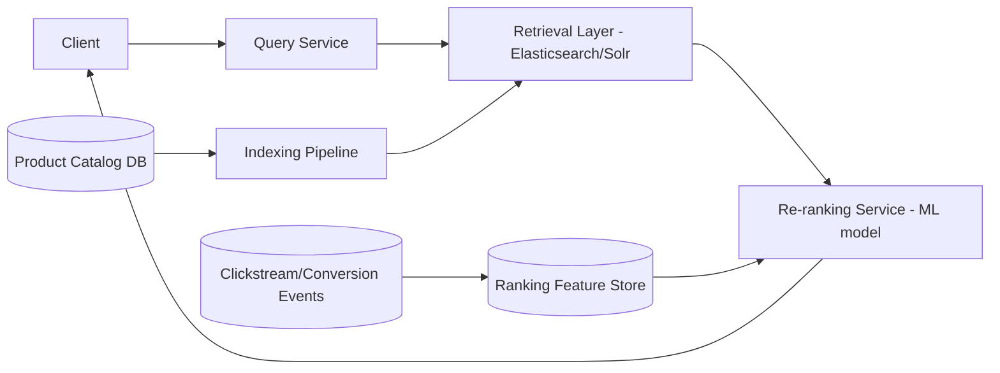
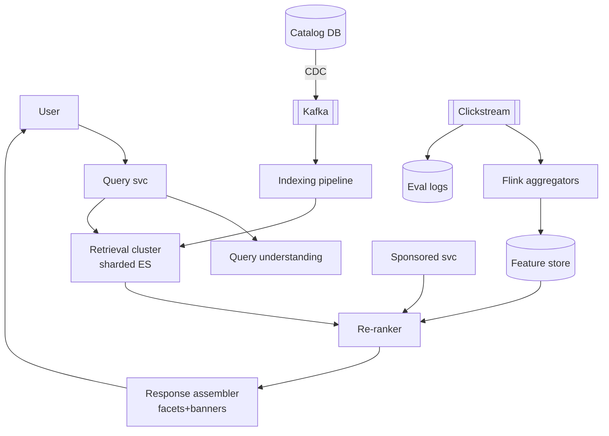
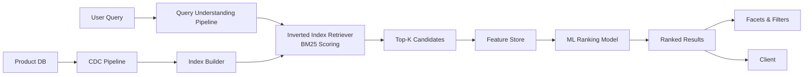
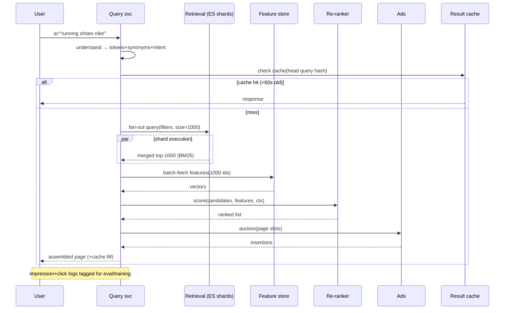

# Design a Search and Ranking System for an E-Commerce Catalog (like Flipkart)

## Blogs and websites

## Medium

## Youtube

## Theory

### What Is It?

An e-commerce search and ranking system is the engine that turns a user's typed query into a ranked list of products from a catalog of millions. It combines information retrieval (fast text search via inverted indexes) with machine-learning ranking (scoring products by relevance, price, availability, and personalization signals). Unlike general web search, e-commerce search must also handle faceted navigation (filter by price, brand, rating), query understanding (typos, synonyms, intent), and conversion optimization (rank products that are more likely to be purchased higher).

### Why Does It Exist?

Without search, e-commerce sites rely on category browsing — which fails when users know what they want but not where to find it. Search drives 20–40% of revenue on major platforms. But unlike web search (where "better ranking" is subjective), e-commerce search has a clear business metric: conversion rate. The system must balance relevance (show what the user wants) with business goals (promote high-margin, in-stock, fast-shipping items) — all within 50–100 ms.

### What Problem Does It Solve?

* **Query understanding**: users type "iPhone 14 Pro Max 256GB" or "iphone 14pm" or "iphone 14 pro max blck" — the system must normalize, detect typos, map synonyms, and infer intent.
* **Scale**: catalogs with 10M+ products must be searchable in milliseconds. Inverted indexes must be sharded and updated in real-time (CDC from product DB).
* **Ranking**: BM25 scoring provides a baseline, but ML models (GBDT, deep nets) add personalization, business rules, and conversion prediction — all re-trained daily on click/conversion logs.
* **Faceted search**: filtering by price range, brand, rating, category — aggregations must be computed efficiently across millions of products.
* **Freshness**: price drops, stock-outs, and new products must be reflected in search results within seconds, not hours.

### Important Subtopics

1. Query understanding: tokenization, normalization, typo tolerance, synonyms, intent classification
2. Inverted-index mechanics (terms, postings, BM25 scoring)
3. Two-stage retrieval→re-rank architecture
4. Learning-to-rank models (GBDT vs deep models) and feature engineering
5. Faceted search & filter aggregation
6. Index freshness pipeline: CDC → indexing → shard refresh
7. Behavioral signals: CTR/CVR computation, velocity features, decay windows
8. Personalization & session context
9. Business-layer ranking: margin, stock, sponsored insertion, merchandising rules
10. Relevance evaluation: offline metrics (NDCG), online A/B testing, interleaving
11. Zero-result and tail-query handling
12. Multi-language/vernacular search

*(The existing subsections below cover problem statement, requirements, architecture, key design points, and trade-offs.)*

### Problem Statement

Design a search-and-ranking system for a large e-commerce catalog (hundreds of millions of SKUs) that returns relevant, well-ranked results for free-text queries within a few hundred milliseconds, balancing textual relevance with business signals (popularity, margin, in-stock, sponsored placement).


### Functional Requirements

- Full-text search over product title/description/attributes with typo tolerance and synonyms
- Faceted filtering (brand, price range, category, rating) alongside search
- Rank results using relevance + business signals (CTR/conversion history, stock, price competitiveness, sponsored slots)
- Personalize ranking per user where signal is available (past purchases/browsing)

### Non-Functional Requirements

- **Scale**: Hundreds of millions of products, tens of thousands of search QPS at peak (sales events)
- **Latency**: End-to-end search response < 200ms p99
- **Freshness**: Price/stock changes should reflect in search results within minutes; new products indexed within minutes of creation

### High-Level Architecture



### Key Design Points

- Split search into a fast "retrieval" stage (an inverted-index search engine returning a broad candidate set using textual relevance, typo tolerance, and filters) followed by a "re-ranking" stage that applies a learned model over a much smaller candidate set (hundreds, not millions) to blend relevance with business/personalization signals - this keeps the expensive ML scoring bounded and fast.
- Build the search index via an asynchronous indexing pipeline that consumes catalog change events (new product, price update, stock update) so the index stays close to real time without every catalog write going through the search engine synchronously.
- Maintain a ranking feature store fed by a stream processor over clickstream/conversion events (CTR, add-to-cart rate, recent sales velocity per product) so the re-ranker has fresh behavioral signals, not just static catalog attributes.
- Handle sponsored/promoted listings as a distinct insertion step after organic ranking, so advertising logic stays decoupled from the relevance model.

### Trade-offs

- Two-stage retrieval + re-ranking adds an extra network hop and a second scoring service compared to ranking everything inside the search engine, but it's the only practical way to apply a heavier ML model without blowing the latency budget over hundreds of millions of documents.
- Near-real-time (minutes-level) index freshness is far cheaper to operate than fully synchronous indexing, and is an acceptable trade for a catalog where prices/stock don't need sub-second propagation into search.

### Query Understanding Pipeline

Before any index lookup, raw queries get transformed:

```
"nik shooes" → normalize → tokenize → spell-correct → "nike shoes"
             → synonym expansion → +"nike sneakers footwear"
             → intent tags {brand:nike, category:shoes}
```

- **Typo tolerance**: edit-distance against query-frequency dictionaries (only high-volume terms worth correcting); fuzzy matching in the index as fallback.
- **Synonyms**: curated (brand↔generic: "phone"↔"mobile") plus mined from session co-occurrence; directional synonyms matter ("apple juice" must not match iPhones — one-way mappings).
- **Intent classification**: navigational ("nike") vs exploratory ("best running shoes under 5000") changes ranking posture — exploratory queries tolerate diversity injection.
- **Vernacular complexity** (Flipkart-specific): transliterated Hindi/Tamil queries ("joota", "kapde") need romanized-Indic mappings — a genuine differentiator at Indian scale.

### Retrieval Stage Mechanics

The inverted index maps terms → posting lists of document IDs with positions. Scoring classics:

- **BM25**: `score = IDF(term) × (tf×(k1+1)) / (tf + k1×(1−b+b×len/avgLen))` — term frequency saturation + length normalization; still the relevance backbone.
- **Field boosts**: title matches outweigh description matches via per-field weights or separate fields summed.
- **Filters as bitsets**: category/brand/price facets precomputed as roaring bitmaps ANDed before scoring — filter-first shrinks the candidate pool cheaply.

Candidate generation targets recall over precision: retrieve top ~1000–4000 by text score within filters; precision is the re-ranker's job. This division lets each stage use fit-for-purpose tooling (Lucene speed, ML quality).

### Learning-to-Rank (LTR)

Re-rankers historically GBDT (XGBoost/LightGBM) on hand-crafted features — still the production workhorse due to latency (~1 ms/score batch) and interpretability:

| Feature class | Examples |
|---|---|
| Textual | BM25 score, title-match coverage |
| Behavioral | CTR@position-adjusted, CVR, add-to-cart rate, sales velocity 7d |
| Catalog | rating avg/count, return rate, price-competitiveness index |
| Contextual | device, time-of-day, city demand |
| User | affinity to brand/category, past purchase embeddings |

Deep models (two-tower user×item encoders) add semantic generalization for tail queries but cost more latency; hybrid stacks deploy GBDT on rich features *including* embedding-similarity features — best of both.

Training data: click/impression logs with position-bias correction (inverse propensity weighting), purchases as strong labels, return events as negative signals. Offline NDCG gates deploys; online interleaving/A/B decides reality.

### Sponsored Insertion

Ads slot into organic results *after* re-ranking: auction (bid × predicted CTR) selects winners per page position; disclosure obligations and relevance floors prevent pure-pay pollution. Keeping ads decoupled preserves organic-model integrity while monetizing prime slots.

---

## Characteristics

- **Latency-tiered intelligence**: cheap broad retrieval first, expensive precise scoring last — every stage's cost proportional to its candidate-set size, keeping p99 <200 ms despite heavy models at the end.
- **Behavioral-data-driven**: past interactions shape future rankings; the system is only as good as its feature freshness (minutes-level velocity signals during sales).
- **Business-objective composite**: "relevance" here means revenue-per-search optimization balancing user value, seller economics, and marketplace health — multi-objective by construction.
- **Freshness-sensitive**: stale prices/stock erode trust instantly; CDC pipelines keep index+features minutes-fresh without synchronous write coupling.
- **Query-distribution-skewed**: head queries ("iphone 15") carry massive volume; tail ("left-handed scissors blue") needs semantic fallbacks — systems optimize both explicitly.
- **Experimentation-permeated**: ranking changes ship behind experiments always; intuition fails constantly at this scale.

---

## Components

- **Query service**
  *Purpose*: front door orchestrating the funnel. *Responsibilities*: parsing/validation, query-understanding enrichment, fan-out to shards, merge/rerank coordination, response assembly (facets, banners). *Relationship*: stateless; horizontally scaled.

- **Retrieval cluster (Elasticsearch/Solr/OpenSearch)**
  *Purpose*: inverted-index search over full catalog. *Responsibilities*: sharded query execution, filter bitset application, BM25 scoring, aggregation for facet counts, typo/fuzzy matching. *Sizing*: shards sized by catalog/QPS; replicas scale reads; dedicated coordinator tier optional.

- **Indexing pipeline**
  *Purpose*: catalog→index propagation. *Responsibilities*: consume CDC events (Kafka), transform to index documents (denormalize joins!), bulk-index with versioning, handle deletes/tombstones, full-reindex orchestration for schema migrations. *Relationship*: decouples catalog writes from search availability.

- **Feature store**
  *Purpose*: fresh behavioral/catalog signals keyed by product. *Responsibilities*: stream aggregation (Flink) computing velocity windows, online serving (Redis-class, sub-ms), offline backfill parity (training/serving consistency!). *Real-world*: Feast-style; Uber Michelangelo patterns.

- **Re-rank service**
  *Purpose*: ML scoring of candidates. *Responsibilities*: fetch features (batched), model inference (vectorized GBDT/embedding lookups), score blending with business weights, diversity injection. *Model serving*: ONNX/native runtimes; GPU only if deep models justified.

- **Sponsored/ads service**
  *Responsibilities*: auction execution, insertion policy, disclosure metadata.

- **Evaluation infrastructure**
  *Responsibilities*: logging impressions/clicks with position data, interleaving harness, metric pipelines (NDCG@10, CTR, CVR, revenue-per-search).



---

## Patterns

- **Two-stage funnel (retrieve-then-rerank)**
  *Problem*: ML scoring millions of documents can't meet latency budgets. *How*: inverted-index retrieves top-K≈1000 by cheap textual score; re-ranker scores exactly those with expensive features. *When*: any LTR deployment. *Tuning note*: K trades recall-loss risk against rerank cost; monitored via "rerank-candidate contained desired item" audits.

- **CDC-fed near-real-time indexing**
  *What*: catalog commits emit row-events → Kafka → transformer denormalizes → bulk-update index with optimistic versioning (stale-writes rejected). *Solves*: minutes-freshness without coupling OLTP to search availability. *Gotcha*: event ordering per SKU (key by productId); tombstone handling for delistings.

- **Feature log for training/serving parity**
  *What*: log exact feature vectors used at serve-time alongside outcomes; train on these logged vectors rather than recomputing (which drifts). *Eliminates*: subtle skew bugs where offline metrics looked great but online degraded.

- **Position-bias correction**
  Clicks concentrate on top positions regardless of true relevance; inverse-propensity weighting (learned propensity model) debiases training labels — otherwise rankers learn "rank high things get clicked".

- **Diversity/MRR injection**
  Pure relevance returns 20 near-identical listings; MMR (maximal marginal relevance) penalizes redundancy — exploration value in exploratory queries measurable via session-success metrics.

- **Zero-result rescue ladder**
  No matches → relax filters progressively → synonym expansions → category-level suggestions → curated editorial fallbacks. Every zero-result page is a tracked defect with weekly review.

---

## Benefits

- **Direct revenue linkage**: search converts at multiples of browse; ranking improvements compound across every session.
- **Bounded ML costs**: funnel architecture keeps inference spend proportional to visible candidates, not catalog size.
- **Marketplace health levers**: boosting quality sellers, demoting high-return products — ranking as governance tool.
- **Merchandising agility**: business teams re-weight signals via config (holiday modes, brand campaigns) without model retrains.
- **Personalization moat**: accumulated behavioral features compound advantage new entrants can't replicate quickly.

---

## Pros

- Proven architecture (every major retailer converges on retrieve→rerank).
- Component-wise replaceable (swap ES for Vespa; swap GBDT for neural) without redesign.
- Experimentation culture enabled by clean metric plumbing pays compounding dividends.

## Cons

- Feature-store operational weight (streaming infra, parity discipline) is substantial.
- Ranking quality evaluation remains partly art — metric gaming risks (CTR-optimizing for clickbait titles).
- Cold-start products lack behavioral features — need content-based fallbacks explicitly designed.
- Multiple stages multiply failure surfaces; graceful degradation needed per stage.

---

## Challenges

- **Technical**: shard hot-spotting on celebrity queries; index-version consistency during rolling reindexes; feature staleness during traffic spikes; embedding index memory footprint.
- **Scalability**: sale-event QPS 10× spikes (pre-warmed caches, query-result caching for head queries); facet-count aggregation costs on high-cardinality dimensions.
- **Performance**: p99 tails from straggler shards (hedged requests); rerank batching efficiency (GPU utilization if deep models).
- **Reliability**: retrieval-cluster brownout → cached/degraded-mode responses (top-sellers static list); Kafka lag delaying price updates (freshness SLO alarms).
- **Maintainability**: synonym dictionary governance; model registry/versioning; feature deprecation hygiene.
- **Operational**: A/B experiment velocity management; incident playbooks distinguishing retrieval vs ranking failures.
- **Security/gaming**: seller keyword-stuffing attacks (spam detection on listings), click-fraud inflating competitor CTR costs (anomaly detection on traffic sources).

---

## Best Practices

- **Log everything with position and experiment-arm tags** — unmeasurable ranking changes are unverifiable ranking changes.
- **Enforce training/serving parity mechanically**: single feature-definition library used by both paths; skew detected by comparing distributions continuously.
- **Version indexes and models independently**, canary both; instant rollback paths rehearsed.
- **Cache aggressively at multiple levels**: query-understanding results for head queries, full result pages for repeat queries with short TTLs, facet counts approximated under load.
- **Guard business boosts with relevance floors** — sponsored items below minimum textual match poison long-term trust.
- **Monitor zero-result rates and tail-query success** as first-class quality metrics, not just head-query NDCG.
- **Keep the re-ranker deterministic per request** (feature snapshotting) so debugging reproduces exactly.
- **Load-test with realistic query-mix replay** from production logs including bot traffic.

---

## When to Use / Not Use

**Full two-stage LTR when**: catalog exceeds ~100K SKUs, behavioral data exists, revenue-per-search materially impacts business, team can sustain ML ops.

**Simplify when**: small catalogs — Elasticsearch function_score with hand-tuned field boosts suffices; early-stage — defer personalization until signal density exists (personalizing on sparse data amplifies noise).

Alternatives/complements: managed search (Algolia/Typesense — excellent DX, less control), vector-DB-first discovery (semantic-heavy catalogs like fashion), hybrid lexical+vector retrieval (reciprocal rank fusion) increasingly standard for tail-query rescue.

Decision inputs: catalog size, query complexity distribution, data-science capacity, latency budget strictness, differentiation appetite.

---

## Use Cases

- **Sale-event ranking surge (Big Billion Days mode)**
  *Problem*: deal SKUs must dominate; QPS spikes; stock flips fast. *Solution*: business-boost configs elevate deal-tagged items, velocity features computed on 60-second windows, aggressive result caching for repeated head queries, sponsored slots pre-negotiated. *Trade-off*: temporarily reduced personalization depth for stability.

- **Vernacular query handling (Indian market)**
  *Problem*: huge transliterated-Hindi query share ("mobile ke liye cover"). *Solution*: transliteration-aware tokenization, romanized-Indic synonym corpora, multilingual embeddings for zero-hit rescue. *Trade-off*: corpus curation investment continuous; errors visible to massive audiences.

- **High-return-category demotion**
  *Problem*: fashion sizes drive 30%+ return rates poisoning satisfaction. *Solution*: return-rate features penalize chronic offenders; size-guide content boosted alongside; seller scorecards feed ranking. *Trade-off*: short-term GMV dip accepted for lifetime-value improvement.

---

## Architecture

E-commerce search follows a **two-stage retrieval + re-rank** architecture. The query processing pipeline: user query → query understanding (tokenization, synonyms, spell correction) → candidate retrieval (inverted index, BM25 scoring) → top-K candidates → re-ranking (ML model) → results with facets and filters. Indexes are built from a real-time pipeline (CDC from product DB → transformer → indexer → refresh). A feature store pre-computes ranking features (CTR, CVR, product score, user embeddings) for the ML model.



| Component | Purpose | Responsibilities | Real-world Example |
|---|---|---|---|
| Query Processor | Parse query | Tokenization, normalization, synonym expansion | Elasticsearch analyzer |
| Inverted Index | Candidate retrieval | Terms→postings, BM25 scoring | Lucene/Solr/Elasticsearch |
| Feature Store | Pre-compute features | CTR, CVR, product recency, user embedding | Feast, Tecton |
| Ranking Model | Re-rank candidates | ML scoring for relevance, personalization | TensorFlow Ranking |
| Indexer | Build indexes | CDC from DB, transform, refresh | Logstash, custom indexer |
| Facet Engine | Aggregations | Filter counts, price ranges | Elasticsearch aggregations |

**Communication**: Stateless query processors in front of stateful index shards. The index is sharded by product ID; the ranking model calls the feature store for pre-computed features.

**Scaling**: Add index shards for more parallelism; add query processors for more QPS. Feature store serves pre-computed features at low latency.

**Failure handling**: If the ranking model is down, fall back to BM25-only scoring. If the feature store is down, use cached/zero features.

## Design

### Design Considerations

* **Two-stage retrieval**: inverted index for first-pass filtering (fast, recall-oriented), ML model for second-pass ranking (slow, precision-oriented). Balances latency and relevance.
* **Index freshness**: product catalog changes (price, stock) must be reflected in search within seconds. CDC pipeline + frequent index refresh (every 1–5 s).
* **Feature engineering**: ranking quality depends on features. Pre-compute (CTR, CVR, revenue) offline; serve online features (query intent, session context) at query time.
* **Query understanding**: handle typos, synonyms, intent classification — 15% of queries have typos; missing synonyms cause relevant products to be missed.

### Key Decisions

| Decision | Options | Trade-off | Recommendation |
|---|---|---|---|
| Index engine | Elasticsearch | Full-featured, managed | Standard |
| | Solr | Mature, configurable | Alternative |
| | Custom (Lucene) | Full control | Large scale |
| Ranking | BM25 only | Fast, basic relevance | MVP |
| | ML re-rank | High relevance, latency | Production |
| Freshness | Batch (hourly) | Simple, stale | Low-change catalog |
| | Near-real-time (seconds) | Fresh, expensive | Dynamic pricing |

### Scalability Considerations

* **Sharding**: index partitioned by product category or ID hash; query fanned out to all shards, results merged.
* **Replicator pattern**: index replicas for read availability and latency (users routed to nearest replica).
* **Caching**: popular queries cached in a query cache (Redis); results cached for 5–30 seconds.

### Reliability Considerations

* **Degraded mode**: if ML model fails, return BM25-only results with a flag for monitoring.
* **Circuit breaker**: if feature store is slow (>50 ms), skip online features and fall back to cached values.
* **Index health**: monitor shard allocation, replica lag, and refresh latency.

### Performance Considerations

* **Latency**: target < 100 ms for query processing + retrieval; < 50 ms for re-ranking (100 candidates).
* **Batching**: re-rank candidates in batches (batch size 32–64) for GPU/CPU utilization.
* **Compression**: store postings with frame-of-reference + varint encoding to reduce index size.

### Security Considerations

* **Query isolation**: prevent slow queries (regex, wildcard) from degrading cluster performance via timeout and resource limits.
* **Data privacy**: personally identifiable search history must be anonymized for click logs.

### Maintainability Considerations

* **A/B testing framework**: route a percentage of traffic to a new ranking model; compare CTR, CVR, revenue.
* **Index rollback**: if a bad deploy corrupts the index, rollback to the previous snapshot.
* **Training/serving skew monitoring**: track feature distribution drift between training and serving environments.

## High-Level Design

End-to-end query flow:



Scaling: retrieval shards horizontal (catalog growth) + replica scaling (QPS growth); re-ranker pods autoscale on RPS; feature store Redis-cluster with local SDK caches; result caches shield head-query storms.

Failure handling: retrieval partial-shard loss → degraded-but-valid results with completeness flag; feature-store down → re-ranker falls back to catalog-static features (documented quality dip); re-ranker down → raw BM25 order served (better than nothing, alarmed).

---

## Deep Dive

- **BM25 parameter tuning**: k1 (TF saturation ~1.2–2.0) and b (length normalization ~0.75) tuned per-field empirically; title fields b lower (titles naturally terse). Small parameter shifts measurably move head-query quality — treat as experimental surface, not constants.
- **Shard-straggler mitigation**: fan-out waits on slowest shard; hedging (duplicate request to second replica after p95 timeout) caps tail latency at modest extra load — standard for <200ms p99 targets.
- **Embedding retrieval integration**: two-tower encoders map queries/products to shared space; ANN index (HNSW) retrieves semantically-similar candidates fused with lexical results via RRF. Deployed primarily for tail/zero-result rescue where lexical fails hardest.
- **Feature freshness tiers**: real-time (Flink → Redis, seconds), near-real (hourly aggregates), batch (nightly); the re-ranker declares required tier per feature — cost-quality balance explicit and auditable.
- **Observability**: per-stage latency breakdowns, candidate-recall audits (did rerank drop known-good items?), feature-drift monitors, zero-result/tail dashboards, experiment-guardrail metrics (return-rate, NCSAT) alongside CTR/revenue.

---

## API Contract

The search API provides query-based product discovery with faceted filtering, autocomplete, and personalization.

### Search API

| Method | Endpoint | Purpose |
|---|---|---|
| GET | `/api/v1/search` | Search products |
| GET | `/api/v1/search/suggest` | Autocomplete suggestions |
| GET | `/api/v1/products/{id}` | Product details |
| POST | `/api/v1/facets` | Get facet aggregations |

### GET /api/v1/search

**Query Parameters**:

| Parameter | Type | Required | Default | Description |
|---|---|---|---|---|
| q | string | yes | — | Search query |
| page | int | no | 1 | Page number |
| limit | int | no | 20 | Results per page (max 100) |
| sort | string | no | relevance | `relevance`, `price_asc`, `price_desc`, `rating` |
| category_id | string | no | — | Filter by category |
| min_price | float | no | — | Minimum price |
| max_price | float | no | — | Maximum price |
| brand | string[] | no | — | Filter by brand(s) |
| in_stock | bool | no | — | Filter in-stock only |
| customer_id | string | no | — | For personalization |

**Response**:
```json
{
  "query": "iphone 14",
  "total_hits": 847,
  "page": 1,
  "limit": 20,
  "results": [
    {
      "product_id": "prod_123",
      "title": "Apple iPhone 14 Pro Max 256GB",
      "price": 1099.00,
      "currency": "USD",
      "image_url": "https://...",
      "rating": 4.7,
      "review_count": 1250,
      "in_stock": true,
      "shipping_info": "Free shipping",
      "score": 0.92
    }
  ],
  "facets": {
    "brands": {"Apple": 340, "Samsung": 200, "Google": 120},
    "price_ranges": [{"range": "$1000+", "count": 450}],
    "categories": [{"id": "phones", "name": "Phones", "count": 847}]
  },
  "suggestions": ["iphone 14 pro", "iphone 14 case", "iphone 13"]
}
```

### GET /api/v1/search/suggest

**Parameters**: `q` (string, required), `limit` (int, default 5)

**Response**:
```json
{
  "query": "iph",
  "suggestions": [
    {"text": "iphone 14", "type": "query", "score": 0.95},
    {"text": "iphone case", "type": "category", "score": 0.80}
  ]
}
```

### HTTP Status Codes

| Code | Meaning |
|---|---|
| 200 | Search successful |
| 400 | Invalid query (empty, too short) |
| 429 | Rate limited |
| 503 | Search service unavailable |

### Performance & Timeout

* Search queries must respond within 100 ms (99th percentile). Queries exceeding 500 ms return a degraded BM25-only result.
* Pagination beyond 1000th result (`offset > 1000`) returns a `400` — use cursor-based pagination for deep pages.

## Data Modeling

Search documents are deliberate denormalizations:

```json
{
  "productId": "P123",
  "title": "Nike Revolution Running Shoes",
  "brand": {"id": "B9", "name": "Nike"},
  "categoryPath": ["Footwear", "Running"],
  "attributes": {"color": "black", "size": [7,8,9,10]},
  "price": {"listing": 4999, "mrp": 6999, "currency": "INR"},
  "stockStatus": "IN_STOCK",
  "signals": {"ctr30d": 0.041, "cvr30d": 0.032, "velocity7d": 182},
  "quality": {"ratingAvg": 4.3, "ratingCount": 8934, "returnRate": 0.08},
  "indexedAt": "2025-08-25T10:14:00Z",
  "docVersion": 4711
}
```

Design notes: attributes flattened for faceting; signals embedded (updated by separate pipeline writing partial docs — ES partial-update semantics); `docVersion` enables optimistic concurrency against out-of-order CDC events; joins deliberately absent — the indexer performs them once instead of per-query. ER view of source-of-truth relationships mirrors the catalog topic's model; search lives strictly downstream of it.

---

## Java and Spring Boot Implementation

Query-service orchestration skeleton:

```java
@Service
public class SearchOrchestrator {

    private final RetrievalClient retrieval;
    private final FeatureClient features;
    private final RerankClient reranker;
    private final AdsClient ads;
    private final ResultCache cache;

    public SearchResponse search(SearchRequest req) {
        var understood = queryUnderstanding.enrich(req.q());       // cached for head queries
        return cache.get(understood.cacheKey(), req.page())
                .orElseGet(() -> execute(understood, req));
    }

    private SearchResponse execute(UnderstoodQuery q, SearchRequest req) {
        Candidates candidates = retrieval.retrieve(q, FILTERS, RERANK_POOL_SIZE);

        Map<String, FeatureVector> feats =
                features.batchFetch(candidates.ids(), FEATURE_SET, req.context());

        Ranked ranked = reranker.score(candidates, feats, req.context());
        Page page = ranked.page(req.page(), PAGE_SIZE);

        Sponsored sponsored = ads.auction(q.intent(), req.context());
        SearchResponse resp = ResponseAssembler.assemble(page, sponsored,
                candidates.facets());
        cache.put(q.cacheKey(), req.page(), resp, Duration.ofSeconds(45));
        return resp;
    }
}
```

Indexing consumer applying CDC with versioning:

```java
@Component
public class CatalogChangeEventConsumer {

    private final ElasticsearchClient es;

    @KafkaListener(topics = "catalog.changes", groupId = "search-indexer")
    public void onChange(CatalogChange evt) {
        switch (evt.type()) {
            case UPSERT -> es.index(i -> i
                    .index("products")
                    .id(evt.productId())
                    .version(evt.docVersion())          // optimistic: stale events rejected
                    .opType(IndexRequest.OpType.Index)
                    .document(toDocument(evt)));
            case DELETE -> es.delete(d -> d.index("products").id(evt.productId()));
        }
    }
}
```

Notes: the orchestrator stays thin — each stage a separately scalable client; externalized versioning makes out-of-order CDC harmless; result caching keyed by enriched-query hash shields sale-event storms. Testing: WireMock stages verifying degradation paths (feature-store down → static features), golden-query regression suites gating index/model changes.

---

## Real-World Examples

- **Flipkart** — vernacular search investments and sale-mode ranking documented publicly; their FLIPKART-scale funnels validate the architecture directly.
- **Amazon** — pioneered behavioral-feature ranking (A9/A10 evolution); product-detail-page "frequently bought together" shows ranking-adjacent retrieval breadth.
- **eBay** — published extensively on their two-stage LTR migration and position-bias correction research; academic-grade transparency.
- **Etsy** — strong engineering-blog culture covering experimentation platforms and embedding-based discovery for handmade-tail catalogs — the tail-query problem industrialized.

---

## Interview Preparation

### Interview Questions

**Beginner**

1. **Why split retrieval and re-ranking into stages?**
   Cheap textual scoring narrows millions of docs to ~1000 candidates; only then does expensive ML scoring apply. Cost becomes proportional to visible candidates, meeting latency budgets impossible otherwise.
2. **What is BM25 doing conceptually?**
   Scores documents by term overlap weighted by rarity (IDF), saturating term frequency (more repeats ≠ proportionally better), normalized for document length — the classical relevance backbone under every modern tweak.

**Intermediate**

3. **How do you keep prices/stock fresh in the index without hammering the catalog DB?**
   CDC events flow through Kafka to an indexing pipeline performing denormalization and versioned bulk-updates — minutes-level freshness with zero synchronous coupling. Out-of-order events neutralized by doc-version checks.
4. **Explain position bias and its fix.**
   Users click top results regardless of true quality, so naive training teaches "high rank = relevant." Fix: inverse-propensity weighting using learned/estimated examination probabilities, or randomized-interleaving experiments collecting unbiased labels.
5. **A new product has zero clicks. How do you rank it fairly?**
   Content-based priors (text match, attribute quality, seller reputation), explore-exploit allocation (small guaranteed exposure windows measuring engagement), cold-start embeddings from similar-product transfer. Explicitly designed — otherwise new inventory starves.

**Advanced**

6. **Design the feature store: consistency between training and serving.**
   Single feature-definition codebase compiled to both Flink jobs (serving materialization) and Spark backfills (training); point-in-time-correct joins during training (no leakage of post-click aggregates!); parity monitors comparing distributions continuously. This question separates ML-platform literacy from buzzwords.
7. **During a sale, your p99 breaches SLA. Which stage do you suspect first and why?**
   Retrieval stragglers (shard hot-spotting under skewed celebrity queries) and facet-aggregation costs spike first; mitigations ready: hedged requests, approximated facet counts, deeper result caching, admission control upstream. Reason through measurement before moving pieces.

**Senior / system design**

8. **Architect search for a fashion marketplace where visual similarity matters more than text.**
   Multi-modal embeddings (image encoders) indexed in vector DBs; query-by-photo flows first-class; lexical stage retained for brand/attribute precision; fusion layer balances modalities per intent. Discuss annotation/data flywheel and cold-start via generative tagging.
9. **Your A/B test shows +3% CTR but −2% conversion and +15% returns. Ship it?**
   No — guardrail metrics veto: CTR-gaming (clickbait titles) harms downstream economics. Investigate which query segments drove deltas; consider blended objective functions (revenue-per-session with return penalties). Demonstrates metric-integrity judgment interviewers seek at senior levels.

### Common Mistakes

- Training on biased click logs without position correction — rankers learn position, not relevance.
- Recomputing features offline differently than served — training/serving skew silently degrades launches.
- Letting business boosts override relevance floors — sponsored junk poisons trust permanently.
- Ignoring tail queries because head looks great — long-tail aggregate revenue surprises negatively.
- Treating index schema as immutable — plan reindex machinery from day one.

### Expected discussion points
Funnel-cost arithmetic, freshness-vs-consistency choices, evaluation rigor (guardrails, bias correction), personalization-vs-noise tension, and honest treatment of ML ops burden.
