# Design a Search and Ranking System for an E-Commerce Catalog (like Flipkart)

> An e-commerce search and ranking system is the engine that turns a user's typed query into a ranked list of products from a catalog of millions. It combines information retrieval (fast text search via inverted indexes) with machine-learning ranking (scoring products by relevance, price, availability, and personalization signals). Unlike general web search, e-commerce search must also handle faceted navigation (filter by price, brand, rating), query understanding (typos, synonyms, intent), and conversion optimization (rank products that are more likely to be purchased higher).

## Blogs and websites

## Medium

## Youtube

## Theory

### Topics Covered

1. [Introduction and Problem Statement](#introduction-and-problem-statement)
2. [Characteristics](#characteristics)
3. [Pros](#pros)
4. [Cons](#cons)
5. [Use Cases](#use-cases)
6. [Components](#components)
7. [Architectural Patterns](#architectural-patterns)
8. [Benefits](#benefits)
9. [Challenges](#challenges)
10. [Best Practices](#best-practices)
11. [When to Use / When Not to Use](#when-to-use--when-not-to-use)
12. [Data Model and API](#data-model-and-api)
13. [Query Understanding and Processing](#query-understanding-and-processing)
14. [Retrieval and Inverted Index Mechanics](#retrieval-and-inverted-index-mechanics)
15. [Learning-to-Rank Models](#learning-to-rank-models)
16. [Personalization and Session Context](#personalization-and-session-context)
17. [Faceted Search and Filter Aggregation](#faceted-search-and-filter-aggregation)
18. [Index Freshness and CDC Pipeline](#index-freshness-and-cdc-pipeline)
19. [Behavioral Features and Feature Store](#behavioral-features-and-feature-store)
20. [Sponsored Insertion](#sponsored-insertion)
21. [Replication Strategies](#replication-strategies)
22. [Failure Detection and Membership](#failure-detection-and-membership)
23. [High Availability and Scalability](#high-availability-and-scalability)
24. [Performance and Optimization](#performance-and-optimization)
25. [CAP Theorem and Consistency Trade-offs](#cap-theorem-and-consistency-trade-offs)
26. [Encryption and Key Management](#encryption-and-key-management)
27. [Authentication and Authorization](#authentication-and-authorization)
28. [Security Threats and Mitigations](#security-threats-and-mitigations)
29. [Observability and Logging](#observability-and-logging)
30. [Real-World Implementations](#real-world-implementations)
31. [Java and Spring Boot Implementation Guide](#java-and-spring-boot-implementation-guide)
32. [Interview Questions and Answers](#interview-questions-and-answers)

---

### Introduction and Problem Statement

An e-commerce search and ranking system is the engine that turns a user's typed query into a ranked list of products from a catalog of millions. It combines information retrieval (fast text search via inverted indexes) with machine-learning ranking (scoring products by relevance, price, availability, and personalization signals). Unlike general web search, e-commerce search must also handle faceted navigation (filter by price, brand, rating), query understanding (typos, synonyms, intent), and conversion optimization (rank products that are more likely to be purchased higher).

Without search, e-commerce sites rely on category browsing — which fails when users know what they want but not where to find it. Search drives 20–40% of revenue on major platforms. But unlike web search (where "better ranking" is subjective), e-commerce search has a clear business metric: conversion rate. The system must balance relevance (show what the user wants) with business goals (promote high-margin, in-stock, fast-shipping items) — all within a strict latency budget of 50–200 ms.

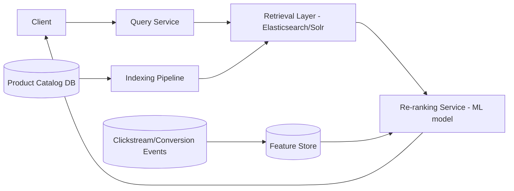

*The end-to-end search funnel: a user query flows through retrieval (inverted index, BM25) and re-ranking (ML model), while an indexing pipeline keeps the catalog fresh and a feature store supplies behavioral signals for personalization.*

**Problem Statement:** Design a search-and-ranking system for a large e-commerce catalog (hundreds of millions of SKUs) that returns relevant, well-ranked results for free-text queries within a few hundred milliseconds, balancing textual relevance with business signals (popularity, margin, in-stock, sponsored placement).

**What problem does it solve?**

- **Query understanding**: users type "iPhone 14 Pro Max 256GB" or "iphone 14pm" or "iphone 14 pro max blck" — the system must normalize, detect typos, map synonyms, and infer intent.
- **Scale**: catalogs with 10M+ products must be searchable in milliseconds. Inverted indexes must be sharded and updated in real-time (CDC from product DB).
- **Ranking**: BM25 scoring provides a baseline, but ML models (GBDT, deep nets) add personalization, business rules, and conversion prediction — all re-trained daily on click/conversion logs.
- **Faceted search**: filtering by price range, brand, rating, category — aggregations must be computed efficiently across millions of products.
- **Freshness**: price drops, stock-outs, and new products must be reflected in search results within minutes, not hours.

**Functional Requirements**

- Full-text search over product title/description/attributes with typo tolerance and synonyms
- Faceted filtering (brand, price range, category, rating) alongside search
- Rank results using relevance + business signals (CTR/conversion history, stock, price competitiveness, sponsored slots)
- Personalize ranking per user where signal is available (past purchases/browsing)

**Non-Functional Requirements**

| Requirement | Target |
|---|---|
| **Scale** | Hundreds of millions of products, tens of thousands of search QPS at peak |
| **Latency** | End-to-end search response < 200 ms p99 |
| **Freshness** | Price/stock changes reflected within minutes; new products indexed within minutes |

---

### Characteristics

- **Latency-tiered intelligence**: cheap broad retrieval first, expensive precise scoring last — every stage's cost proportional to its candidate-set size, keeping p99 < 200 ms despite heavy models at the end.
- **Behavioral-data-driven**: past interactions shape future rankings; the system is only as good as its feature freshness (minutes-level velocity signals during sales).
- **Business-objective composite**: "relevance" means revenue-per-search optimization balancing user value, seller economics, and marketplace health — multi-objective by construction.
- **Freshness-sensitive**: stale prices/stock erode trust instantly; CDC pipelines keep index and features minutes-fresh without synchronous write coupling.
- **Query-distribution-skewed**: head queries ("iphone 15") carry massive volume; tail ("left-handed scissors blue") needs semantic fallbacks — systems optimize both explicitly.
- **Experimentation-permeated**: ranking changes ship behind experiments always; intuition fails constantly at this scale.
- **Multi-stage retrieval**: recall-oriented text matching narrows millions of documents to a candidate set, then precision-oriented ML re-ranking orders them.

---

### Pros

- Proven architecture (every major retailer converges on retrieve→rerank).
- Component-wise replaceable (swap ES for Solr; swap GBDT for neural) without redesign.
- Experimentation culture enabled by clean metric plumbing pays compounding dividends.
- Rich signal fusion (textual + behavioral + business + contextual) beats pure keyword ranking.
- Personalization compounds — accumulated behavioral features create a moat new entrants can't replicate quickly.
- Query result caching for head queries amortizes even the expensive re-rank stage.

---

### Cons

- Feature-store operational weight (streaming infra, parity discipline) is substantial.
- Ranking quality evaluation remains partly art — metric gaming risks (CTR-optimizing for clickbait titles).
- Cold-start products lack behavioral features — need content-based fallbacks explicitly designed.
- Multiple stages multiply failure surfaces; graceful degradation needed per stage.
- ML model inference cost grows with candidate-set size K — trade-off between recall and latency.
- Training/serving skew is a constant battle; subtle drift silently degrades launches.

---
### Use Cases

- **Sale-event ranking surge (Big Billion Days mode)**
  *Problem*: deal SKUs must dominate; QPS spikes; stock flips fast. *Solution*: business-boost configs elevate deal-tagged items, velocity features computed on 60-second windows, aggressive result caching for repeated head queries, sponsored slots pre-negotiated. *Trade-off*: temporarily reduced personalization depth for stability.

- **Vernacular query handling (Indian market)**
  *Problem*: huge transliterated-Hindi query share ("mobile ke liye cover"). *Solution*: transliteration-aware tokenization, romanized-Indic synonym corpora, multilingual embeddings for zero-hit rescue. *Trade-off*: corpus curation investment continuous; errors visible to massive audiences.

- **High-return-category demotion**
  *Problem*: fashion sizes drive 30%+ return rates poisoning satisfaction. *Solution*: return-rate features penalize chronic offenders; size-guide content boosted alongside; seller scorecards feed ranking. *Trade-off*: short-term GMV dip accepted for lifetime-value improvement.

- **Long-tail discovery**
  *Problem*: niche products never get seen because they never rank for popular queries. *Solution*: diversity injection (MMR), embedding-based semantic matching for tail queries, and explore-exploit allocation giving occasional exposure to cold inventory.

---

### Components

- **Query service**
  *Purpose*: front door orchestrating the funnel. *Responsibilities*: parsing/validation, query-understanding enrichment, fan-out to shards, merge/rerank coordination, response assembly (facets, banners). *Relationship*: stateless; horizontally scaled.

- **Retrieval cluster (Elasticsearch / Solr / OpenSearch)**
  *Purpose*: inverted-index search over full catalog. *Responsibilities*: sharded query execution, filter bitset application, BM25 scoring, aggregation for facet counts, typo/fuzzy matching. *Sizing*: shards sized by catalog/QPS; replicas scale reads; dedicated coordinator tier optional.

- **Indexing pipeline**
  *Purpose*: catalog→index propagation. *Responsibilities*: consume CDC events (Kafka), transform to index documents (denormalize joins), bulk-index with versioning, handle deletes and tombstones, full-reindex orchestration for schema migrations. *Relationship*: decouples catalog writes from search availability.

- **Feature store**
  *Purpose*: fresh behavioral/catalog signals keyed by product. *Responsibilities*: stream aggregation (Flink) computing velocity windows, online serving (Redis-class, sub-ms), offline backfill parity (training/serving consistency). *Real-world*: Feast-style; Uber Michelangelo patterns.

- **Re-rank service**
  *Purpose*: ML scoring of candidates. *Responsibilities*: fetch features (batched), model inference (vectorized GBDT / embedding lookups), score blending with business weights, diversity injection. *Model serving*: ONNX / native runtimes; GPU only if deep models justified.

- **Sponsored / ads service**
  *Purpose*: monetize premium placement. *Responsibilities*: auction execution, insertion policy, disclosure metadata. *Design*: decoupled from organic ranking — inserted after re-ranking.

- **Evaluation infrastructure**
  *Purpose*: measure and improve ranking quality. *Responsibilities*: logging impressions/clicks with position data, interleaving harness, metric pipelines (NDCG@10, CTR, CVR, revenue-per-search).

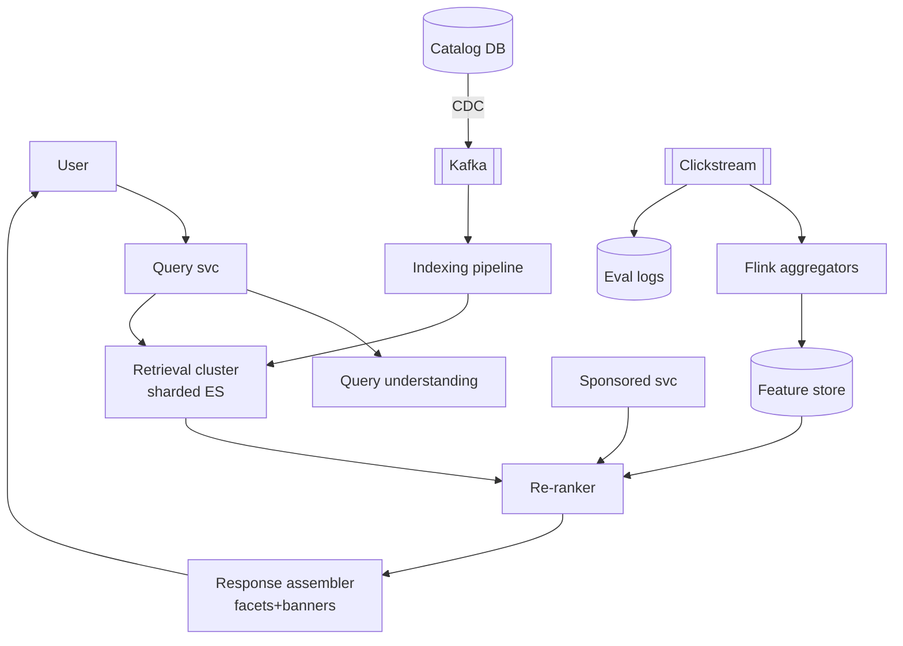

*Search system components: the query service orchestrates query understanding, retrieval, re-ranking, and sponsored insertion. The indexing pipeline consumes CDC events and the feature store is fed by a stream processor over clickstream data.*

---

### Architectural Patterns

- **Two-stage funnel (retrieve-then-rerank)**
  *Problem*: ML scoring millions of documents can't meet latency budgets. *How*: inverted-index retrieves top-K≈1000 by cheap textual score; re-ranker scores exactly those with expensive features. *When*: any LTR deployment. *Tuning note*: K trades recall-loss risk against rerank cost; monitored via "rerank-candidate contained desired item" audits.

- **CDC-fed near-real-time indexing**
  *What*: catalog commits emit row-events → Kafka → transformer denormalizes → bulk-update index with optimistic versioning (stale-writes rejected). *Solves*: minutes-freshness without coupling OLTP to search availability. *Gotcha*: event ordering per SKU (key by productId); tombstone handling for delistings.

- **Feature log for training/serving parity**
  *What*: log exact feature vectors used at serve-time alongside outcomes; train on these logged vectors rather than recomputing (which drifts). *Eliminates*: subtle skew bugs where offline metrics looked great but online degraded.

- **Position-bias correction**
  *What*: clicks concentrate on top positions regardless of true relevance; inverse-propensity weighting (learned propensity model) debiases training labels. *Solves*: rankers learning "high rank = relevant" instead of "relevant = high rank".

- **Diversity / MMR injection**
  *What*: pure relevance returns 20 near-identical listings; MMR (maximal marginal relevance) penalizes redundancy. *Value*: exploration for exploratory queries, measurable via session-success metrics.

- **Zero-result rescue ladder**
  *What*: no matches → relax filters progressively → synonym expansions → category-level suggestions → curated editorial fallbacks. *Policy*: every zero-result page is a tracked defect with weekly review.

---

### Benefits

- **Direct revenue linkage**: search converts at multiples of browse; ranking improvements compound across every session.
- **Bounded ML costs**: funnel architecture keeps inference spend proportional to visible candidates, not catalog size.
- **Marketplace health levers**: boosting quality sellers, demoting high-return products — ranking as governance tool.
- **Merchandising agility**: business teams re-weight signals via config (holiday modes, brand campaigns) without model retrains.
- **Personalization moat**: accumulated behavioral features compound advantage new entrants can't replicate quickly.

**Quantified benefit example:** A typical e-commerce product-detail page takes 80 ms to render from database (3 SQL queries + template rendering). With a distributed search index for product data, the same page renders in 2 ms (1 search GET + template rendering). That's a 40× improvement — the difference between a good UX and an abandoned cart.

---

### Challenges

- **Technical**: shard hot-spotting on celebrity queries; index-version consistency during rolling reindexes; feature staleness during traffic spikes; embedding index memory footprint.
- **Scalability**: sale-event QPS 10× spikes (pre-warmed caches, query-result caching for head queries); facet-count aggregation costs on high-cardinality dimensions.
- **Performance**: p99 tails from straggler shards (hedged requests); rerank batching efficiency (GPU utilization if deep models).
- **Reliability**: retrieval-cluster brownout → cached/degraded-mode responses (top-sellers static list); Kafka lag delaying price updates (freshness SLO alarms).
- **Maintainability**: synonym dictionary governance; model registry/versioning; feature deprecation hygiene.
- **Operational**: A/B experiment velocity management; incident playbooks distinguishing retrieval vs ranking failures.
- **Security / gaming**: seller keyword-stuffing attacks (spam detection on listings), click-fraud inflating competitor CTR costs (anomaly detection on traffic sources).

---

### Best Practices

- **Log everything with position and experiment-arm tags** — unmeasurable ranking changes are unverifiable ranking changes.
- **Enforce training/serving parity mechanically**: single feature-definition library used by both paths; skew detected by comparing distributions continuously.
- **Version indexes and models independently**, canary both; instant rollback paths rehearsed.
- **Cache aggressively at multiple levels**: query-understanding results for head queries, full result pages for repeat queries with short TTLs, facet counts approximated under load.
- **Guard business boosts with relevance floors** — sponsored items below minimum textual match poison long-term trust.
- **Monitor zero-result rates and tail-query success** as first-class quality metrics, not just head-query NDCG.
- **Keep the re-ranker deterministic per request** (feature snapshotting) so debugging reproduces exactly.
- **Load-test with realistic query-mix replay** from production logs including bot traffic.

---
### When to Use / When Not to Use

**Use when:**

- Catalog exceeds ~100K SKUs and users search by free text (not just browse).
- Query volume justifies the indexing and feature-store operational overhead.
- Revenue-per-search materially impacts business (e.g., >10% of GMV via search).
- You have or can build click/conversion data for behavioral features.
- Latency budget allows a multi-stage funnel (retrieval + re-rank within 200 ms).
- Team capacity exists for ML ops (model training, serving, monitoring).

**Avoid or simplify when:**

- Small catalogs (< 100K SKUs) — Elasticsearch function_score with hand-tuned field boosts suffices.
- No behavioral data — personalizing on sparse signal amplifies noise.
- Early-stage product — defer personalization until signal density exists.
- Zero ML/data-science capacity — use a rules-based or BM25-only ranker.
- Latency budget is so tight (< 50 ms) that a second scoring hop is impossible.

**Decision inputs**: catalog size, query complexity distribution, data-science capacity, latency budget strictness, differentiation appetite.

**Alternatives / complements:**

- Managed search (Algolia, Typesense) — excellent DX, less control.
- Vector-DB-first discovery — semantic-heavy catalogs (fashion, creative goods).
- Hybrid lexical + vector retrieval — reciprocal rank fusion increasingly standard for tail-query rescue.

---

### Data Model and API

Search documents are deliberate denormalizations of catalog entities — the indexer joins once instead of per-query.

```json
{
  "productId": "P123",
  "title": "Nike Revolution Running Shoes",
  "brand": {"id": "B9", "name": "Nike"},
  "categoryPath": ["Footwear", "Running"],
  "attributes": {"color": "black", "size": [7, 8, 9, 10]},
  "price": {"listing": 4999, "mrp": 6999, "currency": "INR"},
  "stockStatus": "IN_STOCK",
  "signals": {"ctr30d": 0.041, "cvr30d": 0.032, "velocity7d": 182},
  "quality": {"ratingAvg": 4.3, "ratingCount": 8934, "returnRate": 0.08},
  "indexedAt": "2025-08-25T10:14:00Z",
  "docVersion": 4711
}
```

*The search document is a flattened, denormalized snapshot of a product — attributes are flattened for faceting, behavioral signals are embedded and updated by a separate pipeline using partial-update semantics, and `docVersion` enables optimistic concurrency against out-of-order CDC events.*

**Design notes:** attributes flattened for faceting; signals embedded (updated by separate pipeline writing partial docs — ES partial-update semantics); `docVersion` enables optimistic concurrency against out-of-order CDC events; joins deliberately absent — the indexer performs them once instead of per-query.

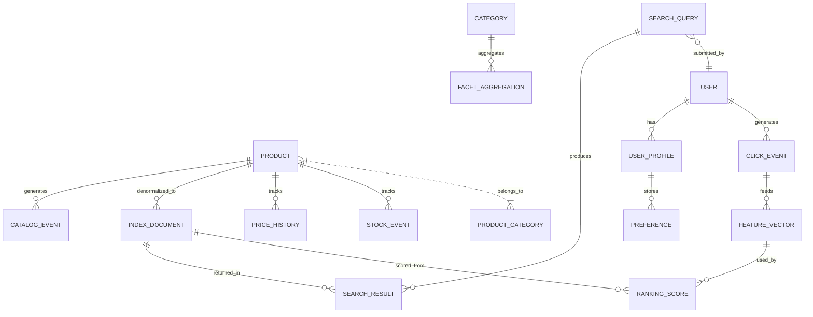

*Entity-relationship diagram: a Product generates catalog events consumed by the indexing pipeline to produce denormalized IndexDocuments. Users submit SearchQueries that produce SearchResults. ClickEvents feed FeatureVectors that drive RankingScores applied to IndexDocuments — the data flow from source of truth to ranked output.*

**Core API endpoints:**

| Method | Endpoint | Purpose |
|---|---|---|
| GET | `/api/v1/search` | Search products with faceted filters |
| GET | `/api/v1/search/suggest` | Autocomplete suggestions |
| GET | `/api/v1/products/{id}` | Product details |
| POST | `/api/v1/facets` | Get facet aggregations |
| POST | `/api/v1/search/rerank` | Re-rank a candidate set (internal) |

**GET /api/v1/search**

**Query Parameters:**

| Parameter | Type | Required | Default | Description |
|---|---|---|---|---|
| q | string | yes | — | Search query |
| page | int | no | 1 | Page number |
| limit | int | no | 20 | Results per page (max 100) |
| sort | string | no | relevance | `relevance`, `price_asc`, `price_desc`, `rating` |
| category_id | string | no | — | Filter by category |
| min_price | float | no | — | Minimum price |
| max_price | float | no | — | Maximum price |
| brand | string[] | no | — | Filter by brand(s) |
| in_stock | bool | no | — | Filter in-stock only |
| customer_id | string | no | — | For personalization |
| experiment_id | string | no | — | A/B test arm |

**Response:**

```json
{
  "query": "iphone 14",
  "total_hits": 847,
  "page": 1,
  "limit": 20,
  "results": [
    {
      "product_id": "prod_123",
      "title": "Apple iPhone 14 Pro Max 256GB",
      "price": 1099.00,
      "currency": "USD",
      "image_url": "https://...",
      "rating": 4.7,
      "review_count": 1250,
      "in_stock": true,
      "shipping_info": "Free shipping",
      "score": 0.92
    }
  ],
  "facets": {
    "brands": {"Apple": 340, "Samsung": 200, "Google": 120},
    "price_ranges": [{"range": "$1000+", "count": 450}],
    "categories": [{"id": "phones", "name": "Phones", "count": 847}]
  },
  "suggestions": ["iphone 14 pro", "iphone 14 case", "iphone 13"]
}
```

*The search API response includes the ranked product list, facet aggregations for filtering, and query suggestions to guide the user to alternative searches.*

**HTTP Status Codes**

| Code | Meaning |
|---|---|
| 200 | Search successful |
| 400 | Invalid query (empty, too short) |
| 429 | Rate limited |
| 503 | Search service unavailable |

**Performance & Timeout**

- Search queries must respond within 100 ms (99th percentile). Queries exceeding 500 ms return a degraded BM25-only result.
- Pagination beyond 1000th result (`offset > 1000`) returns `400` — use cursor-based pagination for deep pages.

**Java DTOs and controller for the search API:**

```java
record SearchRequest(
    @NotBlank String q,
    @Min(1) Integer page,
    @Max(100) Integer limit,
    String sort,
    String category_id,
    @DecimalMin("0") BigDecimal min_price,
    @DecimalMin("0") BigDecimal max_price,
    String[] brand,
    Boolean in_stock,
    String customer_id,
    String experiment_id
) {}

record ProductResult(
    String product_id,
    String title,
    BigDecimal price,
    String currency,
    String image_url,
    BigDecimal rating,
    long review_count,
    boolean in_stock,
    String shipping_info,
    double score
) {}

record SearchResponse(
    String query,
    long total_hits,
    int page,
    int limit,
    List<ProductResult> results,
    Map<String, Object> facets,
    List<String> suggestions
) {}
```

*Search DTOs use Spring records with validation annotations (`@NotBlank`, `@Min`, `@Max`, `@DecimalMin`) so invalid requests fail fast at the controller boundary. `BigDecimal` is used for monetary values to avoid floating-point rounding errors in price filters.*

```java
@RestController
@RequestMapping("/api/v1")
@RequiredArgsConstructor
public class SearchController {

    private final SearchOrchestrator orchestrator;
    private final SearchResultCache resultCache;

    @GetMapping("/search")
    public ResponseEntity<SearchResponse> search(
            @Valid @ModelAttribute SearchRequest request,
            @RequestHeader(value = "X-Experiment-Arm", required = false) String experimentArm) {

        SearchResponse response = orchestrator.search(request, experimentArm);
        return ResponseEntity.ok(response);
    }

    @GetMapping("/search/suggest")
    public ResponseEntity<List<Suggestion>> suggest(
            @RequestParam String q,
            @RequestParam(defaultValue = "5") int limit) {
        return ResponseEntity.ok(orchestrator.suggest(q, limit));
    }
}
```

*The `SearchController` is a thin `@RestController` that delegates to `SearchOrchestrator` via constructor injection (`@RequiredArgsConstructor`). `@Valid` on the model attribute triggers bean-validation before the method body executes. The `@ControllerAdvice` (shown in the Java guide below) converts validation failures into clean 400 responses.*

```java
@Component
public class SearchRankingService {

    private final RetrievalClient retrievalClient;
    private final FeatureClient featureClient;
    private final RankingModel rankingModel;

    @Transactional
    public SearchResponse search(SearchRequest request, String experimentArm) {
        var understood = queryUnderstanding.enrich(request.q());
        var candidates = retrievalClient.retrieve(understood, request);
        var features = featureClient.batchFetch(candidates.ids(), request);
        var ranked = rankingModel.score(candidates, features, request);
        return assembleResponse(ranked, candidates.facets(), request);
    }
}
```

*The `SearchRankingService` is a `@Component` that orchestrates the three-stage funnel: retrieve (inverted index), feature-fetch (feature store), and re-rank (ML model). `@Transactional` ensures the search log write either fully commits or rolls back, preserving experiment integrity.*

---

### Query Understanding and Processing

Before any index lookup, raw queries get transformed:

```
"nik shooes" → normalize → tokenize → spell-correct → "nike shoes"
              → synonym expansion → +"nike sneakers footwear"
              → intent tags {brand:nike, category:shoes}
```

*This pipeline transforms a raw, often misspelled query into normalized tokens, expands synonyms, and attaches intent tags — all before the inverted index is touched.*

- **Typo tolerance**: edit-distance against query-frequency dictionaries (only high-volume terms worth correcting); fuzzy matching in the index as fallback.
- **Synonyms**: curated (brand↔generic: "phone"↔"mobile") plus mined from session co-occurrence; directional synonyms matter ("apple juice" must not match iPhones — one-way mappings).
- **Intent classification**: navigational ("nike") vs exploratory ("best running shoes under 5000") changes ranking posture — exploratory queries tolerate diversity injection.
- **Vernacular complexity** (Flipkart-specific): transliterated Hindi/Tamil queries ("joota", "kapde") need romanized-Indic mappings — a genuine differentiator at Indian scale.
- **Normalization**: lowercase, unicode normalization, stop-word removal, stemming/lemmatization.
- **Query segmentation**: "Apple Watch Series 8 45mm" → brand="Apple", product="Watch", model="Series 8", size="45mm".

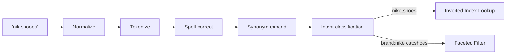

*Query understanding pipeline: each stage transforms the query progressively — normalization, tokenization, spell correction, synonym expansion, and intent classification produce a structured query that drives both index lookup and faceted filtering.*

**Java example: query normalizer and spell corrector**

```java
@Service
@RequiredArgsConstructor
public class QueryUnderstandingService {

    private final TrieDictionary dictionary;
    private final SynonymMap synonyms;
    private final IntentClassifier classifier;

    public UnderstoodQuery enrich(String rawQuery) {
        String normalized = normalize(rawQuery);
        List<String> tokens = tokenize(normalized);
        List<String> corrected = spellCorrect(tokens);
        List<String> expanded = expandSynonyms(corrected);
        Intent intent = classifier.classify(expanded, normalized);
        return new UnderstoodQuery(expanded, intent, cacheKey(normalized));
    }

    private String normalize(String query) {
        return query.toLowerCase(Locale.ROOT)
                   .trim()
                   .replaceAll("[^\\p{IsAlphabetic}\\p{Digit}\\s-]", "");
    }

    private List<String> spellCorrect(List<String> tokens) {
        return tokens.stream()
            .map(tok -> dictionary.contains(tok) ? tok : dictionary.nearest(tok, 2))
            .toList();
    }

    record UnderstoodQuery(List<String> tokens, Intent intent, String cacheKey) {}
}
```

*The `QueryUnderstandingService` bean implements the full query preprocessing pipeline: normalization (lowercasing, Unicode cleanup), tokenization, spell correction against a frequency dictionary using edit distance, synonym expansion, and intent classification. The result is an `UnderstoodQuery` record that carries the refined tokens, classified intent, and a cache key.*

---

### Retrieval and Inverted Index Mechanics

The inverted index maps terms → posting lists of document IDs with positions. Scoring classics:

- **BM25**: `score = IDF(term) × (tf×(k1+1)) / (tf + k1×(1−b+b×len/avgLen))` — term frequency saturation + length normalization; still the relevance backbone.
- **Field boosts**: title matches outweigh description matches via per-field weights or separate fields summed.
- **Filters as bitsets**: category/brand/price facets precomputed as roaring bitmaps ANDed before scoring — filter-first shrinks the candidate pool cheaply.

Candidate generation targets recall over precision: retrieve top ~1000–4000 by text score within filters; precision is the re-ranker's job. This division lets each stage use fit-for-purpose tooling (Lucene speed, ML quality).

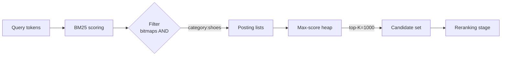

*Retrieval stage: query tokens are scored against posting lists using BM25, filter bitmasks are ANDed to narrow the candidate pool, and a max-score heap extracts the top-K candidates (typically 1000–4000) for the re-ranking stage.*

**BM25 parameter tuning**: k1 (TF saturation ~1.2–2.0) and b (length normalization ~0.75) tuned per-field empirically; title fields use lower b (titles naturally terse). Small parameter shifts measurably move head-query quality — treat as experimental surface, not constants.

**Shard-straggler mitigation**: fan-out waits on slowest shard; hedging (duplicate request to second replica after p95 timeout) caps tail latency at modest extra load — standard for <200 ms p99 targets.

**Embedding retrieval integration**: two-tower encoders map queries/products to shared space; ANN index (HNSW) retrieves semantically-similar candidates fused with lexical results via RRF. Deployed primarily for tail/zero-result rescue where lexical fails hardest.

---

### Learning-to-Rank Models

Re-rankers historically GBDT (XGBoost/LightGBM) on hand-crafted features — still the production workhorse due to latency (~1 ms/score batch) and interpretability. Deep models (two-tower user×item encoders) add semantic generalization for tail queries but cost more latency; hybrid stacks deploy GBDT on rich features *including* embedding-similarity features — best of both.

| Feature class | Examples |
|---|---|
| Textual | BM25 score, title-match coverage |
| Behavioral | CTR@position-adjusted, CVR, add-to-cart rate, sales velocity 7d |
| Catalog | rating avg/count, return rate, price-competitiveness index |
| Contextual | device, time-of-day, city demand |
| User | affinity to brand/category, past purchase embeddings, session intent |

Training data: click/impression logs with position-bias correction (inverse propensity weighting), purchases as strong labels, return events as negative signals. Offline NDCG gates deploys; online interleaving/A/B decides reality.

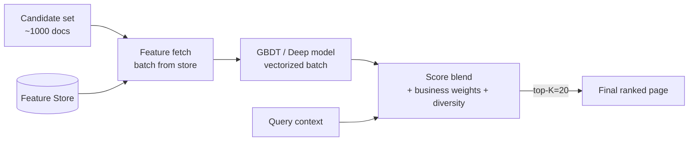

*Learning-to-rank re-ranking: the candidate set fetched from retrieval is enriched with features from the feature store, scored by a vectorized GBDT or deep model, then blended with business weights and diversity injection to produce the final ranked page.*

**Java example: ranked candidate scoring with feature injection**

```java
@Service
@RequiredArgsConstructor
public class RankingService {

    private final FeatureStoreClient featureStore;
    private final GradientBoostedTreesModel model;

    public List<RankedProduct> rerank(List<CandidateProduct> candidates,
                                      SearchRequest request) {
        FeatureMatrix features = featureStore.fetchBatch(
            candidates.stream().map(CandidateProduct::productId).toList(),
            request.customerId(),
            request.experimentArm()
        );

        float[] scores = model.predict(features);
        List<RankedProduct> ranked = new ArrayList<>();
        for (int i = 0; i < candidates.size(); i++) {
            ranked.add(new RankedProduct(candidates.get(i), scores[i]));
        }
        ranked.sort(Comparator.comparing(RankedProduct::score).reversed());

        return diversityInject(ranked, request.intent());
    }

    private List<RankedProduct> diversityInject(
            List<RankedProduct> ranked, Intent intent) {
        if (intent == Intent.EXPLORATORY) {
            return mmrDiversify(ranked, lambda = 0.7);
        }
        return ranked;
    }
}
```

*The `RankingService` bean fetches a batch of features for all candidates from the feature store, runs vectorized model inference, and sorts results by score. For exploratory queries, MMR-based diversity injection reduces redundancy. The `FeatureMatrix` and `RankedProduct` types are records defined elsewhere.*

---

### Personalization and Session Context

Personalization adjusts ranking based on who the user is and what they're doing right now. Signals flow into the re-ranker as additional features:

- **User profile features**: past purchase embeddings, brand affinity, category preference scores.
- **Session context**: current query intent, previously viewed products in this session, cart contents.
- **Real-time signals**: time-of-day, device type, geolocation, seasonal trends.
- **Exploration vs exploitation**: ε-greedy or softmax exploration gives cold/new products occasional exposure to estimate their true relevance.

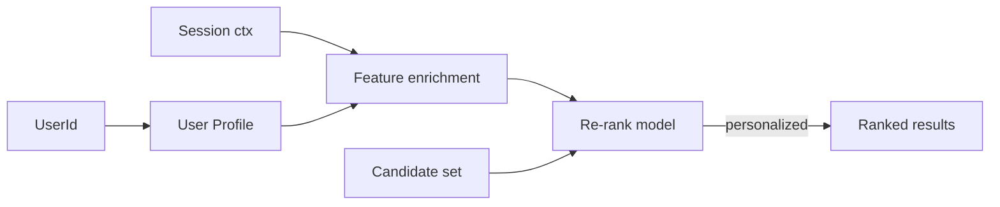

*Personalization pipeline: user profile and session context are enriched into feature vectors that bias the re-ranking model. The same candidate set can produce different orderings for different users based on their historical affinity.*

**Cold-start handling**: new users get population-average or contextual priors; new products get content-similarity to known products or boosted exploration allocation.

**Privacy**: personalization features derived from PII are anonymized or hashed before feature storage; GDPR/CCPA "right to be forgotten" requires deleting user feature rows and re-indexing.

---

### Faceted Search and Filter Aggregation

Filtering by price range, brand, rating, category — aggregations must be computed efficiently across millions of products. The key technique is to precompute filter sets as roaring bitmaps and AND them before scoring, shrinking the candidate pool cheaply.

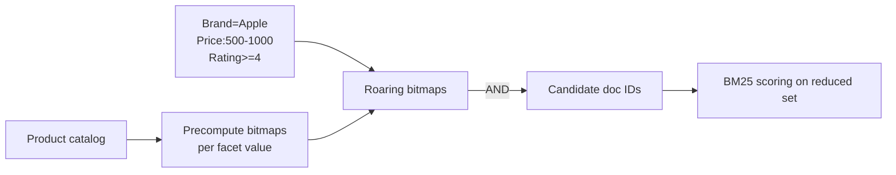

*Facet aggregation with bitmaps: each facet value (brand, price tier, rating threshold) is precomputed as a roaring bitmap. Filters are ANDed to produce a reduced candidate ID set, on which BM25 scoring runs — filtering happens before scoring, not after.*

- **Facet count aggregation**: counts per facet value computed over the candidate set (post-filter, pre-rank) so the UI shows "57 Apple phones under $1000".
- **Hierarchical facets**: `categoryPath: ["Footwear", "Running"]` enables drill-down navigation.
- **Range facets**: price ranges computed as histograms (e.g., $0–100, $100–200).
- **Aggregation sampling**: under heavy load, use approximate aggregations (t-digest, sampled counts) to stay within latency budget.
- **Cache facet counts**: for head queries, facet counts are cached alongside results with short TTLs.

```java
@Service
@RequiredArgsConstructor
public class FacetService {

    private final ElasticsearchClient esClient;

    public FacetAggregation aggregate(String index, List<String> facetFields,
                                      SearchFilter filters) {
        var query = buildFilterQuery(filters);
        var aggregations = new ArrayList<Aggregation>();
        for (String field : facetFields) {
            aggregations.add(new TermsAggregation(field));
        }
        var response = esClient.search(r -> r
            .index(index)
            .query(query)
            .size(0)
            .aggregations(aggregations));
        return FacetAggregation.from(response);
    }
}
```

*The `FacetService` bean runs Elasticsearch terms aggregations with `size=0` (no actual hits, only aggregation counts) over the filtered query — this returns the count of products matching each facet value without paying the cost of scoring or returning documents.*

---

### Index Freshness and CDC Pipeline

Catalog commits emit row-events → Kafka → transformer denormalizes → bulk-update index with optimistic versioning (stale-writes rejected). This achieves minutes-level freshness without coupling OLTP to search availability.

- **Event sourcing**: catalog writes (price change, stock update, new product, delisting) emit to a Kafka topic keyed by `productId`.
- **Transformer**: consumes events, joins with catalog DB for denormalization, produces index documents.
- **Bulk indexing**: batches writes (every 1–5 s or 1000 events), applies with `doc_as_upsert` and version conflict detection.
- **Tombstone handling**: delete events produce tombstone documents with a `deleted: true` flag; the search query filters these out.
- **Full reindex orchestration**: schema migrations trigger a full reindex with a blue-green index alias swap.

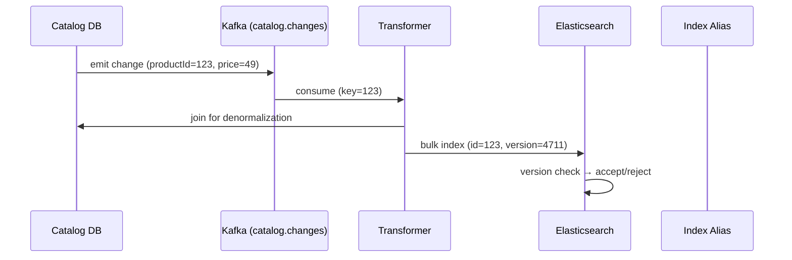

*CDC indexing pipeline: the catalog database emits change events to Kafka. A transformer service consumes them, performs denormalization joins, and bulk-indexes into Elasticsearch with version checks — stale events are rejected, ensuring eventual consistency without coupling.*

**Key decision**: event ordering per SKU (key by productId); tombstone handling for delistings. Version conflicts cause the stale write to be rejected, preserving correctness even under out-of-order delivery.

---

### Behavioral Features and Feature Store

Fresh behavioral/catalog signals keyed by product. The feature store is the bridge between batch/stream processing and online serving.

- **Real-time tier (seconds)**: Flink/Kafka Streams computing velocity windows — CTR, CVR, add-to-cart rate, sales velocity over 7-day and 1-hour windows. Served from Redis-cluster with sub-ms latency.
- **Near-real tier (hourly)**: aggregated statistics, historical averages, cohort-based baselines.
- **Batch tier (nightly)**: full recomputation of all features, model training data backfill, embedding refresh.
- **Point-in-time correctness**: training joins must not leak post-click aggregates — feature vectors are snapshotted at the time of each impression.

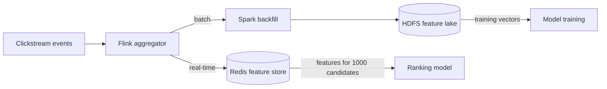

*Feature store architecture: clickstream events flow through a Flink aggregator that materializes both real-time features (to Redis for sub-ms serving) and batch features (to HDFS for model training). Training vectors are snapshotted at impression time for point-in-time correctness.*

**Training/serving parity**: a single feature-definition codebase compiles to both Flink jobs (serving materialization) and Spark jobs (training backfill). Parity is monitored by comparing distribution statistics continuously — skew between training and serving is the #1 silent killer of ranking launches.

---

### Sponsored Insertion

Ads slot into organic results *after* re-ranking: auction (bid × predicted CTR) selects winners per page position; disclosure obligations and relevance floors prevent pure-pay pollution. Keeping ads decoupled preserves organic-model integrity while monetizing prime slots.

- **Auction**: each sponsor bids on ad placement; the winning combination of bid × predicted CTR × quality score fills paid slots.
- **Decoupling**: sponsored items are inserted after organic ranking — the organic model doesn't see ad signals.
- **Relevance floors**: sponsored items below a minimum textual-match threshold are excluded to preserve user trust.
- **Disclosure**: every sponsored item is tagged for regulatory compliance (FTC disclosure, EU transparency requirements).

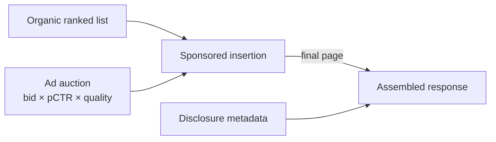

*Sponsored insertion flow: the organic ranked list is produced first, then the ad auction selects winners based on bid × predicted CTR × quality. Sponsored items are inserted into paid slots after organic results, with disclosure metadata attached — ads are decoupled from organic ranking.*

**Business impact**: sponsored listings can contribute 15–30% of revenue on major platforms. The trade-off is user trust — excessive commercialization degrades long-term engagement.

---

### Replication Strategies

Search index replication keeps query-serving copies across multiple nodes, availability zones, and even regions. Unlike key-value stores that replicate by key, search replication works at the shard level.

#### Shard-Level Replication

- **Elasticsearch / OpenSearch**: each index is split into N primary shards, each with M replica shards. Replicas are full copies of the primary shard's inverted index. Reads (searches) can be served from any replica; writes go to the primary and are replicated to replicas via the translog.
- **SolrCloud**: similar primary/replica model with ZooKeeper coordinating shard leadership and replica placement.
- **Replica allocation awareness**: Elasticsearch's Awareness Replica (EAR) ensures replica shards are not placed on the same availability zone as their primary, surviving AZ-level failures.

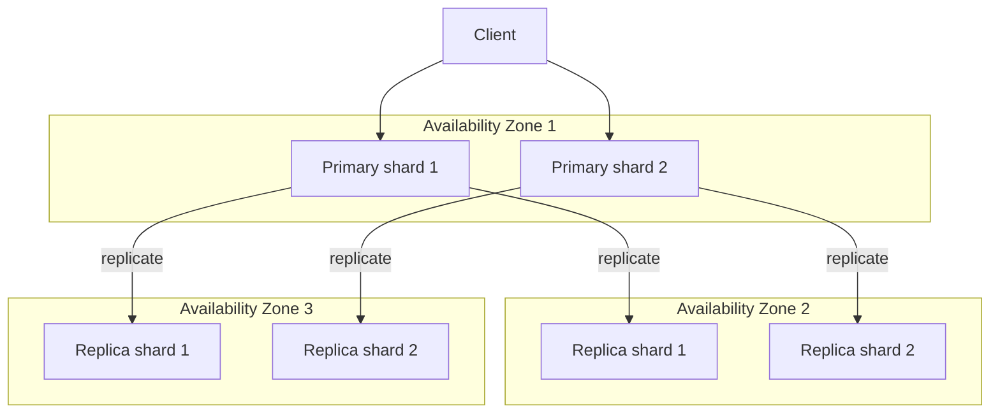

*Shard-level replication across three availability zones: primary shards in AZ-1 handle writes and replicate to two replica copies in AZ-2 and AZ-3. Awareness-based allocation ensures no replica shares an AZ with its primary, surviving a full AZ outage.*

#### Cross-Cluster Replication (CCR)

- **Leader/follower**: a remote cluster (leader) replicates index operations to a local cluster (follower). Used for geo-distribution and disaster recovery.
- **Read-only mode**: follower clusters serve reads (searches) locally, providing low latency for global users.
- **Replication lag**: typically seconds to minutes; follower may briefly serve stale data.

#### Consistency Implications

- Search is inherently eventually consistent: a write acknowledged by the primary is searchable after the next refresh (default 1 s in Elasticsearch). This favors availability and partition tolerance (AP) over strong consistency.
- For read-after-write needs, callers can force a refresh (`?refresh=true`) or use quorum reads (`?preference=_only_local` is not safe across nodes; use `?q=status:published&refresh=true` for strong local reads).

**Java example: configuring replica count and read preference**

```java
@Service
@RequiredArgsConstructor
public class SearchReplicationService {

    private final ElasticsearchClient esClient;
    private final AppConfig config;

    public void setReplicaCount(String index, int replicas) {
        esClient.indices().putSettings(r -> r
            .index(index)
            .settings(s -> s
                .indexSettings(Map.of("number_of_replicas", replicas))));
    }

    public SearchRequest withPreferredZone(SearchRequest req) {
        return SearchRequest.builder(req)
            .preference("_only_local")
            .build();
    }
}
```

*The `SearchReplicationService` bean manages replica count at runtime (scaling query capacity without reindexing) and injects a shard-preference hint (`_only_local`) so queries prefer the local AZ's shard copy, reducing cross-AZ latency.*

---

### Failure Detection and Membership

A search cluster must detect failed nodes, reassign their shards, and continue serving with minimal disruption. Elasticsearch uses a cluster of dedicated master-eligible nodes coordinated via a consensus protocol (formerly Zen Discovery, now Raft-based).

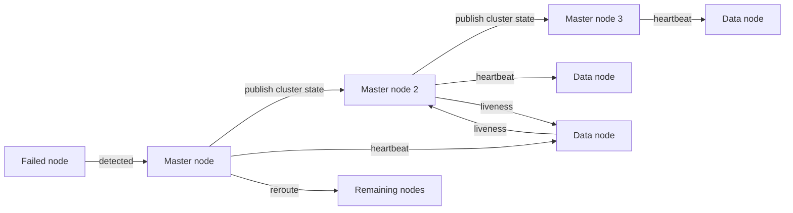

*Cluster failure detection: master-eligible nodes exchange heartbeats and publish cluster state. If a data node stops responding to both the master and its peers, it is marked failed and its shards are reallocated to surviving nodes via a reroute command.*

#### Cluster Health States

| State | Meaning | Impact |
|---|---|---|
| **Green** | All primary and replica shards are allocated | Full availability, full redundancy |
| **Yellow** | All primary shards allocated; some replicas missing | Queries still served; no fault tolerance |
| **Red** | One or more primary shards unassigned | Some data unavailable for search |

#### Failure Detection Timing

- **Heartbeat interval**: master pings each node every 1 s (configurable).
- **Failure timeout**: 30 s node-left threshold (configurable). Shorter = faster detection but more false positives.
- **Quorum confirmation**: only the master (elected by majority of master-eligible nodes) can declare a node failed and trigger reroute.

#### Recovery After Failure

- **Shard relocation**: the master reassigns the failed node's shards to other nodes, which begin replica recovery (streaming segments from a source shard).
- **Circuit breakers**: per-node memory protections prevent the recovery process from OOM-killing additional nodes.

---

### High Availability and Scalability

Search clusters must remain available when nodes fail and must scale to handle growing catalog size and query volume.

#### Multi-AZ High Availability

- **Dedicated master nodes**: 3 or 5 dedicated master-eligible nodes (no data) across AZs ensure a master can always be elected during a full AZ outage.
- **Zone awareness**: index-level awareness attributes (`cluster.routing.allocation.awareness.attributes: [zone]`) keep replicas in different AZs.
- **Searchable snapshots**: for cold/frozen data, store in S3/GCS and query directly — no need to keep a full local copy, reducing storage cost for rarely-changed data.
- **Cross-cluster replication (CCR)**: geo-replicate the index to remote regions for geographic redundancy.

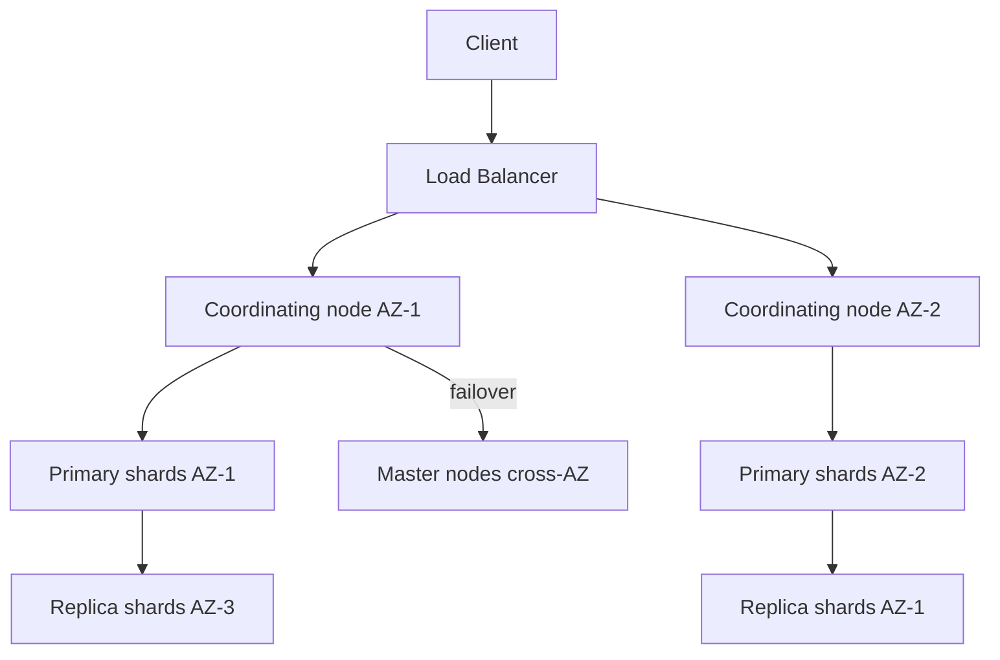

*Multi-AZ search deployment: coordinating nodes in two AZs route queries to local primary shards. Replicas reside in a third AZ. Dedicated master nodes span all AZs, ensuring cluster state survives any single-AZ loss.*

#### Scaling Strategies

- **Horizontal scaling**: add data nodes and increase primary shard count (requires reindexing). Elasticsearch supports up to 20 shards/node and ~2000 shards/node comfortably.
- **Vertical scaling**: increase RAM for larger shard caches and bigger JVM heaps (up to 32 GB recommended for G1GC).
- **Query autoscaling**: Kubernetes HPA scales coordinating nodes based on search QPS; data nodes scale based on disk usage and CPU.
- **Result caching**: head-query result caching (5–30 s TTL) shields repeated queries during traffic spikes.

#### Split-Brain Prevention

- **Minimum master nodes**: requires a majority of configured master-eligible nodes to elect a master, preventing two masters during a partition.
- **Raft consensus**: modern Elasticsearch uses Raft for leader election, ensuring at most one master exists at any time.

---
### Performance and Optimization

Search latency is the primary user-facing metric. A typical budget splits as: 10 ms query parsing + 30 ms retrieval + 100 ms re-ranking + 50 ms I/O + 10 ms assembly. Each component contributes to p99.

#### Latency Optimization

- **Query result caching**: cache the full search response (hits + facets) for head queries with short TTLs (5–30 s). Eliminates the entire funnel for repeat identical queries.
- **Shard sizing**: 20–40 GB per shard is the sweet spot. Too many small shards → too many file handles and thread-pool contention; too few large shards → slow recovery and poor parallelism.
- **Hedged requests**: if a shard hasn't replied within the p95 timeout, transparently retry on another replica. Caps straggler impact at ~2× extra load per slow shard.
- **Connection pooling**: reuse TCP/TLS connections to coordinating nodes; pool size tuned to concurrent request count.
- **Field selection**: `_source` filtering to only retrieve fields needed for the response — reduces network and GC pressure.

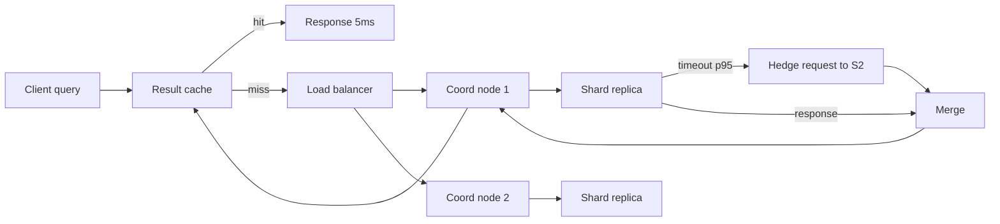

*Search latency pipeline: a result cache short-circuits identical head queries (~5 ms). On a cache miss, the query fans out to coordinating nodes; if a shard replica is slow, a hedged request is sent to a sibling replica to cap tail latency.*

#### Throughput Optimization

- **Concurrent search reduction**: limit `max_concurrent_searchable_shards` per node to prevent thread-pool saturation.
- **Batching re-ranking**: re-rank candidate sets in batches of 32–64 for vectorized model inference.
- **Asynchronous reindexing**: run heavy reindexing during off-peak hours with throttled thread pools.

```java
@Service
@RequiredArgsConstructor
public class SearchPerformanceService {

    private final ElasticsearchClient esClient;
    private final SearchResultCache resultCache;

    public SearchResponse search(SearchRequest request) {
        String cacheKey = cacheKey(request);
        SearchResponse cached = resultCache.get(cacheKey);
        if (cached != null) {
            return cached;
        }

        SearchResponse response = esClient.search(s -> s
            .index("products")
            .query(buildQuery(request))
            .source(s2 -> s2.filter(filterFields(request)))
            .trackTotalHits(t -> t.enabled(true))
            .size(request.limit())
            .timeout(Duration.ofSeconds(5))
        );

        resultCache.put(cacheKey, response, Duration.ofSeconds(15));
        return response;
    }
}
```

*The `SearchPerformanceService` bean implements the full performance optimization stack: a result cache short-circuits repeat head queries, `_source` field filtering reduces network payload, an explicit search timeout prevents slow shards from degrading user experience, and cache TTL is bounded to control staleness.*

---

### CAP Theorem and Consistency Trade-offs

Search engines are deployed as distributed systems and must make CAP trade-offs. Elasticsearch prioritizes **AP** (availability + partition tolerance) by default, serving reads from replica shards even when they are slightly stale.

```mermaid
flowchart LR
    subgraph CAP[CAP Trade-offs for Search]
        AP[Search (AP): queries served from any replica]
        CP[Admin API (CP): schema, settings via quorum]
    end
    AP --> DB[(Catalog DB)]
    CP --> DB
    Client --> AP
    Admin --> CP
```

*Search workloads favor AP: any replica can serve queries (high availability), accepting eventual consistency. Administrative operations (index settings, mappings) require quorum (strong consistency) and are much lower volume.*

#### Key Trade-offs

- **Read-after-write consistency**: Elasticsearch refresh interval (default 1 s) means a newly indexed document may not be immediately searchable. Callers needing immediate visibility can use `?refresh=true` (synchronously refreshes the shard, ~10–50 ms cost).
- **Replication consistency**: replica shards apply operations from the primary in order but may lag by seconds under heavy indexing. Reads from replicas are eventually consistent.
- **Tunable read consistency**: use `?consistency=quorum` for search requests to ensure the search is executed on a quorum of shards (slower but more consistent).

#### Real-Life Mapping

- **AP systems**: Elasticsearch, SolrCloud (search path), OpenSearch.
- **CP systems**: Elasticsearch admin APIs (when configured with write quorum), ZooKeeper-dependent operations.

---

### Encryption and Key Management

Search traffic and stored index data must be encrypted to protect sensitive product and user data.

#### Encryption at Rest

- **Native encryption at rest** (Elasticsearch 7.0+, Solr 8+): the storage layer encrypts index segments, translog, and doc-values using AES-256 with keys managed by a keystore (JCEKS or cloud KMS).
- **OS-level disk encryption**: LUKS/dm-crypt encrypts the entire data volume — simpler but uses a single key for all indices.
- **Application-level encryption**: for PII within documents (e.g., user email in a product review index), encrypt individual fields before indexing — fields are not searchable but protect sensitive data.

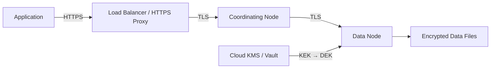

*Encryption layers: client traffic is TLS-encrypted to the load balancer; inter-node communication uses mutual TLS; data files on disk are encrypted via a data encryption key (DEK) whose key-encrypting key (KEK) lives in a KMS or HSM.*

#### Encryption in Transit

- **TLS 1.3** for all client-to-node and inter-node communication.
- **Mutual TLS (mTLS)** for node-to-node replication traffic — each node presents a certificate.
- **Certificate rotation**: automated via cert-manager or Elasticsearch's auto-generated certs, rotated every 90 days.

#### Key Management

- **Key hierarchy**: KEK (in KMS/HSM) encrypts DEKs (per-node or per-index), which encrypt actual data.
- **Key rotation**: DEKs rotated per-index-recreation or monthly; KEKs rotated every 12 months with lazy re-encryption.

**Java example: TLS and keystore configuration**

```java
@Configuration
public class SearchSecurityConfig {

    @Value("${search.keystore.path}")
    private String keystorePath;
    @Value("${search.keystore.type:JCEKS}")
    private String keystoreType;

    @Bean
    public SSLContext searchSslContext() throws GeneralSecurityException, IOException {
        KeyStore ks = KeyStore.getInstance(keystoreType);
        try (var in = new FileInputStream(keystorePath)) {
            ks.load(in, System.getenv("SEARCH_KEYSTORE_PASS").toCharArray());
        }
        KeyManagerFactory kmf = KeyManagerFactory.getInstance(KeyManagerFactory.getDefaultAlgorithm());
        kmf.init(ks, System.getenv("SEARCH_KEYSTORE_PASS").toCharArray());
        TrustManagerFactory tmf = TrustManagerFactory.getInstance(TrustManagerFactory.getDefaultAlgorithm());
        tmf.init(ks);
        SSLContext ctx = SSLContext.getInstance("TLSv1.3");
        ctx.init(kmf.getKeyManagers(), tmf.getTrustManagers(), null);
        return ctx;
    }
}
```

*The `SearchSecurityConfig` loads a JCEKS keystore containing node TLS certificates and CA trust material, initializes key and trust managers, and constructs an explicit TLS 1.3 `SSLContext` wired into the Elasticsearch REST client — keeping all transport and inter-node traffic encrypted.*

---

### Authentication and Authorization

A search cluster must verify who is querying and what they can see. In e-commerce, this includes per-tenant product visibility and per-user personalized results.

#### Authentication

- **API keys**: stateless keys issued per service (web, mobile, internal analytics). Revocable and rate-limited.
- **TLS client certificates**: for internal service-to-service communication (indexing pipeline → cluster).
- **Bearer tokens (JWT/OAuth)**: for end-user search where personalization depends on identity.

#### Authorization

- **Role-Based Access Control (RBAC)**: roles map to index patterns and privileges (`read`, `write`, `manage`).
- **Document-Level Security (DLS)**: filters search results to documents matching a per-user predicate (e.g., only show products available in the user's country).
- **Field-Level Security (FLS)**: restricts which fields are returned (e.g., hide wholesale costs from retail users).
- **Search result authorization**: additional filtering of search hits by per-product permission checks, beyond DLS.

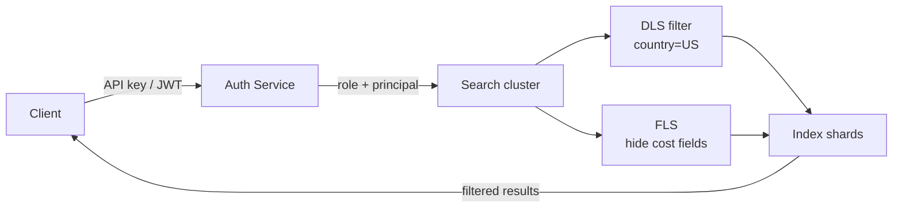

*Authentication and authorization in the search path: the client presents an API key or JWT, the auth service resolves a role and principal, and the search cluster applies document-level security (DLS) and field-level security (FLS) filters before returning results.*

**Java example: role-based search with DLS and FLS**

```java
@Service
@RequiredArgsConstructor
public class SecureSearchService {

    private final ElasticsearchClient esClient;
    private final UserContext userContext;

    public SearchResponse search(SearchRequest request) {
        String userCountry = userContext.country();
        List<String> allowedCategories = userContext.allowedCategories();

        SearchRequest esReq = SearchRequest.builder()
            .index("products")
            .query(QueryBuilders.bool()
                .must(buildQuery(request))
                .filter(QueryBuilders.terms("availableCountries", List.of(userCountry)))
                .filter(QueryBuilders.terms("category", allowedCategories))
                .build())
            .source(SourceConfig.builder()
                .filter(Roles.FLS_PUBLIC_FIELDS)
                .build())
            .build();

        return esClient.search(esReq);
    }
}
```

*The `SecureSearchService` bean enforces RBAC by injecting a `bool` query filter for document-level security (only products available in the user's country and permitted categories) and a source filter for field-level security (hiding internal cost fields). The `UserContext` carry the authenticated principal's attributes.*

---
### Security Threats and Mitigations

Search clusters face distinct threats beyond classic data-store concerns: expensive queries can be weaponized, and search results can leak cross-tenant data.

#### Threat: Query DoS

- **Risk**: an attacker submits wildcard, regex, or high-cardinality aggregation queries that consume CPU and memory, degrading or crashing the cluster.
- **Mitigation**: query complexity limits (`indices.query.bool.max_clause_count`), query timeouts, aggregation cardinality caps, rate limiting per API key or IP, and a denylist of expensive query types in production.

#### Threat: Data Exfiltration via Search

- **Risk**: an attacker with search access can dump the entire index by paging through results (`from=0&size=10000` repeatedly).
- **Mitigation**: enforce a maximum `from+size` (default 10,000 in Elasticsearch), use cursor-based pagination with a cap, apply document-level security to restrict visible documents.

#### Threat: Index Poisoning

- **Risk**: malformed or spammy product data (keyword-stuffed titles, HTML injection in descriptions) degrades search quality and can break the re-ranker.
- **Mitigation**: schema validation on ingest (strict mapping), query-time sanitization, spam detection ML models on product data, and regular quality audits.

#### Threat: Cross-Tenant Data Leakage

- **Risk**: shared index or insufficient DLS allows a tenant to see another tenant's products.
- **Mitigation**: RBAC with index-level isolation, DLS predicates scoped to tenant ID, automated audit logging of every search request with principal and result count.

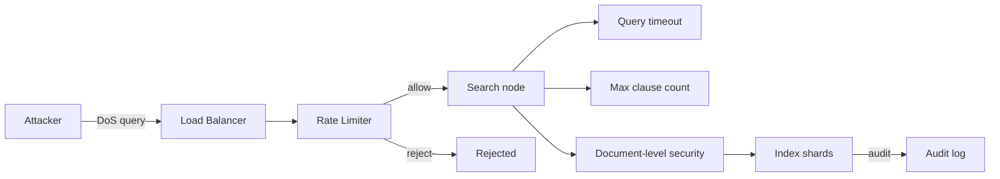

*Search security defense-in-depth: rate limiting at the load balancer, query complexity limits and timeouts at the search node, document-level security filtering results per-principal, and audit logging for every request.*

#### Threat: Click Fraud and Ranking Manipulation

- **Risk**: sellers generate fake clicks/orders to inflate their CTR/CVR signals and rank higher.
- **Mitigation**: anomaly detection on traffic sources and click patterns, session-level deduplication, and human review for sudden ranking jumps.

**Java example: query complexity guard**

```java
@Component
public class QuerySafetyGuard {

    @Value("${search.query.max-clauses:1024}")
    private int maxClauses;
    @Value("${search.query.max-time-ms:5000}")
    private int maxTimeMs;

    public void validate(SearchRequest request) {
        if (request.query().clauseCount() > maxClauses) {
            throw new QueryRejectedException("Query exceeds max clause count");
        }
        if (request.aggregations().size() > 5) {
            throw new QueryRejectedException("Too many aggregations");
        }
    }
}
```

*The `QuerySafetyGuard` bean enforces search-specific DoS protections: it rejects queries exceeding the maximum boolean clause count (preventing wildcard explosion) and caps the number of concurrent aggregations. These limits are configurable via `@Value` properties, allowing operators to tune protection per environment.*

---

### Observability and Logging

Search quality and cluster health must be observable — a misconfigured shard or a degraded ranking model can silently hurt revenue without any alerts firing.

#### Key Metrics

| Category | Metric | Why It Matters |
|---|---|---|
| **Latency** | p50/p95/p99 search response time | User-facing SLA (target < 200 ms p99) |
| **Quality** | NDCG@10, MRR@10, CTR, CVR per query class | Relevance quality, not just performance |
| **Throughput** | search QPS, indexing docs/s | Capacity planning, autoscaler trigger |
| **Cluster** | cluster health (green/yellow/red), shard count, node count | Availability and balance |
| **Cache** | result cache hit ratio, field data cache evictions | Effectiveness of caching layers |
| **Errors** | search error rate, indexing failure rate | Reliability |
| **Freshness** | index lag (seconds from CDC to searchable) | Correctness of price/stock data |

#### Logging

- **Access logs**: log every search request with `q`, `userId`, `experimentArm`, result count, latency, and whether the response came from cache — required for offline quality analysis and experiment evaluation.
- **Slow query logs**: log any query exceeding a configurable threshold (e.g., 200 ms) with the full query DSL and the shard it ran on.
- **Audit logs**: log authentication failures, DLS-filtered searches, and configuration changes.

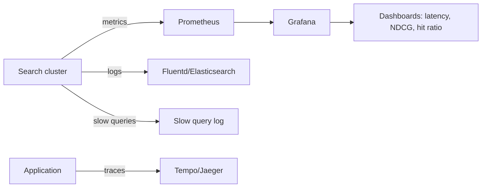

*Search observability pipeline: cluster metrics flow to Prometheus for dashboards; access and slow-query logs flow to a log aggregator; distributed traces follow each user request through the full funnel (query → retrieval → re-rank → response).*

#### Alerting Thresholds

- p99 search latency > 200 ms for 5 minutes → page on-call.
- Cluster state red for 30 s → immediate alert.
- NDCG@10 drops > 10% relative to baseline → quality regression alert.
- Index lag > 5 minutes → freshness SLO breach.
- Cache hit ratio < 70% → investigate hot queries or cache eviction.

**Java example: instrumented search metrics**

```java
@Service
@RequiredArgsConstructor
public class InstrumentedSearchService {

    private final MeterRegistry meterRegistry;
    private final ElasticsearchClient esClient;

    private final Timer searchTimer = Timer.builder("search.latency")
        .tag("layer", "retrieval")
        .register(meterRegistry);

    private final Gauge ndcgGauge = Gauge.builder("search.ndcg")
        .register(meterRegistry, this, InstrumentedSearchService::currentNdcg);

    public SearchResponse search(SearchRequest request) {
        return searchTimer.record(() -> {
            Counter.builder("search.requests")
                .tag("query_type", request.queryType())
                .tag("experiment_arm", request.experimentArm())
                .register(meterRegistry).increment();

            var response = esClient.search(buildEsRequest(request));
            recordQualityMetrics(response, request);
            return response;
        });
    }

    private double currentNdcg() {
        return experimentService.latestNdcg();
    }
}
```

*The `InstrumentedSearchService` bean uses Micrometer to record search latency (tagged by layer), request counts (tagged by query type and experiment arm), and a NDCG gauge for offline-quality feedback. The `searchTimer.record()` wraps the entire search call, and counters are tagged for experiment-segment analysis.*

---

### Real-World Implementations

- **Flipkart** — vernacular search investments and sale-mode ranking documented publicly; their FLIPKART-scale funnels validate the architecture directly. Two-stage retrieval (Lucene-based) with GBDT re-ranking, transliteration-aware tokenization for Indic languages, and aggressive result caching for head queries during Big Billion Days.
- **Amazon** — pioneered behavioral-feature ranking (A9/A10 evolution); product-detail-page "frequently bought together" shows ranking-adjacent retrieval breadth. Uses a two-stage funnel: item-to-item collaborative filtering for retrieval, then a deep neural re-ranker. Their key innovation: learning-to-rank trained on click and purchase logs with position-bias correction.
- **eBay** — published extensively on their two-stage LTR migration and position-bias correction research; academic-grade transparency. Uses a cascade of rankers (matching ranking, then re-ranking) with LambdaMart (GBDT) as the primary model, and runs interleaving experiments for continuous online evaluation.
- **Etsy** — strong engineering-blog culture covering experimentation platforms and embedding-based discovery for handmade-tail catalogs — the tail-query problem industrialized. Uses a two-tower embedding model (query and product encoders) with a lexical retrieval fallback; their ranking pipeline fuses textual relevance, listing quality, and shop reputation scores.
- **Shopify** — merchant-facing search powered by a managed Elasticsearch cluster with per-shop DLS filtering, real-time CDC indexing from MySQL, and custom synonym dictionaries per vertical.
- **Walmart** — uses a hybrid system: Elasticsearch for retrieval with BM25 + field boosting, and a SageMaker-hosted GBDT model for re-ranking. Their key insight: feature store parity between training (Spark) and serving (Redis) is the #1 operational challenge.

---
### Java and Spring Boot Implementation Guide

This section shows how to build a practical e-commerce search and ranking service with Spring Boot. Each component uses Spring beans, constructor injection, and production-grade patterns.

#### 1. DTOs as records with validation

```java
public record SearchRequest(
    @NotBlank String q,
    @Min(1) @Default("1") int page,
    @Max(100) int limit,
    String sort,
    String category_id,
    @DecimalMin("0") BigDecimal min_price,
    @DecimalMin("0") BigDecimal max_price,
    String[] brand,
    Boolean in_stock,
    String customer_id,
    String experimentArm
) {}

public record ProductResult(
    String productId,
    String title,
    BigDecimal price,
    String currency,
    String imageUrl,
    BigDecimal rating,
    long reviewCount,
    boolean inStock,
    String shippingInfo,
    double score
) {}

public record SearchResponse(
    String query,
    long totalHits,
    int page,
    int limit,
    List<ProductResult> results,
    Map<String, Object> facets,
    List<String> suggestions,
    @Version long version
) {}
```

*DTOs are defined as immutable records with Bean Validation annotations (`@NotBlank`, `@Min`, `@Max`, `@DecimalMin`) so invalid requests fail fast at the controller boundary. `BigDecimal` is used for all monetary values. The `version` field on `SearchResponse` uses `@Version` for optimistic locking when cached responses are updated concurrently.*

#### 2. REST controller with validation and constructor injection

```java
@RestController
@RequestMapping("/api/v1")
@RequiredArgsConstructor
public class SearchController {

    private final SearchOrchestrator orchestrator;

    @GetMapping("/search")
    public ResponseEntity<SearchResponse> search(
            @Valid @ModelAttribute SearchRequest request,
            @RequestHeader(value = "X-Experiment-Arm", required = false) String experimentArm) {

        SearchResponse response = orchestrator.search(request, experimentArm);
        return ResponseEntity.ok(response);
    }

    @GetMapping("/search/suggest")
    public ResponseEntity<List<Suggestion>> suggest(
            @RequestParam String q,
            @RequestParam(defaultValue = "5") int limit) {
        return ResponseEntity.ok(orchestrator.suggest(q, limit));
    }
}
```

*`SearchController` is a thin `@RestController` using constructor injection (`@RequiredArgsConstructor`). `@Valid` on the model attribute triggers validation before the method body executes. The `@ControllerAdvice` below converts validation failures into clean 400 responses.*

#### 3. Global exception handler

```java
@ControllerAdvice
public class SearchExceptionHandler {

    @ExceptionHandler(MethodArgumentNotValidException.class)
    public ResponseEntity<ApiError> handleValidationError(MethodArgumentNotValidException ex) {
        List<String> errors = ex.getBindingResult().getFieldErrors()
            .stream().map(FieldError::getDefaultMessage).toList();
        return ResponseEntity.badRequest()
            .body(new ApiError("VALIDATION_ERROR", errors));
    }

    @ExceptionHandler(SearchServiceUnavailableException.class)
    public ResponseEntity<ApiError> handleUnavailable(SearchServiceUnavailableException ex) {
        return ResponseEntity.status(HttpStatus.SERVICE_UNAVAILABLE)
            .body(new ApiError("SEARCH_UNAVAILABLE", List.of("Search cluster is down")));
    }

    record ApiError(String code, List<String> errors) {}
}
```

*The `SearchExceptionHandler` is a `@ControllerAdvice` that catches validation exceptions and service-unavailability errors, converting them into structured JSON error responses with appropriate HTTP status codes — ensuring callers always get a parseable error body.*

#### 4. Search orchestrator with result caching

```java
@Service
@RequiredArgsConstructor
public class SearchOrchestrator {

    private final QueryUnderstandingService queryUnderstanding;
    private final RetrievalClient retrieval;
    private final FeatureClient featureClient;
    private final RankingService rankingService;
    private final SearchResultCache resultCache;

    @Value("${app.search.cache-ttl-seconds:30}")
    private int cacheTtlSeconds;

    public SearchResponse search(SearchRequest request, String experimentArm) {
        var understood = queryUnderstanding.enrich(request.q());
        String cacheKey = understood.cacheKey() + ":page:" + request.page();

        return resultCache.get(cacheKey)
            .orElseGet(() -> execute(request, understood, experimentArm, cacheKey));
    }

    @Transactional
    private SearchResponse execute(SearchRequest request, UnderstoodQuery understood,
                                   String experimentArm, String cacheKey) {
        var candidates = retrieval.retrieve(understood, request, RERANK_POOL_SIZE);
        var features = featureClient.batchFetch(candidates.ids(), request.customerId(), experimentArm);
        var ranked = rankingService.rerank(candidates, features, request);
        var page = ranked.page(request.page(), request.limit());
        var response = ResponseAssembler.assemble(page, candidates.facets(), request);

        resultCache.put(cacheKey, response, Duration.ofSeconds(cacheTtlSeconds));
        return response;
    }
}
```

*`SearchOrchestrator` is a `@Service` that implements the retrieve-then-rerank funnel with result caching for head queries. `@Value` injects the cache TTL from configuration. `@Transactional` wraps the execute method so the search log write (if added) commits atomically with the result cache update. Constructor injection via `@RequiredArgsConstructor` keeps dependencies explicit and testable.*

#### 5. Repository with versioning and transactional ingestion

```java
@Repository
@RequiredArgsConstructor
public class ProductIndexRepository {

    private final ElasticsearchClient esClient;

    @Transactional
    public void indexUpsert(ProductDocument doc) {
        esClient.index(i -> i
            .index("products")
            .id(doc.productId())
            .version(doc.docVersion())
            .opType(IndexRequest.OpType.Index)
            .document(doc.toEsDocument()));
    }

    @Transactional
    public void delete(String productId, long expectedVersion) {
        esClient.delete(d -> d
            .index("products")
            .id(productId)
            .version(expectedVersion));
    }
}
```

*`ProductIndexRepository` is a `@Repository` with `@Transactional` methods for idempotent upserts and versioned deletes. The `@Version` field (`docVersion`) ensures out-of-order CDC events are rejected — Elasticsearch returns a `VersionConflictEngineException` when the stored version is newer.*

#### 6. CDC consumer for index freshness

```java
@Component
@RequiredArgsConstructor
public class CatalogChangeEventConsumer {

    private final ProductIndexRepository repository;

    @KafkaListener(topics = "catalog.changes", groupId = "search-indexer")
    public void onChange(CatalogChange event) {
        switch (event.type()) {
            case UPSERT -> repository.indexUpsert(toDocument(event));
            case DELETE -> repository.delete(event.productId(), event.docVersion());
        }
    }
}
```

*`CatalogChangeEventConsumer` is a `@Component` that listens to the `catalog.changes` Kafka topic. Each event is converted to an `ProductDocument` and sent to the repository with its version number — the repository's `@Transactional` method ensures the version check rejects stale events.*

#### 7. Feature store client for behavioral signals

```java
@Service
@RequiredArgsConstructor
public class FeatureClient {

    private final StringRedisTemplate redisTemplate;

    public FeatureMatrix batchFetch(List<String> productIds, String customerId,
                                    String experimentArm) {
        String pattern = "features:" + experimentArm + ":{productId}";
        List<String> keys = productIds.stream()
            .map(id -> "features:" + id)
            .toList();

        List<String> raw = redisTemplate.opsForValue().multiGet(keys);
        return FeatureMatrix.fromRaw(raw);
    }
}
```

*`FeatureClient` is a `@Service` that fetches pre-computed behavioral features (CTR, CVR, velocity) from Redis in a single batch GET — minimizing network round-trips. Features are namespaced by experiment arm to ensure training/serving parity.*

---

### Interview Questions and Answers

**Beginner**

1. **Why split retrieval and re-ranking into stages?**
   Cheap textual scoring narrows millions of docs to ~1000 candidates; only then does expensive ML scoring apply. Cost becomes proportional to visible candidates, meeting latency budgets impossible otherwise.

2. **What is BM25 doing conceptually?**
   Scores documents by term overlap weighted by rarity (IDF), saturating term frequency (more repeats ≠ proportionally better), normalized for document length — the classical relevance backbone under every modern tweak.

3. **What is the difference between an index, a shard, and a replica in Elasticsearch?**
   An index is a collection of documents. A shard is a slice of an index (a Lucene instance). A replica is a full copy of a shard that can serve reads and provides fault tolerance. Shards distribute load; replicas provide redundancy.

4. **When would you choose Elasticsearch over Solr?**
   Elasticsearch has better built-in distributed coordination, richer query DSL, and a more active ecosystem. Solr has more mature features for faceting and custom plugins. Choose ES for modern cloud-native deployments; Solr for deep customization.

**Intermediate**

5. **How do you keep prices/stock fresh in the index without hammering the catalog DB?**
   CDC events flow through Kafka to an indexing pipeline performing denormalization and versioned bulk-updates — minutes-level freshness with zero synchronous coupling. Out-of-order events are neutralized by doc-version checks.

6. **Explain position bias and its fix.**
   Users click top results regardless of true quality, so naive training teaches "high rank = relevant." Fix: inverse-propensity weighting using learned/estimated examination probabilities, or randomized-interleaving experiments collecting unbiased labels.

7. **A new product has zero clicks. How do you rank it fairly?**
   Content-based priors (text match, attribute quality, seller reputation), explore-exploit allocation (small guaranteed exposure windows measuring engagement), cold-start embeddings from similar-product transfer. Explicitly designed — otherwise new inventory starves.

8. **What happens during an Elasticsearch rolling restart?**
   Each node is restarted one at a time. The master reassigns the restarted node's shards to other nodes (replica shards become primary temporarily). Once the node rejoins, shards rebalance back. Cluster stays yellow during the process, green when done.

**Advanced**

9. **Design the feature store: consistency between training and serving.**
   Single feature-definition codebase compiled to both Flink jobs (serving materialization) and Spark backfills (training); point-in-time-correct joins during training (no leakage of post-click aggregates!); parity monitors comparing distributions continuously. This question separates ML-platform literacy from buzzwords.

10. **During a sale, your p99 breaches SLA. Which stage do you suspect first and why?**
    Retrieval stragglers (shard hot-spotting under skewed celebrity queries) and facet-aggregation costs spike first; mitigations ready: hedged requests, approximated facet counts, deeper result caching, admission control upstream. Reason through measurement before moving pieces.

11. **How would you handle a single celebrity query receiving 500K req/s against one shard's limit of ~110K?**
    Query-result caching for the head query (cache the assembled response for 30 s). If cache misses, replicate the hot query across multiple coordinating nodes that each fan out to different replicas. If still overloaded, shard the index further or split the hot query into a dedicated index alias with more replicas.

12. **What is the trade-off of a short vs long refresh interval in Elasticsearch?**
    Short refresh (e.g., 100 ms) makes new documents searchable faster but increases indexing overhead (more frequent segment creation, more merges). Long refresh (e.g., 30 s) reduces indexing overhead but increases the window where a search doesn't see the latest writes. Default is 1 s — tune based on the freshness vs throughput trade-off.

13. **Explain how hedged requests work in Elasticsearch and why they matter.**
    If a shard doesn't respond within a configurable threshold (e.g., p95 latency), the coordinating node sends a duplicate request to another replica. The first response wins; the slower one is cancelled. This caps tail latency at the cost of occasional 2× load on slow shards.

**Senior / System Design**

14. **Architect search for a fashion marketplace where visual similarity matters more than text.**
    Multi-modal embeddings (image encoders) indexed in vector DBs; query-by-photo flows first-class; lexical stage retained for brand/attribute precision; fusion layer balances modalities per intent. Discuss annotation/data flywheel and cold-start via generative tagging.

15. **Your A/B test shows +3% CTR but −2% conversion and +15% returns. Ship it?**
    No — guardrail metrics veto: CTR-gaming (clickbait titles) harms downstream economics. Investigate which query segments drove deltas; consider blended objective functions (revenue-per-session with return penalties). Demonstrates metric-integrity judgment interviewers seek at senior levels.

**Common Mistakes**

- Caching without TTLs — memory fills, forced evictions destroy hit ratio mysteriously.
- Ignoring shard sizing — too many small shards cause file-handle exhaustion and slow recovery; too few large shards cause slow splits and poor parallelism.
- Training on biased click logs without position correction — rankers learn position, not relevance.
- Not designing for cold-start products or new users — personalization amplifies noise on sparse data.
- Treating the search cluster as infallible — every stage must degrade gracefully (cache hit → BM25-only → static fallback).

**Expected Discussion Points**

Funnel-cost arithmetic, freshness-vs-consistency choices, evaluation rigor (guardrails, bias correction), personalization-vs-noise tension, and honest treatment of ML ops burden.

---
