# Design an Email Automation Platform (Klaviyo, Mailchimp)

> Design an email automation platform that supports email template engine, scheduling, batch delivery, rate limiting per provider, delivery tracking, A/B testing, subscriber management, and unsubscribe handling — including SPF/DKIM/DMARC anti-spam compliance.

## Blogs and websites

## Medium

## Youtube

- [Design an Email Automation Platform (Klaviyo, Mailchimp) | System Design](https://www.youtube.com/watch?v=0Xc2YB2n1nw)

---

## Theory

### Topics Covered

1. [Introduction and Problem Statement](#introduction-and-problem-statement)
2. [Characteristics](#characteristics)
3. [Pros](#pros)
4. [Cons](#cons)
5. [Use Cases](#use-cases)
6. [Components](#components)
7. [Architectural Patterns](#architectural-patterns)
8. [Benefits](#benefits)
9. [Challenges](#challenges)
10. [Best Practices](#best-practices)
11. [When to Use and When Not to Use](#when-to-use-and-when-not-to-use)
12. [Data Model and API](#data-model-and-api)
13. [Domain-Specific Deep Dive](#domain-specific-deep-dive)
14. [Replication Strategies](#replication-strategies)
15. [Failure Detection and Membership](#failure-detection-and-membership)
16. [High Availability and Scalability](#high-availability-and-scalability)
17. [Performance and Optimization](#performance-and-optimization)
18. [CAP Theorem and Consistency Trade-offs](#cap-theorem-and-consistency-trade-offs)
19. [Encryption and Key Management](#encryption-and-key-management)
20. [Authentication and Authorization](#authentication-and-authorization)
21. [Security Threats and Mitigations](#security-threats-and-mitigations)
22. [Observability and Logging](#observability-and-logging)
23. [Real-World Implementations](#real-world-implementations)
24. [Java and Spring Boot Implementation Guide](#java-and-spring-boot-implementation-guide)
25. [Interview Questions and Answers](#interview-questions-and-answers)

---

### Introduction and Problem Statement

An email automation platform lets marketers build audience segments, design campaigns, and orchestrate triggered flows (welcome series, abandoned cart, post-purchase) — then delivers billions of emails reliably while maximizing deliverability and measuring everything. It is a hybrid of three systems: a **workflow engine** (flows), a **segmentation/query engine** (audiences), and a **high-scale delivery infrastructure** (sending IPs, bounce processing, reputation management).

Email is the highest-ROI marketing channel (average $36 return per $1 spent). But at scale — billions of emails per day across millions of campaigns — manual sending is impossible. Automation platforms exist to let marketers define audience segments and workflows once, then reliably execute them at planetary scale while navigating the treacherous landscape of email deliverability (spam filters, sender reputation, domain authentication).

The core problem is **coordinated, reputation-safe, exactly-once-enough delivery of the right message to the right contact at the right time, measured accurately, under ever-shifting receiver rules.**

The following diagram shows the end-to-end blast journey from campaign creation to normalized analytics feedback.

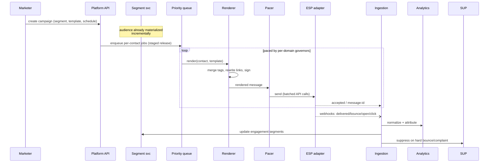

*Campaign blast journey: the platform stages per-contact jobs into a priority queue, renders and signs each message, paces dispatch through per-receiving-domain governors, then normalizes ESP webhooks into analytics, segment, and suppression updates.*

**Key mechanics:**

- **Audience resolution** is a query-engine problem ("subscribers who viewed product X in 14d, opened last email, not purchased") — computed as materialized segments refreshed continuously, not ad-hoc scans at send time.
- **Rendering** personalizes per recipient (merge tags, conditional blocks); template compilation happens once, variable substitution at render workers.
- **Dispatch** respects both platform throughput limits and *per-receiving-domain* politeness rates (Gmail/Microsoft throttle unknown senders aggressively).

---

### Characteristics

- **Throughput-bursty sends**: campaign blasts create million-email spikes in minutes; infrastructure queues and paces rather than accepting synchronously — the API returns "queued" immediately.
- **Reputation-sensitive operations**: sender IP/domain health is shared capital across customers (shared pools) or isolated (dedicated IPs for enterprise) — multi-tenancy design directly trades deliverability risk.
- **Stateful workflows at massive contact scale**: billions of in-flight flow positions demand efficient timer storage and at-least-once-with-idempotency step execution.
- **Event-driven everything**: ESP webhooks, site tracking pixels, purchase events continuously reshape audiences and flows.
- **Compliance-constrained**: consent state gates every send mechanically; audit trails required.
- **Analytics-attributed value**: platforms sell on attributed revenue — deterministic (last-click) and modeled attribution pipelines are product features.

---

### Pros

- Clean bounded contexts (segments / render / dispatch / tracking) compose well.
- ESP-adapter abstraction prevents vendor lock-in at the delivery layer.
- Event spine enables rich attribution and ML features organically.
- Idempotent dispatch and staged queues make large campaigns resumable.
- Per-domain pacing governors localize blast-radius from receiver throttling.
- Webhook-normalization layer keeps cross-provider logic coherent.

---

### Cons

- Deliverability is partially outside your control (receiver policies shift constantly) — operational anxiety inherent.
- Multi-tenant reputation sharing creates cross-customer blast radii without careful isolation.
- Tracking accuracy degrading industry-wide (MPP, cookie-less) undermines attribution claims products depend on.
- Compliance surface is large and jurisdiction-dependent.
- Exactly-once sending is structurally hard; you settle for exactly-once-enough with reconciliation.
- Template evolution across years of customer templates is a non-trivial backward-compatibility burden.

---

### Use Cases

- **E-commerce abandoned-cart recovery** — ~70% carts abandoned; recovery impossible manually at scale. Browse-abandon + cart-abandon flows render dynamic product blocks from event payloads, gate incentives by margin rules, and exit-on-purchase conditions that check order events. Trade-off: aggressiveness vs. annoyance tuned via frequency caps per contact.

- **SaaS lifecycle nurture** — trial users need behavior-triggered education converting to paid. Feature-adoption events drive branching sequences (unused-key-feature nudges), and engagement scoring gates sales-handoff notifications. Trade-off: long-horizon flows (months) stress timer durability and must be tested explicitly.

- **Media/newsletter monetization** — daily editions to tens-of-millions of subscribers with per-user content selection. Send-time-optimization ML picks individual dispatch hours, content blocks are ranked per profile, and engagement-decay sunset policies prune inactive addresses to protect reputation. Trade-off: spreading sends reduces burst costs but delays freshness-sensitive content.

- **Post-purchase / re-engagement flows** — transactional-looking receipts and win-back sequences that must never share sending capacity with cold-acquisition campaigns, otherwise trust-critical delivery degrades.

---

### Components

- **Campaign/Flow designer** — *Purpose*: marketer-facing creation tools. *Responsibilities*: visual editors, template libraries, preview/test-sends, versioning, approval workflows. *Real-world example*: Klaviyo Builder.
- **Segmentation engine** — *Purpose*: audience computation. *Responsibilities*: translate segment definitions into queries over profile + event store; materialize results incrementally (event-driven membership updates); estimate counts pre-send. *Example*: Klaviyo-style "predicted LTR high AND engaged" segments backed by ML scores.
- **Rendering farm** — *Responsibilities*: merge-tag substitution, dynamic block evaluation, link rewriting (tracking), unsubscribe header injection, plain-text alternates, DKIM-signing handoff.
- **Queue & scheduler** — *Purpose*: buffer and pace dispatch. *Responsibilities*: priority lanes (transactional > flow > campaign), per-domain rate governors, retry-with-backoff on transient ESP errors, quiet-hour/timezone-aware release windows.
- **ESP integration layer** — *Responsibilities*: SendGrid/SES/Postmark adapters, webhook normalization (their event schemas differ), credential vaulting per tenant.
- **Event ingestion & hygiene** — *Responsibilities*: consume delivered/bounced/complained/unsubscribed events, update contact states, enforce suppression instantly, feed reputation dashboards.
- **Tracking domain services** — *Responsibilities*: click redirects (307 preserving SEO), open pixels, per-tenant custom tracking domains (a deliverability best practice).
- **Reputation service** — *Purpose*: protect sender standing. *Responsibilities*: IP warmup orchestration, ISP feedback-loop ingestion, complaint-rate monitoring, automated throttling.
- **Suppression service** — *Responsibilities*: global + per-tenant suppression lists, checked at dispatch, one-click unsubscribe honored within SLA.
- **Analytics/attribution** — *Responsibilities*: open/click/bounce/conversion funnels, A/B test statistics, modeled attribution marts refreshed offline.

The diagram below shows how the segmentation engine feeds a materialized segment store while site/ESP events continuously update membership, and how the orchestrator drives render → queue → schedule → ISP delivery.

```mermaid
flowchart TB
    MK[Marketer] --> DES[Campaign/flow designer]
    SEG[(Segment store)] <-- materializes -- SEGE[Segmentation engine]
    EVS[[Site/ESP events]] --> SEGE
    DES --> ORCH[Flow orchestrator]
    ORCH --> REN[Render farm]
    REN --> Q{{Priority queue}}
    Q --> SCHED[Pacing/scheduler]
    SCHED --> ESP[ESP adapters]
    ESP --> RCPT[Receiving mail servers]
    RCPT -.events.-> ING[Event ingestion]
    ING --> SUP[(Suppression list)]
    ING --> ANA[[Analytics/attribution]]
    TRK[Click/open trackers] -.feeds.- ING
```

*Hybrid workflow + delivery architecture: segments are materialized ahead of send, flows drive render → queue → pacer → ESP, and receiver events flow back through ingestion into suppression, analytics, and segment updates.*

---

### Architectural Patterns

- **Materialized segments with incremental updates** — *Problem*: re-evaluating complex audience queries per send over billions of events is intractable. *How*: segments stored as membership sets; incoming events incrementally add/remove members matching definitions. *When*: any audience-targeting system. *Pros*: instant send-ready audiences, cheap count estimates. *Cons*: definitional-drift bugs need periodic full recomputes.

- **Distributed timer / wake-service** — *What*: flow waits stored as `(wakeAt)` sorted entries; sharded tickers poll due batches; step execution leased to workers. The same machinery as job schedulers applied to contacts. Exactly-once effects via idempotent step keys `(contactId, nodeId, entryId)`.

- **Per-domain pacing governors** — *What*: token buckets keyed by receiving domain (gmail.com, outlook.com…) enforcing learned-safe rates; hot domains throttle while the long-tail proceeds. *Why*: a single abusive burst to Gmail can tank platform-wide reputation.

- **Transactional-vs-marketing separation** — Order confirmations never share queues/IPs with campaigns — transactional deliverability is protected absolutely (users expect receipts; their absence destroys trust).

- **Webhook-normalization anti-corruption layer** — Each ESP's callback schema is mapped once to an internal `EmailEvent` taxonomy, keeping downstream logic clean across providers.

- **Warmup-as-code** — New dedicated IPs follow scheduled volume ramps enforced automatically, with gate checks (bounce/complaint thresholds gating each ramp stage).

- **Intent-then-send dispatch** — The dispatch record of intent `(contactId, campaignId)` is inserted before the ESP call; the response reconciles the outcome. This makes sends structurally idempotent and bounds the ambiguity window after a crash.

---

### Benefits

- **Revenue automation at scale**: abandoned-cart flows alone recover a measurable percentage of otherwise-lost sales; platforms monetize directly via attributed revenue.
- **Marketer self-service**: segmentation + flow builders eliminate engineering tickets for routine lifecycle marketing.
- **Deliverability economics compound**: better inbox placement → better engagement → better placement — a virtuous cycle the architecture deliberately enables.
- **Cross-channel extensibility**: the same segmentation/orchestration core later serves SMS/push — Klaviyo's actual evolution path.
- **Resilient dispatch**: staged queues + per-domain governors + circuit breakers make blasts resumable and isolated from single-ISP meltdowns.
- **Dataflywheel**: every dispatched email seeds engagement data that improves segmentation, pacing, and attribution in the next cycle.

---

### Challenges

- **Technical**: billion-row segment stores; timer storms when campaigns release simultaneously; webhook bursts post-blast (millions of events in minutes).
- **Scalability**: render-farm sizing for peak blasts; event-ingestion partition planning; segment-materialization lag under heavy site-event floods.
- **Performance**: sub-second API responses for flow triggers embedded in checkout paths; dashboard query latency over huge event volumes (needs pre-aggregation tiers).
- **Reliability**: exactly-once send semantics (duplicate emails destroy trust fast); ESP outage failovers; suppression-store availability (must stay checkable even during incidents).
- **Maintainability**: ESP API churn; template-language backward compatibility across years of customer templates.
- **Operational**: reputation-monitoring war rooms; IP warmup calendars; abuse handling (customers importing scraped lists).
- **Security/compliance**: GDPR erasure propagation through backups/analytics; consent-record integrity; phishing-content scanning protecting shared infrastructure.

---

### Best Practices

- **Separate transactional and marketing streams physically** (credentials, IPs, queues) — non-negotiable.
- **Enforce suppression checks at dispatch-time**, not just list-build time — unsubscribes arriving mid-campaign must be honored.
- **Rate-limit per receiving domain**, learned from engagement feedback loops, with headroom alarms.
- **Default new tenants onto shared warmed pools** with strict intake validation; dedicated IPs only with demonstrated volume commitment.
- **Treat open-tracking as advisory** (MPP reality); anchor metrics on clicks/conversions.
- **Make every flow step idempotent** with durable position state; test crash-resume explicitly.
- **Provide one-click List-Unsubscribe headers everywhere** (legal + receiver-preferred).
- **Audit consent provenance** end-to-end: source, timestamp, IP stored immutably per contact.
- **Precompile templates** once and cache rendered blocks for repeated sends to similar users.
- **Size render capacity for the 99th-percentile blast**, not the average day.

---

### When to Use and When Not to Use

**Build/buy a platform when**: lifecycle marketing volume justifies it (>~100K emails/month), revenue depends on automated flows, a multi-channel roadmap exists.

**Skip the platform when**: lists are tiny — ESPs' native automations suffice; needs are purely transactional — SES/Postmark direct integration is simpler.

**Build-vs-buy nuance**: most companies buy delivery (SES/SendGrid) but may build orchestration/segmentation differentiation on top; full-platform builds are reserved for the Klaviyos themselves.

**Decision inputs**: volume trajectory, marketing sophistication, engineering capacity, deliverability sensitivity of the business model.

**Avoid when** you cannot staff a deliverability/ops team (reputation incidents are on-call pages), or when your primary value is not messaging (buy rather than operate).

---

### Data Model and API

Email platforms store contacts, consent, segments, flows, campaigns, templates, messages, and a granular event log. Relationships matter for dispatch-time suppression and per-contact flow state.

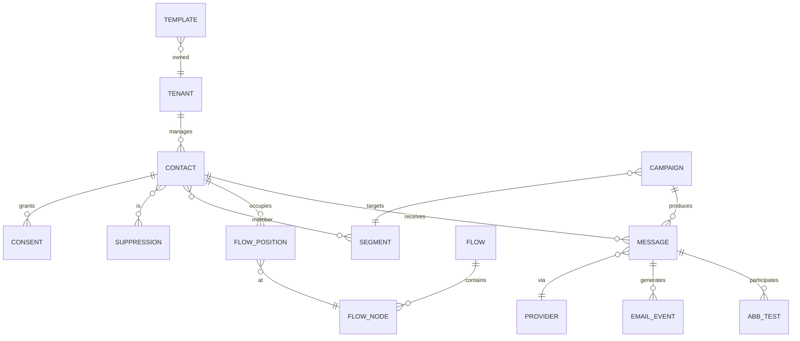

*The data model ties a contact to tenant-scoped consent, suppression, and segment membership, while flows hold per-contact positions tied to nodes, and every dispatched message spawns an event log joined to A/B test assignments.*

**Entity notes:**

- Contact keys are by **hashed email** (PII minimized; raw email encrypted separately).
- Composite-PK `EMAIL_EVENT` `(messageId, type, occurredAt)` enables dedupe.
- `wakeAt` is indexed per timer shard, powering fast ticker range scans.
- Segment definitions are versioned JSONB with schema validation.
- Suppression is implemented as contact-state plus a global list consulted at dispatch.

**Partitioning:** events by month; positions by contact-hash; retention per compliance (consent records retained longest).

#### API Contract

The platform exposes REST APIs for campaign/flow management plus internal APIs for delivery infrastructure.

| Method | Endpoint | Purpose |
|---|---|---|
| POST | `/api/v1/campaigns` | Create a campaign |
| GET | `/api/v1/campaigns/{id}` | Get campaign details |
| PATCH | `/api/v1/campaigns/{id}` | Update campaign |
| POST | `/api/v1/campaigns/{id}/send` | Trigger send to audience |
| POST | `/api/v1/flows` | Create automation flow |
| GET | `/api/v1/flows/{id}` | Get flow details |
| POST | `/api/v1/audiences/{id}/evaluate` | Evaluate segment recipients |
| POST | `/api/v1/emails` | Queue a single email |
| POST | `/api/v1/bulk-emails` | Queue bulk emails |
| GET | `/api/v1/bulk-emails/{job_id}` | Get bulk send status |
| POST | `/api/v1/webhooks/bounce` | Bounce webhook endpoint |
| POST | `/api/v1/webhooks/feedback` | Spam-complaint webhook |

**POST `/api/v1/campaigns` — Request body:**

```json
{
  "name": "Welcome Series",
  "type": "triggered",
  "trigger": "user.signup",
  "steps": [
    {
      "delay_seconds": 0,
      "template_id": "tmpl_welcome",
      "conditions": { "segment_id": "new_users" }
    },
    {
      "delay_seconds": 86400,
      "template_id": "tmpl_day1",
      "conditions": { "engaged": true }
    }
  ],
  "from_email": "hello@company.com",
  "from_name": "Company"
}
```

*The campaign creation payload defines a trigger, an ordered list of steps with delays and conditions, and sender identity — this becomes a versioned flow definition evaluated per contact.*

**POST `/api/v1/campaigns` — Response:**

```json
HTTP/1.1 201 Created
{
  "campaign_id": "camp_abc123",
  "name": "Welcome Series",
  "status": "draft",
  "created_at": "2024-06-14T10:00:00Z",
  "estimated_recipients": 0
}
```

**GET `/api/v1/campaigns/{id}/analytics` — Response:**

```json
{
  "campaign_id": "camp_abc123",
  "sent": 10000,
  "delivered": 9800,
  "opened": 4900,
  "clicked": 980,
  "bounced": 120,
  "complained": 15,
  "unsubscribed": 30,
  "open_rate": 50.0,
  "click_rate": 10.0,
  "bounce_rate": 1.2
}
```

**Webhook authentication:**

- Webhooks are signed with HMAC-SHA256 using a shared secret. Header: `X-Email-Signature: sha256=<hmac>`.
- Must be acknowledged with HTTP 200 within 5 seconds; failed deliveries retried with exponential backoff.

**Status codes:**

| Code | Meaning |
|---|---|
| 200 | Success |
| 201 | Resource created |
| 202 | Request accepted (async processing) |
| 400 | Invalid request |
| 401 | Authentication required |
| 403 | Insufficient permissions |
| 404 | Resource not found |
| 429 | Rate limited |
| 503 | Service unavailable |

**Idempotency:** `POST /api/v1/emails` accepts an `Idempotency-Key` header. Duplicate keys within 24 hours return the original response.

**Versioning:** versioned via URL prefix (`/api/v1/`). Webhook payloads include a `version` field.

---

### Domain-Specific Deep Dive

This section dives into the eight domain-specific pillars that define an email automation platform.

#### Email Template Engine

Rendering personalizes an email per recipient: merge-tag substitution, conditional blocks, loops over product lists, localization, and plain-text alternates. The compilation happens once (parse template → AST); variable substitution is per-row.

Pipeline:

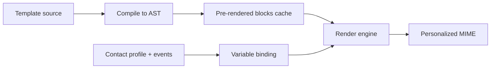

*Template compilation is separated from per-contact variable binding: the AST and pre-rendered blocks are cached, and only merge-tag substitution runs per recipient, keeping render farms CPU-bound rather than parse-bound.*

**Performance techniques:** compile templates to a reusable AST once; cache static sections and dynamic blocks keyed by `(templateVersion, locale)`; cap iteration depth; escape user-supplied variables to prevent injection in HTML/URL contexts.

A Spring `@Service` wrapping a simple merge-tag renderer:

```java
@Service
public class TemplateRenderService {

    private final Handlebars handlebars;

    public TemplateRenderService() {
        // Compile-time registration of helpers (if, unless, each, with).
        this.handlebars = new Handlebars();
        handlebars.registerHelper("eq", (ctx, options) -> ...);
    }

    @Cacheable(value = "rendered", key = "{#templating.templateId, #contact.emailHash}")
    public String render(String templateId, Contact contact, Map<String, Object> context) {
        Template template = handlebars.compile(templateId);
        Map<String, Object> model = new HashMap<>(context);
        model.put("contact", contact);
        return template.apply(model);
    }
}
```

*The `TemplateRenderService` bean compiles Handlebars templates once and caches per-contact renders keyed by template id and contact hash, isolating parse cost from dispatch cost.*

#### Scheduling and Delivery Queue

Campaigns and flows produce per-contact jobs that enter a **priority queue** partitioned by tenant × campaign. The scheduler releases them in staged batches through per-receiving-domain governors.

- Priority lanes: **transactional > flow > campaign**.
- Staged release: a blast is throttled to N concurrent recipients released per second, not all at once.
- Timezone-aware release windows: only dispatch within local business hours per contact.

The `DomainGovernor` enforces learned-safe rates per root receiving domain:

```java
@Component
public class DomainGovernor {

    private final Map<String, RateLimiter> limiters = new ConcurrentHashMap<>();

    public boolean tryAcquire(String receivingDomain) {
        return limiterFor(receivingDomain).tryAcquire();
    }

    private RateLimiter limiterFor(String domain) {
        return limiters.computeIfAbsent(rootDomain(domain),
                d -> RateLimiter.builder()
                        .limitForPeriod(learnedSafeRate(d))
                        .refreshPeriod(Duration.ofSeconds(1))
                        .build());
    }

    private RateLimiterConfig.ScheduleFunction learnedSafeRate(String domain) {
        // Loaded from a config service backed by engagement feedback.
        return configService.safeRateFor(domain);
    }
}
```

*The `DomainGovernor` component maintains a Resiliense4j `RateLimiter` per root receiving domain, with limits loaded from a config service that adapts to engagement feedback — preventing any single burst from tanking platform-wide reputation.*

#### Rate Limiting per Provider

Rate limiting happens at two layers: (1) per-receiving-domain politeness governors (above), and (2) per-ESP API quotas on the *outbound* side (SendGrid/SES/Postmark throttle by requests/sec and messages/day).

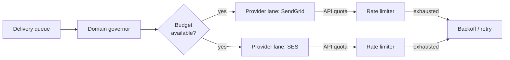

*Outbound rate limiting mirrors inbound domain pacing: per-receiving-domain governors gate total volume, then per-provider API quotas (requests/sec, messages/day) are enforced by Resiliense4j rate limiters before calls leave the platform.*

**Strategy:** token buckets per provider; on 429/retry-after responses, back off exponentially and redistribute load to other providers in the same priority class. Track per-provider success rates to prefer healthy lanes.

#### Delivery Tracking and Webhooks

Delivery tracking is the feedback spine: opens (1×1 pixel, advisory post-Apple-MPP), clicks (307 redirect preserving SEO), and bounces/complaints/unsubscribes (ESP webhooks).

- **Webhook normalization**: each ESP's callback is mapped once to the internal `EmailEvent` taxonomy (DELIVERED, BOUNCED, OPENED, CLICKED, SPAM_COMPLAINT, UNSUBSCRIBED).
- **Dedupe**: `(messageId, eventType, timestamp window)` keys suppress duplicate callbacks from retried deliveries.
- **Suppression**: hard bounces and complaints insert into the suppression service immediately, consulted at every dispatch.

**Flow:**

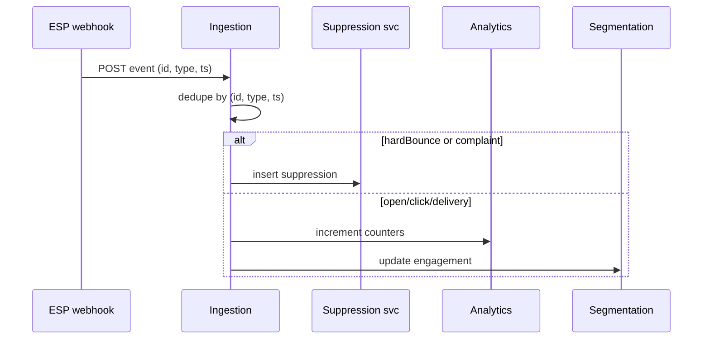

*Webhook ingestion dedupes by `(messageId, eventType, timestamp window)` and routes hard bounces/complaints straight into suppression while feeding opens/clicks to analytics and engagement segments.*

#### A/B Testing

A/B tests split a parent campaign across variant templates (subject lines, sender names, content blocks) with statistically valid winner selection.

- **Assignment**: a contact is deterministically assigned to a variant by hashing `(campaignId, contactId) % variants`, ensuring a contact sees only one variant.
- **Metrics**: primary metric (e.g., click-to-open rate) measured per variant with confidence intervals.
- **Winner selection**: automatically promote the variant exceeding a significance threshold (e.g., 95% confidence, >=5% lift) to the remaining traffic mid-campaign.

```java
@Service
public class AbTestAssignmentService {

    public int variantIndex(String campaignId, String contactId, int variants) {
        // Deterministic, stable across retries and replays.
        return Math.floorMod(MurmurHash3.hash32c(campaignId + "|" + contactId), variants);
    }
}
```

*A deterministic hash of campaign + contact selects the A/B variant index, guaranteeing a given contact never sees multiple variants even across retries and webhook replays.*

#### Subscriber Management

Subscribers are contacts with explicit consent state. The platform maintains:

- **Double opt-in flows**: email a confirmation link tied to a single-use, expiring token; state transitions PENDING → CONFIRMED.
- **List hygiene**: hard bounces and complaints move a contact to `UNSUBSCRIBED`/`BOUNCED` state; suppression is checked at dispatch, not just at list build.
- **Merge semantics**: re-subscribing a previously unsubscribed contact re-records consent with a fresh timestamp and source.

**Lifecycle states:** `PENDING`, `SUBSCRIBED`, `UNSUBSCRIBED`, `BOUNCED`, `SPAM_COMPLAINT`, `INACTIVE` (engagement-decay sunset).

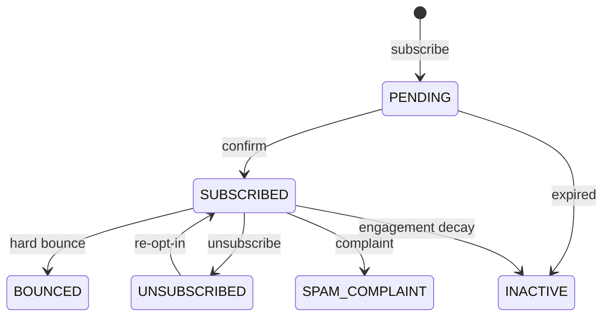

*Subscriber state is an explicit lifecycle: a contact moves PENDING → SUBSCRIBED on confirmation, into UNSUBSCRIBED/BOUNCED/SPAM_COMPLAINT on negative events, into INACTIVE on engagement decay, and back to SUBSCRIBED only via a fresh re-opt-in.*

#### Unsubscribe Handling

Unsubscribes must be honored **instantly**, bypassing all marketing logic. The platform guarantees this via:

- **Suppression check at dispatch-time** for every message, not just at list build (an unsubscribe arriving mid-blast is respected immediately).
- **`List-Unsubscribe` header** (RFC 8058) on every outbound message: `<mailto:unsubscribe@…>, <https://…/unsubscribe>`.
- **One-click unsubscribe**: a tokenized URL that flips contact state to `UNSUBSCRIBED` and returns HTTP 302 to a confirmation page, without requiring login.
- **Global suppression list**: consulted even during infrastructure incidents (must be highly available).

**SLA:** unsubscribe honored within seconds across the entire dispatch pipeline.

#### Anti-Spam Compliance (SPF/DKIM/DMARC)

Domain authentication is non-negotiable; misconfiguration lands everything in spam instantly.

- **SPF**: DNS TXT record listing authorized sending IPs/`include:` mechanisms. Receivers check the connecting IP is authorized.
- **DKIM**: the platform signs selected headers + body with an RSA private key; the DNS `TXT` record at `selector._domainkey.example.com` publishes the public key. Body canonicalization and `relax` headerCanonicalization must match.
- **DMARC**: policy record tells receivers what to do with messages failing SPF *and* DKIM (`p=quarantine|reject|none`) and where to send forensic/`rua` aggregate reports.

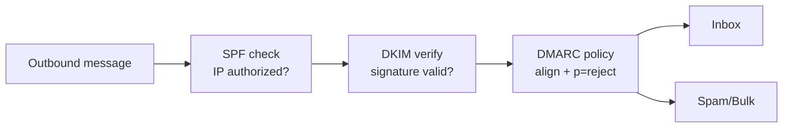

*Receiving servers apply SPF (IP authorization), then DKIM (cryptographic signature), then DMARC (alignment policy): only messages passing SPF-or-DKIM *and* aligned with the From domain earn the inbox.*

**Operational rules:**

- Rotate DKIM keys every 6–12 months; publish the new `selector2` record and switch signing before removing `selector1`.
- Monitor DMARC aggregate reports (`rua`) for authentication-failure spikes.
- For shared domains, ensure per-tenant signing keys do not let one tenant forge another's mail (domain-scoped key registry).

---

### Replication Strategies

Email platforms replicate several kinds of state, each with a different consistency need.

#### Leader-based (CP): Contact / flow position store

Contact profiles, consent records, and per-contact flow positions are written through a single leader per region with synchronous replication. Reads for dispatch-time suppression and flow execution need strong consistency; a stale "still subscribed" can cause a compliance disaster.

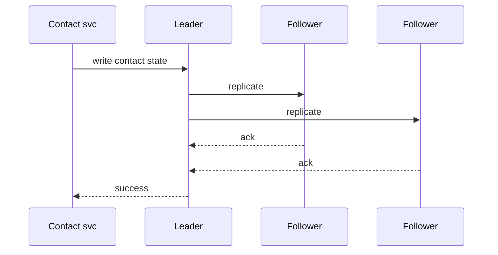

*Contact and flow-position state uses leader-based synchronous replication so suppression reads during dispatch never observe stale subscription state — a stale "subscribed" read could violate unsubscribe law.*

#### Leaderless (AP): Segment membership sets

Segment membership is an append-mostly set of contact ids updated by event-driven deltas. Eventual consistency is acceptable (a newly qualified contact may miss one blast but is picked up next cycle). Quorum reads/writes (Dynamo-style, `W + R > nodeCount`) keep membership converged across regions.

#### Multi-leader (AP): Engagement analytics

Engagement counters (opens, clicks, deliveries) are written to multiple regional leaders and merged periodically; short-term staleness in dashboards is acceptable, and availability during cross-region partitions is more valuable than perfect monotonicity.

---

### Failure Detection and Membership

The delivery infrastructure has many moving parts that need membership and liveness:

- **Renderer pods and MTA senders** register via a gossip membership ring; missed heartbeats mark a node suspect, and leases (ZooKeeper-style) gate work assignment so a crashed renderer doesn't strand in-flight renders.
- **Ingestion consumers** are assigned partitions by a coordinator; if a consumer drops out, its partitions are reassigned within seconds.
- **ESP outage** is detected via circuit breakers around provider API calls: consecutive 5xx/429s trip the breaker, redirecting traffic to healthy lanes and resuming automatically when health probes succeed.

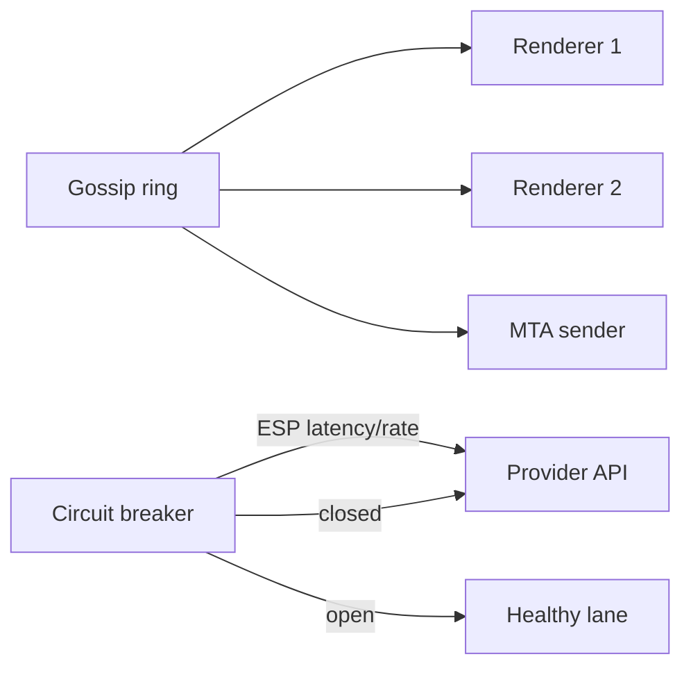

*A gossip ring tracks renderer and MTA liveness for lease-gated work, while circuit breakers around each ESP API detect provider outages and reroute traffic to healthy lanes — keeping ingestion and dispatch resilient to both node and provider failure.*

---

### High Availability and Scalability

Availability comes from stateless, horizontally-scaled components plus replicated state stores.

#### Replication for availability

- Render farm pods and MTA senders are **stateless** behind a load balancer; autoscaling adds pods on queue depth.
- The contact/position store is multi-AZ with leader-follower failover; the follower is promoted within seconds via Raft.
- The segment store (e.g., Cassandra) is leaderless with `RF=3` and `QUORUM` reads for dispatch decisions.

#### Leader election and failover

When the campaign-scheduling leader fails, the cluster runs a new election; clients are redirected to the new leader. Unsent batches held in the priority queue are simply retried by new workers — no work is lost.

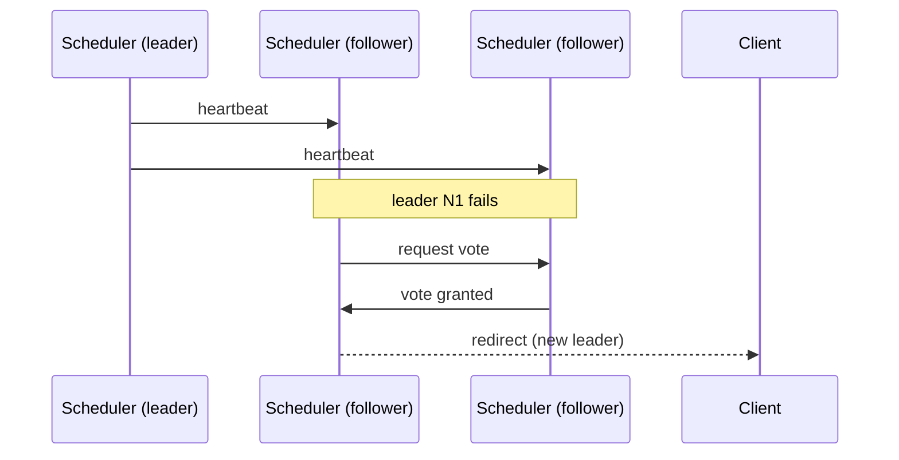

*Scheduler failover is leader-election driven: when the leader's heartbeats stop, followers vote, a new leader is chosen, and clients are redirected — queued work survives because it's durably staged, not in-memory on the leader.*

#### Scaling strategies

- **Horizontal scaling** (scale-out): add renderer pods and MTA senders; rebalance timer shards by contact hash.
- **Queue sharding**: delivery queue partitioned by tenant × campaign; render autoscaling keyed on shard depth.
- **Timer scalability**: 500M contacts × ~1.3 active flow positions ≈ 650M pending wakes; Redis ZSET-style sharding by contact hash with ticker pods claiming ranges keeps scan costs linear.

#### Auto-rebalancing

When pods are added/removed, timer shards and queue partitions rebalance across the new topology; hot shards are split and migrated to underutilized nodes.

---

### Performance and Optimization

Performance is measured by dispatch throughput (emails/sec), render latency, and API request latency for marketer-facing surfaces.

#### Latency optimization

- **Render caching**: pre-render static/conditional blocks; cache per `(templateVersion, locale)`.
- **Pipeline sends**: batch envelope commands (PIPELINING, STARTTLS session reuse) to reduce per-message overhead to ESPs.
- **Template precompilation**: compile Handlebars/MJML ASTs once per version, not per contact.
- **Connection pooling**: reuse HTTP/API connections to ESPs and SMTP sessions to MTAs.

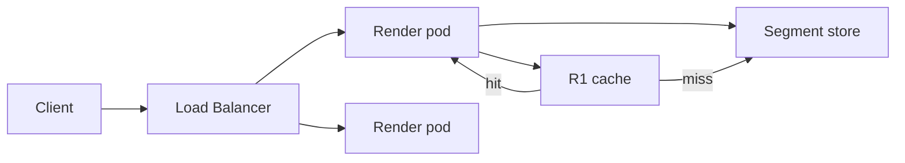

*Two-level caching on render pods: an in-memory R1 cache serves hot template blocks and contact lookups; misses fall through to the segment store — reducing per-contact render latency and DB fan-out.*

#### Throughput optimization

- **Batch API sends**: SES SendBulkTemplatedEmail / SendGrid batch endpoints send up to N recipients per API call.
- **Per-domain governors** let the long-tail proceed while hot domains throttle.
- **Backpressure**: when the render backlog grows, the scheduler slows intake upstream rather than queueing unbounded latency.
- **Partition-level parallelism**: queue partitions and timer shards are consumed concurrently.

#### Write path optimization

- Rendered messages are staged into the priority queue in batches (not per-contact RPCs).
- Intent rows for dispatch are inserted in a single transaction per batch to keep dedupe atomic.

---

### CAP Theorem and Consistency Trade-offs

The platform is **polyglot across CAP choices by subsystem** — it deliberately picks C or A where each matters most.

| Subsystem | CAP choice | Why |
|---|---|---|
| Contact / consent / flow position | **CP** | A stale "subscribed" read can cause a compliance-violating send. |
| Dispatch intent / dedupe | **CP (within region)** | Duplicate sends destroy trust; strong per-campaign dedupe is required. |
| Segment membership | **AP** | Eventual convergence is acceptable; a missed contact is caught next cycle. |
| Engagement analytics | **AP** | Availability and cross-region write throughput matter more than monotonic counts. |
| Webhook ingestion dedupe | **AP** | Dedupe via idempotent keys; late/duplicate events are absorbed, not rejected. |

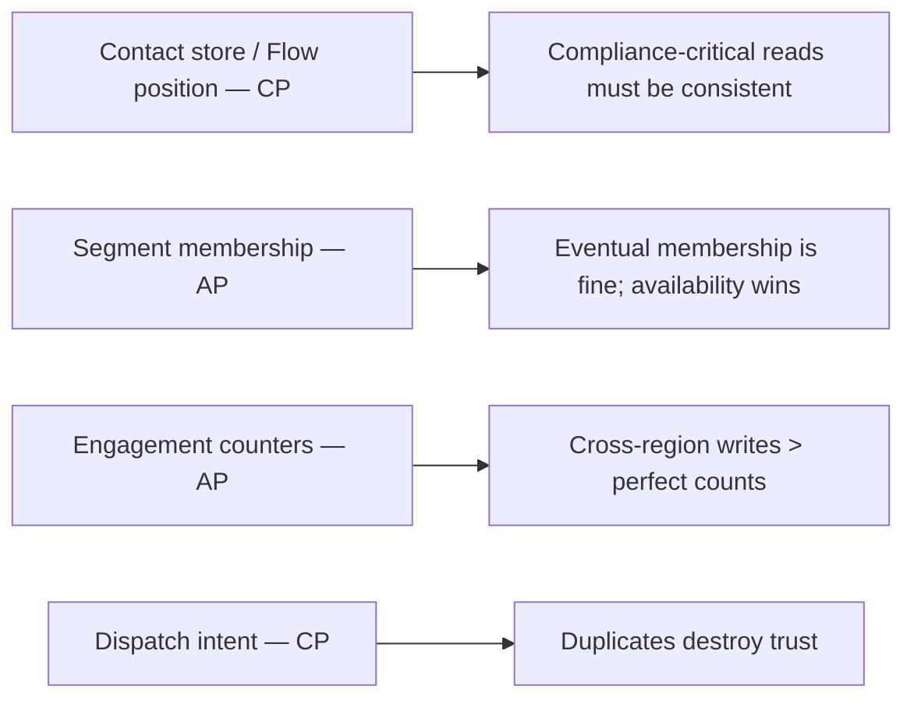

*Each subsystem is placed on the CAP spectrum deliberately: contact/position and dispatch-intent stores are CP to prevent compliance violations and duplicate sends, while segment membership and engagement analytics are AP to maximize availability and cross-region write throughput.*

**Interview takeaway:** a well-designed email platform is *not* uniformly AP or CP — it is a federation of stores, each chosen for its correctness-vs-availability requirements.

---

### Encryption and Key Management

Email platforms protect several classes of secret: recipient PII (raw emails), DKIM signing keys, ESP credentials, webhook signing secrets, and tenant API tokens.

#### Encryption at rest

- **Recipient PII**: raw emails are encrypted application-side (AES-GCM) and stored only as a hash for dedupe/lookup. The decryption key lives in a KMS/HSM and is never on the render path.
- **DKIM private keys**: stored encrypted in a secrets manager, decrypted only inside the signing service; rotated every 6–12 months with staged cutover.

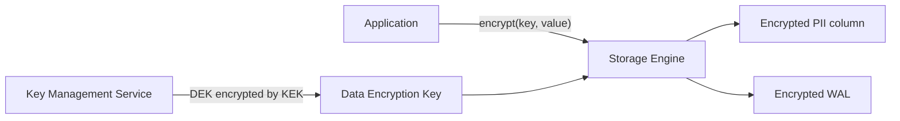

*At-rest encryption keeps recipient PII and DKIM keys encrypted with a data key whose KEK is managed by a KMS/HSM, so a stolen disk exposes ciphertext only and the signing key never leaves the KMS boundary.*

**Encryption in transit:** all client-to-platform and inter-pod traffic uses TLS; ESP API calls and SMTP are TLS-wrapped (STARTTLS where supported).

**Key management:** a KEK/DEK hierarchy; KEKs rotated 6–12 months; DEKs rotated per-session or per-message more frequently; multi-region KMS replication keeps keys available in each region.

**Java example:** an AES-GCM encryption service as a Spring bean.

```java
@Service
public class DataEncryptionService {

    private static final int GCM_IV_LENGTH = 12;
    private static final int GCM_TAG_LENGTH = 128;
    private final SecretKey dataKey;
    private final SecureRandom random = new SecureRandom();

    public DataEncryptionService(@Value("${app.encryption.data-key-base64}") String keyB64)
            throws GeneralSecurityException {
        byte[] decoded = Base64.getDecoder().decode(keyB64);
        this.dataKey = new SecretKeySpec(decoded, "AES");
    }

    public String encrypt(String plaintext) throws GeneralSecurityException {
        byte[] iv = new byte[GCM_IV_LENGTH];
        random.nextBytes(iv);
        Cipher cipher = Cipher.getInstance("AES/GCM/NoPadding");
        cipher.init(Cipher.ENCRYPT_MODE, dataKey, new GCMParameterSpec(GCM_TAG_LENGTH, iv));
        byte[] encrypted = cipher.doFinal(plaintext.getBytes(StandardCharsets.UTF_8));
        byte[] output = new byte[iv.length + encrypted.length];
        System.arraycopy(iv, 0, output, 0, iv.length);
        System.arraycopy(encrypted, 0, output, iv.length, encrypted.length);
        return Base64.getEncoder().encodeToString(output);
    }

    public String decrypt(String encoded) throws GeneralSecurityException {
        byte[] input = Base64.getDecoder().decode(encoded);
        byte[] iv = new byte[GCM_IV_LENGTH];
        byte[] ciphertext = new byte[input.length - GCM_IV_LENGTH];
        System.arraycopy(input, 0, iv, 0, GCM_IV_LENGTH);
        System.arraycopy(input, GCM_IV_LENGTH, ciphertext, 0, ciphertext.length);
        Cipher cipher = Cipher.getInstance("AES/GCM/NoPadding");
        cipher.init(Cipher.DECRYPT_MODE, dataKey, new GCMParameterSpec(GCM_TAG_LENGTH, iv));
        byte[] decrypted = cipher.doFinal(ciphertext);
        return new String(decrypted, StandardCharsets.UTF_8);
    }
}
```

*The `DataEncryptionService` bean wraps AES-GCM with a per-message random IV and a base64 wire format; in production the data key is fetched from KMS/HSM and rotated automatically — the same primitive encrypts recipient emails and tenant DKIM keys.*

---

### Authentication and Authorization

The platform authenticates marketers (API), internal services, ESP callbacks (webhooks), and receiving MTAs.

#### Authentication methods

- **OAuth2 / JWTs** for marketer-facing API clients; short-lived access tokens with rotation.
- **HMAC-signed webhooks**: `X-Email-Signature: sha256=<hmac>` validated against a per-tenant shared secret.
- **Service-to-service mTLS** between internal pods and the ESP adapter layer.
- **API-key auth** for inbound tracking pixel/redirect domains (stateless, cached validation).

#### Authorization models

- **RBAC** for marketer roles (`admin`, `editor`, `viewer`) scoped per tenant.
- **Key-prefix / tenant scoping**: a tenant's credentials can only read/write resources under their tenant id.
- **ACL-style action checks** on campaign flow mutation (e.g., only `editor`+ can send).

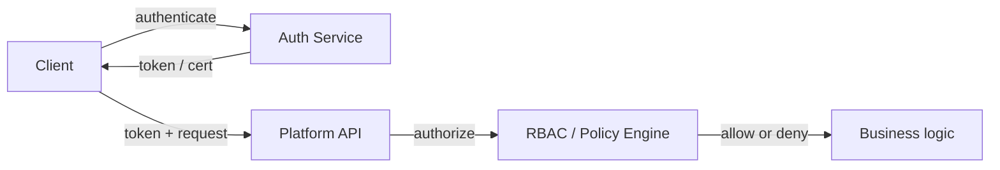

*Authentication verifies marketer/service identity; authorization checks tenant-scoped RBAC and action ACLs before any business logic touches contacts, campaigns, or delivery.*

**Java example:** a tenant-scoped RBAC authorization service as a Spring bean.

```java
@Service
public class PlatformAuthorizationService {

    private final Map<String, Set<String>> rolePermissions = new ConcurrentHashMap<>();
    private final Map<String, List<String>> userRoles = new ConcurrentHashMap<>();
    private final boolean enabled;

    public PlatformAuthorizationService(@Value("${app.rbac.enabled:true}") boolean enabled) {
        this.enabled = enabled;
        // Bootstrap default roles; in production these come from a database or config service.
        rolePermissions.put("admin", Set.of("read", "write", "delete", "send", "manage_users"));
        rolePermissions.put("editor", Set.of("read", "write", "send"));
        rolePermissions.put("viewer", Set.of("read"));
    }

    public boolean isAuthorized(String user, String role, String tenantId, String action) {
        if (!enabled) {
            return true;
        }
        List<String> roles = userRoles.getOrDefault(user, List.of(role));
        for (String r : roles) {
            Set<String> permissions = rolePermissions.getOrDefault(r, Set.of());
            if (permissions.contains(action) && matchesTenant(user, tenantId)) {
                return true;
            }
        }
        return false;
    }

    private boolean matchesTenant(String user, String tenantId) {
        // In production this checks the caller's tenant claim against the resource owner.
        return true;
    }
}
```

*The `PlatformAuthorizationService` bean enforces tenant-scoped RBAC: each user is assigned roles, each role grants a set of actions (`read`, `write`, `send`, `manage_users`), and the service confirms the caller belongs to the target tenant before allowing the action.*

---

### Security Threats and Mitigations

Email platforms are high-value targets because compromised sending equals reputation destruction and potential phishing delivery.

#### Threat: Sender spoofing / unsigned mail

- **Risk:** an attacker sends forged mail appearing to come from a legitimate tenant.
- **Mitigation:** enforce DKIM signing for every outbound message; SPF-aligned `HELO`/`MAIL FROM`; DMARC policy `reject` on tenant domains.

#### Threat: Unsubscription bypass (subscription bombing)

- **Risk:** a bad actor floods sign-up forms to add victims to lists, triggering outbound send storms to those inboxes (reputation risk).
- **Mitigation:** rate limit sign-ups per IP/subnet; double opt-in; require confirmed consent before any send; per-tenant intake quotas.

#### Threat: List harvesting / scraping

- **Risk:** attackers scrape public subscriber lists or guess tracking URLs to harvest emails.
- **Mitigation:** opaque unsubscribe tokens; rate-limit tracking domains; never expose raw email lists in UI or API without audit; hash emails in lookups.

#### Threat: Data interception

- **Risk:** an attacker on the network sniffs ESP credentials or recipient PII.
- **Mitigation:** TLS everywhere; mTLS between internal services; secrets in a vault (HashiCorp Vault / AWS Secrets Manager), never config files.

#### Threat: Replay / webhook forgery

- **Risk:** a forged webhook flips a contact to unsubscribed or injects fake engagement.
- **Mitigation:** HMAC-SHA256 signature validation with constant-time compare; reject on mismatch; dedupe by `(messageId, type, timestamp window)`.

#### Threat: DoS / resource exhaustion

- **Risk:** render queues or ingestion are flooded, exhausting CPU/memory/connections.
- **Mitigation:** per-tenant rate limits; backpressure at the scheduler; circuit breakers around ESP APIs; connection limits.

```mermaid
flowchart LR
    Attacker[Attacker] -->|flood requests| LB[Load Balancer]
    LB --> RL[Rate Limiter]
    RL -->|allow| Pod[Render / Ingestion pod]
    RL -->|reject| Drop[Reject / Throttle]
    Pod --> Mem[Memory]
    Pod --> Q[Queue]
    Note over Mem,Q: monitor for exhaustion
```

*Rate limiting at the load balancer and per-tenant boundaries prevents render-queue and ingestion floods from exhausting pod memory and queue depth — the first line of defense against resource-exhaustion attacks.*

#### Threat: Insider threat / over-privileged access

- **Risk:** a legitimate operator with broad access reads or modifies another tenant's data.
- **Mitigation:** least-privilege RBAC; tenant-scoped queries everywhere; audit logging of all access; separate admin and application credentials.

#### Threat: Template injection

- **Risk:** if customer templates interpolate user data without escaping, an attacker stores an XSS payload that renders into recipients' email clients.
- **Mitigation:** auto-escaping in the template engine; sandboxed helpers; CSP headers on web preview; validate template input.

**Real-life mapping:** SendGrid enforces domain authentication and DKIM; SES provides EasyDKIM and dedicated IPs with warmup; Mailchimp runs anti-abuse pipelines and engagement-based segmentation.

---

### Observability and Logging

The dispatch funnel is the primary operational surface: **queued → rendered → accepted → delivered → opened → clicked**. Per-domain reputation, flow-step conversion, and suppression lag are leading indicators.

#### Metrics

- Send funnel counts (queued, rendered, accepted, delivered, bounced, opened, clicked) per campaign and per domain.
- **Per-domain rates**: sends/sec, bounce rate, complaint rate, delivery rate — feeds governors.
- **Suppression lag**: seconds between unsubscribe and effective suppression (SLA < seconds).
- **Timer lag**: distribution of `wakeAt` vs actual execution (hotspot detection).
- **Render latency**: p50/p95/p99 of render per template.
- **ESP API quotas**: remaining quota and 429 rate per provider.

#### Logging

Structured logs capture:

- **Access logs**: who triggered which campaign and to whom.
- **Audit logs**: consent changes, suppression inserts, template edits, role changes.
- **Error logs**: render failures, ESP 5xx/429s, webhook signature mismatches.
- **Slow logs**: renders exceeding a latency threshold.

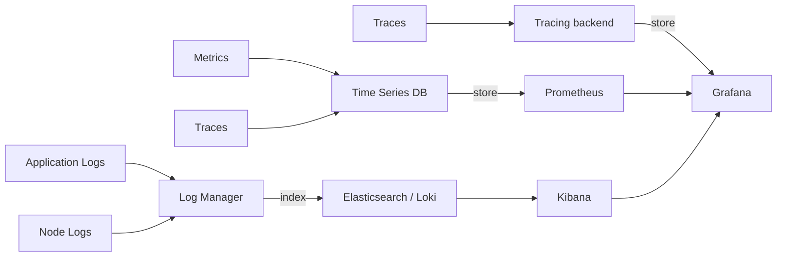

*Observability pipeline: structured application and node logs index into Loki/Elasticsearch; dispatch-funnel metrics and timers feed Prometheus; request traces flow to the tracing backend — all visualized in a single Grafana dashboard.*

#### Alerting (actionable, tuned)

- Delivery rate drops below 95% for a domain over 5 minutes.
- Complaint rate exceeds 0.1% for any tenant.
- Suppression lag exceeds 60 seconds.
- 429 rate from a provider exceeds 20% over 2 minutes (governor tuning needed).
- Render backlog depth exceeds the autoscale threshold for 3 minutes.
- Unplanned scheduler leader elections exceed 1 per hour.

**Java example:** a Micrometer-instrumented dispatch service.

```java
@Service
public class InstrumentedDispatchService {

    private final Counter queuedCounter;
    private final Counter renderedCounter;
    private final Counter acceptedCounter;
    private final Counter deliveryErrorCounter;
    private final Timer renderTimer;
    private final Timer dispatchTimer;

    public InstrumentedDispatchService(MeterRegistry meterRegistry) {
        this.queuedCounter = Counter.builder("email.dispatch")
                .tag("stage", "queued").register(meterRegistry);
        this.renderedCounter = Counter.builder("email.dispatch")
                .tag("stage", "rendered").register(meterRegistry);
        this.acceptedCounter = Counter.builder("email.dispatch")
                .tag("stage", "accepted").register(meterRegistry);
        this.deliveryErrorCounter = Counter.builder("email.dispatch.errors")
                .register(meterRegistry);
        this.renderTimer = Timer.builder("email.render.latency")
                .publishPercentileHistogram(true).register(meterRegistry);
        this.dispatchTimer = Timer.builder("email.dispatch.latency")
                .publishPercentileHistogram(true).register(meterRegistry);
    }

    public void recordRendered() {
        renderedCounter.increment();
    }

    public void recordAccepted() {
        acceptedCounter.increment();
    }

    public void recordError(String reason) {
        deliveryErrorCounter.increment(Tags.of("reason", reason));
    }
}
```

*The `InstrumentedDispatchService` bean records dispatch-funnel counters (queued/rendered/accepted) tagged by stage, plus render and dispatch latency timers with histogram publishing — feeding Prometheus alerts on funnel drop-offs and tail latency.*

---

### Real-World Implementations

- **SendGrid / Twilio SendGrid** — delivery-infrastructure specialist whose APIs most platforms build upon; its event/webhook documentation teaches normalization requirements firsthand. Offers subaccount-based reputation isolation and domain authentication workflows.
- **Mailchimp** — mass-market evolution story; the early Mandrill split validated the transactional/marketing separation doctrine. Now a full workflow + analytics stack with shared and dedicated IP pools.
- **Postmark** — transactional-first provider demonstrating the value of dedicated infrastructure and fast, reliable delivery for trust-critical messages.
- **Amazon SES** — the scale benchmark behind countless platforms; demonstrates raw-sending economics and the value of the orchestration layer above bare delivery (configuration sets, dedicated IPs, EasyDKIM, sending events via SNS).
- **Iterable** — cross-channel orchestration platform showing how a flow/DSL abstracts email, SMS, push, and in-app.
- **Braze** — customer-engagement suite with real-time segmentation and a Canvas visual flow builder; illustrates the event-spine architecture applied to lifecycle messaging.
- **Klaviyo** — e-commerce archetype; its predictive-analytics features (CLV, churn-risk segments) illustrate the ML-layer evolution on this exact architecture.

---

### Java and Spring Boot Implementation Guide

This section shows how to build practical email-automation services with Spring Boot. All beans use constructor injection; configuration is externalized via `@Value`; DTOs are `record`s validated with `@Valid`; persistence entities use `@Version` for optimistic locking; rates and test statistics use `BigDecimal`; errors are normalized by a `@ControllerAdvice`.

#### 1. Domain entity with optimistic locking

```java
@Entity
@Table(name = "campaigns")
public class Campaign {

    @Id
    @GeneratedValue
    private UUID id;

    @Version
    private long version;  // optimistic-lock token; JPA increments on each write

    private String name;
    private String tenantId;

    @Enumerated(EnumType.STRING)
    private CampaignStatus status;

    private BigDecimal scheduledRate;  // emails/sec, used by the governor

    // constructors / getters / setters
}
```

*The `Campaign` JPA entity uses `@Version` for optimistic locking (preventing lost updates during concurrent edits) and `BigDecimal` for the per-campaign dispatch rate to avoid floating-point drift in governor scheduling.*

#### 2. Repository with `@Repository`

```java
@Repository
public interface CampaignRepository extends JpaRepository<Campaign, UUID> {

    List<Campaign> findByTenantIdAndStatus(String tenantId, CampaignStatus status);

    @Modifying
    @Transactional
    @Query("UPDATE Campaign c SET c.status = :status WHERE c.id = :id")
    int updateStatus(@Param("id") UUID id, @Param("status") CampaignStatus status);
}
```

*The `CampaignRepository` bean abstracts JPA access behind typed queries; the status-update uses an explicit `@Modifying @Transactional` statement so flow triggers and campaign sends observe a consistent state.*

#### 3. Records and validation at the API boundary

```java
public record CreateCampaignRequest(
        @NotNull String name,
        @NotNull String tenantId,
        @NotEmpty List<@Valid StepRequest> steps) {}

public record StepRequest(
        @PositiveOrZero Long delaySeconds,
        @NotBlank String templateId,
        Map<String, Object> conditions) {}
```

*The `CreateCampaignRequest` and `StepRequest` records use `@Valid` + Bean Validation constraints (`@NotNull`, `@NotBlank`, `@PositiveOrZero`) so malformed payloads are rejected with 400 before reaching business logic — constructor injection keeps them immutable and testable.*

#### 4. REST controller with constructor injection

```java
@RestController
@RequestMapping("/api/v1/campaigns")
@RequiredArgsConstructor
public class CampaignController {

    private final CampaignService campaignService;
    private final DomainGovernor governor;

    @PostMapping
    public ResponseEntity<CampaignResponse> create(
            @Valid @RequestBody CreateCampaignRequest request) {
        Campaign campaign = campaignService.create(request);
        return ResponseEntity.status(HttpStatus.CREATED)
                .body(toResponse(campaign));
    }

    @PostMapping("/{id}/send")
    public ResponseEntity<Void> triggerSend(@PathVariable UUID id) {
        campaignService.triggerSend(id, governor);
        return ResponseEntity.accepted().build();
    }

    private CampaignResponse toResponse(Campaign c) {
        return new CampaignResponse(c.getId(), c.getName(), c.getStatus(), c.getScheduledRate());
    }
}
```

*The `CampaignController` REST bean uses constructor injection (via `@RequiredArgsConstructor` and explicit `@Valid` on the body) to wire `CampaignService` and `DomainGovernor`; send is synchronous in intent but returns `accepted` because dispatch is async through the queue.*

#### 5. Service with `@Transactional` and `@Value`

```java
@Service
public class DispatchIntents {

    private final DispatchIntentRepository intents;
    private final DomainGovernor governor;

    @Value("${app.dispatch.batch-size:1000}")
    private int batchSize;

    public DispatchIntents(DispatchIntentRepository intents, DomainGovernor governor) {
        this.intents = intents;
        this.governor = governor;
    }

    @Transactional
    public int stageIntents(Campaign campaign, List<Contact> contacts) {
        int staged = 0;
        for (List<Contact> batch : Lists.partition(contacts, batchSize)) {
            for (Contact contact : batch) {
                if (!intents.existsByCampaignAndContact(campaign.getId(), contact.getId())) {
                    if (governor.tryAcquire(contact.getReceivingDomain())) {
                        intents.save(new DispatchIntent(campaign.getId(), contact.getId()));
                        staged++;
                    }
                }
            }
        }
        return staged;
    }
}
```

*The `DispatchIntents` service bean uses constructor injection, `@Transactional` (so dedupe + insert is atomic per batch), and `@Value` to externalize the batch size — keeping dispatch staging idempotent and governor-aware.*

#### 6. A/B test assignment with `BigDecimal` statistics

```java
@Service
public class AbTestStatsService {

    @Transactional
    public void recordOpen(UUID messageId, String variant) {
        AbTestStats stats = statsRepository.findByVariant(variant);
        stats.setOpens(stats.getOpens().add(BigDecimal.ONE));
        BigDecimal rate = stats.getOpens()
                .divide(stats.getSent(), 6, RoundingMode.HALF_UP);
        stats.setOpenRate(rate);
    }
}
```

*The `AbTestStatsService` uses `BigDecimal` for open-count increments and rate computation to avoid floating-point error when comparing variant significance — counts are tallied per variant and rates feed winner-selection logic.*

#### 7. Centralized error handling with `@ControllerAdvice`

```java
@RestControllerAdvice
public class ApiExceptionHandler {

    @ExceptionHandler(ValidationException.class)
    public ResponseEntity<ApiError> handle(ValidationException ex) {
        return ResponseEntity.badRequest()
                .body(new ApiError("VALIDATION_ERROR", ex.getMessage()));
    }

    @ExceptionHandler(NoSuchElementException.class)
    public ResponseEntity<ApiError> handle(NoSuchElementException ex) {
        return ResponseEntity.notFound().build();
    }

    @ExceptionHandler(ProviderException.class)
    public ResponseEntity<ApiError> handle(ProviderException ex) {
        return ResponseEntity.status(HttpStatus.SERVICE_UNAVAILABLE)
                .body(new ApiError("PROVIDER_UNAVAILABLE", ex.getMessage()));
    }

    public record ApiError(String code, String message) {}
}
```

*The `ApiExceptionHandler` bean centralizes error mapping — validation failures return 400, missing resources 404, and ESP/provider outages 503 with structured `ApiError` records — so every controller returns consistent, documented error shapes.*

**Testing notes:** use Testcontainers for the contact DB and Redis for timer/inbox tests; WireMock to stub ESP providers (inject 5xx/429 to verify circuit-breaker + backoff); drive flow ticker storms with scripted `wakeAt` ranges; assert exactly-once send outcomes via the intent/dedupe table under chaos.

---

### Interview Questions and Answers

A curated set of interview questions organized by difficulty. These complement the inline Q&As throughout the document and focus on deeper system-design thinking about email platforms.

**Beginner**

- **Q: What is the difference between transactional and marketing email infrastructure?**
  **A:** Transactional mail (receipts, password resets) is trust-critical — users expect it — so it must use dedicated, warmed IPs and never share queues with marketing. Marketing mail tolerates spam-folder risk and shares pooled reputation. Conflating the two lets a marketing problem break receipts, destroying user trust.

- **Q: Why do hard bounces get suppressed immediately?**
  **A:** Continued sending to invalid addresses signals poor list hygiene to receivers, degrading sender reputation for *all* subsequent mail — including to valid recipients. Immediate suppression protects the shared IP/domain reputation.

- **Q: What do SPF, DKIM, and DMARC each authenticate?**
  **A:** SPF authorizes the sending IP against a DNS TXT record; DKIM cryptographically signs headers+body with a DNS-published public key; DMARC binds alignment (the `From` domain must match SPF *or* DKIM) and declares the policy (`none`/`quarantine`/`reject`) plus where to send forensic reports.

**Intermediate**

- **Q: How do you design segment computation for "viewed product X but didn't purchase in 48h"?**
  **A:** A materialized segment fed by two event types: `view` events add members with timestamps; `purchase` events remove them. A sweeper expires stale memberships past the 48-hour window. Discuss incremental correctness, late-arriving events (idempotent upserts), and why per-send full recomputation fails at scale.

- **Q: How does IP warmup work and what breaks if you skip it?**
  **A:** Receivers judge new IPs by volume history; warmup ramps volume gradually (hundreds → thousands → millions daily over weeks) with engagement-quality gates. Skipping triggers bulk-foldering that poisons reputation for months because receivers have no positive history to trust.

- **Q: How do you guarantee an email sends exactly once despite worker crashes?**
  **A:** Insert an intent row `(contactId, campaignId)` with a unique constraint *before* the ESP call. On crash between insert and send, a reconciler queries the ESP by reference id to resolve send-vs-resend. The unique constraint structurally prevents duplicates; the ambiguity window is bounded and monitored.

- **Q: How does a per-domain rate governor differ from a per-provider API quota limiter?**
  **A:** A domain governor (e.g., gmail.com) protects *receiver* reputation by pacing total volume to Gmail regardless of which ESP sends it; a provider quota limiter (e.g., SendGrid 10k req/min) protects *your* API budget and avoids 429s. Both must cooperate: you can be under the ESP quota but still need to throttle to the receiver.

- **Q: How would you implement a deterministic A/B test assignment that survives retries and replays?**
  **A:** Assign by hashing `(campaignId, contactId)` and taking `mod variants` — pure and stable, so a replayed webhook re-resolves the same variant. Store the assignment in the event log so winner selection is reproducible offline.

**Advanced**

- **Q: A customer's campaign generated a 40% bounce rate. What's your automated response?**
  **A:** Immediate: pause the tenant's sending (protecting shared reputation), quarantine the affected segment, alert both the tenant and ops. Diagnostic: list-source analysis (scraped/purchased lists are the typical culprit). Remediation: re-permission campaigns before gradual reinstatement. This protects platform-wide delivery, not just the one customer.

- **Q: Design send-time optimization.**
  **A:** Model per-contact historical engagement hour-distributions; schedule dispatch to each contact's historically-best hour, with exploration slots testing new hours. Layer constraints (quiet hours, campaign deadlines) and measure lift via holdout groups. Cold-start priors come from cohort behavior.

- **Q: How do you avoid exactly-once ambiguity when the ESP returns accepted but the ack is lost?**
  **A:** Treat ESP "accepted" as the source of truth, not the ack. Persist an intent row *before* the call; on ambiguity, reconcile by querying the ESP's message-status API by reference id. The dedupe table is the single source of truth, so even a replayed webhook updates state consistently.

- **Q: How do you size the render farm for a platform that must deliver 50M emails in a 4-hour blast window?**
  **A:** 50M / 14400s ≈ 3,472 emails/sec sustained. Rendering is CPU-bound (template compile + variable binding + link rewrite + DKIM sign). Size pods so peak render throughput comfortably exceeds dispatch throughput; autoscale on render-backlog depth with hysteresis. Cache precompiled templates and pre-rendered blocks to lift p99 latency. Keep the queue staged so a render slowdown backpressures scheduling rather than bursting latency.

**Senior / System Design**

- **Q: Architect multi-tenant deliverability isolation: shared pools vs dedicated IPs.**
  **A:** A tiered model: free/starter tenants share warmed pools with strict intake validation and automated reputation-based ejection; enterprise tenants buy dedicated IPs with warmup-as-code pipelines and per-tenant DKIM signing keys. Pool-level anomaly detection isolates bad actors within hours. Quantify blast-radius reduction vs. utilization efficiency; know that domain reputation increasingly matters more than IP reputation to receivers.

- **Q: How would you evolve this platform toward SMS/push channels?**
  **A:** Identify the reusable core (contacts, consent, segmentation, flow orchestrator, intent-then-send dispatch, webhook normalization) versus channel-specific layers (providers, governors, link/URL shortening, event taxonomies). Design abstraction seams (ProviderRouter, ChannelGovernor) so the same flow DSL drives all channels; migrate channel-by-channel behind the same orchestration core.

- **Q: Where in this system would you place your consistency vs. availability trade-offs, and why?**
  **A:** Contact/consent and dispatch-intent stores are CP (a stale "subscribed" read causes a compliance violation; a duplicate send destroys trust). Segment membership and engagement analytics are AP (eventual convergence is acceptable; cross-region write availability matters more). The platform is a federation of stores with a deliberate per-subsystem CAP choice, not a uniform one.

- **Q: How do you operate reputation when a brand-new tenant imports a purchased list?**
  **A:** Defend at intake: rate-limit sign-ups, require double opt-in, run list-quality heuristics (disposable domains, role accounts, stale addresses), and route new tenants onto shared warmed pools with low per-tenant caps. Any complaint/spam spike trips automated ejection off shared IPs within minutes. Purchased lists are a reputation fire waiting to happen — design the intake pipeline so such imports are either rejected or quarantined until engagement is proven.

---

*This document follows the canonical system-design topic structure used across the repository. Sections are linked from the Topics Covered list above.*
