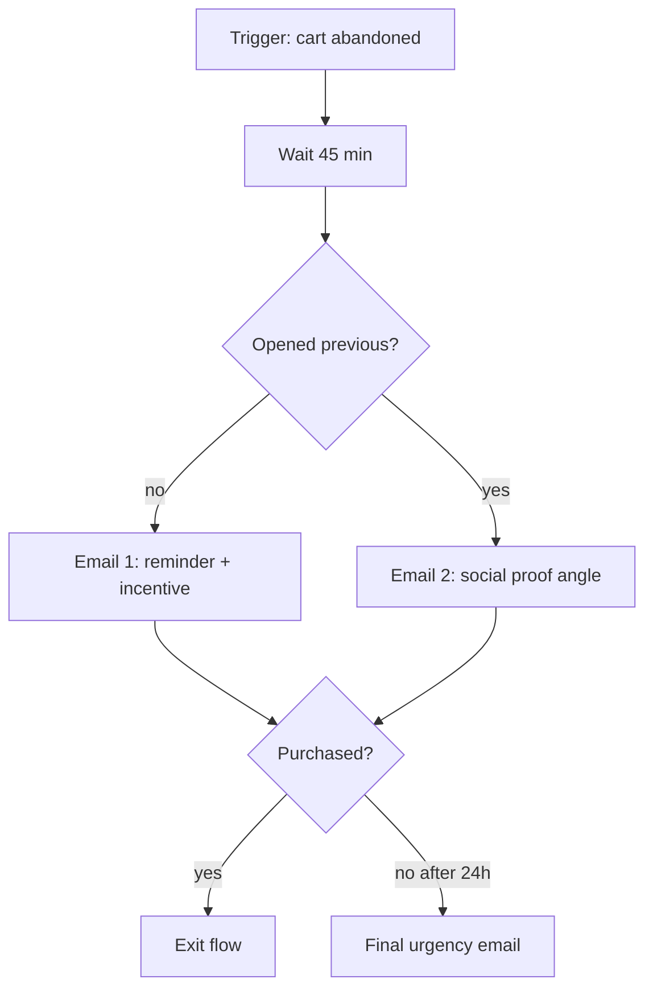
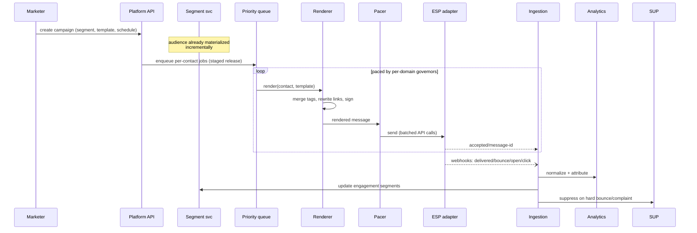
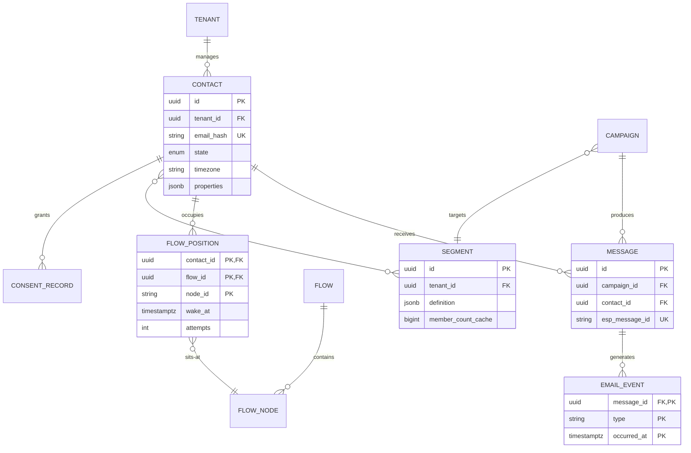

# Design an Email Automation Platform (Klaviyo, Mailchimp)

## Blogs and websites

## Medium

## Youtube

- [Design an Email Automation Platform (Klaviyo, Mailchimp) | System Design](https://www.youtube.com/watch?v=0Xc2YB2n1nw)

---

## Theory

An email automation platform lets marketers build audience segments, design campaigns, and orchestrate triggered flows (welcome series, abandoned cart, post-purchase) — then delivers billions of emails reliably while maximizing deliverability and measuring everything. It's a hybrid of three systems: a **workflow engine** (flows), a **segmentation/query engine** (audiences), and a **high-scale delivery infrastructure** (sending IPs, bounce processing, reputation management).

### Important Subtopics

1. Email sending pipeline: queueing, MTA interaction, provider APIs
2. Deliverability: SPF/DKIM/DMARC, IP warmup, reputation
3. Bounce/complaint/spam-trap handling & list hygiene
4. Segmentation engine (audience queries over event+profile data)
5. Flow/workflow orchestration (triggers, waits, branches)
6. Template rendering & personalization (merge tags, dynamic content)
7. Event tracking: opens/clicks/unsubscribes via pixel & redirect domains
8. Suppression lists & consent compliance (CAN-SPAM/GDPR/DPDP)
9. Throughput scheduling & throttling per receiving domain
10. A/B testing & send-time optimization
11. Webhook ingestion from ESPs (SendGrid/SES callbacks)
12. Analytics attribution pipelines

### Sending Pipeline Fundamentals

```
Campaign/Flow trigger → Audience resolution → Render → Queue → Rate-limited dispatch
    → ESP API / own MTAs → Receiving servers → Events stream back (delivered/bounce/open/click)
```

Key mechanics:

- **Audience resolution** is a query-engine problem ("subscribers who viewed product X in 14d, opened last email, not purchased") — computed as materialized segments refreshed continuously, not ad-hoc scans at send time.
- **Rendering** personalizes per recipient (merge tags, conditional blocks); template compilation happens once, variable substitution at render workers.
- **Dispatch** respects both platform throughput limits and *per-receiving-domain* politeness rates (Gmail/Microsoft throttle unknown senders aggressively).

### Deliverability — the Real Product

Deliverability (inbox vs spam placement) determines everything; it's earned through:

- **Authentication**: SPF (IP allowlist), DKIM (cryptographic signing), DMARC (policy alignment). Misconfigured = instant spam folder.
- **IP/domain reputation**: dedicated sending IPs warmed gradually over weeks (volume ramps 10%→100%) building trust with receivers.
- **Engagement signals**: receivers rank by opens/replies/moves-to-inbox; low engagement suppresses future delivery — hence segmentation targeting engaged users matters technically, not just commercially.
- **List hygiene**: bounces removed immediately, spam complaints (<0.1% tolerated), sunset policies retiring unengaged subscribers. Spam traps (recycled dead addresses, honeypots) permanently damage reputations.

### Flow Orchestration Model

Flows are stateful graphs per contact:



Execution model: each contact's position is persisted state (`(contactId, flowId, nodeId, wakeAt)`); a distributed timer service wakes entries; steps execute idempotently (re-entry guarded). Waits range minutes→months; time-window conditions ("only weekdays 9–5 local") evaluated against contact timezone profiles.

### Consent & Compliance

Legal architecture: double opt-in flows, one-click unsubscribe honoring within SLAs (and RFC 8058 List-Unsubscribe headers), suppression lists checked at every send, regional data residency where mandated, auditable consent records. Compliance failures aren't fines-only — mailbox providers enforce via bulk-foldering.

### Tracking Mechanics

Opens: 1×1 tracking pixel (unreliable post-Apple-MPP — opens now proxy at best). Clicks: redirect through click-tracking domain recording before forwarding. Both feed analytics and (carefully, with consent) segmentation. Unsubscribes must bypass all marketing logic instantly.

---

## Characteristics

- **Throughput-bursty sends**: campaign blasts create million-email spikes in minutes; infrastructure queues and paces rather than accepting synchronously — API returns "queued" immediately.
- **Reputation-sensitive operations**: sender IP/domain health is shared capital across customers (shared pools) or isolated (dedicated IPs for enterprise) — multi-tenancy design directly trades deliverability risk.
- **Stateful workflows at massive contact scale**: billions of in-flight flow positions demand efficient timer storage and exactly-once-ish step execution.
- **Event-driven everything**: ESP webhooks, site tracking pixels, purchase events continuously reshape audiences and flows.
- **Compliance-constrained**: consent state gates every send mechanically; audit trails required.
- **Analytics-attributed value**: platforms sell on attributed revenue — deterministic (last-click) and modeled attribution pipelines are product features.

---

## Components

- **Campaign/Flow designer**
  *Purpose*: marketer-facing creation tools. *Responsibilities*: visual editors, template libraries, preview/test-sends, versioning, approval workflows.

- **Segmentation engine**
  *Purpose*: audience computation. *Responsibilities*: translate segment definitions into queries over profile+event store, materialize results incrementally (event-driven membership updates), estimate counts pre-send. *Example*: Klaviyo-style "predicted LTR high AND engaged" segments backed by ML scores.

- **Rendering farm**
  *Responsibilities*: merge-tag substitution, dynamic block evaluation, link rewriting (tracking), unsubscribe header injection, plain-text alternates, DKIM signing handoff.

- **Queue & scheduler**
  *Purpose*: buffer and pace dispatch. *Responsibilities*: priority lanes (transactional > flow > campaign), per-domain rate governors, retry-with-backoff on transient ESP errors, quiet-hour/timezone-aware release windows.

- **ESP integration layer**
  *Responsibilities*: SendGrid/SES/Postmark adapters, webhook normalization (their event schemas differ), credential vaulting per tenant.

- **Event ingestion & hygiene**
  *Responsibilities*: consume delivered/bounced/complained/unsubscribed events, update contact states, enforce suppression instantly, feed reputation dashboards.

- **Tracking domain services**
  *Responsibilities*: click redirects (307 preserving SEO), open pixels, per-tenant custom tracking domains (deliverability best practice).

```mermaid
flowchart TB
    MK[Marketer] --> DES[Campaign/flow designer]
    SEG[(Segment store)] <-- materializes -- SEGE[Segmentation engine]
    EVS[[Site/ESP events]] --> SEGE
    DES --> ORCH[Flow orchestrator]
    ORCH --> REN[Render farm]
    REN --> Q{{Priority queue}}
    Q --> SCHED[Pacing/scheduler]
    SCHED --> ESP[ESP adapters]
    ESP --> RCPT[Receiving mail servers]
    RCPT -.events.-> ING[Event ingestion]
    ING --> SUP[(Suppression list)]
    ING --> ANA[[Analytics/attribution]]
    TRK[Click/open trackers] -.feeds.- ING
```

---

## Patterns

- **Materialized segments with incremental updates**
  *Problem*: re-evaluating complex audience queries per send over billions of events is intractable. *How*: segments stored as membership sets; incoming events incrementally add/remove members matching definitions. *When*: any audience-targeting system. *Pros*: instant send-ready audiences, count estimates cheap. *Cons*: definitional drift bugs need periodic full recomputes.

- **Distributed timer/wake-service**
  *What*: flow waits stored as `(wakeAt)` sorted entries; sharded tickers poll due batches; step execution leased to workers. Same machinery as job schedulers (see that topic) applied to contacts. Exactly-once effects via idempotent step keys `(contactId, nodeId, entryId)`.

- **Per-domain pacing governors**
  *What*: token buckets keyed by receiving-domain (gmail.com, outlook.com…) enforcing learned-safe rates; hot domains throttle while long-tail proceeds. *Why*: single abusive burst to Gmail tanks platform-wide reputation.

- **Transactional-vs-marketing separation**
  Order confirmations never share queues/IPs with campaigns — transactional deliverability protected absolutely (users expect receipts; their absence destroys trust).

- **Webhook-normalization anti-corruption**
  Each ESP's callback schema mapped to internal `EmailEvent` taxonomy once, downstream logic stays clean across providers.

- **Warmup-as-code**
  New dedicated IPs follow scheduled volume ramps enforced automatically with gate checks (bounce/complaint thresholds gating each ramp stage).

---

## Benefits

- **Revenue automation at scale**: abandoned-cart flows alone typically recover measurable percentage of otherwise-lost sales; platforms monetize directly via attributed revenue.
- **Marketer self-service**: segmentation+flow builders eliminate engineering tickets for routine lifecycle marketing.
- **Deliverability economics compound**: better inbox placement → better engagement → better placement — virtuous cycles the architecture deliberately enables.
- **Cross-channel extensibility**: same segmentation/orchestration cores later serve SMS/push — Klaviyo's actual evolution path.

---

## Pros

- Clean bounded contexts (segments/render/dispatch/tracking) compose well.
- ESP-adapter abstraction prevents vendor lock-in at the delivery layer.
- Event-spine enables rich attribution and ML features organically.

## Cons

- Deliverability is partially outside your control (receiver policies shift constantly) — operational anxiety inherent.
- Multi-tenant reputation sharing creates cross-customer blast radii without careful isolation.
- Tracking accuracy degrading industry-wide (MPP, cookie-less) undermines attribution claims products depend on.
- Compliance surface large and jurisdiction-dependent.

---

## Challenges

- **Technical**: billion-row segment stores; timer storms when campaigns release simultaneously; webhook bursts post-blast (millions of events in minutes).
- **Scalability**: render-farm sizing for peak blasts; event-ingestion partition planning; segment-materialization lag under heavy site-event floods.
- **Performance**: sub-second API responses for flow triggers embedded in checkout paths; dashboard query latency over huge event volumes (pre-aggregation tiers).
- **Reliability**: exactly-once send semantics (duplicate emails destroy trust fast); ESP outage failovers; suppression-store availability (must be checkable even during incidents).
- **Maintainability**: ESP API churn; template-language backward compatibility across years of customer templates.
- **Operational**: reputation monitoring war rooms; IP warmup calendars; abuse handling (customers importing scraped lists).
- **Security/compliance**: GDPR erasure propagation through backups/analytics; consent-record integrity; phishing-content scanning protecting shared infrastructure.

---

## Best Practices

- **Separate transactional and marketing streams physically** (credentials, IPs, queues) — non-negotiable.
- **Enforce suppression checks at dispatch-time**, not just list-build time — unsubscribes arriving mid-campaign must be honored.
- **Rate-limit per receiving domain**, learned from engagement feedback loops, with headroom alarms.
- **Default new tenants onto shared warmed pools** with strict intake validation; dedicated IPs only with demonstrated volume commitment.
- **Treat open-tracking as advisory** (MPP reality); anchor metrics on clicks/conversions.
- **Make every flow step idempotent** with durable position state; test crash-resume explicitly.
- **Provide one-click List-Unsubscribe headers everywhere** (legal + receiver-preferred).
- **Audit consent provenance** end-to-end: source, timestamp, IP stored immutably per contact.

---

## When to Use / Not Use

**Build/buy platform when**: lifecycle marketing volume justifies it (>~100K emails/month), revenue depends on automated flows, multi-channel roadmap exists.

**Skip when**: tiny lists — ESPs' native automations suffice; purely transactional needs — SES/Postmark direct integration simpler.

Build-vs-buy nuance: most companies buy delivery (SES/SendGrid) but may build orchestration/segmentation differentiation on top; full-platform builds reserved for the Klaviyos themselves.

Decision inputs: volume trajectory, marketing sophistication, engineering capacity, deliverability sensitivity of the business model.

---

## Use Cases

- **E-commerce abandoned-cart recovery**
  *Problem*: ~70% carts abandoned; manual recovery impossible at scale. *Solution*: browse-abandon + cart-abandon flows with dynamic product blocks rendered from event payloads, incentives gated by margin rules, exit-on-purchase conditions checking order events. *Trade-off*: aggressiveness vs annoyance tuned via frequency caps per contact.

- **SaaS lifecycle nurture**
  *Problem*: trial users need behavior-triggered education converting to paid. *Solution*: feature-adoption events drive branching sequences (unused-key-feature nudges), engagement scoring gates sales-handoff notifications. *Trade-off*: long-horizon flows (months) stress timer durability — tested explicitly.

- **Media/newsletter monetization**
  *Problem*: daily editions to tens-of-millions subscribers with per-user content selection. *Solution*: send-time optimization ML choosing individual dispatch hours, content-block ranking personalized per profile, engagement-decay sunset policies pruning inactive addresses protecting reputation. *Trade-off*: spread sends reduce burst costs but delay freshness-sensitive content decisions.

---

## High-Level Design

Campaign blast journey:



Scaling: queue partitions by tenant×campaign; renderers autoscale on depth; ingestion consumers keyed by messageId; segment store sharded by contact hash.

Failure handling: renderer backlog → scheduler slows intake (backpressure upstream); ESP outage → circuit-breaker pauses lane with automatic resume; duplicate webhooks deduped by (messageId, eventType, timestamp window).

---

## Deep Dive

- **Exactly-once sending discipline**: dispatch records intent (`(contactId, campaignId)` unique) *before* ESP call; response reconciliation marks outcome; crashes between leave ambiguous rows swept by reconciler querying ESP by reference-id — duplicates prevented structurally, ambiguity resolved eventually.
- **Domain-rate learning**: track per-domain engagement deltas at candidate rates; bandit-style adjustments find sustainable ceilings per receiver class; sudden policy shifts (Gmail spam-rule changes historically) detected via complaint-ratio anomalies triggering fleet-wide rate reductions automatically.
- **Timer scalability math**: 500M contacts × avg 1.3 active flow positions ≈ 650M pending wakes; Redis ZSET-class sharding by contact hash with ticker pods claiming ranges keeps scan costs linear and predictable.
- **Attribution modeling**: deterministic last-click baseline plus data-driven models (Markov/shapley on conversion paths) computed offline nightly; real-time dashboards read pre-aggregated marts — never raw event scans.
- **Observability**: funnel metrics (queued→rendered→accepted→delivered→opened→clicked), per-domain reputation panels, flow-step conversion rates, suppression-lag monitors (unsubscribe honored <seconds), warmup progress trackers.

---

## Data Modeling



Choices: contacts keyed by hashed email (PII minimized; raw email encrypted separately); composite-PK event log enabling dedupe; `wake_at` indexed per shard powering tickers; segment definitions versioned JSONB with schema validation; suppression implemented as contact-state + global list consulted at dispatch. Partitioning: events by month; positions by contact-hash; retention per compliance (consent records longest).

---

## Java and Spring Boot Implementation

Flow-position ticker waking due contacts:

```java
@Service
public class FlowTicker {

    private final StringRedisTemplate redis;
    private final FlowExecutor executor;

    @Scheduled(fixedDelay = 1000)
    public void wakeDue() {
        long now = System.currentTimeMillis();
        var due = redis.opsForZSet().rangeByScore("flow:wakes:" + shard(), now, now);
        for (String entry : due) {
            if (redis.opsForZSet().remove("flow:wakes:" + shard(), entry) > 0) {
                executor.executeAsync(parse(entry));   // leased execution, idempotent steps
            }
        }
    }
}

@Component
public class FlowExecutor {

    @Transactional
    public void execute(FlowPosition pos) {
        var node = flowGraph.node(pos.flowId(), pos.nodeId());
        switch (node.kind()) {
            case SEND_EMAIL -> {
                boolean first = messages.recordIntentIfAbsent(pos.contactId(),
                        node.campaignId());            // structural dedupe
                if (first) renderAndEnqueue(pos, node);
            }
            case WAIT -> reschedule(pos, node.duration());
            case CONDITION -> branchOrExit(pos, node.predicate());
            case EXIT -> closePosition(pos);
        }
    }
}
```

Pacing governor for dispatch:

```java
@Component
public class DomainGovernor {

    private final Map<String, RateLimiter> limiters = new ConcurrentHashMap<>();

    public boolean tryAcquire(String receivingDomain) {
        return limiterFor(receivingDomain).tryAcquire();
    }

    private RateLimiter limiterFor(String domain) {
        return limiters.computeIfAbsent(root(domain),
                d -> RateLimiter.builder()
                        .limitForPeriod(learnedSafeRate(d))
                        .refreshPeriod(Duration.ofSeconds(1))
                        .build());
    }
}
```

Notes: ticker removal-before-execution provides lease semantics; intent-recording makes sends structurally idempotent; Resilience4j RateLimiters implement governors swappable from learned-rate config. Testing: Testcontainers Redis driving ticker storms, ESP WireMock fault injection verifying retry/backoff and exactly-once outcomes under chaos.

---

## Real-World Examples

- **Klaviyo** — e-commerce-focused segmentation+flows archetype; their predictive-analytics features (CLV, churn-risk segments) illustrate ML-layer evolution on this exact architecture.
- **Mailchimp** — mass-market evolution story; early Mandrill split validated the transactional/marketing separation doctrine.
- **SendGrid/Twilio** — delivery-infrastructure specialists whose APIs most platforms build upon; their webhook/event documentation teaches normalization requirements firsthand.
- **Amazon SES** — scale benchmark: the infrastructure behind countless platforms, demonstrating raw-sending economics versus orchestration-value layers above.

---

## Interview Preparation

### Interview Questions

**Beginner**

1. **What separates transactional from marketing email infrastructure?**
   Expectation and legality: receipts/password resets must arrive (dedicated warmed IPs, zero marketing coupling), while promotional mail tolerates spam-folder risk. Sharing infrastructure lets marketing problems break trust-critical transactional delivery.
2. **Why do hard bounces get suppressed immediately?**
   Continued sending to invalid addresses signals poor hygiene to receivers, degrading reputation for all subsequent mail — including to valid recipients.

**Intermediate**

3. **Design segment computation for "viewed product X but didn't purchase in 48h".**
   Materialized segment fed by two event types: view-events add members with timestamps, purchase-events remove; sweeper expires stale memberships past window. Discuss incremental correctness, late-arriving events (idempotent upserts), and why per-send full recomputation fails at scale.
4. **How does IP warmup work and what breaks if skipped?**
   Receivers judge new IPs by volume history; ramps (hundreds→thousands→millions daily over weeks) with engagement-quality gates build trust. Skipping triggers bulk-foldering that poisons reputation for months. Show understanding of receiver-side economics.
5. **Walk through ensuring an email sends exactly once despite worker crashes.**
   Intent row inserted uniquely pre-dispatch; crash between insert and send → reconciler finds intent without ESP confirmation, queries ESP by reference, resolves send-or-resend; response handler marks final state. Duplicates structurally impossible; ambiguity window bounded and monitored.

**Advanced**

6. **A customer's campaign generated 40% bounce rate. Automated response?**
   Immediate: pause tenant's sending (protecting shared reputation), quarantine affected segment, alert both tenant and ops; diagnostic: list-source analysis (scraped/purchased lists typical culprit); remediation workflow with re-permission campaigns before gradual reinstatement. Demonstrates platform-protection instincts beyond single-customer thinking.
7. **Design send-time optimization.**
   Per-contact historical engagement hour-distribution modeling, exploration slots testing new hours, constraint layers (quiet hours, campaign deadlines), measured lift attribution via holdout groups. Discuss cold-start priors from cohort behavior.

**Senior / system design**

8. **Architect multi-tenant deliverability isolation: shared pools vs dedicated IPs trade-offs.**
   Tiered model: free/starter share warmed pools with strict intake hygiene and automated reputation-based ejection; enterprise buys dedicated IPs with warmup-as-code pipelines; pool-level anomaly detection isolates bad actors within hours. Quantify blast-radius reduction vs utilization efficiency; discuss receiver-side fingerprinting realities (domain reputation increasingly matters more than IP).
9. **How would you evolve this platform toward SMS/push channels?**
   Identify reusable core (contacts, consent, segmentation, flow orchestrator) versus channel-specific layers (providers, governors, event taxonomies); abstraction seams designed accordingly; migration sequenced channel-by-channel behind the same flow DSL. Shows platform-thinking and boundary-drawing judgment.

### Common Mistakes

- Checking suppression at list-build only — mid-campaign unsubscribes then violated.
- Shared IP pools with lax tenant intake — one spammer poisons everyone.
- Open-based metrics treated as ground truth post-MPP.
- Timer entries without lease/idempotency — crashes duplicate sends or strand positions forever.
- Ignoring per-domain pacing until Gmail throttles the entire platform.

### Expected discussion points
Deliverability-economics literacy, exactly-once sending mechanics, incremental-segmentation correctness, multi-tenancy isolation strategy, and compliance-by-design posture.
