# Design Facebook

## Blogs and websites

- [Meta Engineering Blog](https://engineering.fb.com/) — the canonical source for Facebook/Meta infrastructure posts (TAO, Memcached, Haystack, Scuba, Scribe, f4, and the privacy/integrity stack).
- [TAO: The Power of the Graph](https://research.fb.com/publications/tao-the-power-of-the-graph/) — the original research publication describing Facebook's graph-aware distributed cache backed by MySQL.
- [Scaling Memcache at Facebook](https://engineering.fb.com/2016/05/09/scalability/scaling-memcache-at-facebook/) — regional Memcached fleets, mcrouter, and the lease mechanism that killed cache-stampede outages.
- [The Evolution of Haystack](https://engineering.fb.com/2017/07/05/platform/f6122d43c00c204a5b14d41826b4f88d/) — photos at scale, append-only log stores, and eliminating per-object metadata seeks.
- [Introducing f4: A Cold Storage System](https://engineering.fb.com/2016/09/07/volume17/) — Reed-Solomon erasure coding applied to warm/cold media, halving photo-storage costs.
- [Scuba: Distributed, Low-Latency Parallel Querying](https://research.fb.com/publications/scuba-distributed-low-latency-parallel-querying/) — the interactive analytics engine that powers Facebook's observability.
- [Scribe: Facebook's Log Aggregation Service](https://github.com/facebookarchive/scribe) — the durable, hierarchical log pipeline feeding Hive, Presto, and ML feature generation.
- [WebScaleSQL / MyRocks](https://engineering.fb.com/2015/02/11/web-scale-sql/) — the MySQL storage-engine and replication customizations powering the durable backing store for TAO and objects.

## Medium

- [Designing Facebook News Feed](https://medium.com/@igorgue/designing-facebook-news-feed-579e0b06d3b8) — community deep-dive on EdgeRank and the inventory problem.
- [Building the News Feed in 90 Minutes](https://medium.com/@igorgue/building-news-feed-system-5e9e1a5b0c4a) — a pragmatic walkthrough of fan-out-on-write vs read.
- [TAO Explained — Facebook's Distributed Data Store](https://medium.com/@igrankh/facebook-tao-explained-1c8c7a7e3f0c) — notes on cache-through MySQL and association-list semantics.

## Youtube

- [Facebook Infrastructure — TAO, Haystack, Memcached (System Design)](https://www.youtube.com/watch?v=57_2lEcJUkA)
- [GOTO 2019 — Nick O'Neil: Building Facebook's News Feed](https://www.youtube.com/watch?v=Z8j-XgM5rAw)
- [GOTO 2016 — Jeff Roths: Scaling Facebook's Real-time Data Infrastructure](https://www.youtube.com/watch?v=4FZBNOg5X5s)
- [Grokking the System Design Interview — News Feed / Feed Ranking](https://www.youtube.com/watch?v=3m86rBBDAEA)

---

## Theory

### Topics Covered

1. [Introduction / Problem Statement](#introduction--problem-statement)
2. [Characteristics](#characteristics)
3. [Pros](#pros)
4. [Cons](#cons)
5. [Use Cases](#use-cases)
6. [Components](#components)
7. [Architectural Patterns](#architectural-patterns)
8. [Benefits](#benefits)
9. [Challenges](#challenges)
10. [Best Practices](#best-practices)
11. [When to Use / When Not to Use](#when-to-use--when-not-to-use)
12. [Data Model and API](#data-model-and-api)
13. [News Feed and Social Graph Deep Dive](#news-feed-and-social-graph-deep-dive)
14. [Replication Strategies](#replication-strategies)
15. [Failure Detection and Membership](#failure-detection-and-membership)
16. [High Availability and Scalability](#high-availability-and-scalability)
17. [Performance and Optimization](#performance-and-optimization)
18. [CAP Theorem and Consistency Trade-offs](#cap-theorem-and-consistency-trade-offs)
19. [Encryption and Key Management](#encryption-and-key-management)
20. [Authentication and Authorization](#authentication-and-authorization)
21. [Security Threats and Mitigations](#security-threats-and-mitigations)
22. [Observability and Logging](#observability-and-logging)
23. [Real-World Implementations](#real-world-implementations)
24. [Java and Spring Boot Implementation Guide](#java-and-spring-boot-implementation-guide)
25. [Interview Questions and Answers](#interview-questions-and-answers)

---

### Introduction / Problem Statement

Facebook (Meta) is a social network platform that lets users create profiles, share content, connect with friends, and consume a personalized feed of posts from their network. At its core, it's a **social graph** — a massive directed graph of users and their relationships — combined with a **news feed** that ranks and presents content in an engaging order. The challenge is doing this at planetary scale: billions of users, hundreds of billions of friendships, millions of new posts per minute.

**Problem Statement:** Design a social networking platform like Facebook that supports user profiles, friend connections, news feed, posts, reactions, comments, groups, pages, and messaging at billion-user scale, while maintaining sub-200 ms feed-read latency, near-real-time content propagation, 99.99% availability, and robust privacy enforcement in the data path.

Facebook exists to connect people across geography, keep them engaged with relevant content, and create network effects that make the platform more valuable as more people join. The news feed is the central product — it must surface the most relevant content to each user from their social graph, balancing recency, relationship strength, content type, and engagement signals, all in under 200 ms. The defining challenge is the **fan-out problem**: when a user with millions of followers (a celebrity or a page) posts a single update, the system must distribute that content to all followers' feeds efficiently without overwhelming the write path (write amplification) while keeping reads fast.

**What the fan-out problem looks like at scale:** A page with 10 million followers publishes one photo. Naive fan-out-on-write demands 10 million writes to follower feeds — enough to saturate an entire Memcached/Redis cluster in seconds. Fan-out-on-read would demand re-merging 10 million timelines every time any of those followers opens their app — enough to collapse the backend. The real architecture must use a **hybrid**: push for normal users (precompute their feeds cheaply), pull for celebrity accounts (merge at read time from a celebrity overlay index), and stage candidate generation, scoring, and privacy filtering so the heavy ML models only ever touch the top candidates.

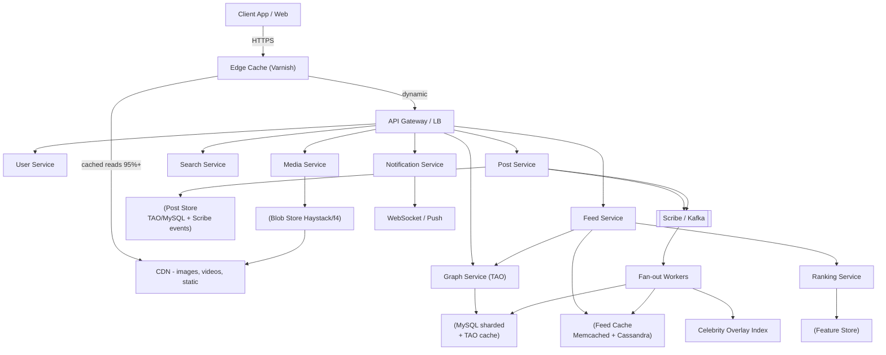

*The high-level Facebook topology: clients hit an edge cache backed by a CDN (serving the majority of reads); dynamic requests fan out through an API gateway to stateless services; the Post Service persists objects in TAO/MySQL and publishes to Scribe/Kafka; Fan-out Workers consult the sharded social graph to either pre-push posts into followers' Memcached/Cassandra feeds or, for celebrity accounts, register the post in a read-time overlay index; the Feed Service merges precomputed feeds with celebrity overlays and passes them through a staged ranking pipeline fed by a feature store; the Notification Service drives live comments, reactions, and real-time updates.*

---

### Characteristics

- **Read-dominated social asymmetry**: feed reads vastly outnumber post writes; the entire architecture (pre-computed fan-out feeds, multi-tier caches, edge caching) exists to make reads nearly free.
- **Graph-centric data model**: friendships/follows/memberships/reactions are first-class queryable associations — every feature (feed, suggestions, privacy, integrity) reduces to graph traversals, which is why Facebook built TAO rather than forcing SQL joins.
- **Hybrid consistency discipline**: strong-ish consistency where mutations matter (friend edges via home-region primaries), eventual everywhere else (feed contents, counts, seen-state); the consistency boundary is deliberate and documented.
- **Celebrity-skewed workloads**: 0.01% of accounts (pages, celebrities) generate disproportionate write amplification under naive fan-out — hybrid push/pull exists precisely for this skew.
- **Privacy-in-the-hot-path**: every feed item render re-checks audience visibility (privacy checks can't be cached away safely after policy changes) — a correctness constraint shaping cache design.
- **Global-write-anywhere ambitions vs operational reality**: most deployments converge on home-region-per-user with async replication; true active-active remains the field's hardest problem.
- **Media-heavy ingest**: photos/videos dwarf text bytes; the storage layer (Haystack, f4) and pipeline (transcoding, thumbnails) are workload-driven rather than generic.
- **Event-driven fan-out**: post creation returns immediately (async fan-out) to keep the publish latency budget small; correctness is preserved by idempotent feed keys (post IDs, not content).

---

### Pros

- Battle-tested component designs publicly documented (TAO papers, Memcached at Facebook, Haystack/f4) — rare advantage of studying this system.
- Hybrid consistency boundaries well-understood and defensible in interviews.
- Degradation options mature (feed falls back to recency-only / chronological ranking under ML brownouts; celebrity cache loss falls back to pull-time merge).
- Shared substrate reuse: the graph, cache, and media platforms let product teams ship features composing existing primitives, accelerating iteration.
- Observable and rehearsed failure modes: fan-out lag, cache stampedes, regional failover are all instrumented and exercised.

### Cons

- Enormous operational surface: thousands of services, custom infrastructure everywhere — unbuildable without FAANG-class resources.
- Ranking opacity creates societal/regulatory exposure (algorithmic accountability, filter-bubble debates).
- Privacy-check hot-path costs limit caching aggressiveness permanently.
- Cross-region consistency compromises surface as confusing UX edge cases (stale friend lists, delayed visibility of policy changes).
- Legacy data-format coexistence: decade-old on-disk layouts run alongside new schemas, making migrations a careful, online, backward-compatible affair.

---

### Use Cases

- **Friend-graph news feed (core FB loop)** — assemble relevant ranked content from thousands of connections within 200 ms globally using hybrid fan-out + staged ranking + multi-tier caches. Eventual consistency means a post may briefly not appear; mitigated by WebSocket nudges triggering targeted refetches.
- **Viral moment handling (World Cup goal post)** — single post gaining million likes/comments/minute; counter sharding, notification batching/aggregation, CDN-offloaded media, and hot-key leases preventing cache-stampede cascades. Count displays lag seconds — universally accepted.
- **Groups and Pages at scale** — membership edges in the millions break friend-graph assumptions; group-scoped feed variants (pull-heavier since membership density differs from friendship), membership-edge sharding independent of user sharding, tiered moderator tooling.
- **Stories (24h ephemeral content)** — fan-out with aggressive TTL; story trays in sorted sets keyed by `(user_id, timestamp)`; cron deletes past 24h; highlights stored separately without TTL.
- **Real-time comments and reactions** — WebSocket/long-poll channels push likes and comments to open clients within seconds; offline users receive batched pushes on reconnect.

---

### Components

| Component | Purpose | Responsibilities | Relationship |
|---|---|---|---|
| **TAO (Social Graph Service)** | Graph-aware object store | adjacency-list CRUD, bounded traversals, cache-through reads over MySQL shards, association-count maintenance | substrate beneath feed / notifications / search |
| **Post Service** | Content creation & persistence | validation, media-reference assembly, audience tagging, event emission | publishes to Scribe/Kafka for fan-out |
| **Fan-out Workers** | Feed distribution | consume post events, query TAO for followers, push IDs to follower feed caches (skip celebrity writes) | read graph; write Memcached/Cassandra |
| **Feed Service** | Feed assembly & pagination | merge pre-pushed segments with celebrity pulls, apply staged ranking, enforce privacy/diversity, paginate | heaviest read consumer of graph + post + feature stores |
| **Ranking Service** | Relevance scoring | staged scoring (cheap filters → lightweight scorer → heavyweight engagement model), feature serving | consumes Feature Store + live engagement signals |
| **Media Pipeline** | Photo/video lifecycle | resumable upload, virus scan, transcoding ladders, thumbnail generation, blob placement (Haystack append-only log, f4 for cold), CDN | serves via CDN URLs referenced by posts |
| **Cache fleet (Memcached + mcrouter)** | Absorb the read storm | regional clusters, cross-region invalidation daemons, lease mechanism, failover | cache-through for TAO; fan-out destination for feeds |
| **Notification Service** | Real-time delivery | badge counts, WebSocket pushes, aggregation rules (don't send 50 for 50 likes) | listens to event bus; pushes via WS / APNs / FCM |
| **Search Service** | Discovery | people/pages/posts search, typeahead, Explore ranking | consumes Scribe event stream |
| **Integrity Systems** | Safety & trust | ML classifiers on content + behavior, velocity limits, reputation scoring feeding ranking downweights | gates post creation + feeds |
| **Scribe / Kafka** | Event backbone | durable, ordered per-key event log for `post_created`, `edge_added`, `like_added`, `comment_added` | consumed by fan-out, ranking, notifications, analytics |

```mermaid
flowchart TB
    U[Client] --> LB[LB/API GW/Edge Cache]
    LB --> FS[Feeds svc]
    LB --> PS[Post svc]
    LB --> GS[Graph svc TAO]
    LB --> NS[Notification svc]
    LB --> MS[Media svc]
    FS --> FC[(Feed caches<br/>Memcached + Cassandra)]
    FS -->|pull celebrities| PO[(Post store<br/>TAO/MySQL)]
    FS -->|stage scoring| RK[Ranking svc]
    RK --> FE[(Feature store<br/>Scuba/Hive)]
    PS --> PO
    PS --> K[[Scribe/Kafka]]
    K --> FOW[Fan-out workers]
    FOW --> FC
    FOW --> CIDX[(Celebrity<br/>overlay index)]
    GS --> GC[(Memcached<br/>fleet +<br/>MySQL shards)]
    GC --> MC[Regional<br/>invalidation daemons]
    MS --> BLOB[(Blob store<br/>Haystack/f4)]
    BLOB --> CDN[CDN]
    NS --> WS[(WebSocket/<br/>Push)]
    U -.-> CDN
    classDef data fill:#f4f4f4,stroke:#999;
    FC PO GC FE BLOB K CIDX class data
```

---

### Architectural Patterns

- **Fan-out on Write (Push Model):** When a post is created, the system writes the post ID to every follower's precomputed feed immediately at write time. Read is O(1) (read the precomputed list). Best for normal users with moderate follower counts (Facebook's hybrid carve-out). *Trade-off*: write amplification proportional to follower count.

```mermaid
sequenceDiagram
    participant A as Author app
    participant PS as Post svc
    participant ST as Post store
    participant FO as Fan-out workers
    participant FC as Feed caches
    participant V as Viewer app
    participant FS as Feed svc
    part note right of ST: Celebrity check decides path

    A->>PS: createPost(content, audience)
    PS->>ST: persist + assign postId
    alt regular user (<threshold)
        ST-->>FO: event
        par per-follower batches
            FO->>FC: prepend postId to follower feeds
        end
    else celebrity/page
        Note over FO: skip fan-out; ID enters<br/>celebrity index only
    end
    PS-->>A: 201 {postId}
    V->>FS: GET feed (cursor)
    FS->>FC: read precomputed segment
    FS->>ST: pull recent celebrity posts (overlay merge)
    FS->>FS: rank (staged scoring), privacy-filter
    FS-->>V: page 1
```

*The post-to-feed journey with Facebook's hybrid fan-out: regular users' posts are pushed to followers' cached feeds via Fan-out Workers; celebrity/page posts skip write-time fan-out and enter a read-time "celebrity index" that the Feed Service merges at read time. The Feed Service finally stages the candidate items (precomputed + celebrity pulls) through privacy filtering and staged ranking before returning the page.*

- **Fan-out on Read (Pull Model):** At read time, fetch posts from all followed users and merge-sort. Write is O(1); read is O(following × posts_per_user). Best for power users whose write fan-out would be too expensive. *Trade-off*: higher tail latency and backend load at read time.
- **Hybrid Fan-out (Facebook's model):** Push for regular users (< ~10K followers), pull for celebrities/pages (millions of followers). Precompute + merge at read time. *Trade-off*: complexity for a balanced write/read cost curve.
- **Staged (cascaded) scoring / EdgeRank evolution:** Cheap filters eliminate ~99% of candidates (seen-before, unfollowed, policy-blocked), then a lightweight scorer orders hundreds, then a heavyweight engagement-prediction model ranks dozens. Same funnel philosophy as search retrieval→rerank. Score = `f(affinity, edge_weight, time_decay, engagement_prediction)`.
  - `affinity`: how close is the poster to the viewer (comment/like history, profile views);
  - `edge_weight`: type of content (video > photo > text, per business rules);
  - `time_decay`: how recent the post is (half-life in hours);
  - `engagement_prediction`: ML model predicting interaction probability given the viewer.
- **Lease-based cache consistency (Memcached at Facebook):** On a miss, memcached grants a 48-hour lease token to exactly one requester; others are told to wait-and-retry; concurrent sets carrying a stale CAS are rejected. This single primitive deduplicated thundering herds AND prevented stale-clobber races — it eliminated entire classes of outages.
- **Regionalization with home regions:** Each user's profile/graph shards are pinned to a home region for data residency and latency; cross-region friend interactions are served from replicas with documented staleness bounds; writes are always home-region-routed.
- **Asynchronous materialized aggregates:** Like/comment counts are maintained by stream aggregators into a counters service rather than transactional increments — display tolerates seconds-level lag. Enables fan-out without blocking on aggregate updates.
- **Anti-pattern**: computing feeds purely on read at billion-user scale (latency + backend collapse); equally, pure push without celebrity carve-outs melts write paths.

---

### Benefits

- **Engagement flywheel**: personalized feeds measurably multiply session time vs. chronological — the business case funding everything else.
- **Horizontal scaling clarity**: user-sharded data + stateless services grow roughly linearly with population.
- **Feature velocity via shared substrates**: graph/cache/media platforms let product teams ship features composing existing primitives.
- **Cost engineering as competitive advantage**: blob-storage innovations (Haystack/f4, erasure coding) saved petabytes-scale costs — infrastructure economics directly enabling free products.
- **Operational maturity**: a decade of rehearsing fan-out lag, stampedes, and failover means degradation is graceful and observable rather than catastrophic.

---

### Challenges

- **Technical**: feed inventory explosion (billions of candidate posts per user daily — candidate generation must prune before ranking); cache invalidation storms on viral posts; clock-skew in time-decay / recency scoring.
- **Scalability**: celebrity live-event posts (millions of concurrent viewers); notification fan-out bursts; graph traversal hot-spots on mega-nodes (group memberships in the millions).
- **Performance**: p95 feed < 200 ms across 6+ backend dependencies — achieved via parallelism, speculative prefetching, aggressive tiering, and staged scoring.
- **Reliability**: regional failover preserving session continuity; ML-service brownouts degrading gracefully to simpler models; cache-cluster loss absorbed by lease-guarded rebuild waves.
- **Maintainability**: decade-old data formats coexisting with new; schema migrations at petabyte scale executed online and backward-compatibly.
- **Operational**: capacity planning across timezones' diurnal peaks; integrity-system tuning against evolving abuse.
- **Security/integrity**: fake-account ecosystems, coordinated inauthentic behavior, scraping defense, privacy-regulation compliance (GDPR erasure across backups/analytics).
- **Privacy correctness**: audience checks must run in the data path on every render (never baked into cached artifacts), limiting cache TTLs and increasing CPU cost per item.

---

### Best Practices

- **Bound every graph traversal** (max-depth, max-nodes) — unbounded walks through celebrity/mega-nodes are DoS vectors; TAO documents explicit traversal limits.
- **Design caches assuming expiry storms** (lease/single-flight everywhere); measure hit-ratio regressions as incidents.
- **Separate candidate generation from ranking** — never run heavy models over raw inventories; stage and prune first.
- **Enforce privacy checks inside data-access layers**, not application code — one enforcement point beats N hopeful call-sites; this is non-negotiable at scale.
- **Emit engagement telemetry with position/experiment tags** for ranking evaluation loops (same discipline as search).
- **Pre-compute aggressively for known-heavy moments** (New Year's Eve traffic modeled years ahead, regionally).
- **Chaos-test cross-region failover quarterly** with user-visible SLO dashboards proving recovery claims.
- **Write fan-out keys are IDs, never content** — idempotent upserts make retries safe and deduplication trivial.

---

### When to Use / When Not to Use

This full architecture suits **planet-scale social platforms**. Scale down honestly:

- **Regional social apps (< 10M users):** PostgreSQL adjacency tables + Redis caches + straightforward push feeds suffice — TAO/Haystack-class machinery unjustifiable.
- **Enterprise social (Slack/Teams-like):** workspace-partitioned graphs simplify nearly everything; the fan-out ceiling drops dramatically.
- **Follow-only platforms (Twitter-shaped):** pull-heavier hybrids fit asymmetric graphs better than Facebook's symmetric-friendship assumptions.
- **Interest-graph platforms (TikTok-shaped):** pre-ranking at ingest time with real-time re-ranking at read time beats social-graph fan-out entirely.

**Decision factors:** user scale trajectory, graph shape (symmetric vs. follower), media intensity, regulatory geography spread, team resources, and the engagement-vs-simplicity trade-off.

---

### Data Model and API

Facebook exposes a **graph-based REST API** where every object (user, post, photo, comment) is a node and relationships (friends, likes, comments) are edges. The data model mirrors TAO semantics: objects + typed associations.

```mermaid
erDiagram
    USER ||--o{ ASSOC : "owns"
    USER }o--o{ USER : "friend-of"
    USER }o--o{ PAGE : "follows"
    USER }o--o{ GROUP : "member-of"
    USER ||--o{ POST : "authors"
    POST ||--o{ ASSOC : "receives (like/comment)"
    FEED_ENTRY }o--|| POST : "references"
    USER ||--o{ FEED_ENTRY : "owns feed list"
    POST }|o--|| MEDIA : "contains"

    USER {
        bigint id PK
        varchar home_region
        enum status
    }
    ASSOC {
        bigint id1 PK
        int type PK
        bigint id2 PK
        bigint time PK
        varbinary data
    }
    POST {
        bigint id PK
        bigint author_id FK
        jsonb content_refs
        bigint audience_mask
        timestamptz created_at
    }
    FEED_ENTRY {
        bigint user_id PK,FK
        bigint post_id PK,FK
        double rank_score
        bigint inserted_at
    }
    MEDIA {
        bigint id PK
        varchar haystack_offset
        bigint post_id FK
        varchar mime_type
    }
```

*Entity-relationship model mirroring TAO: objects (USER, POST, MEDIA) and typed associations (ASSOC) stored as `(id1, type, id2, time)` tuples with reverse-direction indexes materialized for symmetric edges. FEED_ENTRY is the per-user association list of post IDs (bounded length, cursor-paginated). MEDIA lives in Haystack append-only log files referenced by offset. Sharding: objects by id; associations colocated by id1 for traversal locality; celebrity overlays indexed separately.*

**Notes mirroring TAO semantics:** associations stored as `(id1, type, id2, time)` tuples — reverse-direction indexes materialized for symmetric edges (friends); feeds as per-user association lists of post-IDs (bounded length, cursor-paginated); audience masks encode visibility classes resolved against viewer context at serve-time. Sharding: objects/users by id; associations colocated by id1 (traversal locality); celebrity overlays indexed separately.

**API Contract (Graph API):**

| Method | Endpoint | Purpose |
|---|---|---|
| GET | `/api/v1/me/feed` | Get user's news feed |
| GET | `/api/v1/{user-id}/feed` | Get another user's feed |
| POST | `/api/v1/{user-id}/feed` | Create a post |
| POST | `/api/v1/{post-id}/comments` | Comment on a post |
| POST | `/api/v1/{post-id}/likes` | Like a post |
| POST | `/api/v1/{user-id}/friends` | Send friend request |
| GET | `/api/v1/search` | Search posts, users, pages |
| GET | `/api/v1/{user-id}/friends` | List friends |
| POST | `/api/v1/{group-id}/members` | Join a group |

**GET /api/v1/me/feed — Query Parameters:**

| Parameter | Type | Default | Description |
|---|---|---|---|
| limit | int | 25 | Results per page (max 100) |
| after | string | — | Cursor for pagination |
| rank | bool | true | Apply ML ranking (vs chronological) |
| include | string | — | Comma-separated: `comments,likes,attachments` |

**GET /api/v1/me/feed — Response:**

```json
{
  "data": [
    {
      "post_id": "post_789",
      "author_id": "user_123",
      "author_name": "Alice",
      "content": "Having a great time at the beach!",
      "created_time": "2024-06-14T10:00:00Z",
      "type": "text",
      "attachments": [{"type": "photo", "url": "https://..."}],
      "statistics": {"likes": 120, "comments": 15, "shares": 3},
      "user_reacted": "LIKE",
      "rank_score": 0.92
    }
  ],
  "paging": {
    "cursors": {"after": "QVFI..."},
    "next": "https://graph.facebook.com/v1/api/v1/me/feed?after=QVFI..."
  },
  "client_time": "2024-06-14T10:05:00Z"
}
```

**POST /api/v1/{user-id}/feed — Request Body:**

```json
{
  "message": "Having a great time at the beach!",
  "attached_photo": "photo_abc123",
  "privacy": {"value": "ALL_FRIENDS"},
  "place_id": "place_xyz"
}
```

**POST — Response:**

```json
HTTP/1.1 201 Created
{
  "post_id": "post_789",
  "status": "PROCESSING",
  "created_time": "2024-06-14T10:00:00Z"
}
```

**Real-Time Updates (WebSocket/long-poll):** Clients subscribe to `POST /api/v1/live/like` and `POST /api/v1/live/comment` for real-time feed updates. Server pushes events: `{"type": "NEW_LIKE", "post_id": "post_789", "count": 42}`.

**Status Codes:** `200` OK | `201` Created | `204` No content (delete) | `400` Invalid request | `401` Auth required | `403` Insufficient permissions | `404` Not found | `429` Rate limited | `503` Temporarily unavailable.

**Rate Limiting:** App-level rate limit (200 calls/user/access-token/hour); read calls get a higher quota than write calls; returns `X-App-Usage` header with usage percentage.

**Versioning:** Versioned via URL path (`/api/v1/`); old versions supported for 2 years with migration warnings.

---

### News Feed and Social Graph Deep Dive

This is the heart of Facebook's architecture — the intersection of the social graph (TAO), the news feed (EdgeRank + staged ML ranking), the hybrid fan-out strategy, the media pipeline (Haystack/f4), and the cache fleet (Memcached + mcrouter + leases). Each subtopic below is a system in its own right.

#### News Feed Ranking — EdgeRank and its Evolution

Facebook's original EdgeRank score was a closed form:

```
Score = f(affinity, edge_weight, time_decay)

affinity:           How close is the poster to the viewer? (comment/like history, profile views)
edge_weight:        Type of content (video > photo > text, per business rules)
time_decay:         How recent is the post? (half-life in hours)
engagement_prediction: ML model predicting interaction probability (later addition, now the dominant term)
```

Modern ranking is a **staged funnel**: (1) candidate generation (fan-out feeds + celebrity pulls + inventory expansion), (2) cheap filters (seen-before, unfollowed, policy-blocked, language) eliminate ~99% of candidates, (3) a lightweight scorer orders hundreds, (4) a heavyweight engagement-prediction model (deep network over 100k+ features in FBLearner Flow) ranks the top dozens, (5) business/diversity constraints and re-ranking. This mirrors search retrieval→rerank — you cannot afford to run the heavy model over the raw billions-of-posts daily inventory per user.

Candidate-generation arithmetic that explains why staging works: a typical user has ~1,500 feed-eligible posts/day generated; the unseen-filter cuts ~70%, an engagement-probability floor cuts more, and the final ranked page needs only ~14 items.

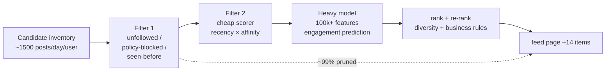

*The feed-ranking funnel: from ~1,500 daily candidate posts per user, cheap deterministic filters prune ~99% (unfollowed authors, policy-blocked content, already-seen items); a lightweight recency×affinity scorer orders the remainder; only then does the heavyweight engagement-prediction model (FBLearner Flow, 100k+ features) score the top candidates; finally diversity and business rules re-rank into the ~14-item page. Staged scoring keeps the sub-200 ms SLA even as model sophistication grows.*

#### Social Graph Storage — TAO

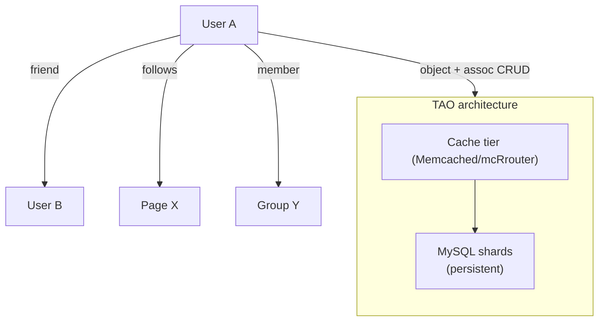

*TAO (The Associations and Objects) stores Facebook's social graph as typed associations `(id1, type, id2, time)`. The two-level design caches hot associations in a distributed Memcached fleet (regional clusters fronted by mcrouter) and falls back to MySQL shards for cold data — cache-through reads with cache-after-write invalidation. Bidirectional edges for symmetric relations (friends) have reverse-direction indexes materialized; feeds are stored as per-user association lists of post IDs, bounded in length and cursor-paginated. Sharding is by object id; associations are colocated by id1 for traversal locality; celebrity overlays are indexed separately. Cache hit rates exceed 99% for hot edges, sub-millisecond latency for cached reads, milliseconds for cold MySQL fallbacks.*

#### Hybrid Fan-out Strategy

**Two approaches, one hybrid reality:**

- **Fan-out on Write (Push):** `User posts → write to all followers' feed caches`. Pro: fast reads (precomputed feed). Con: celebrity problem (1M+ followers = 1M writes).
- **Fan-out on Read (Pull):** `User requests feed → query all friends' posts → rank → return`. Pro: no write amplification. Con: slow reads, high compute at read time.
- **Hybrid (Facebook's model):** Push for regular users (< ~10K friends/followers); pull for celebrities/pages (millions of followers). Pre-compute + merge at read time. The celebrity overlay index is consulted at read time so the Feed Service merges a small number of celebrity posts into the bulk-precomputed user segment. Thresholds are dynamic (~10K followers typical), and the system can temporarily reclassify a user as "power" mid-stream if a normal post suddenly goes viral (monitoring fan-out throughput per author).

Fan-out workers are partitioned by `author_id` hash; each handles fan-out for a disjoint subset of posts, and writes are idempotent (post IDs, not content — duplicates collapse under upsert semantics). Cassandra is used for durable, persistent feed entries (surviving cache loss); Memcached holds the hot, short-lived segment.

```mermaid
flowchart TB
    Create[Post created] --> Check{author follower count > threshold?}
    Check -- no --> Push[Push fan-out:<br/>post_id -> followers' feeds<br/>(Memcached + Cassandra)]
    Check -- yes --> Overlay[Add post_id to<br/>celebrity overlay index<br/>(pull at read time)]
    Push --> Q[(Scribe/Kafka events)]
    Overlay --> Q
    Read[Viewer GET feed] --> Merge[Merge precomputed<br/>feed segment +<br/>celebrity overlay]
    Merge --> Rank[Staged ranking + privacy]
    Rank --> Out[(feed page)]
```

*Facebook's hybrid fan-out: at write time, a post is classified by the author's follower count against a dynamic threshold. Below threshold, the Fan-out Service pushes the post ID into each follower's feed (Memcached hot segment + Cassandra durable store). Above threshold, the post ID is only added to a celebrity overlay index that the Feed Service merges in at read time — avoiding million-write amplification. Both paths emit to the Scribe/Kafka event backbone for observability and downstream consumption.*

#### Media Pipeline — Haystack / f4

Facebook's photo storage is a textbook case of workload-driven design defeating general-purpose filesystems.

- **Haystack insight:** traditional filesystems' per-file metadata lookups dominated photo-serving I/O. Collapsing per-photo metadata into an in-memory index over append-only log files made random photo reads **one disk operation** instead of many. Photos are appended to a handful of large "needles" in a haystack file; the in-memory index maps (volume, offset, length) → photo.
- **f4 (cold storage):** extends the idea to warm/cold content with **Reed-Solomon erasure coding**, halving storage again versus replication. f4 is suitable for photos that are old enough to be rarely accessed but must remain durable and recoverable.
- **Pipeline:** photos upload → resumable upload → virus scan → image processing (thumbnail ladders, face detection) → Haystack append + offset index → CDN. Videos are transcoded into multiple resolutions/bitrate ladders and chunked for adaptive streaming over the CDN.

This is the storage-economics lesson that directly funds the "free" product: per-byte cost engineering at petabyte scale.

#### Cache Architecture — Memcached fleet + mcrouter + leases

Facebook's cache fabric is itself a major paper:

- **Regional clusters:** clients → regional Memcached pool (per data center). mcrouter is the universal Memcached client/proxy sitting in front of the fleet, handling routing, failover, and pooling.
- **Lease mechanism:** on a cache miss, memcached grants a lease token valid ~48h to exactly one requester; others are told to wait-and-retry. When the winner repopulates the cache, concurrent sets carrying a stale CAS token are rejected. This deduplicates thundering herds AND prevents stale-clobber races in one primitive — it eliminated entire outage classes.
- **Invalidation daemons:** regional invalidation daemons propagate deletes cross-region within milliseconds, preserving coherence for the hot social-graph edges.
- **Cross-region serving:** writes are home-region-routed; cross-region reads hit replicas with documented staleness bounds.

#### Real-Time Updates

- **Connected clients:** WebSocket-like persistent channels carry new comments, reactions, and live likes to open apps within seconds.
- **Offline clients:** Notification Service pushes via APNs (iOS) / FCM (Android), with aggregation rules ("5 people liked your post" rather than five separate pushes) to tame burst amplification during viral moments.
- **Seen-state:** a bloom-filter-backed "already shown" service dedupes items so the same post isn't re-advertised to a viewer who already scrolled past it.

#### Observability & Abuse as first-class systems

- **Scuba:** Facebook's interactive, low-latency parallel query engine for ad-hoc analysis of trillions of events — used for real-time incident diagnosis (latency attribution per feed stage, cache-hit ratios per key class per region).
- **Scribe → Hive/Presto:** the durable log pipeline feeds petabyte-scale batch analytics for offline ML feature generation and ranking evaluation.
- **Integrity:** ML classifiers on content + behavior signals, velocity limits, reputation scoring that feeds ranking downweights; content-versioning so harmful posts can be quickly rolled back.

---

### Replication Strategies

Facebook replicates data across three dimensions: within a region (for availability), across regions (for global latency and durability), and across storage systems (for different access patterns).

**Leader-based replication (Post/Object store — MySQL/TAO):** Objects (users, posts, pages) are written to a primary MySQL instance and replicated to read replicas. Writes go only to the leader (home region); reads can be served from any replica. This gives strong consistency for mutations while allowing read scaling. TAO's cache tier sits in front: writes invalidate the cache; reads are cache-through with cache-after-write coherence.

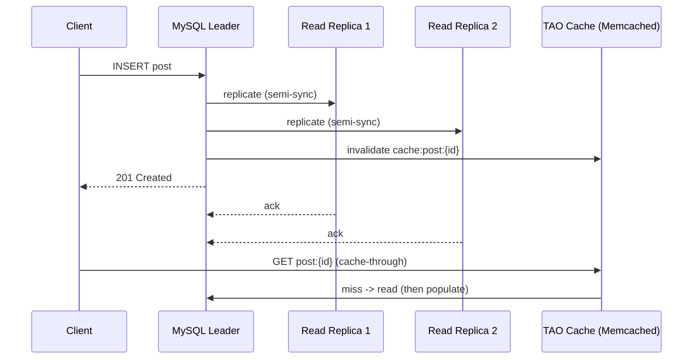

*Leader-based replication for TAO/MySQL objects: the client writes a post to the MySQL leader, which replicates semi-synchronously to read replicas and invalidates the corresponding Memcached cache entry. The client immediately reads through the cache; on a miss the cache falls through to the leader, populates, and serves. 201 Created is returned only after the write persists to leader + at least one replica, giving durability.*

**Leaderless / AP replication (Feed Cache — Memcached + Cassandra):** The Feed Store uses Memcached regional clusters with active-passive pairs and mcrouter failover, plus Cassandra for durable feed entries. Any master can accept writes (during failover); followers serve reads. Feed entries tolerate brief staleness (eventual consistency) — a post appearing 2–3 seconds late is acceptable.

**Multi-region replication:** Post/object store replicated synchronously within a region, asynchronously across regions. The Feed Store uses last-write-wins conflict resolution across regions for feed entries. Social graph edges are replicated to all regions for low-latency reads; invalidation daemons propagate deletes.

**Real-world use:** DynamoDB Global Tables for user-session and counter tables across regions; Cassandra for engagement data and durable feeds with tunable consistency; MySQL with semi-synchronous group replication for objects; Scribe/Kafka with per-partition replication for the event backbone.

---

### Failure Detection and Membership

Facebook's services must detect failed nodes, redistribute work, and keep serving with minimal disruption — across thousands of services and data centers.

**Gossip-based membership (Scribe/Kafka clusters):** Each instance periodically exchanges health information with a random subset of peers. Membership changes spread through the cluster in O(log N) rounds without a central coordinator — how Kafka controller election and Scribe cluster membership converge.

**Health checks:**

| Component | Check Interval | Timeout | Action |
|---|---|---|---|
| Post Service | 5s | 15s | Retry write; queue locally via Scribe spool |
| Feed Cache (Memcached) | 2s | 30s | Failover to replica; serve stale within lease window |
| Notification Service | 5s | 10s | Reconnect WebSocket; buffer notifications |
| TAO Graph | 3s | 15s | Route to replica; serve hot edges from cache |
| Kafka | 10s | 30s | Trigger consumer rebalancing; pause fan-out workers |
| Ranking Service | 5s | 10s | Trip circuit breaker; fall back to recency scoring |

**Circuit breakers:** For dependencies that are failing, a circuit breaker (Resilience4j in the Java control planes) trips after N consecutive failures and stops sending requests for a cool-down period. If the Ranking Service is slow, the Feed Service short-circuits and falls back to chronological/recency ordering; if the Social Graph is slow, fan-out queues work for later instead of saturating with slow requests.

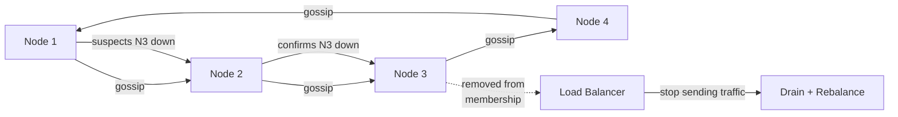

*Gossip-based failure detection in the Facebook service mesh: nodes periodically exchange health state with random peers. When a node suspects a peer is down, it propagates the suspicion via gossip; once confirmed by the cluster, the peer is removed from membership and the load balancer stops routing traffic to it — its responsibilities (fan-out partitions, cache slots) are rebalanced to healthy nodes.*

**Failure-detection timing for the fan-out pipeline specifically:** fan-out workers are partitioned by `author_id`; if the Kafka consumer group for a partition falls behind (>10s lag), the controller spins up additional workers and reassigns partitions. If a fan-out worker dies mid-batch, its uncommitted fan-out is retried from the Scribe/Kafka offset (idempotent upserts mean no duplicate feeds).

---

### High Availability and Scalability

Facebook deploys active services in at least 3 regions (e.g., US-East, US-West, EU/Ireland, plus APAC) serving tens of data centers. Users are routed to the nearest region via GeoDNS and latency-based load balancing; each region is self-sufficient for reads and writes, with asynchronous cross-region replication for durability.

- **Active-active for Feed Cache:** Memcached fleet with master/replica pairs per region; cross-region reads fall back to the nearest replica with documented ≤5s staleness. Regional invalidation daemons keep edges coherent.
- **Active-passive for object/post store:** Writes go to the user's home region; other regions serve stale-but-available replicas (minutes of lag at most during normal operation).
- **Global CDN:** Haystack/f4 media and static assets cached at edge PoPs worldwide — median photo reads in single-digit milliseconds, origin load near zero for popular content.
- **Auto-scaling (Kubernetes + Borg heritage):** Stateless services (Feed API, Ranking, Notification) scale by CPU and request latency via HPA-like controllers. Stateful services (Memcached, Cassandra, MySQL shards) scale by adding nodes/shards; Kafka partitions scale consumer groups automatically.
- **Fan-out workers:** scaled by Scribe/Kafka consumer-group lag — if `post_created` falls behind by >10,000 messages, the scheduler adds workers and rebalances partitions.

**Graceful degradation:**

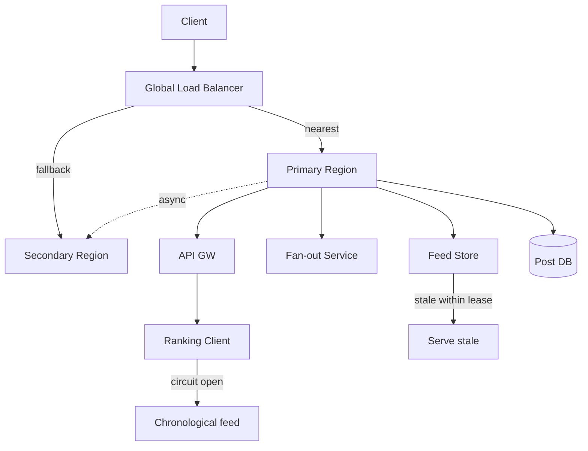

*Multi-region high availability and graceful degradation: a global load balancer routes clients to their nearest region, with a fallback region ready. Within a region, services degrade independently — if the Ranking Service circuit breaker trips, the Feed API serves a chronological feed; if the Feed Store loses a cache cluster, the lease mechanism allows stale serving within the lease window while a rebuild wave repopulates. The Post DB is active-passive per home region with async cross-region replication for durability.*

---

### Performance and Optimization

Performance for Facebook is measured by feed-read latency (p95 < 200 ms across global users) and the freshness of real-time delivery (seconds, not minutes), plus the economics of bytes/dollar served from storage and CDN.

**Latency optimization:**

- **Cache-first fan-out feeds:** Memcached regional cluster hit-ratio > 95% for active users; cold users read from Cassandra. Hot celebrity overlay index cached locally at the Feed Service.
- **Ranking pre-computation:** features computed hourly (offline Scuba/Hive batch) and stored in the feature store; only real-time signals (recency, live engagement) computed on-demand. The heavyweight engagement model scores only the top ~30 candidates, not the full inventory.
- **Connection pooling + pipelining:** persistent gRPC/HTTP connections between Feed API, Post Service, TAO, and the Ranking client avoid per-request handshake; Memcached pipelining batches fan-out writes.
- **Pipeline batch fetches:** fetching 50 posts' content is a single batched query, not 50 individual lookups. Speculative prefetch of the next page hides tail latency.

**Throughput optimization:**

- **Fan-out parallelization:** fan-out workers process Scribe/Kafka partitions in parallel; each worker owns one partition by `author_id` hash, enabling horizontal scale.
- **Read replicas:** post-content reads served from MySQL read replicas, multiplying DB read throughput.
- **CDN for media:** ~90% of served bytes on Facebook are media; edge caching removes that load from origin entirely.
- **Request coalescing / single-flight:** when many followers simultaneously request a viral post's content, exactly one DB/cache query is issued and the result shared across requests.

**Hot-key mitigation for viral posts:**

- **Key splitting with random suffixes:** `post:{id}:views:0 ... post:{id}:views:99` chosen at random write time, aggregated at read time.
- **CDN origin shield for viral media:** once a post crosses a read threshold, push its media to the CDN origin and serve all subsequent reads from edge.
- **Stale-while-revalidate:** serve cached content during rebuild so viral spikes never hit the origin.

**Write-path optimization:**

- **Async fan-out:** post creation returns 201 Created immediately after the home-region DB write; fan-out happens in Scribe/Kafka consumers asynchronously — keeping the publish budget < 50 ms.
- **Batch fan-out:** Fan-out Workers pipeline Memcached ZADD-like operations (batch 100 follower writes per pipeline).
- **Celebrity deferral:** power-user posts skip fan-out entirely and merge at read time — the single biggest write-amplification relief.

**Real-world use:** Instagram's feed uses Cassandra for precomputed feed entries with a Memcached cache layer; TikTok's "For You" uses pre-ranking at ingest time with real-time re-ranking at read time (a different but instructive contrast to the social-graph model).

---

### CAP Theorem and Consistency Trade-offs

The CAP theorem says that during a network partition, a distributed system can provide at most two of Consistency, Availability, and Partition tolerance. Facebook runs over wide-area networks, so partition tolerance is always required; the real choice is where to favor consistency vs. availability per subsystem.

**Feed Store — AP (Availability + Partition Tolerance):** The Feed Store prioritizes availability. If a Memcached cluster fails, followers' feeds are still served from replicas or fall back to chronological reconstruction from the Post Store. Feed entries may be briefly stale (a post appearing 2–3 seconds late) — acceptable because social feeds are inherently time-ordered. The lease mechanism even allows serving slightly stale-but-present entries during a rebuild.

**Post/DB Object Store — CP (Consistency + Partition Tolerance):** Post creation requires strong consistency: if the API returns 201 Created, the post must exist and be retrievable. Writes require acknowledgment from the leader + at least one replica (semi-synchronous) within the home region; only then is the Scribe event emitted for fan-out. A failed write never returns success.

**Social Graph (TAO) — AP with bounded staleness:** Graph edges (follows, friend-of, member-of) can be eventually consistent within a documented window (~1–5s within a region, longer cross-region). If user A follows B but the edge hasn't propagated to all regions, A might not see B's posts for a few seconds. The unfollow action must take effect immediately for privacy reasons — handled by a negative-cache with short TTL and immediate invalidation.

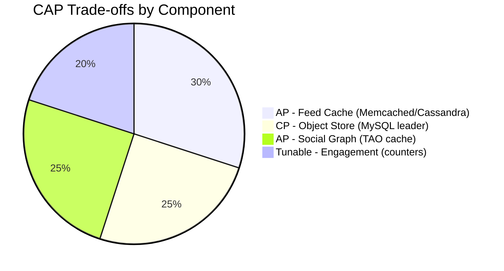

*CAP trade-offs across Facebook components: the Feed Cache is AP (availability-first) since brief staleness is acceptable; the Object Store is CP (consistency-first) since a returned 201 must mean the post is durable; the Social Graph cache is AP with bounded staleness; engagement counters use tunable consistency to balance speed and visibility.*

**Interview framing:** *Is Facebook strongly consistent or eventually consistent?* **A:** Pragmatic and per-subsystem: strongly consistent for writes users expect to be immediately visible (post creation, unfollows, privacy changes, friend edges via home-region primary with semi-sync) and eventually consistent for reads where slight staleness is acceptable (feed updates, like/comment counts, seen-state). This "strong-ish consistency with documented boundaries" is the key insight interviewers look for.

---

### Encryption and Key Management

Facebook stores highly sensitive user data — private messages, photos, the relationship graph, location history, and behavioral profiles. Encryption protects data at rest, in transit, and during processing.

#### Encryption at Rest

- **Object/media storage:** Haystack/f4 blobs encrypted at rest with per-object DEKs (Data Encryption Keys) wrapped by a KMS. Object store (S3-equivalent) uses SSE-KMS by default.
- **Database storage:** MySQL/TAO objects and Cassandra feed entries encrypted at the filesystem layer (TDE-style) and at rest via per-shard keys; Redis/Memcached in-memory data encrypted on eviction to swap.
- **End-to-end encrypted messages:** Messenger Secret Conversations use device-negotiated keys (Signal-protocol-style X3DH) that the server never sees — the server stores only encrypted blobs and routing metadata.

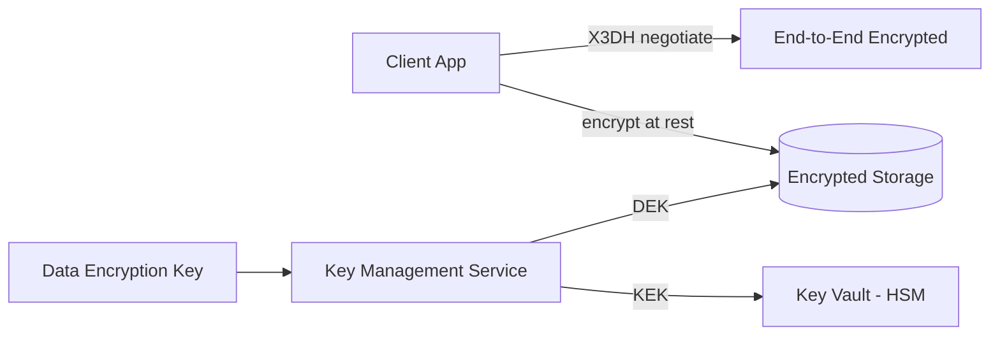

*Encryption at rest for Facebook-scale data: client-side end-to-end encryption protects private messages (the server never holds decryption keys); server-side encryption at rest protects stored objects using per-object DEKs managed by a KMS, with KEKs held in an HSM-backed key vault. Per-object DEKs mean a single key compromise exposes only one object, not the whole store.*

**Media encryption:** photos/videos uploaded are encrypted with per-object DEKs before storage. For content that must be AI-scanned for policy violations, the server decrypts media in a secure, isolated environment for analysis but never retains plaintext on disk afterward.

#### Encryption in Transit

All client-to-server and server-to-server traffic uses TLS 1.3 (minimum TLS 1.2). Inter-service communication within the data center uses mTLS (mutual TLS) for service-to-service authentication. Mobile SDKs pin the server certificate to prevent man-in-the-middle attacks. Internal traffic between data centers is also TLS-protected.

#### Key Management

- **Key hierarchy:** a KEK (Key Encryption Key) in an HSM encrypts per-object or per-user DEKs. Rotating the KEK requires only re-encrypting the DEKs, not the data — a cheap operation.
- **Key rotation:** KEKs rotated quarterly; per-user message keys rotated monthly (with key exchange via Signal protocol for E2E); DEKs rotated per-object creation.
- **Multi-region KMS:** keys available in all deployment regions; the KMS replicates keys automatically with multi-region HA.

---

### Authentication and Authorization

Facebook must verify who is connecting (authentication), determine what they can do (authorization), and enforce privacy (who can see whose content). Every request to every service must carry authenticated credentials.

#### Authentication Methods

- **OAuth 2.0 + JWT:** users authenticate via a third-party provider (Google, Apple) or email/password. The Auth Service issues a short-lived JWT (~1-hour) and a refresh token (~60 days, rotating). The JWT carries user id, scopes, and expiry.
- **Session tokens:** for web, a server-side session token in an HttpOnly, Secure, SameSite=Strict cookie. The session store (Memcached) maps token → user_id and supports revocation.
- **MFA (Multi-Factor Authentication):** required for high-privilege actions (password change, email update, monetization setup). TOTP via authenticator app or SMS backup.
- **Certificate-based auth:** service-to-service via mTLS certificates issued by a private CA — no shared secrets between services.
- **Login alerts & anomaly detection:** new device, new location, unusual time trigger step-up auth (push approval or SMS code).

#### Authorization Models

- **Scope-based (OAuth 2.0 scopes):** each token carries scopes like `posts:read`, `posts:write`, `friends:write`, `notifications:read`, `groups:write`. The API Gateway enforces scope checks before routing.
- **Role-based (RBAC):** users have roles (`user`, `moderator`, `admin`). Moderators can delete posts and ban users; admins manage platform settings.
- **Resource-level privacy:** each post carries a privacy audience (`EVERYONE`, `FRIENDS`, `FRIENDS_OF_FRIENDS`, `CUSTOM`, `ONLY_ME`). The Feed Service checks the viewer's relationship to the author before including the post; private-account posts require the viewer to be an approved follower.
- **Content moderation flags:** posts flagged by AI or users are held for review under a `moderation:read` scope.

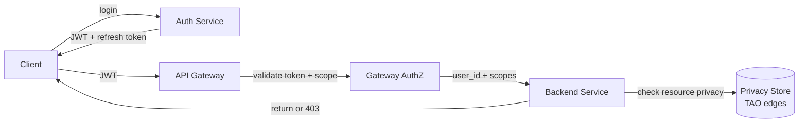

*Authentication and authorization flow at Facebook: the client authenticates via the Auth Service (social SSO or email/password+MFA), receives a short-lived JWT plus a rotating refresh token; the API Gateway validates the JWT signature and checks OAuth scopes before forwarding to backend services; each service performs resource-level privacy checks (who can see this post) against the TAO social graph before returning data. Privacy is enforced in the data-access layer, not trusted to the client.*

#### Post Privacy Check (Spring Boot, enforcement in the data layer)

```java
@Service
@RequiredArgsConstructor
public class PrivacyService {

    private final TaosGraphClient graphClient;

    /**
     * Enforce Facebook-style audience visibility server-side, in the
     * data-access layer (never on the client). Mirrors TAO's
     * resolve-audience-against-viewer-context semantics.
     */
    @Transactional(readOnly = true)
    public boolean canView(long viewerId, Post post) {
        Audience audience = post.privacy();
        if (audience == Audience.EVERYONE) return true;
        if (audience == Audience.ONLY_ME) return viewerId == post.authorId();
        if (audience == Audience.FRIENDS)
            return graphClient.areFriends(viewerId, post.authorId());
        if (audience == Audience.FRIENDS_OF_FRIENDS)
            return graphClient.areFriends(viewerId, post.authorId())
                || graphClient.haveMutualFriend(viewerId, post.authorId());
        if (audience == Audience.CUSTOM)
            return graphClient.inAllowlist(viewerId, audience.allowlist());
        return false;
    }
}
```

*The `PrivacyService` bean enforces Facebook's audience-visibility model inside the data-access layer using `@Transactional(readOnly = true)`. A Java enum switch over the `Audience` privacy setting: public posts are always visible; friend-only posts require a mutual-friends check via TAO; custom audiences consult an allowlist. By keeping this single enforcement point, the system guarantees no cached or precomputed feed entry can leak to an unauthorized viewer, even after policy changes — correctness outranks microsecond cache wins.*

---

### Security Threats and Mitigations

#### Threat: Coordinated Inauthentic Behavior / Fake Accounts

- **Risk:** networks of fake accounts amplify misinformation, manipulate trends, and run scams, eroding trust and inviting regulation.
- **Mitigation:** ML classifiers on account-creation signals (IP velocity, phone-number sharing, behavioral fingerprints, device graphs); velocity limits on follows/friending; early-post quarantine for new accounts; reputation scores that down-rank unknown authors in the feed; regular purges of networks identified by coordinated activity patterns.

#### Threat: Data Scraping and Graph Enumeration

- **Risk:** bots scrape public content, the follower graph, and profile data for surveillance, competitive intelligence, or training generative models.
- **Mitigation:** per-API-key rate limiting backed by a Redis token bucket; authentication required for any endpoint returning user data; a Bloom filter caches recently requested keys and rejects repeated misses from the same client; known scraping user-agents and ASNs blocked at the edge; the Graph API intentionally does **not** expose arbitrary 2-hop traversals (no "friends-of-friends" enumeration at scale).

#### Threat: DDoS on Hot Content

- **Risk:** a trending hashtag or a post going viral generates DDoS-like traffic that overwhelms feed-cache shards or origin services.
- **Mitigation:** CDN caching for all media; per-IP and per-user rate limiting; key splitting for counters (`post:{id}:views:{rand(0..99)}`); circuit breakers on the Feed API to shed load when the Post Store is slow; lease-based single-flight for cache rebuilds.

#### Threat: Account Takeover

- **Risk:** credential stuffing, stolen passwords, or session hijacking let an attacker post malicious content from a trusted account.
- **Mitigation:** enforce 2FA for all users with >1,000 followers (and for all users at any threshold in high-risk regions); rate-limit login attempts (5 per IP per hour); CAPTCHA after 3 failed attempts; invalidate all sessions on password change; monitor for anomalous login patterns (new device, new location, unusual time).

#### Threat: Content Poisoning / Misinformation

- **Risk:** a compromised account posts hate speech, misinformation, or phishing links that propagate through the feed before being caught.
- **Mitigation:** AI moderation on every post at upload time; velocity throttling for sudden behavioral changes (posting-frequency spikes, new content types); new accounts' first posts held for review; content versioning so harmful posts can be quickly rolled back; distribution throttling (reduced edge_weight) for posts flagged but not yet removed.

#### Threat: Privacy Violations / Leaks

- **Risk:** accidental exposure of private posts, location data, or the full follower graph; a misconfigured API endpoint leaks another user's private data.
- **Mitigation:** defense-in-depth — every service checks resource-level privacy (not just the API Gateway); audit logs of every data access; data minimization (don't return fields the user doesn't need); regular penetration testing of API endpoints; the privacy check is always server-side in the data-access layer.

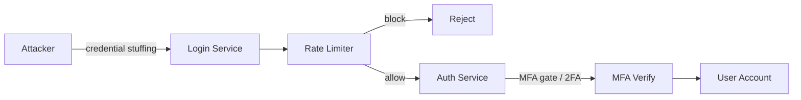

*Account-takeover layered defense: the attacker attempts credential stuffing against the login service; a rate limiter (per-IP, per-user token bucket) blocks over-threshold traffic; surviving attempts hit the MFA gate, requiring a second factor (authenticator push/SMS/TOTP) before granting access. Even with a leaked password, the attacker cannot proceed without the second factor — this is why 2FA for high-follower accounts is mandatory.*

---

### Observability and Logging

Facebook generates massive telemetry. Observability covers the fan-out pipeline, feed serving, real-time delivery, ranking health, and integrity signals — across data centers.

#### Key Metrics

- **Fan-out lag:** milliseconds between post creation (Scribe event) and feed availability. Alert if lag > 5s for normal users, > 30s for celebrities.
- **Feed read latency:** p50 < 100 ms, p95 < 200 ms, p99 < 500 ms. Tracked by user tier (active vs. cold).
- **Cache hit ratio:** Feed Store > 95% for active users; TAO graph edges > 99%.
- **Real-time delivery:** percentage of notifications/likes/comments delivered to connected clients within 5 seconds, by channel (WebSocket vs. push).
- **Engagement KPIs:** impressions per feed, CTR on media, likes/comments/shares per post.
- **Integrity metrics:** spam prevalence estimates, false-positive/negative rate of moderation classifiers, fake-account detection recall.
- **Ranking health:** feature freshness age (how stale are the precomputed features?), model serving latency, AUC of engagement prediction.
- **Error budgets:** 5xx per service, Scribe consumer errors, Memcached connection failures.

#### Logging

- **Access logs:** every API request logged with user id, endpoint, response code, latency, and the experiment cohort — audit trail + anomaly detection.
- **Event logs:** all user actions (post, like, comment, follow, share) emitted as structured events to Scribe for analytics and ML feature generation.
- **Error logs:** service errors with `trace_id`/`span_id` correlation for cross-service tracing; fan-out failures logged with follower count for capacity planning.
- **Audit logs:** all privacy/audience changes (making a post public/private), account settings changes, and admin actions logged with before/after state — required for compliance.

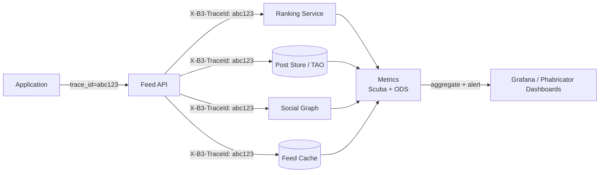

*Distributed tracing: each user request carries a trace ID propagated across all downstream calls (Feed API → Ranking, Post Store, Social Graph, Feed Cache). Every service records spans with timing. Spans aggregate in the metrics backend (Scuba for ad-hoc, ODS for continuous signals) and feed user-visible SLO dashboards and alerting — enabling per-stage latency attribution across the 6+ backend dependencies that make up a feed read.*

#### Alerting Strategy

- **Critical (page immediately):** Feed API p99 > 500 ms for 5 min; fan-out lag > 60s; Post Store or TAO unavailable; Scribe/Kafka consumer group down; cache-cluster loss.
- **Warning (Slack, no page):** cache hit ratio < 90%; real-time delivery rate < 95%; ranking serving latency > 100 ms; Kafka lag > 10,000; integrity recall dropping.
- **Info (dashboard only):** engagement-metric anomalies, new-user growth trends, media-processing queue depth, abuse prevalence.

---

### Real-World Implementations

Facebook's production stack is a mix of proprietary systems (TAO, Haystack, f4, Scribe, Scuba) and well-chosen OSS components. Each maps to a layer of the design.

#### TAO (The Associations and Objects) — Social Graph

Facebook's social graph (friendships, likes, comments, page follows, group memberships — over 1 trillion associations) is stored in TAO, a custom graph store built on MySQL. TAO caches hot associations in RAM (Memcached, regional clusters fronted by mcrouter) and falls back to MySQL for cold misses. Reads are sub-millisecond for cached edges because the social graph is among the most-read data in Facebook. Writes go to MySQL first (durability), then invalidate the cache. TAO uses lazy loading — it only loads associations when specifically requested, never the entire graph for a user. **Companies:** Facebook, Instagram, WhatsApp (post-acquisition sharing of infrastructure).

#### Haystack / f4 — Photo & Video Storage

- **Haystack:** collapses per-object filesystem metadata lookups into an in-memory index over append-only log files, making random photo reads a single disk operation. A famous storage-economics case study.
- **f4:** extends the approach to warm/cold content with Reed-Solomon erasure coding, halving storage versus replication and making "free" photo storage at petabyte scale economically viable.
- **Companies:** Facebook (Photos, Videos), Instagram (post-acquisition).

#### Memcached fleet + mcrouter + leases — Cache Fabric

- **Memcached:** regional clusters absorb the read storm; the lease mechanism (48-hour lease token, CAS rejection) eliminated cache-stampede and stale-clobber outages; cross-region invalidation daemons propagate deletes.
- **mcrouter:** the universal Memcached client/proxy routing, failover, and pooling in front of the fleet.
- **Companies:** Facebook (entire stack), Instagram, WhatsApp, Oculus, Twitter (mcrouter open-sourced).

#### Scribe → Hive / Presto / Scuba — Event & Analytics Backbone

- **Scribe:** hierarchical, durable log aggregation carrying every `post_created`, `edge_added`, `like_added` event.
- **Hive / Presto:** petabyte batch analytics for offline ML feature generation and ranking evaluation.
- **Scuba:** interactive, low-latency parallel query engine for ad-hoc diagnosis (real-time incident attribution, cache-hit analysis, fan-out lag distributions).
- **Companies:** Facebook (all of the above); Presto/Trino widely adopted OSS.

#### Cassandra — Durable Feed Store

Used for persistent, durable feed entries that survive Memcached cluster loss; tuned consistency for the AP trade-off; vnode-based partitioning for smooth scaling. **Companies:** Instagram (feed, post-acquisition), some FB features migrated off MySQL.

#### MySQL / WebScaleSQL / MyRocks — Object & Post Store

The durable backing store for objects (users, posts, pages) and TAO's persistent tier, customized with WebScaleSQL/MyRocks storage engine. Semi-synchronous replication within region, async cross-region. **Companies:** Facebook (core), Instagram, WhatsApp (post-acquisition).

#### DynamoDB / CloudFront — Auxiliary Stores

DynamoDB-style tables power counters (real-time like/view counts), session tokens, and rate-limit counters; the CDN serves all media at edge PoPs. **Companies:** Meta's AWS-side tooling, plus extensive internal CDN (Akamai partnerships historically, now Meta's own edge).

#### Twitter's Fan-out Evolution (contrast)

Twitter originally used pure fan-out-on-write (every tweet to every follower's Redis timeline). When celebrities with millions of followers joined, this broke — tens of millions of Redis writes per second for a single tweet. Twitter evolved to a **hybrid approach**: normal users push immediately; power users' tweets are stored and merged into timelines at read time. The threshold is dynamic. This validates the fan-out economics that Facebook's architecture already encoded.

#### Instagram (post-acquisition reuse)

Instagram adopted Facebook's infrastructure (TAO, Memcached, Haystack, Scribe, Scuba) wholesale. Their feed-ranking publications show the same patterns applied to an interest-graph (followed hashtags/pages) rather than a pure friendship graph — illustrating how the canonical architecture generalizes across "social shapes."

---

### Java and Spring Boot Implementation Guide

This Spring Boot service demonstrates Facebook's core posting and feed pipeline: hybrid fan-out, staged ranking, server-side privacy enforcement, and async event-driven fan-out. It showcases `@Service`, `@RestController`, `@Repository`, `@Component`, `@Value`, records for DTOs, `@Valid`, `@ControllerAdvice`, constructor injection, `@Transactional`, `@Version`, and Resilience4j circuit breakers.

#### 1. DTO Records

```java
public record CreatePostRequest(
        @NotBlank String message,
        List<String> attachedMedia,
        @NotBlank Audience privacy,
        String placeId) {}

public record FeedPage(
        List<PostCard> posts,
        String cursor,
        boolean hasMore,
        long clientTimeMs) {}

public record PostCard(
        String postId,
        String authorId,
        String authorName,
        String message,
        List<MediaDto> media,
        Instant createdAt,
        int likeCount,
        int commentCount,
        UserReaction userReacted,
        double rankScore) {}

public record MediaDto(String type, String url) {}

public enum Audience { EVERYONE, FRIENDS, FRIENDS_OF_FRIENDS, CUSTOM, ONLY_ME }
public enum UserReaction { NONE, LIKE, LOVE, WOW, CARE, HAH, SAD, ANGRY }
```

*DTOs mirror Facebook's Graph API contract: `CreatePostRequest` is the POST body with `@NotBlank`/`@NotBlank`/enum validation enforced by `@Valid`; `FeedPage` wraps the paginated result with a cursor and client timestamp; `PostCard` is the enriched post returned to clients with rank score and the viewer's reaction; `MediaDto` carries media type and CDN URL. Enums encode audience visibility and reaction types.*

#### 2. Post Entity with Optimistic Locking

```java
@Entity
@Table(name = "posts", indexes = {
        @Index(name = "idx_author_created", columnList = "authorId, createdAt"),
        @Index(name = "idx_audience", columnList = "audienceMask")
})
public class Post {

    @Id
    private String postId;

    private String authorId;
    private String message;
    private Audience audience;
    private String placeId;

    @Version
    private Long version;            // optimistic locking for concurrent like/comment updates

    private Instant createdAt;

    @Column(name = "like_count")
    private int likeCount = 0;
    @Column(name = "comment_count")
    private int commentCount = 0;

    @ElementCollection
    private List<String> mediaUrls = new ArrayList<>();

    public void react(UserReaction r) { /* increment counters, guard under version */ }
}
```

*The `Post` entity maps to the `posts` table with a composite index on `(authorId, createdAt)` for timeline queries and an index on `audienceMask` for audience resolution. The `@Version` field enables JPA optimistic locking — concurrent updates to like/comment counts fail fast with `OptimisticLockException`, preventing lost updates. The `react()` domain method mutates counts under the version guard.*

#### 3. Feed Merge Service (hybrid fan-out — preserving existing design)

```java
@Service
@RequiredArgsConstructor
public class FeedService {

    private final FeedCacheRepository feedCache;
    private final CelebrityIndexRepository celebrityIndex;
    private final RankingClient ranker;
    private final PrivacyService privacy;

    private static final int CANDIDATE_LIMIT = 50;
    private static final int CELEBRITY_LIMIT = 10;

    public FeedPage getFeed(long userId, String cursor, int pageSize) {
        List<FeedItem> candidates = new ArrayList<>(
                feedCache.recent(userId, CANDIDATE_LIMIT));
        candidates.addAll(celebrityIndex.followedRecent(userId, CELEBRITY_LIMIT));

        List<FeedItem> visible = candidates.stream()
                .filter(item -> privacy.canView(userId, item.postId()))
                .toList();

        RankedItems ranked = ranker.rank(userId, visible, RequestContext.now());
        return ranked.page(cursor, pageSize);
    }
}
```

*The `FeedService` bean implements Facebook's hybrid feed merge: it reads the precomputed feed segment from the user's hot cache (`_feedCache.recent`), appends recent celebrity/overlay posts (`celebrityIndex.followedRecent`, the read-time merge path), applies **server-side privacy filtering** via `PrivacyService` (a single enforcement point that can't be bypassed by the client), and finally stages the candidates through the ranking client. This composes the push (normal users) and pull (celebrity) paths in one read-time merge.*

#### 4. Fan-out Worker (preserving existing design, Facebook-flavored)

```java
@Component
@RequiredArgsConstructor
public class FanoutWorker {

    private static final long CELEBRITY_THRESHOLD = 10_000L;

    private final TaosGraphClient graph;
    private final FeedCacheRepository feedCache;
    private final CelebrityIndexRepository celebrityIndex;

    @EventListener
    @Async
    public void onPostCreated(PostCreatedEvent evt) {
        if (graph.followerCount(evt.authorId()) > CELEBRITY_THRESHOLD) {
            // Celebrity/page: skip write-time fan-out; Feed Service merges at read time.
            celebrityIndex.add(evt.authorId(), evt.postId());
            return;
        }
        // Normal user: batched prepend across follower pages (idempotent upserts).
        var cursor = graph.followersOf(evt.authorId(), /* batchSize */ 1000);
        while (!cursor.isEmpty()) {
            feedCache.prependAll(cursor.ids(), evt.postId());
            cursor = cursor.next();
        }
    }
}
```

*The `FanoutWorker` bean is the async write-time path, triggered by Spring's `@EventListener` on a `PostCreatedEvent` (published from the Post Service). It consults TAO's follower count; above the 10K celebrity threshold it writes only to the read-time overlay index; below it it walks the follower list in pages and prepends the post ID to each follower's feed cache. Writes are idempotent (post ID as a sorted-set/zset member — duplicate writes collapse), so retries from Scribe/Kafka at-least-once delivery never produce duplicate feeds.*

#### 5. REST Controller with Validation

```java
@RestController
@RequestMapping("/api/v1")
@RequiredArgsConstructor
public class SocialController {

    private final PostService postService;
    private final FeedService feedService;

    @PostMapping("/{userId}/feed")
    public ResponseEntity<PostCard> createPost(
            @AuthenticationPrincipal UserDetails user,
            @PathVariable String userId,
            @Valid @RequestBody CreatePostRequest request) {
        if (!user.getId().equals(userId))
            throw new ForbiddenException("Cannot post to another user's feed");
        var saved = postService.createPost(userId, request);
        return ResponseEntity.created(URI.create("/api/v1/" + userId + "/feed/" + saved.postId()))
                .body(saved);
    }

    @GetMapping("/me/feed")
    public ResponseEntity<FeedPage> getFeed(
            @AuthenticationPrincipal UserDetails user,
            @RequestParam(defaultValue = "25") int limit,
            @RequestParam(defaultValue = "true") boolean ranked,
            @RequestParam(required = false) String after) {
        var page = feedService.getFeed(Long.parseLong(user.getId()), after, limit);
        return ResponseEntity.ok(page);
    }
}
```

*The `SocialController` uses `@RestController` (combining `@Controller` + `@ResponseBody`), constructor injection via `@RequiredArgsConstructor`, and `@Valid` bean validation (enforcing `@NotBlank`/`Audience` constraints). `@AuthenticationPrincipal` injects the authenticated user from the Spring Security context. The POST returns `201 Created` with a `Location` header; the GET serves the hybrid-merged, ranked, privacy-filtered feed.*

#### 6. Repository Layer (TAO-style cache-through)

```java
@Repository
@RequiredArgsConstructor
public class TaosGraphRepository {

    private final RedisTemplate<String, String> redis;   // L1 cache tier
    private final JdbcClient jdbc;                       // MySQL persistent tier

    @Value("${app.graph.cache-ttl-seconds:300}")
    private int cacheTtlSeconds;

    /** Follower list with cache-then-DB fallback (TAO cache-through). */
    public List<Long> getFollowers(long userId, int limit) {
        var key = "graph:followers:" + userId;
        var cached = redis.opsForList().range(key, 0, limit - 1);
        if (cached != null && !cached.isEmpty()) return cached.stream().map(Long::parseLong).toList();

        var followers = jdbc.sql(
                "SELECT id1 FROM associations WHERE id2 = ? AND type = 'friend' " +
                "ORDER BY time DESC LIMIT ?")
                .param(userId).param(limit).query(Long.class);
        if (!followers.isEmpty()) {
            redis.opsForList().leftPushAll(key, followers.stream().map(String::valueOf).toList());
            redis.expire(key, Duration.ofSeconds(cacheTtlSeconds));
        }
        return followers;
    }

    /** Edge existence check — O(1) cache set membership. */
    public boolean areFriends(long a, long b) {
        var key = "graph:edge:" + a + ":" + b;
        if (redis.hasKey(key)) return true;
        var n = jdbc.sql(
                "SELECT COUNT(*) FROM associations WHERE id1=? AND id2=? AND type='friend'")
                .param(a).param(b).query(Integer.class);
        if (n > 0) redis.opsForValue().set(key, "1", Duration.ofSeconds(cacheTtlSeconds));
        return n > 0;
    }
}
```

*The `TaosGraphRepository` bean mirrors TAO's cache-through design: the follower list is served from a Redis (Memcached in production) L1 cache with a configurable TTL injected via `@Value`, falling back to a sharded MySQL `associations` table `(id1, type, id2, time)` on miss and repopulating the cache. Edge-existence checks use O(1) set membership in cache. Note the symmetric-edge handling: both directions of a friendship are indexed so "who are my friends" and "who are my followers" resolve in one lookup.*

#### 7. Ranking Service with `BigDecimal` Scoring (staged EdgeRank)

```java
@Service
@RequiredArgsConstructor
public class RankingService {

    private final FeatureStoreClient features;
    private final CircuitBreaker cb;   // Resilience4j — fall back to recency

    private static final BigDecimal W_RECENCY  = new BigDecimal("0.30");
    private static final BigDecimal W_AFFINITY = new BigDecimal("0.25");
    private static final BigDecimal W_ENGAGEMENT = new BigDecimal("0.25");
    private static final BigDecimal W_CONTENT  = new BigDecimal("0.10");
    private static final BigDecimal W_RELATIONSHIP = new BigDecimal("0.10");

    @Transactional(readOnly = true)
    public List<PostCard> rank(long userId, List<FeedItem> candidates) {
        return cb.executeSupplier(() ->
                candidates.stream()
                        .map(item -> {
                            var f = features.get(userId, item.postId());
                            var score = W_RECENCY.multiply(f.recency())
                                    .add(W_AFFINITY.multiply(f.affinity()))
                                    .add(W_ENGAGEMENT.multiply(f.engagementPred()))
                                    .add(W_CONTENT.multiply(f.contentType()))
                                    .add(W_RELATIONSHIP.multiply(f.relationship()));
                            return new ScoredItem(item, score);
                        })
                        .sorted(Comparator.<ScoredItem>comparing(ScoredItem::score).reversed())
                        .map(ScoredItem::item)
                        .toList())
                .orElseGet(() -> recencyFallback(candidates));
    }

    private List<PostCard> recencyFallback(List<FeedItem> items) {
        return items.stream()
                .sorted(Comparator.comparing(FeedItem::insertedAt).reversed())
                .map(FeedItem::toCard)
                .toList();
    }

    record ScoredItem(FeedItem item, BigDecimal score) {}
}
```

*The `RankingService` bean computes the EdgeRank-style staged score using `BigDecimal` arithmetic for numerical precision (avoiding floating-point drift across 100K+ features). The weights — recency 30%, affinity 25%, engagement prediction 25%, content type 10%, relationship 10% — mirror Facebook's published funnel. A Resilience4j `CircuitBreaker` wraps the feature store call; if it's open (degraded), the service degrades gracefully to a reverse-chronological recency fallback — exactly the graceful-degradation pattern the architecture describes. The local record `ScoredItem` pairs each item with its score for sorting.*

#### 8. Controller Advice for Global Error Handling

```java
@ControllerAdvice
public class GlobalExceptionHandler {

    @ExceptionHandler(PostNotFoundException.class)
    public ResponseEntity<ApiError> handleNotFound(PostNotFoundException ex) {
        return ResponseEntity.status(HttpStatus.NOT_FOUND)
                .body(new ApiError(HttpStatus.NOT_FOUND, ex.getMessage()));
    }

    @ExceptionHandler(ForbiddenException.class)
    public ResponseEntity<ApiError> handleForbidden(ForbiddenException ex) {
        return ResponseEntity.status(HttpStatus.FORBIDDEN)
                .body(new ApiError(HttpStatus.FORBIDDEN, ex.getMessage()));
    }

    @ExceptionHandler(MethodArgumentNotValidException.class)
    public ResponseEntity<ApiError> handleValidation(MethodArgumentNotValidException ex) {
        var msgs = ex.getBindingResult().getFieldErrors().stream()
                .map(FieldError::getDefaultMessage).toList();
        return ResponseEntity.badRequest()
                .body(new ApiError(HttpStatus.BAD_REQUEST, "Validation: " + String.join(", ", msgs)));
    }

    @ExceptionHandler(OptimisticLockException.class)
    public ResponseEntity<ApiError> handleConflict(OptimisticLockException ex) {
        return ResponseEntity.status(HttpStatus.CONFLICT)
                .body(new ApiError(HttpStatus.CONFLICT, "Concurrent update. Please retry."));
    }

    public record ApiError(HttpStatus status, String message) {}
}
```

*The `GlobalExceptionHandler` bean (`@ControllerAdvice`) centralizes exception handling so controllers stay clean of try/catch boilerplate. It maps `PostNotFoundException` → 404, `ForbiddenException` → 403 (authorization/audience denial), `MethodArgumentNotValidException` → 400 with field-level messages from `@Valid`, and `OptimisticLockException` → 409 (raised by `@Version` on concurrent like/comment updates). Every error returns a structured `ApiError` record.*

**Testability notes:** a Testcontainers suite asserts (a) celebrity posts are excluded from write-time fan-out (only the overlay index is written), (b) `PrivacyService.canView` returns false for out-of-audience viewers across all `Audience` enums, and (c) feed merge ordering is stable under pagination. Fan-out integration tests assert no duplicate feed entries on retried `PostCreatedEvent`s (idempotent upserts).

---

### Interview Questions and Answers

A curated set of interview questions organized by difficulty, focused on Facebook-scale social platform design.

---

#### Beginner

1. **Push vs pull feeds — when does each win? What is the celebrity problem?**
   **A:** Push (write-time fan-out) writes the post to every follower's feed at post time — fast reads, expensive writes; wins when reads vastly outnumber writes and follower counts are moderate. Pull (read-time merge) fetches followed authors' posts at read time — cheap writes, expensive reads; wins for power users with millions of followers (the "celebrity problem": one post ⇒ 10M writes under pure push). Facebook/Twitter use hybrid: push below a ~10K follower threshold, pull above it; the post id enters a read-time overlay index for celebrities, and the Feed API merges precomputed feeds with the overlay at read time.

2. **Why does the social graph deserve its own store instead of relational tables?**
   **A:** The workload is overwhelmingly small-bounded traversals (friends-of-user, likes-of-post, mutual-friends) at extreme QPS — exactly what Facebook built TAO for. An adjacency-list cache (hot edges in Memcached/mcache) backed by simple shardable MySQL persistence serves these patterns faster and more predictably than generic join planning. Generic SQL tables also struggle to express typed associations `(id1, type, id2, time)` and bidirectional symmetric-edge indexes efficiently.

3. **What is EdgeRank, and how has feed ranking evolved?**
   **A:** Original EdgeRank = `f(affinity, edge_weight, time_decay)`: how close the poster is to you, the content type weight, and how recent. It evolved into a **staged funnel**: candidate generation (push feeds + celebrity pulls + inventory) → cheap filters prune ~99% (unfollowed/policy-blocked/seen-before) → lightweight scorer → heavyweight engagement-prediction ML model (FBLearner Flow, 100K+ features) ranks the top ~30 → business/diversity re-rank into the ~14-item page. The key insight: never run the heavy model over raw inventory — stage and prune first.

4. **How are billions of photos stored and served efficiently?**
   **A:** Facebook's Haystack stores photos as "needles" in append-only haystack files with an in-memory index. The key insight: traditional filesystems' per-file metadata lookups dominated photo-serving I/O. Collapsing metadata into a memory-resident index over append-only logs made random photo reads a single disk operation. f4 extends this to cold content with Reed-Solomon erasure coding, halving storage again. Photos are edge-cached on the CDN for sub-10 ms reads.

5. **What is the cache-stampede problem, and how does Facebook's lease mechanism solve it?**
   **A:** When a hot key expires, thousands of simultaneous requests miss the cache and hit the DB at once — a stampede. The lease mechanism: on a miss, Memcached grants a lease token valid ~48h to exactly one requester; others get told to wait-and-retry. The winner repopulates the cache; concurrent late `set`s carrying a stale CAS token are rejected. This deduplicates the herd AND prevents stale-clobber races in one primitive — it eliminated entire outage classes.

---

#### Intermediate

6. **Walk through a fan-out failure scenario and its mitigations.**
   **A:** Fan-out falls behind during a viral post. Mitigations: (1) idempotent upserts (post ID as ZSET/zset member — duplicates collapse, retries are safe); (2) Scribe/Kafka consumer-group rebalancing adds workers automatically as lag grows; (3) partitioned by `author_id` hash so each worker owns disjoint users; (4) backlog drained gradually with backpressure to the producer; (5) hot-key leases prevent cache-stampede cascades when the rebuilt feeds go hot again. Fan-out lag is visible as delayed appearance (SLO alarms fire before users notice).

7. **How do you keep privacy enforcement correct when caches serve feeds?**
   **A:** Checks happen at serve-time against current policy state, never baked into cached artifacts. Facebook's `PrivacyService` resolves the post's audience mask against the viewer's relationship to the author (EVERYONE / FRIENDS / FOF / CUSTOM / ONLY_ME) inside the data-access layer — one enforcement point beats N hopeful call-sites. Policy changes invalidate affected cache entries promptly (regional invalidation daemons). Accept the CPU cost — correctness here outranks microsecond cache wins.

8. **What breaks first when a celebrity posts during a live event, in order?**
   **A:** (1) Notification fan-out bursts — defended by aggregation ("5 people liked your post") and batching; (2) counter increments — sharded counters (`post:{id}:likes:{0..99}`); (3) comment ingestion for that post — dedicated lanes / partitioned by post_id; (4) media CDN origin for the attached photo/video — pre-warmed via origin shield and edge caching. Sequencing awareness demonstrates operational maturity.

9. **How do you handle the N+1 query problem in fan-out-on-read?**
   **A:** Two solutions at Facebook scale: (1) the celebrity overlay index is itself a precomputed store, so the Feed API fetches at most ~10 celebrity posts per followed power user in a single batched read — not N per follower; (2) candidate-generation limits total candidates (e.g., 50) before ranking, so the heavy model never runs over an unbounded set. For the rare pure-pull path, collect followed author IDs and issue a single `SELECT ... WHERE author_id IN (...)` rather than per-author queries.

10. **How is the 200 ms feed latency budget spent and protected?**
    **A:** Breakdown: edge/API routing ~20 ms; Memcached feed-read ~30 ms; celebrity overlay merge ~10 ms; batched Post Store fetch (parallel, ~50 ms); staged ranking (light scorer ~30 ms + heavy model ~80 ms only over ~30 candidates); serialization ~20 ms. Protected by: cache-first (95%+ hit ratio), feature pre-computation (hourly), low-dimensional embeddings, request coalescing / single-flight, and circuit-breaker fallback to chronological ranking when the ranker brownouts.

---

#### Advanced

11. **Design feed ranking end-to-end: features, funnel, freshness.**
    **A:** Candidate sources (pushed feeds + celebrity pulls + group/inventory expansion) → cheap filters (seen-before, unfollowed, policy-blocked, language) → light scorer (recency × affinity) → heavyweight engagement-prediction model (deep net over embeddings + 100K features in FBLearner Flow). Features: affinity embeddings, content-type weights, recency decay, integrity/safety scores, past engagement rates. Freshness: streaming real-time features (live like/comment counts) feed into Redis-backed feature store with a staleness budget (e.g., < 5 min for live signals); guardrails (session-success metrics) run alongside CTR objectives so ranking doesn't optimize to short-term dopamine at the cost of retention.

12. **Your region failed; users there must keep using the product. Design the DR story.**
    **A:** Read replicas in the secondary region are promoted (accepting a staleness window of seconds-to-minutes). Home-region writes fail over to the secondary with epoch fencing (a globally monotonic write epoch stored in a quorum/etcd-like service) to prevent split-brain double-writes. Session continuity is preserved via replicated session tokens in a strongly-consistent store (or JWT, which is stateless). The media CDN is unaffected (multi-origin). Communication is honest: degraded features (e.g., slightly stale feeds, delayed visibility of new posts) are flagged in responses. Rehearsed quarterly via game-day with user-visible SLO dashboards proving the recovery claims.

13. **How would you add a "mute" feature (hide a user's posts without unfollowing)?**
    **A:** Server-side filtering using a `muted_user_ids` set per user in Redis (TTL refreshed on access). On feed assembly, the Feed Service intersects candidate authors against the muted set and drops matches before ranking. For hot users with large muted sets, use a Bloom filter to keep the membership test O(1). The muted set is populated by a `user_muted` event from the Scribe bus. Trade-off: server-side filtering adds latency to every feed read (mitigated by caching the set), but it preserves the user's relationship (they remain "friends," so the person doesn't see "you were muted").

14. **How would you handle breaking news where thousands post about the same topic simultaneously?**
    **A:** Three-pronged: (1) fan-out throttling — detect trending topics by monitoring post_rate per hashtag; above a threshold, switch the topic's posts to read-time merge (skip fan-out-on-write to avoid pipeline stall); (2) rate-limiting posting per user (5/min) during spikes, with priority for verified accounts; (3) content collapsing in the feed ("10,000 posts about #BreakingNews — show top 3 + link"). Cache the trending topic's post IDs in Redis so all users read from the same cached list, and use an origin shield on the CDN to stop origin melt.

15. **Justify building TAO versus adopting an off-the-shelf graph database today.**
    **A:** At Facebook's scale (1T+ edges, sub-ms reads, 99%+ cache hit), custom won: workload-specific caching topology, MySQL operational familiarity, and a decade of tuning beat generic graph DBs. **Today's builders** below extreme scale should prefer Neo4j / Nebula / TigerGraph / even well-sharded relational tables + Redis — and only build custom when measured ceilings block the roadmap. Senior signal: refusing to cargo-cult FAANG infrastructure regardless of its prestige; measure first, build only when justified.

---

#### Senior / System Design

16. **Redesign this architecture to support 5x user growth (500M → 2.5B users).**
    **A:** Key pressure points: (1) **Fan-out storage** — 2.5B users means ~6.25B feed entries per peak post; move durable fan-out to Cassandra with 1000+ partitions and vnodes for even distribution, plus larger Memcached regional clusters; (2) **Hot keys** — consistent hashing with 200 vnodes per physical node; add read replicas for celebrity feeds; (3) **Cross-region** — per-region clusters with async replication and CRDT-style last-write-wins for engagement counters; (4) **Ranking at scale** — pre-rank top-N per user-category offline (daily batch) and cache; only re-rank the top ~20 at read time; (5) **Cost** — tiered storage (hot Memcached for active users, cold Cassandra for inactive); lazy backfill for new follows; (6) **Fan-out workers** — partition by `author_id` hash with auto-scaling on Scribe consumer lag.

17. **How would you add end-to-end encryption to Messenger-class messaging atop this stack?**
    **A:** Server-blind courier model: keys negotiated per-device (X3DH-style Signal protocol); ciphertext envelopes routed by the server without content access. The Post/Message Service stores only encrypted blobs; media is encrypted client-side with per-object DEKs whose plaintext DEKs are delivered via the key exchange. Metadata minimization is debated openly (delivery receipts possible; server-side search impossible). Key-verification UX (QR codes / safety-number comparison) is built in. Trade-offs against spam/enforcement are discussed honestly — E2E means the platform cannot scan media server-side, so abuse detection shifts to client-side reporting and on-device ML.

18. **How do you A/B test feed ranking algorithm changes safely across billions of users?**
    **A:** Users are bucket-assigned into experiment cohorts at login (A: chronological, B: engagement-ML, C: affinity-ML, D: new variant) via an experiment-assignment service that persists the cohort in the user's properties (cached). Cohorts see different ranking models served from a model-versioning registry; new versions roll out 1% → 10% → 100% with automated rollback on guardrail regression (session success, time-on-feed, crash rate). Switchback design alternates cohorts over time windows to reduce temporal bias. Offline evaluation (AUC of click/engagement prediction) gates which variants even reach online testing.

---

#### Common Mistakes

- Pure-push fan-out ignoring celebrity write amplification (no overlay index; the write path melts).
- Baking privacy decisions into cached feed blobs (stale-audience leaks after policy changes).
- Unbounded graph traversals through mega-nodes (groups with millions of members, or friend-requests-of-friends).
- Chronological-only fallbacks that forget engagement floors — degenerate feeds destroy sessions.
- Treating notification sends as free — burst amplification during events melts downstream push providers.
- Running the heavy engagement model over raw candidate inventory instead of staging/pruning first.

---

#### Expected Discussion Points

Consistency-boundary articulation per subsystem (strong at home-region writes; eventual for feeds/counts; bounded staleness for graph edges), cache-coherence primitives (Memcached/Memcached leases + cross-region invalidation daemons), staged-scoring funnel arithmetic (~1,500 daily candidates → ~14 shown explains why staging works), celebrity-skew economics (the 0.01% rule that justifies the hybrid), and integrity/privacy systems as first-class design citizens rather than bolt-ons.

---
