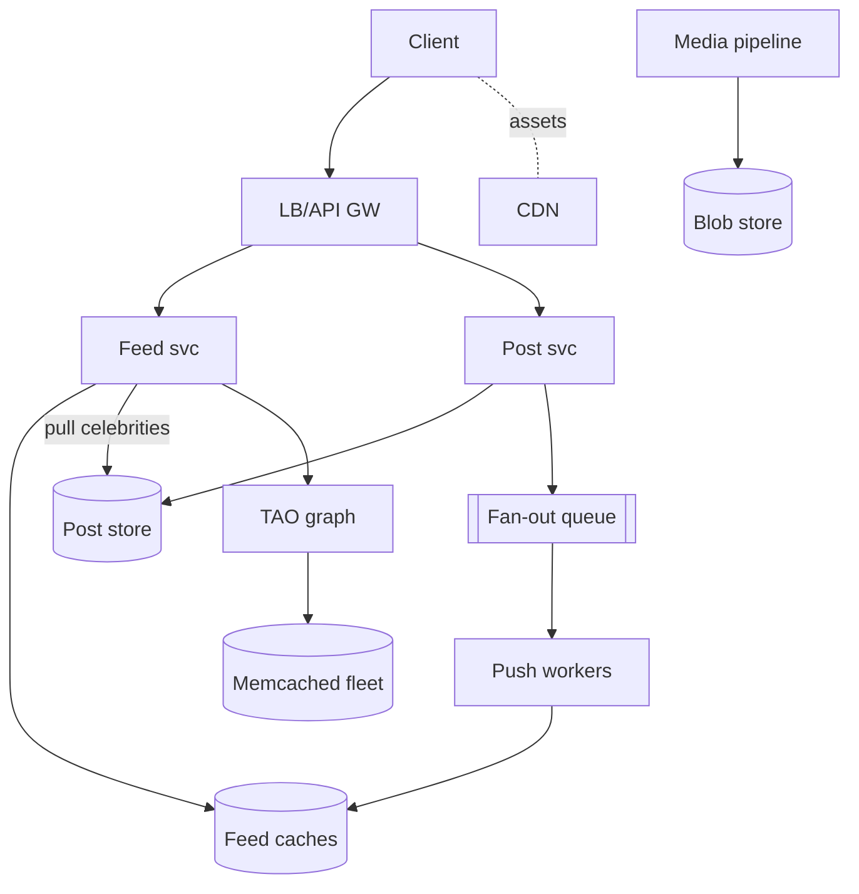
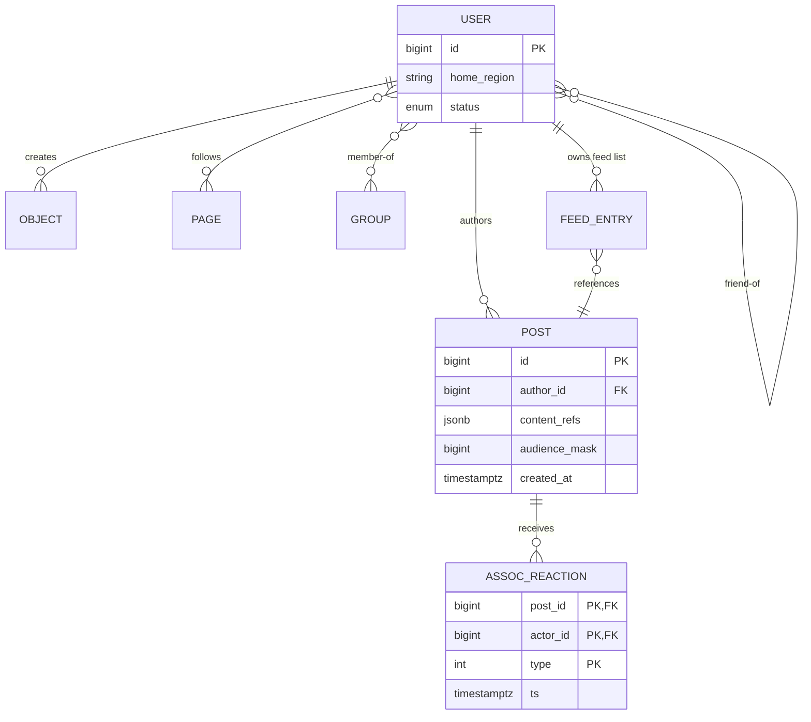

# Design Facebook

## Blogs and websites

## Medium

## Youtube

## Theory

### What Is It?

Facebook (Meta) is a social network platform that lets users create profiles, share content, connect with friends, and consume a personalized feed of posts from their network. At its core, it's a **social graph** — a massive directed graph of users and their relationships — combined with a **news feed** that ranks and presents content in an engaging order. The challenge is doing this at planetary scale: billions of users, hundreds of billions of friendships, millions of new posts per minute.

### Why Does It Exist?

Social media platforms exist to connect people across geography, keep them engaged with relevant content, and create network effects that make the platform more valuable as more people join. The news feed is the central product — it must surface the most relevant content to each user from their social graph, balancing recency, relationship strength, content type, and engagement signals, all in under 200 ms.

### What Problem Does It Solve?

* **Social graph storage**: Storing and querying hundreds of billions of friendships efficiently, supporting operations like "find mutual friends" or "get friends of friends" at scale.
* **Feed generation**: Pre-computing or on-demand generating each user's feed from hundreds of posts per second from their network — the classic fan-out problem (fan-out on write vs. read vs. hybrid).
* **Feed ranking**: Deciding which posts to show and in what order, using ML models that consider engagement history, relationship strength, content type, and timeliness.
* **Real-time updates**: Notifying millions of followers that someone posted new content, without overwhelming the feed generation system.
* **Content storage**: Storing text posts, photos, videos, and live streams — from billions of users — with high durability and fast retrieval.

### Important Subtopics

1. Social graph modeling & storage (TAO-style associations, sharding)
2. Feed generation: fan-out on write vs read, hybrid strategies
3. Feed ranking: ML scoring, edge rank, inventory problem
4. Media pipeline: upload, transcoding, blob storage (Haystack/f4), CDN
5. Caching architecture (Memcached regional clusters, mcrouter, lease mechanism)
6. Real-time updates (long-poll/WebSocket channels)
7. Notifications fan-out
8. Consistency models across subsystems
9. Privacy enforcement at scale (audience checks in the data path)
10. Multi-region serving
11. Abuse/spam/integrity systems
12. Observability at billion-user scale

*(The existing subsections below cover problem statement, requirements, architecture, news feed design, social graph storage, key decisions, and scaling strategies.)*

### Problem Statement
Design a social networking platform like Facebook that supports user profiles, friend connections, news feed, posts, reactions, comments, groups, and messaging at billion-user scale.

### Functional Requirements
- User registration, profiles, and friend management
- Create posts (text, images, videos)
- News feed with personalized ranking
- Reactions, comments, and shares
- Groups and pages
- Real-time notifications
- Search (people, posts, groups)

### Non-Functional Requirements
- **Scale**: 2B+ DAU, 100K+ QPS for feed
- **Latency**: Feed loads < 200ms, post creation < 500ms
- **Availability**: 99.99%
- **Consistency**: Eventual for feed, strong for friend graph

### High-Level Architecture

```
┌──────────┐     ┌──────────────┐     ┌─────────────────────┐
│  Client  │────▶│   API GW /   │────▶│  Service Layer       │
│  (App/   │     │   Load       │     │                      │
│   Web)   │◀────│   Balancer   │◀────│  ┌────────────────┐  │
└──────────┘     └──────────────┘     │  │ User Service    │  │
                                      │  │ Post Service    │  │
       ┌──────────────────────────────│  │ Feed Service    │  │
       │  CDN (images, videos, static)│  │ Graph Service   │  │
       │                              │  │ Search Service  │  │
       ▼                              │  │ Notification Svc│  │
  ┌─────────┐                         │  └────────┬───────┘  │
  │  Blob   │                         └───────────┼──────────┘
  │ Storage │                                     │
  └─────────┘                          ┌──────────┼──────────┐
                                       ▼          ▼          ▼
                                 ┌──────────┐ ┌───────┐ ┌────────┐
                                 │ Social   │ │ Post  │ │ Feed   │
                                 │ Graph DB │ │ Store │ │ Cache  │
                                 │ (TAO)   │ │       │ │        │
                                 └──────────┘ └───────┘ └────────┘
```

### News Feed Design

**Two approaches:**

**1. Fan-out on Write (Push model):**
```
User posts → Write to all followers' feed caches
Pro: Fast reads (pre-computed feed)
Con: Celebrity problem (1M+ followers = 1M writes)
```

**2. Fan-out on Read (Pull model):**
```
User requests feed → Query all friends' posts → Rank → Return
Pro: No write amplification
Con: Slow reads, high compute at read time
```

**Hybrid approach (Facebook's model):**
- Push for regular users (< 10K friends)
- Pull for celebrities/pages (millions of followers)
- Pre-compute + merge at read time

**Feed Ranking:**
```
Score = f(affinity, edge_weight, time_decay, engagement_prediction)

affinity:              How close is the poster to the viewer?
edge_weight:           Type of content (video > photo > text)
time_decay:            How recent is the post?
engagement_prediction: ML model predicting interaction probability
```

### Social Graph Storage

```
User A ──friend──▶ User B
       ──follows──▶ Page X
       ──member──▶ Group Y

Storage: TAO (Facebook's graph store)
- Adjacency list per node
- Bidirectional edges for friends
- Sharded by user_id
- Cached in distributed memory cache
```

### Key Design Decisions

| Decision | Choice | Reason |
|----------|--------|--------|
| Feed storage | Cache (Memcached/Redis) + MySQL | Fast reads, persistent backup |
| Social graph | Custom graph DB (TAO) | Optimized for edge queries |
| Media storage | Blob store + CDN | Cost-effective, globally distributed |
| Feed ranking | ML-based scoring | Personalization drives engagement |
| Consistency | Eventual (feed), Strong (graph mutations) | Acceptable trade-off |

### Scaling Strategies
- **Sharding**: User-based sharding for profile/post data
- **Caching**: Multi-layer (L1 local, L2 regional, L3 global)
- **CDN**: Static assets + video streaming
- **Async processing**: Post fanout via message queues
- **Read replicas**: Heavy read workload on feed

---

## Characteristics

- **Read-dominated social asymmetry**: feed reads outnumber post writes by orders of magnitude; the entire architecture (pre-computed feeds, multi-tier caches) exists to make reads nearly free.
- **Graph-centric data model**: friendships/follows/memberships are first-class queryable associations — every feature (feed, suggestions, privacy) reduces to graph traversals, which is why Facebook built TAO rather than forcing SQL joins.
- **Hybrid consistency discipline**: strong-ish consistency where mutations matter (friend edges via primary regions), eventual everywhere else (feed contents, counts); the boundary is deliberate and documented.
- **Celebrity-skewed workloads**: 0.01% of accounts (pages, celebrities) generate disproportionate write amplification under naive fan-out — hybrid push/pull exists precisely for this skew.
- **Privacy-in-the-hot-path**: every feed item render re-checks audience visibility (privacy checks can't be cached away safely after policy changes) — a correctness constraint shaping cache design.
- **Global-write-anywhere ambitions vs operational reality**: most deployments converge on home-region-per-user with async replication; true active-active remains the field's hardest problem.

---

## Components

- **Social graph store (TAO-style)**
  *Purpose*: objects (users/posts/pages) + associations (friend-of, liked, member-of). *Responsibilities*: adjacency-list CRUD, bounded graph traversals, cache-through reads over MySQL shards, association-count maintenance. *Relationship*: substrate beneath feed/notifications/search. *Real-world*: Facebook's published TAO paper is the canonical reference.

- **Post service & object store**
  *Purpose*: content creation/persistence. *Responsibilities*: validation, media-reference assembly, audience tagging, event emission for fan-out.

- **Feed service**
  *Purpose*: assemble ranked feeds. *Responsibilities*: merge precomputed (pushed) items with pull-based celebrity posts, apply ranking scores, enforce diversity/time-decay, paginate. *Relationship*: heaviest read consumer of graph+post stores.

- **Media pipeline**
  *Purpose*: photo/video lifecycle. *Responsibilities*: upload acceptance (resumable), virus scanning, transcoding ladders (multiple resolutions/bitrate ladders), thumbnail generation, blob-store placement (Haystack: append-only logs eliminating disk metadata seeks; f4 for cold storage), CDN distribution. *Example*: Haystack reduced metadata lookups from multiple per-photo to one — a famous storage-economics lesson.

- **Cache tiers (Memcached fleet + mcrouter)**
  *Purpose*: absorb the read storm. *Responsibilities*: regional clusters (clients → regional pool), cross-region consistency via invalidation daemons, mcrouter routing/failover, lease mechanism preventing stampedes on hot keys. *Real-world*: Facebook's "Workload Analysis / Scaling Memcache" papers define the pattern vocabulary.

- **Notification service**
  *Responsibilities*: badge counts, real-time channel pushes, aggregation rules (don't send 50 notifications for 50 likes).

- **Integrity systems**
  *Purpose*: spam/bot/fake-account defense. *Responsibilities*: ML classifiers on content+behavior signals, velocity limits, reputation scoring feeding ranking downweights.



---

## Patterns

- **Hybrid fan-out** (existing Theory covers basics; production nuances):
  *Write path detail*: celebrity posts skip per-follower writes; instead their IDs enter followers' "celebrity overlay" checked during merge. Thresholds dynamic (~10K followers typical). *Merge cost*: pulling top-N from each followed celebrity bounded by recency indexes.
  
- **Lease-based cache consistency** (Memcached)
  *Problem*: thundering herds + stale-read races when popular keys expire. *How*: cache returns a 48-hour lease token to exactly one requester; others get told to wait-and-retry; concurrent-set protection rejects late writers holding stale leases. *Why it matters*: this single mechanism eliminated entire outage classes at Facebook scale.

- **Regionalization with home regions**
  Each user's profile/graph shards pinned to a home region (data residency + latency); cross-region friend interactions served via replicas with documented staleness bounds; writes always home-region-routed.

- **Edge-rank style staged scoring**
  Cheap filters eliminate 99% of candidate posts (seen-before, unfollowed, policy-blocked), then lightweight scorer orders hundreds, then heavyweight engagement-prediction models rank dozens — same funnel philosophy as search retrieval→rerank.

- **Asynchronous counter/materialized aggregates**
  Like/comment counts maintained by stream aggregators into counters service (see distributed-counter topic) rather than transactional increments — display tolerance seconds-level.

- **Anti-pattern**: computing feeds purely on read at billion-user scale (latency + backend collapse); equally, pure-push without celebrity carve-outs melts write paths.

---

## Benefits

- **Engagement flywheel**: personalized feeds measurably multiply session time vs chronological — the business case funding everything else.
- **Horizontal scaling clarity**: user-sharded data + stateless services grow linearly with population.
- **Feature velocity via shared substrates**: graph/cache/media platforms let product teams ship features composing existing primitives.
- **Cost engineering as competitive advantage**: blob-storage innovations (Haystack/f4) saved petabytes-scale costs — infrastructure economics directly enabling free products.

---

## Pros

- Battle-tested component designs publicly documented (TAO, Memcached papers, Haystack) — rare advantage of studying this system.
- Hybrid consistency boundaries well-understood and defensible in interviews.
- Degradation options mature (feed falls back to recency-only ranking under ML brownouts).

## Cons

- Enormous operational surface: thousands of services, custom infrastructure everywhere — unbuildable without FAANG-class resources.
- Ranking opacity creates societal/regulatory exposure (algorithmic accountability debates).
- Privacy-check hot-path costs limit caching aggressiveness permanently.
- Cross-region consistency compromises surface as confusing UX edge cases (stale friend lists).

---

## Challenges

- **Technical**: feed inventory explosion (billions of candidate posts per user daily — candidate generation must prune before ranking); cache invalidation storms on viral posts; clock-skew in time-decay scoring.
- **Scalability**: celebrity live-event posts (millions of concurrent viewers); notification fan-out bursts; graph traversal hot-spots on mega-nodes (group memberships in millions).
- **Performance**: p95 feed <200ms across 6+ backend dependencies — achieved via parallelism, speculative prefetching, aggressive tiering.
- **Reliability**: regional failover preserving session continuity; ML-service brownouts degrading gracefully to simpler models; cache-cluster loss absorbed by lease-guarded rebuilds.
- **Maintainability**: decade-old data formats coexisting with new; schema migrations at petabyte scale executed online.
- **Operational**: capacity planning across timezones' diurnal peaks; integrity-system tuning against evolving abuse.
- **Security/integrity**: fake-account ecosystems, coordinated inauthentic behavior, scraping defense, privacy-regulation compliance (GDPR erasure across backups/analytics).

---

## Best Practices

- **Bound every graph traversal** (max-depth, max-nodes) — unbounded walks through celebrity nodes are DoS vectors.
- **Design caches assuming expiry storms** (lease/single-flight everywhere); measure hit-ratio regressions as incidents.
- **Separate candidate generation from ranking** — never run heavy models over raw inventories.
- **Enforce privacy checks inside data-access layers**, not application code — one enforcement point beats N hopeful call-sites.
- **Emit engagement telemetry with position/experiment tags** for ranking evaluation loops (same discipline as search).
- **Pre-compute aggressively for known-heavy moments** (New Year's Eve traffic modeled years ahead regionally).
- **Chaos-test cross-region failover quarterly** with user-visible SLO dashboards proving recovery claims.

---

## When to Use / Not Use

This full architecture suits **planet-scale social platforms**. Scale down honestly:

- Regional social apps (<10M users): PostgreSQL adjacency tables + Redis caches + straightforward push feeds suffice — TAO/Haystack-class machinery unjustifiable.
- Enterprise social (Slack/Teams-like): workspace-partitioned graphs simplify nearly everything.
- Follow-only platforms (Twitter-shaped): pull-heavier hybrids fit asymmetric graphs better than friendship symmetry assumptions.

Decision factors: user scale trajectory, graph shape (symmetric vs follower), media intensity, regulatory geography spread, team resources.

---

## Use Cases

- **Friend-graph news feed (core FB loop)**
  *Problem*: assemble relevant ranked content from thousands of connections within 200 ms globally. *Solution*: hybrid fan-out + staged ranking + multi-tier caches as designed above. *Trade-off*: eventual consistency means occasional missing just-posted items — mitigated by WebSocket nudges triggering targeted refetches.

- **Viral moment handling (World Cup goal post)**
  *Problem*: single post gaining million likes/comments/minute; notification and count systems melt naively. *Solution*: counter-sharding, notification batching/aggregation, CDN-offloaded media, hot-key leases preventing cache stampede cascades. *Trade-off*: count displays lag seconds — universally accepted.

- **Group communities at scale**
  *Problem*: groups with millions of members break friend-graph assumptions (membership checks huge, moderation complex). *Solution*: group-scoped feed variants (pull-heavier since membership ≠ friendship density), tiered moderator tooling, membership-edge sharding independent of user sharding. *Trade-off*: separate consistency domain adds complexity but matches usage reality.

---

## Architecture

Facebook's architecture centers on a **massively scaled social graph** (TAO) and **hybrid feed fan-out**. The social graph (follows, friendships, reactions) is stored in TAO — a graph-aware distributed cache backed by MySQL. Feeds use a hybrid model: fan-out-on-write for most users, fan-out-on-read for celebrity accounts. The **feed ranking** pipeline combines hundreds of ML signals (engagement prediction, relationship strength, recency, content type) in a two-stage process: candidate generation then ranking. Real-time delivery uses a WebSocket-like layer for comments and reactions.

```mermaid
graph TD
  subgraph "Clients"
    FB[Facebook App/iOS/Android/Web]
  end
  subgraph "Edge"
    APIGW[API Gateway]
    EdgeCache[Edge Cache (Varnish)]
  end
  subgraph "Core Services"
    PostSvc[Post Service]
    GraphSvc[TAO - Social Graph]
    FeedSvc[Feeds Service<br/>- Fan-out<br/>- Candidate Gen]
    RankSvc[Feeds Ranking Service]
    NotifSvc[Notification Service]
    SearchSvc[Search Service]
    MediaSvc[Media Service]
    CommentSvc[Comment Service]
  end
  subgraph "Data"
    PostDB[(Post Storage<br/>TAO/MySQL)]
    FeedStore[(Feed Store<br/>Cassandra + Cache)]
    GraphDB[(MySQL Sharded)]
    Features[(ML Feature Store)]
    Logs[(Logging<br/>Hadoop/S3)]
  end
  FB --> APIGW
  APIGW --> EdgeCache
  EdgeCache --> PostSvc
  EdgeCache --> GraphSvc
  EdgeCache --> FeedSvc
  EdgeCache --> RankSvc
  EdgeCache --> NotifSvc
  PostSvc --> PostDB
  PostSvc --> Logs
  GraphSvc --> GraphDB
  FeedSvc --> FeedStore
  FeedSvc --> GraphSvc
  FeedSvc --> Features
  RankSvc --> Features
  NotifSvc --> EdgeCache
  CommentSvc --> PostDB
  CommentSvc --> NotifSvc
  FeedSvc -->|write feed| PostSvc
  subgraph "Batch Processing"
    Hadoop[Hadoop Cluster<br/>(Scuba, Hive, Presto)]
  end
  Logs --> Hadoop
  Features --> Hadoop
  PostSvc -->|events| Logs
  GraphSvc -->|events| Logs
```

### Architecture Structure

* **Edge layer**: API Gateway + Edge Cache (Varnish) serving 95%+ of requests from cache. Handles auth, rate limiting, geo-routing.
* **Service layer**: Stateless microservices — Post, Feeds, Graph (TAO), Ranking, Notifications, Search, Comments, Media.
* **Data layer**: TAO (graph cache + MySQL), Cassandra (feed store), Hadoop (batch processing), ML Feature Store.
* **Batch layer**: Hadoop processes petabytes of log data for offline ML training and analytics.

### Communication

* **Synchronous**: Client → Edge Cache → Services (thrift/REST). Most reads from cache.
* **Asynchronous**: Services publish events to Scribe (Facebook's messaging system, Kafka-compatible) → consumed by batch processing for ML features.
* **Real-time**: Notification Service → Push connections for live comments, reactions, and notifications.

### Data Flow

1. **Post creation**: User posts → Post Service → TAO (stores post + updates graph) → publishes to Scribe → batch processing generates ML features.
2. **Feed generation (push)**: Fan-out Service consumes post event → queries TAO for followers → writes `post_id` to followers' feed entries in Cassandra.
3. **Feed generation (pull)**: For celebrity posts, Feed API fetches at read time (no fan-out-at-write).
4. **Feed ranking**: Feed API → candidate generation (from feed store) → Ranking Service applies ML model → returns ranked feed.
5. **Real-time**: New comments/reactions → Notification Service → push to connected users via persistent connections.

### Scaling Strategy

* **TAO**: Graph cache sharded 1000+ ways; each shard handles a subset of entities. Cache hit rate > 99%.
* **Feeds**: Write fan-out to Cassandra; Cassandra cluster scaled by adding nodes; vnode-based partitioning.
* **Ranking**: Pre-compute features (daily batch); real-time features (recency, live engagement) computed on-demand; model inference served from GPU/ML clusters.
* **Edge cache**: Varnish instances globally; 95%+ cache hit rate for reads.

### Failure Handling

* **Feed lag**: If fan-out falls behind, feeds are stale — users see slightly delayed posts. Acceptable (eventual consistency).
* **Ranking failure**: If ranking service is down, fall back to chronological feed ordering.
* **TAO unavailable**: Serve from cache if possible; if cache is cold, temporarily fall back to "most recent posts from close friends."
* **Cassandra outage**: Feed reads fail; fall back to fetching recent posts directly from Post Store.

## Design

### Design Considerations

* **Fan-out strategy**: Most users have moderate follow counts (< 1000) → fan-out-on-write (push). Celebrity accounts (1M+ followers) → fan-out-on-read (pull). Dynamic switching based on follower count.
* **Ranking freshness**: Features updated hourly (offline) or in real-time (for breaking news). Rank model weights adjusted weekly based on A/B test results.
* **Privacy and safety**: Content filtered based on user privacy settings before appearing in feeds; spam detection at post creation time.

### Key Decisions

| Decision | Options | Trade-off | Facebook's Choice |
|---|---|---|---|
| Fan-out | Pure push | Fast reads, expensive writes | Hybrid (push normal, pull celebrities) |
| | Pure pull | Cheap writes, slow reads | |
| | Hybrid | Complex but balanced | ✓ |
| Feed storage | Redis cache | Fast, limited capacity | Cache layer |
| | Cassandra | Scalable, persistent | Primary store |
| Ranking | Chronological | Simple, fair | Fallback only |
| | ML ranking | Engaging, complex | ✓ (100+ signals) |
| Graph storage | Pure DB | Strongly consistent | TAO (cache + DB) |
| | Cache + DB | Fast, complex | ✓ (99%+ cache hit) |

### Scalability Considerations

* **TAO cache**: 1000+ shard replicas; cache warming for new data centers.
* **Fan-out workers**: 1000+ workers partitioned by author_id; each handles fan-out for a subset of posts.
* **Candidate generation**: Each user can follow 5000+ accounts → candidate set is huge → use pre-computed feed store (Cassandra) to limit candidate count.
* **Ranking**: Model inference must be < 30 ms for 10+ candidates; pre-compute expensive features offline.

### Reliability Considerations

* **Eventual consistency**: Posts appear in feeds within seconds — acceptable for social content.
* **Degraded modes**: If ranking is down, serve chronological; if TAO is down, serve from cache.
* **Content safety**: Posts must be checked against community standards before appearing in feeds.

### Performance Considerations

* **P90 feed latency**: < 200 ms (95% of users get their feed within 200 ms).
* **Fan-out latency**: < 5 seconds (posts appear in most followers' feeds within 5 seconds).
* **Ranking latency**: < 30 ms per user (100+ ML features evaluated).
* **Cache hit rate**: 95%+ for feed reads (Varnish + Redis).

### Security Considerations

* **Privacy controls**: Each post has privacy settings (public, friends, custom list); enforced at Post Service and Fan-out Service.
* **Content moderation**: ML models detect hate speech, misinformation, violence before/while in feed.
- **Data access**: TAO enforces read permissions — a user can only see graph data they have permission to (e.g., friends' posts, not strangers'). - **Rate limiting**: Prevent scraping and abuse via per-IP/user rate limits.

### Maintainability Considerations

* **Feature store**: Centralized ML feature store (FBLearner Flow) so ranking models can share features.
* **A/B testing**: Thousands of experiments run simultaneously; careful experiment design and conflict detection.
* **Model versioning**: Deploy new ranking model versions gradually (1% → 100% of users) with rollback.

## High-Level Design

Post-to-feed journey:

```mermaid
sequenceDiagram
    participant A as Author app
    participant PS as Post svc
    participant ST as Post store
    participant FO as Fan-out workers
    participant FC as Feed caches
    participant V as Viewer app
    participant FSV as Feed svc
    part note right of ST: Celebrity check decides path

    A->>PS: createPost(content, audience)
    PS->>ST: persist + assign postId
    alt regular user (<threshold)
        ST-->>FO: event
        par per-follower batches
            FO->>FC: prepend postId to follower feeds
        end
    else celebrity/page
        Note over FO: skip fan-out; ID enters<br/>celebrity index only
    end
    PS-->>A: 201 {postId}
    V->>FSV: GET feed (cursor)
    FSV->>FC: read precomputed segment
    FSV->>ST: pull recent celebrity posts (overlay merge)
    FSV->>FSV: rank (staged scoring), privacy-filter
    FSV-->>V: page 1
```

Scaling: fan-out workers partitioned by follower-hash; feed caches regional (user-affinity routing); ranking services autoscale independently; media pipeline decoupled entirely (posts reference not embed).

Failure handling: fan-out lag visible as delayed appearance (SLO alarms before users notice); cache-cluster loss → lease-guarded rebuild waves; ML ranker outage → recency fallback mode flagged in responses.

---

## Deep Dive

- **TAO design essentials**: two-level architecture (cache tier holding association lists + persistent MySQL shards); associations carry time-ordered cursors enabling pagination; write-through caching keeps cache-database coherence tractable; explicit consistency contract ("read-your-writes within region") documented rather than implied.
- **Memcached lease mechanics precisely**: on miss, memcached grants lease L valid ~48h; client fetches DB then `set(key, value, cas=L)`; if another client got newer lease meanwhile, set rejected — deduplicating herd AND preventing stale-clobber races in one primitive. Regional invalidation daemons propagate deletes cross-region within ~ms.
- **Candidate generation funnel numbers**: typical user has ~1500 feed-eligible posts/day generated; unseen-filter cuts ~70%, engagement-probability floor cuts more; final ranked page needs only ~14 items — arithmetic explaining why staging works.
- **Media storage economics**: Haystack's insight — traditional filesystems' per-file metadata lookups dominated photo-serving I/O; collapsing metadata into memory-indexed append-only log files made random photo reads one disk operation. f4 extends the idea to cold content with Reed-Solomon erasure coding halving storage again.
- **Observability**: end-to-end feed latency attribution per stage, cache-hit ratios per key-class per region, fan-out lag distributions, ranking-model serving health (feature-freshness age!), integrity-metric dashboards (spam prevalence estimates).

---

## API Contract

Facebook's API is a graph-based REST API where every object (user, post, photo, comment) is a node, and relationships (friends, likes, comments) are edges.

### Graph API

| Method | Endpoint | Purpose |
|---|---|---|
| GET | `/api/v1/me/feed` | Get user's news feed |
| GET | `/api/v1/{user-id}/feed` | Get another user's feed |
| POST | `/api/v1/{user-id}/feed` | Create a post |
| POST | `/api/v1/{post-id}/comments` | Comment on a post |
| POST | `/api/v1/{post-id}/likes` | Like a post |
| POST | `/api/v1/{user-id}/friends` | Send friend request |
| GET | `/api/v1/search` | Search posts, users, pages |

### GET /api/v1/me/feed

**Query Parameters**:

| Parameter | Type | Default | Description |
|---|---|---|---|
| limit | int | 25 | Results per page (max 100) |
| after | string | — | Cursor for pagination |
| rank | bool | true | Apply ML ranking (vs chronological) |
| include | string | — | Comma-separated: `comments,likes,attachments` |

**Response**:
```json
{
  "data": [
    {
      "post_id": "post_789",
      "author_id": "user_123",
      "author_name": "Alice",
      "content": "Having a great time at the beach!",
      "created_time": "2024-06-14T10:00:00Z",
      "type": "text",
      "attachments": [{"type": "photo", "url": "https://..."}],
      "statistics": {"likes": 120, "comments": 15, "shares": 3},
      "user_reacted": "LIKE",
      "rank_score": 0.92
    }
  ],
  "paging": {
    "cursors": {"after": "QVFI..."},
    "next": "https://graph.facebook.com/v1/api/v1/me/feed?after=QVFI..."
  },
  "client_time": "2024-06-14T10:05:00Z"
}
```

### POST /api/v1/{user-id}/feed

**Request Body**:
```json
{
  "message": "Having a great time at the beach!",
  "attached_photo": "photo_abc123",
  "privacy": {"value": "ALL_FRIENDS"},
  "place_id": "place_xyz"
}
```

**Response**:
```json
HTTP/1.1 201 Created
{
  "post_id": "post_789",
  "status": "PROCESSING",
  "created_time": "2024-06-14T10:00:00Z"
}
```

### Real-Time Updates (WebSockets)

* Clients subscribe to `POST /api/v1/live/like` and `POST /api/v1/live/comment` for real-time feed updates.
* Server pushes events: `{"type": "NEW_LIKE", "post_id": "post_789", "count": 42}`.

### Status Codes

| Code | Meaning |
|---|---|
| 200 | Success |
| 201 | Created |
| 204 | No content (delete) |
| 400 | Invalid request |
| 401 | Authentication required |
| 403 | Insufficient permissions |
| 404 | Object not found |
| 429 | Rate limited |
| 503 | Service temporarily unavailable |

### Rate Limiting

* App-level rate limit: 200 calls/user/access-token/hour.
* Read calls: higher quota; write calls: lower quota.
* Returns `X-App-Usage` header with usage percentage.

### Versioning

* Versioned via URL path (`/api/v1/`). Old versions are supported for 2 years with migration warnings.

## Data Modeling



Notes mirroring TAO semantics: associations stored as `(id1, type, id2, time)` tuples — reverse-direction indexes materialized for symmetric edges; feeds as per-user association lists of post-IDs (bounded length, cursor-paginated); audience masks encode visibility classes resolved against viewer context at serve-time. Sharding: objects/users by id; associations colocated by id1 (traversal locality); celebrity overlays indexed separately.

---

## Java and Spring Boot Implementation

Feed merge service illustrating hybrid fan-out:

```java
@Service
public class FeedService {

    private final FeedCacheRepository feedCache;
    private final CelebrityIndexRepository celebrityIndex;
    private final RankingClient ranker;
    private final PrivacyChecker privacy;

    public FeedPage getFeed(long userId, String cursor, int pageSize) {
        List<FeedItem> candidates = new ArrayList<>(feedCache.recent(userId,
                CANDIDATE_LIMIT));
        candidates.addAll(celebrityIndex.followedRecent(userId, CELEBRITY_LIMIT));

        List<FeedItem> visible = candidates.stream()
                .filter(item -> privacy.canSee(userId, item.postId()))
                .toList();

        RankedItems ranked = ranker.rank(userId, visible, RequestContext.now());
        return ranked.page(cursor, pageSize);
    }
}
```

Fan-out worker consuming post events:

```java
@Component
public class FanoutWorker {

    private final GraphClient graph;
    private final FeedCacheRepository feedCache;

    @KafkaListener(topics = "post.created", groupId = "fanout")
    public void onPost(PostCreated evt) {
        if (graph.followerCount(evt.authorId()) > CELEBRITY_THRESHOLD) {
            celebrityIndex.add(evt.authorId(), evt.postId());   // pull-side handles rest
            return;
        }
        // batched prepend across follower pages
        var cursor = graph.followersOf(evt.authorId(), BATCH);
        while (!cursor.isEmpty()) {
            feedCache.prependAll(cursor.ids(), evt.postId());
            cursor = cursor.next();
        }
    }
}
```

Notes: privacy filtering stays server-side adjacent to data access (never client-trusted); celebrity threshold consulted at write-time keeping read merges cheap; production adds seen-state dedupe (bloom-filter-backed "already shown" service), Redis-backed feed caches with lease-guarded misses, and Resilience4j around ranker calls falling back to recency ordering. Testing: Testcontainers suites asserting celebrity-path exclusion from fan-out, privacy-filter completeness across audience types, and merge-order stability under pagination.

---

## Real-World Examples

- **Facebook TAO** — the canonical social-graph store publication; its consistency contracts and caching topology inform this entire topic.
- **Facebook Haystack/f4** — photo storage economics case studies showing workload-driven storage design beating general-purpose filesystems decisively.
- **Twitter's early outages** — the famous "fail whale" era demonstrated pure-pull feed computation collapsing under growth; their subsequent hybrid adoption validates the fan-out economics empirically.
- **Instagram** — adopted Facebook infrastructure wholesale post-acquisition; their feed-ranking publications show the same patterns applied to interest-graphs rather than friendship-graphs.

---

## Interview Preparation

### Interview Questions

**Beginner**

1. **Push vs pull feeds — when does each win?**
   Push (write-time fan-out) buys fast reads for normal users; pull (read-time merge) avoids million-write amplification for celebrities. Hybrid thresholds capture both benefits; the threshold itself tunes write/read cost balance.
2. **Why does the social graph deserve its own store instead of relational tables?**
   The workload is overwhelmingly small-bounded traversals (friends-of-user, likes-of-post) at extreme QPS — an adjacency-list cache backed by simple shardable persistence serves these patterns faster and more predictably than generic join planning.

**Intermediate**

3. **Walk through the cache-stampede problem on a viral post and its fix.**
   Hot key expires → thousands of simultaneous DB hits. Lease mechanism grants exactly one rebuild permission; others retry shortly; concurrent stale sets rejected via CAS tokens. Alternative/additional: request coalescing proxies. This scenario recurs constantly in interviews — know the mechanics cold.
4. **How do you keep privacy enforcement correct when caches serve feeds?**
   Checks happen at serve-time against current policy state, never baked into cached artifacts; audience-mask resolution happens inside data-access layer; policy changes invalidate affected entries promptly. Accept the latency cost — correctness here outranks microsecond wins.
5. **What breaks first when a celebrity posts during a live event, in order?**
   Notification fan-out (batched/aggregated defenses ready), counter increments (sharded), comment ingestion partitions for that post (dedicated lanes), CDN origin for attached media (pre-warmed). Sequencing awareness demonstrates operational maturity.

**Advanced**

6. **Design feed ranking end-to-end: features, funnel, freshness.**
   Candidate sources (pushed + celebrity pulls + group/inventory expansions) → cheap filters → light scorer → heavy engagement-prediction models → business/diversity constraints. Features: affinity embeddings, content-type weights, recency decay, integrity scores. Freshness: streaming feature updates with staleness budgets; guardrails (session-success metrics) alongside CTR objectives.
7. **Your region failed; users there must keep using the product. Design the DR story.**
   Read replicas promoted elsewhere (accepting staleness windows), home-region writes failover to secondary with epoch fencing preventing split-brain, session continuity via replicated auth tokens, media CDN unaffected (multi-origin), communication plan honest about degraded features. Rehearsed quarterly — untested DR is fiction.

**Senior / system design**

8. **Justify building TAO versus adopting an off-the-shelf graph database circa today.**
   At their scale: custom wins (workload-specific caching, MySQL operational familiarity, decade-tuned tooling). Today's builders: Neo4j/Nebula/TigerGraph or even well-sharded relational+Redis cover most needs below extreme scales; build only when measured ceilings block roadmap. Senior signal: refusing cargo-cult infrastructure copying regardless of source prestige.
9. **How would you add end-to-end encryption to Messenger-class messaging atop this architecture?**
   Server-blind courier model: keys negotiated per-device (X3DH-style), ciphertext envelopes routed without content access, metadata minimization choices debated openly (delivery receipts possible; server search impossible), key-verification UX. Trade-offs against spam/enforcement capabilities discussed honestly.

### Common Mistakes

- Pure-push fan-out ignoring celebrity write amplification.
- Baking privacy decisions into cached feed blobs (stale-audience leaks).
- Unbounded graph traversals through mega-nodes.
- Chronological-only fallbacks that forget engagement floors — degenerate feeds destroy sessions.
- Treating notification sends as free — burst amplification during events melts downstream.

### Expected discussion points
Consistency-boundary articulation per subsystem, cache-coherence primitives (leases), funnel-stage arithmetic, celebrity-skew economics, and integrity/privacy systems as first-class design citizens rather than bolt-ons.

