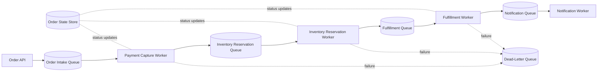
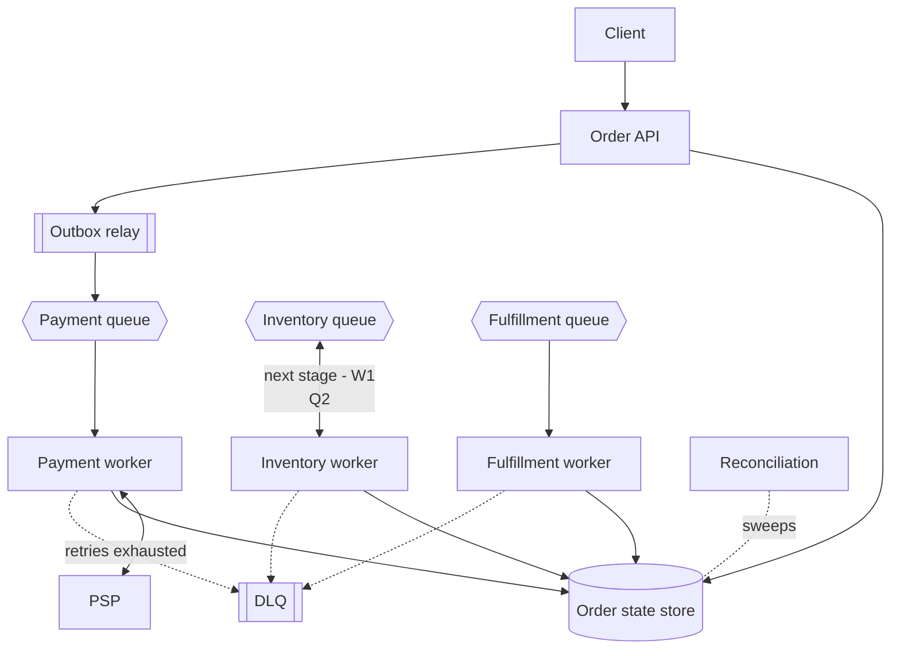
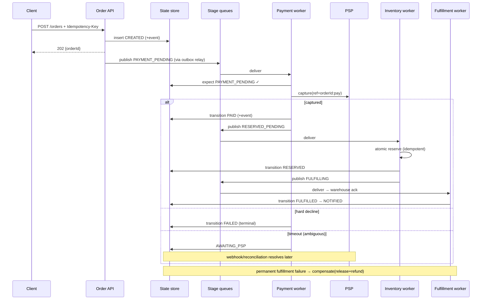
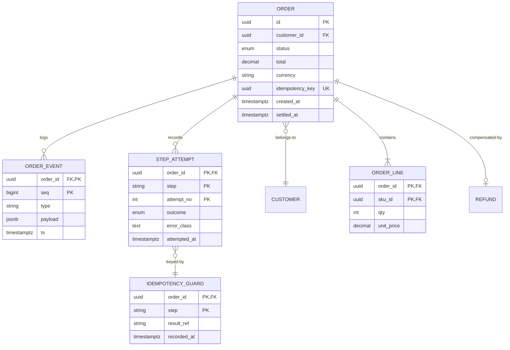

# Design a Fault-Tolerant Queue-Based Order Processing System

## Blogs and websites

## Medium

## Youtube

## Theory

### Important Subtopics

1. Order state machines as the backbone (explicit states, guarded transitions)
2. Effective-once semantics over at-least-once queues
3. Idempotency design per step type (payment, inventory, fulfillment)
4. Retry taxonomy: transient vs permanent errors, backoff, budgets
5. Dead-letter queues & remediation workflows
6. Compensations for late-stage permanent failures
7. Per-stage queue isolation & backpressure
8. Worker concurrency control and poison-message containment
9. State-store consistency with side effects (dual-write problem, outbox)
10. Ambiguous downstream outcomes (timeout ≠ failure)
11. Observability: stage-level funnels, aging alerts
12. Flash-sale burst absorption

*(The existing subsections below cover problem statement, requirements, architecture, key design points, and trade-offs.)*

### Problem Statement

Design an order processing system where each order goes through multiple steps (payment capture, inventory reservation, fulfillment, notification) that must complete reliably even if individual workers or downstream services crash, retry, or become temporarily unavailable, without losing orders or processing one twice.


### Functional Requirements

- Accept a new order and enqueue it for processing
- Process an order through an ordered sequence of steps, each performed by a (possibly different) worker/service
- Retry a failed step with backoff, and move permanently-failing orders to a dead-letter queue for manual handling
- Guarantee each step executes effectively-once (no double payment capture, no double inventory decrement) despite at-least-once delivery from the queue
- Provide order status visibility at every stage

### Non-Functional Requirements

- **Scale**: Tens of thousands of orders/minute at peak (e.g., flash sale)
- **Reliability**: No order should be silently lost; every step must be retried until it succeeds or is explicitly failed
- **Consistency**: Steps must not be applied twice (e.g., charging a customer twice) even when the same message is redelivered
- **Observability**: Every order's current stage and failure history must be queryable

### High-Level Architecture



### Key Design Points

- Model the order pipeline as a chain of queues, one per stage, so each stage can be scaled, deployed, and retried independently; a slow/overwhelmed fulfillment stage doesn't block payment capture for new orders.
- Give every order a unique ID and make every stage's handler idempotent, keyed by that ID (e.g., "has this order already been charged?" checked before calling the payment provider), since queue-based delivery is typically at-least-once and messages can be redelivered after a worker crash or a visibility-timeout expiry.
- Track explicit order state (e.g., `CREATED → PAID → RESERVED → FULFILLED → NOTIFIED`, or a `FAILED` terminal state) in a durable store updated by each worker after its step succeeds, so status is always queryable and a crashed worker can determine exactly where to resume.
- Use retry with exponential backoff per stage, and after a configured number of attempts, move the message to a dead-letter queue for manual/automated remediation rather than retrying forever and blocking the queue.
- Use compensating actions for steps that must be undone if a later step fails permanently (e.g., release the inventory reservation and refund the payment if fulfillment ultimately cannot succeed).

### Trade-offs

- A chain of per-stage queues adds more infrastructure (more queues/workers to operate and monitor) than a single monolithic order-processing function, but isolates failures/backpressure per stage and allows independent scaling - essential at flash-sale-level order volume.
- Idempotency keys and durable state tracking add write overhead to every step, but are the only reliable way to get effectively-once processing semantics on top of an at-least-once delivery queue.

### State Machine Discipline

The order state store isn't a status label — it's the recovery protocol:

```
CREATED → PAYMENT_PENDING → PAID → RESERVED → FULFILLING → FULFILLED → NOTIFIED
                     ↘ FAILED ← compensations from any stage
```

Rules that make this load-bearing:

- Transitions are **guarded** (`UPDATE orders SET status='PAID' WHERE id=? AND status='PAYMENT_PENDING'`) — a redelivered message finding the wrong state does nothing.
- Each worker reads state *before* acting and acts only on expected source-states; the conditional update is the idempotency gate at the orchestration level.
- Every transition appends to `order_events` (audit + debugging), written in the same transaction where possible.

### Effective-Once Layering

Queues deliver at-least-once; effectiveness comes from stacking:

| Layer | Mechanism | Covers |
|---|---|---|
| Queue | dedup windows / message IDs | network-level redelivery |
| Worker | idempotency table keyed (orderId, step) | crash-after-effect-before-ack |
| Downstream | idempotent APIs (PSP ref keys) | provider-side retries |
| Reconciliation | periodic sweeps comparing effects vs state | everything residual |

No single layer suffices; interviews probe whether you know *which gap each closes*.

### Error Classification

Every exception maps to exactly one class, driving handling:

- **Transient** (timeouts, 5xx, connection resets): retry with exponential backoff + jitter within budget.
- **Permanent** (card declined, address invalid): fail-fast to terminal path — retries waste money and queue depth.
- **Ambiguous** (downstream timeout where effect unknown): park in AWAITING_CONFIRMATION; resolve via webhook/reconciliation, never blind-retry (double-capture risk) or blind-compensate (refund of captured funds).

The ambiguous class is where real systems distinguish themselves.

### Compensation Choreography

Late-stage permanent failures unwind in reverse:

```
FULFILLMENT fails permanently after PAID+RESERVED:
  release reservation (idempotent)
  refund payment (idempotent, PSP-ref keyed)
  mark FAILED_WITH_REFUND
  notify customer honestly
```

Compensations themselves retry until confirmed — a failed compensation is its own alerting incident, since money/state now genuinely diverge.

---

## Characteristics

- **Reliability-over-latency posture**: minutes of pipeline latency are acceptable; lost/duplicated orders are not — every choice optimizes durability first.
- **Stage isolation economics**: independent queues/workers mean a fulfillment outage slows deliveries but never blocks new-order intake or payment capture.
- **Explicit-state recoverability**: any worker can resume any order from durable state alone — no implicit in-memory knowledge anywhere.
- **Burst-tolerant by buffering**: flash-sale spikes queue rather than cascade; autoscaling drains backlog with oldest-first fairness.
- **Poison-containment**: DLQs quarantine unprocessable orders before they block partitions; remediation is a workflow, not heroics.
- **Observability-as-feature**: order-status queries are product surface (customer support) and ops surface (aging/failure dashboards) simultaneously.

---

## Components

- **Order intake API**
  *Purpose*: validate + persist CREATED + enqueue. *Responsibilities*: schema/authn validation, idempotency-key registration (client retries collapse), transactional outbox write (order row + queue event atomically).

- **Per-stage workers**
  *Purpose*: execute one step each. *Responsibilities*: claim messages (visibility timeouts), verify preconditions from state store, invoke downstream idempotently, record transition, ack. Heartbeat long operations.

- **State store**
  *Purpose*: order truth. *Responsibilities*: guarded transitions, event-append audit trail, query APIs for support/ops. Strongly consistent (this is the anchor everything reconciles against).

- **DLQ + remediation console**
  *Purpose*: quarantine + fix loop. *Responsibilities*: retention, inspection UI showing failure history, guarded replay/edit actions, per-stage inflow alerting.

- **Reconciliation service**
  *Purpose*: catch what slips between layers. *Responsibilities*: sweep AWAITING_CONFIRMATION orders, compare PSP settlement files against PAID claims, flag drift.



---

## Patterns

- **Claim-check visibility timeout**: worker leases message N seconds, heartbeats renewing while healthy; crash lets lease lapse → redelivery. Pairs with the idempotency table so redeliveries are free.
- **Transactional outbox**: order-row mutation + queue-event insertion share one local transaction; relay publishes. Eliminates dual-write loss at intake — the pattern every serious implementation converges on.
- **Guarded-transition idempotency**: `UPDATE ... WHERE status = 'EXPECTED'` returning affected-rows as the proceed signal — cheap, atomic, universally applicable.
- **Retry budget + jittered backoff**: attempts capped (5 typical), delays `min(cap, base×2^n) ± jitter`; budget prevents infinite cost on hopeless orders while weathering real transients.
- **Saga-style compensation ladder**: reverse-ordered unwinds with idempotent compensations, triggered only on *confirmed* permanent failure (never ambiguous).
- **Backpressure via queue depth signals**: autoscaling consumes depth; sustained growth beyond drain-rate triggers upstream admission shaping (checkout-side throttling) rather than silent latency death.
- **Anti-pattern**: sharing one queue across stages (ordering coupling, scaling entanglement) or retrying ambiguous outcomes blindly.

---

## Benefits

- **Zero-silent-loss guarantee** becomes provable: every order exists in exactly one known state with full event history.
- **Independent stage evolution**: deploy/payment-tune/scale each stage on its own cadence without fleet-wide coordination.
- **Flash-sale survival**: intake keeps accepting (queue absorbs) while downstream drains at sustainable rates — revenue captured during incidents competitors lose entirely.
- **Support empowerment**: any agent answers "where's my order?" instantly from state store, cutting ticket escalations.
- **Auditability**: event-append trails satisfy disputes, financial reconciliation, and postmortems mechanically.

---

## Pros

- Straightforward mental model (queues + states + idempotency) despite distributed underpinnings.
- Technology-flexible: works over Kafka/SQS/RabbitMQ with identical patterns.
- Failure behavior explicit, testable, and rehearseable (chaos drills kill workers mid-step).

## Cons

- Infrastructure count multiplies (N queues, N consumer groups, state store, DLQ tooling).
- End-to-end latency grows with stage count — unsuitable for truly synchronous UX expectations without parallel design work.
- Idempotency bookkeeping adds writes everywhere; storage costs nontrivial at scale.
- Compensation completeness burden mirrors saga discipline — every step needs its unwind designed.

---

## Challenges

- **Technical**: exactly-once charge/inventory semantics layering; ambiguous-outcome resolution workflows; outbox-relay lag during bursts; clock skew in timeout math.
- **Scalability**: partition hot-spots when one SKU/order-shard dominates; DLQ flooding masking fresh failures; state-store write amplification at peak.
- **Performance**: p99 stage latency tails from straggler downstreams (per-call hedging where safe); serialization overhead of fat payloads (claim-check pattern: pass references not blobs).
- **Reliability**: state-store HA (this anchors everything); queue broker failover semantics; worker-deploy rolling restarts mid-message (graceful handback).
- **Maintainability**: schema evolution across years of queued messages (versioned envelopes); stage-contract drift between teams.
- **Operational**: DLQ triage SLAs; reconciliation break investigation; capacity planning for predictable peaks (holidays).
- **Security**: payload encryption at rest; PII minimization in events; authz so tenants see only their orders.

---

## Best Practices

- **Persist intent before side effects** (outbox/intent rows first — always).
- **Classify exceptions explicitly** with per-class handling tables; forbid generic catch-all retries.
- **Key idempotency at business granularity** (orderId+step), never transport artifacts (message IDs differ across brokers).
- **Alert on aging, not just failures**: orders stuck >SLA in any state page someone — silent stalls are the common disaster.
- **Make DLQ replay a guarded product**: edit-and-retry with diffs, bulk operations audited, rate-limited re-injection protecting downstream recovery.
- **Version message envelopes** from day one; consumers reject unknown versions loudly.
- **Chaos-test continuously**: kill workers mid-step in staging nightly; assert zero loss/duplication automatically.
- **Reconcile externally daily**: PSP settlements vs internal PAID states — drift caught early is a bug report, late is a scandal.

---

## When to Use / Not Use

**Deploy this architecture when**: orders span multiple fallible services, volumes justify infrastructure, reliability directly equals revenue, teams own stages independently.

**Simplify when**: single-database monolith handles everything (plain transactions beat ceremony); volume tiny (<few orders/min) where a job-table + cron suffices; truly synchronous flows with reliable local dependencies.

Alternatives/complements: workflow engines (Temporal/Cadence) replacing bespoke state machinery — often the right call above moderate complexity; Kafka Streams topologies for stream-native shops; cloud-managed orchestrators (Step Functions) trading flexibility for ops relief.

Decision inputs: order complexity/stage count, peak volumes, team size, existing queue estate, tolerance for operational surface area.

---

## Use Cases

- **Flash-sale order surge**
  *Problem*: 100× order spike; downstream fulfillment capacity fixed. *Solution*: intake queueing with honest "order received, processing" UX, stage-wise autoscaling, admission shaping if backlog exceeds hours-not-minutes drain projections. *Trade-off*: delayed confirmation emails accepted over site-wide collapse.

- **Marketplace multi-party settlement**
  *Problem*: one customer order splits into N seller sub-orders with separate payouts. *Solution*: parent order fans into child sagas per seller; compensation scoping isolates failed sellers without voiding successful ones; settlement events feed payout pipelines. *Trade-off*: partial-failure UX complexity (disclose per-item status honestly).

- **Subscription renewal billing**
  *Problem*: millions of monthly renewals; card failures cluster post-holidays. *Solution*: dunning state machine (retry ladders across days/methods), pre-dunning notifications, involuntary-churn analytics feeding save-offer experiments. *Trade-off*: aggressive retries harm issuer relationships — pacing tuned with acquirer guidance.

---

## High-Level Design

End-to-end with compensation branch:



Scaling: queues partitioned by orderId hash (per-order ordering preserved); workers scale on lag; state store sharded by orderId with strong replicas; DLQ per-stage isolated.

Failure handling: broker loss → messages persist replicated, offsets resume; worker crash mid-step → lease expiry redelivers, idempotency absorbs; state-store failover → synchronous replicas keep RPO≈0 for this tier.

---

## Deep Dive

- **Idempotency table anatomy**: `(order_id, step)` PK with columns `state, result_ref, updated_at`; handlers do INSERT-if-absent then branch — the insert's uniqueness IS the once-guard; result_refs enable verification replays.
- **Ambiguity resolution mechanics**: PSP reference queries ("status for txn X?") are themselves idempotent and rate-limited; sweepers poll unresolved AWAITING states on backoff curves; webhook arrival short-circuits polling; both paths converge writing the same guarded transitions — race-safe by construction.
- **Outbox relay internals**: `FOR UPDATE SKIP LOCKED` batch claiming, publish-then-mark with at-least-once semantics, ordering preserved per aggregate via partition keying; lag metrics exported as first-class SLO (intake-to-visible <2 s target).
- **Backpressure arithmetic**: measure per-stage steady-state throughput T_s; alert when queue depth exceeds T_s × tolerable-delay; checkout-side shaping kicks in at defined thresholds converting overload into graceful delay messaging rather than timeout storms.
- **Observability**: funnel conversion per stage, state-age histograms (oldest-in-state leaderboards), retry-distribution tracking, DLQ inflow rates, reconciliation-drift counters, end-to-end order-completion-time percentiles segmented by payment method.

---

## Data Modeling



Choices: append-only events form the audit spine; attempts track retry history per step feeding backoff decisions and analytics; guards carry downstream result references enabling ambiguity resolution; unique idempotency constraint structuralizes client-retry safety. Partition orders monthly; events archived to warehouse post-90-days; guards retained per financial policy (years).

---

## Java and Spring Boot Implementation

Idempotent payment worker:

```java
@Component
public class PaymentWorker {

    private final OrderStateRepository state;
    private final GuardRepository guards;
    private final PaymentGateway gateway;

    @KafkaListener(topics = "orders.payment", groupId = "payment-workers")
    public void handle(OrderMessage msg, Acknowledgment ack) {
        // Insert-if-absent guard: uniqueness enforces once-only execution
        boolean firstAttempt = guards.recordIfAbsent(msg.orderId(), "PAYMENT");
        var order = state.expect(msg.orderId(), Status.PAYMENT_PENDING);

        if (!firstAttempt && guards.hasResult(msg.orderId(), "PAYMENT")) {
            // previous attempt already succeeded; just advance if needed
            state.transition(msg.orderId(), Status.PAID);
            ack.acknowledge();
            return;
        }
        try {
            Capture result = gateway.capture(order.total(),
                    msg.orderId() + ":pay");           // PSP-side idempotency too
            guards.recordResult(msg.orderId(), "PAYMENT", result.ref());
            state.transition(msg.orderId(), Status.PAID);
            publisher.send("orders.inventory", msg.next());
            ack.acknowledge();
        } catch (AmbiguousOutcomeException e) {
            state.transition(msg.orderId(), Status.AWAITING_PSP);  // sweeper picks up
            ack.acknowledge();
        } catch (PermanentDeclineException e) {
            state.fail(msg.orderId(), e.reason());
            ack.acknowledge();
        }
        // transient exceptions propagate → container backoff/redelivery
    }
}
```

Reconciliation sweeper resolving ambiguity:

```java
@Service
public class AmbiguitySweeper {

    @Scheduled(fixedDelay = 60_000)
    public void resolvePending() {
        for (Order o : state.findAwaitingPspOlderThan(Duration.ofMinutes(5))) {
            gateway.lookup(o.pspRef()).ifPresentOrElse(status -> {
                switch (status) {
                    case CAPTURED -> { state.transition(o.id(), Status.PAID);
                                       publisher.send("orders.inventory", nextFor(o)); }
                    case NOT_FOUND -> state.fail(o.id(), "PSP_TIMEOUT_NO_CAPTURE");
                }
            }, () -> metrics.increment("recon.unresolved"));
        }
    }
}
```

Notes: guard-insertion plus PSP-ref double-keying closes the crash-window between effect and acknowledgment; the sweeper embodies the "ambiguous ≠ failed" doctrine; production layers Resilience4j around gateway calls and adds Testcontainers chaos tests (kill listener mid-handle asserting convergence). Spring's `@Retryable` suits simple cases but explicit classification tables scale better across teams.

---

## Real-World Examples

- **Shopify order pipelines** — publicly discussed queue-based processing with per-stage isolation surviving Black Friday surges; their debriefs validate burst-buffering economics annually.
- **Uber Eats / DoorDash order lifecycles** — multi-party (store/courier/customer) state machines with heavy compensation logic; their engineering blogs document ambiguity-handling maturity directly relevant here.
- **Amazon.com order flow** — historically the canonical case study; "ordered-but-processing" honesty during Prime-Day stress demonstrates the UX contract working at extreme scale.
- **Stripe-adjacent commerce stacks** — countless implementations published using SQS/Step Functions mirroring these exact patterns with managed primitives.

---

## Interview Preparation

### Interview Questions

**Beginner**

1. **Why at-least-once delivery instead of exactly-once from the queue?**
   Exactly-once delivery requires receiver participation anyway (receiver can't distinguish lost-ack from not-run). At-least-once plumbing + idempotent handlers achieves effectively-once outcomes — simpler brokers, same business guarantee.
2. **What does the dead-letter queue protect?**
   Pipeline throughput and on-call sanity: poison messages stop consuming retry resources and blocking partitions after bounded attempts, landing in a place humans inspect deliberately rather than silently looping forever.

**Intermediate**

3. **Walk through a worker crashing right after the PSP captured funds but before it wrote PAID. What happens?**
   Message redelivered after visibility timeout; handler's guard row may be absent (crash preceded insert) → re-invokes capture with same PSP idempotency ref → PSP returns original capture (no second charge) → guard+transition complete normally. If guard existed sans result → lookup-by-ref path resolves. Emphasize: two-layer idempotency covers both crash points.
4. **How do you decide retry counts and backoff shapes per stage?**
   Classify error mix empirically (transient ratios from history), set budgets covering realistic outage durations (e.g., survive 15-minute dependency blips: ~6 attempts with cap 10 min), add full jitter preventing synchronized cohorts. Permanent classes bypass retries entirely.
5. **Why per-stage queues instead of one shared queue with topic tags?**
   Isolation: independent scaling, failure blast-radius, retry policies, monitoring per stage. Shared queues couple deployment cadence and let one hot stage starve others — the coupling this architecture exists to break.

**Advanced**

6. **Design the compensation path when fulfillment permanently fails after payment.**
   Confirmed-permanent trigger only (never ambiguous) → release reservation (idempotent) → refund via PSP ref-keyed call (idempotent) → FAILED_WITH_REFUND terminal + customer notification + finance-ledger entries. Compensation failures escalate immediately (money now genuinely misplaced). Test with fault injection proving exactly-one-refund under chaos.
7. **During a flash sale, fulfillment backs up 45 minutes. Design the response.**
   Measure drain-rate vs intake; autoscale fulfillment pool to ceiling; shape upstream (checkout messaging sets delivery expectations, throttles non-critical flows); communicate honestly via status pages; post-event: burn-down dashboards, prioritized oldest-orders fairness. Show systems-thinking about user trust during degradation.

**Senior / system design**

8. **Architect the migration from synchronous order processing to this queue-based design without downtime.**
   Strangler pattern: dual-write behind flags (legacy sync path remains authoritative initially), shadow-consume new pipeline validating parity, cutover cohort-by-cohort with instant rollback, reconcile both paths' outputs continuously until confident, decommission legacy last. Discuss data backfill and in-flight-order handling at boundaries.
9. **When would you replace this bespoke machinery with Temporal, and what's lost/gained?**
   Signals: complex branching/human-in-loop/timer-heavy workflows, versioning pain across long-running executions. Gains: durable-execution primitives, replay/versioning tooling, ecosystem. Lost: queue-tier control granularity, some operational familiarity. Migration wraps legacy steps as activities incrementally. Demonstrates platform-judgment lifecycle thinking.

### Common Mistakes

- Retrying ambiguous payment outcomes — creating double charges or phantom refunds.
- Idempotency keys scoped to transport (message IDs) rather than business intent.
- Missing heartbeats on long steps → premature visibility-timeout redelivery mid-execution.
- One global DLQ mixing stages — triage noise hides fresh incidents.
- No state-age alerting: stuck orders discovered by angry customers, not dashboards.

### Expected discussion points
Effective-once layering fluency, ambiguity doctrine, compensation completeness, per-stage isolation rationale, and observability designed for order-level forensics.
