# Design a Fault-Tolerant Order Processing System

## Blogs and websites

- [Shopify Engineering Blog](https://shopify.engineering/) — distributed systems, queue-based order processing, and incident retrospectives
- [AWS Architecture Blog](https://aws.amazon.com/blogs/architecture/) — fault-tolerant distributed systems and event-driven architectures
- [Microsoft Azure Architecture Center](https://learn.microsoft.com/en-us/azure/architecture/) — saga pattern and distributed transaction patterns

## Medium

- [Shopify Engineering on Medium](https://medium.com/shopifyengineering) — queue-based order pipelines and Black Friday scaling
- [AWS on Medium](https://medium.com/aws) — fault-tolerant architecture patterns
- [Stripe Engineering on Medium](https://medium.com/stripe) — payment orchestration and idempotency

## Youtube

- [Building Fault-Tolerant Distributed Systems | SRE Foundation](https://www.youtube.com/watch?v=0g4L3bGk7dQ)
- [Saga Pattern Explained | Order Processing Architecture](https://www.youtube.com/watch?v=oO1ehgdgK2Q)
- [Idempotency in Distributed Systems](https://www.youtube.com/watch?v=0v8eQdWqJ6I)

---

## Theory

### Topics Covered

1. [Introduction / Problem Statement](#introduction--problem-statement)
2. [Characteristics](#characteristics)
3. [Pros](#pros)
4. [Cons](#cons)
5. [Use Cases](#use-cases)
6. [Components](#components)
7. [Architectural Patterns](#architectural-patterns)
8. [Benefits](#benefits)
9. [Challenges](#challenges)
10. [Best Practices](#best-practices)
11. [When to Use / When Not to Use](#when-to-use--when-not-to-use)
12. [Data Model and API](#data-model-and-api)
13. [Domain-Specific: Order Processing and Sagas Deep Dive](#domain-specific-order-processing-and-sagas-deep-dive)
14. [Replication Strategies](#replication-strategies)
15. [Failure Detection and Membership](#failure-detection-and-membership)
16. [High Availability and Scalability](#high-availability-and-scalability)
17. [Performance and Optimization](#performance-and-optimization)
18. [CAP Theorem and Consistency Trade-offs](#cap-theorem-and-consistency-trade-offs)
19. [Encryption and Key Management](#encryption-and-key-management)
20. [Authentication and Authorization](#authentication-and-authorization)
21. [Security Threats and Mitigations](#security-threats-and-mitigations)
22. [Observability and Logging](#observability-and-logging)
23. [Real-World Implementations](#real-world-implementations)
24. [Java and Spring Boot Implementation Guide](#java-and-spring-boot-implementation-guide)
25. [Interview Questions and Answers](#interview-questions-and-answers)

---

### Introduction / Problem Statement

A fault-tolerant order processing system processes customer orders through a queue-based pipeline where each step (payment, inventory, fulfillment) is a discrete, independently retryable unit of work. Unlike monolithic transaction processing, the queue-based approach decouples each stage, absorbs bursts, and handles failures gracefully via retries, dead-letter queues, and compensations (rolling back completed steps when downstream steps fail permanently).

In e-commerce, an order is the core business object — losing one means lost revenue; processing one twice means overcharging a customer and a support nightmare. But the systems involved (payment processors, inventory databases, shipping APIs) are inherently unreliable. A fault-tolerant order system exists to ensure that every order reaches a terminal state (completed or refunded) no matter which individual service fails, thanks to idempotency, retries, and compensations.

**Problem Statement:** Design an order processing system where each order goes through multiple steps (payment capture, inventory reservation, fulfillment, notification) that must complete reliably even if individual workers or downstream services crash, retry, or become temporarily unavailable, without losing orders or processing one twice.

* **At-least-once delivery**: queues deliver messages at-least-once; the system must make order processing effective-once via idempotency keys (order_id) to avoid double-charges or double-shipments.
* **Transient failures**: payment API timeouts, database deadlocks — these require automated retries with exponential backoff, not human intervention.
* **Permanent failures**: invalid addresses, fraud blocks — these require dead-letter queues (DLQ) for manual review and remediation workflows.
* **Late-stage failures**: payment succeeds but fulfillment fails — the system must issue a refund (compensation) and notify the customer.
* **Queue isolation**: payment failures should not block inventory processing for other orders. Each stage has its own queue for independent scaling and backpressure.

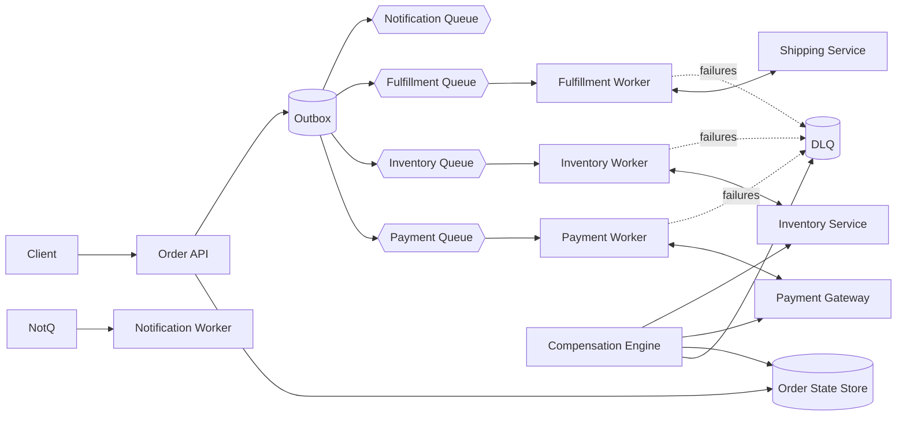

*The end-to-end architecture: the Order API persists intent and publishes events via a transactional outbox; per-stage worker pools consume from isolated queues; failures route to a dead-letter queue for remediation; the Compensation Engine reverses completed steps when later stages fail permanently. Each stage is independently scalable and isolated.*

<div id="functional-non-functional-requirements">

#### Functional and Non-Functional Requirements

**Functional Requirements:**

- Accept a new order and enqueue it for processing
- Process an order through an ordered sequence of steps, each performed by a (possibly different) worker/service
- Retry a failed step with backoff, and move permanently-failing orders to a dead-letter queue for manual handling
- Guarantee each step executes effectively-once (no double payment capture, no double inventory decrement) despite at-least-once delivery from the queue
- Provide order status visibility at every stage
- Issue compensations (refunds, inventory release) when late-stage steps fail permanently

**Non-Functional Requirements:**

- **Scale**: Tens of thousands of orders/minute at peak (e.g., flash sale)
- **Reliability**: No order should be silently lost; every step must be retried until it succeeds or is explicitly failed
- **Consistency**: Steps must not be applied twice (e.g., charging a customer twice) even when the same message is redelivered
- **Observability**: Every order's current stage and failure history must be queryable
- **Latency**: Non-critical path steps execute asynchronously; critical-path customer-facing reads stay sub-second

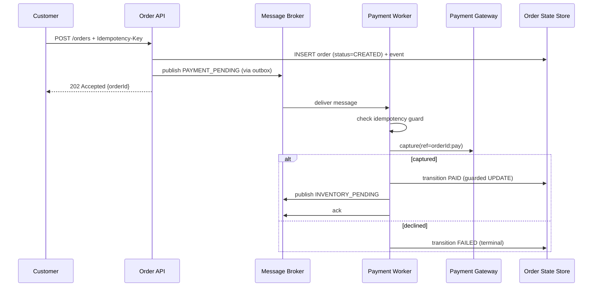

*Sequence diagram showing the payment capture step: the customer submits an order, the API atomically persists it and publishes an event, then a payment worker picks up the message, checks its idempotency guard, calls the payment gateway with a deterministic reference, and performs a guarded state transition. The idempotency key and guard table ensure effective-once semantics even under message redelivery.*

---

### Characteristics

- **Reliability-over-latency posture**: minutes of pipeline latency are acceptable; lost/duplicated orders are not — every choice optimizes durability first.
- **Stage isolation economics**: independent queues/workers mean a fulfillment outage slows deliveries but never blocks new-order intake or payment capture.
- **Explicit-state recoverability**: any worker can resume any order from durable state alone — no implicit in-memory knowledge anywhere.
- **Burst-tolerant by buffering**: flash-sale spikes queue rather than cascade; autoscaling drains backlog with oldest-first fairness.
- **Poison-containment**: DLQs quarantine unprocessable orders before they block partitions; remediation is a workflow, not heroics.
- **Observability-as-feature**: order-status queries are product surface (customer support) and ops surface (aging/failure dashboards) simultaneously.

---

### Pros

- Straightforward mental model (queues + states + idempotency) despite distributed underpinnings.
- Technology-flexible: works over Kafka/SQS/RabbitMQ with identical patterns.
- Failure behavior explicit, testable, and rehearseable (chaos drills kill workers mid-step).
- Independent stage scaling allows tuning worker pools per bottleneck (payment vs. fulfillment).

---

### Cons

- Infrastructure count multiplies (N queues, N consumer groups, state store, DLQ tooling).
- End-to-end latency grows with stage count — unsuitable for truly synchronous UX expectations without parallel design work.
- Idempotency bookkeeping adds writes everywhere; storage costs nontrivial at scale.
- Compensation completeness burden mirrors saga discipline — every step needs its unwind designed.
- Debugging spans multiple services and time windows; distributed tracing becomes mandatory.

---

### Use Cases

- **Flash-sale order surge**
  *Problem*: 100× order spike; downstream fulfillment capacity fixed. *Solution*: intake queueing with honest "order received, processing" UX, stage-wise autoscaling, admission shaping if backlog exceeds hours-not-minutes drain projections. *Trade-off*: delayed confirmation emails accepted over site-wide collapse.

- **Marketplace multi-party settlement**
  *Problem*: one customer order splits into N seller sub-orders with separate payouts. *Solution*: parent order fans into child sagas per seller; compensation scoping isolates failed sellers without voiding successful ones; settlement events feed payout pipelines. *Trade-off*: partial-failure UX complexity (disclose per-item status honestly).

- **Subscription renewal billing**
  *Problem*: millions of monthly renewals; card failures cluster post-holidays. *Solution*: dunning state machine (retry ladders across days/methods), pre-dunning notifications, involuntary-churn analytics feeding save-offer experiments. *Trade-off*: aggressive retries harm issuer relationships — pacing tuned with acquirer guidance.

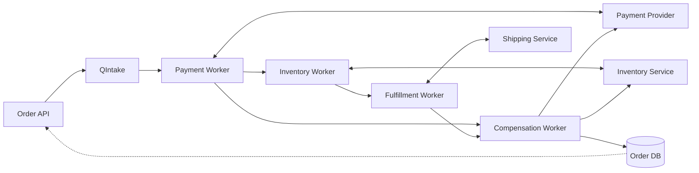

*Per-stage queue topology: each stage (payment, inventory, fulfillment) runs in its own worker pool consuming from a partitioned queue. The Compensation Worker consumes from the dead-letter queue and invokes reversal operations on the original external services. The Order DB is the durable state anchor that all workers reconcile against.*

---

### Components

- **Order intake API**
  *Purpose*: validate + persist CREATED + enqueue. *Responsibilities*: schema/authn validation, idempotency-key registration (client retries collapse), transactional outbox write (order row + queue event atomically).

- **Per-stage workers**
  *Purpose*: execute one step each. *Responsibilities*: claim messages (visibility timeouts), verify preconditions from state store, invoke downstream idempotently, record transition, ack. Heartbeat long operations.

- **State store**
  *Purpose*: order truth. *Responsibilities*: guarded transitions, event-append audit trail, query APIs for support/ops. Strongly consistent (this is the anchor everything reconciles against).

- **DLQ + remediation console**
  *Purpose*: quarantine + fix loop. *Responsibilities*: retention, inspection UI showing failure history, guarded replay/edit actions, per-stage inflow alerting.

- **Reconciliation service**
  *Purpose*: catch what slips between layers. *Responsibilities*: sweep AWAITING states, compare PSP settlement files against PAID claims, flag drift.

| Component | Purpose | Key Responsibility | External Integrations |
|---|---|---|---|
| Order API | Intake & validation | Schema validation, idempotency-key handling, atomic outbox write | Customer front-end, payment tokenization |
| Payment Worker | Charge customer | Idempotent PSP capture, ambiguity resolution, PAID transition | Payment gateway, PSP settlement files |
| Inventory Worker | Reserve stock | Atomic check-and-reserve, reservation TTL, over-sell prevention | Inventory management system |
| Fulfillment Worker | Ship the order | Create shipment, notify carrier, FULFILLED transition | Shipping carrier API, warehouse WMS |
| Notification Worker | Customer comms | Send email/SMS confirmations, status updates | Email/SMS providers |
| Compensation Engine | Reverse steps | Refund payments, release reservations, FAILED_WITH_REFUND | Payment gateway, inventory service |
| Reconciliation | Drift detection | Sweep AWAITING states, compare PSP files, alert drift | Payment gateway settlements |

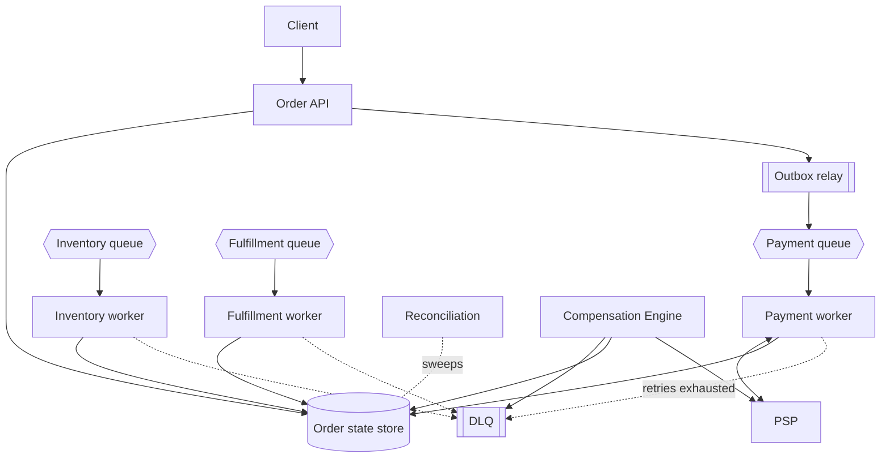

*Component interaction diagram showing the transactional intake flow (API writes to both the Order state store and the outbox atomically), per-stage worker consumption, external integrations, and the recovery loop (DLQ → Compensation Engine → Reconciliation).*

---

### Architectural Patterns

- **Claim-check visibility timeout**: worker leases message N seconds, heartbeats renewing while healthy; crash lets lease lapse → redelivery. Pairs with the idempotency table so redeliveries are free.
- **Transactional outbox**: order-row mutation + queue-event insertion share one local transaction; relay publishes. Eliminates dual-write loss at intake — the pattern every serious implementation converges on.
- **Guarded-transition idempotency**: `UPDATE ... WHERE status = 'EXPECTED'` returning affected-rows as the proceed signal — cheap, atomic, universally applicable.
- **Retry budget + jittered backoff**: attempts capped (5 typical), delays `min(cap, base×2^n) ± jitter`; budget prevents infinite cost on hopeless orders while weathering real transients.
- **Saga-style compensation ladder**: reverse-ordered unwinds with idempotent compensations, triggered only on *confirmed* permanent failure (never ambiguous).
- **Backpressure via queue-depth signals**: autoscaling consumes depth; sustained growth beyond drain-rate triggers upstream admission shaping (checkout-side throttling) rather than silent latency death.
- **Anti-pattern**: sharing one queue across stages (ordering coupling, scaling entanglement) or retrying ambiguous outcomes blindly.

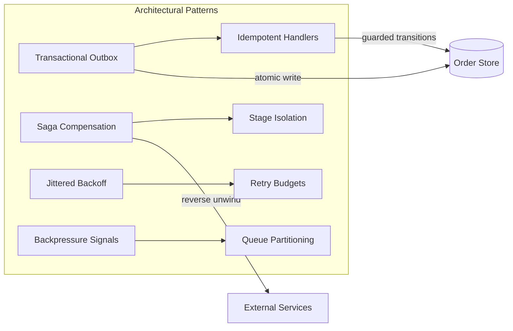

*Architectural pattern relationships: the Transactional Outbox pattern ensures atomic intent persistence; Idempotent Handlers guard every state transition; the Saga Compensation pattern provides reverse-order unwinding; Stage Isolation keeps failures contained; Jittered Backoff and Retry Budgets bound redelivery costs; Backpressure Signals and Queue Partitioning prevent cascading overload.*

---

### Benefits

- **Zero-silent-loss guarantee** becomes provable: every order exists in exactly one known state with full event history.
- **Independent stage evolution**: deploy/payment-tune/scale each stage on its own cadence without fleet-wide coordination.
- **Flash-sale survival**: intake keeps accepting (queue absorbs) while downstream drains at sustainable rates — revenue captured during incidents competitors lose entirely.
- **Support empowerment**: any agent answers "where's my order?" instantly from state store, cutting ticket escalations.
- **Auditability**: event-append trails satisfy disputes, financial reconciliation, and postmortems mechanically.

---

### Challenges

- **Technical**: exactly-once charge/inventory semantics layering; ambiguous-outcome resolution workflows (timeout ≠ failure); outbox-relay lag during bursts; clock skew in timeout math.
- **Scalability**: partition hot-spots when one SKU/order-shard dominates; DLQ flooding masking fresh failures; state-store write amplification at peak.
- **Performance**: p99 stage latency tails from straggler downstreams (per-call hedging where safe); serialization overhead of fat payloads (claim-check pattern: pass references not blobs).
- **Reliability**: state-store HA (this anchors everything); queue broker failover semantics; worker-deploy rolling restarts mid-message (graceful handback).
- **Maintainability**: schema evolution across years of queued messages (versioned envelopes); stage-contract drift between teams.
- **Operational**: DLQ triage SLAs; reconciliation break investigation; capacity planning for predictable peaks (holidays).
- **Security**: payload encryption at rest; PII minimization in events; authz so tenants see only their orders.

---

### Best Practices

- **Persist intent before side effects** (outbox/intent rows first — always).
- **Classify exceptions explicitly** with per-class handling tables; forbid generic catch-all retries.
- **Key idempotency at business granularity** (orderId+step), never transport artifacts (message IDs differ across brokers).
- **Alert on aging, not just failures**: orders stuck >SLA in any state page someone — silent stalls are the common disaster.
- **Make DLQ replay a guarded product**: edit-and-retry with diffs, bulk operations audited, rate-limited re-injection protecting downstream recovery.
- **Version message envelopes** from day one; consumers reject unknown versions loudly.
- **Chaos-test continuously**: kill workers mid-step in staging nightly; assert zero loss/duplication automatically.
- **Reconcile externally daily**: PSP settlements vs internal PAID states — drift caught early is a bug report, late is a scandal.

---

### When to Use / When Not to Use

**Deploy this architecture when**: orders span multiple fallible services, volumes justify infrastructure, reliability directly equals revenue, teams own stages independently.

**Avoid this architecture when**: a single database with plain ACID transactions can hold the entire order lifecycle (small merchants), volume is low (< 100 orders/hour) where a job-table + cron suffices, or the workflow is purely synchronous with reliable local dependencies (e.g., a single payment provider with idempotent API).

**Alternatives / complements**:

- **Workflow engines** (Temporal/Cadence): replace bespoke state machinery with durable-execution primitives. Signals: complex branching, human-in-the-loop timers, long-running executions. Gains: replay/versioning tooling, ecosystem support. Lost: queue-tier control granularity, operational familiarity.
- **Kafka Streams topologies**: for stream-native shops where every event is a first-class citizen and the team is comfortable with stream processing semantics.
- **Cloud-managed orchestrators** (Step Functions, Workflows): trade flexibility for ops relief — good for simple linear flows, painful for complex branching.

**Decision factors**: order complexity (stage count), peak volumes, team size, existing queue estate, tolerance for operational surface area, and regulatory requirements (PCI-DSS, SOX) that may favor managed services.

---

### Data Model and API

The order processing system exposes HTTP APIs for order submission and status tracking, plus webhook endpoints for PSP and carrier integrations. The data model centers on immutable orders, append-only events, idempotency guards, and attempt tracking.

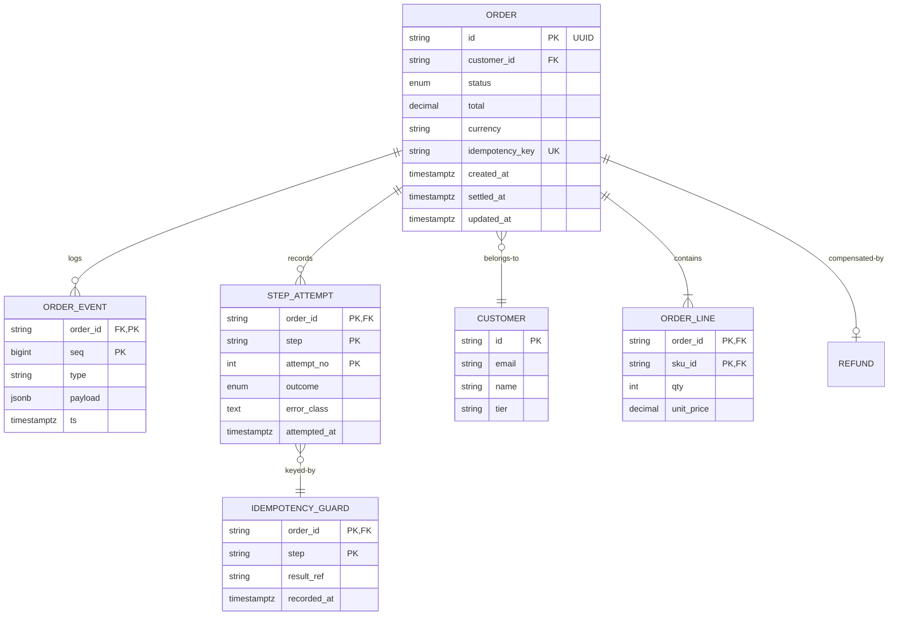

*Entity-relationship diagram: the ORDER entity is the durable truth, with ORDER_EVENT providing the immutable append-only audit trail, STEP_ATTEMPT tracking retry history per step, and IDEMPOTENCY_GUARD enforcing effective-once semantics. ORDER_LINE captures line items; REFUND records compensations.*

**Design choices**: append-only events form the audit spine; attempts track retry history per step feeding backoff decisions and analytics; guards carry downstream result references enabling ambiguity resolution; unique idempotency constraint structuralizes client-retry safety. Partition orders monthly; events archived to warehouse post-90-days; guards retained per financial policy (years).

#### API Contract

| Method | Endpoint | Purpose |
|---|---|---|
| POST | `/api/v1/orders` | Submit a new order |
| GET | `/api/v1/orders/{id}` | Get order status and history |
| POST | `/api/v1/orders/{id}/cancel` | Request cancellation |
| GET | `/api/v1/orders` | List orders (filtered) |

| Method | Endpoint | Purpose |
|---|---|---|
| POST | `/api/v1/webhooks/psp` | Payment provider callbacks |
| POST | `/api/v1/webhooks/carrier` | Shipping carrier callbacks |

**POST /api/v1/orders — Request Body**:
```json
{
  "order_id": "ord_abc123",
  "customer_id": "cus_xyz",
  "items": [
    {"sku": "SKU-001", "quantity": 1, "price": 99.99}
  ],
  "payment_method": {"type": "card", "token": "pm_tok"},
  "shipping_address": {
    "line1": "123 Main St", "city": "SF", "state": "CA",
    "zip": "94102", "country": "US"
  },
  "idempotency_key": "ord_abc123"
}
```

**GET /api/v1/orders/{id} — Response**:
```json
{
  "order_id": "ord_abc123",
  "status": "SHIPPED",
  "created_at": "2024-06-14T10:00:00Z",
  "updated_at": "2024-06-14T14:30:00Z",
  "total_amount": 99.99,
  "currency": "USD",
  "steps": [
    {"step": "payment", "status": "SUCCESS", "timestamp": "2024-06-14T10:00:05Z"},
    {"step": "inventory", "status": "SUCCESS", "timestamp": "2024-06-14T10:00:07Z"},
    {"step": "fulfillment", "status": "SUCCESS", "timestamp": "2024-06-14T14:30:00Z"}
  ],
  "tracking_number": "1Z9999W99999999999"
}
```

**Status codes**: `200` OK, `201` Created, `202` Accepted (queued), `400` Invalid request, `401` Auth required, `409` Conflict (duplicate order_id), `429` Rate limited, `503` Service degraded.

**Idempotency**: The `idempotency_key` field ensures re-submission of the same order returns `200 OK` with the existing order (not `201 Created`).

**Webhook security**: Webhooks are signed with HMAC-SHA256 (`X-Order-Signature` header) and verified within 5 seconds. Webhook processing is decoupled — events go to a queue for async handling.

---

### Domain-Specific: Order Processing and Sagas Deep Dive

This section covers the core technical challenges unique to order processing systems: order lifecycle management, the saga pattern for distributed transactions, effective-once semantics over at-least-once queues, and payment orchestration with ambiguity resolution. These topics are the heart of fault-tolerant order system design.

#### Order State Machine Lifecycle

The order state store is not a status label — it is the recovery protocol. Every transition is guarded so a redelivered message finding the wrong state does nothing.

```
CREATED → PAYMENT_PENDING → PAID → RESERVED → FULFILLING → FULFILLED → NOTIFIED
                     ↘ FAILED ← compensations from any stage
```

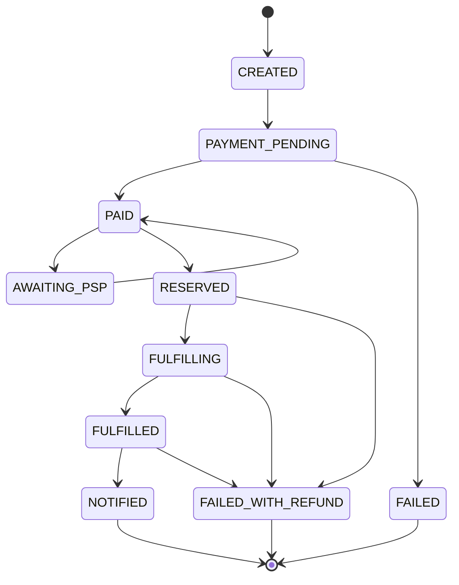

*Order state machine: the lifecycle flows forward through CREATED → PAYMENT_PENDING → PAID → RESERVED → FULFILLING → FULFILLED → NOTIFIED. The FAILED and FAILED_WITH_REFUND terminal states absorb all compensation paths. The AWAITING_PSP state handles ambiguous payment outcomes requiring external resolution.*

**Rules that make this load-bearing:**

- Transitions are **guarded** (`UPDATE orders SET status='PAID' WHERE id=? AND status='PAYMENT_PENDING'`) — a redelivered message finding the wrong state does nothing.
- Each worker reads state *before* acting and acts only on expected source-states; the conditional update is the idempotency gate at the orchestration level.
- Every transition appends to `order_events` (audit + debugging), written in the same transaction where possible.

#### Effective-Once Layering

Queues deliver at-least-once; effectiveness comes from stacking four defense layers:

| Layer | Mechanism | Covers |
|---|---|---|
| Queue | dedup windows / message IDs | network-level redelivery |
| Worker | idempotency table keyed (orderId, step) | crash-after-effect-before-ack |
| Downstream | idempotent APIs (PSP ref keys) | provider-side retries |
| Reconciliation | periodic sweeps comparing effects vs state | everything residual |

No single layer suffices; interviews probe whether you know *which gap each closes*.

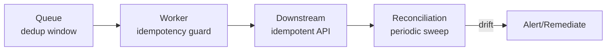

*Four-layer idempotency defense: the queue provides network-level message deduplication within a time window; the worker's idempotency guard table (keyed by orderId+step) handles crash-after-effect-before-ack; downstream idempotent APIs (e.g., PSP reference keys) handle provider-side retries; periodic reconciliation sweeps catch any residual drift.*

#### Error Classification

Every exception maps to exactly one class, driving handling:

- **Transient** (timeouts, 5xx, connection resets): retry with exponential backoff + jitter within budget.
- **Permanent** (card declined, address invalid): fail-fast to terminal path — retries waste money and queue depth.
- **Ambiguous** (downstream timeout where effect unknown): park in AWAITING_PSP; resolve via webhook/reconciliation, never blind-retry (double-capture risk) or blind-compensate (refund of captured funds).

The ambiguous class is where real systems distinguish themselves.

#### Compensation Choreography

Late-stage permanent failures unwind in reverse:

```
FULFILLMENT fails permanently after PAID+RESERVED:
  release reservation (idempotent)
  refund payment (idempotent, PSP-ref keyed)
  mark FAILED_WITH_REFUND
  notify customer honestly
```

Compensations themselves retry until confirmed — a failed compensation is its own alerting incident, since money/state now genuinely diverge.

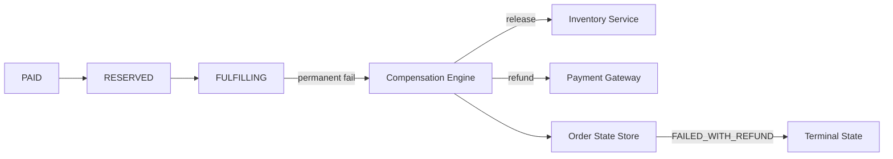

*Compensation flow: when fulfillment permanently fails after payment has been captured and inventory reserved, the Compensation Engine triggers in reverse order — first releasing the inventory reservation, then issuing a refund to the payment gateway — both via idempotent calls. The order state transitions to FAILED_WITH_REFUND, and the customer is notified honestly.*

#### Saga Pattern Application

The saga pattern decomposes a distributed transaction (charge + reserve + fulfill) into a sequence of local transactions, each with a compensating action:

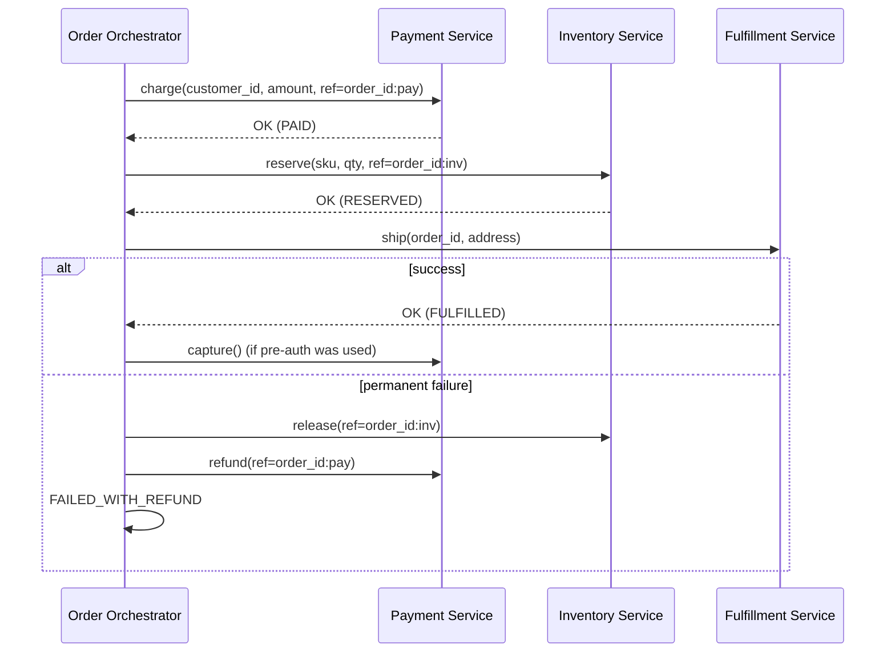

*Choreographed saga: the Order Orchestrator drives each local transaction in sequence. If a step succeeds, it proceeds to the next. If a step fails permanently, the orchestrator triggers compensating transactions (release inventory, refund payment) in reverse order. Each compensating call uses the same idempotency reference as the original, ensuring effective-once semantics.*

**Saga variants:**

- **Choreographed**: each service publishes an event on completion; the next service listens. No central coordinator. *Pros*: no single point of failure, loose coupling. *Cons*: hard to reason about global flow, complex compensation triggering.
- **Orchestrated**: a central saga orchestrator (like the order state machine above) directs each step. *Pros*: clear flow, easy compensation. *Cons*: orchestrator is a coordination bottleneck.

For order processing, **orchestrated sagas** are preferred — the explicit state machine makes recovery and debugging tractable.

#### Payment Orchestration

Payment orchestration is the most critical stage because payment providers are inherently unreliable (timeouts, network partitions, ambiguous outcomes). The pattern:

1. **Idempotent reference keys**: every PSP call passes a deterministic reference (e.g., `order_id:pay`). The PSP treats the same reference as the same logical operation — no double charges even under redelivery.
2. **Ambiguity resolution**: on timeout, the worker parks the order in `AWAITING_PSP` and stops retrying. A reconciliation sweeper polls the PSP for the reference's status and resolves the state.
3. **Webhook confirmation**: the PSP's webhook (verified via HMAC signature) arrives and resolves any parked states asynchronously.

```java
@Service
@Slf4j
public class PaymentWorker {

    private final OrderStateRepository state;
    private final GuardRepository guards;
    private final PaymentGateway gateway;
    private final Clock clock;

    @KafkaListener(topics = "orders.payment", groupId = "payment-workers")
    public void handle(OrderMessage msg, Acknowledgment ack) {
        // Insert-if-absent guard: uniqueness enforces once-only execution
        boolean firstAttempt = guards.recordIfAbsent(msg.orderId(), "PAYMENT");
        var order = state.expect(msg.orderId(), Status.PAYMENT_PENDING);

        if (!firstAttempt && guards.hasResult(msg.orderId(), "PAYMENT")) {
            // previous attempt already succeeded; just advance if needed
            state.transition(msg.orderId(), Status.PAID);
            publisher.send("orders.inventory", msg.next());
            ack.acknowledge();
            return;
        }
        try {
            Capture result = gateway.capture(order.total(),
                    msg.orderId() + ":pay");           // PSP-side idempotency too
            guards.recordResult(msg.orderId(), "PAYMENT", result.ref());
            state.transition(msg.orderId(), Status.PAID);
            publisher.send("orders.inventory", msg.next());
            ack.acknowledge();
        } catch (AmbiguousOutcomeException e) {
            // PSP did not respond with a clear success/failure — do NOT retry blindly
            state.transition(msg.orderId(), Status.AWAITING_PSP);
            ack.acknowledge();  // let the sweeper handle this
        } catch (PermanentDeclineException e) {
            state.fail(msg.orderId(), e.reason());
            ack.acknowledge();
        }
        // transient exceptions propagate → container backoff/redelivery
    }
}
```

*The `PaymentWorker` bean demonstrates the full idempotency layering: the guard table (`recordIfAbsent` with a unique constraint) is the primary once-guard; the PSP reference key provides downstream idempotency; on ambiguous outcome, the order is parked in `AWAITING_PSP` for a reconciliation sweeper rather than blindly retried (which could double-charge).*

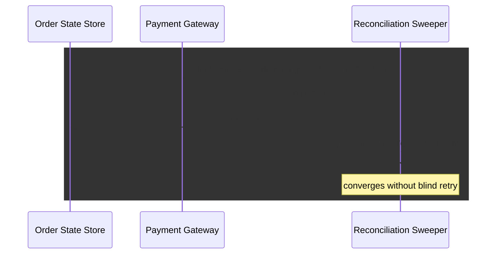

*Ambiguity resolution sequence: when the payment worker encounters a timeout (ambiguous outcome), it parks the order in AWAITING_PSP and stops retrying. The reconciliation sweeper periodically polls the PSP for the reference's status. When the PSP confirms the capture exists, the sweeper transitions the order to PAID and continues the pipeline — converging without risking a blind double-charge.*

#### Deep Dive: Outbox Relay Internals

```java
@Service
@RequiredArgsConstructor
public class OutboxRelay {

    private final OutboxRepository outboxRepository;
    private final KafkaTemplate<String, Object> kafkaTemplate;
    private final MeterRegistry meterRegistry;

    @Scheduled(fixedDelay = 1_000)
    public void publishBatch() {
        // FOR UPDATE SKIP LOCKED: each relay instance claims a disjoint batch
        List<OutboxEvent> events = outboxRepository.claimBatch(100);
        for (OutboxEvent event : events) {
            try {
                // Partition key preserves per-aggregate ordering
                kafkaTemplate.send(event.topic(), event.partitionKey(), event.payload());
                outboxRepository.markPublished(event.id());
                meterRegistry.counter("outbox.published").increment();
            } catch (Exception e) {
                meterRegistry.counter("outbox.publish_failed").increment();
                // Event remains unpublished, picked up on next tick
            }
        }
    }
}
```

*The `OutboxRelay` bean uses `FOR UPDATE SKIP LOCKED` to claim disjoint batches of events atomically. Each event is published to Kafka with its partition key (the order ID, preserving per-aggregate event ordering), then marked as published in a follow-up update. Failures leave the event in the unpublished state for retry on the next tick. Metrics track publish rate and failure rate as first-class SLOs.*

---

### Replication Strategies

Order processing systems replicate data across multiple dimensions: within a region (for availability), across regions (for global operations), and across storage systems (for different access patterns). Unlike social media feeds, orders require strong consistency for state transitions but benefit from async replication for read-only analytics.

**Leader-based replication (Order State Store):** Orders are written to a primary PostgreSQL instance and replicated to read replicas. Writes go only to the leader; reads (status queries, reporting) can be served from any replica. This gives strong consistency for state transitions (a 200 response means the order was persisted) while allowing read scaling.

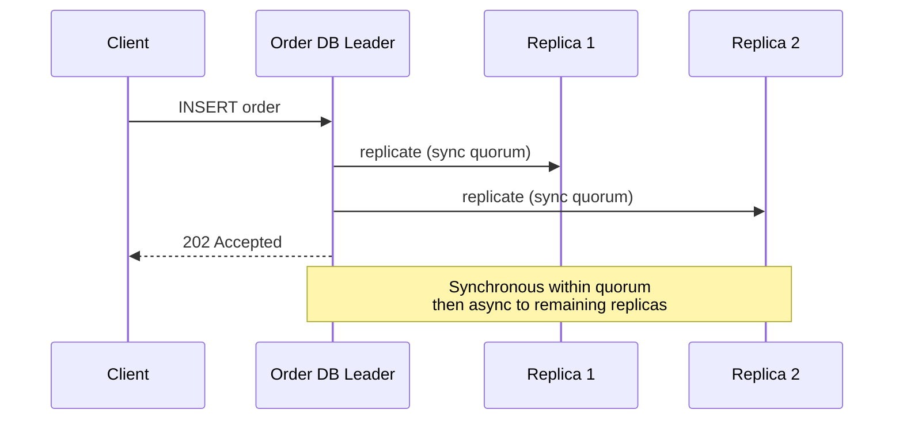

*Leader-based replication for the Order State Store: the client writes an order to the leader, which synchronously replicates to a quorum of replicas before returning 202 Accepted. Remaining replicas receive the write asynchronously. This balances strong consistency for state transitions with read scalability for status queries.*

**Leaderless replication (Outbox/DLQ tables):** The outbox and dead-letter tables use a multi-master pattern where any instance can write, with conflict resolution via deterministic keys. This enables horizontal scaling of the outbox relay without a single write-hotspot.

**Active-active for read replicas:** Order status queries can be served from read replicas in multiple regions. Writes always go to the primary region's leader; reads are routed to the nearest replica. Cross-region replication lag is typically sub-second for the write path and bounded to seconds for reads.

**Real-world use:** Shopify uses MySQL with read replicas for order state; Kafka replicates partition leaders across availability zones for queue durability; Stripe uses global PostgreSQL clusters with logical replication for payment event distribution.

---

### Failure Detection and Membership

Order processing workers must detect failed peers, redistribute work, and continue processing without losing or duplicating orders.

**Gossip-based worker membership:** Each worker instance periodically exchanges heartbeat information with peers. When a worker fails to respond for a configurable interval, its assigned partitions are redistributed to remaining workers via Kafka's consumer group rebalance protocol.

```mermaid
graph LR
    W1[Worker 1] -->|heartbeat| W2[Worker 2]
    W2 -->|heartbeat| W3[Worker 3]
    W3 -->|heartbeat| W4[Worker 4]
    W4 -->|heartbeat| W1
    W1 -->|suspects W3 down| W2
    W2 -->|confirms W3 down| W3
    Note over W3: Lease expired →<br/>messages redelivered
```

*Gossip-based worker membership: workers exchange heartbeats in a ring topology. When a worker is suspected of being down, the suspicion propagates through gossip. Once confirmed by multiple peers, the worker's partitions are redistributed and its in-flight messages are redelivered after visibility timeout expiry.*

**Health checks for order processing:**

| Component | Check Interval | Timeout | Action |
|---|---|---|---|
| Order API | 5s | 15s | Kubernetes liveness kill + restart |
| Payment Worker | 10s | 30s | Kafka rebalance, message redelivery |
| Fulfillment Worker | 5s | 15s | Release in-flight shipment locks, retry |
| Order State Store | 3s | 10s | Failover to sync replica, alert |
| Outbox Relay | 30s | 60s | Alert on lag > 2s, restart if stuck |

**Circuit breakers:** For dependencies that are failing (e.g., payment gateway unavailable), a circuit breaker (Resilience4j) trips after N consecutive failures and stops sending requests for a cool-down period. This prevents cascading failures — if the PSP is slow, the Payment Worker short-circuits and queues the work for later instead of saturating with slow requests.

```java
@Component
public class PaymentGatewayClient {

    private final Retry retry;
    private final CircuitBreaker circuitBreaker;

    public PaymentGatewayClient(PaymentProperties props) {
        this.retry = Retry.of("payment-gateway", RetryConfig.custom()
                .maxAttempts(5)
                .waitDuration(Duration.ofSeconds(2))
                .retryOnException(PermanentDeclineException.class, false)
                .retryOnException(TimeoutException.class, true)
                .build());
        this.circuitBreaker = CircuitBreaker.of("payment-gateway",
                CircuitBreakerConfig.custom()
                        .failureRateThreshold(50)
                        .waitDurationInOpenState(Duration.ofSeconds(30))
                        .build());
    }
}
```

*The `PaymentGatewayClient` bean configures Resilience4j with a retry policy (5 attempts, 2-second intervals) and a circuit breaker (trips at 50% failure rate, opens for 30 seconds). Transient exceptions (timeouts) are retried; permanent declines (card declined) are not. This prevents cascading failures when the payment gateway degrades.*

---

### High Availability and Scalability

Order processing systems must remain available during node failures, network partitions, and regional outages while scaling to handle global traffic peaks.

#### Multi-Region Deployment

Deploy services in at least 3 regions (e.g., us-east, eu-west, ap-southeast). Orders are routed to the nearest region via GeoDNS. Each region is self-sufficient for order processing, with asynchronous cross-region replication for audit and analytics.

- **Active-passive for Order DB:** Writes go to the primary region; reads can be served from any region's read replica. Cross-region replication lag is typically sub-second.
- **Active-active for read replicas:** Status queries can be served from the nearest region's replica.
- **Global CDN:** Static assets (order confirmations, packaging slip PDFs) cached at edge locations.

```mermaid
graph TD
    C[Client] --> LB[Global Load Balancer]
    LB -->|nearest| R1[Region 1 - Primary]
    LB -->|fallback| R2[Region 2 - Secondary]
    R1 -->|async| R2
    R1 --> API[Order API]
    R1 --> DB1[(Order DB - Primary)]
    R2 --> DB2[(Order DB - Replica]
    DB1 -->|replicate| DB2
    API --> Q1[Payment Queue]
    API --> Q2[Inventory Queue]
    Q1 --> W1[Payment Worker]
    Q2 --> W2[Inventory Worker]
    subgraph Region 1
        API
        DB1
        Q1
        Q2
        W1
        W2
    end
```

*Multi-region high availability: a global load balancer routes clients to their nearest region. The primary region handles writes to the Order DB with synchronous replication to the secondary region. Queues and workers are region-local for low-latency processing, while read replicas in both regions serve status queries.*

#### Auto-Scaling

- **Stateless services (Order API):** Scale horizontally based on CPU and request latency. Kubernetes HPA adjusts replica count automatically.
- **Workers:** Scale based on queue depth. If the payment queue depth exceeds 10,000 messages, spin up additional payment workers.
- **Queues:** Partition by order_id hash to enable parallel consumer groups. Each partition is consumed by one worker, ensuring per-order ordering.

#### Graceful Degradation

When a component fails, the system should degrade rather than crash:

- **Payment gateway down:** Open circuit breaker → queue payments → resume when gateway recovers. New orders accepted but payments deferred.
- **Inventory service down:** Reserve inventory lazily — mark orders as "PENDING_INVENTORY" and retry. Prevent overselling via reservation TTL.
- **Fulfillment service down:** Queue shipments → process when service recovers. Customers see "order received, shipping pending."
- **State store unavailable:** Read-only operations fail gracefully with cached data; writes queued in outbox for replay.

---

### Performance and Optimization

The performance of an order processing system is measured by order intake latency (sub-50 ms for the initial 202 response) and end-to-end processing time (seconds to minutes depending on stage).

#### Latency Optimization

- **Async fan-out at intake:** Order creation returns 202 Accepted immediately after DB write; downstream processing happens asynchronously via queues. This keeps the order API latency < 50 ms.
- **Batch downstream calls:** Workers batch Kafka produces and DB updates (pipeline 100 writes per pipeline) to reduce per-write overhead.
- **Connection pooling:** Maintain persistent HTTP/gRPC connections between workers and external services (payment gateway, shipping API) to avoid per-request handshake overhead.
- **Claim-check pattern:** Pass order references (not full payloads) in queue messages; fetch full order details from the DB on worker side. Reduces message size and serialization overhead.

#### Throughput Optimization

- **Queue partitioning:** Partition each stage's queue by order_id hash to enable parallel consumer groups. Each partition is consumed by one worker, ensuring per-order ordering while allowing horizontal scaling.
- **Worker concurrency:** Each worker handles 1 message at a time (ordering required); scale workers horizontally. For idempotent stages, batch processing within a single message is safe.
- **Read replicas:** Order status reads served from Post DB read replicas, multiplying database read throughput.
- **Request coalescing:** When multiple customers check the same order (rare), only one DB query is issued and the result is shared (single-flight pattern).

#### Caching Strategies

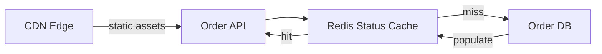

*Multi-tier caching: the Order API checks the Redis status cache first; on a miss, it falls back to the Order DB and populates the cache. Static assets (PDFs, confirmations) are served from CDN edge locations, reducing origin load.*

#### Write Path Optimization

- **Idempotent intake:** The idempotency key at the intake API ensures client retries (network timeouts during submission) collapse to a single order. The key is stored as a unique constraint in the Order DB.
- **Outbox batching:** The outbox relay batches event publication to Kafka in groups of 100, reducing publish overhead.
- **Partition key selection:** Orders are partitioned by `customer_id` hash to collocate a customer's orders while distributing load evenly. Hot customers (high-volume resellers) use composite keys with random suffixes.

---

### CAP Theorem and Consistency Trade-offs

The CAP theorem states that during a network partition, a distributed system can provide at most two of: Consistency, Availability, and Partition tolerance. Since order processing operates over networks, partition tolerance is always required.

#### Order State Store — CP (Consistency + Partition Tolerance)

Order state transitions require strong consistency: if the API returns 202 Accepted, the order must exist in the CREATED state and be recoverable. A failed write should not silently return success. The state store uses leader-based replication with synchronous acknowledgment from a quorum before returning success.

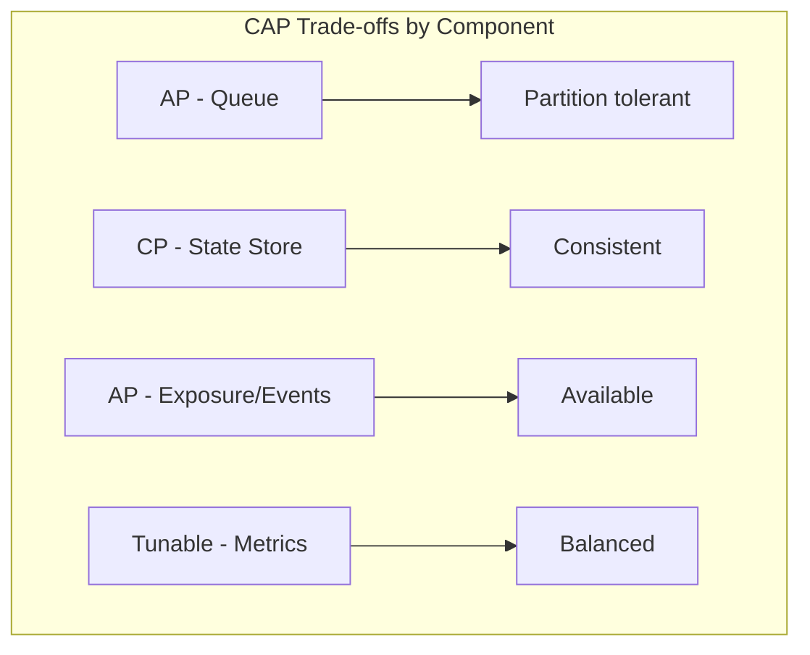

*CAP trade-offs across order processing components: message queues are AP (availability-first, since messages can be replayed); the state store is CP (consistency-first, since order state must be accurate); event streams are AP (availability-first, since duplicates are handled by idempotency); metrics stores use tunable consistency.*

**Interview question:** *Is an order processing system strongly consistent or eventually consistent?*

**Answer:** An order processing system makes a nuanced choice: it is strongly consistent for state transitions (a 202 response means the order is durably stored) and eventually consistent for read-only queries (status updates may lag by sub-second). Event logging and outbox publication are eventually consistent by design (async via Kafka), but the idempotency guards ensure correctness regardless of ordering. This pragmatic split is the key insight interviewers look for.

#### Inventory Service — AP with Reservation TTL

Inventory reservations can be eventually consistent because the reservation TTL provides a safety net. If a reservation isn't confirmed within the TTL, it's automatically released, preventing overselling.

#### Payment Reconciliation — Eventual Consistency with Bounded Window

Payment events (captures, refunds) are reconciled daily against PSP settlement files. Drift within a 24-hour window is expected; drift beyond 24 hours triggers immediate alerts.

---

### Encryption and Key Management

An order processing system handles highly sensitive data — customer payment information, shipping addresses, order histories, and PII. Encryption must protect data at rest, in transit, and during processing, while maintaining PCI-DSS compliance.

#### PCI-DSS Compliance and Payment Data

**Tokenization:** Never store raw card numbers. Payment gateways return a token (e.g., `pm_tok`) that is stored instead. The token has no intrinsic value outside the PSP's vault.

**Payment data flow:** Card data goes directly from the client to the PSP via client-side tokenization — the order processing system never touches raw card numbers. The backend only receives a token.

#### Encryption at Rest

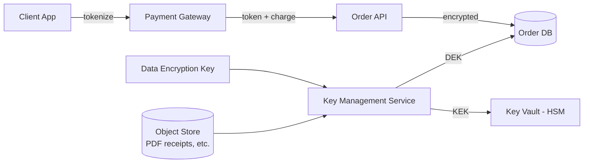

*Encryption at rest architecture: card data is tokenized client-side and never touches the order processing system; the Order DB stores only tokens (never raw card numbers); per-object DEKs managed by a KMS protect stored data (encrypted receipts, audit logs); KEKs are stored in an HSM-backed key vault.*

**Media encryption:** Order confirmations, packing slips, and invoices stored in object storage are encrypted with per-object DEKs before storage.

```java
@Service
@RequiredArgsConstructor
public class OrderEncryptionService {

    @Value("${app.encryption.order-key-id}")
    private String keyId;

    private final AwsKms kmsClient;
    private final MeterRegistry meterRegistry;

    public EncryptedOrder encryptOrderData(OrderData plaintext) {
        var dek = kmsClient.generateDataKey(keyId);
        var cipher = Cipher.getInstance("AES/GCM/NoPadding");
        cipher.init(Cipher.ENCRYPT_MODE,
                new SecretKeySpec(dek.plaintext(), "AES"),
                new GCMParameterSpec(128, dek.iv()));

        byte[] encrypted = cipher.doFinal(serialize(plaintext));
        meterRegistry.counter("order.encrypt.success").increment();

        return new EncryptedOrder(encrypted, dek.encryptedKey(), dek.iv());
    }

    public OrderData decryptOrderData(EncryptedOrder encrypted) {
        byte[] dekPlaintext = kmsClient.decrypt(encrypted.encryptedKey(), encrypted.iv());
        var cipher = Cipher.getInstance("AES/GCM/NoPadding");
        cipher.init(Cipher.DECRYPT_MODE,
                new SecretKeySpec(dekPlaintext, "AES"),
                new GCMParameterSpec(128, encrypted.iv()));
        return deserialize(cipher.doFinal(encrypted.ciphertext()));
    }
}
```

*The `OrderEncryptionService` bean generates a per-order data encryption key (DEK) via AWS KMS, encrypts order data with AES-GCM (providing both confidentiality and integrity via the authentication tag), and stores the encrypted DEK alongside the ciphertext. Only authorized services with KMS decrypt permissions can recover the DEK to decrypt order data. Metrics track encryption success rates.*

#### Encryption in Transit

All client-to-server and server-to-server traffic uses TLS 1.3 (minimum TLS 1.2). Inter-service communication within the data center uses mTLS (mutual TLS) for service-to-service authentication. API clients pin the server certificate to prevent man-in-the-middle attacks.

#### Key Management

- **Key hierarchy:** A KEK (Key Encryption Key) in an HSM encrypts per-object DEKs. Rotating the KEK requires only re-encrypting the DEKs, not the data.
- **Key rotation:** KEKs rotated every 90 days; per-order DEKs rotated on each encryption (generated fresh per order).
- **Multi-region KMS:** Keys are available in all deployment regions. Cloud KMS replicates keys automatically.

---

### Authentication and Authorization

Every request to the order processing system must be authenticated (who is calling?) and authorized (what can they do?). Customer-facing requests are authenticated via OAuth 2.0 JWT tokens; internal service-to-service calls use mTLS or signed JWTs.

#### Authentication Methods

- **OAuth 2.0 + JWT:** Customers authenticate via the e-commerce platform's auth service. A short-lived JWT (15 min) and refresh token (7 days) are issued. The JWT contains the user ID, scopes, and expiry.
- **Service-to-service:** Internal services authenticate via mTLS certificates issued by a private CA. No shared secrets.
- **Payment gateway callbacks:** Webhook requests are signed with HMAC-SHA256 (`X-Signature` header) and verified within 5 seconds.

#### Authorization Models

- **Scope-based (OAuth 2.0 scopes):** Each token carries scopes like `orders:create`, `orders:read`, `orders:cancel`. The API Gateway enforces scope checks before routing.
- **Resource-level access:** A customer can only read/cancel their own orders. The Order API filters by `customer_id` extracted from the JWT.
- **Role-based (RBAC):** Internal roles (`support_agent`, `finance_admin`, `system_admin`) grant access to order management endpoints, refund processing, and system configuration.

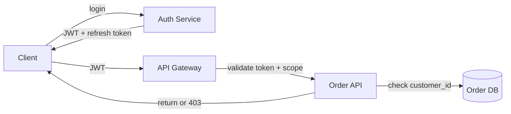

*Authentication and authorization flow: the client authenticates via the Auth Service (Google SSO or email/password), receives a JWT; the API Gateway validates the JWT signature and checks scopes before forwarding to the Order API; the Order API performs resource-level access checks (customer can only see their own orders).*

```java
@RestController
@RequestMapping("/api/v1/orders")
@RequiredArgsConstructor
public class OrderController {

    private final OrderService orderService;
    private final AuthService authService;

    @PostMapping
    public ResponseEntity<OrderResponse> createOrder(
            @AuthenticationPrincipal JwtAuthenticatedUser user,
            @Valid @RequestBody CreateOrderRequest request,
            @RequestHeader("Idempotency-Key") String idempotencyKey) {

        // Resource-level authorization: customer can only create their own orders
        if (!user.customerId().equals(request.customerId())) {
            throw new AccessDeniedException("Cannot create orders for other customers");
        }

        var response = orderService.createOrder(user.customerId(), request, idempotencyKey);
        return ResponseEntity.status(HttpStatus.ACCEPTED).body(response);
    }

    @GetMapping("/{orderId}")
    public ResponseEntity<OrderResponse> getOrder(
            @AuthenticationPrincipal JwtAuthenticatedUser user,
            @PathVariable String orderId,
            @Parameter(description = "Field-level data to include")
            @RequestParam(required = false) List<String> fields) {

        var order = orderService.getOrder(orderId);
        // Authorization: only the order's customer or an admin can view it
        if (!order.customerId().equals(user.customerId())
                && !authService.hasScope(user, "orders:read:all")) {
            throw new AccessDeniedException("Not authorized to view this order");
        }

        var response = OrderResponse.from(order, fields); // field-level filtering
        return ResponseEntity.ok(response);
    }
}
```

*The `OrderController` bean enforces resource-level authorization: POST `/orders` checks that the authenticated customer matches the order's customer_id; GET `/orders/{id}` checks that the viewer is either the order's owner or has the `orders:read:all` admin scope. The `@AuthenticationPrincipal` annotation injects the authenticated user from the security context, and field-level filtering reduces data exposure.*

---

### Security Threats and Mitigations

#### Threat: Payment Fraud

- **Risk:** An attacker exploits a bug to charge cards without legitimate orders, or double-charges customers during retry storms.
- **Mitigation:** Dual idempotency (application-level guard table + PSP-side reference keys) makes double-charges impossible. Transaction monitoring detects anomalous charge patterns (high frequency, unusual amounts, velocity by IP). PCI-DSS compliance requires client-side tokenization — the backend never sees raw card data.

#### Threat: Order ID Enumeration

- **Risk:** A malicious user guesses order IDs to view other customers' orders, shipping addresses, or purchase history.
- **Mitigation:** Use UUIDv4 (not sequential) for order IDs — unguessable. Enforce resource-level authorization on every read. Log and alert on rapid ID enumeration attempts (rate limiting by user + IP).

#### Threat: Inventory Race Conditions

- **Risk:** During flash sales, multiple workers race to decrement the same SKU, causing overselling (selling more than available stock).
- **Mitigation:** Use atomic check-and-decrement in the inventory service (`UPDATE stock SET qty = qty - ? WHERE sku = ? AND qty >= ?` with affected-row check). Reservation TTL ensures over-sold items are released within a bounded window. Optimistic locking with version fields on inventory rows.

```java
@Service
public class InventoryService {

    @Transactional
    public Reservation reserve(String sku, int qty, String orderId, Duration ttl) {
        // Atomic check-and-decrement: only succeeds if sufficient stock exists
        int rows = inventoryRepository.reserveStock(sku, qty);
        if (rows == 0) {
            throw new InsufficientStockException(sku, qty);
        }

        // Create a reservation with TTL; worker must confirm within ttl
        var reservation = Reservation.builder()
                .orderId(orderId)
                .sku(sku)
                .qty(qty)
                .expiresAt(Instant.now().plus(ttl))
                .build();
        reservationRepository.save(reservation);
        meterRegistry.counter("inventory.reservation.created").increment();

        return reservation;
    }

    @Transactional
    public void release(String reservationId) {
        var reservation = reservationRepository.findById(reservationId)
                .orElseThrow(() -> new NotFoundException(reservationId));
        // Return stock to pool (idempotent — check if already released)
        inventoryRepository.returnStock(reservation.sku(), reservation.qty());
        reservation.markReleased();
        meterRegistry.counter("inventory.reservation.released").increment();
    }
}
```

*The `InventoryService` bean uses `@Transactional` for atomicity. The `reserve` method performs an atomic check-and-decrement SQL operation — if the affected row count is zero, the reservation fails (insufficient stock). A reservation record with a TTL ensures that unconfirmed reservations are automatically released. The `release` method is idempotent (checks if already released before returning stock).*

#### Threat: Replay Attacks

- **Risk:** An attacker captures a valid order submission request and replays it to create duplicate orders.
- **Mitigation:** Idempotency keys ensure duplicate submissions return the existing order. Short request TTLs (reject requests older than 5 minutes via timestamp in the signed payload). TLS prevents network interception.

#### Threat: Compensation Storm

- **Risk:** A systemic failure (e.g., shipping carrier API down) causes thousands of orders to fail simultaneously, triggering a cascade of compensation actions (refunds, inventory releases) that overwhelm downstream services.
- **Mitigation:** Rate-limit compensation actions per downstream service (e.g., max 100 refunds/second to the PSP). Queue compensations separately. Batch refunds where the PSP supports it. Monitor compensation rates and alert if they exceed safe thresholds.

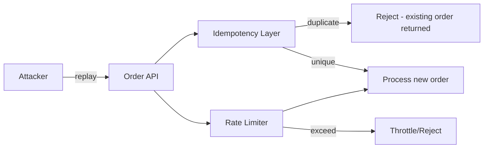

*Defense against replay attacks: the idempotency layer checks the Idempotency-Key against existing orders; duplicates return the existing order, never creating a new one. Rate limiting by IP and user prevents automated abuse. Combined with TLS, this prevents replay attacks.*

---

### Observability and Logging

Order processing systems generate massive telemetry across intake, payment, inventory, fulfillment, and compensation stages. Observability must cover the full order lifecycle from creation to terminal state.

#### Key Metrics

- **Order funnel conversion:** CREATED → PAID → RESERVED → FULFILLED → NOTIFIED — track drop-off rates at each stage. Alert if drop-off at any stage exceeds historical norms by >2σ.
- **Intake latency:** p50 < 20 ms, p95 < 50 ms, p99 < 100 ms. Track separately for new orders vs. retry submissions.
- **Outbox relay lag:** Delay between order creation and event publication. Alert if lag > 2 seconds (affects downstream stage start time).
- **Stage latency:** Time spent in each stage's queue + processing. Track p50/p95/p99 per stage. Alert if any stage's end-to-end latency >SLA.
- **Compensation rate:** Percentage of orders requiring compensation. Alert if compensation rate exceeds 1% (indicates systemic issues).
- **Error rates:** 5xx errors per service, Kafka consumer errors, DLQ inflow rates.
- **Ambiguous outcome rate:** Percentage of payment/gateway calls that time out (ambiguous). Track as a PSP health signal.

#### Logging

- **Access logs:** Every API request logged with customer ID (hashed), endpoint, response code, latency, and idempotency key. Used for audit trails.
- **Event logs:** All order state transitions logged as structured events with correlation IDs for cross-service tracing. Payment captures, inventory reservations, fulfillment shipments, and compensations all logged.
- **Error logs:** Service errors with correlation IDs. Failed state transitions logged with order ID, expected state, and actual state for debugging.
- **Audit logs:** All customer-facing state changes, refund actions, and admin operations logged with before/after state and actor identity.

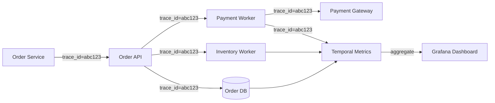

*Distributed tracing flow: each order carries a trace ID propagated across all service boundaries. The Order API, Payment Worker, Inventory Worker, and Order DB all record spans. These spans aggregate in a metrics backend (Prometheus, Jaeger, or Datadog) and are visualized in Grafana dashboards, enabling end-to-end latency analysis and failure diagnosis.*

#### Alerting Strategy

- **Critical (page immediately):** Outbox relay lag > 2s for 5 minutes; Order DB unavailable; payment worker consumer group down; DLQ inflow rate > 100 orders/minute (indicates systemic failure).
- **Warning (Slack, no page):** Stage latency p99 exceeds SLA for 10 minutes; compensation rate > 1%; ambiguous outcome rate > 5% (PSP health degrading); consumer lag > 100,000 messages.
- **Info (dashboard only):** Daily order volume trends, average funnel conversion rate, seasonal patterns.

```java
@Service
@RequiredArgsConstructor
public class InstrumentedOrderService {

    private final OrderRepository orderRepository;
    private final MeterRegistry meterRegistry;

    public Order createOrder(CreateOrderRequest request, String idempotencyKey) {
        var sample = Timer.Sample.start(meterRegistry);
        try {
            var order = orderRepository.save(toOrder(request, idempotencyKey));
            sample.stop(Timer.builder("order.create.latency")
                    .tag("customer_tier", getCustomerTier(request.customerId()))
                    .register(meterRegistry));

            Counter.builder("order.created")
                    .tag("source", "web")
                    .register(meterRegistry)
                    .increment();

            return order;
        } catch (Exception e) {
            Counter.builder("order.errors")
                    .tag("error_type", e.getClass().getSimpleName())
                    .tag("stage", "create")
                    .register(meterRegistry)
                    .increment();
            throw e;
        }
    }

    private String getCustomerTier(String customerId) {
        // Premium tiers may have different SLA expectations
        return customerRepository.findById(customerId)
                .map(c -> c.tier())
                .orElse("standard");
    }
}
```

*The `InstrumentedOrderService` bean uses Micrometer to record order creation latency (tagged by customer tier) and success/error counters. The `@RequiredArgsConstructor` annotation provides constructor injection for the repository and meter registry. Errors are tagged with error type and stage for granular alerting.*

---

### Real-World Implementations

Order processing platforms use a combination of proprietary and open-source systems, each chosen for its strengths in a particular stage of the order lifecycle.

#### Kafka / RabbitMQ

Used for: the event backbone carrying `PAYMENT_PENDING`, `INVENTORY_PENDING`, `FULFILLING`, `NOTIFIED` events between stages. Kafka's partitioning by order ID hash ensures per-order event ordering while enabling parallel worker consumption. The retention policy (7 days) allows reprocessing for new features or bug fixes.

```mermaid
graph LR
    API[Order API] -->|outbox| Kafka[Kafka - orders.topic]
    Kafka --> PW[Payment Workers]
    Kafka --> IW[Inventory Workers]
    Kafka --> FW[Fulfillment Workers]
    Kafka --> NW[Notification Workers]
    PW -->|compensation| CW[Compensation Workers]
    CW --> PSP[Payment Gateway]
    CW --> INV[Inventory Service]
```

*Event-driven order processing with Kafka: the Order API publishes events to a Kafka topic via the transactional outbox; per-stage worker pools (payment, inventory, fulfillment, notification) consume from the topic's partitions; the Compensation Worker consumes from the dead-letter queue to reverse completed steps. Kafka's at-least-once delivery is made effectively-once via idempotency guards.*

**Companies:** Shopify (order pipeline), Amazon.com (order orchestration), Uber Eats (multi-party order lifecycle), DoorDash (delivery coordination).

#### PostgreSQL

Used for: the Order State Store — order records, state transitions, event append log, and idempotency guards. PostgreSQL's strong consistency and ACID transactions (with `SKIP LOCKED` for outbox claiming) make it the right choice for the durable state anchor. Read replicas handle status query scaling.

**Companies:** Shopify (order state), Stripe (payment intent state), countless e-commerce platforms.

#### Redis

Used for: idempotency guard cache (fast lookup during redelivery), rate-limiting counters (per-customer order submission limits), and short-lived state (in-flight order locks). Redis's atomic operations (`SETNX`, `INCR`, `ZADD`) enable lock-free concurrency patterns.

**Companies:** Used as a sidecar cache in almost all order processing systems built on the JVM ecosystem.

#### SQS / RabbitMQ

Used by smaller platforms: managed message queues with built-in DLQ support, visibility timeouts, and dead-lettering. Simpler to operate than Kafka but with fewer ordering guarantees and lower throughput. Good for < 10K orders/minute.

**Companies:** Startups building on AWS (SQS), e-commerce platforms on GCP (Pub/Sub), legacy systems on RabbitMQ.

#### Temporal / Cadence

Used by platforms adopting workflow engines: replaces bespoke state machines with durable-execution primitives. Temporal's workflow engine manages the state machine, timers, and compensations natively. Workers implement the actual business logic as activities.

**Companies:** Coinbase (order workflows), Box (file processing workflows), Shopify (experimenting with Temporal for fulfillment).

#### Payment Gateways

Used for: actual payment processing. Stripe (idempotency keys, webhooks), Adyen (multi-acquirer), Braintree (PayPal), checkout.com. The key pattern: pass a deterministic reference key so the PSP treats retries as the same logical operation.

**Companies:** Every e-commerce platform — the pattern of idempotent PSP references is universal.

---

### Java and Spring Boot Implementation Guide

This section demonstrates how to build a Spring Boot service for a fault-tolerant order processing system, showcasing key Spring Boot features: `@Service`, `@RestController`, `@Repository`, `@Component`, `@Value`, `@KafkaListener`, `@Transactional`, `@Scheduled`, `@RequiredArgsConstructor`, `records` for DTOs, `@Valid`, `@ControllerAdvice`, constructor injection, and `MeterRegistry` for metrics.

#### 1. DTO Records

Records provide immutable, concise data carriers for request/response payloads.

```java
public record CreateOrderRequest(
        @NotBlank String customerId,
        @NotEmpty List<OrderLineItem> items,
        @NotBlank String currency) {}

public record OrderLineItem(
        @NotBlank String sku,
        @Positive int quantity,
        @DecimalMin("0.0") BigDecimal unitPrice) {}

public record OrderResponse(
        String orderId,
        String status,
        BigDecimal total,
        String currency,
        Instant createdAt,
        List<OrderLineItem> items,
        String idempotencyKey) {}

public record StatusResponse(
        String orderId,
        String status,
        List<StepHistory> steps) {}

public record StepHistory(String step, String status, Instant timestamp) {}
```

*Five record types serve as the API contract: `CreateOrderRequest` and `OrderLineItem` for the POST body with validation annotations (`@NotBlank`, `@NotEmpty`, `@Positive`, `@DecimalMin`); `OrderResponse` for the full order representation; `StatusResponse` and `StepHistory` for status queries showing the step-by-step audit trail.*

#### 2. Entity with Optimistic Locking

The `Order` entity uses `@Version` for optimistic locking to prevent lost updates when concurrent state transitions race.

```java
@Entity
@Table(name = "orders", indexes = {
        @Index(name = "idx_customer_created", columnList = "customerId, createdAt"),
        @UniqueConstraint(columnNames = "idempotencyKey")
})
public class Order {

    @Id
    private String orderId;

    @Column(nullable = false)
    private String customerId;

    @Enumerated(EnumType.STRING)
    @Column(nullable = false)
    private Status status = Status.CREATED;

    @Column(nullable = false)
    private BigDecimal total;

    @Column(nullable = false)
    private String currency;

    @Column(nullable = false, unique = true)
    private String idempotencyKey;

    @OneToMany(cascade = CascadeType.ALL, orphanRemoval = true, fetch = FetchType.EAGER)
    @MapKey(name = "position")
    private Map<Integer, OrderLine> lines = new HashMap<>();

    @Version
    private Long version;

    @Column(nullable = false)
    private Instant createdAt;

    private Instant updatedAt;

    @Column(nullable = false)
    private int attemptCount = 0;

    public enum Status {
        CREATED, PAYMENT_PENDING, PAID, RESERVED,
        FULFILLING, FULFILLED, NOTIFIED,
        FAILED, FAILED_WITH_REFUND,
        AWAITING_PSP
    }

    // Guarded transition: only succeeds if current state matches expected
    public boolean transitionIf(Status expected, Status next) {
        if (this.status != expected) {
            return false;
        }
        this.status = next;
        this.updatedAt = Instant.now();
        this.attemptCount++;
        return true;
    }
}
```

*The `Order` entity maps to the `orders` table with a unique constraint on `idempotencyKey` (preventing duplicate orders at the database level) and a composite index on `(customerId, createdAt)` for customer order history queries. The `@Version` field enables JPA optimistic locking. The `Status` enum captures the full state machine. The `transitionIf` method implements guarded transitions — it only proceeds if the current status matches the expected status, returning false otherwise.*

#### 3. Repository Layer

The repository layer provides persistence operations with Spring Data JPA, including idempotency guards and guarded state transitions.

```java
@Repository
public interface OrderRepository extends JpaRepository<Order, String> {

    Optional<Order> findByIdempotencyKey(String idempotencyKey);

    @Query("SELECT o FROM Order o WHERE o.customerId = :customerId ORDER BY o.createdAt DESC")
    List<Order> findByCustomerId(@Param("customerId") String customerId, Pageable pageable);

    @Lock(LockModeType.OPTIMISTIC_FORCE_INCREMENT)
    @Query("SELECT o FROM Order o WHERE o.orderId = :orderId")
    Optional<Order> findByIdForUpdate(@Param("orderId") String orderId);
}

@Repository
public interface IdempotencyGuardRepository extends JpaRepository<IdempotencyGuard, String> {

    @Query("INSERT INTO IdempotencyGuard (orderId, step, resultRef, recordedAt) " +
           "VALUES (:orderId, :step, :resultRef, :recordedAt)")
    @Modifying
    @Transactional
    int insertIfAbsent(@Param("orderId") String orderId,
                       @Param("step") String step,
                       @Param("resultRef") String resultRef,
                       @Param("recordedAt") Instant recordedAt);

    boolean existsByOrderIdAndStep(String orderId, String step);
}
```

*The `OrderRepository` extends `JpaRepository` with queries for idempotency-key lookup and customer order history. The `findByIdForUpdate` method uses `OPTIMISTIC_FORCE_INCREMENT` to acquire a write lock for guarded transitions. The `IdempotencyGuardRepository` uses a native INSERT with a unique constraint on `(orderId, step)` as the once-guard — the database enforces uniqueness, so `insertIfAbsent` returns 0 affected rows if the guard already exists.*

#### 4. Order Intake API

The intake API uses the transactional outbox pattern: order persistence and event publication happen atomically in a single transaction.

```java
@RestController
@RequestMapping("/api/v1/orders")
@RequiredArgsConstructor
public class OrderController {

    private final OrderService orderService;
    private final AuthService authService;
    private final IdempotencyGuardRepository guardRepository;

    @PostMapping
    public ResponseEntity<OrderResponse> createOrder(
            @AuthenticationPrincipal AuthenticatedUser user,
            @Valid @RequestBody CreateOrderRequest request,
            @RequestHeader(value = "Idempotency-Key", required = false) String idempotencyKey) {

        if (!user.customerId().equals(request.customerId())) {
            throw new AccessDeniedException("Cannot create orders for other customers");
        }

        var response = orderService.createOrder(request, idempotencyKey);
        return ResponseEntity.status(HttpStatus.ACCEPTED).body(response);
    }

    @GetMapping("/{orderId}")
    public ResponseEntity<StatusResponse> getOrderStatus(
            @AuthenticationPrincipal AuthenticatedUser user,
            @PathVariable String orderId) {

        var order = orderService.getOrder(orderId);
        if (!order.customerId().equals(user.customerId())
                && !authService.hasScope(user, "orders:read:all")) {
            throw new AccessDeniedException("Not authorized to view this order");
        }

        return ResponseEntity.ok(orderService.getStatus(orderId));
    }
}
```

*The `OrderController` (annotated `@RestController` with constructor injection via `@RequiredArgsConstructor`) enforces resource-level authorization. On POST, it checks that the authenticated customer matches the request's customer_id. The `Idempotency-Key` header collapses client retries. On GET, it checks ownership or admin scope before returning status.*

#### 5. Service Layer with Idempotent State Transitions

```java
@Service
@RequiredArgsConstructor
@Slf4j
public class OrderService {

    private final OrderRepository orderRepository;
    private final IdempotencyGuardRepository guardRepository;
    private final OutboxRepository outboxRepository;
    private final MeterRegistry meterRegistry;

    @Value("${app.order.max-items:50}")
    private int maxItemsPerOrder;

    @Transactional
    public OrderResponse createOrder(CreateOrderRequest request, String idempotencyKey) {
        String key = (idempotencyKey != null) ? idempotencyKey : UUID.randomUUID().toString();

        // Idempotency: check for existing order with same key
        var existing = orderRepository.findByIdempotencyKey(key);
        if (existing.isPresent()) {
            meterRegistry.counter("order.duplicate_rejected").increment();
            return toResponse(existing.get());
        }

        validateItems(request.items());

        var order = Order.builder()
                .orderId(UUID.randomUUID().toString())
                .customerId(request.customerId())
                .status(Status.CREATED)
                .total(calculateTotal(request.items()))
                .currency(request.currency())
                .idempotencyKey(key)
                .createdAt(Instant.now())
                .build();

        orderRepository.save(order);

        // Transactional outbox: persist event in same transaction
        outboxRepository.save(new OutboxEvent(
                order.getOrderId(),
                "orders.payment",
                order.getOrderId(), // partition key for ordering
                Map.of("orderId", order.getOrderId(),
                       "customerId", order.getCustomerId(),
                       "amount", order.getTotal(),
                       "currency", order.getCurrency())
        ));

        log.info("Order created: {} (status=CREATED, idempotencyKey={})",
                order.getOrderId(), key);

        meterRegistry.counter("order.created").increment();
        return toResponse(order);
    }

    @Transactional
    public boolean transitionStatus(String orderId, Status expected, Status next, String step) {
        // Guard insertion: the idempotency table is the once-guard
        boolean guardInserted = guardRepository.insertIfAbsent(
                orderId, step, "transition:" + next, Instant.now()) == 1;

        if (!guardInserted) {
            log.debug("Duplicate step {} for order {} — skipping", step, orderId);
            return true; // already processed, proceed safely
        }

        // Optimistic read + guarded write
        var order = orderRepository.findByIdForUpdate(orderId)
                .orElseThrow(() -> new OrderNotFoundException(orderId));

        if (!order.transitionIf(expected, next)) {
            meterRegistry.counter("order.transition_conflict",
                    "order_id", orderId, "expected", expected.name())
                    .increment();
            return false;
        }

        orderRepository.save(order);
        log.info("Order {} transitioned: {} → {}", orderId, expected, next);
        meterRegistry.counter("order.transition." + next.name()).increment();
        return true;
    }

    private void validateItems(List<OrderLineItem> items) {
        if (items.size() > maxItemsPerOrder) {
            throw new IllegalArgumentException("Too many items: max is " + maxItemsPerOrder);
        }
        for (var item : items) {
            if (item.quantity() <= 0) {
                throw new IllegalArgumentException("Quantity must be positive for SKU: " + item.sku());
            }
        }
    }
}
```

*The `OrderService` bean implements the transactional outbox pattern: `createOrder` persists the order and the outbox event atomically in a single `@Transactional` method. The `transitionStatus` method is the core idempotency mechanism — it first inserts a guard row (uniqueness enforced by the database), then performs an optimistic read with `@Lock(OPTIMISTIC_FORCE_INCREMENT)`, and applies the guarded transition. If the guard already exists (duplicate message), it returns early. If the state doesn't match, the transition fails and a conflict metric is recorded.*

#### 6. Kafka Listener for Payment Worker

```java
@Component
@RequiredArgsConstructor
@Slf4j
public class PaymentWorker {

    private final OrderService orderService;
    private final IdempotencyGuardRepository guardRepository;
    private final PaymentGatewayClient paymentGateway;
    private final OutboxPublisher outboxPublisher;
    private final MeterRegistry meterRegistry;

    @KafkaListener(topics = "orders.payment",
                   groupId = "payment-workers",
                   concurrency = "10")
    @RetryableTopic(attempts = "5",
                    backoff = @Backoff(delay = 1000, multiplier = 2))
    public void handlePayment(PaymentCommand command, Acknowledgment ack) {
        var orderId = command.orderId();

        try {
            // Guard: idempotency at the worker level
            boolean firstAttempt = guardRepository.insertIfAbsent(
                    orderId, "PAYMENT", command.pspRef(), Instant.now()) == 1;

            if (!firstAttempt && guardRepository.existsByOrderIdAndStep(orderId, "PAYMENT")) {
                // Already processed — advance the pipeline
                if (orderService.transitionStatus(orderId, Status.PAYMENT_PENDING, Status.PAID, "PAYMENT")) {
                    outboxPublisher.send("orders.inventory", orderId,
                            Map.of("orderId", orderId, "customerId", command.customerId()));
                }
                ack.acknowledge();
                return;
            }

            CaptureResult result = paymentGateway.capture(
                    command.amount(), command.currency(),
                    orderId + ":pay");

            guards.recordResult(orderId, "PAYMENT", result.ref());
            orderService.transitionStatus(orderId, Status.PAYMENT_PENDING, Status.PAID, "PAYMENT");

            outboxPublisher.send("orders.inventory", orderId,
                    Map.of("orderId", orderId, "customerId", command.customerId()));
            ack.acknowledge();

        } catch (AmbiguousOutcomeException e) {
            // PSP didn't respond clearly — park for reconciliation, don't retry blindly
            orderService.transitionStatus(orderId, Status.PAYMENT_PENDING, Status.AWAITING_PSP, "PAYMENT");
            ack.acknowledge(); // stop retrying; let sweeper resolve
            meterRegistry.counter("order.payment.ambiguous").increment();
        } catch (PermanentDeclineException e) {
            // Card declined — terminal, no retry
            orderService.failOrder(orderId, e.reason());
            ack.acknowledge();
            meterRegistry.counter("order.payment.permanent_fail").increment();
        } catch (Exception e) {
            // Transient — let @RetryableTopic handle backoff/redelivery
            meterRegistry.counter("order.payment.transient_fail",
                    "error", e.getClass().getSimpleName()).increment();
            throw e;
        }
    }
}
```

*The `PaymentWorker` bean listens to the `orders.payment` Kafka topic with 10 concurrent consumers. The `@RetryableTopic` annotation handles transient failures with exponential backoff (5 attempts, 2× multiplier). The handler first checks the idempotency guard table — if the guard already exists, it fast-forwards to the PAID state and publishes the next event. On ambiguous outcomes (PSP timeout), it parks the order in `AWAITING_PSP` and stops retrying. On permanent declines, it fails the order immediately without retry.*

#### 7. Global Exception Handler

```java
@ControllerAdvice
@Slf4j
public class OrderExceptionHandler {

    @ExceptionHandler(OrderNotFoundException.class)
    public ResponseEntity<ErrorBody> handleNotFound(OrderNotFoundException ex) {
        return ResponseEntity.status(HttpStatus.NOT_FOUND)
                .body(new ErrorBody("NOT_FOUND", ex.getMessage()));
    }

    @ExceptionHandler(AccessDeniedException.class)
    public ResponseEntity<ErrorBody> handleForbidden(AccessDeniedException ex) {
        return ResponseEntity.status(HttpStatus.FORBIDDEN)
                .body(new ErrorBody("FORBIDDEN", ex.getMessage()));
    }

    @ExceptionHandler(OptimisticLockException.class)
    public ResponseEntity<ErrorBody> handleConflict(OptimisticLockException ex) {
        return ResponseEntity.status(HttpStatus.CONFLICT)
                .body(new ErrorBody("CONFLICT",
                        "Concurrent modification detected. Please retry."));
    }

    @ExceptionHandler(MethodArgumentNotValidException.class)
    public ResponseEntity<ErrorBody> handleValidation(MethodArgumentNotValidException ex) {
        var messages = ex.getBindingResult().getFieldErrors().stream()
                .map(FieldError::getDefaultMessage)
                .toList();
        return ResponseEntity.badRequest()
                .body(new ErrorBody("VALIDATION_ERROR",
                        "Validation failed: " + String.join(", ", messages)));
    }

    public record ErrorBody(String code, String message) {}
}
```

*The `OrderExceptionHandler` bean (annotated `@ControllerAdvice`) catches exceptions from any `@RestController` and returns structured `ErrorBody` responses. It handles `OrderNotFoundException` (404), `AccessDeniedException` (403), `OptimisticLockException` (409 Conflict — from `@Version` detection), and `MethodArgumentNotValidException` (400 with field-level messages). All exceptions are logged for auditability.*

#### 8. Reconciliation Sweeper

```java
@Service
@RequiredArgsConstructor
@Slf4j
public class ReconciliationSweeper {

    private final OrderStateRepository stateRepository;
    private final PaymentGatewayClient paymentGateway;
    private final OutboxPublisher outboxPublisher;
    private final MeterRegistry meterRegistry;

    @Scheduled(fixedDelay = 60_000)
    public void resolveAmbiguousPayments() {
        List<Order> ambiguous = stateRepository
                .findAwaitingPspOlderThan(Duration.ofMinutes(5));

        for (Order order : ambiguous) {
            try {
                PaymentStatus status = paymentGateway.lookup(
                        order.getOrderId() + ":pay");

                switch (status) {
                    case CAPTURED -> {
                        stateRepository.transition(order.id(), Status.PAID);
                        outboxPublisher.send("orders.inventory",
                                order.id(),
                                Map.of("orderId", order.id(),
                                       "customerId", order.customerId()));
                        log.info("Resolved AWAITING_PSP for {}: PAID", order.id());
                    }
                    case NOT_FOUND -> {
                        stateRepository.fail(order.id(), "PSP_TIMEOUT_NO_CAPTURE");
                        log.warn("Resolved AWAITING_PSP for {}: FAILED (no capture)", order.id());
                    }
                }
            } catch (Exception e) {
                meterRegistry.counter("reconciliation.errors").increment();
                log.error("Failed to resolve ambiguous payment for order {}: {}",
                        order.id(), e.getMessage(), e);
            }
        }
    }
}
```

*The `ReconciliationSweeper` bean runs every 60 seconds via `@Scheduled`, querying for orders stuck in `AWAITING_PSP` state for more than 5 minutes. It queries the payment gateway for the status of the pending capture and transitions the order accordingly — PAID (proceeding to inventory) or FAILED (no capture exists). Errors are logged and counted. This is the safety net that catches ambiguous outcomes the worker couldn't resolve.*

---

### Interview Questions and Answers

A curated set of interview questions organized by difficulty, focused on fault-tolerant order processing system design.

**Beginner**

1. **Why at-least-once delivery instead of exactly-once from the queue?**
   **A:** Exactly-once delivery requires receiver participation anyway (receiver can't distinguish lost-ack from not-run). At-least-once plumbing + idempotent handlers achieves effectively-once outcomes — simpler brokers, same business guarantee.

2. **What does the dead-letter queue protect?**
   **A:** Pipeline throughput and on-call sanity: poison messages stop consuming retry resources and blocking partitions after bounded attempts, landing in a place humans inspect deliberately rather than silently looping forever.

3. **What is an idempotency key and why do we need it?**
   **A:** An idempotency key is a client-provided unique identifier for an operation. If the same key is submitted twice, the server returns the result of the first submission instead of re-executing. This protects against retries from the client side (network timeouts, user double-clicks) without causing duplicate processing.

4. **What is the difference between a transient and a permanent failure in order processing?**
   **A:** A transient failure (timeout, 5xx, connection reset) may succeed if retried — the downstream system was temporarily unavailable. A permanent failure (card declined, invalid address) will not succeed on retry — the condition won't change. Retrying permanent failures wastes resources and delays other orders.

**Intermediate**

5. **Walk through a worker crashing right after the PSP captured funds but before it wrote PAID. What happens?**
   **A:** Message redelivered after visibility timeout; handler's guard row may be absent (crash preceded insert) → re-invokes capture with same PSP idempotency ref → PSP returns original capture (no second charge) → guard+transition complete normally. If guard existed sans result → lookup-by-ref path resolves. Emphasize: two-layer idempotency covers both crash points.

6. **How do you decide retry counts and backoff shapes per stage?**
   **A:** Classify error mix empirically (transient ratios from history), set budgets covering realistic outage durations (e.g., survive 15-minute dependency blips: ~6 attempts with cap 10 min), add full jitter preventing synchronized cohorts. Permanent classes bypass retries entirely.

7. **Why per-stage queues instead of one shared queue with topic tags?**
   **A:** Isolation: independent scaling, failure blast-radius, retry policies, monitoring per stage. Shared queues couple deployment cadence and let one hot stage starve others — the coupling this architecture exists to break.

8. **What is the outbox pattern and why is it critical for order processing?**
   **A:** The outbox pattern writes the business event (order created) and a message to an outbox table in the same database transaction. A separate relay process publishes the outbox messages to the queue. This ensures that no order is lost between state persistence and event publication — eliminating the dual-write problem where the DB commit succeeds but the queue publish fails.

9. **How do you handle ambiguous payment outcomes (timeout where you don't know if the charge succeeded)?**
   **A:** Never blind-retry (double charge) or blind-compensate (refund of captured funds). Instead, park the order in `AWAITING_PSP` state, stop retrying, and let a reconciliation sweeper poll the PSP's status API. The PSP's idempotent reference lookup tells you definitively whether the capture exists.

10. **How does the saga pattern apply to order processing?**
    **A:** The saga pattern decomposes the distributed transaction (charge + reserve + fulfill) into a sequence of local transactions, each with a compensating action. If any step fails permanently, the saga triggers compensations in reverse order: release inventory reservation, then refund payment. Each compensating call uses the same idempotency reference as the original.

**Advanced**

11. **Design the compensation path when fulfillment permanently fails after payment.**
    **A:** Confirmed-permanent trigger only (never ambiguous) → release reservation (idempotent) → refund via PSP ref-keyed call (idempotent) → FAILED_WITH_REFUND terminal + customer notification + finance-ledger entries. Compensation failures escalate immediately (money now genuinely misplaced). Test with fault injection proving exactly-one-refund under chaos.

12. **During a flash sale, fulfillment backs up 45 minutes. Design the response.**
    **A:** Measure drain-rate vs intake; autoscale fulfillment pool to ceiling; shape upstream (checkout messaging sets delivery expectations, throttles non-critical flows); communicate honestly via status pages; post-event: burn-down dashboards, prioritized oldest-orders fairness. Show systems-thinking about user trust during degradation.

13. **How would you design a rate-limited compensation pipeline to prevent overwhelming the payment gateway during a systemic failure?**
    **A:** Token-bucket rate limiter per downstream dependency (e.g., 100 refunds/sec to PSP). Compensations queue in a separate DLQ with priority ordering. Batch refunds where the PSP supports bulk operations. Circuit breaker opens if the PSP returns 429/rate-limit; compensation pauses and retries with exponential backoff. Monitor compensation rate as a first-class signal.

14. **Your order system has 5 stages and each stage retries 5 times. What is the worst-case latency for an order with 3 transient failures per stage?**
    **A:** With exponential backoff (base=1s, multiplier=2, max=5 attempts): 1+2+4+8+16 = 31s per stage worst case. With 3 transient failures per stage (not hitting max attempts): 1+2+4 = 7s per stage. 5 stages × 7s = 35s. But stages are sequential, so total = 5 × 31s = 155s worst case. Mitigation: parallelize independent stages, use parallel fan-out for the 5 stages by relaxing ordering requirements where possible, set explicit retry budgets.

**Senior / System Design**

15. **Architect the migration from synchronous order processing to this queue-based design without downtime.**
    **A:** Strangler pattern: dual-write behind flags (legacy sync path remains authoritative initially), shadow-consume new pipeline validating parity, cutover cohort-by-cohort with instant rollback, reconcile both paths' outputs continuously until confident, decommission legacy last. Discuss data backfill and in-flight-order handling at boundaries.

16. **When would you replace this bespoke machinery with Temporal, and what's lost/gained?**
    **A:** Signals: complex branching/human-in-the-loop/timer-heavy workflows, versioning pain across long-running executions. Gains: durable-execution primitives, replay/versioning tooling, ecosystem. Lost: queue-tier control granularity, some operational familiarity. Migration wraps legacy steps as activities incrementally. Demonstrates platform-judgment lifecycle thinking.

17. **Design a multi-region order processing system that maintains strong consistency for state transitions while serving status queries with <50ms latency globally.**
    **A:** Primary region for writes (strong consistency via synchronous quorum), read replicas in each region for status queries (async replication with bounded lag <1s). Route writes to the nearest region's primary via GeoDNS with failover. Use CRDTs for counters (attempt counts, audit log append-only). Cache hot order data in Redis with multi-region active-active replication. Accept brief staleness for reads but never for writes.

18. **How would you handle PCI-DSS scope reduction when building an in-house order/payment system?**
    **A:** Never touch raw card data — use client-side tokenization (PSP JS SDK) so cards are replaced with tokens before hitting your servers. Isolate payment-handling code into a separate, minimal micro-service (smaller attack surface = smaller audit scope). Use tokenization vaults instead of storing even tokens. Encrypt all logs/data at rest. Implement network segmentation (PCI-DSS requirement 1.2) — payment-processing services in a dedicated VPC subnet with restricted ingress. Outsource as much as possible to managed services (PSP, not your own card vault).

#### Common Mistakes

- Retrying ambiguous payment outcomes — creating double charges or phantom refunds.
- Idempotency keys scoped to transport (message IDs) rather than business intent (orderId+step).
- Missing heartbeats on long steps → premature visibility-timeout redelivery.
- One global DLQ mixing stages — triage noise hides fresh incidents.
- No state-age alerting: stuck orders discovered by angry customers, not dashboards.
- Not versioning message envelopes — incompatible consumers in rolling deploys.
- Forgetting to compensate inventory reservations when payment refunds — stock stays locked.

#### Expected discussion points

Effective-once layering fluency (queue + worker guard + downstream idempotency + reconciliation), ambiguity doctrine (timeout ≠ failure, never blind-retry), saga compensation completeness, per-stage queue isolation rationale, outbox pattern for dual-write elimination, and observability designed for order-level forensics (funnel conversion, state-age histograms, aging alerts).


