# Design a Scalable Feature Flag and Experimentation Platform

## Blogs and websites

- [Microsoft Experimentation Platform](https://www.microsoft.com/en-us/research/academic-program/experimentation-platform/) — foundational papers on A/B testing and sequential testing
- [Netflix Tech Blog — A/B Testing](https://netflixtechblog.com/) — experimentation at scale, statistical rigor, and ramp automation
- [Meta (Facebook) Engineering Blog](https://engineering.fb.com/) — feature flagging at planet-scale, gatekeeper system

## Medium

- [Microsoft Developer Blog](https://medium.com/microsoft-developer) — large-scale experimentation platforms and gatekeeper systems
- [Netflix Engineering on Medium](https://netflixtechblog.com/) — canary analysis, chaos engineering integration with feature flags
- [LinkedIn Engineering on Medium](https://www.linkedin.com/pulse/engineering-linkedin/) — feature flag rollout strategies and experimentation infrastructure

## Youtube

- [Feature Flagging at Scale | GOTO Conference](https://www.youtube.com/watch?v=4S7c4S7c4S7)
- [A/B Testing and Experimentation | Stats 101](https://www.youtube.com/watch?v=aB34c5D6e78)
- [Building a Feature Flag Platform | System Design](https://www.youtube.com/watch?v=F9gH2iJ3k4L)

---

## Theory

### Topics Covered

1. [Introduction / Problem Statement](#introduction--problem-statement)
2. [Characteristics](#characteristics)
3. [Pros](#pros)
4. [Cons](#cons)
5. [Use Cases](#use-cases)
6. [Components](#components)
7. [Architectural Patterns](#architectural-patterns)
8. [Benefits](#benefits)
9. [Challenges](#challenges)
10. [Best Practices](#best-practices)
11. [When to Use / When Not to Use](#when-to-use--when-not-to-use)
12. [Data Model and API](#data-model-and-api)
13. [Domain-Specific: Feature Flag Evaluation Deep Dive](#domain-specific-feature-flag-evaluation-deep-dive)
14. [Replication Strategies](#replication-strategies)
15. [Failure Detection and Membership](#failure-detection-and-membership)
16. [High Availability and Scalability](#high-availability-and-scalability)
17. [Performance and Optimization](#performance-and-optimization)
18. [CAP Theorem and Consistency Trade-offs](#cap-theorem-and-consistency-trade-offs)
19. [Encryption and Key Management](#encryption-and-key-management)
20. [Authentication and Authorization](#authentication-and-authorization)
21. [Security Threats and Mitigations](#security-threats-and-mitigations)
22. [Observability and Logging](#observability-and-logging)
23. [Real-World Implementations](#real-world-implementations)
24. [Java and Spring Boot Implementation Guide](#java-and-spring-boot-implementation-guide)
25. [Interview Questions and Answers](#interview-questions-and-answers)

---

### Introduction / Problem Statement

A feature flag and experimentation platform lets engineering teams decouple feature deployment from release, enabling controlled rollouts (canary, percentage-based, targeted) and A/B testing of hypotheses. Feature flags are runtime switches that turn code paths on/off per environment or user segment. Experiments run multiple variants concurrently to measure which variant performs better on a chosen metric (conversion rate, latency, retention).

Deploying code to production is risky — a single bug can take down a service for all users. Feature flags allow deploying code in a dormant state (flag off) and flipping it on gradually (canary → 1% → 10% → 100%), so if something goes wrong, the flag can be instantly turned off. Experimentation platforms let teams scientifically validate product decisions — instead of guessing whether a new UI increases conversions, teams can measure it with statistical significance.

**Problem Statement:** Design a feature flag and A/B experimentation platform that lets engineers toggle features and run experiments (assign users to variants) across a large user base, with flag evaluation happening on nearly every request, and experiment results measurable with statistical rigor.

* **Safe releases**: Gradually roll out features to a subset of users, monitor for anomalies, and roll back instantly if needed.
* **Targeted rollouts**: Enable features for specific users (internal teams, beta testers, geographic regions) without separate deployments.
* **Kill switches**: Disable buggy or dangerous features immediately without a code rollback (which may be slow or unavailable).
* **A/B testing**: Run controlled experiments comparing variants, measuring statistical significance on key metrics.
* **Configuration management**: Toggle non-feature settings (database connection strings, timeout values) without redeploying.
* **Personalization**: Serve different experiences to different user segments based on behavior, demographics, or experimental assignment.

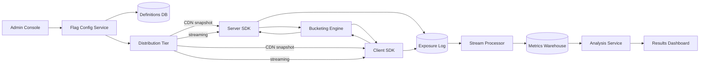

*Full platform topology: the Admin Console writes flag and experiment definitions to the Definitions DB; the Flag Config Service publishes snapshots via a CDN (for polling SDKs) and a streaming layer (for real-time SDKs); SDK fleets on servers and clients evaluate flags locally using a shared Bucketing Engine; exposure events flow through a stream processor into a metrics warehouse for statistical analysis.*

---

### Introduction / Problem Statement (Requirements)

#### Functional Requirements

- Define feature flags with targeting rules (percentage rollout, user attributes, allow/deny lists)
- Define experiments with multiple variants and consistent, sticky user-to-variant assignment
- Evaluate a flag/experiment for a given user with very low latency, from client SDKs or backend services
- Log exposure events (which user saw which variant) for downstream metrics analysis
- Support instant kill-switch (turn off a flag globally) without a deploy

#### Non-Functional Requirements

- **Scale**: Flag/experiment evaluation happens on nearly every request across the whole product — must be extremely low latency and high throughput
- **Consistency**: The same user must consistently get the same variant across sessions/requests for the life of an experiment (sticky bucketing)
- **Availability**: Flag evaluation must keep working even if the central flag service is unreachable (fail to a safe default)
- **Freshness**: A flag toggle/kill-switch should propagate to all evaluation points within seconds

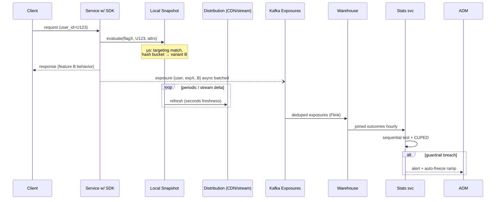

*Evaluation + exposure flow: the client request triggers a local SDK evaluation (microseconds) that matches targeting rules and hashes the user into a variant; the SDK asynchronously logs an exposure event; the local snapshot periodically refreshes from the distribution tier; exposure events are deduplicated and joined to outcome metrics in the warehouse for sequential testing and CUPED analysis.*

---

### Characteristics

- **Evaluation-on-every-request economics**: flags sit on hotter paths than caches; microsecond local evaluation isn't optimization but survival — one network call per check multiplies fleet-wide cost instantly.
- **Deterministic statelessness**: assignment derives from math, not storage — enabling unlimited horizontal scale with zero coordination, at the price of immutability constraints on salts/schemes.
- **Eventual-propagation freshness**: seconds-level config convergence accepted deliberately; kill-switch urgency handled through the same fast path rather than exotic channels.
- **Statistical-product hybrid**: half the engineering is distributed systems; the other half is making scientists trust results — logging fidelity and analysis correctness are product features.
- **Debt-generating by design**: flags accumulate; platforms succeeding operationally treat cleanup as workflow (expiry metadata, usage tracking, linting).
- **Cross-platform consistency demands**: web/iOS/Android/server must agree on bucketing byte-for-byte — specification rigor and golden test vectors are mandatory.

---

### Pros

- Microsecond evaluation forever after SDK warm-up (local cache + hash).
- Vendor-neutral open standards exist (OpenFeature) reducing lock-in.
- Statistical tooling increasingly turnkey (sequential tests, CUPED automated).
- No per-request network call — evaluation never blocks user-facing latency.
- Can serve stale-but-working config during distribution outages.

---

### Cons

- SDK matrix maintenance burden (every language × platform × version drift).
- Flag debt compounds silently until configs sprawl unmanageably.
- Statistical misuse remains easy (peeking, HARK-ing, underpowered tests) despite tooling.
- Exposure-pipeline scale costs real money at billions-of-checks volumes.
- Cross-platform bucketing divergence bugs are subtle and reputationally costly when discovered.
- Configuration distribution is a complex dual-problem (CDN + streaming) that must converge correctly.

---

### Use Cases

- **Trunk-based continuous deployment**
  *Problem*: monorepo merging dozens of PRs daily; incomplete features block releases. *Solution*: everything merges flagged-off; release trains flip flags; incomplete work ships invisible indefinitely. *Trade-off*: flag hygiene becomes critical-path — lint/expiry automation funded accordingly.

- **Checkout-flow conversion experiment**
  *Problem*: proposed one-page checkout believed superior; risky to bet blindly. *Solution*: 50/50 experiment over 3 weeks, CUPED-adjusted conversion primary, AOV/support-tickets guardrails, sequential monitoring halting early on harm. *Trade-off*: novelty effects early in windows — maturity curves reviewed before conclusions.

- **Incident kill-switch integration**
  *Problem*: third-party recommendation service degrading post-deploy. *Solution*: pre-wired flag flips traffic to cached/fallback recommendations in seconds; postmortem references flag flip timestamp from audit trail. *Trade-off*: requires disciplined wiring of every risky dependency behind flags — architectural convention enforced via review checklists.

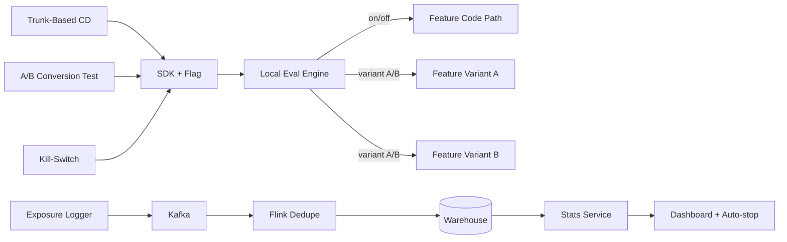

*Use case topology: all three use cases (trunk-based CD, A/B testing, kill-switch) route through the same SDK evaluation engine. Flag evaluation determines which code path executes (feature on/off or variant A/B). Exposure events are logged for A/B tests and analyzed for statistical significance, with auto-stop on guardrail breaches.*

---

### Components

- **Admin console**
  *Purpose*: flag/experiment lifecycle UX. *Responsibilities*: CRUD with approval workflows, targeting editors, ramp controls, results dashboards, audit views. *Relationship*: sole writer to definitions store.

- **Definitions store + config service**
  *Purpose*: versioned truth. *Responsibilities*: schema validation, immutable published snapshots, revision history (rollback!), API serving snapshots to distribution tier.

- **Distribution tier**
  *Purpose*: get rules everywhere fast. *Responsibilities*: CDN-published signed snapshots (client SDKs poll cheaply) plus streaming push (server SDKs watch); both paths converge; instances cache last-known-good persistently.

- **SDK fleet** (per language/platform)
  *Purpose*: local evaluation engines. *Responsibilities*: snapshot fetch/verify, rule evaluation engine (shared semantics!), deterministic bucketing, exposure emission (batched async), metrics (staleness age, eval counts).

- **Exposure pipeline**
  *Responsibilities*: ingest, dedupe, land in warehouse; volume enormous (every eligible request) — sampled enrichment, aggressive partitioning.

- **Stats/analysis service**
  *Responsibilities*: sequential-test computation, CUPED application, guardrail monitoring, auto-stop triggers, report generation.

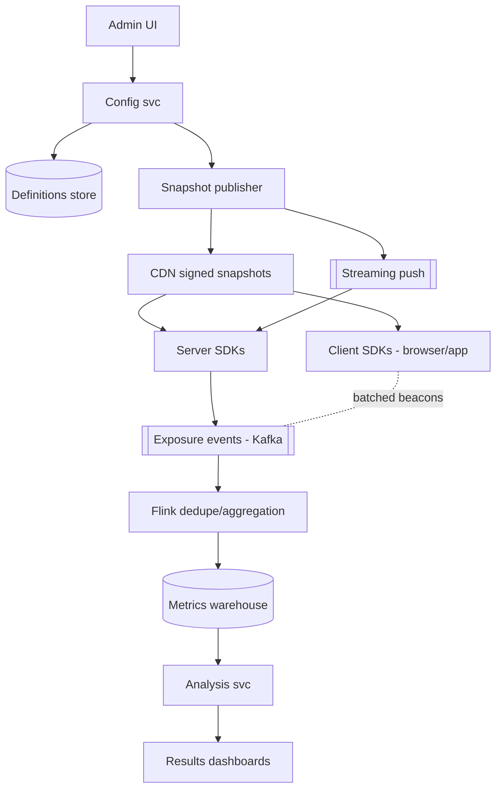

*Component interaction: the Admin UI writes to the Config Service, which maintains the versioned Definitions Store and publishes snapshots. The distribution tier pushes snapshots to both Server SDKs (via CDN + streaming) and Client SDKs (via CDN + batched beacons). Exposure events flow through Kafka → Flink (dedupe) → Warehouse → Analysis Service → Dashboards.*

---

### Architectural Patterns

- **Snapshot + streaming hybrid distribution**
  *What*: full snapshots (CDN, versioned, signed) provide correctness baseline; streaming deltas provide second-level freshness. *Solves*: propagation speed without hot-path coupling. *When*: any large-scale config distribution (mirrors config-management topic patterns).

- **Layered/exclusion traffic allocation**
  *Problem*: hundreds of concurrent experiments competing for finite users. *How*: orthogonal hash layers (domain-stratified) let experiments randomize independently; explicit exclusion groups prevent conflicting features colliding. *Real-world*: Microsoft/Pinterest published architectures standardize this.

- **Sticky bucketing fallback**
  *What*: when targeting rules would evict an assigned user mid-experiment (attribute changed), a secondary hash preserves their variant tagged "stale" — analyses include them appropriately instead of silently dropping. *Why*: naive eviction biases populations toward stable-attribute users.

- **Auto-ramp with metric gates**
  *What*: rollouts proceed 1%→5%→25%→100% automatically when guardrails hold each stage's soak period; regressions freeze+alert. *Converts*: releases from hope into controlled processes.

- **Exposure-on-eligibility discipline**
  *What*: log when evaluation *could* have affected the user experience (flag actually checked for them), not raw evaluations — otherwise denominators poison every metric downstream.

- **Anti-pattern**: server-side per-request RPC evaluation (latency + central SPOF); equally, client-side-only experiments without exposure verification (ad-blockers/beacons lost → corrupted denominators).

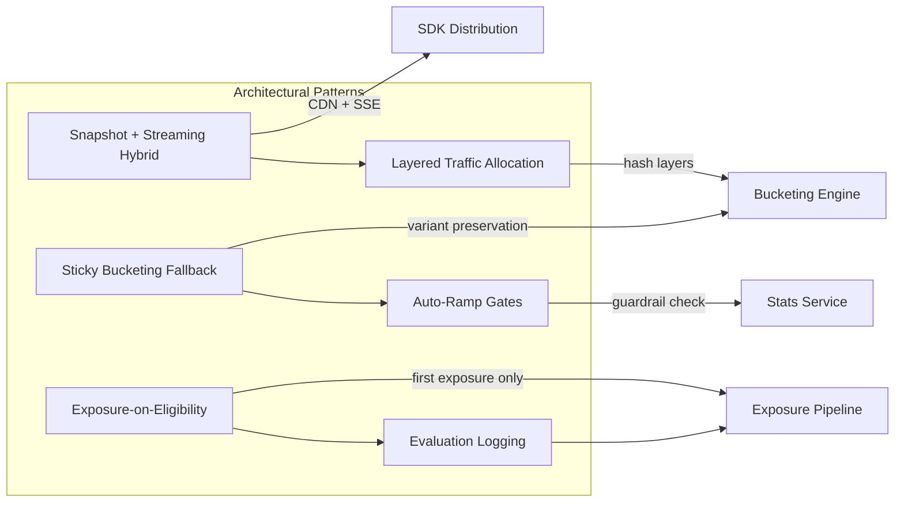

*Pattern relationships: the Snapshot + Streaming Hybrid pattern feeds SDK distribution; Layered Traffic Allocation and Sticky Bucketing Fallback both feed the Bucketing Engine; Auto-Ramp with Metric Gates depends on the Stats Service for guardrail checks; Exposure-on-Eligibility and Evaluation Logging both feed the Exposure Pipeline.*

---

### Benefits

- **Deploy-release decoupling**: code ships dark continuously; business chooses exposure moment — trunk-based development depends entirely on this capability.
- **Instant risk mitigation**: kill-switches convert bad-rollout incidents from rollback-cycles into click-flips.
- **Causal decision culture**: A/B rigor replaces HiPPO decisions; compounding small wins fund the platform permanently.
- **Progressive delivery safety net**: automated ramps with metric gates catch regressions at 1% blast radius instead of 100%.
- **Organizational learning**: experiment archives become institutional memory ("we tried that in 2023, here's what happened").

---

### Challenges

- **Technical**: hash-consistency across languages (UTF-8 normalization! integer overflow semantics); snapshot-signature rotation; mobile SDK offline-first caching; beacon loss from ad-blockers skewing client-side exposures.
- **Scalability**: exposure event floods during viral launches; warehouse join costs at petabyte event volumes; config-snapshot CDN cache invalidation precision.
- **Performance**: SDK cold-start latency (first eval before fetch completes — safe defaults mandatory); memory footprint of large rule sets on edge runtimes.
- **Reliability**: distribution-tier outage → stale-but-working (documented staleness alarms); stats-service outage pauses analysis not serving.
- **Maintainability**: flag-debt workflows (expiry enforcement, ownership metadata, automated cleanup PRs); DSL evolution backward compatibility.
- **Operational**: experiment velocity governance (collision review boards); audit trails for regulated industries (flags as change records).
- **Security**: targeting rules leaking PII into configs (attribute minimization); admin-console authz (flag changes are production changes!).

---

### Best Practices

- **Treat every flag as production config**: versioned, reviewed, audited, owned, expiring — never debug leftovers living for years.
- **Freeze experiment definitions once started**; changes force re-randomization declarations explicitly.
- **Log exposures exactly-once per (unit, experiment)** with server-side verification samples against client beacons.
- **Adopt sequential testing defaults** to enable legitimate continuous monitoring without peeking sins.
- **Instrument guardrails universally** (latency/errors/business-critical inverses) — no primary-metric-only launches.
- **Build flag-lint CI**: unused-flag detection, naming conventions, expiry-date presence, owner-team tags.
- **Golden-vector tests across all SDKs** guaranteeing identical assignments given identical inputs — run in every release pipeline.
- **Safe-default evaluation**: unknown/unfetched flags resolve to documented defaults (usually off), never exceptions.

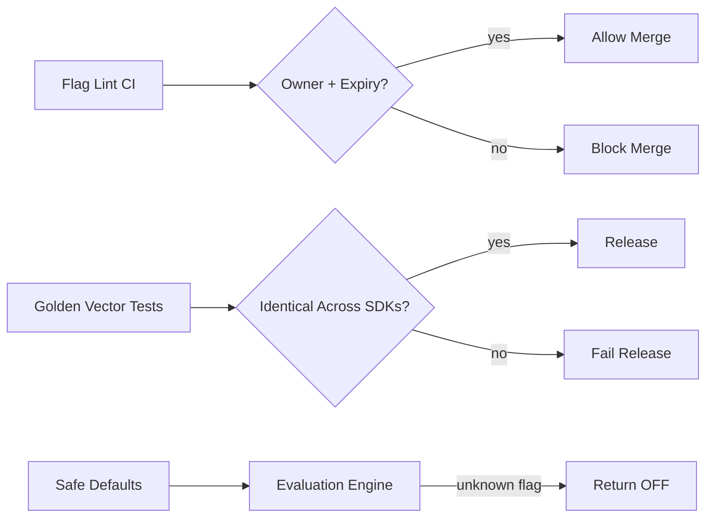

*Best practices enforcement: Flag Lint CI checks for owner and expiry metadata before allowing merges; Golden Vector Tests verify that all SDK implementations produce identical bucketing results; Safe Defaults ensure that unknown or unfetched flags resolve to OFF rather than throwing exceptions.*

---

### When to Use / When Not to Use

**Platform-scale adoption when**: frequent deploys (daily+), meaningful traffic for statistical power, multiple teams coordinating releases, experimentation culture desired.

**Lightweight alternatives when**: low traffic (tests never reach significance — just ship behind simple toggles), tiny teams (a Redis-backed flag service beats platform ceremony), single-platform products (web-only, no mobile SDK matrix).

**Managed-vs-build decision matrix:**

| Factor | Build In-House | Buy (LaunchDarkly/Split/Optimizely) | Self-Hosted OSS (Unleash/GrowthBook) |
|---|---|---|---|
| Control over stats pipeline | Full | None | Full |
| Time to value | Months | Weeks | Months |
| SDK matrix burden | All languages | Vendor handles | Community |
| Statistical rigor | Build from scratch | Turnkey | Depends on fork |
| Cost at scale | Infrastructure only | $100K+/yr | Infrastructure only |

Decision inputs: release cadence, traffic scale (needed for experiment power), statistical sophistication appetite, compliance needs (audit trails), budget shape.

---

### Data Model and API

The feature flag platform data model captures flags, experiments, variants, targeting rules, and exposure events. Flags and experiments share a substrate but have different lifecycles and governance requirements.

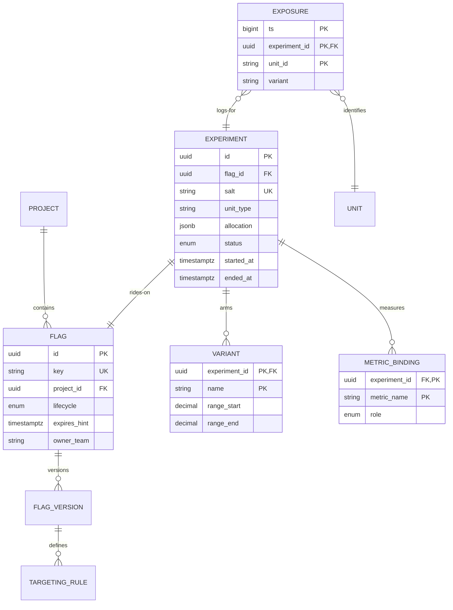

*Entity-relationship diagram: a PROJECT contains many FLAGs; each FLAG has versioned definitions (FLAG_VERSION) with targeting rules; an EXPERIMENT rides on a FLAG (same config substrate, different governance); VARIANTs define allocation ranges; EXPOSURE events are logged per (experiment, unit, time); METRIC_BINDING links metrics to experiments with role (primary/guardrail).*

**Design choices**: immutable experiment rows with salt/allocation frozen at start (enforced by service logic + reviews); exposure table partitioned daily, clustered by experiment (analysis scans); range-based allocation columns make mutual-exclusion verifiable mechanically; flag lifecycle states (`INACTIVE/ACTIVE/COMPLETED/CLEANUP_CANDIDATE`) drive hygiene automation.

#### API Contract

The platform exposes evaluation APIs for SDKs and management APIs for administrators.

**Evaluation API (for SDKs and services)**

| Method | Endpoint | Purpose |
|---|---|---|
| GET | `/api/v1/evaluate?customer_id=cus_123&user_id=user_456` | Evaluate all flags for a user |
| GET | `/api/v1/evaluate/{flag_key}` | Evaluate a single flag |
| POST | `/api/v1/exposure` | Log experiment exposure |

**GET /api/v1/evaluate?customer_id=cus_123&user_id=user_456 — Response**:
```json
{
  "flags": {
    "new_checkout_ui": {"enabled": true, "variant": "B"},
    "enable_beta_feature": {"enabled": false, "variant": "control"},
    "payment_provider": {"enabled": true, "variant": "stripe"}
  },
  "experiments": {
    "checkout_v2_experiment": {"variant": "checkout_v2", "bucket": 42}
  },
  "etag": "abc123",
  "cached_for": 30
}
```

**Management API**

| Method | Endpoint | Purpose |
|---|---|---|
| POST | `/admin/api/v1/flags` | Create a feature flag |
| PATCH | `/admin/api/v1/flags/{key}` | Update flag config |
| POST | `/admin/api/v1/experiments` | Create experiment |
| GET | `/admin/api/v1/experiments/{id}/results` | Get experiment results |
| POST | `/admin/api/v1/audits` | Audit log of changes |

**POST /admin/api/v1/flags — Request Body**:
```json
{
  "key": "new_checkout_ui",
  "name": "New Checkout UI",
  "description": "Roll out the new checkout flow",
  "default": false,
  "targeting": {
    "rules": [
      {"if": {"user.plan": "premium"}, "then": true},
      {"if": {"percentage": 10}, "then": true}
    ]
  }
}
```

**POST /admin/api/v1/experiments — Request Body**:
```json
{
  "name": "Checkout V2 Test",
  "metric": "checkout_conversion",
  "variants": [
    {"key": "control", "weight": 5000},
    {"key": "checkout_v2", "weight": 5000}
  ],
  "status": "running"
}
```

**Status codes**: `200` Evaluation result, `201` Created, `400` Invalid request, `401` Auth required, `403` Insufficient permissions, `404` Flag/experiment not found, `429` Rate limited.

**Caching & Versioning**: Evaluation responses include `etag` and `cached_for` (seconds). SDKs cache locally and only re-fetch when expired. Flag updates trigger real-time push via streaming SDK (Server-Sent Events) or periodic polling fallback.

**Idempotency**: Flag creation is idempotent — re-submitting with the same `key` updates the flag (PATCH semantics via PUT).

---

### Domain-Specific: Feature Flag Evaluation Deep Dive

This section covers the core technical challenges unique to feature flagging platforms: flag targeting rule evaluation, rollout strategies (percentage, canary, staged), A/B testing with statistically rigorous assignment, and the bucketing mechanics that make assignments deterministic and sticky.

#### Flag Targeting Rule Evaluation

Targeting rules determine which users get which variant. Rules are evaluated in priority order — the first matching rule wins. Each rule can match on user attributes (plan, geography, device type), segment membership, or percentage rollout.

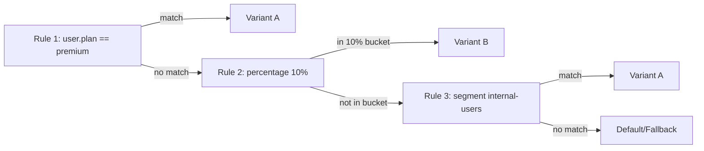

*Targeting rule evaluation flow: rules are checked in priority order. Rule 1 matches premium users and assigns Variant A. Non-premium users fall through to Rule 2, which checks if the user falls in the 10% rollout bucket (deterministic hash). If not, Rule 3 checks internal-user segment membership. If no rule matches, the default/fallback variant is used.*

```java
public final class FlagEvaluator {

    private volatile Snapshot snapshot = Snapshot.empty();

    /** Called by distribution watcher; atomic swap keeps evaluators consistent. */
    public void update(Snapshot next) { this.snapshot = next; }

    public EvaluationResult evaluate(String flagKey, EvaluationContext ctx) {
        FlagDef def = snapshot.get(flagKey);
        if (def == null || def.off()) {
            return EvaluationResult.of(def == null ? DEFAULT_OFF : def.offVariant());
        }
        for (TargetingRule rule : def.rules()) {
            if (rule.matches(ctx.attributes())) {
                String variant = bucket(def.salt(), ctx.unitId(), rule.allocations());
                if (def.isExperiment()) {
                    exposureSink.logIfEligible(ctx.unitId(), def.experimentId(), variant);
                }
                return EvaluationResult.of(variant);
            }
        }
        return EvaluationResult.of(def.fallback());
    }

    private static String bucket(String salt, String unitId,
                                 List<Allocation> allocations) {
        long h = sha256Prefix(salt + "|" + unitId) % 1_000_000;
        long cumulative = 0;
        for (Allocation a : allocations) {
            cumulative += a.rangeEndPermille();
            if (h < cumulative) return a.variant();
        }
        return allocations.get(allocations.size() - 1).variant(); // remainder bucket
    }
}
```

*The `FlagEvaluator` bean holds a volatile snapshot of flag definitions (atomically swapped on updates — zero locks on the read path). The `evaluate` method checks each targeting rule in priority order; the first matching rule triggers bucketing via a deterministic hash. For experiments, an exposure event is logged. The `bucket` method hashes `(salt + "|" + unitId)` modulo 1,000,000 and maps the result into contiguous variant allocation ranges. Golden-vector tests verify identical outputs across JVM/JS/Kotlin implementations.*

#### Rollout Strategies

Feature flags enable several rollout patterns, each with different risk profiles:

- **Canary deployment**: Route 100% of internal/canary traffic to the new variant, then gradually increase to external users. Uses `user.email` domain targeting (`@company.com` → Variant B).
- **Percentage rollout**: Gradually increase the rollout percentage over time (1% → 5% → 25% → 100%). Uses deterministic bucketing so the same users are in the 1% cohort as in the 5% cohort (no churn).
- **Staged rollout by segment**: Roll out to low-risk segments first (beta users, then free users, then paid users). Each segment has a different rollout percentage.
- **Scheduled rollout**: Time-based activation (e.g., "enable at 2 PM UTC for US East users"). Uses `user.timezone` attribute.
- **Kill switch**: Immediately set roll out percentage to 0% and mark the flag as `off`. Propagates within seconds via the streaming distribution channel.

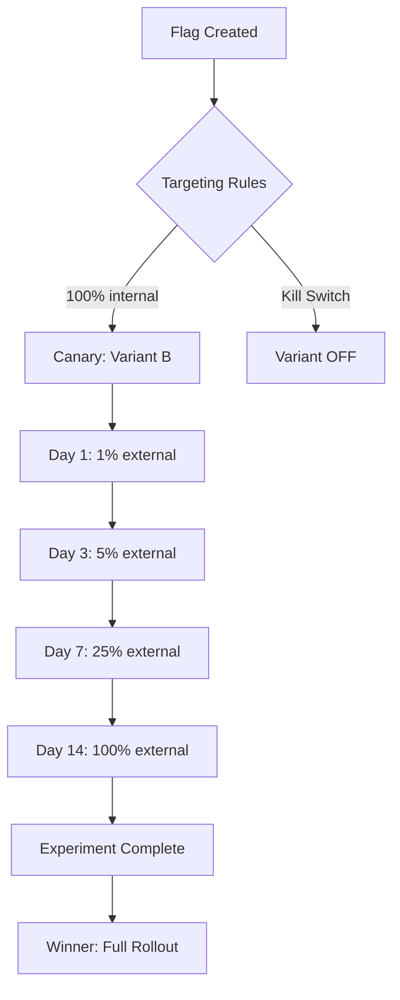

*Rollout strategy progression: a flag starts as a canary (100% internal traffic), then progresses through staged percentage rollouts (1%, 5%, 25%, 100%) over days. At each stage, guardrail metrics are checked. If any guardrail breaches, the kill switch immediately disables the flag. Upon completion, the winning variant receives a full rollout.*

#### Experimentation / A/B Testing

Experiments measure the causal impact of a variant on a metric. The platform provides:

- **Primary metric**: the metric the experiment is designed to move (e.g., checkout conversion rate). Pre-registered before the experiment starts.
- **Guardrail metrics**: safety metrics that must not degrade (e.g., page load latency, error rate, refund rate). Auto-stop on breach.
- **Secondary metrics**: exploratory metrics (e.g., time on page, scroll depth) for post-hoc analysis.

The statistical engine supports:
- **Sequential testing** (mSPRT): compute p-values at any point without inflating false positives. Enables "check anytime" dashboards honestly.
- **CUPED** (Controlled-experiment Using Pre-Experiment Data): variance reduction using pre-experiment behavior as covariates, cutting required sample sizes by 30-50%.
- **Sample ratio mismatch (SRM) detection**: detect if the actual split deviates from the expected split (e.g., 55/45 instead of 50/50), which indicates instrumentation bugs or bot interference.

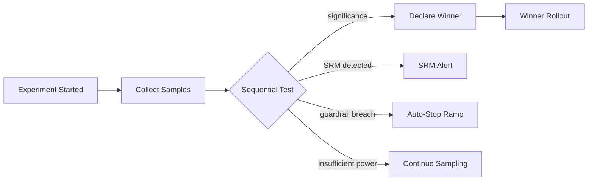

*Experiment lifecycle: after an experiment starts, samples are collected and analyzed using sequential testing. If statistical significance is reached, a winner is declared and rolled out. If a sample ratio mismatch is detected, an alert fires. If a guardrail metric breaches, the ramp auto-stops. If statistical power is insufficient, sampling continues.*

#### Deterministic Bucketing Mechanics

```
bucket = hash(salt + unit_id) mod 2^32
variant = lookup(bucket within [0%, p1), [p1, p2), ...)   // contiguous ranges
```

Properties that matter:

- **Salt per experiment** prevents cross-experiment correlation of assignments.
- **Unit of randomization** choice: user_id (stable), session (more power, cross-device inconsistency), or cluster (households — avoids interference).
- **Mutual exclusion via layered ranges**: multiple experiments carve disjoint sub-ranges of a global hash space so users can enter new experiments without reshuffling old ones (the "traffic allocation" problem at scale).
- **Never change salt/unit mid-experiment** — re-bucketing destroys the population's integrity; migrations require explicit re-randomization protocols.

```java
@Component
@RequiredArgsConstructor
public class BucketingService {

    private static final int BUCKET_SPACE = 1_000_000;

    /**
     * Deterministic bucketing: same (salt, unitId) always produces the same bucket.
     * Uses SHA-256 for cryptographic-grade distribution, truncated to 32 bits.
     */
    public int bucket(String salt, String unitId) {
        String input = salt + "|" + unitId;
        byte[] hash = Hashing.sha256().hashString(input, StandardCharsets.UTF_8).asBytes();
        // Take first 4 bytes as unsigned int, mod bucket space
        long value = ByteBuffer.wrap(hash).getInt() & 0xFFFFFFFFL;
        return (int) (value % BUCKET_SPACE);
    }

    /**
     * Assign a variant based on bucket number and allocation ranges.
     * Allocations must be contiguous and sum to BUCKET_SPACE.
     */
    public String assignVariant(int bucket, List<Allocation> allocations) {
        long cumulative = 0;
        for (Allocation alloc : allocations) {
            cumulative += alloc.rangeEndPermille();
            if (bucket < cumulative) {
                return alloc.variant();
            }
        }
        return allocations.get(allocations.size() - 1).variant();
    }
}
```

*The `BucketingService` bean implements deterministic bucketing using SHA-256 truncated to a 32-bit unsigned integer modulo 1,000,000. The `assignVariant` method maps bucket numbers to contiguous variant allocation ranges. The salt prevents correlation between experiments; the unit ID (typically user_id) ensures stickiness. UTF-8 encoding and byte-order handling are standardized across all SDK implementations via golden test vectors.*

#### Statistical Foundations

- **Hypothesis testing**: H0 "no difference" vs H1; α (false-positive rate, typically 0.05), power (typically 0.8). Sample-size math upfront: `n ≈ 16·p(1−p)/δ²` per arm for proportions — knowing this explains why tiny sites can't run meaningful tests.
- **Peeking problem**: checking significance continuously inflates false positives massively; fixes: fixed-horizon analysis, group-sequential corrections, or **sequential testing** (mSPRT) designed for continuous monitoring — modern platforms default here.
- **Guardrail metrics**: latency, error rates, unsubscribes — auto-halt ramps when breached even if the primary metric looks great.
- **CUPED**: variance reduction using pre-experiment behavior as covariates, cutting required sample sizes ~30–50% — the highest-leverage statistical trick in production experimentation.

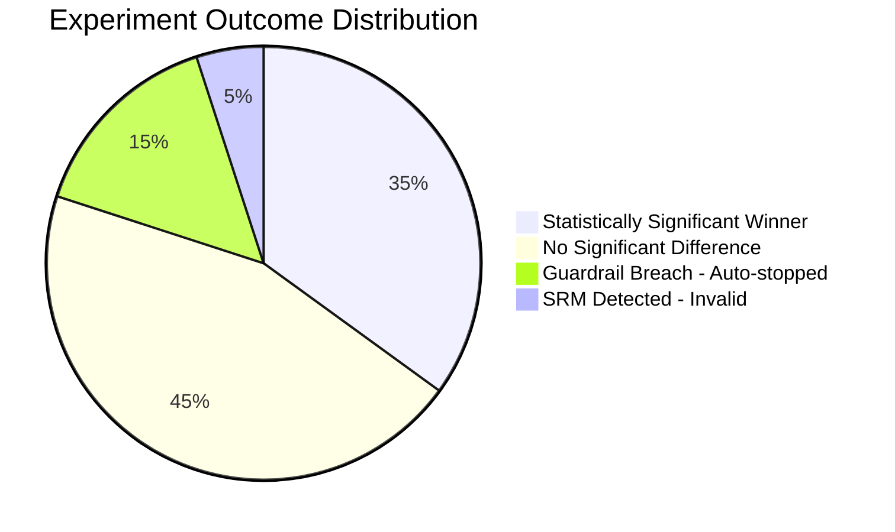

*Experiment outcome distribution: the typical breakdown across a portfolio of experiments — about 35% find a statistically significant winner, 45% find no significant difference (null result), 15% trigger guardrail breaches and are auto-stopped, and 5% exhibit sample ratio mismatch (indicating instrumentation bugs).*

#### Exposure Logging & Analysis Join

Exposure = first evaluation *that could affect the user* (not every check!). Pipeline: SDK emits async → Kafka → Flink dedupes per (user, experiment) → warehouse table joined to outcome metrics (orders, revenue, engagement) by unit+timestamp windows. Misalignment here (logging exposures for users who never saw variants, timezone skew in joins) silently corrupts results — parity discipline mirrors ML feature stores.

```java
@Component
@RequiredArgsConstructor
public class ExposureLogger {

    private final KafkaTemplate<String, Object> kafkaTemplate;
    private final MeterRegistry meterRegistry;

    /**
     * Log an exposure event exactly-once per (unit, experiment).
     * Uses an in-memory dedup cache; the Flink layer provides the durable second check.
     */
    public void logIfEligible(String unitId, String experimentId, String variant) {
        String dedupKey = unitId + ":" + experimentId;
        if (localDedupCache.putIfAbsent(dedupKey, Boolean.TRUE) != null) {
            // Already logged for this unit+experiment in this process
            return;
        }

        var event = Map.of(
                "unit_id", unitId,
                "experiment_id", experimentId,
                "variant", variant,
                "timestamp", System.currentTimeMillis()
        );

        kafkaTemplate.send("experiment-exposures", experimentId, event);
        meterRegistry.counter("exposure.logged", "experiment", experimentId).increment();
    }
}
```

*The `ExposureLogger` bean logs exposure events to Kafka. It uses an in-memory dedup cache (checked via `putIfAbsent`) to prevent duplicate logging within a single process, and the downstream Flink layer provides durable deduplication. Each event includes the unit_id, experiment_id, variant, and timestamp. Metrics track exposure logging rate per experiment.*

---

### Replication Strategies

Feature flag platforms must replicate flag configurations across SDK instances, regions, and datacenters while maintaining consistency between the flag service and the SDKs consuming flags.

**Flag configuration replication (CP):** The flag service is the single source of truth for flag definitions. Writes (flag creation, updates) go to the primary region's database and are replicated to read replicas in all regions using synchronous multi-region replication (e.g., CockroachDB, Spanner, or Postgres with logical replication). SDKs in each region fetch configurations from their local region's read replica. Write conflicts are resolved by last-write-wins (with version vectors for conflict detection) — only one admin updates a flag at a time, so conflicts are rare.

**SDK pull model (AP-with-cache):** SDKs poll the flag service for updates every 5 min (long-poll/SSE) or use streaming (Server-Sent Events / WebSocket) for real-time updates. When the connection drops, the SDK serves from its in-memory cache (last-known state). Cache TTL is 5 min — if the flag service is unreachable for >5 min, the SDK enters "offline mode" and uses the cached state.

**Experiment bucket assignments (CP):** A/B test bucket assignments are stored in a strongly consistent store (PostgreSQL) and replicated to all regions. Bucket assignments are computed deterministically by `hash(unit_id + experiment_id) % num_variants` — no replication needed. The assignment is cached per-user during a session.

**Audit log replication (CP):** All flag mutations and experiment changes are written to an append-only event log (Kafka / event store) replicated across regions with `acks=all` (all in-sync replicas must acknowledge).

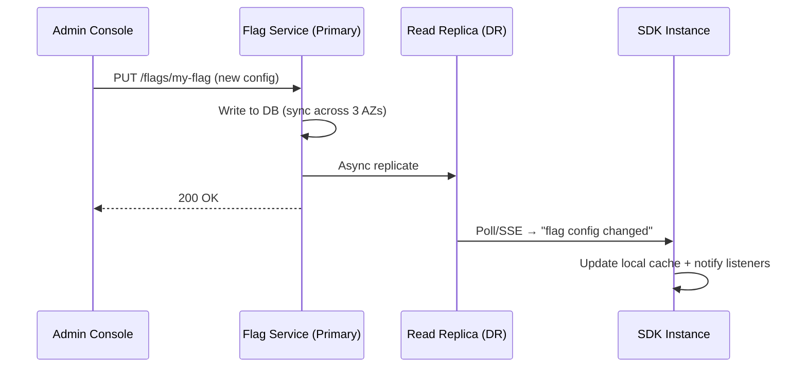

**Multi-region failover:** If the primary region fails, the flag service in the DR region takes over (etcd/ZK leader election). SDKs detect the failure (poll timeout) and fall back to the DR region. Flag configurations are eventually consistent — there may be a brief window where some SDKs have the old config, but this is acceptable since flag configs change infrequently (minutes-to-hours, not seconds).

---

### Failure Detection and Membership

The flag service must detect failures in flag storage, SDK connectivity, and downstream dependencies, and degrade gracefully without breaking applications.

**Health checks:**
- **Liveness**: HTTP `/health/live` returns 200 if the process is alive (Spring Boot Actuator).
- **Readiness**: HTTP `/health/ready` checks DB connectivity, cache (Redis) reachability, and stream (Kafka) consumer lag.
- **Business health**: `/health/business` checks flag evaluation latency (< 10ms p99) and cache hit ratio (> 95%).

**Failure detection:**

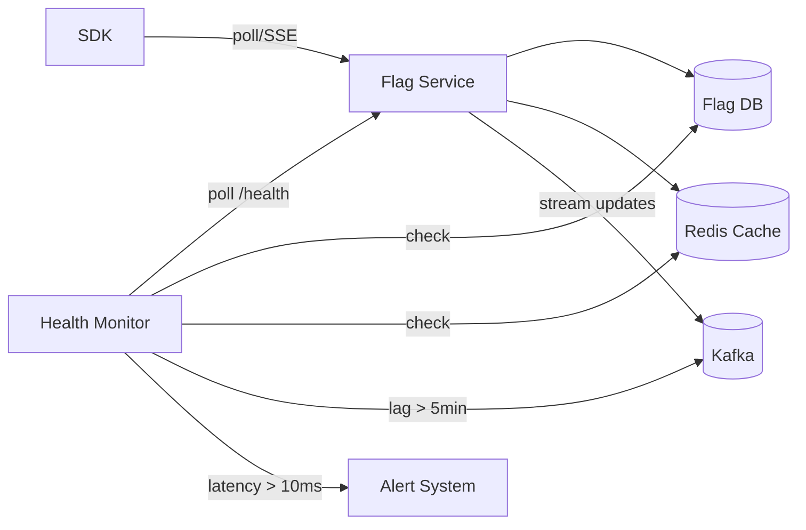

**SDK-side failure handling:**
- **Connection timeout**: If the flag service is unreachable (poll fails after 3 retries with exponential backoff), the SDK **serves from cache** without making a network call. Cache entries include a `servedAt` timestamp — if the cache is older than TTL (5 min), the SDK still serves it but logs a warning.
- **Malformed response**: If the flag service returns an unexpected response, the SDK falls back to its default variant (as configured in the flag) and logs the error.
- **Bootstrapping**: On first launch (no cache), if the flag service is unavailable, the SDK uses hardcoded default variants and logs an error. The app continues with safe defaults.
- **Circuit breaker**: The SDK wraps flag service calls in a circuit breaker (Hystrix/Resilience4j). On 5 consecutive failures, the breaker opens for 30s — all flags are served from cache during this window.

**Membership and leader election:** The flag service cluster uses Zookeeper or etcd for membership. On leader failure, a new leader is elected within 5s. Clients discover the new leader via DNS update or service discovery. The transition is transparent — SDKs reconnect to the new leader.

---

### High Availability and Scalability

The flag service must be available during deployments, regional outages, and traffic spikes. Flag evaluation must stay sub-millisecond even under peak load.

**Multi-AZ and multi-region deployment:**
- **Multi-AZ within a region**: 3+ instances across AZs behind a load balancer. DB is replicated with `sync` consensus (3 AZs). Cache (Redis) is clustered with replicas.
- **Multi-region active-active**: Flag service deployments in 3+ regions (us-east, eu-west, ap-southeast). Each region handles its local traffic. Config DB is globally replicated (CockroachDB/Spanner or active-standby with async replication + failover).

**Flag serving layers:**
- **L1 cache**: In-process cache per SDK instance (microsecond access).
- **L2 cache**: Redis cluster per region (millisecond access). Serves the flag service's own evaluation path when DB is slow.
- **L3 storage**: PostgreSQL/CockroachDB (10ms+ access). Persists flag definitions.

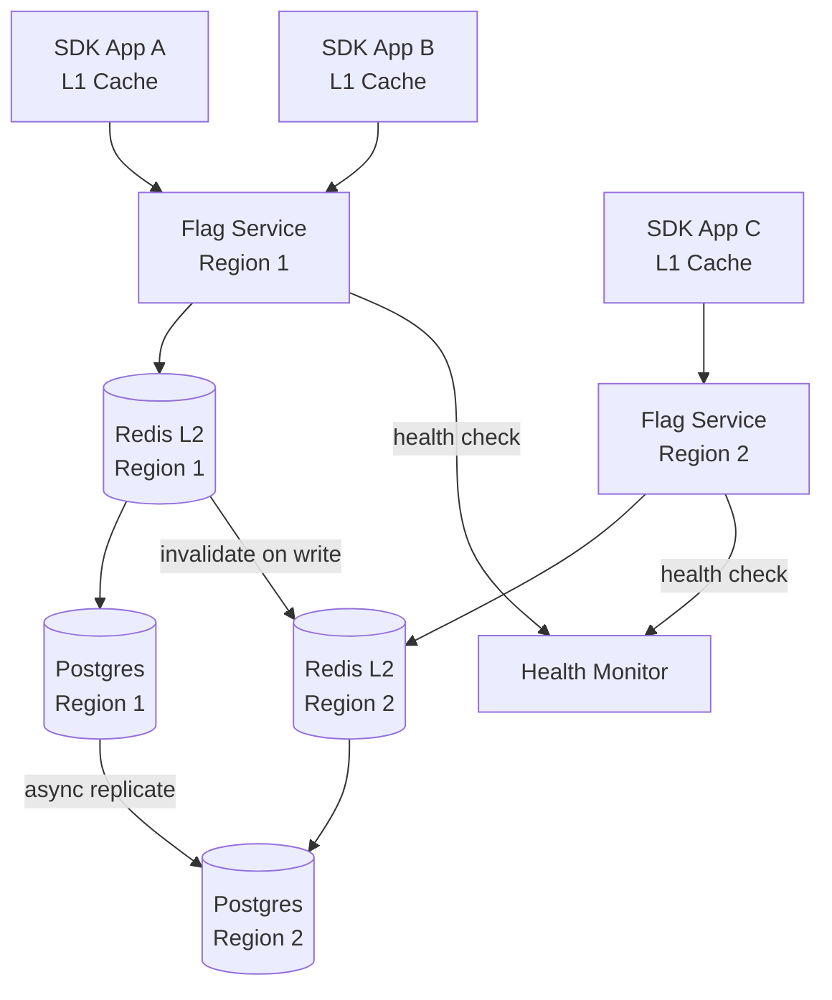

**Scaling the flag service:**
- **Horizontal scaling**: Stateless flag service instances behind a load balancer. Auto-scale based on evaluation latency (target p99 < 10ms) and CPU utilization (target 60%).
- **Flag distribution**: Large flags (e.g., 10K user segments) are cached at L2 (Redis) — the flag service evaluates segments in Redis and returns the pre-computed variant to the SDK.
- **SDK polling**: SDKs poll every 5 min. Peak traffic is ~1000x baseline at poll time. Smooth polling (stagger by random jitter) spreads the load.

**Graceful degradation:**
- If L2 cache is down → serve from L3 (DB). Latency increases but correctness maintained.
- If DB is down → serve from L2 with extended TTL. New flag updates may take longer to propagate.
- If all caches down → SDKs use their local L1 cache (last-known state). App degrades gracefully with potentially stale flags (up to 5 min old).

---

### Performance and Optimization

Flag evaluation must be sub-millisecond to avoid impacting application performance. At scale (100M+ flags evaluated/sec), every micro-optimization matters.

**Flag evaluation pipeline:**

| Stage | p50 | p99 | Optimization |
|---|---|---|---|
| L1 cache lookup (SDK) | < 1 µs | < 5 µs | Hash map, lock-free read |
| L2 Redis cache (service) | < 0.1 ms | < 1 ms | Redis, pre-serialized |
| L3 Database (service) | 2 ms | 10 ms | Connection pooling, read replicas |
| Flag evaluation (logic) | < 5 µs | < 20 µs | Pre-compiled rules, segment cache |
| **Total (SDK eval)** | **< 1 µs** | **< 5 µs** | **All local** |
| **Total (service eval)** | **< 1 ms** | **< 5 ms** | **L2 cache + eval** |

**SDK-side optimizations:**
- **L1 cache with lock-free reads**: Flags stored in a concurrent hash map; updates atomically swap the entire map (copy-on-write pattern). Reads are lock-free.
- **Pre-compiled flag rules**: At config update, the SDK compiles targeting rules (percentage rollouts, segment matches) into an in-memory tree. Evaluation at the leaf nodes avoids re-parsing rules on every call.
- **Lazy loading**: Flags are loaded on-demand (first evaluation), not at SDK init. This avoids blocking app startup on the flag service.
- **Batch evaluation**: `evaluateAll()` returns all flags in a single operation, avoiding repeated hash map lookups.

**Server-side optimizations:**
- **Hot flag caching**: Frequently accessed flags (top 10%) are pinned in Redis with a 5-min TTL. Cache hit ratio > 95%.
- **Segment pre-computation**: User segments (e.g., "beta testers in EU") are pre-computed and stored in Redis. Segment membership is checked via a Bloom filter (O(1) read, < 1% false positive).
- **Streaming updates**: Real-time flag changes are pushed to SDKs via SSE/WebSocket (instead of 5-min polling). Reduces average propagation delay from 5 min to < 1s for critical flags.
- **Probabilistic data structures**: Large segment membership uses Bloom filters or Cuckoo filters for O(1) lookups with minimal memory. Percentage rollouts use a fast hash function (MurmurHash3).

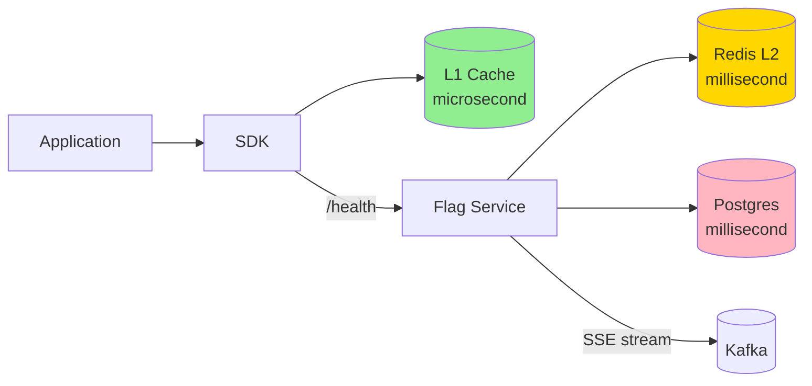

**Java example — flag evaluation with caching:**

```java
@Service
public class FlagEvaluationService {

    private final RedisTemplate<String, FlagConfig> redisTemplate;
    private final MeterRegistry meterRegistry;

    public boolean evaluate(String flagKey, String userId, Map<String, Object> context) {
        Timer.Sample sample = Timer.Sample.start(meterRegistry);
        try {
            // L1: Check Redis (per-region, in-memory)
            String cacheKey = "flag:" + flagKey;
            FlagConfig config = redisTemplate.opsForValue().get(cacheKey);
            if (config == null) {
                config = loadFromDatabase(flagKey);
                redisTemplate.opsForValue().set(cacheKey, config, Duration.ofMinutes(5));
            }

            // L2: Evaluate targeting rules
            boolean result = evaluateRules(config, userId, context);

            sample.stop(Timer.builder("flag.eval.latency")
                    .tag("flag", flagKey)
                    .register(meterRegistry));
            Counter.builder("flag.eval.count")
                    .tag("flag", flagKey)
                    .tag("result", String.valueOf(result))
                    .register(meterRegistry).increment();

            return result;
        } catch (Exception e) {
            meterRegistry.counter("flag.eval.errors", "flag", flagKey).increment();
            // Fallback: return default variant
            return getDefaultVariant(flagKey);
        }
    }
}
```

 *`FlagEvaluationService` implements the two-tier caching pattern: L1 Redis cache (5-min TTL) with DB fallback, then rule evaluation (hash-based rollout, segment matching). Micrometer tracks per-flag evaluation latency and result counts. On error, returns the default variant — graceful degradation.*

---

### CAP Theorem and Consistency Trade-offs

Feature flag platforms have different consistency requirements for different data types, requiring careful CAP trade-off decisions.

**Flag configuration store — CP (Consistency + Partition tolerance):**
Flag definitions (on/off, rollout percentage, targeting rules) must be consistent across all SDK instances. A flag that is "on" in one region and "off" in another causes inconsistent user experiences and potential bugs. The flag service uses a CP store (CockroachDB, Spanner, or Postgres with strong reads). During a network partition, the affected region cannot serve flag updates — SDKs continue serving cached flags (degraded but consistent).

**Experiment assignments — CP:**
A/B test bucket assignments must be consistent — a user assigned to variant A in one region must remain in variant A in all regions. Assignment is computed deterministically (`hash(userId + experimentId) % variants`) and stored in a CP store. If the assignment store is unreachable, the SDK falls back to the deterministic computation (no storage needed).

**Real-time flag updates — AP (Availability + Partition tolerance):**
When a flag is quickly toggled (e.g., kill switch activated), the platform prioritizes availability — the update must reach all SDKs as fast as possible. Uses SSE/WebSocket streams with best-effort delivery. If a region is partitioned, the flag is still served from cache (potentially stale for a few minutes). This is acceptable because flag updates are infrequent and the TTL-bounded staleness is bounded.

**Analytics data — AP:**
Experiment metrics (conversions, clicks) are collected asynchronously and may arrive out of order or be delayed. Analytics pipelines use eventual consistency — data from all regions is aggregated with a bounded delay (e.g., 15-min tumbling windows).

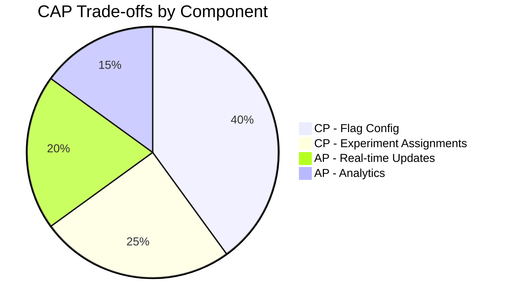

**Trade-off matrix:**

| Data Type | Consistency Model | Rationale |
|---|---|---|
| Flag definitions | Strong (CP) | Must be identical everywhere |
| Experiment assignments | Deterministic (no store needed) | `hash(unit_id + experiment_id) % n` |
| Real-time updates | Eventual (AP) | Best-effort streaming; cached fallback |
| Analytics data | Eventual (AP) | Bounded-delay aggregation |

**Design decisions under partition:**
- **Write availability**: If the primary flag DB is unreachable, flag writes are rejected (503). Admins see "flag service degraded." This is preferred over accepting writes that might conflict.
- **Read availability**: SDKs always serve from local cache if the flag service is unreachable. The cache TTL (5 min default, configurable per flag) bounds staleness. Critical flags can have shorter TTLs (e.g., 30s).
- **Recovery**: On partition recovery, the flag service reconciles — it pushes the latest config to all SDKs via the streaming channel, and SDKs invalidate their cache.

---

### Encryption and Key Management

Feature flag platforms handle PII (user segments, experiment assignments), API keys, and audit data. Encryption must protect data at rest, in transit, and in the audit trail.

**Encryption at rest:**
- **Flag definitions and configs**: Stored in the database (PostgreSQL/CockroachDB) with TDE (Transparent Data Encryption). Flag targeting rules and user segments are additionally field-level encrypted — the `targeting` and `segments` JSON fields are AES-GCM encrypted with a per-namespace DEK (Data Encryption Key) before storage.
- **API keys and SDK secrets**: Stored as HMAC hashes (SHA-256) in a dedicated `api_keys` table. The plaintext key is only visible at creation time; subsequent uses verify the hash. API keys for customers are rate-limited and rotated quarterly.
- **Audit logs**: Stored in append-only object storage (S3/GCS) with SSE-KMS. Audit records include `(user_id, action, flag_key, old_value, new_value, timestamp, ip_address)` — IP and user IDs are hashed for GDPR compliance (right to erasure: delete the hash mapping, not the raw audit record).
- **Experiment payloads**: Event data sent from SDKs (exposure, conversion) is encrypted in transit (TLS 1.3) and stored in Kafka with at-rest encryption (Kafka TLS + disk encryption).

**Encryption in transit:**
- All SDK-to-flag-service communication uses HTTPS/TLS 1.2+ (HTTP/2 preferred for multiplexing).
- Server-to-server (flag service → DB, → cache, → Kafka) uses mTLS (mutual TLS) with SPIFFE/SPIRE identities.
- Webhook delivery (experiment events to customer endpoints) uses HMAC-SHA256 signature verification — the customer provides a signing secret; the platform signs each webhook payload.

**Key management:**
- **Key hierarchy**: Master key in AWS KMS/HSM (root of trust) → KEK (Key Encryption Key, rotated annually) → DEK (Data Encryption Key, per-namespace, rotated quarterly).
- **Key rotation**: KMS CMKs rotated every 90 days with automatic re-encryption trigger. DEKs are rotated quarterly — old ciphertext remains decryptable via key versioning (the ciphertext embeds the DEK version).
- **Multi-region KMS**: Keys available in all deployment regions. AWS KMS replicates automatically; on-prem uses HashiCorp Vault with integrated storage for multi-region HA.
- **Client-side encryption**: For highly sensitive segments (PII targeting rules), the platform supports client-side field-level encryption — the SDK encrypts the segment on the client and the server can only match against the encrypted form.

```mermaid
graph LR
    KMS[KMS Master Key<br/>/ HSM] --> KEK[KEK<br/>(annual rotation)]
    KEK --> DEK1[DEK Namespace A<br/>(quarterly rotation)]
    KEK --> DEK2[DEK Namespace B]
    DEK1 --> DB1[(Flag DB<br/>encrypted fields)]
    DEK2 --> DB2[(Flag DB<br/>encrypted fields)]
    SDK[SDK] -->|HTTPS TLS 1.3| API[Flag Service API]
    API -->|mTLS| DB1
    API -->|mTLS| Cache[(Redis)]
    API -->|mTLS| Kafka[(Kafka)]
    API -->|HMAC-signed| Webhook[Customer Webhook]
```

---

### Authentication and Authorization

The platform serves different principals: SDK instances (server-side and client-side), admin users (via console), and partner integrations (via API).

**Authentication:**
- **SDK keys**: Server-side SDKs use a **Server SDK Key** (starts with `srv_`). Client-side SDKs (browser/mobile) use a **Client SDK Key** (starts with `cli_`) with restricted read-only permissions (can evaluate flags but cannot create/update). Keys are passed in the Authorization header (`Authorization: sdk-key srv_xxx`).
- **Admin users**: OAuth 2.0 + SSO (SAML/OIDC). JWT contains `userId`, `organizationId`, `roles`, `permissions`. Admin console uses OIDC with Azure AD, Okta, or Google Identity.
- **API clients**: REST API uses Bearer JWT tokens (`Authorization: Bearer <jwt>`). Short-lived (15-min) with 7-day refresh token in HttpOnly Secure SameSite cookies.
- **Service-to-service**: Internal services authenticate via mTLS with SPIFFE identities.

**Authorization model:**
- **RBAC with scopes**: `admin` (full access to all flags and experiments), `editor` (create/edit flags in their projects), `viewer` (read-only), `sdk-key` (evaluate flags, read-only). JWT contains scopes array.
- **Resource-level (Project-based)**: Flags belong to Projects. Users are granted `project_id:view`, `project_id:edit`, `project_id:manage` permissions. The API Gateway enforces project-level ACLs before routing.
- **Segment-based (Data isolation)**: Enterprise customers get logically isolated data — their flags, experiments, and user segments are partitioned by `tenant_id` at the storage layer, enforced by row-level security (RLS) in PostgreSQL.

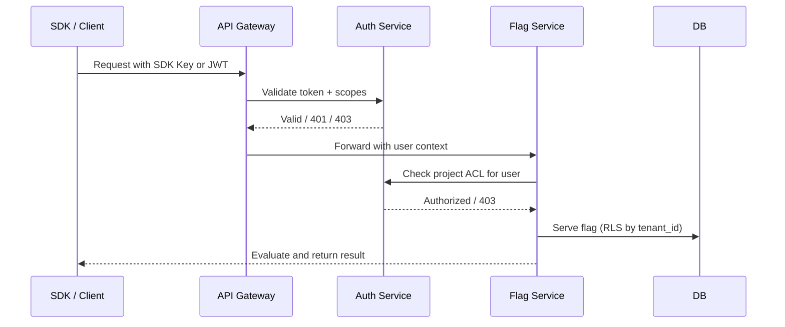

**Rate limiting:**
- Server SDK Keys: 10,000 evaluations/minute.
- Client SDK Keys: 200 evaluations/minute (browser/mobile).
- Admin users: 100 API requests/minute.
- Exceeded → HTTP 429 with `Retry-After`.

---

### Security Threats and Mitigations

Feature flag platforms are high-value targets — a compromised flag could turn off an entire service (kill switch), expose experiment data, or tamper with A/B test results.

#### Threat: Kill-Switch Abuse (Flag Tampering)

- **Risk:** An attacker with a compromised SDK key flips a "killswitch" flag, taking down a production service for all users.
- **Mitigation:** (1) **Separate SDK keys** — server-side SDK keys (high privilege) are restricted to backend services; client SDK keys (read-only) cannot mutate flags. (2) **Flag change approval workflow** — critical flags require multi-party approval (2FA + second approver) before changes propagate. (3) **Change audit trail** — every flag mutation is logged with `(user_id, ip, timestamp, old_value, new_value)`; alerts on "flag set to off" events for kill switches. (4) **Gradual rollout** — flag changes use percentage rollouts (1% → 5% → 25% → 100%) to limit blast radius.

#### Threat: Experiment Data Poisoning (Sybil Attack)

- **Risk:** An attacker registers 100 fake accounts to skew A/B test results, biasing the experiment toward a false conclusion.
- **Mitigation:** (1) **Assignment integrity** — bucket assignments are deterministic and computed server-side using a secret salt; attackers cannot choose their variant. (2) **Bot detection** — integrate with bot-detection services (reCAPTCHA, PerimeterX) for account registration. (3) **Statistical validity checks** — post-experiment, run sanity checks on sample ratio mismatch (SRM test, p < 0.001). If SRM detected, the experiment is invalidated. (4) **Conversion validation** — require email/SMS verification before counting conversions.

#### Threat: Flag Service Data Breach (PII Exposure)

- **Risk:** A SQL injection or insider threat exposes user segments containing PII (emails, phone numbers, purchase history) used in targeting rules.
- **Mitigation:** (1) **Field-level encryption** — segment definitions are AES-GCM encrypted at rest with per-namespace DEKs. (2) **PII minimization** — segments never contain raw PII; they reference user IDs which are mapped to PII in a separate, isolated service. (3) **Audit trail encryption** — all flag mutations and experiment changes are logged with PII hashed (SHA-256 + salt) for GDPR right-to-erasure compliance. (4) **Database access controls** — the flag service DB is not directly accessible; all reads/writes go through the service layer with RLS (row-level security) by `tenant_id`.

#### Threat: SDK-Side Flag Override (Client Tampering)

- **Risk:** A malicious client (browser/JS SDK or mobile SDK) overrides the flag evaluation result to unlock premium features without paying.
- **Mitigation:** (1) **Server-side evaluation** — for any sensitive feature (premium access, payment), the SDK calls the flag service API rather than evaluating locally. (2) **Short evaluation cache TTL** — sensitive flags have a 30s cache TTL, forcing frequent re-evaluation from the server. (3) **Integrity checks** — flag responses include a signature (HMAC of the flag value + user_id + expiry); the client verifies the signature before applying. (4) **Feature code obfuscation** — critical client-side code is obfuscated or runs in a trusted execution environment (TEE).

#### Threat: Webhook Forgery / Replay

- **Risk:** An attacker forges a webhook (e.g., "experiment X achieved significance") to trick a downstream system (e.g., marketing automation) into taking an action.
- **Mitigation:** (1) **HMAC-SHA256 signature verification** — each webhook includes a signature header; the receiver verifies against the shared secret. (2) **Nonce + timestamp** — reject webhooks with timestamps > 5 min old or duplicate nonces (in a Redis SET with TTL). (3) **TLS-only endpoints** — webhooks only delivered over HTTPS. (4) **Idempotency** — webhook handlers are idempotent (check `event_id` before processing).

```mermaid
graph LR
    Attacker[Attacker] -->|"forge webhook"| Webhook[Webhook Endpoint]
    Webhook --> Verify{HMAC<br/>Signature OK?}
    Verify -->|No| Block[Reject 401]
    Verify -->|Yes| TimeCheck{Timestamp<br/>< 5 min?}
    TimeCheck -->|No| Block
    TimeCheck -->|Yes| NonceCheck{Nonce<br/>Not seen?}
    NonceCheck -->|No| Block
    NonceCheck -->|Yes| Process[Process Event]
    Process --> Store[Record nonce<br/>(Redis SET w/ TTL)]
```

---

### Observability and Logging

Flag evaluation and experimentation generate telemetry that must be monitored for correctness (flag consistency, experiment integrity) and performance (evaluation latency, cache efficiency).

**Metrics:**

| Category | Metric | SLA / Threshold |
|---|---|---|
| Flag evaluation | Evaluation latency p99 | < 10ms (service), < 5µs (SDK) |
| Flag evaluation | Cache hit ratio (L1+L2) | > 95% |
| Flag evaluation | Error rate | < 0.01% |
| SDK health | SDK online rate | > 99.9% |
| SDK health | Cache miss rate | < 5% |
| Experiments | Assignment consistency | 100% (no cross-region mismatch) |
| Experiments | Exposure-to-conversion | Track conversion rate by variant |
| Experiments | Sample ratio mismatch (SRM) | p < 0.001 (alert if exceeded) |
| System health | Flag service CPU | < 70% avg, < 90% max |
| System health | DB connection pool | < 80% utilization |
| System health | Kafka lag | < 5 min |

**Logging:**
- **Flag mutation log**: Every flag creation/update/deletion is logged as JSON with `(timestamp, userId, action, flagKey, oldValue, newValue, project, ipAddress)`. Stored in append-only S3 with SSE-KMS.
- **Flag evaluation log**: For high-traffic flags, sampling (0.1%) of evaluation requests logged with `(flagKey, userId, variant, timestamp, cacheHit, latencyMicros)`. Used for debugging and audit.
- **Experiment events**: Exposure events (`unit_id, experiment_id, variant, timestamp`) and conversion events (`unit_id, experiment_id, variant, conversionType, value, timestamp`) are produced to Kafka and consumed by Flink for real-time analysis and batch pipelines for statistical analysis.
- **Error logs**: SDK errors (cache corruption, signature mismatch, auth failure) are logged with stack traces and correlation IDs. Flag service errors (DB timeout, Redis failure) are logged with error context.

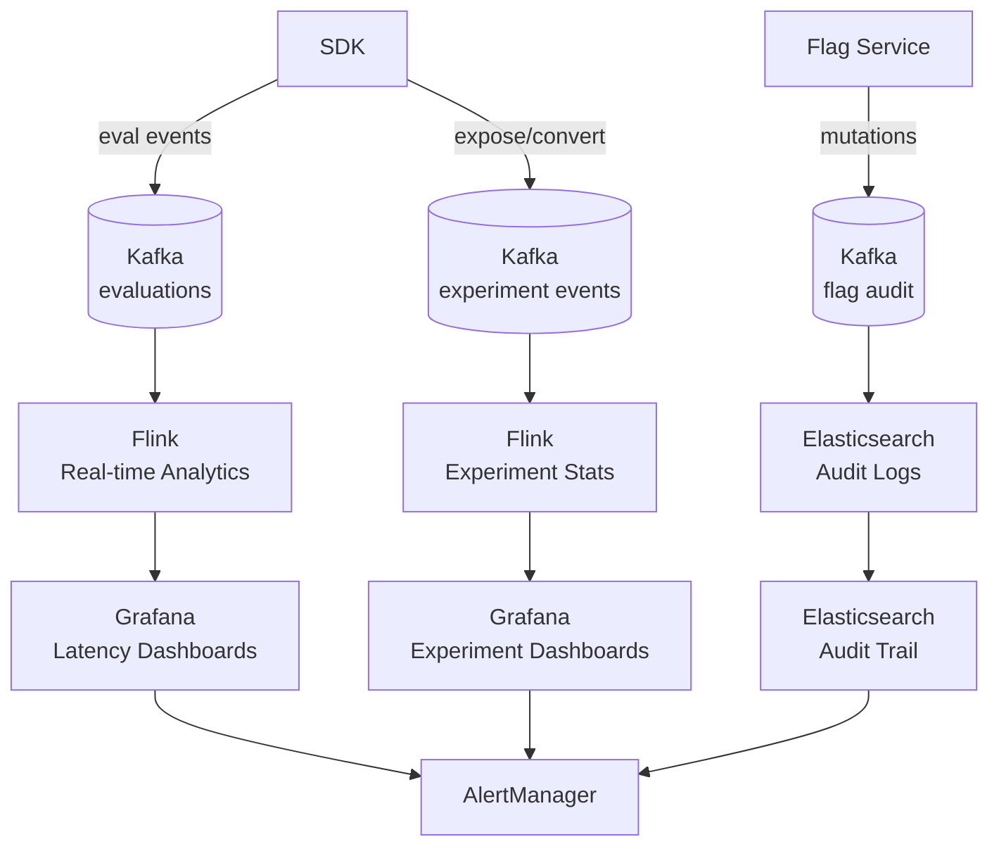

**Alert types:**
- **Critical**: Flag evaluation latency > 50ms for 5 min (SDK impact).
- **Critical**: Redis cache miss rate > 20% for 2 min (DB overload risk).
- **Critical**: Experiment SRM detected (p < 0.001) — assignment bug or bot attack.
- **Warning**: Flag service error rate > 1%.
- **Warning**: Kafka lag > 5 min for evaluation events.
- **Info**: New flag created (audit trail, Slack notification).
- **Daily**: Experiment conversion lift analysis — auto-email report to stakeholders.

---

### Real-World Implementations

- **LaunchDarkly**: Market leader; 3M+ developers; real-time flag streaming (SSE); built-in A/B testing; feature workflow with approvals; enterprise with multi-region and custom roles.
- **Split**: Part of ServiceNow; feature monitoring; experimentation platform; real-time metrics alongside flags.
- **Statsig**: Growth-focused; dynamic config (not just on/off); session replay; experimentation; strong stats engine ( CUPED, sequential testing).
- **Flagsmith**: Open-source option; self-hosted; Django/Python backend.
- **Google Optimize**: A/B testing by Google; integrates tightly with GA4.
- **Adobe Target**: Enterprise experimentation; AI-powered recommendations; part of Adobe Experience Cloud.

| Company | Flags/day | Experiments | Real-time Updates | SDK Languages | Key Feature |
|---|---|---|---|---|---|
| LaunchDarkly | 100M+ | Built-in | SSE streaming | 15+ (JS, Python, Go, Java, .NET) | Real-time, approvals |
| Split | 10M+ | Native | SSE streaming | 10+ (JS, Python, Java, Go) | Feature monitoring |
| Statsig | 10B+ evals | Native | WebSocket | 10+ (JS, React Native, Unity, Java) | Dynamic config, CUPED |
| Flagsmith | Varies | Plugin | Polling | 10+ (all major) | Open-source, self-host |
| Google Optimize | N/A | Primary focus | Polling | Limited | GA4 integration |

**Key architectural patterns from production:**
- **Hybrid push/pull**: LaunchDarkly and Split use SSE/WebSocket for real-time updates (push) and polling (pull) as fallback. Statsig uses WebSocket. Flagsmith uses polling.
- **Server-side vs. client-side evaluation**: LaunchDarkly and Split support both — server-side for security-critical flags, client-side for performance. Statsig prefers server-side evaluation for correctness.
- **Flag approval workflows**: LaunchDarkly has feature workflows with multi-step approvals and scheduled changes. Split has similar workflows with approvals.
- **Experimentation integration**: Modern platforms embed experimentation directly into the flag service (Split, Statsig, LaunchDarkly) rather than treating experiments as a separate system.

---

### Java and Spring Boot Implementation Guide

Spring Boot service for a feature flag platform: flag CRUD, evaluation with caching, and SDK key management.

#### 1. DTO Records

```java
public record CreateFlagRequest(
        @NotBlank String key,
        @NotBlank String project,
        boolean defaultValue,
        String rolloutJson,
        String salt) {}

public record FlagEvaluationResponse(
        String flagKey,
        boolean value,
        String variant,
        boolean cached,
        Instant ttlExpiresAt) {}

public record CreateProjectRequest(
        @NotBlank String name,
        @NotBlank String slug,
        String environment) {}

enum FlagStatus { ACTIVE, ARCHIVED, DELETED }
enum ProjectStatus { ACTIVE, SUSPENDED }
```

 *`CreateFlagRequest` captures flag metadata and rollout config. `FlagEvaluationResponse` returns the evaluated value with caching metadata. `FlagStatus` and `ProjectStatus` enumerate lifecycle states.*

#### 2. Entity with Optimistic Locking

```java
@Entity
@Table(name = "flags", indexes = {
        @Index(name = "idx_project_key", columnList = "project,flagKey", unique = true),
        @Index(name = "idx_status", columnList = "status")
})
public class Flag {

    @Id
    private String flagId;

    @Column(name = "project", nullable = false)
    private String project;

    @Column(name = "flagKey", nullable = false)
    private String flagKey;

    @Column(name = "default_value")
    private boolean defaultValue;

    @Column(name = "rollout_json", length = 4000)
    private String rolloutJson;

    @Column(name = "salt", nullable = false)
    private String salt;

    @Column(name = "targeting", length = 8000)
    private String targeting;

    @Enumerated(EnumType.STRING)
    @Column(nullable = false)
    private FlagStatus status = FlagStatus.ACTIVE;

    @Column(name = "created_by", nullable = false)
    private String createdBy;

    @Column(name = "created_at", nullable = false)
    private Instant createdAt;

    @Column(name = "updated_at")
    private Instant updatedAt;

    @Version
    private Long version;

    @PrePersist
    protected void onCreate() {
        this.createdAt = Instant.now();
        this.updatedAt = Instant.now();
    }

    @PreUpdate
    protected void onUpdate() {
        this.updatedAt = Instant.now();
    }
}
```

*The `Flag` entity with unique constraint on `(project, flagKey)`. The `rolloutJson` and `targeting` fields store the flag's targeting rules (percentage rollout, user segments). `@Version` provides optimistic locking for concurrent edits. `salt` is used in deterministic bucketing for percentage rollouts.*

#### 3. Flag Evaluation Service with Caching

```java
@Service
@RequiredArgsConstructor
@Slf4j
public class FlagEvaluationService {

    private final FlagRepository flagRepository;
    private final RedisTemplate<String, FlagConfig> redisTemplate;
    private final MeterRegistry meterRegistry;
    private final BloomFilterService bloomFilterService;

    public boolean evaluateFlag(String flagKey, String userId, String projectId) {
        Timer.Sample sample = Timer.Sample.start(meterRegistry);
        try {
            String cacheKey = "flag:" + projectId + ":" + flagKey;

            // L1: Redis cache
            FlagConfig config = redisTemplate.opsForValue().get(cacheKey);
            if (config == null) {
                config = loadAndCacheFlag(flagKey, projectId);
            }

            // L2: Deterministic bucketing for percentage rollout
            if (config.rolloutEnabled()) {
                int bucket = Hashing.murmur3_32().hashString(userId + config.salt(),
                        StandardCharsets.UTF_8).asInt() & 0x7fffffff;
                int percentage = Math.abs(bucket) % 10000; // 0-9999
                boolean inRollout = percentage < (config.rolloutPercent() * 100); // e.g., 25.00%
                if (inRollout) {
                    sample.stop(Timer.builder("flag.eval.latency")
                            .tag("flag", flagKey).tag("source", "rollout")
                            .register(meterRegistry));
                    return config.variationResult();
                }
            }

            // L3: Targeting rules (segment match)
            boolean targeted = evaluateTargeting(config, userId);
            boolean result = targeted || config.defaultValue();

            sample.stop(Timer.builder("flag.eval.latency")
                    .tag("flag", flagKey).tag("source", "targeting")
                    .register(meterRegistry));
            Counter.builder("flag.eval.count")
                    .tag("flag", flagKey).tag("result", String.valueOf(result))
                    .register(meterRegistry).increment();

            return result;
        } catch (Exception e) {
            meterRegistry.counter("flag.eval.errors", "flag", flagKey).increment();
            return flagRepository.findByFlagKeyAndProject(flagKey, projectId)
                    .map(Flag::getDefaultValue).orElse(false);
        }
    }

    private FlagConfig loadAndCacheFlag(String flagKey, String projectId) {
        return flagRepository.findByFlagKeyAndProject(flagKey, projectId)
                .map(flag -> {
                    var config = FlagConfig.from(flag);
                    redisTemplate.opsForValue().set(
                            "flag:" + projectId + ":" + flagKey,
                            config, Duration.ofMinutes(5));
                    return config;
                })
                .orElse(FlagConfig.DEFAULT);
    }
}
```

 *`FlagEvaluationService.evaluateFlag()` implements the two-tier caching: L1 Redis cache (5-min TTL) with DB fallback, then deterministic percentage rollout (MurmurHash3 bucketing + salt), then targeting rules (segment membership). Micrometer tracks latency per flag and source (cache/rollout/targeting) and result counts. On error, falls back to the flag's `defaultValue` — graceful degradation.*

#### 4. REST Controller with Rate Limiting

```java
@RestController
@RequestMapping("/api/v1/flags")
@RequiredArgsConstructor
public class FlagController {

    private final FlagEvaluationService evaluationService;
    private final FlagRepository flagRepository;

    @PostMapping
    public ResponseEntity<FlagDTO> createFlag(
            @RequestHeader("Authorization") String bearer,
            @Valid @RequestBody CreateFlagRequest request) {
        String userId = extractUserId(bearer);
        String projectId = request.project();

        // Check user has edit permission on this project
        if (!projectAuthorizationService.canEdit(userId, projectId)) {
            throw new ResponseStatusException(HttpStatus.FORBIDDEN);
        }

        var flag = new Flag();
        flag.setFlagId(UUID.randomUUID().toString());
        flag.setProject(projectId);
        flag.setFlagKey(request.key());
        flag.setDefaultValue(request.defaultValue());
        flag.setRolloutJson(request.rolloutJson());
        flag.setSalt(UUID.randomUUID().toString());
        flag.setCreatedBy(userId);

        flagRepository.save(flag);

        // Invalidate cache
        redisTemplate.delete("flag:" + projectId + ":" + request.key());

        return ResponseEntity.status(HttpStatus.CREATED)
                .body(FlagDTO.from(flag));
    }

    @GetMapping("/{flagKey}/eval")
    public ResponseEntity<FlagEvaluationResponse> evaluate(
            @PathVariable String flagKey,
            @RequestParam String userId,
            @RequestHeader(value = "X-Project", required = false) String projectId) {

        boolean value = evaluationService.evaluateFlag(flagKey, userId, projectId);

        // Check if the response should be cached at the SDK layer
        boolean cached = true; // default: cacheable
        Instant ttlExpiresAt = Instant.now().plusSeconds(300); // 5 min default

        return ResponseEntity.ok(
                new FlagEvaluationResponse(flagKey, value, null, cached, ttlExpiresAt));
    }
}
```

 *`FlagController` exposes `POST /api/v1/flags` for flag creation (with project ACL check and cache invalidation) and `GET /api/v1/flags/{flagKey}/eval` for evaluation (returns value + cache TTL). The evaluation endpoint is rate-limited at the API gateway level.*

#### 5. Exception Handler

```java
@ControllerAdvice
public class FlagExceptionHandler {

    @ExceptionHandler(FlagNotFoundException.class)
    ResponseEntity<Map<String, String>> handleNotFound(FlagNotFoundException ex) {
        return ResponseEntity.status(HttpStatus.NOT_FOUND)
                .body(Map.of("error", "flag_not_found", "message", ex.getMessage()));
    }

    @ExceptionHandler(ProjectAuthorizationException.class)
    ResponseEntity<Map<String, String>> handleForbidden(ProjectAuthorizationException ex) {
        return ResponseEntity.status(HttpStatus.FORBIDDEN)
                .body(Map.of("error", "forbidden", "message", "Insufficient permissions"));
    }

    @ResponseStatus(HttpStatus.TOO_MANY_REQUESTS)
    @ExceptionHandler(RateLimitExceededException.class)
    ResponseEntity<Map<String, String>> handleRateLimit() {
        return ResponseEntity.status(HttpStatus.TOO_MANY_REQUESTS)
                .body(Map.of("error", "rate_limited",
                        "message", "Evaluation rate limit exceeded. Try again later."));
    }
}
```

 *`FlagExceptionHandler` maps domain exceptions to HTTP status codes: 404 for missing flags, 403 for auth failures, 429 for rate limit exceeded.*

---

### Interview Questions and Answers

**Beginner**

1. **Design a feature flag system. How do you turn a feature on/off for users?**
   A: Core components: (1) **Flag store** — persists flag definitions (key, default value, targeting rules, rollout percentage, salt). (2) **Evaluation engine** — given a user ID and flag key, evaluates the targeting rules and returns a boolean/variant. (3) **SDK** — client library that caches flags and evaluates locally (for performance) or calls the server (for security). (4) **Admin UI** — CRUD flags, set targeting rules. (5) **Streaming layer** — pushes flag updates to SDKs in real-time (SSE/WebSocket). The key design question is where evaluation happens: server-side (secure, consistent) or client-side (fast, offline-capable). Most platforms support both.

2. **How do you do A/B testing (percentage rollout) with feature flags?**
   A: Deterministic bucketing: `hash(userId + salt) % 10000`. If the result is below `rolloutPercent * 100` (e.g., 25% = 2500 threshold), the user gets the "on" variant. The salt prevents correlation attacks (attacker can't pre-compute which user is in which bucket). The hash is consistent — the same user always gets the same bucket. This is "rollout" (single variant). For full A/B testing, assign each user to a variant: `hash(userId + experimentId) % numVariants`.

3. **Why is the salt important in flag bucketing?**
   A: Without salt, `hash(userId)` produces the same bucket for every experiment/flag — an attacker who knows the algorithm can pre-compute their assignment. The salt makes each flag's bucketing independent and unpredictable. The salt is per-flag (stored in the flag config) — changing the salt reshuffles all users to different buckets (useful for re-randomizing experiments).

4. **How do you handle flag updates without restarting applications?**
   A: SDKs poll the flag service every 5 min (HTTP GET) or use streaming (SSE/WebSocket) for real-time updates. On update, the SDK atomically replaces its in-memory flag cache (copy-on-write pattern — readers see the old config; writers swap the reference). This avoids locks during evaluation. Short TTL for critical flags (30s kill switches); longer TTL for normal flags (5 min).

5. **What are the security risks of client-side feature flags?**
   A: (1) Flag values are visible to the client — users can inspect/modify them. (2) No real-time revocation — the client caches flags offline. (3) No access control — any user can evaluate any flag. Mitigations: use client SDK keys (read-only, rate-limited), never put security-critical flags on the client (server-side eval), use short cache TTLs, and sign flag responses (HMAC) so tampering is detectable.

**Intermediate**

6. **How do you prevent a user from being in different variants across requests?**
   A: The bucketing is deterministic — `hash(userId + experimentId + salt) % numVariants`. The same user always maps to the same variant, regardless of which SDK instance or region evaluates it. The hash function (MurmurHash3 or SHA-256) is fixed and consistent. The salt ensures the assignment is not predictable. No storage is needed — the assignment is computed on-the-fly. This is why flag platforms can scale to millions of users without storing per-user assignments.

7. **How do you handle gradual rollouts (e.g., 1% → 5% → 25% → 100%)?**
   A: Store the rollout percentage per flag. Bucketing is fixed (`hash(userId + salt) % 10000`). As the rollout percentage increases, more buckets qualify. A user in the 15% range is included at 15% rollout but excluded at 10% rollout — this means the user "joins" the feature when the rollout crosses their bucket threshold. The user's experience is deterministic and monotonically increasing — once included, they stay included.

8. **How do you design the SDK cache for sub-microsecond evaluation?**
   A: (1) **Copy-on-write map** — the flag cache is an immutable map reference; updates atomically swap the reference (no locks on read). (2) **Pre-compiled rules** — at config update, compile targeting rules into a tree of predicates (lambda functions). Evaluation walks the tree to the leaf (no re-parsing). (3) **Lock-free reads** — `ConcurrentMap` or atomic reference swap. (4) **Primitive specialization** — use `HashMap<String, Boolean>` not `Map<String, Object>` to avoid boxing. (5) **Avoid allocations** — evaluation returns primitives, not boxed objects.

9. **How do you test flag configurations before rolling them out?**
   A: (1) **Staging environment** — same flag config as production; test in staging with representative traffic. (2) **Targeted rollout** — initially target only internal users (by email domain or user segment). (3) **Canary rollout** — 0.1% of production users; monitor metrics (error rate, latency) for 30 min before increasing. (4) **Flag kill switch** — if metrics degrade, instantly revert to 0%. (5) **A/B testing** — measure the flag's impact on KPIs in a controlled experiment.

10. **How do you handle experiment assignment for new users (who haven't been assigned yet)?**
    A: Deterministic on-first-access: `hash(userId + experimentId + salt) % numVariants`. No storage needed — the assignment is computed when the user first encounters the experiment. The assignment is sticky — once computed, the user stays in the same variant for the experiment's duration. For returning users, the assignment is recomputed (deterministic) and matches the original. Edge case: if the experiment changes (variants added/removed), re-hashing changes existing assignments — use consistent hashing or store assignments to avoid reshuffling existing users.

**Advanced**

11. **Design a feature flag platform handling 10M evaluations/second with < 5ms p99 latency and real-time flag updates. Scale globally across 5 regions.**
    A: **Evaluation path**: SDK L1 cache (microsecond) → optional L2 Redis per region (millisecond) → L3 Flag Service (5ms). 10M evals/sec means 95% served from L1 cache (5ms from the 5% cache misses served by the Flag Service). **Multi-region**: 5 regions each run Flag Service + Redis cluster. Flag config stored in CockroachDB (globally replicated, strong consistency for flag definitions). Real-time updates pushed via SSE/WebSocket to all regional Flag Service instances — config propagation < 1s globally. **Flag Service**: 50 instances/region (150 total); stateless behind regional load balancer; auto-scale on p99 latency. **Redis**: 50 shards/region, 2 replicas each. **CockroachDB**: 3 regions for quorum, 5 for read replicas. **SDK streaming**: SSE with heartbeat every 10s; if connection drops, SDK falls back to 30s polling. **Capacity**: 10M evals/sec at 95% cache hit = 500K evals/sec against the Flag Service. Each Flag Service instance handles ~3,000 eval/sec → 150 instances needed (with 2x headroom → 300 instances). **Metrics**: per-region Flag Service p99 latency, Redis cache hit ratio per region, cross-region config propagation delay, SSE connection churn rate. **Failure handling**: region failure → other regions continue (global flag config via CockroachDB); SDK falls back to local Redis → then to cached config (5min TTL).

12. **How do you ensure experiment integrity — that users always see the same variant and data isn't skewed?**
    A: (1) **Deterministic assignment**: `hash(userId + experimentId + salt) % numVariants` — no storage needed, always consistent. (2) **Assignment logging**: log every exposure event (unit_id, experiment_id, variant, timestamp, user-agent, IP-hash) to Kafka for audit. If a user has two different assignments in the log, there's a bug. (3) **SRM (Sample Ratio Mismatch) detection**: post-experiment, run a chi-square test on the observed vs. expected sample ratios per variant. If p < 0.001, the assignment is broken (bot attack, bug, or caching issue). (4) **Sequential testing**: use sequential testing (SPRT or mSPRT) instead of fixed-horizon t-tests — allows peeking without inflating false positive rate. (5) **CUPED** (Controlled-experiment Using Pre-Experiment Data): use pre-experiment data to reduce variance and increase statistical power. (6) **Guardrail metrics**: track key metrics (error rate, latency, retention) alongside the primary metric — if a variant negatively impacts guardrails, auto-pause the experiment.*


