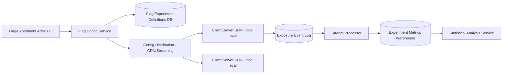
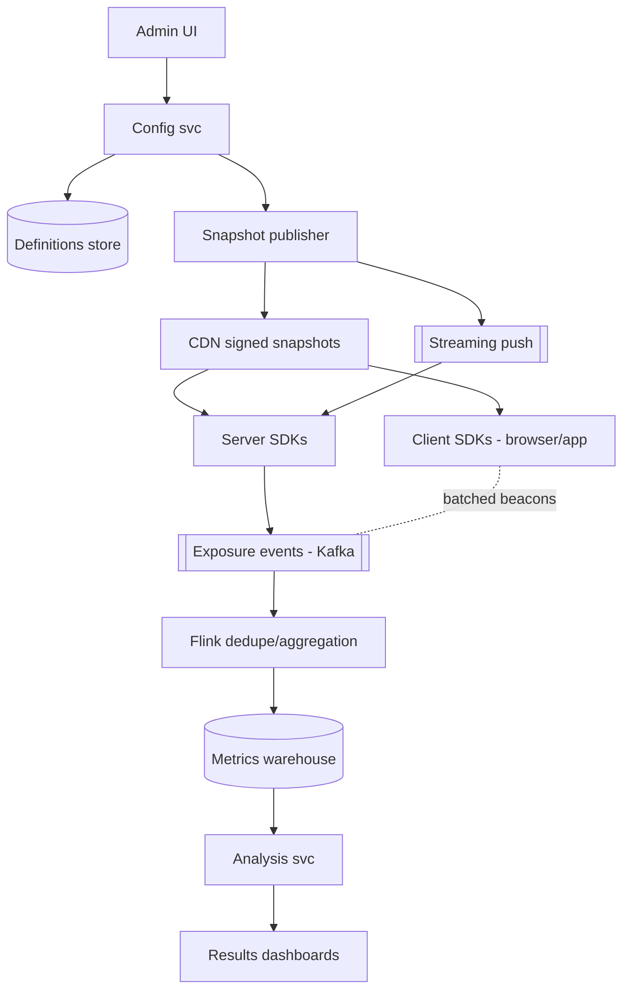
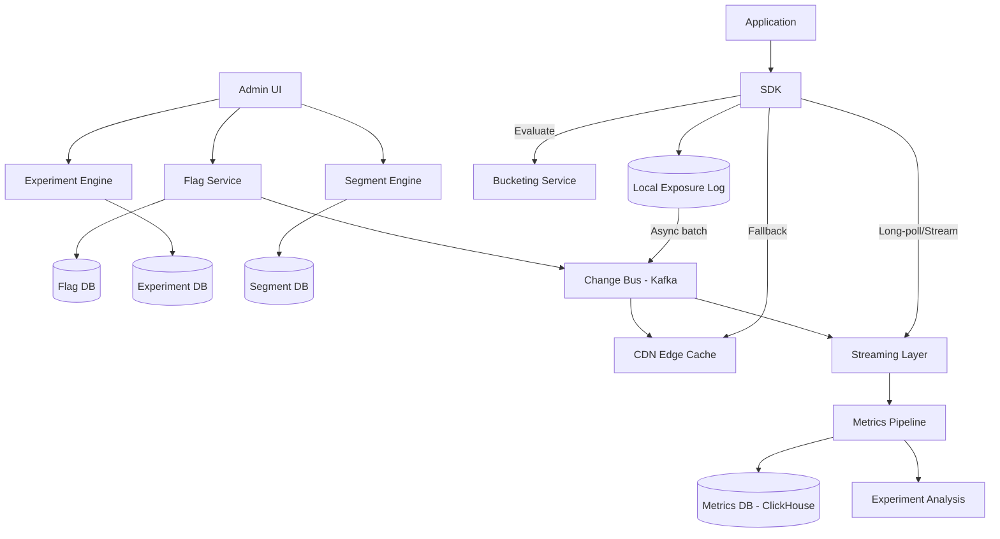
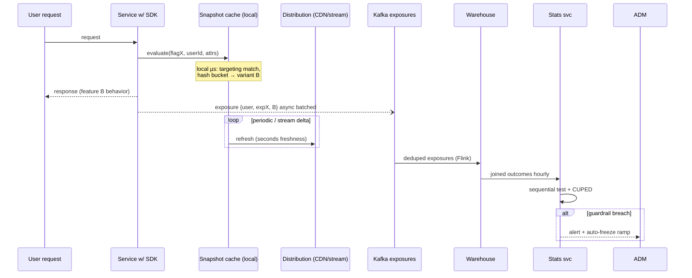
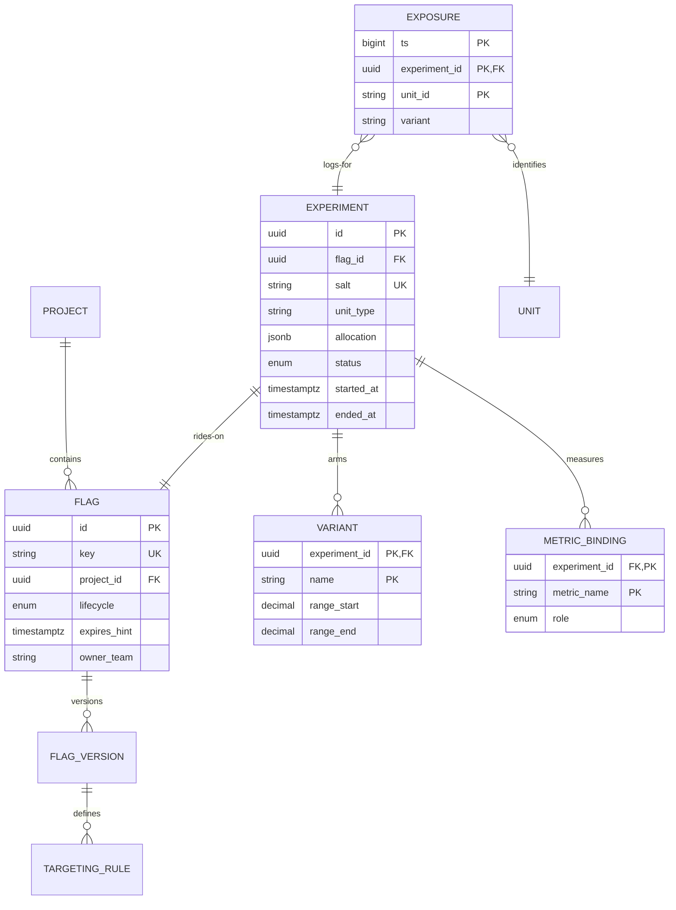

# Design a Scalable Feature Flag and Experimentation Platform

## Blogs and websites

## Medium

## Youtube

## Theory

### What Is It?

A feature flag and experimentation platform lets engineering teams decouple feature deployment from release, enabling controlled rollouts (canary, percentage-based, targeted) and A/B testing of hypotheses. Feature flags are runtime switches that turn code paths on/off per environment or user segment. Experiments run multiple variants concurrently to measure which variant performs better on a chosen metric (conversion rate, latency, retention).

### Why Does It Exist?

Deploying code to production is risky — a single bug can take down a service for all users. Feature flags allow deploying code in a dormant state (flag off) and flipping it on gradually (canary → 1% → 10% → 100%), so if something goes wrong, the flag can be instantly turned off. Experimentation platforms let teams scientifically validate product decisions — instead of guessing whether a new UI increases conversions, teams can measure it with statistical significance.

### What Problem Does It Solve?

* **Safe releases**: Gradually roll out features to a subset of users, monitor for anomalies, and roll back instantly if needed.
* **Targeted rollouts**: Enable features for specific users (internal teams, beta testers, geographic regions) without separate deployments.
* **Kill switches**: Disable buggy or dangerous features immediately without a code rollback (which may be slow or unavailable).
* **A/B testing**: Run controlled experiments comparing variants, measuring statistical significance on key metrics.
* **Configuration management**: Toggle non-feature settings (database connection strings, timeout values) without redeploying.
* **Personalization**: Serve different experiences to different user segments based on behavior, demographics, or experimental assignment.

### Important Subtopics

1. Flags vs experiments: different lifecycles, shared substrate
2. Deterministic bucketing: hashing schemes, salt discipline, stickiness guarantees
3. Targeting rule DSLs: attributes, segments, percentage rollouts
4. Config distribution: push streaming vs CDN snapshots vs polling hybrids
5. Local evaluation SDKs: architecture across languages/platforms
6. Exposure logging & the metrics join problem
7. Statistical foundations: hypothesis testing, sequential testing, guardrail metrics
8. Variance reduction: CUPED and pre-experiment data
9. Ramp automation & auto-stop on metric regression
10. Kill-switch ergonomics & incident integration
11. Flag hygiene/debt management
12. Client-side (browser/mobile) evaluation specifics

*(The existing subsections below cover problem statement, requirements, architecture, key design points, and trade-offs.)*

### Problem Statement

Design a feature flag and A/B experimentation platform that lets engineers toggle features and run experiments (assign users to variants) across a large user base, with flag evaluation happening on nearly every request, and experiment results measurable with statistical rigor.


### Functional Requirements

- Define feature flags with targeting rules (percentage rollout, user attributes, allow/deny lists)
- Define experiments with multiple variants and consistent, sticky user-to-variant assignment
- Evaluate a flag/experiment for a given user with very low latency, from client SDKs or backend services
- Log exposure events (which user saw which variant) for downstream metrics analysis
- Support instant kill-switch (turn off a flag globally) without a deploy

### Non-Functional Requirements

- **Scale**: Flag/experiment evaluation happens on nearly every request across the whole product - must be extremely low latency and high throughput
- **Consistency**: The same user must consistently get the same variant across sessions/requests for the life of an experiment (sticky bucketing)
- **Availability**: Flag evaluation must keep working even if the central flag service is unreachable (fail to a safe default)
- **Freshness**: A flag toggle/kill-switch should propagate to all evaluation points within seconds

### High-Level Architecture



### Key Design Points

- Ship flag/experiment definitions (rules, not per-user decisions) to every SDK instance, and evaluate the targeting rule locally (in-process) using a deterministic hash of `(user_id, flag_id)` to pick a variant - this makes evaluation a microseconds-fast local computation with no network call per request, and guarantees the same user always gets the same variant (sticky bucketing) without needing to store per-user assignments centrally.
- Distribute rule updates via a CDN/streaming push (not a request-time DB call) so a flag change propagates to all instances within seconds, and instances keep functioning off their last-fetched rule set if the config service is temporarily unavailable.
- Log an "exposure" event asynchronously the first time a user is evaluated against an experiment, decoupled from the request's critical path, and stream these events into a metrics warehouse joined against business metrics (conversion, revenue) for analysis.
- Support an instant kill-switch as a special always-off rule that's distributed through the same low-latency propagation path as any other flag change.

### Trade-offs

- Local, hash-based evaluation avoids a network call per flag check (critical since flags are checked extremely often) at the cost of not being able to do arbitrarily complex, stateful targeting that would require a server round-trip; most targeting needs (percentage rollout, attribute rules) fit the hash-based model well.
- Deterministic hashing for bucketing removes the need to store a per-user assignment table, but means changing the hashing scheme or flag ID will typically re-bucket users - a real constraint experimentation platforms must document and avoid doing casually mid-experiment.

### Flags vs Experiments

Same infrastructure, opposite goals:

| Aspect | Feature flag | Experiment |
|---|---|---|
| Goal | decouple deploy from release | measure causal impact |
| Lifetime | days–years (debt risk!) | fixed window (1–6 weeks typical) |
| Bucketing | stable % rollouts | immutable variant assignment |
| Metrics | health/ops only | primary + guardrails with statistics |
| End state | 100% → cleanup | declared winner → rollout |

Platforms unify them because the plumbing (distribution, bucketing, exposure logging) is identical — but governance differs: experiments get locked configs mid-flight; flags stay mutable.

### Deterministic Bucketing Mechanics

```
bucket = hash(salt + unit_id) mod 2^32
variant = lookup(bucket within [0%, p1), [p1, p2), ...)   // contiguous ranges
```

Properties that matter:

- **Salt per experiment** prevents cross-experiment correlation of assignments.
- **Unit of randomization** choice: user_id (stable), session (more power, cross-device inconsistency), or cluster (households — avoids interference).
- **Mutual exclusion via layered ranges**: multiple experiments carve disjoint sub-ranges of a global hash space so users can enter new experiments without reshuffling old ones (the "traffic allocation" problem at scale).
- **Never change salt/unit mid-experiment** — re-bucketing destroys the population's integrity; migrations require explicit re-randomization protocols.

### Statistical Foundations

- **Hypothesis testing**: H0 "no difference" vs H1; α (false-positive rate, typically 0.05), power (typically 0.8). Sample-size math upfront: `n ≈ 16·p(1−p)/δ²` per arm for proportions — knowing this explains why tiny sites can't run meaningful tests.
- **Peeking problem**: checking significance continuously inflates false positives massively; fixes: fixed-horizon analysis, group-sequential corrections, or **sequential testing** (mSPRT) designed for continuous monitoring — modern platforms default here.
- **Guardrail metrics**: latency, error rates, unsubscribes — auto-halt ramps when breached even if the primary metric looks great.
- **CUPED**: variance reduction using pre-experiment behavior as covariates, cutting required sample sizes ~30–50% — the highest-leverage statistical trick in production experimentation.

### Exposure Logging & Analysis Join

Exposure = first evaluation *that could affect the user* (not every check!). Pipeline: SDK emits async → Kafka → Flink dedupes per (user, experiment) → warehouse table joined to outcome metrics (orders, revenue, engagement) by unit+timestamp windows. Misalignment here (logging exposures for users who never saw variants, timezone skew in joins) silently corrupts results — parity discipline mirrors ML feature stores.

---

## Characteristics

- **Evaluation-on-every-request economics**: flags sit on hotter paths than caches; microsecond local evaluation isn't optimization but survival — one network call per check multiplies fleet-wide cost instantly.
- **Deterministic statelessness**: assignment derives from math, not storage — enabling unlimited horizontal scale with zero coordination, at the price of immutability constraints on salts/schemes.
- **Eventual-propagation freshness**: seconds-level config convergence accepted deliberately; kill-switch urgency handled through the same fast path rather than exotic channels.
- **Statistical-product hybrid**: half the engineering is distributed systems; the other half is making scientists trust results — logging fidelity and analysis correctness are product features.
- **Debt-generating by design**: flags accumulate; platforms succeeding operationally treat cleanup as workflow (expiry metadata, usage tracking, linting).
- **Cross-platform consistency demands**: web/iOS/Android/server must agree on bucketing byte-for-byte — specification rigor and golden test vectors are mandatory.

---

## Components

- **Admin console**
  *Purpose*: flag/experiment lifecycle UX. *Responsibilities*: CRUD with approval workflows, targeting editors, ramp controls, results dashboards, audit views. *Relationship*: sole writer to definitions store.

- **Definitions store + config service**
  *Purpose*: versioned truth. *Responsibilities*: schema validation, immutable published snapshots, revision history (rollback!), API serving snapshots to distribution tier.

- **Distribution tier**
  *Purpose*: get rules everywhere fast. *Responsibilities*: CDN-published signed snapshots (client SDKs poll cheaply) plus streaming push (server SDKs watch); both paths converge; instances cache last-known-good persistently.

- **SDK fleet** (per language/platform)
  *Purpose*: local evaluation engines. *Responsibilities*: snapshot fetch/verify, rule evaluation engine (shared semantics!), deterministic bucketing, exposure emission (batched async), metrics (staleness age, eval counts).

- **Exposure pipeline**
  *Responsibilities*: ingest, dedupe, land in warehouse; volume enormous (every eligible request) — sampled enrichment, aggressive partitioning.

- **Stats/analysis service**
  *Responsibilities*: sequential-test computation, CUPED application, guardrail monitoring, auto-stop triggers, report generation.



---

## Patterns

- **Snapshot + streaming hybrid distribution**
  *What*: full snapshots (CDN, versioned, signed) provide correctness baseline; streaming deltas provide second-level freshness. *Solves*: propagation speed without hot-path coupling. *When*: any large-scale config distribution (mirrors config-management topic patterns).

- **Layered/exclusion traffic allocation**
  *Problem*: hundreds of concurrent experiments competing for finite users. *How*: orthogonal hash layers (domain-stratified) let experiments randomize independently; explicit exclusion groups prevent conflicting features colliding. *Real-world*: Microsoft/Pinterest published architectures standardize this.

- **Sticky bucketing fallback**
  *What*: when targeting rules would evict an assigned user mid-experiment (attribute changed), a secondary hash preserves their variant tagged "stale" — analyses include them appropriately instead of silently dropping. *Why*: naive eviction biases populations toward stable-attribute users.

- **Auto-ramp with metric gates**
  *What*: rollouts proceed 1%→5%→25%→100% automatically when guardrails hold each stage's soak period; regressions freeze+alert. *Converts*: releases from hope into controlled processes.

- **Exposure-on-eligibility discipline**
  Log when evaluation *could* have affected the user experience (flag actually checked for them), not raw evaluations — otherwise denominators poison every metric downstream.

- **Anti-pattern**: server-side per-request RPC evaluation (latency + central SPOF); equally, client-side-only experiments without exposure verification (ad-blockers/beacons lost → corrupted denominators).

---

## Benefits

- **Deploy-release decoupling**: code ships dark continuously; business chooses exposure moment — trunk-based development depends entirely on this capability.
- **Instant risk mitigation**: kill-switches convert bad-rollout incidents from rollback-cycles into click-flips.
- **Causal decision culture**: A/B rigor replaces HiPPO decisions; compounding small wins fund the platform permanently.
- **Progressive delivery safety net**: automated ramps with metric gates catch regressions at 1% blast radius instead of 100%.
- **Organizational learning**: experiment archives become institutional memory ("we tried that in 2023, here's what happened").

---

## Pros

- Microsecond evaluation forever after SDK warm-up.
- Vendor-neutral open standards exist (OpenFeature) reducing lock-in.
- Statistical tooling increasingly turnkey (sequential tests, CUPED automated).

## Cons

- SDK matrix maintenance burden (every language × platform × version drift).
- Flag debt compounds silently until configs sprawl unmanageably.
- Statistical misuse remains easy (peeking, HARK-ing, underpowered tests) despite tooling.
- Exposure-pipeline scale costs real money at billions-of-checks volumes.
- Cross-platform bucketing divergence bugs are subtle and reputationally costly when discovered.

---

## Challenges

- **Technical**: hash-consistency across languages (UTF-8 normalization! integer overflow semantics); snapshot-signature rotation; mobile SDK offline-first caching; beacon loss from ad-blockers skewing client-side exposures.
- **Scalability**: exposure event floods during viral launches; warehouse join costs at petabyte event volumes; config-snapshot CDN cache invalidation precision.
- **Performance**: SDK cold-start latency (first eval before fetch completes — safe defaults mandatory); memory footprint of large rule sets on edge runtimes.
- **Reliability**: distribution-tier outage → stale-but-working (documented staleness alarms); stats-service outage pauses analysis not serving.
- **Maintainability**: flag-debt workflows (expiry enforcement, ownership metadata, automated cleanup PRs); DSL evolution backward compatibility.
- **Operational**: experiment velocity governance (collision review boards); audit trails for regulated industries (flags as change records).
- **Security**: targeting rules leaking PII into configs (attribute minimization); admin-console authz (flag changes are production changes!).

---

## Best Practices

- **Treat every flag as production config**: versioned, reviewed, audited, owned, expiring — never debug leftovers living for years.
- **Freeze experiment definitions once started**; changes force re-randomization declarations explicitly.
- **Log exposures exactly-once per (unit, experiment)** with server-side verification samples against client beacons.
- **Adopt sequential testing defaults** to enable legitimate continuous monitoring without peeking sins.
- **Instrument guardrails universally** (latency/errors/business-critical inverses) — no primary-metric-only launches.
- **Build flag-lint CI**: unused-flag detection, naming conventions, expiry-date presence, owner-team tags.
- **Golden-vector tests across all SDKs** guaranteeing identical assignments given identical inputs — run in every release pipeline.
- **Safe-default evaluation**: unknown/unfetched flags resolve to documented defaults (usually off), never exceptions.

---

## When to Use / Not Use

**Platform-scale adoption when**: frequent deploys, meaningful traffic for statistical power, multiple teams coordinating releases, experimentation culture desired.

**Lightweight alternatives when**: low traffic (tests never reach significance — just ship behind simple toggles), tiny teams (a Redis-backed flag service beats platform ceremony), single-platform products.

Managed-vs-build: LaunchDarkly/Split/Optimizely buy speed; self-hosted options (Unleash, GrowthBook, OpenFeature-aligned stacks) balance control; bespoke justified mainly at FAANG-class experiment volumes needing custom stats pipelines.

Decision inputs: release cadence, traffic scale, statistical sophistication appetite, compliance needs (audit trails), budget shape.

---

## Use Cases

- **Trunk-based continuous deployment**
  *Problem*: monorepo merging dozens of PRs daily; incomplete features block releases. *Solution*: everything merges flagged-off; release trains flip flags; incomplete work ships invisible indefinitely. *Trade-off*: flag hygiene becomes critical-path — lint/expiry automation funded accordingly.

- **Checkout-flow conversion experiment**
  *Problem*: proposed one-page checkout believed superior; risky to bet blindly. *Solution*: 50/50 experiment over 3 weeks, CUPED-adjusted conversion primary, AOV/support-tickets guardrails, sequential monitoring halting early on harm. *Trade-off*: novelty effects early in windows — maturity curves reviewed before conclusions.

- **Incident kill-switch integration**
  *Problem*: third-party recommendation service degrading post-deploy. *Solution*: pre-wired flag flips traffic to cached/fallback recommendations in seconds; postmortem references flag flip timestamp from audit trail. *Trade-off*: requires disciplined wiring of every risky dependency behind flags — architectural convention enforced via review checklists.

---

## Architecture

A feature flag platform uses a **control plane + data plane** architecture. The control plane (Flag Service, Experiment Engine, Segment Engine) manages flag definitions, targeting rules, and experiment configurations. The data plane (SDK, CDN edge cache, streaming layer) evaluates flags at request time for applications. A **bucketing service** uses deterministic hashing to consistently assign users to flag variations. A **metrics pipeline** collects exposure and outcome events for experiment analysis.



### Architecture Structure

* **Control plane**: Flag Service (CRUD flags), Experiment Engine (design A/B tests), Segment Engine (compute user segments). Stores in Postgres.
* **Distribution layer**: Change bus (Kafka) carries flag/rule updates → CDN edge cache (for offline/polling SDKs) + streaming layer (for real-time SDKs).
* **Data plane**: SDK embedded in applications; evaluates flags locally using cached config + remote calls for fresh data.
* **Bucketing**: Deterministic hashing (MurmurHash + modulo) ensures consistent user-to-variant assignment across evaluations.
* **Metrics**: SDK logs exposure events (which variant a user saw) → Kafka → ClickHouse → experiment analysis.

### Communication

* **Control → Distribution**: Kafka event stream of flag changes (new flag, updated rules, experiment started).
* **Distribution → SDK**: CDN (HTTP polling, ~60-second TTL) or streaming (WebSocket/Server-Sent Events for real-time).
* **SDK → Metrics**: Async batched HTTP to metrics pipeline.
* **Admin → Control**: REST API for flag/experiment management.

### Data Flow

1. Admin creates a flag in the UI → Flag Service → stores in Flag DB → publishes to Change Bus.
2. Change Bus → CDN edge cache updated (push) + Streaming Layer (push to connected SDKs).
3. Next time the app evaluates the flag → SDK uses cached config or fetches fresh → Bucketing Service determines variant → returns result.
4. SDK logs exposure event → Change Bus → Metrics Pipeline → ClickHouse → experiment analysis determines winner.

### Scaling Strategy

* **SDK**: Stateless — runs in the application process. Scales with application instances.
* **CDN**: Global edge cache — scales automatically.
* **Bucketing**: Stateless — can be replicated.
* **Metrics pipeline**: Kafka partitions by experiment_id; ClickHouse scales horizontally.

### Failure Handling

* **CDN stale**: If CDN is stale, SDK falls back to last-known-good config; flag changes delayed but evaluations continue.
* **Streaming failure**: SDK falls back to polling CDN; real-time push degrades to eventual consistency.
* **Bucketing unavailable**: SDK falls back to cached bucketing; users may get different variants (acceptable, logged as degraded).

## Design

### Design Considerations

* **Determinism**: The same user must get the same flag variation across all evaluations and SDK restarts. Use `hash(user_id + flag_key) % num_variants`.
* **Latency**: Flag evaluation should be < 1 ms (local cache) to avoid impacting request performance. Avoid remote calls in the critical path.
* **Resilience**: If the flag service is down, SDKs must continue evaluating using last-known-good configuration.
* **Privacy**: Don't send PII to the metrics pipeline — only send a hash of user_id, flag_key, variant, and timestamp.

### Key Decisions

| Decision | Options | Trade-off | Recommendation |
|---|---|---|---|
| Config distribution | CDN polling (60s TTL) | Simple, cached, 60s delay | Default |
| | Real-time streaming | Immediate, but stateful | High-stakes flags |
| | Hybrid | Best of both | Production |
| Bucketing hash | MurmurHash | Fast, good distribution | Standard |
| | SHA-256 | Cryptographically strong | Not needed for bucketing |
| | Random per eval | Not deterministic | Never |
| Metric aggregation | Server-side | Centralized, consistent | Standard |
| | Client-side | Simple, error-prone | Don't use |

### Scalability Considerations

* **Flag config size**: Keep flag configs small (KB not MB) for fast CDN delivery and SDK evaluation.
* **SDK connections**: Streaming connections are expensive (1 per app instance) — use connection pooling at the application level; prefer polling for lower-traffic apps.
* **Segment computation**: Pre-compute segments (not at evaluation time) — run batch jobs hourly.
* **Metrics volume**: Each exposure event is small (~100 bytes); 1M QPS = 100MB/s of metrics — batch and compress.

### Reliability Considerations

* **Config staleness**: If CDN is stale for > 2 minutes, alert (flag changes taking too long to propagate).
* **SDK offline**: Offline SDKs use last-known config; queue exposure events for later upload.
* **Bucketing consistency**: Verify that bucketing produces consistent assignments — include the bucketing algorithm version in the SDK and config.

### Performance Considerations

* **Evaluation cache**: Cache flag evaluation results (key: `user_id + flag_key + variant`) for the duration of a request to avoid recomputing.
* **Config fetch caching**: Cache flag configs with TTL; refresh asynchronously (not on every request).
* **Segment caching**: Cache precomputed segments (user sets) in Redis.

### Security Considerations

* **Config tampering**: CDN config is signed (HMAC) — SDK verifies signature before use; prevents tampering.
* **PII in metrics**: Never send raw user IDs — use hashed IDs.
- **Targeted attacks**: Malicious users might spam flag variations to skew experiment results — implement bot detection on metric events. - **Access control**: Flag management requires admin role; experiment data requires analyst role.

### Maintainability Considerations

* **SDK versioning**: Rolling updates of SDK; old versions must be supported for months. Include version in config to alert on outdated SDKs.
* **Flag lifecycle**: Archive old flags after 30 days of inactivity; prevent flag sprawl.
* **Experiment governance**: Require experiment design doc, hypothesis, sample size calculation before launch.

## High-Level Design

Evaluation + exposure flow:



Scaling: distribution tier is pure read scaling (CDN); SDK memory footprints bounded by compiled-rule pruning per service; exposure pipeline partitioned by user-hash; warehouse clustered by experiment_id.

Failure handling: distribution outage → SDKs serve persisted last-known-good with staleness-age headers/alerts; exposure-pipeline lag → analyses delayed, serving unaffected (deliberate decoupling); malformed snapshot rejected cryptographically → keep prior version.

---

## Deep Dive

- **Hash-portability spec**: define exact bytes (salt + "|" + unit_id UTF-8), algorithm (SHA-256 truncated to uint32), modulo mapping — publish reference vectors; every SDK runs conformance suites. The infamous bugs here come from language string-handling differences, not crypto.
- **Sequential testing internals (mSPRT)**: likelihood-ratio-based always-valid p-values computed incrementally; enables "check anytime" dashboards honestly; costs slight power versus fixed-horizon — trade documented per experiment class.
- **Interference problems**: network-LTE-style spillovers (social features!) violate independence assumptions; cluster randomization or switchback designs (time-based alternation) mitigate; detecting interference itself is an advanced diagnostic (variance inflation checks).
- **Exposure-dedup mechanics**: Flink keyed-state emitting first-touch only; TTL windows bound state; replay-safe via idempotent sinks — late events beyond window dropped knowingly (documented bias direction).
- **Observability**: staleness-age percentiles per SDK fleet-wide, eval-latency histograms, exposure-to-warehouse lag SLOs, experiment-health monitors (sample-ratio mismatch detection — SRM alerts catch broken instrumentation instantly), guardrail dashboards per active experiment.

---

## API Contract

The feature flag platform exposes evaluation APIs for SDKs and management APIs for administrators.

### Evaluation API (for SDKs and services)

| Method | Endpoint | Purpose |
|---|---|---|
| GET | `/api/v1/evaluate` | Evaluate all flags for a user |
| GET | `/api/v1/evaluate/{flag_key}` | Evaluate a single flag |
| POST | `/api/v1/exposure` | Log experiment exposure |

**GET /api/v1/evaluate?customer_id=cus_123&user_id=user_456 — Response**:
```json
{
  "flags": {
    "new_checkout_ui": {"enabled": true, "variant": "B"},
    "enable_beta_feature": {"enabled": false, "variant": "control"},
    "payment_provider": {"enabled": true, "variant": "stripe"}
  },
  "experiments": {
    "checkout_v2_experiment": {"variant": "checkout_v2", "bucket": 42}
  },
  "etag": "abc123",
  "cached_for": 30
}
```

### Management API

| Method | Endpoint | Purpose |
|---|---|---|
| POST | `/admin/api/v1/flags` | Create a feature flag |
| PATCH | `/admin/api/v1/flags/{key}` | Update flag config |
| POST | `/admin/api/v1/experiments` | Create experiment |
| GET | `/admin/api/v1/experiments/{id}/results` | Get experiment results |
| POST | `/admin/api/v1/audits` | Audit log of changes |

**POST /admin/api/v1/flags — Request Body**:
```json
{
  "key": "new_checkout_ui",
  "name": "New Checkout UI",
  "description": "Roll out the new checkout flow",
  "default": false,
  "targeting": {
    "rules": [
      {"if": {"user.plan": "premium"}, "then": true},
      {"if": {"percentage": 10}, "then": true}
    ]
  }
}
```

**POST /admin/api/v1/experiments — Request Body**:
```json
{
  "name": "Checkout V2 Test",
  "metric": "checkout_conversion",
  "variants": [
    {"key": "control", "weight": 5000},
    {"key": "checkout_v2", "weight": 5000}
  ],
  "status": "running"
}
```

### Status Codes

| Code | Meaning |
|---|---|
| 200 | Evaluation result |
| 201 | Resource created |
| 400 | Invalid flag/experiment definition |
| 401 | Authentication required |
| 403 | Insufficient permissions |
| 404 | Flag/experiment not found |
| 429 | Rate limited |

### Caching & Versioning

* Evaluation responses include `etag` and `cached_for` (seconds). SDKs cache locally and only re-fetch when expired.
* Flag updates trigger real-time push via streaming SDK (Server-Sent Events) or periodic polling fallback.

### Idempotency

* Flag creation is idempotent — re-submitting with the same `key` updates the flag (PATCH semantics via PUT).

## Data Modeling



Choices: immutable experiment rows with salt/allocation frozen at start (enforced by service logic + reviews); exposure table partitioned daily, clustered by experiment (analysis scans); range-based allocation columns make mutual-exclusion verifiable mechanically; flag lifecycle states (`INACTIVE/ACTIVE/COMPLETED/CLEANUP_CANDIDATE`) drive hygiene automation.

---

## Java and Spring Boot Implementation

Local evaluation engine (SDK core):

```java
public final class FlagEvaluator {

    private volatile Snapshot snapshot = Snapshot.empty();

    /** Called by distribution watcher; atomic swap keeps evaluators consistent. */
    public void update(Snapshot next) { this.snapshot = next; }

    public EvaluationResult evaluate(String flagKey, EvaluationContext ctx) {
        FlagDef def = snapshot.get(flagKey);
        if (def == null || def.off()) {
            return EvaluationResult.of(def == null ? DEFAULT_OFF : def.offVariant());
        }
        for (TargetingRule rule : def.rules()) {
            if (rule.matches(ctx.attributes())) {
                String variant = bucket(def.salt(), ctx.unitId(), rule.allocations());
                if (def.isExperiment()) {
                    exposureSink.logIfEligible(ctx.unitId(), def.experimentId(), variant);
                }
                return EvaluationResult.of(variant);
            }
        }
        return EvaluationResult.of(def.fallback());
    }

    private static String bucket(String salt, String unitId,
                                 List<Allocation> allocations) {
        long h = sha256Prefix(salt + "|" + unitId) % 1_000_000;
        long cumulative = 0;
        for (Allocation a : allocations) {
            cumulative += a.rangeEndPermille();
            if (h < cumulative) return a.variant();
        }
        return allocations.get(allocations.size() - 1).variant(); // remainder bucket
    }
}
```

Spring service wiring + controller:

```java
@Service
public class FeatureService {

    private final FlagEvaluator evaluator;

    public boolean isEnabled(String flag, Authentication who, HttpServletRequest req) {
        return evaluator.evaluate(flag, contextOf(who, req)).variantOn();
    }
}

@RestController
class DemoController {

    private final FeatureService features;

    @GetMapping("/checkout")
    ResponseEntity<?> checkout(Authentication who, HttpServletRequest req) {
        var result = features.evaluate("checkout-onepage", who, req);
        return render(result.variant(), result.exposureLogged());
    }
}
```

Notes: evaluator holds zero locks on the read path (volatile snapshot swap); exposure sink batches asynchronously off-thread; `contextOf` extracts stable unit IDs (never PII into logs). Testing centers on golden vectors: fixture JSONs asserting identical outputs across JVM/JS/Kotlin implementations — plus chaos tests pausing distribution while asserting stale-but-functional behavior.

---

## Real-World Examples

- **Microsoft's Experimentation Platform** — foundational papers (Kohavi et al.) defining guardrails, SRM detection, and the trust-metrics vocabulary this entire field uses.
- **LinkedIn XLNT / Netflix A/B junction** — large-scale layered-allocation architectures documented publicly; their overlap-management solutions inform the layered-range design above.
- **LaunchDarkly** — commercial archetype whose architecture talks (edge-sdk streaming model) map directly onto this doc's distribution tier.
- **Booking.com** — publishes the industry's most honest experimentation culture writing (thousands of concurrent experiments, success-rate realities) — essential reading for expectations calibration.

---

## Interview Preparation

### Interview Questions

**Beginner**

1. **Why evaluate flags locally instead of calling a service?**
   Checks happen near-every-request; even 2 ms RPC adds fleet-wide cost and a critical dependency. Hash-based local evaluation gives microseconds and survives control-plane outages — availability characteristics dominate the design.
2. **What makes user assignments sticky without storing them?**
   Deterministic hashing: same `(salt, user)` always maps to the same point in variant ranges. Stickiness emerges from math; storage would add coordination for nothing.

**Intermediate**

3. **Why does changing an experiment's salt mid-run invalidate it?**
   New salt re-buckets everyone randomly — treated population becomes a mixture of old/new assignments destroying comparability. Rule: salts immutable per experiment; changes mean new experiment IDs.
4. **Design mutual exclusion between two experiments wanting the same users.**
   Options: disjoint hash ranges within one layer (simple, wastes traffic when either ends), orthogonal layers letting both randomize independently (standard), or explicit exclusion-group membership checks at evaluation. Discuss traffic-efficiency vs collision-risk trade-offs and where each fits.
5. **Walk through what sample-ratio mismatch detection catches.**
   Expected 50/50 observed 55/45 → something broke: instrumentation gaps (beacon blockers), targeting bugs, bot asymmetry. SRM alerts fire before anyone trusts polluted results — the cheapest integrity win in experimentation.

**Advanced**

6. **Design auto-stop on harm for a ramp.**
   Guardrail set defined pre-launch (error rates, latency p99, refund rate), monitored per-cohort with sequential bounds; breach triggers automatic ramp-freeze + optional revert-to-control for affected cohort + paging. Discuss false-positive budgets (guardrails tuned conservative) and human-override audit trails.
7. **Your exposure pipeline drops 8% of events during spikes. Why does this break experiments specifically?**
   Losses correlate with load/bursty cohorts — non-random missingness biases treatment-arm denominators differently, distorting every ratio metric (SRM symptoms follow). Fixes: durable client-side queues, ingestion autoscaling headroom, backpressure-aware sampling preserving unbiasedness (documented schemes like systematic sampling).

**Senior / system design**

8. **Architect experimentation for a two-sided marketplace with network effects.**
   Interference dominates: buyer-side treatments affect sellers and vice versa. Designs: cluster randomization (geo/market-level), switchback time-slices, two-sided experiments measuring equilibrium effects; standard i.i.d. A/B assumptions abandoned consciously. Discuss power implications and why many marketplaces accept biased-but-directional readings pragmatically.
9. **Propose a flag-debt remediation program for a codebase with 4000 live flags, 60% stale.**
   Inventory with ownership metadata, automated usage tracing (eval telemetry per flag), lint gates blocking new debt (expiry dates mandatory), bulk-removal campaigns verified by canary deploys, cultural rituals (quarterly cleanup weeks). Emphasize measurement-first: usage data converts politics into arithmetic.

### Common Mistakes

- Logging every evaluation as exposure — denominator corruption ruins all metrics.
- Peeking at fixed-horizon tests then shipping winners prematurely.
- Different SDKs bucketing differently (string-normalization divergence) discovered months later.
- No safe defaults: control-plane hiccup turns into app-wide exceptions.
- Guardrail-free launches celebrating CTR wins hiding latency disasters.

### Expected discussion points
Deterministic-bucketing rigor, statistical-honesty mechanisms (SRM, sequential tests, CUPED), distribution-freshness vs availability balance, flag-debt operational reality, and interference awareness beyond toy A/B assumptions.
