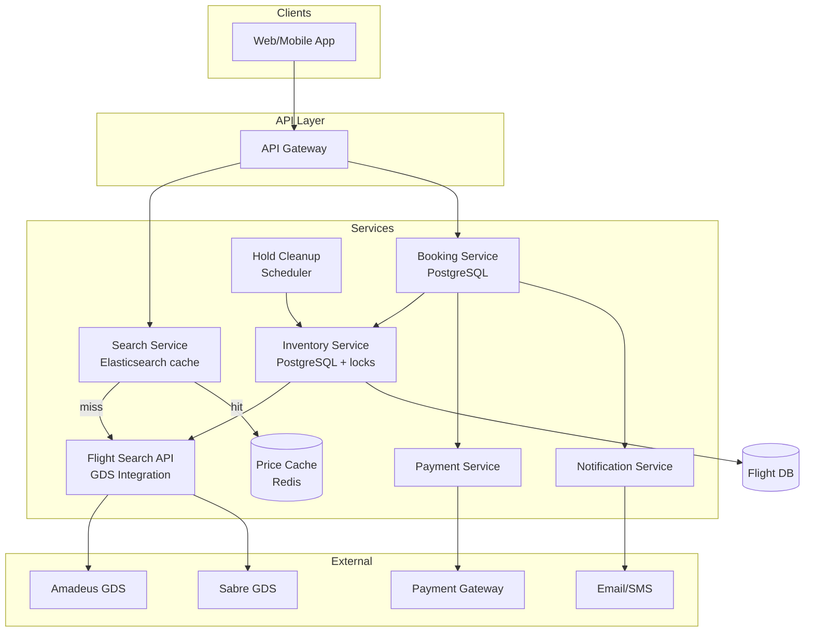
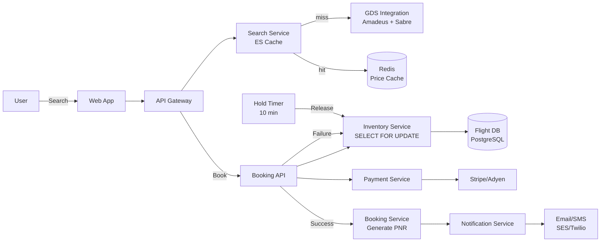

# Design Flight Booking System

## Blogs and websites

## Medium

## Youtube

## Theory

### What Is It?

A flight booking system lets users search, compare, and book flights across airlines. It manages seat inventory, dynamic pricing, payment processing, and booking confirmations (PNRs). Must prevent double-booking through strong inventory consistency.

### Why Does It Exist?

Before centralized booking systems, travelers called each airline individually. A flight booking system consolidates global airline inventory into one search → booking → payment flow, improving convenience and conversion.

### What Problem Does It Solve?

* **Inventory aggregation**: Pull real-time availability from 1000+ airlines + GDS (Global Distribution Systems).
* **Seat contention**: Concurrent users trying to book the last seat → pessimistic locking to prevent overselling.
* **Dynamic pricing**: Prices change with demand, time-to-departure, remaining seats.
* **Multi-leg journeys**: Connect flights (NYC→DXB→BOM) with layover validation.
* **Payment orchestration**: Coordinate with multiple payment providers; rollback on failure (saga pattern).
* **Race conditions**: Two users searching the same flight → both see 1 seat → one must fail.

### Important Subtopics

1. Flight search (Elasticsearch for route queries)
2. Seat inventory management (pessimistic locking, reservation holds)
3. Dynamic pricing algorithms
4. Booking lifecycle (reserve → pay → confirm → cancel/modify)
5. PNR generation and management
6. Payment orchestration (saga pattern)
7. GDS integration (Amadeus, Sabre)
8. Cache strategies (popular routes cached)

### Problem Statement
Design a flight booking system like Booking.com or Google Flights that supports flight search, seat selection, booking, and payment processing with inventory management to prevent overbooking.

### Functional Requirements
- Search flights by origin, destination, dates, passengers, class
- View available flights with prices
- Select seats
- Book flights (reserve → pay → confirm)
- Manage bookings (view, cancel, modify)
- Price alerts and fare tracking
- Multi-leg/round-trip bookings

### Non-Functional Requirements
- **Scale**: 100M+ searches/day, 1M+ bookings/day
- **Latency**: Search < 2s, booking < 5s
- **Consistency**: No double-booking of same seat (strong consistency for inventory)
- **Availability**: 99.99% for search, 99.999% for bookings
- **Data**: Millions of flight routes, dynamic pricing

### High-Level Architecture

```
┌──────────┐     ┌──────────┐     ┌─────────────────────────────┐
│  Client  │────▶│  API GW  │────▶│       Service Layer          │
└──────────┘     └──────────┘     │                              │
                                  │  ┌────────────────────────┐  │
                                  │  │ Search Service          │  │
                                  │  │ Booking Service         │  │
                                  │  │ Payment Service         │  │
                                  │  │ Inventory Service       │  │
                                  │  │ Notification Service    │  │
                                  │  │ Pricing Service         │  │
                                  │  └───────────┬────────────┘  │
                                  └──────────────┼───────────────┘
                                                 │
                              ┌──────────────────┼──────────────────┐
                              ▼                  ▼                  ▼
                       ┌────────────┐     ┌────────────┐    ┌────────────┐
                       │ Flight DB  │     │ Booking DB │    │ Search     │
                       │ (inventory)│     │            │    │ Index (ES) │
                       └────────────┘     └────────────┘    └────────────┘
```

### Search Flow

```
User searches: NYC → LON, Dec 15, 2 passengers

Search Service:
  1. Query Elasticsearch for matching flights
     → Filter by route, date, available seats ≥ 2
  2. Fetch prices from Pricing Service
     → Dynamic pricing based on demand, time to departure, competition
  3. Rank results (price, duration, stops, airline rating)
  4. Return paginated results

Optimization:
  - Pre-compute popular routes (cache)
  - Search index updated every few minutes (not real-time)
  - Availability check at booking time (not search time)
```

### Booking Flow (Critical Path)

```
Step 1: Reserve (temporary hold)
  → Inventory Service: SELECT FOR UPDATE seats WHERE flight_id = X
  → Mark seats as "held" with expiry (10 min)
  → Return reservation_id + payment deadline

Step 2: Payment
  → Payment Service: charge customer
  → If payment fails → release reservation
  → If payment succeeds → proceed to confirm

Step 3: Confirm
  → Booking Service: change status "held" → "confirmed"
  → Inventory Service: permanently allocate seats
  → Notification Service: send confirmation email + e-ticket
  → Generate PNR (Passenger Name Record)

Timeout:
  → If payment not received in 10 min → auto-release seats
  → Scheduled job checks expired reservations
```

### Preventing Double-Booking

```
Approach: Pessimistic locking on inventory

BEGIN TRANSACTION;
  SELECT * FROM seats 
    WHERE flight_id = 123 AND seat_number = '12A' AND status = 'available'
    FOR UPDATE;  -- Row-level lock
  
  UPDATE seats SET status = 'held', reservation_id = 'R456', 
    hold_expires_at = NOW() + INTERVAL '10 minutes'
    WHERE flight_id = 123 AND seat_number = '12A';
COMMIT;

If two users try same seat simultaneously:
  → First gets the lock, second waits
  → Second sees status = 'held' → returns "seat unavailable"
```

### Dynamic Pricing

```
price = base_fare × demand_multiplier × time_multiplier × competition_factor

Inputs:
  - Seats remaining (fewer seats → higher price)
  - Days until departure (last minute = expensive)
  - Historical demand for this route/date
  - Competitor prices (scraped or API)
  - Booking class (economy, business, first)
  
Updated: Every few minutes per flight
Stored: Pricing cache (Redis) for fast lookup
```

### Key Design Decisions

| Decision | Choice | Reason |
|----------|--------|--------|
| Inventory consistency | Pessimistic locking (SELECT FOR UPDATE) | Prevent double-booking |
| Search | Elasticsearch | Fast full-text + filter queries |
| Reservation | Temporary hold with TTL | Prevent inventory hoarding |
| Pricing | Dynamic, cached in Redis | Real-time pricing at scale |
| Payment | Two-phase (reserve → pay → confirm) | Saga pattern for distributed tx |

### Scaling Considerations
- **Search**: Horizontally scale ES, cache popular routes
- **Inventory**: Shard by flight_id, each flight on one partition
- **Booking**: Idempotency keys to prevent duplicate charges
- **Global**: Multi-region with inventory staying in origin region

---

## Characteristics

| Characteristic | What it means | Why it matters | How it works |
|---|---|---|---|
| **Inventory consistency** | Seat inventory must be strongly consistent | Prevent double-booking | SELECT FOR UPDATE / Redis atomic ops |
| **Dynamic pricing** | Prices change in real-time | Maximize revenue per seat | Demand × time-to-departure × competition |
| **Multi-leg journeys** | Book connecting flights (NYC→DXB→BOM) | Complex routing | Graph search over flight network |
| **PNR generation** | Booking reference code (6-char) | User identification + retrieval | Hash + collision check |
| **GDS integration** | Connect to airline distribution systems | Real inventory access | Amadeus/Sabre API |
| **Payment orchestration** | Coordinate booking + payment as a unit | No payment without confirmed seat | Saga pattern (reserve → pay → confirm) |

## Components

| Component | Purpose | Responsibilities | Relationship | Real-world Example |
|---|---|---|---|---|
| **Search Service** | Flight search | Query by route/date/passengers; rank results | Elasticsearch | Google Flights search |
| **Inventory Service** | Seat availability | Track seat inventory, hold reservations | Flight DB (Postgres) | Sabre inventory |
| **Booking Service** | Manage bookings | Create/modify/cancel bookings, PNR | Booking DB | Amadeus booking |
| **Pricing Service** | Dynamic pricing | Compute prices based on demand + rules | Pricing cache (Redis) | Fare rules engine |
| **Payment Service** | Process payments | Charge customer, handle refunds | Payment gateway (Stripe) | Stripe integration |
| **Flight Data Store** | Flight inventory | Flights, seats, schedules | PostgreSQL | Airline PNR system |
| **GDS Connector** | Connect to airlines | Fetch real-time availability + prices | GDS API (Amadeus) | Amadeus API |
| **Notification Service** | Send confirmations | Email + SMS booking confirmations | Twilio, SES | Post-booking notification |

## Patterns

### Reservation Hold with TTL

* **What**: When a user starts booking, temporarily hold the seat (mark as "held") with an expiration (e.g., 10 minutes). If payment doesn't complete in time, the seat auto-releases.
* **Problem solved**: Without a hold, seats appear available during payment → overselling; with permanent allocation, seats hoarded by abandoned checkouts.
* **How it works**: Reserve → Inventory Service: `UPDATE seats SET status='held'... WHERE seat_id=X AND status='available'`. Payment attempt. If success → Booking Service: change to 'confirmed'. If timeout → scheduler: `UPDATE seats SET status='available' WHERE hold_expires_at < NOW()`.
* **When to use**: Inventory reservation systems (flights, hotels, event tickets).
* **When not to use**: When payment is instant and synchronous (no timeout needed).
* **Advantages**: Prevents overselling; auto-cleanup of abandoned holds.
* **Disadvantages**: Seats held during payment → inventory temporarily unavailable; needs cleanup job.

### Pessimistic Locking for Seat Allocation

* **What**: Lock the seat row during booking to ensure no two transactions can modify it concurrently.
* **Problem solved**: Two users see "1 seat available" → both try to book → one succeeds, one fails.
* **How it works**: `BEGIN; SELECT * FROM seats WHERE ... FOR UPDATE; UPDATE seats SET status='held'...; COMMIT;`
* **When to use**: Critical inventory where overselling is unacceptable.
* **When not to use**: Read-heavy systems where locking causes contention.
* **Advantages**: No overselling; simple to reason about.
* **Disadvantages**: Lock contention under high load; deadlocks possible.

## Benefits

* **Revenue protection**: Strong inventory consistency prevents overselling.
* **Customer trust**: Accurate seat counts → no false availability.
* **Operational efficiency**: Automated reservation holds + cleanup.

## Pros

* **Global reach**: Connect to 1000+ airlines via GDS.
* **Price comparison**: Show best fares across airlines instantly.
* **Real-time inventory**: Accurate seat availability.
* **Dynamic pricing**: Revenue optimization per flight.
* **Multi-currency**: Price in local currencies.

## Cons

* **GDS fees**: $0.10–$1.00 per query × 100M/day = $10M+/year.
* **Race conditions**: Need pessimistic locking → contention at peak.
* **Payment complexity**: Multi-provider, multi-currency, refunds.
* **Inventory lag**: Some airlines update GDS every few minutes.

## Challenges

### Technical Challenges

* **Seat contention**: Peak booking windows → 100K+ concurrent booking attempts → lock contention.
* **GDS rate limits**: 1000+ airlines, different APIs → adapter layer + circuit breakers.
* **Multi-leg search**: Connecting flights across 4+ airlines → combinatorial explosion.
* **Dynamic pricing**: Recompute prices every few minutes → cache invalidation.

### Scalability Challenges

* **Search QPS**: 100M searches/day = 1200 QPS; cache popular routes.
* **Booking QPS**: 1M bookings/day = 12 QPS (bursts of 1000/sec during sales).
* **Inventory sync**: 10K+ flights updating → streaming pipeline → cache.

### Performance Challenges

* **Search latency**: < 2s — pre-compute popular route results.
* **Booking latency**: < 5s — reservation hold + payment + confirmation must be fast.
* **Price freshness**: Prices stale by > 10min → cache TTL = 300s.

### Reliability Challenges

* **Payment failure**: Payment succeeds but confirmation fails → reconciliation job.
* **GDS downtime**: Cache last-known inventory + allow booking with warning.
* **Overbooking**: Some airlines overbook → re-accommodation logic needed.

### Maintainability Challenges

* **Airline API changes**: Each airline has different APIs → adapter pattern.
* **Fare rules**: 10K+ fare rules → rules engine.
* **Cancellation policies**: Per-airline; auto-refund after 24h.

### Operational Challenges

* **Seat hold cleanup**: Scheduled job every 5min checks for expired holds.
* **PNR collision**: 6-char PNR — collision probability → add timestamp/hash.
* **Refund processing**: Refunds take 7–14 days → reconciliation.

### Security Concerns

* **PCI-DSS**: Store/handle credit card data → tokenization.
* **Travel data**: GDPR for EU users; data minimization.
* **Fare fraud**: Fake passengers → validation + fraud detection.

## Best Practices

* **Reservation holds**: 10-minute TTL for payment; auto-release via cron.
* **Pessimistic locking**: `SELECT FOR UPDATE` on seat rows.
* **Cache popular routes**: Redis cache flight search results.
* **Two-phase booking (saga)**: Reserve → pay → confirm; on failure → auto-cancel.
* **Idempotency keys**: Safe retry after network error.
* **Separate read/write**: Search from Elasticsearch; booking writes to PostgreSQL.
* **Circuit breaker**: If airline API degrades → serve stale cache + warning.
* **Distributed tracing**: Trace booking from search → reservation → payment → confirmation.

## When to Use

### Appropriate

* Travel agencies / OTAs building a booking engine.
* Airlines building direct-booking channel.
* Corporate travel platforms.
* Travel aggregators extending to booking.

### Not Appropriate

* Simple travel blog with static content.
* Internal corporate travel with 10 employees.
* When no GDS access (can't see real inventory).

### Alternatives

* **GDS API**: Direct Amadeus/Sabre integration.
* **Travel aggregator APIs**: Skyscanner API, Kiwi API — search only.
* **Simple inventory**: Own inventory → no GDS needed.

### Decision Factors

* **Inventory source**: GDS-dependent → need integration; own inventory → simpler.
* **Booking volume**: 100/day → simple DB; 1M/day → distributed.
* **Regional scope**: Domestic → one GDS; global → multi-GDS.

## Use Cases

### OTA Booking Engine (Kayak + Booking.com Style)

* **Problem**: Users search 1000+ airlines across 5 GDS systems; compare prices; book; pay; get e-ticket.
* **Solution**: Search Service (Elasticsearch cache) → Inventory Service (GDS real-time check) → Booking Service (saga) → Payment → e-ticket.
* **Why suitable**: GDS integration + cache for fast search + saga for reliability.
* **How it works**: (1) User searches NYC→LON → Redis cache check. Cache miss → GDS query (parallel Amadeus + Sabre) → merge + rank → cache (5min TTL). (2) User books → SELECT FOR UPDATE seat → hold 10min. (3) Payment → confirm → PNR. (4) E-ticket sent.
* **Trade-offs**: GDS fees ($0.20–$1.00/query); cache staleness; payment failure reconciliation.

## Architecture



### Architecture Structure

* **API layer**: REST endpoints for search, booking, status.
* **Service layer**: Search (cache + GDS), Pricing (dynamic), Inventory (locks), Booking (saga), Payment (gateway), Notification.
* **Data layer**: Flight DB (PostgreSQL, sharded by route), Booking DB (PostgreSQL + Redis for holds), Search Index (Elasticsearch).

### Communication

* **Client → API**: HTTPS/REST; JWT auth.
* **Search → GDS**: gRPC/HTTPS with adapter pattern.
* **Booking → Payment**: Synchronous charge → async confirmation.
* **Service → Service**: gRPC; async events via Kafka.

### Data Flow

1. **Search**: Client → API → Search Service → Redis cache → if miss → GDS (parallel) → merge → cache → return.
2. **Booking**: Client → API → Booking Service → Inventory Service (SELECT FOR UPDATE) → hold (10min) → Payment → if success → confirm → PNR → notify.
3. **Hold cleanup**: Scheduler every 5min → release expired holds.

### Scaling Strategy

* **Search**: Elasticsearch (20 shards); Redis cache for popular routes; GDS results cached (5min TTL).
* **Inventory**: PostgreSQL sharded by flight_id; row-level locks.
* **Booking**: Idempotent operations; rate limit per user.
* **Multi-region**: Read replicas; booking writes to origin region.

### Failure Handling

* **Payment failure**: Cancel reservation → release seat.
* **GDS outage**: Cache last-known inventory → allow booking with warning.
* **Seat taken (race)**: Lock fails → suggest alternatives.

## High-Level Design



## Deep Dive

### Booking Flow (Saga Pattern)

```java
@Service
@Transactional
public class BookingService {
    public Pnr createBooking(BookingRequest request) {
        // Step 1: Reserve seat (pessimistic lock + 10-min hold)
        Reservation hold = inventoryService.reserveSeat(
            request.getFlightId(), request.getSeatNumber(), request.getUserId());

        try {
            // Step 2: Charge payment
            PaymentResult payment = paymentService.charge(request.getPayment());
            if (payment.isSuccessful()) {
                // Step 3: Confirm — atomically update seat + create booking
                Pnr pnr = confirmBooking(hold, payment.getTransactionId());
                notificationService.sendETicket(pnr, request.getContact());
                return pnr;
            } else {
                inventoryService.releaseHold(hold.getId());
                throw new PaymentFailedException(payment.getError());
            }
        } catch (Exception e) {
            inventoryService.releaseHold(hold.getId());
            throw new BookingFailedException(e);
        }
    }
}
```

### Double-Booking Prevention

```java
@Repository
public class SeatRepository {
    @Lock(LockModeType.PESSIMISTIC_WRITE)
    @Query("SELECT s FROM Seat s WHERE s.flightId = :fid AND s.seat = :seat AND s.status = 'AVAILABLE'")
    Optional<Seat> lockAvailableSeat(@Param("fid") String flightId, 
                                       @Param("seat") String seat);
}
```

## API Contract

* **API purpose**: Search flights, manage bookings, process payments, retrieve booking status.

| Method | Endpoint | Description |
|---|---|---|
| GET | `/api/v1/flights/search` | Search available flights |
| GET | `/api/v1/flights/{id}` | Get flight details + seat map |
| POST | `/api/v1/bookings/reserve` | Reserve seat (10-min hold) |
| POST | `/api/v1/bookings/confirm` | Confirm booking after payment |
| POST | `/api/v1/payments` | Process payment |
| GET | `/api/v1/bookings/{pnr}` | Get booking details |
| POST | `/api/v1/bookings/cancel` | Cancel booking (refund) |

**Response (search)**:
```json
{
  "results": [{
    "flight_id": "BA123",
    "airline": "British Airways",
    "departure": {"airport": "JFK", "time": "2025-06-15T18:30:00Z"},
    "price": {"amount": 850, "currency": "USD"},
    "available_seats": 12,
    "refundable": true
  }]
}
```

**Response (PNR)**:
```json
{"pnr": "ABC123", "status": "confirmed", "total_price": {"amount": 850, "currency": "USD"}}
```

**Error responses**:
```json
{"error": "seat_unavailable", "message": "Seat no longer available", "code": 409}
{"error": "hold_expired", "message": "Reservation expired during payment", "code": 410}
```

## Data Modeling

```mermaid
erDiagram
  FLIGHT ||--o{ SEAT : "has"
  BOOKING ||--o{ BOOKING_PASSENGER : "contains"
  BOOKING }|--|| FLIGHT : "books"
  PAYMENT ||--|| BOOKING : "pays for"
  USER ||--o{ BOOKING : "makes"

  FLIGHT {
    string flight_id PK
    string flight_number
    string origin
    string destination
    datetime departure
    datetime arrival
    int total_seats
  }
  SEAT {
    string seat_id PK
    string flight_id FK
    string seat_number
    enum status available_held_confirmed
    string reservation_id
    datetime hold_expires_at
  }
  BOOKING {
    string booking_id PK
    string pnr_code
    string user_id FK
    string flight_id FK
    enum status reserved_confirmed_cancelled
  }
  PAYMENT {
    string payment_id PK
    string booking_id FK
    enum status pending_succeeded_failed
    float amount
  }
```

**Partitioning**: Flights sharded by route; seats co-located with flight; bookings by PNR hash.

## Java and Spring Boot Implementation

```java
@RestController
@RequestMapping("/api/v1/bookings")
@RequiredArgsConstructor
public class BookingController {
    private final BookingService bookingService;

    @PostMapping("/reserve")
    public ResponseEntity<ReservationResponse> reserve(
            @AuthenticationPrincipal UserDetails user,
            @RequestBody ReservationRequest request) {
        Reservation res = bookingService.reserveSeat(user.getId(), request);
        return ResponseEntity.ok(new ReservationResponse(res.getId(), res.getHoldExpiresAt()));
    }
}

@Service
public class BookingService {
    private final SeatRepository seatRepository;
    private final BookingRepository bookingRepository;
    private final PaymentClient paymentClient;

    @Transactional
    public Reservation reserveSeat(String userId, ReservationRequest request) {
        Seat seat = seatRepository.lockAndCheckAvailable(
            request.getFlightId(), request.getSeatNumber());
        if (seat == null) throw new SeatUnavailableException();

        seat.setStatus(SeatStatus.HELD);
        seat.setReservationId(UUID.randomUUID().toString());
        seat.setHoldExpiresAt(Instant.now().plus(Duration.ofMinutes(10)));
        seatRepository.save(seat);
        return new Reservation(seat.getReservationId(), seat.getHoldExpiresAt());
    }
}
```

## Real-World Examples

* **Expedia**: Connects to 100+ GDS systems (Amadeus, Sabre, Travelport); Elasticsearch for flight search; PostgreSQL for bookings; Redis for seat availability; Kafka for booking events.
* **Kayak**: Meta-search — queries 1000+ airline APIs + GDS; caches popular routes in Elasticsearch (5-min TTL). No booking → redirects to OTA.
* **Google Flights**: QPX (ITA Software acquisition) → complex pricing engine (fare rules, currency); Skyscanner integration for some routes.
* **Booking.com**: Expanded flights via Amadeus integration; custom inventory sync (5-min updates); Redis caching for hot routes.

## Interview Preparation

### Beginner Questions

**Q: What is a PNR?**
A: A 6-character alphanumeric booking reference (e.g., ABC123) uniquely identifying a booking in airline/GDS systems. Contains: passenger names, flight details, seat assignments, fare rules.

**Q: How do you prevent double-booking?**
A: Pessimistic locking: `SELECT ... FOR UPDATE` locks the seat row; concurrent transactions block. After lock, check availability → hold. Redis atomic `SETNX` for distributed locking.

**Q: What is a GDS?**
A: Global Distribution System — computerized reservation system connecting travel agents to 1000+ airlines/hotels/cars. Major GDSs: Amadeus, Sabre, Travelport.

### Intermediate Questions

**Q: How does flight search work at scale?**
A: (1) Elasticsearch index of flight data (origin, destination, date → flight IDs), updated every few minutes. (2) Cache popular route results in Redis (5-min TTL). (3) Cache miss → fan-out to 3 GDS in parallel (CompletableFuture) → merge + rank. (4) Search index sharded by route hash (100 shards).

**Q: How do you handle payment failures in booking?**
A: Reservation hold (10-min TTL) → attempt payment → if fail → release hold → seat available. Background job releases expired holds every 5 minutes. Saga pattern (reserve → pay → confirm).

**Q: What is dynamic pricing?**
A: Revenue management adjusts prices based on: remaining seats, days until departure, historical demand, booking pace, competitor prices. Pricing service queries GDS revenue mgmt APIs + airline rules every few minutes → cache in Redis.

### Advanced Questions

**Q: How would you design a flight search system for 100M searches/day with < 2s latency?**

A: (1) Elasticsearch index of flight inventory — pre-computed nightly from GDS data; supports filtering by origin/destination/date/class. (2) Redis cache (5-min TTL) for top 1000 routes → 80% hit rate → 20ms. (3) Cache miss → parallel GDS queries (Amadeus + Sabre + Travelport) using async CompletableFuture → merge + rank. (4) Multi-leg: pre-compute common connection pairs → cache. (5) 50 search instances + 20 ES nodes + 100 GDS connections. (6) Monitoring: cache hit rate, P99 latency, GDS timeout rate.

**Q: How do you handle seat contention during flash sales?**

A: (1) Redis Lua script for atomic check-and-reserve — bypass DB for 90% of operations. (2) Overbook 2-5% (legal) → re-accommodate bumped passengers. (3) Waitlist: users join Redis sorted set → notified on seat release. (4) Rate limit per user (10 attempts/min) → prevent bots. (5) 10K concurrent users on 100 seats → expect 99% failures → graceful "try similar flights" fallback.

### Senior-Level Questions

**Q: How would you design a booking system handling 100K concurrent bookings with strong consistency?**

A: (1) **Inventory**: Redis Lua script for atomic seat check-and-hold (bypasses DB lock contention) → PostgreSQL for durable booking record. (2) **PostgreSQL**: Sharded by flight_id (1000 shards); seat-level locking (SELECT FOR UPDATE SKIP LOCKED). (3) **Booking service**: 100 instances with idempotency; saga orchestrator (reserve → pay → confirm). (4) **Payment**: Idempotent charge → 3 retries with exponential backoff. (5) **Hold expiry**: Redis keyspace notification (keyspace expired event) → release seat without polling. (6) **Race resolution**: 10K concurrent → 100 hold → 9900 fail; overbook 3.5% (airline-legal) → re-accommodate. (7) **Monitoring**: Hold success rate > 50%, double-booking attempts = 0, booking success > 95%, payment failure < 3%.

**Q: How do you build a reliable GDS integration across 1000+ airlines with rate limits?**

A: (1) **Adapter pattern**: AmadeusAdapter, SabreAdapter, TravelportAdapter — abstract airline-specific APIs. (2) **Connection pooling**: 200 persistent HTTP/2 connections per GDS. (3) **Token bucket**: 500 QPS (Amadeus), 300 QPS (Sabre) → queue exceeds → "try later". (4) **Circuit breaker**: If error rate > 5% or latency > 5s → open circuit 60s → serve stale cache + warning. (5) **Multi-GDS parallel**: Query 3 GDS in parallel → take fastest + merge. (6) **Cache**: Redis (5-min TTL) → 70% GDS call reduction. (7) **Retries**: 3 retries with exponential backoff (100ms→1.6s). (8) **Monitoring**: GDS latency, error rate, circuit open count, cache hit rate.

### Common Mistakes

- Not using `SELECT FOR UPDATE` → double-booking possible.
- No hold TTL → seats hoarded by abandoned checkouts.
- Mixing strong + eventual consistency → confused users.
- Payment success without booking confirmation.
- No idempotency → retries create duplicate bookings.
- Not caching GDS prices → $1M+/year fees.
- Hardcoding airline API logic → can't add new providers.
- Not handling GDS downtime gracefully.
