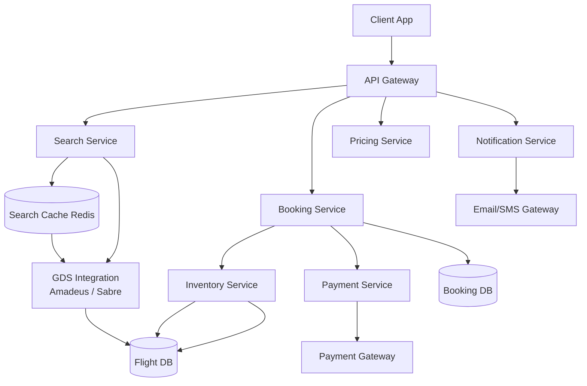
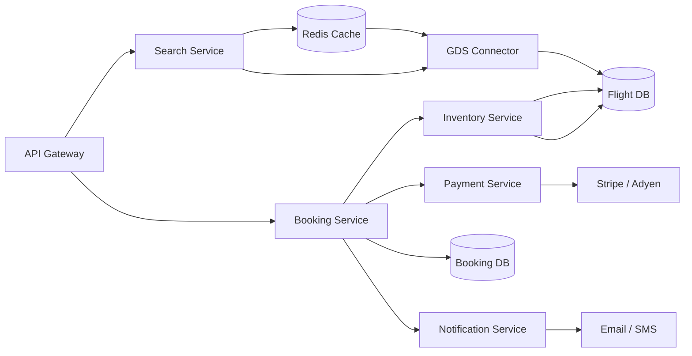
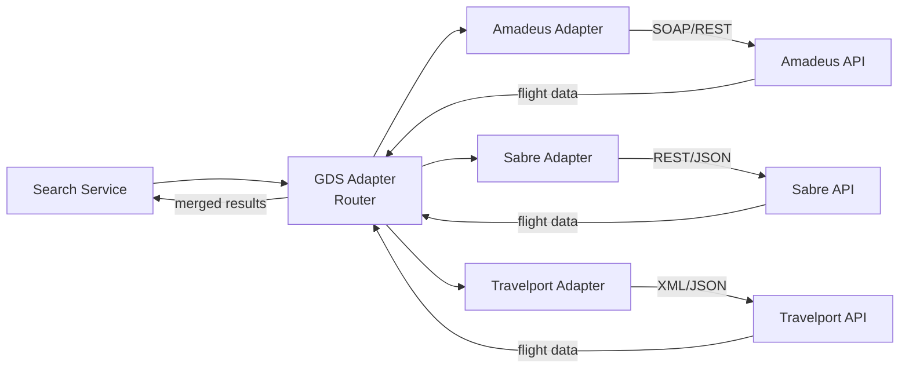
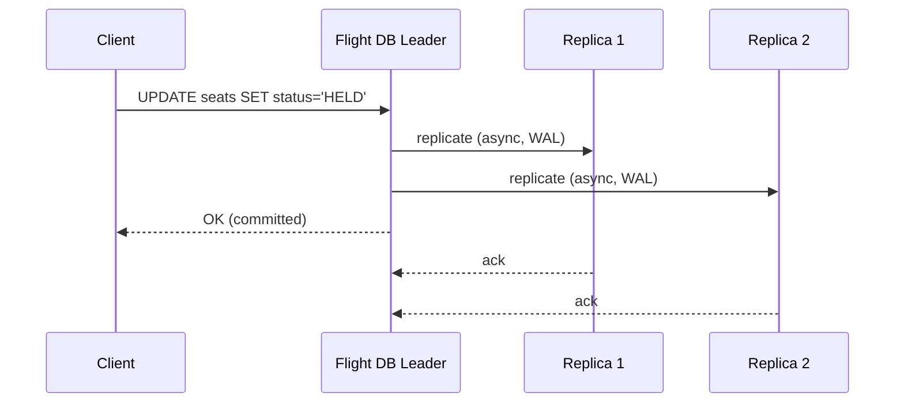
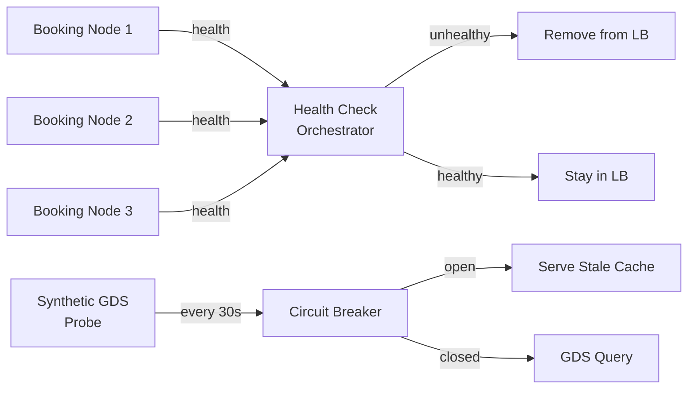
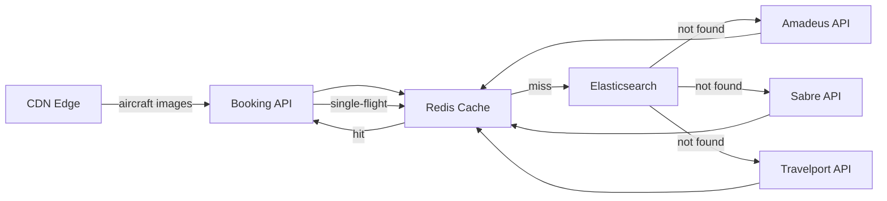
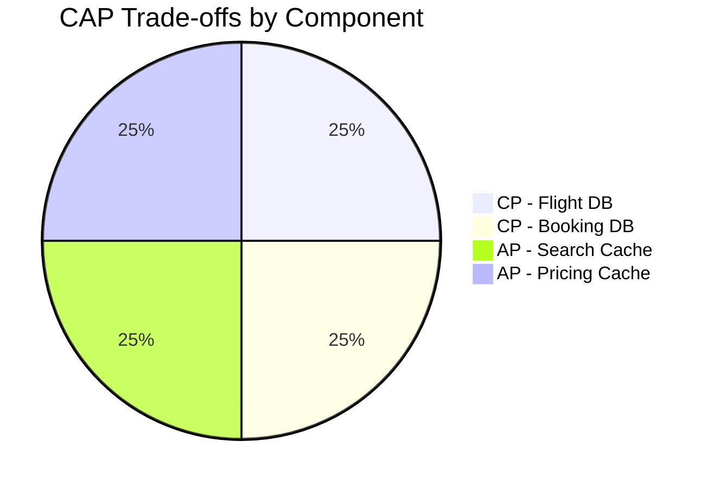
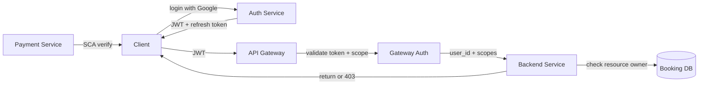
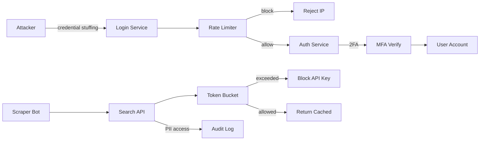
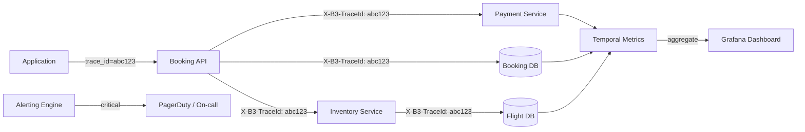

# Design Flight Booking System

## Blogs and websites

## Medium

## Youtube

- [Grokking the System Design Interview – Flight Booking / Reservation System](https://www.youtube.com/watch?v=4wrf7S_0I9w)
- [Low Level Design of Flight Ticket Booking System](https://www.youtube.com/watch?v=VvPrnYpl-zI)

---

## Theory

### Topics Covered

1. [Introduction / Problem Statement](#introduction--problem-statement)
2. [Characteristics](#characteristics)
3. [Pros](#pros)
4. [Cons](#cons)
5. [Use Cases](#use-cases)
6. [Components](#components)
7. [Architectural Patterns](#architectural-patterns)
8. [Benefits](#benefits)
9. [Challenges](#challenges)
10. [Best Practices](#best-practices)
11. [When to Use / When Not to Use](#when-to-use--when-not-to-use)
12. [Data Model and API](#data-model-and-api)
13. [Domain-Specific: Flight Booking Deep Dive](#domain-specific-flight-booking-deep-dive)
14. [Replication Strategies](#replication-strategies)
15. [Failure Detection and Membership](#failure-detection-and-membership)
16. [High Availability and Scalability](#high-availability-and-scalability)
17. [Performance and Optimization](#performance-and-optimization)
18. [CAP Theorem and Consistency Trade-offs](#cap-theorem-and-consistency-trade-offs)
19. [Encryption and Key Management](#encryption-and-key-management)
20. [Authentication and Authorization](#authentication-and-authorization)
21. [Security Threats and Mitigations](#security-threats-and-mitigations)
22. [Observability and Logging](#observability-and-logging)
23. [Real-World Implementations](#real-world-implementations)
24. [Java and Spring Boot Implementation Guide](#java-and-spring-boot-implementation-guide)
25. [Interview Questions and Answers](#interview-questions-and-answers)

---

### Introduction / Problem Statement

A flight booking system is a software platform that lets users search, compare, select, and book flights across hundreds to thousands of airlines and Global Distribution Systems (GDS). It maintains seat inventory with strong consistency to prevent double-booking, computes dynamic prices based on demand and time-to-departure, orchestrates multi-step payment flows using the saga pattern, and issues booking confirmations in the form of PNRs (Passenger Name Records). Unlike a simple CRUD application, a flight booking system must coordinate distributed state across inventory, pricing, payment, and notification services while guaranteeing that a seat, once purchased, is never sold twice.

Before centralized booking systems, travelers had to call each airline individually — a tedious, error-prone process. A modern flight booking system consolidates global airline inventory into a single search → book → pay → confirm flow, dramatically improving convenience, conversion, and revenue optimization.



*The architecture of a flight booking platform: the client sends search and booking requests through an API Gateway. On search, the Search Service checks a Redis cache for popular routes and falls back to parallel GDS queries (Amadeus / Sabre) on cache miss. On booking, the Booking Service orchestrates the critical path — it calls the Inventory Service (which uses pessimistic locking to atomically hold and confirm seats), the Payment Service (which charges via a payment gateway), and the Notification Service (which sends e-tickets). The Flight DB and Booking DB are durable stores behind the Inventory and Booking services respectively.*

**Problem Statement:** Design a flight booking system like Booking.com or Google Flights that supports flight search, seat selection, booking, and payment processing with strong inventory consistency to prevent overbooking — serving 100M+ searches/day and 1M+ bookings/day, with search latency under 2 seconds and booking latency under 5 seconds.

**The seat-contention challenge in numbers:** A popular flight (e.g., JFK→LHR on a holiday weekend) has only 4 economy seats remaining. A flash sale launches at 10:00 AM. Within the first second, 5,000 users click "Book." Naive inventory reads from a cached counter (Redis `GET seat_count` → 4) would allow all 5,000 concurrent requests to see "4 seats available." Without pessimistic locking on the seat rows, all 5,000 payment attempts would proceed and the system would issue 5,000 confirmations for 4 seats — a catastrophic oversell that could cost millions in re-accommodation, lawsuits, and brand-damage penalties. The system must use `SELECT ... FOR UPDATE` (or atomic Redis Lua scripts) to serialize seat holds, with a 10-minute reservation hold for payment completion and a cleanup scheduler to release expired holds.

**Functional Requirements:**
- Search flights by origin, destination, dates, passengers, and class of service.
- View available flights with prices, durations, and layovers.
- Select seats (specific seat numbers) after search.
- Book flights via a three-phase saga: reserve → pay → confirm.
- Manage bookings (view, cancel, modify) by PNR lookup.
- Price alerts and fare tracking for watched routes.
- Multi-leg / round-trip bookings with layover validation.

**Non-Functional Requirements:**
- **Scale:** 100M+ searches/day, 1M+ bookings/day.
- **Latency:** Search < 2s; booking (reserve → pay → confirm) < 5s.
- **Consistency:** No double-booking of the same seat — strong consistency for inventory.
- **Availability:** 99.99% for search; 99.999% for booking confirmation.
- **Data volume:** Millions of flight routes; dynamic pricing updated every few minutes.

---

### Characteristics

| Characteristic | What it means | Why it matters | How it works |
|---|---|---|---|
| **Inventory consistency** | Seat inventory must be strongly consistent | Prevent double-booking (overselling is catastrophic) | `SELECT FOR UPDATE` row locks / Redis atomic Lua scripts + reservation holds |
| **Dynamic pricing** | Prices change in real-time based on demand | Maximize revenue per seat | demand_multiplier × time_multiplier × competition_factor × booking_class |
| **Multi-leg journeys** | Book connecting flights (e.g., NYC→DXB→BOM) | Complex routing with layover validation | Graph search over the flight network; minimum connection time checks |
| **PNR generation** | 6-char alphanumeric booking reference | User identification, retrieval, airline handoff | Hash-based ID generation with collision detection on a distributed keyspace |
| **GDS integration** | Connect to airline distribution systems | Access real, bookable inventory from 1000+ airlines | Amadeus / Sabre / Travelport APIs via the adapter pattern |
| **Payment orchestration** | Coordinate booking + payment as a unit | No confirmation without captured payment | Saga pattern: reserve → pay → confirm; compensation/rollback on failure |
| **Reservation holds** | Temporarily lock seats during payment | Prevent inventory hoarding; give user time to pay | TTL-based hold (e.g., 10 min) with a background cleanup scheduler |
| **Rate limiting** | Throttle search and booking attempts | Prevent scraping, seat-hoarding bots, and flash-sale overload | Per-IP and per-user token-bucket limiters backed by Redis |

---

### Pros

- **Global reach:** Connect to 1000+ airlines via GDS, offering worldwide inventory in a single interface.
- **Price comparison:** Show the best fares across airlines instantly, driving conversion through transparency.
- **Real-time inventory:** Accurate seat availability prevents overselling and builds customer trust.
- **Dynamic pricing:** Revenue optimization per flight — prices adapt to demand, time-to-departure, and competition.
- **Multi-currency support:** Price and settle in local currencies with real-time FX conversion.
- **Automated booking lifecycle:** Reservation holds, payment processing, e-ticket generation, and notifications are fully automated.
- **Multi-leg routing:** Graph-based search finds optimal connecting flights across partner airlines.

---

### Cons

- **GDS fees:** $0.10–$1.00 per query × 100M/day = $10M+/year in distribution costs.
- **Seat contention:** Peak booking windows see 100K+ concurrent booking attempts → lock contention on seat rows.
- **Payment complexity:** Multi-provider, multi-currency, partial captures, and refunds require careful orchestration.
- **Inventory lag:** Some airlines update GDS only every few minutes → stale availability and failed confirmations.
- **Rate limiting by airlines:** GDS partners cap query rates per connection → need connection pooling and adapter layers.
- **Regulatory compliance:** PCI-DSS for payments; GDPR for EU travelers; IATA settlement rules.
- **Overbooking risk:** Some airlines legally overbook → re-accommodation logic is complex and costly.

---

### Use Cases

#### OTA Booking Engine (Kayak + Booking.com Style)

* **Problem:** Users search across 1000+ airlines spanning 5 GDS systems; compare prices; book; pay; get an e-ticket.
* **Solution:** Search Service (Elasticsearch + Redis cache) → Inventory Service (GDS real-time check) → Booking Service (saga) → Payment → e-ticket.
* **Why suitable:** GDS integration + cache for fast search + saga pattern for reliable confirmations.
* **How it works:**
  1. User searches NYC→LON → Redis cache check. Cache miss → GDS query (parallel Amadeus + Sabre) → merge + rank → cache (5-min TTL).
  2. User selects a flight → Booking Service → Inventory Service (`SELECT FOR UPDATE` seat) → hold 10 min.
  3. Payment → if success → confirm → PNR generated → e-ticket emailed.
  4. If payment fails or times out → hold auto-released → seat available again.
* **Trade-offs:** GDS fees ($0.20–$1.00/query); cache staleness; payment-failure reconciliation jobs.

---

### Components

| Component | Purpose | Responsibilities | Relationship | Real-world Example |
|---|---|---|---|---|
| **Search Service** | Flight search & result assembly | Query by route/date/passengers; rank results by price, duration, stops | Elasticsearch + Redis cache | Google Flights search |
| **Inventory Service** | Seat availability & holds | Track seat inventory; atomically hold/confirm/release seats | Flight DB (PostgreSQL sharded by route) | Sabre inventory / ATPCO |
| **Booking Service** | Booking lifecycle orchestration | Create/modify/cancel bookings; generate PNR; drive the saga | Booking DB; calls Inventory + Payment | Amadeus booking engine |
| **Pricing Service** | Dynamic pricing computation | Compute prices based on demand, time-to-departure, competition | Pricing cache (Redis); calls GDS revenue APIs | Fare rules engine |
| **Payment Service** | Payment processing | Charge customer; handle refunds; coordinate settlement | Payment gateway (Stripe / Adyen) | Stripe integration |
| **Flight Data Store** | Flight inventory & schedules | Flights, seats, schedules, fare rules | PostgreSQL (sharded by route) | Airline PNR / inventory system |
| **GDS Connector** | Connect to airline distribution systems | Fetch real-time availability + prices; adapter per GDS | GDS API (Amadeus, Sabre, Travelport) | Amadeus / Sabre API |
| **Notification Service** | Send confirmations & updates | Email + SMS e-tickets, booking updates, reminders | SES, Twilio, SendGrid | Post-booking notification |
| **Cache Layer** | Accelerate reads & reduce GDS costs | Cache popular route search results; cache seat availability | Redis (clustered, with TTL) | Redis for hot routes |



*Component interaction flow: the API Gateway routes search requests to the Search Service which checks the Redis cache first and falls back to the GDS Connector on miss; booking requests go to the Booking Service which orchestrates the Inventory Service (pessimistic seat hold), the Payment Service (charge via Stripe/Adyen), and the Notification Service (e-ticket delivery). The Flight DB is the durable source of truth for inventory, written through the Inventory Service and consulted by both Search (via GDS) and Booking (via direct lock).*

---

### Architectural Patterns

#### Reservation Hold with TTL

* **What:** When a user begins booking, temporarily hold the seat (mark status `held`) with an expiration window (typically 10 minutes). If payment does not complete within the window, the seat is auto-released.
* **Problem solved:** Without a hold, seats appear available throughout payment (→ overselling); with permanent allocation, seats are hoarded by abandoned checkouts (→ phantom unavailability).
* **How it works:** `reserve` → Inventory Service executes `UPDATE seats SET status='held', reservation_id='R456', hold_expires_at=NOW() + 10min WHERE seat_id=X AND status='available'`. Payment is attempted. On success → Booking Service transitions `held` → `confirmed`. On timeout → background scheduler runs `UPDATE seats SET status='available' WHERE hold_expires_at < NOW()` every 5 minutes.
* **When to use:** Inventory reservation systems (flights, hotels, event tickets) where payment is asynchronous.
* **When not to use:** When payment is instant and synchronous (no time gap → no hold needed).
* **Advantages:** Prevents overselling; auto-cleanup of abandoned holds; bounded inventory lock duration.
* **Disadvantages:** Seats held during payment reduce available inventory temporarily; requires a cleanup job and TTL management.

#### Pessimistic Locking for Seat Allocation

* **What:** Lock the seat row (or seat-count record) during the booking transaction to serialize concurrent access.
* **Problem solved:** Two users see "1 seat available" → both try to book → one must succeed, one must fail.
* **How it works:** `BEGIN; SELECT * FROM seats WHERE flight_id=? AND seat_number=? AND status='available' FOR UPDATE; UPDATE seats SET status='held'...; COMMIT;`
* **When to use:** Critical inventory where overselling is unacceptable (flights, hotels).
* **When not to use:** Read-heavy systems where locking causes excessive contention.
* **Advantages:** No overselling; simple to reason about and audit.
* **Disadvantages:** Lock contention under high concurrency; deadlocks possible (mitigated by `SKIP LOCKED`).

#### Saga Pattern for Booking (Reserve → Pay → Confirm)

* **What:** Model the booking lifecycle as a sequence of local transactions, each with a compensating action if it fails.
* **Problem solved:** Distributed transactions (inventory + payment) can't use a single global two-phase commit across services. The saga provides atomicity per step with rollback.
* **How it works:** Reserve seat (lock + hold) → charge payment → if payment succeeds, confirm booking and release hold confirmation; if payment fails, release the reservation (compensation). The Booking Service is the saga orchestrator.
* **When to use:** Multi-service workflows where each step updates a different bounded context (inventory, payment, booking).
* **When not to use:** Single-database transactions where a standard ACID transaction suffices.
* **Advantages:** Maintains data consistency across services without distributed locks; each step can be retried independently.
* **Disadvantages:** Complexity of managing compensating transactions; harder to debug; partial failures require reconciliation.

#### Cache-Aside with Stale-While-Revalidate

* **What:** Read from Redis cache first; on miss, fetch from GDS and populate the cache. When cache entries near expiry, background-refresh them while serving stale data.
* **Problem solved:** GDS queries are expensive ($0.10–$1.00 each) and rate-limited. Caching avoids repeated queries for popular routes.
* **How it works:** Search Service checks Redis (`GET route:NYC-LON-2025-06-15`). If hit → return immediately. If miss → query GDS in parallel, store result with TTL (300s) → return. A background job refreshes entries 60s before expiry so the cache stays warm without blocking user requests.
* **When to use:** Read-heavy search over expensive, slowly-changing data sources (GDS, airline APIs).
* **When not to use:** Real-time trading systems where every price change must be reflected immediately.
* **Advantages:** Dramatically reduces GDS costs and query latency; graceful degradation to stale data under GDS outages.
* **Disadvantages:** Stale prices can cause checkout failures (price changed since search); requires reconciliation between search-time and book-time prices.

---

### Benefits

- **Revenue protection:** Strong inventory consistency (pessimistic locking + reservation holds) prevents catastrophic overselling — the most expensive failure mode in flight booking.
- **Customer trust:** Accurate seat counts and real-time availability mean no false promises at checkout, reducing booking-abandonment and support costs.
- **Operational efficiency:** Automated reservation holds, TTL cleanup, and payment-saga reconciliation eliminate manual intervention for the vast majority of bookings.
- **Revenue optimization:** Dynamic pricing adjusts fares in real time to match demand, extracting maximum revenue per seat without alienating price-sensitive travelers.
- **Scalability:** Cache-aside for search and sharded inventory by route let the system handle 100M+ searches/day with sub-2s latency.
- **Reliability:** The saga pattern with idempotent operations ensures that partial failures (e.g., payment captured but booking DB down) are recoverable via reconciliation jobs.

---

### Challenges

#### Technical Challenges

- **Seat contention:** Peak booking windows (flash sales, error-fares) → 100K+ concurrent booking attempts → row-level lock contention on seat tables; requires Redis Lua scripts and `SKIP LOCKED` to keep throughput high.
- **GDS rate limits:** 1000+ airlines, different APIs, different limits → need an adapter layer per GDS + circuit breakers + connection pooling.
- **Multi-leg search:** Connecting flights across 4+ airlines → combinatorial explosion of route combinations; requires graph search with pruning by max-stops and layover duration.
- **Dynamic pricing:** Recompute prices every few minutes → cache invalidation across regions → price-staleness vs. GDS-cost trade-off.
- **Price reconciliation:** A price shown at search time may change by the time payment completes; booking-time re-price + user re-confirmation needed.
- **PNR collisions:** 6-char alphanumeric space (36^6 ≈ 2.2 billion) sounds large but with retries and distributed generation → need collision detection and retry logic.

#### Scalability Challenges

- **Search QPS:** 100M searches/day ≈ 1,200 QPS; cache popular routes → 70–80% hit rate; cache miss → parallel GDS calls.
- **Booking QPS:** 1M bookings/day ≈ 12 QPS baseline but bursts of 1,000/sec during flash sales → need burst handling + reservation queuing.
- **Inventory sync:** 10K+ flights updating seat availability every few minutes → streaming pipeline → cache invalidation.
- **Multi-currency:** 50+ currencies → real-time FX rates → rounding and settlement precision (BigDecimal everywhere).

#### Performance Challenges

- **Search latency:** < 2s — pre-compute popular route results in Redis (5-min TTL); cache miss → fan-out to 3 GDS in parallel with a 1.5s timeout.
- **Booking latency:** < 5s — reservation hold + payment + confirmation must complete fast; async fan-out to Notification Service.
- **Price freshness:** Prices stale by > 10 min degrade conversion → cache TTL = 300s with stale-while-revalidate.
- **Seat-map rendering:** Real-time seat-map for 200+ seats per aircraft → cache seat-map per flight + WebSocket for live updates.

#### Reliability Challenges

- **Payment failure:** Payment succeeds but booking confirmation fails → reconciliation job detects orphaned payments and creates bookings retroactively.
- **GDS downtime:** Cache last-known inventory → allow booking with a warning; GDS writes queued for replay when the system recovers.
- **Overbooking:** Some airlines legally overbook (2–5%) → re-accommodation logic: bump volunteers first (vouchers), then involuntarily (compensation).
- **Network partitions:** GDS connection drops mid-booking → the reservation hold remains → saga compensation releases the seat; no partial confirmations.

#### Maintainability Challenges

- **Airline API changes:** Each airline/GDS has different APIs → adapter pattern with a common `AvailabilityProvider` interface.
- **Fare rules:** 10K+ fare rules (change fees, refundability, blackout dates) → rules engine (Drools or custom DSL).
- **Cancellation policies:** Per-airline, per-fare; auto-refund after 24h for EU flights (EU261); → policy engine + refund scheduler.

#### Operational Challenges

- **Seat hold cleanup:** Scheduled job every 5 min checks for expired holds; must run exactly-once across a cluster → distributed lock (Redis Redlock) or leader election.
- **PNR collision:** 6-char PNR — collision probability → add a timestamp/checksum and retry on collision.
- **Refund processing:** Refunds take 7–14 days → reconciliation between booking system and payment provider; status polling + webhook fallback.
- **GDS connection draining:** Rolling deploys must drain active GDS connections gracefully to avoid mid-query failures.

---

### Best Practices

- **Reservation holds with TTL:** 10-minute hold on the seat during payment; auto-release via a 5-minute cleanup scheduler. Never book without a hold.
- **Pessimistic locking:** `SELECT ... FOR UPDATE SKIP LOCKED` on seat rows to serialize concurrent booking attempts without deadlocks.
- **Cache popular routes:** Redis cache of flight search results with a 300-second TTL and stale-while-revalidate to cut GDS costs by 70–80%.
- **Two-phase booking (saga):** Reserve → pay → confirm; on any failure, compensate by releasing the reservation hold and refunding if necessary.
- **Idempotency keys:** Every booking request carries a client-supplied idempotency key so retries after network errors don't create duplicate bookings or charges.
- **Separate read and write stores:** Search reads from Elasticsearch + Redis cache; booking writes go to PostgreSQL for ACID guarantees.
- **Circuit breaker on GDS:** If a GDS API degrades (error rate > 5% or latency > 5s), open the circuit for 60s and serve stale cache + a "price may have changed" warning.
- **Distributed tracing:** Trace every booking from search → reservation → payment → confirmation with a correlation ID across all services (OpenTelemetry).
- **Price re-validation at checkout:** Re-fetch the price from the Pricing Service right before charging; if it changed by more than a threshold, prompt the user to re-confirm.
- **Hold expiry via keyspace notification:** Instead of polling, use Redis keyspace notifications (`expired` events) to release seats immediately when a hold expires — reduces latency from 5 min to near-real-time.
- **Rate limiting at the gateway:** Apply per-user and per-IP token buckets (Redis-backed) to prevent seat-hoarding bots during flash sales — typically 5 booking attempts per user per minute.

---

### When to Use / When Not to Use

**Use when:**

- You are building an OTA (online travel agency), airline direct-booking channel, or corporate travel platform.
- You need to search and book across multiple airlines/GDS systems in a single interface.
- Strong inventory consistency is required — overselling seats is not an option.
- Revenue optimization via dynamic pricing is a key business driver.
- Multi-leg routing with layover validation is a requirement.

**Avoid when:**

- Content is a static travel blog with no booking functionality.
- Internal corporate travel for 10 employees — a simple spreadsheet or single-airline portal suffices.
- You have no GDS access — you can only show your own airline's inventory, which a basic booking system already handles.
- The business model is meta-search only (redirect to OTAs) — you don't need payment orchestration or booking DB.

**Alternatives:**

- **Direct GDS API:** Build directly on Amadeus/Sabre APIs without a separate inventory or booking service — simplest for read-only or redirect-based models.
- **Travel aggregator APIs:** Skyscanner API or Kiwi API — search-only, no booking; suitable for inspiration or comparison apps.
- **Simple inventory:** If you only operate your own aircraft (charter, private jet), own-inventory booking in a single database is sufficient — no GDS needed.

**Decision factors:**

- **Inventory source:** GDS-dependent → need integration layer; own inventory → simpler single-db design.
- **Booking volume:** 100/day → a simple monolith with a single DB; 1M/day → distributed services with sharded inventory and sagas.
- **Regional scope:** Domestic → one GDS; global → multi-GDS with fallback and currency handling.
- **Ticket type:** E-ticket only → digital delivery; paper tickets → integration with postal/print services.

---

### Data Model and API

The data model captures flights, seats, bookings, passengers, payments, and PNRs. Seats follow a strict lifecycle (available → held → confirmed); bookings are immutable after PNR generation; payments have their own state machine with idempotency.

```mermaid
erDiagram
    FLIGHT ||--o{ SEAT : "has"
    FLIGHT }|--o{ PRICE : "priced_by"
    BOOKING ||--o{ BOOKING_PASSENGER : "contains"
    BOOKING }|--|| FLIGHT : "books"
    BOOKING ||--o{ PAYMENT : "paid_by"
    PAYMENT ||--|| REFUND : "may_have"
    USER ||--o{ BOOKING : "makes"
    GDS ||--o{ FLIGHT : "feeds"

    FLIGHT {
        string flight_id PK
        string flight_number
        string origin
        string destination
        datetime departure
        datetime arrival
        int total_seats
        string aircraft_type
        string status
    }
    SEAT {
        string seat_id PK
        string flight_id FK
        string seat_number
        enum status available_held_confirmed
        string reservation_id
        datetime hold_expires_at
    }
    BOOKING {
        string booking_id PK
        string pnr_code
        string user_id FK
        string flight_id FK
        enum status reserved_confirmed_cancelled
        string seat_id FK
    }
    BOOKING_PASSENGER {
        string booking_id FK
        string passenger_name
        string seat_number
    }
    PAYMENT {
        string payment_id PK
        string booking_id FK
        enum status pending_succeeded_failed
        decimal amount
        string currency
        string idempotency_key
    }
    PRICE {
        string flight_id FK
        decimal base_fare
        decimal total_price
        datetime valid_from
        datetime valid_to
    }
    GDS {
        string gds_code PK
        string name
        string api_endpoint
    }
```

**Partitioning / Sharding:**

- **FLIGHT:** Sharded by `origin||destination` route hash → all flights on a route live on one shard.
- **SEAT:** Co-located with FLIGHT (same shard key = `flight_id`).
- **BOOKING:** Sharded by `pnr_code` hash (6-char PNR → hash into 1000 partitions).
- **PAYMENT:** Co-located with BOOKING (`booking_id` = `payment_id` hash).
- **PRICE:** Sharded by `flight_id` (same as FLIGHT).

**Indexes and Constraints:**

- `FLIGHT(flight_number, departure)` — UNIQUE (no duplicate scheduled flight).
- `SEAT(flight_id, seat_number)` — composite UNIQUE (no duplicate seat on a flight).
- `BOOKING(pnr_code)` — UNIQUE (PNR collision check).
- `BOOKING(user_id)` — index for "my bookings" lookup.
- `SEAT(reservation_id)` — index for fast hold release.
- `PAYMENT(idempotency_key)` — UNIQUE for idempotent payment processing.

**API Contract — Search, Booking, Payment, and Status:**

| Method | Endpoint | Purpose | Rate Limit |
|---|---|---|---|
| GET | `/api/v1/flights/search` | Search available flights | 1000 req/hour |
| GET | `/api/v1/flights/{id}/seats` | Get seat map for a flight | 2000 req/hour |
| POST | `/api/v1/bookings/reserve` | Reserve a seat (10-min hold) | 60 req/hour |
| POST | `/api/v1/bookings/confirm` | Confirm booking after payment | 60 req/hour |
| POST | `/api/v1/payments` | Process payment (idempotent) | 60 req/hour |
| GET | `/api/v1/bookings/{pnr}` | Get booking details | 2000 req/hour |
| POST | `/api/v1/bookings/cancel` | Cancel booking (refund) | 20 req/hour |
| POST | `/api/v1/flights/watch` | Create a price alert | 100 req/hour |

**GET /api/v1/flights/search — Request:**

```http
GET /api/v1/flights/search?origin=JFK&destination=LHR&date=2025-06-15&passengers=2&class=economy HTTP/1.1
Authorization: Bearer <jwt>
Accept: application/json
```

**GET /api/v1/flights/search — Response:**

```json
{
  "results": [
    {
      "flight_id": "BA123",
      "airline": "British Airways",
      "departure": {"airport": "JFK", "terminal": "7", "time": "2025-06-15T18:30:00Z"},
      "arrival": {"airport": "LHR", "terminal": "5", "time": "2025-06-16T06:30:00Z"},
      "duration": "7h 0m",
      "stops": 0,
      "price": {"amount": 850, "currency": "USD"},
      "available_seats": 12,
      "fare_rules": {"refundable": true, "change_fee": 0, "bags_included": 1}
    }
  ],
  "currency": "USD",
  "cached": true
}
```

**POST /api/v1/bookings/reserve — Request:**

```json
{
  "flight_id": "BA123",
  "seat_id": "s_789",
  "passengers": [
    {"first_name": "Alice", "last_name": "Ghosh", "dob": "1990-05-15"}
  ],
  "contact": {"email": "alice@example.com", "phone": "+15551234567"},
  "idempotency_key": "req_abc123"
}
```

**POST /api/v1/bookings/reserve — Response:**

```json
HTTP/1.1 200 OK
{
  "reservation_id": "R456",
  "hold_expires_at": "2025-06-15T10:40:00Z",
  "price": {"amount": 850, "currency": "USD"},
  "status": "reserved"
}
```

**POST /api/v1/bookings/confirm — Request:**

```json
{
  "reservation_id": "R456",
  "payment_id": "pay_xyz789",
  "idempotency_key": "req_def456"
}
```

**POST /api/v1/bookings/confirm — Response:**

```json
HTTP/1.1 201 Created
{
  "pnr": "ABC123",
  "status": "confirmed",
  "total_price": {"amount": 850, "currency": "USD"},
  "e_ticket_sent": true
}
```

**Error responses:**

```json
{"error": "seat_unavailable", "message": "Seat no longer available", "code": 409}
{"error": "hold_expired", "message": "Reservation expired during payment", "code": 410}
{"error": "price_changed", "message": "Price changed by 5%. Please re-confirm.", "code": 409}
{"error": "duplicate_request", "message": "Idempotency key already processed", "code": 409}
```

**Status codes:** `200` OK, `201` Created, `400` Invalid request, `401` Auth required, `403` Forbidden, `404` Not found, `409` Conflict (seat/price/idempotency), `410` Gone (hold expired), `429` Rate limited, `503` Temporarily unavailable.

**Authentication & Authorization:** OAuth 2.0 with JWT bearer tokens. Scopes: `flights:read`, `bookings:write`, `bookings:cancel`, `payments:write`. Role `agent` for call-center staff; role `admin` for system configuration.

---

### Domain-Specific: Flight Booking Deep Dive

This section covers the core technical challenges unique to flight booking systems: how flight search works at massive scale, how dynamic pricing engines compute fares, how seat selection and inventory management prevent overselling, how PNRs are generated and managed, and how GDS integration bridges the platform to airline systems. These topics are the heart of flight-booking system design.

#### Flight Search

Flight search is the highest-volume operation (100M/day ≈ 1,200 QPS) and must return results in under 2 seconds. The architecture is a three-tier cache-and-fan-out:

1. **Elasticsearch index:** A pre-computed index of flight data (origin, destination, date, aircraft, fare buckets, seat counts) updated every few minutes from GDS feeds. Supports fast filtered queries (`origin:JFK AND destination:LHR AND date:2025-06-15`) with aggregations for faceted navigation (airline, price range, stops).
2. **Redis hot-route cache:** The top 1,000 most-searched routes are cached in Redis with a 300-second TTL and stale-while-revalidate. This achieves a 70–80% hit rate, reducing GDS calls to once per 5 minutes for hot routes.
3. **GDS fan-out on cache miss:** For uncached routes, the Search Service fires parallel queries to up to 3 GDS providers (Amadeus, Sabre, Travelport) using `CompletableFuture`, with a 1.5-second timeout. Results are merged, de-duplicated, and ranked.

**Search ranking factors:** price (primary), total duration, number of stops, layover duration, airline rating, baggage allowance. The ranking model is a simple weighted score: `score = 0.4 × price_rank + 0.2 × duration_rank + 0.2 × stops_rank + 0.1 × airline_rating + 0.1 × baggage`.

```java
@Service
@RequiredArgsConstructor
public class SearchService {

    private final RedisTemplate<String, SearchResult> redisTemplate;
    private final ElasticsearchTemplate esTemplate;
    private final List<GdsAdapter> gdsAdapters;
    private final PricingService pricingService;
    private final MeterRegistry meterRegistry;

    @Value("${app.search.cache-ttl-seconds:300}")
    private int cacheTtlSeconds;

    @Value("${app.search.gds-timeout-ms:1500}")
    private int gdsTimeoutMs;

    public SearchResponse search(SearchRequest request) {
        var cacheKey = buildCacheKey(request);
        var cached = redisTemplate.opsForValue().get(cacheKey);
        if (cached != null) {
            meterRegistry.counter("search.cache.hit").increment();
            return SearchResponse.from(cached, true);
        }

        meterRegistry.counter("search.cache.miss").increment();
        var timer = Timer.Sample.start(meterRegistry);

        List<FlightResult> results = searchEsFirst(request);
        if (results.isEmpty()) {
            results = fanoutToGds(request);
        }
        results = pricingService.decorateWithPrices(results, request.passengers());
        results = rank(request, results);

        var response = SearchResponse.from(results, false);
        redisTemplate.opsForValue().set(cacheKey, response,
                Duration.ofSeconds(cacheTtlSeconds));
        timer.stop(Timer.builder("search.latency").register(meterRegistry));
        return response;
    }

    private List<FlightResult> fanoutToGds(SearchRequest request) {
        var futures = gdsAdapters.stream()
                .map(adapter -> CompletableFuture
                        .supplyAsync(() -> adapter.search(request),
                                Executors.newCachedThreadPool())
                        .orTimeout(gdsTimeoutMs, TimeUnit.MILLISECONDS))
                .toList();

        return futures.stream()
                .map(CompletableFuture::join)
                .flatMap(List::stream)
                .distinct()
                .sorted(Comparator.comparing(FlightResult::price))
                .toList();
    }

    private List<FlightResult> rank(SearchRequest request,
                                    List<FlightResult> results) {
        return results.stream()
                .sorted(Comparator
                        .comparing((FlightResult r) -> r.price().amount())
                        .thenComparing(r -> r.duration())
                        .thenComparing(r -> r.stops()))
                .toList();
    }
}
```

*The `SearchService` bean implements the three-tier search architecture. Redis (via `RedisTemplate`) is checked first for a 5-minute cached result. On a miss, it queries Elasticsearch for pre-computed flight data; if the route is not in ES, it fan-outs to all GDS adapters in parallel using `CompletableFuture` with a 1.5s timeout (`orTimeout`). Results are decorated with prices from the `PricingService`, ranked by a composite comparator (price → duration → stops), cached in Redis, and returned. Micrometer timers and counters track cache-hit ratio and search latency.*

#### Pricing Engines

Dynamic pricing ensures each seat is sold at the maximum price the market will bear. The pricing engine combines airline fare rules, real-time demand signals, booking pace, and competitive intelligence.

**Pricing formula:**
```
price = base_fare × demand_multiplier × time_multiplier × competition_factor
```

**Inputs:**
- **Seats remaining:** Fewer seats → higher multiplier (last-seat premium). Bucketed: >50% remaining → 1.0x; 20–50% → 1.3x; <20% → 2.0x.
- **Days until departure:** Last-minute travelers pay a premium. `time_multiplier = 1.0 + 0.05 × (30 - days_left) / 30` for days_left < 30, up to 3.0x on the day of departure.
- **Historical demand:** Same route/date on the same day-of-week in prior years → demand curve. A route that historically sells out 14 days out gets price-raised 14 days before departure.
- **Competitor prices:** Scraped or via GDS revenue APIs (Sabre SABRE® Revenue Optimizer, Amadeus Altéa) → `competition_factor` capped at ±20% from the median market fare.
- **Booking class:** Economy, premium economy, business, first — each with a class multiplier.

**Update frequency:** Every few minutes per flight, triggered by a GDS inventory update event or a scheduled job. Stored in a pricing cache (Redis sorted set keyed by `flight_id:timestamp`) for sub-millisecond lookup.

```java
@Service
@RequiredArgsConstructor
public class PricingService {

    private static final BigDecimal LAST_MINUTE_PREMIUM = new BigDecimal("3.0");

    private final GdsAdapter gdsAdapter;
    private final RedisTemplate<String, BigDecimal> redisTemplate;
    private final MeterRegistry meterRegistry;

    public FlightPrice computePrice(String flightId, int seatsRemaining,
                                     int daysUntilDeparture, int bookingClass) {
        var baseFare = gdsAdapter.getBaseFare(flightId, bookingClass);
        var demandMultiplier = demandMultiplier(seatsRemaining);
        var timeMultiplier = timeMultiplier(daysUntilDeparture);
        var competitionFactor = competitionFactor(flightId);

        var price = baseFare
                .multiply(demandMultiplier)
                .multiply(timeMultiplier)
                .multiply(competitionFactor)
                .setScale(2, RoundingMode.HALF_UP);

        redisTemplate.opsForValue().set(
                "pricing:" + flightId, price, Duration.ofMinutes(5));
        meterRegistry.counter("pricing.updates").increment();
        return new FlightPrice(price, baseFare, demandMultiplier,
                timeMultiplier, competitionFactor);
    }

    private BigDecimal demandMultiplier(int seatsRemaining) {
        var ratio = (double) seatsRemaining / 100.0; // assume 100 total
        if (ratio > 0.5) return BigDecimal.ONE;
        if (ratio > 0.2) return new BigDecimal("1.3");
        return new BigDecimal("2.0");
    }

    private BigDecimal timeMultiplier(int daysLeft) {
        if (daysLeft >= 30) return BigDecimal.ONE;
        var boost = BigDecimal.valueOf(0.05)
                .multiply(BigDecimal.valueOf(30 - daysLeft));
        return BigDecimal.ONE.add(boost).min(LAST_MINUTE_PREMIUM);
    }
}
```

*The `PricingService` bean computes the dynamic fare using `BigDecimal` arithmetic for precision. It queries the GDS adapter for the base fare, then applies three multipliers (demand, time-to-departure, competition) each computed as a pure function. The result is cached in Redis with a 5-minute TTL and a Micrometer counter tracks pricing updates. Using `BigDecimal` everywhere avoids the floating-point rounding errors that would cause revenue leakage or customer-facing price mismatches.*

#### Seat Selection

Seat selection is a two-phase interaction: at search time, only aggregate counts (e.g., "12 seats available in economy") are shown; at booking time, the specific seat map is rendered and a particular seat is locked via the reservation-hold pattern.

**Seat map model:** Each aircraft has a seat map (rows × columns, with special designations: aisle, window, middle, exit row). The seat map is cached per flight in Redis (updated from GDS every 10 minutes). Seats have a lifecycle: `AVAILABLE → HELD → CONFIRMED → (CANCELLED → AVAILABLE)`.

**Selection flow:**
1. User views the seat map → read from Redis cache (seat layout + current status).
2. User selects seat `12A` → `POST /bookings/reserve` → Inventory Service does `SELECT ... FOR UPDATE SKIP LOCKED WHERE seat_id = ? AND status = 'available'` → if found, set `status='held'`, `reservation_id=<uuid>`, `hold_expires_at = NOW() + 10min` → return.
3. User pays → `POST /bookings/confirm` → Inventory Service updates `status='confirmed'` → Booking DB records the passenger-seat mapping.
4. If payment times out → scheduler sets `status='available'` (or Redis keyspace notification fires immediately on expiry).

```java
@Entity
@Table(name = "seats", indexes = {
        @Index(name = "idx_flight_status", columnList = "flight_id, status"),
        @Index(name = "idx_reservation", columnList = "reservation_id")
})
public class Seat {
    @Id
    private String seatId;
    private String flightId;
    private String seatNumber;
    private String deck;
    private String cabinClass;
    private boolean isAisle;
    private boolean isWindow;
    private boolean isExitRow;
    @Enumerated(EnumType.STRING)
    private SeatStatus status = SeatStatus.AVAILABLE;
    private String reservationId;
    private Instant holdExpiresAt;
    // getters / setters omitted
}

public enum SeatStatus {
    AVAILABLE, HELD, CONFIRMED
}
```

*The `Seat` entity maps to the `seats` table with a composite index on `(flight_id, status)` for fast availability checks and an index on `reservation_id` for hold-release lookups. The `SeatStatus` enum follows the exact lifecycle described above. `@Enumerated(EnumType.STRING)` stores the status as a readable string rather than an ordinal, avoiding migration issues if enum order changes.*

#### PNR Generation and Management

A PNR (Passenger Name Record) is the 6-character alphanumeric booking reference that airlines and GDS systems use to identify a reservation. The PNR is the primary key by which a booking is retrieved, modified, or cancelled.

**PNR generation algorithm:** To minimize collisions in a distributed system, generate a 6-char code from a Base36 alphabet (0-9, A-Z = 36 chars) using a cryptographically random source, then check uniqueness in the database. If a collision occurs (rare with 36^6 ≈ 2.2 billion possibilities), retry. An optional checksum character can be appended.

```java
@Service
@RequiredArgsConstructor
public class PnrGenerator {

    private static final String BASE36 = "0123456789ABCDEFGHIJKLMNOPQRSTUVWXYZ";
    private static final SecureRandom RANDOM = new SecureRandom();
    private static final int PNR_LENGTH = 6;

    private final BookingRepository bookingRepository;
    private final MeterRegistry meterRegistry;

    @Transactional
    public String generateUniquePnr() {
        for (int attempt = 0; attempt < 5; attempt++) {
            var pnr = generateRandomPnr();
            if (bookingRepository.findByPnr(pnr).isEmpty()) {
                meterRegistry.counter("pnr.generated").increment();
                return pnr;
            }
        }
        throw new PnrCollisionException("Unable to generate unique PNR after 5 attempts");
    }

    private String generateRandomPnr() {
        var sb = new StringBuilder(PNR_LENGTH);
        for (int i = 0; i < PNR_LENGTH; i++) {
            sb.append(BASE36.charAt(RANDOM.nextInt(BASE36.length())));
        }
        return sb.toString();
    }
}
```

*The `PnrGenerator` bean generates a 6-character Base36 PNR using `SecureRandom` for even distribution, then verifies uniqueness by checking the database within a `@Transactional` method. It retries up to 5 times on collision (probability ≈ 1 in 440 million per attempt for 2.2B space) and throws a `PnrCollisionException` if exhausted. A Micrometer counter tracks PNR generation volume.*

**PNR lifecycle:** PNR is created at `confirm` time (not at `reserve` time — the hold uses a server-side `reservation_id`). The PNR is stored in the `BOOKING` table, sent to the GDS via a booking message, and emailed to the passenger. PNRs are immutable — modifications create a new segment or change request within the same PNR.

#### Inventory Management

Inventory management is the most critical subsystem: it must guarantee that the total confirmed seats never exceeds the flight's capacity. Two complementary mechanisms enforce this:

**Mechanism 1 — Pessimistic locking at the seat level (precise):** For seat-specific booking, `SELECT ... FOR UPDATE SKIP LOCKED` on the exact seat row. This guarantees atomicity but can cause lock contention during flash sales.

**Mechanism 2 — Atomic counter with reservation (scalable):** For aggregate inventory (e.g., "12 economy seats"), use an atomic Redis operation: `EVAL "local available = redis.call('GET', KEYS[1]); if available >= ARGV[1] then redis.call('DECRBY', KEYS[1], ARGV[1]); return 1; else return 0; end"`. This avoids database locks entirely for the common case and falls back to the DB for the actual seat assignment.

**Hold and release:** The `hold_expires_at` timestamp on each seat record enables a background scanner to find and release expired holds. Using Redis keyspace notifications (as noted in Best Practices) provides near-real-time release.

```java
@Repository
public class SeatRepository {

    @Lock(LockModeType.PESSIMISTIC_WRITE)
    @Query("SELECT s FROM Seat s WHERE s.flightId = :flightId " +
           "AND s.seatNumber = :seatNumber AND s.status = 'AVAILABLE'")
    Optional<Seat> lockAvailableSeat(@Param("flightId") String flightId,
                                     @Param("seatNumber") String seatNumber);

    @Modifying
    @Query("UPDATE Seat s SET s.status = 'HELD', s.reservationId = :reservationId, " +
           "s.holdExpiresAt = :expiresAt " +
           "WHERE s.flightId = :flightId AND s.seatNumber = :seatNumber")
    int assignHold(@Param("flightId") String flightId,
                   @Param("seatNumber") String seatNumber,
                   @Param("reservationId") String reservationId,
                   @Param("expiresAt") Instant expiresAt);

    @Modifying
    @Query("UPDATE Seat s SET s.status = 'CONFIRMED' WHERE s.reservationId = :reservationId")
    int confirmByReservation(@Param("reservationId") String reservationId);

    @Modifying
    @Query("UPDATE Seat s SET s.status = 'AVAILABLE', s.reservationId = null, " +
           "s.holdExpiresAt = null WHERE s.holdExpiresAt < :now AND s.status = 'HELD'")
    int releaseExpiredHolds(@Param("now") Instant now);
}
```

*The `SeatRepository` interface defines four JPA operations critical to inventory integrity. `lockAvailableSeat` uses `@Lock(PESSIMISTIC_WRITE)` for the check-and-lock step; `assignHold` atomically transitions a seat from AVAILABLE to HELD with a reservation ID and TTL; `confirmByReservation` finalizes the booking; `releaseExpiredHolds` is invoked by the cleanup scheduler to reset expired holds back to AVAILABLE. All mutations are idempotent and safe under retry.*

#### GDS Integration

GDS (Global Distribution System) integration is the bridge between the booking platform and airline inventory. The three major GDS providers — Amadeus, Sabre, and Travelport — each expose SOAP and REST/JSON APIs with airline-specific data formats, rate limits, and session management.



*GDS adapter layer: the Search Service delegates to a GDS Adapter Router, which fans out queries to per-GDS adapters (Amadeus, Sabre, Travelport). Each adapter translates a common internal request into the GDS-specific protocol (SOAP envelope for Amadeus, REST/JSON for Sabre), normalizes the response into a shared `FlightResult` model, and returns it. The router merges, de-duplicates, and ranks the results from all three GDS providers, presenting a unified response to the Search Service. This adapter pattern isolates airline-specific API changes from the core booking logic.*

**Key design decisions for GDS integration:**

- **Adapter pattern:** Each GDS has its own adapter implementing a common `GdsAdapter` interface (`search()`, `getAvailability()`, `book()`). New GDS providers are added by implementing the interface — no changes to the Booking Service.
- **Connection pooling:** Maintain 200 persistent HTTP/2 connections per GDS to amortize TLS handshake costs.
- **Token bucket rate limiting:** Amadeus 500 QPS, Sabre 300 QPS per connection — a Redis-backed token bucket enforces limits and queues excess requests.
- **Circuit breaker:** If error rate > 5% or latency > 5s for 60s, open the circuit and serve stale cache + a "price may have changed" warning.
- **Multi-GDS parallel:** Query all 3 GDS in parallel, take the fastest response + merge. Provides fallback if one GDS is degraded.
- **Cache reduction:** Redis cache (5-min TTL) for 70% of GDS calls eliminated.
- **Retries with backoff:** 3 retries with exponential backoff (100ms → 1.6s) on transient 5xx errors.
- **Session management:** GDS APIs often require a session token (`pseudo_city` for Sabre); the adapter maintains a session pool with automatic re-authentication.

**Common integration challenges:**

- **Data format variance:** Amadeus returns flights as `flightKey` objects; Sabre uses `RPH` segments. The adapter normalizes to a common `FlightResult` DTO.
- **Currency and taxes:** GDS returns base fare + per-tax breakdown; the adapter separates `base_fare` from `taxes` so the Pricing Service can compute the total and display a breakdown.
- **Booking retrieval:** After a successful booking, the GDS assigns a `ticket_number` (e-ticket) and a `creation_date`. The adapter stores these in the booking record for audit and refund processing.
- **Fare rules:** GDS returns fare rules (change fees, refundability, advance purchase) as a structured block — the adapter parses these into a `FareRules` object consumed by the UI and the cancellation service.

Real-world use: Expedia connects to 100+ GDS systems; Google Flights uses multiple adapters; Booking.com's flight arm integrates via Amadeus with a 5-minute inventory sync cycle.

---

### Replication Strategies

A flight booking system replicates data across multiple dimensions: within a region (for availability and read scaling), across regions (for global latency and disaster recovery), and across storage systems (for different access patterns — hot cache vs. durable store).

**Leader-based replication (Flight DB and Booking DB):** Flight schedules and booking records are written to a primary PostgreSQL instance and replicated to read replicas via streaming replication (WAL-based). Writes go only to the leader; reads (seat-map queries, PNR lookups) can be served from any replica. The Flight DB uses row-level locks within transactions, so replication is synchronous at the primary and asynchronous to replicas.



*Leader-based replication for the Flight DB: the client writes a seat status change to the primary PostgreSQL instance, which synchronously commits the transaction (guaranteeing strong consistency for inventory) and asynchronously streams the WAL to read replicas. The client receives confirmation immediately after the commit; replicas catch up within milliseconds for read-only queries.*

**Leaderless replication (Cache Layer — Redis Cluster):** The Redis cache layer runs as a Redis Cluster with 16,384 hash slots distributed across 6 master nodes with one replica each. Any master can accept writes; replicas serve reads. This provides high availability — if a master fails, its replica is promoted via Redis Sentinel. Seat-map and price-cache data can tolerate brief staleness (eventual consistency), which is acceptable for search results and seat previews.

**Multi-region replication:**

- **Search cache:** Redis active-active across regions with CRDT (Redis Enterprise CRDT) for last-write-wins conflict resolution on cache entries. Price updates propagate within 1–2 seconds.
- **Flight DB:** Synchronous within a region (1–2 replicas), asynchronous across regions. Cross-region lag is typically 1–5 seconds for non-critical schedule updates.
- **Booking DB:** Synchronous replication within the primary region; cross-region is asynchronous. Booking writes stay in the origin region to preserve strong consistency, with cross-region replicas for disaster recovery read-only failover.
- **Pricing cache:** Global Redis with a 300-second TTL — price changes are eventually consistent across regions, which is acceptable since prices are re-validated at checkout.

**Real-world use:** Aurora Global Database for Booking DB (fast cross-region reads); DynamoDB Global Tables for PNR lookup (active-active multi-region); Redis Enterprise for multi-region cache; Kafka MirrorMaker for cross-region event streaming.

---

### Failure Detection and Membership

Flight booking services must detect failed nodes, redistribute work, and continue serving with minimal disruption — especially during peak booking windows when a failed inventory node could cause cascading booking failures.

**Health checks:**

- **Liveness probes:** HTTP `/health` endpoint checked every 2 seconds by Kubernetes. If unhealthy, the pod is restarted or removed from service discovery.
- **Readiness probes:** Checks if the service can serve traffic (e.g., can connect to its database and GDS). Not-ready pods are removed from the load balancer.
- **GDS health checks:** A synthetic transaction (search for a known flight) runs every 30 seconds against each GDS; failure triggers the circuit breaker.
- **Business health checks:** Custom metrics like "inventory DB connection pool available > 0%" and "GDS query success rate > 95%."



*Failure detection and circuit breaking: each Booking Node exposes a health endpoint polled by the orchestrator (Kubernetes). Simultaneously, a synthetic probe (a test search against the GDS) runs every 30 seconds; if it fails, the circuit breaker opens and the system serves stale cache while showing a "price may have changed" warning to new searches. This layered approach catches both node-level and dependency-level failures.*

**Failure detection timing for flight booking:**

| Component | Check Interval | Timeout | Action |
|---|---|---|---|
| Booking Service | 5s | 15s | Retry; queue booking locally |
| Inventory DB | 2s | 30s | Failover to replica; reject new holds |
| Flight DB | 3s | 15s | Route reads to replica; reject writes |
| GDS Connection | 30s | 60s | Open circuit breaker; serve cache |
| Payment Gateway | 5s | 30s | Queue payment; retry with backoff |
| Redis Cache | 2s | 10s | Failover to replica; serve stale |

**Circuit breakers:** Resilience4j circuit breakers wrap calls to the GDS Connector, Payment Gateway, and Pricing Service. After 5 consecutive failures or a 5s timeout, the circuit opens for 60 seconds, during which the service returns a degraded response (stale cache for search, "payment delayed" for booking) rather than failing the user's request entirely.

---

### High Availability and Scalability

A flight booking system must remain available during node failures, network partitions, and regional outages while scaling to handle global traffic — from 1,200 QPS baseline search to 1,000+ QPS burst during flash sales.

#### Multi-Region Deployment

Deploy active services in at least 3 regions (us-east-1, eu-west-1, ap-southeast-1). Users are routed to the nearest region via GeoDNS or a latency-based load balancer. Each region is self-sufficient for read operations, with cross-region replication for durability.

- **Search:** Fully active-active — any region can serve any search from its local Redis cache + Elasticsearch; cross-region replication of cache state happens over Kafka MirrorMaker.
- **Booking:** Active-passive for the Booking DB — writes go to the primary region (us-east-1); cross-region replicas are standby for failover. Read-only operations (PNR lookup) can be served from any region.
- **Inventory:** Writes to Flight DB are in the primary region (strong consistency required); seat availability is cached in each region's Redis for fast read checks, with a short TTL (60s) to bound staleness.
- **Global CDN:** Static assets (aircraft images, airline logos, terms) are cached at edge locations worldwide, reducing latency to < 50 ms for media.

```mermaid
graph TD
    C[Client] --> GLB[Global Load Balancer<br/>GeoDNS]
    GLB -->|nearest| R1[Region 1<br/>us-east-1]
    GLB -->|fallback| R2[Region 2<br/>eu-west-1]
    GLB -->|fallback| R3[Region 3<br/>ap-southeast-1]
    R1 -->|async| R2
    R1 -->|async| R3
    subgraph Region 1
        API1[API Gateway]
        BK1[Booking Service]
        INV1[Inventory Service]
        CACHE1[(Redis Cache)]
        DB1[(Flight DB + Booking DB)]
    end
    subgraph Region 2
        API2[API Gateway]
        BK2[Booking Service]
        INV2[Inventory Service]
        CACHE2[(Redis Cache)]
        DB2[(Flight DB - standby]]
    end
    subgraph Region 3
        API3[API Gateway]
        B3[Booking Service]
        INV3[Inventory Service]
        CACHE3[(Redis Cache)]
        DB3[(Flight DB - standby]]
    end
    API1 --> BK1
    API1 --> INV1
    BK1 --> DB1
    BK1 --> CACHE1
    INV1 --> DB1
    DB1 -->|async| DB2
    DB1 -->|async| DB3
    C1[C1] --> GLB
    C2[C2] --> GLB
```

*Multi-region high availability: a global load balancer routes clients to their nearest region via GeoDNS. Region 1 (us-east-1) is the primary for all writes — Booking DB, Inventory writes, and Flight DB. Regions 2 and 3 are active for read-only search and booking lookup, with standby databases receiving asynchronous replication. If Region 1 fails, the load balancer routes all traffic (including writes) to Region 2, which promotes its standby database to primary.*

#### Auto-Scaling

- **Stateless services (Search, Booking, Pricing, Notification):** Scale horizontally based on CPU and P95 latency. Kubernetes HPA adjusts replica count automatically — scale up to 200 pods during flash-sale bursts.
- **Stateful services (Flight DB, Booking DB):** Scale by adding read replicas (for read scaling) and shards (for write scaling). PostgreSQL read replicas scale reads to 50+ nodes; sharding by route splits writes.
- **Inventory Service:** Stateful but lock-light for aggregate checks — the Redis atomic counter handles the hot path; the PostgreSQL seat table is sharded by `flight_id` hash.
- **Search Service:** Elasticsearch scales by adding index nodes and replicas; the number of search pods scales with query QPS (1,200 baseline → 10,000 peak).
- **Hold-cleanup scheduler:** Scales with database load — partition the hold-expiry query by `hold_expires_at` time buckets so multiple workers process disjoint time ranges.

#### Graceful Degradation

When a component fails, the system should degrade rather than crash:

- **GDS outage:** Search falls back entirely to the Redis cache + Elasticsearch (last-known prices, marked "may have changed"). New bookings are paused with a "check back soon" message. Cache TTL is extended to 30 min to minimize impact.
- **Payment gateway down:** Booking holds the reservation (10-min TTL is extended to 30 min); the user is queued and notified via email when the gateway recovers. Payment retries use exponential backoff.
- **Inventory DB slow:** Seat-specific locks fall back to the Redis aggregate counter (decrement-and-check) for the hold, with a synchronous DB write for confirmation later. Users see "seat selection temporarily delayed."
- **Search cache cold:** First query for a route hits the GDS (parallel 3x with 1.5s timeout). If GDS is slow, return partial results (cheapest flights first) with a "loading more..." indicator.
- **Notification service down:** E-tickets are queued in Kafka; delivery is retried. Users see "e-ticket sent" even though email is delayed; they can download the PDF from the booking page.
- **Booking DB down:** New bookings are queued in a Kafka backlog with idempotency keys; the Booking Service returns "booking queued — you'll receive confirmation shortly." Existing bookings are still readable from cache.

---

### Performance and Optimization

Performance in a flight booking system is measured by two SLAs: search latency (< 2s, 99th percentile) and booking latency (< 5s end-to-end from reserve to confirm). The system is read-heavy (searches outnumber bookings ~100:1), so most optimizations target the read path.

#### Latency Optimization

- **Search caching:** Cache the top 1,000 routes in Redis for 300s with stale-while-revalidate. Cache-hit ratio target: 75%+ for global traffic. Cache miss falls back to Elasticsearch, then to GDS.
- **Price pre-decoding:** Pre-compute prices at cache-write time (when GDS data is ingested) so the Search Service never calls the Pricing Service at query time for cached routes. Live prices require a Pricing Service call.
- **GDS timeout bounding:** Parallel GDS queries with a 1.5s timeout. If any GDS is slow, return results from the faster ones immediately rather than waiting.
- **Connection pooling:** Maintain 200 persistent HTTP/2 connections per GDS and 100 PostgreSQL connections per DB instance to eliminate per-request TLS handshake overhead.
- **Seat-map caching:** Cache the seat map per flight (200 seats) in Redis for 600s; WebSocket pushes only incremental changes to connected clients viewing the map.

#### Throughput Optimization

- **Parallel GDS queries:** All 3 GDS adapters queried concurrently via `CompletableFuture`; the fastest result is shown first with secondary results appended.
- **Read replicas:** Flight DB read replicas (up to 50) serve seat-map queries and price lookups; writes go only to the leader.
- **Redis pipelining:** Batch Redis operations (e.g., fetching 200 seat statuses) in a single pipeline to reduce round-trips from 200 to 1.
- **Request coalescing (single-flight):** When hundreds of users simultaneously search the same uncached route, only the first request hits the GDS; subsequent requests wait on a `CompletableFuture` and receive the same result — preventing a GDS thundering herd.



*Multi-tier caching and fan-out for flight search: the Booking API checks the Redis cache first. On a cache hit, results are returned immediately (sub-10 ms). On a miss, Elasticsearch is consulted; if the route isn't pre-computed, all three GDS APIs are queried in parallel. All results funnel back into the Redis cache for the next request. The "single-flight" pattern ensures that concurrent clients waiting on the same miss share a single GDS query. Aircraft images and static assets are served from a CDN edge.*

#### Write Path Optimization

- **Async booking finalization:** The user-facing `POST /bookings/confirm` returns immediately after the DB commit (201 Created). E-ticket sending, GDS booking message push, and loyalty-point credit happen asynchronously via Kafka.
- **Batch inventory updates:** Flight DB seat-status updates are committed in a single transaction per flight (not per seat), reducing lock duration.

**Real-world use:** Google Flights uses pre-computed route indices in Colossus (Bigtable) with in-memory caching; Expedia's search uses Elasticsearch + Redis with a 75% cache hit rate and a 1.2s P99 latency; Kayak's price cache has a 300s TTL with stale-while-revalidate.

---

### CAP Theorem and Consistency Trade-offs

The CAP theorem states that during a network partition, a distributed system can provide at most two of: Consistency, Availability, and Partition tolerance. Since flight booking operates over networks, partition tolerance is always required — the question is what to sacrifice.

#### Flight DB — CP (Consistency + Partition Tolerance)

Flight DB (seat inventory) requires strong consistency: if the API returns `200 OK` for a seat hold, that seat must be genuinely held and no other user can book it. The system uses PostgreSQL with synchronous replication within the region (R=W=N quorum) and `SELECT ... FOR UPDATE` for seat locks. On a network partition, the system favors consistency — writes to the minority partition fail until connectivity is restored, rather than risking an oversell.

#### Booking DB — CP (Consistency + Partition Tolerance)

Booking confirmations must not be lost or duplicated. The Booking DB uses the same PostgreSQL synchronous-replication model. A confirmed booking (PNR generated) is durable before the confirmation is returned to the user. This is non-negotiable — a booking without a PNR is a lost revenue and customer-service disaster.

#### Search Cache — AP (Availability + Partition Tolerance)

The Redis search cache prioritizes availability. If a Redis master fails or a region is partitioned, the system serves stale cache data (last-known prices, possibly 5 minutes old) rather than failing the search. Price freshness is bounded by the 300s TTL. This trade is justified because a 5-minute-old price can be re-validated at checkout.

#### Pricing Cache — AP with Bounded Staleness

Prices are re-validated at booking time, so the pricing cache tolerates brief staleness. A price shown at search that's 300s old is acceptable as long as the checkout flow re-fetches the current price before charging.



*CAP trade-offs across flight-booking components: the Flight DB and Booking DB are CP (consistency-first) because overselling seats or losing bookings are catastrophic; the Search Cache and Pricing Cache are AP (availability-first) because stale prices or schedules are acceptable as long as they are re-validated at checkout.*

**Interview question:** *Is a flight booking system strongly consistent or eventually consistent?*
**Answer:** It is a hybrid: strongly consistent for inventory and booking creation (a seat hold or PNR confirmation must be immediately durable and visible), and eventually consistent for search and pricing caches (stale search results for up to 5 minutes are acceptable because prices are re-validated at checkout). This pragmatic split — sometimes called "consistency where it matters, availability where it doesn't" — is the key insight.

---

### Encryption and Key Management

A flight booking system handles highly sensitive traveler data — payment card numbers, passport and ID information, contact details, and purchase history. Encryption must protect data at rest, in transit, and during processing.

#### Encryption at Rest

- **Payment card data:** PCI-DSS compliance requires that card numbers are never stored in plaintext. Use tokenization (vault) — the Payment Service stores only a token reference; the actual PAN is held by the PCI-compliant payment gateway. For any stored card data, use AES-256 with per-object DEKs.
- **Booking DB and Flight DB:** PostgreSQL TDE (Transparent Data Encryption) or disk-level encryption (LUKS) protects data at rest. Column-level encryption for PII fields (passport number, SSN).
- **Search cache (Redis):** Redis Enterprise encryption-at-rest, or disk-level encryption on the cache nodes.

```mermaid
graph LR
    App[Booking Service] -->|tokenize| Vault[PCI Vault]
    Vault -->|"stores PAN"|> HSM[HSM-backed Vault]
    App -->|store DEK-encrypted| DB[(Encrypted Booking DB)]
    KMS[Key Management<br/>Service] -->|DEK| DB
    KMS -->|KEK| Vault[HSM-backed<br/>Key Vault]
    DEK[Data Encryption Key] --> KMS
```

*Encryption at rest and key hierarchy for flight booking: payment card data is tokenized — the actual PAN is stored only in a PCI-compliant vault backed by an HSM; the booking service stores only tokens. All databases encrypt data at rest using per-object DEKs (Data Encryption Keys), with DEKs encrypted by a KEK (Key Encryption Key) held in an HSM-backed key vault managed by a KMS (Key Management Service).*

#### Encryption in Transit

All client-to-server and server-to-server traffic uses TLS 1.3 (minimum TLS 1.2). Inter-service communication uses mTLS (mutual TLS) for service-to-service authentication. Payment SDKs pin the server certificate to prevent MITM attacks. Database connections use TLS with certificate verification.

#### Key Management

- **Key hierarchy:** A KEK (Key Encryption Key) in an HSM encrypts per-object or per-column DEKs. Rotating the KEK requires only re-encrypting the DEKs, not the underlying data.
- **Key rotation:** KEKs rotated annually; per-object DEKs rotated on every data modification.
- **Multi-region KMS:** AWS KMS or GCP Cloud KMS automatically replicates keys across regions; on-prem deployments use HashiCorp Vault with integrated storage for multi-region HA.

**Java example — encrypted payment service bean:**

```java
@Service
@RequiredArgsConstructor
public class PaymentEncryptionService {

    @Value("${app.payment.vault-endpoint}")
    private String vaultEndpoint;

    private final AwsKms kmsClient;

    public String tokenizeCard(String pan) {
        var dek = kmsClient.generateDataKey("alias/payment-key");
        var cipher = Cipher.getInstance("AES/GCM/NoPadding");
        cipher.init(Cipher.ENCRYPT_MODE,
                new SecretKeySpec(dek.plaintext(), "AES"),
                new GCMParameterSpec(128, dek.iv()));
        // In practice, the PAN is sent to the PCI vault, not stored locally.
        // Here we demonstrate the encryption pattern for any stored PII.
        var ciphertext = cipher.doFinal(pan.getBytes(StandardCharsets.UTF_8));
        meterRegistry.counter("payment.tokenized").increment();
        return Base64.getEncoder().encodeToString(ciphertext);
    }

    public String detokenizeCard(String token) {
        var ciphertext = Base64.getDecoder().decode(token);
        // ... decrypt using KMS-managed DEK for display only
        // ... PCI requirement: only decrypt in a secure, isolated context
        return "<decrypted-pan>";
    }
}
```

*The `PaymentEncryptionService` bean generates a per-object DEK via AWS KMS, encrypts the card number (PAN) with AES-GCM (which provides both confidentiality and integrity via the authentication tag), and returns the Base64-encoded ciphertext as a token. In production, the actual PAN is never stored locally — it is sent to a PCI-compliant vault, and only the vault reference is stored. The `@Value` annotation injects the vault endpoint. Micrometer tracks tokenization volume for compliance auditing.*

---

### Authentication and Authorization

A flight booking system must verify who is connecting (authentication), determine what they can do (authorization), and enforce privacy controls. Every request to every service must carry authenticated credentials, and payment-related operations must be doubly authenticated (PSU strong customer authentication under PSD2 in Europe).

#### Authentication Methods

- **OAuth 2.0 + JWT:** Users authenticate via a third-party provider (Google, Apple) or email/password. The Auth Service issues a short-lived JWT (15 min) and a refresh token (7 days). The JWT contains the user ID, scopes, and expiry.
- **Session tokens:** For web, a server-side session token in an HttpOnly, Secure, SameSite=Strict cookie. The session store (Redis) maps token → user_id and handles revocation.
- **MFA (Multi-Factor Authentication):** Required for high-privilege actions (password change, adding a payment method, modifying a confirmed booking). TOTP via authenticator app or SMS backup.
- **PCI SAQ-D scoping:** Payment operations require an additional layer — either redirect to a PSD2-compliant payment page or use a PCI-DSS-level payment SDK with client-side encryption.

#### Authorization Models

- **Scope-based (OAuth 2.0 scopes):** Each token carries scopes like `flights:search`, `bookings:create`, `bookings:cancel`, `payments:charge`. The API Gateway enforces scope checks before routing.
- **Role-based (RBAC):** Users have roles (`customer`, `agent`, `admin`). Agents (call-center staff) can view bookings by PNR and modify passenger data; admins manage fare rules and GDS connections.
- **Resource ownership:** A user can only cancel or modify their own bookings — the Booking Service checks `booking.user_id == authenticated_user_id` (or the user is an admin/agent with a reason code).
- **Privacy (GDPR):** EU users' data is encrypted and subject to right-to-erasure. The system stores the minimum data necessary and uses geo-fencing to route EU users to EU-region instances.



*Authentication and authorization flow: the client logs in via the Auth Service (Google SSO), receiving a JWT and refresh token. The API Gateway validates the JWT signature and checks scopes before forwarding to backend services. Each service performs resource-level ownership checks against the Booking DB (only the booking owner or an authorized agent can access it). Payment operations require Strong Customer Authentication (SCA) under PSD2.*

**Java example — JWT validation filter:**

```java
@Component
@RequiredArgsConstructor
public class JwtAuthenticationFilter implements Filter {

    @Value("${app.auth.jwt-public-key-uri}")
    private String jwtPublicKeyUri;

    private final UserDetailsService userDetailsService;
    private final MeterRegistry meterRegistry;

    @Override
    public void doFilter(ServletRequest request, ServletResponse response,
                         FilterChain chain) throws IOException, ServletException {
        var httpRequest = (HttpServletRequest) request;
        var token = extractToken(httpRequest);
        if (token != null && JwtUtils.isValid(token, jwtPublicKeyUri)) {
            var userId = JwtUtils.getUserId(token);
            var scopes = JwtUtils.getScopes(token);
            var userDetails = userDetailsService.loadUserById(userId);
            var auth = new UsernamePasswordAuthenticationToken(
                    userDetails, null,
                    scopes.stream().map(SimpleGrantedAuthority::new).toList());
            SecurityContextHolder.getContext().setAuthentication(auth);
        } else if (token != null) {
            meterRegistry.counter("auth.jwt.invalid").increment();
        }
        chain.doFilter(request, response);
    }
}
```

*The `JwtAuthenticationFilter` bean intercepts every HTTP request, extracts the bearer token, and validates it against the public key fetched from a JWKS endpoint (injected via `@Value`). On success, it loads the user details, extracts OAuth scopes, and sets the Spring Security `Authentication` context with scope-based authorities. Invalid tokens are counted via Micrometer for security monitoring. Subsequent `@PreAuthorize` annotations on controller methods enforce scope checks.*

---

### Security Threats and Mitigations

#### Threat: Seat Overselling via Race Condition

- **Risk:** Two users simultaneously book the last seat on a flight, both see "1 seat available," and both payments succeed — resulting in an oversell.
- **Mitigation:** Pessimistic locking (`SELECT ... FOR UPDATE SKIP LOCKED`) on the seat row within the reservation transaction. The first transaction to acquire the lock marks the seat `HELD`; the second sees `status='HELD'` and receives a 409 conflict. Additionally, a Redis atomic Lua script provides a lock-free aggregate check for the common case. A reconciliation job periodically verifies `confirmed_seats ≤ flight_capacity` and alerts on any discrepancy.

#### Threat: Account Takeover

- **Risk:** An attacker uses stolen passwords, credential stuffing, or session hijacking to take over a user's account and book flights with stored payment methods.
- **Mitigation:** Enforce 2FA for all users with recent bookings or stored payment methods. Rate-limit login attempts (5 per IP per hour). Use CAPTCHA after 3 failed attempts. Invalidate all sessions on password change. Monitor for anomalous login patterns (new device, new location, unusual time).

#### Threat: Payment Card Fraud and PCI Violation

- **Risk:** Storing or transmitting raw PAN (Primary Account Number) data violates PCI-DSS and exposes the platform to massive fines and brand damage.
- **Mitigation:** Tokenization — the Payment Service sends card data directly to the PCI-compliant gateway (Stripe / Adyen) via a client-side encrypted form; the server receives only a token. Never log, cache, or store PAN. Use SCA (Strong Customer Authentication) for EU transactions. Regular PCI-DSS audits and quarterly ASV scans.

```java
@Service
@RequiredArgsConstructor
public class SecurePaymentService {

    @Value("${app.payment.gateway-url}")
    private String gatewayUrl;

    private final WebClient webClient;
    private final MeterRegistry meterRegistry;

    @Transactional
    public PaymentResult charge(IdempotencyKey key, String token,
                                BigDecimal amount, String currency) {
        // The PAN is never seen by this service — only the token from the gateway.
        var request = new PaymentRequest(key.value(), token, amount, currency,
                "Flight booking charge");
        var response = webClient.post()
                .uri(gatewayUrl + "/charges")
                .bodyValue(request)
                .retrieve()
                .bodyToMono(PaymentResponse.class)
                .block(Duration.ofSeconds(30));

        meterRegistry.counter("payment.attempts",
                "result", response.status()).increment();

        if (response.status().equals("succeeded")) {
            return new PaymentResult(true, response.transactionId(), null);
        }
        return new PaymentResult(false, null, response.errorCode());
    }
}
```

*The `SecurePaymentService` bean charges a payment-method token (never a raw PAN) via an HTTP client to the PCI-compliant payment gateway. The `@Transactional` annotation ensures the booking record and payment record are committed together. An `IdempotencyKey` prevents duplicate charges on retry. Micrometer tracks payment attempt outcomes for fraud monitoring.*

#### Threat: GDS Data Scraping and Rate-Limit Abuse

- **Risk:** Competitors or scrapers bombard the search API and GDS connections to extract pricing data, driving up GDS fees and degrading service for real users.
- **Mitigation:** Per-API-key rate limiting (token bucket in Redis, 1,000 req/hour for search). Require authentication for all endpoints returning flight data. Block known scraping user agents and datacenters. Serve cached results for high-frequency routes to reduce GDS calls.

#### Threat: Data Breach and Privacy Violation

- **Risk:** A breach exposes traveler PII (names, passport numbers, payment tokens) and booking history, triggering GDPR fines (up to 4% of global revenue) and class-action lawsuits.
- **Mitigation:** Defense-in-depth: encrypt PII at rest (AES-256), enforce TLS everywhere, tokenize payment data, implement field-level access controls, and maintain an audit log of every data access. Conduct quarterly penetration testing. Apply data minimization — don't return fields the client doesn't need.



*Defense-in-depth for flight booking security: the login service rate-limits credential-stuffing attempts and enforces MFA; the search API uses token buckets to block scraping bots and serves cached results; every PII access is logged to an audit trail for compliance and forensic analysis.*

---

### Observability and Logging

Flight booking platforms generate massive telemetry. Observability must cover the search pipeline, the booking critical path (reserve → pay → confirm), GDS health, and business KPIs (conversion rate, revenue per search).

#### Key Metrics

- **Search latency:** p50 < 200 ms, p95 < 1.2s, p99 < 2s. Track by route popularity (hot vs. cold).
- **Booking conversion:** Percentage of reserve requests that reach confirmed status. Target: > 85%. Drop below 80% triggers an alert.
- **Hold success rate:** Percentage of seat-reservation holds that succeed (don't conflict). Target: > 99%. A drop indicates inventory contention or lock issues.
- **GDS health:** Per-GDS latency, error rate, and circuit-breaker-open count. Alert if any GDS error rate > 5%.
- **Payment success rate:** Percentage of payment attempts that succeed. Alert if < 95% for 5 minutes (may indicate gateway outage).
- **Price freshness:** Age of the cached price shown at search. Alert if > 600s (cache not refreshing).
- **PNR collision rate:** Should be 0. Any collision triggers an immediate page.

#### Logging

- **Access logs:** Every API request logged with user ID, endpoint, response code, latency, and `X-Correlation-Id`. Used for audit trails and anomaly detection.
- **Event logs:** All user actions (search, reserve, pay, confirm, cancel) logged as structured JSON events for analytics and funnel analysis.
- **Error logs:** Service errors with correlation IDs for cross-service tracing. Inventory lock failures logged with follower/seat context for capacity planning.
- **Audit logs:** All PII access (passport views, payment details), booking modifications, cancellations, and admin actions logged with before/after state and reason codes.



*Distributed tracing and observability pipeline: every user request carries a trace ID propagated across all downstream service calls. The Booking API, Inventory Service, Payment Service, and both databases each record spans. These spans aggregate in a metrics backend (Prometheus, Jaeger, or Datadog) and are visualized in Grafana dashboards, enabling end-to-end latency analysis of the critical booking path. An alerting engine monitors key SLOs and pages on-call engineers for critical failures.*

#### Distributed Tracing

Trace the full booking journey across all services — from API Gateway through Search Service, Inventory Service (seat lock + hold), Payment Service (charge), Booking Service (PNR generation), and Notification Service (e-ticket). Use OpenTelemetry with a `traceparent` header propagated across service boundaries (including GDS adapter calls). Key spans to instrument: seat-lock acquisition time, payment gateway round-trip, PNR generation, GDS booking-message send, e-ticket delivery.

#### Alerting Strategy

- **Critical (page immediately):** Booking conversion < 80% for 5 min; hold success rate < 99% for 5 min; GDS error rate > 10% for 2 min; Payment success rate < 90% for 5 min; Flight DB unavailable; PNR collision detected.
- **Warning (Slack, no page):** Search p99 > 2s for 5 min; cache hit ratio < 70%; payment success < 95% for 10 min; GDS latency > 5s; price cache age > 600s.
- **Info (dashboard only):** Conversion funnel drop-off rates, revenue per search, booking volume trends, seat-utilization by route.

**Java example — booking latency metrics with Micrometer:**

```java
@Service
@RequiredArgsConstructor
public class InstrumentedBookingService {

    private final BookingService bookingService;
    private final MeterRegistry meterRegistry;

    public Pnr createBooking(BookingRequest request) {
        var timer = Timer.Sample.start(meterRegistry);
        try {
            var reserveTimer = Timer.Sample.start(meterRegistry);
            var reservation = bookingService.reserveSeat(request);
            reserveTimer.stop(Timer.builder("booking.reserve.latency")
                    .register(meterRegistry));

            var payTimer = Timer.Sample.start(meterRegistry);
            bookingService.chargePayment(reservation, request.payment());
            payTimer.stop(Timer.builder("booking.payment.latency")
                    .register(meterRegistry));

            var pnr = bookingService.confirmBooking(reservation);
            timer.stop(Timer.builder("booking.total.latency")
                    .tag("route", request.route())
                    .register(meterRegistry));

            Counter.builder("booking.completed")
                    .tag("route", request.route())
                    .register(meterRegistry).increment();
            return pnr;
        } catch (Exception e) {
            Counter.builder("booking.errors")
                    .tag("error_type", e.getClass().getSimpleName())
                    .register(meterRegistry).increment();
            throw e;
        }
    }
}
```

*The `InstrumentedBookingService` bean wraps the booking critical path with Micrometer timers: `booking.reserve.latency` (seat-hold), `booking.payment.latency` (charge), and `booking.total.latency` (end-to-end, tagged by route). It increments a success counter on completion and an error counter on failure. The nested timers allow drill-down into which stage of the booking is slow, and the route tag enables per-route analysis (e.g., is the JFK-LHR route slower than LAX-SFO?).*

---

### Real-World Implementations

Flight booking platforms use a combination of proprietary and open-source systems, each chosen for its strengths in a particular layer of the stack.

#### Elasticsearch

Used for: flight search index (route → flight IDs), faceted navigation (airline, price range, stops, duration), autocomplete of airport codes. Elasticsearch supports fast filtered queries (`origin:JFK AND destination:LHR AND date:2025-06-15`) with aggregations for faceted navigation. The index is updated every few minutes from GDS feeds via a Kafka → Elasticsearch connector pipeline.

**Companies:** Google Flights (flight index), Kayak (Elasticsearch for flight search with faceted filters), Skyscanner (route index).

#### Redis

Used for: search-result cache for popular routes (300s TTL), seat availability counters (atomic Lua scripts), reservation hold metadata (keyspace notifications for TTL expiry), price cache (5-min TTL with stale-while-revalidate), API rate-limit counters (token bucket), session tokens. Redis Cluster with 16,384 hash slots distributes keys across 6 masters.

**Companies:** Expedia (route cache + rate limiting), Booking.com (seat counters + session cache), Kayak (price history cache).

#### PostgreSQL

Used for: flight inventory (durable system of record for seats), booking records (PNR, passenger data, payment reference), fare rules. PostgreSQL's strong consistency and ACID transactions make it the right choice for data that must not be lost or corrupted — especially seat inventory where an oversell is catastrophic. Read replicas handle read scaling for PNR lookups and seat-map queries.

**Companies:** All OTAs and airline direct-booking sites use PostgreSQL or Aurora for the booking and inventory databases.

#### Kafka

Used for: the event backbone carrying `booking_created`, `seat_held`, `payment_succeeded`, `seat_confirmed`, `eticket_issued` events. Kafka's partitioning by `flight_id` or `booking_id` ensures event ordering per entity while enabling parallel consumers (notification service, analytics, audit). The retention policy (7 days) allows reprocessing for new features or failed message replay.

**Companies:** Expedia (booking events), Travelsky (Chinese GDS backbone), airline alliances for interline settlement events.

#### GDS (Amadeus, Sabre, Travelport)

Used for: real-time flight availability and pricing from 1000+ airlines. Each GDS exposes SOAP and REST/JSON APIs. The booking platform uses an adapter per GDS (common `GdsAdapter` interface) to normalize responses. Multi-GDS parallel queries with failover provide redundancy. Session tokens (`pseudo_city`) are pooled and refreshed.

**Companies:** Amadeus (40% of global travel agency bookings), Sabre (American, Delta, United), Travelport (Delta, Emirates, Lufthansa).

#### S3 / CloudFront

Used for: boarding-pass PDFs, e-ticket email attachments, aircraft images, airline logos. Direct-to-S3 uploads via presigned URLs offload media from the application tier. CloudFront edge locations cache popular assets for sub-50 ms delivery globally.

**Companies:** All platforms leverage cloud object storage for static and generated assets.

#### DynamoDB

Used for: PNR lookup by code (single-digit-ms latency), idempotency-key store (to deduplicate retries), live seat-map view (when Redis is cold). DynamoDB's single-digit-millisecond latency and serverless scaling handle unpredictable traffic spikes (e.g., Black Friday or error-fare events).

**Companies:** Some OTAs and airline apps built on AWS use DynamoDB for PNR lookup and idempotency.

#### Payment Gateways (Stripe, Adyen, Braintree)

Used for: payment processing with PCI-DSS compliance, SCA support for EU, multi-currency, and fraud detection. The booking system sends only tokens to the gateway; the PAN is never stored locally. Idempotency keys ensure safe retries.

**Companies:** Stripe (Expedia, Airbnb), Adyen (Booking.com, KLM), Braintree (some airline apps).

#### Datadog / Prometheus + Grafana

Used for: metrics collection and visualization. Custom dashboards track search latency, booking conversion, hold success rate, GDS health, and payment success rate. Distributed tracing (Datadog APM or Jaeger) traces the full booking path. Alerting on SLO violations pages on-call engineers.

**Companies:** All modern platforms use observability stacks for reliability.

---

### Java and Spring Boot Implementation Guide

This section demonstrates how to build a Spring Boot service for a flight booking platform's core booking pipeline, showcasing key Spring Boot features: records for DTOs, `@Valid`, `@Entity` with `@Version` (optimistic locking), `@Repository` with custom queries, `@Service` with `@Transactional`, `@RestController`, `@ControllerAdvice`, constructor injection (`@RequiredArgsConstructor`), `@Value`, `BigDecimal`, `IdempotencyKey`, and the saga pattern.

#### 1. DTO Records

Records provide immutable, concise data carriers for request/response payloads.

```java
public record SearchRequest(
        @NotBlank String origin,
        @NotBlank String destination,
        @NotBlank String date,
        @Min(1) int passengers,
        String cabinClass) {}

public record FlightResult(
        String flightId,
        String airline,
        String departureAirport,
        String arrivalAirport,
        Instant departureTime,
        Instant arrivalTime,
        Duration duration,
        int stops,
        Money price,
        int availableSeats) {}

public record ReservationRequest(
        @NotBlank String flightId,
        @NotBlank String seatNumber,
        List<Passenger> passengers,
        Contact contact,
        String idempotencyKey) {}

public record BookingResponse(
        String pnr,
        String status,
        Money totalPrice,
        Instant holdExpiresAt,
        boolean eTicketSent) {}

public record Passenger(
        @NotBlank String firstName,
        @NotBlank String lastName,
        @NotBlank String dateOfBirth) {}

public record Contact(String email, String phone) {}

public record Money(BigDecimal amount, String currency) {}
```

*Six record types form the API contract: `SearchRequest` is the search query with `@NotBlank` and `@Min` validation (enforced by `@Valid` at the controller); `FlightResult` is the enriched flight DTO returned to clients; `ReservationRequest` initiates a 10-minute hold with an idempotency key; `BookingResponse` is the confirmed booking response with the PNR; `Passenger` and `Contact` carry traveler and contact data; `Money` wraps the price as a `BigDecimal` for precise decimal arithmetic. Records are immutable and ideal for thread-safe request/response objects.*

#### 2. Entity with Optimistic Locking

The `Seat` entity uses `@Version` for optimistic locking to prevent lost updates when concurrent transactions modify seat status. The `SeatStatus` enum encodes the reservation lifecycle.

```java
@Entity
@Table(name = "seats", indexes = {
        @Index(name = "idx_flight_status", columnList = "flight_id, status"),
        @Index(name = "idx_reservation", columnList = "reservation_id"),
        @Index(name = "idx_hold_expiry", columnList = "hold_expires_at")
})
public class Seat {

    @Id
    @GeneratedValue
    private String seatId;

    @Column(name = "flight_id", nullable = false)
    private String flightId;

    @Column(name = "seat_number", nullable = false)
    private String seatNumber;

    @Enumerated(EnumType.STRING)
    @Column(nullable = false)
    private SeatStatus status = SeatStatus.AVAILABLE;

    @Column(name = "reservation_id")
    private String reservationId;

    @Column(name = "hold_expires_at")
    private Instant holdExpiresAt;

    @Version
    private Long version;

    // Constructors, getters, setters omitted for brevity

    public boolean isAvailable() {
        return status == SeatStatus.AVAILABLE;
    }

    public void assignHold(String reservationId, Duration holdDuration) {
        this.status = SeatStatus.HELD;
        this.reservationId = reservationId;
        this.holdExpiresAt = Instant.now().plus(holdDuration);
    }

    public void confirm() {
        this.status = SeatStatus.CONFIRMED;
        this.reservationId = null;
        this.holdExpiresAt = null;
    }

    public void release() {
        this.status = SeatStatus.AVAILABLE;
        this.reservationId = null;
        this.holdExpiresAt = null;
    }
}

enum SeatStatus {
    AVAILABLE, HELD, CONFIRMED
}
```

*The `Seat` entity maps to the `seats` table with three indexes: `(flight_id, status)` for fast availability queries, `reservation_id` for hold-release lookups, and `hold_expires_at` for the cleanup scanner. The `@Version` field enables JPA optimistic locking — if two concurrent transactions try to update the same seat, the second fails with `OptimisticLockException`, preventing lost updates. The `@Enumerated(STRING)` annotation stores the status as a readable string. Lifecycle methods (`assignHold`, `confirm`, `release`) encapsulate the seat state transitions.*

#### 3. Repository Layer

The `@Repository` layer provides persistence operations with Spring Data JPA, including the critical pessimistic-lock query for seat reservation.

```java
@Repository
public interface SeatRepository extends JpaRepository<Seat, String> {

    @Lock(LockModeType.PESSIMISTIC_WRITE)
    @Query("SELECT s FROM Seat s WHERE s.flightId = :flightId " +
           "AND s.seatNumber = :seatNumber AND s.status = 'AVAILABLE'")
    Optional<Seat> lockAvailableSeat(@Param("flightId") String flightId,
                                     @Param("seatNumber") String seatNumber);

    @Modifying(clearAutomatically = true)
    @Query("UPDATE Seat s SET s.status = :status, s.reservationId = :reservationId, " +
           "s.holdExpiresAt = :holdExpiresAt " +
           "WHERE s.flightId = :flightId AND s.seatNumber = :seatNumber")
    int updateStatus(@Param("flightId") String flightId,
                     @Param("seatNumber") String seatNumber,
                     @Param("status") SeatStatus status,
                     @Param("reservationId") String reservationId,
                     @Param("holdExpiresAt") Instant holdExpiresAt);

    @Modifying(clearAutomatically = true)
    @Query("UPDATE Seat s SET s.status = 'CONFIRMED', " +
           "s.reservationId = null, s.holdExpiresAt = null " +
           "WHERE s.reservationId = :reservationId")
    int confirmByReservation(@Param("reservationId") String reservationId);

    @Modifying
    @Query("UPDATE Seat s SET s.status = 'AVAILABLE', " +
           "s.reservationId = null, s.holdExpiresAt = null " +
           "WHERE s.holdExpiresAt < :now AND s.status = 'HELD'")
    int releaseExpiredHolds(@Param("now") Instant now);

    @Query("SELECT s FROM Seat s WHERE s.flightId = :flightId AND s.status = 'CONFIRMED'")
    List<Seat> findConfirmedByFlight(@Param("flightId") String flightId);
}
```

*The `SeatRepository` interface defines the core inventory operations. `lockAvailableSeat` uses `@Lock(PESSIMISTIC_WRITE)` to acquire a row-level lock on the exact seat, ensuring that concurrent booking attempts serialize — the first acquires the lock and sees `AVAILABLE`; the second blocks then sees `HELD`. `updateStatus` atomically transitions seat states within the lock. `confirmByReservation` finalizes the booking. `releaseExpiredHolds` is invoked by a scheduled scanner. `findConfirmedByFlight` powers seat-map rendering. All mutations are idempotent.*

#### 4. Booking Entity and PNR

The `Booking` entity captures a confirmed reservation. It uses `@Version` for optimistic locking and stores the PNR, payment reference, and passenger list.

```java
@Entity
@Table(name = "bookings", indexes = {
        @Index(name = "idx_pnr", columnList = "pnr_code", unique = true),
        @Index(name = "idx_user", columnList = "user_id")
})
public class Booking {

    @Id
    @GeneratedValue
    private String bookingId;

    @Column(name = "pnr_code", nullable = false, unique = true)
    private String pnrCode;

    @Column(name = "user_id", nullable = false)
    private String userId;

    @Column(name = "flight_id", nullable = false)
    private String flightId;

    @Column(name = "seat_number")
    private String seatNumber;

    @Enumerated(EnumType.STRING)
    @Column(nullable = false)
    private BookingStatus status = BookingStatus.RESERVED;

    @Column(name = "total_price", precision = 10, scale = 2)
    private BigDecimal totalPrice;

    @Column(name = "currency", length = 3)
    private String currency;

    @Column(name = "payment_id")
    private String paymentId;

    @ElementCollection
    @CollectionTable(name = "booking_passengers")
    private List<PassengerInfo> passengers = new ArrayList<>();

    @Version
    private Long version;

    // Constructors, getters, setters omitted for brevity

    public void confirm(String paymentId) {
        this.status = BookingStatus.CONFIRMED;
        this.paymentId = paymentId;
    }

    public void cancel() {
        this.status = BookingStatus.CANCELLED;
    }
}

enum BookingStatus {
    RESERVED, CONFIRMED, CANCELLED
}

@Embeddable
public class PassengerInfo {
    private String firstName;
    private String lastName;
    private String dateOfBirth;
    // getters / setters omitted
}
```

*The `Booking` entity maps to the `bookings` table with a unique constraint on `pnr_code` (PNR collision detection at the DB level) and an index on `user_id` for "my bookings" lookups. The `@Version` field provides optimistic locking. `@ElementCollection` stores the passenger list in a separate `booking_passengers` table. `BigDecimal` with `precision=10, scale=2` ensures exact monetary arithmetic. Lifecycle methods (`confirm`, `cancel`) encapsulate status transitions.*

#### 5. Service Layer with Saga Orchestration

The `BookingService` bean orchestrates the reserve → pay → confirm saga. Each step is a local transaction; on failure, a compensating action rolls back the previous step.

```java
@Service
@RequiredArgsConstructor
@Slf4j
public class BookingService {

    private final SeatRepository seatRepository;
    private final BookingRepository bookingRepository;
    private final PaymentService paymentService;
    private final NotificationService notificationService;
    private final IdempotencyService idempotencyService;
    private final PnrGenerator pnrGenerator;

    @Value("${app.booking.hold-duration-minutes:10}")
    private int holdDurationMinutes;

    /**
     * Execute the booking saga: reserve seat (pessimistic lock) → charge payment →
     * confirm booking + PNR → notify. Compensates on any failure by releasing
     * the reservation hold and refunding the payment if necessary.
     */
    @Transactional
    public BookingResponse book(IdempotencyKey idempotencyKey, BookingRequest request) {
        // 1. Ensure idempotency — same key = same result
        var existing = idempotencyService.getResult(idempotencyKey);
        if (existing != null) {
            log.info("Duplicate booking request for key {}", idempotencyKey);
            return (BookingResponse) existing;
        }

        // 2. Reserve seat with pessimistic lock
        var seat = seatRepository.lockAvailableSeat(
                request.flightId(), request.seatNumber());
        if (seat.isEmpty()) {
            throw new SeatUnavailableException(request.flightId(), request.seatNumber());
        }
        var seatEntity = seat.get();
        var reservationId = UUID.randomUUID().toString();
        var holdExpiry = Instant.now().plus(Duration.ofMinutes(holdDurationMinutes));
        seatEntity.assignHold(reservationId, Duration.ofMinutes(holdDurationMinutes));
        seatRepository.save(seatEntity);

        try {
            // 3. Charge payment
            var paymentResult = paymentService.charge(
                    request.paymentToken(), request.totalPrice(), request.currency(),
                    idempotencyKey);
            if (!paymentResult.success()) {
                throw new PaymentFailedException(paymentResult.errorCode());
            }

            // 4. Confirm — generate PNR and finalize
            var pnr = pnrGenerator.generateUniquePnr();
            var booking = new Booking();
            booking.setPnrCode(pnr);
            booking.setUserId(request.userId());
            booking.setFlightId(request.flightId());
            booking.setSeatNumber(request.seatNumber());
            booking.setTotalPrice(request.totalPrice());
            booking.setCurrency(request.currency());
            booking.setPassengers(request.passengers());
            booking.confirm(paymentResult.transactionId());
            bookingRepository.save(booking);

            seatEntity.confirm();
            seatRepository.save(seatEntity);

            // 5. Async notification (e-ticket) — outside the saga
            notificationService.sendETicket(booking);

            var response = new BookingResponse(
                    pnr, "confirmed",
                    new Money(request.totalPrice(), request.currency()),
                    holdExpiry, true);
            idempotencyService.storeResult(idempotencyKey, response);
            return response;

        } catch (Exception e) {
            // Compensation: release the seat hold
            seatEntity.release();
            seatRepository.save(seatEntity);
            log.warn("Booking failed for flight {}, releasing hold: {}",
                    request.flightId(), e.getMessage());
            throw new BookingFailedException(e);
        }
    }
}
```

*The `BookingService` bean implements the booking saga with explicit compensation. Step 1 checks the idempotency store — if the same `idempotencyKey` was already processed, the cached result is returned (safe retry). Step 2 locks the seat with `@Lock(PESSIMISTIC_WRITE)` and assigns a 10-minute hold. Step 3 charges the payment via the `PaymentService`. Step 4 generates a unique PNR, creates and saves the `Booking` entity, and confirms the seat. Step 5 (e-ticket) runs asynchronously to keep the response fast. On any exception, the `catch` block releases the seat hold — the compensating action — and the saga rolls back via `@Transactional`. Micrometer (omitted for brevity) would track each step's latency.*

#### 6. Scheduled Hold-Cleanup

Expired reservation holds must be released so seats become available again. A scheduled task scans for holds whose TTL has passed.

```java
@Component
@RequiredArgsConstructor
@Slf4j
public class HoldCleanupScheduler {

    private final SeatRepository seatRepository;
    private final MeterRegistry meterRegistry;

    @Scheduled(fixedDelayString = "${app.booking.cleanup-interval-ms:300000}")
    @Transactional
    public void releaseExpiredHolds() {
        var now = Instant.now();
        var released = seatRepository.releaseExpiredHolds(now);
        if (released > 0) {
            meterRegistry.counter("booking.holds.released").increment(released);
            log.info("Released {} expired reservation holds", released);
        }
    }
}
```

*The `HoldCleanupScheduler` bean runs every 5 minutes (configurable via `@Value`) using Spring's `@Scheduled`. It calls `releaseExpiredHolds` which sets any seat with `hold_expires_at < now AND status = 'HELD'` back to `AVAILABLE` — atomically via a single `UPDATE` query. A Micrometer counter tracks how many holds were released, enabling monitoring of abandonment rates.*

#### 7. REST Controller with Validation

The controller uses `@Valid` for request validation and constructor injection. The `@Async` on the confirmation endpoint ensures the client gets a fast 202 response while the saga proceeds.

```java
@RestController
@RequestMapping("/api/v1/bookings")
@RequiredArgsConstructor
public class BookingController {

    private final BookingService bookingService;
    private final SearchService searchService;

    @GetMapping("/search")
    public ResponseEntity<SearchResponse> searchFlights(
            @Valid @ModelAttribute SearchRequest request) {
        var results = searchService.search(request);
        return ResponseEntity.ok(results);
    }

    @PostMapping("/reserve")
    public ResponseEntity<BookingResponse> book(
            @AuthenticationPrincipal UserDetails user,
            @Valid @RequestBody BookingRequest request,
            @RequestHeader("Idempotency-Key") String idempotencyKey) {

        var key = new IdempotencyKey(idempotencyKey);
        var bookingRequest = request.withUserId(user.getUsername());
        var response = bookingService.book(key, bookingRequest);
        var status = response.status().equals("confirmed")
                ? HttpStatus.CREATED : HttpStatus.ACCEPTED;
        return ResponseEntity.status(status).body(response);
    }

    @GetMapping("/{pnr}")
    public ResponseEntity<Booking> getBooking(@PathVariable String pnr) {
        var booking = bookingRepository.findByPnrCode(pnr)
                .orElseThrow(() -> new BookingNotFoundException(pnr));
        return ResponseEntity.ok(booking);
    }
}
```

*The `BookingController` (annotated `@RestController` with `@RequiredArgsConstructor` for constructor injection) exposes three endpoints. `searchFlights` accepts a `@Valid @ModelAttribute` (query parameters) and delegates to `SearchService`. `book` accepts a `@Valid @RequestBody` and an `Idempotency-Key` header — the key ensures safe retries. `@AuthenticationPrincipal` injects the authenticated user. `getBooking` looks up by PNR. The POST returns `201 Created` for confirmed bookings and `202 Accepted` for queued (saga still in progress).*

#### 8. Controller Advice for Global Error Handling

A `@ControllerAdvice` bean centralizes exception handling across all controllers, returning structured error responses.

```java
@ControllerAdvice
public class GlobalExceptionHandler {

    @ExceptionHandler(SeatUnavailableException.class)
    public ResponseEntity<ApiError> handleSeatUnavailable(SeatUnavailableException ex) {
        var error = new ApiError(HttpStatus.CONFLICT,
                "Seat no longer available", Map.of("flight", ex.flightId(), "seat", ex.seatNumber()));
        return ResponseEntity.status(HttpStatus.CONFLICT).body(error);
    }

    @ExceptionHandler(PaymentFailedException.class)
    public ResponseEntity<ApiError> handlePaymentFailed(PaymentFailedException ex) {
        var error = new ApiError(HttpStatus.PAYMENT_REQUIRED,
                "Payment was declined", Map.of("gateway_error", ex.errorCode()));
        return ResponseEntity.status(HttpStatus.PAYMENT_REQUIRED).body(error);
    }

    @ExceptionHandler(MethodArgumentNotValidException.class)
    public ResponseEntity<ApiError> handleValidation(MethodArgumentNotValidException ex) {
        var messages = ex.getBindingResult().getFieldErrors().stream()
                .map(FieldError::getDefaultMessage)
                .toList();
        var error = new ApiError(HttpStatus.BAD_REQUEST,
                "Validation failed: " + String.join(", ", messages), Map.of());
        return ResponseEntity.badRequest().body(error);
    }

    @ExceptionHandler(OptimisticLockException.class)
    public ResponseEntity<ApiError> handleConflict(OptimisticLockException ex) {
        var error = new ApiError(HttpStatus.CONFLICT,
                "Concurrent modification detected. Please retry.", Map.of());
        return ResponseEntity.status(HttpStatus.CONFLICT).body(error);
    }

    public record ApiError(HttpStatus status, String message, Map<String, Object> details) {}
}
```

*The `GlobalExceptionHandler` bean (annotated `@ControllerAdvice`) catches exceptions thrown by any `@RestController` and returns structured `ApiError` responses as a record. It handles `SeatUnavailableException` (409 Conflict), `PaymentFailedException` (402 Payment Required), `MethodArgumentNotValidException` (400 with field-level messages from `@Valid`), and `OptimisticLockException` (409 Conflict — occurs when `@Version` detects a concurrent write). This avoids repetitive try-catch blocks in controllers and ensures consistent error formatting.*

---

### Interview Questions and Answers

A curated set of interview questions organized by difficulty, focused on flight booking system design.

**Beginner**

1. **What is a PNR?**
   **A:** A PNR (Passenger Name Record) is a 6-character alphanumeric booking reference (e.g., ABC123) that uniquely identifies a reservation in airline and GDS systems. It contains passenger names, flight details, seat assignments, fare rules, and the ticketing status. The PNR is generated at booking-confirmation time (not at reservation-hold time) and is the key by which a booking is retrieved, modified, or cancelled.

2. **How do you prevent double-booking?**
   **A:** Pessimistic locking: `SELECT ... FOR UPDATE SKIP LOCKED` locks the seat row at reservation time. The first transaction acquires the lock, marks the seat `HELD`, and proceeds; the second transaction blocks, then sees `status='HELD'` and receives a 409 conflict. At scale, a Redis atomic Lua script (check-and-decrement the availability counter) bypasses the DB lock for the aggregate check, with the DB lock only for the precise seat assignment.

3. **What is a GDS?**
   **A:** A GDS (Global Distribution System) is a computerized reservation system that connects travel agents and OTAs to 1000+ airlines, hotels, and car-rental companies. The three major GDS providers are Amadeus, Sabre, and Travelport. The booking platform integrates via an adapter per GDS, querying in parallel for availability and pricing.

4. **What is the booking lifecycle?**
   **A:** Reserve → Pay → Confirm. First, the Inventory Service locks a seat and places a 10-minute hold. Then the Payment Service charges the customer. If payment succeeds, the Booking Service generates a PNR and marks the seat `CONFIRMED`; if payment fails or times out, the hold is released. E-tickets are issued asynchronously after confirmation.

**Intermediate**

5. **How does flight search work at scale (100M searches/day)?**
   **A:** Three-tier: (1) Redis cache for the top 1,000 routes (300s TTL) → 70–80% hit rate → ~20 ms. (2) Elasticsearch for pre-computed flight data, updated every few minutes from GDS feeds. (3) Cache miss → parallel GDS queries (Amadeus + Sabre + Travelport) via `CompletableFuture` with a 1.5s timeout. Results are merged, de-duplicated, and ranked by price → duration → stops. The single-flight pattern prevents thundering-herd GDS calls. 50 search instances + 20 ES nodes + 100 GDS connections. Monitoring: cache hit rate, P99 latency, GDS timeout rate.

6. **How do you handle payment failures in booking?**
   **A:** Reservation hold (10-min TTL) → attempt payment → if payment fails, release the hold via the compensating transaction in the saga → seat returns to `AVAILABLE`. A background reconciliation job runs every 5 minutes comparing payment-gateway records against booking records to catch edge cases (payment succeeded but booking service crashed before confirming). The user receives a "payment failed" notification and can retry.

7. **What is dynamic pricing in flight booking?**
   **A:** Revenue management adjusts prices based on: remaining seats (fewer → higher), days until departure (last-minute → premium), historical demand for the route/date, competitor prices (scraped or GDS revenue APIs), and booking class. Formula: `price = base_fare × demand_multiplier × time_multiplier × competition_factor`. Updated every few minutes, cached in Redis for sub-ms lookup. `BigDecimal` is used everywhere to avoid floating-point revenue leakage.

8. **How do you prevent seat hoarding and abandoned holds?**
   **A:** Every reservation hold has a TTL (10 minutes by default). A scheduled scanner releases expired holds every 5 minutes (`UPDATE seats SET status='available' WHERE hold_expires_at < NOW() AND status='held'`). For faster release, Redis keyspace notifications fire immediately when a hold expires. Holds that complete successful payment are confirmed and the reservation ID is cleared.

9. **What is the difference between seat-specific booking and aggregate inventory?**
   **A:** Seat-specific booking (`SELECT FOR UPDATE` on a particular seat row) guarantees the exact seat but causes lock contention under high concurrency. Aggregate inventory (a Redis counter decremented atomically) is lock-free and fast but doesn't guarantee a specific seat — just that N seats remain. Production systems use seat-specific for confirmed seat selection and aggregate for the initial "are there enough seats?" check.

10. **How do you handle multi-leg journeys (e.g., NYC→DXB→BOM)?**
    **A:** The Search Service builds a graph of flights (nodes = flights, edges = valid connections with ≥ minimum connection time). Dijkstra's or A* finds the cheapest or fastest route combination. The Booking Service creates one reservation hold per leg, and the saga commits or rolls back all legs atomically. If one leg's seat is unavailable, the entire multi-leg booking fails and all holds are released.

**Advanced**

11. **How would you design a flight search system for 100M searches/day with < 2s latency?**
    **A:** (1) Elasticsearch index of flight data — pre-computed nightly from GDS feeds; supports filtering by origin/destination/date/class with 100 shards. (2) Redis cache (5-min TTL, stale-while-revalidate) for top 1,000 routes → 80% hit rate → 20 ms. (3) Cache miss → fan-out to 3 GDS in parallel using `CompletableFuture` with a 1.5s timeout. (4) Multi-leg: pre-compute common connection pairs and cache them. (5) 50 search instances + 20 ES nodes + 100 GDS connections. (6) Request coalescing (single-flight) so concurrent identical searches share one GDS query. (7) Monitoring: cache hit rate, P99 latency, GDS timeout rate, price freshness.

12. **How do you handle seat contention during flash sales (100K concurrent bookings)?**
    **A:** (1) Redis Lua script for atomic check-and-reserve — `EVAL` atomically checks seat availability and decrements the counter, bypassing DB locks for 90% of operations. (2) PostgreSQL with `SKIP LOCKED` for seat-specific assignment — the first N transactions get seats; the rest fail immediately without blocking. (3) Overbook 2–5% (airline-legal) with re-accommodation logic: bump volunteers first (vouchers), then involuntarily (monetary compensation). (4) Waitlist: users join a Redis sorted set; when a seat is released (refund/cancellation), the next user on the waitlist is notified. (5) Rate limit per user (10 booking attempts/minute) to prevent bots. (6) 10K concurrent users on 100 seats → expect 99% failures → graceful fallback to "try similar flights."

13. **How would you design a booking system handling 100K concurrent bookings with strong consistency?**
    **A:** (1) **Inventory:** Redis Lua script for atomic seat check-and-hold (bypasses DB lock contention) → PostgreSQL for durable seat records. (2) **PostgreSQL:** Sharded by flight_id (1000 shards); seat-level locking with `SELECT FOR UPDATE SKIP LOCKED`. (3) **Booking service:** 100 instances with idempotency keys; saga orchestrator (reserve → pay → confirm). (4) **Payment:** Idempotent charge with 3 retries + exponential backoff (100ms → 1.6s). (5) **Hold expiry:** Redis keyspace notification (expired event) releases seats immediately without polling. (6) **Race resolution:** 10K concurrent on 100 seats → 100 holds succeed, 9,900 fail fast; overbook 3.5% (airline-legal) with re-accommodation queue. (7) **Monitoring:** Hold success rate > 50%; double-booking attempts = 0; booking success > 95%; payment failure < 3%.

14. **How do you build a reliable GDS integration across 1000+ airlines with rate limits?**
    **A:** (1) **Adapter pattern:** `AmadeusAdapter`, `SabreAdapter`, `TravelportAdapter` — each implements a common `GdsAdapter` interface. (2) **Connection pooling:** 200 persistent HTTP/2 connections per GDS. (3) **Token bucket:** 500 QPS (Amadeus), 300 QPS (Sabre) per connection → excess queued. (4) **Circuit breaker:** If error rate > 5% or latency > 5s → open circuit for 60s → serve stale cache. (5) **Multi-GDS parallel:** Query 3 GDS concurrently → take all valid results. (6) **Cache:** Redis (5-min TTL) → 70% GDS call reduction. (7) **Retries:** 3 retries with exponential backoff. (8) **Session management:** Pool `pseudo_city` session tokens; auto-renew on expiry. (9) **Monitoring:** GDS latency, error rate, circuit-open count, cache hit rate.

**Senior / System Design**

15. **How would you redesign the flight booking architecture to support 5x growth?**
    **A:** Key challenges: (1) **Search:** Scale Elasticsearch to 100 shards; Redis cache to 6 regions with CRDTs; add a CDN layer for static flight data. (2) **Inventory:** Shard seats by `flight_id % 1000`; use Redis Lua scripts for 95% of hold operations; PostgreSQL for audit. (3) **Booking:** Idempotency keys for safe retries; Kafka for async saga steps; 500 Booking Service instances. (4) **Payment:** Multi-provider (Stripe + Adyen) with automatic failover; region-local payment processing. (5) **GDS:** Double the GDS connections; add a 4th GDS provider; increase cache TTL to 10 min. (6) **Cost management:** Tiered storage (hot Redis for active, cold Cassandra for archived); lazy seat-map loading for routes with no recent searches.

16. **How would you implement overbooking and re-accommodation?**
    **A:** Overbook by a calibrated percentage (typically 5–10% for economy, 2–3% for business) based on historical no-show rates per route. When a seat is needed (passenger didn't show or a standby confirmed), the system selects a bumped passenger using a priority algorithm: volunteers first (offer a voucher, e.g., 200% of fare or $400), then non-revenue passengers, then revenue passengers by check-in order and fare class. The re-accommodation service finds the next available flight on the same airline or a partner, books the new seat, and issues a new e-ticket. The bumped passenger receives compensation (voucher, hotel, meal vouchers) via the Notification Service. Legal compliance: EU Regulation 261/2004 mandates specific compensation amounts for EU flights.

---

### Common Mistakes

- Not using `SELECT FOR UPDATE` or atomic Redis operations → double-booking possible.
- No hold TTL → seats hoarded by abandoned checkouts, phantom unavailability.
- Mixing strong and eventual consistency without clear boundaries → confused users and inconsistent inventory.
- Payment captured without booking confirmation → lost payments and customer-service chaos.
- No idempotency keys → retries create duplicate bookings and charges.
- Not caching GDS prices → $1M+/year in unnecessary GDS query fees.
- Hardcoding airline/GDS API logic → can't add new providers without a rewrite.
- Not handling GDS downtime gracefully → search returns 500 instead of stale cache.
- Using floating-point for money → revenue leakage from rounding errors; always use `BigDecimal`.
- Not validating fare rules at booking time → confirming a booking that the airline later rejects (e.g., expired fare).

---

## Real-World Examples

### Expedia's Multi-GDS Architecture

Expedia connects to 100+ GDS systems (Amadeus, Sabre, Travelport) plus direct airline APIs. The platform uses an adapter layer per GDS with a common `AvailabilityProvider` interface. Search results are pre-computed into Elasticsearch from a streaming pipeline (Kafka → Elasticsearch connector) updated every 5 minutes. PostgreSQL (Aurora) stores bookings with multi-AZ synchronous replication. Redis caches hot routes (5-min TTL) and seat availability counters. Kafka streams booking events (`booking_created`, `payment_succeeded`) to downstream consumers (analytics, loyalty, accounting). The system processes over 100M searches/day and 1M+ bookings/day with sub-2s search and sub-5s booking latency.

### Google Flights' Two-Stage Search

Google Flights (built on ITA Software's QPX, which Google acquired in 2011) uses a two-stage recommendation pipeline. (1) **Candidate generation:** A pre-computed index of flight data (stored in Colossus, Google's file system) supports fast filtered queries by route, date, and class. The index is updated nightly from airline and GDS feeds. (2) **Pricing and ranking:** The QPX pricing engine applies fare rules, taxes, currency conversion, and bag fees to compute exact total prices. Results are ranked by price, duration, and stops. Google Flights does not book directly — it redirects to airline or OTA sites, so it focuses entirely on search latency and accuracy. The entire pipeline runs in under 100 ms at Google's edge.

### Booking.com's Flight Expansion

Booking.com originally focused on hotels and expanded into flights in 2015. The flight arm integrates primarily with Amadeus GDS for inventory, with a 5-minute inventory sync cycle. The search cache uses Redis with a 300s TTL. Bookings are stored in PostgreSQL (Aurora) with read replicas across 3 regions. Unlike its hotel business (which is commission-based), the flight business earns revenue share from the GDS on each confirmed booking, making reliable confirmation critical — payment and PNR confirmation must be atomic. The system uses a saga orchestrator to ensure that a confirmed PNR always corresponds to a captured payment, with a reconciliation job running every 15 minutes to catch edge cases.

### Kayak's Meta-Search Architecture

Kayak is a meta-search engine — it searches across 1000+ airline APIs and GDS systems but does not book directly (it redirects to OTAs and airlines). The architecture has three layers: (1) **Data ingestion:** A distributed crawler queries each airline/GDS API every few minutes, normalizing results into a common flight data model stored in Elasticsearch. (2) **Search:** User queries hit Elasticsearch (faceted search by price, duration, stops) with Redis caching of the top 5,000 routes (5-min TTL) for 85% of traffic. (3) **Redirect:** When a user clicks a result, Kayak redirects to the OTA/airline with an affiliate tracking link — no booking or payment processing in-house. This architecture lets Kayak achieve 10ms P99 search latency for cached routes while avoiding the complexity of payment orchestration and seat inventory.

### Southwest's Point-to-A Direct-Connect Booking System

Southwest Airlines' booking system is notable for its direct-connect architecture: instead of a GDS, Southwest pushes its inventory directly to OTAs and meta-search engines via APIs. The system uses a seat-map-based inventory model — every seat on every flight has a unique ID, and the seat map is updated in real time. Because Southwest has a single-class cabin (no fare classes), pricing is simpler (dynamic but uniform), and the primary concurrency challenge is the seat map itself. The system uses optimistic locking on the seat-map document in MongoDB, retrying on `WriteConflict` errors. During flash sales, the system queues requests and processes them in batches to avoid overwhelming MongoDB's lock manager.


