# Design Food Delivery System

## Blogs and websites

- [Designing Uber's Real-Time Dispatch System — How Uber Scales to Millions of Rides](https://eng.uber.com/dispatch/)
- [Swiggy Engineering Blog — Real-time Dispatch & Logistics](https://www.swiggy.com/engineering)
- [DoorDash Engineered Blog — Marketplace & Dispatch](https://doordash.engineering/)
- [Zomato Engineering Blog — Scaling the Food Delivery Platform](https://zikmind.wordpress.com/)
- [System Design Primer — Food Delivery](https://github.com/donnemartin/system-design-primer)

## Medium

- [How Zomato / Swiggy / DoorDash Work — A System Design Perspective](https://medium.com/@)
- [Surge Pricing & Dynamic Dispatch in Food Delivery Marketplaces](https://medium.com/@)
- [Real-time Location Tracking at Scale — The Food Delivery Problem](https://medium.com/@)
- [The Three-Sided Marketplace: Customers, Restaurants, and Delivery Agents](https://medium.com/@)

## Youtube

- [System Design Interview: Design Zomato | Swiggy | Uber Eats | DoorDash w/ a Senior Software Engineer](https://www.youtube.com/watch?v=YDrvLsF3L20)
- [Food Delivery System Design | Low-Level Design | Swiggy | Zomato | Uber Eats](https://www.youtube.com/watch?v=)
- [Design a Food Delivery App Like Swiggy/Zomato — System Design](https://www.youtube.com/watch?v=)

---

## Theory

### Topics Covered

1. [Introduction / Problem Statement](#introduction--problem-statement)
2. [Characteristics](#characteristics)
3. [Pros](#pros)
4. [Cons](#cons)
5. [Use Cases](#use-cases)
6. [Components](#components)
7. [Architectural Patterns](#architectural-patterns)
8. [Benefits](#benefits)
9. [Challenges](#challenges)
10. [Best Practices](#best-practices)
11. [When to Use / When Not to Use](#when-to-use--when-not-to-use)
12. [Data Model and API](#data-model-and-api)
13. [Food Delivery Deep Dive](#food-delivery-deep-dive)
14. [Architecture](#architecture)
15. [Replication Strategies](#replication-strategies)
16. [Failure Detection and Membership](#failure-detection-and-membership)
17. [High Availability and Scalability](#high-availability-and-scalability)
18. [Performance and Optimization](#performance-and-optimization)
19. [CAP Theorem and Consistency Trade-offs](#cap-theorem-and-consistency-trade-offs)
20. [Encryption and Key Management](#encryption-and-key-management)
21. [Authentication and Authorization](#authentication-and-authorization)
22. [Security Threats and Mitigations](#security-threats-and-mitigations)
23. [Observability and Logging](#observability-and-logging)
24. [Real-World Implementations](#real-world-implementations)
25. [Java and Spring Boot Implementation Guide](#java-and-spring-boot-implementation-guide)
26. [Interview Questions and Answers](#interview-questions-and-answers)

---

### Introduction / Problem Statement

A food delivery system (Zomato, Swiggy, Uber Eats, DoorDash) connects customers ordering food from restaurants with delivery partners who pick up and deliver orders — all coordinated through a digital platform. The system orchestrates three distinct parties (customer, restaurant, delivery agent) in real-time, managing order creation, payment, restaurant preparation, delivery assignment, tracking, and feedback. The challenge is coordinating geographically distributed parties with different latencies — a delivery agent may be 10 minutes away, the restaurant may take 15 minutes to prepare, and the customer expects delivery in 30 minutes. The platform must make decisions under uncertainty (unknown prep time, unpredictable traffic) while keeping all three parties informed and satisfied.

**Why does it exist?** Physical restaurants serve walk-in or phone-order customers — capacity limited to their immediate vicinity. Food delivery platforms extend reach to anyone with a smartphone, increasing restaurant utilization and providing convenience to customers who want food without leaving home. The platform also creates economic value: delivery agents earn income, restaurants get more orders, and the platform takes a commission.

**The problem it solves:**

* **Multi-party coordination**: A single order involves a customer (placing order + paying), a restaurant (preparing food), and a delivery agent (picking up + delivering). All must be synchronized in real-time despite operating on different devices, networks, and clocks.
* **Real-time location tracking**: Customers and restaurants need to see the delivery agent's location and ETA in real-time.
* **Dynamic delivery assignment**: When an order is placed, which of the nearby delivery agents should pick it up? The system must assign dynamically based on proximity and availability.
* **Surge pricing and incentives**: During peak demand, delivery fees increase to attract more agents; incentives motivate agents to work in low-supply areas.
* **Order state management**: Orders go through states (placed → confirmed → preparing → ready → picked up → delivering → delivered) — each transition must be tracked and communicated to the right party at the right time.
* **Payment orchestration**: Split payments (customer pays restaurant + delivery fee + platform fee + tip), handle refunds, and manage cash-on-delivery.
* **Time estimation**: Restaurant prep time + delivery time must be estimated accurately — over-promise leads to customer dissatisfaction; under-promise loses competitiveness.

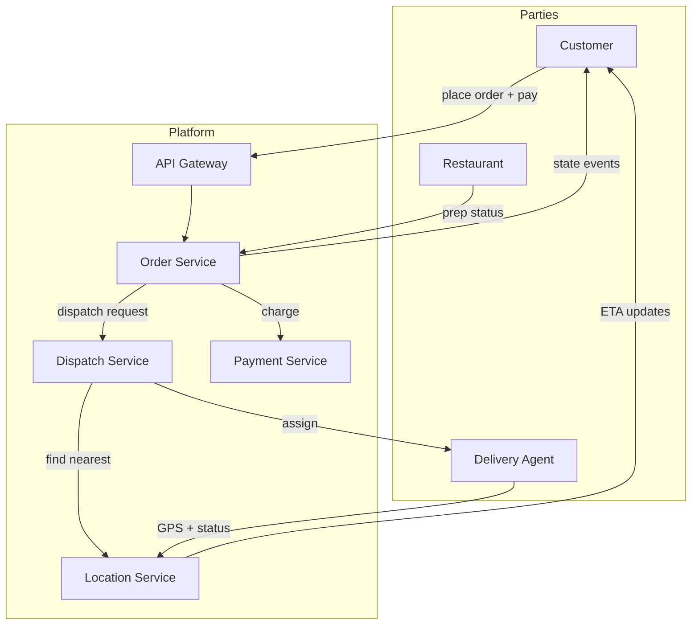

*Three-sided marketplace topology: the customer places and pays for the order, the Order Service coordinates the lifecycle, the Dispatch Service finds the nearest available agent via the Location Service, the restaurant updates preparation status, and the agent streams GPS position back for real-time tracking. All three parties stay synchronized through the platform's event-driven core.*

---

### Characteristics

| Characteristic | What it means | Why it matters | How it works |
|---|---|---|---|
| **Multi-sided marketplace** | Platform connects customers, restaurants, delivery agents | Each side has different needs and economics | Separate apps/interfaces; commission-based pricing |
| **Geospatial coordination** | Delivery agents move in physical space | Proximity and routing determine efficiency | GPS tracking; nearest-neighbor assignment; route optimization |
| **Real-time state** | Order status changes in real-time | All parties need current status | WebSocket/gRPC streaming; state machines |
| **Dynamic pricing** | Prices fluctuate based on demand | Balances supply and demand | Surge multiplier based on demand/supply ratio |
| **Time-critical** | Food gets cold; delivery must be timely | Customer satisfaction depends on speed | ETA prediction; dynamic agent assignment |
| **Payment split** | Multiple parties need payment settlement | Complex financial reconciliation | Payment gateway + wallet + split settlement |
| **Three-party consensus** | Order requires agreement of customer, restaurant, agent | A single party declining/cancelling affects the whole flow | Idempotency + compensating transactions |
| **Geofencing** | Operations bound to geographic zones | Enables zone-level supply/demand management | GeoJSON polygons; point-in-polygon tests; Redis GEO |

### Pros

* **Network effects**: Platform value increases super-linearly with each new restaurant, customer, and delivery agent.
* **Real-time tracking**: GPS tracking provides transparency — customers know exactly where their food is and when it arrives.
* **Dynamic pricing**: Surge pricing ensures delivery availability during high-demand periods (rain, lunch/dinner rush).
* **Multi-payment options**: Credit cards, digital wallets, UPI, cash-on-delivery.
* **Flexible gig work**: Delivery agents can work whenever and wherever they want.
* **Data-driven dispatch**: Historical and real-time signals (distance, acceptance rate, ETA accuracy) enable near-optimal agent selection.
* **Batch delivery**: One agent can pick up multiple orders from the same restaurant, improving throughput during peaks.
* **Cold-chain enablement**: Temperature-aware routing and packaging options for perishable and pharmacy deliveries.

### Cons

* **High customer acquisition cost**: Competing on delivery fees and discounts erodes margins.
* **Delivery agent churn**: High turnover; competition for agents during peak hours.
* **Food quality degradation**: Food gets cold during transit; the platform has limited control over restaurant quality.
* **Traffic and logistics complexity**: Urban traffic, parking, and building security delays delivery.
* **Regulatory uncertainty**: Labor classification of gig workers varies by jurisdiction.
* **Weather dependency**: Rain or extreme weather reduces supply of delivery agents.
* **Supply-demand imbalance**: Incentive payouts and surge pricing can turn unit economics negative during sustained demand spikes.
* **Trust and safety overhead**: Fraud detection, fake accounts, and disputed COD orders require ongoing investment.

### Use Cases

#### Lunch Rush Dispatch Optimization

* **Problem**: 5–10x order volume during lunch (12–2 PM); not enough delivery agents.
* **Solution**: Pre-position agents in high-demand zones; increase delivery fees (surge); batch nearby orders for the same agent; extend prep time ETAs to spread restaurant load.
* **Why suitable**: Food delivery is inherently time-sensitive; surge pricing balances supply and demand.
* **How it works**: Demand prediction model forecasts lunch rush demand per zone → pre-position agents via shift scheduling → surge multiplier increases 2–5x → batched delivery (one agent picks up multiple orders from the same restaurant).
* **Trade-offs**: Higher fees may reduce order volume; batching increases some customers' wait time.

#### Rainy Weather Surge Management

* **Problem**: Rain reduces delivery agent supply (agents don't want to ride bikes in rain) while demand stays high.
* **Solution**: Surge pricing (3–5x delivery fees); incentives for agents who work during rain; ETA extensions to manage expectations; umbrella/rain gear provision.
* **Why suitable**: Dynamic pricing is the core mechanism to balance supply and demand.
* **How it works**: Weather API detects rain → supply prediction model estimates agent availability drop → surge multiplier auto-increases → agents see higher payouts per delivery → more agents come online → system stabilizes.
* **Trade-offs**: Customer dissatisfaction with higher fees; platform takes a larger revenue cut from restaurants during surge.

#### Cash-on-Delivery Risk Management

* **Problem**: Cash-on-delivery orders risk non-payment (customer refuses to pay, agent pockets cash).
* **Solution**: Limit COD orders per customer based on payment history; require partial pre-authorization; track agent COD performance (success rate); blacklist high-risk customers/agents.
* **Why suitable**: COD is essential in markets where digital payment adoption is low.
* **How it works**: Customer places COD order → system checks historical on-time payment rate → if < 80%, require 20% pre-payment via app → agent picks up order with cash → upon delivery, customer pays in cash → system reconciles.
* **Trade-offs**: Friction for legitimate customers; need trust scoring model.

### Components

| Component | Purpose | Responsibilities | Relationship | Real-world Example |
|---|---|---|---|---|
| **Customer App** | Place orders | Browse restaurants, select items, pay, track delivery | Calls Order Service, Payment Service | Zomato/Swiggy app |
| **Restaurant App** | Manage orders | View incoming orders, update status (preparing, ready) | Calls Order Service | Restaurant tablet app |
| **Delivery Agent App** | Fulfill deliveries | View assigned orders, navigate, update status | Calls Dispatch Service, Location Service | Swiggy Genie app |
| **Order Service** | Manage order lifecycle | State machine, order creation, status transitions | Calls Payment, Dispatch, Restaurant services | Backend order service |
| **Dispatch Service** | Assign orders to agents | Find nearest available agent, assign order | Calls Location Service, Agent Service | Real-time dispatch engine |
| **Location Service** | Track agent positions | Real-time GPS tracking, ETA calculation | Consumes GPS from Agent App; calls Maps Service | Google Maps + Redis |
| **Maps/Routing** | Navigation and ETAs | Route optimization, travel time estimation | External API (Google Maps, OSRM) | Google Maps API |
| **Payment Service** | Handle payments | Split payments, refunds, wallet management | Integrates with PSPs (Stripe, Razorpay) | Stripe/Razorpay |
| **Pricing Service** | Dynamic pricing | Surge calculation, delivery fee, commission | Consumes demand/supply signals | Surge pricing engine |
| **Notification Service** | Send alerts | SMS, push, in-app notifications | Listens to order events | FCM/APNs/SMS provider |
| **Restaurant Service** | Manage restaurant partners | Onboarding, menu management, availability windows | Calls Order Service | Partner portal |
| **Agent Service** | Manage delivery agents | Agent profiles, availability, earnings, ratings | Calls Dispatch Service | Agent portal |
| **Rating Service** | Collect and display feedback | Customer-agent, customer-restaurant, restaurant quality | Listens to order_completed events | Review system |

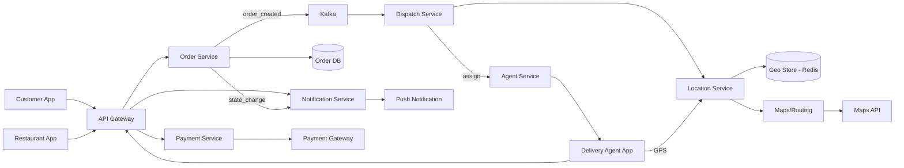

*Component interaction flow: all three client apps (Customer, Restaurant, Delivery Agent) route through the API Gateway to backend microservices. The Order Service persists order state and publishes events to Kafka, which the Dispatch Service consumes to find the nearest agent via the Location Service (backed by a Redis GEO store and external Maps API). The Notification Service fans out state changes to the relevant clients via push gateways.*

#### Component Interactions

1. **Order placement**: Customer App → Order Service (create order) → Payment Service (charge) → Dispatch Service (assign agent) → Restaurant App (order notification).
2. **Delivery**: Dispatch Service → Location Service (find nearest agent) → Agent App (new order notification) → Location Service tracks progress → ETA updates to Customer App.
3. **State updates**: Any state change (order confirmed, picked up, delivered) → Notification Service → push to relevant apps.

### Architectural Patterns

#### Real-Time Location Tracking with Geospatial Indexing

* **What**: Track delivery agents' GPS positions in real-time and find the nearest available agent to a restaurant/order location.
* **Problem solved**: Efficiently matching orders to nearby agents without scanning all agents.
* **How it works**: Agent App sends GPS coordinates every 10 seconds → Location Service stores in Redis with GEO commands → Dispatch Service queries `GEOSEARCH` with radius (e.g., 5 km) around the restaurant → returns nearest N available agents.
* **When to use**: When real-time location-based matching is needed.
* **When not to use**: When agents don't move (static assignment) — over-engineering.
* **Advantages**: O(log N) nearest-neighbor queries; real-time position updates.
* **Disadvantages**: GPS accuracy issues; network latency in position updates; Redis GEO memory overhead.
* **Java/Spring Boot example**:

```java
@Service
public class DispatchService {
    private final RedisGeoCommands<String, String, Double> geoOps;

    public String assignNearestAgent(String restaurantLat, String restaurantLng, String orderId) {
        // Find available agents within 5km
        List<RedisGeoCommands.GeoRadiusResponse> nearby =
            geoOps.geoRadius("available_agents", restaurantLat, restaurantLng, 5.0, Metric.KILOMETERS);

        if (nearby.isEmpty()) return null;

        // Pick closest available agent
        String agentId = nearby.get(0).getMemberName();
        assignOrder(agentId, orderId);
        return agentId;
    }
}
```

* **Real-world example**: Uber's dispatch system, Swiggy's real-time agent tracking.

#### Order State Machine

* **What**: Each order progresses through a well-defined state machine with explicit states and allowed transitions.
* **Problem solved**: Preventing invalid state transitions (can't deliver before picking up) and ensuring all parties are notified of state changes.
* **How it works**: Order Service maintains order state (PLACED → CONFIRMED → PREPARING → READY → PICKED_UP → DELIVERING → DELIVERED → COMPLETED). Each transition triggers events (notifications, payment capture, agent assignment).
* **When to use**: When order lifecycle has clear states and transitions.
* **When not to use**: Simple linear workflows without branching.
* **Advantages**: Prevents invalid operations; provides clear audit trail; enables proper notification routing.
* **Disadvantages**: State machine complexity; need to handle all transition edge cases.
* **Real-world example**: Swiggy/Zomato order status tracking.

#### Event-Driven Dispatch (Decoupled Order Creation)

* **What**: Order creation publishes an event that is consumed asynchronously by the Dispatch Service, Payment Service, and Notification Service.
* **Problem solved**: Keeps the customer-facing order API fast (< 50 ms) while expensive operations (agent matching, payment capture) happen asynchronously.
* **How it works**: Order Service persists the order and publishes `order_created` to Kafka → multiple consumer groups (Dispatch, Payment, Notification) process independently → each service performs its work and publishes its own events.
* **When to use**: When fan-out of a single business action to multiple independent services is needed.
* **When not to use**: When immediate synchronous confirmation is required (e.g., order must be confirmed before showing a result).
* **Advantages**: Loose coupling; independent scaling; fault isolation; retry via DLQ.
* **Disadvantages**: Eventual consistency; harder to debug across service boundaries.

#### Idempotency Key Pattern

* **What**: Every order creation request carries an idempotency key so retries do not create duplicate orders.
* **Problem solved**: Mobile clients retry on network timeouts; the system must recognize duplicate requests and return the same result.
* **How it works**: The client sends `Idempotency-Key` header → Order Service stores the key + result in a cache keyed by the identifier → on repeat request, returns the cached result without re-executing.
* **When to use**: Any non-idempotent write exposed to unreliable networks.
* **When not to use**: Idempotent operations (GET, PUT to a known resource).
* **Pros**: Safe client retries; no duplicate orders.
* **Cons**: Extra storage and cache invalidation complexity.

### Benefits

* **Increased restaurant revenue**: Access to customers beyond walk-in traffic; restaurants can increase utilization during off-peak hours.
* **Customer convenience**: Order food without leaving home; track delivery in real-time; multiple payment options.
* **Delivery agent income**: Gig workers earn flexible income with low barrier to entry.
* **Marketplace network effects**: More restaurants attract more customers; more customers attract more agents and restaurants.
* **Data insights**: Demand patterns, popular cuisines, delivery hot zones — valuable for restaurants, agents, and the platform.
* **Dynamic pricing**: Balances supply and demand, ensuring availability during peaks while maintaining profitability.

### Challenges

#### Technical Challenges

* **Real-time dispatch**: Matching orders to agents within seconds; the agent list changes rapidly (agents accept/decline).
* **ETA accuracy**: Predicting delivery time requires factoring restaurant prep time, traffic, weather, agent availability — all dynamic.
* **GPS accuracy**: Urban canyons and tunnels cause GPS inaccuracies; the system must handle position jumps.
* **Payment orchestration**: Split payments across multiple parties (restaurant, platform, agent, tip); handle failures and refunds.
* **Multi-party state synchronization**: The customer, restaurant, and agent must converge on order state despite operating on disconnected devices with intermittent connectivity.
* **Geospatial indexing at scale**: Finding the nearest agent across millions of concurrent location updates requires specialized data structures (Redis GEO, Geohashes) and careful memory management.

#### Scalability Challenges

* **Peak hour demand**: Lunch/dinner rush creates 5–10x normal order volume. The system must scale agents (incentives) and infrastructure simultaneously.
* **Geographic expansion**: Each new city requires mapping restaurants, recruiting agents, and tuning pricing/dispatch algorithms.
* **Concurrent order management**: Millions of orders per day, each with a state machine and real-time location tracking.
* **Agent pool fragmentation**: Agents drift between zones; supply must be dynamically rebalanced to match demand surges without over-supplying quiet zones.

#### Performance Challenges

* **Dispatch latency**: From order placement to agent assignment should be < 30 seconds.
* **Location update frequency**: Agent positions update every 10 seconds; the system must process millions of GPS updates per minute.
* **ETA accuracy**: Target 80% of deliveries within the promised ETA window.
* **Cold start for new zones**: New cities lack historical data for ETA and demand forecasting, requiring fallback heuristics until enough signal accumulates.

#### Reliability Challenges

* **Agent no-shows**: Assigned agents may not pick up orders — need backup assignment and customer notification.
* **Payment failures**: Card declines, wallet issues — need fallback payment methods and graceful degradation.
* **Restaurant stockouts**: Items ordered may be sold out — need real-time menu sync and customer substitution options.
* **Network partitions in the field**: Delivery agents frequently lose connectivity in tunnels or basements; the system must operate offline-first and reconcile later.

#### Maintainability Challenges

* **City-specific tuning**: Dispatch algorithms, pricing, and ETAs must be tuned per city (different traffic patterns, restaurant types).
* **Fraud detection**: Fake orders, payment fraud, agent fraud (fake deliveries).
* **Rate limiting**: Restaurant partners and agents must not be overwhelmed by too many orders.
* **Versioned dispatch algorithms**: Rolling out a new matching algorithm must be gradual (canary per zone) with rollback on regression.

#### Operational Challenges

* **Supply-demand imbalance**: During rain or peak hours, demand surges but supply (agents) may not. Need dynamic incentives.
* **Quality control**: Monitoring restaurant ratings, agent ratings, and customer complaints.
* **Customer support**: Handling order issues, missing items, late deliveries, refund requests.
* **Fleet management**: Shift scheduling, incentive payouts, and agent onboarding at city scale.

#### Security Concerns

* **Payment security**: PCI-DSS compliance; secure storage of payment tokens.
* **Location privacy**: Agent and customer locations are sensitive — minimize data retention.
* **Account takeover**: Fraudulent account access for free orders.
* **Data accuracy**: Manipulating ratings/reviews to game the system.
* **Partner API abuse**: Restaurant and agent integrations must be rate-limited and authenticated to prevent scraping or order flooding.

### Best Practices

* **Idempotent order creation**: Use an idempotency key (order_id) so retries don't create duplicate orders.
* **Optimistic dispatch**: Assign an order to an agent immediately (optimistically), then let the agent accept or decline. Reduces wait time vs. finding the "perfect" agent.
* **Batch location updates**: Don't process every GPS ping individually — batch updates and use smoothing algorithms to reduce noise.
* **ETA with confidence intervals**: Provide a range (25–35 min) rather than a single number; adjust based on historical accuracy.
* **Graceful degradation**: If real-time tracking is down, show "order confirmed" and poll; if payment split fails, fall back to single-charge + manual reconciliation.
* **Dynamic incentives**: Increase delivery fees and agent bonuses when supply drops below demand threshold (e.g., < 10 agents per 10 sq km).
* **Multi-CDN for maps**: Use multiple maps providers (Google Maps, Mapbox, OSRM) for redundancy and cost optimization.
* **Circuit breakers on dispatch**: If the Location Service is degraded, fall back to last-known positions and extend assignment timeouts rather than failing the order.
* **Compensating transactions**: For failed payment captures, schedule automatic retries with exponential backoff and escalate to manual reconciliation if persistent.
* **Dead-letter queues for events**: Poison messages (malformed order events) are routed to a DLQ for inspection rather than blocking the dispatch pipeline.

### When to Use / When Not to Use

**Use when:**

* When connecting supply (delivery agents) with demand (customers) in real-time is core to the business.
* When geographic proximity and routing matter (last-mile delivery).
* When multi-party payment settlement is needed.
* When real-time location tracking is a key feature.
* When demand is variable (need dynamic pricing/supply management).
* When three independent parties (customer, restaurant, agent) must collaborate asynchronously.

**Not appropriate:**

* When delivery is not needed (pickup-only model).
* When the geographic area is very small (single building/campus) — simpler solutions exist.
* When delivery agents are employees (fixed schedule) — dynamic dispatch isn't needed.
* When demand is predictable and flat (no surge pricing needed).
* When the restaurant and customer are in the same facility (hospital, office complex) — intra-campus logistics differ from city-wide delivery.

**Alternatives:**

* **Pickup-only**: Customers pick up from the restaurant (no delivery fleet needed).
* **Scheduled delivery**: Pre-scheduled deliveries (not real-time dispatch).
* **Third-party logistics**: Use existing logistics platforms (FedEx, UPS) for delivery.
* **In-house fleet**: The restaurant employs its own drivers (common for pizza chains).
* **Locker/gateways**: Customers pick up from automated lockers or pickup points.

**Decision factors:**

* **Agent density**: Higher agent density → faster dispatch, lower delivery fees.
* **Order volume**: Higher volume → need more sophisticated dispatch algorithms and bigger agent recruitment.
* **Geographic density**: Dense urban areas → easier dispatch; rural areas → harder.
* **Customer expectations**: Real-time tracking vs. scheduled delivery.
* **Restaurant integration**: API integration vs. tablet-based order management.
* **Labor regulations**: Markets where gig-worker classification is restricted may require contracted logistics partners instead of a self-employed fleet.

### Data Model and API

The data model captures the entities that drive a food delivery marketplace: the customers who order, the restaurants and their menus, the delivery agents who fulfill orders, the orders themselves with their state transitions, and the payments that settle money across all parties. Orders are the transactional core; menus, agents, and customers are reference data with their own lifecycles.

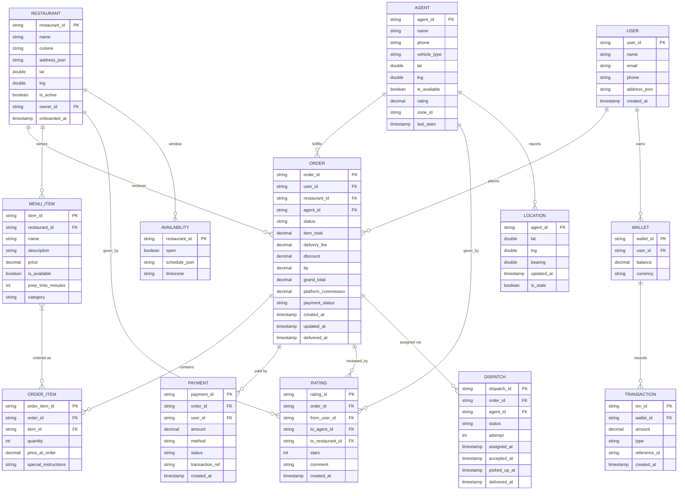

*Entity-relationship model of the food delivery domain: a `USER` places `ORDER`s that reference a `RESTAURANT` (which owns `MENU_ITEM`s and an `AVAILABILITY` schedule); an `AGENT` (with a live `LOCATION`) fulfills the `ORDER`; `ORDER_ITEM`s capture per-item pricing at order time; `PAYMENT` settles the charge; `DISPATCH` records the assignment attempt history; `RATING`s capture feedback across the three parties; `WALLET` and `TRANSACTION` model the in-platform ledger for credits, cashback, and agent payouts.*

**Entity descriptions:**

- **USER:** The customer. `user_id` (UUID for even distribution across shards), `name`, `email`, `phone`, `address_json` (structured delivery addresses). Stored in PostgreSQL with hot profile data cached in Redis.
- **RESTAURANT:** The food partner. `lat`/`lng` for geospatial matching, `is_active` for availability gating, `owner_id` for the restaurant admin. Menu and availability are separate entities.
- **MENU_ITEM:** A restaurant's offering. `price_at_order` semantics — order items snapshot the price so a menu change after ordering doesn't alter an in-flight order. `prep_time_minutes` feeds ETA calculation.
- **AGENT:** The delivery partner. `lat`/`lng` and `last_seen` (real-time position), `is_available` (on/off duty), `zone_id` (geographic scheduling bucket), `rating`.
- **ORDER:** The transactional centerpiece. Stores all monetary fields (`item_total`, `delivery_fee`, `discount`, `tip`, `grand_total`, `platform_commission`) and the `status` state machine. `status` is indexed for fast polling.
- **DISPATCH:** Tracks the assignment attempt history — which agent was offered the order, when, and whether they accepted. This supports retry logic and analytics.
- **LOCATION:** The agent's most recent GPS position, updated every 8–10 seconds. `is_stale` flag for positions older than a threshold.
- **WALLET / TRANSACTION:** The internal ledger for credits, cashback, refunds, and agent payouts — separate from the external payment gateway for sub-second balance queries.

**Indexes and Constraints:**

- `USER.email` — UNIQUE index (login, password reset).
- `USER.phone` — UNIQUE index (SMS verification, COD validation).
- `RESTAURANT(lat, lng)` — composite index for nearby-restaurant search.
- `ORDER(status, created_at)` — composite index for dispatch queue polling (find all `READY` or `PLACED` orders awaiting assignment).
- `ORDER(user_id, created_at DESC)` — index for "customer's order history."
- `ORDER(restaurant_id, created_at)` — index for restaurant's incoming order feed.
- `ORDER(agent_id, status)` — index for "agent's active orders" in the driver app.
- `MENU_ITEM(restaurant_id, is_available)` — index for restaurant menu browsing.
- `LOCATION(zone_id, is_available)` — index for zone-level agent availability.
- `PAYMENT(order_id)` — index for payment reconciliation.
- `DISPATCH(order_id, status)` — index for "in-flight assignment" queries.

**Partitioning / Sharding:**

- **ORDER:** Sharded by `order_id` hash (consistent hashing) for even write distribution. Within each shard, orders are clustered by `created_at` since dispatch and history queries are time-ordered.
- **ORDER_ITEM:** Co-located with parent ORDER (same shard key) for transactional consistency on inserts.
- **USER:** Sharded by `user_id` hash. Cross-shard joins are avoided by embedding denormalized `user_id` in order records.
- **RESTAURANT:** Sharded by `restaurant_id` hash; geo-indexed separately in the Location Service.
- **AGENT / LOCATION:** Sharded by `zone_id` (geographic). Each zone's agents live on one shard, co-located with the dispatch workers that serve that zone.
- **PAYMENT:** Sharded by `order_id` (co-located with ORDER) plus a secondary index on `user_id` for customer payment history.

**API Contract:**

| Method | Endpoint | Purpose | Rate Limit |
|---|---|---|---|
| POST | `/api/v1/orders` | Create an order | 10/min per user |
| GET | `/api/v1/orders/{id}` | Get order status & timeline | 60/min |
| POST | `/api/v1/orders/{id}/cancel` | Cancel an order | 5/min |
| GET | `/api/v1/restaurants` | Browse restaurants near a location | 120/min |
| GET | `/api/v1/restaurants/{id}/menu` | View a restaurant's menu | 120/min |
| POST | `/api/v1/payments` | Initiate a payment | 10/min |
| GET | `/api/v1/agents/{id}/location` | Get agent real-time location | 5/min |
| POST | `/api/v1/dispatch/assign` | Assign an order to an agent | internal |
| POST | `/api/v1/webhooks/payment` | Payment gateway webhook | IP-restricted |

**POST /api/v1/orders — Request:**

```http
POST /api/v1/orders HTTP/1.1
Authorization: Bearer <jwt>
Idempotency-Key: order_req_abc123
Content-Type: application/json

{
  "restaurant_id": "rest_789",
  "items": [
    {"item_id": "item_001", "quantity": 2, "special_instructions": "Extra spicy"},
    {"item_id": "item_002", "quantity": 1}
  ],
  "delivery_address": {"lat": 12.9716, "lng": 77.5946, "label": "Home"},
  "tip_amount": 40.00,
  "payment_method": "CARD",
  "coupon_code": "FESTIVAL10"
}
```

**POST /api/v1/orders — Response:**

```json
{
  "order_id": "ord_123456",
  "status": "PLACED",
  "estimated_delivery_time": "2024-06-14T13:45:00Z",
  "eta_range": "30-40 min",
  "charges": {
    "item_total": 420.00,
    "delivery_fee": 45.00,
    "discount": 10.00,
    "tip": 40.00,
    "platform_fee": 5.00,
    "grand_total": 460.00
  },
  "payment_status": "CHARGED",
  "agent": null
}
```

**GET /api/v1/orders/{id} — Response:**

```json
{
  "order_id": "ord_123456",
  "status": "DELIVERING",
  "timeline": [
    {"status": "PLACED", "at": "2024-06-14T13:10:00Z"},
    {"status": "CONFIRMED", "at": "2024-06-14T13:10:05Z"},
    {"status": "PREPARING", "at": "2024-06-14T13:12:00Z"},
    {"status": "READY", "at": "2024-06-14T13:25:00Z"},
    {"status": "PICKED_UP", "at": "2024-06-14T13:28:00Z"},
    {"status": "DELIVERING", "at": "2024-06-14T13:30:00Z"}
  ],
  "agent": {"name": "Ramesh", "rating": 4.8, "vehicle": "bike", "lat": 12.9718, "lng": 77.5910},
  "eta": "35 min",
  "eta_range": "30-40 min"
}
```

**Real-Time WebSocket API:**

| Event | Direction | Payload |
|---|---|---|
| `subscribe` | Client → Server | `{"type": "subscribe", "channels": ["order:ord_123456"]}` |
| `order_status` | Server → Client | `{"type": "order_status", "order_id": "ord_123456", "status": "PICKED_UP", "at": "..."}` |
| `agent_location` | Server → Client | `{"type": "agent_location", "lat": 12.9718, "lng": 77.5910, "eta": "35 min"}` |
| `eta_update` | Server → Client | `{"type": "eta_update", "eta": "32 min", "eta_range": "28-36 min"}` |

**Status codes:** `200` OK, `201` Created, `204` Deleted, `400` Invalid request, `401` Auth required, `403` Forbidden, `404` Not found, `409` Conflict (order cannot transition / duplicate), `422` Unprocessable entity (restaurant closed / item unavailable), `429` Rate limited, `503` Temporarily unavailable.

**Spring Boot entity for Order:**

```java
@Entity
@Table(name = "orders", indexes = {
        @Index(name = "idx_order_status_created", columnList = "status, createdAt"),
        @Index(name = "idx_order_user_created", columnList = "userId, createdAt DESC"),
        @Index(name = "idx_order_restaurant", columnList = "restaurantId, createdAt"),
        @Index(name = "idx_order_agent_status", columnList = "agentId, status")
})
public class Order {

    @Id
    private String orderId;

    private String userId;
    private String restaurantId;
    private String agentId;

    @Enumerated(EnumType.STRING)
    private OrderStatus status;

    @Column(precision = 10, scale = 2)
    private BigDecimal itemTotal;
    @Column(precision = 10, scale = 2)
    private BigDecimal deliveryFee;
    @Column(precision = 10, scale = 2)
    private BigDecimal discount;
    @Column(precision = 10, scale = 2)
    private BigDecimal tip;
    @Column(precision = 10, scale = 2)
    private BigDecimal grandTotal;
    @Column(precision = 10, scale = 2)
    private BigDecimal platformCommission;

    @Enumerated(EnumType.STRING)
    private PaymentStatus paymentStatus;

    private Instant createdAt;
    private Instant updatedAt;
    private Instant deliveredAt;

    @OneToMany(cascade = CascadeType.ALL, orphanRemoval = true, mappedBy = "order")
    private List<OrderItem> items = new ArrayList<>();

    @Version
    private Long version; // optimistic locking for concurrent status updates
}
```

*The `Order` entity maps to the `orders` table with composite indexes optimized for the dispatch queue poll (`status, createdAt`), customer history (`userId, createdAt DESC`), and the agent's in-progress view (`agentId, status`). Monetary fields use `BigDecimal` with `precision=10, scale=2` to avoid floating-point rounding errors in settlement. The `@Version` field provides optimistic locking so concurrent status transitions (e.g., customer cancelling while the agent marks picked-up) don't silently overwrite each other.*

### Food Delivery Deep Dive

This section covers the core domain-specific challenges that are unique to food-delivery platforms: the multi-party order lifecycle and its state machine, restaurant onboarding and availability management, the delivery dispatch engine that matches orders to agents, real-time GPS tracking and ETA calculation, and the surge-pricing engine that balances supply and demand. These topics are the heart of food-delivery system design.

#### Order Lifecycle

An order in a food delivery system transitions through a well-defined set of states, each reflecting a physical event in the real world. The lifecycle spans three independent actors — the customer (places and pays), the restaurant (prepares), and the delivery agent (picks up and delivers) — and must synchronize their actions even when devices are offline or slow.

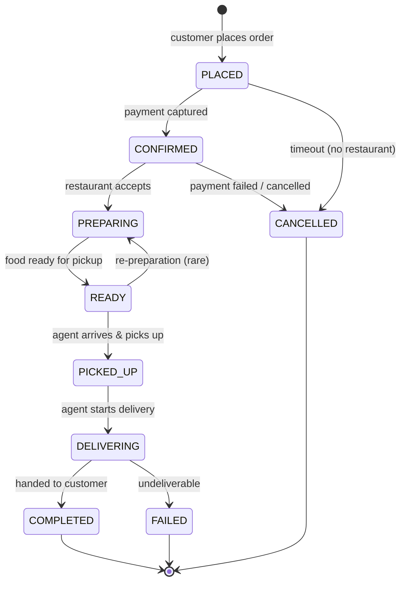

*The order state machine: `PLACED` (order created, payment pending) → `CONFIRMED` (payment captured) → `PREPARING` (restaurant cooking) → `READY` (food ready for pickup) → `PICKED_UP` (agent collected) → `DELIVERING` (agent en route to customer) → `COMPLETED` (handed over). Cancellation and failure branches exist at multiple states. Each transition emits an event consumed by the Notification Service.*

**Timeouts and automation:**

- If the restaurant doesn't accept within 90 seconds of `PLACED`, the order auto-cancels and the customer is refunded.
- If the restaurant marks `PREPARING` but doesn't reach `READY` within the promised prep time + 10 minutes, the system escalates to the restaurant's manager and offers the customer a discount or reassignment.
- If an agent is `READY` for pickup but doesn't reach the restaurant within 15 minutes, the Dispatch Service re-assigns the order to the next nearest agent.
- If an agent is `DELIVERING` but doesn't update position for 5 minutes, the system flags the order for a safety review (possible theft or crash).

#### Restaurant Onboarding

Restaurant onboarding is the process of bringing a new food partner onto the platform — collecting their menu, setting up payment settlement, verifying their credentials, and enabling order flow. It's a heavyweight workflow because the platform must ensure the restaurant can fulfill orders before exposing them to customers.

```mermaid
flowchart LR
    App[Restaurant Owner\nApplication] --> Verify[Document Verification\n(license, tax, FSSAI)]
    Verify --> Menu[Menu Ingestion\n(manual upload or API/POS)]
    Menu --> Pricing[Pricing & Commission Setup]
    Pricing --> Pay[Payment Settlement Setup\n(bank account, UPI)]
    Pay --> Test[Test Order Flow\ninternal simulation]
    Test --> Live[Go Live!\nAccepts real orders]
    Live --> Oper[Operations\nOrder Management]
```

*Restaurant onboarding flow: the restaurant owner submits an application, documents are verified (food license, GST registration), the menu is ingested (manual upload or POS API integration), pricing and commission are configured, payment settlement details are collected, a test order validates the full flow end-to-end, and only then does the restaurant go live to accept real customer orders.*

**Onboarding sub-steps:**

1. **Document verification**: Validate food safety license, GST registration, bank account, and optionally a background check on the owner. Use OCR + human review for license authenticity.
2. **Menu ingestion**: Either manual upload via the partner portal (Excel template) or automated sync from a POS system (via webhooks). Normalize item names, prices, and categories; detect duplicates.
3. **Pricing & commission**: Set the restaurant's commission rate (typically 15–30%), tax passthrough (GST handled by the restaurant), and any promotional overrides.
4. **Payment settlement**: Collect bank account details or UPI VPA for weekly settlement. Integrate with a payment facilitator (Razorpay, Stripe Connect) to push payouts.
5. **Test order**: Simulate a full order lifecycle without charging the customer — verify menu accuracy, prep-time estimates, and the restaurant's ability to update statuses on the tablet.
6. **Go live**: Enable the restaurant in the customer-facing catalog, with a "new partner" badge for early promotion.

#### Delivery Dispatch

The Dispatch Service must assign orders to agents within seconds. The algorithm balances proximity, agent load, acceptance history, and ETA accuracy.

```mermaid
flowchart TD
    OrderPlaced[Order Placed] --> FindAgents[Query Location Service:\nRedis GEOSEARCH within radius]
    FindAgents --> ScoreAgents[Score & Sort Candidates\n(distance, load, acceptance rate)]
    ScoreAgents --> SendPush[Push to Top-N Agents\nwith 60s acceptance window]
    SendPush --> CheckAccept{Agent Accepted?}
    CheckAccept -- Yes --> Assign[Mark Assigned → PICKED_UP flow]
    CheckAccept -- No / Timeout --> Next[Try Next Candidate]
    Next --> More{More Candidates?}
    More -- Yes --> SendPush
    More -- No --> Expand[Expand Search Radius\n+ Incentive Boost]
    Expand --> FindAgents
```

*Delivery dispatch loop: when an order is placed, the Dispatch Service queries the Location Service for available agents within a radius; it scores and sorts candidates by a composite of distance, current load, and acceptance rate; it pushes the assignment to the top-N agents with a 60-second acceptance window; if no agent accepts, the radius expands and an incentive boost is applied to attract nearby agents.*

**Internal Implementation: Real-Time Dispatch**

The Dispatch Service must assign orders to agents within seconds. The algorithm:

1. **Candidate selection**: Query Redis GEO for all available agents within radius R (e.g., 5 km) of the restaurant. Use `GEOSEARCH key longitude latitude RADIUS unit`.
2. **Scoring**: For each candidate, compute a score based on:
   * Distance to restaurant (shorter = better)
   * Agent's current load (fewer active orders = better)
   * Agent's acceptance rate (higher = better — don't send to agents who reject often)
   * Historical ETA accuracy (agents who deliver on time get higher priority)
3. **Optimization**: Pick the agent with the highest score. If no agent is within radius, gradually expand the search radius.
4. **Assignment**: Send push notification to the agent; the agent has 60 seconds to accept. If declined or timed out, try the next agent.

```java
@Service
public class DispatchService {
    private final LocationService locationService;
    private final AgentService agentService;
    private final NotificationService notificationService;

    @Transactional
    public AssignmentResult assignOrder(String orderId, String restaurantId,
                                         double restLat, double restLng) {
        double radiusKm = 5.0;
        List<Agent> candidates = locationService.findNearbyAvailableAgents(restLat, restLng, radiusKm);

        if (candidates.isEmpty()) {
            // Dynamically expand radius up to 15km and apply incentive
            candidates = locationService.findNearbyAvailableAgents(restLat, restLng, 15.0);
            if (candidates.isEmpty()) {
                return AssignmentResult.noAgents();
            }
        }

        // 2. Score each candidate
        candidates.sort((a, b) -> Double.compare(
                scoreAgent(b, restLat, restLng),
                scoreAgent(a, restLat, restLng)
        ));

        // 3. Try assignment (with timeout handling) — top 3 candidates
        for (int i = 0; i < Math.min(3, candidates.size()); i++) {
            Agent agent = candidates.get(i);
            if (notificationService.sendAssignment(agent.getId(), orderId, 60)) {
                agentService.assignOrder(agent.getId(), orderId);
                double eta = calculateEta(restLat, restLng, agent.getLat(), agent.getLng());
                return AssignmentResult.assigned(agent.getId(), (int) eta);
            }
            // Agent declined or timed out — try next
        }

        return AssignmentResult.noAgents();
    }

    private double scoreAgent(Agent agent, double restLat, double restLng) {
        double distance = haversineDistance(agent.getLat(), agent.getLng(), restLat, restLng);
        double score = 1.0 / (distance + 1.0); // closer = higher score
        score *= agent.getAcceptanceRate() / 100.0;            // penalize rejecters
        score *= (agent.getActiveOrders() < 3) ? 1.0 : 0.1;   // penalize overloaded
        score *= agent.isOnlineRecent() ? 1.0 : 0.5;          // stale agents deprioritized
        return score;
    }

    private double calculateEta(double restLat, double restLng, double agentLat, double agentLng) {
        // travel time agent → restaurant + average prep + restaurant → customer
        double agentTravelMin = haversineDistance(restLat, restLng, agentLat, agentLng) / 25.0 * 60;
        double avgPrepMin = 12.0;
        double customerTravelMin = haversineDistance(restLat, restLng, /*cust*/ restLat, restLng) / 25.0 * 60;
        return agentTravelMin + avgPrepMin + customerTravelMin + 5.0; // 5min buffer
    }
}
```

*Enhanced `DispatchService`: it first searches for agents within 5 km, expanding to 15 km if none are found. Candidates are scored by a composite of proximity (closer is better), acceptance rate (rejecters penalized), current load (overloaded agents deprioritized), and recency (`isOnlineRecent()`). The top 3 candidates receive push notifications in sequence with a 60-second acceptance window. ETA is estimated as agent travel time + average prep time + delivery travel time + buffer.*

#### GPS Tracking

Real-time location tracking keeps the customer informed of the agent's position and ETA. The Location Service ingests GPS pings, deduplicates and smooths them, computes ETAs via the Maps Service, and streams updates to clients.

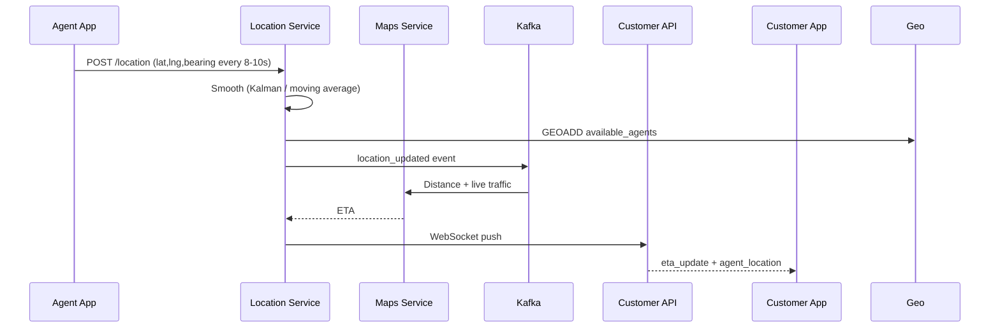

*GPS tracking pipeline: the Agent App sends a GPS ping every 8–10 seconds to the Location Service; the service smooths the coordinate (Kalman filter or moving average to reduce jitter), writes to Redis GEO (`GEOADD`) for dispatch queries, publishes a `location_updated` event to Kafka; the Maps Service consumes the event, calls the Distance Matrix API for live-traffic ETAs, and the Location Service streams ETA + position updates to the Customer App over WebSocket.*

**ETA Calculation**

ETA = restaurant_prep_time + travel_time + buffer

* **restaurant_prep_time**: Estimated from historical data for this restaurant × dish (e.g., "Chicken Biryani" at Restaurant X takes 18 ± 3 minutes) + current order backlog.
* **travel_time**: Computed via Maps API (Google Maps Distance Matrix) using live traffic data. Route from restaurant → agent → customer (pickup + delivery).
* **buffer**: 5–10 minutes for unforeseen delays (traffic, finding parking, building access).

The system recalculates ETA every 30 seconds as the agent moves and new traffic data arrives. A confidence interval (e.g., 25–35 min) is shown to the customer rather than a single number, with the window widening when GPS quality is poor.

#### Payment Orchestration

Modern food delivery uses a **split payment** model:

1. Customer pays: item_cost + delivery_fee + taxes + tip + platform_fee.
2. Settlement: restaurant gets item_cost (minus commission), agent gets delivery_fee + tip, platform keeps commission + delivery_fee margin.
3. For cash-on-delivery: agent collects cash, deposits to platform, platform settles to restaurant after a delay.

```java
@Service
public class PaymentService {
    @Transactional
    public PaymentResult processOrderPayment(Order order) {
        BigDecimal itemCost = order.getItemTotal();
        BigDecimal deliveryFee = pricingService.calculateDeliveryFee(order);
        BigDecimal discount = order.getDiscount();
        BigDecimal tip = order.getTip();
        BigDecimal total = itemCost.add(deliveryFee).add(tip).subtract(discount);

        // Charge customer
        PaymentIntent intent = paymentGateway.charge(
                order.getUserId(),
                total,
                "Food delivery for order " + order.getOrderId());

        if (intent.getStatus() != PaymentStatus.SUCCEEDED) {
            throw new PaymentFailedException(intent.getFailureReason());
        }

        // Record splits for settlement
        paymentLedger.recordSplit(PaymentSplit.builder()
                .orderId(order.getOrderId())
                .recipient(StripeAccount.of(order.getRestaurant().getAccountId()))
                .amount(itemCost.multiply(BigDecimal.valueOf(0.95))) // 5% commission
                .build());
        paymentLedger.recordSplit(PaymentSplit.builder()
                .orderId(order.getOrderId())
                .recipient(Wallet.of(order.getAgentId()))
                .amount(deliveryFee.add(tip))
                .build());

        return PaymentResult.success(intent.getTransactionId());
    }
}
```

#### Surge Pricing Engine

Surge pricing balances supply and demand in real-time:

1. **Demand forecast**: Predicted order volume for each zone for the next 30 minutes (based on historical + real-time signals).
2. **Supply forecast**: Available agents per zone (from Location Service).
3. **Ratio calculation**: demand / supply. If > 1.0, there's a shortage.
4. **Multiplier**: `multiplier = 1 + min(4, (demand/supply - 1) * 0.5)` — capped at 5x.
5. **Incentives**: Higher multiplier → larger agent bonus → more agents come online.

```java
@Service
public class SurgePricingService {
    public BigDecimal calculateSurge(String zoneId) {
        double predictedDemand = demandPredictor.predict(zoneId, Duration.ofMinutes(30));
        int availableSupply = locationService.countAvailableAgents(zoneId, 5.0);

        if (availableSupply == 0) return BigDecimal.valueOf(5.0);

        double ratio = predictedDemand / availableSupply;
        double surge = 1.0 + Math.min(4.0, (ratio - 1.0) * 0.5);
        return BigDecimal.valueOf(surge).setScale(2, RoundingMode.HALF_UP);
    }
}
```

### Architecture

A food delivery system uses a **microservice architecture** with geospatial services, real-time dispatch, and state machines for order management. The system integrates with external maps (Google Maps, OSRM) for routing, external payment processors (Stripe, Razorpay) for payment, and push-notification services (FCM, APNs) for delivery updates. Core services include Order Service (state machine), Dispatch Service (real-time agent assignment), Location Service (GPS tracking), and Payment Service (split payments).

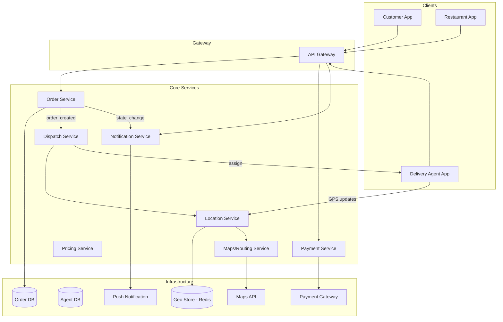

**Architecture Structure**

* **Edge layer**: Mobile apps (Customer, Restaurant, Agent) → API Gateway with auth, rate limiting, geo-routing.
* **Service layer**: Order Service (state machine), Dispatch Service (matching), Location Service (GPS), Payment Service (split payment), Pricing Service (surge), Notification Service (alerts).
* **Data layer**: Order DB (Postgres sharded by order_id), Agent DB (agent profiles + status), Geo Store (Redis GEO for real-time positions), Payment gateway integration.
* **External services**: Maps API (Google Maps/OSRM), Payment gateway (Stripe/Razorpay), Push notifications (FCM/APNs).

**Communication**

* **Synchronous**: Client → API → services (REST/gRPC) for user-facing requests.
* **Asynchronous**: Order Service → Kafka → Dispatch Service (assign agent), → Payment Service (charge), → Notification Service (notify). GPS updates via WebSocket.
* **Streaming**: Location Service streams GPS data via WebSocket to clients for real-time tracking.

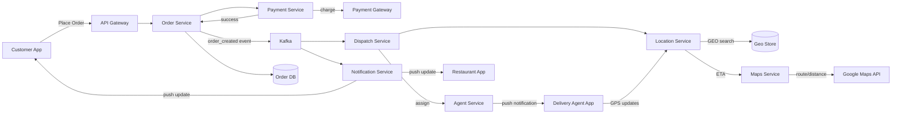

**Order placement flow**:

1. Customer selects items → Checkout → Payment Service charges card/wallet.
2. Payment confirmed → Order Service creates order (PLACED state) → persists to Order DB → publishes `order_created` to Kafka.
3. Kafka → Dispatch Service → queries Location Service for nearest available agent (Redis GEO search within 5 km).
4. Dispatch Service assigns order → Agent Service → push notification to Agent App.
5. Agent accepts → Location Service tracks GPS → ETA computed via Maps API.
6. All state changes → Kafka → Notification Service → push to Customer App, Restaurant App.

**Delivery tracking flow**:

1. Agent App sends GPS every 10 seconds → Location Service (Redis GEO update + ETA recalculation).
2. Location Service → Maps Service → computes route/time → ETA.
3. Location Service → WebSocket → Customer App shows real-time agent position + ETA updates.

```mermaid
flowchart LR
    Subgraph["Data Flow"]
        direction TB
        A[Customer App] -->|1. place order| B[API Gateway]
        B -->|2. create order| C[Order Service]
        C -->|3a. charge| D[Payment Service]
        D -->|3b. success| C
        C -->|4. order_created| E[Kafka]
        E -->|5. dispatch| F[Dispatch Service]
        F -->|6. nearest agent| G[Location Service]
        G -->|7. geo search| H[(Redis Geo Store)]
        F -->|8. assign| I[Agent App]
        I -->|9. GPS ping| G
        G -->|10. ETA request| J[Maps Service]
        J -->|11. route| K[Google Maps API]
        E -->|12. state event| L[Notification Service]
        L -->|13. push| A
        L -->|14. push| M[Restaurant App]
    end
```

**Scaling Strategy**

* **Order Service**: Shard by order_id hash; stateless application servers for horizontal scaling.
* **Dispatch Service**: Parallel agent lookup per order; pre-compute agent availability zones.
* **Location Service**: Redis cluster with GEO commands; shard by city/region.
* **Maps routing**: Cache popular routes; batch ETA requests.

**Failure Handling**

* **Dispatch timeout**: If no agent accepts within 60 seconds, re-dispatch to the next nearest agent.
* **GPS failure**: Use last-known location + dead reckoning (estimate position based on last heading/speed).
* **Payment failure**: Fall back to alternative payment method; offer COD.
* **Restaurant overload**: If a restaurant can't fulfill, reassign order to a nearby restaurant (if configured).

### Replication Strategies

Food delivery data is replicated across multiple dimensions to serve low-latency reads and to survive failures. Unlike social media's global fan-out, food delivery is **regionally-scoped** — each city's orders, agents, and restaurants are managed by a regional cluster, with cross-region replication only for durable, slowly-changing data.

**Leader-based replication (Order DB):** Orders are written to a primary PostgreSQL instance and replicated to read replicas. Writes go only to the leader; reads (order history, status polling) can be served from any replica. This gives strong consistency for order creation (a 201 response means the order is durably stored) while allowing read scaling.

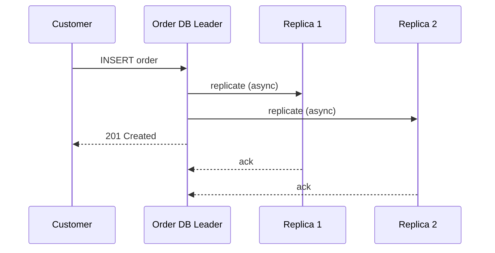

*Leader-based replication for the Order DB: the customer writes an order to the leader, which asynchronously replicates to read replicas and immediately returns 201 Created. Replicas serve read traffic (order history, status polling), accepting a small replication lag for higher read throughput.*

**Geo-replicated reference data (Restaurant & Menu DB):** Restaurant profiles and menus are written in the restaurant's home region, then replicated to all other regions via a CDC pipeline (Debezium → Kafka → regional consumers). This allows customers anywhere to browse a restaurant in another city (e.g., viewing a restaurant's full menu while traveling) without cross-region reads.

**Leaderless replication (Geo Store — Redis Cluster):** The agent-position store uses Redis Cluster with hash slots and master/replica pairs. Any master in a zone can accept GPS writes; followers serve dispatch-reads (GEOSEARCH). If a master fails, a replica is promoted. Stale positions are acceptable for seconds (the agent's last-known location is used with dead reckoning).

**Event log compaction (Kafka):** The `order_events` and `agent_location` topics use log compaction so the latest state for each key (e.g., the latest location of agent X) is retained even after older entries expire. This lets a restarted Dispatch Service replay only the latest state for each agent rather than every historical ping.

**Real-world use:** PostgreSQL with Patroni for leader election and streaming replication (DoorDash), Redis Cluster with active-active geo-replication (Swiggy), Cassandra with LWT for agent availability state (Uber Eats).

### Failure Detection and Membership

Food delivery services must detect failed nodes, redistribute dispatch work, and continue serving orders during partial outages. The system is organized into **city-level clusters** — a failure in Mumbai's dispatch cluster should not affect Delhi.

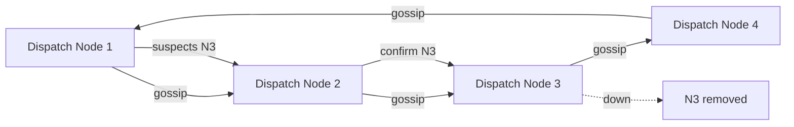

*Gossip-based failure detection across dispatch nodes: each node periodically exchanges health state with random peers. When a node suspects a peer is down, it propagates the suspicion through gossip; once confirmed by multiple peers, the failed node is removed from the cluster and its assigned orders are redistributed to healthy nodes via Kafka rebalancing.*

**Failure detection timing for food delivery:**

| Component | Check Interval | Timeout | Action |
|---|---|---|---|
| Order Service | 5s | 15s | Retry write; queue locally |
| Dispatch Service | 3s | 10s | Rebalance partition; redistribute pending assignments |
| Location Service (Redis) | 2s | 30s | Failover to replica; serve last-known with staleness flag |
| Maps API | 5s | 20s | Fall back to cached routes + straight-line distance |
| Payment Gateway | 3s | 15s | Queue payment; offer COD fallback |
| Notification Service | 5s | 10s | Buffer notifications; deliver on reconnect |

**Cluster membership — city-scoped sharding:** Each city (or metro) has its own logical cluster of Order, Dispatch, Location, and Notification service instances, plus a dedicated Kafka cluster and Redis cluster. A global orchestrator (Kubernetes) manages membership within each city cluster. Cross-city failover is not used — a city outage means local orders are queued until local services recover (because cross-city dispatch would violate the geographic model).

**Heartbeat + health endpoints:**

- **Liveness probes:** HTTP `/health/liveness` checked every 5 seconds; if unhealthy, the pod is restarted.
- **Readiness probes:** HTTP `/health/readiness` checks connectivity to Redis, Kafka, and the Order DB; not-ready pods are drained from the load balancer.
- **Business health checks:** Custom metrics — "no available agents in zone X for 2 minutes" triggers an auto-incentive; "dispatch queue depth > 1000" triggers horizontal pod autoscaling.

**Circuit breakers:** When a dependency degrades (e.g., the Maps API returns 5xx), a circuit breaker (Resilience4j) trips and stops sending requests for a cool-down period. The Dispatch Service falls back to straight-line distance and last-known ETAs instead of blocking the assignment. This prevents cascading failures from a slow external API.

### High Availability and Scalability

Food delivery must remain available during node failures, network partitions, and regional outages while scaling to handle city-wide peaks. The key insight is that food delivery is **regionally scoped** — a customer in Bangalore orders from restaurants near Bangalore, and dispatch happens among agents near Bangalore. Global replication is used only for durable, slowly-changing reference data.

#### Multi-Region / Multi-City Deployment

Deploy services per metro area (each metro = one region). Users are routed to their home metro's cluster via GeoDNS or a latency-based load balancer. Each metro cluster is self-sufficient for order creation, dispatch, and tracking; cross-metro replication is used only for restaurant catalogs and user profiles.

* **Order Service — multi-master per metro**: Writes to a user's orders go to their home metro (strong consistency per metro). A user traveling can still place orders in a different metro; those orders are created in the local metro cluster and the home metro's Order DB is eventually updated for history.
* **Location Service — local Redis Cluster**: Agent positions are stored only in the metro's Redis cluster. There is no cross-metro position sync — an agent can only be dispatched within their on-duty metro.
* **Restaurant catalog — globally replicated**: Restaurant profiles and menus are replicated to all metros via CDC → Kafka → regional consumers, so a traveling user can browse any restaurant's menu.
* **Payment Service — global**: Payment orchestration is global (Stripe/Razorpay accounts are not metro-specific), but settlement runs per-metro for regulatory reasons.

```mermaid
graph TD
    C[Customer] -->|nearest metro| G[GeoDNS / Global LB]
    G --> M1[Metro 1\n(Bangalore)]
    G --> M2[Metro 2\n(Delhi)]
    G --> M3[Metro 3\n(Mumbai)]
    subgraph "Metro 1"
        M1 --> API1[API GW]
        M1 --> OS1[Order Service]
        M1 --> DS1[Dispatch Service]
        M1 --> LS1[Location Service]
        M1 --> RDB1[(Order DB)]
        M1 --> Geo1[(Redis Geo)]
    end
    subgraph "Metro 2"
        M2 --> API2[API GW]
        M2 --> OS2[Order Service]
        M2 --> RDB2[(Order DB)]
    end
    subgraph "Metro 3"
        M3 --> API3[API GW]
        M3 --> OS3[Order Service]
        M3 --> RDB3[(Order DB)]
    end
    OS1 -.->|catalog sync| RDB2
    OS1 -.->|catalog sync| RDB3
    OS2 -.->|async| OS1
    OS3 -.->|async| OS1
```

*Multi-metro deployment: a global load balancer routes each customer to their nearest metro cluster via GeoDNS. Each metro owns its Order DB, Location (Redis Geo), Dispatch, and API Gateway. Restaurant catalogs are asynchronously replicated across metros (dashed lines) so users can browse any restaurant while traveling. Order history for a traveling user eventually syncs back to their home metro.*

#### Auto-Scaling

* **Stateless services (API Gateway, Order Service, Notification Service):** Scale horizontally based on CPU and request latency. Kubernetes HPA adjusts replica count automatically.
* **Dispatch Service:** Scale based on Kafka consumer lag — if the `order_created` topic falls behind by >1,000 messages, spin up more dispatch workers. Also scale by zone (more workers in dense zones).
* **Location Service:** Scale Redis read replicas; shard by zone. Each zone's GEO search is independent.
* **Maps routing requests:** Use a request-coalescing layer — if 50 agents move near each other, batch their ETA requests into a single Distance Matrix call with waypoints.

#### Graceful Degradation

When a component fails, the system degrades rather than crashes:

* **Maps API down**: Dispatch uses straight-line (haversine) distance and last-known travel times instead of live traffic. ETAs are less accurate but assignment still works.
* **Location service degraded**: Use last-known agent positions with a staleness flag; the customer sees "live tracking temporarily unavailable."
* **Notification service down**: Queue notifications in Kafka; deliver when the service recovers. Status changes are still persisted in the Order DB.
* **Payment gateway down**: Offer cash-on-delivery for new orders; queue card/wallet charges for retry.
* **Restaurant tablet offline**: Orders still route to the restaurant (the restaurant sees them when the tablet reconnects); the restaurant can update status via the call center.

### Performance and Optimization

The performance of a food delivery platform is measured by dispatch latency (order → agent assignment < 30 seconds), ETA accuracy (target 80% of deliveries within the promised window), and the freshness of real-time tracking (position updates every 8–10 seconds).

#### Latency Optimization

* **Dispatch pre-warming**: During predicted peaks, pre-warm the Location Service (warm Redis GEO cache with agent positions) and pre-start Dispatch Service pods.
* **Agent availability pre-computation**: Instead of scanning all agents on every order, maintain a per-zone index of available agents in Redis. Dispatch reads from the index — O(1) per zone.
* **Async payment + dispatch**: Payment capture and agent dispatch happen in parallel (both consume `order_created` from Kafka) — the customer sees "confirming order" while both proceed concurrently.
* **Connection pooling**: Maintain persistent HTTP/gRPC connections between services; reuse Maps API connections.

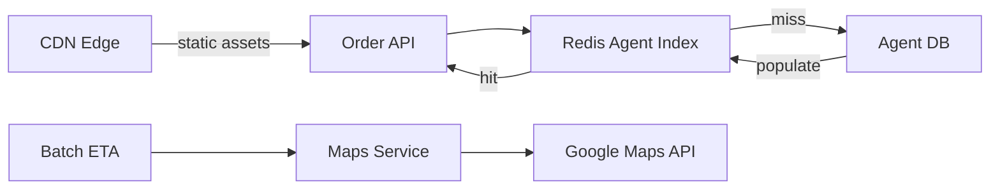

*Multi-tier optimization: the Order API reads available-agent indexes from Redis (cache hit ratio target 98%); cache misses fall back to the Agent DB and repopulate the cache. Media assets are served from CDN edge locations. ETA requests are batched (multiple agents' routes computed in a single Distance Matrix call) to reduce Maps API calls.*

#### Throughput Optimization

* **Zone-based partitioning**: All orders, agents, and dispatch work for a zone are routed to the same set of service instances (sharding by geohash or zone_id). This localizes load and avoids cross-zone coordination for the hot path.
* **Read replicas for Order DB**: Order history, status polling, and restaurant dashboards read from PostgreSQL read replicas, multiplying database read throughput.
* **Fan-out workers for notifications**: The Notification Service consumes from Kafka with a consumer group; scaling the group parallelizes notification delivery (push to 10,000 customers per second).
* **Request coalescing**: When multiple customers in a building order from the same restaurant simultaneously, the Dispatch Service batches their assignment to fewer agents (if the restaurant supports batch pickup).

#### Location Update Frequency

* Agent positions update every 8–10 seconds (balance accuracy vs. battery/bandwidth).
* In the last-mile (final 2 minutes to the customer), the update frequency increases to 3–4 seconds for a smoother tracking experience.
* Out of 200 million GPS pings per day, 95% are deduplicated or dropped via smoothing (Kalman filter) when the agent hasn't moved significantly.

#### ETA Accuracy

* **Per-restaurant, per-dish prep time**: Historical data gives a baseline (e.g., "Chicken Tikka Masala" at "Bombay Palace" takes 16 ± 4 minutes). Adjusted by current order backlog (if the restaurant has 5 orders ahead, add 12 minutes).
* **Live traffic**: Google Maps Distance Matrix with live traffic from the agent's current location → restaurant → customer.
* **Time-of-day and weather adjustments**: Lunch/dinner rush adds 3–5 minutes (restaurant backlog); rain adds 5–8 minutes (traffic slows).
* **Continuous recalculation**: ETA is recomputed every 30 seconds as the agent moves; the customer sees the updated estimate with a confidence range.
* **Feedback loop**: After delivery, the actual vs. predicted delivery time is recorded; the model is retrained nightly for each zone-restaurant-dish combination.

#### Caching Strategies

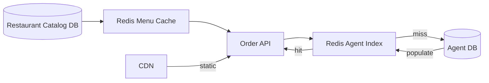

*Cache hierarchy: hot agent-availability indexes and restaurant menus live in Redis with short TTLs (2 min for agents, 10 min for menus); cold data falls back to Postgres/Cassandra and repopulates the cache. Static assets (restaurant images, menu photos) are served from a CDN.*

#### Write Path Optimization

* **Async dispatch**: Order creation returns 201 Created immediately after the DB write; dispatch happens asynchronously via Kafka. This keeps the order API latency < 50 ms.
* **Idempotent assignment**: The Dispatch Service assigns an order by writing a unique `(order_id, agent_id, attempt)` tuple to Redis with NX (set-if-not-exists). Retries are safe — the second attempt finds the key already set and is a no-op.
* **Batched location writes**: The Location Service batches GPS writes (100 ms window) into a single Redis GEO pipeline to reduce per-ping overhead.
* **Batched notifications**: The Notification Service batches status-update notifications over a 500 ms window (multiple events to the same customer are coalesced into one push).

**Real-world use:** Swiggy's dispatch engine assigns an order to an agent within 10 seconds of placement; DoorDash recomputes ETAs every 30 seconds and achieves 82% on-time delivery; Zomato caches restaurant menus in Redis with a 5-minute TTL to handle 500K menu loads per minute during ordering peaks.

### CAP Theorem and Consistency Trade-offs

The CAP theorem states that during a network partition, a distributed system can provide at most two of: Consistency, Availability, and Partition tolerance. Since food delivery operates over mobile networks (where partitions are common — tunnels, basements, dead zones), partition tolerance is always required. The system makes different CAP trade-offs per component.

#### Order DB — CP (Consistency + Partition Tolerance)

Order creation requires strong consistency: if the API returns 201 Created, the order must exist and be retrievable. A failed write must not silently return success. The Order DB uses PostgreSQL with synchronous replication to one follower before acknowledging. This ensures that even if the leader fails, the order is durable.

#### Geo Store (Agent Positions) — AP (Availability + Partition Tolerance)

Agent positions are inherently transient — a position that's 30 seconds old is stale. The system prioritizes availability: if a Redis node fails, the dispatch service falls back to last-known positions with a staleness flag and uses dead reckoning (estimating position from last heading/speed). Delivering a slightly-stale position is better than failing to dispatch an order.

#### Payment State — CP (Consistency + Partition Tolerance)

Payment records must be consistent — a payment can't be "charged" in one replica and "failed" in another. Payments use a strongly consistent store (the payment gateway is the source of truth) with synchronous local writes to the payment ledger. Refunds and chargebacks require strict consistency.

#### Restaurant Catalog — AP with Eventual Consistency

Restaurant menus and availability can tolerate brief staleness — if a restaurant disables an item but the catalog hasn't propagated, the order fails at the restaurant and is refunded. The catalog prioritizes availability (customers can browse even if some replicas are down); updates propagate asynchronously via CDC.

#### Notification Delivery — At-Most-Once / Best-Effort

Push notifications are best-effort (AP). If the notification service is down, notifications are queued in Kafka and delivered on recovery. Missed notifications are acceptable — the customer still sees the status in the app. This avoids blocking the order pipeline on notification delivery.

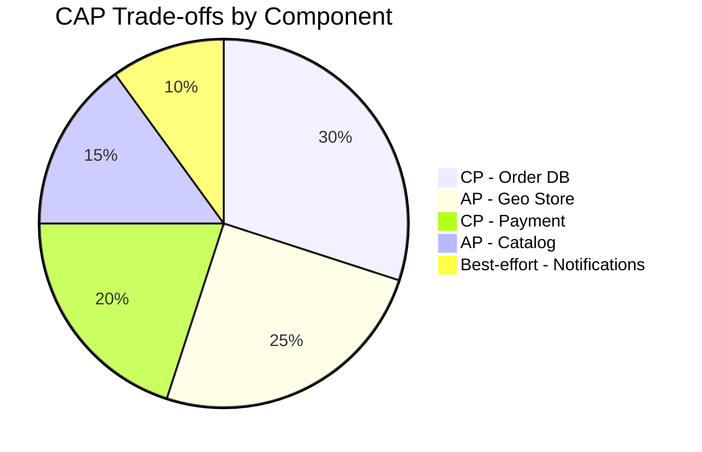

*CAP trade-offs across food delivery components: the Order DB and Payment ledger are CP (strong consistency) since order/payment integrity is non-negotiable; the Geo Store and Restaurant Catalog are AP (availability-first) since brief staleness is acceptable; notifications are best-effort.*

**Interview question:** *Is food delivery strongly consistent or eventually consistent?*
**Answer:** Food delivery uses a nuanced, per-component split. Order creation and payment are strongly consistent (CP) — a 201 response means the order is durably stored; a payment charge must not be ambiguous. Agent positions and ETA are eventually consistent (AP) — a 10-second-stale position is fine for dispatch. Restaurant menus are eventually consistent — a recently-disabled item may briefly still be visible. Customers expect consistency for their own orders (read-your-writes on order status) but accept eventual consistency for real-time tracking.

### Encryption and Key Management

A food delivery platform stores highly sensitive data: customer payment credentials, delivery addresses, real-time GPS locations, and restaurant financial accounts. Encryption must protect data at rest, in transit, and during processing.

#### Encryption at Rest

* **Order & Payment DB (PostgreSQL):** TDE (Transparent Data Encryption) for the data files plus application-level encryption for stored card reference tokens (the platform never stores raw PANs — it stores tokens from the payment gateway).
* **Object storage (menu images, restaurant photos):** Server-side encryption (SSE-S3 or SSE-KMS) by default; customer-uploaded delivery-vehicle photos are encrypted with per-object DEKs.
* **Redis Geo Store:** Encryption-at-rest (Redis Enterprise) for persisted snapshots; in-memory data is protected by network isolation.
* **Logs:** Payment instrument tokens and full GPS coordinates are redacted before logging using a log sanitizer.

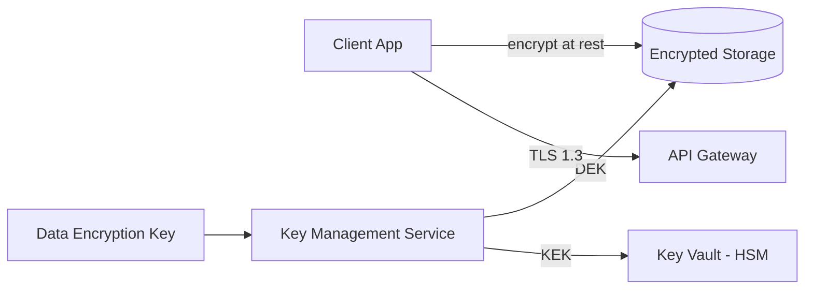

*Encryption at rest architecture: server-side encryption protects stored data (PostgreSQL TDE, object-storage SSE-KMS). Per-object DEKs are generated by a KMS and protected by KEKs in an HSM-backed key vault. All client-server and inter-service traffic uses TLS 1.3 with mTLS for service-to-service authentication.*

#### Encryption in Transit

All client-to-server and server-to-server traffic uses TLS 1.3 (minimum TLS 1.2). Inter-service communication within the data center uses mTLS (mutual TLS) for service-to-service authentication and encryption. Mobile SDKs pin the server certificate to prevent man-in-the-middle attacks on untrusted networks.

#### Key Management

* **Key hierarchy:** A KEK (Key Encryption Key) in an HSM encrypts per-table or per-object DEKs (Data Encryption Keys). Rotating the KEK requires only re-encrypting the DEKs, not the data.
* **Key rotation:** KEKs rotated every 90 days; payment token encryption keys rotated every 30 days. GPS location data is encrypted with per-zone keys rotated weekly.
* **Multi-region KMS:** Keys are available in all metro deployments. Cloud KMS services replicate keys automatically; on-prem deployments use HashiCorp Vault with integrated storage for multi-region HA.

**Java example — encryption service as a Spring bean:**

```java
@Service
@RequiredArgsConstructor
public class PaymentEncryptionService {

    @Value("${app.encryption.payment-key-id}")
    private String keyId;

    private final AwsKms kmsClient;

    public EncryptedPayment encryptToken(String token) {
        var dek = kmsClient.generateDataKey(keyId);
        var cipher = Cipher.getInstance("AES/GCM/NoPadding");
        cipher.init(Cipher.ENCRYPT_MODE,
                new SecretKeySpec(dek.plaintext(), "AES"),
                new GCMParameterSpec(128, dek.iv()));
        var ciphertext = cipher.doFinal(token.getBytes(StandardCharsets.UTF_8));
        return new EncryptedPayment(ciphertext, dek.encryptedKey(), dek.iv());
    }

    public String decryptToken(EncryptedPayment encrypted) {
        var dek = kmsClient.decrypt(encrypted.encryptedKey(), encrypted.iv());
        var cipher = Cipher.getInstance("AES/GCM/NoPadding");
        cipher.init(Cipher.DECRYPT_MODE,
                new SecretKeySpec(dek.plaintext(), "AES"),
                new GCMParameterSpec(128, encrypted.iv()));
        return new String(cipher.doFinal(encrypted.ciphertext()), StandardCharsets.UTF_8);
    }
}
```

*The `PaymentEncryptionService` bean generates a per-token DEK via AWS KMS, encrypts using AES-GCM (which provides both confidentiality and integrity via the authentication tag), and stores the encrypted DEK alongside the ciphertext. The KMS-managed key ID is injected via `@Value`. Only services with KMS decrypt permissions can recover the DEK — the server stores only encrypted blobs, never plaintext payment tokens.*

### Authentication and Authorization

A food delivery platform issues authenticated identities to three distinct roles — customers, restaurant partners, and delivery agents — each with different permissions and data access patterns. Every request to every service must carry authenticated credentials.

#### Authentication Methods

* **OAuth 2.0 + JWT (Customers):** Users authenticate via a third-party provider (Google, Apple, phone number with OTP) or email/password. The Auth Service issues a short-lived JWT (15 min) and a refresh token (30 days). The JWT contains the user ID, roles, and expiry.
* **Partner OAuth (Restaurants & Agents):** Restaurant and agent apps authenticate via a separate client credentials flow with partner-specific scopes (e.g., `orders:write`, `availability:update`).
* **OTP-based login (Mobile-first markets):** In markets where email/phone adoption is low, customers log in via SMS OTP. The Auth Service validates the OTP and issues a JWT.
* **Certificate-based auth (service-to-service):** Internal services authenticate to each other via mTLS certificates issued by a private CA. No shared secrets.
* **API keys (webhooks):** Payment gateway and maps provider webhooks are authenticated via signed payloads (HMAC) verified against a configured secret.

#### Authorization Models

* **Scope-based (OAuth 2.0 scopes):** Each token carries scopes like `orders:read`, `orders:write`, `agent:availability`, `restaurant:menu:update`, `tracking:read`. The API Gateway enforces scope checks before routing to backend services.
* **Role-based (RBAC):** Users have roles (`customer`, `restaurant_admin`, `agent`, `dispatcher`, `support_agent`, `platform_admin`). Restaurant admins can update menus and statuses; agents can update availability and delivery status; support agents can override order states; admins can configure surge rules.
* **Resource-level access:** A restaurant admin can only see orders for their own restaurant (`order.restaurant_id == principal.restaurant_id`). An agent can only update their own status. A customer can only view their own orders.
* **Attribute-based (geofencing):** Dispatch and zone management APIs are restricted by the principal's assigned metro(s). A support agent in Bangalore cannot view orders from Delhi unless explicitly escalated.

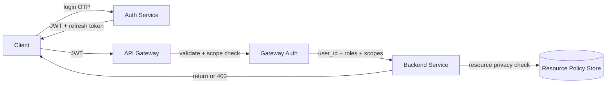

*Authentication and authorization flow: the client logs in via the Auth Service (Google SSO, Apple, or OTP), receives a JWT and refresh token; the API Gateway validates the JWT signature and checks scopes before forwarding to backend services; each service performs resource-level access checks (e.g., does this restaurant admin own this order?) against a policy store.*

**Java example — JWT validation filter:**

```java
@Component
@RequiredArgsConstructor
public class JwtAuthenticationFilter implements Filter {

    @Value("${app.auth.jwt-public-key}")
    private String publicKeyPem;

    private final UserDetailsService userDetailsService;

    @Override
    public void doFilter(ServletRequest request, ServletResponse response,
                         FilterChain chain) throws IOException, ServletException {
        var token = extractToken((HttpServletRequest) request);
        if (token != null && JwtUtils.isValid(token, publicKeyPem)) {
            var userId = JwtUtils.getUserId(token);
            var userDetails = userDetailsService.loadUserById(userId);
            var auth = new UsernamePasswordAuthenticationToken(
                    userDetails, null, userDetails.getAuthorities());
            SecurityContextHolder.getContext().setAuthentication(auth);
        }
        chain.doFilter(request, response);
    }
}
```

*The `JwtAuthenticationFilter` bean intercepts every HTTP request, extracts the bearer token, validates its signature against the public key (injected via `@Value` from a JWKS endpoint), loads the user details, and sets the Spring Security `Authentication` context. If the token is missing or invalid, the request proceeds unauthenticated (and subsequent `@PreAuthorize` annotations return 401).*

**Authorization example — Order privacy check:**

```java
@Service
@RequiredArgsConstructor
@Slf4j
public class OrderAuthorizationService {

    private final OrderRepository orderRepository;

    /**
     * Determine whether the authenticated principal may view the given order.
     * A customer may view only their own orders; a restaurant admin may view
     * orders for restaurants they own; an agent may view orders they're
     * assigned to; a support agent may view orders in their metro only.
     */
    @Transactional(readOnly = true)
    public boolean canViewOrder(String orderId, AuthenticatedPrincipal principal) {
        var order = orderRepository.findById(orderId)
                .orElseThrow(() -> new OrderNotFoundException(orderId));

        return switch (principal.role()) {
            case CUSTOMER -> order.getUserId().equals(principal.userId());
            case RESTAURANT_ADMIN -> {
                var owned = orderRepository.isRestaurantOwnedBy(order.getRestaurantId(),
                        principal.restaurantId());
                yield owned;
            }
            case AGENT -> order.getAgentId() != null
                    && order.getAgentId().equals(principal.userId());
            case SUPPORT -> orderRepository.isInMetro(orderId, principal.metro());
            default -> false;
        };
    }
}
```

*The `OrderAuthorizationService` bean enforces resource-level privacy using a Java switch expression over the principal's role. A `CUSTOMER` can only view their own orders; a `RESTAURANT_ADMIN` can only view orders for restaurants they own; an `AGENT` can only view orders assigned to them; a `SUPPORT` agent can only view orders in their metro. The `@Transactional(readOnly = true)` annotation ensures safe read-only DB access and optimizes the query path.*

### Security Threats and Mitigations

#### Threat: Account Takeover

* **Risk:** An attacker uses stolen passwords, credential stuffing, or session hijacking to take over a customer's account and place fraudulent orders.
* **Mitigation:** Rate-limit login attempts (5 per IP per hour). Use CAPTCHA after 3 failed attempts. Require OTP re-verification for high-value orders or new device logins. Invalidate all sessions on password change. Monitor for anomalous login patterns (new device, new location, unusual time). Enforce 2FA for restaurant admins and support agents.

#### Threat: Payment Fraud

* **Risk:** Stolen card numbers or payment tokens are used for fraudulent orders; friendly fraud results in chargebacks.
* **Mitigation:** Integrate with the payment gateway's fraud detection (3DS for cards, risk scoring). Bind orders to verified delivery addresses and device fingerprints. For COD orders, cap the maximum order value per customer based on payment history. Record device fingerprints and IP history; flag orders from new devices/IPs for manual review. Settle payouts to agents with a 24-hour delay to allow fraud detection.

#### Threat: Location Privacy Violation

* **Risk:** Real-time GPS coordinates of customers and agents are highly sensitive — exposure enables stalking or robbery.
* **Mitigation:** Store only the agent's latest position (not history) in the Geo Store; purge location history after 24 hours. Never expose raw coordinates in client APIs — round to 4 decimal places (~10m precision) and only send to the customer whose agent is en route, never to unrelated users. Encrypt location in transit and at rest. Require explicit location permission and provide opt-out.

#### Threat: Dispatch Manipulation / Ghost Orders

* **Risk:** Fake accounts place orders that are never delivered; agents collude to fake deliveries for payout.
* **Mitigation:** Validate new accounts with phone number verification + OTP. Cap orders per new account (first 3 days: max 2 orders/day). For agents, track acceptance-to-pickup time and pickup-to-delivery distance vs. route; flag outliers for review. Reconcile COD cash counts daily; investigate discrepancies. Implement a trust-score model per user and agent.

#### Threat: Rating Manipulation

* **Risk:** Restaurants or agents offer incentives for fake 5-star reviews; competitors sabotage with 1-star reviews.
* **Mitigation:** Only allow ratings from users who actually placed an order with that restaurant/agent, verified by order ID. Detect coordinated rating patterns (same IP, same device, burst timing) via anomaly detection. Weight ratings by verified-purchase history. Show distributions (not just averages) so manipulation is visible.

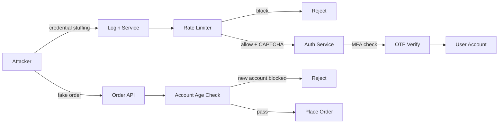

*Defense-in-depth against account takeover and ghost orders: the attacker attempts credential stuffing against the login service; the rate limiter blocks IPs exceeding the threshold and triggers CAPTCHA challenges; successful logins from new devices require OTP MFA verification. Simultaneously, fake-order attempts are screened by an account-age check — new accounts are blocked from placing orders until they've passed a warm-up period.*

### Observability and Logging

Food delivery platforms generate massive amounts of telemetry — millions of GPS pings, order events, and user interactions per minute. Observability must cover the dispatch pipeline, order lifecycle, real-time tracking, and financial settlement.

#### Key Metrics

* **Dispatch latency:** Milliseconds between order placement and agent assignment. Alert if p95 > 30 seconds or queue depth > 1,000 pending orders.
* **ETA accuracy:** Percentage of deliveries within the promised ETA window. Target 80%; alert if < 70% for 15 minutes.
* **Order completion rate:** Percentage of placed orders that reach COMPLETED. Alert if < 95% (indicates dispatch, payment, or restaurant issues).
* **Agent utilization:** Average active-orders per available agent. Target 1.5–2.0; too low = over-supplied, too high = over-loaded agents declining quality.
* **Location update freshness:** Percentage of agents reporting GPS within the last 15 seconds. Alert if < 95% (indicates device/app issues in a metro).
* **Payment success rate:** Percentage of card/wallet charges that succeed on first attempt. Alert if < 90%.
* **Cancellation rate:** Percentage of orders cancelled (by customer, restaurant, or system). A spike indicates a problem.
* **Error rates:** 5xx errors per service, Kafka consumer errors, Redis connection failures, Maps API error rate.

#### Logging

* **Access logs:** Every API request logged with user ID, endpoint, response code, and latency. Used for audit trails and anomaly detection.
* **Event logs:** All domain events (order_placed, order_confirmed, agent_assigned, picked_up, delivered, cancelled) logged as structured JSON to Kafka for analytics and ML feature generation.
* **Error logs:** Service errors with correlation IDs for cross-service tracing. Dispatch failures logged with candidate agent count for capacity planning.
* **Audit logs:** All financial actions (payment capture, refund, settlement, commission adjustment) logged with before/after state and the acting principal.
* **PII handling:** GPS coordinates and payment tokens are redacted or hashed before logging. A log sanitizer runs on the ingestion pipeline.

#### Distributed Tracing

Trace every user request across all services — from the API Gateway through the Order Service, Payment Service, Dispatch Service, Location Service, Maps Service, and Notification Service. Use OpenTelemetry with a trace-context header propagated across service boundaries. Key spans to instrument: order validation, payment capture, agent candidate lookup, GEOSEARCH, assignment push, and status notification.

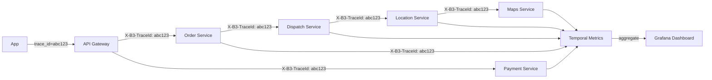

*Distributed tracing flow: each user request carries a trace ID propagated across all downstream service calls. The API Gateway, Order Service, Payment Service, Dispatch Service, Location Service, and Maps Service each record spans. These spans aggregate in a metrics backend (Jaeger, Datadog, or Tempo) and are visualized in Grafana dashboards, enabling end-to-end latency analysis of the order-to-delivery path.*

#### Alerting Strategy

* **Critical (page immediately):** Order API p99 > 1 second for 5 minutes; dispatch queue depth > 5,000 for 2 minutes; Order DB or Redis unavailable; Kafka consumer down for 30 seconds.
* **Warning (Slack, no page):** ETA accuracy < 70% for 15 minutes; payment success rate < 90% for 10 minutes; agent GPS freshness < 95% for 5 minutes; Maps API error rate > 5%.
* **Info (dashboard only):** Cancellation rate anomalies, new user growth trends, zone-level demand/supply heatmaps.

**Java example — dispatch latency metrics with Micrometer:**

```java
@Service
@RequiredArgsConstructor
@Slf4j
public class InstrumentedDispatchService {

    private final DispatchService dispatchService;
    private final MeterRegistry meterRegistry;

    public AssignmentResult assignOrder(String orderId, String restaurantId,
                                        double lat, double lng) {
        var sample = Timer.Sample.start(meterRegistry);
        try {
            var result = dispatchService.assignOrder(orderId, restaurantId, lat, lng);
            sample.stop(Timer.builder("dispatch.latency")
                    .tag("zone", zoneOf(lat, lng))
                    .tag("result", result.isAssigned() ? "assigned" : "no_agents")
                    .register(meterRegistry));
            return result;
        } catch (Exception e) {
            Counter.builder("dispatch.errors")
                    .tag("error_type", e.getClass().getSimpleName())
                    .register(meterRegistry).increment();
            sample.stop(Timer.builder("dispatch.latency")
                    .tag("zone", zoneOf(lat, lng))
                    .tag("result", "error")
                    .register(meterRegistry));
            log.error("Dispatch failed for order {}", orderId, e);
            throw e;
        }
    }

    private String zoneOf(double lat, double lng) {
        return Geo hash.of(lat, lng); // city/zone sharding key
    }
}
```

*The `InstrumentedDispatchService` bean wraps the core Dispatch Service with Micrometer instrumentation. It records a `dispatch.latency` timer tagged by zone and result (assigned / no_agents / error) for every assignment attempt, plus a `dispatch.errors` counter on failures. The zone tag enables per-metro SLI dashboards; the result tag lets operators distinguish "no agents available" (supply problem) from "dispatch error" (service problem). Full stack traces are logged only at the error boundary to avoid log spam.*

### Real-World Implementations

Food delivery platforms use a combination of cloud-native and open-source systems, each chosen for its strengths in a particular layer of the stack. Unlike social media's global fan-out, food delivery is **metro-scoped** — Redis stores agent positions, Kafka fans out order events, and PostgreSQL holds durable order records, all partitioned by city.

#### PostgreSQL

Used for: the system of record for orders, payments, users, restaurants, and ratings. PostgreSQL's strong consistency and ACID transactions are the right choice for financial and stateful data. Read replicas handle order-history and dashboard reads. JSONB columns store flexible fields like delivery addresses (`address_json`) and restaurant availability schedules.

**Companies:** DoorDash (orders + financials), Zomato (restaurant data + user accounts), Swiggy (order ledger).

#### Redis

Used for: the agent-position Geo Store (`GEOADD`/`GEOSEARCH`), the dispatch candidate index (per-zone sorted sets of available agents), rate-limit counters (login attempts, order attempts per user), idempotency keys (order creation), and short-lived session tokens. Redis's in-memory performance and GEO commands are essential for sub-second dispatch decisions.

**Companies:** Swiggy (real-time agent tracking), Uber Eats (availability index), DoorDash (dispatch pre-warming).

#### Kafka

Used for: the event backbone carrying `order_created`, `order_confirmed`, `agent_assigned`, `item_picked_up`, `order_delivered`, `location_updated`, and `eta_change` events. Kafka's partitioning by `order_id` (or `zone_id`) ensures event ordering per order while enabling parallel consumers. Log compaction retains the latest location/ETA per agent.

**Companies:** All major platforms — DoorDash (originally built on Kafka), Swiggy, Zomato, Uber Eats.

#### Google Maps API / OSRM

Used for: route computation (distance + travel time), live traffic ETAs, and geocoding addresses to coordinates. For cost optimization, platforms cache popular routes and batch Distance Matrix requests. OSRM is used as a self-hosted fallback when the Google Maps quota is exhausted.

**Companies:** Swiggy (Google Maps primary, OSRM fallback), DoorDash (Google Maps + proprietary routing), Zomato (Mapbox for some regions).

#### Stripe / Razorpay / Adyen

Used for: card and wallet payment capture, split payouts to restaurants and agents, and webhook verification. The platforms themselves handle the split — the restaurant and agent receive their portions via marketplace payouts (Stripe Connect), while the platform takes its commission. COD reconciliations are handled via the in-platform Wallet service.

**Companies:** Zomato (Razorpay + Stripe), Swiggy (Razorpay + Stripe), DoorDash (Stripe + Adyen).

#### Kubernetes

Used for: orchestrating microservices across metros. Each metro is a Kubernetes namespace with its own HPA rules (scale dispatch workers by orders-per-second, scale Location Service by GPS ingest rate). GeoDNS routes customers to their home metro. Cross-metro replication of restaurant catalogs uses a separate global namespace.

**Companies:** DoorDash (Kubernetes per metro), Swiggy (multi-cluster), Uber Eats (ringpop + Kubernetes).

#### Elasticsearch

Used for: restaurant search (by cuisine, diet, rating, delivery time), address autocomplete, and agent-location heat maps for supply planning. Indices are updated from Kafka `order_created` and restaurant-onboarding events.

**Companies:** Zomato (restaurant search), Swiggy (location autocomplete), DoorDash (restaurant discovery).

---

### Java and Spring Boot Implementation Guide

This section demonstrates how to build Spring Boot services for a food delivery platform's core pipeline — order lifecycle management, dispatch, pricing, and real-time tracking. It showcases Spring Boot features: `@Service`, `@RestController`, `@Repository`, `@Component`, `@Value`, records for DTOs, `@Valid`, `@ControllerAdvice`, constructor injection, `BigDecimal`, `@Transactional`, `@Version`, and Kafka integration.

#### 1. DTO Records

Records provide immutable, concise data carriers for request/response payloads.

```java
public record CreateOrderRequest(
        @NotBlank String restaurantId,
        @NotEmpty List<OrderItemRequest> items,
        DeliveryAddressDto deliveryAddress,
        @DecimalMin("0.0") BigDecimal tipAmount,
        @NotBlank String paymentMethod,
        String couponCode) {}

public record OrderItemRequest(
        @NotBlank String itemId,
        @Positive int quantity,
        String specialInstructions) {}

public record OrderResponse(
        String orderId,
        String status,
        String estimatedDeliveryTime,
        ChargesDto charges,
        String paymentStatus,
        AgentDto agent,
        List<TimelineEntry> timeline) {}

public record ChargesDto(
        BigDecimal itemTotal,
        BigDecimal deliveryFee,
        BigDecimal discount,
        BigDecimal tip,
        BigDecimal platformFee,
        BigDecimal grandTotal) {}

public record AgentDto(String agentId, String name, double rating, String vehicleType) {}

public record DeliveryAddressDto(double lat, double lng, String label) {}

public record TimelineEntry(String status, Instant at) {}
```

*Seven record types serve as the API contract between the Customer App and the Order Service: `CreateOrderRequest` is the POST body with Bean Validation annotations (`@NotBlank`, `@NotEmpty`, `@Positive`, `@DecimalMin`); `OrderResponse` echoes the order status, charges, assigned agent, and event timeline; supporting records (`OrderItemRequest`, `ChargesDto`, `AgentDto`, `DeliveryAddressDto`, `TimelineEntry`) compose the response. Records are immutable and ideal for thread-safe request/response objects.*

#### 2. Entity — Order with Optimistic Locking and State Machine

The `Order` entity captures the transaction and enforces state-transition validity with `@Version` optimistic locking.

```java
@Entity
@Table(name = "orders", indexes = {
        @Index(name = "idx_order_status_created", columnList = "status, createdAt"),
        @Index(name = "idx_order_user_created", columnList = "userId, createdAt DESC"),
        @Index(name = "idx_order_restaurant", columnList = "restaurantId, createdAt"),
        @Index(name = "idx_order_agent_status", columnList = "agentId, status")
})
public class Order {

    @Id
    private String orderId;

    private String userId;
    private String restaurantId;
    private String agentId;

    @Enumerated(EnumType.STRING)
    private OrderStatus status;

    @Column(precision = 10, scale = 2)
    private BigDecimal itemTotal;
    @Column(precision = 10, scale = 2)
    private BigDecimal deliveryFee;
    @Column(precision = 10, scale = 2)
    private BigDecimal discount;
    @Column(precision = 10, scale = 2)
    private BigDecimal tip;
    @Column(precision = 10, scale = 2)
    private BigDecimal platformFee;
    @Column(precision = 10, scale = 2)
    private BigDecimal grandTotal;

    @Enumerated(EnumType.STRING)
    private PaymentStatus paymentStatus;

    private Instant createdAt;
    private Instant updatedAt;
    private Instant deliveredAt;

    @OneToMany(cascade = CascadeType.ALL, orphanRemoval = true, mappedBy = "order")
    private List<OrderItem> items = new ArrayList<>();

    @Version
    private Long version;

    // State transition validation
    public boolean canTransitionTo(OrderStatus newStatus) {
        return switch (this.status) {
            case PLACED -> Set.of(CONFIRMED, CANCELLED, FAILED).contains(newStatus);
            case CONFIRMED -> Set.of(PREPARING, CANCELLED, FAILED).contains(newStatus);
            case PREPARING -> Set.of(READY, CANCELLED, FAILED).contains(newStatus);
            case READY -> Set.of(PICKED_UP, CANCELLED, FAILED).contains(newStatus);
            case PICKED_UP -> Set.of(DELIVERING, FAILED).contains(newStatus);
            case DELIVERING -> Set.of(COMPLETED, FAILED).contains(newStatus);
            default -> false;
        };
    }

    public void transitionTo(OrderStatus newStatus) {
        if (!canTransitionTo(newStatus)) {
            throw new InvalidStateTransitionException(
                    "Cannot transition from " + this.status + " to " + newStatus);
        }
        this.status = newStatus;
        this.updatedAt = Instant.now();
        if (newStatus == COMPLETED) this.deliveredAt = Instant.now();
    }
}
```

*The `Order` entity maps to the `orders` table with composite indexes for the dispatch queue (`status, createdAt`), customer history (`userId, createdAt DESC`), and the agent's in-progress view (`agentId, status`). Monetary fields use `BigDecimal` with `precision=10, scale=2`. The `canTransitionTo` method encodes the order state machine using a Java switch expression; `transitionTo` throws `InvalidStateTransitionException` for illegal moves. The `@Version` field provides optimistic locking so concurrent status transitions (e.g., customer cancelling while the agent marks picked-up) don't silently overwrite each other.*

```java
public enum OrderStatus {
    PLACED,       // Order created, awaiting restaurant confirmation
    CONFIRMED,    // Payment captured, dispatching to agent
    PREPARING,    // Restaurant confirmed, cooking
    READY,        // Food ready for pickup
    PICKED_UP,    // Agent picked up the order
    DELIVERING,   // Agent is delivering to customer
    COMPLETED,    // Delivered to customer
    CANCELLED,    // Cancelled by user or system
    FAILED        // Could not complete
}
```

#### 3. Repository Layer

The repository layer provides persistence operations, including the dispatch-queue query and the dispatch-assignment write.

```java
@Repository
public interface OrderRepository extends JpaRepository<Order, String> {

    @Query("SELECT o FROM Order o WHERE o.status = :status " +
           "AND o.restaurantId = :restaurantId ORDER BY o.createdAt ASC")
    List<Order> findReadyForDispatch(@Param("status") OrderStatus status,
                                     @Param("restaurantId") String restaurantId,
                                     Pageable pageable);

    @Query("SELECT o FROM Order o WHERE o.agentId = :agentId " +
           "AND o.status IN :statuses ORDER BY o.createdAt DESC")
    List<Order> findByAgentAndStatusIn(@Param("agentId") String agentId,
                                       @Param("statuses") Collection<OrderStatus> statuses);

    @Modifying(clearAutomatically = true)
    @Query("UPDATE Order o SET o.status = :newStatus, o.agentId = :agentId " +
           "WHERE o.orderId = :orderId AND o.version = :version")
    int assignAgent(@Param("orderId") String orderId,
                    @Param("agentId") String agentId,
                    @Param("newStatus") OrderStatus newStatus,
                    @Param("version") Long version);
}

@Repository
public interface DispatchAssignmentRepository extends JpaRepository<DispatchAssignment, String> {

    boolean existsByOrderId(String orderId);
}
```

*The `OrderRepository` interface extends `JpaRepository`. Three custom queries serve the dispatch and tracking flows: `findReadyForDispatch` polls the dispatch queue for orders awaiting an agent (ordered by age for fairness); `findByAgentAndStatusIn` powers the agent app's "active orders" view; `assignAgent` performs an optimistic-lock-aware assignment (the `version` parameter prevents lost updates when two dispatch workers race to assign the same order). The separate `DispatchAssignmentRepository` enforces at-most-once assignment via `existsByOrderId`.*

#### 4. Service Layer — Order Lifecycle

Services encapsulate business logic, transactions, and the event-driven dispatch pipeline.

```java
@Service
@RequiredArgsConstructor
@Slf4j
public class OrderService {

    private final OrderRepository orderRepository;
    private final PaymentService paymentService;
    private final PricingService pricingService;
    private final KafkaTemplate<String, Object> kafkaTemplate;
    private final IdempotencyService idempotencyService;

    @Value("${app.order.dispatch-timeout-minutes:10}")
    private int dispatchTimeoutMinutes;

    @Transactional
    public OrderResponse createOrder(String userId, CreateOrderRequest request,
                                     String idempotencyKey) {
        // Idempotency: a retry with the same key returns the existing order
        var existing = idempotencyService.getIdempotencyResult(idempotencyKey);
        if (existing != null) {
            return (OrderResponse) existing;
        }

        var charges = pricingService.calculateCharges(request);
        var order = Order.builder()
                .orderId(UUID.randomUUID().toString())
                .userId(userId)
                .restaurantId(request.restaurantId())
                .status(OrderStatus.PLACED)
                .paymentStatus(PaymentStatus.PENDING)
                .itemTotal(charges.itemTotal())
                .deliveryFee(charges.deliveryFee())
                .discount(charges.discount())
                .tip(request.tipAmount())
                .platformFee(charges.platformFee())
                .grandTotal(charges.grandTotal())
                .createdAt(Instant.now())
                .updatedAt(Instant.now())
                .build();
        // map items...
        var saved = orderRepository.save(order);

        // Publish event for async payment + dispatch
        var event = new OrderCreatedEvent(saved.getOrderId(), userId, request.restaurantId(),
                saved.getGrandTotal(), charges);
        idempotencyService.recordResult(idempotencyKey, toResponse(saved));
        kafkaTemplate.send("order_created", saved.getOrderId(), event);

        // Schedule dispatch timeout (if no agent assigned within N min, auto-cancel)
        scheduler.schedule(() -> checkDispatchTimeout(saved.getOrderId()),
                Duration.ofMinutes(dispatchTimeoutMinutes));

        log.info("Order {} created for user {} via idempotency key {}",
                saved.getOrderId(), userId, idempotencyKey);
        return toResponse(saved);
    }

    @Transactional
    public void confirmPayment(String orderId, String transactionId) {
        var order = orderRepository.findById(orderId)
                .orElseThrow(() -> new OrderNotFoundException(orderId));
        order.setPaymentStatus(PaymentStatus.SUCCEEDED);
        order.transitionTo(OrderStatus.CONFIRMED);
        kafkaTemplate.send("order_confirmed", orderId,
                new OrderConfirmedEvent(orderId, transactionId));
    }

    private void checkDispatchTimeout(String orderId) {
        // If order is still PLACED or CONFIRMED and no agent assigned, cancel
        var order = orderRepository.findById(orderId).orElse(null);
        if (order != null && (order.getStatus() == OrderStatus.PLACED
                || order.getStatus() == OrderStatus.CONFIRMED)
                && order.getAgentId() == null) {
            order.transitionTo(OrderStatus.FAILED);
            orderRepository.save(order);
            kafkaTemplate.send("order_failed", orderId,
                    new OrderFailedEvent(orderId, "No agent available within timeout"));
        }
    }
}
```

*The `OrderService` bean implements the order lifecycle with idempotency, event publishing, and timeout scheduling. The `createOrder` method checks the idempotency cache first (preventing duplicate charges on client retry), creates the order in `PLACED` state, publishes an `order_created` Kafka event for async payment and dispatch, and schedules a dispatch timeout that auto-cancels orders with no agent assignment. The `confirmPayment` method transitions the order to `CONFIRMED` and publishes the event. The `@Transactional` annotation on all methods ensures ACID atomicity across DB writes and idempotency-record writes.*

#### 5. Service Layer — Dispatch Controller

The dispatch flow finds the nearest available agent, scores candidates, and pushes the assignment with a timeout-based acceptance window.

```java
@RestController
@RequestMapping("/api/v1/dispatch")
@RequiredArgsConstructor
public class DispatchController {
    private final DispatchService dispatchService;
    private final LocationService locationService;

    @PostMapping("/assign")
    public ResponseEntity<AssignmentResponse> assignOrder(
            @RequestBody AssignOrderRequest request) {

        AssignmentResult result = dispatchService.assignOrder(
                request.getOrderId(),
                request.getRestaurantId(),
                request.getLatitude(),
                request.getLongitude()
        );

        if (result.isAssigned()) {
            return ResponseEntity.ok(AssignmentResponse.builder()
                    .agentId(result.getAgentId())
                    .etaMinutes(result.getEtaMinutes())
                    .status("ASSIGNED")
                    .build());
        }

        return ResponseEntity.status(HttpStatus.CONFLICT)
                .body(AssignmentResponse.builder()
                        .status("NO_AGENTS_AVAILABLE")
                        .message("No delivery agents available nearby")
                        .build());
    }
}

@Service
@RequiredArgsConstructor
public class DispatchService {
    private final LocationService locationService;
    private final AgentService agentService;
    private final NotificationService notificationService;
    private final DispatchAssignmentRepository assignmentRepository;

    private static final double INITIAL_RADIUS_KM = 5.0;
    private static final double EXPANDED_RADIUS_KM = 15.0;
    private static final int ACCEPTANCE_WINDOW_SECONDS = 60;

    @Transactional
    public AssignmentResult assignOrder(String orderId, String restaurantId,
                                        double restLat, double restLng) {
        // Guard against double-assignment
        if (assignmentRepository.existsByOrderId(orderId)) {
            return AssignmentResult.alreadyAssigned();
        }

        List<Agent> candidates = locationService.findNearbyAvailableAgents(restLat, restLng,
                INITIAL_RADIUS_KM);

        if (candidates.isEmpty()) {
            // Expand search radius
            candidates = locationService.findNearbyAvailableAgents(restLat, restLng,
                    EXPANDED_RADIUS_KM);
        }

        if (candidates.isEmpty()) {
            return AssignmentResult.noAgents();
        }

        // Score and sort by composite score
        candidates.sort((a, b) -> Double.compare(
                scoreAgent(b, restLat, restLng),
                scoreAgent(a, restLat, restLng)));

        // Try top candidates with a sequential push + timeout
        for (int i = 0; i < Math.min(3, candidates.size()); i++) {
            Agent agent = candidates.get(i);
            if (notificationService.sendAssignment(agent.getId(), orderId,
                    ACCEPTANCE_WINDOW_SECONDS)) {
                // Persist the assignment (idempotent via exists-check above)
                assignmentRepository.save(new DispatchAssignment(orderId, agent.getId()));
                agentService.markAssigned(agent.getId(), orderId);
                double eta = calculateEta(restLat, restLng, agent.getLat(), agent.getLng());
                locationService.updateOrderIdForAgent(agent.getId(), orderId);
                return AssignmentResult.assigned(agent.getId(), (int) eta);
            }
        }

        return AssignmentResult.noAgents();
    }

    private double scoreAgent(Agent agent, double restLat, double restLng) {
        double distanceKm = haversineDistance(agent.getLat(), agent.getLng(), restLat, restLng);
        double score = 1.0 / (distanceKm + 1.0);      // closer = higher score
        score *= agent.getAcceptanceRate() / 100.0;    // penalize rejecters
        score *= (agent.getActiveOrders() < 3) ? 1.0 : 0.1; // penalize overloaded
        score *= agent.isOnlineRecent() ? 1.0 : 0.5;   // stale agents deprioritized
        return score;
    }

    private double calculateEta(double restLat, double restLng, double agentLat, double agentLng) {
        double agentTravelMin = haversineDistance(restLat, restLng, agentLat, agentLng) / 25.0 * 60;
        double avgPrepMin = 12.0;
        return agentTravelMin + avgPrepMin + 5.0; // 5min buffer
    }

    private double haversineDistance(double lat1, double lon1, double lat2, double lon2) {
        double R = 6371e3; // Earth radius in meters
        double dLat = Math.toRadians(lat2 - lat1);
        double dLon = Math.toRadians(lon2 - lon1);
        double a = Math.sin(dLat / 2) * Math.sin(dLat / 2)
                + Math.cos(Math.toRadians(lat1)) * Math.cos(Math.toRadians(lat2))
                * Math.sin(dLon / 2) * Math.sin(dLon / 2);
        return Math.toRadians(2 * Math.atan2(Math.sqrt(a), Math.sqrt(1 - a))) * R / 1000.0;
    }
}
```

*The `DispatchController` exposes `POST /api/v1/dispatch/assign` and delegates to `DispatchService`. The service first checks the `DispatchAssignment` table to prevent double-assignment of the same order (idempotency at the dispatch layer), then queries nearby agents within 5 km (expanding to 15 km if none), scores them by a composite of distance, acceptance rate, load, and recency, and pushes assignments sequentially with a 60-second window. The `haversineDistance` helper computes great-circle distance without an external API call (used as a fallback).*

#### 6. Controller Advice for Global Error Handling

A `@ControllerAdvice` bean centralizes exception handling across all controllers.

```java
@ControllerAdvice
public class GlobalExceptionHandler {

    @ExceptionHandler(OrderNotFoundException.class)
    public ResponseEntity<ApiError> handleNotFound(OrderNotFoundException ex) {
        var error = new ApiError(HttpStatus.NOT_FOUND, ex.getMessage());
        return ResponseEntity.status(HttpStatus.NOT_FOUND).body(error);
    }

    @ExceptionHandler(InvalidStateTransitionException.class)
    public ResponseEntity<ApiError> handleConflict(InvalidStateTransitionException ex) {
        var error = new ApiError(HttpStatus.CONFLICT, ex.getMessage());
        return ResponseEntity.status(HttpStatus.CONFLICT).body(error);
    }

    @ExceptionHandler(MethodArgumentNotValidException.class)
    public ResponseEntity<ApiError> handleValidation(MethodArgumentNotValidException ex) {
        var messages = ex.getBindingResult().getFieldErrors().stream()
                .map(FieldError::getDefaultMessage)
                .toList();
        var error = new ApiError(HttpStatus.BAD_REQUEST,
                "Validation failed: " + String.join(", ", messages));
        return ResponseEntity.badRequest().body(error);
    }

    @ExceptionHandler(OptimisticLockException.class)
    public ResponseEntity<ApiError> handleOptimisticLock(OptimisticLockException ex) {
        var error = new ApiError(HttpStatus.CONFLICT,
                "Concurrent modification detected. Please retry.");
        return ResponseEntity.status(HttpStatus.CONFLICT).body(error);
    }

    public record ApiError(HttpStatus status, String message) {}
}
```

*The `GlobalExceptionHandler` bean (annotated `@ControllerAdvice`) catches exceptions thrown by any `@RestController` and returns structured `ApiError` responses. It handles `OrderNotFoundException` (404), `InvalidStateTransitionException` (409 — illegal state machine transition), `MethodArgumentNotValidException` (400 with field-level messages from `@Valid`), and `OptimisticLockException` (409 Conflict — caused by the `@Version` optimistic locking on concurrent writes). This avoids repetitive try-catch blocks in controllers.*

#### 7. Testing Example

```java
@SpringBootTest
class DispatchServiceTest {
    @MockBean private LocationService locationService;
    @MockBean private AgentService agentService;
    @MockBean private NotificationService notificationService;
    @MockBean private DispatchAssignmentRepository assignmentRepository;

    @Test
    void shouldAssignNearestAvailableAgent() {
        when(locationService.findNearbyAvailableAgents(12.97, 77.59, 5.0))
                .thenReturn(List.of(
                        new Agent("agent_1", 12.97, 77.59, 0.9, 0),
                        new Agent("agent_2", 12.98, 77.59, 0.8, 0)
                ));
        when(notificationService.sendAssignment("agent_1", "order_1", 60))
                .thenReturn(true);
        when(assignmentRepository.existsByOrderId("order_1")).thenReturn(false);

        AssignmentResult result = dispatchService.assignOrder(
                "order_1", "rest_1", 12.97, 77.59);

        assertThat(result.isAssigned()).isTrue();
        assertThat(result.getAgentId()).isEqualTo("agent_1");
        verify(agentService).markAssigned("agent_1", "order_1");
    }

    @Test
    void shouldRetryIfFirstAgentDoesNotAccept() {
        when(locationService.findNearbyAvailableAgents(anyDouble(), anyDouble(), anyDouble()))
                .thenReturn(List.of(
                        new Agent("agent_1", 12.97, 77.59, 0.5, 0),
                        new Agent("agent_2", 12.98, 77.59, 0.9, 0)
                ));
        when(assignmentRepository.existsByOrderId("order_1")).thenReturn(false);
        when(notificationService.sendAssignment("agent_1", "order_1", 60))
                .thenReturn(false); // agent_1 doesn't accept
        when(notificationService.sendAssignment("agent_2", "order_1", 60))
                .thenReturn(true);

        AssignmentResult result = dispatchService.assignOrder("order_1", "rest_1", 12.97, 77.59);

        assertThat(result.isAssigned()).isTrue();
        assertThat(result.getAgentId()).isEqualTo("agent_2");
    }

    @Test
    void shouldNotDoubleAssignAnOrder() {
        when(assignmentRepository.existsByOrderId("order_1")).thenReturn(true);

        AssignmentResult result = dispatchService.assignOrder("order_1", "rest_1", 12.97, 77.59);

        assertThat(result.isAssigned()).isFalse();
        assertThat(result.getStatus()).isEqualTo("ALREADY_ASSIGNED");
    }
}
```

*The `DispatchServiceTest` uses `@SpringBootTest` with `@MockBean` to isolate the service under test. Three test cases cover the core dispatch logic: (1) the nearest agent is assigned when they accept; (2) the service falls through to the next candidate when the first agent declines; (3) an order that was already assigned is not double-assigned (idempotency guard). The tests verify state changes via `verify(...)` on mocked collaborators.*

---

### Interview Questions and Answers

A curated set of interview questions organized by difficulty, focused on food delivery system design. The questions are divided into four tiers: Beginner (fundamental concepts), Intermediate (trade-offs and edge cases), Advanced (peak-load and optimization scenarios), and System Design (end-to-end architecture for a large city).

**Beginner**

1. **How does a food delivery dispatch system assign orders to agents?**
   **A:** When an order is placed, the system finds nearby available agents using geospatial indexing (Redis GEO or GeoHash). It calculates ETAs based on current traffic (Google Maps API). The system scores each candidate by proximity, acceptance rate, current load, and ETA accuracy, then selects the best agent. The agent receives a push notification with a 60-second acceptance window; if they decline, the next candidate is tried. This is the same model as ride-hailing dispatch but with longer distances and restaurant prep time as an additional variable.

2. **How do you track delivery agents' real-time locations?**
   **A:** Delivery agents' phones send GPS coordinates every 8–10 seconds via an HTTP POST to the Location Service. The service stores positions in Redis using GEO commands (`GEOADD`) for efficient radius queries. To reduce GPS noise, apply Kalman filtering or a moving-average smoothing algorithm. For ETA calculation, use the Maps API's Distance Matrix with live traffic data. Push real-time position updates to customers via WebSocket for the tracking UI. If GPS is lost, use last-known position with dead reckoning.

3. **How does surge pricing work in food delivery?**
   **A:** The system tracks demand (orders placed per minute per zone) and supply (available agents per zone). When demand exceeds supply by a threshold, the surge multiplier increases (e.g., 1.2x, 1.5x, up to 5x). This increases delivery fees, attracting more agents (higher pay per delivery) while managing customer demand (higher prices may delay some orders). The multiplier is recalculated every 5 minutes based on predicted demand/supply for the next 30 minutes, and weather or event data can raise the baseline.

**Intermediate**

4. **How would you design the order state machine?**
   **A:** Each order has a status field with allowed transitions: PLACED → CONFIRMED (payment succeeded) → PREPARING (restaurant accepted) → READY (food ready) → PICKED_UP (agent picked up) → DELIVERING → COMPLETED. At each step, the system publishes events (order_confirmed, order_picked_up) that trigger actions (notify customer, update agent's active_orders). Invalid transitions are rejected. Timeouts: if an order isn't confirmed within 90 seconds, auto-cancel. If an agent doesn't pick up within 15 minutes of READY, re-assign.

5. **How do you handle GPS inaccuracy in urban canyons?**
   **A:** (1) Kalman filtering or moving-average smoothing to reduce jitter. (2) Dead reckoning — if GPS is lost, estimate position based on last heading/speed. (3) WiFi/cell-tower fallback for coarse positioning. (4) Geofencing — snap positions to known locations (restaurant, customer address). (5) Display "position accuracy: low" to the customer when GPS is poor. (6) Use Google's fused location provider (combines GPS, WiFi, cell, sensors) instead of raw GPS.

6. **How do you ensure a customer gets their order if the assigned agent cancels?**
   **A:** When an agent cancels (or doesn't accept within the 60-second timeout), the system immediately re-dispatches to the next nearest agent. The customer is notified: "Finding a new delivery agent." The order state reverts to CONFIRMED (dispatching). The system tries 3–5 agents before alerting a human dispatcher. All reassignment events are logged for analysis. The customer's ETA is updated accordingly.

7. **How do you handle cash-on-delivery (COD) reconciliation?**
   **A:** (1) The agent collects cash, enters the amount in the app, and submits a photo of the receipt. (2) The system records the collected amount against the order. (3) Periodic reconciliation: compare orders marked "collected" vs. "delivered" — discrepancies trigger investigation. (4) Agents must deposit cash at designated points daily; the system tracks daily collection targets. (5) Risk scoring: customers with high COD refusal rates get COD limits or are moved to pre-paid only. (6) Cap COD order values based on the customer's payment history.

**Advanced**

8. **How would you handle 10x order volume during a flash sale or IPL match final in one city?**
   **A:** (1) **Pre-warming**: Scale API Gateway, Order Service, and Dispatch Service to 5x capacity in that city; pre-warm the Redis agent index. (2) **Agent recruitment**: Push incentives to agents in high-demand zones — "Earn 3x today in Zone X." (3) **Order batching**: Allow one agent to pick up multiple orders from the same restaurant. (4) **Queueing**: If dispatch can't find agents, queue orders with extended ETAs transparently. (5) **Rate limiting**: Temporarily raise the minimum order value to smooth demand. (6) **Restaurant support**: Help restaurants scale prep (additional kitchen staff, pre-prepping popular items). (7) **Degraded UX**: Show "high demand — delivery may be delayed" instead of failing. All scoped to the affected metro only.

9. **How do you handle the "agent is at the restaurant but food isn't ready" problem?**
   **A:** (1) The Restaurant App shows "order ready" status — the agent should not leave until confirmed. (2) The system tracks historical prep times per restaurant × dish; if prep is consistently slow, increase the default ETA. (3) The agent app shows a countdown timer ("Restaurant says 5 more minutes"). (4) If the agent marks "arrived at restaurant" but the restaurant doesn't mark "ready" within X minutes, the system alerts the restaurant. (5) Compensation: if the agent waits > 10 minutes, offer a wait-time bonus.

10. **How do you design the ETA prediction to be accurate?**
    **A:** ETA = prep_time + travel_time + buffer. (1) Prep time: historical average for that restaurant × dish, adjusted for current order backlog and time of day. ML model trained on historical prep data with features like cuisine type and order complexity. (2) Travel time: Google Maps API with live traffic, from agent's location → restaurant → customer. (3) Buffer: 5–10 minutes for unforeseen delays. (4) Continuous recalculation: re-estimate every 30 seconds. (5) Confidence intervals: show "25–35 min" rather than a single number. (6) Recalibrate using post-hoc analysis of actual vs. predicted delivery times.

**Senior / System Design**

11. **How would you redesign the system for drone delivery?**
    **A:** Drone delivery changes several assumptions: (1) **Range**: drones have limited range (~10 km) → need drone hubs within delivery range. (2) **Weight**: limited payload → can't deliver large orders → need order-size optimization. (3) **Weather**: drones can't fly in rain/wind → need weather-aware dispatch and ETA adjustment. (4) **Battery**: must return to base before battery dies → need charging stations. (5) **Regulations**: FAA/EASA approval, no-fly zones, altitude limits. (6) **Tracking**: GPS precision is higher (centimeter-level RTK GPS). Design: drone hubs per city, route optimization with no-fly zones, weather-aware dispatch (switch to ground agents when drones are grounded), battery-aware scheduling (reserve 20% for return).

12. **How do you handle cross-border/international delivery?**
    **A:** (1) **Restaurant onboarding**: verify business licenses, tax registrations per country. (2) **Pricing**: currency conversion; local payment methods. (3) **Agent availability**: in new markets, recruit and verify agents. (4) **Regulatory compliance**: data residency (GDPR in EU), labor laws, food safety regulations. (5) **Maps/navigation**: local map providers. (6) **Customer support**: local language support, local business hours.

13. **How would you design a food delivery system for a city with 5 million residents, handling 100K orders/day peak?**
    **A:** Scale from the city-level design: 100K orders/day = ~70 orders/minute average, ~350/minute peak (lunch/dinner rush). With ~5,000 restaurants and ~1,000 active agents during peak. **Architecture:** per-metro microservices (Order, Dispatch, Location, Payment, Pricing) with Kafka event bus; Redis GEO for agent positions; PostgreSQL sharded by order_id; Google Maps for routing. **Zone sharding:** divide the city into 50 zones (~100K people each) with 20 agents per zone during peak; if a zone's agents are depleted, spill over to adjacent zones with an incentive bonus. **Data consistency:** Order DB is source of truth (CP); agent positions and ETAs are eventually consistent (AP). **Monitoring:** dispatch success rate (target > 99%), ETA accuracy (target 80% on-time), order completion rate (> 97%), agent utilization (1.5–2.0 active orders). **Failure handling:** if no agents available, queue orders with extended ETAs; if payment gateway down, offer COD; if maps API down, use cached routes. **Scaling:** auto-scale dispatch workers by Kafka consumer lag; pre-warm during predicted peaks; batch GPS writes to Redis.

14. **How would you redesign the restaurant onboarding and menu management system for a global food delivery platform?**
    **A:** **Multi-region:** restaurant data must be available globally — replicate read-only menu data to all regions; accept writes only in the restaurant's home region. **Menu versioning:** each restaurant can have multiple menu versions with timestamps; use CQRS — command side writes to primary DB, query side from a denormalized read model. **Time-based availability:** items available only during certain hours; filter by the restaurant's timezone. **Dynamic pricing:** restaurants set time-based prices (happy hour, surge); stored as price rules with effective ranges. **Inventory tracking:** sync real-time inventory from restaurant POS via webhooks. **Multi-currency:** convert prices at current exchange rates with hourly updates. **Localization:** menu items translated per language; dietary labels per regional standards. **Onboarding flow:** verify business registration → verify food license → set up payment → configure POS integration → run test order → go live. **Scalability:** shard restaurants by country/region; menu data cached in Redis with TTL invalidation; CDN for menu images. **Consistency:** menu updates propagate within 5 minutes via CDC.

### Common Mistakes and Expected Discussion Points

**Common mistakes in food delivery design interviews:**

* Not considering the three-sided marketplace (customer, restaurant, agent) complexity — treating it like a two-sided market.
* Ignoring the geographic/time dimension (need geospatial indexing, timezone handling, metro scoping).
* Not addressing the "agent no-show" or "restaurant can't fulfill" edge cases and their compensating actions.
* Overlooking payment complexity (split payments, COD, refunds, chargebacks, settlement timing).
* Not considering ETA estimation as a critical UX problem with a feedback loop.
* Forgetting about surge pricing and supply-demand imbalance and dynamic incentives.
* Not mentioning fraud detection (fake orders, payment fraud, agent fraud, COD skimming).
* Treating dispatch as a simple nearest-neighbor query rather than a scored optimization with timeouts and retries.

**Expected discussion points:** Geospatial indexing strategies (Redis GEO, GeoHash), real-time dispatch algorithms (scoring + sequential push + timeout), surge pricing models (demand/supply ratio, dynamic multiplier), ETA prediction with historical data and live traffic, payment orchestration for split payments (Stripe Connect), order state machine design, and gig-economy logistics challenges (agent churn, incentive payouts, COD risk).

**Follow-up questions an interviewer might ask:**

* Q: "How do you handle a restaurant that's always late with order preparation?" A: Track historical prep-time accuracy per restaurant; if consistently late, increase the default prep estimate; the customer sees a longer ETA; deprioritize the restaurant in dispatch during peaks.
* Q: "How do you prevent agents from accepting orders and then not picking up?" A: Track agent acceptance-to-pickup time; if > 15 minutes, auto-reassign; build a trust score per agent; temporarily suspend agents with too many no-shows.
* Q: "How do you ensure the agent who accepted an order is the one who delivers it?" A: The agent's app enforces this via session binding — the assignment token is tied to the agent's device session; another agent cannot mark the order picked up. GPS proximity to the restaurant is verified before allowing status transitions.
* Q: "How do you handle a customer dispute about a missing item?" A: The order items are snapshotted at order time; the Rating Service links the dispute to the specific order; the support team can issue a partial refund or re-order the item without re-charging.

---

## Real-World Examples

### Swiggy's Real-Time Dispatch

Swiggy processes 1.5+ million orders per day across 600+ cities. Their dispatch system uses a real-time matching algorithm that considers agent location (GPS updated every 8 seconds), agent availability, historical pickup times, and current traffic. When an order is placed, the system finds 3–5 nearby agents, scores them, and sequentially pushes assignments (with 60-second acceptance windows). During peak hours, they dynamically increase the search radius and offer incentives to agents in low-supply zones. The dispatch state machine is idempotent and backed by a Kafka event log with a 7-day retention for replay.

### Zomato's Surge Pricing

Zomato's pricing engine calculates delivery fees dynamically based on demand-supply ratios per zone per 5-minute window. During the IPL final match, their system detected 10x demand in Mumbai's Bandra zone and automatically triggered a 4x surge, along with push notifications to nearby agents offering 50% bonus to come online. This brought agent supply from 45 to 120 in 20 minutes, stabilizing the market. The surge multiplier is computed as `1 + min(4, (demand/supply - 1) * 0.5)` and is clamped to a [1.0, 5.0] range.

### DoorDash's Predictive Dispatch

DoorDash uses ML models to predict order volume and agent supply 30 minutes ahead, pre-positioning agents in expected hotspots. Their system also handles "batch delivery" — assigning one agent multiple orders from the same restaurant to improve efficiency. During the pandemic, they adapted for contactless delivery and expanded to grocery/retail delivery, fundamentally changing the dispatch algorithms. DoorDash's order state machine has 25+ states (including restaurant-specific substates like "CONFIRMED_WAITING_AT_RESTAURANT") and uses a distributed saga pattern across Order, Dispatch, and Payment services for cross-service consistency.
