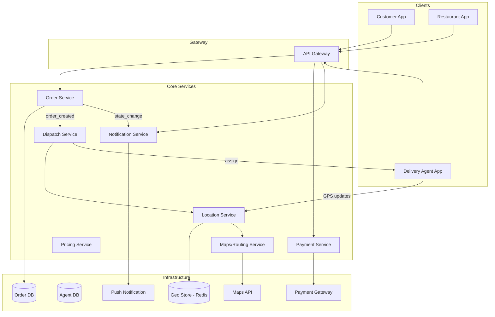
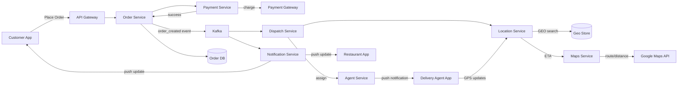

# Design Food Delivery System

## Blogs and websites

## Medium

## Youtube

- [System Design Interview: Design Zomato | Swiggy | Uber Eats | DoorDash w/ a Senior Software Engineer](https://www.youtube.com/watch?v=YDrvLsF3L20)

---

## Theory

### What Is It?

A food delivery system (Zomato, Swiggy, Uber Eats, DoorDash) connects customers ordering food from restaurants with delivery partners who pick up and deliver orders — all coordinated through a digital platform. The system orchestrates three distinct parties (customer, restaurant, delivery agent) in real-time, managing order creation, payment, restaurant preparation, delivery assignment, tracking, and feedback. The challenge is coordinating geographically distributed parties with different latencies — a delivery agent may be 10 minutes away, the restaurant may take 15 minutes to prepare, and the customer expects delivery in 30 minutes.

### Why Does It Exist?

Physical restaurants serve walk-in or phone-order customers — capacity limited to their immediate vicinity. Food delivery platforms extend reach to anyone with a smartphone, increasing restaurant utilization and providing convenience to customers who want food without leaving home. The platform also creates economic value: delivery agents earn income, restaurants get more orders, and the platform takes a commission.

### What Problem Does It Solve?

* **Multi-party coordination**: A single order involves a customer (placing order + paying), a restaurant (preparing food), and a delivery agent (picking up + delivering). All must be synchronized in real-time.
* **Real-time location tracking**: Customers and restaurants need to see the delivery agent's location and ETA in real-time.
* **Dynamic delivery assignment**: When an order is placed, which of the nearby delivery agents should pick it up? The system must assign dynamically based on proximity and availability.
* **Surge pricing and incentives**: During peak demand, delivery fees increase to attract more agents; incentives motivate agents to work in low-supply areas.
* **Order state management**: Orders go through states (placed → confirmed → preparing → ready → picked up → delivering → delivered) — each transition must be tracked and communicated.
* **Payment orchestration**: Split payments (customer pays restaurant + delivery fee + platform fee + tip), handle refunds, and manage cash-on-delivery.
* **Time estimation**: Restaurant prep time + delivery time must be estimated accurately — over-promise leads to customer dissatisfaction; under-promise loses competitiveness.

### Important Subtopics

1. Order lifecycle and state management
2. Delivery agent assignment and dispatch
3. Real-time location tracking and ETA calculation
4. Surge pricing and incentive systems
5. Payment orchestration and wallet management
6. Restaurant onboarding and availability management
7. Rating and feedback systems
8. Cold chain logistics for perishable goods

## Characteristics

| Characteristic | What it means | Why it matters | How it works |
|---|---|---|---|
| **Multi-sided marketplace** | Platform connects customers, restaurants, delivery agents | Each side has different needs and economics | Separate apps/interfaces; commission-based pricing |
| **Geospatial coordination** | Delivery agents move in physical space | Proximity and routing determine efficiency | GPS tracking; nearest-neighbor assignment; route optimization |
| **Real-time state** | Order status changes in real-time | All parties need current status | WebSocket/gRPC streaming; state machines |
| **Dynamic pricing** | Prices fluctuate based on demand | Balances supply and demand | Surge multiplier based on demand/supply ratio |
| **Time-critical** | Food gets cold; delivery must be timely | Customer satisfaction depends on speed | ETA prediction; dynamic agent assignment |
| **Payment split** | Multiple parties need payment settlement | Complex financial reconciliation | Payment gateway + wallet + split settlement |

## Components

| Component | Purpose | Responsibilities | Relationship | Real-world Example |
|---|---|---|---|---|
| **Customer App** | Place orders | Browse restaurants, select items, pay, track delivery | Calls Order Service, Payment Service | Zomato/Swiggy app |
| **Restaurant App** | Manage orders | View incoming orders, update status (preparing, ready) | Calls Order Service | Restaurant tablet app |
| **Delivery Agent App** | Fulfill deliveries | View assigned orders, navigate, update status | Calls Dispatch Service, Location Service | Swiggy Genie app |
| **Order Service** | Manage order lifecycle | State machine, order creation, status transitions | Calls Payment, Dispatch, Restaurant services | Backend order service |
| **Dispatch Service** | Assign orders to agents | Find nearest available agent, assign order | Calls Location Service, Agent Service | Real-time dispatch engine |
| **Location Service** | Track agent positions | Real-time GPS tracking, ETA calculation | Consumes GPS from Agent App; calls Maps Service | Google Maps + Redis |
| **Maps/Routing** | Navigation and ETAs | Route optimization, travel time estimation | External API (Google Maps, OSRM) | Google Maps API |
| **Payment Service** | Handle payments | Split payments, refunds, wallet management | Integrates with PSPs (Stripe, Razorpay) | Stripe/Razorpay |
| **Pricing Service** | Dynamic pricing | Surge calculation, delivery fee, commission | Consumes demand/supply signals | Surge pricing engine |
| **Notification Service** | Send alerts | SMS, push, in-app notifications | Listens to order events | FCM/APNs/SMS provider |

### Component Interactions

1. **Order placement**: Customer App → Order Service (create order) → Payment Service (charge) → Dispatch Service (assign agent) → Restaurant App (order notification).
2. **Delivery**: Dispatch Service → Location Service (find nearest agent) → Agent App (new order notification) → Location Service tracks progress → ETA updates to Customer App.
3. **State updates**: Any state change (order confirmed, picked up, delivered) → Notification Service → push to relevant apps.

## Patterns

### Real-Time Location Tracking with Geospatial Indexing

* **What**: Track delivery agents' GPS positions in real-time and find the nearest available agent to a restaurant/order location.
* **Problem solved**: Efficiently matching orders to nearby agents without scanning all agents.
* **How it works**: Agent App sends GPS coordinates every 10 seconds → Location Service stores in Redis with GEO commands → Dispatch Service queries `GEOSEARCH` with radius (e.g., 5 km) around the restaurant → returns nearest N available agents.
* **When to use**: When real-time location-based matching is needed.
* **When not to use**: When agents don't move (static assignment) — over-engineering.
* **Advantages**: O(log N) nearest-neighbor queries; real-time position updates.
* **Disadvantages**: GPS accuracy issues; network latency in position updates; Redis GEO memory overhead.
* **Java/Spring Boot example**:
```java
@Service
public class DispatchService {
    private final RedisGeoCommands<String, String, Double> geoOps;

    public String assignNearestAgent(String restaurantLat, String restaurantLng, String orderId) {
        // Find available agents within 5km
        List<RedisGeoCommands.GeoRadiusResponse> nearby = 
            geoOps.geoRadius("available_agents", restaurantLat, restaurantLng, 5.0, Metric.KILOMETERS);
        
        if (nearby.isEmpty()) return null;
        
        // Pick closest available agent
        String agentId = nearby.get(0).getMemberName();
        assignOrder(agentId, orderId);
        return agentId;
    }
}
```
* **Real-world example**: Uber's dispatch system, Swiggy's real-time agent tracking.

### Order State Machine

* **What**: Each order progresses through a well-defined state machine with explicit states and allowed transitions.
* **Problem solved**: Preventing invalid state transitions (can't deliver before picking up) and ensuring all parties are notified of state changes.
* **How it works**: Order Service maintains order state (PLACED → CONFIRMED → PREPARING → READY → PICKED_UP → DELIVERING → DELIVERED → COMPLETED). Each transition triggers events (notifications, payment capture, agent assignment).
* **When to use**: When order lifecycle has clear states and transitions.
* **When not to use**: Simple linear workflows without branching.
* **Advantages**: Prevents invalid operations; provides clear audit trail; enables proper notification routing.
* **Disadvantages**: State machine complexity; need to handle all transition edge cases.
* **Real-world example**: Swiggy/Zomato order status tracking.

## Benefits

* **Increased restaurant revenue**: Access to customers beyond walk-in traffic; restaurants can increase utilization during off-peak hours.
* **Customer convenience**: Order food without leaving home; track delivery in real-time; multiple payment options.
* **Delivery agent income**: Gig workers earn flexible income with low barrier to entry.
* **Marketplace network effects**: More restaurants attract more customers; more customers attract more agents and restaurants.
* **Data insights**: Demand patterns, popular cuisines, delivery hot zones — valuable for restaurants, agents, and the platform.
* **Dynamic pricing**: Balances supply and demand, ensuring availability during peaks while maintaining profitability.

## Pros

* **Network effects**: Platform value increases with each new restaurant, customer, and delivery agent.
* **Real-time tracking**: GPS tracking provides transparency — customers know exactly where their food is.
* **Dynamic pricing**: Surge pricing ensures delivery availability during high-demand periods (rain, lunch/dinner rush).
* **Multi-payment options**: Credit cards, digital wallets, UPI, cash-on-delivery.
* **Flexible gig work**: Delivery agents can work whenever and wherever they want.

## Cons

* **High customer acquisition cost**: Competing on delivery fees and discounts erodes margins.
* **Delivery agent churn**: High turnover; competition for agents during peak hours.
* **Food quality degradation**: Food gets cold during transit; the platform has limited control over restaurant quality.
* **Traffic and logistics complexity**: Urban traffic, parking, and building security delays delivery.
* **Regulatory uncertainty**: Labor classification of gig workers varies by jurisdiction.
* **Weather dependency**: Rain or extreme weather reduces supply of delivery agents.

## Challenges

### Technical Challenges

* **Real-time dispatch**: Matching orders to agents within seconds; the agent list changes rapidly (agents accept/decline).
* **ETA accuracy**: Predicting delivery time requires factoring restaurant prep time, traffic, weather, agent availability — all dynamic.
* **GPS accuracy**: Urban canyons and tunnels cause GPS inaccuracies; the system must handle position jumps.
* **Payment orchestration**: Split payments across multiple parties (restaurant, platform, agent, tip); handle failures and refunds.

### Scalability Challenges

* **Peak hour demand**: Lunch/dinner rush creates 5-10x normal order volume. The system must scale agents (incentives) and infrastructure simultaneously.
* **Geographic expansion**: Each new city requires mapping restaurants, recruiting agents, and tuning pricing/dispatch algorithms.
* **Concurrent order management**: Millions of orders per day, each with a state machine and real-time location tracking.

### Performance Challenges

* **Dispatch latency**: From order placement to agent assignment should be < 30 seconds.
* **Location update frequency**: Agent positions update every 10 seconds; the system must process millions of GPS updates per minute.
* **ETA accuracy**: Target 80% of deliveries within the promised ETA window.

### Reliability Challenges

* **Agent no-shows**: Assigned agents may not pick up orders — need backup assignment and customer notification.
* **Payment failures**: Card declines, wallet issues — need fallback payment methods and graceful degradation.
* **Restaurant stockouts**: Items ordered may be sold out — need real-time menu sync and customer substitution options.

### Maintainability Challenges

* **City-specific tuning**: Dispatch algorithms, pricing, and ETAs must be tuned per city (different traffic patterns, restaurant types).
* **Fraud detection**: Fake orders, payment fraud, agent fraud (fake deliveries).
* **Rate limiting**: Restaurant partners and agents must not be overwhelmed by too many orders.

### Operational Challenges

* **Supply-demand imbalance**: During rain or peak hours, demand surges but supply (agents) may not. Need dynamic incentives.
* **Quality control**: Monitoring restaurant ratings, agent ratings, and customer complaints.
* **Customer support**: Handling order issues, missing items, late deliveries, refund requests.

### Security Concerns

* **Payment security**: PCI-DSS compliance; secure storage of payment tokens.
* **Location privacy**: Agent and customer locations are sensitive — minimize data retention.
* **Account takeover**: Fraudulent account access for free orders.
* **Data accuracy**: Manipulating ratings/reviews to game the system.

## Best Practices

* **Idempotent order creation**: Use an idempotency key (order_id) so retries don't create duplicate orders.
* **Optimistic dispatch**: Assign an order to an agent immediately (optimistically), then let the agent accept or decline. Reduces wait time vs. finding the "perfect" agent.
* **Batch location updates**: Don't process every GPS ping individually — batch updates and use smoothing algorithms to reduce noise.
* **ETA with confidence intervals**: Provide a range (25-35 min) rather than a single number; adjust based on historical accuracy.
* **Graceful degradation**: If real-time tracking is down, show "order confirmed" and poll; if payment split fails, fall back to single-charge + manual reconciliation.
* **Dynamic incentives**: Increase delivery fees and agent bonuses when supply drops below demand threshold (e.g., < 10 agents per 10 sq km).
* **Multi-CDN for maps**: Use multiple maps providers (Google Maps, Mapbox, OSRM) for redundancy and cost optimization.

## When to Use

### Appropriate

* When connecting supply (delivery agents) with demand (customers) in real-time is core to the business.
* When geographic proximity and routing matter (last-mile delivery).
* When multi-party payment settlement is needed.
* When real-time location tracking is a key feature.
* When demand is variable (need dynamic pricing/supply management).

### Not Appropriate

* When delivery is not needed (pickup-only model).
* When the geographic area is very small (single building/campus) — simpler solutions exist.
* When delivery agents are employees (fixed schedule) — dynamic dispatch isn't needed.
* When demand is predictable and flat (no surge pricing needed).

### Alternatives

* **Pickup-only**: Customers pick up from the restaurant (no delivery fleet needed).
* **Scheduled delivery**: Pre-scheduled deliveries (not real-time dispatch).
* **Third-party logistics**: Use existing logistics platforms (FedEx, UPS) for delivery.

### Decision Factors

* **Agent density**: Higher agent density → faster dispatch, lower delivery fees.
* **Order volume**: Higher volume → need more sophisticated dispatch algorithms.
* **Geographic density**: Dense urban areas → easier dispatch; rural areas → harder.
* **Customer expectations**: Real-time tracking vs. scheduled delivery.
* **Restaurant integration**: API integration vs. tablet-based order management.

## Use Cases

### Lunch Rush Dispatch Optimization

* **Problem**: 100x order volume during lunch (12-2 PM); not enough delivery agents.
* **Solution**: Pre-position agents in high-demand zones; increase delivery fees (surge); batch nearby orders for the same agent; extend prep time ETAs to spread restaurant load.
* **Why suitable**: Food delivery is inherently time-sensitive; surge pricing balances supply and demand.
* **How it works**: Demand prediction model forecasts lunch rush demand per zone → pre-position agents via shift scheduling → surge multiplier increases 2-5x → batched delivery (one agent picks up multiple orders from the same restaurant).
* **Trade-offs**: Higher fees may reduce order volume; batching increases some customers' wait time.

### Rainy Weather Surge Management

* **Problem**: Rain reduces delivery agent supply (agents don't want to ride bikes in rain) while demand stays high.
* **Solution**: Surge pricing (3-5x delivery fees); incentives for agents who work during rain; ETA extensions to manage expectations; umbrella/rain gear provision.
* **Why suitable**: Dynamic pricing is the core mechanism to balance supply and demand.
* **How it works**: Weather API detects rain → supply prediction model estimates agent availability drop → surge multiplier auto-increases → agents see higher payouts per delivery → more agents come online → system stabilizes.
* **Trade-offs**: Customer dissatisfaction with higher fees; platform takes a larger revenue cut from restaurants during surge.

### Cash-on-Delivery Risk Management

* **Problem**: Cash-on-delivery orders risk non-payment (customer refuses to pay, agent pockets cash).
* **Solution**: Limit COD orders per customer based on payment history; require partial pre-authorization; track agent COD performance (success rate); blacklist high-risk customers/agents.
* **Why suitable**: COD is essential in markets where digital payment adoption is low.
* **How it works**: Customer places COD order → system checks historical on-time payment rate → if < 80%, require 20% pre-payment via app → agent picks up order with cash → upon delivery, customer pays in cash → system reconciles.
* **Trade-offs**: Friction for legitimate customers; need trust scoring model.

## Architecture

A food delivery system uses a **microservice architecture** with geospatial services, real-time dispatch, and state machines for order management. The system integrates with external maps (Google Maps, OSRM) for routing, external payment processors (Stripe, Razorpay) for payment, and push-notification services (FCM, APNs) for delivery updates. Core services include Order Service (state machine), Dispatch Service (real-time agent assignment), Location Service (GPS tracking), and Payment Service (split payments).



### Architecture Structure

* **Edge layer**: Mobile apps (Customer, Restaurant, Agent) → API Gateway with auth, rate limiting, geo-routing.
* **Service layer**: Order Service (state machine), Dispatch Service (matching), Location Service (GPS), Payment Service (split payment), Pricing Service (surge), Notification Service (alerts).
* **Data layer**: Order DB (Postgres sharded by order_id), Agent DB (agent profiles + status), Geo Store (Redis GEO for real-time positions), Payment gateway integration.
* **External services**: Maps API (Google Maps/OSRM), Payment gateway (Stripe/Razorpay), Push notifications (FCM/APNs).

### Communication

* **Synchronous**: Client → API → services (REST/gRPC) for user-facing requests.
* **Asynchronous**: Order Service → Kafka → Dispatch Service (assign agent), → Payment Service (charge), → Notification Service (notify). GPS updates via WebSocket.
* **Streaming**: Location Service streams GPS data via WebSocket to clients for real-time tracking.

### Data Flow

1. **Order placement**: Customer App → API Gateway → Order Service (create order) → Payment Service (charge) → Kafka `order_created` → Dispatch Service (find agent).
2. **Dispatch**: Dispatch Service → Location Service (nearest agents via Redis GEO) → assigns to Agent App → Agent App accepts → updates Location Service.
3. **Tracking**: Agent App sends GPS → Location Service → stores in Redis → computes ETA via Maps API → pushes to Customer App via WebSocket.
4. **State transitions**: Restaurant App updates status → Order Service → Kafka event → Notification Service → push updates to all parties.

### Scaling Strategy

* **Order Service**: Shard by order_id hash; stateless application servers for horizontal scaling.
* **Dispatch Service**: Parallel agent lookup per order; pre-compute agent availability zones.
* **Location Service**: Redis cluster with GEO commands; shard by city/region.
* **Maps routing**: Cache popular routes; batch ETA requests.

### Failure Handling

* **Dispatch timeout**: If no agent accepts within 60 seconds, re-dispatch to next nearest agent.
* **GPS failure**: Use last-known location + dead reckoning (estimate position based on last heading/speed).
* **Payment failure**: Fall back to alternative payment method; offer COD.
* **Restaurant overload**: If a restaurant can't fulfill, reassign order to nearby restaurant (if configured).

## High-Level Design



**Order placement flow**:
1. Customer selects items → Checkout → Payment Service charges card/wallet.
2. Payment confirmed → Order Service creates order (PLACED state) → persists to Order DB → publishes `order_created` to Kafka.
3. Kafka → Dispatch Service → queries Location Service for nearest available agent (Redis GEO search within 5 km).
4. Dispatch Service assigns order → Agent Service → push notification to Agent App.
5. Agent accepts → Location Service tracks GPS → ETA computed via Maps API.
6. All state changes → Kafka → Notification Service → push to Customer App, Restaurant App.

**Delivery tracking flow**:
1. Agent App sends GPS every 10 seconds → Location Service (Redis GEO update + ETA recalculation).
2. Location Service → Maps Service → computes route/time → ETA.
3. Location Service → WebSocket → Customer App shows real-time agent position + ETA updates.

## Deep Dive

### Internal Implementation: Real-Time Dispatch

The Dispatch Service must assign orders to agents within seconds. The algorithm:

1. **Candidate selection**: Query Redis GEO for all available agents within radius R (e.g., 5 km) of the restaurant. Use `GEOSEARCH key longitude latitude RADIUS unit`.
2. **Scoring**: For each candidate, compute a score based on:
   * Distance to restaurant (shorter = better)
   * Agent's current load (fewer active orders = better)
   * Agent's acceptance rate (higher = better — don't send to agents who reject often)
   * Historical ETA accuracy (agents who deliver on time get higher priority)
3. **Optimization**: Pick the agent with the highest score. If no agent is within radius, gradually expand the search radius.
4. **Assignment**: Send push notification to the agent; the agent has 60 seconds to accept. If declined or timed out, try the next agent.

```java
@Service
public class DispatchService {
    public AssignmentResult assignOrder(String orderId, String restaurantId, 
                                         double restLat, double restLng) {
        // 1. Find candidates within 5km
        List<Agent> candidates = locationService.findNearbyAgents(restLat, restLng, 5.0);
        
        if (candidates.isEmpty()) {
            return AssignmentResult.noAgentsAvailable();
        }
        
        // 2. Score each candidate
        candidates.sort((a, b) -> Double.compare(
            scoreAgent(b, restLat, restLng), 
            scoreAgent(a, restLat, restLng)
        ));
        
        // 3. Try assignment (with timeout handling)
        for (Agent agent : candidates) {
            if (notificationService.pushAssignment(agent.getId(), orderId, 60)) {
                return AssignmentResult.assigned(agent.getId(), orderId);
            }
            // Agent declined or timed out — try next
        }
        
        return AssignmentResult.noAgentsAvailable();
    }
    
    private double scoreAgent(Agent agent, double restLat, double restLng) {
        double distance = locationService.distance(agent.getLat(), agent.getLng(), restLat, restLng);
        double score = 1.0 / (distance + 1.0); // closer = higher score
        score *= agent.getAcceptanceRate(); // penalize rejecters
        score *= agent.getActiveOrderCount() < 3 ? 1.0 : 0.5; // penalize overloaded
        return score;
    }
}
```

### ETA Calculation

ETA = restaurant_prep_time + travel_time + buffer

* **restaurant_prep_time**: Estimated from historical data for this restaurant × dish (e.g., "Chicken Biryani" at Restaurant X takes 18 ± 3 minutes) + current order backlog.
* **travel_time**: Computed via Maps API (Google Maps Distance Matrix) using live traffic data. Route from restaurant → agent → customer (pickup + delivery).
* **buffer**: 5–10 minutes for unforeseen delays (traffic, finding parking, building access).

The system recalculates ETA every 30 seconds as the agent moves and new traffic data arrives.

### Payment Orchestration

Modern food delivery uses a **split payment** model:
1. Customer pays: item_cost + delivery_fee + taxes + tip + platform_fee.
2. Settlement: restaurant gets item_cost (minus commission), agent gets delivery_fee + tip, platform keeps commission + delivery_fee margin.
3. For cash-on-delivery: agent collects cash, deposits to platform, platform settles to restaurant after a delay.

```java
@Service
public class PaymentService {
    @Transactional
    public PaymentResult processOrderPayment(Order order) {
        BigDecimal itemCost = order.getItemTotal();
        BigDecimal deliveryFee = pricingService.calculateDeliveryFee(order);
        BigDecimal discount = order.getDiscount();
        BigDecimal tip = order.getTip();
        BigDecimal total = itemCost.add(deliveryFee).add(tip).subtract(discount);
        
        // Charge customer
        PaymentIntent intent = paymentGateway.charge(
            order.getCustomerId(), 
            total, 
            "Food delivery for order " + order.getId());
        
        if (intent.getStatus() != PaymentStatus.SUCCEEDED) {
            throw new PaymentFailedException(intent.getFailureReason());
        }
        
        // Record splits for settlement
        paymentLedger.recordSplit(PaymentSplit.builder()
            .orderId(order.getId())
            .recipient(StripeAccount.of(order.getRestaurant().getAccountId()))
            .amount(itemCost.multiply(BigDecimal.valueOf(0.95))) // 5% commission
            .build());
        paymentLedger.recordSplit(PaymentSplit.builder()
            .orderId(order.getId())
            .recipient(Wallet.of(order.getAgentId()))
            .amount(deliveryFee.add(tip))
            .build());
        
        return PaymentResult.success(intent.getTransactionId());
    }
}
```

### Surge Pricing Engine

Surge pricing balances supply and demand in real-time:

1. **Demand forecast**: Predicted order volume for each zone for the next 30 minutes (based on historical + real-time signals).
2. **Supply forecast**: Available agents per zone (from Location Service).
3. **Ratio calculation**: demand / supply. If > 1.0, there's a shortage.
4. **Multiplier**: `multiplier = 1 + min(4, (demand/supply - 1) * 0.5)` — capped at 5x.
5. **Incentives**: Higher multiplier → larger agent bonus → more agents come online.

```java
@Service
public class SurgePricingService {
    public BigDecimal calculateSurge(String zoneId) {
        double predictedDemand = demandPredictor.predict(zoneId, Duration.ofMinutes(30));
        int availableSupply = locationService.countAvailableAgents(zoneId, 5.0);
        
        if (availableSupply == 0) return BigDecimal.valueOf(5.0);
        
        double ratio = predictedDemand / availableSupply;
        double surge = 1.0 + Math.min(4.0, (ratio - 1.0) * 0.5);
        return BigDecimal.valueOf(surge).setScale(2, RoundingMode.HALF_UP);
    }
}
```

## Java and Spring Boot Implementation

### Basic Java Implementation — Order State Machine

```java
public enum OrderStatus {
    PLACED,       // Order created, payment pending
    CONFIRMED,    // Payment succeeded, dispatching
    PREPARING,    // Restaurant confirmed, cooking
    READY,        // Food ready for pickup
    PICKED_UP,    // Agent picked up the order
    DELIVERING,   // Agent is delivering
    COMPLETED,    // Delivered to customer
    CANCELLED,    // Cancelled by user or system
    FAILED        // Could not complete
}

@Entity
@Table(name = "orders")
public class Order {
    @Id
    private String orderId;
    private String customerId;
    private String restaurantId;
    private String agentId;
    private BigDecimal totalAmount;
    private OrderStatus status;
    private LocalDateTime createdAt;
    private LocalDateTime updatedAt;

    // State transition validation
    public boolean canTransitionTo(OrderStatus newStatus) {
        return switch (this.status) {
            case PLACED -> Set.of(CONFIRMED, CANCELLED, FAILED).contains(newStatus);
            case CONFIRMED -> Set.of(PREPARING, CANCELLED, FAILED).contains(newStatus);
            case PREPARING -> Set.of(READY, CANCELLED, FAILED).contains(newStatus);
            case READY -> Set.of(PICKED_UP, CANCELLED, FAILED).contains(newStatus);
            case PICKED_UP -> Set.of(DELIVERING, CANCELLED, FAILED).contains(newStatus);
            case DELIVERING -> Set.of(COMPLETED, FAILED).contains(newStatus);
            default -> false;
        };
    }
}
```

### Spring Boot — Dispatch Controller

```java
@RestController
@RequestMapping("/api/v1/dispatch")
@RequiredArgsConstructor
public class DispatchController {
    private final DispatchService dispatchService;
    private final LocationService locationService;

    @PostMapping("/assign")
    public ResponseEntity<AssignmentResponse> assignOrder(
            @RequestBody AssignOrderRequest request) {
        
        AssignmentResult result = dispatchService.assignOrder(
            request.getOrderId(),
            request.getRestaurantId(),
            request.getLatitude(),
            request.getLongitude()
        );

        if (result.isAssigned()) {
            return ResponseEntity.ok(AssignmentResponse.builder()
                .agentId(result.getAgentId())
                .etaMinutes(result.getEtaMinutes())
                .status("ASSIGNED")
                .build());
        }

        return ResponseEntity.status(HttpStatus.CONFLICT)
            .body(AssignmentResponse.builder()
                .status("NO_AGENTS_AVAILABLE")
                .message("No delivery agents available nearby")
                .build());
    }
}

@Service
public class DispatchService {
    private final LocationService locationService;
    private final AgentService agentService;
    private final NotificationService notificationService;

    @Transactional
    public AssignmentResult assignOrder(String orderId, String restaurantId,
                                         double lat, double lng) {
        List<Agent> candidates = locationService.findNearbyAvailableAgents(lat, lng, 5.0);
        
        if (candidates.isEmpty()) {
            return AssignmentResult.noAgents();
        }

        // Score and sort
        candidates.sort(Comparator.comparing(
            (Agent a) -> scoreAgent(a, lat, lng)).reversed());

        // Try top 3 candidates
        for (int i = 0; i < Math.min(3, candidates.size()); i++) {
            Agent agent = candidates.get(i);
            if (notificationService.sendAssignment(agent.getId(), orderId, 60)) {
                agentService.assignOrder(agent.getId(), orderId);
                double eta = calculateEta(lat, lng, agent.getLat(), agent.getLng());
                return AssignmentResult.assigned(agent.getId(), (int) eta);
            }
        }

        return AssignmentResult.noAgents();
    }

    private double scoreAgent(Agent agent, double restLat, double restLng) {
        double distance = haversineDistance(agent.getLat(), agent.getLng(), restLat, restLng);
        double score = 1.0 / (distance + 1.0);
        score *= agent.getAcceptanceRate() / 100.0;
        score *= (agent.getActiveOrders() < 3) ? 1.0 : 0.1;
        return score;
    }
}
```

### Testing Example

```java
@SpringBootTest
class DispatchServiceTest {
    @MockBean private LocationService locationService;
    @MockBean private AgentService agentService;
    @MockBean private NotificationService notificationService;

    @Test
    void shouldAssignNearestAvailableAgent() {
        when(locationService.findNearbyAvailableAgents(12.97, 77.59, 5.0))
            .thenReturn(List.of(
                new Agent("agent_1", 12.97, 77.59, 0.9, 0),
                new Agent("agent_2", 12.98, 77.59, 0.8, 0)
            ));
        when(notificationService.sendAssignment("agent_1", "order_1", 60))
            .thenReturn(true);

        AssignmentResult result = dispatchService.assignOrder(
            "order_1", "rest_1", 12.97, 77.59);

        assertThat(result.isAssigned()).isTrue();
        assertThat(result.getAgentId()).isEqualTo("agent_1");
        verify(agentService).assignOrder("agent_1", "order_1");
    }

    @Test
    void shouldRetryIfFirstAgentDoesNotAccept() {
        when(locationService.findNearbyAvailableAgents(anyDouble(), anyDouble(), anyDouble()))
            .thenReturn(List.of(
                new Agent("agent_1", 12.97, 77.59, 0.5, 0),
                new Agent("agent_2", 12.98, 77.59, 0.9, 0)
            ));
        when(notificationService.sendAssignment("agent_1", "order_1", 60))
            .thenReturn(false); // agent_1 doesn't accept
        when(notificationService.sendAssignment("agent_2", "order_1", 60))
            .thenReturn(true);

        AssignmentResult result = dispatchService.assignOrder("order_1", "rest_1", 12.97, 77.59);

        assertThat(result.getAgentId()).isEqualTo("agent_2");
    }
}
```

## Real-World Examples

### Swiggy's Real-Time Dispatch

Swiggy processes 1.5+ million orders per day across 600+ cities. Their dispatch system uses a real-time matching algorithm that considers agent location (GPS updated every 8 seconds), agent availability, historical pickup times, and current traffic. When an order is placed, the system finds 3-5 nearby agents, scores them, and sequentially pushes assignments (with 60-second acceptance windows). During peak hours, they dynamically increase the search radius and offer incentives to agents in low-supply zones.

### Zomato's Surge Pricing

Zomato's pricing engine calculates delivery fees dynamically based on demand-supply ratios per zone per 5-minute window. During the IPL final match, their system detected 10x demand in Mumbai's Bandra zone and automatically triggered a 4x surge, along with push notifications to nearby agents offering 50% bonus to come online. This brought agent supply from 45 to 120 in 20 minutes, stabilizing the market.

### DoorDash's Predictive Dispatch

DoorDash uses ML models to predict order volume and agent supply 30 minutes ahead, pre-positioning agents in expected hotspots. Their system also handles "batch delivery" — assigning one agent multiple orders from the same restaurant to improve efficiency. During the pandemic, they adapted for contactless delivery and expanded to grocery/retail delivery, fundamentally changing the dispatch algorithms.

## Interview Preparation

### Beginner Questions

**Q1: How does Uber's dispatch system work?**
A: When a rider requests a ride, the system finds nearby drivers using geospatial indexing (Redis GEO or GeoHash). It calculates ETAs based on current traffic (Google Maps API). The system then selects the best driver based on proximity, rating, ETA, and driver state. The driver has 15 seconds to accept; if they decline, the system tries the next driver. This is essentially the same as food delivery dispatch but with shorter distances and different scoring.

**Q2: How do you handle real-time location tracking?**
A: Delivery agents' phones send GPS coordinates every 8-10 seconds via an API call (HTTP POST to Location Service). The service stores positions in Redis with GEO commands (`GEOADD`) for efficient radius queries. To reduce GPS noise, apply Kalman filtering or simple smoothing. For ETA calculation, use the Maps API's Distance Matrix with live traffic data. Push real-time position to customers via WebSocket for the tracking UI.

**Q3: How does surge pricing work?**
A: The system tracks demand (orders placed per minute per zone) and supply (available agents per zone). When demand exceeds supply by a threshold, the surge multiplier increases (e.g., 1.2x, 1.5x, up to 5x). This increases delivery fees, attracting more agents (higher pay per delivery) while managing customer demand (higher prices → some customers delay ordering). The multiplier is recalculated every 5 minutes based on predicted demand/supply for the next 30 minutes.

### Intermediate Questions

**Q4: How would you design the order state machine?**
A: Each order has a status field with allowed transitions. PLACED → CONFIRMED (payment succeeded) → PREPARING (restaurant accepted) → READY (food ready) → PICKED_UP (agent picked up) → DELIVERING → COMPLETED. At each step, the system publishes events (order_confirmed, order_picked_up) that trigger actions (notify customer, update agent's active_orders). Invalid transitions are rejected. Timeouts: if order isn't confirmed within 60 seconds, auto-cancel. If agent doesn't pick up within 15 minutes of READY, re-assign.

**Q5: How do you handle GPS inaccuracy in urban canyons?**
A: (1) Kalman filtering or moving-average smoothing to reduce jitter. (2) Dead reckoning — if GPS is lost, estimate position based on last heading/speed. (3) WiFi/Cell tower fallback for coarse positioning. (4) Geofencing — snap positions to known locations (restaurant, customer address). (5) Display "position accuracy: low" to the customer when GPS is poor. (6) Use Google's fused location provider (combines GPS, WiFi, cell, sensors) instead of raw GPS.

**Q6: How do you ensure a customer gets their order if the assigned agent cancels?**
A: When an agent cancels (or doesn't accept within the timeout), the system immediately re-dispatches to the next nearest agent. The customer is notified: "Finding a new delivery agent." The order state doesn't advance — it stays in CONFIRMED (or reverts to DISPATCHING). The system tries 3-5 agents before alerting a human dispatcher. All reassignment events are logged for analysis.

**Q7: How do you handle cash-on-delivery reconciliation?**
A: (1) Agent collects cash, enters the amount in the app, and submits a photo of the receipt. (2) The system records the collected amount against the order. (3) Periodic reconciliation: compare orders marked as "collected" vs. "delivered" — discrepancies trigger investigation. (4) Agents must deposit cash at designated points daily — the system tracks daily collection targets. (5) Risk scoring: customers with high COD refusal rates get COD limits or are moved to pre-paid only.

### Advanced Questions

**Q8: How would you handle 10x order volume during a flash sale or IPL match final?**
A: (1) **Pre-warming**: Scale API Gateway, Order Service, and Dispatch Service to 5x capacity. (2) **Agent recruitment**: Push incentives to agents in high-demand zones — "Earn 3x today in Zone X." (3) **Order batching**: Allow one agent to pick up multiple orders from the same restaurant (reduce agent travel). (4) **Queueing**: If dispatch can't find agents, queue orders and extend ETAs transparently. (5) **Rate limiting**: Temporarily increase minimum order value to smooth demand. (6) **Restaurant support**: Help restaurants scale prep (additional kitchen staff, pre-prepping popular items). (7) **Degraded UX**: Show "high demand — delivery may be delayed" instead of failing.

**Q9: How do you handle the "agent is at the restaurant but food isn't ready" problem?**
A: (1) The Restaurant App shows "order ready" status — agent should not leave until confirmed. (2) The system tracks historical prep times per restaurant × dish — if prep is consistently slow, increase the default ETA. (3) The agent app shows a countdown timer ("Restaurant says 5 more minutes"). (4) If the agent marks "arrived at restaurant" but the restaurant doesn't mark "ready" within X minutes, the system alerts the restaurant. (5) Compensation: if the agent waits too long, offer a wait-time bonus.

**Q10: How do you design the ETA prediction to be accurate?**
A: ETA = prep_time + travel_time + buffer. (1) Prep time: historical average for that restaurant × dish, adjusted for current order backlog and time of day. ML model trained on historical prep data. (2) Travel time: Google Maps API with live traffic, from agent's current location → restaurant → customer. (3) Buffer: 5-10 minutes for unforeseen delays. (4) Continuous recalculation: re-estimate every 30 seconds as the agent moves and new traffic data arrives. (5) Confidence intervals: show "25-35 min" rather than a single number.

### Senior-Level Questions

**Q11: How would you redesign the system for drone delivery?**
A: Drone delivery changes several assumptions: (1) **Range**: drones have limited range (~10 km) → need drone hubs within delivery range of customers. (2) **Weight**: limited payload → can't deliver large orders → need order batching optimization. (3) **Weather**: drones can't fly in rain/wind → need weather-aware dispatch and ETA adjustment. (4) **Battery**: must return to base before battery dies → need charging stations. (5) **Regulations**: FAA/EASA approval, no-fly zones, altitude limits. (6) **Tracking**: GPS precision is higher (centimeter-level RTK GPS) but signal can be lost indoors. Design: drone hubs per city, route optimization with no-fly zones, weather-aware dispatch (switch to ground agents when drones are grounded), battery-aware scheduling (reserve 20% for return).

**Q12: How do you handle cross-border/international delivery?**
A: (1) **Restaurant onboarding**: verify business licenses, tax registrations per country. (2) **Pricing**: currency conversion; local payment methods (PIX in Brazil, UPI in India). (3) **Agent availability**: in new markets, need to recruit and verify agents (background checks, vehicle registration). (4) **Regulatory compliance**: data residency (GDPR in EU), labor laws (contractor vs employee), food safety regulations. (5) **Maps/navigation**: local map providers (Baidu in China, Yandex in Russia). (6) **Customer support**: local language support, local business hours.

### System Design Questions (Senior)

**Q13: Design a food delivery system for a city with 5 million residents.**

**Approach**:
- **Order volume**: Assume 2% of population orders per day = 100K orders/day = ~70 orders/minute average, ~350/minute peak (lunch/dinner).
- **Restaurant count**: ~5,000 restaurants; each active ~30% at any time.
- **Delivery agent pool**: Need ~1,000 active agents during peak (1 agent per 7 orders; each handles ~7 orders/hour).
- **Geographic zones**: Divide city into 50 zones (~100K people each); 20 agents per zone during peak.
- **Architecture**: Microservices (Order, Dispatch, Location, Payment, Pricing) with Kafka event bus; Redis GEO for agent positions; Postgres sharded by zone; Google Maps for routing.
- **Scaling**: Auto-scale services based on order volume; pre-warm during predicted peaks.
- **Redundancy**: Multi-zone deployment within the city; if one zone's agents are depleted, spill over to adjacent zones.
- **Data consistency**: Order DB is source of truth; eventual consistency for agent positions and ETAs.
- **Monitoring**: Track dispatch success rate, ETA accuracy, order completion rate, agent utilization.
- **Failure handling**: If no agents available, queue orders with extended ETAs; if payment gateway down, offer COD; if maps API down, use last-known routes.

**Expected discussion points**: Geographic partitioning strategy, agent-to-zone ratio, ETA vs. dispatch latency trade-offs, handling agent churn, surge pricing algorithms, payment failure handling, and cross-zone agent overflow.

**Q14: How would you redesign the restaurant onboarding and menu management system for a global food delivery platform?**

**Approach**:
- **Multi-region**: Restaurant data must be available globally — replicate read-only menu data to all regions; accept writes only in the restaurant's home region.
- **Menu versioning**: Each restaurant can have multiple menu versions; track version history with timestamps. Use CQRS — command side (restaurant updates) writes to primary DB; query side (customer reads) served from a denormalized read model.
- **Time-based availability**: Items available only during certain hours (breakfast menu 7-11 AM); the system must filter items by current time in the customer's timezone.
- **Dynamic pricing**: Restaurants can set time-based prices (happy hour discounts, surge pricing); stored as price rules with effective time ranges.
- **Inventory tracking**: Some restaurants track real-time inventory (item X has 5 left); the system must sync inventory from restaurant POS via webhook.
- **Multi-currency**: Display prices in local currency; convert at current exchange rates with hourly updates.
- **Localization**: Menu items translated per language; dietary labels (vegetarian, halal, gluten-free) per region's standards.
- **Restaurant onboarding flow**: Verify business registration → verify food license → set up payment → configure POS integration → test order flow → go live.
- **Scalability**: Shard restaurants by country/region; menu data cached in Redis with TTL-based invalidation; use CDN for menu images.
- **Consistency**: Menu updates are eventually consistent (propagate to all regions within 5 minutes). Use version vectors for conflict detection.

### Common Mistakes and Expected Discussion Points

**Common mistakes in food delivery design interviews**:
- Not considering the three-sided marketplace (customer, restaurant, agent) complexity.
- Ignoring the geographic/time dimension (need geospatial indexing, timezone handling).
- Not addressing the "agent no-show" or "restaurant can't fulfill" edge cases.
- Overlooking payment complexity (split payments, COD, refunds, chargebacks).
- Not considering ETA estimation as a critical UX problem.
- Forgetting about surge pricing and supply-demand imbalance.
- Not mentioning fraud detection (fake orders, payment fraud, agent fraud).

**Expected discussion points**: Geospatial indexing strategies (Redis GEO, GeoHash), real-time dispatch algorithms, surge pricing models, ETA prediction with historical data and live traffic, payment orchestration for split payments, order state machine design, and the gig economy logistics challenges.

**Follow-up questions an interviewer might ask**:
* Q: "How do you handle a restaurant that's always late with order preparation?" A: Track historical prep time accuracy per restaurant; if consistently late, increase default prep estimate; customer sees longer ETA; restaurant gets lower priority in dispatch.
* Q: "How do you prevent agents from accepting orders and then not picking up?" A: Track agent acceptance-to-pickup time; if > 15 minutes, auto-reassign; build a "trust score" per agent; temporarily suspend agents with too many no-shows.
