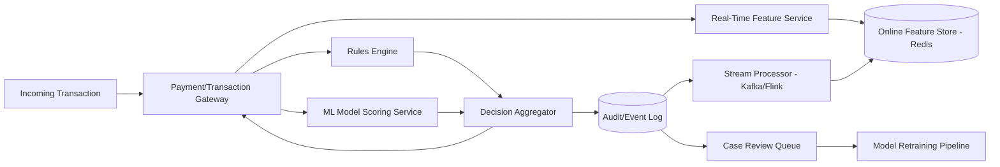
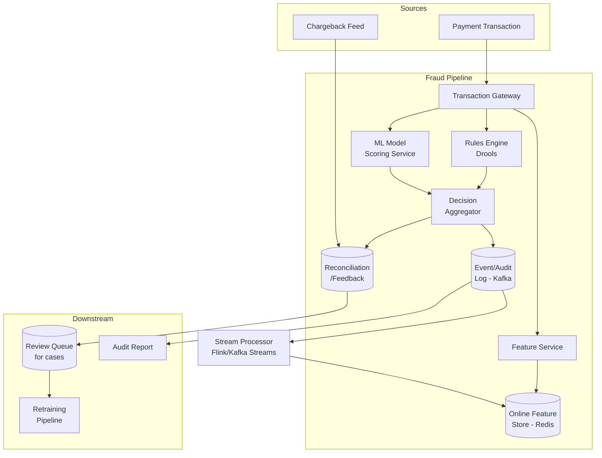
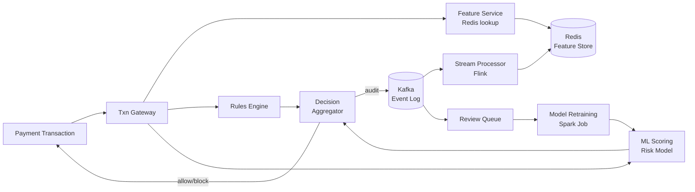

# Design a Fraud Detection Pipeline for Financial Transactions

## Blogs and websites

## Medium

## Youtube

## Theory

### What Is It?

A fraud detection pipeline evaluates every financial transaction (payment, transfer, withdrawal) against rules and ML models in real time, deciding to allow, flag for review, or block it — all within the latency budget of the payment flow (tens of milliseconds).

### Why Does It Exist?

Financial platforms lose billions to fraud annually. Every transaction must be screened before approval. Doing this synchronously (within the payment flow) prevents fraudulent transactions from being authorized, but the screening must be fast enough to not degrade checkout experience.

### What Problem Does It Solve?

* **Real-time scoring**: Score transactions within tens of ms using rules + ML models.
* **Rule-based blocking**: Hard rules (blocklist, velocity caps) that must always apply.
* **ML risk scoring**: Statistical models for novel fraud patterns.
* **Feedback loop**: Confirmed fraud/legit labels → retrain models periodically.
* **Audit trail**: Every decision must be explainable and traceable.
* **Feature freshness**: Velocity/aggregate features (card usage in last 5 min) must be sub-second fresh.

### Important Subtopics

1. Real-time feature store (online serving + stream updates)
2. Rules engine (deterministic, fast, short-circuit)
3. ML model inference (low-latency, feature-lookup)
4. Decision aggregation (combine rules + ML scores)
5. Synchronous vs. asynchronous processing
6. Audit logging and explainability
7. Feedback loop (labeled outcomes → retraining)
8. Latency budgeting (scoring < 30ms within payment flow)

### Problem Statement

Design a real-time fraud detection pipeline that evaluates every financial transaction (payment, transfer, withdrawal) against rules and ML models, and decides to allow, flag for review, or block it, within the latency budget of the payment flow.

### Functional Requirements

- Score every transaction in real time using rules (velocity checks, blocklists, geo-mismatch) and an ML risk model
- Allow / challenge (step-up auth) / block a transaction based on the risk score
- Feed labeled outcomes (confirmed fraud / confirmed legitimate) back into model retraining
- Provide an audit trail and a case-review queue for flagged transactions

### Non-Functional Requirements

- **Scale**: Thousands of transactions/sec at peak
- **Latency**: Real-time scoring must complete within tens of milliseconds so it doesn't add noticeable delay to checkout/transfer
- **Consistency**: Velocity/aggregate features (e.g., "transactions from this card in the last 5 minutes") must reflect very recent activity
- **Auditability**: Every decision must be explainable and traceable for compliance

### High-Level Architecture



### Key Design Points

- Maintain an online feature store (Redis or similar) updated by a stream processor consuming the transaction event log, so velocity/aggregate features (counts, sums over rolling windows) are available with sub-second freshness at scoring time.
- Run cheap deterministic rules (blocklist, hard velocity caps) synchronously and in parallel with ML model inference, then combine both into a final decision - rules can short-circuit to an instant block without waiting on the model.
- Keep the synchronous scoring path minimal (feature lookup + model inference) and push everything else (persisting full audit detail, notifying review queues, retraining data collection) to an asynchronous pipeline off the critical path.
- Close the loop: analyst decisions and confirmed chargebacks become labeled training data, feeding a periodic (not real-time) model retraining pipeline.

### Trade-offs

- A hybrid rules + ML approach is more operationally complex than rules-only, but rules alone can't catch novel fraud patterns and ML-only can't guarantee hard business constraints (e.g., "always block known stolen cards") - combining both covers both weaknesses.
- Keeping feature computation online (pre-aggregated)

---

## Characteristics

| Characteristic | What it means | Why it matters | How it works |
|---|---|---|---|
| **Real-time scoring** | Score within payment flow (~30ms) | Don't block checkout; block fraud | Rules + ML in single request cycle |
| **Sealed decisions** | Other bidders can't see risk scores mid-auction | Fairness | Internal decision only |
| **Hybrid rules + ML** | Rules for hard constraints + ML for novel patterns | Coverage + accuracy | Parallel execution + aggregation |
| **Feature freshness** | Recent behavior (last 5 min) available | Catch velocity attacks | Stream processing → feature store |
| **Explainability** | Decision reasons traceable | Compliance + debugging | Rule hit + ML feature attribution |
| **Feedback loop** | Confirmed outcomes → retrain models | Adapt to new fraud | Batch retraining pipeline |

## Components

| Component | Purpose | Responsibilities | Relationship | Real-world Example |
|---|---|---|---|---|
| **Transaction Gateway** | Ingest transactions | Accept, validate, route | Payment system | API gateway |
| **Feature Service** | Compute real-time features | Aggregate transaction counts, velocities | Gateway ↔ Feature Store | Redis + Flink |
| **Online Feature Store** | Serve features sub-second | Store + serve features | Feature Service ↔ ML Scoring | Redis/Flink state |
| **Rules Engine** | Hard business rules | Blocklists, velocity caps, geo-mismatch | Gateway | Drools/Engarde |
| **ML Scoring** | Risk score (0.0–1.0) | Statistical fraud detection | Gateway | TensorFlow Serving |
| **Decision Aggregator** | Combine rules + ML → final decision | Apply thresholds + policies | Rules + ML → Decision | Decision engine |
| **Event Log** | Audit trail | Log every decision + features | All components | Kafka/S3 |
| **Review Queue** | Manual case management | Investigator review + feedback | Decision → Human | Case management |
| **Stream Processor** | Update features | Windowed aggregations from event log | Event Log → Feature Store | Kafka Streams/Flink |
| **Retraining Pipeline** | Train ML models offline | Labeled data → model retraining | Review Queue → Model | Batch (Spark/Airflow) |

## Patterns

### Hybrid Rules + ML (Parallel Scoring)

* **What**: Run deterministic rules and ML scoring in parallel; combine results into a final decision. Rules can short-circuit (instant block) without waiting for ML.
* **Problem solved**: Rules (blocklist, velocity) are fast + cover known patterns. ML catches novel patterns. Running in parallel (not sequence) avoids ML latency for obvious blocks.
* **How it works**: (1) Transaction → Gateway. (2) Rules Engine: check blocklist + velocity caps (Redis) → instant block if flagged. (3) ML Scoring: compute risk score (0–1) using online features → parallel with rules. (4) Decision Aggregator: if rule block → BLOCK; if ML score > threshold → CHALLENGE; else → ALLOW. (5) If ML is slow (> 30ms) → fall back to rules-only.
* **When to use**: Fraud detection, content moderation, risk scoring.
* **When not to use**: Simple validation (rules-only is sufficient).
• **Advantages**: Fast response for known fraud; catches novel patterns; graceful degradation.
* **Disadvantages**: Operational complexity (two systems); feature pipeline for ML + rule engine.

### Real-Time Feature Store

* **What**: Pre-aggregated features (velocity, rolling counts, behavioral stats) computed by stream processing and served from an in-memory store for sub-second lookup at scoring time.
* **Problem solved**: Computing "transactions from this card in last 5 minutes" from raw transaction history takes too long (> 1s) — violates latency budget.
* **How it works**: (1) Transaction → Kafka → Stream Processor (Flink/Kafka Streams). (2) Tumbling/sliding windows → aggregate (count, sum, avg per card/user/device). (3) Write to Feature Store (Redis or Flink state). (4) At scoring time → Feature Service reads from Redis (sub-ms). (5) Stale features acceptable (few seconds delay).
* **When to use**: Real-time ML scoring with velocity/behavioral features.
• **When not to use**: Static models (no real-time features needed).
* **Advantages**: Sub-second feature serving; handles 10K+ QPS; decouples feature computation from scoring.
* **Disadvantages**: Storage/streaming infrastructure complexity; eventual consistency (features lag behind transactions).

## Benefits

* **Fraud prevention**: Block fraudulent transactions before settlement → save revenue.
* **Low latency**: Rules + optimized ML → sub-30ms within payment flow.
* **Adaptability**: ML learns new fraud patterns; feedback loop improves accuracy.
* **Explainability**: Rule hits + feature attribution → audit + compliance.

## Pros

* **Multi-signal**: Rules + ML → higher coverage than either alone.
• **Real-time**: Velocity + behavioral features for immediate threat detection.
* **Scalable**: Stream processing + parallel scoring.
• **Feedback**: Closed loop (confirmed fraud → retrain).
• **Graceful degradation**: If ML slow → rules-only path.

## Cons

* **False positives**: Blocking legitimate customers → revenue loss + poor UX.
• **False negatives**: Missing fraud → chargebacks + losses.
• **Feature freshness**: Streaming pipeline complexity; stale features.
• **ML model drift**: Fraud patterns evolve → model degrades → retraining needed.
• **Explainability gap**: ML models (neural nets) hard to explain → regulatory risk.

## Challenges

### Technical Challenges
* **Feature engineering**: Real-time + batch feature consistency (training/serving skew).
• **Model serving**: Low-latency inference; A/B testing models.
• **Rules engine**: Complex rule DSL; versioning + testing.

### Scalability Challenges
* **Transactions**: Millions/sec peak → parallel feature lookup (Redis cluster).
• **Feature stores**: Per-card/per-user counters → 100M+ counters in Redis.
• **Stream processing**: Kafka Streams/Flink → 1M events/sec.

### Performance Challenges
* **Latency budget**: Scoring < 30ms → rules (sub-ms) + ML (< 20ms) → async audit log.
• **Feature staleness**: Trade speed vs. freshness; acceptable lag = feature TTL.

### Reliability Challenges
* **ML downtime**: If ML service down → rules-only fallback (higher false negatives).
• **Feature store failure**: If Redis down → compute features from raw DB (slower).
• **Training/serving skew**: Feature computation differs between training + production → monitor + alert.

### Maintainability Challenges
* **Model versioning**: Deploy new ML model without disrupting scoring.
• **Rule management**: Business rules change → versioning + testing.
* **Feature lifecycle**: Retire unused features; track importance.

### Security Concerns
* **Data leakage**: Transaction data → encrypted at rest; access logs.
• **Model poisoning**: Training data → label validation + data-lineage.
• **Adversarial ML**: Fraudsters game ML model → adversarial training + monitoring.

## Best Practices

* **Rules for hard constraints**: Always block known bad actors (blocklists) → fast, deterministic.
* **ML for novelty**: Statistical patterns → catches what rules miss.
* **Parallel execution**: Rules + ML in parallel → no ML latency when rules block.
• **Feature store**: Pre-aggregate velocity features in Redis → sub-ms lookup.
• **Explainability**: Log feature values + model decision → debug + compliance.
• **Feedback loop**: Analyst decisions → labeled training data → nightly retrain.
• **Latency budget**: Scoring < 30ms → async audit log; rules-only fallback if ML > 50ms.
• **Monitor**: False positive rate, false negative rate, feature staleness, model accuracy drift.

## When to Use

### Appropriate
* Payment processing (card, UPI, wallet).
* Marketplace (buyer/seller protection).
• Gaming (cheat detection).
• Insurance (claims fraud).
• Advertising (click fraud).

### Not Appropriate
* Low-risk applications (signup forms).
• Systems where false positives are more costly than fraud.
• Non-financial systems with no monetary value to protect.

### Decision Factors
* Transaction volume; fraud loss rate; false positive tolerance; latency budget; regulatory requirements.

## Use Cases

### Payment Gateway Fraud Detection (Stripe/Razorpay style)

* **Problem**: Screen 1M transactions/day at checkout → allow legit, block fraud, within 30ms — without false positives blocking good customers.
* **Solution**: Transaction → Rules Engine (blocklist, velocity: card usage in last 5min) + ML Scoring (risk model using 30 features: card age, IP geolocation, device fingerprint, velocity, behavioral). Decision Aggregator → allow/challenge/block.
* **Why suitable**: Hybrid rules + ML; real-time feature store (Redis); sub-30ms; feedback loop (confirmed chargebacks → retrain).
* **How it works**: (1) Card charge → Gateway → Rules Engine (blocked card? velocity > 5 in 5min?) + ML (risk_score). (2) If rules block → BLOCK instantly; if ML > 0.9 → CHALLENGE (step-up auth); if ML < 0.3 → ALLOW; else → manual review. (3) Event Log → Kafka → Stream Processor (Flink) → updates velocity features in Redis. (4) Confirmed fraud/chargeback → Review Queue → labeled data → nightly retraining Spark job. (5) Monitor: false positive rate < 0.1%, false negative < 0.01%, scoring latency < 30ms.
* **Trade-offs**: Model staleness vs. latency; false positives vs. fraud; feature freshness vs. serving cost; rules maintenance overhead.

## Architecture



### Architecture Structure
* **Ingest**: Payment transaction → Gateway.
* **Scoring**: Rules (fast, deterministic) + ML (statistical) in parallel.
* **Features**: Online feature store (Redis) updated by stream processor from event log.
* **Decision**: Combine rules + ML scores → allow/challenge/block.
* **Feedback**: Event log → stream processor → feature store; labeled outcomes → retraining.

### Communication
* **Transaction → Gateway**: Synchronous (within payment flow).
• **Gateway → Rules/ML**: Parallel calls (CompletableFuture).
• **Rules/ML ↔ Feature Store**: Sub-ms sync read (Redis).
• **Audit log**: Async (Kafka) — off critical path.

### Data Flow
1. **Transaction**: Payment → Gateway → Feature Service (lookup velocity features from Redis) + Rules Engine (blocklist/velocity check) + ML Scoring (risk model — parallel). (2) Decision Aggregator: rule=block → BLOCK; ML>0.9 → CHALLENGE; ML<0.3 → ALLOW; else → REVIEW. (3) Decision → event log (Kafka, async) → Stream Processor updates features. (4) Review Queue → analyst → labeled data → nightly retraining.

### Scaling Strategy
* **Transactions**: Sharded by card_id hash; 100+ Gateway instances.
* **Feature Store**: Redis cluster (100 shards); pre-aggregated counters.
* **ML Scoring**: TF Serving + GPU for neural models; CPU for tree models; 50+ instances.
• **Stream Processor**: Kafka Streams/Flink (20 nodes); 1M events/sec.

### Failure Handling
* **ML downtime**: Rules-only fallback (higher false negatives); alert.
• **Feature Store failure**: Compute from raw DB (slower, 500ms); degrade gracefully.
• **Decision failure**: Allow (fail-open) or block (fail-closed) — configurable per risk appetite.
• **Training data corruption**: Validate labels; data lineage; rollback bad training runs.

## High-Level Design



## Deep Dive

### Synchronous vs Asynchronous Processing

The existing file's Theory section covers: Synchronous path (rules + ML) on the critical payment path (< 30ms). Asynchronous pipeline (event log streaming, feature store updates, retraining) off the hot path.

### Feature Freshness and Latency Budget

The existing file's Theory section covers: Velocity/aggregate features computed online via stream processing. Rules (sub-ms) short-circuit for obvious fraud. ML inference within budget.

### Online Feature Store Trade-offs

The existing file's Theory section covers: Pre-aggregated online feature store (Redis) vs. query-time aggregation from raw history — online store has eventual consistency (few seconds lag) but meets latency.

## API Contract

* **API purpose**: Score a transaction for fraud risk; retrieve decision history.

| Method | Endpoint | Description |
|---|---|---|
| POST | `/fraud/v1/score` | Score a transaction (synchronous) |
| GET | `/fraud/v1/decisions/{transaction_id}` | Get past decision for transaction |
| POST | `/fraud/v1/cases/review` | Manual review decision + feedback |
| GET | `/fraud/v1/models/metrics` | Model performance metrics |

**Score request (POST /score)**:
```json
{
  "transaction_id": "txn_abc123",
  "amount": 1200,
  "currency": "USD",
  "card_id": "card_xyz",
  "user_id": "user_456",
  "ip": "192.0.2.1",
  "device_fingerprint": "a1b2c3",
  "merchant_id": "merch_789"
}
```

**Score response**:
```json
{
  "transaction_id": "txn_abc123",
  "decision": "allow",
  "risk_score": 0.18,
  "rules_triggered": [],
  "features_used": {"card_velocity_5min": 2, "ip_risk": 0.03},
  "model_version": "fraud-v3-2025",
  "latency_ms": 14
}
```

**Authentication**: Service-to-service (mTLS + JWT).
**Rate limiting**: 1000 req/sec per client.

**Error responses**:
```json
{"error": "timeout", "message": "ML scoring timeout, rules-only fallback", "code": 206}
{"error": "invalid_request", "message": "Missing required fields", "code": 400}
```

## Data Modeling

```mermaid
erDiagram
    TRANSACTION ||--o{ FRAUD_DECISION : "scored by"
    TRANSACTION ||--o{ FEATURE_VALUE : "has features"
    FRAUD_DECISION ||--o{ CASE_REVIEW : "reviewed as"
    MODEL_VERSION ||--o{ FRAUD_DECISION : "used"

    TRANSACTION {
      string transaction_id PK
      string card_id FK
      string user_id
      string merchant_id
      decimal amount
      string currency
      datetime created_at
      string ip_address
    }
    FRAUD_DECISION {
      string decision_id PK
      string transaction_id FK
      string model_version FK
      enum decision allow_challenge_block_review
      decimal risk_score
      json rules_triggered
      datetime created_at
    }
    FEATURE_VALUE {
      string feature_id PK
      string entity_id
      string feature_name
      decimal value
      datetime updated_at
    }
    CASE_REVIEW {
      string case_id PK
      string decision_id FK
      enum analyst_decision fraud_legitimate
      string notes
      datetime reviewed_at
    }
```

**Feature store partitioning**: By entity_id (card_id/user_id hash); TTL for velocity features.

## Java and Spring Boot Implementation

```java
@RestController
@RequestMapping("/fraud/v1")
@RequiredArgsConstructor
public class FraudController {
    private final RulesEngine rulesEngine;
    private final ML scoringService;
    private final FeatureService featureService;

    @PostMapping("/score")
    public ResponseEntity<ScoreResponse> score(@RequestBody ScoreRequest request) {
        // Parallel: rules + features + ML
        CompletableFuture<RulesResult> rulesFuture = rulesEngine.evaluate(request);
        CompletableFuture<FeatureMap> featuresFuture = featureService.getFeatures(request);

        // Wait for features + rules (fast), then trigger ML scoring
        FeatureMap features = featuresFuture.get(5, TimeUnit.MILLISECONDS);
        RulesResult rules = rulesFuture.get(5, TimeUnit.MILLISECONDS);

        if (rules.isBlocked()) {
            return ResponseEntity.ok(ScoreResponse.blocked(rules.getReasons()));
        }

        // ML scoring (with timeout fallback to rules-only)
        CompletableFuture<MLResult> mlFuture = scoringService.score(request, features);
        try {
            MLResult ml = mlFuture.get(25, TimeUnit.MILLISECONDS);
            return ResponseEntity.ok(ScoreResponse.from(ml, rules, features));
        } catch (TimeoutException e) {
            // ML slow → rules-only fallback
            return ResponseEntity.ok(ScoreResponse.rulesOnly(rules, features));
        }
    }
}

@Service
public class FeatureService {
    private final RedisTemplate<String, Object> redis;

    public CompletableFuture<FeatureMap> getFeatures(ScoreRequest request) {
        return CompletableFuture.supplyAsync(() -> {
            String cardKey = "features:card:" + request.getCardId();
            String userKey = "features:user:" + request.getUserId();
            return FeatureMap.builder()
                .cardVelocity(redis.opsForHash().get(cardKey, "velocity_5min"))
                .ipRisk(redis.opsForHash().get("features:ip:" + request.getIp(), "risk_score"))
                .build();
        });
    }
}
```

## Real-World Examples

* **Stripe Radar**: Rules engine (custom rules + default blocklist) + ML (behavioral models); real-time feature store (velocity, device fingerprinting); sub-30ms scoring; feedback loop (confirmed disputes → retrain).
* **PayPal Risk**: Real-time transaction scoring; 200+ signals; ML + rules; 500M+ transactions/day.
• **Razorpay**: Rules (velocity, blocklist) + ML (transaction graph + behavioral); real-time scoring; chargeback feedback loop.
• **Capital One**: Real-time fraud detection; ML + rules; stream processing (Kafka + Flink).

## Interview Preparation

### Beginner Questions

**Q: What are the two main approaches to fraud detection?**
A: (1) Rules-based: deterministic rules (blocklist, velocity checks, geo-mismatch) → fast, interpretable, covers known patterns. (2) ML-based: statistical models (logistic regression, gradient boosting, neural nets) → catches novel patterns. Best systems use both (hybrid).

**Q: What is false positive/negative in fraud detection?**
A: False positive = legit transaction blocked (bad UX, revenue loss). False negative = fraud not caught (chargeback loss). Trade-off: tighter rules → more false positives; looser → more false negatives. Target: FP < 0.1%, FN < 0.01%.

**Q: Why must fraud scoring be fast (< 30ms)?**
A: Fraud scoring happens within the payment authorization flow — every millisecond of latency reduces authorization success rate. 30ms max → rules (sub-ms) + ML (< 20ms).

### Intermediate Questions

**Q: How do you build a real-time feature store for fraud detection?**
A: (1) Transaction → Kafka. (2) Stream processor (Flink/Kafka Streams) computes windowed features: count of transactions per card in last 5 min, sum of amounts, geographic velocity, device changes. (3) Store in Redis (keyed by card_id/user_id/device_id). (4) Feature Service looks up Redis at scoring time (sub-ms). (5) TTL on features — auto-expire stale values. (6) Monitor: feature staleness, Redis latency, update lag.

**Q: How do you implement the feedback loop?**
A: (1) Confirmed fraud/chargebacks → Review Queue. (2) Analyst labels (fraud/legit). (3) Labels + features become training data. (4) Nightly Spark job retrains model. (5) New model A/B tested (5% traffic) → if performance improves → roll out to 100%. (6) Monitor: model accuracy, feature drift, false positive/negative rate.

**Q: How do you handle model serving latency?**
A: (1) Use lightweight models (XGBoost/LightGBM) for sub-20ms inference. (2) TF Serving for neural models. (3) Feature cache (Redis) → eliminates feature computation latency. (4) If ML > 30ms → fallback to rules-only. (5) Warm model in memory; pre-load on startup.

### Advanced Questions

**Q: How do you design a fraud detection system processing 1M transactions/sec with < 20ms scoring latency?**

A: (1) **Gateway**: 100+ NGINX/Envoy → load-balanced; per-merchant rate limiting; async routing to scoring. (2) **Feature Service**: Redis cluster (100 nodes, sharded by entity_id) — sub-ms feature lookups; velocity features updated by stream processor (50 Flink nodes consuming 1M events/sec Kafka). (3) **Rules Engine**: In-memory rule evaluation (Drools/Engarde) → sub-ms; blocklists in Redis Bloom filters. (4) **ML Scoring**: LightGBM (CPU) + TensorFlow Serving (for deep models) → 50+ instances → 5ms inference. (5) **Parallel**: Rules + Feature lookup + ML inference in parallel (CompletableFuture). (6) **Decision**: Score > 0.85 → block; 0.8–0.85 → step-up auth (challenge); 0.3–0.8 → review; < 0.3 → allow. (7) **Audit log**: Kafka → async (off critical path). (8) **Scale**: 1M txn/s → 100 Gateways → 10K scoring requests/sec per gateway → Redis reads (10K ops/sec/node). (9) **Monitoring**: P99 scoring < 20ms; false positive rate < 0.05%; false negative < 0.005%; feature staleness < 2s.

**Q: How do you handle adversarial ML attacks in fraud detection?**

A: (1) **Adversarial training**: Inject adversarial examples (fraudster strategies) into training data; model learns to resist. (2) **Ensemble**: Multiple models (rules + LR + GBDT + NN); attacker must evade all. (3) **Feature obfuscation**: Add noise to features; use adversarial feature selection. (4) **Online learning**: Continuously update model with latest confirmed fraud (not just nightly batches). (5) **Behavioral analysis**: Detect sudden behavior changes (card testing, bot attacks) → adaptive thresholds. (6) **Model monitoring**: Track prediction distribution; alert on distribution shift (new attack pattern). (7) **Red teaming**: Simulate fraudster strategies → test model robustness. (8) **Feedback loop**: Confirmed false negatives + false positives → retrain; adversarial example detection in production.

### Senior-Level Questions

**Q: Design a real-time fraud detection pipeline for a payment processor handling 10M transactions/day, with 50ms scoring latency budget, hybrid rules + ML, and continuous model improvement.**

A: (1) **Gateway**: 50+ NGINX/Kong nodes → auth + rate limit (100K/sec); async routing; circuit breaker. (2) **Feature Service**: Redis cluster (50 nodes, sharded by card_id) — sub-ms lookups for velocity (txn count/5min/card), IP risk, device fingerprint hash, geo-velocity, spending patterns. Stream processor (20 Flink nodes) consuming transaction Kafka → update features every 1s (sliding windows). (3) **Rules Engine**: Drools + Redis Bloom filter (blocklist) → sub-ms rule evaluation (velocity caps, geo-mismatch, velocity thresholds). (4) **ML Scoring**: LightGBM model (20 features, 5ms inference) served via TF Serving (20 instances); A/B test new models (5% → 100%). (5) **Decision**: Parallel execution — rules + feature lookup + ML (CompletableFuture). If rule block → BLOCK instantly. ML score > 0.9 → BLOCK; > 0.7 → CHALLENGE (step-up auth); < 0.3 → ALLOW; else → REVIEW. (6) **Audit log**: Transaction + features + decision → Kafka (async, off critical path). (7) **Feedback**: Chargebacks + analyst reviews → labeled data → nightly Spark retraining (20 executors) → model validation + A/B deploy. (8) **Scale**: 10M txn/day = 120/sec avg + 1000/sec peak → 50 Gateways; 50 Redis nodes (5K ops/sec each); 20 ML instances. (9) **Monitoring**: P99 < 50ms; false positive < 0.1%; false negative < 0.01%; feature staleness < 5s; model accuracy drift.

**Q: How do you balance false positives vs. false negatives in fraud detection, and how do you measure it in production?**

A: This is fundamentally a business and technical balancing act:

**Business side**: (1) **Cost of false positive**: Each blocked legit transaction = lost revenue + customer churn. If average order value = $100 and FP rate = 0.1% → 10M × 0.001 = 10K blocked legit txns × $100 = $1M lost/month. (2) **Cost of false negative**: Each missed fraud = chargeback ($25 + interchange fee + potential account takeover). At 0.01% → 1K × $100 = $100K/month. (3) **Decision**: Set threshold where (FP cost × FP rate) = (FN cost × FN rate). For payments, FP is far more costly → threshold favors catching fraud (higher FP rate acceptable).

**Technical side**: (1) **Threshold optimization**: Start with ROC curve from validation set; choose threshold based on cost ratio; A/B test (send 5% of borderline cases to manual review instead of auto-block). (2) **Multi-class decisions**: not just allow/block → allow, review, challenge (step-up auth), block — reduces binary decision pressure. (3) **Per-segment thresholds**: Different thresholds for high-value vs. low-value; different countries; different channels (web vs. mobile vs. MOTO).

**Production measurement**: (1) **Daily**: True positive rate (detected fraud), false positive rate (blocked legit), false negative rate (chargebacks). (2) **Sources**: Confirmed fraud labels from chargebacks + analyst reviews; legit labels from post-decision analysis (transactions that passed scoring but later deemed safe). (3) **Alerting**: FP rate > 0.1% → alert (threshold too tight); FN rate > 1% → alert (model drift). (4) **Feedback loop**: Confirmed outcomes → daily model retraining + threshold adjustment. (5) **Shadow mode**: Run new model in parallel (no effect on decisions) → compare against current → validate before rollout.

**Common pitfalls**: (1) Using accuracy as metric (imbalanced data — 99.9% are legit → 99.9% accuracy = useless model). (2) Not considering chargeback representment rate (blocked fraud → no chargeback; missed fraud → chargeback). (3) Training/serving skew (features computed differently in training vs. production). (4) No shadow mode → deploy blind.

### Common Mistakes

- Scoring on the synchronous path → latency; should be async where possible (but fraud must block payment).
- No feedback loop → model degrades silently.
- No feature store → real-time features too slow to compute.
- Rules + ML in sequence (not parallel) → slower.
- No explainability → compliance issues.
- Not handling class imbalance (1% fraud → model predicts "all legit" → 0% precision).
- Single model → single point of failure; ensemble better.
- No shadow mode → blind deployments.
- Hardcoding thresholds → drift unnoticed.
- No adversarial detection → susceptible to evasion attacks. instead of computing it at query time from raw transaction history trades storage/streaming complexity for the low latency required at the point of sale.
