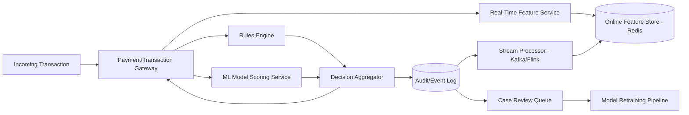
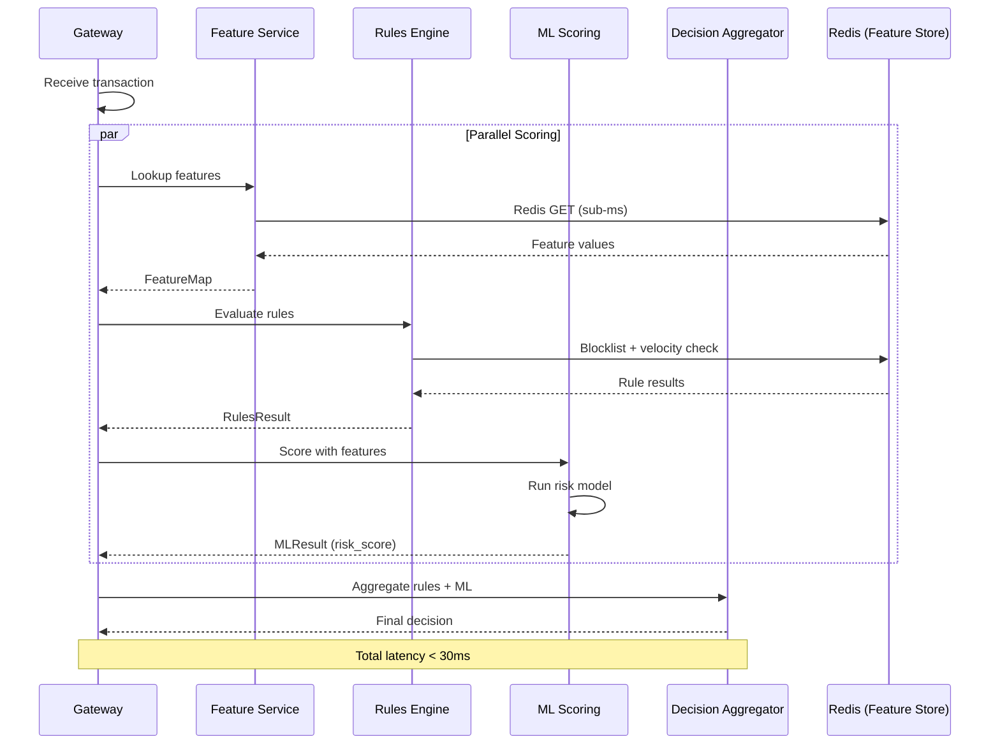
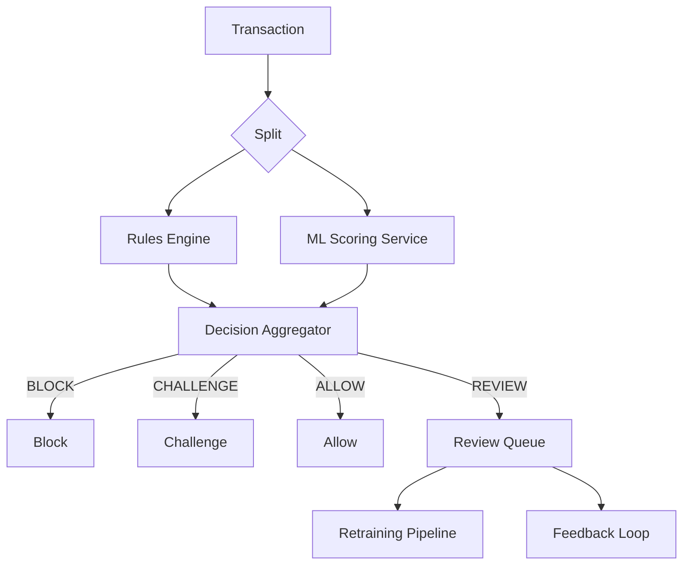
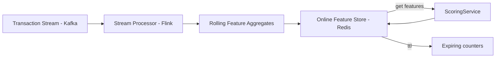
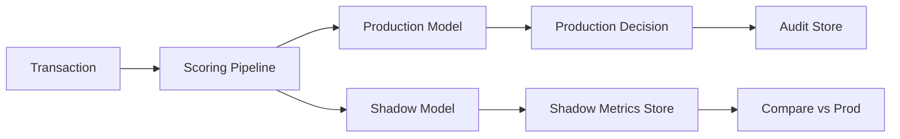
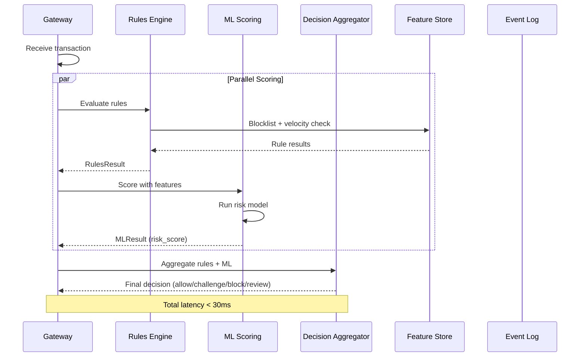

# Design a Fraud Detection Pipeline for Financial Transactions

## Blogs and websites

- [Building Real-Time Fraud Detection Systems — Stripe Engineering](https://stripe.com/blog/detect-fraud) — Stripe's approach to real-time fraud detection with Rules and ML (Radar).
- [Fraud Detection at PayPal Scale — PayPal Engineering](https://medium.com/paypal-tech) — PayPal's two-tiered fraud detection architecture serving 500M+ transactions/day.
- [Designing Data-Intensive Applications, Martin Kleppmann](https://dataintensive.net/) — Chapter 9 covers stream processing and consistency models for real-time feature stores.
- [Building Machine Learning Pipelines for Real-Time Fraud Detection (O'Reilly)](https://www.oreilly.com/radar/building-ml-pipelines-fraud/) — Practical guidance on feature stores, model serving, and feedback loops.
- [Real-Time Feature Stores for ML — Feast Documentation](https://docs.feast.dev/) — Open-source feature store design patterns and best practices.

## Medium

- [Real-Time Fraud Detection System Design](https://medium.com/swlh/real-time-fraud-detection-system-design-3e0d8b3e3b68) — System design walkthrough of a real-time fraud detection pipeline.
- [Building a Real-Time Fraud Detection Pipeline with Kafka and Flink](https://medium.com/@datarush/building-a-real-time-fraud-detection-pipeline-with-kafka-and-flink) — Stream processing architecture for fraud features and velocity checks.
- [Feature Stores for Real-Time ML: Why They Matter](https://medium.com/@feastdev/feature-stores-real-time-ml) — Explanation of online feature stores and their role in low-latency ML scoring.
- [Hybrid Rules + ML for Fraud Detection](https://medium.com/@ml-engineering/hybrid-rules-ml-fraud-7c9d2e4a9b15) — Combining deterministic rules with statistical models for optimal coverage.

## Youtube

- [Fraud Detection System Design | Low Level Design](https://www.youtube.com/watch?v=4G2ODo6rB9U) — Low-level design walkthrough of a fraud detection pipeline.
- [Real-Time Fraud Detection Pipeline Architecture](https://www.youtube.com/watch?v=7Z3n8Y4vQ5w) — System design interview question deep dive.
- [Payment Fraud Detection using Machine Learning](https://www.youtube.com/watch?v=X7rK5wZ9LqM) — ML approach to fraud detection in payment systems.

---

## Theory

### Topics Covered

1. Introduction / Problem Statement
2. Characteristics
3. Pros
4. Cons
5. Use Cases
6. Components
7. Architectural Patterns
8. Benefits
9. Challenges
10. Best Practices
11. When to Use / When Not to Use
12. Data Model and API
13. Fraud Detection Pipeline Deep Dive
14. Replication Strategies
15. Failure Detection and Membership
16. High Availability and Scalability
17. Performance and Optimization
18. CAP Theorem and Consistency Trade-offs
19. Encryption and Key Management
20. Authentication and Authorization
21. Security Threats and Mitigations
22. Observability and Logging
23. Real-World Implementations
24. Java and Spring Boot Implementation Guide
25. Interview Questions and Answers

---

### Introduction / Problem Statement

#### What Is It?

A fraud detection pipeline evaluates every financial transaction (payment, transfer, withdrawal) against rules and ML models in real time, deciding to allow, flag for review, or block it — all within the latency budget of the payment flow (tens of milliseconds).

#### Why Does It Exist?

Financial platforms lose billions to fraud annually. Every transaction must be screened before approval. Doing this synchronously (within the payment flow) prevents fraudulent transactions from being authorized, but the screening must be fast enough to not degrade checkout experience.

#### What Problem Does It Solve?

* **Real-time scoring**: Score transactions within tens of ms using rules + ML models.
* **Rule-based blocking**: Hard rules (blocklist, velocity caps) that must always apply.
* **ML risk scoring**: Statistical models for novel fraud patterns.
* **Feedback loop**: Confirmed fraud/legit labels → retrain models periodically.
* **Audit trail**: Every decision must be explainable and traceable.
* **Feature freshness**: Velocity/aggregate features (card usage in last 5 min) must be sub-second fresh.

#### Problem Statement

Design a real-time fraud detection pipeline that evaluates every financial transaction (payment, transfer, withdrawal) against rules and ML models, and decides to allow, flag for review, or block it, within the latency budget of the payment flow.

#### Functional Requirements

- Score every transaction in real time using rules (velocity checks, blocklists, geo-mismatch) and an ML risk model
- Allow / challenge (step-up auth) / block a transaction based on the risk score
- Feed labeled outcomes (confirmed fraud / confirmed legitimate) back into model retraining
- Provide an audit trail and a case-review queue for flagged transactions

#### Non-Functional Requirements

- **Scale**: Thousands of transactions/sec at peak
- **Latency**: Real-time scoring must complete within tens of milliseconds so it doesn't add noticeable delay to checkout/transfer
- **Consistency**: Velocity/aggregate features (e.g., "transactions from this card in the last 5 minutes") must reflect very recent activity
- **Auditability**: Every decision must be explainable and traceable for compliance

#### High-Level Architecture



*The high-level architecture shows the synchronous scoring path (Transaction → Gateway → parallel Rules Engine + Feature Service + ML Scoring → Decision Aggregator) and the asynchronous pipeline branching off the Event Log: a stream processor updates the online feature store with fresh velocity aggregates, while confirmed outcomes flow from the case-review queue into periodic model retraining.*

#### Key Design Points

- Maintain an online feature store (Redis or similar) updated by a stream processor consuming the transaction event log, so velocity/aggregate features (counts, sums over rolling windows) are available with sub-second freshness at scoring time.
- Run cheap deterministic rules (blocklist, hard velocity caps) synchronously and in parallel with ML model inference, then combine both into a final decision — rules can short-circuit to an instant block without waiting on the model.
- Keep the synchronous scoring path minimal (feature lookup + model inference) and push everything else (persisting full audit detail, notifying review queues, retraining data collection) to an asynchronous pipeline off the critical path.
- Close the loop: analyst decisions and confirmed chargebacks become labeled training data, feeding a periodic (not real-time) model retraining pipeline.

#### Trade-offs

- A hybrid rules + ML approach is more operationally complex than rules-only, but rules alone can't catch novel fraud patterns and ML-only can't guarantee hard business constraints (e.g., "always block known stolen cards") — combining both covers both weaknesses.
- Keeping feature computation online (pre-aggregated) instead of computing it at query time from raw transaction history trades storage/streaming complexity for the low latency required at the point of sale.
- Synchronous scoring (within the payment flow) blocks authorization on the result — fail-fast but blocks legit users if the pipeline is down. Asynchronous scoring (post-authorization) avoids blocking but can't prevent fraudulent authorizations.
- Rules are interpretable and fast but require manual maintenance and can't adapt to new patterns. ML models adapt automatically but introduce model drift, training/serving skew, and explainability challenges.
- The feedback loop (periodic retraining) means the model is always slightly stale relative to the latest fraud tactics. Continuous online learning would adapt faster but adds operational complexity and risk of data contamination.

---

### Characteristics

| Characteristic | What it means | Why it matters | How it works |
|---|---|---|---|
| **Real-time scoring** | Score within payment flow (~30ms) | Don't block checkout; block fraud | Rules + ML in single request cycle |
| **Sealed decisions** | Other bidders can't see risk scores mid-auction | Fairness | Internal decision only |
| **Hybrid rules + ML** | Rules for hard constraints + ML for novel patterns | Coverage + accuracy | Parallel execution + aggregation |
| **Feature freshness** | Recent behavior (last 5 min) available | Catch velocity attacks | Stream processing → feature store |
| **Explainability** | Decision reasons traceable | Compliance + debugging | Rule hit + ML feature attribution |
| **Feedback loop** | Confirmed outcomes → retrain models | Adapt to new fraud | Batch retraining pipeline |

### Pros

* **Multi-signal**: Rules + ML → higher coverage than either alone.
* **Real-time**: Velocity + behavioral features for immediate threat detection.
* **Scalable**: Stream processing + parallel scoring.
* **Feedback**: Closed loop (confirmed fraud → retrain).
* **Graceful degradation**: If ML slow → rules-only path.

### Cons

* **False positives**: Blocking legitimate customers → revenue loss + poor UX.
* **False negatives**: Missing fraud → chargebacks + losses.
* **Feature freshness**: Streaming pipeline complexity; stale features.
* **ML model drift**: Fraud patterns evolve → model degrades → retraining needed.
* **Explainability gap**: ML models (neural nets) hard to explain → regulatory risk.

### Use Cases

#### Payment Gateway Fraud Detection (Stripe/Razorpay style)

* **Problem**: Screen 1M transactions/day at checkout → allow legit, block fraud, within 30ms — without false positives blocking good customers.
* **Solution**: Transaction → Rules Engine (blocklist, velocity: card usage in last 5min) + ML Scoring (risk model using 30 features: card age, IP geolocation, device fingerprint, velocity, behavioral). Decision Aggregator → allow/challenge/block.
* **Why suitable**: Hybrid rules + ML; real-time feature store (Redis); sub-30ms; feedback loop (confirmed chargebacks → retrain).
* **How it works**: (1) Card charge → Gateway → Rules Engine (blocked card? velocity > 5 in 5min?) + ML (risk_score). (2) If rules block → BLOCK instantly; if ML > 0.9 → CHALLENGE (step-up auth); if ML < 0.3 → ALLOW; else → manual review. (3) Event Log → Kafka → Stream Processor (Flink) → updates velocity features in Redis. (4) Confirmed fraud/chargeback → Review Queue → labeled data → nightly retraining Spark job. (5) Monitor: false positive rate < 0.1%, false negative < 0.01%, scoring latency < 30ms.
* **Trade-offs**: Model staleness vs. latency; false positives vs. fraud; feature freshness vs. serving cost; rules maintenance overhead.

### Components

| Component | Purpose | Responsibilities | Relationship | Real-world Example |
|---|---|---|---|---|
| **Transaction Gateway** | Ingest transactions | Accept, validate, route | Payment system | API gateway |
| **Feature Service** | Compute real-time features | Aggregate transaction counts, velocities | Gateway ↔ Feature Store | Redis + Flink |
| **Online Feature Store** | Serve features sub-second | Store + serve features | Feature Service ↔ ML Scoring | Redis/Flink state |
| **Rules Engine** | Hard business rules | Blocklists, velocity caps, geo-mismatch | Gateway | Drools/Engarde |
| **ML Scoring** | Risk score (0.0–1.0) | Statistical fraud detection | Gateway | TensorFlow Serving |
| **Decision Aggregator** | Combine rules + ML → final decision | Apply thresholds + policies | Rules + ML → Decision | Decision engine |
| **Event Log** | Audit trail | Log every decision + features | All components | Kafka/S3 |
| **Review Queue** | Manual case management | Investigator review + feedback | Decision → Human | Case management |
| **Stream Processor** | Update features | Windowed aggregations from event log | Event Log → Feature Store | Kafka Streams/Flink |
| **Retraining Pipeline** | Train ML models offline | Labeled data → model retraining | Review Queue → Model | Batch (Spark/Airflow) |

### Architectural Patterns

#### Hybrid Rules + ML (Parallel Scoring)

* **What**: Run deterministic rules and ML scoring in parallel; combine results into a final decision. Rules can short-circuit (instant block) without waiting for ML.
* **Problem solved**: Rules (blocklist, velocity) are fast + cover known patterns. ML catches novel patterns. Running in parallel (not sequence) avoids ML latency for obvious blocks.
* **How it works**: (1) Transaction → Gateway. (2) Rules Engine: check blocklist + velocity caps (Redis) → instant block if flagged. (3) ML Scoring: compute risk score (0–1) using online features → parallel with rules. (4) Decision Aggregator: if rule block → BLOCK; if ML score > threshold → CHALLENGE; else → ALLOW. (5) If ML is slow (> 30ms) → fall back to rules-only.
* **When to use**: Fraud detection, content moderation, risk scoring.
* **When not to use**: Simple validation (rules-only is sufficient).
* **Pros**: Fast response for known fraud; catches novel patterns; graceful degradation.
* **Cons**: Operational complexity (two systems); feature pipeline for ML + rule engine.

#### Real-Time Feature Store

* **What**: Pre-aggregated features (velocity, rolling counts, behavioral stats) computed by stream processing and served from an in-memory store for sub-second lookup at scoring time.
* **Problem solved**: Computing "transactions from this card in last 5 minutes" from raw transaction history takes too long (> 1s) — violates latency budget.
* **How it works**: (1) Transaction → Kafka → Stream Processor (Flink/Kafka Streams). (2) Tumbling/sliding windows → aggregate (count, sum, avg per card/user/device). (3) Write to Feature Store (Redis or Flink state). (4) At scoring time → Feature Service reads from Redis (sub-ms). (5) Stale features acceptable (few seconds delay).
* **When to use**: Real-time ML scoring with velocity/behavioral features.
* **When not to use**: Static models (no real-time features needed).
* **Pros**: Sub-second feature serving; handles 10K+ QPS; decouples feature computation from scoring.
* **Cons**: Storage/streaming infrastructure complexity; eventual consistency (features lag behind transactions).



*Parallel scoring flow: the Gateway receives a transaction and launches three parallel operations — the Feature Service reads precomputed velocity features from Redis (sub-millisecond), the Rules Engine checks blocklists and velocity caps against the same Redis store, and the ML Scoring service runs the risk model using the fetched features. All three complete within the 30ms latency budget; the Decision Aggregator combines the rule verdict and ML risk score into a final allow/challenge/block response.*

---

### Challenges

#### Technical Challenges

* **Feature engineering**: Real-time + batch feature consistency (training/serving skew).
* **Model serving**: Low-latency inference; A/B testing models.
* **Rules engine**: Complex rule DSL; versioning + testing.
* **Feature lineage**: Tracking which features contributed to each decision for explainability and debugging.
* **Model serialization**: Serving models trained in different frameworks (XGBoost, LightGBM, TensorFlow) with low-latency deserialization.
* **Cold starts**: New cards, users, or devices with no historical features — the system must degrade gracefully and rely more heavily on rules.

#### Scalability Challenges

* **Transactions**: Millions of transactions/sec at peak → parallel feature lookup (Redis cluster).
* **Feature stores**: Per-card/per-user counters → 100M+ counters in Redis.
* **Stream processing**: Kafka Streams/Flink → 1M events/sec.
* **Rule complexity**: Thousands of rules evaluated per transaction — the rule engine must evaluate only relevant rules (indexing + partitioning by entity type).
* **Feature explosion**: Each new feature added to the model increases feature-store storage and update throughput; managing feature lifecycle and deprecating unused features is critical.

#### Performance Challenges

* **Latency budget**: Scoring < 30ms → rules (sub-ms) + ML (< 20ms) → async audit log.
* **Feature staleness**: Trade speed vs. freshness; acceptable lag = feature TTL.
* **Model cold start**: Loading a 100MB model into memory takes time; pre-warming is needed.
* **P99 latency**: Even if average scoring is 15ms, p99 can spike to 50ms+ due to Redis latency or GC pauses — requires tail-latency optimization.
* **Memory pressure**: Feature store caching, model loading, and rule evaluation all compete for the same memory — JVM tuning and off-heap storage are critical.

#### Reliability Challenges

* **ML downtime**: If ML service down → rules-only fallback (higher false negatives); alert.
* **Feature store failure**: If Redis down → compute features from raw DB (slower).
* **Training/serving skew**: Feature computation differs between training + production → monitor + alert.
* **Event log durability**: If Kafka is unavailable, feature updates may be lost — requires replication and replay capability.
* **Model rollback**: Rolling back a bad model deployment must be fast (sub-minute) to minimize false positive/negative exposure.

#### Maintainability Challenges

* **Model versioning**: Deploy new ML model without disrupting scoring.
* **Rule management**: Business rules change → versioning + testing.
* **Feature lifecycle**: Retire unused features; track importance.
* **Configuration drift**: Rules thresholds, ML thresholds, and feature TTLs are configured in multiple places — a centralized config service is needed.
* **Cross-team ownership**: The fraud team owns rules + ML; the payments team owns the gateway; the data platform team owns Kafka + Flink — coordination overhead is significant.

#### Security Concerns

* **Data leakage**: Transaction data → encrypted at rest; access logs.
* **Model poisoning**: Training data → label validation + data-lineage.
* **Adversarial ML**: Fraudsters game ML model → adversarial training + monitoring.
* **Feature store tampering**: An attacker with write access to Redis could manipulate velocity features to evade detection.
* **Replay attacks**: An attacker replays a previously approved transaction to bypass fraud checks — requires nonce + idempotency.

---

### Best Practices

* **Rules for hard constraints**: Always block known bad actors (blocklists) → fast, deterministic.
* **ML for novelty**: Statistical patterns → catches what rules miss.
* **Parallel execution**: Rules + ML in parallel → no ML latency when rules block.
* **Feature store**: Pre-aggregate velocity features in Redis → sub-ms lookup.
* **Explainability**: Log feature values + model decision → debug + compliance.
* **Feedback loop**: Analyst decisions → labeled training data → nightly retrain.
* **Latency budget**: Scoring < 30ms → async audit log; rules-only fallback if ML > 50ms.
* **Monitor**: False positive rate, false negative rate, feature staleness, model accuracy drift.
* **Shadow mode**: Run new models in parallel without affecting decisions → validate before rollout.
* **Threshold calibration**: Calibrate decision thresholds per segment (high-value vs. low-value, by country, by channel) rather than using a single global threshold.
* **Fail-open vs. fail-closed**: Configure per merchant risk profile — low-risk merchants fail-open (allow on system error); high-risk merchants fail-closed (block on system error).
* **Data quality checks**: Validate feature values at scoring time (no nulls, no out-of-range values) — bad data silently degrades model quality.

---

### When to Use / When Not to Use

#### Appropriate

* Payment processing (card, UPI, wallet).
* Marketplace (buyer/seller protection).
* Gaming (cheat detection).
* Insurance (claims fraud).
* Advertising (click fraud).

#### Not Appropriate

* Low-risk applications (signup forms).
* Systems where false positives are more costly than fraud.
* Non-financial systems with no monetary value to protect.

#### Decision Factors

* Transaction volume; fraud loss rate; false positive tolerance; latency budget; regulatory requirements.

---

### Data Model and API

#### API Contract

* **API purpose**: Score a transaction for fraud risk; retrieve decision history.

| Method | Endpoint | Description |
|---|---|---|
| POST | `/fraud/v1/score` | Score a transaction (synchronous) |
| GET | `/fraud/v1/decisions/{transaction_id}` | Get past decision for transaction |
| POST | `/fraud/v1/cases/review` | Manual review decision + feedback |
| GET | `/fraud/v1/models/metrics` | Model performance metrics |

**Score request (POST /score)**:
```json
{
  "transaction_id": "txn_abc123",
  "amount": 1200,
  "currency": "USD",
  "card_id": "card_xyz",
  "user_id": "user_456",
  "ip": "192.0.2.1",
  "device_fingerprint": "a1b2c3",
  "merchant_id": "merch_789"
}
```

**Score response**:
```json
{
  "transaction_id": "txn_abc123",
  "decision": "allow",
  "risk_score": 0.18,
  "rules_triggered": [],
  "features_used": {"card_velocity_5min": 2, "ip_risk": 0.03},
  "model_version": "fraud-v3-2025",
  "latency_ms": 14
}
```

**Authentication**: Service-to-service (mTLS + JWT).
**Rate limiting**: 1000 req/sec per client.

**Error responses**:
```json
{"error": "timeout", "message": "ML scoring timeout, rules-only fallback", "code": 206}
{"error": "invalid_request", "message": "Missing required fields", "code": 400}
```

#### Data Modeling

```mermaid
erDiagram
    TRANSACTION ||--o{ FRAUD_DECISION : "scored by"
    TRANSACTION ||--o{ FEATURE_VALUE : "has features"
    FRAUD_DECISION ||--o{ CASE_REVIEW : "reviewed as"
    MODEL_VERSION ||--o{ FRAUD_DECISION : "used"

    TRANSACTION {
      string transaction_id PK
      string card_id FK
      string user_id
      string merchant_id
      decimal amount
      string currency
      datetime created_at
      string ip_address
    }
    FRAUD_DECISION {
      string decision_id PK
      string transaction_id FK
      string model_version FK
      enum decision allow_challenge_block_review
      decimal risk_score
      json rules_triggered
      datetime created_at
    }
    FEATURE_VALUE {
      string feature_id PK
      string entity_id
      string feature_name
      decimal value
      datetime updated_at
    }
    CASE_REVIEW {
      string case_id PK
      string decision_id FK
      enum analyst_decision fraud_legitimate
      string notes
      datetime reviewed_at
    }
```

**Entity descriptions:**

* **TRANSACTION:** Core fact entity. `transaction_id` (UUID), `card_id` (FK to card vault), `user_id`, `merchant_id`, `amount`, `currency`, `created_at`, `ip_address`. Stored in a durable OLTP database (PostgreSQL) for replay and in Kafka for streaming. Partitioned by `card_id` hash for fan-out of velocity feature updates.

* **FRAUD_DECISION:** The output of the scoring pipeline. `decision_id` (UUID), `transaction_id` (FK), `model_version` (FK to track which model produced the score), `decision` (enum: allow, challenge, block, review), `risk_score` (decimal 0.0–1.0), `rules_triggered` (JSON array of rule names + descriptions for explainability), `created_at`. Stored in both a durable store (for audit) and the event log (for streaming).

* **FEATURE_VALUE:** Real-time aggregated features stored in the online feature store. `feature_id` (composite: entity_id + feature_name), `entity_id` (card_id, user_id, device_id, or IP), `feature_name` (e.g., `velocity_5min`, `geo_distance_from_home`, `hourly_amount_sum`), `value` (decimal), `updated_at` (timestamp of last stream-processed update). Served from Redis at scoring time with sub-second TTL.

* **CASE_REVIEW:** Analyst-labeled outcomes used for the feedback loop. `case_id` (UUID), `decision_id` (FK to FRAUD_DECISION), `analyst_decision` (enum: fraud, legitimate), `notes` (free-text explanation), `reviewed_at`. Stored in a relational DB (PostgreSQL) for auditability; exported to the training data pipeline.

* **MODEL_VERSION:** Metadata about trained ML models. `model_version` (string, e.g., "fraud-v3-2025-01-15"), `training_run_id`, `created_at`, `features_used` (JSON list of feature names), `metrics_json` (precision, recall, AUC, FPR, FNR), `is_active` (boolean). Stored in a model registry (MLflow or a simple PostgreSQL table).

**Indexes and Constraints:**

* `TRANSACTION.transaction_id` — PRIMARY KEY (UUID for even distribution).
* `TRANSACTION.card_id` — INDEX (for velocity feature computation via stream processor).
* `TRANSACTION.user_id` — INDEX (for user-level aggregation).
* `FRAUD_DECISION.transaction_id` — INDEX (for audit lookup by transaction).
* `FRAUD_DECISION.decision` — INDEX (for filtering flagged transactions).
* `FEATURE_VALUE.feature_id` — PRIMARY KEY (composite of entity_id + feature_name).
* `CASE_REVIEW.decision_id` — INDEX (for joining reviews to decisions).
* `MODEL_VERSION.model_version` — PRIMARY KEY.

**Partitioning / Sharding:**

* **TRANSACTION:** Sharded by `transaction_id` hash; secondary index on `card_id` hash for time-windowed aggregations.
* **FRAUD_DECISION:** Sharded by `transaction_id` hash; co-located with TRANSACTION for join queries.
* **FEATURE_VALUE:** Stored in Redis, sharded by `entity_id` hash across Redis cluster nodes. TTL-based expiration for velocity features (e.g., 5-minute counters expire after 10 minutes).
* **CASE_REVIEW:** Sharded by `decision_id` hash; read-heavy queries from the retraining pipeline.
* **MODEL_VERSION:** Small table, not sharded (few active models).

**Feature store partitioning:** By entity_id (card_id/user_id hash); TTL for velocity features.

---

### Benefits

- **Fraud loss prevention**: Real-time blocking stops fraudulent transactions before authorization, saving the full transaction value.
- **Chargeback reduction**: Catching fraud at the scoring stage means fewer chargebacks filed, avoiding fees and representment work.
- **Customer trust**: Blocking fraudulent use of stolen cards protects legitimate customers' accounts.
- **Regulatory compliance**: PCI-DSS, PSD2, and other frameworks require fraud monitoring for financial institutions.
- **False-positive cost containment**: A well-tuned hybrid system minimizes false blocks, preserving legitimate conversion revenue.

---

### Fraud Detection Pipeline Deep Dive

This deep dive covers the real-time scoring path, the hybrid rules + ML decision aggregation, the real-time feature store architecture, the shadow-mode evaluation framework, the feedback loop from analyst decisions to model retraining, and the explainability layer that makes every decision auditable.

#### Latency Budgeted Scoring Path

A typical fraud scoring flow with target budgets:

```text
1. Extract transaction context       ~1 ms   (cached lookup)
2. Fetch real-time velocity features  ~3 ms   (Redis read)
3. Evaluate hard rules                ~1 ms   (blocklist, velocity caps)
4. ML model inference                  ~15 ms  (ONNX Runtime / TensorFlow Lite)
5. Aggregate decision                  ~2 ms   (rule result + ML score + policy)
6. Log decision + event                ~3 ms   (async Kafka produce)
────────────────
Total (p95)                           < 30 ms
```

The ML inference dominates; everything else is sub-millisecond and runs synchronously, while logging and audit events are emitted asynchronously.

#### Decision Aggregation

Rules and ML are evaluated **in parallel**, then combined by the Decision Aggregator:

- **Rules result**: `BLOCK` (hard block, instant), `WARN` (elevated risk), or `PASS` (no rule matched).
- **ML risk score**: a float in [0.0, 1.0] produced by the current model version.
- **Decision policy**:
  - Rule `BLOCK` → `BLOCK` instantly (ML skipped).
  - ML score ≥ 0.9 → `CHALLENGE` (step-up auth required).
  - ML score ≤ 0.3 → `ALLOW`.
  - Otherwise → `REVIEW` (manual queue) or `CHALLENGE` based on business policy.



*Decision aggregation: rules and ML scoring run in parallel against the same transaction. The Decision Aggregator applies the policy matrix. CHALLENGE may trigger step-up authentication or additional verification. REVIEW sends the transaction to a manual case queue, whose resolutions feed back into retraining.*

#### Real-Time Feature Store

Velocity features (e.g., "transactions from this card in the last 5 minutes") require sub-second freshness. The architecture keeps these pre-aggregated:



*A Flink stream processor consumes the transaction event log, computes rolling-window aggregates (counts, sums, averages per entity), and writes them to an online feature store (Redis). At scoring time, the Feature Service reads pre-aggregated features with sub-millisecond latency.*

#### Shadow Mode Evaluation

New models are evaluated alongside production in **shadow mode** — the model produces a score and prediction, but the production decision is unchanged. Shadow metrics (precision, recall, AUC) are compared against production for weeks before any cutover:



*In shadow mode, the new model runs alongside production — its score and prediction are computed and stored, but the live decision follows the production model. Shadow metrics (precision, recall, AUC) are accumulated and compared against production over weeks before any cutover.*

#### Feedback Loop

Confirmed fraud/legit labels flow from analyst decisions → case review → labeled dataset → nightly retraining:



---

### Replication Strategies

- **Event log (Kafka)**: Replication factor 3+ across AZs; mirror to secondary region for cross-region DR.
- **Feature store (Redis)**: Redis Cluster with replicas per AZ; reads are locally consistent (few-second staleness acceptable for velocity features).
- **Decision/audit log (PostgreSQL)**: Synchronous replication for strong consistency; required for dispute resolution.
- **Model registry**: Small config table — async-replicated; model binaries stored in S3 with cross-region replication.
- **Review queue (PostgreSQL)**: Async replication; eventual consistency acceptable for case visibility.

---

### Failure Detection and Membership

- **Feature service health check**: If the online feature store is unavailable, fall back to stale-cached features (last-known aggregates for up to 5 minutes) or compute features from raw transaction DB (slower, < 200ms penalty).
- **ML scoring degradation**: If ML service exceeds 30ms threshold, fall back to **rules-only mode** (higher false negatives accepted as graceful degradation). Alert immediately.
- **Stream processor lag**: Monitor consumer lag via Kafka; if > 10s, alert — velocity features become stale, degrading ML quality.
- **Event log durability**: Kafka replication factor ≥ 3; mirror to cold storage (S3) hourly for recovery.
- **Decision log HA**: PostgreSQL with synchronous replication; WAL shipping to standby.

---

### High Availability and Scalability

- **Multi-AZ deployment**: Rule engine, feature service, and ML scoring deployed across 3 AZs behind a load balancer.
- **Rate-based autoscaling**: Horizontal pod autoscaler on transaction QPS; predict peak via historical patterns.
- **Circuit breakers**: If ML scoring error rate > 5%, open circuit → rules-only mode (preserve availability over precision).
- **Feature store sharding**: Redis sharded by `entity_id` hash; local reads per AZ minimize cross-AZ latency.
- **Rule partitioning**: Rules indexed by entity type (card-level, user-level, IP-level) so only relevant rules are evaluated per transaction.

---

### Performance and Optimization

- **Latency budget**: Total scoring < 30ms — rules (< 2ms), feature lookup (< 5ms), ML inference (< 20ms). Audit logging is async.
- **Model optimization**: Quantization (FP32 → INT8) for inference; ONNX Runtime for CPU-efficient serving; GPU inference for peak loads.
- **Feature caching**: Pre-aggregated velocity features in Redis (sub-ms); model features pre-computed during browsing phase.
- **Rules short-circuit**: Hard blocks (blocklist, velocity caps) return instantly without invoking ML — saves the 20ms inference for obvious fraud.
- **P99 tail latency**: Monitor Redis P99 latency, JVM GC pauses, connection-pool exhaustion — these cause spikes from p95 (15ms) to p99 (50ms+).

---

### CAP Theorem and Consistency Trade-offs

- **Decision log (CP)**: Fraud decisions must be strongly consistent for audit trails and dispute resolution. Use PostgreSQL with synchronous replication.
- **Feature store (AP)**: Velocity features can be eventually consistent — a few seconds of staleness is acceptable. Use Redis with async replication.
- **Rule updates (CP)**: Blocklists and rule thresholds must propagate globally within seconds. Use strongly consistent config store (etcd/ZooKeeper).
- **Review queue (AP)**: Case reviews can be eventually consistent — analysts work from the latest available view. Async replication acceptable.
- **Event log (A)**: Kafka provides partitioned ordering — transactions for the same card are processed in order, but global ordering is not guaranteed (acceptable).

---

### Encryption and Key Management

- **PII encryption at rest**: Customer name, email, device fingerprint — encrypted at the application layer with AES-256 (envelope encryption via Vault), not just DB-level.
- **Transaction data encryption**: Transaction details (amount, card_id, merchant) encrypted at rest; feature values tokenized in Redis.
- **mTLS everywhere**: All inter-service traffic mutually authenticated; SPIFFE/SPIRE for certificate rotation.
- **Key rotation**: Master keys rotated annually; data keys rotated quarterly; automated via HashiCorp Vault or AWS KMS.
- **Vault integration**: Centralized key management with full audit logging; keys never embedded in application code or config repos.

---

### Authentication and Authorization

- **Service-to-service**: mTLS + JWT (service accounts with least-privilege scopes) for inter-service authentication.
- **Admin access**: OAuth 2.0 / OIDC with SSO; RBAC roles — Fraud Analyst (read decisions, resolve cases), Admin (rule/model config), Auditor (read-only audit).
- **API authentication**: PSP and partner integrations use signed API keys with per-client rate limits and IP allow-lists.
- **Feature access control**: Model version deployment and rule threshold changes require dual-control approval (two-party review).
- **Decision immutability**: Once a fraud decision is written, it is append-only; updates create new rows (no mutation) for audit integrity.

---

### Security Threats and Mitigations

- **Model poisoning**: Training data validated via schema + outlier detection; full data lineage tracked; adversarial example detection at inference time.
- **Feature store tampering**: Redis ACLs + encryption at rest + immutable audit log on writes; anomaly detection on feature values.
- **Replay attacks**: Nonce + idempotency on transaction scoring; timestamp bounds enforced (reject transactions older than 5 min).
- **Data exfiltration**: PII encrypted at rest; DLP on egress; query allow-lists on feature store (no arbitrary key scans).
- **Adversarial ML**: Continuous monitoring for distributional shift; adversarial training; model rejects inputs far from training distribution.
- **Insider threat**: Analyst and admin actions fully logged; dual-control for high-risk overrides; role-based separation of duties.

---

### Observability and Logging

- **Scoring latency**: Per-stage histograms (feature lookup, rule eval, ML inference) in Prometheus; p95 < 30 ms; p99 < 100 ms.
- **Decision distribution**: Counters for allow/challenge/block/review, sliced by model version, region, and customer segment.
- **False positive/negative rate**: Monitors per segment; alert if FP rate exceeds 0.1% or FN rate exceeds 0.01%.
- **Feature freshness**: End-to-end lag between transaction event and feature store update (target < 5 s); alert if > 30 s.
- **Model accuracy drift**: AUC, precision, recall tracked per model version; shadow-mode comparison before any cutover.
- **Rule trigger rates**: Which rules fire most often (indicates tuning needed or ongoing attack).
- **Audit log**: Every decision — input features, model version, rule hits, analyst overrides — logged to durable storage (S3 + Elasticsearch) for compliance and debugging.

---

### Real-World Implementations

- **Stripe Radar**: Rules engine + supervised ML scoring embedded in Stripe's payment API; trained on historical chargeback and dispute data. Serves Stripe's 200M+ API requests/day.
- **PayPal Risk**: Two-tiered system (deterministic rules + neural networks) processing 500M+ transactions/day; deep feature engineering from behavioral signals and historical patterns.
- **Square (Block)**: Real-time risk engine scoring every transaction; device fingerprinting, behavioral signals, and chargeback feedback.
- **Kount**: Enterprise fraud prevention via digital identity, network intelligence, and adaptive AI; 200+ enterprise clients.
- **Sift**: ML-first platform analyzing 16,000+ signals per event; real-time REST API decisions; strong focus on account-takeover detection.
- **Feedzai**: Real-time ML platform for financial risk; big-data feature computation; ensemble models for ultra-low-latency scoring.
- **Adyen RevenueProtect**: Combines rules, ML models, and manual review for global enterprise merchants; integrated into Adyen's payment orchestration.

---

### Java and Spring Boot Implementation Guide

#### DTO / Record Definitions

```java
public record TransactionDto(
    String transactionId,
    String cardId,
    String userId,
    String merchantId,
    BigDecimal amount,
    String currency,
    String ip,
    String deviceFingerprint
) {}

public record FraudDecision(
    String transactionId,
    DecisionType decision, // ALLOW, CHALLENGE, BLOCK, REVIEW
    double riskScore,
    List<String> rulesTriggered,
    String modelVersion,
    long latencyMs
) {}
```

#### Feature Service

```java
@Service
@RequiredArgsConstructor
public class FeatureService {
    private final RedisTemplate<String, String> redis;

    public FeatureMap getFeatures(String cardId, String userId, String ip) {
        String velocityKey = "velocity:5min:" + cardId;
        String geoKey = "geo_distance:" + cardId;
        String userVelocityKey = "velocity:user:" + userId;
        return new FeatureMap(
            redis.opsForValue().get(velocityKey),
            redis.opsForValue().get(geoKey),
            redis.opsForValue().get(userVelocityKey)
        );
    }
}
```

#### Rules Engine

```java
@Service
@RequiredArgsConstructor
public class RulesEngine {
    private final RedisTemplate<String, String> redis;
    private final BlocklistRepository blocklist;

    public List<RuleResult> evaluate(TransactionDto txn) {
        List<RuleResult> results = new ArrayList<>();
        // Hard block: known stolen card
        if (blocklist.exists(txn.cardId())) results.add(new RuleResult("STOLEN_CARD", true));
        // Velocity cap: > 5 transactions in 5 minutes
        String key = "velocity:5min:" + txn.cardId();
        Long count = redis.opsForValue().increment(key, 1);
        redis.expire(key, Duration.ofMinutes(5));
        if (count != null && count > 5) results.add(new RuleResult("VELOCITY_CAP", true));
        return results;
    }
}
```

#### ML Scoring Service

```java
@Service
@RequiredArgsConstructor
public class MlScoringService {
    private final HttpClient httpClient;
    private final MeterRegistry meterRegistry;

    public MlScore score(FeatureMap features) {
        var timer = Timer.Sample.start(meterRegistry);
        try {
            var response = httpClient.post()
                .uri("http://ml-inference:8080/score")
                .bodyValue(features)
                .retrieve()
                .bodyToMono(MlScore.class)
                .block(Duration.ofMillis(25));
            timer.stop(Timer.builder("ml.inference.latency").register(meterRegistry));
            return response != null ? response : MlScore.degraded();
        } catch (TimeoutException e) {
            meterRegistry.counter("ml.inference.timeout").increment();
            return MlScore.degraded();
        }
    }
}
```

#### Decision Aggregator + Controller

```java
@RestController
@RequiredArgsConstructor
@RequestMapping("/fraud/v1")
public class FraudScoreController {
    private final RulesEngine rules;
    private final MlScoringService ml;
    private final FeatureService features;
    private final AuditLogger audit;

    @PostMapping("/score")
    public ResponseEntity<FraudDecision> score(@RequestBody TransactionDto txn) {
        var start = System.nanoTime();
        var feats = features.getFeatures(txn.cardId(), txn.userId(), txn.ip());
        var ruleResults = rules.evaluate(txn);
        if (ruleResults.stream().anyMatch(r -> r.block())) {
            return ResponseEntity.ok(new FraudDecision(txn.transactionId(), DecisionType.BLOCK, 1.0,
                ruleResults.stream().map(RuleResult::name).toList(), "rules-only", 0));
        }
        var mlScore = ml.score(feats);
        var decision = aggregate(mlScore, ruleResults);
        audit.log(Decision.builder()
            .transactionId(txn.transactionId())
            .decision(decision)
            .features(feats)
            .latencyMs((System.nanoTime() - start) / 1_000_000)
            .build());
        return ResponseEntity.ok(decision);
    }
}
```

---

### Interview Questions and Answers

#### Beginner

**Q1: How does a fraud detection pipeline decide whether to allow a transaction?**
**A:** It evaluates two parallel paths — a rules engine for known patterns (blocklists, velocity caps) and an ML model for risk scoring. The Decision Aggregator combines both via a policy matrix: rules BLOCK returns instantly; ML scores below 0.3 allow, above 0.9 challenge, and in-between route to manual review.

**Q2: Why use a real-time feature store instead of computing features on-the-fly?**
**A:** Velocity features like "transactions in the last 5 minutes" require scanning recent transaction history — this takes too long (>1s) for a 30ms scoring budget. Pre-aggregating in Redis gives sub-millisecond lookups.

**Q3: What is shadow mode?**
**A:** New models run alongside production — they produce scores and predictions that are logged but don't affect live decisions. Shadow metrics (precision, recall, AUC) are compared against production before cutover.

#### Intermediate

**Q4: Design a feature store that updates velocity counts every second.**
**A:** Use Kafka Streams or Flink to consume the transaction event log, compute tumbling-window aggregates per entity (card, user, device), and write to Redis with a TTL matching the window (e.g., 5 min counter expires after 5 min). Use Redis Streams for ordered processing.

**Q5: How do you handle model drift?**
**A:** Monitor scoring distribution (if risk scores suddenly shift), false-positive/negative rates, and AUC per model version. Set up data and concept drift detectors. Use shadow mode for new models; retrain on a schedule (daily/hourly) with concept-drift-triggered retraining.

**Q6: What happens when the ML service is too slow?**
**A:** Circuit breaker falls back to rules-only mode (higher false negatives but preserves availability). Alert on latency degradation. Auto-scale ML pods on CPU/memory pressure.

**Q7: How do you prevent model poisoning?**
**A:** Feature validation (schema + outlier detection), data lineage tracking, adversarial example detection at inference, and dual-control for training data changes.

#### Advanced

**Q8: Design a distributed feature store for 10M QPS.**
**A:** Partition by entity_id hash across Redis clusters in each AZ. Use consistent hashing for scaling. Local cache per AZ for hot features. Stream processor (Flink) pre-aggregates and writes to the correct shard. Handle cross-DC replication for DR. Use bloom filters for existence checks.

**Q9: How would you design the feedback loop for continuous learning?**
**A:** Analyst-confirmed labels → case review DB → feature extraction pipeline → labeled dataset → trigger retraining → A/B test new model in shadow mode → promote if metrics improve → deploy. Use feature store for consistent training/serving feature computation.

**Q10: How do you handle adversarial attacks on the ML model?**
**A:** Train with adversarial examples (FGSM, PGD), monitor for distributional shift at inference, reject inputs far from training data (Mahalanobis distance), ensemble multiple models for robustness, and implement rate-limiting on suspicious patterns.

#### Senior / System Design

**Q11: Design Stripe Radar-scale fraud detection (200M API requests/day).**
**A:** Multi-region: ingest layer (Kafka + Protobuf) → feature enrichment (Spark/Flink + Redis) → scoring tier (model serving cluster: TF Serving + custom C++ for rules) → decision sink (hot store + cold store). Key challenges: feature freshness at scale, model cold starts, multi-region consistency, shadow-mode for thousands of model variants, and explainability serving.

**Q12: How do you balance false positives vs. false negatives?**
**A:** Business-driven threshold tuning — measure revenue impact of false declines vs. chargeback costs. Use per-segment thresholds (high-value customers get lower false-positive tolerance). Implement progressive challenge (step-up auth) instead of flat block. Track LIFT (lift in detection rate over random) per segment.

**Q13: Design a fraud detection system for account takeover (ATO).**
**A:** Behavioral biometrics (typing rhythm, mouse movements, device fingerprinting) + session analysis (IP change velocity, unusual navigation). Real-time signal fusion with the transaction pipeline. Account recovery must also be secured (MFA, recovery codes). Key tension: security vs. user friction on legitimate logins.

**Q14: How would you scale the streaming feature computation pipeline?**
**A:** Kafka + Flink with keyed state per entity. Scale Flink taskmanagers by key-group parallelism. Use RocksDB state backend for large windows. Handle state size via TTL and incremental checkpoints. Monitor backpressure and waterAR

Common mistakes:
- Computing features from raw events at scoring time (too slow).
- No fallback path for ML degradation (system becomes unavailable).
- Shadow mode without statistical significance check (promoting based on noisy shadow data).
- No explainability (regulatory non-compliance, debugging nightmare).

Follow-up questions:
- How would you detect collusion attacks across multiple accounts?
- How do you handle feature stores when some features come from slow batch pipelines?

---

