# Design Google Docs


## Blogs and websites


## Medium


## Youtube

- [How Collaborative Text Editors Don't Break](https://www.youtube.com/watch?v=EL-VoBcUIJk)

## Theory

### Topics Covered

1. [Introduction / Problem Statement](#introduction--problem-statement)
2. [Characteristics](#characteristics)
3. [Pros](#pros)
4. [Cons](#cons)
5. [Use Cases](#use-cases)
6. [Components](#components)
7. [Architectural Patterns](#architectural-patterns)
8. [Benefits](#benefits)
9. [Challenges](#challenges)
10. [Best Practices](#best-practices)
11. [When to Use / When Not to Use](#when-to-use--when-not-to-use)
12. [Data Model and API](#data-model-and-api)
13. [Operational Transform Deep Dive](#operational-transform-deep-dive)
14. [Replication Strategies](#replication-strategies)
15. [Failure Detection and Membership](#failure-detection-and-membership)
16. [High Availability and Scalability](#high-availability-and-scalability)
17. [Performance and Optimization](#performance-and-optimization)
18. [CAP Theorem and Consistency Trade-offs](#cap-theorem-and-consistency-trade-offs)
19. [Encryption and Key Management](#encryption-and-key-management)
20. [Authentication and Authorization](#authentication-and-authorization)
21. [Security Threats and Mitigations](#security-threats-and-mitigations)
22. [Observability and Logging](#observability-and-logging)
23. [Real-World Implementations](#real-world-implementations)
24. [Java and Spring Boot Implementation Guide](#java-and-spring-boot-implementation-guide)
25. [Interview Questions and Answers](#interview-questions-and-answers)

---

### Introduction / Problem Statement

A collaborative document editing system (Google Docs, Notion, Figma) enables multiple users to simultaneously view and edit the same document in real time, with changes propagated instantly to all participants while maintaining convergence, presence awareness, and full version history. Unlike content platforms (YouTube, Spotify) that are broadcaster-to-consumer, collaborative editors are relationship-driven: the value of the document depends on who is editing it and how they coordinate. Key operations include creating/editing rich-text content, merging concurrent edits without divergence, showing live cursors and selections, commenting and suggesting, sharing with granular permissions, and maintaining a full, traversable history with rollback. The defining challenge is **conflict resolution**: when two users type at overlapping positions simultaneously, the system must deterministically merge their operations so every collaborator converges to identical document state. This requires a conflict-free algorithm (Operational Transformation or CRDT), a low-latency bidirectional transport (WebSocket), and a coordination point (a central server for OT, or a peer mesh for CRDT) that orders and merges operations.

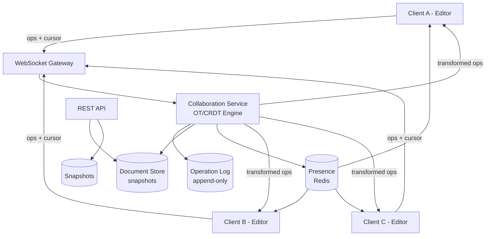

*The diagram shows the core collaboration topology: clients connect to a WebSocket Gateway, which forwards operations to the Collaboration Service running the OT/CRDT engine. The engine persists every operation to an append-only Operation Log, snapshots document state in the Document Store, and broadcasts cursor/selection Presence (via Redis) and transformed operations back to all collaborators. A separate REST API serves non-real-time operations (open, permissions, snapshots).*

**Problem Statement:** Design a real-time collaborative document editing system like Google Docs where multiple users can simultaneously edit the same document, see each other's cursors and selections, comment and suggest changes, maintain full version history with rollback, share with granular permissions (view/comment/edit), and edit offline — all while converging all clients to the same document state, keeping keystroke-to-screen latency under 200 ms for remote collaborators and 50 ms for local input, at a scale of 100M+ documents and 10M+ concurrent editing sessions.

**The conflict-resolution challenge in numbers:** Two users edit a 10,000-character document. User A inserts "collaboration" at position 5,000 while User B simultaneously deletes characters 4,995–5,005. Without a conflict-resolution algorithm, A's insertion point is now invalid because the text it referenced was deleted, and the two clients diverge irreversibly. The system must transform A's operation against B's deletion (shifting the insertion point left by the number of deleted characters) so both clients converge. At scale, this transformation must happen for millions of operations per second across thousands of concurrent editors per document, with deterministic results regardless of the order in which operations arrive over an unordered network.

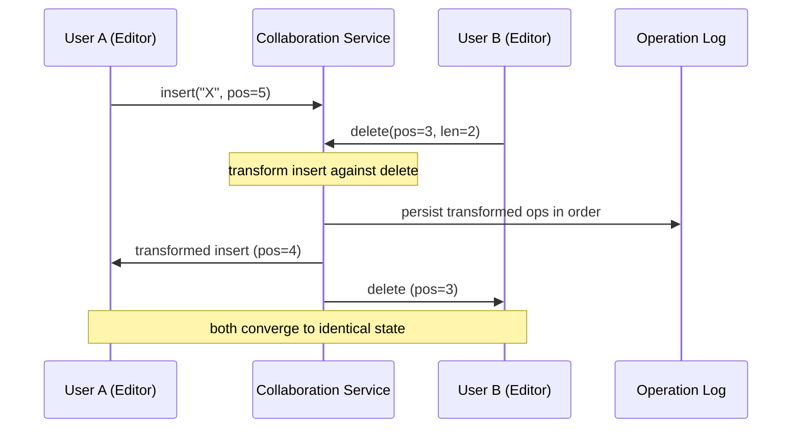

*Conflict-resolution flow: User A sends an insert at position 5; User B sends a delete at position 3 simultaneously. The Collaboration Service transforms A's insert against B's delete (shifting the insertion point to 4), persists both transformed operations in a canonical order in the Operation Log, and broadcasts the resolved operations back to both clients — who each apply the canonical operations and converge to identical document state.*

---

### Characteristics

- **Real-time sync:** Changes propagate to all collaborators within milliseconds. Each keystroke generates an operation sent over a persistent WebSocket connection; the collaboration service transforms and broadcasts it, and peers apply it locally. Convergence must be deterministic regardless of operation arrival order.
- **Conflict resolution:** Concurrent edits at overlapping positions must merge without divergence. Achieved via Operational Transformation (OT) with a central server that assigns canonical ordering, or CRDT where operations commute and converge without coordination.
- **Presence:** Live cursors, selections, and focus indicators show where collaborators are editing. Broadcast periodically over a pub/sub channel (Redis) with a short TTL (e.g., 5 s) so stale cursors are cleaned up automatically.
- **Offline support:** Clients queue operations locally while disconnected. On reconnect, queued operations are synced and merged — CRDT converges automatically; OT requires transforming pending local ops against ops that occurred while offline.
- **Versioning:** Full document history with snapshots and the ability to time-travel. A snapshot is taken every N operations (e.g., 1,000); the operation log is truncated after the snapshot. Rollback = load snapshot + replay ops up to a point.
- **Scale:** Millions of documents, thousands of concurrent editors per document. Requires sharding by document ID, sticky WebSocket routing, and a write-optimized operation log.
- **Global consistency:** All collaborators on a document converge to the same state. Within a region this is strong (single leader or CRDT); cross-region, eventual consistency with conflict-free merge is acceptable for read-heavy metadata.

---

### Pros

- **True collaboration:** Distributed teams work simultaneously as if co-located, accelerating decision-making and iteration speed.
- **Conflict elimination:** OT/CRDT merge concurrent edits automatically — no "your version / their version" merge hell.
- **Accessibility:** Any device with a browser can collaborate instantly; no software install or file transfer.
- **Instant sharing:** Share a link and the collaborator joins in real time.
- **Full history:** Undo/redo at any point in time, safe experimentation, and audit trails.
- **Cross-platform:** Web, mobile, and desktop editors all share the same converged document state.
- **Real-time awareness:** Presence (cursors, selections) reduces duplicate work and enables informal coordination.

---

### Cons

- **Algorithmic complexity:** OT/CRDT implementations are subtle; incorrect transformation functions cause irreversible document divergence. CRDT adds per-operation metadata overhead.
- **Network sensitivity:** Latency is visible — geographically distant collaborators perceive a delay. A centralized OT server creates a single coordination point.
- **Memory pressure:** CRDTs carry per-element metadata (timestamps, client IDs, tombstones); large documents with deep history consume significant memory per client.
- **Edge cases:** Simultaneous insert + delete at the same position, concurrent formatting operations, and structural edits (table rows) require careful handling.
- **Single-point hot docs:** A single document with 100+ editors saturates one collaboration server and its document replica.
- **Security surface:** Real-time WebSocket streaming is harder to secure than request/response REST; interception of operations leaks document content.
- **Offline merge cost:** Large offline edit queues require expensive transformation/replay on reconnect.

---

### Use Cases

- **Google Docs–style collaboration:** Teams co-author reports, proposals, and meeting notes with live cursors, comments, and suggestions. The editor applies local edits optimistically and reconciles with remote ops via OT/CRDT within tens of milliseconds.

- **Interview / shared coding:** A candidate edits a shared code buffer with an interviewer; changes appear instantly for both parties. The low-latency path lets interviewers observe the candidate's thought process in real time.

- **Co-teaching and education:** Instructors and students co-create lesson plans or solve problems on a shared canvas. Presence indicators show who is focused where, reducing duplicate explanations.

- **Design review and specification:** Distributed design teams edit a shared spec or design canvas with awareness of each other's cursors, avoiding conflicting changes to the same paragraph.

- **Live meeting notes:** A rotating scribe captures notes that every attendee sees update in real time, with threaded comments for side discussions that don't disrupt the main narrative.

- **Asynchronous offline:** Travelers or shift workers edit while offline and sync on reconnect; teammates see the changes once the offline user is back online and their queued operations have been merged.

---

### Components

| Component | Purpose | Responsibilities | Relationship | Real-world Example |
|---|---|---|---|---|
| Editor | UI for editing | Rendering, cursor, selection, syntax, input handling | Monaco, Quill, ProseMirror | Google Docs editor |
| Collaboration Service | Real-time sync engine | OT/CRDT transformation, op routing, session management, document sharding | WebSocket ↔ clients; owns a shard of docs | Socket.IO + ShareJS / Yjs WebSocket provider |
| Document Store | Persist canonical state | Store snapshots + operation log; serve latest state to new joiners | Collab Service ↔ DB | Firestore, CockroachDB, DynamoDB |
| Operation Log | Append-only event stream | Persist every operation with global order; enable catch-up and replay | Collab Service writes; clients replay on join | Kafka, event-sourced store |
| Presence Service | Track cursors/selections | Broadcast cursor positions, selection ranges, focus state; TTL for stale cleanup | Redis pub/sub per document | Cursor tracking |
| Version History Service | Historical snapshots | Periodically snapshot document; time-travel queries and restore | Document Store | Revision service |
| Auth/Permission | Access control | Verify identity, enforce document/section ACLs, manage sharing links | Auth provider + DB | Google Auth |
| Notification Service | Real-time alerts | Comment mentions, suggestions, share invitations | Collab ↔ Push | FCM/APNs |
| File Service | Embedded media | Upload/embed images/videos, generate thumbnails, transcode | Object storage | Google Drive |

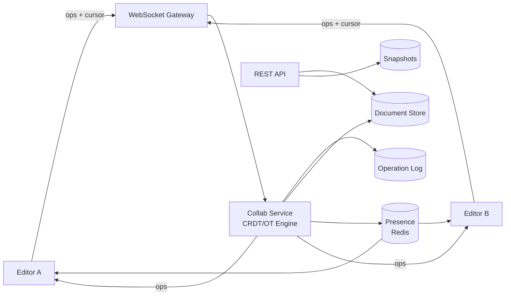

*Component interaction flow: editors send operations and cursor positions over WebSocket to a gateway, which routes them to the Collaboration Service. The service persists each operation in the Operation Log (for ordering and catch-up), snapshots canonical state in the Document Store, and broadcasts the resolved operation plus live Presence (cursors/selections) back to all collaborators. A REST API serves non-real-time access (open, permissions, snapshots).*

### Architectural Patterns

- **Operational Transformation (OT):** A central server transforms concurrent operations against each other to maintain a single canonical document state. Each client sends an operation; the server transforms it against all prior concurrent operations in the log, assigns a sequence number, and broadcasts the transformed op. Clients apply the transformed op and transform their own pending local ops. *When to use:* when a central coordinator is acceptable and you want lower per-operation metadata than CRDT. *When not to use:* when you need decentralized or offline-first collaboration. *Trade-off:* proven at Google's scale but requires 16 transformation functions (insert-insert, insert-delete, delete-insert, delete-delete) and strict central ordering.

- **CRDT (Conflict-free Replicated Data Type):** Operations commute — the order of application does not change the result. Each operation carries a globally unique, ordered ID (Lamport timestamp + client ID); insertions use fractional indexing so an insertion between any two existing elements always resolves. No central server is required; any client can accept and broadcast operations, and all peers converge automatically. *When to use:* decentralized/offline-first systems, P2P collaboration. *When not to use:* simple single-server editors where metadata overhead is wasteful. *Trade-off:* automatic convergence and offline support at the cost of per-element metadata and tombstone garbage collection.

- **Event sourcing:** Every edit is an immutable event in an append-only operation log. The document's current state is a projection (snapshot + replay). This provides auditability, replayability, and decoupling of the real-time path from the persistence path. *Trade-off:* higher storage cost and read-side eventual consistency for catch-up.

- **Command Query Responsibility Segregation (CQRS):** Writes (edit, comment) go to a write model that persists operations; reads (open, history, preview) use a separate read model (snapshot store) optimized for fast retrieval. Models synchronize asynchronously via the operation log. *Trade-off:* independent scaling of read and write paths at the cost of read-side lag.

- **Microservice architecture:** Each capability (Editor edge, Collaboration Service, Document Store, Presence, Auth, Notification) is an independently deployable service with its own data store. Communication is via WebSocket (real-time) and REST/gRPC (non-real-time), with an event bus for cross-service signals (mentions, share invitations).

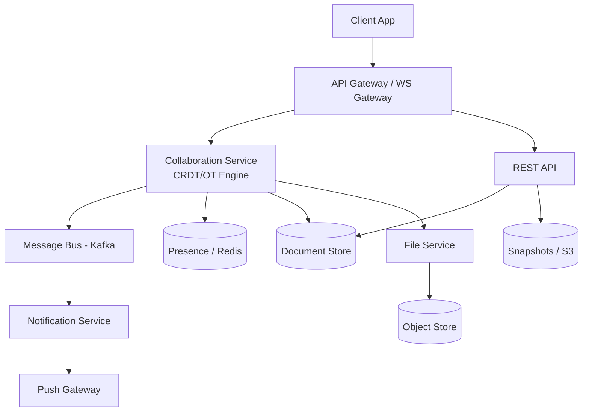

*A modern collaborative document platform uses a microservice, event-driven backbone: the Collaboration Service owns the CRDT/OT engine and routes operations over WebSocket; the operation log (Kafka or native append-only store) provides global ordering and catch-up; the Document Store holds snapshots; the Presence Service (Redis) broadcasts live cursors and selections; and an edge layer (CDN + WebSocket gateway) keeps latency low for global collaborators.*

---

### Benefits

- **Productivity:** Distributed teams collaborate as if co-located, accelerating decision-making and iteration.
- **Conflict elimination:** Concurrent edits merge automatically — no merge hell and no lost work.
- **Instant sharing:** A link is enough to start collaborating; permissions decide the experience.
- **Full history:** Undo/redo and time-travel protect against mistakes and provide audit trails.
- **Global availability:** Edge-collocated collaboration keeps keystroke latency low worldwide.
- **Offline resilience:** Local edits sync on reconnect without data loss.

---

### Challenges

**Technical challenges:**
- Conflict-resolution correctness — OT transformation functions must satisfy TP1 and TOC properties; CRDT tombstones must be garbage-collected safely.
- Real-time sync — WebSocket infrastructure must handle reconnection, catch-up from the operation log, and message ordering.
- Presence — cursor/selection sync must stay fresh; stale cursors must be cleaned up without flickering.
- Formatting and structural ops — bold/italic and table row insertions are higher-level operations that must also transform correctly.

**Scalability challenges:**
- WebSocket scale — millions of concurrent connections require thousands of collaboration servers; each document's editors must be pinned to one server (sticky routing).
- Hot documents — a single document with 100+ editors saturates one server; CRDT reduces coordination but per-client memory grows.
- Persistence — millions of operations per second demand a write-optimized operation log and periodic snapshot compaction.

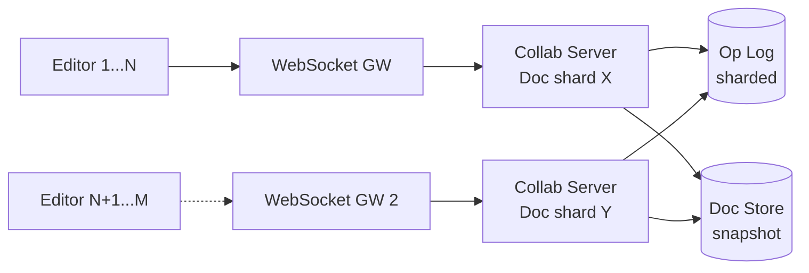

*Scaling by document sharding: editors of a given document are sticky-routed to the same Collaboration Server (which owns that document shard). Different documents hash to different shards/servers, allowing horizontal scale. The operation log and document store are shared-sharded so any collaboration server can rebuild state after failover.*

**Performance challenges:**
- Latency — sub-100 ms round-trip requires edge-collocated collaboration servers and fast CRDT ops.
- Large documents — 10,000+ line documents need diff-only sync and compression to avoid saturating the channel.
- Reconnection — catch-up must replay only since the client's last seen sequence number, not the full history.

**Reliability challenges:**
- Server crash — clients reconnect to a new collaboration server and rebuild state from the op log.
- Message loss — sequence numbers detect gaps; the client requests retransmission of missing ops.
- Clock skew — never rely on wall clocks for ordering; use logical timestamps (Lamport, LWW) or server-assigned sequence numbers.

**Maintainability challenges:**
- Schema evolution — document format changes must be backward and forward compatible.
- CRDT garbage collection — tombstone cleanup must not break convergence; only garbage-collect after all peers have acknowledged the tombstone.

**Security concerns:**
- Access control — document ACLs must be checked at connection and on every operation.
- Data exfiltration — prevent bulk download/export of documents; consider watermarking.
- Presence privacy — who can see your cursor?
- Operation interception — WebSocket (wss://) encryption and token validation prevent eavesdropping.

---

### Best Practices

- **CRDT over OT for offline-first and P2P:** CRDTs converge automatically and work offline without a central coordinator; OT is simpler to get correct when a central server is acceptable.
- **Cursor-based pagination for operation fetch:** Clients fetch operations by a sequence cursor, not by offset, for efficient catch-up after reconnection.
- **Presence TTL:** Remove stale cursors after 5 s of no updates to keep presence accurate and avoid showing disconnected collaborators.
- **Operation log compaction:** Take a snapshot every 1,000 operations and garbage-collect older operations once all active clients have caught up to the snapshot.
- **WebSocket sharding by document_id:** Pin all editors of a document to the same collaboration server via consistent hashing on the document ID.
- **Offline-first with client UUIDs:** Each operation carries a client-generated UUID for idempotency; queue local ops while offline and sync on reconnect.
- **Monitoring:** Track sync latency (p99 < 100 ms), reconnect rate, conflict rate (must be 0 with CRDT), cursor lag, and operation-log growth.

---

### When to Use / When Not to Use

**Use when:**
- Real-time, synchronous editing by distributed team members is a core feature of the product.
- Multiple people must see each other's edits and cursors within seconds.
- Version history with rollback and time-travel is required.
- Offline editing with reliable merge-on-reconnect is needed.
- Documents are the primary artifact (reports, proposals, specs, code).

**Avoid when:**
- Documents are read-only or edited by one person at a time — a simple file store + REST API is cheaper and simpler.
- End-to-end encryption is mandatory by default — real-time sync inherently exposes content to the server.
- Content is primarily large binary files (PDF, high-res video) as the main payload — object storage and a CDN are better suited.

**Alternatives:**
- **Email attachments:** Asynchronous, version conflicts, no real-time collaboration.
- **Version control (Git):** Powerful but not real-time; merge conflicts are manual.
- **File sync (Dropbox/OneDrive):** Eventual consistency; no real-time viewing or cursor awareness.

**Decision factors:**
- Real-time requirements (sub-200 ms latency vs. eventual consistency).
- Offline needs (queue local ops vs. connected-only editing).
- Scale (concurrent editors per document, total document count).
- Security (end-to-end encryption requirements).
- Global latency (edge-collocated collaboration vs. single-region).

---

### Data Model and API

The data model captures documents, the users who edit them, the immutable operations that transform them, the snapshots that compact history, the permissions that gate access, and the comments/media attached to content.

```mermaid
erDiagram
    DOCUMENT ||--o{ OPERATION : "has"
    DOCUMENT ||--o{ SNAPSHOT : "has"
    DOCUMENT ||--o{ PERMISSION : "has"
    DOCUMENT ||--o{ COMMENT : "has"
    DOCUMENT ||--o{ MEDIA : "contains"
    USER ||--o{ OPERATION : "creates"
    USER ||--o{ COMMENT : "creates"
    USER ||--o{ PERMISSION : "granted to"
    USER ||--o{ DOCUMENT : "owns"

    DOCUMENT {
        string document_id PK
        string title
        string owner_id FK
        string visibility
        datetime created_at
        datetime updated_at
    }
    OPERATION {
        string op_id PK
        string document_id FK
        string client_id
        string type insert/delete/retain
        int position
        string content
        datetime timestamp
        string lamport_id
        bigint sequence
    }
    SNAPSHOT {
        string snapshot_id PK
        string document_id FK
        string content
        int op_count
        datetime created_at
    }
    PERMISSION {
        string document_id FK
        string user_id FK
        string role viewer/commenter/editor/owner
        datetime granted_at
    }
    COMMENT {
        string comment_id PK
        string document_id FK
        string user_id FK
        string content
        boolean resolved
        string parent_id
        datetime created_at
    }
    MEDIA {
        string media_id PK
        string document_id FK
        string url
        string mime_type
        int size
        datetime created_at
    }
```

*The entity-relationship diagram models the collaborative-document domain: a Document owns Operations (the immutable edit log), Snapshots (compacted states for fast load), Permissions (who can view/comment/edit), Comments (threaded, anchored to selections), and Media (embedded images). Users author operations, comments, and permissions; each document has exactly one owner.*

**Entity descriptions:**

- **DOCUMENT:** `document_id` (UUID for even distribution), `title`, `owner_id`, `visibility`, `created_at`, `updated_at`. Stored in the canonical Document Store (PostgreSQL/CockroachDB); hot metadata cached in Redis.
- **OPERATION:** `op_id` (PK), `document_id` (FK), `client_id`, `type` (insert/delete/retain), `position`, `content`, `timestamp`, `lamport_id`, `sequence` (server-assigned global order). Append-only; the source of truth for concurrency and catch-up.
- **SNAPSHOT:** `snapshot_id` (PK), `document_id` (FK), `content` (or binary-compressed blob), `op_count` (the operation sequence it represents), `created_at`. Periodic compaction of the operation log.
- **PERMISSION:** `document_id` (FK), `user_id` (FK), `role` (viewer/commenter/editor/owner), `granted_at`. Enforces sharing.
- **COMMENT:** `comment_id` (PK), `document_id` (FK), `user_id` (FK), `content`, `resolved`, `parent_id` (threading), `created_at`.
- **MEDIA:** `media_id` (PK), `document_id` (FK), `url` (CDN), `mime_type`, `size`, `created_at`.

**Partitioning / Sharding:** Documents are sharded by `document_id` hash across collaboration-server groups and Document Store shards. Operations are co-located with their document. Snapshots shard the same way. Comments and permissions are sharded by `document_id` so a document's full state is on one shard.

**Operation log compaction:** Every 1,000 operations, the Collaboration Service triggers a snapshot; once all active collaborators on a document have acknowledged the new snapshot (via a high-watermark), older operations can be garbage-collected. Snapshots live in cheap, durable object storage (S3); the operation log stays in a write-optimized store (Cassandra or a Kafka-style log) for replay and catch-up.

**API Contract:**

| Method | Endpoint | Purpose | Auth Scope |
|---|---|---|---|
| POST | `/api/v1/documents` | Create a new document | `documents:write` |
| GET | `/api/v1/documents/{documentId}` | Get document metadata + permissions | `documents:read` |
| GET | `/api/v1/documents/{documentId}/ops` | Get operation log (catch-up) | `documents:read` |
| GET | `/api/v1/documents/{documentId}/snapshot` | Get latest snapshot | `documents:read` |
| PUT | `/api/v1/documents/{documentId}/permissions` | Update sharing permissions | `documents:manage` |
| POST | `/api/v1/documents/{documentId}/comments` | Add a comment | `comments:write` |

**WebSocket endpoint:** `wss://collab.example.com/doc/{document_id}` — real-time operations, cursor, and presence. The token is validated at connect time; the document ACL is re-checked before the first operation is accepted.

**Authentication:** JWT bearer token. Verified at connection; document access re-checked on every operation. Scope-based authorization at the REST API; role-based authorization (viewer/commenter/editor/owner) at the WebSocket document level.

**Error responses:**
```json
{"error": "permission_denied", "message": "No edit access to document", "code": 403}
{"error": "document_not_found", "message": "Document does not exist", "code": 404}
{"error": "conflict", "message": "Operation rejected by conflict resolver", "code": 409}
```

**Idempotency:** Each operation includes a client-generated UUID; the server deduplicates by `(document_id, client_op_uuid)` so retries after a network blip never duplicate an edit.

---

### Operational Transform Deep Dive

The Operational Transform Deep Dive is the heart of collaborative editing: it covers the OT algorithm (transform concurrent operations against a central order), the CRDT alternative (commuting operations without a central coordinator), presence (live cursors and selections), conflict resolution (edge cases and convergence guarantees), and real-time sync (WebSocket, catch-up, and offline merge).

#### The Core Challenge: Conflict Resolution

```
User A types "Hello" at position 5
User B deletes character at position 3 (simultaneously)

After B's delete, position 5 in A's view != position 5 in B's view
→ Without conflict resolution, document diverges

Two approaches:
  1. OT (Operational Transformation) — Google Docs' original approach
  2. CRDT (Conflict-free Replicated Data Types) — Modern approach (Figma, Notion)
```

*When two users edit at overlapping positions simultaneously, the position each user computed is only valid in their local view. If User B's delete (position 3) is applied first, User A's insert (position 5) shifts to 4 in B's view — so the server must transform A's operation against B's deletion and broadcast the transformed operation. Without this, the two clients diverge irreversibly.*

#### Operational Transformation (OT)

```
Core idea: Transform operations against each other

A: insert("X", pos=5)
B: delete(pos=3)

If B arrives first at server:
  Transform A against B: insert("X", pos=4)  ← shifted left by 1
  
Server maintains single ordering of operations
Clients transform their pending ops against incoming ops

Server architecture:
  Central server receives all ops
  Assigns global ordering
  Broadcasts transformed ops to all clients

Pro: Well-proven (Google Docs uses this); lower metadata
Con: Central server required; 16 TTT (transform-against-transform) functions; harder offline support
```

*OT's correctness hinges on the Transformation Heritage Theorem (TP1): transforming an operation against a single concurrent operation must be associative and preserve intent. The full OT implementation has 16 transformation functions covering all pairs of (insert/delete/retain) × (insert/delete/retain). The central server assigns a canonical sequence number to every operation, giving every client the same ordering and thus convergence.*

```java
@Service
public class OperationalTransformationService {

    /**
     * Transform operation {@code op} against a single concurrent operation {@code concurrentOp}.
     * Returns {@code op} adjusted so its intent is preserved in the document state
     * produced by applying {@code concurrentOp} first.
     */
    public Operation transform(Operation op, Operation concurrentOp) {
        if (concurrentOp.getPosition() < op.getPosition()) {
            op.setPosition(op.getPosition() - concurrentOp.getAffectedLength());
        }
        // Retain runs and insert/delete ordering are resolved by the canonical
        // server sequence; clients only re-order their *pending* local ops.
        return op;
    }

    /**
     * Assign a canonical sequence number and broadcast to all collaborators.
     * The sequence number guarantees a single total order → deterministic convergence.
     */
    public void broadcast(String documentId, Operation transformedOp, long sequence) {
        transformedOp.setSequence(sequence);
        operationLog.append(documentId, transformedOp);
        webSocketService.broadcast(documentId, transformedOp);
    }
}
```

*The `OperationalTransformationService` bean encapsulates the two responsibilities of an OT server: `transform` adjusts an incoming operation against a single concurrent operation (shifting the position when the concurrent op precedes it), and `broadcast` assigns the canonical server sequence number, persists the operation to the log, and fans it out to all connected clients over WebSocket. The sequence number is the key to convergence — every client applies operations in the same order.*

#### CRDT Alternative

```
Core idea: Data structure that guarantees convergence without coordination

Each character has a unique, ordered ID:
  "Hello" → (H,id1) (e,id2) (l,id3) (l,id4) (o,id5)

IDs are designed so insertion between any two chars always works:
  Insert "X" between id2 and id3 → assign id2.5 (fractional indexing)

Operations commute: order of application doesn't matter
  → No central server needed
  → Works offline naturally

Pro: Peer-to-peer capable; simpler consistency; offline-friendly
Con: Metadata overhead per character; garbage collection needed (tombstones)
```

*CRDT achieves convergence by giving every element a globally unique, totally-ordered identifier. Insertions between any two existing IDs use fractional indexing (e.g., 2.5 between 2 and 3, then 2.25 between 2 and 2.5) so the insertion point always resolves. Because operations commute, no central coordinator is needed, and disconnected peers converge automatically when they reconnect — this is why Figma and Notion can merge offline edits without a central server.*

```java
@Service
public class CrdtEngine {

    /**
     * Assign a fractional ID between two existing element IDs for an insert.
     * The ID space is dense: between any two IDs there is always room for more,
     * so insertions always converge regardless of arrival order.
     */
    public CrdtId fractionalInsert(CrdtId left, CrdtId right) {
        return CrdtId.midpoint(left, right); // e.g. midpoint(2, 3) -> 2.5
    }

    /**
     * Apply an operation locally. Because ops commute, application order
     * does not matter — the final state is identical on every peer.
     */
    public void apply(String documentId, Operation op) {
        crdtStore.merge(documentId, op);            // local CRDT merge
        operationLog.append(documentId, op);        // persist for catch-up
        webSocketService.broadcast(documentId, op); // fan out to peers
    }
}
```

*The `CrdtEngine` bean assigns fractional IDs between existing element IDs (using `CrdtId.midpoint`), so an insertion between any two characters always resolves to a unique, ordering-stable ID. The `apply` method merges the operation into the local CRDT store, appends it to the operation log for catch-up, and broadcasts it to peers — order-independent application guarantees eventual convergence.*

#### Real-Time Sync

**Collaboration session flow:**

1. User opens document → API Gateway loads the latest snapshot + recent operations from the Document Store → the client applies them to render the initial editor.
2. User types a character → Monaco (or the chosen editor) generates an operation → the operation is applied *optimistically* locally (so the keystroke appears instantly) → the operation is sent to the Collaboration Service via WebSocket.
3. The Collaboration Service persists the operation to the Operation Log (assigning a canonical sequence number for OT, or accepting the client's CRDT ID), transforms/broadcasts it to all other connected clients.
4. Other clients transform/broadcast and apply the operation → documents converge.
5. Offline: operations are queued locally; on reconnect, the client sends queued ops and catches up on missed ops by replaying the operation log from its last seen sequence.

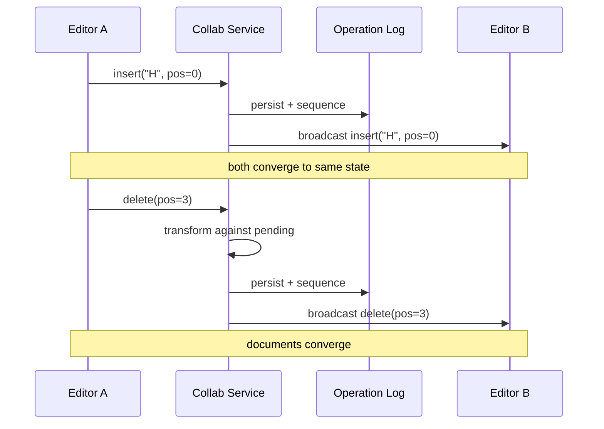

*Real-time sync sequence: Editor A sends an insert; the Collaboration Service persists it with a canonical sequence in the Operation Log and broadcasts to Editor B, who applies it so both converge. When A then sends a delete, the service transforms it against any pending ops, persists and re-broadcasts — every client applies operations in the same canonical order, guaranteeing convergence.*

#### Version History

The system maintains full version history using periodic snapshots plus the append-only operation log:

```
Approach: Periodic snapshots + operation log

  t=0:   Snapshot_0 (base document)
  t=1-50: Operations 1-50
  t=50:  Snapshot_1 (compacted)
  t=51-100: Operations 51-100
  ...

View history: Show snapshots as "versions"
Rollback: Load snapshot + replay ops up to desired point
Storage: Keep recent ops in hot storage, archive old snapshots
```

*Version history is built from snapshots (periodically compacted document state) and the operation log (append-only edits). To time-travel to version N, load the snapshot at or before N and replay operations up to N. Snapshots live in durable object storage; the operation log is write-optimized. Old operations can be garbage-collected once every active client has acknowledged a later snapshot (via a high-watermark the collaboration server tracks per document).*

#### Presence

Presence — live cursors, selections, and focus — is what makes collaboration feel connected. Each client periodically broadcasts its cursor position and selection range over a lightweight channel; the Presence Service (Redis pub/sub scoped per document) fans these out to all other collaborators, who render colored cursors with user names. A short TTL (5 s) removes stale cursors automatically.

```java
@Component
@RequiredArgsConstructor
public class PresenceService {

    private final SimpMessagingTemplate messagingTemplate;
    private final RedisTemplate<String, String> redisTemplate;

    public void broadcastSelection(String documentId, String userId, Selection selection) {
        // Record the user as present (refreshed on every update)
        redisTemplate.opsForValue().set(
                "presence:" + documentId + ":" + userId,
                "1", Duration.ofSeconds(6));
        // Fan out the live selection to all collaborators on this document
        messagingTemplate.convertAndSend(
                "/topic/doc/" + documentId + "/presence",
                new SelectionEvent(userId, selection));
    }
}
```

*The `PresenceService` bean publishes a per-user presence key to Redis (with a 6 s TTL refreshed on every update) so stale collaborators are evicted automatically, and uses Spring's `SimpMessagingTemplate` to broadcast the live selection event to every collaborator subscribed to the document's presence topic. Clients render the remote cursor/selection and remove it once its presence key expires.*

#### Conflict Resolution Edge Cases

CRDT and OT handle the hard cases differently, and these are the edge cases that break naive implementations:

- **Simultaneous insert at the same position:** CRDT assigns each insertion a unique fractional ID and tie-breaks by client ID (deterministic total order). OT transforms one insert against the other: the second insert's position shifts by the first's affected length.
- **Delete + insert at the same position:** CRDT leaves a tombstone (a metadata marker for the deleted range); the insert uses an ID outside the tombstone range so it survives. OT checks causality — if the delete causally precedes the insert, the insert is repositioned after the deletion point.
- **Concurrent deletes of overlapping ranges:** CRDT tombstones merge (a tombstone with a wider range wins). OT transforms one delete against the other, capping its affected length to the remaining range.
- **Offline merge:** CRDT converges automatically when the offline client reconnects and exchanges operations. OT requires the client to replay the server's operation log since its last seen sequence, transforming each pending local op against every intervening server op.

---

### Replication Strategies

Collaborative editing systems replicate data across multiple dimensions: within a region (for availability and consistency), across regions (for global latency), and across storage systems (for different access patterns — durable ops, fast snapshots, ephemeral presence).

**Leader-based replication (Document Store / Operation Log):** Documents and their operation logs are written to a primary CockroachDB/PostgreSQL instance and replicated to read replicas. Writes go only to the leader; the leader assigns the canonical sequence number and synchronously replicates the operation before acknowledging the client. Reads (snapshots, metadata, catch-up) can be served from any replica.

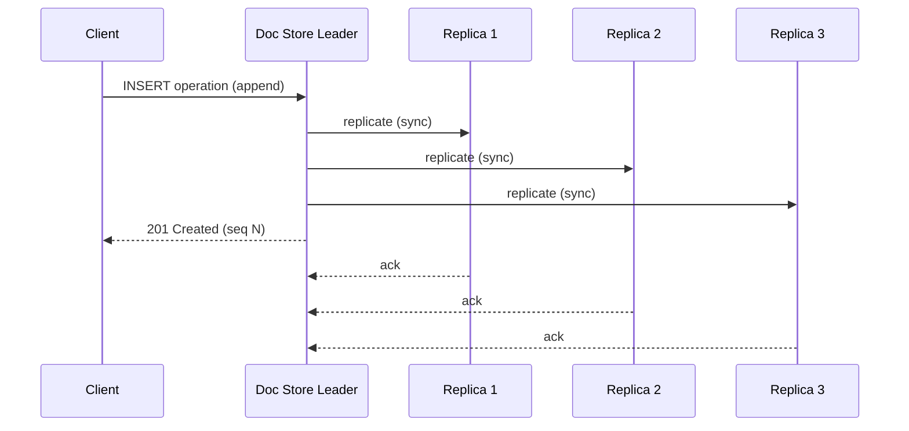

*Leader-based replication for the Operation Log: the client appends an operation to the leader, which synchronously replicates it to N replicas (acknowledged by a quorum) and returns 201 Created with the canonical sequence number. Replicas serve catch-up reads and snapshot loads, accepting a small replication lag for higher read throughput.*

**Leaderless / CRDT replication (Presence):** Presence state (cursors, selections, online status) is ephemeral and benefits from leaderless, last-write-wins semantics. The Presence Service uses Redis with active-active replication (or a CRDT-backed store) so any region can update a user's cursor without coordination; conflicts resolve by logical timestamp.

**Multi-region replication:** Operation logs are sharded by `document_id` and replicated with global ordering (Raft/CockroachDB replication across regions). Snapshots are stored in multi-region object storage (S3 with Cross-Region Replication). Presence is regional (each region's Redis fan-out, bridged for cross-region documents). New documents are assigned to a home region; collaborators' cursors are bridged only when a document is actively edited cross-region.

**Real-world use:** CockroachDB / Spanner for the operation log (strong global ordering), Cassandra for document snapshots (tunable consistency, multi-DC), Redis (active-active or CRDT) for presence, S3 + CloudFront for snapshots/media.

---

### Failure Detection and Membership

Collaboration servers must detect failed peers, redistribute stuck documents, and continue serving edits with minimal disruption.

**Gossip-based membership:** Each Collaboration Service instance periodically exchanges health information with a random subset of peers (gossip protocol). Membership changes propagate through the cluster in O(log N) rounds without a central coordinator.

**Health checks:**

- **Liveness probes:** HTTP `/health` endpoint checked every 2 s by the orchestrator (Kubernetes). If unhealthy, the pod is restarted or removed from service discovery.
- **Readiness probes:** Checks if the service can serve traffic (e.g., can connect to the Operation Log and Document Store). Not-ready pods are removed from the load balancer.
- **Business health checks:** Custom checks like "operation-log lag < 10,000" or "WebSocket connection count < 90% of limit."

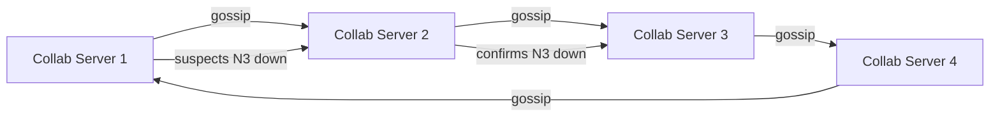

*Gossip-based failure detection in a collaboration cluster: servers periodically exchange health state with random peers. When a server suspects a peer is down, it propagates the suspicion through gossip; once confirmed by multiple nodes, the peer is removed from the cluster and its document shards are reassigned.*

**Failure-detection timing for collaborative editing:**

| Component | Check Interval | Timeout | Action |
|---|---|---|---|
| Collaboration Service | 2s | 6s | Reassign document shards; clients reconnect |
| Operation Log | 5s | 15s | Trigger consumer rebalancing; queue ops |
| Document Store | 5s | 15s | Failover to replica; serve stale snapshot |
| Presence (Redis) | 2s | 6s | Mark cursors stale; redistribute pub/sub |
| WebSocket Gateway | 3s | 10s | Drain connections; route to healthy gateway |

**Circuit breakers:** For dependencies that are failing, a circuit breaker (Resilience4j) trips after N consecutive failures and stops sending requests for a cooldown. This prevents cascading failures — if the Operation Log is slow, the Collaboration Service short-circuits, queues operations in memory, and flushes when the log recovers, rather than saturating with slow requests.

---

### High Availability and Scalability

Collaborative editing platforms must remain available during node failures, WebSocket disconnects, and regional outages while scaling to handle global traffic and hot documents.

#### Multi-Region Deployment

Deploy active collaboration services in at least 3 regions (e.g., us-east, eu-west, ap-southeast). Users are routed to the nearest region via GeoDNS or a latency-based load balancer. Each region is self-sufficient for its document shards; cross-region coordination happens only for documents with collaborators in multiple regions.

- **Active-passive for the Operation Log:** Writes go to the primary region for a document's shard; reads (catch-up, snapshots) can be served from any region's replica. Cross-region replication lag is typically 1–3 seconds.
- **Active-active for Presence:** Presence state (cursors) is federated between regions via Redis pub/sub bridges; stale presence expires by TTL.
- **Global CDN:** Static assets (editor bundles, media) are cached at edge locations worldwide, reducing latency to < 50 ms for clients.

#### Auto-Scaling

- **Stateless services (WS Gateway, REST API):** Scale horizontally based on CPU and connection count. Kubernetes HPA adjusts replica count automatically.
- **Stateful services (Collaboration Service, Document Store):** Scale by adding shards — documents re-partition as the hash ring grows. WebSocket servers scale by connection count.
- **Operation Log:** Scales by partition count; each partition is consumed by a dedicated collaboration server for that document shard.

#### Graceful Degradation

When a component fails, the system should degrade rather than crash:

- **Collaboration Service down:** Clients fall back to local-only optimistic editing; operations are queued locally and synced when the service reconnects. The editor remains fully usable offline.
- **Operation Log slow:** The collaboration server batches and buffers operations, applying backpressure to clients (throttling non-urgent ops) and flushing when the log recovers.
- **Document Store unavailable:** New documents cannot be created, but already-opened documents continue to sync via the in-memory op log until the store recovers.
- **Presence Service down:** Cursors stop updating; stale cursors expire by TTL. Editing continues; only awareness is lost.

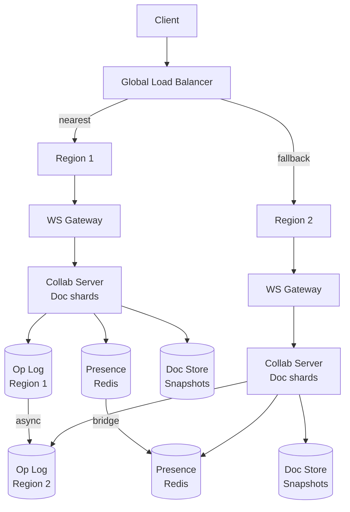

*Multi-region high availability: a global load balancer routes clients to their nearest region. Each region is self-sufficient with its own WebSocket Gateway, Collaboration Servers (owning a subset of document shards), Operation Log, Document Store, and Presence Redis. Cross-region replication keeps operation logs and snapshots synchronized asynchronously; presence is bridged between regions; if one region fails, the load balancer routes traffic to the other.*

---

### Performance and Optimization

The performance of a collaborative editor is measured by edit-to-screen latency (sub-200 ms for remote collaborators, sub-50 ms for local input) and by the throughput of operations it can sustain per document.

#### Latency Optimization

- **Edge-collocated collaboration:** Run collaboration servers in edge PoPs (Cloudflare Workers, AWS Global Accelerator) so the 99th-percentile round-trip is < 50 ms for most users.
- **Optimistic local apply:** Apply the operation locally before server confirmation so the user sees their keystroke instantly; revert only on rare conflict rejection.
- **Connection pooling:** Maintain persistent WebSocket and HTTP/gRPC connections between the gateway and collaboration servers to avoid per-connection handshake overhead.
- **Snapshot caching:** Cache the latest snapshot and recent operations in Redis per document so opening a document avoids a cold DB read.

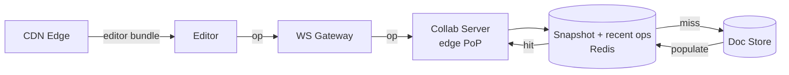

*Multi-tier latency optimization: the editor sends an operation through a WebSocket Gateway to an edge-collocated Collab Server; snapshots and recent operations are served from a Redis cache (hot path) with fallback to the Document Store; the editor bundle itself is delivered from CDN edge locations. Optimistic local apply makes the keystroke feel instant even before server round-trip.*

#### Throughput Optimization

- **Document sharding:** Shard documents by `document_id` hash; each collaboration server owns a disjoint shard, so throughput scales linearly with servers.
- **Operation batching:** Collaboration servers batch outgoing operations per document (e.g., up to 10 ms of ops) to reduce per-op broadcast overhead for documents with many editors.
- **Read replicas:** Catch-up reads and snapshot loads are served from Document Store read replicas, multiplying database read throughput.
- **Diff-only sync:** For large documents, send only the diff (operation) rather than the document; compress long retain/insert runs.

#### Write Path Optimization

- **Async persistence:** The collaboration server applies the operation locally and broadcasts immediately; persistence to the Operation Log is asynchronous (batched every few ms) to keep perceived latency low.
- **In-memory snapshots:** Keep the latest snapshot in memory on the collaboration server so reopening a document within the same session is instant.
- **Backpressure:** When the Operation Log falls behind, the collaboration server applies backpressure (queueing/batching) rather than stalling the real-time broadcast.

**Real-world use:** Google Docs shards documents across colocation-edge collaboration servers and uses OT with central sequencing. Figma uses CRDTs (Yjs) so any edge node can accept operations. Notion uses block-level CRDTs with periodic snapshots to S3 for multi-region durability.

---

### CAP Theorem and Consistency Trade-offs

The CAP theorem states that during a network partition, a distributed system can provide at most two of: Consistency, Availability, and Partition tolerance. Since collaborative editors operate over the public internet, partition tolerance is always required.

#### Operation Log — CP (Consistency + Partition Tolerance)

Document operations require strong consistency: if the Collaboration Service returns success for an operation, it must be durably persisted and ordered. A failed or reordered operation would cause documents to diverge across clients. The Operation Log uses leader-based replication with synchronous acknowledgment from a quorum before confirming an operation.

#### Document Store — CP (Consistency + Partition Tolerance)

Snapshots and metadata must be consistent: a client reading a snapshot must see a coherent state that, combined with subsequent operations, reconstructs the document correctly. The Document Store uses CockroachDB/Spanner with synchronous replication.

#### Presence — AP (Availability + Partition Tolerance)

Presence state (cursors, online status) is ephemeral and can tolerate brief staleness. The Presence Service uses Redis with last-write-wins and a short TTL so stale cursors are removed automatically, prioritizing availability over consistency.

#### Catch-up / Replay — Tunable Consistency

When a client reconnects and requests missed operations, it can read from a local replica (fast, eventually consistent) or the leader (strong, slower). The platform offers both: background catch-up from a replica, and an on-demand strong read after a confirmed reconnect.

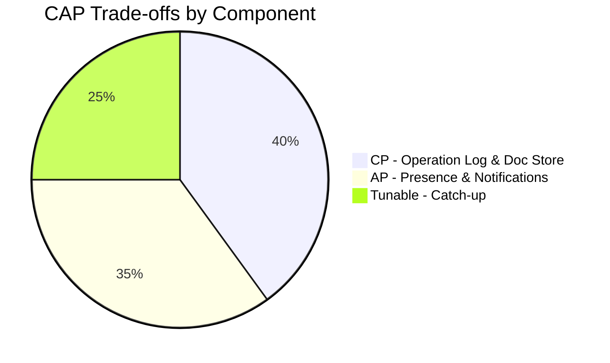

*CAP trade-offs across collaborative-editing components: the Operation Log and Document Store are CP (strong consistency is required for convergence); Presence and Notifications are AP (brief staleness is acceptable); catch-up/replay uses tunable consistency to balance speed and correctness.*

**Interview question:** *Is a collaborative editor strongly consistent or eventually consistent?*
**Answer:** It is *strongly consistent for the document content* — the operation log imposes a single total order so every client converges to identical state — while being *eventually consistent* for ephemeral signals like presence. The key insight interviewers look for: the choice of consistency model depends on what would break convergence. A lost or reordered cursor is harmless; a lost or reordered operation is catastrophic.

---

### Encryption and Key Management

A collaborative editor stores sensitive content — draft text, comments, embedded images, revision history. Encryption must protect data at rest, in transit, and (for private documents) in use.

#### Encryption at Rest

**Document and snapshot storage:** Object storage (S3) encrypts all snapshots with SSE-S3 or SSE-KMS by default. Document/operation metadata in CockroachDB uses TDE (Transparent Data Encryption). Redis for hot snapshots uses encryption-at-rest (Redis Enterprise) or disk-level encryption.

**Private documents:** For documents with strict privacy requirements, the editor can encrypt document content with a per-document data encryption key (DEK) before storage; the DEK is wrapped by a user-supplied key or a KMS-managed key. The server never sees plaintext for E2E-encrypted documents.

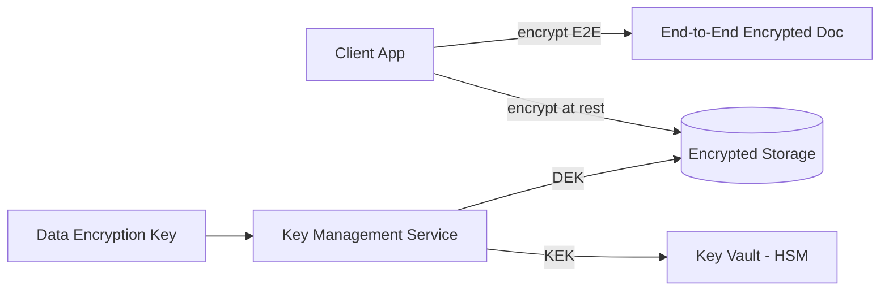

*Encryption at rest architecture: end-to-end encrypted documents are encrypted on the client; the server stores only ciphertext. Server-side encryption at rest protects stored data using DEKs managed by a KMS, with KEKs stored in an HSM-backed key vault. Only authorized clients/users with KMS decrypt permissions can recover the DEK.*

**Media encryption:** Uploaded images/videos are encrypted with per-object DEKs before storage. For documents processed for content indexing, the server decrypts media in a secure, isolated environment for analysis but never retains plaintext on disk.

#### Encryption in Transit

All client-to-server and server-to-server traffic uses TLS 1.3 (minimum TLS 1.2). WebSocket connections use `wss://`. Inter-service communication within the data center uses mTLS (mutual TLS) for service-to-service authentication. Mobile SDKs pin the server certificate to prevent man-in-the-middle attacks.

#### Key Management

- **Key hierarchy:** A KEK (Key Encryption Key) in an HSM encrypts per-document or per-user DEKs. Rotating the KEK requires only re-encrypting the DEKs, not the document content.
- **Key rotation:** KEKs rotated every 90 days; per-document keys rotated on every major revision for E2E-encrypted documents.
- **Multi-region KMS:** Keys are available in all deployment regions; cloud KMS replicates keys automatically; on-prem deployments use HashiCorp Vault for multi-region HA.

**Java example — media/document encryption service as a Spring bean:**

```java
@Service
@RequiredArgsConstructor
public class DocumentEncryptionService {

    @Value("${app.encryption.doc-key-id}")
    private String keyId;

    private final AwsKms kmsClient;

    public EncryptedBlob encrypt(byte[] plaintext) {
        var dek = kmsClient.generateDataKey(keyId);
        var cipher = Cipher.getInstance("AES/GCM/NoPadding");
        cipher.init(Cipher.ENCRYPT_MODE,
                new SecretKeySpec(dek.plaintext(), "AES"),
                new GCMParameterSpec(128, dek.iv()));
        var ciphertext = cipher.doFinal(plaintext);
        return new EncryptedBlob(ciphertext, dek.encryptedKey(), dek.iv());
    }
}
```

*The `DocumentEncryptionService` bean generates a per-object data encryption key (DEK) via AWS KMS, encrypts the document/media blob with AES-GCM (which provides both confidentiality and integrity via the authentication tag), and stores the encrypted DEK alongside the ciphertext. The KMS-managed key ID is injected via `@Value`. Only authorized users with KMS decrypt permissions can recover the DEK to decrypt the content.*

---

### Authentication and Authorization

A collaborative editor must verify who is connecting (authentication), determine what they can do (authorization), and enforce document/privacy controls (who can see and edit which documents).

#### Authentication Methods

- **OAuth 2.0 + JWT:** Users authenticate via a third-party provider (Google, Apple, Microsoft) or email/password. The Auth Service issues a short-lived JWT (15 min) and a refresh token (7 days). The JWT contains the user ID, scopes, and expiry.
- **Session tokens:** For web, a server-side session token in an HttpOnly, Secure, SameSite=Strict cookie. The session store (Redis) maps token → user_id and handles revocation.
- **Multi-Factor Authentication (MFA):** Required for high-privilege actions (adding editors to a document you don't own, changing ownership, exporting the document). TOTP via authenticator app or SMS backup.
- **Certificate-based auth:** For service-to-service communication, mTLS certificates issued by a private CA. No shared secrets.

#### Authorization Models

- **Scope-based (OAuth 2.0 scopes):** Each token carries scopes like `documents:read`, `documents:write`, `comments:write`, `presence:read`. The API Gateway enforces scope checks before routing.
- **Role-based (RBAC):** Users have roles (`viewer`, `commenter`, `editor`, `owner`). The owner can share; editors can edit; commenters can comment; viewers can only read.
- **Resource-level privacy:** Each document has a visibility setting (`private`, `shared_with_link`, `domain`, `public`). The Collaboration Service re-checks the document ACL on every operation, not just at connection time.
- **Section-level permissions:** Some editors can restrict edits to portions of a document (e.g., a form with locked fields). The OT/CRDT engine must honor these boundaries.

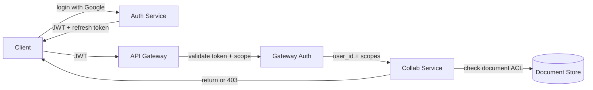

*Authentication and authorization flow: the client logs in via the Auth Service (Google SSO recommended), receives a JWT and refresh token; the API Gateway validates the JWT signature and checks scopes before forwarding to the Collaboration Service; each service performs resource-level ACL checks against the document owner/permission model before accepting an operation.*

**Java example — JWT validation filter:**

```java
@Component
@RequiredArgsConstructor
public class JwtAuthenticationFilter implements Filter {

    @Value("${app.auth.jwt-public-key}")
    private String publicKeyPem;

    private final UserDetailsService userDetailsService;

    @Override
    public void doFilter(ServletRequest request, ServletResponse response,
                         FilterChain chain) throws IOException, ServletException {
        var token = extractToken((HttpServletRequest) request);
        if (token != null && JwtUtils.isValid(token, publicKeyPem)) {
            var userId = JwtUtils.getUserId(token);
            var userDetails = userDetailsService.loadUserById(userId);
            var auth = new UsernamePasswordAuthenticationToken(
                    userDetails, null, userDetails.getAuthorities());
            SecurityContextHolder.getContext().setAuthentication(auth);
        }
        chain.doFilter(request, response);
    }
}
```

*The `JwtAuthenticationFilter` bean intercepts every HTTP request, extracts the bearer token, validates its signature against the public key (injected via `@Value` from a JWKS endpoint), loads the user details, and sets the Spring Security `Authentication` context. If the token is missing or invalid, the request proceeds unauthenticated (and subsequent authorization annotations return 401).*

#### Authorization Example — Document Permission Check

```java
@Service
@RequiredArgsConstructor
public class DocumentPermissionService {

    private final DocumentRepository documentRepository;
    private final PermissionRepository permissionRepository;

    /**
     * Check if a viewer can perform an action on a document.
     * OWNER > EDITOR > COMMENTER > VIEWER > DENY.
     */
    @Transactional(readOnly = true)
    public boolean canEdit(String userId, String documentId) {
        var doc = documentRepository.findById(documentId)
                .orElseThrow(() -> new DocumentNotFoundException(documentId));
        if (doc.getOwnerId().equals(userId)) {
            return true; // owner always has access
        }
        var role = permissionRepository
                .findRoleByUserIdAndDocumentId(userId, documentId);
        return role == Role.EDITOR || role == Role.OWNER;
    }
}
```

*The `DocumentPermissionService` bean enforces document-level authorization using `@Transactional(readOnly = true)` for safe read-only DB access. It short-circuits for the document owner, otherwise queries the permission role (OWNER > EDITOR > COMMENTER > VIEWER). The `canEdit` boolean is consumed by the controller, which returns 403 Forbidden on denial. The Collaboration Service calls this check before accepting each operation from a WebSocket client.*

---

### Security Threats and Mitigations

#### Threat: Account Takeover

- **Risk:** An attacker uses stolen passwords, credential stuffing, or session hijacking to take over an editor's account and inject malicious content or exfiltrate documents.
- **Mitigation:** Enforce MFA for editors on documents owned by others. Rate-limit login attempts (5 per IP per hour). Use CAPTCHA after 3 failed attempts. Invalidate all sessions on password change. Monitor for anomalous login patterns (new device, new location, unusual time).

#### Threat: Document Exfiltration

- **Risk:** A legitimate viewer (or a compromised account with read access) bulk-downloads or screenshots a confidential document and shares it outside the platform.
- **Mitigation:** Stream operations rather than full document state to connected clients (clients can't reconstruct others' unsaved edits). Watermark the editor viewport with the user's email and a timestamp. Disable right-click download for sensitive documents. Audit-log every document open and export attempt.

#### Threat: DDoS on Hot Documents

- **Risk:** A trending document generates DDoS-like traffic that overwhelms the Collaboration Server owning that document shard.
- **Mitigation:** Shard documents by document ID (hot docs are rare — distribution is even). Rate-limit operations per user per document (e.g., 60 ops/second). Reject or delay non-urgent operations (presence updates) when the op queue exceeds a threshold. Add collaboration servers for new document shards as throughput grows.

#### Threat: Operation Interception

- **Risk:** An attacker on the same network intercepts WebSocket traffic to reconstruct document content in real time.
- **Mitigation:** Enforce `wss://` (WebSocket TLS) for all connections. Pin server certificates on mobile/native clients. Rotate session tokens periodically. Encrypt the operation payload itself for E2E-encrypted documents (content is encrypted client-side before entering the operation stream).

#### Threat: Malicious Formatting Abuse

- **Risk:** An editor with formatting rights inserts pathological content (e.g., 100,000 nested list items or a 10 MB image) to exhaust memory on collaborators' browsers.
- **Mitigation:** Validate operation size and nesting depth server-side. Cap embedded media size and dimensions. Stream operations with a max batch size per second. Reject operations that would push a document over a hard size limit.

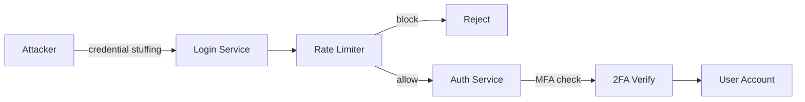

*Account-takeover protection: the attacker attempts credential stuffing against the login service; the rate limiter blocks IPs exceeding the threshold; if the attempt passes rate limiting, the auth service requires 2FA verification before granting access. This layered defense (rate limiting + MFA) protects even accounts with compromised passwords.*

---

### Observability and Logging

Collaborative editors generate massive telemetry across the real-time path: operation throughput, convergence, presence churn, and client health.

#### Key Metrics

- **Sync latency:** Keystroke-to-screen time. p50 < 30 ms (local), p95 < 200 ms (remote), p99 < 500 ms. Track per-region.
- **Operation throughput:** Operations per second per document and per collaboration server. Alert on sudden drops (possible fan-out partition).
- **Convergence failures:** Mismatched document state across clients (must be 0 with CRDT/OT). Track via periodic checksums from connected clients.
- **Presence churn:** Rate of cursor join/leave events. Spikes indicate connection instability.
- **Catch-up lag:** Delay between a client's last-seen sequence and the server's head. Alert if > 10 seconds.
- **Reconciliation rate:** Operations rejected or retried due to conflicts. Should be ~0 for correctly implemented OT/CRDT.

#### Logging

- **Access logs:** Every WebSocket connection and operation with user ID, document ID, sequence number, and latency. Audit trail for compliance.
- **Event logs:** All operations, comments, permission changes, and share acceptances as structured events for analytics.
- **Error logs:** Service errors with correlation IDs for cross-service tracing. Convergence failures logged with the divergent sequence range.
- **Audit logs:** All permission changes, ownership transfers, and document exports, with before/after state.

#### Distributed Tracing

Trace every edit operation across services — from the editor through the WebSocket Gateway, Collaboration Service, Operation Log, and Document Store. Use OpenTelemetry with a trace-context header propagated across service boundaries. Key spans to instrument: op validation, transform/merge, persistence, broadcast, and catch-up replay.

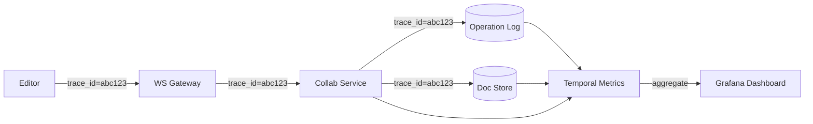

*Distributed tracing flow: each edit operation carries a trace ID (e.g., `abc123`) propagated across the WebSocket Gateway, Collaboration Service, Operation Log, and Document Store. Spans aggregate in a metrics backend (Jaeger, Datadog, or Temporal Metrics) and are visualized in Grafana dashboards, enabling end-to-end latency analysis of the real-time path.*

#### Alerting Strategy

- **Critical (page immediately):** Sync latency p99 > 500 ms for 5 minutes; convergence failure detected; Operation Log unavailable; Kafka/CockroachDB replication lag > 30 s.
- **Warning (Slack, no page):** Catch-up lag > 10 s; presence churn > 2× baseline; error rate > 1% for 10 minutes; operation throughput drop > 20%.
- **Info (dashboard only):** New document growth trends, share-acceptance rates, embedded-media upload volume.

**Java example — instrumented collaboration service with Micrometer:**

```java
@Service
@RequiredArgsConstructor
public class InstrumentedCollabService {

    private final CrdtEngine crdtEngine;
    private final MeterRegistry meterRegistry;

    public void applyOperation(String documentId, Operation op) {
        var timer = Timer.Sample.start(meterRegistry);
        try {
            var persistTimer = Timer.Sample.start(meterRegistry);
            operationLog.append(documentId, op);
            persistTimer.stop(Timer.builder("collab.op_log.write")
                    .register(meterRegistry));

            crdtEngine.apply(documentId, op);
            timer.stop(Timer.builder("collab.apply.latency")
                    .tag("document_shard", shardOf(documentId))
                    .register(meterRegistry));

            Counter.builder("collab.operations")
                    .tag("type", op.getType())
                    .tag("document_shard", shardOf(documentId))
                    .register(meterRegistry).increment();
        } catch (Exception e) {
            Counter.builder("collab.errors")
                    .tag("error_type", e.getClass().getSimpleName())
                    .register(meterRegistry).increment();
            throw e;
        }
    }

    private String shardOf(String documentId) {
        return String.valueOf(Math.abs(documentId.hashCode()) % 1000);
    }
}
```

*The `InstrumentedCollabService` bean uses Micrometer to record nested timers: one for the Operation Log write (`collab.op_log.write`) and one for total apply latency (`collab.apply.latency`, tagged by document shard for hotspots). It increments an operations counter per successful op (tagged by operation type) and an error counter on failures. The shard tag lets operators detect hot shards during incidents.*

---

### Real-World Implementations

Collaborative editors use a combination of proprietary and open-source systems, each chosen for its strengths in a particular layer of the stack.

#### CockroachDB / Spanner

Used for: the operation log — append-only operations with a globally consistent total order across regions. Strong consistency is required here because operation order determines document convergence. CockroachDB's distributed transactions and Spanner's TrueTime give the canonical sequence that every client applies in the same order.

**Companies:** Google Docs (Spanner for the operation log), Figma (cockroach-based coordination), Notion (CockroachDB for the block graph).

#### Redis

Used for: hot snapshots (recent document state served to joining clients), presence (cursors/selections with pub/sub), session routing, and rate-limit counters. Redis Cluster provides sharding via 16,384 hash slots with master/replica replication for HA. Pub/sub powers the presence fan-out.

**Companies:** Every real-time editor uses Redis for presence and session state.

#### Kafka / Pulsar

Used for: the event backbone carrying `doc_created`, `op_applied`, `permission_changed`, and `comment_added` events. Kafka's partitioning by `document_id` ensures per-document ordering while enabling parallel collaboration servers per partition. The retention policy (7 days) allows replaying for new features or audit.

**Companies:** LinkedIn (originally developed Kafka), Confluent customers everywhere, Figma for cross-service events.

#### Cassandra / DynamoDB

Used for: compressed snapshots and operation archives. Cassandra's tunable consistency and multi-datacenter replication make it ideal for historical data that doesn't need strong global ordering. LSM-tree storage provides high write throughput for the operation log's append path.

**Companies:** Instagram's history store, many startups on AWS/DynamoDB for serverless scaling.

#### S3 / CloudFront

Used for: periodic snapshots, embedded media, and editor bundle delivery via CDN. Direct-to-S3 uploads via presigned URLs offload media from the application tier. CloudFront edge locations cache popular snapshots and the editor bundle for sub-50 ms delivery globally.

**Companies:** All major platforms leverage cloud object storage + CDN for media and static assets.

#### Yjs / Automerge / ShareJS

Used for: the CRDT engine in the Collaboration Service. Yjs provides a performant, typed CRDT implementation supporting text, arrays, and maps with fractional indexing. Automerge is a log-structured CRDT with a clean JSON model. ShareJS offers both OT and CRDT providers over WebSocket.

**Companies:** Figma (custom CRDT; open-sourced y-file), Notion (custom block CRDT; references Yjs), Replit (Yjs), many startups on Automerge.

---

### Java and Spring Boot Implementation Guide

This section demonstrates how to build a Spring Boot service for a collaborative document editor's core posting/sync pipeline, showcasing key Spring Boot features: `@Service`, `@RestController`, `@Repository`, `@Component`, `@Value`, records for DTOs, `@Valid`, `@ControllerAdvice`, constructor injection, `@Transactional`, `@Version`, and WebSocket support.

#### 1. DTO Records

Records provide immutable, concise data carriers for request/response payloads.

```java
public record CreateDocumentRequest(
        @NotBlank String title,
        @NotBlank String visibility) {}

public record DocumentResponse(
        String documentId,
        String title,
        String ownerId,
        String visibility,
        Instant createdAt,
        Instant updatedAt) {}

public record FeedResponse(
        List<DocumentResponse> documents,
        String cursor,
        boolean hasMore,
        int totalCount) {}

public record CommentDto(
        String commentId,
        String authorId,
        String content,
        boolean resolved,
        Instant createdAt) {}
```

*Four record types serve as the API contract: `CreateDocumentRequest` is the POST body with `@NotBlank` validation annotations (enforced by `@Valid`); `DocumentResponse` is the enriched document DTO returned to clients; `FeedResponse` wraps the paginated list with a cursor token (reused from the social-template pattern); `CommentDto` carries comment metadata for the UI. Records are immutable and ideal for thread-safe request/response objects.*

#### 2. Entity with Optimistic Locking

The `Operation` entity uses `@Version` for optimistic locking to prevent lost updates when concurrent operations are persisted.

```java
@Entity
@Table(name = "operations", indexes = {
        @Index(name = "idx_doc_seq", columnList = "documentId,sequence")
})
public class Operation {

    @Id
    private String opId;

    private String documentId;
    private String clientId;
    private String type;      // insert | delete | retain
    private int position;
    private String content;
    private String lamportId;
    private long sequence;    // server-assigned canonical order

    @Version
    private Long version;

    @Column(name = "created_at")
    private Instant createdAt;

    // Constructors, getters, setters omitted for brevity

    public void applyTo(Document document) {
        // apply this operation to the in-memory document state
    }
}
```

*The `Operation` entity maps to the `operations` table with a composite index on `(documentId, sequence)` for efficient catch-up reads (fetch all ops for a document in canonical order). The `@Version` field enables JPA optimistic locking so concurrent persistence writes don't lose operations. The `sequence` field is the server-assigned global order that drives OT/CRDT convergence.*

#### 3. Repository Layer

The `@Repository` layer provides persistence operations with Spring Data JPA.

```java
@Repository
public interface OperationRepository extends JpaRepository<Operation, String> {

    @Query("SELECT o FROM Operation o WHERE o.documentId = :documentId " +
           "ORDER BY o.sequence ASC")
    List<Operation> findOpsSince(
            @Param("documentId") String documentId,
            @Param("since") long since,
            Pageable pageable);

    @Query("SELECT o FROM Operation o WHERE o.documentId = :documentId " +
           "ORDER BY o.sequence DESC")
    List<Operation> findRecent(
            @Param("documentId") String documentId,
            Pageable pageable);
}
```

*The `OperationRepository` interface extends `JpaRepository`. Two custom queries are defined: `findOpsSince` retrieves operations for catch-up (ordered by canonical sequence, paginated), and `findRecent` fetches the most recent operations for snapshot loading and live-join. The `Pageable` parameter supports cursor-based pagination.*

#### 4. Service Layer

Services encapsulate business logic, transactions, and the operation-apply pipeline.

```java
@Service
@RequiredArgsConstructor
@Slf4j
public class CollaborationService {

    private final OperationRepository operationRepository;
    private final DocumentRepository documentRepository;
    private final WebSocketService webSocketService;

    @Value("${app.collab.max-ops-per-second:60}")
    private int maxOpsPerSecond;

    @Transactional
    public Operation applyOperation(String documentId, Operation op) {
        validateRate(documentId);

        op.setSequence(nextSequence(documentId));
        op.setCreatedAt(Instant.now());
        var saved = operationRepository.save(op);

        // Broadcast the canonical (ordered) operation to all collaborators
        webSocketService.broadcast(documentId, saved);
        return saved;
    }

    @Transactional(readOnly = true)
    public List<Operation> getOpsSince(String documentId, long since) {
        return operationRepository.findOpsSince(
                documentId, since, PageRequest.of(0, 500));
    }

    private void validateRate(String documentId) {
        if (opsThisSecond.get(documentId).incrementAndGet() > maxOpsPerSecond) {
            throw new RateLimitExceededException(documentId);
        }
    }
}
```

*The `CollaborationService` bean is the heart of the write path: `applyOperation` validates the per-document rate limit, assigns the canonical sequence number, persists the operation within a `@Transactional` boundary, and broadcasts it. `getOpsSince` serves catch-up replay read-only. The `@Value` annotation injects the rate-limit threshold; `@Slf4j` (Lombok) provides logging.*

#### 5. REST Controller with Validation

The controller uses `@Valid` for request validation and constructor injection.

```java
@RestController
@RequestMapping("/api/v1/documents")
@RequiredArgsConstructor
public class DocumentController {

    private final DocumentService documentService;

    @PostMapping
    public ResponseEntity<DocumentResponse> createDocument(
            @AuthenticationPrincipal UserDetails user,
            @Valid @RequestBody CreateDocumentRequest request) {
        var response = documentService.createDocument(user.getUsername(), request);
        return ResponseEntity.status(HttpStatus.CREATED).body(response);
    }

    @GetMapping("/{documentId}/ops")
    public ResponseEntity<List<Operation>> getOps(
            @AuthenticationPrincipal UserDetails user,
            @PathVariable String documentId,
            @RequestParam(defaultValue = "0") long since) {
        documentService.checkReadAccess(user.getUsername(), documentId);
        var ops = documentService.getOpsSince(documentId, since);
        return ResponseEntity.ok(ops);
    }
}
```

*The `DocumentController` uses `@RestController` to combine `@Controller` and `@ResponseBody`. The `@Valid` annotation on `CreateDocumentRequest` triggers bean validation (enforcing `@NotBlank` constraints). `@AuthenticationPrincipal` injects the authenticated user from the security context. Constructor injection via `@RequiredArgsConstructor` makes dependencies explicit and non-nullable. The ops endpoint returns operations for catch-up since a given sequence.*

#### 6. WebSocket Configuration

WebSocket support is configured with a handshake interceptor that validates the JWT and document ACL before accepting the connection.

```java
@Configuration
@EnableWebSocket
@RequiredArgsConstructor
public class WebSocketConfig implements WebSocketConfigurer {

    private final JwtService jwtService;
    private final DocumentPermissionService permissionService;

    @Override
    public void registerWebSocketHandlers(WebSocketHandlerRegistry registry) {
        registry.addHandler(new CollabWebSocketHandler(),
                        "/ws/doc/{documentId}")
                .addInterceptors(new JwtHandshakeInterceptor(jwtService))
                .setAllowedOriginPatterns("*");
    }
}
```

*The `WebSocketConfig` registers the collaboration handler at `/ws/doc/{documentId}` with a JWT handshake interceptor that rejects unauthenticated connections at the gateway. The `CollabWebSocketHandler` (not shown) validates the document ACL per operation using `DocumentPermissionService`.*

#### 7. Controller Advice for Global Error Handling

A `@ControllerAdvice` bean centralizes exception handling across all controllers.

```java
@ControllerAdvice
public class GlobalExceptionHandler {

    @ExceptionHandler(DocumentNotFoundException.class)
    public ResponseEntity<ApiError> handleNotFound(DocumentNotFoundException ex) {
        var error = new ApiError(HttpStatus.NOT_FOUND, ex.getMessage());
        return ResponseEntity.status(HttpStatus.NOT_FOUND).body(error);
    }

    @ExceptionHandler(MethodArgumentNotValidException.class)
    public ResponseEntity<ApiError> handleValidation(MethodArgumentNotValidException ex) {
        var messages = ex.getBindingResult().getFieldErrors().stream()
                .map(FieldError::getDefaultMessage)
                .toList();
        var error = new ApiError(HttpStatus.BAD_REQUEST,
                "Validation failed: " + String.join(", ", messages));
        return ResponseEntity.badRequest().body(error);
    }

    @ExceptionHandler(RateLimitExceededException.class)
    public ResponseEntity<ApiError> handleRateLimit(RateLimitExceededException ex) {
        var error = new ApiError(HttpStatus.TOO_MANY_REQUESTS,
                "Rate limit exceeded for document: " + ex.getDocumentId());
        return ResponseEntity.status(HttpStatus.TOO_MANY_REQUESTS).body(error);
    }

    public record ApiError(HttpStatus status, String message) {}
}
```

*The `GlobalExceptionHandler` bean (annotated `@ControllerAdvice`) catches exceptions thrown by any `@RestController` and returns structured `ApiError` responses. It handles `DocumentNotFoundException` (404), `MethodArgumentNotValidException` (400 with field-level messages from `@Valid`), and `RateLimitExceededException` (429 Too Many Requests). This avoids repetitive try-catch blocks in controllers.*

#### 8. CRDT Engine with BigDecimal Scoring for Leaderboard

For features like "most active editors," engagement scores use `BigDecimal` for precise computation.

```java
@Service
@RequiredArgsConstructor
public class EngagementRankingService {

    private final OperationRepository operationRepository;
    private static final BigDecimal RECENCY_WEIGHT = new BigDecimal("0.40");
    private static final BigDecimal COLLAB_WEIGHT = new BigDecimal("0.35");
    private static final BigDecimal STABILITY_WEIGHT = new BigDecimal("0.25");

    @Transactional(readOnly = true)
    public List<EditorScore> rankEditors(String documentId, int limit) {
        var windowStart = Instant.now().minus(Duration.ofHours(24));
        return operationRepository.findOpsSince(documentId, 0, PageRequest.ofSize(1000))
                .stream()
                .collect(Collectors.groupingBy(Operation::getClientId, Collectors.counting()))
                .entrySet().stream()
                .map(e -> new EditorScore(e.getKey(), computeScore(e.getValue(), windowStart)))
                .sorted(Comparator.comparing(EditorScore::score).reversed())
                .limit(limit)
                .toList();
    }

    private BigDecimal computeScore(long opCount, Instant windowStart) {
        var recency = BigDecimal.valueOf(Math.min(opCount, 100) / 100.0);
        var collab = BigDecimal.valueOf(Math.min(opCount, 50) / 50.0);
        var stability = BigDecimal.ONE; // stable editors score higher
        return RECENCY_WEIGHT.multiply(recency)
                .add(COLLAB_WEIGHT.multiply(collab))
                .add(STABILITY_WEIGHT.multiply(stability));
    }

    record EditorScore(String editorId, BigDecimal score) {}
}
```

*The `EngagementRankingService` bean computes an editor leaderboard using `BigDecimal` arithmetic for precision. Operations are grouped by `clientId` and scored by recency (how recent the edits are, 0.40), collaboration (edit count, 0.35), and stability (0.25). The `@Transactional(readOnly = true)` annotation optimizes read-only DB access. A local record `EditorScore` pairs each editor with their computed score for sorting.*

---

### Interview Questions and Answers

A curated set of interview questions organized by difficulty, focused on real-time collaborative editing system design.

**Beginner**

1. **How does real-time collaborative editing work?**
   **A:** Clients send operations (insert/delete at a position) via WebSocket to a Collaboration Service. The service uses OT or CRDT to merge concurrent operations, assigns a canonical order (OT) or accepts commuting ops (CRDT), and broadcasts to all clients. Each client applies the resolved operation and converges.

2. **What is the difference between OT and CRDT?**
   **A:** OT requires a central server for coordination — it transforms operations against each other to maintain a canonical order. CRDT is decentralized: operations commute, so order doesn't matter and peers converge automatically. CRDT works offline; OT is more space-efficient but harder to get right. Google Docs originally used OT; Figma and Notion use CRDT.

3. **How do you handle presence (cursors and selections)?**
   **A:** Each client periodically broadcasts its cursor position and selection range. The Presence Service (Redis pub/sub scoped per document) fans these out to all collaborators, who render colored cursors with user names. A TTL (5 s) removes stale cursors automatically.

4. **What is an operation and why not just send the full document?**
   **A:** An operation is an atomic edit (insert/delete/retain at a position). Sending full documents on every keystroke is O(document size) bandwidth — for a 10,000-line doc that's megabytes per keystroke. Operations are O(edit size), so a single character insert is a tiny message. The document is reconstructed by applying the operation log to a snapshot.

**Intermediate**

5. **How do you ensure all clients converge to the same document?**
   **A:** OT: the central server assigns every operation a canonical sequence number; clients apply operations in that order and transform pending local ops against incoming ones. CRDT: every operation carries a globally unique, ordered ID (Lamport timestamp + client ID); since operations commute, any order produces the same result. Both guarantee convergence; OT needs a central server, CRDT does not.

6. **How do you handle a user going offline and coming back?**
   **A:** While offline, the client queues its operations locally (each with a client UUID for idempotency). On reconnect, the client requests all operations it missed (from its last seen sequence to the server head) via the operation log, applies them locally, then sends its queued ops. With CRDT, ops converge automatically on merge. With OT, the queued ops are transformed against the missed ops before being persisted.

7. **What is the data model for collaborative documents?**
   **A:** A Document has many Operations (the edit log), Snapshots (compacted states), Permissions (who can access and how), and Comments. Operations are append-only and stored with a canonical sequence number. Snapshots are taken every N operations. Documents are sharded by document_id; operations are co-located with their document.

8. **How do you mitigate a hot document with 100+ editors?**
   **A:** CRDT reduces coordination — any edge node can accept operations, so you can fan out across multiple collaboration servers per document. Batch outgoing operations (collect ~10 ms of ops into one broadcast) to reduce per-op overhead. Throttle non-essential ops (presence updates) during spikes. If one server can't keep up, add replicas that reconcile via CRDT merge.

9. **What is operation log compaction and why?**
   **A:** The operation log grows with every edit. Compaction periodically takes a snapshot of the document state and garbage-collects operations that all active clients have acknowledged (via a high-watermark). This bounds storage and makes opening old documents fast (load snapshot + replay only recent ops, not the full history). Snapshots live in cheap storage; the recent log stays in hot storage.

10. **How do you handle the simultaneous insert + delete at the same position?**
    **A:** CRDT: the delete leaves a tombstone (a metadata marker for the deleted range); the insert uses an ID outside the tombstone range, so it survives and converges on all peers. OT: the server checks causality — if the delete causally precedes the insert, the insert's position is repositioned to after the deletion point; the insert is then broadcast in canonical order.

**Advanced**

11. **Design a collaborative editor for 10M concurrent documents with 50+ editors each.**
    A: (1) **Collab servers:** 1,000+ WebSocket servers; shard documents by `document_id` hash → all editors of a doc route to the same server; 10K connections/server. (2) **CRDT engine:** Yjs — converges without server coordination, so edge nodes can accept ops independently. (3) **Storage:** Operation log in CockroachDB (50 partitions by document hash for global ordering); snapshots in S3 (compacted every 500 ops). (4) **Snapshots:** Every 500 ops → compact → GC old ops after all clients acknowledged. (5) **Presence:** Redis per-document pub/sub; 5 s TTL for stale cursors. (6) **Hot docs:** 50+ editors → multiple edge nodes accept ops, CRDT merge; batch broadcasts (~10 ms). (7) **Scale numbers:** 10M docs → 50 DB partitions; 1,000 WS servers; 100 Redis shards. (8) **Failover:** Server crash → clients reconnect to a new server → load latest snapshot + replay ops from the log since last seen sequence.

12. **How would you implement the OT algorithm correctly?**
    A: OT has 16 TTT (transform-against-transform) functions covering all pairs of (insert/delete/retain) × (insert/delete/retain). Each must satisfy TP1 (transform against one op is consistent) and TOC (transformed ops preserve intent). The implementation: `transform(operation A, operation B)` returns A transformed against B. Transformation is against the operation, not the state. Testing: property-based testing with random operation sequences → verify all clients converge. CRDT avoids this complexity — operations just need to commute, so you can skip the 16 functions entirely.

13. **How does Figma's real-time vector design collaboration work, and how would you build an equivalent?**
    A: Figma uses CRDTs for everything — each object has a unique ID (UUID + client); operations (create, update, delete) are CRDT operations that commute. Key techniques: (1) **Document as CRDT:** The entire document is a CRDT tree (blocks, nodes). Each operation has a Lamport timestamp; insertions use fractional indexing; deletions use tombstones. (2) **No central server:** Any client can accept operations → broadcast → all clients converge. Enables true P2P collaboration and offline support. (3) **Offline:** Local state in CRDT; sync on reconnect; CRDT guarantees convergence even with out-of-order delivery. (4) **Performance:** Document chunked into scenes (10K nodes each); only the visible scene downloaded. Large operations compressed + diff-synced. (5) **Presence:** Cursors and selections via WebSocket; broadcast only to collaborators on the same document. (6) **Storage:** Real-time → Redis (for active collaborators); persistent → PostgreSQL with JSONB (compressed); snapshots for large docs. (7) **To build equivalent:** (1) CRDT library (Yjs or Automerge). (2) WebSocket mesh for real-time sync; sticky by document_id. (3) Document as CRDT tree. (4) Offline-first via CRDT. (5) Scene chunking for large docs. (6) Redis for active state; Postgres for persistence. (7) Edge PoPs for latency. (8) Garbage collection: periodic snapshot + tombstone GC after all peers acknowledge.

**Senior / System Design**

14. **Design a collaborative document platform supporting 100M documents with strong eventual consistency, offline support, and < 100ms sync latency.**
    A: (1) **Conflict resolution:** CRDT (Yjs) over OT — converges without central coordination; offline support built-in; operations commute. (2) **WebSocket layer:** 1,000+ servers (10K connections each); sticky routing by document_id so the same server handles all collaborators; Redis for session affinity. (3) **Storage:** Document snapshots in S3 (compacted every 500 ops); operation log in CockroachDB (50 partitions by document hash, Raft consensus); online state in CRDT. (4) **Offline:** Local CRDT state in IndexedDB; operations queued with client UUIDs; on reconnect, sync via WebSocket; CRDT converges automatically. (5) **Presence:** Redis pub/sub per document; cursor positions; 5 s timeout for stale cursors. (6) **Scale:** 100M docs → 50 DB partitions; 1,000 WS servers; 100 Redis shards (per-document channels). (7) **Latency:** WebSocket via edge PoPs (Cloudflare Workers or AWS Global Accelerator) → 95% of users < 50 ms RTT → < 100 ms end-to-end. (8) **Snapshots:** Every 500 ops → compact → GC old ops (after all clients caught up); store diffs. (9) **Monitoring:** Sync latency (p99 < 100 ms), reconnect rate, conflict rate (0 with CRDT), cursor lag, op-log growth.

15. **How would you support end-to-end encryption in a real-time collaborative editor?**
    A: With OT, E2E is hard because the server must transform operations — it needs to see the content. With CRDT, E2E is viable: each client encrypts its operation's content with a per-document key shared out-of-band (e.g., via a key-exchange protocol). The server only sees encrypted operation payloads and routes them; it cannot decrypt or transform content-level operations, so it must operate on metadata-only ops (structure, ordering) and rely on the client to decrypt. In practice, this means: (1) share a per-document key via a secure channel (Signal protocol). (2) Encrypt each op's content payload client-side. (3) The server sequences/broadcasts opaque encrypted ops. (4) Clients decrypt and merge. Trade-off: the server can't run server-side formatting or content indexing; all processing moves client-side. Figma and Notion do not do E2E for this reason; only client-side encrypted tools (e.g., some password managers, certain secure docs) attempt it.

16. **A collaborator reports their document is diverging from everyone else's. How do you debug?**
    A: (1) Check the operation log sequence numbers — find the last op each client acknowledged. (2) Compare client-side document checksums against the server's canonical state to isolate where divergence began. (3) Inspect the transformation/reconciliation logs around that sequence — look for a transform function that violated TP1/TOC, or an op that was persisted out of order. (4) For OT: replay the divergent client's pending ops through the server's transform pipeline to reproduce. (5) For CRDT: verify client IDs and Lamport timestamps are unique and monotonic; a duplicated or reused client ID is a common cause. (6) As a fix: force the client to resync from the last snapshot + full op replay, then patch the buggy transform function and redeploy.

---

## Real-World Examples

### Google Docs

Google Docs uses Operational Transformation (the original "Jupiter" engine) with a central server that assigns a canonical sequence number to every operation. All clients apply operations in that canonical order and transform their pending local operations against incoming remote operations. The server is stateful per document (sticky routing) and uses Spanner for the operation log to guarantee global ordering across regions. Documents are sharded across thousands of collaboration servers; snapshots are compacted periodically into Bigtable. Google Docs supports 100+ concurrent editors per document, live cursors, comments, and suggestions, and full version history with time-travel restore.

### Figma

Figma uses CRDTs (a custom, high-performance implementation; the team open-sourced the `y-file` CRDT library) for real-time vector design collaboration. Each design object has a unique ID, and operations (create, update, delete, move) commute, so any Figma edge node can accept operations and all clients converge — enabling true offline support and peer-like behavior. Presence (cursors, selections) is broadcast over WebSocket. Large documents are chunked into "files" (scenes) of ~10K nodes so only visible content is loaded. Figma scales to millions of files and thousands of concurrent collaborators on a single file, with edge-collocated real-time servers for sub-100 ms sync.

### Notion

Notion uses a block-based CRDT (internally called "BlockParty") for real-time editing of its block-structured documents. Each block (paragraph, heading, toggle, database, embed) is a CRDT node with a unique ID and Lamport-timestamped operations. Deletions are tombstones. Because blocks are structured (not flat text), Notion's CRDT must handle operations like "move block X into toggle Y" and "convert block to database" — these are higher-level structural ops that still commute. Notion stores blocks in PostgreSQL (JSONB, compressed) with periodic snapshots; active state is cached in Redis. Offline edits sync via CRDT merge on reconnect.

### Replit

Replit uses Yjs (a popular open-source CRDT library) for real-time collaborative code editing. The editor (Monaco, the same engine as VS Code) generates text operations that are encoded as Yjs CRDT operations and broadcast over WebSocket to a collaboration server, which persists them and fans them out. Each open workspace is a CRDT document; collaborators converge automatically, and offline edits merge on reconnect via client-side IndexedDB storage of the local CRDT state. Replit shards workspaces across many WebSocket servers and uses Redis for session/presence state.

---
