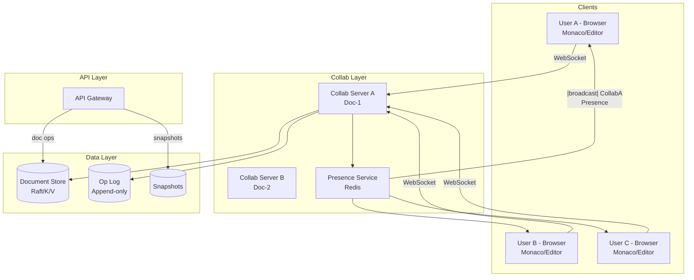
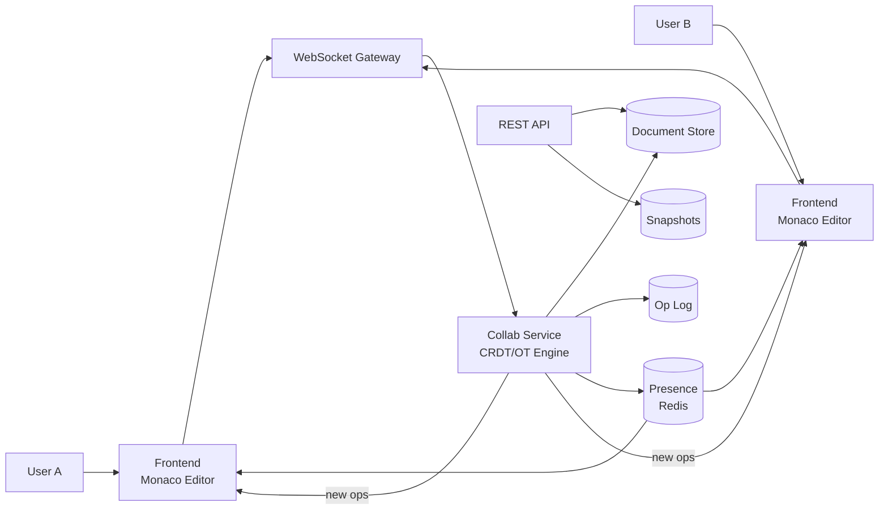

# Design Google Docs


## Blogs and websites


## Medium


## Youtube

- [How Collaborative Text Editors Don't Break](https://www.youtube.com/watch?v=EL-VoBcUIJk)


## Theory

### What Is It?

A collaborative document editing system (Google Docs, Notion, Figma) enables multiple users to simultaneously view and edit the same document in real time, with changes propagated instantly to all participants, while maintaining consistency, presence awareness, and full version history.

### Why Does It Exist?

Before real-time collaboration, document editing was sequential — users emailed files back and forth (causing version conflicts) or took turns on a shared screen. Real-time collaborative editing enables distributed teams to work together as if in the same room.

### What Problem Does It Solve?

* **Conflict resolution**: Multiple users edit the same text simultaneously → operations must be merged without conflicts (OT or CRDT).
* **Real-time sync**: Changes must reach all users within < 100ms; requires WebSocket or WebRTC-based signaling.
* **Presence**: Show other users' cursors, selections, and focus in real time.
* **Offline support**: Users edit offline → merge conflicts on reconnect.
* **Versioning**: Full history with rollback → requires efficient snapshot + operation log storage.
* **Scale**: Millions of documents, thousands of concurrent collaborators per document.

### Important Subtopics

1. Conflict-free merging (Operational Transformation vs CRDT)
2. Real-time communication (WebSocket, WebRTC, WebRTC-SFU)
3. Cursor/selection/presence synchronization
4. Offline editing with conflict resolution on reconnect
5. Version history and snapshots
6. Shared/nested permissions (document, section, comment level)
7. Real-time notification of comments/mentions
8. Conflict resolution edge cases (simultaneous delete + insert)

### Problem Statement

Design a real-time collaborative document editing system like Google Docs where multiple users can simultaneously edit the same document with changes appearing instantly for all participants.

### Functional Requirements

- Create, edit, delete documents (rich text)
- Real-time collaborative editing (multiple cursors)
- See other users' cursors and selections
- Commenting and suggesting mode
- Version history and rollback
- Share with permissions (view, comment, edit)
- Offline editing with sync on reconnect

### Non-Functional Requirements

- **Latency**: Keystroke-to-screen < 50ms for local, < 200ms for remote users
- **Consistency**: All users converge to same document state
- **Scale**: 100M+ documents, 10M+ concurrent editing sessions
- **Availability**: 99.99%
- **Durability**: Zero document loss


### The Core Challenge: Conflict Resolution

```
User A types "Hello" at position 5
User B deletes character at position 3 (simultaneously)

After B's delete, position 5 in A's view ≠ position 5 in B's view
→ Without conflict resolution, document diverges

Two approaches:
  1. OT (Operational Transformation) — Google Docs' original approach
  2. CRDT (Conflict-free Replicated Data Types) — Modern approach
```


### Operational Transformation (OT)

```
Core idea: Transform operations against each other

A: insert("X", pos=5)
B: delete(pos=3)

If B arrives first at server:
  Transform A against B: insert("X", pos=4)  ← shifted left by 1
  
Server maintains single ordering of operations
Clients transform their pending ops against incoming ops

Server architecture:
  Central server receives all ops
  Assigns global ordering
  Broadcasts transformed ops to all clients

Pro: Well-proven (Google Docs uses this)
Con: Central server required, complex transformation functions
```


### CRDT Approach

```
Core idea: Data structure that guarantees convergence without coordination

Each character has a unique, ordered ID:
  "Hello" → (H,id1) (e,id2) (l,id3) (l,id4) (o,id5)

IDs are designed so insertion between any two chars always works:
  Insert "X" between id2 and id3 → assign id2.5 (fractional indexing)

Operations commute: order of application doesn't matter
  → No central server needed
  → Works offline naturally

Pro: Peer-to-peer capable, simpler consistency
Con: Metadata overhead per character, garbage collection needed
```

### High-Level Architecture

```
┌──────────┐       WebSocket        ┌────────────────────────┐
│  Client  │◀═══════════════════════▶│  Collaboration Service  │
│  Editor  │   (ops + cursor pos)    │  (OT/CRDT engine)      │
└──────────┘                         └───────────┬────────────┘
                                                 │
                                    ┌────────────┼────────────┐
                                    ▼            ▼            ▼
                              ┌──────────┐ ┌──────────┐ ┌──────────┐
                              │ Document │ │ Op Log   │ │ Presence │
                              │ Store    │ │ (events) │ │ Service  │
                              └──────────┘ └──────────┘ └──────────┘
```

### Collaboration Session Flow

```
1. User opens document
   → Load latest snapshot from Document Store
   → Establish WebSocket to Collaboration Service
   → Subscribe to document channel

2. User types a character
   → Apply locally (optimistic)
   → Send operation to server via WebSocket
   → Server validates, transforms, assigns sequence number
   → Broadcast to all other connected clients
   → Other clients transform and apply

3. Cursor/selection sync
   → Each client sends cursor position periodically
   → Presence Service broadcasts to all participants
   → Display colored cursors with user names
```

### Version History

```
Approach: Periodic snapshots + operation log

  t=0:   Snapshot_0 (base document)
  t=1-50: Operations 1-50
  t=50:  Snapshot_1 (compacted)
  t=51-100: Operations 51-100
  ...

View history: Show snapshots as "versions"
Rollback: Load snapshot + replay ops up to desired point
Storage: Keep recent ops in hot storage, archive old snapshots
```

### Key Design Decisions

| Decision | Choice | Reason |
|----------|--------|--------|
| Conflict resolution | OT (server-mediated) | Proven at scale, lower metadata |
| Transport | WebSocket | Low-latency bidirectional |
| Persistence | Snapshot + op log | Fast load + full history |
| Presence | Ephemeral pub/sub (Redis) | Real-time cursor tracking |
| Offline | Queue local ops, sync on reconnect | OT handles merge |
| Permissions | Document-level ACL | Share with view/comment/edit |

### Scaling Considerations

- **Session stickiness**: All edits for a document route to same server (partition by doc_id)
- **Hot documents**: Single doc with 100+ editors → single server bottleneck → CRDT helps here
- **Storage**: Compact old operations into snapshots periodically
- **Global**: Multi-region with conflict resolution across regions

---

## Characteristics

| Characteristic | What it means | Why it matters | How it works |
|---|---|---|---|
| **Real-time sync** | Changes propagate instantly to all collaborators | No manual refresh; true collaboration | WebSocket + CRDT |
| **Conflict resolution** | Merged edits from concurrent changes | No data loss or divergence | OT or CRDT algorithms |
| **Presence** | View other users' cursors + selections | Coordination, awareness | WebSocket + cursor broadcasts |
| **Offline support** | Edit without internet; sync on reconnect | Productivity in poor connectivity | Local CRDT ops → sync on reconnect |
| **Version history** | Full document history with rollback | Recover from mistakes; audit | Snapshot + operation log |
| **Nested permissions** | Doc/channel/comment-level sharing | Fine-grained access control | ACL per document + section |

## Components

| Component | Purpose | Responsibilities | Relationship | Real-world Example |
|---|---|---|---|---|
| **Editor** | UI for editing | Rendering, cursor, syntax, selection | Monaco/Queued Text | Google Docs editor |
| **Collab Server** | Real-time sync | CRDT/OT engine, broadcast ops, manage sessions | WebSocket ↔ clients | Socket.IO + ShareJS |
| **Document Store** | Persist document state | Store snapshots + op log; serve latest | Collab ↔ DB | Firestore/Raft |
| **Presence Service** | Track cursors/selection | Broadcast cursor positions, online status | Collab ↔ Redis | Cursor tracking |
| **Version History** | Historical versions | Snapshots at intervals, time-travel queries | Document Store | Revision service |
| **Auth/Permission** | Access control | Verify ownership, ACL checks | Auth provider + DB | Google Auth |
| **Notification Service** | Real-time alerts | Comment mentions, suggestions | Collab ↔ Push | FCM/APNs |
| **File Service** | Embedded media | Upload/embed images/videos | Object storage | Google Drive |

## Patterns

### Operational Transformation (OT)

* **What**: A technique where the server transforms concurrent operations against each other to maintain consistency.
* **Problem solved**: Without OT, concurrent edits at the same position cause conflicts and document divergence.
* **How it works**: (1) Client sends operation to server. (2) Server transforms operation against all concurrent operations in the operation log. (3) Server assigns sequence number and broadcasts transformed op to all clients. (4) Clients apply transformed op. (5) Client transforms its pending local ops against received remote ops.
* **When to use**: When you can afford a central server for coordination; proven approach.
* **When not to use**: When you need decentralized/offline capability; OT is complex to implement correctly.
* **Advantages**: Lower metadata overhead than CRDT; proven at Google scale.
* **Disadvantages**: Requires central server; complex transformation functions; harder offline support.
* **Real-world example**: Google Docs originally used OT.
* **Java/Spring Boot example**:
```java
@Service
public class OperationalTransformationService {
    public Operation transform(Operation op, Operation concurrentOp) {
        // Transform 'op' against 'concurrentOp'
        if (concurrentOp.getPosition() < op.getPosition()) {
            op.setPosition(op.getPosition() - concurrentOp.getAffectedLength());
        }
        return op;
    }
}
```

### CRDT (Conflict-free Replicated Data Type)

* **What**: A data structure that guarantees convergence without coordination — operations commute (order doesn't matter).
* **Problem solved**: Eliminates need for a central server to coordinate; works offline naturally.
* **How it works**: Each operation has a unique, globally ordered ID (e.g., Lamport timestamp + client ID). Operations are applied locally → broadcast → all clients apply in causal order → converge automatically. Insertion between any two existing elements uses fractional indexing.
* **When to use**: Decentralized systems; offline-first; P2P collaboration.
* **When not to use**: Simple single-server apps; when metadata overhead is unacceptable.
* **Advantages**: No central server; offline support; automatic convergence.
* **Disadvantages**: Metadata overhead per character; garbage collection needed (tombstones).
* **Real-world example**: Figma uses CRDTs for real-time vector design; Replit uses CRDT-based Yjs.

## Benefits

* **Productivity**: Teams collaborate in real-time → faster decision-making.
* **Conflict elimination**: No version conflicts → no "your version / their version" merge hell.
* **Accessibility**: Works on any device with a browser.
* **Instant sharing**: Share a link → collaborator joins immediately.
* **Full history**: Undo/redo at any point → safe experimentation.

## Pros

* **Real-time**: < 100ms change propagation.
* **Offline**: Edit offline → merge on reconnect.
* **No conflicts**: OT/CRDT resolves automatically.
* **Presence**: Live cursors + selections.
* **Versioned**: Full history + rollback.
* **Cross-platform**: Web + mobile + desktop.

## Cons

* **Complexity**: OT/CRDT implementation is difficult to get right.
* **Network latency**: Visible delay for geographically distant collaborators.
• **Memory**: CRDT metadata overhead per character.
* **Conflict edge cases**: Simultaneous insert + delete at same position.
* **Scale**: Hot documents with 100+ editors → single-server bottleneck.
* **Security**: Real-time streaming is harder to secure than REST.

## Challenges

### Technical Challenges
* **Conflict resolution**: OT vs CRDT choice; edge cases (simultaneous insert/delete).
* **Real-time sync**: WebSocket infrastructure; reconnection + catch-up.
* **Presence**: Cursor/selection sync; stale presence cleanup.

### Scalability Challenges
* **WebSocket scale**: Millions of concurrent connections → 500+ collab servers.
* **Hot documents**: 100+ editors on one doc → single server → load shedding.
* **Persistence**: Millions of ops/sec → write-optimized storage (Raft/CockroachDB).

### Performance Challenges
* **Latency**: < 100ms round-trip → edge collocated servers; CRDT ops fast.
* **Large documents**: 10K+ line docs → diff-only sync; compression.
• **Reconnection**: Catch-up from last-op → don't replay entire history.

### Reliability Challenges
* **Server failure**: Reconnect → replay from op log in DB.
* **Message loss**: Sequence numbers → detect gaps; request retransmission.
* **Clock skew**: Don't rely on clocks → logical timestamps (Lamport/LWW).

### Maintainability Challenges
* **Schema evolution**: Document format changes; must be backward compatible.
* **CRDT garbage collection**: Tombstone cleanup without breaking convergence.

### Security Concerns
* **Access control**: Document ACLs; section-level permissions; sharing links.
* **Data exfiltration**: Download/export prevention; watermarking.
* **Presence privacy**: Who can see your cursor?
* **Operation interception**: WebSocket encryption (wss://); token validation.

## Best Practices

* **CRDT over OT**: For offline-first + P2P; OT for server-mediated.
* **Cursor pagination**: Fetch ops by cursor (not offset) for performance.
* **Presence TTL**: Remove stale cursors after 5s of no updates.
* **Op log compaction**: Snapshot + compact old operations.
* **WebSocket sharding**: By document_id → same server handles all collaborators.
* **Offline first**: Queue local ops → sync on reconnect → conflict resolution.
• **Monitor**: Latency, reconnect rate, conflict rate, cursor lag, op log growth.

## When to Use

### Appropriate
* Real-time collaborative document editing (docs, sheets, Figma).
* Team projects requiring simultaneous edits.
* Interviews (shared coding) + design reviews.
* Educational (co-teaching, shared whiteboards).

### Not Appropriate
• Simple document viewing (no edit needed).
* High-security environments requiring E2E encryption by default.
* Very large binary files (PDF, images) as primary content.
* Teams that edit sequentially (no overlap).

### Alternatives
* **Email attachments**: Async, version conflicts, no real-time.
* **Version control (Git)**: Powerful but not real-time; merge conflicts.
* **File sync (Dropbox)**: Eventual consistency, no real-time viewing.

### Decision Factors
* Real-time needs; offline support; scale (document size, concurrent editors); security (E2E encryption).

## Use Cases

### Google Docs-Style Collaboration

* **Problem**: Teams need to simultaneously edit documents, see cursors, and converge without conflicts.
* **Solution**: Clients send operations via WebSocket → CRDT/OT engine applies → broadcasts to all connected clients → local state converges.
* **Why suitable**: CRDT guarantees convergence; WebSocket for sub-100ms latency; cursor/selection sync.
* **How it works**: (1) User opens document → load snapshot + op log from DB. (2) Edits → op generated locally + applied optimistically. (3) Op sent via WebSocket → Collab Server → persists to op log → broadcasts to other clients. (4) Other clients apply op (CRDT converges; OT transforms against pending local ops). (5) Presence: cursor/selection broadcast periodically. (6) Offline: ops queued locally; on reconnect → sync with server.
* **Trade-offs**: CRDT metadata overhead; OT server complexity; hot document scaling.

## Architecture



### Architecture Structure
* **Frontend**: Monaco editor in browser (syntax highlighting, cursor management).
* **Collab layer**: WebSocket servers (sticky by document_id); CRDT/OT engine; Presence service (Redis).
* **Data layer**: Document store (write-optimized KV); op log (append-only); snapshots (periodically compacted).

### Communication
* **Client ↔ Collab**: WebSocket (bidirectional; ops + cursor/presence).
* **Collab ↔ Data**: Sync writes (Raft/KRaft for consensus); async snapshot reads.
* **API ↔ Collab**: HTTP for non-real-time ops (open, permissions).

### Data Flow
1. **Open document**: Client → API → load snapshot + recent ops → apply → editor renders.
2. **Edit**: Keystroke → Monaco → generate op → apply optimistically → send via WebSocket → Collab Server → persist to op log → broadcast to other clients → they apply.
3. **Presence**: Each client periodically broadcasts cursor position → Presence Service (Redis pub/sub) → Collab Server → broadcasts to participants.
4. **Offline**: Ops queued locally → on reconnect → send queued ops → server applies + broadcasts.

### Scaling Strategy
* **WebSocket servers**: 5000–10K connections per server; shard by document_id; sticky routing.
* **Hot documents**: Single doc with 100+ editors → single Collab Server bottleneck → CRDT reduces coordination (but memory grows).
* **Document store**: Distributed KV (Cassandra, DynamoDB, CockroachDB); shard by document_id.

### Failure Handling
* **Collab server crash**: Clients reconnect → fetch current state from Document Store → apply pending ops from op log.
* **Network partition**: Client queues ops locally → sync when connected.
* **Op log overflow**: Periodic snapshots → truncate old ops.

## High-Level Design



## Deep Dive

### Conflict Resolution — CRDT vs OT

(Existing file's Theory section covers OT and CRDT in detail — see "### Operational Transformation (OT)" and "### CRDT Approach")

**CRDT convergence**: Each character has unique ordered ID → insertion between any two chars always resolves → operations commute → no central coordination → works offline.

**OT transformation**: Server maintains canonical operation sequence. When op arrives → transform against concurrent ops → assign sequence → broadcast. Client transforms local pending ops against received ops.

**Key edge cases**:
* Simultaneous insert at same position → CRDT: tie-break by ID ordering; OT: transform (position shifts).
* Delete + insert at same position → tombstone handling (CRDT); causality check (OT).
* Offline merge → CRDT converges automatically; OT requires careful replay.

### Version History

(Existing file's Theory section covers snapshot + op log — see "### Version History")

### Collaboration Session Flow

(Existing file's Theory section covers session flow — see "### Collaboration Session Flow")

## API Contract

* **API purpose**: Document CRUD, real-time collaboration via WebSocket, comments, sharing.

| Method | Endpoint | Description |
|---|---|---|
| POST | `/api/v1/documents` | Create a new document |
| GET | `/api/v1/documents/{id}` | Get document metadata + permissions |
| GET | `/api/v1/documents/{id}/ops` | Get operation log (for catch-up) |
| GET | `/api/v1/documents/{id}/snapshot` | Get latest snapshot |
| PUT | `/api/v1/documents/{id}/permissions` | Update sharing permissions |
| POST | `/api/v1/documents/{id}/comments` | Add a comment |

**WebSocket endpoint**: `wss://collab.example.com/doc/{document_id}` — real-time operational transforms / CRDT.

**Authentication**: JWT bearer token. Token verified at connection; document access re-checked.

**Error responses**:
```json
{"error": "permission_denied", "message": "No edit access", "code": 403}
{"error": "document_not_found", "message": "Document does not exist", "code": 404}
{"error": "conflict", "message": "Operation rejected by conflict resolver", "code": 409}
```

**Idempotency**: Each operation includes a client-generated UUID; server deduplicates.

## Data Modeling

```mermaid
erDiagram
    DOCUMENT ||--o{ OPERATION : "has"
    DOCUMENT ||--o{ SNAPSHOT : "has"
    DOCUMENT ||--o{ PERMISSION : "has"
    USER ||--o{ OPERATION : "creates"
    USER ||--o{ COMMENT : "creates"
    DOCUMENT ||--o{ COMMENT : "has"

    DOCUMENT {
      string document_id PK
      string title
      string owner_id FK
      datetime created_at
      datetime updated_at
    }
    OPERATION {
      string op_id PK
      string document_id FK
      string client_id
      string type insert/delete/retain
      int position
      string content
      datetime timestamp
      string lamport_id
    }
    SNAPSHOT {
      string snapshot_id PK
      string document_id FK
      string content
      int op_count
      datetime created_at
    }
    PERMISSION {
      string document_id FK
      string user_id FK
      enum role viewer_commenter_editor_owner
    }
    COMMENT {
      string comment_id PK
      string document_id FK
      string user_id FK
      string content
      datetime created_at
    }
```

**Partitioning**: Documents sharded by document_id hash; operations co-located with document; snapshots at intervals.

**Op log compaction**: Every 1000 ops → create snapshot → old ops can be GC'd (after all clients caught up).

## Java and Spring Boot Implementation

```java
@RestController
@RequestMapping("/api/v1/documents")
@RequiredArgsConstructor
public class DocumentController {
    private final DocumentService documentService;

    @PostMapping("/{docId}/ops")
    public ResponseEntity<Void> pushOperation(
            @AuthenticationPrincipal UserDetails user,
            @PathVariable String docId,
            @RequestBody Operation op) {
        // Verify access + push to WebSocket
        documentService.applyOperation(docId, user.getId(), op);
        return ResponseEntity.ok().build();
    }

    @GetMapping("/{docId}/snapshot")
    public ResponseEntity<Snapshot> getSnapshot(@PathVariable String docId) {
        return ResponseEntity.ok(documentService.getLatestSnapshot(docId));
    }
}

@Service
public class CrdtEngine {
    public void applyOperation(String docId, String clientId, Operation op) {
        // Assign Lamport timestamp
        op.setLamportId(generateLamportTimestamp(clientId));
        
        // Apply CRDT merge
        crdt.merge(docId, op);
        
        // Persist to op log
        opLogRepository.save(op);
        
        // Broadcast to other collaborators
        webSocketService.broadcast(docId, op);
    }
}
```

## Real-World Examples

* **Google Docs**: Uses Operational Transformation (OT) — server maintains canonical op sequence; 100+ concurrent editors; cursor positions; presence; comments + suggestions. Millions of documents.
* **Figma**: Uses CRDTs — decentralized, offline-capable; real-time vector design; presence; comments. Scaled to millions of files.
* **Notion**: CRDT-based (BlockParty) for real-time block-based editing; offline support; 100+ block types.
* **Replit**: Yjs CRDT for code collaboration; WebSocket + CRDT; real-time + offline.

## Interview Preparation

### Beginner Questions

**Q: How does real-time collaborative editing work?**
A: Clients send operations (insert/delete) via WebSocket to a Collab Server. The server uses OT or CRDT to merge concurrent operations → broadcasts to all clients → each client applies the transformed operation → documents converge.

**Q: What is the difference between OT and CRDT?**
A: OT requires a central server for coordination (transform operations). CRDT is decentralized — operations commute → converge automatically. CRDT works offline; OT is more space-efficient. Google Docs uses OT; Figma uses CRDT.

**Q: How do you handle presence (cursors)?**
A: Each client periodically broadcasts cursor position → Presence Service (Redis) → Collab Server → broadcasts to other participants in same document. Timeout: cursor removed after 5s of no updates.

### Intermediate Questions

**Q: How do you handle conflict resolution for simultaneous edits?**
A: (1) **CRDT**: Each op has unique ID (timestamp + client_id). Insert between two chars → assign ID between them → always converges. (2) **OT**: Server transforms incoming op against all concurrent ops in op log → assigns sequence number → broadcasts. (3) Edge case: simultaneous insert at same position → CRDT tie-breaks by client_id; OT shifts position.

**Q: What is the data model for collaborative documents?**
A: Operation-based: each edit is an op (insert/delete at position). Stored in op log (append-only). Periodically snapshot the document state. To load: download latest snapshot → apply ops since snapshot. Sharding by document_id.

**Q: How do you handle offline editing?**
A: (1) Client queues local ops while offline. (2) Op has client-generated UUID for dedup. (3) On reconnect → send queued ops to server. (4) Server applies ops (CRDT converges automatically). (5) If conflicts with others' ops since offline → CRDT resolves (or OT requires transform). (6) Client catches up → shows latest state.

### Advanced Questions

**Q: Design Google Docs for 10M concurrent documents with 50+ editors each?**

A: (1) **Collab servers**: 1000+ WebSocket servers; shard by document_id → all editors of a doc → same server; 10K connections/server. (2) **CRDT engine**: Yjs — converges without server coordination; reduces server complexity. (3) **Storage**: Document store = CockroachDB (Raft consensus); op log = append-only Cassandra (write-optimized). (4) **Snapshots**: Every 1000 ops → compact; store in S3. Load = snapshot + catch-up ops. (5) **Presence**: Redis for cursor/selection broadcast → pub/sub per document. (6) **Hot docs**: 50+ editors → single server → CRDT ops are fast (local merge); if > 200 editors → rate-limit / read-only mode. (7) **Scale**: 10M docs → 1000 DB shards (by doc hash); 1000 WebSocket servers; 10 Redis shards. (8) **Failover**: Server crash → clients reconnect to new server → load latest from DB → apply pending ops.

**Q: How would you implement the OT algorithm correctly?**

A: OT has many transformation (TTT) functions — insert-insert, insert-delete, delete-insert, delete-delete. Each must satisfy: (1) TP1 (transform against op is consistent), (2) TOC (transformed ops preserve intent). Google's implementation has 16 TTT functions. Implementation: `transform(operation A, operation B)` → returns A transformed against B. Key insight: transform against the operation, not the state. Testing: property-based testing with random op sequences → verify convergence. CRDT avoids this complexity — operations just need to commute.

### Senior-Level Questions

**Q: Design a collaborative document platform supporting 100M documents with strong eventual consistency, offline support, and < 100ms sync latency.**

A: (1) **Conflict resolution**: CRDT (Yjs) over OT — converges without central coordination; offline support built-in; operations commute. (2) **WebSocket layer**: 1000+ servers (10K connections each); sticky routing by document_id → same server handles all collaborators; Redis for session affinity. (3) **Storage**: Document snapshots in S3 (compacted every 500 ops); operation log in CockroachDB (Raft consensus, 50 shards by document hash); online feature: CRDT ops stored as structured data. (4) **Offline**: Local CRDT state in IndexedDB; ops queued with client UUIDs; on reconnect → sync via WebSocket → CRDT converges automatically. (5) **Presence**: Redis pub/sub per document; cursor positions; 5s timeout for stale cursors. (6) **Scale**: 100M docs → 50 DB shards; 1000 WS servers; 100 Redis shards (per-document channels). (7) **Latency**: WebSocket via edge PoPs (Cloudflare Workers or AWS Global Accelerator) → 95% of users < 50ms RTT → < 100ms end-to-end. (8) **Snapshots**: Every 500 ops → compact → GC old ops (after all clients caught up); store diffs. (9) **Monitoring**: Sync latency (P99 < 100ms), reconnect rate, conflict rate (should be 0 with CRDT), cursor lag, op log growth.

**Q: How does Figma's real-time vector design collaboration work, and how would you build an equivalent?**

A: Figma uses CRDTs for everything — each object has a unique ID (UUID + client); operations (create, update, delete) are CRDT operations that commute. Key techniques:
* **Document as CRDT**: The entire document is a CRDT tree (blocks, nodes). Each operation has a Lamport timestamp; insertions use fractional indexing; deletions use tombstones.
* **No central server**: Any client can accept operations → broadcast → all clients converge. This enables true P2P collaboration.
* **Offline**: Local state in CRDT; sync on reconnect. CRDT guarantees convergence even with out-of-order delivery.
* **Performance**: Document chunked into "scenes" (10K nodes each); only visible scene downloaded. Large ops compressed + diff-synced.
* **Presence**: Cursors, selections via WebSocket; broadcast only to collaborators on same document.
* **Storage**: Real-time → Redis (for active collaborators); persistent → PostgreSQL with JSONB (compressed); snapshots for large docs.
* **To build equivalent**: (1) CRDT library (Yjs or Automerge for JS). (2) WebSocket mesh for real-time sync; sticky by document_id. (3) Document as CRDT tree. (4) Offline-first via CRDT. (5) Scene chunking for large docs. (6) Redis for active state; Postgres for persistence. (7) Edge PoPs for latency. (8) Garbage collection: periodic snapshot + tombstone GC.

### Common Mistakes

- Using simple diff (replace entire document) instead of operation-level → huge bandwidth.
- Not handling offline → data loss when users disconnect.
- Race conditions in OT without transformation → document divergence.
- No cursor/selection sync → no awareness of collaborators.
- Not compacting op logs → unbounded storage growth.
- Sharing one WebSocket server for all documents → connection limit.
- Not handling conflict edge cases (simultaneous insert/delete at same position).
- Ignoring presence privacy (who can see cursors?).
- Not using logical timestamps → clock skew breaks ordering.
- Single point of failure in collab server → hard disconnect for all.
