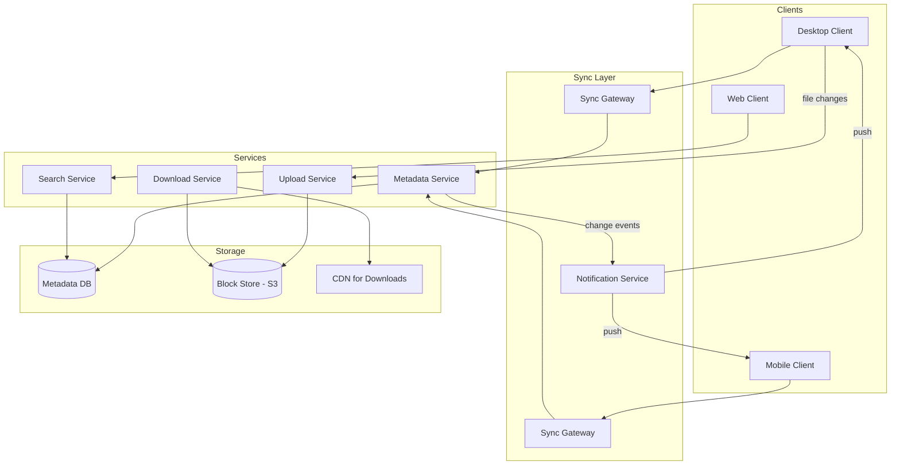
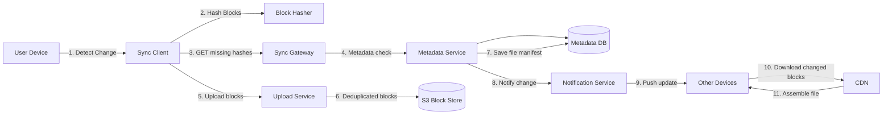

# Design File sharing application (DropBox/Google Drive)

## Blogs and websites

## Medium

## Youtube

- [Design Google Drive or Dropbox (Cloud File Sharing Service) | System Design Interview Prep](https://www.youtube.com/watch?v=jLM1nGgsT-I)

---

## Theory

### What Is It?

A cloud file sharing system (Dropbox, Google Drive) lets users store, sync, access, and share files across multiple devices. Unlike traditional file systems (local disk), files are stored in the cloud and synchronized bidirectionally — changes made on one device propagate to all other devices. Files can be shared with collaborators who can view or edit. The system must handle large files (GB+), concurrent edits, offline access, versioning (history), and conflict resolution — all while providing a seamless user experience.

### Why Does It Exist?

Local file storage has critical limitations: files don't sync across devices, can't be easily shared (email attachments hit size limits), no automatic backup, and no version history (you lose previous versions when you overwrite). Cloud file sharing solves these — your files follow you everywhere, are automatically backed up, can be shared via links, and retain every version for recovery.

### What Problem Does It Solve?

* **Bidirectional sync**: Changes on Device A must appear on Device B, C, D — and vice versa. The system must detect, upload, and propagate changes without conflicts or data loss.
* **Large file handling**: Users upload GB-sized videos and datasets. The system must stream uploads, resume on failure, and avoid re-uploading unchanged data.
* **Offline access**: Files must be available even when the user has no internet (e.g., on a plane). The system must intelligently cache files locally.
* **Concurrent editing**: Multiple users editing the same file simultaneously — changes must be merged or conflicts detected and resolved.
* **Storage efficiency**: Storing every version of every file for every user would be prohibitively expensive — need deduplication.
* **Security and sharing**: Files can be shared with granular permissions (read-only, can-edit, can-share); sharing links must be secure and revocable.
* **Cross-platform sync**: Windows, macOS, Linux, iOS, Android — each platform has different file system semantics (case sensitivity, file locking, path length limits).

### Important Subtopics

1. Sync protocol (metadata exchange, delta sync)
2. Block-level deduplication and chunking
3. Conflict resolution strategies
4. Offline access and caching
5. File versioning and history
6. Concurrent real-time editing
7. Permission and sharing model
8. Large file upload and resume

## Characteristics

| Characteristic | What it means | Why it matters | How it works |
|---|---|---|---|
| **Bidirectional sync** | Changes on any device sync to all others | Seamless experience across devices | Client watches file system for changes → uploads → server pushes to other clients |
| **Delta sync** | Only upload/download changed portions of files | Reduces bandwidth for large files | Block-level differencing via content-defined chunking |
| **Offline access** | Files available without internet | Critical for mobile/travel use cases | Smart caching based on usage frequency; selective sync |
| **Deduplication** | Identical blocks aren't stored twice | Massive storage savings (Dropbox saved Petabytes) | SHA-256 hash per block; store block once, reference from many files |
| **Conflict resolution** | Handle simultaneous edits gracefully | Prevent data loss | Last-writer-wins + user mediation; version branches |
| **Version history** | Keep all past versions of files | Recovery from accidental changes | Immutable version store; garbage collection of old versions |
| **Granular sharing** | Share with read/edit/admin permissions | Collaboration and access control | ACL-based; share links with tokens; expiration dates |

## Components

| Component | Purpose | Responsibilities | Relationship | Real-world Example |
|---|---|---|---|---|
| **Desktop/Mobile Client** | File system integration | Watch FS for changes, sync, cache | Talks to Sync Gateway; watches local FS | Dropbox desktop app |
| **Sync Gateway** | Edge sync proxy | Handle client connections, metadata, auth | Client → Sync Gateway → Backend | Dropbox Edge Cache |
| **Metadata Service** | File/folder metadata | Store paths, permissions, versions, ownership | Backend of Sync Gateway; talks to Metadata DB | Google Drive API |
| **Block Store** | Content storage | Store file blocks (deduplicated) | Written to by Upload Service | S3, Google Cloud Storage |
| **Upload Service** | Handle file uploads | Chunk files, compute block hashes, dedupe | Talks to Block Store | Dropbox uploader |
| **Download Service** | Serve file downloads | Assemble blocks into complete file | Reads from Block Store | CDN + Block Store |
| **Notification Service** | Push changes to clients | Real-time update notifications | Listens to change events; pushes via WebSocket/long-poll | Dropbox push |
| **Search Service** | File discovery | Index file metadata for search | Reads from Metadata DB | Elasticsearch |

### Component Interactions

1. **Sync**: Client detects file change → uploads changed blocks to Upload Service → Upload Service dedupes → Metadata Service updates file version → Notification Service pushes change to other clients → they download from Download Service.
2. **Share**: User shares folder → Metadata Service updates ACL → creates share token → user sends link → recipient accesses via token → Metadata Service validates permission.
3. **Offline**: User marks folder "available offline" → Download Service sends blocks to client → stored in local cache → when offline, client serves from cache; changes queued for sync on reconnect.

## Patterns

### Content-Addressed Storage with Deduplication

* **What**: Store files as content-addressed blocks (each block identified by its SHA-256 hash). Identical blocks across all files and users are stored once.
* **Problem solved**: Storing every version of every file would require petabytes — deduplication reduces storage by 10-50x.
* **How it works**: Client splits file into 4-8 MB blocks (fixed or content-defined) → computes SHA-256 for each → uploads blocks the server doesn't have (checked via hash) → assembles file from block references. The file metadata stores the list of block hashes (like a manifest).
* **When to use**: When many users share similar files (documents, photos, software installers).
* **When not to use**: When files are mostly unique (no dedup benefit) — overhead of hashing may exceed savings.
* **Advantages**: Massive storage savings; instant copy (share = link to same blocks); efficient sync.
* **Disadvantages**: Complexity; encryption-at-rest is harder (blocks are shared across users); chunk boundary alignment issues.
* **Java/Spring Boot example**:
```java
@Service
public class BlockDeduplicationService {
    private final BlockStore blockStore;
    private final MetadataStore metadataStore;

    public FileMetadata uploadFile(InputStream fileData) {
        List<String> blockHashes = new ArrayList<>();
        byte[] buffer = new byte[8 * 1024 * 1024]; // 8MB blocks
        int bytesRead;

        while ((bytesRead = fileData.read(buffer)) != -1) {
            byte[] block = Arrays.copyOf(buffer, bytesRead);
            String hash = Hashing.sha256().hashBytes(block).toString();

            if (!blockStore.hasBlock(hash)) {
                blockStore.putBlock(hash, block); // Deduplicate: store once
            }
            blockHashes.add(hash);
        }

        // File metadata stores block references (not content)
        return metadataStore.saveFile(new FileMetadata(blockHashes));
    }
}
```
* **Real-world example**: Dropbox's block-level deduplication saved petabytes of storage.

### Delta Sync via Rolling Checksum

* **What**: When a file changes, detect which blocks changed (vs. previous version) and only upload/download those blocks.
* **Problem solved**: Uploading a 1 GB file every time you change one byte wastes bandwidth.
* **How it works**: Server sends a "block signatures" list for the old file. Client computes rolling checksums for the new file, matches against old block boundaries, and only uploads changed/new blocks. This is the algorithm behind rsync.
* **When to use**: When files change incrementally (documents, code, configs).
* **When not to use**: When files are completely rewritten (no benefit) — overhead of computing checksums.
* **Advantages**: Dramatically reduced upload bandwidth for incremental changes.
* **Disadvantages**: CPU overhead for checksum computation; complexity in boundary alignment.
* **Real-world example**: Dropbox's sync algorithm.

## Benefits

* **Ubiquitous access**: Your files are available on every device, anywhere in the world.
* **Automatic backup**: The cloud acts as a backup — if your laptop dies, your files are safe.
* **Easy sharing**: Share large files via links instead of email attachments (which have size limits).
* **Version history**: Undo accidental changes or recover deleted files from version history.
* **Offline access**: Critical files cached locally so you can work without internet.
* **Collaboration**: Multiple users can share folders and see each other's changes in near-real-time.
* **Storage efficiency**: Deduplication and delta sync reduce storage and bandwidth costs.

## Pros

* **Seamless cross-device sync**: Changes appear on all devices within seconds; users don't manage sync manually.
* **Massive storage savings**: Block-level deduplication means identical files/blocks are stored once across all users.
* **Efficient bandwidth usage**: Delta sync uploads only changed blocks — gigabytes of changes become kilobytes of upload.
* **Granular sharing controls**: Read-only, can-edit, can-share permissions per user or via link with expiration.
* **Offline access**: Smart caching makes frequently-used files available offline.
* **Version recovery**: Unlimited version history (within retention) — revert to any past state.

## Cons

* **Privacy and security concerns**: Files stored on third-party servers raise data privacy issues (especially for enterprise/sensitive data).
* **Bandwidth dependency**: Large uploads/downloads require good internet; sync can be slow on poor connections.
* **Conflict resolution complexity**: Simultaneous edits create conflicts that need user intervention.
* **Storage costs**: Despite deduplication, storing petabytes of data is expensive — costs are passed to users (storage quotas).
* **Offline-online merge complexity**: Merging offline changes when connectivity returns can be tricky, especially for binary files.
* **Cross-platform issues**: File system differences (case sensitivity, path length, file locking) cause sync problems.

## Challenges

### Technical Challenges

* **Cross-platform file system compatibility**: Windows (case-insensitive, `\` paths, file locking), macOS (HFS+ APFS, case-preserving), Linux (case-sensitive, symlinks) — the sync engine must handle all semantics.
* **Concurrent modification detection**: Detecting simultaneous edits to the same file on different devices and merging or conflicting.
* **Network interruption handling**: Uploads/downloads must resume from where they left off, not restart from scratch.
* **Metadata consistency**: The metadata (file list, permissions, versions) must be consistent across all clients and the server.

### Scalability Challenges

* **Metadata database load**: Every file change requires a metadata update. With 500M+ users and billions of files, the metadata database must scale to millions of writes/second.
* **Block store capacity**: Storing petabytes of unique and shared blocks requires distributed storage with rebalancing.
* **Client-to-server connection count**: Each client maintains a persistent connection — 500M users × multiple devices = billions of connections.

### Performance Challenges

* **Sync latency**: Changes should propagate to other devices within seconds, not minutes.
* **Large file upload**: Streaming upload of multi-GB files without loading them entirely into memory.
* **Metadata sync for large folders**: Folders with 100K+ files — syncing the entire metadata tree on every change is too slow; use incremental metadata sync.

### Reliability Challenges

* **Data integrity**: The block store must guarantee bit-perfect storage; bit rot or corruption must be detected (checksums) and repaired.
* **Metadata corruption**: If metadata (file tree) is lost or corrupted, files are inaccessible even if blocks exist.
* **Conflict recovery**: User-intervention conflicts must be gracefully handled — don't lose either version.

### Maintainability Challenges

* **Client updates**: Rolling out client updates across millions of devices; backward compatibility.
* **Protocol evolution**: The sync protocol must evolve without breaking existing clients.
* **Cross-platform testing**: Every change must be tested on Windows, macOS, Linux, iOS, Android.

### Operational Challenges

* **Rate limiting**: Prevent a single client from overwhelming the server (too many files changing at once).
* **Bandwidth management**: Throttle sync during peak hours; compress uploads.
* **Storage quota enforcement**: Track per-user storage and enforce limits.

### Security Concerns

* **Data encryption**: Files must be encrypted at rest (server-side or client-side).
* **Share link security**: Links must use unguessable tokens; expiration and revocation supported.
* **Access control**: Every file operation must check permissions (POSIX-style ACLs or role-based).
* **Ransomware detection**: Detect and block mass file deletion/encryption by compromised clients.

## Best Practices

* **Content-defined chunking for dedup**: Use Rolling Hash (Rabin-Karp) to find natural chunk boundaries — identical insertions in different files produce matching chunks even if offsets differ.
* **Lazy block upload**: Upload blocks in priority order (small files first, recently modified first) to optimize perceived performance.
* **Bandwidth throttling**: Adaptive upload/download rates to not saturate the user's connection.
* **Conflict copies**: When conflicts can't be auto-resolved, save the conflicting version with a suffix (e.g., `report (conflicted copy 2024-06-14).docx`) — never lose data.
* **Predictive sync**: Pre-download files the user is likely to need next based on usage patterns.
* **Delta metadata sync**: Only sync metadata changes (new/modified/deleted files) rather than the entire tree.
* **End-to-end encryption**: For privacy-focused offerings, encrypt files client-side — server cannot read file contents.
* **Immutable version store**: Keep versions immutable (append-only) — simplifies recovery and sharing.

## When to Use

### Appropriate

* When users need access to files across multiple devices (laptops, phones, tablets).
* When file sharing and collaboration are core requirements.
* When automatic backup and version history are needed.
* When users work offline and need synced access later.
* When large file sharing is needed (exceeding email attachment limits).

### Not Appropriate

* When files are accessed primarily from one device — local storage + cloud backup (Google One, iCloud) suffices.
* When real-time collaboration (live co-editing) is needed — Google Docs/Office 365 are better.
* When files are primarily read-only archives — simple object storage with sharing links.
* When the user base is small (< 10 users) — Dropbox/Drive consumer plans suffice, no need for self-hosted.

### Alternatives

* **Cloud backup**: One-directional backup (Backblaze, Carbonite) — no sync/collaboration.
* **Object storage**: S3-compatible storage with direct API access — no sync client.
* **Version control**: Git for code/config files — handles versioning but not binary files well.
* **Real-time collaboration**: Google Docs, Figma — for live co-editing (not applicable to binaries).

### Decision Factors

* **Sync vs. backup**: Two-way sync needed? (→ file sync system). One-way backup? (→ backup service).
* **Real-time collaboration**: Need live co-editing? (→ Google Docs/Figma). Just versioning? (→ file sync).
* **Privacy requirements**: Need end-to-end encryption? (→ additional complexity but better privacy).
* **Scale**: Number of users, total storage, concurrent sync sessions.
* **Platform support**: Must support Windows/macOS/Linux/iOS/Android.

## Use Cases

### Large File Collaboration (Video Editing)

* **Problem**: Video editors working on multi-GB project files need to share edits and access media assets.
* **Solution**: Sync system with block-level deduplication (shared media assets deduplicated), delta sync (only changed blocks uploaded), and selective sync (only sync needed assets).
* **Why suitable**: Video projects share many common media files — deduplication saves massive storage. Delta sync means only the edited 10 MB of a 50 GB file is uploaded.
* **How it works**: Editor changes a project file → client computes changed blocks → uploads only changed blocks → metadata update → other editors' clients download changed blocks → reassemble. Shared media assets (footage) are deduplicated automatically.
* **Trade-offs**: Initial full-file upload is slow; concurrent binary file edits create conflicts (no auto-merge like text files).

### Enterprise Team Collaboration

* **Problem**: A 500-person company needs shared project folders with version history, access controls, and backup.
* **Solution**: Team folders with read/write permissions per team, version history retained for 180 days, SSO integration, and audit logs.
* **Why suitable**: Granular permissions, version recovery, and audit trails meet enterprise requirements.
* **How it works**: User creates a shared folder → sets team permissions (engineering: read-write, marketing: read-only) → system records all file changes → version history retained → deleted files recoverable for 180 days → admin has audit log of all access.
* **Trade-offs**: Per-user licensing cost scales linearly with team size; permission management complexity; compliance overhead.

### Remote Work Offline Access

* **Problem**: Salesperson traveling with no WiFi needs to present client proposals and update contracts.
* **Solution**: Offline access with intelligent caching — frequently-opened files are cached locally; changes are queued for sync when online.
* **Why suitable**: Salesperson can work offline and sync when connectivity returns.
* **How it works**: User marks "work offline" → client downloads specified folders/files to local cache → user edits files offline → on reconnect, client uploads changed blocks → conflicts detected and resolved (or conflict copies created).
* **Trade-offs**: Storage usage on device; conflict resolution for binary files; sync delay after reconnecting.

## Architecture

A cloud file sharing system uses a **microservice architecture** with a sync gateway, metadata service, block store, and notification service. Files are stored as content-addressed blocks (deduplicated). Clients communicate via a sync protocol that exchanges metadata deltas and uploads/downloads changed blocks. Real-time push (WebSocket) delivers notifications of changes to connected clients. For offline access, clients maintain a local cache with smart prefetch.



### Architecture Structure

* **Edge layer**: Sync gateways (regional) that handle client connections and auth.
* **Service layer**: Metadata, Upload, Download, Search, Notification services.
* **Storage layer**: Metadata DB (Postgres sharded by user_id), Block Store (S3 with multi-region replication), CDN for downloads.
* **Client layer**: Desktop (filesystem watcher), Mobile (selective sync), Web (direct API).

### Communication

* **Client ↔ Sync Gateway**: Long-lived connection (WebSocket or HTTP/2) for notifications + REST for file operations.
* **Services ↔ Metadata DB**: gRPC/SQL for metadata operations.
* **Upload Service ↔ Block Store**: S3 multipart upload API.
* **Notification Service ↔ Clients**: WebSocket push.

### Data Flow

1. **File upload**: Client computes block hashes → uploads missing blocks to Upload Service → Upload Service writes to S3 → Metadata Service records file manifest → Notification Service notifies other clients.
2. **Sync**: Client → Sync Gateway (metadata delta) → if newer version exists, download changed blocks from CDN → assemble file.
3. **Share**: User → Metadata Service (update ACL) → generates share link → recipient opens link → Metadata Service validates → Download Service serves file.

### Scaling Strategy

* **Metadata DB**: Shard by user_id hash; each shard holds a subset of users' file trees.
* **Block Store**: Content-addressed (hash-based) sharding; no hot keys (blocks distributed by hash).
* **Sync Gateway**: Stateless; scale horizontally behind a load balancer.
* **CDN**: Auto-scales with traffic (managed by cloud provider).

### Failure Handling

* **Upload interruption**: Resume from last successful block (HTTP range requests, multipart upload).
* **Metadata corruption**: Restore from backup; version history allows recovery.
* **Offline conflict**: On reconnect, detect divergent blocks → create conflict copy → notify user.
* **Network partition**: Local changes queued; sync resumes when reconnected.

## High-Level Design



**File upload flow**:
1. User edits a file → client detects change (filesystem watch).
2. Client splits file into 8MB blocks → computes SHA-256 per block → checks with server which blocks are missing.
3. Uploads missing blocks to Upload Service → stored in S3 (deduplicated by hash).
4. Client sends file manifest (block list) to Metadata Service → Metadata Service saves new version.
5. Notification Service pushes update to other connected devices.
6. Other devices download changed blocks from CDN → reassemble → update local file.

**Share flow**:
1. User shares file/folder with collaborators → Metadata Service updates ACL → generates share token.
2. User sends link → recipient opens link → Metadata Service validates token → returns file metadata.
3. Recipient downloads file blocks via CDN → uploads changes (if edit permission) → new version.

## Deep Dive

### Internal Implementation: Content-Addressed Block Storage

Files are split into fixed-size (8MB) or content-defined (4-16MB using Rabin fingerprinting) blocks. Each block is identified by `SHA-256(block_content)`. The file manifest is a list of block hashes: `{file_id: "f_123", blocks: ["hash_a", "hash_b", "hash_c"]}`.

The **Upload Service** first checks if the server already has each block (batch `HEAD` request with hash). Only missing blocks are uploaded. This is the key deduplication mechanism — if 1000 users upload the same 8MB software installer, only 1 block is stored, referenced 1000 times in manifests.

**Content-defined chunking** (Dropbox's approach): Instead of fixed 8MB boundaries, use Rabin-Karp rolling hash to find natural boundaries (content-dependent). This means inserting data at the beginning of a file only shifts the chunk boundaries for that region — the rest of the file's chunks still match, giving better dedup. Fixed chunking is simpler but poor for files with insertions at the beginning (every chunk shifts).

### Conflict Resolution

When two devices edit the same file while offline, and both come online, the system must resolve the conflict:

1. **Detect**: Compare the block hash lists of both versions. If they differ, there's a conflict.
2. **Auto-resolve**: If one version is a strict superset (superset of blocks), use it.
3. **Conflict copy**: If both have divergent changes, save both — create `filename (conflicted copy YYYY-MM-DD).ext` for the less-recent version.
4. **User mediation**: The user must manually resolve — open both files, merge changes, upload the resolved version.

For text files, the system could attempt a three-way merge (using the last synced version as the base), but for binary files (documents, images, videos), this is impossible — conflict copies are the only option.

### Offline Access Strategy

The client maintains a local cache of file blocks. The strategy for selecting which files to cache:

- **Pinned files**: User explicitly marks files/folders as "available offline."
- **Frequently accessed**: Automatically cache files opened in the last 7 days.
- **Recently modified**: Cache files the user has been editing.
- **Smart prefetch**: When a folder is opened, prefetch its contents (but not nested folders unless accessed).

The cache uses a LRU eviction policy with a configurable size limit (e.g., 10 GB on desktop, 1 GB on mobile). Cache metadata (which files are cached, their versions) is stored separately and synced.

### Sync Protocol

The Dropbox-style sync protocol:

1. **Handshake**: Client sends `client_state {last_sync_cursor, device_id}`; server responds with `server_state {changes_since, latest_cursor}`.
2. **Delta exchange**: Server sends a list of changed/added/deleted files (delta entries). Client sends its own changes (new/modified/deleted files).
3. **Block exchange**: For modified files, client and server negotiate which blocks to upload/download (block hash comparison).
4. **Commit**: After all blocks transferred, client updates local metadata; server commits new versions.
5. **Notification**: Server pushes changes to other connected clients.

The cursor is a monotonically increasing sequence number or timestamp that allows resuming interrupted syncs.

## Java and Spring Boot Implementation

### Basic Java Implementation — Block Deduplication

```java
@Service
@RequiredArgsConstructor
public class FileStorageService {
    private final BlockStore blockStore;
    private final MetadataStore metadataStore;
    private static final int BLOCK_SIZE = 8 * 1024 * 1024; // 8 MB

    public FileVersion storeFile(InputStream inputStream, String fileName) throws IOException {
        List<String> blockHashes = new ArrayList<>();
        byte[] buffer = new byte[BLOCK_SIZE];
        int bytesRead;
        int blockNumber = 0;

        while ((bytesRead = inputStream.read(buffer)) != -1) {
            byte[] block = Arrays.copyOf(buffer, bytesRead);
            String hash = DigestUtils.sha256Hex(block);

            if (!blockStore.exists(hash)) {
                blockStore.put(hash, block);
            }
            blockHashes.add(hash);
            blockNumber++;
        }

        FileVersion version = FileVersion.builder()
            .fileId(UUID.randomUUID().toString())
            .fileName(fileName)
            .blockHashes(blockHashes)
            .size(inputStream.available())
            .build();

        return metadataStore.saveFileVersion(version);
    }

    public InputStream retrieveFile(String fileId, String version) throws IOException {
        FileVersion metadata = metadataStore.getFileVersion(fileId, version);
        return new SequenceInputStream(
            Collections.enumeration(
                metadata.getBlockHashes().stream()
                    .map(blockStore::get)
                    .map(bytes -> new ByteArrayInputStream(bytes))
                    .toList()
            )
        );
    }
}
```

### Production-Oriented Java Implementation — Sync Service

```java
@RestController
@RequestMapping("/api/v1/filesync")
@RequiredArgsConstructor
public class SyncController {
    private final SyncService syncService;

    @PostMapping("/delta")
    public ResponseEntity<DeltaResponse> getDelta(
            @RequestBody DeltaRequest request,
            @AuthenticationPrincipal UserDetails user) {
        DeltaResponse response = syncService.computeDelta(
            user.getId(), request.getLastSyncCursor());
        return ResponseEntity.ok(response);
    }

    @PostMapping("/upload")
    public ResponseEntity<Void> uploadBlock(
            @RequestParam String hash,
            @RequestBody byte[] data,
            @AuthenticationPrincipal UserDetails user) {
        if (!blockStore.exists(hash)) {
            blockStore.put(hash, data);
        }
        return ResponseEntity.ok().build();
    }
}

@Service
@Transactional
public class SyncService {
    private final MetadataStore metadataStore;
    private final BlockStore blockStore;

    public DeltaResponse computeDelta(String userId, long lastSyncCursor) {
        List<FileChange> changes = metadataStore.getChangesSince(userId, lastSyncCursor);
        List<PendingUpload> uploads = new ArrayList<>();
        List<PendingDownload> downloads = new ArrayList<>();

        for (FileChange change : changes) {
            if (change.getType() == ChangeType.MODIFIED) {
                FileVersion version = metadataStore.getFileVersion(change.getFileId(), change.getVersion());
                // Determine which blocks client is missing
                List<String> missing = blockStore.findMissing(version.getBlockHashes());
                downloads.add(new PendingDownload(change.getFileId(), missing));
                uploads.add(new PendingUpload(change.getFileId(), version.getBlockHashes()));
            }
        }

        return DeltaResponse.builder()
            .changes(changes)
            .needUpload(uploads)
            .needDownload(downloads)
            .newCursor(System.currentTimeMillis())
            .build();
    }
}
```

### Testing Example

```java
@SpringBootTest
class FileStorageServiceTest {
    @MockBean private BlockStore blockStore;
    @MockBean private MetadataStore metadataStore;

    @Test
    void shouldDeduplicateIdenticalBlocks() throws IOException {
        byte[] blockData = "hello world".getBytes();
        String hash = DigestUtils.sha256Hex(blockData);

        when(blockStore.exists(hash)).thenReturn(true); // Block already exists

        FileVersion version = storageService.storeFile(new ByteArrayInputStream(blockData), "test.txt");

        verify(blockStore, never()).put(eq(hash), any()); // Should NOT re-upload
        assertThat(version.getBlockHashes()).containsExactly(hash);
    }

    @Test
    void shouldHandleEmptyFile() throws IOException {
        FileVersion version = storageService.storeFile(new ByteArrayInputStream(new byte[0]), "empty.txt");

        assertThat(version.getBlockHashes()).isEmpty();
    }
}
```

## Real-World Examples

### Dropbox's Deduplication

Dropbox's block-level deduplication works by splitting each uploaded file into ~4MB blocks (using content-defined chunking via Rabin fingerprinting), hashing each block (SHA-256), and storing only unique blocks. For shared folders and common files (software installers, popular documents), this saves enormous amounts of storage — Dropbox reported saving Petabytes across their user base. The deduplication happens transparently: 1000 users uploading the same 500MB installer stores only 500MB of data, not 500TB.

### Google Drive's Real-Time Collaboration

Google Drive's real-time collaborative editing (used in Google Docs, Sheets) uses Operational Transformation (OT) or Conflict-free Replicated Data Types (CRDTs). When multiple users edit simultaneously, each keystroke is transformed against others' operations. Google Docs uses OT — each client sends operations (insert at position X, delete range Y) to the server, which serializes them and broadcasts transformed operations to all clients. This achieves sub-second latency for collaborative editing.

### Microsoft OneDrive's Files On-Demand

OneDrive's Files On-Demand feature intelligently manages local cache: files appear in the filesystem (Windows) but are only downloaded when opened. The system uses placeholders — a metadata-only stub that represents the file without its content. When the user opens a placeholder, the full file downloads on-demand. Smart caching keeps recently used files locally; older files are evicted but remain as placeholders.

## Interview Preparation

### Beginner Questions

**Q1: How does file synchronization work?**
A: The client watches the local filesystem for changes. When a file changes, the client splits it into blocks, computes SHA-256 hashes, and checks which blocks the server already has (via metadata exchange). Only missing blocks are uploaded. The server stores blocks content-addressably (deduplication). When other clients sync, they download only changed blocks and reassemble. This is how Dropbox, Google Drive, and OneDrive work.

**Q2: What is delta sync?**
A: Delta sync means syncing only the parts of a file that changed, not the entire file. When a 1GB file has 5MB changed, delta sync uploads only those 5MB of changes (plus metadata), not the full 1GB. This is achieved through block-level differencing: the client and server compare block hashes; only blocks with different hashes are transferred.

**Q3: How does deduplication work?**
A: Files are split into blocks, each block is hashed (SHA-256). If two files share identical blocks (common in software installers, documents, photos), the blocks are stored once and referenced by hash. The file metadata stores a list of block hashes (a manifest). When you request a file, the system fetches all blocks by hash and reassembles them. This can reduce storage by 10-50x for shared content.

### Intermediate Questions

**Q4: How do you handle conflicts when the same file is edited on two devices while offline?**
A: The system detects the conflict by comparing the block hash lists of both versions. If they differ (both have changes), it creates a "conflict copy" — `filename (conflicted copy YYYY-MM-DD).ext`. The user must manually merge and upload the resolved version. The system never auto-overwrites one side, to avoid data loss. For text files, some systems attempt three-way merge (using the last-synced version as base), but for binary files, conflict copies are the only option.

**Q5: How do you handle large file uploads with resume capability?**
A: Use chunked upload with HTTP range requests. The file is split into chunks (e.g., 8-100 MB each). Each chunk has a unique number/range. The client sends chunks sequentially (or in parallel). The server tracks which chunks have been received. If the upload is interrupted, the client queries the server for received chunk ranges and resumes from the last missing chunk. HTTP `Content-Range` header identifies each chunk.

**Q6: How do you decide which files to cache for offline access?**
A: A smart caching strategy: (1) User-pinned files (explicitly marked "available offline"). (2) Frequently accessed files (opened in last 7 days). (3) Recently modified files (user is actively editing). (4) Smart prefetch — when opening a folder, prefetch its files (but not nested subfolders). Cache uses LRU eviction with a size limit; metadata (cached vs. placeholder) is tracked separately.

**Q7: How do you handle file permissions and sharing?**
A: Each file/folder has an ACL (Access Control List) stored in the metadata database. Permissions: read, write, delete, share, owner. Sharing generates a token (UUID) mapped to the ACL. Share links are `https://drive.com/share/{token}`. Token can have expiration, password protection, and download restrictions. Permission checks happen on every read/write operation. ACLs are cached in Redis for hot files.

### Advanced Questions

**Q8: How would you design a file sharing system for 1 billion users?**
A: Key considerations: (1) **Metadata sharding**: Shard metadata DB by user_id hash (1000+ shards); each shard handles 1M users. (2) **Block store**: Content-addressed storage (S3) with global replication; no hot keys since blocks are hash-based. (3) **Edge caching**: Regional sync gateways; CDN for downloads. (4) **Connection management**: Each client maintains one persistent connection (WebSocket); need connection brokers to distribute 10B connections across gateway instances. (5) **Metadata sync**: Incremental delta sync to avoid syncing entire file trees; clients cache metadata locally. (6) **Upload optimization**: Direct-to-S3 presigned URLs (bypass gateways); multipart upload for large files. (7) **Conflict resolution**: Async conflict detection; conflict copies; for text files, attempt three-way merge via API. (8) **Cost**: Storage is dominated by unique blocks; use tiered storage (S3 Standard → Glacier) and dedup monitoring.

**Q9: How does Google Docs handle real-time collaborative editing?**
A: Google Docs uses Operational Transformation (OT) (though moving to CRDTs). Each keystroke is an operation: `insert(position, text)` or `delete(start, end)`. Operations are sent to the server, which applies a transformation function to make them serializable — if operation A inserts at position 5 and operation B inserts at position 8, B's position is shifted to 13. The server broadcasts transformed operations to all clients, which apply them in order. This achieves sub-100ms latency for seeing collaborators' edits. CRDTs (like Yjs) are emerging as simpler alternatives — operations are inherently commutative and don't require transformation.

**Q10: How do you handle a user with 10 million files in a single folder?**
A: (1) **Don't store all files in one folder** — recommend breaking into subfolders; but if they must, (2) **Paginated metadata**: Metadata query returns files in pages (1000 per request); client requests pages on-demand. (3) **Metadata sharding**: Split the folder's metadata across multiple DB shards (by file_id hash). (4) **Indexing**: Full-text search in Elasticsearch instead of listing. (5) **Background sync**: Client syncs folder contents in background, prioritizing recently modified files. (6) **API design**: `GET /folder/{id}/files?limit=100&cursor=...` instead of returning everything. The Dropbox API does exactly this — max 2500 files per batch.

### Senior-Level Questions

**Q11: How would you design a file sync system with end-to-end encryption (like Tresorit)?**
A: In E2E encryption, files are encrypted client-side with a key the server never sees. Challenges: (1) **Key management**: Use a key-encryption-key (KEK) per user, stored encrypted by the user's password (PBKDF2); file keys are encrypted with the KEK. (2) **Deduplication loss**: Server can't deduplicate encrypted files (can't see content) — each user stores a separate encrypted copy. Use convergent encryption (encrypt with a key derived from file content hash) — same content → same ciphertext → server can dedup. But convergent encryption has security weaknesses (learn-the-important-part pattern attack). (3) **Search**: Searching encrypted content requires client-side indexing or searchable encryption (SSE). (4) **Sharing**: Share the file key with recipients (encrypted with their KEK). (5) **Metadata**: Even metadata (file names, sizes) may leak — encrypt metadata too with separate keys.

**Q12: How do you handle the case where a user's entire hard drive dies — how do they recover their synced files?**
A: (1) **Server is the source of truth**: All files and versions are stored server-side. (2) **Client reinstallation**: User installs the client on a new machine → logs in → client downloads the file tree metadata → user can selectively restore files (or restore all). (3) **Version history**: User can recover previous versions (deleted files, overwritten files) from version history (retained per policy). (4) **Selective restore**: User can selectively sync only certain folders initially, then add more. (5) **Bandwidth management**: Large restores may take hours/days; client uses delta sync (only downloads blocks not already present locally — but on a new machine, all blocks are missing). (6) **Backup**: For ultimate safety, recommend a separate backup (not just sync) — sync is not backup.

### System Design Questions (Senior)

**Q13: Design a file sharing system that supports real-time collaborative editing on binary files (e.g., Photoshop PSD files).**

**Approach**:
- **Conflict detection**: Use Operational Transformation (OT) for text; for binary files, use a "checkout" model — only one user edits at a time; others see a "read-only" view with a pending-changes indicator.
- **Delta sync within session**: As the user edits, send compressed deltas (e.g., Photoshop's PSD format supports incremental saves) via WebSocket to the server; server broadcasts to other session participants.
- **Server-side rendering**: For non-Photoshop users, render previews (thumbnail, partial render) on the server.
- **Presence**: Show cursor positions and selections of collaborators in real-time.
- **Storage**: Store session deltas separately from file versions; commit to persistent storage on session end.
- **Bandwidth**: Compress deltas; cap at 1MB/s per session; warn user if exceeded.
- **Conflict resolution**: If two users edit simultaneously (e.g., both opened PSD before the other joined), use last-writer-wins with conflict copy for the losing side.
- **Protocol**: Custom WebSocket protocol that sends binary diffs (similar to VS Code's Live Share or Figma's binary collaboration).

**Expected discussion points**: Binary vs. text OT differences, bandwidth optimization, presence indicators, rendering pipeline for previews, conflict detection for binary files, and the checkout model trade-offs.

**Q14: How would you design a file sharing system specifically for code repositories (like GitHub/GitLab) with branching and merging?**

**Approach**:
- **Git under the hood**: Use Git's content-addressed storage (SHA-1 objects) for files — automatic deduplication, versioning, branching.
- **Object storage**: Store Git objects (blobs, trees, commits) in S3-compatible storage with a Git HTTP API layer.
- **Branching**: Branch = lightweight pointer to a commit; cheap to create/delete.
- **Merging**: Git's three-way merge handles most cases; conflicts require user intervention (via web UI or local checkout).
- **Diffs**: Compute diffs server-side for the web UI; cache diff results.
- **Large files**: Use Git LFS (Large File Storage) — files stored in S3, Git tracks pointers.
- **Collaboration**: Pull requests = diffs between branches; review UI shows line-by-line diffs.
- **CI/CD integration**: Webhooks trigger builds on push events.
- **Access control**: SSH keys or OAuth tokens; repo-level + branch-level permissions.
- **Scalability**: Git sharding (partition repos across servers); packfile optimization for large repos; CDN for blob downloads.

### Common Mistakes and Expected Discussion Points

**Common mistakes in file sharing interviews**:
- Not discussing deduplication (content-addressed storage is the key differentiator).
- Ignoring offline access and conflict resolution.
- Not addressing cross-platform file system differences.
- Overlooking metadata scalability (file tree sync is often harder than file content sync).
- Not considering the client-server sync protocol design.
- Forgetting about security (encryption at rest, share link security).
- Not mentioning real-time collaboration (for code/text editing).

**Expected discussion points**: Block vs. file-level sync, content-addressed storage, delta sync algorithms, conflict resolution strategies, offline caching policies, cross-platform sync challenges, and the balance between sync speed and bandwidth usage.

**Follow-up questions an interviewer might ask**:
* Q: "How do you handle a file that's deleted on one device and modified on another while both are offline?" A: On sync, the system sees a delete and a modify conflict — the delete takes precedence (the modification is lost), or the system creates a conflict copy of the modified version.
* Q: "How do you sync a file that's 100GB with limited bandwidth?" A: Use chunked upload with resume; allow the user to pause/resume; show progress; use delta sync if the server has a previous version.
