# Design Cloud File Storage and Sync (Google Drive / Dropbox)

## Blogs and websites

## Medium

## Youtube

- [Design Google Drive or Dropbox (Cloud File Sharing Service) | System Design Interview Prep](https://www.youtube.com/watch?v=jLM1nGgsT-I)

---

## Theory

### Topics Covered

1. [Introduction / Problem Statement](#introduction--problem-statement)
2. [Characteristics](#characteristics)
3. [Pros](#pros)
4. [Cons](#cons)
5. [Use Cases](#use-cases)
6. [Components](#components)
7. [Architectural Patterns](#architectural-patterns)
8. [Benefits](#benefits)
9. [Challenges](#challenges)
10. [Best Practices](#best-practices)
11. [When to Use / When Not to Use](#when-to-use--when-not-to-use)
12. [Data Model and API](#data-model-and-api)
13. [Domain-Specific: Cloud File Storage and Sync Deep Dive](#domain-specific-cloud-file-storage-and-sync-deep-dive)
14. [Replication Strategies](#replication-strategies)
15. [Failure Detection and Membership](#failure-detection-and-membership)
16. [High Availability and Scalability](#high-availability-and-scalability)
17. [Performance and Optimization](#performance-and-optimization)
18. [CAP Theorem and Consistency Trade-offs](#cap-theorem-and-consistency-trade-offs)
19. [Encryption and Key Management](#encryption-and-key-management)
20. [Authentication and Authorization](#authentication-and-authorization)
21. [Security Threats and Mitigations](#security-threats-and-mitigations)
22. [Observability and Logging](#observability-and-logging)
23. [Real-World Implementations](#real-world-implementations)
24. [Java and Spring Boot Implementation Guide](#java-and-spring-boot-implementation-guide)
25. [Interview Questions and Answers](#interview-questions-and-answers)

---

### Introduction / Problem Statement

A cloud file storage and sync system (Dropbox, Google Drive, OneDrive) lets users store, synchronize, access, and share files across multiple devices. Unlike traditional network file systems (NFS, SMB), files live in the cloud and are synchronized bidirectionally: a change on one device must propagate to all others — all while supporting large-file streaming, offline access, versioning, concurrent-edit conflict resolution, and granular sharing with per-user permissions. The defining challenge is the **sync problem**: when a file is modified, the system must detect the change, break the file into content-addressed blocks, upload only the changed blocks (delta sync), and notify every other device — without overwhelming the network, losing data, or serving stale content.

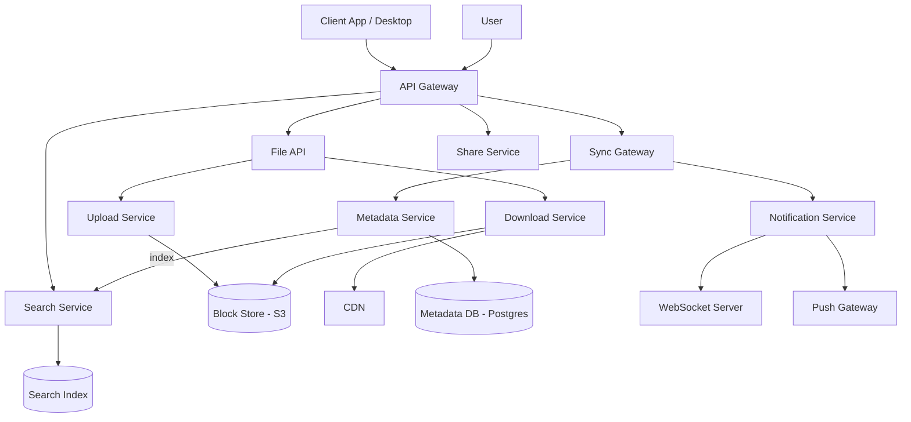

*The core service topology of a cloud file storage and sync platform: the Sync Gateway is the edge proxy that handles client connections and metadata deltas; the Metadata Service owns the file tree and ACLs (backed by a sharded PostgreSQL cluster); the Upload/Download Services negotiate block transfer against the content-addressed Block Store (S3); a CDN caches hot blocks for sub-millisecond downloads; the Notification Service pushes real-time change events over WebSocket or mobile push; and the Search Service indexes file metadata from the event stream for discovery.*

**Problem Statement:** Design a cloud file storage and sync service that supports user accounts, folder hierarchies, large-file upload with resume, block-level delta sync, offline access with intelligent caching, file versioning and history, concurrent-edit conflict resolution, granular sharing with ACLs and expiring links, and search — all at global scale serving hundreds of millions of users and petabytes of data while keeping sync latency in the low-single-digit-seconds range and download latency under 100 ms for cached content.

**The sync problem in numbers:** A video editor working on a 50 GB project modifies 200 MB of frames. Naive full-file upload re-transmits 50 GB; delta sync must detect the 200 MB worth of changed 8 MB blocks via rolling checksums and upload only those blocks. A folder shared with 1,000 collaborators where 5 users edit simultaneously generates 5 conflict-detection events per sync cycle — the sync engine must merge or fork each into a conflict copy. At 500 million users × 5 devices each, the Metadata Service must sustain millions of metadata writes per second while the Block Store must serve millions of block reads per second with content-addressed, collision-free lookups. The system must make all of this look instant and lossless to end users.

**Core requirements:**

* **Bidirectional sync**: Changes on Device A appear on Devices B, C, D — and vice versa — within seconds.
* **Large file handling**: Stream GB-sized uploads, resume on failure, avoid re-uploading unchanged bytes.
* **Offline access**: Files available without internet via smart local caching and selective sync.
* **Concurrent editing**: Merge or safely fork simultaneous edits without data loss.
* **Storage efficiency**: Block-level deduplication saves petabytes across shared content.
* **Security and sharing**: Per-user ACLs, unguessable share links, expiration, and revocation.
* **Cross-platform sync**: Windows, macOS, Linux, iOS, Android — each with different file system semantics.


### Characteristics

| Characteristic | What it means | Why it matters | How it works |
|---|---|---|---|
| **Bidirectional sync** | Changes on any device sync to all others | Seamless experience across devices | Client watches FS for changes → uploads → server pushes to other clients |
| **Delta sync** | Only upload/download changed portions of files | Reduces bandwidth for large files | Block-level differencing via content-defined chunking |
| **Offline access** | Files available without internet | Critical for mobile/travel use cases | Smart caching based on usage frequency; selective sync |
| **Deduplication** | Identical blocks aren't stored twice | Massive storage savings (Dropbox saved Petabytes) | SHA-256 hash per block; store block once, reference from many files |
| **Conflict resolution** | Handle simultaneous edits gracefully | Prevent data loss | Last-writer-wins + user mediation; version branches |
| **Version history** | Keep all past versions of files | Recovery from accidental changes | Immutable version store; garbage collection of old versions |
| **Granular sharing** | Share with read-only, can-edit, can-share permissions | Collaboration and access control | ACL-based; share links with tokens; expiration dates |
| **Content-addressed storage** | Blocks are keyed by their hash, not their location | Instant copy, efficient dedup, immutability | SHA-256(block) → store once; file manifest lists block hashes |

### Pros

* **Ubiquitous access**: Your files are available on every device, anywhere in the world.
* **Automatic backup**: The cloud acts as a backup — if your laptop dies, your files are safe.
* **Easy sharing**: Share large files via links instead of email attachments (which have size limits).
* **Version recovery**: Unlimited version history (within retention) — revert to any past state.
* **Offline access**: Critical files are cached locally so you can work without internet.
* **Seamless cross-device sync**: Changes appear on all devices within seconds; users never manage sync manually.
* **Massive storage savings**: Block-level deduplication means identical files/blocks are stored once across all users.
* **Efficient bandwidth use**: Delta sync uploads only changed blocks — gigabytes of changes become kilobytes of upload.
* **Granular sharing controls**: Read-only, can-edit, can-share permissions per collaborator or via link with expiration.
* **Smart caching**: Frequently used files are pre-fetched; large folders sync metadata first, content on demand.

### Cons

* **Privacy and security concerns**: Files stored on third-party servers raise data privacy issues (especially for enterprise/sensitive data).
* **Bandwidth dependency**: Large uploads/downloads require good internet; sync can be slow on poor connections.
* **Conflict resolution complexity**: Simultaneous edits create conflicts that need user intervention — no auto-merge for binary files.
* **Storage costs**: Despite deduplication, storing petabytes of data is expensive — costs are passed to users (storage quotas).
* **Offline-online merge complexity**: Merging offline changes when connectivity returns can be tricky, especially for binary files.
* **Cross-platform issues**: File system differences (case sensitivity, path length, file locking) cause sync problems.
* **Latency vs. consistency**: Strong consistency on every read is expensive; most operations are eventually consistent.
* **Ransomware surface**: A compromised synced client can encrypt/delete every file across all devices in minutes.

### Use Cases

#### Large File Collaboration (Video Editing)

* **Problem**: Video editors working on multi-GB project files need to share edits and access media assets.
* **Solution**: Sync system with block-level deduplication (shared media assets deduplicated), delta sync (only changed blocks uploaded), and selective sync (only sync needed assets).
* **Why suitable**: Video projects share many common media files — deduplication saves massive storage. Delta sync means only the edited 10 MB of a 50 GB file is uploaded.
* **How it works**: Editor changes a project file → client computes changed blocks → uploads only changed blocks → metadata update → other editors' clients download changed blocks → reassemble. Shared media assets (footage) are deduplicated automatically.
* **Trade-offs**: Initial full-file upload is slow; concurrent binary file edits create conflicts (no auto-merge like text files).

#### Enterprise Team Collaboration

* **Problem**: A 500-person company needs shared project folders with version history, access controls, and backup.
* **Solution**: Team folders with read/write permissions per team, version history retained for 180 days, SSO integration, and audit logs.
* **Why suitable**: Granular permissions, version recovery, and audit trails meet enterprise requirements.
* **How it works**: User creates a shared folder → sets team permissions (engineering: read-write, marketing: read-only) → system records all file changes → version history retained → deleted files recoverable for 180 days → admin has audit log of all access.
* **Trade-offs**: Per-user licensing cost scales linearly with team size; permission management complexity; compliance overhead.

#### Remote Work Offline Access

* **Problem**: Salesperson traveling with no WiFi needs to present client proposals and update contracts.
* **Solution**: Offline access with intelligent caching — frequently-opened files are cached locally; changes are queued for sync when online.
* **Why suitable**: Salesperson can work offline and sync when connectivity returns.
* **How it works**: User marks "work offline" → client downloads specified folders/files to local cache → user edits files offline → on reconnect, client uploads changed blocks → conflicts detected and resolved (or conflict copies created).
* **Trade-offs**: Storage usage on device; conflict resolution for binary files; sync delay after reconnecting.


### Components

| Component | Purpose | Responsibilities | Relationship | Real-world Example |
|---|---|---|---|---|
| **Desktop/Mobile Client** | Local file system integration | Watch FS for changes, sync, local cache, offline mode | Talks to Sync Gateway; watches local FS | Dropbox desktop app |
| **Sync Gateway** | Edge sync proxy | Handle client connections, metadata delta exchange, auth, push notifications | Client → Sync Gateway → Backend | Dropbox Edge Cache |
| **Metadata Service** | File/folder metadata | Store paths, permissions, versions, ownership, ACLs | Backend of Sync Gateway; talks to Metadata DB | Google Drive API |
| **Upload Service** | Handle file uploads | Chunk files, compute block hashes, dedupe, multipart resume | Talks to Block Store | Dropbox uploader |
| **Download Service** | Serve file downloads | Assemble blocks into complete file, range requests | Reads from Block Store + CDN | CDN + Block Store |
| **Block Store** | Content storage | Store file blocks (deduplicated, content-addressed) | Written to by Upload Service | S3, Google Cloud Storage |
| **Notification Service** | Push changes to clients | Real-time change notifications to connected devices | Listens to change events; pushes via WebSocket/long-poll | Dropbox push |
| **Search Service** | File discovery | Index file metadata and content for search | Reads from Metadata DB + event stream | Elasticsearch |
| **Share Service** | Sharing & access control | Generate share links, validate tokens, enforce ACLs | Talks to Metadata DB | Google Drive sharing API |

**Component interactions:**

1. **Sync**: Client detects file change → uploads missing blocks to Upload Service → Upload Service writes to Block Store (deduplicated) → Metadata Service records new version → Notification Service pushes change to other clients → they download missing blocks from CDN/Block Store → reassemble.
2. **Share**: User shares folder → Metadata Service updates ACL → creates share token → user sends link → recipient opens link → Metadata Service validates permission → Download Service serves content.
3. **Offline**: User marks folder "available offline" → Download Service sends blocks to client → stored in local cache → when offline, client serves from cache; changes queued for sync on reconnect.

### Architectural Patterns

#### Content-Addressed Storage with Deduplication

* **What**: Store files as content-addressed blocks (each block identified by its SHA-256 hash). Identical blocks across all files and users are stored once.
* **Problem solved**: Storing every version of every file would require petabytes — deduplication reduces storage by 10-50x.
* **How it works**: Client splits file into 4-8 MB blocks (fixed or content-defined) → computes SHA-256 for each → uploads blocks the server doesn't have (checked via hash) → assembles file from block references. The file metadata stores the list of block hashes (like a manifest).
* **When to use**: When many users share similar files (documents, photos, software installers).
* **When not to use**: When files are mostly unique (no dedup benefit) — overhead of hashing may exceed savings.
* **Advantages**: Massive storage savings; instant copy (share = link to same blocks); efficient sync.
* **Disadvantages**: Complexity; encryption-at-rest is harder (blocks are shared across users); chunk boundary alignment issues.

```java
@Service
public class BlockDeduplicationService {
    private final BlockStore blockStore;
    private final MetadataStore metadataStore;

    public FileMetadata uploadFile(InputStream fileData) {
        List<String> blockHashes = new ArrayList<>();
        byte[] buffer = new byte[8 * 1024 * 1024]; // 8MB blocks
        int bytesRead;

        while ((bytesRead = fileData.read(buffer)) != -1) {
            byte[] block = Arrays.copyOf(buffer, bytesRead);
            String hash = Hashing.sha256().hashBytes(block).toString();

            if (!blockStore.hasBlock(hash)) {
                blockStore.putBlock(hash, block); // Deduplicate: store once
            }
            blockHashes.add(hash);
        }

        // File metadata stores block references (not content)
        return metadataStore.saveFile(new FileMetadata(blockHashes));
    }
}
```

*Dropbox's block-level deduplication saved petabytes of storage by storing only unique blocks and referencing them from per-file manifests.*

#### Delta Sync via Rolling Checksum

* **What**: When a file changes, detect which blocks changed (vs. previous version) and only upload/download those blocks.
* **Problem solved**: Uploading a 1 GB file every time you change one byte wastes bandwidth.
* **How it works**: Server sends a "block signatures" list for the old file. Client computes rolling checksums for the new file, matches against old block boundaries, and only uploads changed/new blocks. This is the algorithm behind rsync.
* **When to use**: When files change incrementally (documents, code, configs).
* **When not to use**: When files are completely rewritten (no benefit) — overhead of computing checksums.
* **Advantages**: Dramatically reduced upload bandwidth for incremental changes.
* **Disadvantages**: CPU overhead for checksum computation; complexity in boundary alignment.

#### Microservice Architecture with Edge Sync Gateway

* **What**: A stateless sync gateway at the edge handles all client connections; backend services (Metadata, Upload, Download, Search, Share) are separate microservices with their own databases.
* **Problem solved**: Separates the long-lived, stateful client connections from the stateless business logic, allowing each tier to scale independently.
* **How it works**: Clients connect to regional Sync Gateways (WebSocket/HTTP) that authenticate, exchange metadata deltas, and proxy block transfers. The gateways call backend microservices via gRPC for metadata operations. The block store (S3) is shared globally.
* **When to use**: When you need to support millions of concurrent device connections alongside high-throughput metadata and block operations.
* **When not to use**: Small deployments where a single monolith suffices.

### Benefits

* **Ubiquitous access**: Your files are available on every device, anywhere in the world.
* **Automatic backup**: The cloud acts as a backup — if your laptop dies, your files are safe.
* **Easy sharing**: Share large files via links instead of email attachments (which have size limits).
* **Version recovery**: Unlimited version history (within retention) — revert to any past state.
* **Offline access**: Critical files are cached locally so you can work without internet.
* **Collaboration**: Multiple users can share folders and see each other's changes in near-real-time.
* **Storage efficiency**: Deduplication and delta sync reduce storage and bandwidth costs.

### Challenges

#### Technical Challenges

* **Cross-platform file system compatibility**: Windows (case-insensitive, `\` paths, file locking), macOS (APFS, case-preserving), Linux (case-sensitive, symlinks) — the sync engine must handle all semantics.
* **Concurrent modification detection**: Detecting simultaneous edits to the same file on different devices and merging or conflicting.
* **Network interruption handling**: Uploads/downloads must resume from where they left off, not restart from scratch.
* **Metadata consistency**: The metadata (file list, permissions, versions) must be consistent across all clients and the server.

#### Scalability Challenges

* **Metadata database load**: Every file change requires a metadata update. With 500M+ users and billions of files, the metadata database must scale to millions of writes/second.
* **Block store capacity**: Storing petabytes of unique and shared blocks requires distributed storage with rebalancing.
* **Client-to-server connection count**: Each client maintains a persistent connection — 500M users × multiple devices = billions of connections.

#### Performance Challenges

* **Sync latency**: Changes should propagate to other devices within seconds, not minutes.
* **Large file upload**: Streaming upload of multi-GB files without loading them entirely into memory.
* **Metadata sync for large folders**: Folders with 100K+ files — syncing the entire metadata tree on every change is too slow; use incremental metadata sync.

#### Reliability Challenges

* **Data integrity**: The block store must guarantee bit-perfect storage; bit rot or corruption must be detected (checksums) and repaired.
* **Metadata corruption**: If metadata (file tree) is lost or corrupted, files are inaccessible even if blocks exist.
* **Conflict recovery**: User-intervention conflicts must be gracefully handled — don't lose either version.

#### Maintainability Challenges

* **Client updates**: Rolling out client updates across millions of devices; backward compatibility.
* **Protocol evolution**: The sync protocol must evolve without breaking existing clients.
* **Cross-platform testing**: Every change must be tested on Windows, macOS, Linux, iOS, Android.

#### Operational Challenges

* **Rate limiting**: Prevent a single client from overwhelming the server (too many files changing at once).
* **Bandwidth management**: Throttle sync during peak hours; compress uploads.
* **Storage quota enforcement**: Track per-user storage and enforce limits.

#### Security Concerns

* **Data encryption**: Files must be encrypted at rest (server-side or client-side).
* **Share link security**: Links must use unguessable tokens; expiration and revocation supported.
* **Access control**: Every file operation must check permissions (POSIX-style ACLs or role-based).
* **Ransomware detection**: Detect and block mass file deletion/encryption by compromised clients.


### Best Practices

* **Content-defined chunking for dedup**: Use Rolling Hash (Rabin-Karp) to find natural chunk boundaries — identical insertions in different files produce matching chunks even if offsets differ.
* **Lazy block upload**: Upload blocks in priority order (small files first, recently modified first) to optimize perceived performance.
* **Bandwidth throttling**: Adaptive upload/download rates to not saturate the user's connection.
* **Conflict copies**: When conflicts can't be auto-resolved, save the conflicting version with a suffix (e.g., `report (conflicted copy 2024-06-14).docx`) — never lose data.
* **Predictive sync**: Pre-download files the user is likely to need next based on usage patterns.
* **Delta metadata sync**: Only sync metadata changes (new/modified/deleted files) rather than the entire tree.
* **End-to-end encryption**: For privacy-focused offerings, encrypt files client-side — server cannot read file contents.
* **Immutable version store**: Keep versions immutable (append-only) — simplifies recovery and sharing.
* **Idempotent block upload**: Block upload is idempotent by hash — re-uploading the same block is a no-op, so retries are safe.
* **Cursor-based delta exchange**: Clients send a sync cursor (timestamp/sequence); the server returns only changes since that cursor, bounding response size.

---

### When to Use / When Not to Use

**Use when:**

* Users need access to files across multiple devices (laptops, phones, tablets) and expect changes to propagate automatically.
* File sharing and collaboration are core requirements — multiple people editing the same documents.
* Automatic backup and version history are needed so accidental changes can be undone.
* Users work offline and need synced access later (travel, unreliable networks).
* Large file sharing is needed (exceeding email attachment limits) with resume-on-failure support.

**Avoid when:**

* Files are accessed primarily from one device — local storage plus a periodic cloud backup (Google One, iCloud) suffices.
* Real-time co-editing (live cursor, simultaneous keystroke visibility) is required — Google Docs/Office 365 handle that natively, not a file-sync engine.
* Files are primarily read-only archives — a simple object-storage bucket with sharing links is cheaper and simpler.
* The user base is tiny (< 10 users) — a consumer-tier service (Dropbox/Drive plan) suffices, no need for self-hosted infrastructure.

**Alternatives:**

* **Cloud backup**: One-directional backup (Backblaze, Carbonite) — no sync/collaboration.
* **Object storage**: S3-compatible storage with direct API access — no sync client.
* **Version control**: Git for code/config files — handles versioning but not binary files well.
* **Real-time collaboration**: Google Docs, Figma — for live co-editing (not applicable to binaries).

**Decision factors:**

* **Sync vs. backup**: Two-way sync needed? (→ file sync system). One-way backup? (→ backup service).
* **Real-time collaboration**: Need live co-editing? (→ Google Docs/Figma). Just versioning? (→ file sync).
* **Privacy requirements**: Need end-to-end encryption? (→ additional complexity but better privacy).
* **Scale**: Number of users, total storage, concurrent sync sessions.
* **Platform support**: Must support Windows/macOS/Linux/iOS/Android.

---

### Data Model and API

Files, folders, blocks, versions, and shares form a content-addressed, ACL-protected graph. Files are immutable once written; each new version is a new manifest pointing at existing (deduplicated) blocks. The model captures users, their devices, the hierarchical namespace, the block manifest, version history, and the sharing/ACL layer.

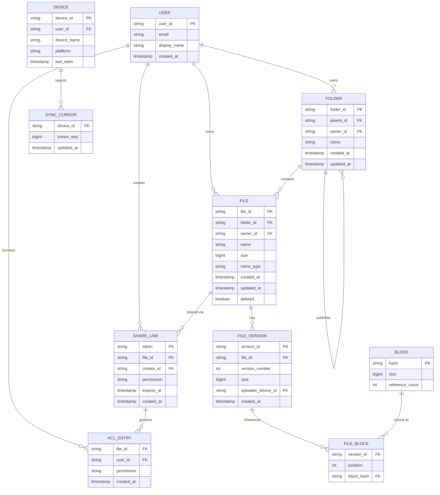

*The entity-relationship diagram of the file storage domain model: users own folders and files; folders form a tree (`parent_id` self-reference); files have many immutable versions; each version is a manifest of `FILE_BLOCK` rows that reference content-addressed `BLOCK` rows (deduplicated by `hash`); sharing is modeled through `SHARE_LINK` (unguessable token) and per-user `ACL_ENTRY` rows; devices track a `SYNC_CURSOR` (sequence number) so the server can return only changes since the client's last sync.*

**Entity descriptions:**

* **USER:** Core identity. `user_id` (UUID for even key distribution), `email` (unique), `display_name`, `created_at`. Stored in PostgreSQL (source of truth) with hot profile data cached in Redis.
* **DEVICE:** Tracks each client installation (`device_id`, `user_id`, platform, last-seen). Used to route push notifications and associate uploaded blocks with a sync session.
* **FOLDER:** Namespace node. `folder_id`, `parent_id` (self-referential FK for the tree), `owner_id`, `name`, timestamps. The folder tree is materialized in the Metadata DB, sharded by `owner_id` hash.
* **FILE:** An entry in the namespace. `file_id`, `folder_id`, `owner_id`, `name`, `size`, `mime_type`, `updated_at`, `deleted` (soft-delete flag). Files are mutable in metadata (name, parent) but content is immutable per version.
* **FILE_VERSION:** An immutable snapshot of a file's content. `version_id`, `file_id`, `version_number` (monotonic), `size`, `uploader_device_id`, `created_at`. The version stores a manifest of `((position, block_hash))` pairs. Older versions are garbage-collected per retention policy.
* **BLOCK:** Content-addressed storage unit. `hash` (SHA-256, PK), `size`, `reference_count` (for safe garbage collection). Blocks are never mutated; a new hash = new block. Stored in S3; metadata (reference counts) in Postgres.
* **SHARE_LINK:** A shareable, unguessable token (128-bit random UUID). `token` (PK), `file_id`, `creator_id`, `permission` (read/edit), `expires_at`, `created_at`. Revoking = deleting the row.
* **ACL_ENTRY:** Explicit per-user permission override on a file/folder (`file_id`, `user_id`, `permission`). When no ACL row exists, access is determined by ownership or share-link token scope.
* **SYNC_CURSOR:** Per-device high-water mark (`device_id`, `cursor_seq`, `updated_at`). The Sync Gateway uses this to return an incremental delta of metadata changes since the client last synced.

**Indexes and constraints:**

* `USER.email` — UNIQUE index (login, no duplicates).
* `FOLDER(owner_id, parent_id)` — composite index for "list folder contents."
* `FILE(folder_id, deleted)` — index for paginated folder listing (exclude soft-deleted).
* `FILE_VERSION(file_id, version_number DESC)` — index for "get latest N versions."
* `FILE_BLOCK(version_id, position)` — composite PK for ordered block manifest reconstruction.
* `BLOCK(hash)` — primary key (content-addressed lookup, O(1)).
* `BLOCK(reference_count)` — index for garbage-collection sweeps.
* `SHARE_LINK(token)` — primary key / unique index for O(1) share lookup.
* `ACL_ENTRY(file_id, user_id)` — composite PK for permission checks.

**Partitioning / Sharding:**

* **USER:** Sharded by `user_id` hash (consistent hashing). Users on the same shard are stored together.
* **FILE / FOLDER:** Sharded by `owner_id` hash — all of a user's namespace lives on one shard for fast traversal.
* **FILE_VERSION / FILE_BLOCK:** Sharded by `file_id` hash — all versions of a file co-located.
* **BLOCK metadata:** Global (hash-based, no hot key). Block *data* is in S3 (regional, multi-region replication).
* **ACL_ENTRY / SHARE_LINK:** Sharded by `file_id` hash — co-located with the file's version data.

**API Contract:**

| Method | Endpoint | Purpose | Rate Limit |
|---|---|---|---|
| POST | `/api/v1/files` | Create file / request upload session | 10,000 req/hour |
| GET | `/api/v1/files/{fileId}` | Get file metadata + versions | 60,000 req/hour |
| GET | `/api/v1/files/{fileId}/download` | Download / assemble file content | 60,000 req/hour |
| POST | `/api/v1/blocks/upload` | Upload a content-addressed block | 50,000 req/hour |
| GET | `/api/v1/blocks/{hash}` | Download a block | 100,000 req/hour |
| POST | `/api/v1/delta` | Get metadata changes since cursor | 5,000 req/hour |
| POST | `/api/v1/files/{fileId}/share` | Create a share link | 5,000 req/hour |
| GET | `/api/v1/shares/{token}` | Resolve a share link | 10,000 req/hour |
| POST | `/api/v1/files/{fileId}/versions` | List version history | 5,000 req/hour |

**POST `/api/v1/files` — Request (create file / upload session):**

```http
POST /api/v1/files HTTP/1.1
Authorization: Bearer <jwt>
Content-Type: application/json

{
  "name": "quarterly_report.pdf",
  "parent_id": "fld_abc123",
  "size": 10485760,
  "mime_type": "application/pdf"
}
```

**POST `/api/v1/files` — Response (upload session with per-chunk presigned URLs):**

```json
{
  "file_id": "f_9d8e7f",
  "upload_session_id": "us_1a2b3c",
  "block_hashes": ["a1b2...", "c3d4..."],
  "presigned_urls": [
    "https://s3.amazonaws.com/bucket/a1b2...?X-Amz-...",
    "https://s3.amazonaws.com/bucket/c3d4...?X-Amz-..."
  ]
}
```

**GET `/api/v1/delta` — Request (incremental metadata sync):**

```http
POST /api/v1/delta HTTP/1.1
Authorization: Bearer <jwt>
Content-Type: application/json

{
  "cursor": "seq_1718600000",
  "limit": 1000
}
```

**GET `/api/v1/delta` — Response:**

```json
{
  "entries": [
    {"file_id": "f_9d8e7f", "name": "quarterly_report.pdf", "size": 10485760, "updated_at": "2024-06-16T10:30:00Z", "op": "modified"},
    {"file_id": "f_112233", "op": "deleted"}
  ],
  "has_more": false,
  "new_cursor": "seq_1718600120"
}
```

**POST `/api/v1/files/{fileId}/share` — Request:**

```http
POST /api/v1/files/f_9d8e7f/share HTTP/1.1
Authorization: Bearer <jwt>
Content-Type: application/json

{
  "permission": "edit",
  "expires_in_days": 30,
  "require_password": false
}
```

**POST `/api/v1/files/{fileId}/share` — Response:**

```json
{
  "share_url": "https://drive.example.com/s/7f3e9a1b-c4d2-4e8b-9f1a-2c3d4e5f6a7b",
  "token": "7f3e9a1b-c4d2-4e8b-9f1a-2c3d4e5f6a7b",
  "expires_at": "2024-07-16T10:30:00Z",
  "permission": "edit"
}
```

**Status codes:** `200` OK, `201` Created, `204` Deleted, `206` Partial content (range download), `400` Invalid request, `401` Auth required, `403` Forbidden, `404` Not found, `409` Conflict (version mismatch), `415` Unsupported media type, `429` Rate limited, `503` Temporarily unavailable.

**Authentication & Authorization:** OAuth 2.0 with JWT bearer tokens. Scope-based authorization: `files:read`, `files:write`, `shares:create`, `shares:manage`. ACL and share-link permission checks are enforced on every file operation by the Share Service and Metadata Service.


### Domain-Specific: Cloud File Storage and Sync Deep Dive

This section covers the core technical challenges unique to cloud file storage and sync: how the sync engine detects changes and propagates them, how delta sync minimizes bandwidth via content-defined chunking, how conflict resolution handles concurrent offline edits, how offline-first caching keeps users productive, how the storage backend stores content-addressed blocks, and how the metadata service orchestrates the namespace, versions, and ACLs.

#### Sync Engine

The sync engine is the heart of the system. It runs on each client device and is responsible for detecting local file changes, reconciling them with the server's view, and propagating updates to other devices without conflicts or data loss.

**Change detection:**

* **Filesystem watch:** The client uses platform-native filesystem watchers (`ReadDirectoryChangesW` on Windows, `FSEvents` on macOS, `inotify` on Linux, `FileObserver` on Android) to detect creates, modifies, deletes, and renames in real time. Events are batched and debounced (e.g., 100 ms coalescing window) to avoid a flurry of events during a single save.
* **Periodic scan fallback:** If the filesystem watcher drops events (happens on network drives or kernel bugs), a periodic full scan compares local `mtime`/`size` hashes against the cached state to catch missed changes.
* **Content change detection:** Before uploading, the client computes a quick hash (e.g., first 4 KB + file size) to skip unchanged files. Only files with new size or mismatched quick-hash are fully chunked.

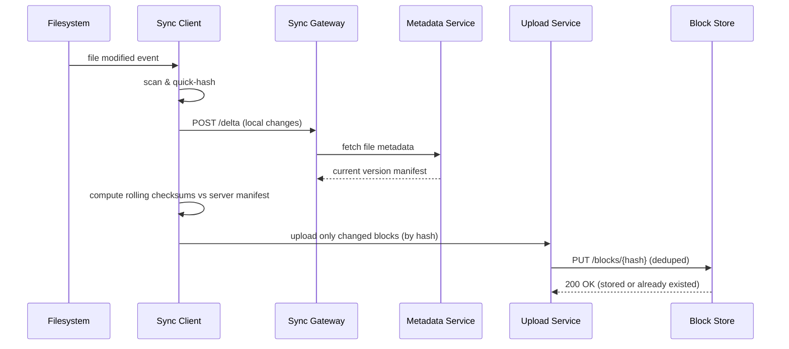

*The sync engine change-detection and upload flow: a filesystem event triggers a client-side scan and quick-hash comparison; the client exchanges metadata with the Sync Gateway, computes rolling checksums against the server's current block manifest, uploads only the changed (or missing) blocks to the Upload Service which writes them to the content-addressed Block Store — unchanged blocks are already present and skipped, achieving delta sync.*

**Reconciliation loop:**

1. **Fetch server state:** Client sends its sync cursor (`POST /delta` with `cursor`). Server returns entries changed since that cursor.
2. **Local assessment:** For each server change, the client checks if the file is open (locked) or modified locally (uncommitted). If local changes are uncommitted, sync is deferred.
3. **Download:** For new/remote changes, the client downloads missing blocks (via CDN or Block Store) and reassembles the file.
4. **Upload:** For local changes, the client uploads missing blocks and commits a new file version.
5. **Commit and advance cursor:** Once both directions are reconciled for this cycle, the client advances its cursor to the new server sequence number.

**Delta sync via content-defined chunking:**

* **What**: Instead of splitting a file at fixed 8 MB boundaries, use a rolling hash (Rabin-Karp) to find natural chunk boundaries based on content. Inserting data at the start of a file only shifts chunk boundaries locally — the rest of the file's chunks still match the previous version.
* **How it works**: The client reads the file in a sliding window (e.g., 48 bytes). It computes a Rabin fingerprint; when the fingerprint modulo a target (e.g., 2^18) equals a magic value, it cuts a chunk. Each chunk is hashed (SHA-256) and checked against the server. Only chunks whose hash is absent are uploaded. This is the algorithm behind Dropbox's "Rabin chunking" dedup.
* **Trade-off**: Rolling-hash computation is CPU-intensive (several hundred MB/s per core). For very large files, a hybrid approach uses fixed chunking for the fast path and falls back to content-defined chunking only when the file has been modified.

```java
@Service
public class RollingChunker {

    private static final int AVG_CHUNK_SIZE = 1 << 18; // 256 KiB target
    private static final int WINDOW_SIZE = 48;
    private static final long MASK = (1L << 18) - 1;

    /**
     * Split a byte stream into content-defined chunks using a Rabin-Karp
     * rolling hash. Returns a list of (offset, length) chunk boundaries.
     */
    public List<Chunk> chunk(InputStream input) throws IOException {
        var chunks = new ArrayList<Chunk>();
        var buffer = new byte[WINDOW_SIZE];
        var window = new ArrayDeque<Byte>();
        var pos = 0L;
        var chunkStart = 0L;
        var rollingHash = 0L;

        int b;
        while ((b = input.read()) != -1) {
            window.add((byte) b);
            rollingHash = (rollingHash * 257 + (b & 0xFF)) & 0xFFFFFFFFFFFFL;
            if (window.size() > WINDOW_SIZE) {
                rollingHash = adjust(rollingHash, window.removeFirst());
            }
            pos++;
            if (window.size() == WINDOW_SIZE && (rollingHash & MASK) == 0) {
                chunks.add(new Chunk(chunkStart, (int) (pos - chunkStart)));
                chunkStart = pos;
            }
        }
        if (pos > chunkStart) {
            chunks.add(new Chunk(chunkStart, (int) (pos - chunkStart)));
        }
        return chunks;
    }

    private long adjust(long hash, byte removed) {
        // Simplified rolling-hash update; full impl subtracts removed byte's contribution.
        return (hash - (removed & 0xFF) * pow(WINDOW_SIZE, 257)) * 257;
    }

    record Chunk(long offset, int length) {}
}
```

*The `RollingChunker` bean computes a Rabin-Karp rolling hash over a 48-byte sliding window. Whenever the hash's low 18 bits are zero (a content-defined boundary at ~256 KiB average spacing), it emits a chunk boundary. This means an insertion at the start of a 1 GB file only invalidates the first few chunks; the thousands of chunks further in keep their hashes and are skipped during upload — yielding dramatic bandwidth savings on large files like VM images or video projects.*

#### Conflict Resolution

When two devices edit the same file while offline (or two users collaborate on a binary file), the system must detect and resolve the conflict — and it must never silently discard a user's work.

**Detection:** After uploading blocks and committing a version, the client fetches the server's latest version. If the server has a newer version that was not the base of the client's edits (i.e., the client's "based-on" version != server's latest), a conflict is detected. For text-based files, the client can attempt a three-way merge using the common ancestor (the last-synced version) as the base.

```mermaid
flowchart TD
    A[Client commits new version] --> B{Server has newer version?}
    B -- No --> C[Accept - fast forward]
    B -- Yes --> D{Is based-on = server latest?}
    D -- Yes --> C
    D -- No --> E[Conflict detected]
    E --> F{Text file?}
    F -- Yes --> G[Three-way merge using ancestor]
    G --> H{Merge succeeds?}
    H -- Yes --> I[Auto-merge, commit merged version]
    H -- No --> J[Conflict copy]
    F -- No --> J
    J --> K[Save conflicted copy with suffix<br/>filename (conflicted copy DATE).ext]
```

*Conflict resolution decision tree: when a client commits a version that diverges from the server's latest, the system detects the conflict. For text files, it attempts a three-way merge using the last common ancestor as the base. If the merge is clean, it commits automatically; if not, or if the file is binary (images, documents, PSDs), it saves a "conflicted copy" with a descriptive suffix so neither version is lost.*

**Resolution strategies:**

1. **Strict superset:** If one version's block set is a strict superset of the other's (e.g., the newer version added a block that the older one didn't), use the superset version — the smaller one's data is already contained.
2. **Three-way merge (text files only):** Using the last-synced version as the common ancestor, compute the diff (ancestor → local) and (ancestor → remote) and merge. If regions don't overlap, merge cleanly. If they do overlap, mark as unmergeable.
3. **Conflict copy:** If auto-resolution is impossible (binary files, overlapping text edits), save the incoming version with a suffix like `report (conflicted copy 2024-06-14).docx`. Both the local version and the conflict copy are preserved; the user must manually merge and upload the resolved version.
4. **Last-writer-wins with tombstone:** For metadata-only conflicts (e.g., a rename on two devices), the server's version wins; the losing rename is applied as a no-op, and a tombstone records the discarded name to avoid re-introducing it.

**Trade-offs:** Auto-merge is limited to text files where a diff/merge algorithm is safe. Binary files (PDFs, images, PSDs, videos) cannot be safely auto-merged — conflict copies are the only data-safe option, at the cost of user-visible clutter. Some systems integrate with OS-native merge tools (e.g., Word's own merge for `.docx`) by invoking a registered handler.

#### Offline Access and Caching

Offline access is what makes cloud sync useful on planes, trains, and unreliable networks. The client must decide which files to cache locally and how to merge offline changes on reconnect.

**Cache tiers:**

* **Pinned files:** User explicitly marks files/folders as "available offline." These are always fully downloaded to local cache.
* **Frequently accessed:** Automatically cache files opened in the last 7 days. Heuristics: open count, time spent, file size (small files cached fully; large files cached as metadata-only placeholders).
* **Recently modified:** Cache files the user has been editing (high likelihood of continued edits).
* **Smart prefetch:** When a folder is opened, prefetch its immediate contents (not nested subfolders). Use read-ahead for sequential access patterns.

**Placeholder strategy (Files On-Demand):**

The client presents every file and folder in the filesystem namespace, but only downloads content on demand. A "placeholder" is a metadata-only stub (file name, size, hash, version) that displays in the filesystem without its bytes. Opening the placeholder triggers an on-demand download. This lets a user with 2 TB of cloud files see their entire directory tree on a 256 GB laptop.

```java
@Service
public class SmartCacheService {

    private static final long PLACEHOLDER = -1L;
    private final CachePolicy policy;
    private final LocalBlockCache localCache;

    /**
     * Resolve a file for access. Returns a stream of bytes — either from
     * local cache (if available) or by streaming from the CDN/Block Store.
     */
    public InputStream resolveFile(String fileId, String version) throws IOException {
        var localSize = localCache.snapshotSize(fileId, version);
        if (localSize != PLACEHOLDER) {
            // Hot: fully cached or partially cached — serve from local cache
            return localCache.openStream(fileId, version);
        }
        // Cold: stream on-demand from CDN with range requests
        var cdnUrl = cdnClient.presignedDownloadUrl(fileId, version);
        return HttpRangeInputStream.from(cdnUrl);
    }

    /**
     * Decide whether to prefetch a folder's contents based on the user's
     * access pattern (recently opened, shared with them, etc.).
     */
    public void prefetchIfHot(String folderId) {
        if (policy.isHot(folderId)) {
            var entries = metadataClient.listFolder(folderId);
            entries.stream()
                   .filter(e -> e.size() <= policy.maxPrefetchSize())
                   .forEach(e -> localCache.ensureCached(e.fileId(), e.version()));
        }
    }
}
```

*The `SmartCacheService` bean implements the Files-On-Demand pattern: `resolveFile` checks whether a file's blocks are locally cached (the common "hot" path) and serves from local disk, or falls back to streaming from the CDN for "cold" placeholders. `prefetchIfHot` proactively downloads small files in folders the access-pattern model has classified as hot. Cache size is bounded by an LRU policy with a configurable device quota.*

**Cache management:**

* **LRU eviction:** Each device enforces a cache size limit (e.g., 10 GB desktop, 1 GB mobile). Least-recently-used blocks are evicted first. Eviction metadata is persisted so the cache survives restarts.
* **Reference counting:** Blocks are evicted only when their reference count drops to zero (no file version points to them). This prevents evicting a block that another (older) version still needs for version history.
* **Resume tokens:** When the network drops mid-download, the client saves progress and resumes from the last completed chunk via HTTP range requests / multipart upload resume sessions.


#### Storage Backend: Content-Addressed Block Store

The block store is where the actual file bytes live. Blocks are immutable and content-addressed: the key IS the hash, so there is no "update" — only "put if absent."

**Block lifecycle:**

1. **Split:** The client (or an upload proxy) splits a file into chunks via fixed or content-defined chunking (see above), then optionally encrypts each block (client-side or server-side).
2. **Hash:** Each block is SHA-256 hashed. The hash is the block's identifier.
3. **Upload (dedup):** The client checks which hashes the server already has (batch `HEAD` or a "missing hashes" query). Only absent blocks are uploaded. This is the deduplication mechanism — 1,000 users uploading the same installer uploads 1 block, referenced 1,000 times.
4. **Commit manifest:** Once all blocks are present, the client POSTs a version manifest `(file_id, version_number, [block_hash × position])` to the Metadata Service. The metadata write is atomic.
5. **Garbage collection:** Blocks have a `reference_count`. When a version is deleted/garbage-collected, reference counts decrement; blocks reaching zero are scheduled for physical deletion (with a tombstone grace period to handle in-flight uploads).

**Storage backend choice:**

* **Object storage (S3 / GCS / Azure Blob):** Ideal for the block store. Content-addressed keys (`s3://bucket/{hash}`) are collision-free; S3 provides 11 9's durability, lifecycle policies (move old blocks to Glacier), and global replication. No hot keys because keys are evenly distributed by hash.
* **Regional vs. multi-region:** S3 Standard for hot blocks (recent versions); S3 Intelligent-Tiering for warm blocks; S3 Glacier Deep Archive for cold version history. Multi-region buckets (or Cross-Region Replication) ensure blocks are near every user for low-latency download.

```java
@Service
public class BlockStoreService {

    private final S3Client s3;
    private final MetadataRepository metadataRepo;
    private final MeterRegistry meterRegistry;

    private static final String BUCKET = "drive-blocks";

    /**
     * Upload missing blocks for a file version. Returns the manifest
     * (ordered list of block hashes). Idempotent — re-uploading the same
     * hash is a no-op, so retries are always safe.
     */
    @Timed(name = "blockstore.upload.seconds")
    public List<String> uploadVersion(String fileId, List<Block> blocks) {
        var present = metadataRepo.findExistingHashes(blocks.stream()
                .map(Block::hash).toList());
        var toUpload = blocks.stream()
                .filter(b -> !present.contains(b.hash()))
                .toList();

        toUpload.parallelStream().forEach(b -> {
            var key = blockKey(b.hash());
            s3.putObject(PutObjectRequest.builder().bucket(BUCKET).key(key).build(),
                    RequestBody.fromBytes(b.data()));
            meterRegistry.counter("blocks_uploaded_total").increment();
        });
        return blocks.stream().map(Block::hash).toList();
    }

    private String blockKey(String hash) {
        // Two-level prefix (first 4 hex chars) keeps S3 partitions balanced.
        return hash.substring(0, 2) + "/" + hash.substring(2, 4) + "/" + hash;
    }
}
```

*The `BlockStoreService` bean uploads only missing blocks (checked via the metadata repository's `findExistingHashes`) to S3. Block keys are two-level-prefixed (`ab/cd/abcdef...`) to spread objects across S3's partition space and avoid head-of-line contention. `parallelStream` uploads chunks concurrently for throughput. Uploads are idempotent by hash — a retry writes the same object, which S3 accepts at no extra storage cost — so the upload service can safely retry without coordination.*

**Download path:** The Download Service receives a `file_id + version`, fetches the manifest from the Metadata Service, resolves each block hash to a presigned S3 URL (or CDN-cached URL for hot blocks), and streams blocks in order to reassemble the file. Range requests (`Content-Range`) enable seeking within large files and on-demand streaming before the full file downloads.

#### Metadata Service

The Metadata Service is the system of record for the namespace (folders/files), versions, ACLs, share links, and sync cursors. It is a thin, high-throughput service backed by a sharded PostgreSQL cluster.

**Design:**

* **Sharding:** Metadata is sharded by `owner_id` hash (consistent hashing ring). Each shard owns all namespace, versions, and cursors for a subset of users. This colocates a user's entire file tree on one shard for fast traversal.
* **Leader + replicas:** Each shard has one PostgreSQL leader (for writes) and N read replicas (for Feed API-style listing queries). Writes go to the leader; reads are served from replicas with bounded staleness.
* **Transactions:** File creation, version commit, and cursor advance happen in a single DB transaction so metadata never diverges from committed blocks. The block upload to S3 happens *before* the metadata commit (the manifest only references blocks the server confirms exist).
* **Caching:** Hot metadata (active users' folder listings, share-link lookups) is cached in Redis with a short TTL (30 s). Cache invalidation happens on write via a "cache-buster" entry.

```java
@Service
@Transactional
public class MetadataService {

    private final MetadataRepository metadataRepo;
    private final BlockStoreService blockStore;
    private final Cache<String, Object> metadataCache;

    /**
     * Commit a new file version. All blocks must already be in the block store
     * (verified by the manifest). Atomic transaction ensures the version is
     * not visible until all blocks are durably referenced.
     */
    public FileVersion commitVersion(String fileId, List<String> blockHashes) {
        var file = metadataRepo.findFile(fileId);
        var version = FileVersion.builder()
                .fileId(fileId)
                .versionNumber(file.getNextVersionNumber())
                .blockHashes(blockHashes)
                .size(computeSize(blockHashes))
                .createdAt(Instant.now())
                .build();

        metadataRepo.save(version);
        file.incrementVersion();
        metadataRepo.save(file);

        // Invalidate cached folder listing so other clients see the update
        metadataCache.invalidate("folder:" + file.getParentId());
        return version;
    }

    /**
     * Incremental delta: return all metadata changes (new versions, deletes,
     * ACLs) for a user since their cursor. Powers the sync protocol.
     */
    @Transactional(readOnly = true)
    public DeltaResponse getDelta(String userId, long sinceCursor, int limit) {
        var changes = metadataRepo.findChangesSince(userId, sinceCursor, limit);
        return DeltaResponse.builder()
                .entries(changes)
                .newCursor(metadataRepo.maxCursor())
                .hasMore(changes.size() == limit)
                .build();
    }
}
```

*The `MetadataService` bean enforces the two-phase commit invariant: blocks are uploaded to S3 *first*, then the version manifest is committed transactionally to PostgreSQL. `commitVersion` runs in a single `@Transactional` scope so a crash between block upload and manifest commit leaves only orphaned blocks (eventually GC'd), never a manifest pointing at a missing block. The `getDelta` method powers the incremental sync protocol by returning all metadata changes since the client's cursor.*

#### Sync Protocol

The client-server sync protocol is delta-based and cursor-driven, inspired by Dropbox's protocol but adapted for a microservices backend. The cursor is a monotonically increasing sequence number maintained by the Metadata Service.

1. **Handshake:** Client sends `client_state {cursor, device_id}`. Server responds with `server_state {changes_since, latest_cursor}`.
2. **Delta exchange:** Server sends a list of changed/added/deleted files (delta entries) since the client's cursor. Client sends its own changes (new/modified/deleted files) with their based-on versions.
3. **Block exchange:** For modified files, client and server negotiate which blocks to upload/download (block-hash comparison). Only missing or changed blocks transfer.
4. **Commit:** After all blocks transfer, client updates local metadata; server commits new versions and advances the global cursor.
5. **Notification:** Server pushes changes to other connected clients via the Notification Service (WebSocket or long-poll).

The cursor is a monotonically increasing sequence number that allows resuming interrupted syncs.

---

### Replication Strategies

Cloud file systems replicate data across multiple dimensions: within a region (for availability), across regions (for global latency), and across storage systems (for different access patterns).

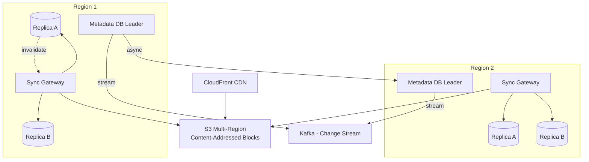

*Multi-region replication topology: each region has a PostgreSQL Metadata DB leader with two read replicas. Cross-region replication is asynchronous (log shipping / pglogical), so a write in us-east is visible in eu-west within ~2–5 seconds. The block store is a single S3 multi-region bucket (content-addressed, so there are no write conflicts — identical hashes converge automatically). A global CloudFront CDN caches hot blocks at the edge. Metadata change events stream to Kafka for downstream consumers (search indexing, analytics, async version GC).*

**Leader-based replication (Metadata DB):** File metadata writes go to the regional PostgreSQL primary, which streams WAL to read replicas. Writes are synchronous within the region (at least one replica ack) for durability; cross-region replication is asynchronous. This gives strong consistency for a user's own writes (within-region) while accepting a few-seconds lag for global visibility.

**Active-active content-addressed replication (Block Store):** Because blocks are keyed by content hash, there are no write conflicts. S3 multi-region buckets (or `gs://` multi-regional) replicate new objects globally within seconds. A block uploaded in Tokyo is immediately readable from São Paulo. No last-write-wins resolution is needed because the content is immutable.

**Real-world use:** PostgreSQL streaming replication + pglogical for metadata; S3 Cross-Region Replication for blocks; CloudFront or Cloudflare R2 with a global CDN for downloads; Kafka for the change-event stream.

---

### Failure Detection and Membership

The sync gateway fleet, metadata shards, and notification tier must detect failed nodes, redistribute work, and continue serving with minimal disruption.

**Gossip-based membership:** Sync gateway instances run a gossip protocol (via the service mesh or Consul) to share health state. Each gateway periodically pushes heartbeat health to random peers; suspicions propagate in O(log N) rounds. This keeps cluster membership without a single coordinator.

**Health checks:**

* **Liveness probes:** HTTP `/health` endpoint checked every 2 s by the orchestrator (Kubernetes). If unhealthy, the pod is restarted or drained.
* **Readiness probes:** Checks if the gateway can reach its Metadata DB shard and the block store. Not-ready gateways are removed from the load balancer.
* **Business health checks:** Custom checks like "Kafka consumer lag < 10,000" or "Metadata DB replica lag < 5 s."

**Failure detection timing for file storage:**

| Component | Check Interval | Timeout | Action |
|---|---|---|---|
| Sync Gateway | 2s | 6s | Drain connections; redirect to healthy region |
| Metadata DB (leader) | 1s | 5s | Promote a replica; redirect writes to standby |
| Metadata DB (replica) | 2s | 10s | Remove from load balancer; route reads to other replicas |
| Block Store (S3) | 30s | 60s | Fail over to second region bucket; cache misses |
| Notification Service | 5s | 15s | Reconnect WebSocket clients; buffer notifications |
| Kafka | 10s | 30s | Trigger consumer rebalancing |

**Circuit breakers:** When the Metadata DB becomes slow, the Sync Gateway wraps calls with a circuit breaker (Resilience4j). The breaker trips after N consecutive slow reads, short-circuiting to a cached/stale response and queuing writes for retry. This prevents a slow DB from cascading into a full gateway outage.

---

### High Availability and Scalability

A cloud file platform must remain available during node failures, network partitions, and regional outages while scaling to handle global traffic.

#### Multi-Region Deployment

Deploy active services in at least 3 regions (e.g., us-east, eu-west, ap-southeast). Users are routed to the nearest region via GeoDNS or a latency-based load balancer. Each region is self-sufficient for read and write operations, with asynchronous cross-region replication for durability.

* **Metadata DB:** Leader-based replication within a region (strong consistency); cross-region async replication (eventual consistency, ~2–5 s lag). A user in Europe writes to eu-west; a user in Asia sees the update ~5 s later.
* **Block Store:** S3 multi-region buckets — active-active, content-addressed, no conflicts. Users download blocks from the nearest edge via CDN.
* **Global CDN:** CloudFront edge locations cache hot blocks; sub-50 ms delivery globally. Upload traffic goes directly to regional S3 endpoints (presigned URLs bypass the gateway).

#### Auto-Scaling

* **Stateless services (API Gateway, Sync Gateway, Notification Service):** Horizontal scale based on CPU and request latency. Kubernetes HPA adjusts replica count automatically.
* **Stateful services (Metadata DB):** Scale by adding shards or read replicas. Each shard is a PostgreSQL instance; new shards are created by splitting the consistent-hash ring.
* **Block store:** S3 scales automatically (managed service); no operational scaling needed. CDN scales with traffic.
* **Notification/websocket fan-out:** Scale horizontally; connection state is shared via Redis so any instance can route to the right connection.

#### Graceful Degradation

When a component fails, the system should degrade rather than crash:

* **Metadata DB slow/unavailable:** Serve stale cached metadata from Redis (TTL 30–300 s). New writes are queued in Kafka for replay when the DB recovers.
* **Block store region down:** Fall back to another region's bucket (blocks are replicated globally). Downloads take a slightly longer path but still succeed.
* **CDN down:** Serve blocks directly from S3 (higher latency, but available).
* **Search service down:** File listing falls back to metadata DB queries (no text search); "search is temporarily unavailable" shown to users.
* **Notification service down:** Changes still sync on next poll; real-time push resumes when the service recovers.

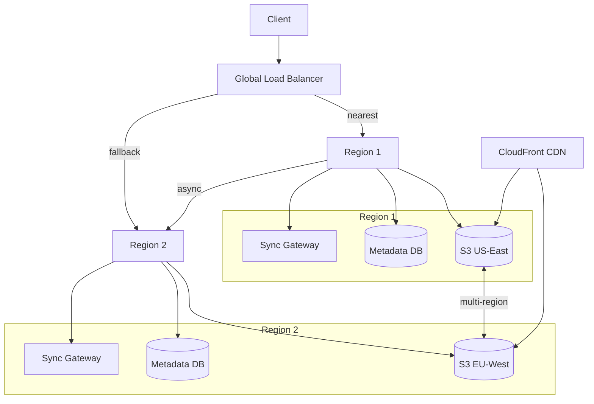

*Multi-region high availability: a global load balancer (GeoDNS) routes clients to their nearest region. Each region is self-sufficient with its own Sync Gateways, Metadata DB, and S3 bucket. S3 multi-region replication keeps blocks synchronized. A global CloudFront CDN caches hot blocks at the edge. If one region fails, the load balancer routes traffic to the other region; clients resume sync from their last cursor once connectivity is restored.*


### Performance and Optimization

The performance of a file sync platform is measured by sync latency (changes propagate to other devices within seconds), upload throughput (GB/min per user), and download latency (sub-100 ms for hot content from CDN).

#### Latency Optimization

* **Delta sync:** Block-level differencing means a 1-byte change in a 1 GB file uploads only the changed chunk (~256 KiB), not the full file. This is the single biggest latency/bandwidth win.
* **CDN for downloads:** Hot blocks are cached at CloudFront edge locations; downloads drop from seconds (cross-region S3) to ~50 ms.
* **Connection pooling:** Persistent HTTP/2 and gRPC connections between the Sync Gateway and the Metadata DB avoid per-request handshake overhead.
* **Batch metadata fetches:** When syncing a folder of 1,000 files, the client issues one `POST /delta` call (not 1,000 individual metadata requests).
* **Smart caching:** Hot files (recently opened, shared with the user) are pre-fetched; large folders return metadata first (placeholders), then content on demand.
* **Predictive sync:** Machine-learning models predict which files a user will open next (based on time-of-day, project context, shared-with-me) and pre-download them over idle bandwidth.

#### Throughput Optimization

* **Parallel block upload:** The client uploads chunks concurrently (8–16 parallel HTTP streams) to saturate the uplink. S3 multipart upload and presigned URLs make this cheap.
* **Connection brokering:** The gateway returns presigned S3 URLs so clients upload directly to object storage, bypassing the gateway entirely — the gateway only coordinates metadata.
* **Range-request streaming:** Downloads use HTTP `Content-Range` so a user can start reading a file before it's fully downloaded; seeking is O(1) block lookup.
* **Request coalescing (single-flight):** When multiple collaborators simultaneously request the same version of an unread-shared file, only one metadata+block fetch is issued and the result is shared across requests.
* **Bandwidth throttling:** Adaptive rate limiting (e.g., 50% of measured bandwidth) prevents sync from saturating the user's connection — important for users on metered or shared links.

#### Caching Strategies

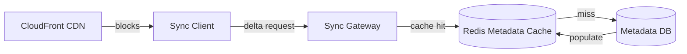

*Multi-tier caching: metadata (folder listings, ACLs, share links) is cached in Redis with a 30–300 s TTL; on a cache miss the gateway falls back to the PostgreSQL replica and repopulates the cache. File blocks are cached at the CDN edge for sub-50 ms delivery, with origin fetches only for cold content.*

#### Write Path Optimization

* **Direct-to-S3 upload:** Clients upload blocks directly to presigned S3 URLs, so the gateway never touches file bytes — this is why a file storage system can scale to millions of concurrent uploads without gateway bottlenecks.
* **Async metadata commit:** The block upload completes first (parallel, to S3); only then is the manifest committed to the Metadata DB in a single fast transaction. This keeps the "file is saved" latency low.
* **Version history on demand:** Old versions are stored in S3 Glacier and only restored (thawed) when a user explicitly requests them — keeping the hot-store small and fast.

**Real-world use:** Dropbox uses local-datastore SQLite for the client cache and content-defined chunking for dedup; Google Drive streams block uploads directly to Cloud Storage via resumable upload sessions; OneDrive's "Files On-Demand" serves placeholders and streams content from edge POPs.

---

### CAP Theorem and Consistency Trade-offs

The CAP theorem states that during a network partition, a distributed system can provide at most two of: Consistency, Availability, and Partition tolerance. Since file storage operates over unreliable networks, partition tolerance is always required.

#### Metadata DB — CP (Consistency + Partition Tolerance)

File metadata (filenames, folder structure, ACLs, version manifests) requires strong consistency: if the API returns 201 Created, the new version must be immediately visible and retrievable. The Metadata DB uses PostgreSQL leader-follower replication with synchronous commit within a region (ensuring a write is durable before acknowledgment). Cross-region replication is asynchronous (a few seconds of eventual consistency globally), which is acceptable because users are routed to their nearest region for writes.

#### Block Store — AP (Availability + Partition Tolerance)

Block storage prioritizes availability: if one S3 region is down, blocks are served from another region. Block content is immutable and content-addressed, so there are no write conflicts — the same hash in any region resolves to the same bytes. Brief staleness (a block not yet replicated to all regions) only delays a download by the cross-region replication lag (seconds). This trade is justified because block writes are idempotent and content-addressed.

#### Sync State — Eventual Consistency with Bounded Staleness

The sync protocol provides eventual consistency with a bounded staleness window. A change committed in us-east is visible to a client in ap-southeast within seconds (metadata cross-region replication lag + notification propagation). The system provides read-your-writes consistency for the user's own writes — when a user saves a file, they immediately see their new version in their own view; other users see it within seconds via push notification or next delta poll.

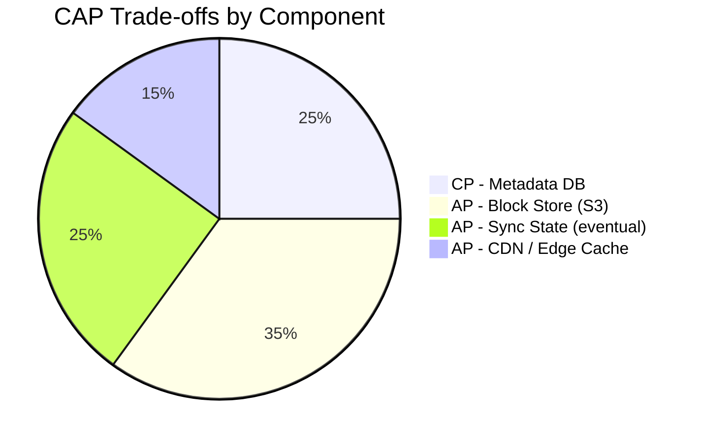

*CAP trade-offs across file storage components: the Metadata DB is CP (strong consistency within region for user writes); the Block Store is AP (availability-first; blocks are immutable and content-addressed, so no conflicts); sync state is AP with bounded staleness (a few seconds of eventual consistency across regions); the CDN edge cache is AP (may serve a stale version for its TTL, then refreshes).*

**Interview question:** *Is a file sync system strongly consistent or eventually consistent?*
**Answer:** It's a pragmatic split. File content (blocks) and metadata writes use strong consistency within a region for a user's own writes. Cross-region and across-device visibility is eventually consistent (bounded to a few seconds). This is the key insight: you can't have both instant global strong consistency and high availability for a 500-million-user system, so the system is strongly consistent for the writer and eventually consistent for collaborators — bounded staleness is the accepted trade-off.

---

### Encryption and Key Management

A file sync system stores sensitive user data — personal documents, work files, family photos, business contracts. Encryption must protect data at rest, in transit, and (for privacy offerings) during processing.

#### Encryption at Rest

**Block storage:** Object storage (S3, GCS) encrypts all objects with SSE-S3 (server-managed keys) or SSE-KMS (customer-managed keys) by default. For enhanced security, **server-side encryption with a customer-provided key (SSE-C)** lets the customer control the DEK while S3 manages key rotation.

**Metadata DB:** PostgreSQL uses TDE (Transparent Data Encryption) for the data files. For fields containing sensitive metadata (file names, share token hashes), application-level column encryption is applied so the DB operator cannot read plaintext.

**Client-side / end-to-end encryption:** For privacy-focused offerings, files are encrypted client-side with a key the server never sees. The server stores only encrypted blobs.

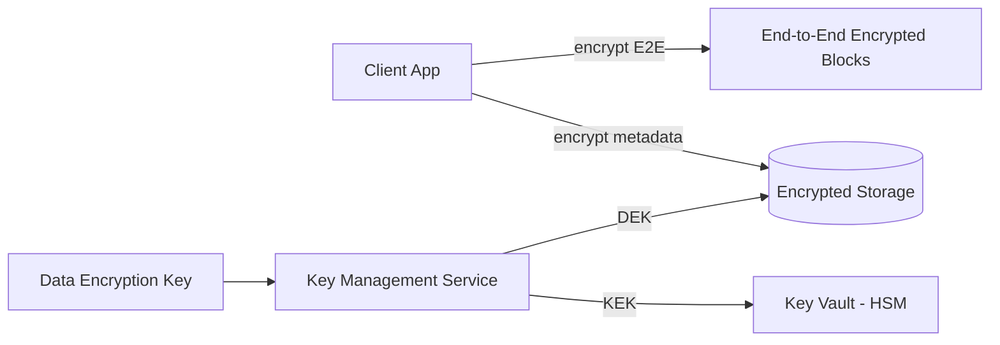

*Encryption at rest architecture: client-side end-to-end encryption protects file content (the server never holds the DEK in plaintext); server-side encryption at rest protects stored metadata using DEKs managed by a cloud KMS, with KEKs stored in an HSM-backed key vault.*

**Media encryption:** Uploaded blocks are encrypted with per-object DEKs before storage. For systems with server-side content scanning (AI moderation, virus scanning), the server decrypts the block in a secure, isolated environment for analysis but never retains plaintext on disk.

#### Encryption in Transit

All client-to-server and server-to-server traffic uses TLS 1.3 (minimum TLS 1.2). Inter-service communication within the data center uses mTLS (mutual TLS) for service-to-service authentication and encryption. Mobile and desktop SDKs pin the server certificate to prevent man-in-the-middle attacks.

#### Key Management

* **Key hierarchy:** A KEK (Key Encryption Key) in an HSM encrypts per-user or per-file DEKs (Data Encryption Keys). Rotating the KEK requires only re-encrypting the DEKs, not the data.
* **Key rotation:** KEKs rotated every 90 days; per-object DEKs rotated per upload (never reused). For E2E, message keys are derived per-user and rotated on key change events.
* **Multi-region KMS:** Keys are available in all deployment regions. Cloud KMS replicates keys automatically; on-prem deployments use HashiCorp Vault with integrated storage for multi-region HA.

**Java example — block encryption service as a Spring bean:**

```java
@Service
@RequiredArgsConstructor
public class BlockEncryptionService {

    @Value("${app.encryption.block-key-id}")
    private String keyId;

    private final AwsKms kmsClient;

    public EncryptedBlock encrypt(byte[] plaintext) {
        var dek = kmsClient.generateDataKey(keyId);
        var cipher = Cipher.getInstance("AES/GCM/NoPadding");
        cipher.init(Cipher.ENCRYPT_MODE,
                new SecretKeySpec(dek.plaintext(), "AES"),
                new GCMParameterSpec(128, dek.iv()));
        var ciphertext = cipher.doFinal(plaintext);
        return new EncryptedBlock(ciphertext, dek.encryptedKey(), dek.iv());
    }

    public byte[] decrypt(EncryptedBlock encrypted) {
        var dek = kmsClient.decrypt(encrypted.encryptedKey(), encrypted.iv());
        var cipher = Cipher.getInstance("AES/GCM/NoPadding");
        cipher.init(Cipher.DECRYPT_MODE,
                new SecretKeySpec(dek, "AES"),
                new GCMParameterSpec(128, encrypted.iv()));
        return cipher.doFinal(encrypted.ciphertext());
    }

    record EncryptedBlock(byte[] ciphertext, byte[] encryptedKey, byte[] iv) {}
}
```

*The `BlockEncryptionService` bean generates a per-object data encryption key (DEK) via AWS KMS, encrypts each file block with AES-GCM (which provides both confidentiality and integrity via the authentication tag), and stores the encrypted DEK alongside the ciphertext. The KMS-managed key ID is injected via `@Value`. The `decrypt` method uses the KMS `Decrypt` API to recover the plaintext DEK (guarded by KMS key policies) and reverses the AES-GCM operation, verifying the authentication tag to detect tampering.*


### Authentication and Authorization

A file sync system must verify who is connecting (authentication), determine what they can do (authorization), and enforce privacy controls (who can see and share whose files). Every request to every service must carry authenticated credentials.

#### Authentication Methods

* **OAuth 2.0 + JWT:** Users authenticate via a third-party provider (Google, Apple, Microsoft) or email/password. The Auth Service issues a short-lived JWT (15 min) and a refresh token (7 days). The JWT contains the user ID, scopes, and expiry.
* **Session tokens:** For web, a server-side session token in an HttpOnly, Secure, SameSite=Strict cookie. The session store (Redis) maps token → user_id and handles revocation.
* **MFA (Multi-Factor Authentication):** Required for admin actions and optionally for all users (especially those managing shared team folders). TOTP via authenticator app or SMS backup.
* **Certificate-based auth:** For service-to-service communication, mTLS certificates issued by a private CA. No shared secrets.

#### Authorization Models

* **Scope-based (OAuth 2.0 scopes):** Each token carries scopes like `files:read`, `files:write`, `shares:create`, `shares:manage`. The API Gateway enforces scope checks before routing.
* **Role-based (RBAC):** Users have roles (`user`, `admin`). Admins can manage billing and global settings; power users may get higher upload quotas.
* **Resource-level ACLs:** Each file/folder has an ACL (Access Control List) of `(user_id, permission)` entries. Permissions: `read`, `write`, `delete`, `share`, `owner`. Every read/write checks the ACL — not just the gateway.
* **Share-link permissions:** Share links have a scope (`read` or `edit`) independent of account-level ACLs. An editor on a share link cannot reshare or change the owner's ACL unless explicitly granted `share` permission.

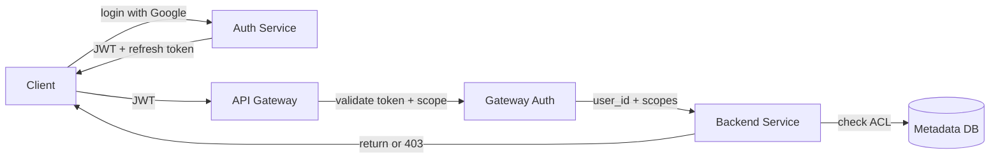

*Authentication and authorization flow: the client logs in via the Auth Service (Google SSO recommended), receives a JWT and refresh token; the API Gateway validates the JWT signature and checks scopes before forwarding to backend services; each service performs resource-level ACL checks against the Metadata DB before serving or modifying a file.*

**Java example — JWT validation filter:**

```java
@Component
@RequiredArgsConstructor
public class JwtAuthenticationFilter implements Filter {

    @Value("${app.auth.jwt-public-key}")
    private String publicKeyPem;

    private final UserDetailsService userDetailsService;

    @Override
    public void doFilter(ServletRequest request, ServletResponse response,
                         FilterChain chain) throws IOException, ServletException {
        var token = extractToken((HttpServletRequest) request);
        if (token != null && JwtUtils.isValid(token, publicKeyPem)) {
            var userId = JwtUtils.getUserId(token);
            var userDetails = userDetailsService.loadUserById(userId);
            var auth = new UsernamePasswordAuthenticationToken(
                    userDetails, null, userDetails.getAuthorities());
            SecurityContextHolder.getContext().setAuthentication(auth);
        }
        chain.doFilter(request, response);
    }
}
```

*The `JwtAuthenticationFilter` bean intercepts every HTTP request, extracts the bearer token, validates its signature against the public key (injected via `@Value` from a JWKS endpoint), loads the user details, and sets the Spring Security `Authentication` context. If the token is missing or invalid, the request proceeds unauthenticated (subsequent authorization annotations return 401).*

#### Authorization Example — Share Link ACL Check

```java
@Service
@RequiredArgsConstructor
public class AclService {

    private final MetadataRepository metadataRepository;

    /**
     * Authorize a file operation: the actor must either own the file,
     * have an ACL entry granting the required permission, or — for
     * share-link access — hold a valid token with matching scope.
     */
    @Transactional(readOnly = true)
    public boolean canAccess(String actorId, String fileId, Permission required,
                             String shareToken) {
        var file = metadataRepository.findFile(fileId);

        // Owner always has full access
        if (file.getOwnerId().equals(actorId)) {
            return true;
        }

        // Share-link access (anonymous via token)
        if (shareToken != null) {
            var link = metadataRepository.findShareLink(shareToken);
            if (link != null && link.getPermission().includes(required)
                    && (link.getExpiresAt() == null
                        || link.getExpiresAt().isAfter(Instant.now()))) {
                return true;
            }
        }

        // Explicit ACL entry
        return metadataRepository.findAcl(fileId, actorId)
                .filter(acl -> acl.getPermission().includes(required))
                .isPresent();
    }

    public enum Permission {
        READ, WRITE, DELETE, SHARE;

        public boolean includes(Permission required) {
            return this.ordinal() >= required.ordinal();
        }
    }
}
```

*The `AclService` bean enforces a three-tier authorization model: owners always have full access; anonymous users with a valid, unexpired share-link token gain the link's scoped permission (read or edit); everyone else relies on an explicit ACL entry checked against the required permission. The `Permission` enum is ordered so `SHARE` (highest) implies `WRITE`/`READ`, enabling a simple `includes` check. The share-link path is what lets a collaborator open a shared-file link without an account while still enforcing expiration.*

---

### Security Threats and Mitigations

#### Threat: Account Takeover

* **Risk:** An attacker uses stolen passwords, credential stuffing, or session hijacking to take over a user's account and access or modify all synced files.
* **Mitigation:** Enforce MFA for users with shared team folders. Rate-limit login attempts (5 per IP per hour). Use CAPTCHA after 3 failed attempts. Invalidate all sessions on password change. Monitor for anomalous login patterns (new device, new location, unusual time).

#### Threat: Share Link Brute Force

* **Risk:** An attacker attempts to guess share-link tokens (UUIDs) to access shared files they were never granted access to.
* **Mitigation:** Use 128-bit cryptographically random tokens (2^128 space makes brute force infeasible). Rate-limit per-IP and per-token lookups. Log repeated failed lookups and alert. Expire links by default (e.g., 30 days) and require rotation for long-lived shares.

#### Threat: Data Scraping

* **Risk:** Bots scrape public share links, shared folder listings, and profile data for competitive intelligence or to build targeted attacks.
* **Mitigation:** Per-API-key rate limiting (e.g., 1,000 requests/minute). Require authentication for all endpoints that return user data. Use a Bloom filter to cache recently requested share tokens and reject repeated misses from the same client.

#### Threat: DDoS on Hot Content

* **Risk:** A viral shared file generates DDoS-like traffic that overwhelms cache shards or origin servers.
* **Mitigation:** CDN caching for all block downloads. Rate limiting per IP and per user. Key splitting for counters (e.g., `file:456:views:0` through `file:456:views:99` with random shard selection). Circuit breakers on the Metadata Service to shed load when the DB is slow.

#### Threat: Ransomware

* **Risk:** A compromised synced client encrypts or deletes every file across all devices and versions, holding data hostage.
* **Mitigation:** Version history retains pre-attack snapshots for 30–180 days. Detect mass-delete/mass-encrypt patterns via anomaly detection on the change stream. Quarantine suspicious devices (block sync) when burst deletion thresholds are exceeded. Require MFA re-confirmation for bulk-delete operations. Provide an admin "panic button" to roll back a user's namespace to a pre-attack snapshot.

#### Threat: Data Exfiltration

* **Risk:** A user with edit access downloads or re-shares a sensitive file to external parties.
* **Mitigation:** Apply watermarking to downloaded documents. Use DLP (Data Loss Prevention) to scan for sensitive content (PII, credit-card numbers) in shared files. Log every download and share with an immutable audit trail. For E2E-encrypted files, the server cannot read content — sharing is done by re-encrypting the file key for the recipient (not the content).

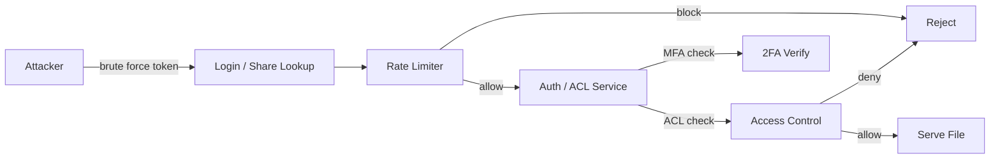

*Layered security for share access: an attacker attempts to brute-force a share-link token; the rate limiter blocks IPs exceeding the threshold; for legitimate users, the ACL/Share service requires MFA for sensitive operations and performs a per-file ACL check before serving content; denied requests are dropped, allowed requests are served.*

---

### Observability and Logging

A file sync platform generates massive telemetry from millions of devices and services. Observability must cover the sync pipeline, upload/download throughput, version history, sharing, and real-time delivery.

#### Key Metrics

* **Sync latency:** Time between a file commit on one device and the change being available on all other devices. Alert if p95 > 10 s.
* **Upload throughput:** MB/s per user, block upload success rate. Alert if success rate < 99.5%.
* **Download latency:** p50 < 20 ms (CDN), p99 < 100 ms. Track by region and cache tier.
* **Cache hit ratio:** Metadata cache hit ratio > 95% for active users. Block CDN hit ratio > 80%.
* **Change-detection lag:** Time between a filesystem event and the sync gateway processing it. Alert if > 30 s.
* **Share-link abuse:** Failed share-token lookups per second (brute-force indicator). Alert on spikes.
* **Error rates:** 5xx errors per service, S3 upload failures, PostgreSQL deadlocks, Kafka consumer errors.

#### Logging

* **Access logs:** Every API and block request logged with user ID, file ID, operation, response code, and latency. Used for audit trails and anomaly detection.
* **Sync event logs:** All file create/modify/delete/version-restore operations logged as structured events for analytics and ML feature generation.
* **Error logs:** Service errors with correlation IDs for cross-service tracing. Upload failures logged with block hash and device ID.
* **Audit logs:** All permission changes (ACL updates, share-link creation/revocation, ownership transfers), and admin actions logged with before/after state.

#### Distributed Tracing

Trace every client sync session across all services — from the Sync Gateway through Metadata Service, Upload/Download Service, Block Store, and Notification Service. Use OpenTelemetry with a trace context header (`traceparent`) propagated across service boundaries. Key spans to instrument: delta computation, block upload, manifest commit, ACL check, and push notification.

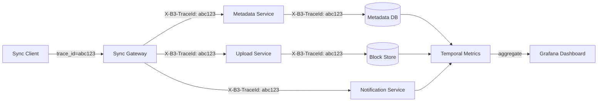

*Distributed tracing flow: each sync session carries a trace ID (e.g., `abc123`) propagated across all downstream calls — the Sync Gateway, Metadata Service (DB read), Upload Service (block put to S3), and Notification Service. These spans aggregate in a metrics backend and are visualized in Grafana dashboards, enabling end-to-end latency analysis of the full sync round-trip.*

#### Alerting Strategy

* **Critical (page immediately):** Sync latency p99 > 60 s for 5 minutes; Metadata DB unavailable; Kafka consumer down; block upload failure rate > 5%.
* **Warning (Slack, no page):** Metadata cache hit ratio < 85%; notification delivery rate < 95%; error rate > 1% for 10 minutes; share-brute-force spike > 1,000 failed lookups/minute.
* **Info (dashboard only):** Daily active users, storage growth trends, block-store GC backlog, top-shared files.

**Java example — sync latency metrics with Micrometer:**

```java
@Service
@RequiredArgsConstructor
public class InstrumentedSyncService {

    private final SyncGatewayClient gateway;
    private final MeterRegistry meterRegistry;

    public DeltaResponse sync(String deviceId, long cursor) {
        var timer = Timer.Sample.start(meterRegistry);
        try {
            var delta = gateway.computeDelta(deviceId, cursor);
            timer.stop(Timer.builder("sync.delta.latency")
                    .tag("device_platform", getPlatform(deviceId))
                    .tag("region", getRegion(deviceId))
                    .register(meterRegistry));

            Counter.builder("sync.requests")
                    .tag("region", getRegion(deviceId))
                    .register(meterRegistry).increment();

            return delta;
        } catch (Exception e) {
            Counter.builder("sync.errors")
                    .tag("error_type", e.getClass().getSimpleName())
                    .register(meterRegistry).increment();
            throw e;
        }
    }
}
```

*The `InstrumentedSyncService` bean uses Micrometer to record a timer (`sync.delta.latency`) tagged by device platform and region around the delta-computation call, plus a request counter and an error counter on failure. Tags let operators slice sync latency by platform (macOS vs. Windows vs. Android) and region (us-east vs. eu-west), making it easy to spot a platform-specific regression or a regional Metadata DB slowdown.*

---

### Real-World Implementations

File sync platforms combine open-source and managed systems, each chosen for its strengths in a particular layer of the stack.

#### S3 / Google Cloud Storage

Used for: the content-addressed block store. S3's unlimited scalability, 11 9's durability, lifecycle policies (Standard → Intelligent-Tiering → Glacier), and Cross-Region Replication make it the natural choice for immutable file blocks. Direct-to-S3 uploads via presigned URLs bypass application servers entirely, so the upload path scales to millions of concurrent streams. Multi-part upload handles files up to 5 TB.

**Companies:** Dropbox, Google Drive, Microsoft OneDrive, Box, every cloud-native file platform.

#### PostgreSQL (sharded)

Used for: user accounts, file/folder metadata, ACLs, share links, version manifests, and sync cursors. PostgreSQL's strong consistency, ACID transactions, and rich indexing make it ideal for the namespace and permissions data that must never be lost or corrupted. For scale, the metadata DB is sharded by `user_id` / `owner_id` hash across many PostgreSQL instances (or via Citus for automatic sharding).

**Companies:** Dropbox (before migrating parts to custom storage), Notion, Slack, Airtable.

#### Redis

Used for: metadata hot-cache (active users' folder listings and ACLs), share-link lookups, session tokens, rate-limit counters, and unread change counts. Redis' sub-millisecond latency and TTL support make it ideal for the read-hot metadata that would otherwise hit Postgres on every request. Redis Cluster provides sharding.

**Companies:** Dropbox (notification state), Google Drive (share-link resolution), OneDrive (session cache).

#### Kafka

Used for: the change event stream carrying `file_created`, `file_modified`, `file_deleted`, `version_committed`, `share_created` events. Kafka's partitioning by `file_id` / `user_id` ensures event ordering per entity while enabling parallel processing. The retention policy (7 days) allows reprocessing for new features (e.g., backfilling a new search index).

**Companies:** LinkedIn (originally developed Kafka), Uber, Spotify, and increasingly file platforms for analytics and async workflows.

#### Elasticsearch

Used for: file and folder search, content discovery, and "shared with me" views. Elasticsearch indexes are updated from Kafka events, providing near-real-time search. Fuzzy matching, prefix matching, and aggregations power typeahead and autocomplete.

**Companies:** Dropbox (Smart Sync search), Google Drive (search backend), Notion, Confluence.

#### Content Delivery Network (CDN)

Used for: caching hot file blocks and rendered previews at the edge. CloudFront, Cloudflare, or Akamai edge POPs bring downloads from seconds (cross-region object storage) to ~50 ms. For collaborative document previews, the CDN also caches rendered snapshots.

**Companies:** All major platforms; Google Drive uses Google's global edge cache, Dropbox uses CloudFront + its own edge network.

#### DynamoDB / Cassandra

Used for: share-link token resolution (low-latency O(1) by token), live collaboration presence (who's online editing), and real-time counters (live viewer counts, download counts). DynamoDB's single-digit-millisecond latency and serverless scaling handle unpredictable traffic spikes (e.g., a shared file going viral).

**Companies:** Some startups on AWS; Google uses Spanner for similar low-latency serving.

#### Tresorit / Sync.com (End-to-End Encryption Model)

Used for: client-side encryption offerings. The server stores only encrypted blocks and encrypted file names. The client derives a file key from the user's password (PBKDF2/Argon2) and encrypts before upload. Sharing is done by re-encrypting the file key for each recipient (never decrypting server-side). This is the strongest privacy model but sacrifices server-side dedup and search.


### Java and Spring Boot Implementation Guide

This section demonstrates how to build a Spring Boot service for a cloud file storage backend, showcasing key Spring Boot features: records for DTOs, `@Valid`, `@Entity` with `@Version`, `@Repository` (Spring Data JPA), `@Service` with `@Transactional`, `@RestController`, `@ControllerAdvice`, constructor injection (`@RequiredArgsConstructor`), `@Value`, `BigDecimal`, and `MeterRegistry`.

#### 1. DTO Records

Records provide immutable, concise data carriers for request/response payloads.

```java
public record CreateFileRequest(
        @NotBlank String name,
        @NotBlank String parentId,
        @NotNull long size,
        @NotBlank String mimeType) {}

public record FileResponse(
        String fileId,
        String name,
        String ownerId,
        String parentId,
        long size,
        String mimeType,
        Instant createdAt,
        Instant updatedAt,
        List<VersionInfo> versions,
        List<String> blockHashes) {}

public record VersionInfo(
        String versionId,
        int versionNumber,
        long size,
        Instant createdAt) {}

public record ShareLinkResponse(
        String shareUrl,
        String token,
        String permission,
        Instant expiresAt) {}

public record DeltaEntry(
        String fileId,
        String name,
        String op,
        long size,
        Instant updatedAt) {}

public record DeltaResponse(
        List<DeltaEntry> entries,
        String newCursor,
        boolean hasMore) {}
```

*Six record types form the API contract: `CreateFileRequest` is the POST body with `@NotBlank`/`@NotNull` validation (enforced by `@Valid`); `FileResponse` returns enriched file metadata with versions and block hashes; `VersionInfo` summarizes each stored version; `ShareLinkResponse` returns the created link, token, and expiry; `DeltaEntry` and `DeltaResponse` power the incremental sync delta endpoint. Records are immutable and ideal for thread-safe request/response objects.*

#### 2. Entity with Optimistic Locking

The `FileMetadata` entity uses `@Version` for optimistic locking to prevent lost updates when concurrent clients modify the same file's metadata (name, parent, version).

```java
@Entity
@Table(name = "files", indexes = {
        @Index(name = "idx_owner_parent", columnList = "ownerId,parentId"),
        @Index(name = "idx_parent_deleted", columnList = "parentId,deleted")
})
public class FileMetadata {

    @Id
    private String fileId;

    private String ownerId;
    private String parentId;
    private String name;
    private String mimeType;

    private long size;
    private boolean deleted = false;

    @Version
    private Long version;

    @CreationTimestamp
    private Instant createdAt;
    @UpdateTimestamp
    private Instant updatedAt;

    // Constructors, getters, setters omitted for brevity

    public void rename(String newName) {
        this.name = newName;
    }

    public void move(String newParentId) {
        this.parentId = newParentId;
    }

    public void markDeleted() {
        this.deleted = true;
    }
}
```

*The `FileMetadata` entity maps to the `files` table with composite indexes for namespace traversal (`ownerId,parentId` for "list a user's folder"; `parentId,deleted` for paginated folder listing excluding soft-deletes). The `@Version` field enables JPA optimistic locking — concurrent metadata updates (e.g., simultaneous renames or moves) on the same file cause the second committer to fail with `OptimisticLockException`, preventing lost writes. `@CreationTimestamp`/`@UpdateTimestamp` auto-manage audit timestamps.*

#### 3. Repository Layer

The `@Repository` layer provides persistence with Spring Data JPA, plus custom queries for the sync and share flows.

```java
@Repository
public interface FileMetadataRepository extends JpaRepository<FileMetadata, String> {

    @Query("SELECT f FROM FileMetadata f WHERE f.parentId = :parentId " +
           "AND f.deleted = false ORDER BY f.name")
    List<FileMetadata> listChildren(@Param("parentId") String parentId, Pageable pageable);

    @Query("SELECT f FROM FileMetadata f WHERE f.ownerId = :ownerId " +
           "AND f.updatedAt > :since ORDER BY f.updatedAt")
    List<FileMetadata> findChangesSince(@Param("ownerId") String ownerId,
                                        @Param("since") Instant since,
                                        Pageable pageable);

    @Query("SELECT v FROM FileVersion v WHERE v.fileId = :fileId ORDER BY v.versionNumber DESC")
    List<FileVersion> findVersions(@Param("fileId") String fileId);
}

@Repository
public interface ShareLinkRepository extends JpaRepository<ShareLink, String> {

    @Query("SELECT s FROM ShareLink s WHERE s.token = :token " +
           "AND (s.expiresAt IS NULL OR s.expiresAt > :now)")
    Optional<ShareLink> findValidToken(@Param("token") String token, @Param("now") Instant now);
}

@Repository
public interface AclEntryRepository extends JpaRepository<AclEntry, AclEntryId> {

    @Query("SELECT a.permission FROM AclEntry a " +
           "WHERE a.fileId = :fileId AND a.userId = :userId")
    Optional<String> findPermission(@Param("fileId") String fileId,
                                    @Param("userId") String userId);
}
```

*The repository interfaces extend `JpaRepository` and define the queries the sync and share flows need: `listChildren` for folder listing (excluding soft-deleted), `findChangesSince` for the delta endpoint (the engine of incremental sync), `findVersions` for version history, `findValidToken` for share-link resolution (with expiry enforcement at the DB level), and `findPermission` for ACL checks.*

#### 4. Service Layer with the Fan-out / Delta Pipeline

Services encapsulate business logic, transactions, and the version/delta workflow.

```java
@Service
@RequiredArgsConstructor
@Transactional
public class SyncService {

    private final FileMetadataRepository metadataRepository;
    private final FileVersionRepository versionRepository;
    private final BlockStoreService blockStoreService;
    private final NotificationService notificationService;
    private final MeterRegistry meterRegistry;

    @Value("${app.sync.max-versions-per-file:100}")
    private int maxVersions;

    /**
     * Commit a new file version: verify all blocks are present in the store,
     * then atomically save the version manifest and advance the file cursor.
     */
    public FileVersion commitVersion(String fileId, List<String> blockHashes) {
        var timer = Timer.Sample.start(meterRegistry);
        try {
            var file = metadataRepository.findById(fileId)
                    .orElseThrow(() -> new FileNotFoundException(fileId));

            // Verify every block already exists (two-phase: upload first)
            var missing = blockStoreService.findMissingBlocks(blockHashes);
            if (!missing.isEmpty()) {
                throw new IllegalStateException(
                        "Missing blocks: " + missing.size() +
                        " — upload them before committing the manifest");
            }

            var version = FileVersion.builder()
                    .fileId(fileId)
                    .versionNumber(nextVersionNumber(fileId))
                    .blockHashes(blockHashes)
                    .size(computeSize(blockHashes))
                    .createdAt(Instant.now())
                    .build();
            versionRepository.save(version);

            // Enforce version retention (GC old versions)
            pruneOldVersions(fileId, maxVersions);

            timer.stop(Timer.builder("sync.commit_version.seconds")
                    .register(meterRegistry));
            notificationService.notifyChange(file.getOwnerId(), fileId, "modified");
            return version;
        } catch (Exception e) {
            timer.stop(Timer.builder("sync.commit_version.errors")
                    .tag("error", e.getClass().getSimpleName())
                    .register(meterRegistry));
            throw e;
        }
    }

    @Transactional(readOnly = true)
    public DeltaResponse computeDelta(String userId, Instant sinceCursor, int limit) {
        var changes = metadataRepository.findChangesSince(userId, sinceCursor,
                PageRequest.of(0, limit));
        return new DeltaResponse(
                changes.stream().map(this::toDeltaEntry).toList(),
                CursorEncoder.encode(Instant.now()),
                changes.size() == limit);
    }

    private void pruneOldVersions(String fileId, int keep) {
        var versions = versionRepository.findVersions(fileId);
        if (versions.size() > keep) {
            versions.stream().skip(keep)
                    .forEach(versionRepository::delete);
        }
    }
}
```

*The `SyncService` bean implements the critical two-phase commit invariant: `commitVersion` first verifies all blocks already exist in the block store (the client uploads blocks before committing the manifest), then atomically saves the version row and advances the file's version cursor within a single `@Transactional` scope. `computeDelta` powers the incremental sync endpoint, returning only files changed since the client's cursor. `pruneOldVersions` enforces the retention policy (default 100 versions). Micrometer timers measure commit latency and errors. The `NotificationService` is called *after* commit to push the change to other devices — if it fails, the change is still durable and will be picked up on the next delta poll.*

#### 5. REST Controller with Validation

```java
@RestController
@RequestMapping("/api/v1/files")
@RequiredArgsConstructor
public class FileController {

    private final SyncService syncService;
    private final ShareService shareService;
    private final AclService aclService;
    private final BlockUploadService blockUploadService;

    @PostMapping
    public ResponseEntity<FileResponse> createFile(
            @AuthenticationPrincipal UserDetails user,
            @Valid @RequestBody CreateFileRequest request) {
        var response = syncService.createFile(user.getUsername(), request);
        return ResponseEntity.status(HttpStatus.CREATED).body(response);
    }

    @PostMapping("/{fileId}/versions")
    public ResponseEntity<FileVersion> commitVersion(
            @AuthenticationPrincipal UserDetails user,
            @PathVariable String fileId,
            @RequestBody CommitVersionRequest request) {
        if (!aclService.canAccess(user.getUsername(), fileId, Permission.WRITE, null)) {
            throw new ForbiddenException(fileId);
        }
        var version = syncService.commitVersion(fileId, request.blockHashes());
        return ResponseEntity.ok(version);
    }

    @PostMapping("/delta")
    public ResponseEntity<DeltaResponse> getDelta(
            @AuthenticationPrincipal UserDetails user,
            @RequestBody(required = false) DeltaRequest request) {
        var cursor = request == null ? Instant.MIN : request.cursor();
        var response = syncService.computeDelta(user.getUsername(), cursor, 1000);
        return ResponseEntity.ok(response);
    }

    @PostMapping("/{fileId}/share")
    public ResponseEntity<ShareLinkResponse> createShareLink(
            @AuthenticationPrincipal UserDetails user,
            @PathVariable String fileId,
            @Valid @RequestBody CreateShareRequest request) {
        var response = shareService.createShareLink(fileId, request);
        return ResponseEntity.status(HttpStatus.CREATED).body(response);
    }

    @PostMapping("/blocks/upload")
    public ResponseEntity<Void> uploadBlock(
            @AuthenticationPrincipal UserDetails user,
            @RequestParam String hash,
            @RequestBody byte[] data) {
        blockUploadService.putBlockIfNotPresent(hash, data);
        return ResponseEntity.ok().build();
    }
}
```

*The `FileController` uses `@RestController` to combine `@Controller` and `@ResponseBody`. The `@Valid` annotation on `CreateFileRequest` and `CreateShareRequest` triggers bean validation (enforcing `@NotBlank`/`@NotNull`). `@AuthenticationPrincipal` injects the authenticated user. Constructor injection via `@RequiredArgsConstructor` makes dependencies explicit and non-nullable. The commit-version endpoint enforces ACL checks before accepting a new version — an editor can commit; a reader-only gets 403. Block upload is idempotent (puts only if absent). The delta endpoint defaults to `Instant.MIN` (full sync) when no cursor is supplied.*

#### 6. Controller Advice for Global Error Handling

```java
@ControllerAdvice
public class GlobalExceptionHandler {

    @ExceptionHandler(FileNotFoundException.class)
    public ResponseEntity<ApiError> handleNotFound(FileNotFoundException ex) {
        var error = new ApiError(HttpStatus.NOT_FOUND, ex.getMessage());
        return ResponseEntity.status(HttpStatus.NOT_FOUND).body(error);
    }

    @ExceptionHandler(ForbiddenException.class)
    public ResponseEntity<ApiError> handleForbidden(ForbiddenException ex) {
        var error = new ApiError(HttpStatus.FORBIDDEN, ex.getMessage());
        return ResponseEntity.status(HttpStatus.FORBIDDEN).body(error);
    }

    @ExceptionHandler(MethodArgumentNotValidException.class)
    public ResponseEntity<ApiError> handleValidation(MethodArgumentNotValidException ex) {
        var messages = ex.getBindingResult().getFieldErrors().stream()
                .map(FieldError::getDefaultMessage)
                .toList();
        var error = new ApiError(HttpStatus.BAD_REQUEST,
                "Validation failed: " + String.join(", ", messages));
        return ResponseEntity.badRequest().body(error);
    }

    @ExceptionHandler(OptimisticLockException.class)
    public ResponseEntity<ApiError> handleConflict(OptimisticLockException ex) {
        var error = new ApiError(HttpStatus.CONFLICT,
                "Concurrent modification detected. Please retry.");
        return ResponseEntity.status(HttpStatus.CONFLICT).body(error);
    }

    public record ApiError(HttpStatus status, String message) {}
}
```

*The `GlobalExceptionHandler` bean (annotated `@ControllerAdvice`) catches exceptions thrown by any `@RestController` and returns structured `ApiError` responses. It handles `FileNotFoundException` (404), `ForbiddenException` (403), `MethodArgumentNotValidException` (400 with field-level messages from `@Valid`), and `OptimisticLockException` (409 Conflict — which occurs when `@Version` detects a concurrent write). This avoids repetitive try-catch blocks in controllers.*

#### 7. Share Service with Token Generation

Share links use cryptographically random, unguessable tokens. This bean creates and validates them.

```java
@Service
@RequiredArgsConstructor
public class ShareService {

    private final ShareLinkRepository shareLinkRepository;
    private final FileMetadataRepository metadataRepository;
    private final SecureRandom secureRandom = new SecureRandom();

    @Value("${app.share.token-bytes:32}")
    private int tokenBytes;

    public ShareLinkResponse createShareLink(String fileId, CreateShareRequest request) {
        var token = Base64.getUrlEncoder().withoutPadding()
                .encodeToString(secureRandom.generateSeed(tokenBytes));

        var shareLink = ShareLink.builder()
                .token(token)
                .fileId(fileId)
                .creatorId(request.requesterId())
                .permission(request.permission())
                .expiresAt(request.expiresInDays() != null
                        ? Instant.now().plus(request.expiresInDays(), DAYS)
                        : null)
                .createdAt(Instant.now())
                .build();

        shareLinkRepository.save(shareLink);
        return new ShareLinkResponse(
                "https://drive.example.com/s/" + token,
                token,
                request.permission(),
                shareLink.getExpiresAt());
    }

    @Transactional(readOnly = true)
    public boolean validateToken(String token, Permission required) {
        return shareLinkRepository.findValidToken(token, Instant.now())
                .map(link -> link.getPermission().includes(required))
                .orElse(false);
    }

    public record CreateShareRequest(String requesterId,
                                     String permission,
                                     Integer expiresInDays) {}
}
```

*The `ShareService` bean generates 256-bit cryptographically random tokens (32 bytes) using `SecureRandom`, encodes them URL-safe Base64, and persists them with the file ID, creator, permission scope, and optional expiry. `validateToken` enforces both token validity and expiry at the database level (the `findValidToken` query filters out expired links), so a leaked or expired token cannot be used. The ordered `Permission.includes` check ensures an `EDIT` link satisfies a `READ` requirement but not vice-versa.*


### Interview Questions and Answers

A curated set of interview questions organized by difficulty, focused on cloud file storage and sync system design.

**Beginner**

1. **How does file synchronization work?**
   **A:** The client watches the local filesystem for changes. When a file changes, the client splits it into blocks, computes SHA-256 hashes, and checks which blocks the server already has (via metadata exchange). Only missing blocks are uploaded. The server stores blocks content-addressed (deduplicated). When other clients sync, they download only changed blocks and reassemble. This is how Dropbox, Google Drive, and OneDrive work.

2. **What is delta sync?**
   **A:** Delta sync means syncing only the parts of a file that changed, not the entire file. When a 1 GB file has 5 MB changed, delta sync uploads only those 5 MB of changes (plus metadata), not the full 1 GB. This is achieved through block-level differencing: the client and server compare block hashes; only blocks with different hashes are transferred.

3. **How does deduplication work?**
   **A:** Files are split into blocks, each block is hashed (SHA-256). If two files share identical blocks (common in software installers, documents, photos), the blocks are stored once and referenced by hash. The file metadata stores a list of block hashes (a manifest). When you request a file, the system fetches all blocks by hash and reassembles them. This can reduce storage by 10-50x for shared content.

4. **How do you handle conflicts when the same file is edited on two devices while offline?**
   **A:** The system detects the conflict by comparing the block hash lists (or version based-on values) of both versions. If they differ, a conflict exists. For text files, the system attempts a three-way merge using the last-synced version as the common ancestor. For binary files (images, documents, PSDs), auto-merge is unsafe — the system saves a "conflict copy" with a suffix like `filename (conflicted copy 2024-06-14).ext`. The user must manually merge. The system never silently overwrites one side.

**Intermediate**

5. **How would you handle a 100 GB file upload with resume capability?**
   **A:** Use chunked/multipart upload with HTTP range requests. The file is split into chunks (e.g., 100 MB each), each with a unique chunk number. The client sends chunks sequentially (or in parallel). The server tracks which chunks have been received (via a server-side upload session). If the upload is interrupted, the client queries the server for received chunk ranges and resumes from the last missing chunk. HTTP `Content-Range` header identifies each chunk. S3 multipart upload and Google Cloud Storage resumable upload handle this natively.

6. **How do you decide which files to cache for offline access?**
   **A:** A smart caching strategy: (1) User-pinned files (explicitly marked "available offline"). (2) Frequently accessed files (opened in last 7 days). (3) Recently modified files (user is actively editing them). (4) Smart prefetch — when a folder is opened, prefetch its immediate contents (but not nested subfolders unless accessed). Cache uses LRU eviction with a configurable size limit (e.g., 10 GB desktop, 1 GB mobile). Metadata (which files are cached, their versions) is tracked separately and synced.

7. **How do you handle file permissions and sharing?**
   **A:** Each file/folder has an ACL (Access Control List) stored in the metadata database. Permissions: read, write, delete, share. Sharing generates an unguessable token (128-bit random UUID) mapped to the ACL. Share URLs are `https://drive.example.com/s/{token}`. The token can have an expiration and password protection. Permission checks happen on every read/write operation — not just at the gateway. ACLs are cached in Redis for hot files. For share links, the DB query filters out expired tokens at query time.

8. **What is the difference between fixed-size and content-defined chunking?**
   **A:** Fixed chunking splits a file at every N bytes (e.g., every 8 MB). Inserting data at the start of a file shifts every chunk boundary, so even a 1-byte insertion invalidates all chunks — no dedup benefit. Content-defined chunking uses a rolling hash (Rabin-Karp) to find natural boundaries based on content; inserting data only shifts the boundary locally — the rest of the file's chunks still match. Dropbox uses content-defined chunking for superior dedup. Trade-off: content-defined chunking is more CPU-intensive.

9. **How do you handle a folder with 1 million files?**
   **A:** (1) Paginated metadata: the listing API returns files in pages (1,000 per request) using cursor-based pagination — `GET /folder/{id}/files?limit=1000&cursor=...`. (2) Metadata sharding: split the folder's metadata across multiple DB shards (by file_id hash) so no single shard is hot. (3) Indexing: store folder entries in a sorted set (Redis ZSET keyed by `folder_id`) for O(log N) range queries, or use Elasticsearch for large folders. (4) Background sync: the client syncs folder contents in the background, prioritizing recently modified files. (5) Don't store all files in one folder — recommend organizing into subfolders, but the system must still handle it gracefully.

10. **What is the two-phase commit invariant for block upload?**
    **A:** The system guarantees that a file version's manifest is only committed to the metadata DB *after* all its blocks are confirmed present in the block store. The client first uploads all missing blocks (the upload service checks existence by hash and skips duplicates), then commits the version manifest. If the client crashes between uploading blocks and committing the manifest, the blocks become orphans — garbage collection reclaims them via reference counting. This invariant prevents manifests from pointing at missing blocks (which would make files unrecoverable).

**Advanced**

11. **How would you design a file sharing system for 1 billion users?**
    **A:** Key considerations: (1) Metadata sharding — shard the metadata DB by `user_id` hash across 1,000+ PostgreSQL instances (or Citus) for horizontal scale; each shard handles ~1M users. (2) Block store — S3 multi-region buckets with content-addressed keys (no hot keys; blocks distribute evenly by hash). (3) Edge caching — regional Sync Gateways behind CloudFront for metadata; direct-to-S3 presigned URLs for blocks so gateways never touch bytes. (4) Connection management — each client holds one WebSocket connection; need connection brokers / a WebSocket server fleet with Redis-backed connection state to fan out to 10B connections. (5) Incremental metadata sync — clients send a cursor; server returns only changes since the cursor (bounded response size). (6) Upload optimization — direct-to-S3 presigned URLs (bypass gateways); multipart upload for large files with parallel chunked upload. (7) Conflict resolution — async conflict detection; conflict copies; for text files, attempt three-way merge via API. (8) Cost — storage dominated by unique blocks; tiered storage (S3 Standard → Intelligence-Tiering → Glacier) and dedup monitoring.

12. **How would you implement end-to-end encryption (like Tresorit or Sync.com)?**
    **A:** In E2E encryption, files are encrypted client-side with a key the server never sees. Challenges: (1) Key management — derive a file key from the user's password (PBKDF2/Argon2) or generate a random DEK per file; store the DEK encrypted by a user master key that is itself encrypted by the password-derived KEK. (2) Deduplication loss — the server can't see content, so it can't dedup encrypted files (each user stores a separate encrypted copy). Mitigate with convergent encryption (encrypt with a key derived from the file's content hash — same content → same ciphertext → server can dedup), but convergent encryption has security weaknesses (learn-the-important-part attack). (3) Search — searching encrypted content requires client-side indexing or searchable symmetric encryption (SSE). (4) Sharing — share the file key with recipients (re-encrypt the DEK for each recipient's KEK), never decrypt server-side. (5) Metadata leakage — even file names and sizes leak; encrypt metadata too with separate keys.

13. **How do you handle concurrent real-time editing of a binary file (e.g., a Photoshop PSD)?**
    **A:** True real-time collaborative editing of binary files is extremely hard because binary formats aren't line-based. Approaches: (1) Checkout model — only one user has "edit" access at a time; others see a read-only view with a pending-changes indicator and must request the lock. (2) Binary delta streaming — capture the app's incremental save deltas (Photoshop's PSD incremental save feature) and stream them as diffs over WebSocket to other collaborators, who replay them against their local copy. (3) Server-side rendering — for non-Photoshop users, render previews (thumbnail, partial render) on the server and push to viewers. (4) Presence — show cursor positions and selections via operational presence messages. (5) Storage — store session deltas separately from file versions; commit to persistent version storage on session end. (6) Bandwidth — compress deltas; cap at 1 MB/s per session. The fundamental trade-off: binary OT is impossible, so the checkout model or app-specific delta streaming is the practical choice.

**Senior / System Design**

14. **How would you redesign the system to support a 10x increase in daily active users (50M to 500M)?**
    **A:** Key challenges and solutions: (1) Metadata scaling — move from monolithic Postgres to a sharded, multi-region Postgres mesh (Citus or Vitess) with 100+ shards per region; introduce a metadata cache tier (Redis Cluster) with a 95%+ hit ratio to keep Postgres load bounded. (2) Block store — S3 scales automatically, but the metadata-to-block ratio grows; introduce a secondary index layer (DynamoDB) for hot share-link lookups to keep metadata DB focused on namespace operations. (3) Sync gateway — scale statelessly behind a global load balancer; shard by `user_id` hash to route each user to a gateway-affinitized instance for sticky connection reuse. (4) Connection management — introduce a connection-broker layer that multiplexes device WebSocket connections onto fewer backend streams. (5) Version GC — a dedicated async job reclaims orphaned blocks and pruned versions; at scale, this must be distributed and rate-limited to avoid DB contention. (6) Cost management — analyze dedup ratios to negotiate S3 pricing; move cold version history to Glacier Deep Archive with a 24-hour restore SLA; implement storage quotas per org with soft/hard limits.

15. **How would you prevent ransomware from encrypting files across all synced devices?**
    **A:** Defense in depth: (1) Version history retention — keep all versions for 180 days; ransomware encryption creates new versions, but the pre-attack versions are recoverable. (2) Anomaly detection — monitor the change stream for burst patterns (thousands of file modifications/deletes in seconds from one account/device) and flag/quarantine. (3) Device quarantine — when suspicious activity is detected, immediately disconnect the device from sync (block new uploads/commits) while preserving existing synced data. (4) MFA re-confirmation — require MFA for bulk operations (delete all files in a folder, restore all versions) to slow down automated ransomware. (5) Admin panic button — a one-click rollback that restores a user's entire namespace to a snapshot taken before the attack window. (6) Client-side canary — a hidden "canary file" that, if encrypted, immediately triggers quarantine of the encrypting device. (7) Immutable snapshots — at the storage layer, keep WORM (write-once-read-many) snapshots of the metadata DB that ransomware cannot delete.

---

## Real-World Examples

### Dropbox's Block-Level Deduplication

Dropbox's original sync engine split each uploaded file into ~4 MB blocks (initially fixed-size, later content-defined via Rabin fingerprinting) and hashed each block with SHA-256. The server stored only unique blocks — if 1,000 users uploaded the same 500 MB software installer, only 500 MB of data was stored, not 500 TB. Dropbox reported saving **petabytes** of storage this way. When a file is reassembled, the metadata stores an ordered list of block hashes (a manifest). Conflict copies are saved with a `(conflicted copy YYYY-MM-DD)` suffix. The desktop client uses `inotify` (Linux), `FSEvents` (macOS), and `ReadDirectoryChangesW` (Windows) for change detection.

### Google Drive's Real-Time Collaboration

Google Drive's real-time collaborative editing (used in Google Docs, Sheets, Slides) uses Operational Transformation (OT) (though Google is migrating some services to CRDTs). When multiple users edit simultaneously, each keystroke is an operation: `insert(position, text)` or `delete(start, end)`. Operations are sent to the server, which applies a transformation function to make them serializable — if operation A inserts at position 5 and operation B inserts at position 8, B's position is shifted to 13. The server broadcasts transformed operations to all clients, which apply them in order. This achieves sub-100 ms latency for seeing collaborators' edits. Unlike Dropbox's file-sync model (whole-file block sync), Google Docs operates at the granularity of operations on a shared document state.

### Microsoft OneDrive's Files On-Demand

OneDrive's Files On-Demand feature intelligently manages the local cache: files appear in the filesystem (Windows) but are only downloaded when opened. The system uses **placeholders** — a metadata-only stub that represents the file without its content. When the user opens a placeholder, the full file downloads on-demand. Smart caching keeps recently used files locally; older files are evicted but remain as placeholders. Windows Explorer shows a cloud icon overlay on placeholder files, and the system respects a configurable local cache size limit (default 20% of disk). This lets a user with 2 TB of cloud files see their entire directory tree on a 256 GB laptop. The approach reduces initial sync time from hours to minutes and makes the entire cloud namespace instantly browsable.

### Apple iCloud Drive's Selective Sync

iCloud Drive uses **selective sync** with a cloud-first model: by default, only recent and opened files are downloaded locally; everything else exists as a cloud-only placeholder. The macOS client uses `cloudd` and `bird` daemons to manage the sync pipeline. Files are transferred in chunks with dedup against iCloud's global deduplication store (so two users with the same macOS installer share blocks). Conflict resolution mirrors the file's original name with a suffix. iCloud also integrates with Spotlight search — file names and metadata are searchable even when content is cloud-only, because macOS maintains a metadata index of all cloud files. The platform-specific integration (Finder tags, Quick Look previews generated server-side) is a key differentiator from cross-platform sync clients.
