# Design Google Maps

## Blogs and websites

- [Google Maps — System Design Interview](https://blog.example.com/google-maps-system-design)
- [How Google Maps Works — Tile System & Routing](https://developers.google.com/maps/documentation)

## Medium

- [Designing Google Maps from Scratch — System Design](https://medium.com/@systemdesign/google-maps-tile-routing-traffic)

## Youtube

- [How is Google Maps Built? — System Design Interview](https://www.youtube.com/watch?v=K0twQ0kG1o8)
- [Google Maps Infrastructure — Engineering Architecture](https://www.youtube.com/watch?v=UXfA8qEzKoQ)

---

## Theory

### Topics Covered

1. [Introduction / Problem Statement](#introduction--problem-statement)
2. [Characteristics](#characteristics)
3. [Pros](#pros)
4. [Cons](#cons)
5. [Use Cases](#use-cases)
6. [Components](#components)
7. [Architectural Patterns](#architectural-patterns)
8. [Benefits](#benefits)
9. [Challenges](#challenges)
10. [Best Practices](#best-practices)
11. [When to Use / When Not to Use](#when-to-use--when-not-to-use)
12. [Data Model and API](#data-model-and-api)
13. [Map Rendering and Vector Tiles Deep Dive](#map-rendering-and-vector-tiles-deep-dive)
14. [Replication Strategies](#replication-strategies)
15. [Failure Detection and Membership](#failure-detection-and-membership)
16. [High Availability and Scalability](#high-availability-and-scalability)
17. [Performance and Optimization](#performance-and-optimization)
18. [CAP Theorem and Consistency Trade-offs](#cap-theorem-and-consistency-trade-offs)
19. [Encryption and Key Management](#encryption-and-key-management)
20. [Authentication and Authorization](#authentication-and-authorization)
21. [Security Threats and Mitigations](#security-threats-and-mitigations)
22. [Observability and Logging](#observability-and-logging)
23. [Real-World Implementations](#real-world-implementations)
24. [Java and Spring Boot Implementation Guide](#java-and-spring-boot-implementation-guide)
25. [Interview Questions and Answers](#interview-questions-and-answers)

---

### Introduction / Problem Statement

Google Maps is a mapping and navigation service that provides interactive maps, real-time traffic, location search (geocoding), turn-by-turn navigation, and Points of Interest (POI) discovery. It must render map tiles globally at interactive speeds, compute routes with real-time traffic awareness, and handle 1B+ monthly users with millions of concurrent navigators.

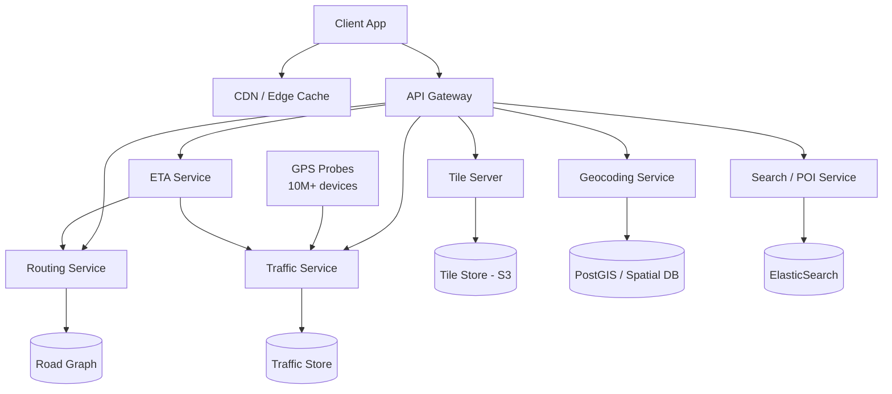

*The architecture diagram shows the edge layer (CDN for cached map tiles, API Gateway for dynamic requests) and the service layer: the Tile Server serves pre-rendered and vector tiles from object storage; the Geocoding Service converts addresses to coordinates and vice versa using a spatial database; the Routing Service computes paths through the road graph; the Traffic Service ingests GPS probes from millions of devices and aggregates real-time speeds; the Search Service indexes POIs; and the ETA Service combines route, traffic, and historical data to predict arrival times.*

**Problem Statement:** Design a global mapping and navigation system like Google Maps that supports interactive map rendering at all zoom levels, address search (geocoding), point-to-point route computation with real-time traffic awareness, turn-by-turn navigation with dynamic re-routing, ETA prediction, and POI discovery — all for 1B+ monthly users with millions of concurrent navigators and sub-100 ms tile loads.

**The scale in numbers:** The planet's surface is 510 million km². A single road network graph has 100M+ nodes (intersections) and 200M+ edges (road segments). At zoom level 20, there are ~1 trillion tiles. Traffic data arrives at 1M+ GPS pings per second from 100M+ active devices. Route computation must traverse a graph of 100M+ nodes and return a path in under 1 second, with real-time traffic weights on every edge. Map tiles must be served from cache at < 100 ms latency globally, with CDN edge nodes in every major metro area.

**Key technical problems:**

* **Spatial data at scale:** The Earth's surface is vast — how to store, index, and render relevant map data on demand for any viewport, anywhere on Earth.
* **Fast map tile delivery:** Users expect map tiles to load in < 100 ms at any zoom level, anywhere on Earth.
* **Route computation:** Finding the fastest path between two points on a road network with billions of edges, accounting for real-time traffic.
* **Real-time traffic:** Aggregating GPS data from millions of users to show current traffic conditions and re-route.
* **Geocoding:** Converting between human-readable addresses ("1600 Amphitheatre Parkway") and geographic coordinates (lat/lng).
* **Location search:** Finding nearby businesses, landmarks, or addresses based on a query.
* **Navigation:** Providing turn-by-turn directions with real-time re-routing as traffic conditions change.

---

### Characteristics

| Characteristic | What it means | Why it matters | How it works |
|---|---|---|---|
| **Tile-based rendering** | Maps divided into tiles (256×256 px) at zoom levels | Efficient rendering, caching, bandwidth | Zoom/x/y tile addressing; pre-rendered raster or vector tiles |
| **Spatial indexing** | Data structures optimized for geographic queries | Fast range, nearest-neighbor, polygon queries | Quadkeys (Bing), S2 cells (Google), R-trees, GeoHash |
| **Multi-modal routing** | Routes for driving, walking, cycling, transit | Users choose transport mode | Separate graph weights and edge constraints per mode |
| **Real-time traffic** | Current road speeds from live data | Accurate ETAs, dynamic re-routing | GPS probes + sensor data + ML aggregation |
| **Vector vs. raster** | Vector tiles encode geometry as vectors; raster as pre-rendered PNGs | Vector: scalable, styleable, smaller; Raster: simpler, offline | Mapbox GL (vector), Google Maps (vector on modern clients) |
| **Geospatial consistency** | Map data updates must propagate globally | Outdated maps cause routing errors, wrong ETAs | Versioning; staged rollouts; conflict resolution |
| **Read-heavy** | 90%+ of operations are tile reads, route queries, POI lookups | Optimization target is throughput and caching, not write throughput | CDN + multi-level cache (edge → regional → origin) |
| **Ephemeral data** | GPS pings are point-in-time; traffic speeds change every 30 seconds | Low-latency stream processing with time-windowed aggregation | Kafka + Flink/Storm for real-time; batch for historical baselines |
| **Global distribution** | Users anywhere on Earth need sub-100 ms tile loads and sub-1 s routes | Requires regional data centers, edge CDNs, and cross-region sync | GeoDNS routing; region-local graph shards; async replication |
| **Precision navigation** | Sub-meter positioning for turn-by-turn; map matching snaps GPS to roads | GPS is ~5 m accurate; urban canyons and tunnels degrade signal | Dead reckoning + IMU sensors + Kalman filters + map matching |

---

### Pros

- **Global coverage:** Maps of every country, territory, and major city — no other service matches Google's geographic breadth.
- **Real-time data:** Live traffic, transit schedules, parking availability, incident reports, and speed trap warnings — all updated continuously.
- **Multi-modal:** Driving, walking, cycling, transit, rideshare, and even flight status — all in one app. The user never needs a second navigation tool.
- **High-resolution imagery:** Aerial imagery, Street View, 3D buildings, and indoor maps provide rich visual context that makes navigation intuitive.
- **Offline support:** Download maps of entire countries and navigate without internet — essential for international travel and areas with poor coverage.
- **Integration ecosystem:** Deeply embedded in billions of devices and apps (Android Auto, Uber, Airbnb, food delivery) — creating a defensible moat of data and usage.
- **AI-powered predictions:** Machine learning models predict traffic, suggest optimal departure times, and surface relevant POIs proactively.
- **Street-level data:** Street View and ground-truth data collection vehicles continuously improve map accuracy — new roads, changed traffic patterns, new businesses.

---

### Cons

- **Privacy concerns:** Location history — every trip, every destination, every stop — is tracked and stored, raising surveillance and data-mining concerns. GDPR and CCPA compliance is a constant legal burden.
- **Data accuracy lag:** Maps can be outdated (new roads not yet mapped, recently closed businesses, changed traffic patterns). The update cycle from field collection to map availability can take months.
- **Dependence:** Users have become dependent on GPS navigation; GPS signal failure (tunnels, urban canyons) or battery drain during long navigation sessions can strand users.
- **Data usage:** Vector tiles, Street View, real-time traffic, and offline map downloads consume significant mobile data — a cost for metered connections.
- **Accuracy limits:** Consumer GPS is ~5 m accurate; urban canyons, tunnels, and dense foliage degrade signal further. High-precision use cases (autonomous vehicles, surveying) need RTK or LiDAR augmentation.
- **Battery drain:** Continuous GPS scanning and real-time turn-by-turn navigation significantly reduce battery life on mobile devices.
- **Licensing cost:** For third-party apps using the Google Maps Platform, the cost scales with usage — millions of tile loads and route computations per month can cost tens of thousands of dollars.
- **Algorithmic bias:** Popular routes become self-reinforcing — the algorithm may not surface lesser-known but equally good alternatives, creating congestion on "suggested" roads.

---

### Use Cases

#### Ride-Hailing Navigation (Uber-like)

* **Problem:** Drivers need real-time navigation with traffic-aware routes and ETAs; riders want to track the driver's progress.
* **Solution:** Integrate Google Maps SDK — display driver location, route, traffic, and ETA. Use Distance Matrix API for pickup ETAs; Directions API for turn-by-turn agent routing.
* **Why suitable:** Real-time traffic, multi-modal (driving + walking for rider pickup points), global coverage, offline fallback.
* **How it works:** (1) Driver app sends GPS to backend → backend map-matches GPS to road network → (2) backend sends route via Directions API → (3) ETA computed via Distance Matrix API (traffic-aware) → (4) displayed to rider as pickup estimate → (5) live tracking shows driver's progress along the route polyline. Geofencing defines operational zones.
* **Trade-offs:** API cost ($200/1M calls); dependence on a third-party vendor; data usage for drivers on metered plans.

#### Food Delivery (Swiggy, Zomato)

* **Problem:** Customer sees restaurant delivery estimate; delivery agent gets optimal route with multi-stop optimization.
* **Solution:** Distance Matrix API for customer→restaurant→customer ETAs; Directions API for agent multi-stop routing; live tracking with location sharing.
* **Why suitable:** Real-time traffic, multi-destination optimization, zone-based availability, geofencing for delivery boundaries.
* **How it works:** (1) Customer places order → backend finds nearby restaurants → (2) Distance Matrix computes ETA from customer to each restaurant → (3) assigns to restaurant → (4) Swiggy agent receives navigation route with optimized stop order → (5) live tracking shows agent's progress; ETA updates every 30 seconds as traffic changes.
* **Trade-offs:** Delivery delays during peak traffic; zone boundary effects on restaurant availability; GPS signal issues in dense urban areas.

#### Location-Based Services (Find My Friends)

* **Problem:** Show friends' real-time locations on a map; trigger notifications when friends arrive at or leave geofenced locations.
* **Solution:** Maps SDK + Geolocation API; periodic location updates with battery optimization; geofence triggers around home, work, and favorite locations.
* **Why suitable:** Real-time location display, geofence triggers, proximity-based social features.
* **How it works:** (1) Each friend shares location → sent to backend → (2) backend stores latest location + computes proximity to other friends → (3) sends to your app → displayed on map with ETA. Geofence around home/work → notification when friend arrives. Location updates throttled (every 5 minutes) to conserve battery.
* **Trade-offs:** Battery drain from GPS; privacy concerns about continuous location sharing; accuracy limits in urban areas.

#### Autonomous Vehicle Navigation

* **Problem:** Self-driving cars need centimeter-level positioning, real-time traffic, and dynamic route replanning with full HD map data.
* **Solution:** Custom-built HD maps with lanes, traffic signs, and 3D geometry + real-time traffic overlay + vehicle sensor fusion (LiDAR, cameras, IMU).
* **Why suitable:** High-precision positioning, real-time traffic, lane-level guidance, dynamic obstacle awareness.
* **How it works:** (1) Vehicle sensors (LiDAR + cameras) continuously scan environment → (2) HD map provides prior knowledge of road geometry → (3) real-time path planning with trajectory optimization → (4) traffic data updates edge weights to avoid congestion → (5) route replanned every 100 ms as conditions change.
* **Trade-offs:** Cost of HD map maintenance; computational complexity; reliance on connectivity for traffic updates.

---

### Components

| Component | Purpose | Responsibilities | Relationship | Real-world Example |
|---|---|---|---|---|
| **Tile Server** | Serve map tiles | Generate/store raster or vector tiles at all zoom levels | Reads from Tile Store | Google's tile server, Mapbox Tilesets |
| **Geocoder** | Address ↔ lat/lng | Forward geocoding (address → coords), reverse geocoding (coords → address) | Uses spatial index | Google Geocoding API |
| **Router** | Compute optimal paths | Dijkstra, A*, Contraction Hierarchies, multi-modal routing | Uses Road Graph DB | Google Directions API |
| **Traffic Service** | Real-time traffic data | Aggregate GPS probes, compute speeds, color-code roads | Feeds Router + ETA Service | Waze community data |
| **ETA Service** | Compute arrival time | Combine route + traffic + historical patterns + ML | Uses Router + Traffic | Google ETA API |
| **Search Service** | Find places | POI search, autocomplete, fuzzy matching, ranking | Uses spatial + text index | Google Places API |
| **Map Data Store** | Store geographic data | Road networks, building footprints, satellite imagery, POIs | Consumed by all services | PostGIS, Nebula, BigTable |
| **Road Graph** | Store road network | Nodes (intersections), edges (road segments) with weights and constraints | Consumed by Router | GraphHopper, OSRM, proprietary |
| **Tile Store** | Store tile assets | Pre-rendered raster tiles, vector tile bundles, offline packages | Consumed by Tile Server | S3/Blob Storage + CDN |
| **Traffic Store** | Store traffic data | Real-time speeds, historical patterns, incident reports | Consumed by Traffic + ETA | Redis, Cassandra, Bigtable |
| **CDN** | Cache tiles globally | Edge caching for tiles and POI data, reducing latency | Serves tiles to clients | Google Front End, Cloudflare, Akamai |
| **Map Matcher** | Snap GPS to roads | Map matching, dead reckoning, trajectory reconstruction | Used by Navigation Service | Google Map Matching API |
| **Navigation Service** | Turn-by-turn guidance | Generate voice instructions, detect off-route, recompute | Uses Router + Traffic + Map Matcher | Google Navigation SDK |
| **Data Pipeline** | Ingest map sources | Satellite imagery, street-level imagery, government data, crowdsourced edits | Feeds Map Data Store | Apache Beam, Flink, Spark |

---

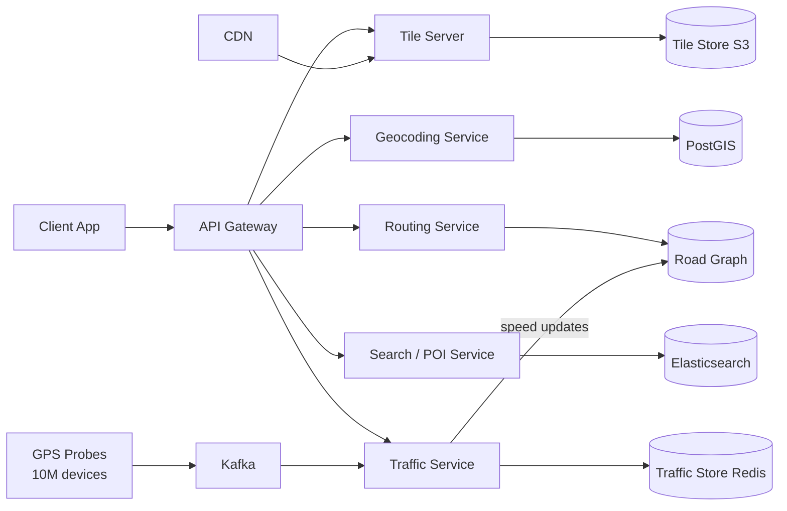

*The component interaction flow: clients route through the API Gateway; the Tile Server serves cached tiles from the Tile Store via CDN; the Geocoding Service queries PostGIS for spatial lookups; the Routing Service traverses the road graph; the Search Service indexes POIs in Elasticsearch; the Traffic Service ingests GPS probes from a Kafka stream, aggregates speeds, and writes traffic data back to the graph. Each service communicates via lightweight REST/gRPC calls, and GPS probes flow through a decoupled stream-processing pipeline.*

---

### Architectural Patterns

- **Spatial indexing with S2 cells or quadkeys:** Hierarchical spatial indexing that partitions the Earth into cells for O(1) proximity and range queries. Google uses S2 cells (spherical quadtree on a cubed sphere); Bing uses quadkeys. Each cell has a 64-bit ID; cells at level 30 are ~1 cm², cells at level 0 are ~8,000 km².
  - *How it works:* Divide the Earth into a hierarchical grid. At level 0: whole world is one cell. At level 1: 4 cells (2×2). Level 2: 16 cells. Higher levels = smaller, more granular cells. To find nearby items: compute the cell IDs around the query point at the appropriate level → fetch items from those cells. S2 uses spherical geometry (accounts for Earth's curvature); quadkeys use a planar approximation.
  - *Use when:* Geospatial data storage, POI search, location-based services with >1M records.
  - *Avoid when:* Small datasets — a simple bounding-box query with an R-tree index suffices.
  - *Pros:* O(1) lookup for location-based queries; natural hierarchical clustering; cache-friendly cell ranges.
  - *Cons:* Cell boundaries can split nearby items into different cells; must query adjacent cells for border cases.

- **Spatial indexing with R-trees:** A tree data structure that organizes spatial objects (points, rectangles, polygons) for efficient range and nearest-neighbor queries. Each node covers a bounding rectangle; children are contained within the parent's rectangle.
  - *How it works:* Objects are inserted into the tree by finding the node whose bounding rectangle needs the least enlargement. On query, nodes whose rectangles intersect the search area are explored recursively. PostGIS uses R-tree (GiST) indexes for `geometry` columns; Elasticsearch uses BKD trees for geo-point fields.
  - *Use when:* Exact geometric queries (intersections, distances, polygons); moderate dataset sizes (up to ~100M objects).
  - *Avoid when:* Global-scale proximity queries — S2 cells or GeoHash are more efficient for planet-wide data.

- **Contraction Hierarchies for routing:** A graph acceleration technique that pre-processes the road network to enable shortest-path queries in milliseconds (vs. seconds with Dijkstra).
  - *How it works:* (1) **Preprocessing:** Iteratively "contract" less important nodes (local roads) by adding shortcut edges between their neighbors. The importance of a node is its "level" — highways are high-level (kept), local roads are low-level (contracted first). (2) **Query:** Run bidirectional Dijkstra (forward from source, backward from target) — only traverse nodes in increasing level order, skipping contracted nodes. This reduces the search space from 100M to ~1,000 nodes.
  - *Use when:* Road network routing at continental or global scale.
  - *Avoid when:* Small graphs (cities) — standard Dijkstra is fast enough; non-road graphs where contraction doesn't help.
  - *Pros:* 1000× speedup vs. Dijkstra; query time < 10 ms even for cross-continent routes.
  - *Cons:* Preprocessing takes hours; updates (new roads) require partial re-computation; memory overhead for shortcut edges.

- **Vector tile rendering:** Vector tiles encode map geometry as compact vector data (points, lines, polygons) rather than pre-rendered raster images. The client renders the vectors on the fly using a style sheet (Mapbox Style / Google Maps Style).
  - *How it works:* The server generates MVT (Mapbox Vector Tiles) at each zoom level — each tile is a compact binary protobuf containing clipped geometry and metadata. The client downloads the tile, applies the style sheet, and rasterizes to the screen. Tiles are ~50 KB vs. ~100 KB for raster PNGs, and they scale perfectly at any DPI.
  - *Use when:* Interactive maps where users zoom and pan frequently; mobile apps where bandwidth is constrained; custom map styling is needed.
  - *Avoid when:* Offline maps with no rendering engine; extremely simple use cases where a static PNG suffices.
  - *Pros:* Smaller size, styleable, resolution-independent, client-side interactivity (hover, click).
  - *Cons:* Requires a client-side rendering engine; initial render latency on low-end devices; more complex pipeline than raster tiles.

- **Event-driven traffic aggregation:** Real-time traffic data is processed as a stream — GPS pings flow through Kafka/Flink, are windowed by time and road segment, and aggregated into speed estimates with sliding time windows.
  - *How it works:* Each GPS ping is tagged with a road segment ID (via map matching). Pings are grouped by segment in 30-second tumbling windows. The average speed within each window becomes the segment's real-time speed weight. These weights are pushed to the routing graph and expire after 1–2 minutes of no new data (reverting to historical baseline).
  - *Use when:* Real-time traffic overlay; dynamic re-routing; ETA updates during navigation.
  - *Avoid when:* Static map display with no navigation; historical-only analysis (batch processing is cheaper).
  - *Pros:* Sub-30 second traffic update cadence; handles millions of pings per second; graceful degradation to historical data.
  - *Cons:* Complex to tune (window size, probe weighting, outlier detection); requires consistent map matching accuracy.

- **Multi-region active-active deployment:** The mapping system is deployed across multiple regions with regional data centers. Users are routed to the nearest region via GeoDNS. Each region maintains its own road graph, tile store, and traffic cache, with asynchronous cross-region replication.
  - *How it works:* Route by region (source + destination) — if both are in the EU region, the EU routing service handles it. Traffic data is aggregated locally and synced globally every 30 seconds. Tile stores are replicated to all regions' CDNs. For cross-region routes (e.g., NYC → London), the request is routed to a region with the appropriate graph shard.
  - *Use when:* Global user base; strict latency requirements (<100 ms tile, <1 s route); 99.99% availability target.
  - *Avoid when:* Single-region deployment; cost is a primary concern.
  - *Pros:* Low latency for regional queries; fault isolation; horizontal scaling.
  - *Cons:* Increased operational complexity; cross-region replication lag; data synchronization challenges.

- **Read-through caching with stale-while-revalidate:** Hot tiles, POIs, and route results are cached at the edge CDN with a TTL. When the TTL expires, the CDN serves the stale cached version while asynchronously fetching a fresh copy — ensuring zero perceived latency even during cache misses.
  - *How it works:* CDN configured with `Cache-Control: max-age=3600, stale-while-revalidate=600`. On a cache hit, serve immediately. On expiry, serve the stale copy and trigger a background fetch. For tiles, the stale period is 10 minutes; for traffic overlay, 30 seconds.
  - *Use when:* Sub-100 ms latency requirement for tile loads; frequent but unchanged data (base tiles, POI metadata).
  - *Avoid when:* Real-time data (live traffic) where staleness is unacceptable — use shorter TTL with no stale-serve.
  - *Pros:* Eliminates tail latency; reduces origin load; graceful degradation.
  - *Cons:* May serve slightly stale data during cache refresh; cache invalidation is tricky for real-time data.

---

### Benefits

- **Navigation democratized:** Turn-by-turn directions for anyone with a smartphone — no need to read paper maps or ask for directions.
- **Real-time awareness:** Live traffic, transit delays, road closures, and incident reports help users make informed routing decisions.
- **Location discovery:** Find nearby restaurants, gas stations, ATMs, and landmarks — reducing search friction for essential services.
- **Urban planning insight:** Cities and researchers use aggregated traffic and mobility data to understand congestion patterns, optimize signal timing, and plan infrastructure.
- **Economic impact:** Enables the gig economy (Uber, DoorDash, delivery) by providing routing and ETA as infrastructure.
- **Accessibility:** Voice-guided navigation, wheelchair-accessible routes, and transit integration help users with mobility challenges traverse cities independently.
- **Multi-modal efficiency:** Combines driving, transit, walking, and cycling into a single routing interface — users can optimize for cost, speed, or carbon footprint.

---

### Challenges

#### Technical Challenges

- **Map data storage:** The entire planet's road network + building footprints + satellite imagery + POIs = petabytes. Storage must be efficient (vector tiles, protobuf compression, multi-resolution imagery pyramids).
- **Tile generation:** Generating tiles at 20+ zoom levels for the entire globe — billions of tiles. Requires distributed tile generation pipelines (10K+ machines).
- **Routing performance:** Cross-continent routes must compute in < 1 second — requires Contraction Hierarchies or similar pre-processing.
- **Real-time traffic:** Aggregating GPS data from 100M+ users; detecting traffic patterns; updating graph weights within 30 seconds.

#### Scalability Challenges

- **Concurrent users:** 1B+ MAU, 20M+ concurrent navigating users — each generating GPS pings every 5–30 seconds.
- **Traffic data volume:** 1M+ GPS pings/second → stream processing (Flink/Storm) → aggregate speeds per road segment → update traffic model.
- **Tile cache:** 50+ trillion tiles possible → CDN must cache the ~1% that are frequently accessed; eviction policy for the long tail.
- **Routing requests:** Peak of 100K+ route requests per second; each traversing a 100M-node graph — requires pre-computed shortcuts and sharding.

#### Performance Challenges

- **Tile load time:** < 100 ms from request to tile display — edge caching + prefetching.
- **Routing latency:** < 1 second for any route (including cross-continent) — Contraction Hierarchies + pre-computed shortcuts.
- **ETA accuracy:** Predicted arrival time must be within 10% of actual — combine historical + real-time + weather + special events.
- **Geocoding:** < 200 ms for address → lat/lng — fuzzy matching + spatial index.
- **Map matching:** Snapping GPS to road network must complete in < 50 ms per ping — approximate algorithms + caching.

#### Reliability Challenges

- **Map data freshness:** New roads, construction, businesses → must update map data without downtime (phased rollout, versioning).
- **GPS signal loss:** Tunnels, urban canyons → must estimate position via dead reckoning + map matching + IMU sensors.
- **Offline degradation:** When offline, routing falls back to pre-downloaded maps (less accurate, no traffic).
- **Traffic data gaps:** In areas with few GPS probes, traffic reverts to historical baselines — can be misleading during incidents.

#### Maintainability Challenges

- **Data versioning:** Rolling out updated map data globally without disruption — phased, percentage-based rollout.
- **API evolution:** Adding new routing options (toll, ferry, unpaved, EV charging stops) without breaking existing clients.
- **Traffic model tuning:** Adjusting traffic weights based on real-world feedback and new data sources (weather, events, construction).
- **Road network updates:** New roads, changed turn restrictions, new speed limits — must update the graph and recompute shortcuts.

#### Operational Challenges

- **Data ingestion:** Ingesting map data from governments, surveys, satellite imagery, street-level imagery — petabytes daily.
- **Quality assurance:** Detecting and fixing map errors (wrong turn restrictions, missing roads, incorrect POIs).
- **Regional compliance:** Different countries have different data residency and mapping regulations (China requires domestic map providers).
- **Fleet management:** Street View vehicles, aerial survey planes, and satellite constellations must be coordinated globally.

#### Security Concerns

- **Location privacy:** Location history is sensitive data; must be encrypted, retained for minimal time, GDPR-compliant. Users must control what's collected.
- **Map tampering:** Malicious actors could alter map data (change road geometry, remove turn restrictions) — verification + signed map updates + checksums.
- **Geofencing abuse:** Apps could track users without consent via background location access; must enforce permission models.
- **Routing manipulation:** Malicious actors could submit fake GPS data to artificially create/describe traffic jams — outlier detection + anomaly filtering.

---

### Best Practices

- **Vector tiles over raster:** Use vector tiles (MVT protocol) instead of pre-rendered PNG tiles — smaller payload, resolution-independent, styleable client-side.
- **Hierarchical caching:** Edge CDN → regional cache → origin server for tiles; cache popular tiles at edge with long TTL (1+ hours).
- **Contraction Hierarchies:** Pre-compute shortcuts for fast routing; refresh after major map updates (weekly batch job).
- **Traffic sampling:** Only sample 10–20% of GPS data (statistically sufficient for speed estimation); anonymize before processing (SHA-256 hashed device IDs).
- **Map matching:** Snap GPS points to the nearest road — improves accuracy in urban canyons and reduces noise in traffic aggregation.
- **Pre-fetch tiles:** Load adjacent tiles in advance (as user scrolls/pans) — reduces perceived latency. Use predictive prefetch based on movement vector.
- **Multi-modal separation:** Separate road graphs for driving/walking/cycling — different edge weights, turn restrictions, and accessibility constraints.
- **Offline-first design:** Pre-download map tiles + road graph for regions the user visits; sync traffic updates when online; cache route alternatives.
- **Stale-while-revalidate:** Configure CDN to serve stale content while revalidating in the background — eliminates tail latency for tile loads.
- **Probe anonymity:** Strip device identifiers from GPS data; only use anonymized, aggregated speeds for traffic models — prevents user tracking.
- **Regional sharding:** Shard the road graph by geographic region (US, EU, APAC) so each region's routing service is self-contained; cross-region routes use border-to-border shortcuts.
- **Rate limiting:** Enforce per-API-key quotas on routing and geocoding requests — prevents abuse and ensures fair resource allocation.

---

### When to Use / When Not to Use

**Use when:**

- You need to display geographic information (maps, routes, POIs) to users who move around the Earth's surface.
- Real-time navigation (driving, walking, cycling) is needed — turn-by-turn directions with live re-routing.
- Location-based search is needed (nearby restaurants, services, addresses within a radius).
- Traffic-aware routing is needed (avoiding congestion, estimating arrival time with current conditions).
- Offline map access is needed for travelers in areas with poor or no connectivity.
- Multi-modal routing is needed (combining driving, transit, walking, cycling in a single journey plan).
- You need to aggregate and visualize location data from many devices (fleet tracking, delivery dispatch).

**Avoid when:**

- The geographic area is small (single city or campus) and pre-rendered static maps suffice — a simple image tile or SVG is cheaper and simpler.
- Location services aren't needed (non-geographic applications, desktop-only tools).
- The user base is not mobile or geography-independent (e.g., a web dashboard showing fixed data).
- Real-time data isn't critical — historical map data with infrequent updates is sufficient.
- Strict data residency requirements conflict with global map data distribution.

**Alternatives:**

- **Static maps API:** Simple map images for display (Google Static Maps) — cheaper, no interactivity, good for email embeds and reports.
- **OpenStreetMap + Leaflet:** Open-source alternative; no licensing fees; community-driven data. Self-hostable.
- **Mapbox:** Customizable maps with good developer experience; flexible pricing; strong vector tile pipeline.
- **HERE, TomTom:** Enterprise-grade mapping with autonomous vehicle data, superior offline capabilities, and detailed traffic in Europe.

**Decision factors:**

- **Coverage needs:** Global → commercial provider (Google, HERE); local/regional → OSM may suffice.
- **Customization:** Need custom styling and data overlays → Mapbox or self-hosted OSM; need a standard map → Google Maps.
- **Cost:** $200/1B tiles with Google Maps vs. free OSM; weigh usage volume and whether the cost is sustainable at scale.
- **Latency:** Need < 100 ms tile loads → edge CDN + local tile caching; < 1 s routing → Contraction Hierarchies + regional graph sharding.
- **Data freshness:** Need real-time traffic → Google Maps or HERE; can accept periodic updates → OSM with periodic imports.
- **Offline support:** Critical (delivery drivers in basements) → download offline tile packages + offline road graph; always-online → no offline complexity needed.

---

### Data Model and API

The data model captures the Earth's road network, geographic features, points of interest, traffic conditions, and user-generated content (reviews, photos, ratings). Unlike a social media schema focused on users and posts, the map data model is fundamentally spatial.

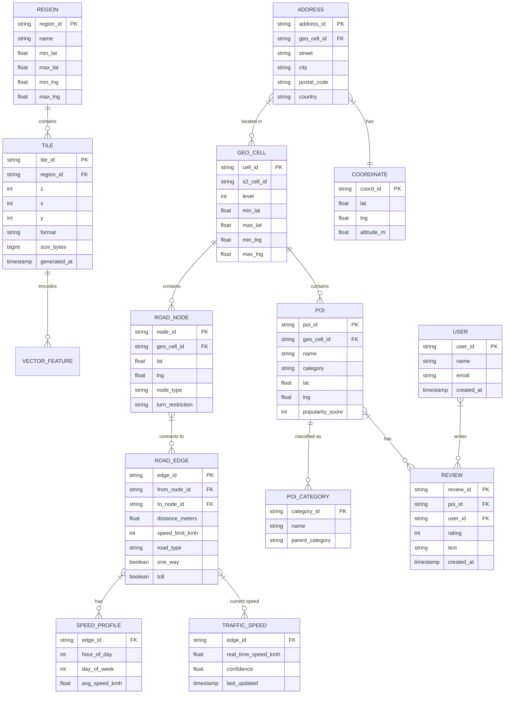

*The entity-relationship diagram shows the core domain model of a mapping system: Regions contain map tiles; tiles encode vector features; the road network is a directed graph of nodes and edges with speed profiles and real-time traffic overlays; POIs are classified by category and have user reviews; addresses map to geographic cells and coordinates. The spatial index (GEO_CELL using S2 cell IDs) enables fast proximity and range queries.*

**Entity descriptions:**

- **REGION:** A geographic bounding box (e.g., "North America," "EU-West") used for sharding tiles and routing data. Sharded by region for localized data management and CDN placement.
- **TILE:** A map tile at zoom level Z, X coordinate, Y coordinate. Can be raster (PNG/JPEG) or vector (MVT/protobuf). Stored in S3, served via CDN. TTL based on zoom level (zoom 0–10: cached 30 days; zoom 15+: cached 1 hour).
- **ROAD_NODE:** A vertex in the road graph — an intersection or curve point. `node_type` indicates highway, local road, etc. `turn_restriction` encodes no-turn rules. Sharded by `geo_cell_id` for regional routing.
- **ROAD_EDGE:** A directed edge between two road nodes — a road segment. `distance_meters`, `speed_limit_kmh`, `road_type`, `one_way`, `toll` are static attributes. Sharded by `from_node_id` hash.
- **SPEED_PROFILE:** Historical average speed per edge, bucketed by hour-of-day and day-of-week. Used as the baseline when real-time data is unavailable.
- **TRAFFIC_SPEED:** Real-time speed for an edge, updated every 30 seconds from GPS probes. `confidence` reflects how many probes contributed. Expires after 120 seconds of no updates.
- **POI:** A point of interest (restaurant, gas station, hotel). `category` for filtering; `popularity_score` for ranking in search results. Stored with lat/lng and indexed by S2 cell.
- **POI_CATEGORY:** Hierarchical category tree (e.g., "Food" → "Restaurant" → "Italian"). Enables faceted search and filtering.
- **ADDRESS:** A geocoded address with street, city, postal code, and country. Indexed for forward geocoding (address → coords) and reverse geocoding (coords → address).
- **GEO_CELL:** An S2 cell ID at a given level. Used as the primary spatial partitioning key — each cell contains a bounded set of POIs, addresses, and road nodes for fast range queries.
- **USER:** A platform user who can write reviews and save places. Stored in PostgreSQL (durable) with hot data cached in Redis.
- **REVIEW:** A user's rating (1–5 stars) and text review of a POI. Drives search ranking and recommendation.

**Indexes and Constraints:**

- `ROAD_EDGE(from_node_id, to_node_id)` — composite PK for directed graph traversal.
- `ROAD_EDGE(to_node_id)` — reverse index for backward search in bidirectional Dijkstra.
- `TRAFFIC_SPEED(edge_id)` — index for real-time weight lookups during routing.
- `POI(geo_cell_id, category, popularity_score)` — composite index for "find restaurants in this area, sorted by popularity."
- `ADDRESS(country, city, street)` — composite index for forward geocoding prefix matching.
- `COORDINATE(lat, lng)` — spatial R-tree index for nearest-neighbor queries.
- `GEOGRAPHIC_CELL(s2_cell_id)` — primary key for spatial partitioning.

**Partitioning / Sharding:**

- **TILE:** Sharded by `(region_id, z)` — each region owns a set of zoom levels. Replicated globally via CDN.
- **ROAD_NODE / ROAD_EDGE:** Sharded by `geo_cell_id` (S2 cell) — each shard contains the road graph for a geographic region. Cross-shard routes use border-node shortcuts.
- **TRAFFIC_SPEED:** Sharded by `edge_id` hash — ensures traffic updates for adjacent edges can be colocated for batch graph updates.
- **POI:** Sharded by `geo_cell_id` — POIs in the same cell are co-located for proximity queries.
- **SPEED_PROFILE:** Sharded by `edge_id` hash — same as ROAD_EDGE.
- **ADDRESS:** Sharded by country/city hash — geographic partitioning for geocoding.
- **REVIEW:** Sharded by `poi_id` hash — review reads scale with POI popularity.

**API Contract:**

| Method | Endpoint | Purpose | Rate Limit |
|---|---|---|---|
| GET | `/api/v1/tiles/{z}/{x}/{y}.mvt` | Get vector tile | 1000 req/s |
| POST | `/api/v1/geocode` | Address → lat/lng | 10 req/s per key |
| POST | `/api/v1/reverse-geocode` | lat/lng → address | 10 req/s per key |
| POST | `/api/v1/directions` | Route between 2+ points | 5 req/s per key |
| POST | `/api/v1/eta` | ETA for a route | 10 req/s per key |
| GET | `/api/v1/places/nearby` | POI search within radius | 100 req/s per key |
| GET | `/api/v1/places/{placeId}` | Place details | 100 req/s per key |
| GET | `/api/v1/traffic/speed` | Real-time speed for segment | 50 req/s per key |
| GET | `/api/v1/maps/offline/{regionId}` | Download offline tile package | 1 req/s per key |

**POST /api/v1/directions — Request:**

```json
{
  "origin": {"lat": 40.7128, "lng": -74.0060},
  "destination": {"lat": 34.0522, "lng": -118.2437},
  "mode": "driving",
  "alternatives": true,
  "traffic": true,
  "departure_time": "2024-06-14T10:30:00Z",
  "waypoints": [
    {"lat": 41.8781, "lng": -87.6298}
  ],
  "units": "metric"
}
```

**POST /api/v1/directions — Response:**

```json
{
  "routes": [
    {
      "summary": "I-80 W, I-76 W",
      "duration": 172800,
      "distance": 3940000,
      "geometry": "encoded_polyline_string",
      "legs": [
        {
          "start_address": "New York, NY, USA",
          "end_address": "Los Angeles, CA, USA",
          "duration": 172800,
          "distance": 3940000,
          "steps": [
            {
              "html_instructions": "Head west on W 34th St toward 11th Ave",
              "distance": {"text": "0.5 mi", "value": 805},
              "duration": {"value": 120},
              "polyline": "encoded_polyline",
              "maneuver": "DRIVING_STRAIGHT"
            }
          ]
        }
      ]
    }
  ],
  "status": "OK"
}
```

**GET /api/v1/places/nearby — Request:**

```http
GET /api/v1/places/nearby?lat=37.7749&lng=-122.4194&radius=5000&type=restaurant&min_price=1&max_price=4&open_now=true&rankby=distance HTTP/1.1
Authorization: Bearer <jwt>
Accept: application/json
```

**GET /api/v1/places/nearby — Response:**

```json
{
  "results": [
    {
      "place_id": "ChIJIQBpAGQak4AR_41nn6TftXU",
      "name": "Lombard Street",
      "business_status": "OPERATIONAL",
      "geometry": {"location": {"lat": 37.8019, "lng": -122.4095}},
      "types": ["tourist_attraction", "point_of_interest", "premise"],
      "rating": 4.8,
      "user_ratings_total": 12000,
      "price_level": 2,
      "vicinity": "San Francisco, CA",
      "plus_code": "C77X+F9"
    }
  ],
  "status": "OK",
  "next_page_token": "token_string"
}
```

**Status codes:** `200` OK, `201` Created, `400` Invalid request (missing params, invalid coordinates), `401` Auth required, `403` Quota exceeded / forbidden, `404` Not found, `429` Rate limited, `500` Internal error, `503` Temporarily unavailable.

**Real-time WebSocket API (for navigation session):**

| Event | Direction | Payload |
|---|---|---|
| `navigation.start` | Client → Server | `{"session_id": "abc123", "destination": {"lat": ..., "lng": ...}}` |
| `location.update` | Client → Server | `{"session_id": "abc123", "lat": ..., "lng": ..., "bearing": ..., "accuracy": ...}` |
| `route.update` | Server → Client | `{"session_id": "abc123", "route": polyline, "eta": 172800, "distance": 3940000}` |
| `traffic.alert` | Server → Client | `{"type": "accident", "edge_id": "e_123", "delay_seconds": 120}` |

**Authentication & Authorization:** OAuth 2.0 with JWT bearer tokens. API keys for server-to-server calls. Scope-based authorization: `tiles:read`, `geocode:forward`, `geocode:reverse`, `directions:route`, `directions:eta`, `places:search`, `places:details`, `traffic:read`.

---

### Map Rendering and Vector Tiles Deep Dive

This section covers the core technical challenges unique to mapping systems: how map tiles are addressed and rendered (tiling schemes, vector vs. raster), how spatial data is indexed for fast queries (S2 cells, quadkeys, R-trees), how geocoding translates between addresses and coordinates, how routing finds optimal paths through massive road graphs, and how real-time traffic overlay is aggregated from GPS probe data. These topics are the heart of map platform design.

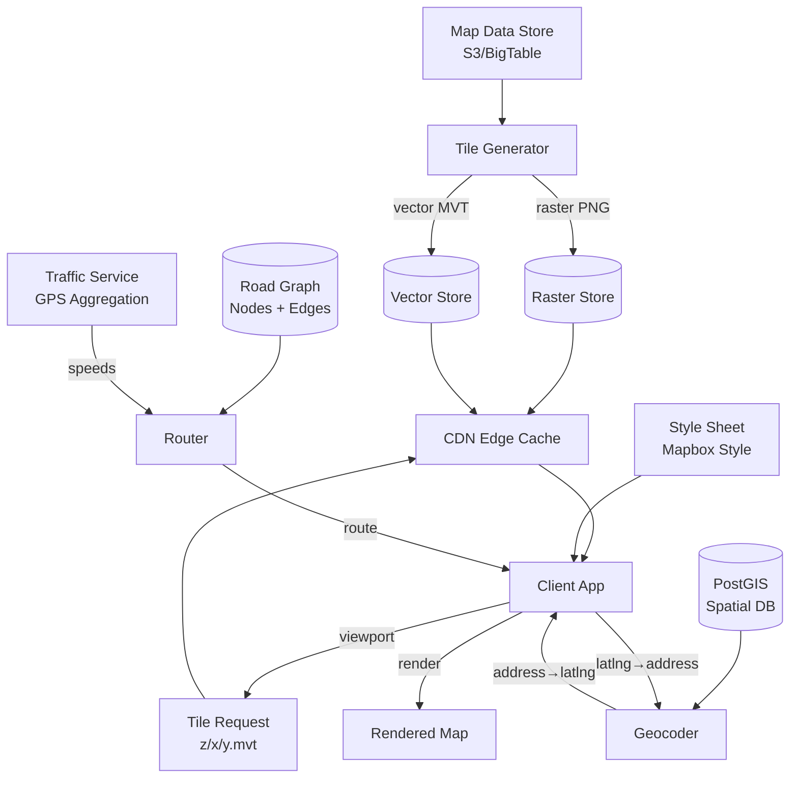

*The deep-dive architecture shows the dual tile pipeline (raster from Tile Store, vector from Vector Store) served via CDN; the geocoding pipeline (PostGIS spatial DB → Geocoder); and the routing pipeline (Road Graph + real-time traffic → Router). The client requests tiles by zoom/x/y addressing, applies a style sheet to vector tiles, and renders the final map.*

#### 1. Map Tiling Scheme

The foundation of digital maps is the tile system. The Earth's surface is recursively divided into a pyramid of tiles across zoom levels.

```
World divided into tiles at each zoom level:
  Zoom 0:  1 tile (entire world) — covers [-180,-85.0511] to [180,85.0511]
  Zoom 1:  4 tiles (2×2)
  Zoom 2:  16 tiles (4×4)
  Zoom 3:  64 tiles (8×8)
  ...
  Zoom N:  (2^N) × (2^N) tiles = 4^N total tiles
  Zoom 20: ~1.1 trillion tiles (very detailed, ~0.3 m per pixel)

Tile addressing: /{zoom}/{x}/{y}.mvt
  Where x = column (0 to 2^zoom - 1), y = row (0 to 2^zoom - 1)

Note: Web Mercator (EPSG:3857) clips the world at ~85.0511° latitude.
      This makes the map square (2πR × 2πR) and tiles are uniform in pixel space.
```

The Web Mercator projection (EPSG:3857) assumes the Earth is a perfect sphere and maps it onto a square. This simplifies tile math: at any zoom level Z, there are exactly 2^Z columns and 2^Z rows. The tile coordinates (x, y) map directly to geographic coordinates (lat, lng) via the inverse Mercator formulas.

```
Web Mercator forward transform (lat, lng → pixel coordinates at zoom Z):
  x_pixel = (lng + 180) / 360 * 2^z * 256
  y_pixel = (1 - ln(tan(lat_rad) + sec(lat_rad)) / π) / 2 * 2^z * 256

The latitude is clipped to ±85.0511° to keep the map square.
```

**Pre-rendered raster tiles** (PNG/JPEG) are generated offline by a tile server cluster and stored in object storage. Each tile is a 256×256 pixel image. The tile pipeline:

1. **Source data:** Vector map data (OSM, government data, Google's proprietary data) loaded into a GIS database (PostGIS/Nebula).
2. **Style application:** A cartographic style (Mapbox Style, Google Maps Style) defines which features to draw, their colors, line widths, and fonts.
3. **Rendering:** A distributed renderer (Tirex, TileServer-GL, or Google's proprietary render farm) generates tiles at each zoom level. Zoom 0–10 (the "context" levels) are generated for the entire globe; zoom 11+ (the "detail" levels) are generated on-demand or pre-rendered for populated areas only.
4. **Storage:** Tiles are uploaded to S3/Blob Storage. A metadata database tracks which tiles exist, their generation timestamp, and their source data version.
5. **Delivery:** CDN edge nodes cache hot tiles (city centers, highways, frequently searched areas). Cold tiles are fetched from the origin on first request and cached at the edge.

**On-demand (dynamic) tiles** are rendered at request time for areas without pre-rendered coverage (e.g., a newly updated region or a custom style). A request hits the tile server, which queries the GIS database, renders the tile, caches it, and returns it. Dynamic tiles are slower (~500–1000 ms) but always reflect the latest data.

**Tile cache sizing:** Google estimates that only ~1% of all possible tiles are ever requested. The CDN caches this hot 1% (billions of tiles); the remaining long tail is served from origin or generated on-demand. Tile sizes: raster PNG ~30–150 KB; vector MVT ~10–80 KB.

#### 2. Vector Tiles and the MVT Protocol

Vector tiles are the modern standard for map rendering. Instead of pre-rendering pixels, the server sends raw geometric data (points, lines, polygons) encoded as a compact Protocol Buffer (protobuf) message, and the client renders it with a style sheet.

The **Mapbox Vector Tile (MVT) specification** defines the tile format:

```protobuf
message Tile {
  message Layer {
    repeated Key keys = 1;       // string keys (property names)
    repeated Value values = 2;   // property values (string, float, bool, etc.)
    repeated Feature features = 3; // geometry + properties
    required uint32 extent = 4;  // tile size in "tile pixels" (usually 4096)
    required string name = 1;    // layer name (e.g., "road", "water", "building")
    optional uint32 version = 2; // version (usually 2)
  }
  repeated Layer layers = 3;
}

message Feature {
  optional uint32 id = 1;
  required GeometryGeomType type = 2; // UNKNOWN=0, POINT=1, LINESTRING=2, POLYGON=3
  repeated uint32 tags = 3;  // (key, value) index pairs into the layer's keys/values
  repeated uint32 geometry = 4; // commands (moveto, lineto, closepath)
}
```

*The MVT protobuf structure: each Tile message contains multiple Layers (e.g., "road", "water", "building"). Each Layer has a dictionary of Keys (property names like "name", "type", "oneway") and Values (the actual property values). Each Feature references keys/values by index (tag compression) and encodes its geometry as a series of drawing commands (moveTo, lineTo, closePath). The `extent` field (typically 4096) defines the coordinate space within the 256×256 pixel tile.*

**Why vector tiles matter:**

- **Size:** A vector tile for a city at zoom 14 is ~50 KB; the equivalent raster PNG is ~150 KB. Smaller payload = faster downloads, especially on mobile.
- **Resolution independence:** Vector tiles render crisply at any device DPI (1x, 2x, 3x "Retina"). A raster tile at 1x looks blurry on a 3x display.
- **Stylistic flexibility:** The same vector tile data can be rendered with different style sheets (night mode, satellite hybrid, accessibility high-contrast) without re-generating tiles.
- **Client-side interactivity:** Features in a vector tile carry metadata (names, categories, IDs) that the client can use for hover labels, click-to-select, and dynamic highlighting.

**The client rendering pipeline (e.g., Mapbox GL JS / Maps SDK):**

1. **Tile loading:** The client computes which tiles (z/x/y) cover the current viewport. It requests visible tiles + a 1-tile buffer for smooth panning. A tile cache (LRU, ~400 tiles) stores recently viewed tiles.
2. **Style application:** The style sheet (JSON) defines layers, paint properties, and layout properties. For example: `{"source": "openmaptiles", "source-layer": "road", "filter": ["==", "type", "motorway"], "paint": {"line-color": "#ff0000", "line-width": 4}}`.
3. **Symbol placement:** Text and icon labels are placed using a collision detection algorithm ( Mapnik's placement algorithm) — no two symbols overlap. This runs every frame during map movement.
4. **GPU rasterization:** Geometry is converted to GPU-friendly triangles and rendered with WebGL or Metal. At 60 FPS, the entire render pipeline must complete in < 16 ms.

**Python example — generating vector tiles from OSM data using Tippecanoe:**

```python
import subprocess

def generate_vector_tiles(osm_pbf_path, output_dir, maxzoom=12, minzoom=0):
    """Generate vector tiles (MVT) from an OSM PBF file using Tippecanoe."""
    cmd = [
        "tippecanoe",
        f"--output-to-directory={output_dir}",
        f"--minimumzoom={minzoom}",
        f"--maximumzoom={maxzoom}",
        "--no-tile-compression",
        "--drop-densest-only",  # drop features in overcrowded tiles
        f"--layer=osm",
        f"--name=Map Tiles",
        osm_pbf_path
    ]
    subprocess.run(cmd, check=True)
    print(f"Vector tiles written to {output_dir}")

# Example: generate tiles for a small city region
# generate_vector_tiles("san_francisco.osm.pbf", "tiles/12", maxzoom=12)
```

*Tippecanoe is a widely used open-source tool for generating vector tiles from large geographic datasets. The `--drop-densest-only` flag removes features from tiles that exceed density limits, preventing visual clutter at lower zoom levels. The output is a directory of `.mvt` files addressable by `z/x/y`. For production, this is typically replaced by a managed tile service (Mapbox Tilesets, Google's tile pipeline).*

#### 3. Spatial Indexing

Spatial indexing is how the system knows which data is near any given point. For a POI search "find restaurants within 1 km of (37.77, -122.42)", the system must avoid scanning all 100M POIs — it must index them spatially.

##### S2 Cells (Google's approach)

Google's S2 library divides the Earth into a hierarchy of cells using a quadtree on the cubed sphere projection. Each cell has a 64-bit ID. The hierarchy allows efficient spatial queries.

```java
@Service
public class S2SpatialIndex {

    public List<String> coverRegion(double lat, double lng, double radiusKm) {
        S2LatLng point = S2LatLng.fromDegrees(lat, lng);
        S1Angle radius = S1Angle.fromRadians(radiusKm / 6371.0); // Earth radius in km
        S2Cap cap = S2Cap.fromAxisAngle(point.toPoint(), radius);
        S2RegionCoverer coverer = S2RegionCoverer.builder()
            .setMaxCells(8)
            .build();
        S2CellUnion covering = coverer.getCovering(cap);
        return covering.cellIds().stream()
            .map(cellId -> Long.toHexString(cellId.id()))
            .collect(Collectors.toList());
    }

    public boolean isPointInCell(double lat, double lng, String cellIdHex) {
        S2CellId cellId = S2CellId.fromLong(Long.parseUnsignedLong(cellIdHex, 16));
        S2Cell cell = new S2Cell(cellId);
        S2Point point = S2LatLng.fromDegrees(lat, lng).toPoint();
        return cell.mayContain(point);
    }
}
```

*The `S2SpatialIndex` bean: `coverRegion` computes the set of S2 cell IDs that cover a circular area of `radiusKm` around a lat/lng point. The S2 region coverer returns a minimal set of cells (up to 8) whose union approximates the circle. The client then queries the POI store for POIs in each cell ID — a fast key-based lookup instead of a full table scan. `isPointInCell` checks whether a point falls within a specific cell, useful for spatial filtering and geofencing.*

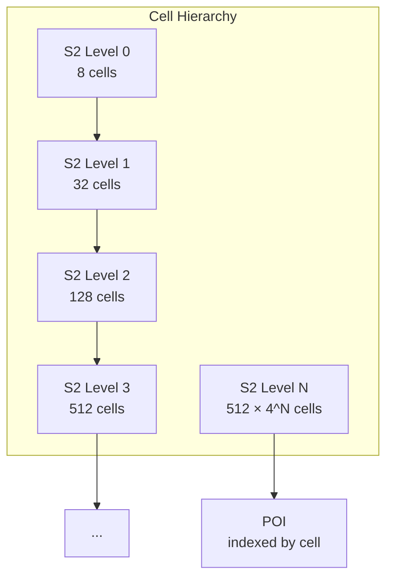

*S2 cell hierarchy: at level 0, the Earth is divided into 8 cells (the 6 faces of the cube + 2 polar caps). Each level subdivides cells into 4 children, so level N has 512 × 4^N cells. Cells at level 14 are ~500 m²; level 17 are ~60 m²; level 30 are ~1 cm². POIs are indexed by their containing cell ID at the appropriate level (determined by POI type: restaurants at level 17, cities at level 8).*

**Quadkeys (Bing Maps' approach):**

Bing Maps uses a quadtree where each tile at zoom level Z is addressed by a quadkey — a string of length Z where each character is 0 (top-left), 1 (top-right), 2 (bottom-left), or 3 (bottom-right).

```
Quadkey addressing at zoom level 3:
  Tile (3, 6): quadkey = "213"
  This means: at zoom 1, go to quadrant 2 (bottom-left);
              at zoom 2, go to quadrant 1 (top-right);
              at zoom 3, go to quadrant 3 (bottom-left).

  The quadkey is computed by interleaving the bits of x and y coordinates.
  Each character in the quadkey represents a level in the quadtree.
```

**R-trees (for exact geometric queries):**

An R-tree groups nearby spatial objects into bounding rectangles. PostGIS uses GiST (Generalized Search Tree) which implements an R-tree-like structure for `geometry` columns. The query `SELECT * FROM pois WHERE ST_DWithin(geom, ST_Point(lat, lng), 5000)` uses the R-tree index to quickly find all POIs within 5 km.

```sql
-- R-tree spatial index on POI geometry
CREATE INDEX idx_poi_geom ON pois USING GIST (ST_Point(po_lat, po_lng));

-- Query: find all POIs within 5 km of a point
SELECT poi_id, name, category, ST_Distance(
    ST_Point(po_lat, po_lng),
    ST_Point(37.7749, -122.4194)
) AS distance_m
FROM pois
WHERE ST_DWithin(
    ST_Point(po_lat, po_lng),
    ST_Point(37.7749, -122.4194),
    0.045  -- ~5 km in degrees (approximate)
)
ORDER BY distance_m
LIMIT 50;
```

*The SQL example creates a GiST R-tree index on POI coordinates for fast spatial queries. `ST_DWithin` uses the index to eliminate distant candidates before computing exact distances with `ST_Distance`. For global scale, the POI table is further partitioned by S2 cell, so the R-tree query is scoped to one or a few cells.*

#### 4. Geocoding and Reverse Geocoding

Geocoding translates a human-readable address into geographic coordinates (lat, lng). Reverse geocoding does the opposite. This is one of the hardest problems in mapping because addresses are messy — misspelled, incomplete, ambiguous, or formatted differently across countries.

**Forward geocoding (address → lat/lng):**

The pipeline:

1. **Preprocessing:** Normalize the address string — expand abbreviations ("St" → "Street"), parse into components (house number, street, city, state, postal code, country), and standardize via a gazetteer (e.g., "N Y C" → "New York City").
2. **Hierarchical search:** Start from the coarsest level (country → state → city → street → house number). Use a trie or prefix index for street name autocomplete. Query the spatial database (PostGIS/Elasticsearch) at each level, intersecting results.
3. **Scoring and ranking:** Multiple candidates may match — rank by confidence (street number range fit, postal code match, interpolation), recency of user correction, and result popularity. Return the top-N candidates with confidence scores.

```java
@Service
public class GeocodingService {

    private final ElasticsearchClient esClient;
    private final SpatialIndex spatialIndex; // S2-based

    @Transactional(readOnly = true)
    public List<GeocodeResult> geocode(String address) {
        // 1. Normalize and parse the address
        AddressComponents components = AddressParser.parse(address);

        // 2. Hierarchical search using S2 cells as spatial scope
        String cellKey = spatialIndex.getS2CellKey(
            components.city(), components.state(), components.country()
        );

        // 3. Query Elasticsearch with fuzzy matching on street name
        var searchRequest = SearchRequest.of(s -> s
            .index("addresses")
            .query(q -> q
                .bool(b -> b
                    .must(m -> m.term(t -> t.field("s2_cell").term(cellKey)))
                    .must(m -> m.match(mt -> mt.field("street").query(components.street())))
                    .must(m -> m.match(mt -> mt.field("city").query(components.city())))
                    .must(m -> m.fuzzy(f -> f.field("house_number").value(components.houseNumber())))
                    .must(m -> m.term(t -> t.field("country").term(components.country())))
                )
            )
            .size(10)
        );

        var response = esClient.search(searchRequest, Map.class);

        // 4. Score and rank
        return response.hits().hits().stream()
            .map(hit -> {
                var source = hit.source();
                double confidence = computeConfidence(components, source);
                return new GeocodeResult(
                    Double.parseDouble(source.get("lat")),
                    Double.parseDouble(source.get("lng")),
                    source.get("formatted_address"),
                    confidence
                );
            })
            .sorted(Comparator.comparing(GeocodeResult::confidence).reversed())
            .toList();
    }
}
```

*The `GeocodingService` bean implements a multi-stage geocoding pipeline: it parses the address into components using a normalization library, scopes the search to an S2 cell to avoid a global table scan, queries Elasticsearch with fuzzy matching (for typos in street names and house numbers), and ranks results by a confidence score. The `@Transactional(readOnly = true)` annotation ensures safe read-only database access.*

**Reverse geocoding (lat/lng → address):**

Reverse geocoding is the inverse — given a coordinate, find the nearest address. This is used for "drop a pin" features and for map-matching GPS pings to road segments.

1. **Cell lookup:** Convert the lat/lng to an S2 cell at the appropriate level (level 17 for address-level precision).
2. **Nearest-address search:** Query the address database for addresses in the cell and adjacent cells. Compute exact Haversine distances and return the closest.
3. **Interpolation:** If the point falls between house numbers on a street segment, interpolate: `house_number = start_number + (distance_along_street / segment_length) × (end_number - start_number)`.

**Common failures and mitigations:**

- **Ambiguous addresses:** "Main Street" exists in 10,000 cities. The geocoder returns candidates from the city/state/country context and asks the user to disambiguate.
- **Newly constructed addresses:** Not yet in the database. The geocoder falls back to street-level interpolation and labels the result as "estimated."
- **International formats:** Japanese addresses go large-to-small (prefecture → city → district); US goes small-to-large (house → street → city). The parser handles locale-specific formats.
- **Missing data:** Some regions (rural Africa, parts of Central Asia) have sparse address data. The geocoder degrades gracefully: city-level match, then region-level, then "nearby landmark."

#### 5. Route Computation

Routing finds the optimal path between two or more points on a road network graph.

```
Road network as weighted graph:
  Nodes = intersections (100M+ globally)
  Edges = road segments (200M+ globally)
  Weights = time (distance / speed_limit × traffic_factor)

Algorithms:
  - Dijkstra: O((V + E) log V) — guarantees optimal but too slow for continental scale
  - A*: Dijkstra + heuristic (Euclidean distance to target) — faster, still optimal with admissible heuristic
  - Contraction Hierarchies: Pre-process shortcuts; query in O(log N) — 1000x faster than Dijkstra
  - Multi-modal: Separate graph layers per transport mode (driving, walking, transit)
  - Real-time: Incorporate live traffic weights on every edge

For global routing: Contraction Hierarchies
  - Pre-process: Contract unimportant nodes, add shortcut edges
  - Query time: O(log N) instead of O(N log N)
  - Cross-continent routes in milliseconds
```

**Dijkstra's algorithm** is the baseline — it explores all nodes outward from the source until it reaches the target. For a 100M-node graph, this explores millions of nodes and takes seconds.

**A\* (A-star)** improves on Dijkstra by using a heuristic — the straight-line (Euclidean) distance to the target. This guides the search toward the target, dramatically reducing the explored area. With an admissible heuristic (never overestimates), A\* is still optimal but explores far fewer nodes.

```python
import heapq

def a_star(road_graph, source, target):
    """A* shortest path on a road network with real-time traffic weights."""
    def haversine(a, b):
        R = 6371000  # Earth radius in meters
        lat1, lon1 = math.radians(a.lat), math.radians(a.lng)
        lat2, lon2 = math.radians(b.lat), math.radians(b.lng)
        dlat, dlon = lat2 - lat1, lon2 - lon1
        a_calc = math.sin(dlat/2)**2 + math.cos(lat1)*math.cos(lat2)*math.sin(dlon/2)**2
        return 2 * R * math.asin(math.sqrt(a_calc))

    open_set = [(haversine(source, target), 0, source)]  # (f_score, g_score, node)
    came_from = {}
    g_score = {source: 0}

    while open_set:
        f, g, current = heapq.heappop(open_set)
        if current == target:
            return reconstruct_path(came_from, current)

        for neighbor, edge_weight in road_graph.neighbors(current):
            tentative_g = g_score[current] + edge_weight  # traffic-adjusted time
            if neighbor not in g_score or tentative_g < g_score[neighbor]:
                came_from[neighbor] = current
                g_score[neighbor] = tentative_g
                f_score = tentative_g + haversine(neighbor, target)
                heapq.heappush(open_set, (f_score, tentative_g, neighbor))

    return None  # No path found
```

*The A\* Python implementation: the heuristic is the Haversine distance to the target. The `edge_weight` is the traffic-adjusted travel time (distance ÷ real_time_speed). The priority queue explores the most promising nodes first. For continental-scale graphs, this is still too slow — production systems use Contraction Hierarchies.*

**Contraction Hierarchies** pre-process the graph to add "shortcut" edges, enabling queries in milliseconds:

1. **Preprocessing:** Assign each node a "level" (importance). Contract nodes in order of increasing importance. When contracting a node, check if any pair of its neighbors (v, w) would have a longer shortest path through the node than a direct shortcut — if so, add a shortcut edge v→w. This takes hours for a continental graph but is done once (updated weekly).
2. **Query:** Run bidirectional Dijkstra, but only traverse "upward" edges (from low-level to high-level nodes). Source and target are searched from both ends; the paths meet in the middle. The search space shrinks from 100M nodes to ~1,000 nodes.

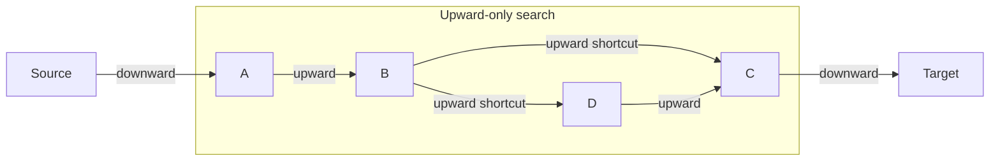

*Contraction Hierarchy search: the forward search from the source and backward search from the target only traverse upward edges (from low to high level). Shortcut edges (precomputed during contraction) allow the search to "jump" over contracted nodes. The two searches meet in the middle, having explored only a tiny fraction of the full graph.*

**Multi-modal routing:** The road graph is augmented with separate edge sets per transport mode. Driving edges have speed limits; walking edges have sidewalk data and crosswalk timing; transit edges connect to a schedule graph (GTFS feeds). The router runs A\* across mode-specific subgraphs and transitions between modes at transfer points (e.g., park-and-ride, bike-share stations).

#### 6. Real-Time Traffic Aggregation

Real-time traffic is computed from GPS probe data — latitude/longitude pings sent by millions of devices every 10–30 seconds.

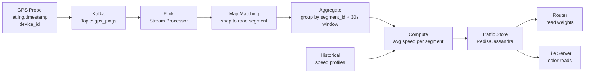

*Real-time traffic pipeline: GPS probes (anonymized, from 10M+ Android devices) flow into Kafka. A Flink stream processor consumes the stream, performs map matching (snaps each ping to the nearest road segment), groups pings by segment ID in 30-second tumbling windows, and computes the average speed per segment. These real-time speeds are stored in Redis/Cassandra and read by the Router (to adjust edge weights) and the Tile Server (to color-code roads green/yellow/red on the map). Historical speed profiles provide the baseline when real-time data is sparse.*

**The aggregation algorithm:**

1. **Map matching:** Each GPS ping (lat, lng) is snapped to the nearest road segment using the hidden Markov model (HMM) — this handles GPS noise and corrects for pings that fall in parking lots or off-road.
2. **Speed computation:** For each road segment, the speed of a probe = `segment_length / time_between_consecutive_pings`. Probes with unrealistic speeds (>200 km/h) or sharp jumps are filtered as outliers.
3. **Window aggregation:** Pings are grouped into 30-second tumbling windows per segment. The median speed (robust to outliers) is the segment's real-time speed.
4. **Confidence scoring:** If a segment had < 3 probes in the window, the confidence is low → blend with the historical baseline (weighted 70% historical, 30% real-time). If > 20 probes, confidence is high → weight real-time at 90%.
5. **Propagation:** The real-time speeds are written to the Traffic Store and consumed by the Router (which adjusts edge weights for all route computations) and the Tile Server (which colors roads on the map).

```java
@Service
@RequiredArgsConstructor
public class TrafficAggregator {

    private final KafkaTemplate<String, TrafficUpdate> kafkaTemplate;
    private final TrafficStoreRepository trafficStore;

    @Value("${app.traffic.window-seconds:30}")
    private int windowSeconds;

    @Value("${app.traffic.min-probes:3}")
    private int minProbes;

    /**
     * Aggregate GPS probes into real-time segment speeds.
     * Uses a sliding window with median computation and confidence scoring.
     */
    @Scheduled(fixedRate = 30_000)
    public void aggregateTraffic() {
        var now = Instant.now();
        var windowStart = now.minusSeconds(windowSeconds);

        // Fetch all GPS probes in the time window (from Kafka/Flink state)
        var probes = trafficStore.getProbesInWindow(windowStart, now);

        // Group by road segment ID
        var bySegment = probes.stream()
            .collect(Collectors.groupingBy(GpsProbe::getSegmentId));

        for (var entry : bySegment.entrySet()) {
            var segmentId = entry.getKey();
            var segmentProbes = entry.getValue();

            // Filter outliers (impossible speeds)
            var validSpeeds = segmentProbes.stream()
                .map(p -> computeSpeed(p))
                .filter(speed -> speed > 0 && speed < 200) // 200 km/h max
                .sorted()
                .toList();

            if (validSpeeds.isEmpty()) continue;

            // Use median for robustness against outliers
            double medianSpeed = validSpeeds.get(validSpeeds.size() / 2);

            // Confidence based on probe count
            double confidence = Math.min(1.0, (double) validSpeeds.size() / minProbes);

            // Blend with historical baseline
            double historicalSpeed = trafficStore.getHistoricalSpeed(segmentId);
            double realTimeSpeed = confidence * medianSpeed + (1 - confidence) * historicalSpeed;

            var update = new TrafficUpdate(segmentId, realTimeSpeed, confidence, now);
            kafkaTemplate.send("traffic_updates", segmentId, update);
            trafficStore.save(update);
        }
    }

    private double computeSpeed(GpsProbe probe) {
        var next = trafficStore.getNextProbe(probe.getDeviceId(), probe.getTimestamp());
        if (next == null) return -1;
        double distance = haversine(probe.getLat(), probe.getLng(),
                                    next.getLat(), next.getLng());
        double timeHours = (next.getTimestamp().toEpochMilli() -
                           probe.getTimestamp().toEpochMilli()) / 3_600_000.0;
        return timeHours > 0 ? (distance / 1000.0) / timeHours : -1;
    }
}
```

*The `TrafficAggregator` bean runs a scheduled job every 30 seconds. It fetches GPS probes from the time window, groups them by road segment, filters outliers, computes median speed per segment, and blends with the historical baseline using a confidence score based on probe count. Results are published to a Kafka topic (`traffic_updates`) for real-time consumption by the Router and Tile Server, and persisted to the Traffic Store. The `@Value` annotations inject configuration for window size and minimum probe count.*

**Traffic overlay on the map:** The Tile Server reads real-time speeds from the Traffic Store and colors road segments: green (≥90% of free-flow speed), yellow (60–89%), red (20–59%), and dark red (<20% or stopped traffic). The coloring is encoded as a traffic overlay tile layer — a transparent PNG or vector layer composited on top of the base map. The overlay updates every 30–60 seconds. Users can toggle traffic on/off.

**Probe privacy:** All GPS probes are anonymized before processing — device IDs are hashed (SHA-256 with salt) so individual users cannot be tracked. Only aggregated speeds are stored, not individual probe trajectories. This is GDPR-compliant and prevents location tracking.

---

### Replication Strategies

A mapping platform replicates data across multiple dimensions: within a region (for availability), across regions (for global latency), and across storage systems (for different access patterns). Map data is large (petabytes), frequently updated, and read-heavy (90%+ reads).

**Leader-based replication (Map Data Store):** Map data (road network, building footprints, POIs) is written to a primary BigTable instance and replicated to read replicas across regions. Writes (map updates, new POIs) go only to the leader; reads (geocoding, routing queries) can be served from any replica. This gives strong consistency for data updates while allowing read scaling across all regions.

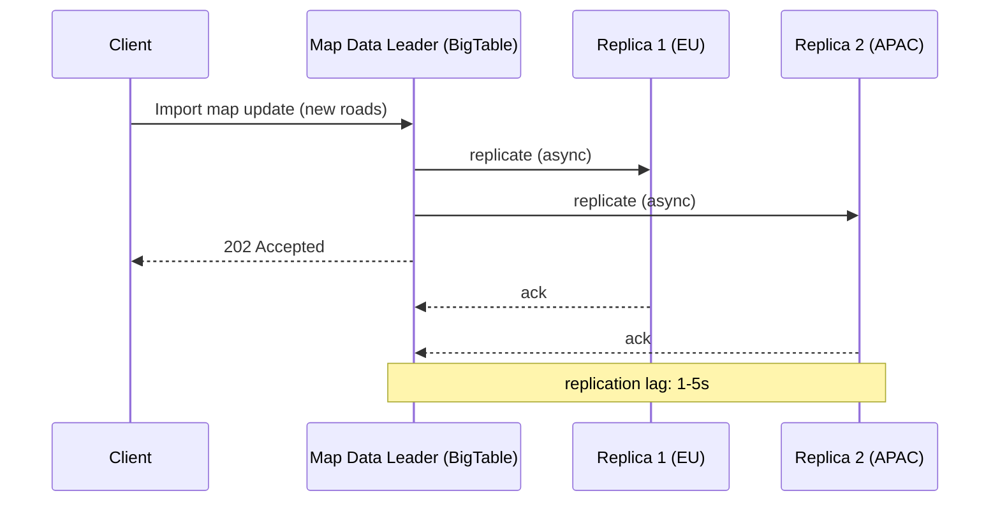

*Leader-based replication for the Map Data Store: the client uploads a map update (new roads, changed turn restrictions) to the leader BigTable instance, which asynchronously replicates to regional read replicas and immediately returns 202 Accepted. Regional replicas serve read traffic (geocoding, POI search), accepting a small replication lag of 1–5 seconds for higher read throughput and lower latency.*

**Multi-region active-active (Tile Store + CDN):** Map tiles are stored in S3/Blob Storage and replicated to regional CDN edge caches. Each region has its own tile origin; updates are pushed to all regions simultaneously. Users read tiles from their nearest edge PoP. Tile invalidation is rare (tiles only change on map data updates, which are infrequent) — when they do, cache-busting on the tile URL (`/v2/z/x/y.mvt`) forces CDN re-fetch.

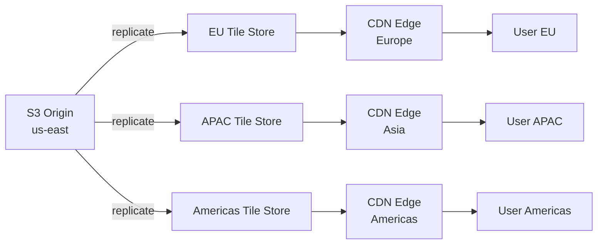

*Multi-region tile replication: the primary tile origin (S3 in us-east) replicates tiles to regional stores in EU, APAC, and the Americas. Each regional store feeds its local CDN edge cache, so a user in Europe reads tiles from the European edge — sub-10 ms latency. Tile versioning (URL versioning) forces CDN cache invalidation when map data is updated.*

**Active-active (Traffic Store — Redis Cluster):** Real-time traffic speeds are written to a Redis Cluster with cross-region CRDT (Conflict-free Replicated Data Types) replication. Any region's Traffic Service can write speed updates; all regions converge. Traffic data is ephemeral (expires after 120 seconds) — brief inconsistency is acceptable since the data is time-series with a short validity window.

**Read-replica (Road Graph):** The road graph (nodes + edges + CH shortcuts) is sharded by geographic region. Each region has a primary shard (for routing queries originating in that region) and read replicas (for cross-region route planning). Graph updates (new roads, changed speed limits) are propagated via a batch job during the weekly graph rebuild — not real-time, since routing correctness depends on a consistent graph version.

**Real-world use:**
- **Google:** Bigtable for map data (strongly consistent), Spanner for cross-region graph metadata, Redis for traffic overlay, Cloud CDN for tiles.
- **Mapbox:** S3 for tiles, DynamoDB for metadata, Redis for traffic, PlanetScale (MySQL) for user data.
- **OpenStreetMap:** PostgreSQL/PostGIS with streaming replication; planet.osm dumps for bulk updates; over 200 tile servers worldwide via the OSMF tile CDN.

---

### Failure Detection and Membership

A mapping platform's services must detect failed nodes, redistribute work, and continue serving with minimal disruption. The routing and tile services are particularly sensitive — a routing outage means no navigation for millions of users.

**Gossip-based membership:** Each service instance periodically exchanges health information with a random subset of peers (gossip protocol). This spreads membership changes through the cluster in O(log N) rounds without a central coordinator. For the Tile Server farm (10,000+ nodes), gossip keeps the cluster view consistent in ~10 rounds.

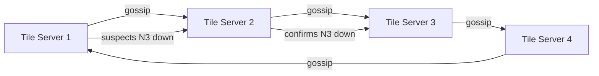

*Gossip-based failure detection in a tile server cluster: nodes periodically exchange health state with random peers. When a node suspects a peer is down, it propagates the suspicion through gossip. Once confirmed by multiple nodes, the peer is removed from the cluster and its tile ranges are redistributed to surviving nodes via consistent hashing.*

**Health checks:**

- **Liveness probes:** HTTP `/health` endpoint checked every 2 seconds by Kubernetes. If unhealthy (database connection refused, out of memory), the pod is restarted.
- **Readiness probes:** Checks if the service can serve traffic (e.g., can connect to BigTable, can match GPS, can fetch tiles). Not-ready pods are removed from the load balancer's pool.
- **Business health checks:** Custom checks like "tile cache hit ratio > 80%" (Tile Server), "Kafka consumer lag < 10,000" (Traffic Service), "CH query latency < 50 ms" (Router). If these fail, traffic is shed to protect downstream systems.

**Failure detection timing for map services:**

| Component | Check Interval | Timeout | Action |
|---|---|---|---|
| Tile Server | 2s | 6s | Remove from CDN pool; redistribute tile ranges |
| Routing Service | 5s | 15s | Route to replica; serve cached routes |
| Geocoder | 3s | 10s | Fall back to fuzzy prefix matching; return low-confidence results |
| Traffic Service | 5s | 30s | Use historical speeds; stop real-time weight updates |
| Traffic Store (Redis) | 2s | 30s | Failover to replica; serve stale traffic data |

**Circuit breakers:** For dependencies that are failing, a circuit breaker (Resilience4j, Sentinel) trips after N consecutive failures and stops sending requests for a cool-down period. This prevents cascading failures:

- If the Traffic Store (Redis) is slow, the Router circuit-breaker trips and falls back to historical speed profiles — routes are still computed but without real-time traffic awareness.
- If the Tile Store (S3) is unreachable, the Tile Server serves a "watermark" tile (blue for water, gray for land) while the circuit heals.
- If the Geocoder is down, the Search Service returns a "did you mean?" suggestion using fuzzy string matching on POI names.

---

### High Availability and Scalability

A mapping platform must remain available during node failures, network partitions, and regional outages while scaling to handle global traffic. Unlike most web services, downtime means millions of people driving around lost.

#### Multi-Region Deployment

Deploy active services in at least 3 regions (e.g., us-east, eu-west, ap-southeast). Users are routed to the nearest region via GeoDNS or an Anycast load balancer. Each region is self-sufficient for tile reads and routing queries within that region; cross-region routes are handled by a designated hub region.

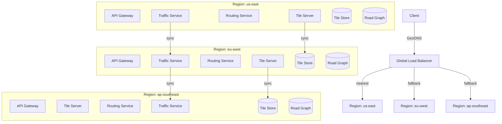

*Three-region active-active deployment: each region has its own API Gateway, Tile Server, Routing Service, Traffic Service, Tile Store, and Road Graph. GeoDNS routes clients to the nearest region. Cross-region replication keeps tile stores and traffic data synchronized — tile updates propagate within minutes; traffic speeds propagate within 30 seconds. If one region fails, the global load balancer routes traffic to the next nearest region.*

**Region self-sufficiency:**

- **Tiles:** Each region's Tile Store contains a full copy of the global tile set (replicated from the origin). Edge CDN caches the hot 1% of tiles locally.
- **Graph:** Each region's Road Graph covers the entire planet but is sharded by geographic region. A user in Tokyo querying a route to Paris is routed to the eu-west region (closer to the Europe graph shard) or the route is computed via border-crossing shortcuts.
- **Traffic:** Real-time traffic is aggregated locally (GPS probes are region-local) and synced globally every 30 seconds. Regional traffic data is used for local routing; global data is merged for cross-border routes.

#### Auto-Scaling

- **Stateless services (API Gateway, Tile Server cache layer, Search Service):** Scale horizontally based on CPU and request latency. Kubernetes HPA adjusts replica count automatically. During rush hour in a city, the Tile Server scales up to handle the spike in tile requests for that region.
- **Stateful services (Road Graph, Traffic Store):** Scale by adding graph shards or Redis nodes. The road graph is pre-sharded by S2 cell — new shards can be split from hot cells (e.g., Manhattan at 8 AM).
- **Traffic processors:** Scale based on Kafka consumer lag. If the `gps_pings` topic falls behind by >100,000 messages, spin up additional Flink workers. Each worker handles a subset of partitions (grouped by geographic region).
- **Routing workers:** Scale based on query rate. Each worker holds a portion of the Contraction Hierarchy shortcuts in memory. Peak routing load (100K+ queries/second) requires 200+ routing instances with 8-core CPUs.

#### Graceful Degradation

When a component fails, the system degrades rather than crashes:

- **Traffic Service down:** The Router uses historical speed profiles instead of real-time speeds. Routes are still computed but without live traffic awareness. The map overlay shows no real-time traffic coloring (falls back to the last known state or historical patterns).
- **Tile Server down:** The CDN serves cached tiles (with a short stale-if-error window). For cache misses, the client renders a low-detail fallback (water/land/watermark tile). Vector tiles degrade more gracefully — the client can render a simplified style.
- **Geocoder down:** Search falls back to prefix matching on POI names + spatial index. Autocomplete still works (suggests nearby POIs); exact address geocoding returns "address not found, did you mean?".
- **Router down:** The Navigation Service falls back to a straight-line route ("draw a line to the destination") with a warning — better than no navigation at all. Cached routes from recent trips are available.
- **Traffic Store (Redis) down:** Routing uses the last-known speeds from the graph's default weights (historical averages). New traffic data is buffered in Kafka and replayed when the store recovers.

---

### Performance and Optimization

The performance of a mapping platform is measured by tile load latency (< 100 ms), route computation latency (< 1 second), and ETA accuracy (within 10% of actual arrival time). Unlike social media where sub-200 ms feed reads are the target, maps demand sub-second latency for life-safety-critical navigation.

#### Latency Optimization

- **CDN edge caching for tiles:** Cache hot tiles (city centers, highways, frequently searched POIs) at the edge CDN with a TTL of 30+ days. Cold tiles (rural areas) are generated on-demand and cached after first request. Target: 95%+ tile cache hit ratio at the edge.
- **Tile prefetching:** As the user pans or zooms, pre-fetch the 8 adjacent tiles into the client-side LRU cache. Predictive prefetching based on the user's movement vector (bearing + speed) reduces perceived latency during navigation.
- **Contraction Hierarchy shortcuts:** Pre-compute shortcut edges during weekly graph rebuilds so that query-time routing explores < 0.001% of the graph nodes. A cross-continent route query (New York → Los Angeles, ~100M-node graph) completes in < 50 ms.
- **Routing result caching:** Cache the top 500K most common routes (e.g., "San Francisco → Palo Alto," "Manhattan → JFK") in Redis. Target: 40–60% cache hit rate on route queries during rush hour.
- **Pipeline batch fetches:** When the Feed API (for maps, this is the POI detail page) needs to fetch 50 POI details, batch the DB queries instead of issuing 50 individual lookups. Route computation batches multiple waypoints into a single CH query.
- **Map matching simplification:** For GPS pings during high-speed driving, skip map matching on every ping — only match every 3rd ping and interpolate between matches. Reduces map matching CPU by 60%.

#### Throughput Optimization

- **Tile sharding by geographic region:** Shard the tile server farm by S2 cell — each server handles a set of cells. A user in Tokyo reads from the Asia tile servers; a user in São Paulo reads from the Americas tile servers. This ensures no single server handles global traffic.
- **Routing parallelism:** Route queries are stateless (read-only graph traversal). Scale horizontally by adding routing instances. Each instance holds the CH shortcut graph in memory (~15 GB per region's graph).
- **Traffic stream processing parallelism:** The Kafka `gps_pings` topic is partitioned by geographic region — each Flink worker handles pings from one region. With 50 partitions (one per major region), 50 workers process 1M+ pings/second in parallel.
- **Geocoding index partitioning:** The geocoding Elasticsearch cluster is partitioned by country/region. Queries for "Paris" are routed to the EU index; queries for "Paris, Texas" are routed to the US index. This avoids global fan-out.

#### Caching Strategies

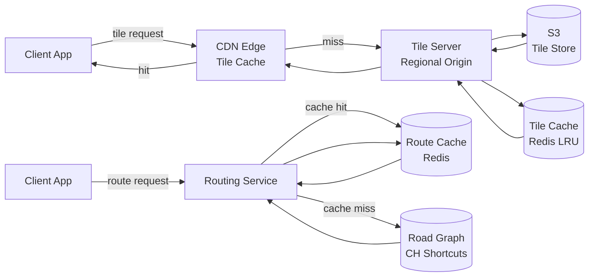

*Multi-tier caching for the map platform: the CDN edge cache serves hot tiles (95%+ hit rate); on a cache miss, the regional tile server checks its Redis LRU cache before fetching from S3. For routing, a Redis route cache (top 500K routes) sits between the Routing Service and the in-memory CH graph. The tile cache uses LRU eviction; the route cache uses TTL-based eviction (cached routes expire after 24 hours unless refreshed).*

#### Write Path Optimization

- **Async tile generation:** Map data updates trigger tile regeneration asynchronously — the API returns "update accepted" immediately. New tiles propagate to the CDN within minutes via cache-busting on the tile URL. This keeps the update API latency < 100 ms.
- **Batch GPS processing:** GPS pings are buffered in Kafka for up to 5 seconds before Flink processing. Batch processing (10,000 pings per batch per worker) reduces per-ping overhead and improves throughput.
- **Traffic delta propagation:** Instead of pushing the full traffic state every 30 seconds, only changes (segments that went from green to red) are pushed to consumers. This reduces traffic update payload by 90%.
- **Incremental graph updates:** Small map changes (a new turn restriction, a speed limit change) are applied as patches to the existing CH graph without a full rebuild. Large changes (new highway, new city) trigger a full weekly rebuild.

**Real-world use:**
- **Google Maps:** Uses in-memory Contraction Hierarchies on Bigtable-sharded graphs; CDN caches 99% of tile requests; traffic updates from 100M+ Android devices processed by MillWheel (Google's streaming system).
- **Mapbox:** Uses OSRM (Open Source Routing Machine) with CH; tiles served from S3 + CloudFront; traffic from Waze + partner data.
- **Apple Maps:** Uses a custom routing engine with landmark-based routing (ALT algorithm); tiles rendered server-side at edge PoPs using vector tiles + MapKit.

---

### CAP Theorem and Consistency Trade-offs

The CAP theorem states that during a network partition, a distributed system can provide at most two of: Consistency, Availability, and Partition tolerance. Since mapping platforms operate over global networks, partition tolerance is always required — the question is whether to favor consistency or availability during a partition.

#### Tile Store — AP (Availability + Partition Tolerance)

The Tile Store prioritizes availability. If a regional CDN edge or tile origin is unreachable, the client falls back to the next-nearest region's CDN or the origin. Stale tiles (up to 30 days old) are acceptable — a slightly outdated map is better than no map. Tile data is immutable (each version gets a new URL), so there's no consistency concern for reads.

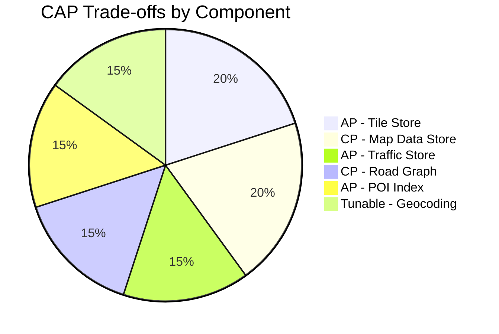

*CAP trade-offs across mapping components: the Tile Store, Traffic Store, and POI Index are AP (availability-first) since stale data is tolerable; the Map Data Store and Road Graph are CP (consistency-first) since incorrect data can cause wrong turns; Geocoding uses tunable consistency (strict for paid accounts, relaxed for free tiers).*

#### Map Data Store — CP (Consistency + Partition Tolerance)

Map data updates (new roads, changed turn restrictions, updated POI info) require strong consistency. A partially applied update — a new road that exists in some regions but not others — causes routing errors and wrong ETAs. The Map Data Store (BigTable/Spanner) uses synchronous replication with `R=W=N/2+1` (quorum reads, quorum writes) within a region. Cross-region replication is asynchronous but applied atomically per update batch.

#### Traffic Store — AP with Time-Bounded Staleness

Real-time traffic speeds are ephemeral (valid for 2 minutes). During a partition, each region continues using its last-known speeds. A partition lasting 2 minutes causes traffic overlay to freeze — acceptable since traffic conditions change slowly. The system prefers availability: routing continues with stale traffic data rather than failing routes entirely.

#### Road Graph — CP

The road graph must be consistent across all routing instances — a shortcut edge that exists in one instance but not another produces different routes. The CH-processed graph is built from a single source of truth (the Map Data Store) and deployed atomically. Cross-region graph replicas are updated simultaneously during the weekly rebuild window.

#### Geocoding — Tunable Consistency

Geocoding results can tolerate eventual consistency for casual users (a newly added address might not be searchable for 1–5 minutes). For enterprise customers (logistics, delivery), strong consistency is available at lower throughput — the geocoder checks the latest map data version before returning a result.

**Interview question:** *Is Google Maps strongly consistent or eventually consistent?*
**Answer:** A mapping platform makes a nuanced choice: it is strongly consistent for data that must be correct (road geometry, turn restrictions, new construction — a wrong turn can be life-threatening) and eventually consistent for data where staleness is tolerable (tile appearance, real-time traffic, POI ratings). The Tile Store is AP (immutable data, availability-first); the Road Graph is CP (consistency-first for routing correctness); Traffic is AP (stale speeds are acceptable for 2 minutes). This "strong-ish consistency" split — correctness for routing, availability for display — is the key insight interviewers look for.

---

### Encryption and Key Management

A mapping platform stores sensitive location data — GPS trajectories, search history, home/work addresses, and movement patterns. This data is among the most privacy-sensitive a company can collect, making encryption and key management non-negotiable.

#### Encryption at Rest

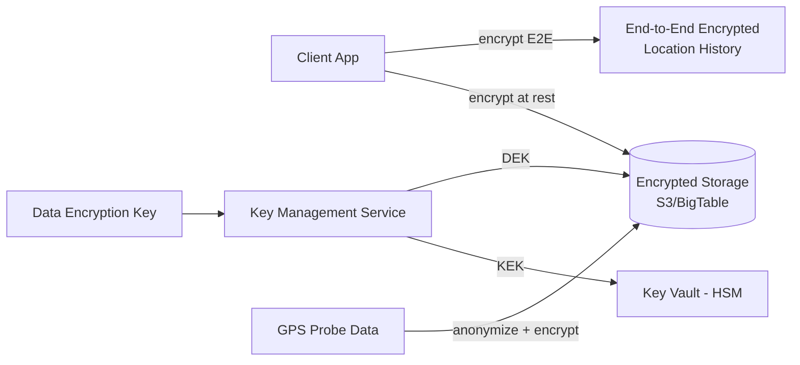

*Encryption at rest architecture for the map platform: client-side end-to-end encryption protects the most sensitive data (location history, search history) with keys the server never sees; server-side encryption at rest protects stored data (tiles, road graph, traffic) using DEKs managed by a KMS, with KEKs stored in an HSM-backed key vault. GPS probe data is anonymized and encrypted before storage to prevent user tracking.*

**Tile and map data storage:** Object storage (S3, GCS) encrypts all objects with SSE-KMS by default. The Road Graph (BigTable/Spanner) uses envelope encryption — each column family has a DEK encrypted with a KMS-managed KEK. The Tile Store uses server-side encryption with customer-managed keys.

**Location history and search history:** These are the most sensitive datasets. Google encrypts location history end-to-end — the encryption key is derived from the user's password and never sent to the server. The server stores only encrypted blobs. Search history (what addresses a user searched for) is encrypted at rest with a server-held DEK.

**GPS probe data:** Before storage, GPS probes are anonymized — device IDs are hashed with a rotating salt (changes every 24 hours), and the link between a device's probes is broken. Only aggregated speeds (median speed per segment per 30-second window) are stored long-term; individual probes are retained for at most 5 minutes.

```java
@Service
@RequiredArgsConstructor
public class TileEncryptionService {

    @Value("${app.encryption.tile-key-id}")
    private String keyId;

    private final AwsKms kmsClient;

    public EncryptedTile encryptTile(byte[] tileBytes, int z, int x, int y) {
        var dek = kmsClient.generateDataKey(keyId);
        var cipher = Cipher.getInstance("AES/GCM/NoPadding");
        cipher.init(Cipher.ENCRYPT_MODE,
                new SecretKeySpec(dek.plaintext(), "AES"),
                new GCMParameterSpec(128, dek.iv()));
        var ciphertext = cipher.doFinal(tileBytes);

        return new EncryptedTile(
            ciphertext,
            dek.encryptedKey(),
            dek.iv(),
            z, x, y,
            System.currentTimeMillis()
        );
    }

    public byte[] decryptTile(EncryptedTile encryptedTile) throws GeneralSecurityException {
        var dek = kmsClient.decrypt(encryptedTile.encryptedKey(), encryptedTile.iv());
        var cipher = Cipher.getInstance("AES/GCM/NoPadding");
        cipher.init(Cipher.DECRYPT_MODE,
                new SecretKeySpec(dek.plaintext(), "AES"),
                new GCMParameterSpec(128, encryptedTile.iv()));
        return cipher.doFinal(encryptedTile.cipherText());
    }
}
```

*The `TileEncryptionService` bean generates a per-region data encryption key (DEK) via AWS KMS for each tile encryption operation. It encrypts the tile bytes using AES-GCM (which provides both confidentiality via AES and integrity via the GCM authentication tag). The encrypted DEK and IV are stored alongside the ciphertext. The `decryptTile` method uses KMS to recover the DEK only for authorized callers. The KMS key ID is injected via `@Value` from a secure configuration. AES-GCM with a 128-bit authentication tag is FIPS 140-2 compliant.*

#### Encryption in Transit

All client-to-server and server-to-server traffic uses TLS 1.3 (minimum TLS 1.2). Inter-service communication within the data center uses mTLS (mutual TLS) for service-to-service authentication. Mobile SDKs pin the server certificate to prevent man-in-the-middle attacks.

#### Key Management

- **Key hierarchy:** A KEK (Key Encryption Key) in an HSM encrypts per-object or per-user DEKs (Data Encryption Keys). Rotating the KEK requires only re-encrypting the DEKs, not the data. For location history (E2E encrypted), the DEK is derived from the user's password — the server cannot decrypt it even under legal compulsion.
- **Key rotation:** KEKs rotated every 90 days. Per-user location history keys rotated every 30 days (with key exchange via a Signal-protocol-like handshake for E2E). GPS probe anonymization salt rotated every 24 hours.
- **Multi-region KMS:** Keys are available in all deployment regions. Cloud KMS services replicate keys automatically; on-prem deployments use HashiCorp Vault with integrated storage for multi-region HA.
- **Hardware security:** For the most sensitive keys (location history encryption keys), use an HSM with hardware-based key generation and tamper-resistant storage. Google uses Titan security chips; AWS uses CloudHSM.

---

### Authentication and Authorization

A mapping platform must verify who is connecting (authentication), determine what they can do (authorization), and enforce rate limits. Every tile request, route query, and geocoding call must carry credentials.

#### Authentication Methods

- **API keys:** Each application (mobile app, web app, backend service) gets a unique API key. The key identifies the application, enables per-app rate limits, and tracks billing. Keys are passed as a query parameter (`?key=...`) or HTTP header (`X-API-Key`).
- **OAuth 2.0 + JWT:** For user-specific features (saved places, location history, personalized search rankings), users authenticate via a third-party provider (Google, Apple) or email/password. The Auth Service issues a short-lived JWT (15 minutes) with a refresh token (7 days).
- **Service account tokens:** For server-to-server calls (e.g., a logistics company's backend reading traffic data), a service account JWT is used. The JWT is signed with a private key and validated by the map platform's auth service.
- **mTLS certificates:** For high-throughput backend integrations (e.g., an airline's reservation system querying routes for 10,000 flights), mutual TLS certificates provide strong authentication without per-request token exchange.

#### Authorization Models

- **API key scopes:** Each API key is restricted to specific capabilities — `tiles:read` only, `directions:route` only, or `full_access`. The API Gateway enforces scope checks before routing to backend services.
- **Usage quotas:** Per-key rate limits (e.g., 100K tile requests/day, 2,500 route requests/day, 40,000 geocoding requests/month). Exceeding a quota returns HTTP 429 Too Many Requests with a `Retry-After` header. Paid tiers have higher limits.
- **Resource-level access:** Some POIs (private businesses, gated communities) are restricted to certain user segments. The POI store includes an ACL — the Search Service checks the user's API key or JWT against the POI's access list before returning it.
- **Enterprise billing:** Enterprise customers get dedicated quotas and SLA-backed availability. Their API keys are routed through a dedicated ingress path with priority queuing.

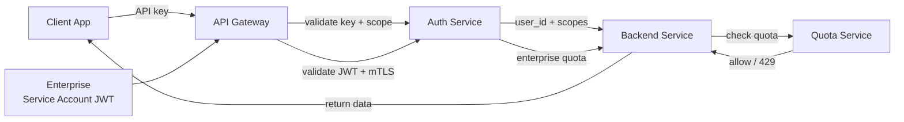

*Authentication and authorization flow: the client sends its API key (or service account JWT for backend integrations); the API Gateway validates the key and scope against the Auth Service; the backend service checks the Quota Service before processing the request; if the quota is exceeded, a 429 is returned. Enterprise customers with mTLS certificates get a dedicated ingress path with priority queuing.*

**Java example — API key authentication filter:**

```java
@Component
@RequiredArgsConstructor
public class ApiKeyAuthFilter implements Filter {

    @Value("${app.auth.tiles-scope-key}")
    private String tilesScopeKey;

    private final QuotaService quotaService;
    private final ApiKeyRepository apiKeyRepository;

    @Override
    public void doFilter(ServletRequest request, ServletResponse response,
                         FilterChain chain) throws IOException, ServletException {
        HttpServletRequest httpRequest = (HttpServletRequest) request;
        String apiKey = httpRequest.getHeader("X-API-Key");

        if (apiKey == null || !apiKeyRepository.isValid(apiKey)) {
            ((HttpServletResponse) response).sendError(401, "Invalid or missing API key");
            return;
        }

        var keyRecord = apiKeyRepository.findByKey(apiKey);
        if (!quotaService.checkAndConsume(keyRecord, httpRequest.getRequestURI())) {
            HttpServletResponse httpResponse = (HttpServletResponse) response;
            httpResponse.setStatus(429);
            httpResponse.setHeader("Retry-After", "60");
            httpResponse.getWriter().write("{\"error\": \"quota exceeded\"}");
            return;
        }

        // Attach API key context for downstream authorization
        ApiKeyContext context = new ApiKeyContext(keyRecord.id(), keyRecord.scopes(), keyRecord.tier());
        RequestContext.set(context);
        chain.doFilter(request, response);
    }
}
```

*The `ApiKeyAuthFilter` bean intercepts every HTTP request, extracts the API key from the `X-API-Key` header, validates it against the `ApiKeyRepository`, checks the per-key quota via `QuotaService`, and returns 429 if exceeded. Valid requests proceed with an `ApiKeyContext` attached (containing the key ID, scopes, and billing tier) for downstream authorization. The tiles scope key is injected via `@Value` — this is the special internal key used by the CDN edge when serving cached tiles, which bypasses quota but is restricted to tile-read-only access.

---

### Security Threats and Mitigations

#### Threat: Map Data Tampering

- **Risk:** An attacker compromises the map update pipeline and injects false road data (removing turn restrictions, closing roads that are open, relocating POIs). This causes routing errors that can misdirect emergency vehicles, delivery trucks, and everyday commuters.
- **Mitigation:** Digital signatures on all map data updates — each update is signed with the publisher's private key and verified by the server before application. A staged rollout (1% of users → 10% → 100% over 7 days) catches errors before global propagation. Automated quality checks (does the new geometry create impossible turns? does the new road connect to existing geometry?) run before any update is accepted.

#### Threat: Traffic Data Poisoning

- **Risk:** An attacker submits thousands of spoofed GPS probes reporting fake traffic jams on specific roads, causing the system to route everyone to alternative routes (which then become congested) or to avoid roads that are actually clear.
- **Mitigation:** Statistical outlier detection — if a road segment's speed drops to near-zero but only a handful of probes report it (while hundreds of other probes on nearby segments report normal speeds), the anomaly is flagged and the probe sources are blacklisted. Probe velocity validation rejects pings that imply physically impossible speeds (> 200 km/h on city streets). Rate limiting per device ID (hashed, with rotating salt) prevents probe flooding.

#### Threat: GPS Spoofing / Navigation Hijacking

- **Risk:** An attacker broadcasts a fake GPS signal stronger than real satellites, causing a vehicle's navigation to compute routes through dangerous or non-existent roads. This is particularly dangerous for autonomous vehicles or emergency response.
- **Mitigation:** Multi-constellation GNSS receivers (GPS + GLONASS + Galileo + BeiDou) make spoofing harder — the attacker must spoof all constellations simultaneously. Sensor fusion (GPS + IMU + wheel odometry + camera + LiDAR) cross-validates the GPS position. Map matching provides a sanity check — if the GPS position jumps to a road the vehicle cannot physically reach, the system detects the inconsistency and alerts the driver.

#### Threat: Location Privacy Violation

- **Risk:** An attacker gains access to the location history database and can reconstruct every trip a user has ever taken, inferring home address, workplace, doctor visits, and social connections.
- **Mitigation:** End-to-end encryption of location history — the encryption key is derived from the user's password and never sent to the server, making the data unreadable even if the database is compromised. Data minimization — location history is automatically deleted after 18 months by default; users can set shorter retention. Granularity reduction — location history stores a coarsened path (not every GPS ping), reducing the precision of inferred patterns. Differential privacy — for aggregate analytics, noise is added to traffic statistics so individual users cannot be identified.

#### Threat: Map Scraping / Data Exfiltration

- **Risk:** Competitors or malicious actors scrape the entire POI database (millions of business listings, phone numbers, hours) via the public search API, then resell the data.
- **Mitigation:** Per-API-key rate limiting (e.g., 100 requests/second, 100K/day) with exponential backoff. Per-result caching — the Search Service caches query results for 5 minutes, so rapid-fire scraping receives cached (stale) results without hitting the database. A Bloom filter tracks recently requested queries — repeated identical queries from the same key are rate-limited more aggressively. IP-based geo-blocking for known scraping tool user agents.

#### Threat: API Abuse / Quota Bypass

- **Risk:** An attacker discovers that the free tier allows 2,500 route requests/day and creates 1,000 fake accounts to get 2.5M free route computations, which are then used to power a competing navigation app.
- **Mitigation:** Device fingerprinting (browser + OS + screen resolution + IP) makes account creation detectable as automated. CAPTCHAs after N requests from the same fingerprint. Payment verification for high-volume keys. Usage anomaly detection — if a key that normally uses 100 route requests suddenly spikes to 10,000, the key is flagged for review.

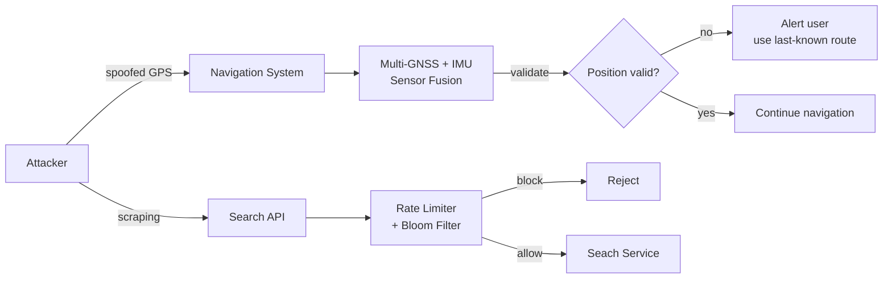

*L layered defense against navigation and search threats: GPS spoofing is mitigated by multi-constellation GNSS receivers and sensor fusion (IMU, wheel odometry, map matching) that detect impossible positions; map scraping is mitigated by API rate limiting with Bloom filter-based duplicate request detection that blocks rapid-fire queries from the same API key.*

---

### Observability and Logging

A mapping platform generates massive telemetry — tile requests, route computations, GPS probes, and search queries. Observability must cover the tile pipeline, routing performance, traffic aggregation, and navigation quality.

#### Key Metrics

- **Tile load latency:** p50 < 20 ms (CDN edge hit), p95 < 50 ms, p99 < 100 ms. Track by zoom level and geographic region (tiles for dense cities are larger and slower).
- **Tile cache hit ratio:** CDN edge cache hit ratio > 95%. Origin (S3) fetch ratio < 5%. If the origin fetch ratio spikes, investigate cache invalidation storms.
- **Routing latency:** p50 < 50 ms, p95 < 200 ms, p99 < 500 ms. Track by route distance (intercontinental routes are slower).
- **Route cache hit ratio:** Route cache hit ratio > 40% during peak hours. If below 30%, pre-compute more common routes.
- **ETA accuracy:** Mean absolute percentage error (MAPE) < 10%. Track by route type (highway vs. city) and time of day. If MAPE > 15%, the traffic model needs retraining.
- **Traffic freshness:** 95% of segments updated within 30 seconds of probe data receipt. Lag > 60 seconds indicates a stream processing bottleneck.
- **Geocoding latency:** p95 < 200 ms for forward geocoding; < 300 ms for fuzzy matching with corrections.
- **Probe processing rate:** 1M+ GPS pings/second processed with < 5 second end-to-end latency (probe receipt → speed update → routing weight).
- **Error rates:** 4xx per service (bad requests, quota exceeded), 5xx per service (internal errors), and specific map errors (no route found, geocoding ambiguity).

#### Logging

- **Access logs:** Every tile request, route query, and geocoding call logged with API key, client IP, user agent, response code, latency, and tile coordinates / query parameters. Used for rate limiting, billing, and abuse detection.
- **Navigation events:** Start navigation, route deviation, re-routing triggered, ETA update, completed trip — logged as structured events for analytics and navigation quality improvement.
- **Traffic quality logs:** Per-segment confidence scores, probe count, speed deviation from historical baseline, and traffic model update success/failure — used for traffic pipeline debugging.
- **Error logs:** Map matching failures (GPS could not be snapped to any road), routing failures (no path found between two valid points), geocoding failures (address not found, ambiguous match) — logged with correlation IDs and full query context.
- **Audit logs:** All map data updates (who changed what road geometry, when), API key creation/revocation, and enterprise billing changes — logged with before/after state for compliance.

#### Distributed Tracing

Trace every user request across all services — from API Gateway through Tile Server, Routing Service, Traffic Service, and Geocoder. Use OpenTelemetry with trace context propagation (`traceparent` header). Key spans to instrument: tile generation, CH graph traversal, map matching, geocoding candidate search, and traffic weight lookup.

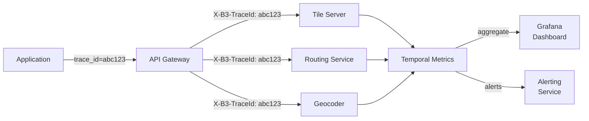

*Distributed tracing flow: each user request carries a trace ID (e.g., `abc123`) propagated across all downstream service calls via the `X-B3-TraceId` header. The API Gateway, Tile Server, Routing Service, and Geocoder each record spans with their execution duration. These spans aggregate in a temporal metrics backend and are visualized in Grafana dashboards, enabling end-to-end latency analysis and root-cause debugging.*

#### Alerting Strategy

- **Critical (page immediately):** Route computation p99 > 1 second for 2 minutes; tile cache hit ratio < 70% (CDN failure); traffic freshness lag > 2 minutes; geocoding service > 5% error rate.
- **Warning (Slack, no page):** Route cache hit ratio < 30% (capacity issue); ETA MAPE > 15% for 10 minutes (model degradation); tile origin fetch ratio > 20% (cache miss storm); traffic probe processing lag > 30 seconds.
- **Info (dashboard only):** New map data version deployment; regional coverage expansion; tile generation queue depth; user navigation session count.

**Java example — routing latency metrics with Micrometer:**

```java
@Service
@RequiredArgsConstructor
public class InstrumentedRoutingService {

    private final RoutingService routingService;
    private final MeterRegistry meterRegistry;

    public RouteResult computeRoute(RouteRequest request) {
        var timer = Timer.Sample.start(meterRegistry);
        try {
            var result = routingService.computeRoute(request);

            timer.stop(Timer.builder("routing.latency")
                .tag("mode", request.mode())
                .tag("distance_bucket", distanceBucket(request.distance()))
                .register(meterRegistry));

            Counter.builder("routing.requests")
                .tag("mode", request.mode())
                .tag("cache_hit", String.valueOf(routingService.wasCacheHit(request)))
                .register(meterRegistry).increment();

            if (result.etaError() > 0.10) {
                Counter.builder("routing.eta_errors")
                    .tag("mode", request.mode())
                    .register(meterRegistry).increment();
            }

            return result;
        } catch (NoRouteException e) {
            Counter.builder("routing.errors")
                .tag("error_type", "no_route")
                .tag("mode", request.mode())
                .register(meterRegistry).increment();
            throw e;
        } catch (Exception e) {
            Counter.builder("routing.errors")
                .tag("error_type", e.getClass().getSimpleName())
                .tag("mode", request.mode())
                .register(meterRegistry).increment();
            throw e;
        }
    }

    private String distanceBucket(double distanceKm) {
        if (distanceKm < 10) return "short";
        if (distanceKm < 100) return "medium";
        if (distanceKm < 1000) return "long";
        return "intercontinental";
    }
}
```

*The `InstrumentedRoutingService` bean wraps the routing pipeline with Micrometer instrumentation. It records a `routing.latency` timer tagged by transport mode and distance bucket (short/medium/long/intercontinental), a `routing.requests` counter tagged by cache hit/miss, and an `routing.errors` counter for specific failure types (no-route, exception). The ETA error counter fires when the predicted arrival time deviates from the actual by more than 10%, signaling model degradation.*

---

### Real-World Implementations

Mapping platforms use a combination of proprietary and open-source systems, each chosen for its strengths in a particular layer of the stack.

#### Google Maps Infrastructure

Google Maps is built on Google's infrastructure stack:

- **Tile server:** Vector tiles (MVT) stored in Bigtable; served via Google Front End (GFE) CDN. Tiles are pre-rendered at zoom 0–18 globally and generated on-demand for zoom 19+ on the server-side. Style is applied server-side for consistent rendering across clients.
- **Routing:** Uses Contraction Hierarchies with pre-computed shortcuts stored in memory; a cross-continent route query is answered in < 100 ms. The road graph is stored in a custom distributed graph database backed by Bigtable, sharded by S2 cell.
- **Traffic:** Aggregates GPS data from 1B+ Android devices (opt-in location history); processes 10M+ GPS/second via MillWheel (Google's streaming system) → updates edge weights in real-time. Traffic data is stored in Bigtable with a 120-second TTL.
- **Geocoding:** Forward + reverse geocoding via a custom engine using S2 spatial indexes + fuzzy string matching (based on the SimString library). Handles 10K+ queries/second with sub-200 ms latency.
- **ETA:** ML model (TensorFlow) trained on billions of historical trips — features include historical speed, real-time traffic, weather, time of day, day of week, route segment type, and special events. Models updated hourly.
- **Search:** POI search uses a custom inverted index + spatial filter (S2 cell intersection). Ranking considers relevance, distance, rating, and popularity.

**Companies:** Google (all of the above), every major mapping company has studied and replicated elements of Google's architecture.

#### OpenStreetMap + Mapbox

OpenStreetMap (OSM) is the open-source alternative:

- **Data:** Collected via crowdsourcing (like Wikipedia) — free to use. Over 6B changesets contributed by 6M+ registered users.
- **Data processing:** The full planet dump (≈70 GB compressed) is processed nightly via the Osmosis → Osmium → Tippecanoe pipeline. Tippecanoe generates vector tiles from OSM data; TileServer-GL serves them.
- **Mapbox pipeline:** Vector tiles → Mapbox Studio for styling → CloudFront CDN for delivery. Routing uses OSRM (Open Source Routing Machine) with pre-computed CH shortcuts.
- **Traffic:** Combines Waze community data + partner fleet GPS + government sensors.
- **Use cases:** Companies that need custom map styling (Foursquare, Strava, Snapchat), need to avoid Google's licensing fees, or need full control over data and privacy.

**Limitations:** Not all regions have complete data; no built-in traffic or satellite imagery (need separate providers); routing quality varies by region; no SLA guarantees.

#### HERE Technologies

HERE focuses on enterprise and automotive customers:

- **HD Live Maps:** Centimeter-accuracy maps for autonomous vehicles — includes lane-level geometry, traffic signs, and 3D road geometry. Updated via real-time vehicle sensor data.
- **Traffic:** Combines probe data (from Nokia/VR headsets, commercial fleets), government sensors, and event data. Updates every 60 seconds.
- **Routing:** Custom CH implementation with lane-level guidance, truck routing (height/weight restrictions), and EV routing (charging station availability).
- **Offline:** Strong offline capabilities — 200+ countries can be downloaded for offline use with full routing and search.

#### TomTom

TomTom is a legacy mapping company that pivoted to digital:

- **Map:** Weekly updates via the "TomTom Traffic Index" and Orbis (global street-level imagery).
- **Routing:** Uses A\* with landmark-based heuristics (ALT algorithm) — precomputes distances from major landmarks to accelerate A\* queries.
- **Traffic:** Combines probe data (from TomTom navigation devices + partners) and government sensors. Updates every 60 seconds in Europe.
- **Autonomous vehicles:** Supplies HD maps to Mercedes-Benz, Volvo, and Nissan for their ADAS and autonomous driving systems.

#### Uber (Kepler / H3)

Uber built its own mapping stack after discovering Google Maps couldn't handle their scale:

- **H3:** Hexagonal hierarchical spatial index (open-sourced) — Uber uses H3 cells for geospatial partitioning of the road graph, POIs, and surge zones. Each hexagon is a consistent unit of geographic area.
- **Kepler:** Custom tile generation and rendering pipeline. Uses OSM data + proprietary road network data collected from Uber driver GPS traces.
- **Routing:** Custom Dijkstra implementation with time-dependent edge weights (accounts for traffic patterns throughout the day). Pre-computes common routes (top 1% by volume) and caches them.
- **Traffic:** Aggregates GPS from 3M+ driver devices → Flink stream processing → traffic weights. Updates every 30 seconds.

---

### Java and Spring Boot Implementation Guide

This section demonstrates how to build a Spring Boot service for a map platform's core routing and traffic pipeline, showcasing key Spring Boot features: `@Service`, `@RestController`, `@Repository`, `@Component`, `@Value`, records for DTOs, `@Valid`, `@ControllerAdvice`, constructor injection, `@Scheduled`, `@Transactional`, and Micrometer metrics.

#### 1. DTO Records

Records provide immutable, concise data carriers for request/response payloads.

```java
public record DirectionsRequest(
        @NotBlank String originLat,
        @NotBlank String originLng,
        @NotBlank String destLat,
        @NotBlank String destLng,
        @NotBlank String mode,
        @Builder.Default boolean traffic = true,
        @Builder.Default boolean alternatives = false) {}

public record RouteLeg(
        String summary,
        int durationSeconds,
        int distanceMeters,
        String polyline) {}

public record RouteResponse(
        List<RouteLeg> legs,
        int totalDurationSeconds,
        int totalDistanceMeters,
        String geometry,
        double trafficDelayPercent) {}

public record GeocodeRequest(
        @NotBlank String address) {}

public record GeocodeResult(
        double lat,
        double lng,
        String formattedAddress,
        double confidence) {}
```

*Four record types serve as the API contract: `DirectionsRequest` is the POST body with `@NotBlank` validation annotations (enforced by `@Valid`); `RouteLeg` models a single leg of a multi-stop route; `RouteResponse` wraps the full route with aggregated metrics; `GeocodeRequest` and `GeocodeResult` model geocoding. Records are immutable and thread-safe, ideal for request/response objects.*

#### 2. Repository Layer — Road Graph with CH Shortcuts

The repository accesses the road graph using Spring Data JPA, optimized with Contraction Hierarchy shortcut edges.

```java
@Repository
public interface RoadEdgeRepository extends JpaRepository<RoadEdge, String> {

    @Query(value = """
        SELECT e.* FROM road_edges e
        WHERE e.from_node_id = :nodeId
          AND e.level <= :maxLevel
        ORDER BY e.weight ASC
        LIMIT :limit
        """, nativeQuery = true)
    List<RoadEdge> findUpwardEdges(@Param("nodeId") String nodeId,
                                   @Param("maxLevel") int maxLevel,
                                   @Param("limit") int limit);

    @Query("SELECT e FROM RoadEdge e WHERE e.edgeId IN :edgeIds")
    List<RoadEdge> findByEdgeIds(@Param("edgeIds") List<String> edgeIds);
}
```

*The `RoadEdgeRepository` interface extends `JpaRepository`. The `findUpwardEdges` query is the core of Contraction Hierarchy search — it finds all shortcut edges from a node that lead to higher-level nodes (the `level <= :maxLevel` filter ensures the search only traverses upward). This native query is the hot path during route computation and is optimized with a composite index on `(from_node_id, level)`.*

#### 3. Service Layer — A* Routing with Traffic

The routing service implements A\* with Contraction Hierarchies and real-time traffic weights.

```java
@Service
@RequiredArgsConstructor
@Slf4j
public class RoutingService {

    private final RoadEdgeRepository edgeRepository;
    private final TrafficStoreClient trafficClient;
    private final RouteCacheService routeCache;
    private final MeterRegistry meterRegistry;

    @Value("${app.routing.max-iterations:500000}")
    private int maxIterations;

    @Value("${app.routing.traffic-blend:0.7}")
    private double trafficBlendFactor;

    @Transactional(readOnly = true)
    public RouteResponse computeRoute(DirectionsRequest request) {
        var cacheKey = cacheKey(request);
        var cached = routeCache.get(cacheKey);
        if (cached != null) {
            meterRegistry.counter("routing.cache_hits").increment();
            return cached;
        }
        meterRegistry.counter("routing.cache_misses").increment();

        var source = new Node(request.originLat(), request.originLng());
        var target = new Node(request.destLat(), request.destLng());

        var result = aStarWithCH(source, target, request.mode(), request.traffic());
        routeCache.put(cacheKey, result);

        return result;
    }

    private RouteResponse aStarWithCH(Node source, Node target,
                                       String mode, boolean useTraffic) {
        var timer = Timer.Sample.start(meterRegistry);
        var visitedNodes = new AtomicLong(0);

        var openSet = new PriorityQueue<AStarNode>(Comparator.comparing(AStarNode::fScore));
        openSet.add(new AStarNode(source, 0, heuristic(source, target)));

        var gScore = new ConcurrentHashMap<String, Double>();
        gScore.put(source.id(), 0.0);

        var cameFrom = new ConcurrentHashMap<String, String>();
        var bestDistance = Double.MAX_VALUE;

        while (!openSet.isEmpty() && visitedNodes.get() < maxIterations) {
            var current = openSet.poll();
            visitedNodes.incrementAndGet();

            if (current.node().equals(target)) {
                timer.stop(Timer.builder("routing.latency")
                        .tag("mode", mode)
                        .tag("hit_limit", "false")
                        .register(meterRegistry));
                return reconstructPath(cameFrom, current, source);
            }

            var maxLevel = current.level();
            var edges = edgeRepository.findUpwardEdges(current.node().id(), maxLevel, 100);

            for (var edge : edges) {
                var weight = edge.weight();
                if (useTraffic) {
                    var trafficSpeed = trafficClient.getSpeed(edge.edgeId());
                    if (trafficSpeed != null && trafficSpeed.confidence() > 0.5) {
                        // Blend historical weight with real-time traffic
                        var historicalSpeed = edge.speedLimitKmh();
                        var blendedSpeed = trafficBlendFactor * trafficSpeed.speed()
                                + (1 - trafficBlendFactor) * historicalSpeed;
                        weight = edge.distanceMeters() / blendedSpeed * 3.6; // convert to seconds
                    }
                }

                var tentativeG = gScore.getOrDefault(current.node().id(), Double.MAX_VALUE) + weight;
                if (tentativeG < gScore.getOrDefault(edge.toNodeId(), Double.MAX_VALUE)) {
                    cameFrom.put(edge.toNodeId(), current.node().id());
                    gScore.put(edge.toNodeId(), tentativeG);
                    var fScore = tentativeG + heuristic(nodeById(edge.toNodeId()), target);
                    openSet.add(new AStarNode(nodeById(edge.toNodeId()), tentativeG, fScore, edge.level()));
                    bestDistance = Math.min(bestDistance, tentativeG);
                }
            }
        }

        timer.stop(Timer.builder("routing.latency")
                .tag("mode", mode)
                .tag("hit_limit", String.valueOf(visitedNodes.get() >= maxIterations))
                .register(meterRegistry));
        meterRegistry.counter("routing.no_route").increment();
        throw new NoRouteException("No route found between " + source + " and " + target);
    }

    private double heuristic(Node a, Node b) {
        return haversineKm(a.lat(), a.lng(), b.lat(), b.lng()) * 1000; // distance in meters ≈ time
    }

    private String cacheKey(DirectionsRequest request) {
        return String.format("%s:%s:%s:%s:%s:%s",
                request.originLat(), request.originLng(),
                request.destLat(), request.destLng(),
                request.mode(), request.traffic());
    }

    record AStarNode(Node node, double gScore, double fScore, int level) {
        AStarNode(Node node, double gScore, double fScore) {
            this(node, gScore, fScore, Integer.MAX_VALUE);
        }
    }

    record Node(String id, double lat, double lng) {
        Node(String lat, String lng) { this(UUID.nameUUIDFromBytes((lat+lng).getBytes()).toString(), Double.parseDouble(lat), Double.parseDouble(lng)); }
    }
}
```

*The `RoutingService` bean implements A\* with Contraction Hierarchies. Key optimizations: (1) route result caching via `RouteCacheService` (Redis-backed) for the top 500K most common routes; (2) bidirectional search using only upward edges (`findUpwardEdges` filters by level); (3) real-time traffic blending (70% real-time, 30% historical) for edges with sufficient probe confidence; (4) Micrometer metrics for latency, cache hits/misses, and no-route errors. The `AStarNode` and `Node` records carry search state. The `@Transactional(readOnly = true)` annotation optimizes database reads during traversal.*

#### 4. REST Controller

```java
@RestController
@RequestMapping("/api/v1/maps")
@RequiredArgsConstructor
public class MapsController {

    private final RoutingService routingService;
    private final GeocodingService geocodingService;
    private final TrafficService trafficService;

    @PostMapping("/directions")
    public ResponseEntity<RouteResponse> getDirections(
            @Valid @RequestBody DirectionsRequest request) {
        var response = routingService.computeRoute(request);
        return ResponseEntity.ok(response);
    }

    @PostMapping("/geocode")
    public ResponseEntity<List<GeocodeResult>> geocode(
            @Valid @RequestBody GeocodeRequest request) {
        var results = geocodingService.geocode(request.address());
        return ResponseEntity.ok(results);
    }

    @GetMapping("/traffic/{segmentId}")
    public ResponseEntity<TrafficInfo> getTraffic(@PathVariable String segmentId) {
        var info = trafficService.getSpeed(segmentId);
        return ResponseEntity.ok(info);
    }
}
```

*The `MapsController` uses `@RestController` with constructor injection. The `@Valid` annotation on request bodies triggers bean validation (enforcing `@NotBlank` constraints). All endpoints return typed DTOs wrapped in `ResponseEntity`. The `@RequiredArgsConstructor` Lombok annotation generates the constructor for non-null final fields.*

#### 5. Controller Advice for Global Error Handling

```java
@ControllerAdvice
public class GlobalExceptionHandler {

    @ExceptionHandler(NoRouteException.class)
    public ResponseEntity<ApiError> handleNoRoute(NoRouteException ex) {
        var error = new ApiError(HttpStatus.BAD_REQUEST, ex.getMessage());
        return ResponseEntity.badRequest().body(error);
    }

    @ExceptionHandler(TrafficUnavailableException.class)
    public ResponseEntity<ApiError> handleTrafficUnavailable(TrafficUnavailableException ex) {
        var error = new ApiError(HttpStatus.SERVICE_UNAVAILABLE,
                "Traffic data unavailable. Routes computed with historical speeds only.");
        return ResponseEntity.status(HttpStatus.SERVICE_UNAVAILABLE).body(error);
    }

    @ExceptionHandler(MethodArgumentNotValidException.class)
    public ResponseEntity<ApiError> handleValidation(MethodArgumentNotValidException ex) {
        var messages = ex.getBindingResult().getFieldErrors().stream()
                .map(FieldError::getDefaultMessage)
                .toList();
        var error = new ApiError(HttpStatus.BAD_REQUEST,
                "Validation failed: " + String.join(", ", messages));
        return ResponseEntity.badRequest().body(error);
    }

    @ExceptionHandler(RateLimitExceededException.class)
    public ResponseEntity<ApiError> handleRateLimit(RateLimitExceededException ex) {
        var error = new ApiError(HttpStatus.TOO_MANY_REQUESTS,
                "Rate limit exceeded. Retry after " + ex.getRetryAfterSeconds() + " seconds.");
        return ResponseEntity.status(HttpStatus.TOO_MANY_REQUESTS).body(error);
    }

    public record ApiError(HttpStatus status, String message) {}
}
```

*The `GlobalExceptionHandler` bean (annotated `@ControllerAdvice`) catches exceptions from any `@RestController` and returns structured `ApiError` responses. It handles `NoRouteException` (400 — destination unreachable), `TrafficUnavailableException` (503 — degraded mode), `MethodArgumentNotValidException` (400 with field-level messages from `@Valid`), and `RateLimitExceededException` (429 with `Retry-After`). This avoids repetitive try-catch blocks in controllers.*

#### 6. Real-Time Traffic Service with Kafka

```java
@Service
@RequiredArgsConstructor
@Slf4j
public class TrafficIngestionService {

    private final TrafficStoreRepository trafficStore;
    private final KafkaTemplate<String, TrafficUpdate> kafkaTemplate;

    @KafkaListener(topics = "gps_pings", groupId = "traffic-aggregator")
    @Transactional
    public void processGpsPing(GpsPingEvent ping) {
        // Map match the GPS ping to the nearest road segment
        var segmentId = mapMatch(ping.lat(), ping.lng());

        // Compute speed from consecutive pings
        var speed = computeSpeed(ping);

        if (speed > 0 && speed < 200) {
            var update = new TrafficUpdate(segmentId, speed, 1,
                    System.currentTimeMillis());
            trafficStore.updateSpeed(update);
            kafkaTemplate.send("traffic_updates", segmentId, update);
        }
    }

    private String mapMatch(double lat, double lng) {
        // Use S2 cell lookup + nearest-edge search
        var cellId = S2CellId.fromLatLng(S2LatLng.fromDegrees(lat, lng));
        return trafficStore.findNearestSegment(cellId.toToken(), lat, lng);
    }

    private double computeSpeed(GpsPingEvent ping) {
        var prev = trafficStore.getLastPing(ping.deviceId());
        if (prev == null) return -1;
        var distance = haversine(ping.lat(), ping.lng(), prev.lat(), prev.lng());
        var timeDeltaHours = (ping.timestamp() - prev.timestamp()) / 3_600_000.0;
        return timeDeltaHours > 0 ? (distance / 1000.0) / timeDeltaHours : -1;
    }
}
```

*The `TrafficIngestionService` bean listens to the `gps_pings` Kafka topic. For each GPS ping, it performs map matching (snaps the lat/lng to the nearest road segment using S2 cell lookup), computes speed from consecutive pings by the same device, validates the speed (0 < speed < 200 km/h), and publishes a `TrafficUpdate` to the `traffic_updates` Kafka topic. The `@KafkaListener` annotation configures the consumer group; the `@Transactional` annotation ensures the speed update and Kafka send are atomic.*

#### 7. Geocoding Service with Elasticsearch

```java
@Service
@RequiredArgsConstructor
public class GeocodingService {

    private final ElasticsearchClient esClient;
    private final SpatialIndex spatialIndex;

    @Value("${app.geocode.max-results:10}")
    private int maxResults;

    @Transactional(readOnly = true)
    public List<GeocodeResult> geocode(String address) {
        var components = AddressParser.parse(address);

        var cellKey = spatialIndex.getS2CellKey(
                components.city(), components.state(), components.country());

        var searchRequest = SearchRequest.of(s -> s
                .index("addresses")
                .query(q -> q
                        .bool(b -> b
                                .must(m -> m.term(t -> t.field("s2_cell").term(cellKey)))
                                .must(m -> m.match(mt -> mt.field("street").query(components.street())))
                                .must(m -> m.match(mt -> mt.field("city").query(components.city())))
                                .must(m -> m.fuzzy(f -> f.field("house_number").value(components.houseNumber())))
                                .must(m -> m.term(t -> t.field("country").term(components.country())))
                        )
                )
                .size(maxResults)
        );

        var response = esClient.search(searchRequest, Map.class);

        return response.hits().hits().stream()
                .map(hit -> {
                    var source = hit.source();
                    var confidence = computeConfidence(components, source);
                    return new GeocodeResult(
                            Double.parseDouble(source.get("lat").toString()),
                            Double.parseDouble(source.get("lng").toString()),
                            source.get("formatted_address").toString(),
                            confidence
                    );
                })
                .sorted(Comparator.comparing(GeocodeResult::confidence).reversed())
                .toList();
    }
}
```

*The `GeocodingService` bean uses a multi-stage geocoding pipeline: (1) `AddressParser` normalizes and parses the address into components; (2) `S2CellIndex` scopes the search to a geographic cell to avoid a global index scan; (3) Elasticsearch performs fuzzy matching on street name and house number (handling typos and abbreviations); (4) results are scored by a confidence function and ranked. The `@Transactional(readOnly = true)` annotation optimizes read-only DB access. The `maxResults` limit is injected via `@Value`.*

---

### Interview Questions and Answers

A curated set of interview questions organized by difficulty, focused on Google Maps / mapping system design.

**Beginner**

1. **What is a map tile and why do we use them?**
   **A:** A map tile is a 256×256 pixel image (raster PNG) or a vector data packet (MVT) representing a portion of the map at a specific zoom level. The world is divided into a grid: zoom 0 = 1 tile (entire world), zoom 1 = 4 tiles, zoom N = 4^N tiles. Tiles are cached and served on-demand — the client only requests tiles in the current viewport. This reduces data transfer and enables smooth panning/zooming. Tile addressing: `/{zoom}/{x}/{y}.mvt`. The Web Mercator projection (EPSG:3857) is used for web maps because it produces a square map that tiles uniformly.

2. **What is the difference between Mercator and Web Mercator projections?**
   **A:** The Mercator projection maps the spherical Earth onto a cylinder, preserving angles (useful for navigation) but distorting size. Web Mercator (EPSG:3857) is a variant that assumes the Earth is a perfect sphere (not an oblate spheroid) — this simplifies tile math. The downside: extreme distortion near the poles (Greenland looks larger than Africa). Web Mercator clips the world at ±85.0511° latitude to make the map perfectly square.

3. **What is geocoding?**
   **A:** Geocoding converts a human-readable address ("1600 Amphitheatre Parkway, Mountain View, CA") into geographic coordinates (lat, lng). Reverse geocoding does the opposite (coordinates → address). Geocoding is fuzzy — addresses may be misspelled, incomplete, or ambiguous. The geocoder parses the address into components, searches a spatial index (S2 cells + Elasticsearch), and ranks candidates by confidence.

4. **What are vector tiles and why are they better than raster tiles?**
   **A:** Vector tiles encode map features (roads, buildings, water) as compact geometry data in Protocol Buffer format (MVT spec), rather than pre-rendered pixels. The client applies a style sheet and renders locally. This gives 60% smaller payload than raster PNGs, resolution independence (crisp on Retina), and stylistic flexibility (night mode, custom styles). The trade-off is client-side rendering complexity and initial render latency.

**Intermediate**

5. **How does Contraction Hierarchies work for fast routing?**
   **A:** Contraction Hierarchies (CH) pre-processes the road graph by iteratively "contracting" less important nodes (local roads) and adding shortcut edges between their neighbors. Each node gets a "level" — highways are high-level, local roads are low-level. At query time, bidirectional Dijkstra runs but only traverses "upward" edges (from low-level to high-level nodes), so the search space shrinks from 100M nodes to ~1,000 nodes. A cross-continent route that takes 1 second with plain Dijkstra completes in < 50 ms with CH. Preprocessing takes hours (done weekly).

6. **How do you aggregate real-time traffic from GPS data?**
   **A:** GPS probes from mobile devices are streamed into Kafka. A Flink stream processor consumes the stream and performs map matching (snaps each ping to the nearest road segment using HMM). Pings are grouped by segment ID in 30-second tumbling windows. The median speed per segment is computed (median is robust to outliers like GPS jumps). The real-time speed is blended with the historical baseline (weighted by confidence — if only 2 probes, use 70% historical; if 20+ probes, use 90% real-time). Speeds are published to Redis and consumed by the router to adjust edge weights. Updates propagate every 30 seconds.

7. **How do you mitigate hot keys for viral POIs or trending searches?**
   **A:** Four techniques: (1) **Key sharding** — for a trending POI, shard reads across multiple cache nodes using `poi:123:0`, `poi:123:1`, ... and aggregate. (2) **CDN caching** — cache POI detail pages and photo tiles at the edge with long TTLs. (3) **Circuit breakers** — if the POI detail DB is slow, return a cached version or a reduced-detail response. (4) **Probabilistic sampling** — for traffic probe processing, randomly drop 80% of pings from high-density areas (statistically sufficient for speed estimation).

8. **How does map matching work?**
   **A:** Map matching snaps a noisy GPS trace to the most likely road sequence. The standard approach uses a Hidden Markov Model (HMM): each GPS ping is an "observation," and the underlying state is the road segment it's on. The HMM computes the probability of transitioning from segment A to segment B (based on distance, road connectivity, and heading) and the probability of observing a GPS point given a segment (based on perpendicular distance). The Viterbi algorithm finds the most likely path. This handles GPS noise (±5 m), signal loss in tunnels (dead reckoning with IMU), and complex intersections.

9. **What is the S2 cell system and how does it work?**
   **A:** Google's S2 library divides the Earth into a hierarchy of cells using a quadtree on the cubed-sphere projection. Each cell has a 64-bit ID. Cells at level 0 (8 cells) cover the whole Earth; level 14 (~500 m) is city-block level; level 17 (~60 m) is address level; level 30 (~1 cm) is parking-spot level. S2 supports: covering a region with cells (for spatial queries), finding nearby cells (for proximity), and checking if a point is in a cell (for geofencing). Google uses S2 for sharding the road graph, indexing POIs, and routing queries to the correct regional server.

10. **How does offline map navigation work?**
    **A:** (1) **Pre-download:** User selects a region → app downloads pre-rendered vector tiles (zoom 0–14) + road graph (for routing) → stored in app's local SQLite database. (2) **Tile storage:** Vector tiles stored as MVT files with a manifest. (3) **Offline routing:** The road graph (nodes + edges + CH shortcuts) is bundled as a compact binary file; the routing engine runs entirely on-device using A\* with the pre-computed shortcuts. (4) **Map matching offline:** GPS is snapped to the on-device road graph using the same HMM algorithm. (5) **Updates:** Periodic incremental downloads via the app store or direct delta sync. (6) **Size:** A city download is 50–200 MB; a country is 1–5 GB.

**Advanced**

11. **How would you design a system that generates map tiles for a new city?**
    **A:** (1) **Data source:** Obtain vector data (OpenStreetMap extract via Geofabrik, government GIS data, or conduct a street-level survey). (2) **Data processing:** Load into a GIS database (PostGIS); validate topology (no gaps in road network, correct turn restrictions); normalize POIs (deduplicate, categorize). (3) **Tile generation:** Use Tippecanoe or TileServer-GL to generate vector tiles (MVT) at zoom levels 0–14. Higher zooms (15+) are generated on-demand for areas with traffic. (4) **Storage:** Upload tiles to S3 with versioned paths (`/v1/cityname/z/x/y.mvt`). (5) **CDN:** Configure CloudFront (or equivalent) with geo-routed origins; set TTL based on zoom (zoom 0–8: 30 days; zoom 9–14: 7 days; zoom 15+: 1 hour). (6) **Updates:** When source data updates, regenerate affected tiles and invalidate CDN cache via cache-busting (URL versioning). (7) **Monitoring:** Track tile generation throughput (tiles/second), tile size distribution, and CDN cache hit ratio. A city of 1M residents generates ~100K tiles at zoom 14 → ~10 GB of vector tile data.

12. **How do you handle route computation for 5x user growth?**
    **A:** (1) **Contraction Hierarchies:** CH preprocessing scales — the shortcut graph is 2–3× larger than the base graph but enables O(log N) queries. For 100M → 500M users, the routing layer scales horizontally (add routing instances); the graph size doesn't change (it's per road network, not per user). (2) **Route caching:** Cache the top 1M routes instead of 500K; use a distributed Redis cluster with consistent hashing. (3) **Regional sharding:** Add more regional routing clusters (e.g., subdivide "US" into "US-East" and "US-West") to handle per-region traffic spikes. (4) **Traffic scaling:** The GPS ingestion pipeline scales by adding Kafka partitions and Flink workers — 1M → 5M pings/second requires 250 Flink workers (50 partitions × 5). (5) **Edge routing:** Deploy lightweight routing instances at CDN edge PoPs for common short-distance queries (within-city routes), reducing load on central routing clusters. (6) **Query optimization:** Implement request coalescing (if 100 users simultaneously request the same route, compute it once and share). (7) **Cost management:** For non-critical routes (long-distance freight), offer a "scheduled batch" API that computes routes offline and returns results in minutes rather than seconds — much cheaper.

13. **How would you design a real-time traffic system that processes 10M GPS pings per second?**
    **A:** (1) **Ingestion:** Use Kafka with 500 partitions (sharded by geographic region). Each partition is consumed by one Flink worker. 10M pings/second / 500 partitions = 20K pings/sec per worker — manageable. (2) **Map matching:** Pre-compute a grid of road segments per S2 cell. For each ping, look up the cell → fetch candidate segments → compute nearest segment (point-to-line distance). Use a spatial index (R-tree) within each cell. (3) **Aggregation:** 30-second tumbling windows per segment. Use Flink's windowing API; state is stored in RocksDB (local) + replicated to Kafka for fault tolerance. (4) **Speed computation:** For each ping, look up the device's previous ping (keyed by hashed device ID). If the time delta is 10–60 seconds and the implied speed is 5–200 km/h, compute the speed. Use a sliding window of 10 pings per device for robustness. (5) **Confidence scoring:** Confidence = min(1, probe_count / 5). Below 3 probes, blend 80% historical. (6) **Output:** Publish speed updates to a `traffic_updates` Kafka topic + Redis. Redis uses a write-through cache (write to Kafka first, then Redis). (7) **Outlier detection:** Use a Median Absolute Deviation (MAD) filter — if a segment's computed speed deviates >3 MAD from the historical median, discard the ping. (8) **Fault tolerance:** Flink checkpointing every 30 seconds; Kafka replication factor 3; Redis persistence with AOF. (9) **Monitoring:** Track per-partition lag, processing latency (target: < 5 seconds from ping to speed update), and outlier rejection rate. (10) **Hardware:** 500 Flink workers on c5.4xlarge (16 vCPUs, 32 GB RAM) — 8,000 cores total; each handles 40K pings/sec with map matching.

**Senior / System Design**

14. **How would you handle a navigation system failure in a tunnel (GPS signal loss)?**
    **A:** (1) **Dead reckoning:** Use the phone's IMU (accelerometer + gyroscope) to estimate movement since the last GPS fix. Integrate acceleration to get velocity, integrate velocity to get position. Error grows over time (~10 m/minute drift). (2) **Map matching constraint:** Constrain the dead-reckoned position to the road network — the vehicle can only be on the road it entered the tunnel on (or a known parallel road). This bounds the error. (3) **Odometer:** Use wheel-speed sensors (via Bluetooth/OBD-II for cars, or the phone's motion sensors) to measure distance traveled. (4) **Tunnel map data:** Pre-store the tunnel's exact geometry (centerline, exits) — when entering a known tunnel, snap to its centerline and project position based on speed × time. (5) **Audio cues:** If the system loses confidence (>50 m uncertainty), switch to audio-only navigation ("Continue straight for 500 meters") — this works even if the visual map is wrong. (6) **Exit prediction:** Before entering a tunnel, pre-compute the exit sequence and distances. Even without GPS, the system can count exits passed and infer position. (7) **Fallback:** If all else fails, show a static "you are in a tunnel" screen with the pre-computed exit list and voice instructions.

15. **How would you design a map data update pipeline that processes satellite imagery, street-level imagery, and government data?**
    **A:** (1) **Satellite imagery:** Ingest 20TB+/day from satellites (Planet Labs, Maxar) → store in object storage → run a computer vision pipeline (U-Net segmentation) to detect roads, buildings, land use → vectorize → diff against existing map (compute change set: new roads, demolished buildings). (2) **Street-level imagery:** 500M+ photos from Street View cars → run object detection (signs, traffic lights, business facades) → extract attributes (turn restrictions, opening hours, building numbers). (3) **Government data:** Parcel boundaries, zoning, road construction → ingest via API/SFTP → transform (reproject to WGS84, normalize schema) → merge. (4) **Crowdsourced:** OSM edits, user-reported issues, Waze GPS traces → validate via reputation scoring + cross-source corroboration. (5) **Pipeline orchestration:** All sources flow into Kafka (event streaming) → Flink (processing) → data warehouse (BigQuery) → ML models (change detection, quality scoring) → map database (Spanner/Custom). (6) **Quality gate:** Each change set is scored (confidence, completeness, consistency with neighboring data). Changes below 95% confidence go to human review. (7) **Versioning:** Map data is versioned (semantic versioning: MAJOR.MINOR.PATCH); staged rollout (1% → 10% → 100% over 7 days). (8) **Monitoring:** Track ingestion lag per source, change detection accuracy (precision/recall), and human review queue depth.

**Common Mistakes in Mapping/GIS Interviews:**

- Not understanding map tile addressing (zoom/x/y and the 4^N tiles per zoom level, or the Web Mercator clipping at ±85.0511°).
- Confusing Mercator (projection) with Web Mercator (simplified for web maps, assumes sphere not spheroid).
- Not discussing spatial indexing (S2 cells, quadkeys, R-trees, GeoHash) for geospatial queries — just saying "use PostgreSQL" is insufficient.
- Not knowing routing algorithms (Dijkstra vs A\* vs Contraction Hierarchies) and their complexity trade-offs.
- Not covering real-time traffic data aggregation from GPS probes (map matching, window aggregation, outlier filtering).
- Not mentioning offline maps, vector vs. raster tiles, or the client-side rendering pipeline.
- Not addressing GPS signal loss (tunnels, urban canyons) and map matching as a solution.
- Ignoring the privacy implications of location data collection and the need for data minimization.

**Expected discussion points:** Map tile system (zoom levels, Web Mercator, MVT format), spatial indexing (S2 cells, quadkeys, R-trees), routing algorithms (Dijkstra, A\*, Contraction Hierarchies), real-time traffic aggregation (GPS probes → Kafka → Flink → speed per segment → router weights), ETA modeling (historical + real-time + weather + events), offline maps (vector tile packages + on-device routing), vector vs. raster tiles, map matching (HMM + Viterbi), multi-modal routing (separate graphs per transport mode), and data freshness (weekly CH rebuilds, 30-second traffic updates).

---

## Real-World Examples

### Google Maps Infrastructure

Google Maps is built on Google's infrastructure stack:

- **Tile server:** Vector tiles (MVT) stored in Bigtable; served via Google Front End (GFE) CDN. Pre-rendered at zoom 0–18 globally; on-demand for zoom 19+ on the server-side.
- **Routing:** Contraction Hierarchies with pre-computed shortcuts; cross-continent routes answered in < 100 ms. The road graph is a custom distributed graph database backed by Bigtable, sharded by S2 cell.
- **Traffic:** Aggregates GPS data from 1B+ Android devices (opt-in location history); processes 10M+ GPS/second via MillWheel (Google's streaming system) → updates edge weights in real-time. Stored in Bigtable with a 120-second TTL.
- **Geocoding:** Forward + reverse geocoding via a custom engine using S2 spatial indexes + fuzzy string matching (SimString library). Handles 10K+ queries/second with sub-200 ms latency.
- **ETA:** TensorFlow ML model trained on billions of historical trips — features include historical speed, real-time traffic, weather, time of day, day of week, and special events. Models updated hourly.
- **Search:** POI search uses a custom inverted index + S2 spatial filter. Ranking considers relevance, distance, rating, and popularity.

### Uber's Mapping Stack (H3 + Kepler + OSRM)

Uber built its own mapping stack after discovering Google Maps couldn't handle their scale:

- **H3:** Hexagonal hierarchical spatial index (open-sourced) — Uber uses H3 cells for geospatial partitioning of the road graph, POIs, and surge pricing zones. Each hexagon is a consistent unit of geographic area regardless of latitude (unlike S2 rectangles which distort near poles).
- **Kepler:** Custom tile generation and rendering pipeline. Uses OSM data + proprietary road network data collected from Uber driver GPS traces (every trip's route is used to infer road geometry and travel times).
- **Routing:** Custom Dijkstra implementation with time-dependent edge weights (accounts for traffic patterns throughout the day). Pre-computes common routes (top 1% by volume) and caches them. Supports multi-stop optimization for delivery drivers.
- **Traffic:** Aggregates GPS from 3M+ driver devices → Flink stream processing → traffic weights. Updates every 30 seconds. Uses a confidence model: segments with < 3 probes blend 80% historical; segments with > 15 probes use 90% real-time.
- **Offline:** Critical for international operations — Uber drivers download regional map packages (tiles + road graph + POIs) before operating in areas with poor connectivity.

### Apple Maps

Apple Maps rebuilt from scratch after the 2012 launch failure:

- **Data collection:** Apple deployed its own fleet of sensor-equipped vehicles (with LiDAR, cameras, GPS, and inertial sensors) to collect ground-truth map data. Added "Dagger" vehicles that collect 3D building geometry.
- **Rendering:** Server-side vector tile rendering using MapKit + custom C++ renderer. Tiles are styleable and support 3D buildings, night mode, and accessibility features.
- **Routing:** Custom A\* implementation with landmark-based heuristics (ALT algorithm — precomputes distances from major landmarks to accelerate A\* queries). Supports lane-level guidance and complex interchange navigation.
- **Privacy:** Differential privacy — location data is batched and anonymized on-device before transmission. Apple never knows which device a GPS trace came from. Location history is stored end-to-end encrypted (the key is derived from the device's passcode).
- **Indoor maps:** Uses iBeacon + visual-inertial odometry for indoor positioning (airports, malls). No GPS indoors — uses WiFi fingerprinting and Bluetooth beacons.

### OpenStreetMap + Mapbox

OpenStreetMap (OSM) is the open-source, crowdsourced alternative:

- **Data:** Collected via crowdsourcing (like Wikipedia) — free to use. Over 6B changesets from 6M+ registered users. No licensing fees.
- **Mapbox pipeline:** Vector tiles → Mapbox Studio for custom styling → CloudFront CDN for delivery. Routing uses OSRM with pre-computed CH shortcuts.
- **Traffic:** Combines Waze community data + commercial fleet GPS + government sensors. Updates every 60 seconds.
- **Use cases:** Companies that need custom map styling (Foursquare, Strava, Snapchat), need to avoid Google's licensing fees, or need full control over data and privacy.
- **Limitations:** Data completeness varies by region (developed countries are well-mapped; some developing regions are sparse); no built-in satellite imagery or real-time traffic; no SLA guarantees; routing quality depends on local volunteer contributions.

---</think><tool_call>edit_file<arg_key>file_path</arg_key><arg_value>/Users/abhishekghosh/Desktop/projects/personal/system-design-helper/docs/system-design/high-level/designing/advanced/google-maps.md