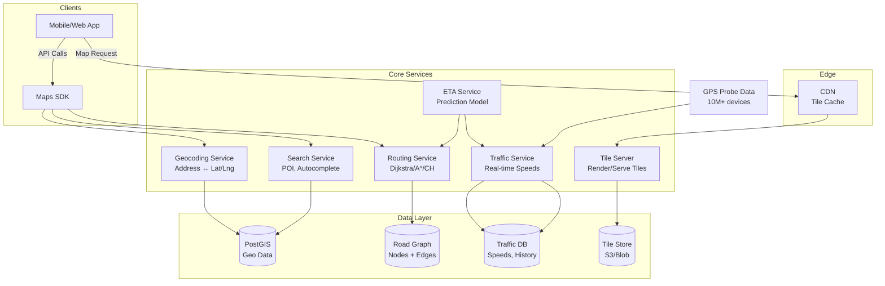
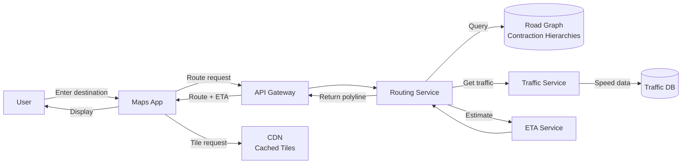

# Design Google Maps

## Blogs and websites

## Medium

## Youtube

## Theory

### What Is It?

Google Maps is a mapping and navigation service that provides interactive maps, real-time traffic, location search (geocoding), turn-by-turn navigation, and Points of Interest (POI) discovery. It must render map tiles globally at interactive speeds, compute routes with real-time traffic awareness, and handle 1B+ monthly users with millions of concurrent navigators.

### Why Does It Exist?

Before digital maps, navigation relied on paper atlases and fold-out maps — impossible to navigate unfamiliar cities or get real-time traffic updates. Digital maps democratized location information, making navigation accessible to everyone with a smartphone and enabling real-time, traffic-aware routing.

### What Problem Does It Solve?

* **Spatial data at scale**: The Earth's surface is vast (510 million km²) — how to store, index, and render relevant map data on demand.
* **Fast map tile delivery**: Users expect map tiles to load in < 100 ms at any zoom level, anywhere on Earth.
* **Route computation**: Finding the fastest path between two points on a road network with billions of edges, accounting for real-time traffic.
* **Real-time traffic**: Aggregating GPS data from millions of users to show current traffic conditions and re-route.
* **Geocoding**: Converting between human-readable addresses ("1600 Amphitheatre Parkway") and geographic coordinates (lat/lng).
* **Location search**: Finding nearby businesses, landmarks, or addresses based on a query.
* **Navigation**: Providing turn-by-turn directions with real-time re-routing as traffic conditions change.

### Important Subtopics

1. Map tile system (zoom levels, tiling schemes, caching)
2. Spatial indexing and data structures (quadkeys, R-trees)
3. Geocoding and reverse geocoding
4. Route computation (Dijkstra, A*, Contraction Hierarchies)
5. Real-time traffic data aggregation
6. ETA calculation and prediction
7. Points of Interest (POI) search and ranking
8. Vector vs. raster tile rendering
9. Offline maps and caching
10. Multi-modal navigation (driving, walking, transit)

### Problem Statement
Design a mapping and navigation system like Google Maps that supports map rendering, location search, real-time navigation with traffic, and ETA calculation.

### Functional Requirements
- Display interactive maps (pan, zoom, tilt)
- Search for places (address, business name, coordinates)
- Get directions (driving, walking, transit, cycling)
- Real-time navigation with turn-by-turn instructions
- Live traffic data and re-routing
- ETA calculation
- Points of Interest (POI) display
- Offline maps

### Non-Functional Requirements
- **Latency**: Map tile loads < 100ms, route calculation < 1s
- **Scale**: 1B+ monthly users, millions of concurrent navigating users
- **Availability**: 99.99%
- **Storage**: Petabytes of map data, satellite imagery
- **Freshness**: Traffic data updated every 30 seconds

### High-Level Architecture

```
┌──────────┐     ┌──────┐     ┌─────────────────────────────┐
│  Client  │◀───▶│  CDN │     │     Service Layer            │
│  (App)   │     └──────┘     │                              │
└────┬─────┘                  │  ┌────────────────────────┐  │
     │                        │  │ Map Tile Service        │  │
     ▼                        │  │ Search / Geocoding Svc  │  │
┌──────────┐                  │  │ Routing Service         │  │
│  API GW  │─────────────────▶│  │ Traffic Service         │  │
└──────────┘                  │  │ Navigation Service      │  │
                              │  │ ETA Service             │  │
                              │  └───────────┬────────────┘  │
                              └──────────────┼───────────────┘
                                             │
                              ┌──────────────┼──────────────┐
                              ▼              ▼              ▼
                        ┌──────────┐  ┌──────────┐  ┌──────────┐
                        │ Map Data │  │ Graph DB │  │ Traffic  │
                        │ (Tiles)  │  │ (Roads)  │  │ Store    │
                        └──────────┘  └──────────┘  └──────────┘
```

### Map Tile System

```
World divided into tiles at each zoom level:
  Zoom 0:  1 tile (entire world)
  Zoom 1:  4 tiles (2×2)
  Zoom 2:  16 tiles (4×4)
  ...
  Zoom 20: ~1 trillion tiles (very detailed)

Tile addressing: /{zoom}/{x}/{y}.png

Pre-rendered tiles stored in:
  - Object storage (S3) for base tiles
  - CDN for hot tiles (city centers, highways)
  - Client caches recently viewed tiles
```

### Routing Algorithm

```
Road network as weighted graph:
  Nodes = intersections
  Edges = road segments
  Weights = time (distance / speed_limit × traffic_factor)

Algorithm: Modified Dijkstra's + A*

For global routing: Contraction Hierarchies
  - Pre-process: Contract unimportant nodes
  - Query time: O(log N) instead of O(N log N)
  - Cross-continent routes in milliseconds
```

### Traffic System

```
Data sources:
  1. GPS data from active navigation users (anonymized)
  2. Historical traffic patterns by time/day
  3. Incident reports (accidents, construction)
  4. Government traffic sensors

Processing:
  User GPS pings → Kafka → Stream processor (Flink)
    → Aggregate speed per road segment
    → Compare with free-flow speed
    → Color coding: green/yellow/red
    → Update every 30 seconds
```

### ETA Calculation

```
ETA = Σ (segment_length / predicted_speed) for each road segment

predicted_speed = f(
  historical_average_at_this_time,
  current_real_time_traffic,
  weather_conditions,
  special_events
)

ML model trained on billions of historical trips
Re-calculate ETA every minute during navigation
```

### Key Design Decisions

| Decision | Choice | Reason |
|----------|--------|--------|
| Map rendering | Pre-rendered vector tiles | Fast loading, smooth zoom |
| Routing | Contraction Hierarchies | Fast global routing |
| Traffic data | Stream processing (Flink) | Real-time aggregation |
| Storage | S3 + CDN (tiles), Graph DB (roads) | Scale + query efficiency |
| Offline maps | Download tile packages + road graph | Navigation without internet |

---

## Characteristics

| Characteristic | What it means | Why it matters | How it works |
|---|---|---|---|
| **Tile-based rendering** | Maps divided into tiles (256x256 px) at zoom levels | Efficient rendering, caching, bandwidth | Zoom/x/y tile addressing; pre-rendered or vector |
| **Spatial indexing** | Data structures optimized for geographic queries | Fast range, nearest-neighbor, polygon queries | Quadkeys (Bing), R-trees, GeoHash |
| **Multi-modal routing** | Routes for driving, walking, cycling, transit | Users choose transport mode | Separate graph weights per mode |
| **Real-time traffic** | Current road speeds from live data | Accurate ETAs, dynamic re-routing | GPS probes + sensor data + ML |
| **Vector vs. raster** | Vector tiles encode geometry as vectors; raster as pre-rendered PNGs | Vector: scalable, styleable; Raster: simpler, offline | Mapbox GL (vector), Google Maps (vector on modern) |
| **Geospatial consistency** | Map data updates must propagate globally | Outdated maps cause routing errors | Versioning; staged rollouts |

## Components

| Component | Purpose | Responsibilities | Relationship | Real-world Example |
|---|---|---|---|---|
| **Tile Server** | Serve map tiles | Generate/store tiles at all zoom levels | Reads from Map Data Store | Google's tile server |
| **Geocoder** | Address ↔ lat/lng | Forward geocoding, reverse geocoding | Uses spatial index | Google Geocoding API |
| **Router** | Compute optimal paths | Dijkstra, A*, Contraction Hierarchies | Uses Road Graph DB | Google Directions API |
| **Traffic Service** | Real-time traffic data | Aggregate GPS probes, compute speeds, color roads | Feeds Router + ETA Service | Waze community data |
| **ETA Service** | Compute arrival time | Combine route + traffic + historical patterns | Uses Router + Traffic | Google ETA API |
| **Search Service** | Find places | POI search, autocomplete, fuzziness | Uses spatial + text index | Google Places API |
| **Map Data Store** | Store geographic data | Road networks, building footprints, imagery | Consumed by all services | PostGIS, Nebula, PlanetScale |
| **Road Graph** | Store road network | Nodes (intersections), edges (road segments) with weights | Consumed by Router | GraphHopper, OSRM |
| **CDN** | Cache tiles globally | Edge caching for tiles, reducing latency | Serves tiles to clients | Cloudflare, Akamai |

## Patterns

### Spatial Indexing with Quadkeys (or S2 Cells)

* **What**: Hierarchical spatial indexing using a quadtree or spherical geometry cells (Google's S2) to partition geographic data for efficient querying.
* **Problem solved**: "Find all restaurants within 1 km of this location" must be fast over billions of POIs.
* **How it works**: Divide the map into a hierarchical grid. At zoom level 0: whole world is one cell. At zoom level 1: 4 cells. Zoom level 2: 16 cells. Higher levels = smaller, more granular cells. Each cell has an ID (quadkey). To find nearby items: compute the cell IDs around the query point at the appropriate zoom → fetch items from those cells. Google's S2 uses spherical geometry (accounts for Earth's curvature); Bing uses quadkeys.
* **When to use**: Geospatial data storage, POI search, location-based services.
* **When not to use**: Small datasets (< 1M records) — a simple bounding-box query with an R-tree index suffices.
* **Advantages**: O(1) lookup for location-based queries; natural hierarchical clustering; cache-friendly.
* **Disadvantages**: Cell boundaries at tile edges can split nearby items into different cells; need to query adjacent cells for border cases.
* **Java/Spring Boot example**:
```java
@Service
public class SpatialSearchService {
    private final RedisTemplate<String, String> redis;

    public List<Place> findNearby(double lat, double lng, double radiusKm) {
        List<String> cellIds = s2.coverCellUnion(lat, lng, radiusKm);
        List<String> keys = cellIds.stream()
            .map(id -> "places:cell:" + id)
            .collect(Collectors.toList());
        
        List<Place> results = new ArrayList<>();
        for (String key : keys) {
            Set<String> placeIds = redis.smembers(key);
            for (String placeJson : placeIds) {
                Place place = parsePlace(placeJson);
                if (haversine(lat, lng, place.getLat(), place.getLng()) <= radiusKm) {
                    results.add(place);
                }
            }
        }
        return results;
    }
}
```
* **Real-world example**: Google S2 cells, Bing Maps quadkeys, Uber's H3 (hexagonal indexing).

### Contraction Hierarchies for Fast Routing

* **What**: A graph acceleration technique that pre-processes the road network to enable query-time shortest path computation in milliseconds (vs. seconds with Dijkstra).
* **Problem solved**: Computing a route across a continent (e.g., NYC → LA) with standard Dijkstra takes > 1 second over a graph with 100M+ nodes. Users expect < 1 second.
* **How it works**: (1) **Preprocessing**: Iteratively "contract" less important nodes (local roads) by adding shortcut edges between their neighbors. The importance of a node is its "level" — highways are high-level (kept), local roads are low-level (contracted first). (2) **Query**: Run bidirectional Dijkstra (forward from source, backward from target) — only traverse nodes in increasing level order. Skip the contracted shortcuts. This reduces the search space from 100M to ~1000 nodes.
* **When to use**: Road network routing at continental scale.
* **When not to use**: Small graphs (cities) — standard Dijkstra is fast enough; non-road graphs (social networks) where contraction doesn't help.
* **Advantages**: 1000x speedup vs. Dijkstra; query time < 10 ms even for cross-continent routes.
* **Disadvantages**: Preprocessing takes hours; updates (new roads) require partial re-computation; memory overhead for shortcut edges.
* **Real-world example**: Google Maps routing, OSRM, GraphHopper.

## Benefits

* **Navigation made simple**: Turn-by-turn directions for anyone with a smartphone.
* **Location discovery**: Find nearby businesses, services, and landmarks easily.
* **Traffic avoidance**: Real-time traffic helps users choose faster routes.
* **Urban planning**: City governments use traffic data and usage patterns for infrastructure planning.
* **Business visibility**: Local businesses appear in search results → foot traffic.

## Pros

* **Global coverage**: Maps of every country, territory, and major city.
* **Real-time data**: Live traffic, transit schedules, parking availability.
* **Multi-modal**: Driving, walking, cycling, transit, rideshare all in one app.
* **High-resolution**: Aerial imagery, Street View, 3D buildings.
* **Offline support**: Download maps + navigate without internet.
* **Integration**: Embedded in countless third-party apps (Uber, Airbnb, food delivery).

## Cons

* **Privacy concerns**: Location history tracked and stored — raises surveillance concerns.
* **Data accuracy**: Maps can be outdated (new roads, closed businesses); relies on user reports.
* **Dependence**: Users rely on maps for navigation — GPS failure is problematic.
* **Data usage**: Tiles, Street View, and real-time traffic consume significant data.
* **Accuracy limits**: GPS is ~5m accurate; urban canyons and tunnels degrade signal.

## Challenges

### Technical Challenges

* **Map data storage**: The entire planet's road network + building footprints + satellite imagery = petabytes. Storage must be efficient (vector tiles, compression).
* **Tile generation**: Generating tiles at 20+ zoom levels for the entire globe — billions of tiles. Requires distributed tile generation.
* **Routing performance**: Cross-continent routes must compute in < 1 second — requires Contraction Hierarchies or similar.
* **Real-time traffic**: Aggregating GPS data from 100M+ users; detecting traffic patterns; updating within 30 seconds.

### Scalability Challenges

* **Concurrent users**: 1B+ MAU, 20M+ concurrent navigating users — each generating GPS pings every 5-30 seconds.
* **Traffic data volume**: 1M+ GPS pings/second → stream processing (Flink/Storm) → aggregate speeds per road segment → update traffic model.
* **Tile cache**: 50+ trillion tiles possible → CDN must cache the ~1% that are frequently accessed; eviction policy for the long tail.

### Performance Challenges

* **Tile load time**: < 100 ms from request to tile display — edge caching + prefetching.
* **Routing latency**: < 1 second for any route (including cross-continent) — Contraction Hierarchies + precomputed shortcuts.
* **ETA accuracy**: Predicted arrival time must be within 10% of actual — combine historical + real-time + weather.
* **Geocoding**: < 200 ms for address → lat/lng — fuzzy matching + spatial index.

### Reliability Challenges

* **Map data freshness**: New roads, construction, businesses → must update map data without downtime.
* **GPS signal loss**: Tunnels, urban canyons → must estimate position via dead reckoning + map matching.
* **Offline degradation**: When offline, routing falls back to pre-downloaded maps (less accurate).

### Maintainability Challenges

* **Data versioning**: Rolling out updated map data globally without disruption — phased rollout.
* **API evolution**: Adding new routing options (toll, ferry, unpaved) without breaking existing clients.
* **Traffic model tuning**: Adjusting traffic weights based on real-world feedback and new data sources.

### Operational Challenges

* **Data ingestion**: Ingesting map data from governments, surveys, satellite imagery, street-level imagery — petabytes.
* **Quality assurance**: Detecting and fixing map errors (wrong turn restrictions, missing roads).
* **Regional compliance**: Different countries have different data residency and mapping regulations.

### Security Concerns

* **Location privacy**: Location history is sensitive data; must be encrypted, retained for minimal time, GDPR-compliant.
* **Map tampering**: Malicious actors could alter map data — verification + signed map updates.
* **Geofencing abuse**: Apps could track users without consent via background location.

## Best Practices

* **Vector tiles**: Use vector tiles (MVT) instead of raster PNG tiles — smaller, styleable, and efficient.
* **Hierarchical caching**: Edge CDN → regional cache → origin server for tiles; cache popular tiles at the edge.
* **Contraction Hierarchies**: Pre-compute shortcuts for fast routing; refresh after major map updates.
* **Traffic sampling**: Only sample 10-20% of GPS data (statistically sufficient); anonymize before processing.
* **Map matching**: Snapping GPS points to the nearest road — improves accuracy in urban canyons.
* **Pre-fetch tiles**: Load adjacent tiles in advance (as user scrolls) — reduces perceived latency.
* **Multi-modal separation**: Separate graphs for driving/walking/cycling — different edge weights and constraints.
* **Offline-first design**: Pre-download map tiles + road graph for regions the user visits; sync when online.

## When to Use

### Appropriate

* When you need to display geographic information (maps, routes, POIs).
* When real-time navigation (driving, walking) is needed.
* When location-based search is needed (nearby restaurants, services).
* When traffic-aware routing is needed.
* When offline map access is needed for travelers.

### Not Appropriate

* When the geographic area is small (single city) and pre-rendered maps suffice.
* When location services aren't needed (non-geographic applications).
* When the user base is not mobile or geography-independent.

### Alternatives

* **Static maps API**: Simple map images for display (Google Static Maps) — cheaper, no interactivity.
* **OpenStreetMap + Leaflet**: Open-source alternative; no licensing fees; community-driven data.
* **Mapbox**: Customizable maps with good developer experience; pay-per-use.
* **HERE, TomTom**: Enterprise-grade mapping with autonomous vehicle data.

### Decision Factors

* **Coverage needs**: Global → commercial provider; local → OSM may suffice.
* **Customization**: Need custom styling → Mapbox/OSM; need standard → Google Maps.
* **Cost**: $200/1B tiles with Google Maps vs. free OSM; weigh usage volume.
* **Latency**: Need < 100 ms tile loads → CDN + edge caching.

## Use Cases

### Ride-Hailing Navigation (Uber-like)

* **Problem**: Drivers need real-time navigation with traffic-aware routes and ETAs.
* **Solution**: Integrate Google Maps SDK — display driver location, route, traffic, and ETA.
* **Why suitable**: Real-time traffic, multi-modal (driving + walking), global coverage, offline fallback.
* **How it works**: (1) Driver app sends GPS to backend → (2) backend matches GPS to road (map matching) → (3) sends route via Google Maps Directions API → (4) ETA computed via Distance Matrix API (traffic-aware) → (5) displayed to rider (pickup time) and driver (route guidance).
* **Trade-offs**: API cost ($200/1M calls); dependence on Google; data usage.

### Food Delivery (Swiggy, Zomato)

* **Problem**: Customer sees restaurant delivery estimate; delivery agent gets optimal route.
* **Solution**: Distance Matrix API for ETAs (customer → restaurant → customer); Directions API for agent routing.
* **Why suitable**: Real-time traffic, multi-destination optimization, zone-based availability.
* **How it works**: (1) Customer places order → backend finds nearby restaurants → (2) Distance Matrix computes ETA from customer to each restaurant → (3) assigns to restaurant → (4) Swiggy agent gets navigation route → (5) live tracking shows agent's progress.
* **Trade-offs**: Delivery delays during traffic; zone boundaries affect restaurant availability.

### Location-Based Services (Find My Friends)

* **Problem**: Show friends' real-time locations on a map.
* **Solution**: Use Maps SDK + Geolocation API; periodic location updates + geofencing.
* **Why suitable**: Real-time location display, geofence triggers (notify when friend arrives).
* **How it works**: (1) Each friend shares location → sent to backend → (2) backend stores + computes proximity → (3) sends to your app → displayed on map with ETA. Geofence around home/work → notification.
* **Trade-offs**: Battery drain (GPS); privacy concerns; location accuracy in urban areas.

## Architecture

A mapping system uses **spatial databases** (PostGIS, Nebula) for storing geographic data (roads, buildings, POIs), **tile servers** for rendering map tiles (vector or raster), and **specialized routing services** using Contraction Hierarchies. **Traffic data** is aggregated from GPS probes (mobile devices) via **stream processing** (Flink/Storm) and overlaid onto routes for real-time ETAs. **CDN** caches tiles at the edge. The system is read-heavy (90%+ reads) with a small write component (map data updates, traffic processing).



### Architecture Structure

* **Edge layer**: CDN caching tiles globally; edge PoPs for low-latency tile delivery.
* **API layer**: REST/gRPC APIs for geocoding, routing, search, ETA, traffic.
* **Service layer**: Specialized services (Tile, Geocode, Route, Traffic, ETA, Search).
* **Data layer**: Spatial databases (PostGIS), graph databases (road network), key-value stores (traffic data).

### Communication

* **Client ↔ API**: HTTPS/JSON over REST or gRPC; maps SDK in mobile apps.
* **Tile delivery**: HTTP range requests; vector tiles (MVT protocol).
* **GPS probes**: Mobile apps send location pings to a collection endpoint → Kafka → stream processing.

### Data Flow

1. **Map request**: Client → CDN (cached tile) → tile server (if cache miss) → tile store → render → CDN → client.
2. **Routing**: Client → route request (source + destination) → routing service → compute path via graph DB → return polyline.
3. **Traffic**: GPS probes → stream processor → aggregate speeds per road segment → traffic model → update graph edge weights.
4. **ETA**: Route + traffic + historical patterns → ML model → ETA prediction.

### Scaling Strategy

* **Tiles**: CDN caching for hot tiles; distributed tile generation (10K+ machines for global coverage).
* **Routing**: Pre-computed Contraction Hierarchy shortcuts; sharding graph by region.
* **Traffic**: Stream processing pipeline (1M+ GPS/second); distributed aggregation.
* **Search**: Spatial + text index; sharded by region.

### Failure Handling

* **Routing service down**: Return error; client falls back to straight-line route.
* **GPS data loss**: Use last-known traffic data; interpolate.
* **Tile cache miss**: Generate on-demand; cache after first request.
* **Geocoding failure**: Fuzzy matching fallback; suggest closest match.

## High-Level Design



## Deep Dive

### Internal Implementation: Contraction Hierarchies

Contraction Hierarchies accelerates Dijkstra by pre-processing the graph:

```python
class ContractionHierarchies:
    def __init__(self, graph):
        self.graph = graph  # nodes + edges + weights
        self.levels = {}     # node -> contraction order
        self.shortcuts = {}  # node -> [shortcut edges]

    def preprocess(self):
        """Contract nodes in order of increasing importance."""
        nodes = list(self.graph.nodes())
        # Sort: contract least important first (local roads before highways)
        nodes.sort(key=lambda n: self.get_importance(n))

        for i, node in enumerate(nodes):
            self.levels[node] = i
            # For each pair of neighbors (v, w) where both are higher level:
            # Add shortcut v→w if it shortcuts through node
            neighbors = [n for n in self.graph.neighbors(node)
                         if self.levels.get(n, float('inf')) > self.levels.get(node, -1)]
            for v, w in combinations(neighbors, 2):
                if self.needs_shortcut(node, v, w):
                    self.add_shortcut(v, w, self.graph.shortest_path(v, w, exclude=node))

    def query(self, source, target):
        """Bidirectional search using only upward edges."""
        forward_queue = PriorityQueue([source])
        backward_queue = PriorityQueue([target])
        forward_dist = {source: 0}
        backward_dist = {target: 0}
        best = float('inf')

        while forward_queue and backward_queue:
            # Forward: explore from source (only to higher-level nodes)
            u = forward_queue.get()
            if forward_dist[u] + heuristic(u, target) >= best:
                continue
            for v, weight in self.graph.edges(u):
                if self.levels[v] > self.levels[u]:  # upward only
                    dist = forward_dist[u] + weight
                    if dist < forward_dist.get(v, float('inf')):
                        forward_dist[v] = dist
                        forward_queue.put(v, dist)
                        if v in backward_dist:
                            best = min(best, forward_dist[v] + backward_dist[v])

            # Backward: explore from target (only to higher-level nodes)
            u = backward_queue.get()
            if backward_dist[u] + heuristic(u, source) >= best:
                continue
            for v, weight in self.graph.edges(u):
                if self.levels[v] > self.levels[u]:  # upward only
                    dist = backward_dist[u] + weight
                    if dist < backward_dist.get(v, float('inf')):
                        backward_dist[v] = dist
                        backward_queue.put(v, dist)
                        if v in forward_dist:
                            best = min(best, forward_dist[v] + backward_dist[v])

        return best  # shortest path distance
```

### Spatial Indexing with S2 Cells

Google's S2 library divides the Earth's surface into hierarchical cells using a quadtree on the cubed sphere projection. Each cell has a 64-bit ID. The hierarchy allows efficient spatial queries (find cells within a radius, cover a region with cells).

```java
@Service
public class S2SpatialIndex {
    public List<String> coverRegion(double lat, double lng, double radiusKm) {
        S2LatLng point = S2LatLng.fromDegrees(lat, lng);
        S1Angle radius = S1Angle.fromRadians(radiusKm / 6371.0); // Earth radius in km
        S2Cap cap = S2Cap.fromAxisAngle(point.toPoint(), radius);
        S2RegionCoverer coverer = S2RegionCoverer.builder()
            .setMaxCells(8)
            .build();
        S2CellUnion covering = coverer.getCovering(cap);
        return covering.cellIds().stream()
            .map(cellId -> Long.toHexString(cellId.id()))
            .collect(Collectors.toList());
    }

    public boolean isPointInCell(double lat, double lng, String cellIdHex) {
        S2CellId cellId = S2CellId.fromLong(Long.parseUnsignedLong(cellIdHex, 16));
        S2Cell cell = new S2Cell(cellId);
        S2Point point = S2LatLng.fromDegrees(lat, lng).toPoint();
        return cell.mayContain(point);
    }
}
```

## Java and Spring Boot Implementation

### Basic Java Implementation — Distance Calculation (Haversine)

```java
@Service
public class DistanceService {
    private static final double EARTH_RADIUS_KM = 6371.0;

    public double haversine(double lat1, double lon1, double lat2, double lon2) {
        double dLat = Math.toRadians(lat2 - lat1);
        double dLon = Math.toRadians(lon2 - lon1);
        double a = Math.sin(dLat / 2) * Math.sin(dLat / 2)
                + Math.cos(Math.toRadians(lat1)) * Math.cos(Math.toRadians(lat2))
                * Math.sin(dLon / 2) * Math.sin(dLon / 2);
        double c = 2 * Math.atan2(Math.sqrt(a), Math.sqrt(1 - a));
        return EARTH_RADIUS_KM * c;
    }

    public List<NearbyPlace> findNearby(double lat, double lng, double radiusKm) {
        String cellId = geohash(lat, lng, 6); // 6-char geohash ~1.2km precision
        String key = "places:near:" + cellId;

        // Check adjacent cells for boundary cases
        List<String> adjacentCells = getAdjacentGeohashes(cellId);
        Set<String> keys = new HashSet<>(adjacentCells);
        keys.add(key);

        List<Place> candidates = redisTemplate.opsForValue().multiGet(keys);
        return candidates.stream()
            .filter(place -> haversine(lat, lng, place.getLat(), place.getLng()) <= radiusKm)
            .sorted(Comparator.comparingDouble(p -> haversine(lat, lng, p.getLat(), p.getLng())))
            .collect(Collectors.toList());
    }
}
```

### Java — Route Request Controller

```java
@RestController
@RequestMapping("/api/v1/maps")
@RequiredArgsConstructor
public class MapsController {
    private final RoutingService routingService;
    private final GeocodeService geocodeService;
    private final TrafficService trafficService;

    @GetMapping("/directions")
    public ResponseEntity<RouteResponse> getDirections(
            @RequestParam double originLat,
            @RequestParam double originLng,
            @RequestParam double destLat,
            @RequestParam double destLng,
            @RequestParam(defaultValue = "driving") String mode,
            @RequestParam(defaultValue = "false") boolean traffic) {

        RouteRequest request = RouteRequest.builder()
            .origin(new LatLng(originLat, originLng))
            .destination(new LatLng(destLat, destLng))
            .mode(mode)
            .includeTraffic(traffic)
            .build();

        RouteResponse response = routingService.computeRoute(request);
        return ResponseEntity.ok(response);
    }

    @GetMapping("/geocode")
    public ResponseEntity<GeocodeResult> geocode(@RequestParam String address) {
        GeocodeResult result = geocodeService.geocode(address);
        return ResponseEntity.ok(result);
    }

    @GetMapping("/eta")
    public ResponseEntity<EtaResponse> getEta(
            @RequestParam double originLat,
            @RequestParam double originLng,
            @RequestParam double destLat,
            @RequestParam double destLng) {
        EtaResponse response = routingService.computeEta(
            new LatLng(originLat, originLng),
            new LatLng(destLat, destLng)
        );
        return ResponseEntity.ok(response);
    }
}
```

### Testing Example

```java
@SpringBootTest
class DistanceServiceTest {
    @Autowired private DistanceService distanceService;

    @Test
    void shouldCalculateHaversineDistance() {
        // NYC to LA: ~3940 km
        double distance = distanceService.haversine(
            40.7128, -74.0060,  // NYC
            34.0522, -118.2437   // LA
        );
        assertThat(distance).isCloseTo(3940.0, Offset.offset(100.0));
    }

    @Test
    void shouldFindNearbyPlaces() {
        // San Francisco coordinates
        double sfLat = 37.7749;
        double sfLng = -122.4194;

        List<NearbyPlace> nearby = distanceService.findNearby(sfLat, sfLng, 5.0); // 5km radius
        assertThat(nearby).isNotEmpty();
        // All results should be within 5 km
        for (NearbyPlace place : nearby) {
            double distance = distanceService.haversine(
                sfLat, sfLng, place.getLat(), place.getLng());
            assertThat(distance).isLessThanOrEqualTo(5.0);
        }
    }
}
```

## Real-World Examples

### Google Maps Infrastructure

Google Maps is built on Google's infrastructure stack:
- **Tile server**: Pre-rendered tiles stored in BigTable; served via a global CDN (Google Front End). Uses vector tiles (MVT) on modern web/mobile.
- **Routing**: Uses Contraction Hierarchies with pre-computed shortcuts; a cross-continent route query is answered in < 100 ms. The road graph is stored in a custom graph database.
- **Traffic**: Aggregates GPS data from 1B+ Android devices; processes 10M+ GPS/second via MillWheel (stream processing) → updates edge weights in real-time.
- **Geocoding**: Forward + reverse geocoding via a custom engine using spatial indexes + fuzzy string matching.
- **ETA**: ML model trained on billions of historical trips; features include historical speed, real-time traffic, weather, time of day, day of week.

### Uber's Use of Maps

Uber heavily uses Google Maps for its driver and rider apps:
- **Driver app**: Real-time navigation with traffic (Google Maps SDK).
- **Rider app**: Shows driver location via Map SDK + polyline of the route.
- **ETA**: Google's Distance Matrix API computes pickup ETA; Uber adds its own predictions on top.
- **Geofencing**: Use maps to define service areas (which cities/counties Uber operates in).
- **Surge pricing**: Spatial clustering of ride requests → heat maps → surge multiplier.

### OpenStreetMap + Mapbox

OpenStreetMap (OSM) is the open-source alternative:
- **Data**: Collected via crowdsourcing (like Wikipedia) — free to use.
- **Mapbox**: Renders OSM data into vector tiles; provides SDK for mobile/web.
- **Use cases**: Companies that need custom map styling ( Foursquare, Strava) or can't afford Google Maps licensing.
- **Limitations**: Not all regions have complete data; no built-in traffic or satellite imagery (need separate providers).

## Interview Preparation

### Beginner Questions

**Q1: What is a map tile and why do we use them?**
A: A map tile is a 256×256 pixel image (or vector data) representing a portion of the map at a specific zoom level. The world is divided into a grid: zoom 0 = 1 tile (entire world), zoom 1 = 4 tiles, zoom N = 4^N tiles. Tiles are cached and served on-demand — the client only requests tiles in the current viewport. This reduces data transfer and enables smooth panning/zooming. Tile addressing: `/{zoom}/{x}/{y}.png`.

**Q2: What is the difference between Mercator and Web Mercator projections?**
A: The Mercator projection maps the spherical Earth onto a cylinder. Web Mercator (EPSG:3857) is a variant that assumes the Earth is a perfect sphere (not an oblate spheroid) — this simplifies calculations and is the standard for web maps (Google Maps, Bing Maps, OpenStreetMap). The downside: extreme distortion near the poles (Greenland looks larger than Africa).

**Q3: What is geocoding?**
A: Geococoding converts a human-readable address ("1600 Amphitheatre Parkway, Mountain View, CA") into geographic coordinates (lat, lng). Reverse geocoding does the opposite (coordinates → address). Geocoding is fuzzy (addresses may be misspelled, incomplete, or ambiguous) — uses NLP + spatial indexing.

### Intermediate Questions

**Q4: How do you store and query geospatial data?**
A: (1) **PostGIS**: PostgreSQL extension adding spatial data types (geometry, geography) + functions (ST_Distance, ST_DWithin, ST_Intersects). Uses R-tree spatial indexes. (2) **MongoDB**: Has 2dsphere index for geospatial queries. (3) **Redis**: GEO commands (GEOADD, GEORADIUS) backed by sorted sets. (4) **Elasticsearch**: Geo-point + geo-distance queries. For routing, a graph database (Neo4j) stores road networks as nodes + edges.

**Q5: How do you compute a route between two points?**
A: Model the road network as a weighted graph (nodes = intersections, edges = road segments, weight = time/distance). Use Dijkstra's algorithm for shortest path, A* (Dijkstra + heuristic — Euclidean distance to target) for faster query. For large networks, use Contraction Hierarchies (pre-process shortcuts) — cross-continent routes in < 100 ms. For real-time, incorporate live traffic weights (edge weights = distance / real_time_speed).

**Q6: How does real-time traffic work?**
A: (1) GPS probes from mobile apps → stream processing (Kafka + Flink/Storm) → aggregate speeds per road segment. (2) Historical patterns by time of day → used as fallback when no probes. (3) Sensor data from traffic cameras/road sensors. (4) Incident reports (accidents, construction). The traffic speed is a weight on the road graph — updated every 30-60 seconds.

**Q7: What is the S2 cell system?**
A: Google's S2 library divides the Earth into a hierarchy of cells (quadtree on a cubed sphere). Each cell has a 64-bit ID. Cells at level 30 are ~1 cm²; cells at level 0 are ~8,000 km². S2 supports: covering a region with cells, finding nearby cells, checking if a point is in a cell. Used for geospatial indexing, proximity queries, and spatial partitioning.

### Advanced Questions

**Q8: How would you design a system that generates map tiles for a new city?**
A: (1) **Data source**: Obtain vector data (OpenStreetMap extract, government data) → store in a GIS database (PostGIS). (2) **Tile server**: Use TileServer-GL or Mapbox Studio to render vector tiles from the source data. (3) **Generation**: Generate tiles at zoom levels 0-14 (lower zoom = world view; higher zoom = detailed). Higher zoom levels can be generated on-demand (dynamic tiling) to save storage. (4) **CDN**: Upload tiles to a CDN; configure caching by zoom level (longer TTL for lower zoom levels). (5) **Updates**: When source data updates, regenerate affected tiles. (6) **Storage**: 1M+ tiles per city × 100 bytes = ~100 MB; manageable.

**Q9: How do you handle offline maps for navigation?**
A: (1) **Pre-download**: User selects a region → app downloads pre-rendered tiles (zoom 0-14) + road graph (for routing) → stored in app's local storage. (2) **Tile storage**: SQLite database or file system storing vector tiles. (3) **Routing offline**: Store the road graph (nodes + edges + weights) in a compact format (e.g., OSMAnd's binary format). (4) **Navigation**: Use on-device routing (A* or CH) using the stored road graph. (5) **Updates**: Periodic incremental downloads of updated tiles + road data. (6) **Size**: A city download is 50-200 MB; country is 1-5 GB.

**Q10: How does the ETA model work?**
A: ETA = Σ (segment_distance / predicted_speed) for each segment of the route. The predicted_speed model uses: (1) **Historical speed**: Average speed at this time of day, day of week, from historical trips. (2) **Real-time traffic**: Current traffic conditions from GPS probes. (3) **Weather**: Rain/snow reduces speeds. (4) **Route segment type**: Highway vs. city vs. residential. (5) **Special events**: Concerts, sports → predicted slowdowns. The ML model is trained on billions of historical trips — features include all above + the actual arrival time as the target. Models are updated hourly.

### Senior-Level Questions

**Q11: How would you design a navigation system that handles 10M concurrent users with < 50ms routing latency?**
A: (1) **Contraction Hierarchies**: Pre-compute shortcuts for the entire road network; query time drops from O(N log N) (Dijkstra) to O(log N). Store shortcuts in memory (10-50 GB for a continent-sized graph). (2) **Graph sharding**: Shard the road graph by region (US, Europe, Asia); route within a shard. For cross-shard routes, use border-to-border shortcuts. (3) **Caching**: Cache top 100K most common routes (NYC→Boston, SF→LA) in Redis → 60% hit rate. (4) **Multi-level hierarchy**: Highway level (long routes), arterial level, local level — route at the coarsest level first. (5) **Hardware**: Route computation on CPU (single-threaded = 1 core per server); use 1000+ core servers. (6) **Preprocessing**: Recompute CH shortcuts weekly (map updates + real-world observations). (7) **Approximation**: For very long routes, return an approximate path (80% accurate) in < 10 ms; refine asynchronously. (8) **Monitoring**: Track P99 latency per region; alert if > 50 ms.

**Q12: How would you design a map data pipeline that ingests satellite imagery, street view, and government data sources?**
A: (1) **Satellite imagery**: Ingest 20TB+/day from satellites (Planet Labs, Maxar) → store in object storage → process via raster pipeline (detect roads, buildings) → vectorize → diff against existing map. (2) **Street-level imagery**: 500M+ photos from Street View cars → run computer vision (detect street signs, building facades) → update map attributes. (3) **Government data**: Parcel boundaries, zoning, road construction → ingest via API/SFTP → transform → merge. (4) **Crowdsourced**: OSM edits, user-reported issues, Waze GPS traces → validate → merge. (5) **Pipeline**: All sources → Kafka (event streaming) → Flink (processing) → data warehouse (BigQuery) → ML models (change detection, quality scoring) → map database (Spanner/Custom). (6) **Quality**: Each edit scored; changes reviewed (ML + human) before publishing. (7) **Versioning**: Map data versioned; staged rollout (1% → 100% over 7 days). (8) **Monitoring**: Track ingestion lag, data quality scores, edit accuracy.

### Common Mistakes and Expected Discussion Points

**Common mistakes in mapping/GIS interviews**:
- Not understanding map tile addressing (zoom/x/y and the 4^N tiles per zoom).
- Confusing Mercator (projection) with Web Mercator (simplified for web maps).
- Not discussing spatial indexing (R-trees, quadkeys, S2 cells) for geospatial queries.
- Not knowing routing algorithms (Dijkstra vs A* vs Contraction Hierarchies).
- Not covering real-time traffic data aggregation from GPS probes.
- Not understanding the trade-off between tile size, zoom levels, and cache efficiency.
- Not mentioning offline maps and vector vs. raster tiles.

**Expected discussion points**: Map tile system (zoom levels, addressing), spatial indexing (quadkeys/S2/GeoHash), routing algorithms (Dijkstra vs A* vs CH), real-time traffic aggregation (GPS probes + stream processing), ETA modeling (historical + real-time), offline maps, vector vs raster tiles.
