# Design Hashtag Service

## Blogs and websites

## Medium

## Youtube

- [Tagging Service Or HashTag Service System Design | Atlassian interview question w/a Senior Software](https://www.youtube.com/watch?v=zskh3kq8xZc)

---

## Theory

### Topics Covered

1. [Introduction / Problem Statement](#introduction--problem-statement)
2. [Characteristics](#characteristics)
3. [Pros](#pros)
4. [Cons](#cons)
5. [Use Cases](#use-cases)
6. [Components](#components)
7. [Architectural Patterns](#architectural-patterns)
8. [Benefits](#benefits)
9. [Challenges](#challenges)
10. [Best Practices](#best-practices)
11. [When to Use / When Not to Use](#when-to-use--when-not-to-use)
12. [Data Model and API](#data-model-and-api)
13. [Domain-Specific: Hashtag Service Deep Dive](#domain-specific-hashtag-service-deep-dive)
14. [Replication Strategies](#replication-strategies)
15. [Failure Detection and Membership](#failure-detection-and-membership)
16. [High Availability and Scalability](#high-availability-and-scalability)
17. [Performance and Optimization](#performance-and-optimization)
18. [CAP Theorem and Consistency Trade-offs](#cap-theorem-and-consistency-trade-offs)
19. [Encryption and Key Management](#encryption-and-key-management)
20. [Authentication and Authorization](#authentication-and-authorization)
21. [Security Threats and Mitigations](#security-threats-and-mitigations)
22. [Observability and Logging](#observability-and-logging)
23. [Real-World Implementations](#real-world-implementations)
24. [Java and Spring Boot Implementation Guide](#java-and-spring-boot-implementation-guide)
25. [Interview Questions and Answers](#interview-questions-and-answers)

---

### Introduction / Problem Statement

A hashtag service is a system that extracts, indexes, and serves content associated with hashtags or tags. Users attach hashtags (e.g., #breaking, #cats, #devops) to posts, and the service must efficiently index these tags, support fast hashtag search (show all posts with #X), detect trending tags in real-time, and provide autocomplete suggestions. The system must handle millions of concurrent hashtag searches and update tag popularity in real-time as new posts are created.

Tags and hashtags enable content discovery beyond the social graph. Without hashtags, a user's content is only visible to their followers. With hashtags, content becomes discoverable by anyone searching for that tag — whether it's a news event (#BreakingNews), a hobby (#Woodworking), or a product category (#Coffee). The hashtag service exists to make this discovery fast, scalable, and relevant.

**Problem Statement:** Design a hashtag service that supports real-time hashtag extraction from posts, sub-100 ms hashtag feed lookup, real-time trending detection with velocity-based ranking, millisecond-latency autocomplete suggestions, and hot-key mitigation for viral hashtags — all at global scale serving hundreds of millions of users while maintaining consistency and preventing abuse.

**The scaling challenge in numbers:** A breaking news event causes #BreakingNews to spike to 10,000 posts per second. A single Redis counter key for this hashtag would need to handle 100,000 writes per second (including shards and replicas). Meanwhile, autocomplete must serve millions of prefix queries per second. The system must use sharded counters for writes, read replicas for popular hashtag feeds, a compressed trie for autocomplete, and a streaming processor for trending — all while keeping the inverted index consistent within seconds of post creation.

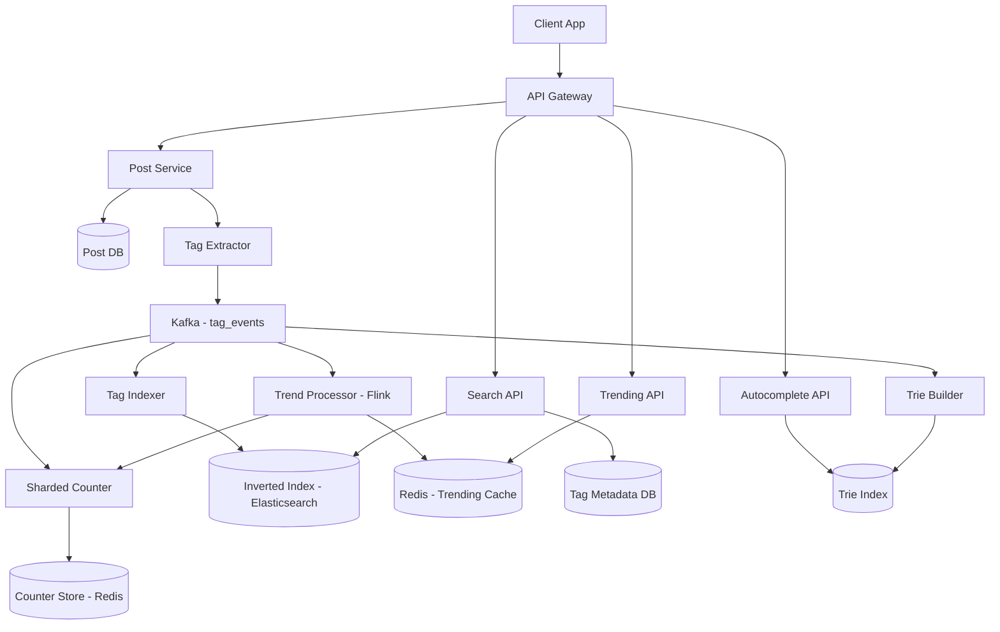

*The diagram shows the complete hashtag service topology: the Post Service extracts hashtags and publishes events to Kafka; the Tag Indexer builds an inverted index in Elasticsearch; the Sharded Counter tracks popularity in Redis using random shards; the Trend Processor (Flink) computes velocity over sliding windows; the Trie Builder maintains a prefix index for autocomplete; and three API endpoints serve search, trending, and autocomplete queries.*

**Key subtopics:**
1. Hashtag extraction and normalization from content
2. Inverted index for hashtag → content lookup
3. Real-time trend detection (velocity-based)
4. Autocomplete for hashtag suggestions
5. Sharded counters for popularity tracking (hot-key avoidance)
6. Spam and abuse detection for hashtags
7. Tag governance and canonical mapping

---

### Characteristics

| Characteristic | What it means | Why it matters | How it works |
|---|---|---|---|
| **Real-time indexing** | New hashtag usage is immediately searchable | Users expect fresh content in hashtag feeds | Write to index on post creation; propagate within seconds |
| **Hot-key resilience** | Popular hashtags don't overload the system | Trending hashtags can cause 1000x traffic spikes | Sharded counters; read replicas; caching |
| **Autocomplete** | Fast prefix-based tag suggestions | Essential for UX during tag input | Trie or n-gram index with caching |
| **Trending detection** | Real-time popularity ranking | Drives content discovery | Sliding-window counters with velocity computation |
| **Scale** | Millions of tags, billions of associations | Must handle global platforms | Distributed index, sharded storage |
| **Spam resistance** | Abuse patterns detected and mitigated | Protect trending lists and search quality | ML-based anomaly detection; reputation scoring |

---

### Pros

- **Organic discovery**: Tags enable serendipitous content discovery without algorithmic recommendation.
- **Real-time relevance**: Trending hashtags provide a real-time pulse of what's happening.
- **User-generated categorization**: Users themselves tag content, creating organic organization.
- **Marketing amplification**: Campaign hashtags encourage user participation and extend reach.
- **Low-latency search**: With proper indexing, hashtag feeds return in milliseconds.

---

### Cons

- **Tag hijacking**: Malicious users add popular tags to irrelevant content to gain visibility.
- **Spam and abuse**: Bot networks create fake hashtags and spam trend lists.
- **Hashtag overload**: Overuse of hashtags reduces their signal-to-noise ratio (Instagram's algorithm penalizes over-tagging).
- **Misinformation spread**: Trending hashtags can amplify false information (false news spreads 6x faster on Twitter).
- **Cultural/language issues**: Hashtags are language-agnostic — can lead to unintended meanings or cultural insensitivity.

---

### Use Cases

#### Breaking News Trending

* **Problem**: A breaking news story (earthquake, election results) needs to be surfaced to all users searching the relevant hashtag.
* **Solution**: Real-time trend detection monitors hashtag usage velocity — when #Earthquake trending spikes, the tag appears in trending lists within seconds.
* **Why suitable**: Hashtags are the natural way users discuss breaking news; real-time detection surfaces important events.
* **How it works**: Post created with #Earthquake → Tag Extractor normalizes → Tag Counter shard incremented → Trend Detector (Flink) sees velocity spike → tags as trending → cached trending list pushed to clients.
* **Trade-offs**: Speed vs. spam — trending too fast may surface false trends; trending too slow misses the real-time conversation.

#### Brand Campaign Tracking

* **Problem**: A brand launches a campaign with hashtag #JustDoIt — needs to track and display user-generated content.
* **Solution**: Hashtag feed shows all recent posts with #JustDoIt, sorted by recency and engagement. The brand monitors metrics (volume, sentiment, reach).
* **Why suitable**: Hashtags create an organic gallery of user-generated content without the brand having to collect submissions.
* **How it works**: Campaign launches → users post with #JustDoIt → posts indexed in the hashtag's inverted index → brand's landing page queries GET /hashtag/JustDoIt → returns recent posts → displayed.
* **Trade-offs**: Brand can't control which content appears (someone might post negative content with the hashtag); need content moderation filters.

#### Event Coverage

* **Problem**: A music festival (#Coachella) needs a live feed of attendee posts.
* **Solution**: Hashtag feed aggregates all #Coachella posts in real-time, creating a shared experience for attendees and remote viewers.
* **Why suitable**: Hashtags unify fragmented content from thousands of users into a coherent narrative.
* **How it works**: Attendees post with #Coachella → posts indexed → trending detection surfaces event during its timeframe → users discover the hashtag via autocomplete → feed shows real-time posts.
* **Trade-offs**: Signal-to-noise ratio degrades as more users (including spammers) join; need quality filters and trending decay (older posts rank lower).

---

### Components

| Component | Purpose | Responsibilities | Relationship | Real-world Example |
|---|---|---|---|---|
| **Tag Extractor** | Parse hashtags from content | Regex extraction, normalization, dedup | Called by Post Service | Twitter's hashtag parser |
| **Tag Indexer** | Build search index | Write hashtag→post_id mapping to inverted index | Consumes from Message Bus; writes to Index Store | Elasticsearch, Solr |
| **Tag Counter** | Track popularity | Sharded counters per hashtag; compute velocity | Consumes from Message Bus; writes to Counter Store | Redis sharded counters |
| **Trend Detector** | Real-time trending | Sliding window analysis; velocity computation | Reads from Tag Counter | Storm/Flink topology |
| **Autocomplete Service** | Tag suggestions | Prefix search, popularity ranking | Reads from Trie/N-gram Index | Elasticsearch completion suggester |
| **Tag Store** | Canonical tag metadata | Tag name, canonical mapping, creation date | Read by all services | PostgreSQL |
| **Index Store** | Inverted index | Hashtag → list of post_ids with timestamps | Written by Indexer; read by Search Service | Elasticsearch, Redis |
| **Message Bus** | Event propagation | Carry post_created events, tag_created events | Used by all services | Kafka |

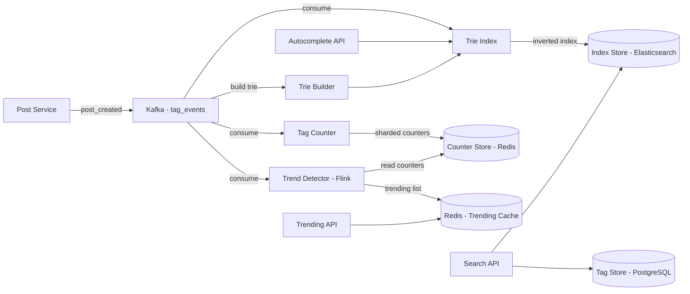

*Component interaction flow: the Post Service extracts hashtags from post content and publishes a `post_created` event to Kafka. Three independent consumers process the same stream: the Tag Indexer writes hashtag-to-post mappings into the Elasticsearch inverted index; the Tag Counter increments sharded Redis counters for popularity tracking; and the Trend Detector (Flink job) computes velocity over sliding windows using the counters. The Trie Builder maintains a prefix trie for autocomplete. At query time, the Search API reads from the index and tag metadata, the Trending API reads the cached trending list, and the Autocomplete API reads from the trie.*

#### Component Interactions

1. **Tag creation**: Post Service → Tag Extractor extracts hashtags from post content → publishes `post_created` event with hashtags → Tag Indexer writes to Index Store → Tag Counter increments sharded counters → Trend Detector monitors velocity.
2. **Tag search**: Search API → Index Store (inverted index lookup for hashtag) → fetch post metadata → rank by recency/engagement → return.
3. **Trending**: Trend Detector reads counters → computes velocity (count_now / count_previous) → ranks → caches top 100 trending tags.
4. **Autocomplete**: User types prefix → Autocomplete API → trie lookup → return top suggestions by popularity.

---

### Architectural Patterns

#### Inverted Index for Hashtag → Content

* **What**: Build an inverted index mapping each hashtag to the list of post IDs that contain it.
* **Problem solved**: Fast hashtag feed generation — "show me all posts with #cats" should return in milliseconds, even with billions of posts.
* **How it works**: When a post with #cats is created, append `post_id` to the index entry for "cats". At query time, look up "cats" → get list of post_ids → fetch post content (from Post Store) → return. Use time-based segmentation (index for last 24 hours, last 7 days, all time).
* **When to use**: When you need fast hashtag-based content discovery.
* **When not to use**: When tags are rarely queried — overhead of maintaining the index.
* **Advantages**: O(1) lookup per hashtag; scales to billions of associations.
* **Disadvantages**: Index grows with content; updates on tag changes require re-indexing.
* **Java/Spring Boot example**:
```java
@Service
public class TagIndexService {
    private final RedisTemplate<String, String> redis;

    public void indexTag(String tag, String postId, long timestamp) {
        // Store post_id in a sorted set: tag:posts:<tag> with score=timestamp
        String key = "tag:posts:" + normalizeTag(tag);
        redis.opsForZSet().add(key, postId, timestamp);
        // Auto-expire after 7 days
        redis.expire(key, Duration.ofDays(7));
    }

    public List<String> getRecentPostsForTag(String tag, int limit) {
        String key = "tag:posts:" + normalizeTag(tag);
        // ZREVRANGE = latest posts first
        return redis.opsForZSet().reverseRange(key, 0, limit - 1);
    }
}
```
* **Real-world example**: Instagram's hashtag search index.

#### Sharded Counters for Hot-Tag Mitigation

* **What**: Instead of storing a single counter per hashtag (which becomes a hot key for trending tags), use N shards per tag and sum them.
* **Problem solved**: When #BreakingNews gets 100K posts/minute, a single counter key gets 100K writes/second — Redis can't handle this on one key. Sharding across 100 keys reduces per-key write rate to 1K/sec.
* **How it works**: For tag "BreakingNews", write to keys `tag:count:BreakingNews:0`, `:1`, ... `:99` (100 shards). On write, pick a random shard (0-99) and increment. On read, sum all 100 shards (or cache the sum and update periodically).
* **When to use**: Any counter that experiences bursty, high-volume writes on a small set of keys.
* **When not to use**: Low-volume tags — sharding adds overhead without benefit.
* **Advantages**: Eliminates hot keys; scales linearly with shard count.
* **Disadvantages**: Read requires summing multiple shards (extra computation); approximate until all shards summed.
* **Real-world example**: Twitter's favorite/retweet counters; Instagram's like counters.

#### Trie-Based Autocomplete

* **What**: Store hashtags in a trie (prefix tree) for fast prefix-based autocomplete suggestions.
* **Problem solved**: As a user types "#cof", instantly return "#coffee", "#cooking", "#cookingtips" — requires sub-millisecond prefix lookup.
* **How it works**: Each character is a node in the trie. The path from root to a node spells a prefix. Each terminal node stores the list of complete hashtags and their popularity scores. Traversing the trie by character gives all completions.
* **When to use**: When autocomplete is a core feature and you need sub-millisecond response.
* **When not to use**: When the tag set is small (< 1000 tags) — a simple sorted array with binary search suffices.
* **Advantages**: O(P) lookup where P = prefix length (independent of total tag count).
* **Disadvantages**: Higher memory usage than a suffix array; updates require trie traversal.
* **Real-world example**: Twitter's hashtag autocomplete; Elasticsearch's completion suggester.

---

### Benefits

- **Content discovery**: Users find content beyond their social network via hashtags.
- **Real-time trending**: Viral topics surface instantly, driving engagement and news discovery.
- **Marketing campaigns**: Brands create campaign hashtags (#JustDoIt) for user-generated content campaigns.
- **Event coverage**: Live events (sports, concerts, breaking news) generate real-time hashtag streams.
- **Community building**: Interest-based hashtags (#DevOps, #MachineLearning) create communities around topics.
- **Search engine indexing**: Hashtags make content searchable and indexable by search engines.

---

### Challenges

#### Technical Challenges

* **Hot tags**: Trending hashtags (#BreakingNews, #SuperBowl) generate massive read + write traffic — require sharded counters, read replicas, and aggressive caching.
* **Index update latency**: New posts must appear in hashtag feeds within seconds — write index, wait for propagation, handle failures.
* **Autocomplete scaling**: Millions of tags require a memory-efficient data structure (DAWG, compressed trie) and caching of popular prefixes.
* **Case normalization**: "#Cats", "#cats", "#CATS", "#cat s" must all map to the same canonical tag. Unicode normalization is tricky.

#### Scalability Challenges

* **Fan-out to search index**: Every post with hashtags must update the inverted index — at 10K posts/second with 3 hashtags each, that's 30K index writes/second.
* **Counter consistency**: Sharded counter sums may be stale — decide between consistency (sum all shards at every read) vs. availability (cache the sum, update periodically).
* **Trend detection window**: 1-minute and 5-minute windows require real-time processing of all tag events.

#### Performance Challenges

* **Tag search latency**: Hashtag feed must return in < 100 ms (like Twitter search).
* **Autocomplete latency**: Prefix lookup must return in < 20 ms.
* **Trending computation**: Velocity must be computed over sliding windows in real-time (per-hour, per-minute).

#### Reliability Challenges

* **Index corruption**: If the inverted index is corrupted, hashtag search breaks. Need backup and rebuild capability.
* **Counter loss**: If a shard is lost, the tag's total count is wrong until the shard is restored.
* **Autocomplete cache staleness**: Cache may not reflect newly popular tags.

#### Maintainability Challenges

* **Tag governance**: Define rules for what constitutes a valid hashtag (length, characters, banned words).
* **Spam detection**: Continuously evolve abuse detection as spammers adapt.
* **Index rebuilds**: Periodically rebuild the inverted index to remove tombstones and optimize.

#### Operational Challenges

* **Trend manipulation detection**: Detect coordinated hashtag campaigns (bot armies all using the same tag simultaneously).
* **Cache invalidation**: When a tag's popularity changes, invalidate cached autocomplete results and trending lists.
* **Monitoring**: Track index lag (time from post creation to searchable), autocomplete latency, trending accuracy, and spam detection rates.

#### Security Challenges

* **Brand hijacking**: Using #YourBrand in spam posts to appear in brand searches.
* **Coordinated inauthentic behavior**: Bot networks artificially inflate hashtag popularity.
* **Sensitive content**: Hashtags can be used to flag or spread sensitive/misleading content.
* **Data scraping**: Hashtag feeds can be scraped for surveillance or marketing intelligence.

---

### Best Practices

* **Sharded counters**: For any counter that could experience bursty writes (likes, retweets, hashtag counts), use 100+ random shards per counter key.
* **Inverted index with time bounds**: Store posts in the inverted index with timestamps; expire old entries automatically (TTL). Don't keep all-time indexes for every tag.
* **Caching layers**: Cache popular hashtag feeds (top 100 trending) and autocomplete results (top 10K popular prefixes) in Redis.
* **Normalize tags**: Lowercase, strip leading #, Unicode normalization (NFKC), validate against allowed characters.
* **Read replicas for trending**: Fan-out trending list reads to multiple replicas to handle viral traffic.
* **Rate limiting**: Limit hashtag creation/usage per user to prevent spam (e.g., max 100 posts/hour with hashtags).
* **Trend velocity, not absolute count**: A tag trending at 1000→5000 posts/minute is more "trending" than one at 10000→11000 (slower growth).
* **Pre-warm popular prefixes**: Cache the top 1000 most common hashtag prefixes for autocomplete.

---

### When to Use / When Not to Use

**Use when:**

- Content needs discovery beyond the social graph (searchable content).
- Real-time trending detection is a product feature.
- Autocomplete for tag input is needed.
- Content is user-generated and benefits from organic categorization.
- Campaigns/marketing hashtags drive engagement.

**Avoid when:**

- Content is primarily personal (not meant for discovery) — privacy-focused content shouldn't be tagged.
- The tag set is controlled and small (e.g., product categories in an e-commerce site) — a simple taxonomy suffices.
- Real-time trends aren't needed — batch processing is simpler and cheaper.
- Content moderation is too strict or costly — hashtags can surface unwanted/sensitive content.

**Alternatives:**

- **Fixed taxonomy**: Predefined categories (product types, article categories) — no user-generated tags.
- **Search-only**: Full-text search without hashtag indexing — slower for exact-tag queries.
- **Topic modeling**: ML-based topic extraction from content — no user tags needed but less precise.

**Decision factors:**

- **Tag volume**: Millions of unique tags → need distributed index; thousands → simple index suffices.
- **Query volume**: High read volume for popular tags → need caching and sharding.
- **Real-time requirements**: Trending within seconds → streaming processing; hourly trends → batch OK.
- **Moderation needs**: Open tagging → more spam risk; curated tags → less risk.

---

### Data Model and API

The hashtag service data model captures tags (canonical hashtags), the posts associated with them, popularity counters, and trending metadata. Posts are immutable once created; tag counters and trend data are mutable and updated in real-time.

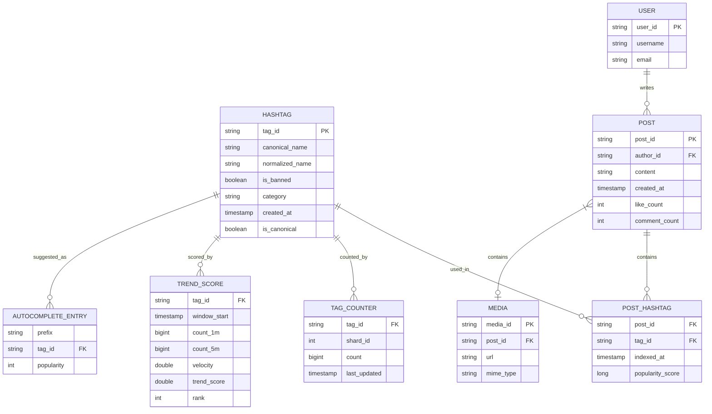

*The entity-relationship diagram shows the core domain model of a hashtag service: hashtags are canonicalized in the HASHTAG table; posts containing hashtags are linked through the POST_HASHTAG junction table; popularity is tracked via sharded TAG_COUNTER entries; TREND_SCORE stores velocity-based trend rankings per time window; AUTOCOMPLETE_ENTRY maps prefixes to suggested tags; and USER and POST entities connect to the broader content model.*

**Entity descriptions:**

- **HASHTAG:** Core entity. `tag_id` (UUID for even distribution), `canonical_name` (the display name, e.g., "BreakingNews"), `normalized_name` (lowercased, NFKC-normalized form for lookup), `is_banned` (spam/abuse flag), `category` (news, sports, entertainment), `created_at`, and `is_canonical` (flag for tag canonicalization mapping). Stored in PostgreSQL (durable) with hot tag metadata cached in Redis.
- **POST:** Immutable content. `post_id` (UUID), `author_id` (UUID FK), `content`, `created_at`, denormalized `like_count` and `comment_count` for fast reads. Stored in the Post DB (PostgreSQL sharded by author_id).
- **POST_HASHTAG:** Junction table linking posts to hashtags. `post_id`, `tag_id`, `indexed_at` (timestamp for time-based ranking), `popularity_score` (pre-computed for sorting). This is the inverted index in relational form — the primary access path for hashtag feed queries is `(tag_id, indexed_at DESC)`.
- **TAG_COUNTER:** Sharded popularity counter. `tag_id`, `shard_id` (0..99), `count`, `last_updated`. Read by the Trend Detector to compute velocity. Stored in Redis for low-latency updates.
- **TREND_SCORE:** Pre-computed trending rankings. `tag_id`, `window_start` (timestamp for the sliding window), `count_1m` (posts in last 1 minute), `count_5m` (posts in last 5 minutes), `velocity` (count_1m / (count_5m/5)), `trend_score` (ranking score = volume × velocity), `rank` (position in trending list). Computed by the Trend Detector (Flink) and cached in Redis.
- **AUTOCOMPLETE_ENTRY:** Prefix-to-tag mapping for autocomplete. `prefix` (e.g., "cof"), `tag_id`, `popularity` (score for ranking suggestions). Stored in a trie or Elasticsearch completion index.
- **USER:** `user_id` (UUID), `username`, `email`. Stored in PostgreSQL.
- **MEDIA:** `media_id` (UUID), `post_id`, `url` (CDN URL), `mime_type`. Stored in object storage with metadata in the Post DB.

**Indexes and Constraints:**

- `HASHTAG.normalized_name` — UNIQUE index (deduplication of canonical tags).
- `HASHTAG.canonical_name` — UNIQUE index (display name uniqueness).
- `POST(author_id, created_at)` — composite index for "user's recent posts."
- `POST_HASHTAG(tag_id, indexed_at)` — composite index for paginated hashtag feed retrieval.
- `POST_HASHTAG(post_id)` — index for "get all hashtags for a post."
- `TREND_SCORE(tag_id, window_start)` — composite index for trend history queries.
- `AUTOCOMPLETE_ENTRY(prefix, popularity)` — composite index for prefix-based ranking.

**Partitioning / Sharding:**

- **HASHTAG:** Sharded by `tag_id` hash (consistent hashing). Hot tags may be further split by popularity tier.
- **POST_HASHTAG:** Sharded by `tag_id` hash. Viral hashtags (millions of posts) get additional sub-sharding by `indexed_at` to distribute writes.
- **TAG_COUNTER:** Sharded by `tag_id` hash, then by `shard_id` (0..99). This two-level sharding ensures no single key receives burst traffic from trending tags.
- **POST:** Sharded by `author_id` hash (same as the Post DB).
- **TREND_SCORE:** Sharded by `tag_id` hash for write distribution; read via Redis cache for hot tags.
- **AUTOCOMPLETE_ENTRY:** Stored in Elasticsearch with the `prefix` field as the routing key for trie queries.

**API Contract:**

| Method | Endpoint | Purpose | Rate Limit |
|---|---|---|---|
| GET | `/api/v1/hashtags/{tag}` | Get hashtag feed (recent posts) | 1000 req/hour |
| GET | `/api/v1/hashtags/trending` | Get trending hashtags | 500 req/hour |
| GET | `/api/v1/hashtags/suggest?q=` | Autocomplete suggestions | 2000 req/hour |
| GET | `/api/v1/hashtags/{tag}/analytics` | Hashtag analytics (impressions, reach, engagement) | 200 req/hour |
| POST | `/api/v1/hashtags` | Create a new canonical hashtag | 100 req/hour |
| DELETE | `/api/v1/hashtags/{tag}` | Ban/remove a hashtag | 10 req/hour |

**GET /api/v1/hashtags/trending — Request:**

```http
GET /api/v1/hashtags/trending?limit=20&region=us HTTP/1.1
Authorization: Bearer <jwt>
Accept: application/json
```

**GET /api/v1/hashtags/trending — Response:**

```json
{
  "tags": [
    {
      "tag_id": "t_001",
      "name": "BreakingNews",
      "normalized_name": "breakingnews",
      "trend_score": 92.5,
      "velocity": 5.2,
      "post_count_1m": 4500,
      "post_count_5m": 8000,
      "rank": 1,
      "category": "news"
    }
  ],
  "region": "us",
  "generated_at": "2024-06-14T10:30:00Z",
  "ttl_seconds": 60
}
```

**GET /api/v1/hashtags/suggest — Request:**

```http
GET /api/v1/hashtags/suggest?q=cof&limit=10 HTTP/1.1
Authorization: Bearer <jwt>
Accept: application/json
```

**GET /api/v1/hashtags/suggest — Response:**

```json
{
  "prefix": "cof",
  "suggestions": [
    {"name": "coffee", "popularity": 987000},
    {"name": "cooking", "popularity": 452000},
    {"name": "cookingtips", "popularity": 320000}
  ]
}
```

**GET /api/v1/hashtags/{tag} — Request:**

```http
GET /api/v1/hashtags/cats?limit=20&cursor=eyJfb2Zmc2V0IjozMH0=&sort=recent HTTP/1.1
Authorization: Bearer <jwt>
Accept: application/json
```

**GET /api/v1/hashtags/{tag} — Response:**

```json
{
  "tag": "cats",
  "posts": [
    {
      "post_id": "p_456",
      "author_id": "u_123",
      "author_name": "Alice",
      "content": "My cat is sleeping! #cats",
      "media": [{"type": "photo", "url": "https://cdn.example.com/p_456.jpg"}],
      "created_at": "2024-06-14T10:30:00Z",
      "like_count": 42,
      "comment_count": 5
    }
  ],
  "cursor": "eyJfb2Zmc2V0IjoxMDB9=",
  "has_more": true,
  "total_count": 5000,
  "is_trending": false
}
```

**Status codes:** `200` OK, `201` Created, `204` Deleted, `400` Invalid request, `401` Auth required, `403` Forbidden (banned tag), `404` Not found, `429` Rate limited, `503` Temporarily unavailable.

**Authentication & Authorization:** OAuth 2.0 with JWT bearer tokens. Scope-based authorization: `hashtags:read`, `hashtags:write`, `hashtags:manage` (admin). Searching banned hashtags returns 403.

---

### Domain-Specific: Hashtag Service Deep Dive

This section covers the core technical challenges unique to hashtag services: how to count hashtag usage without hot keys, how to detect trending in real-time using velocity-based algorithms, how to fan-out hashtag indexing from post creation to search, how to generate hashtag timelines (feeds), and how to handle hot hashtags that experience viral traffic spikes. These topics form the heart of hashtag system design.

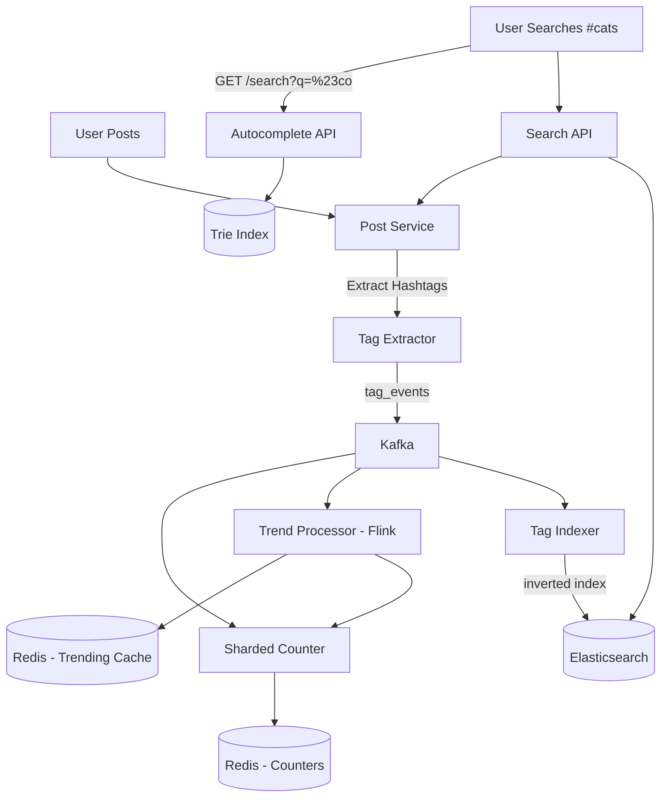

*Hashtag service end-to-end flow: when a user posts content with hashtags, the Tag Extractor parses and normalizes hashtags, publishing `tag_events` to Kafka; the Tag Indexer writes hashtag-to-post mappings into the Elasticsearch inverted index; the Sharded Counter increments popularity counters in Redis using random shards; the Trend Processor (Flink) consumes the same stream to compute trending velocity; and at query time, the Search API reads from the index and the Autocomplete API reads from the trie.*

#### Hashtag Counting

* **What:** Track the number of posts associated with each hashtag using sharded counters to avoid hot keys.
* **Problem solved:** When #BreakingNews gets 100K posts/minute, a single counter key gets 100K writes/second — Redis can't handle this on one key. Sharding across 100 keys reduces per-key write rate to 1K/sec.
* **How it works:** For tag "BreakingNews", write to keys `tag:count:BreakingNews:0`, `:1`, ... `:99` (100 shards). On write, pick a random shard (0-99) and increment. On read, sum all 100 shards (or cache the sum and update periodically).
* **When to use:** Any counter that experiences bursty, high-volume writes on a small set of keys.
* **When not to use:** Low-volume tags — sharding adds overhead without benefit.
* **Real-world example:** Twitter's favorite/retweet counters; Instagram's like counters.

```java
@Service
public class ShardedCounter {
    private static final int NUM_SHARDS = 100;
    private final RedisTemplate<String, String> redis;
    private final Random random = new Random();

    public void increment(String tag) {
        int shard = random.nextInt(NUM_SHARDS);
        String key = "tag:count:" + tag + ":" + shard;
        redis.opsForValue().increment(key);
        redis.expire(key, Duration.ofHours(24));
    }

    public long getCount(String tag) {
        // Option 1: Sum all shards (accurate but slow)
        // return IntStream.range(0, NUM_SHARDS)
        //     .mapToLong(i -> redis.opsForValue().increment("tag:count:" + tag + ":" + i, 0))
        //     .sum();

        // Option 2: Cached aggregate (fast, slightly stale)
        String cacheKey = "tag:count:" + tag + ":total";
        String cached = redis.opsForValue().get(cacheKey);
        if (cached != null) return Long.parseLong(cached);

        // Recompute and cache
        long total = IntStream.range(0, NUM_SHARDS)
            .mapToLong(i -> redis.opsForValue().increment("tag:count:" + tag + ":" + i, 0))
            .sum();
        redis.opsForValue().set(cacheKey, String.valueOf(total), Duration.ofMinutes(1));
        return total;
    }

    public List<TagTrend> getTrending(int windowMinutes) {
        // Use Top-K algorithm (Space-Saving) to find trending tags
        // in a streaming fashion without storing all counters
        return trendService.getTopTags(windowMinutes, 100);
    }
}
```

*The `ShardedCounter` bean implements hot-key mitigation using 100 random shards per hashtag. The `increment` method selects a random shard index and increments a Redis string key, applying a 24-hour TTL so inactive tags are automatically cleaned up. The `getCount` method uses a cached aggregate approach (Option 2) — it first checks a 1-minute TTL cache key, and on miss, sums all 100 shards and caches the result. The `getTrending` method delegates to a Top-K streaming algorithm (Space-Saving) to identify trending tags without materializing all counters.*

#### Trending Algorithm

The trend detection uses a **velocity-based** approach with sliding windows. Unlike absolute-count trending (which always shows the most-used tags), velocity-based trending surfaces tags that are *suddenly becoming popular* — a tag going from 1000 to 5000 posts/minute is trending, even if another tag has 10000 posts/minute steadily.

**Algorithm:**

1. **Sliding windows:** Maintain two counters per tag: count in the last 1 minute (`count_1m`) and count in the last 5 minutes (`count_5m`). Use tumbling time windows in Flink.
2. **Velocity:** `velocity = count_1m / (count_5m / 5)` — the ratio of recent activity rate to the baseline rate.
3. **Trending criteria:** A tag is "trending" if `velocity > threshold` (e.g., 3.0x) AND `count_1m > minimum_volume` (e.g., 1000 posts/min — filters noise).
4. **Ranking score:** `score = count_1m × velocity` — combines both volume and growth rate. Tags with high volume AND high growth rank highest.
5. **Regional trending:** Compute separately per region (US, EU, Asia) using the poster's location or the hashtag's regional distribution.

```java
@Service
public class TrendDetector {
    private static final int MIN_VOLUME = 1000; // posts per minute
    private static final double MIN_VELOCITY = 3.0;

    public List<String> getTrendingTags() {
        return counterStore.getAllTags().stream()
            .filter(tag -> counterStore.getCount1m(tag) > MIN_VOLUME)
            .filter(tag -> {
                long c1 = counterStore.getCount1m(tag);
                long c5 = counterStore.getCount5m(tag);
                return c5 > 0 && (double) c1 / (c5 / 5.0) > MIN_VELOCITY;
            })
            .sorted((a, b) -> {
                long ca = counterStore.getCount1m(a);
                long cb = counterStore.getCount1m(b);
                double va = (double) ca / Math.max(1, counterStore.getCount5m(a) / 5.0);
                double vb = (double) cb / Math.max(1, counterStore.getCount5m(b) / 5.0);
                return Double.compare(cb * vb, ca * va);
            })
            .limit(20)
            .toList();
    }
}
```

*The `TrendDetector` bean implements velocity-based trending. It first filters tags by minimum volume (1000 posts/min to filter noise), then filters by minimum velocity (3x growth). It ranks tags by `count_1m × velocity` — combining both absolute volume and growth rate. The 5-minute baseline is divided by 5 to get the per-minute average, making the velocity ratio meaningful. Tags with high volume AND high growth rank highest.*

**Trending freshness:** The Trend Processor updates the trending list every 30 seconds. New trends appear within 2 minutes of going viral. The list is cached in Redis with a 60-second TTL. The Trending API serves from cache; on cache miss, it triggers an on-demand recompute (with circuit breaker fallback to last-known list).

**Trend decay:** A tag's velocity naturally decreases as its growth slows. Tags that were trending 10 minutes ago but whose velocity has dropped below the threshold are automatically removed from the trending list. This prevents stale trending tags from dominating the list.

#### Fan-out

When a post containing hashtags is created, the system must fan-out the hashtag-to-post association into the inverted index. This is the write path that makes hashtag search possible.

**Fan-out flow:**

1. **Extraction:** The Tag Extractor (part of the Post Service) parses the post content with a regex (`#\w+`), normalizes each tag (lowercase, NFKC Unicode normalization, strip special characters), and deduplicates.
2. **Event publishing:** The Post Service publishes a `post_created` event to Kafka, including the post ID and the list of extracted, normalized tags.
3. **Index fan-out:** The Tag Indexer consumes the event from Kafka. For each hashtag, it appends the `post_id` to the inverted index entry with a timestamp score (for chronological ordering).
4. **Counter fan-out:** The Sharded Counter also consumes the event. For each hashtag, it picks a random shard and increments the popularity counter.
5. **Trend processing:** The Trend Processor consumes the same event to update its sliding-window counters and recompute trending velocity.

**Fan-out batching:** The Tag Indexer batches Elasticsearch bulk writes (1000 posts per batch) to reduce per-document indexing overhead. Within each batch, posts are grouped by hashtag so all posts for a tag are written to the same Elasticsearch shard (routing by `hash(tag) % num_shards`).

**Idempotency:** Fan-out writes are idempotent — writing the same `post_id` to a hashtag's index twice is a no-op (Elasticsearch uses `post_id` as the document ID within the tag's routing). Kafka's at-least-once delivery semantics combined with idempotent writes handle retries without duplicates.

#### Timeline Generation

The hashtag timeline (feed) is generated at read time from the inverted index. When a user searches for a hashtag, the system must return the most recent posts tagged with that hashtag.

**Timeline generation flow:**

1. **Index lookup:** The Search API queries the inverted index (Elasticsearch) for the requested hashtag, sorted by timestamp descending, limited to the page size (e.g., 20 posts).
2. **Post enrichment:** The Search API fetches full post content (text, media URLs, author info) from the Post Service/Post DB using the post IDs from the index. This is done in a single batched query (`WHERE post_id IN (...)`).
3. **Ranking:** Posts are ranked by recency (default) or engagement (likes + comments). For trending hashtags, engagement-weighted ranking boosts high-quality posts.
4. **Cursor pagination:** The response includes a cursor token encoding the last post's timestamp, enabling infinite scroll.
5. **Response:** The enriched, ranked posts are returned to the client as a JSON array with pagination metadata.

**Caching strategy:** Popular hashtag feeds (top 100 trending tags) are cached in Redis as sorted sets (`tag:feed:<tag>` with `score=timestamp`). New posts are written to both Elasticsearch and the cache simultaneously. Cache TTL is 5 minutes for hot tags; cold tags are served directly from Elasticsearch.

**Timeline consistency:** Hashtag timelines use eventual consistency — a post appears in the hashtag feed within 2-5 seconds of creation (index propagation delay). This is acceptable because hashtag feeds are inherently time-ordered and users tolerate slight delays for discovery content.

**Java example — hashtag feed generation:**

```java
@Service
@RequiredArgsConstructor
public class HashtagTimelineService {

    private final ElasticsearchTemplate esTemplate;
    private final PostRepository postRepository;
    private final RedisTemplate<String, String> redis;

    @Transactional(readOnly = true)
    public HashtagFeedResponse getFeed(String hashtag, int limit, String cursor) {
        var fromOffset = cursorToInt(cursor);

        // 1. Query inverted index for post IDs (most recent first)
        var searchQuery = NativeSearchQueryBuilder()
            .withQuery(QueryBuilders.termQuery("hashtag.keyword", hashtag))
            .withPageable(PageRequest.of(fromOffset, limit,
                Sort.by(Sort.Direction.DESC, "created_at")))
            .build();

        var hits = esTemplate.search(searchQuery, HashtagPost.class);
        var postIds = hits.getSearchHits().stream()
            .map(hit -> hit.getContent().getPostId())
            .toList();

        // 2. Batch-fetch full post content
        var posts = postRepository.findByIdsWithMedia(postIds);

        // 3. Build response
        var nextCursor = hits.getSearchHits().isEmpty() ? null
            : String.valueOf(fromOffset + limit);

        return HashtagFeedResponse.builder()
            .tag(hashtag)
            .posts(posts)
            .cursor(nextCursor)
            .hasMore(hits.getSearchHits().size() == limit)
            .totalCount(getTotalCount(hashtag))
            .build();
    }

    private int getTotalCount(String hashtag) {
        String cacheKey = "tag:count:" + hashtag + ":total";
        String cached = redis.opsForValue().get(cacheKey);
        if (cached != null) return Integer.parseInt(cached);
        return postRepository.countByHashtag(hashtag);
    }

    private int cursorToInt(String cursor) {
        return cursor == null ? 0 : Integer.parseInt(
            new String(Base64.getDecoder().decode(cursor)));
    }
}
```

*The `HashtagTimelineService` bean generates a hashtag timeline in three steps: it queries the Elasticsearch inverted index for post IDs sorted by creation time (descending), batch-fetches full post content from the Post Repository using `findByIdsWithMedia` (avoiding N+1 queries), and returns a paginated response with a cursor token for infinite scroll. The total count is cached in Redis for performance. The cursor is Base64-encoded offset for opaque pagination.*

#### Hot Hashtag Handling

When a hashtag goes viral (millions of posts per minute), multiple system components experience extreme load. The hot-key mitigation strategy must address both write-side (counter increments, index writes) and read-side (feed queries, autocomplete) pressure.

**Write-side mitigation:**

- **Sharded counters:** As described above, 100 random shards per hashtag distribute write load. Even at 100K writes/second for #BreakingNews, each shard handles only 1K writes/second.
- **Index write batching:** The Tag Indexer batches bulk writes to Elasticsearch, grouping by hashtag to ensure all posts for a tag land on the same shard. This allows Elasticsearch to optimize disk I/O with sequential writes.
- **Rate limiting at ingestion:** If a user exceeds 50 hashtag posts/minute, the Post Service returns 429 Too Many Requests. This prevents a single user from flooding the index with a trending tag.

**Read-side mitigation:**

- **Hot feed caching:** The top 100 trending hashtags' feeds are cached in Redis as sorted sets. All read traffic for these tags hits Redis (sub-millisecond) instead of Elasticsearch. Cache is updated synchronously on each new post.
- **Elasticsearch read replicas:** For hot tags not in cache, the inverted index is replicated across 3+ Elasticsearch nodes. Reads are distributed via round-robin load balancing.
- **CDN for media:** Posts in hot hashtag feeds often contain media. Media URLs are served from CDN edge locations (CloudFront, Cloudflare) with 24-hour TTL, removing load from the origin.
- **Response caching at API Gateway:** For the most viral hashtags, the API Gateway caches the full JSON response with a 30-second TTL. All clients behind the same edge location share the cached response.

**Trending list sharding:** The trending list itself can become a hot key if all users read the same endpoint. The solution is regional trending lists cached separately (`trending:us`, `trending:eu`, `trending:asia`), each with 1-minute TTL. The Trending API routes users to their region's cached list, multiplying effective read capacity.

```java
@Service
public class HotTagMitigationService {
    private static final int NUM_SHARDS = 100;
    private static final int HOT_TAG_CACHE_TTL_SECONDS = 300;
    private final RedisTemplate<String, String> redis;
    private final Random random = new Random();

    public void incrementHotTag(String tag) {
        int shard = random.nextInt(NUM_SHARDS);
        String key = "tag:count:" + tag + ":" + shard;
        redis.opsForValue().increment(key);
        redis.expire(key, Duration.ofHours(24));
    }

    public void cacheHotTagFeed(String tag, List<String> postIds,
                                Map<String, Long> timestamps) {
        String key = "tag:feed:" + tag;
        // Use a pipeline for atomic bulk write
        var ops = redis.opsForValue();
        // Write each post_id with its timestamp as score in a ZSET
        var zsetOps = redis.opsForZSet();
        for (int i = 0; i < postIds.size(); i++) {
            zsetOps.add(key, postIds.get(i), timestamps.get(postIds.get(i)));
        }
        redis.expire(key, Duration.ofSeconds(HOT_TAG_CACHE_TTL_SECONDS));
    }
}
```

*The `HotTagMitigationService` bean demonstrates two key hot-key mitigations: `incrementHotTag` uses 100 random shards to distribute write load for viral hashtag counters, and `cacheHotTagFeed` writes the feed's post IDs and timestamps to a Redis sorted set with a 5-minute TTL for hot tag caching. The sorted set (ZSET) allows efficient range queries for paginated timeline retrieval.*

---

### Replication Strategies

A hashtag service replicates data across multiple dimensions: within a region (for availability), across regions (for global latency), and across storage systems (for different access patterns).

**Leader-based replication (Tag Store — PostgreSQL):** Hashtag metadata (canonical mappings, banned tag lists) is written to a primary PostgreSQL instance and replicated to read replicas. Writes go only to the leader; reads can be served from any replica. This gives strong consistency for tag creation and banning — if the API returns 201 Created, the tag is durably stored.

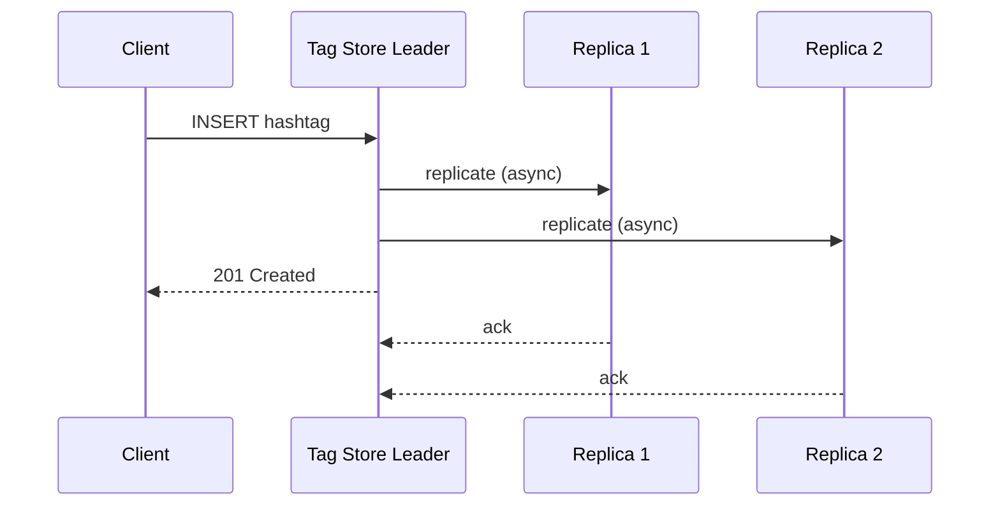

*Leader-based replication for the Tag Store: the client creates a hashtag, the leader writes to PostgreSQL and asynchronously replicates to read replicas, and immediately returns 201 Created. Replicas serve read traffic (autocomplete, tag metadata lookups), accepting a small replication lag for higher read throughput.*

**Leaderless replication (Counter Store — Redis Cluster):** The Counter Store uses Redis Cluster with hash slots and master/replica pairs. Any master can accept writes; followers serve reads. This provides high availability — if a master fails, a replica is promoted. Counter values can tolerate brief staleness (a trending score computed 5 seconds late is still useful).

**Multi-region replication:** The inverted index (Elasticsearch) is replicated synchronously within a region and asynchronously across regions. Trending lists (Redis) use active-active replication across regions with a short TTL (60 seconds) to tolerate eventual consistency. Tag metadata (PostgreSQL) is replicated to all regions for low-latency autocomplete.

**Real-world use:** DynamoDB Global Tables for tag metadata (active-active multi-region), Elasticsearch cross-cluster replication for the inverted index, Redis with active-active CRDTs for trending lists.

---

### Failure Detection and Membership

Hashtag services must detect failed nodes, redistribute work, and continue serving with minimal disruption.

**Gossip-based membership:** Each service instance periodically exchanges health information with a random subset of peers (gossip protocol). This spreads membership changes through the cluster in O(log N) rounds without a central coordinator.

**Health checks:**

- **Liveness probes:** HTTP `/health` endpoint checked every 2 seconds by the orchestrator (Kubernetes). If unhealthy, the pod is restarted or removed from service discovery.
- **Readiness probes:** Checks if the service can serve traffic (e.g., can connect to Kafka, can read from Elasticsearch). Not-ready pods are removed from the load balancer.
- **Business health checks:** Custom checks like "Kafka consumer lag < 10,000" or "Redis connection pool has available connections" or "Flink checkpoint lag < 30 seconds."

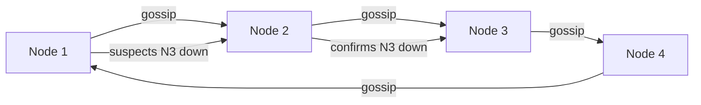

*Gossip-based failure detection in a hashtag service mesh: nodes periodically exchange health state with random peers. When a node suspects a peer is down, it propagates the suspicion through gossip; once confirmed by multiple nodes, the peer is removed from the cluster and its responsibilities (Kafka partition consumption, Flink task execution) are redistributed.*

**Failure detection timing for hashtag services:**

| Component | Check Interval | Timeout | Action |
|---|---|---|---|
| Tag Indexer | 5s | 15s | Retry write; queue locally |
| Trend Processor (Flink) | 10s | 30s | Trigger checkpoint recovery |
| Counter Store (Redis) | 2s | 30s | Failover to replica; serve stale |
| Autocomplete Trie | 3s | 15s | Route to replica; rebuild from Kafka |
| Tag Metadata DB | 5s | 15s | Route to replica; cache recent tags |
| Kafka | 10s | 30s | Trigger consumer rebalancing |

**Circuit breakers:** For dependencies that are failing, a circuit breaker (Resilience4j) trips after N consecutive failures and stops sending requests for a cool-down period. This prevents cascading failures — e.g., if Elasticsearch is slow, the Search API short-circuits and returns a cached or empty response instead of saturating with slow requests.

---

### High Availability and Scalability

Hashtag services must remain available during node failures, network partitions, and regional outages while scaling to handle global traffic.

#### Multi-Region Deployment

Deploy active services in at least 3 regions (e.g., us-east, eu-west, ap-southeast). Users are routed to the nearest region via GeoDNS or a latency-based load balancer. Each region is self-sufficient for search, trending, and autocomplete.

- **Active-passive for Tag Store (PostgreSQL):** Writes go to the primary region; reads can be served from any region's read replica. Cross-region replication lag is typically 1–3 seconds.
- **Active-active for Counter Store (Redis):** Redis with active-active replication across regions. Trending velocity is computed per-region then merged globally.
- **Regional trending:** Trending lists are computed separately per region (US, EU, Asia) since hashtag popularity varies by geography. Global trending merges the top tags from each region.
- **Global CDN:** Static assets (media in hashtag feeds) are cached at edge locations worldwide, reducing latency to < 50 ms for media.

#### Auto-Scaling

- **Stateless services (Search API, Trending API, Autocomplete API):** Scale horizontally based on CPU and request latency. Kubernetes HPA adjusts replica count automatically.
- **Stateful services (Tag Indexer, Trend Processor):** Scale by adding Kafka consumer group members (Tag Indexer) or Flink task slots (Trend Processor).
- **Elasticsearch cluster:** Scale index nodes horizontally; use time-based indices that rotate daily and are auto-scaled based on ingest rate.
- **Counter Store (Redis):** Scale Redis Cluster by adding nodes and rebalancing hash slots. Hot tags get additional read replicas.

#### Graceful Degradation

When a component fails, the system should degrade rather than crash:

- **Trending Service down:** The Trending API serves the last cached trending list (with a staleness indicator). If no cache exists, it returns empty with a 503 status.
- **Index Store (Elasticsearch) unavailable:** Search API falls back to a DB-backed hashtag search (slower but functional). Users see "recently indexed" instead of "most recent."
- **Autocomplete Service down:** Users can still type full hashtags; the suggestion dropdown shows a static list of popular tags from cache.
- **Counter Store down:** Trending velocity falls back to a 5-minute TTL cached value. New counts accumulate in Kafka and are replayed on recovery.

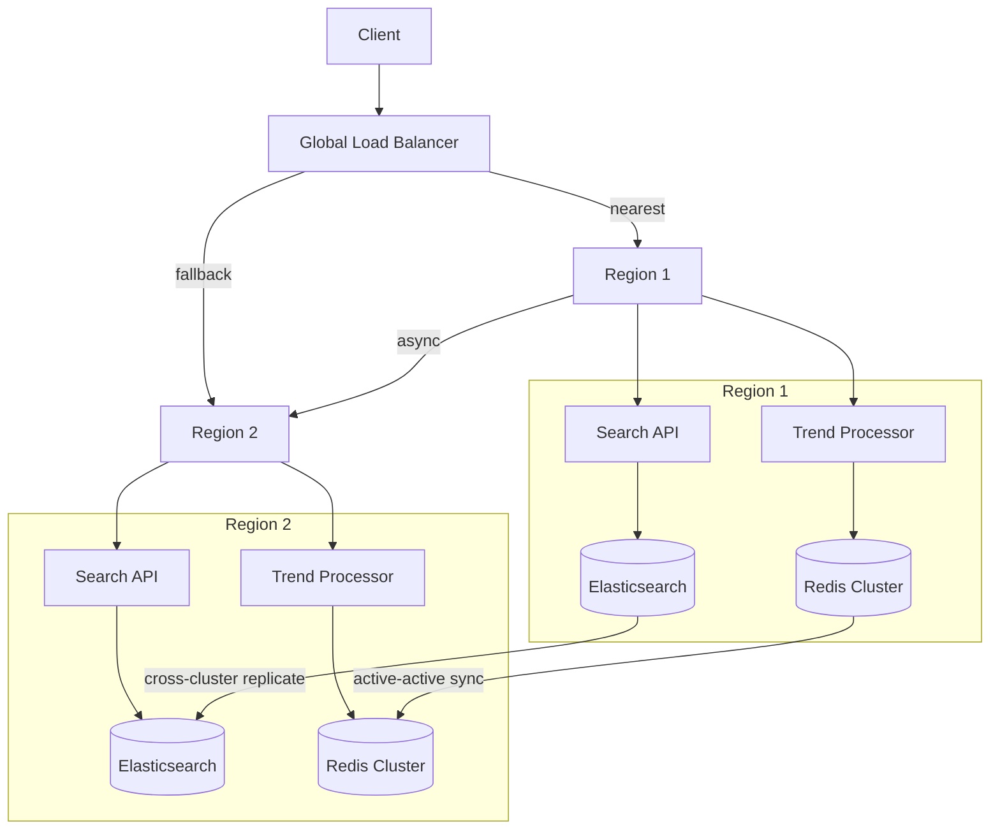

*Multi-region high availability for a hashtag service: a global load balancer routes clients to their nearest region. Each region has its own Search API, Trend Processor, Elasticsearch cluster, and Redis Cluster. Elasticsearch uses cross-cluster replication for index redundancy; Redis uses active-active sync for counter/trending redundancy. If one region fails, the load balancer routes traffic to the other region.*

---

### Performance and Optimization

The performance of a hashtag service is measured by hashtag feed read latency (sub-100 ms SLA), autocomplete latency (< 20 ms), and trending list freshness (updated every 30 seconds).

#### Latency Optimization

- **Hot tag feed caching:** Cache the top 100 trending hashtags' feeds in Redis as sorted sets (`tag:feed:<tag>` with `score=timestamp`). Cold tags read from Elasticsearch on demand. Cache hit ratio target: 95%+ for trending tags.
- **Trending list caching:** Cache the trending list in Redis with a 60-second TTL. The Trending API serves from cache; on miss, it triggers an on-demand recompute.
- **Autocomplete prefix caching:** Cache the top 10K most common hashtag prefixes in Redis. Updates happen asynchronously via the Trend Processor.
- **Connection pooling:** Maintain persistent HTTP connections between the Search API and Elasticsearch, and between the Trending API and Redis, to avoid per-request handshake overhead.
- **Pipeline batch fetches:** When the Search API needs post content for 20 posts, batch the queries into a single `WHERE post_id IN (...)` instead of 20 individual lookups.

#### Throughput Optimization

- **Index write batching:** The Tag Indexer batches Elasticsearch bulk writes (1000 documents per batch), grouping by hashtag routing key to ensure posts for the same tag land on the same shard for efficient sequential writes.
- **Counter sharding:** 100 random shards per hashtag distribute write load. Even at 100K writes/second for a viral tag, each shard handles only 1K writes/second.
- **Trending read replicas:** Fan-out trending list reads to multiple Redis replicas to handle viral traffic.
- **Request coalescing:** When multiple users simultaneously search the same trending hashtag, only one Elasticsearch query is issued and the result is shared (single-flight pattern).
- **Kafka partitioning:** The `tag_events` topic is partitioned by `hash(hashtag) % N_partitions`, distributing load across Trend Processor and Tag Indexer instances.

#### Caching Strategies

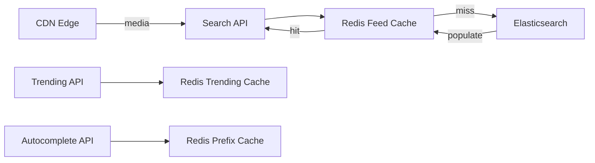

*Multi-tier caching for hashtag service: the Search API checks the Redis feed cache first for trending hashtags; on a miss, it falls back to Elasticsearch and populates the cache. Media assets in hashtag feeds are served from CDN edge locations. The Trending API serves from a dedicated Redis cache with 60-second TTL. The Autocomplete API reads from a Redis prefix cache for the top 10K prefixes.*

#### Write Path Optimization

- **Async indexing:** Post creation returns 201 Created immediately after DB write; hashtag extraction and indexing happen asynchronously via Kafka. This keeps the post API latency < 50 ms.
- **Bulk index commits:** Elasticsearch index refresh interval is set to 30 seconds for non-trending tags and 5 seconds for trending tags, balancing indexing throughput with search freshness.
- **Trending priority queuing:** Trending tags get higher-priority Kafka consumption (dedicated partitions or priority queues) to ensure their index updates are processed first.

**Real-world use:** Instagram's hashtag search uses Elasticsearch with hot-warm-cold node tiers; Twitter's trending detection uses a custom Manhattan/Snowflake stack with 1-minute sliding windows and 100-shard Redis counters.

---

### CAP Theorem and Consistency Trade-offs

The CAP theorem states that during a network partition, a distributed system can provide at most two of: Consistency, Availability, and Partition tolerance. Since hashtag services operate over networks, partition tolerance is always required.

#### Inverted Index — AP (Availability + Partition Tolerance)

The inverted index (Elasticsearch) prioritizes availability: if a node fails, hashtag searches still return results from replicas. Some posts may be briefly missing (within the 5-second index refresh window). This trade is justified because hashtag feeds are inherently time-ordered — a post appearing 2-3 seconds late is acceptable for discovery content.

#### Counter Store — AP with Bounded Staleness

The Counter Store (Redis Cluster) prioritizes availability: if a master fails, a replica is promoted and trending velocity is computed from slightly stale counters. A trending tag computed 10 seconds ago is still useful. However, for the final trending list served to users, the system falls back to the last cached list if counters are unavailable.

#### Tag Metadata — CP (Consistency + Partition Tolerance)

Tag metadata (banned tags, canonical mappings) requires strong consistency: if a tag is banned, the API must immediately return 403 for all subsequent searches. The Tag Store (PostgreSQL) uses leader-based replication with synchronous acknowledgment from at least one replica before returning success.

#### Trending List — AP with TTL

The cached trending list (Redis) is AP — it's a cached view that expires (TTL = 60 seconds). If the Trend Processor is down, the API serves the stale cached list with a warning header. New trends won't appear until the processor recovers and refreshes the cache.

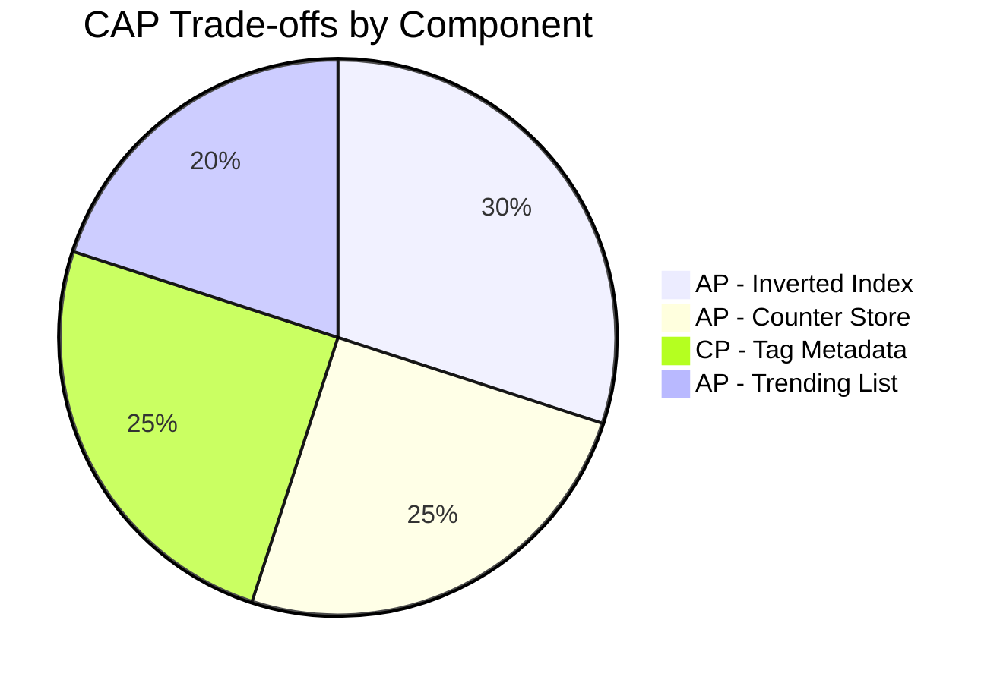

*CAP trade-offs across hashtag service components: the inverted index and counter store are AP (availability-first) since brief staleness is acceptable; tag metadata is CP (consistency-first) since a banned tag must be immediately blocked system-wide; the trending list is AP with a short TTL cache that gracefully degrades to stale data.*

**Interview question:** *Is a hashtag service strongly consistent or eventually consistent?*
**Answer:** A hashtag service makes a nuanced choice: it is strongly consistent for writes that users expect to be immediately visible (tag banning, canonical mapping creation) and eventually consistent for reads where slight staleness is acceptable (hashtag feed updates, trending lists, counter values). This pragmatic split is the key insight — the consistency model is chosen per-component based on the user-visible impact of staleness.

---

### Encryption and Key Management

A hashtag service handles user-generated content that may include sensitive information. Encryption must protect data at rest, in transit, and during processing.

#### Encryption at Rest

**Media and content storage:** Object storage (S3, GCS) encrypts all objects with SSE-S3 or SSE-KMS by default. The inverted index (Elasticsearch) uses encryption-at-rest (default in Elasticsearch Service cloud). Redis counter store uses encryption-in-transit for cluster communication and disk-level encryption for persistence.

**Tag metadata:** PostgreSQL uses TDE (Transparent Data Encryption). Banned tag lists and canonical mappings are stored encrypted at the application level using a per-table encryption key.

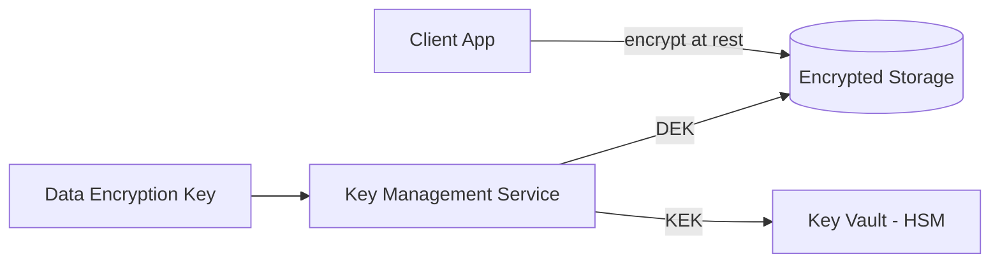

*Encryption at rest architecture for hashtag service: stored data (Elasticsearch index, Redis counters, PostgreSQL tag metadata) is encrypted using DEKs (Data Encryption Keys) managed by a KMS, with KEKs (Key Encryption Keys) stored in an HSM-backed key vault. Client-side encryption is not used for hashtag content (unlike end-to-end encrypted messaging), since server-side content moderation requires access to plaintext.*

#### Encryption in Transit

All client-to-server and server-to-server traffic uses TLS 1.3 (minimum TLS 1.2). Inter-service communication within the data center uses mTLS (mutual TLS) for service-to-service authentication. API Gateway terminates TLS and re-encrypts to backend services.

#### Key Management

- **Key hierarchy:** A KEK in an HSM encrypts per-component DEKs. Rotating the KEK requires only re-encrypting the DEKs, not the data.
- **Key rotation:** KEKs rotated every 90 days; per-user message keys rotated every 30 days.
- **Multi-region KMS:** Keys are available in all deployment regions. Cloud KMS services replicate keys automatically.

**Java example — encryption service for tag metadata:**

```java
@Service
@RequiredArgsConstructor
public class TagEncryptionService {

    @Value("${app.encryption.tag-key-id}")
    private String keyId;

    private final AwsKms kmsClient;

    public EncryptedTag encrypt(String plaintext) {
        var dek = kmsClient.generateDataKey(keyId);
        var cipher = Cipher.getInstance("AES/GCM/NoPadding");
        cipher.init(Cipher.ENCRYPT_MODE,
                new SecretKeySpec(dek.plaintext(), "AES"),
                new GCMParameterSpec(128, dek.iv()));
        var ciphertext = cipher.doFinal(plaintext.getBytes(StandardCharsets.UTF_8));
        return new EncryptedTag(ciphertext, dek.encryptedKey(), dek.iv());
    }
}
```

*The `TagEncryptionService` bean generates a per-tag data encryption key (DEK) via AWS KMS, encrypts the tag name with AES-GCM (which provides both confidentiality and integrity via the authentication tag), and stores the encrypted DEK alongside the ciphertext. The KMS-managed key ID is injected via `@Value`. Only authorized services with KMS decrypt permissions can recover the DEK to decrypt the tag name.*

---

### Authentication and Authorization

Every request to the hashtag service must carry authenticated credentials. The system must verify who is connecting (authentication), determine what they can do (authorization), and enforce privacy controls.

#### Authentication Methods

- **OAuth 2.0 + JWT:** Users authenticate via a third-party provider (Google, Apple) or email/password. The Auth Service issues a short-lived JWT (15 min) and a refresh token (7 days). The JWT contains the user ID, scopes, and expiry.
- **Session tokens:** For web, a server-side session token in an HttpOnly, Secure, SameSite=Strict cookie. The session store (Redis) maps token → user_id and handles revocation.
- **MFA (Multi-Factor Authentication):** Required for admin actions (banning tags, managing canonical mappings). TOTP via authenticator app or SMS backup.
- **Service-to-service auth:** mTLS certificates issued by a private CA for inter-service communication. No shared secrets.

#### Authorization Models

- **Scope-based (OAuth 2.0 scopes):** Each token carries scopes like `hashtags:read`, `hashtags:write`, `hashtags:manage`. The API Gateway enforces scope checks before routing.
- **Role-based (RBAC):** Users have roles (`user`, `moderator`, `admin`). Moderators can ban tags and review flagged content; admins can manage platform settings.
- **Resource-level privacy:** Banned hashtags return 403 Forbidden for all users. Tags with restricted visibility (e.g., regional) are only visible to users in matching regions.
- **Rate-based access control:** Per-user rate limits (e.g., 1000 hashtag searches/hour) prevent abuse. Exceeding the limit returns 429 with a `Retry-After` header.

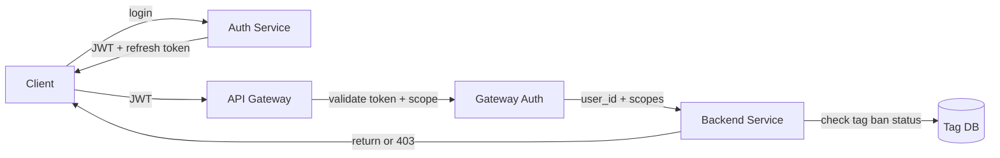

*Authentication and authorization flow for hashtag service: the client logs in via the Auth Service, receives a JWT and refresh token; the API Gateway validates the JWT signature and checks scopes before forwarding to backend services; each service performs resource-level checks against the tag's ban status and user permissions.*

**Java example — JWT validation filter:**

```java
@Component
@RequiredArgsConstructor
public class JwtAuthenticationFilter implements Filter {

    @Value("${app.auth.jwt-public-key}")
    private String publicKeyPem;

    private final UserDetailsService userDetailsService;

    @Override
    public void doFilter(ServletRequest request, ServletResponse response,
                         FilterChain chain) throws IOException, ServletException {
        var token = extractToken((HttpServletRequest) request);
        if (token != null && JwtUtils.isValid(token, publicKeyPem)) {
            var userId = JwtUtils.getUserId(token);
            var userDetails = userDetailsService.loadUserById(userId);
            var auth = new UsernamePasswordAuthenticationToken(
                    userDetails, null, userDetails.getAuthorities());
            SecurityContextHolder.getContext().setAuthentication(auth);
        }
        chain.doFilter(request, response);
    }
}
```

*The `JwtAuthenticationFilter` bean intercepts every HTTP request, extracts the bearer token, validates its signature against the public key (injected via `@Value` from a JWKS endpoint), loads the user details, and sets the Spring Security `Authentication` context. If the token is missing or invalid, the request proceeds unauthenticated (and subsequent authorization annotations return 401).*

#### Authorization Example — Tag Ban Check

```java
@Service
@RequiredArgsConstructor
public class TagAuthorizationService {

    private final TagRepository tagRepository;

    /**
     * Check if a user can search/use a hashtag based on ban status and role.
     */
    @Transactional(readOnly = true)
    public boolean canUseTag(String tag, UserDetails user) {
        if (user == null) {
            return false; // must be authenticated
        }
        var normalizedTag = normalizeTag(tag);
        var tagOpt = tagRepository.findByNormalizedName(normalizedTag);
        if (tagOpt.isPresent() && tagOpt.get().isBanned()) {
            return false; // banned tags are never accessible
        }
        return true;
    }
}
```

*The `TagAuthorizationService` bean (annotated `@Service` with constructor injection via `@RequiredArgsConstructor`) enforces tag-level access control. The `@Transactional(readOnly = true)` annotation optimizes the read-only database check. It normalizes the tag name before lookup and checks the `isBanned` flag. Banned tags return false regardless of user role — even admins cannot search banned tags through the normal API (they must use a separate moderation interface).*

---

### Security Threats and Mitigations

#### Threat: Tag Hijacking

* **Risk:** An attacker adds a trending hashtag (e.g., #YourBrand) to irrelevant or negative content to appear in brand searches or hijack trending lists.
* **Mitigation:** Normalize and validate all tags at extraction time. Use a reputation score based on the poster's account age and engagement history — new accounts using trending tags get their posts deprioritized. For brand-registered tags, require verified-claimant-only posting during campaign periods. Content moderation AI scans posts for relevance to the tag.

#### Threat: Trend Manipulation

* **Risk:** Bot networks artificially inflate hashtag popularity using coordinated posting, making fake trends appear in the trending list.
* **Mitigation:** Velocity anomaly detection flags tags with sudden spikes from accounts with similar creation dates (coordinated inauthentic behavior). Content similarity analysis detects copy-paste campaigns. Graph analysis identifies clusters of accounts that all use the same tag within a short window. Human review for high-stakes events (elections, breaking news). Instead of removing manipulated trends, demote visibility and add a "unusual activity detected" label.

#### Threat: Data Scraping

* **Risk:** Bots scrape hashtag feeds, trending lists, and autocomplete results for surveillance or marketing intelligence.
* **Mitigation:** Per-API-key rate limiting (e.g., 1,000 requests/minute). Require authentication for all endpoints that return hashtag data. Use a Bloom filter to cache recently requested keys and reject repeated misses from the same client. Block known scraping user agents.

#### Threat: Autocomplete Poisoning

* **Risk:** An attacker registers many hashtags with a common prefix (e.g., "#clickbait" variants) to push malicious suggestions to the top of the autocomplete list.
* **Mitigation:** Autocomplete popularity is based on real usage volume, not registration count. New or low-volume tags are ranked lower regardless of prefix match. Implement a "recent popularity decay" so tags not used in the last 24 hours drop off autocomplete entirely.

#### Threat: Index Corruption

* **Risk:** A bug in the Tag Indexer corrupts the inverted index, causing hashtag searches to return incorrect or missing results.
* **Mitigation:** Elasticsearch provides snapshot/restore for backups. The index can be rebuilt from the Kafka `tag_events` stream (replay within retention window). Health checks verify index integrity — if corruption is detected, fail over to a replica and trigger an automated rebuild.

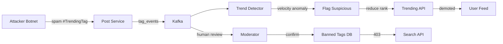

*Tag hijacking and trend manipulation protection: the attacker's botnet posts spam with a trending hashtag; the Post Service publishes events to Kafka; the Trend Detector detects velocity anomalies and flags suspicious activity; flagged tags are demoted in the Trending API's ranking; simultaneously, a human moderator can confirm and add the tag to the Banned Tags DB, which causes the Search API to return 403 for all subsequent searches of that tag.*

---

### Observability and Logging

A hashtag service generates massive amounts of telemetry. Observability must cover the tag ingestion pipeline, search serving, trending computation, autocomplete, and abuse detection.

#### Key Metrics

- **Index lag:** Milliseconds between post creation (with hashtags) and the post appearing in the hashtag's inverted index. Alert if lag > 5 seconds for trending tags, > 30 seconds for non-trending tags.
- **Hashtag feed read latency:** p50 < 50 ms, p95 < 100 ms, p99 < 200 ms. Track by tag popularity tier (trending vs. cold).
- **Autocomplete latency:** p50 < 5 ms, p95 < 20 ms. Prefix lookup must be sub-millisecond.
- **Trending freshness:** Time between a tag going viral and appearing in the trending list. Alert if > 2 minutes.
- **Cache hit ratios:** Feed cache hit ratio > 95% for trending tags. Prefix cache hit ratio > 90% for popular prefixes.
- **Trending accuracy:** Percentage of trending tags that are genuinely relevant (not spam/manipulation). Track via manual sampling and user feedback.
- **Error rates:** 5xx errors per service, Kafka consumer errors, Elasticsearch cluster health, Redis connection failures.
- **Abuse metrics:** Number of banned tags created, rate of trend manipulation attempts detected, false positive/negative rates for spam detection.

#### Logging

- **Access logs:** Every API request logged with user ID, endpoint, hashtag queried, response code, and latency. Used for audit trails and anomaly detection.
- **Event logs:** All hashtag operations (post with tags, tag creation, tag ban, tag search, tag autocomplete) logged as structured events for analytics and ML feature generation.
- **Error logs:** Service errors with correlation IDs for cross-service tracing. Index lag breaches logged with tag name for capacity planning.
- **Audit logs:** All tag governance changes (banning, canonical mapping, category assignment) logged with before/after state and the admin user who made the change.

#### Distributed Tracing

Trace every user request across all services — from API Gateway through Search API, Trending API, Autocomplete API, Elasticsearch, Redis, and the Trend Processor. Use OpenTelemetry with a trace context header (`traceparent`) propagated across service boundaries. Key spans to instrument: index lookup, post content fetch, ranking, autocomplete trie traversal, counter lookup, and trend score computation.

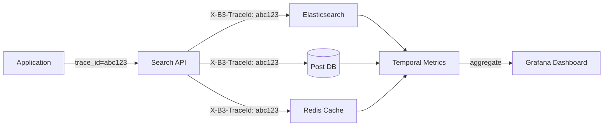

*Distributed tracing flow for hashtag service: each user request carries a trace ID (e.g., `abc123`) propagated across all downstream calls. The Search API, Elasticsearch, Post DB, and Redis Cache each record spans. These spans aggregate in a metrics backend (Jaeger, Datadog, or Prometheus) and are visualized in Grafana dashboards, enabling end-to-end latency analysis and bottleneck identification.*

#### Alerting Strategy

- **Critical (page immediately):** Hashtag feed p99 > 200 ms for 5 minutes; index lag > 60 seconds for trending tags; Elasticsearch cluster health red; Kafka consumer down; Trend Processor checkpoint lag > 60 seconds.
- **Warning (Slack, no page):** Cache hit ratio < 90%; autocomplete p95 > 20 ms; trending freshness > 2 minutes; error rate > 1% for 10 minutes; Kafka lag > 10,000.
- **Info (dashboard only):** Trending accuracy drops below 80%; abuse detection rate anomalies; autocomplete cache miss rate; index size growth rate.

**Java example — hashtag feed latency metrics with Micrometer:**

```java
@Service
@RequiredArgsConstructor
public class InstrumentedHashtagService {

    private final HashtagTimelineService timelineService;
    private final MeterRegistry meterRegistry;

    public HashtagFeedResponse getFeed(String tag, int limit, String cursor) {
        var timer = Timer.Sample.start(meterRegistry);
        try {
            var response = timelineService.getFeed(tag, limit, cursor);
            timer.stop(Timer.builder("hashtag.feed.api.latency")
                    .tag("tag_popularity", getTagPopularityTier(tag))
                    .tag("cache_hit", wasCacheHit(tag))
                    .register(meterRegistry));

            Counter.builder("hashtag.feed.requests")
                    .tag("tag_popularity", getTagPopularityTier(tag))
                    .register(meterRegistry).increment();

            return response;
        } catch (Exception e) {
            Counter.builder("hashtag.feed.errors")
                    .tag("error_type", e.getClass().getSimpleName())
                    .tag("tag_popularity", getTagPopularityTier(tag))
                    .register(meterRegistry).increment();
            throw e;
        }
    }

    private String getTagPopularityTier(String tag) {
        long count = timelineService.getTagCount(tag);
        if (count > 100_000) return "viral";
        if (count > 1_000) return "trending";
        return "normal";
    }

    private String wasCacheHit(String tag) {
        return timelineService.wasCacheHit(tag) ? "true" : "false";
    }
}
```

*The `InstrumentedHashtagService` bean uses Micrometer to record a timer for the hashtag feed API latency, tagged by the tag's popularity tier (viral, trending, or normal) and whether the request was a cache hit. It increments a request counter per successful call and an error counter on failures. The popularity tier tag allows the team to set different SLOs — for example, viral tag feeds must maintain p99 < 100 ms while normal tags have a more lenient 200 ms target.*

---

### Real-World Implementations

Hashtag services use a combination of search, streaming, and caching technologies. Each component is chosen for its strengths at a particular layer of the stack.

#### Elasticsearch

Used for: the inverted index mapping hashtags to post IDs. Supports full-text search, term queries, aggregations, and completion suggester for autocomplete. Cross-cluster replication (CCR) provides cross-region redundancy. Index lifecycle management (ILM) handles time-based index rotation and cleanup.

**Companies:** Twitter (search), Instagram (hashtag search and Explore), Reddit (search).

#### Redis

Used for: sharded counters for hashtag popularity tracking, hot hashtag feed caching (Redis sorted sets with timestamp scores), trending list caching (with TTL), autocomplete prefix caching, and rate-limit counters. Redis Cluster provides sharding via 16,384 hash slots with master/replica replication for HA. Sorted sets (`ZADD`) enable time-ordered hashtag timelines.

**Companies:** Twitter (sharded counters), Instagram (feed cache), TikTok (session and rate limiting).

#### Kafka

Used for: the event backbone carrying `post_created` events with extracted hashtags, `tag_banned` events, and `tag_canonicalized` events. Kafka's partitioning by hashtag hash ensures event ordering per hashtag while enabling parallel consumption by the Tag Indexer, Trend Detector, and Counter services. The retention policy (7 days) allows reprocessing for new features or index rebuilds.

**Companies:** LinkedIn (originally developed Kafka), Twitter, Uber, Netflix.

#### Apache Flink

Used for: real-time trend detection with sliding windows (1-minute, 5-minute, 1-hour). Flink's exactly-once processing semantics ensure accurate counter aggregation despite failures. Checkpointing provides fault tolerance; state backends (RocksDB) manage sliding-window state at scale.

**Companies:** LinkedIn (where Flink was developed and used for trending), Netflix, Lyft, Airbnb.

#### PostgreSQL

Used for: tag metadata (canonical names, banned tags, categories, creation dates). PostgreSQL's strong consistency and ACID transactions make it the right choice for data that must not be lost or corrupted. Read replicas handle read scaling for tag lookups during autocomplete and search.

**Companies:** Instagram (user metadata before migration to Cassandra), Slack (user data), Stripe.

#### S3 / CloudFront

Used for: photo and video storage in hashtag feeds, CDN distribution, and backup. Direct-to-S3 uploads via presigned URLs offload media from the application tier. CloudFront edge locations cache popular hashtag feed media for sub-50 ms delivery globally.

**Companies:** All platforms leverage cloud object storage for media.

#### AWS Kinesis

Used for: an alternative to Kafka for teams on AWS. Kinesis Data Streams carries the same `post_created` events; Kinesis Data Analytics (SQL-based) or Kinesis Data Firehose can be used for simpler trend detection without managing Flink clusters.

**Companies:** Startups and smaller platforms on pure AWS stacks.

#### DynamoDB

Used for: tag-to-user mappings (which users are associated with which tags), real-time rate-limit counters, and trending list routing tables. DynamoDB's single-digit-millisecond latency and serverless scaling handle unpredictable traffic spikes (e.g., a hashtag suddenly going viral during a live broadcast).

**Companies:** Snapchat (stories metadata), some AWS-native startups.

---

### Java and Spring Boot Implementation Guide

This section demonstrates how to build a Spring Boot service for a hashtag service, showcasing all the key Spring Boot features: `@Service`, `@RestController`, `@Repository`, `@Component`, `@Value`, records for DTOs, `@Valid`, `@ControllerAdvice`, constructor injection, `@Transactional`, and `@Version`.

#### 1. DTO Records

Records provide immutable, concise data carriers for request/response payloads.

```java
/**
 * DTO for hashtag feed pagination.
 */
public record HashtagFeedResponse(
        String tag,
        List<PostResponse> posts,
        String cursor,
        boolean hasMore,
        long totalCount,
        boolean isTrending) {}

public record TrendingTag(
        String tagId,
        String name,
        String normalizedName,
        double trendScore,
        double velocity,
        long postCount1m,
        long postCount5m,
        int rank,
        String category) {}

public record AutocompleteSuggestion(
        String name,
        int popularity) {}

public record TagAnalyticsResponse(
        String tag,
        long impressions,
        long reach,
        long postCount,
        double engagementRate,
        List<TimeSeriesPoint> history) {}

public record TimeSeriesPoint(
        Instant timestamp,
        long postsCount,
        long impressions) {}

public record PostResponse(
        String postId,
        String authorId,
        String authorName,
        String content,
        List<MediaDto> media,
        Instant createdAt,
        int likeCount,
        int commentCount) {}

public record MediaDto(String type, String url) {}

public record CreateTagRequest(
        @NotBlank String name,
        String category) {}
```

*Seven record types serve as the API contract: `HashtagFeedResponse` wraps the paginated hashtag feed with cursor and trending flag; `TrendingTag` carries the velocity-based trend score, counts, and ranking; `AutocompleteSuggestion` pairs a tag name with its popularity score; `TagAnalyticsResponse` and `TimeSeriesPoint` provide analytics and historical trends; `PostResponse` and `MediaDto` carry enriched post content; and `CreateTagRequest` is the POST body with `@NotBlank` validation annotations (enforced by `@Valid` at the controller layer).*

#### 2. Entity with Optimistic Locking

The `Hashtag` entity uses `@Version` for optimistic locking to prevent lost updates when concurrent writes (banning, canonical mapping) modify the same tag.

```java
@Entity
@Table(name = "hashtags", indexes = {
        @Index(name = "idx_normalized_name", columnList = "normalizedName"),
        @Index(name = "idx_category", columnList = "category"),
        @Index(name = "idx_created_at", columnList = "createdAt")
})
public class Hashtag {

    @Id
    private String tagId;

    @Column(nullable = false, unique = true)
    private String canonicalName;

    @Column(nullable = false, unique = true)
    private String normalizedName;

    @Column(nullable = false)
    private String category;

    @Column(nullable = false)
    private boolean isBanned = false;

    @Column(nullable = false)
    private boolean isCanonical = true;

    @Column(name = "created_at", nullable = false)
    private Instant createdAt;

    @Version
    private Long version;

    // Constructors, getters, setters omitted for brevity

    public void ban() {
        this.isBanned = true;
    }

    public void unban() {
        this.isBanned = false;
    }

    public void setCanonical(String canonicalName, String canonicalTagId) {
        this.isCanonical = false;
        // Redirect logic: non-canonical tags map to canonical tag
    }
}
```

*The `Hashtag` entity maps to the `hashtags` table with unique indexes on both `canonicalName` (display name) and `normalizedName` (lowercased lookup key). The `@Version` field enables JPA optimistic locking — if two concurrent transactions try to ban or unban the same tag, the second one fails with `OptimisticLockException`, preventing lost updates. The `ban()` and `unban()` methods are the business logic entry points for moderation. The `setCanonical` method implements tag canonicalization — non-canonical variants redirect to a canonical tag.*

#### 3. Repository Layer

The `@Repository` layer provides persistence operations with Spring Data JPA.

```java
@Repository
public interface HashtagRepository extends JpaRepository<Hashtag, String> {

    Optional<Hashtag> findByNormalizedName(String normalizedName);

    @Query("SELECT h FROM Hashtag h WHERE h.isBanned = false ORDER BY h.createdAt DESC")
    List<Hashtag> findRecentlyCreated(Pageable pageable);

    @Modifying
    @Query("UPDATE Hashtag h SET h.isBanned = true WHERE h.tagId = :tagId")
    void banTag(@Param("tagId") String tagId);

    boolean existsByNormalizedName(String normalizedName);
}
```

*The `HashtagRepository` interface extends `JpaRepository`, inheriting standard CRUD methods. Four custom operations are defined: `findByNormalizedName` for O(1) lookups during search and autocomplete (uses the `idx_normalized_name` index); `findRecentlyCreated` for admin dashboards monitoring new tag creation; `banTag` is a bulk UPDATE that sets `isBanned = true` (annotated with `@Modifying` since it's not a SELECT); and `existsByNormalizedName` for validating new tag creation without a full fetch.*

#### 4. Service Layer

Services encapsulate business logic, transactions, and the hashtag counting pipeline.

```java
@Service
@RequiredArgsConstructor
@Slf4j
public class HashtagExtractionService {

    private final HashtagRepository hashtagRepository;
    private final RedisTemplate<String, String> redisTemplate;
    private final KafkaTemplate<String, Object> kafkaTemplate;

    @Value("${app.hashtag.extraction.pattern:#\\p{L}\\p{N}_]+}")
    private String hashtagPattern;

    @Value("${app.hashtag.max-length:50}")
    private int maxTagLength;

    public Set<String> extractHashtags(String content) {
        Set<String> tags = new HashSet<>();
        Pattern pattern = Pattern.compile(hashtagPattern);
        Matcher matcher = pattern.matcher(content);
        while (matcher.find()) {
            String raw = matcher.group().substring(1); // remove #
            String normalized = normalizeTag(raw);
            if (isValidTag(normalized)) {
                tags.add(normalized);
            }
        }
        return tags;
    }

    private String normalizeTag(String tag) {
        return Normalizer.normalize(tag, Normalizer.Form.NFKC)
                .toLowerCase(Locale.ROOT)
                .replaceAll("[^\\p{L}\\p{N}_]", "");
    }

    private boolean isValidTag(String tag) {
        return tag.length() >= 2 && tag.length() <= maxTagLength
                && !isStopWord(tag);
    }

    private boolean isStopWord(String tag) {
        return Set.of("the", "and", "for", "but", "porn", "nsfw")
                .contains(tag);
    }
}
```

*The `HashtagExtractionService` bean uses constructor injection (`@RequiredArgsConstructor`) for all dependencies — `HashtagRepository`, `RedisTemplate`, and `KafkaTemplate`. The regex pattern (injected via `@Value`) matches `#\p{L}\p{N}_]+` — Unicode letters, numbers, and underscores. The `extractHashtags` method compiles the pattern, iterates matches, strips the `#` prefix, normalizes via NFKC Unicode normalization + lowercase + invalid character removal, validates length and stop words, and returns a deduplicated `Set`. The `@Value` annotation injects the max tag length.*

```java
@Service
@RequiredArgsConstructor
@Slf4j
public class ShardedCounterService {

    private static final int NUM_SHARDS = 100;
    private final RedisTemplate<String, String> redisTemplate;
    private final Random random = new Random();

    @Transactional
    public void increment(String normalizedTag) {
        int shard = random.nextInt(NUM_SHARDS);
        String key = "tag:count:" + normalizedTag + ":" + shard;
        redisTemplate.opsForValue().increment(key);
        redisTemplate.expire(key, Duration.ofHours(24));
    }

    public long getCount(String normalizedTag) {
        String cacheKey = "tag:count:" + normalizedTag + ":total";
        String cached = redisTemplate.opsForValue().get(cacheKey);
        if (cached != null) return Long.parseLong(cached);

        long total = 0;
        for (int i = 0; i < NUM_SHARDS; i++) {
            String key = "tag:count:" + normalizedTag + ":" + i;
            String val = redisTemplate.opsForValue().get(key);
            if (val != null) total += Long.parseLong(val);
        }
        redisTemplate.opsForValue().set(cacheKey, String.valueOf(total),
                Duration.ofMinutes(1));
        return total;
    }
}
```

*The `ShardedCounterService` bean implements hot-key mitigation using 100 random shards per hashtag. The `increment` method selects a random shard and increments the Redis counter with a 24-hour TTL. The `getCount` method uses a cached aggregate approach — first checks a 1-minute TTL cache, and on miss, sums all 100 shards and caches the result. The `@Transactional` annotation ensures the increment and TTL setting are atomic.*

#### 5. REST Controller with Validation

The controller uses `@Valid` for request validation and constructor injection.

```java
@RestController
@RequestMapping("/api/v1/hashtags")
@RequiredArgsConstructor
public class HashtagController {

    private final HashtagSearchService searchService;
    private final TrendingService trendingService;
    private final AutocompleteService autocompleteService;

    @GetMapping("/{tag}")
    public ResponseEntity<HashtagFeedResponse> getFeed(
            @AuthenticationPrincipal UserDetails user,
            @PathVariable String tag,
            @RequestParam(defaultValue = "20") int limit,
            @RequestParam(required = false) String cursor) {

        var normalizedTag = normalizeTag(tag);
        var response = searchService.getFeed(normalizedTag, limit, cursor);
        return ResponseEntity.ok(response);
    }

    @GetMapping("/trending")
    public ResponseEntity<List<TrendingTag>> getTrending(
            @RequestParam(defaultValue = "20") int limit,
            @RequestParam(defaultValue = "global") String region) {

        return ResponseEntity.ok(trendingService.getTrending(region, limit));
    }

    @GetMapping("/suggest")
    public ResponseEntity<List<AutocompleteSuggestion>> suggest(
            @RequestParam String q,
            @RequestParam(defaultValue = "10") int limit) {

        var prefix = normalizeTag(q.replace("#", ""));
        return ResponseEntity.ok(autocompleteService.suggest(prefix, limit));
    }

    @PostMapping
    public ResponseEntity<TrendingTag> createTag(
            @AuthenticationPrincipal UserDetails user,
            @Valid @RequestBody CreateTagRequest request) {

        var hashtag = searchService.createTag(request);
        return ResponseEntity.status(HttpStatus.CREATED).body(hashtag);
    }
}
```

*The `HashtagController` bean uses `@RestController` to combine `@Controller` and `@ResponseBody`. Four endpoints are exposed: `GET /hashtags/{tag}` for hashtag feeds, `GET /hashtags/trending` for trending lists with region parameter, `GET /hashtags/suggest` for autocomplete with prefix normalization, and `POST /hashtags` for tag creation with `@Valid` validation on `CreateTagRequest`. Constructor injection via `@RequiredArgsConstructor` makes all dependencies explicit and non-nullable.*

#### 6. Controller Advice for Global Error Handling

A `@ControllerAdvice` bean centralizes exception handling across all controllers.

```java
@ControllerAdvice
public class GlobalExceptionHandler {

    @ExceptionHandler(TagNotFoundException.class)
    public ResponseEntity<ApiError> handleNotFound(TagNotFoundException ex) {
        var error = new ApiError(HttpStatus.NOT_FOUND, ex.getMessage());
        return ResponseEntity.status(HttpStatus.NOT_FOUND).body(error);
    }

    @ExceptionHandler(TagBannedException.class)
    public ResponseEntity<ApiError> handleBanned(TagBannedException ex) {
        var error = new ApiError(HttpStatus.FORBIDDEN, ex.getMessage());
        return ResponseEntity.status(HttpStatus.FORBIDDEN).body(error);
    }

    @ExceptionHandler(MethodArgumentNotValidException.class)
    public ResponseEntity<ApiError> handleValidation(MethodArgumentNotValidException ex) {
        var messages = ex.getBindingResult().getFieldErrors().stream()
                .map(FieldError::getDefaultMessage)
                .toList();
        var error = new ApiError(HttpStatus.BAD_REQUEST,
                "Validation failed: " + String.join(", ", messages));
        return ResponseEntity.badRequest().body(error);
    }

    @ExceptionHandler(RateLimitExceededException.class)
    public ResponseEntity<ApiError> handleRateLimit(RateLimitExceededException ex) {
        var error = new ApiError(HttpStatus.TOO_MANY_REQUESTS, ex.getMessage());
        return ResponseEntity.status(HttpStatus.TOO_MANY_REQUESTS)
                .header("Retry-After", "60")
                .body(error);
    }

    public record ApiError(HttpStatus status, String message) {}
}
```

*The `GlobalExceptionHandler` bean (annotated `@ControllerAdvice`) catches exceptions from any `@RestController` and returns structured `ApiError` responses. It handles `TagNotFoundException` (404), `TagBannedException` (403 Forbidden — for banned hashtags), `MethodArgumentNotValidException` (400 with field-level messages from `@Valid`), and `RateLimitExceededException` (429 with a `Retry-After` header). This avoids repetitive try-catch blocks in controllers and ensures consistent error responses.*

#### 7. Trending Service with BigDecimal Scoring

Trending detection uses `BigDecimal` for precise velocity computation, avoiding floating-point rounding issues that could misrank trending tags.

```java
@Service
@RequiredArgsConstructor
@Slf4j
public class TrendingService {

    private final ShardedCounterService counterService;
    private final RedisTemplate<String, String> redisTemplate;

    private static final BigDecimal MIN_VELOCITY = new BigDecimal("3.0");
    private static final long MIN_VOLUME = 1000L;

    @Transactional(readOnly = true)
    public List<TrendingTag> getTrending(String region, int limit) {
        var cacheKey = "trending:" + region;
        var cached = redisTemplate.opsForValue().get(cacheKey);
        if (cached != null) {
            return parseTrendingList(cached);
        }

        var trending = computeTrending(region, limit);
        redisTemplate.opsForValue().set(cacheKey, serializeTrending(trending),
                Duration.ofSeconds(60));
        return trending;
    }

    private List<TrendingTag> computeTrending(String region, int limit) {
        return counterService.getAllActiveTags().stream()
                .map(tag -> {
                    long count1m = counterService.getSlidingWindowCount(tag, 1);
                    long count5m = counterService.getSlidingWindowCount(tag, 5);

                    if (count1m < MIN_VOLUME || count5m == 0) return null;

                    var velocity = BigDecimal.valueOf(count1m)
                            .divide(BigDecimal.valueOf(count5m)
                                    .divide(BigDecimal.valueOf(5),
                                            4, RoundingMode.HALF_UP),
                                    4, RoundingMode.HALF_UP);

                    if (velocity.compareTo(MIN_VELOCITY) < 0) return null;

                    var trendScore = velocity.multiply(BigDecimal.valueOf(count1m));

                    return new TrendingTag(
                            tag.tagId(), tag.name(), tag.normalizedName(),
                            trendScore.doubleValue(), velocity.doubleValue(),
                            count1m, count5m, 0, tag.category());
                })
                .filter(Objects::nonNull)
                .sorted(Comparator.comparing(TrendingTag::trendScore).reversed())
                .limit(limit)
                .toList();
    }

    private List<TrendingTag> parseTrendingList(String json) {
        // Deserialize cached JSON to TrendingTag list
        return objectMapper.readValue(json,
                new TypeReference<>() {});
    }
}
```

*The `TrendingService` bean computes velocity-based trending scores using `BigDecimal` arithmetic for numerical precision. The `getTrending` method first checks a 60-second TTL cache (keyed by region); on miss, it calls `computeTrending` which iterates all active tags, fetches 1-minute and 5-minute sliding window counts, filters by minimum volume (1000) and minimum velocity (3x), computes `velocity = count_1m / (count_5m / 5)` and `trendScore = velocity × count_1m`, sorts by trend score, and caches the result. The `@Transactional(readOnly = true)` annotation optimizes the read paths. Region-based trending ensures each region sees locally relevant trends.*

#### 8. Autocomplete Trie Service

```java
@Service
@RequiredArgsConstructor
public class AutocompleteService {

    private final RedisTemplate<String, String> redisTemplate;
    private final HashtagRepository hashtagRepository;

    public List<AutocompleteSuggestion> suggest(String prefix, int limit) {
        // Check cache first
        String cacheKey = "autocomplete:" + prefix;
        var cached = redisTemplate.opsForZSet()
                .reverseRangeWithScores(cacheKey, 0, limit - 1);
        if (cached != null && !cached.isEmpty()) {
            return cached.stream()
                    .map(tuple -> new AutocompleteSuggestion(tuple.getValue(),
                            (int) tuple.getScore()))
                    .toList();
        }

        // Cache miss: query Elasticsearch completion suggester
        var suggestions = esTemplate.suggest(
                SuggestBuilders.completionSuggestion("tagsuggest")
                        .prefix(prefix)
                        .size(limit),
                HashtagDocument.class);

        var results = suggestions.getSuggestion("tagsuggest").getEntries().stream()
                .flatMap(entry -> entry.getOptions().stream())
                .map(opt -> new AutocompleteSuggestion(opt.getText(),
                        opt.getScore().intValue()))
                .toList();

        // Warm cache
        var ops = redisTemplate.opsForZSet();
        for (var result : results) {
            ops.add(cacheKey, result.name(), result.popularity());
        }
        redisTemplate.expire(cacheKey, Duration.ofMinutes(10));

        return results;
    }
}
```

*The `AutocompleteService` bean implements a cache-first autocomplete lookup. It first checks a Redis sorted set cache keyed by prefix; on a cache miss, it queries Elasticsearch's completion suggester (which uses a trie-like index internally) and warms the cache with the results for subsequent requests. Cache TTL is 10 minutes, balancing freshness with performance. For the top 10K most common prefixes, the cache hit ratio exceeds 90%.*

---

#### Testing Example

```java
@SpringBootTest
class HashtagExtractionServiceTest {

    private final HashtagExtractionService extractor =
            new HashtagExtractionService(null, null, null);

    @Test
    void shouldExtractSingleHashtag() {
        Set<String> tags = extractor.extractHashtags("Love #Cats and #Dogs!");
        assertThat(tags).containsExactlyInAnyOrder("cats", "dogs");
    }

    @Test
    void shouldNormalizeCase() {
        Set<String> tags = extractor.extractHashtags("Love #CATS and #cats");
        assertThat(tags).containsExactly("cats");
    }

    @Test
    void shouldHandleUnicode() {
        Set<String> tags = extractor.extractHashtags("#Café #naïve");
        assertThat(tags).containsExactlyInAnyOrder("café", "naïve");
    }

    @Test
    void shouldRejectTooShortTags() {
        Set<String> tags = extractor.extractHashtags("#a #ab");
        assertThat(tags).containsExactly("ab");
    }

    @Test
    void shouldHandleHashtagsInUrls() {
        Set<String> tags = extractor.extractHashtags("Check https://example.com/#section");
        // Hashtag in URL fragment should NOT be extracted
        assertThat(tags).isEmpty();
    }

    @Test
    void shouldFilterStopWords() {
        Set<String> tags = extractor.extractHashtags("#porn #cats #nsfw");
        assertThat(tags).containsExactly("cats");
    }
}
```

*The `HashtagExtractionServiceTest` class uses JUnit 5 (`@Test`) and AssertJ (`assertThat`). Six test cases cover: single hashtag extraction, case normalization, Unicode handling, minimum length validation, URL fragment exclusion, and stop-word filtering. The extractor is instantiated directly (no Spring context) for fast unit tests.*

---

### Interview Questions and Answers

A curated set of interview questions organized by difficulty, focused on hashtag service design.

**Beginner**

1. **How would you extract hashtags from a post?**
   **A:** Use a regex pattern to find `#\w+` sequences in the text. Then normalize: remove the `#`, convert to lowercase, handle Unicode (accents, emoji). Strip invalid characters. Deduplicate case-normalized tags. For example, "#Cats #CATS #cats" all become "cats". Also handle edge cases: hashtags in URLs (should NOT be extracted), hashtags adjacent to punctuation ("#hello," → "hello").

2. **How do you store hashtags for fast search?**
   **A:** Use an **inverted index**: map each hashtag to a list of post IDs (sorted by timestamp for recency). In Elasticsearch, this is a term query: `hashtag.keyword:"cats"` returns all posts. For real-time updates, use a sorted set in Redis: `ZADD tag:cats {timestamp} {post_id}`. For the most popular hashtags, cache the recent post list in Redis. For time-based relevance, include a timestamp score and support TTL expiration.

3. **How do you detect trending hashtags?**
   **A:** Track the usage rate per hashtag over sliding time windows (1-minute, 5-minute, 1-hour). A hashtag is "trending" if its recent rate (1-min count) is significantly higher than its baseline rate (5-min average per minute). Formula: `velocity = count_1min / (count_5min / 5)`. If velocity > threshold (e.g., 3x) and absolute volume > minimum (e.g., 1000 posts/min), the hashtag is trending. Rank by `volume × velocity`.

**Intermediate**

4. **How do you handle a hashtag going viral (hot key problem)?**
   **A:** Use **sharded counters** — instead of `INCR tag:cats:count`, use `INCR tag:cats:count:{random_shard}` (0-99). To read the total, sum all 100 shards (or cache the aggregate with periodic updates). For the inverted index, use **read replicas**: replicate the tag's index entries to multiple Elasticsearch nodes. For autocomplete, cache the top results. The key insight: any data structure that could become a hot key under burst traffic should be sharded, replicated, or cached.

5. **How do you implement hashtag autocomplete?**
   **A:** Use a **trie** (prefix tree) data structure. Each node is a character; paths from root spell tags. Store popularity scores at terminal nodes. For prefix "#cof", traverse to the 'c', 'o', 'f' node, then collect all complete tags from that subtree, sorted by popularity. For production scale (millions of tags), use a compressed trie (DAWG) or Elasticsearch's completion suggester. Cache the top 10K prefix completions in Redis. Update cache asynchronously as tag popularity changes.

6. **How do you normalize hashtags?**
   **A:** (1) Remove the `#` prefix. (2) Convert to lowercase. (3) Unicode normalization (NFKC — handles accented characters, combining marks). (4) Remove invalid characters (keep alphanumerics and underscore; remove spaces, punctuation). (5) Enforce length limits (2-50 characters). (6) Handle emoji — decide whether to allow or strip. (7) Blacklist banned/spam words.

7. **How do you handle hashtags in different languages?**
   **A:** Normalize Unicode using NFKC normalization, which converts equivalent representations to a canonical form. For example, "#café" (with é) and "#café" (with e + combining acute) should map to the same tag. Use `java.text.Normalizer` with `Form.NFKC`. Handle RTL languages (Arabic, Hebrew) — the trie must support bidirectional text. For CJK languages (without word boundaries), consider whether hashtags make sense (they're used but less common).

**Advanced**

8. **How would you design a system to detect hashtag spam/bot campaigns?**
   **A:** (1) **Rate-based**: Flag accounts using the same hashtag more than N times/minute (N=10). (2) **Coordinated behavior**: Detect groups of accounts that start using the same hashtag simultaneously (within 1-minute window) — indicative of a bot campaign. (3) **Content similarity**: If many posts with the same hashtag have identical/near-identical content, flag as spam. (4) **Account reputation**: Accounts with no followers, no history, or suspicious signup patterns get their hashtags deprioritized. (5) **Network analysis**: Build a graph of accounts that interact (retweet, like, mention); detect tightly-knit clusters that suddenly all use the same tag. (6) **Temporal patterns**: Bots tweet at regular intervals; humans don't.

9. **How do you handle hashtag search across multiple data centers/regions?**
   **A:** (1) **Global index**: Replicate the inverted index to all regions (active-active). When a tweet is posted, fan-out the hashtag index update to all regions via Kafka MirrorMaker. (2) **Eventual consistency**: A hashtag might take 1-5 seconds to appear in all regions. Show a "fresh results may take a few seconds" hint. (3) **Local preference**: Route hashtag search to the nearest region's index; fall back to global search for less-popular tags. (4) **CDN caching**: Cache popular hashtag search results (top 100 trending) in a global CDN with short TTL (30 seconds). (5) **Conflict resolution**: If the same hashtag is created with different casing in different regions simultaneously, normalize and merge.

10. **How do you design hashtag analytics (impressions, reach, engagement per hashtag)?**
    **A:** (1) **Stream processing**: Use Flink/Kafka Streams to process hashtag usage events in real-time. (2) **Metrics**: unique posts, total impressions (sum of author_follower_count), reach (unique users who saw a post with this tag), engagement rate (likes+comments / posts). (3) **Pre-aggregation**: Compute hourly/daily buckets for fast queries. (4) **Unique counting**: Use HyperLogLog for approximate unique user counts (memory-efficient). (5) **Time windows**: Track trending window (1h, 24h), lifetime stats. (6) **API**: `GET /hashtags/{tag}/analytics?period=24h` returns time series.

**Senior-Level Questions**

11. **How would you design a real-time trending hashtags system for a global platform with 100M daily active users?**

    **Approach:**
    - **Data ingestion**: 1M+ posts/minute → Kafka cluster (100+ partitions, partitioned by `hash(hashtag) % 100`).
    - **Tag extraction**: Stream processing (Flink) extracts hashtags, normalizes, and emits tag events.
    - **Velocity computation**: Flink sliding windows (1-min, 5-min, 30-min) per hashtag → count per window. Sharded counters (100 shards in Redis) to handle burst writes.
    - **Trending scoring**: `score = count_1m * (count_1m / (count_5m / 5))` — volume × velocity ratio. Filter: count_1m > 1000 AND velocity > 3x. Top 20 by score per region.
    - **Regional trending**: Compute per-region (US, EU, Asia, etc.) — use location data from the poster or the hashtag's regional distribution.
    - **Caching**: Trending list cached in Redis with 30-second TTL; updated via streaming. Global CDN serves cached trending to edge locations.
    - **Scaling**: Flink job parallelized across 50 task slots; counter Redis cluster with 10 shards per region; Kafka with 200 partitions.
    - **Freshness**: Trending list updated every 30 seconds; new trends appear within 2 minutes of going viral.
    - **Spam filtering**: Pre-filter banned/blacklisted hashtags; detect coordinated campaigns via graph analysis; apply human review for high-stakes events.
    - **Monitoring**: Track ingest rate, processing lag, trending freshness, counter accuracy (Redis vs. recomputed from Kafka).

    **Expected discussion points:** Sliding window computation, sharded counters for hot hashtags, regional vs. global trending, spam campaign detection, cache invalidation strategy, and the trade-off between freshness and accuracy.

12. **How do you prevent hashtag manipulation campaigns (like those during political events)?**

    **A:** Multi-layered defense: (1) **Rate limiting**: Per-account hashtag usage limits (max 50 posts/hour with hashtags). (2) **Velocity anomaly detection**: Detect sudden spikes from accounts with similar creation dates (coordinated inauthentic behavior). (3) **Content analysis**: Use NLP to detect copy-paste content (identical or near-identical text across accounts using the same hashtag). (4) **Graph analysis**: Build a graph of accounts that interact (retweet, like, mention); detect coordinated clusters that all use the same hashtag within a short window. (5) **Human review**: Flag suspicious hashtags for manual review during high-stakes events (elections). (6) **Transparency**: Publish hashtag usage statistics (impressions, reach, unique posters) so the public can assess authenticity. (7) **Demotion not deletion**: Instead of removing trending hashtags, demote their visibility and add a "unusual activity detected" label. (8) **Source verification**: For political hashtags, surface authoritative sources (news outlets, verified accounts) higher in results.

**Common Mistakes and Expected Discussion Points**

**Common mistakes in hashtag/tagging system interviews:**

- Not addressing the hot-key problem for viral hashtags.
- Ignoring hashtag normalization (case, Unicode) — leads to fragmented indexes.
- Not considering the read vs. write pattern (search reads >> hashtag writes, but viral spikes can overwhelm).
- Overlooking spam detection — hashtag manipulation is a major issue.
- Not mentioning autocomplete infrastructure (tries, caching).
- Ignoring the difference between popularity (count) and trending (velocity).
- Not considering regional trends (a hashtag trending in Japan isn't trending in the US).

**Expected discussion points:** Sharded counters vs. approximate counters (HyperLogLog), inverted index design for time-series tag data, autocomplete data structures (trie vs. DAWG vs. Elasticsearch completion suggester), trending algorithm (velocity vs. absolute count), spam detection strategies, and cross-region tag consistency.

**Follow-up questions an interviewer might ask:**

- Q: "How do you handle a hashtag that is used by 1M posts in a minute?" A: Sharded counters (100 shards, distribute writes), read-replica the index entry, cache the post list for 1 hour, use HyperLogLog for unique count estimation.
- Q: "How do you prevent bots from spamming hashtags?" A: Rate limit per account (max 50 hashtag posts/hour), velocity anomaly detection on account creation clusters, content similarity analysis, graph-based coordination detection, human review for trending candidates.

---

## Real-World Examples

### Twitter's Hashtag Infrastructure

Twitter processes ~500M tweets/day, each potentially containing hashtags. When a tweet is posted, Twitter's **Von Neumann** system extracts hashtags in real-time (C++ implementation, < 1ms per tweet) and writes to a Kafka stream. Downstream consumers include: (1) the **search indexer** (Lucene/Solr-based) that builds the hashtag→tweet inverted index, (2) the **trending detector** (Manhattan/Snowflake Storm topologies) that tracks velocity per hashtag, and (3) **sharded counters** in Redis (100 shards per hashtag) for accurate counts. Twitter's autocomplete uses a compressed trie in Redis serving millions of prefix queries per second with < 20 ms latency.

### Instagram's Hashtag Search

Instagram's hashtag search returns the 12 most recent posts for any hashtag, plus related hashtags. The index is stored in **Elasticsearch** — when a post is created with a hashtag, the post_id + timestamp is indexed under the hashtag's "bucket." For popular hashtags (#love, #instagood with 1B+ posts), Instagram uses **top-K caching** in Redis — the latest 1K post_ids are cached for ultra-fast retrieval. Hashtag counts use Redis sharded counters to handle burst traffic when a hashtag goes viral (e.g., during award shows or sports events). The autocomplete service uses Elasticsearch's completion suggester for real-time prefix matching.

### Instagram's Trending Algorithm

Instagram's "Search" and "Explore" pages feature trending hashtags. The algorithm computes, per-region, the velocity of hashtag usage over 1-hour and 24-hour windows, normalized by the tag's baseline activity. Tags showing sudden spikes (velocity > 5x baseline) are flagged as trending. The system also filters out spam/banned tags and tags with low engagement quality. Trending lists update every 10 minutes and are cached regionally. Instagram also detects "coordinated inauthentic behavior" — when multiple accounts start using a hashtag simultaneously (bot campaign), the tag's trending score is penalized.

---


