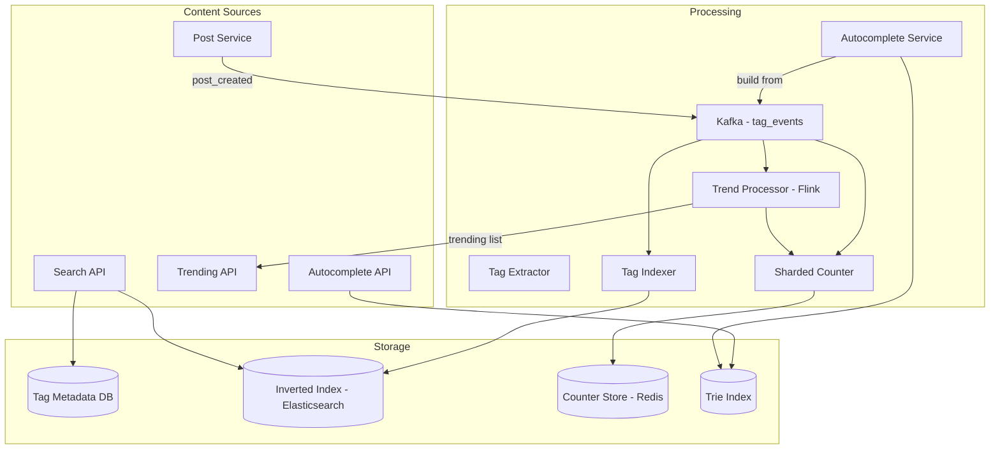
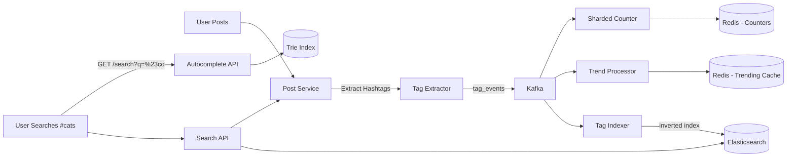

# Design Tagging Service Or HashTag Service

## Blogs and websites

## Medium

## Youtube

- [Tagging Service Or HashTag Service System Design | Atlassian interview question w/a Senior Software](https://www.youtube.com/watch?v=zskh3kq8xZc)

---

## Theory

### What Is It?

A tagging or hashtag service is a system that extracts, indexes, and serves content associated with hashtags or tags. Users attach hashtags (e.g., #breaking, #cats, #devops) to posts, and the service must efficiently index these tags, support fast hashtag search (show all posts with #X), detect trending tags in real-time, and provide autocomplete suggestions. The system must handle millions of concurrent hashtag searches and update tag popularity in real-time as new posts are created.

### Why Does It Exist?

Tags and hashtags enable content discovery beyond the social graph. Without hashtags, a user's content is only visible to their followers. With hashtags, content becomes discoverable by anyone searching for that tag — whether it's a news event (#BreakingNews), a hobby (#Woodworking), or a product category (#Coffee). The tagging service exists to make this discovery fast, scalable, and relevant.

### What Problem Does It Solve?

* **High-cardinality indexing**: Millions of unique hashtags; billions of tag-to-content associations. Must support fast lookups (`GET /hashtag/cats` → all posts with #cats).
* **Real-time trending**: Detect which hashtags are suddenly popular (velocity-based trending) without batch processing delays.
* **Autocomplete**: As users type "#ca", suggest "#cats", "#cake", "#California" in milliseconds.
* **Tag popularity ranking**: Sort popular tags by recent activity volume.
* **Hot key management**: Popular hashtags (#BreakingNews, #SuperBowl) generate massive read and write traffic on specific keys — need to avoid overloading a single shard.
* **Spam and abuse**: Malicious users create hashtags to hijack trends or spam. Need real-time abuse detection.
* **Case and normalization**: "#Cats", "#cats", "#CATS" should map to the same tag. Special characters, Unicode, and emoji handling.

### Important Subtopics

1. Hashtag extraction and normalization from content
2. Inverted index for hashtag → content lookup
3. Real-time trend detection (velocity-based)
4. Autocomplete for hashtag suggestions
5. Sharded counters for popularity tracking (hot-key avoidance)
6. Spam and abuse detection for hashtags
7. Tag governance and canonical mapping

## Characteristics

| Characteristic | What it means | Why it matters | How it works |
|---|---|---|---|
| **Real-time indexing** | New hashtag usage is immediately searchable | Users expect fresh content in hashtag feeds | Write to index on post creation; propagate within seconds |
| **Hot-key resilience** | Popular hashtags don't overload the system | Trending hashtags can cause 1000x traffic spikes | Sharded counters; read replicas; caching |
| **Autocomplete** | Fast prefix-based tag suggestions | Essential for UX during tag input | Trie or n-gram index with caching |
| **Trending detection** | Real-time popularity ranking | Drives content discovery | Sliding-window counters with velocity computation |
| **Scale** | Millions of tags, billions of associations | Must handle global platforms | Distributed index, sharded storage |
| **Spam resistance** | Abuse patterns detected and mitigated | Protect trending lists and search quality | ML-based anomaly detection; reputation scoring |

## Components

| Component | Purpose | Responsibilities | Relationship | Real-world Example |
|---|---|---|---|---|
| **Tag Extractor** | Parse hashtags from content | Regex extraction, normalization, dedup | Called by Post Service | Twitter's hashtag parser |
| **Tag Indexer** | Build search index | Write hashtag→post_id mapping to inverted index | Consumes from Message Bus; writes to Index Store | Elasticsearch, Solr |
| **Tag Counter** | Track popularity | Sharded counters per hashtag; compute velocity | Consumes from Message Bus; writes to Counter Store | Redis sharded counters |
| **Trend Detector** | Real-time trending | Sliding window analysis; velocity computation | Reads from Tag Counter | Storm/Flink topology |
| **Autocomplete Service** | Tag suggestions | Prefix search, popularity ranking | Reads from Trie/N-gram Index | Elasticsearch completion suggester |
| **Tag Store** | Canonical tag metadata | Tag name, canonical mapping, creation date | Read by all services | PostgreSQL |
| **Index Store** | Inverted index | Hashtag → list of post_ids with timestamps | Written by Indexer; read by Search Service | Elasticsearch, Redis |
| **Message Bus** | Event propagation | Carry post_created events, tag_created events | Used by all services | Kafka |

### Component Interactions

1. **Tag creation**: Post Service → Tag Extractor extracts hashtags from post content → publishes `post_created` event with hashtags → Tag Indexer writes to Index Store → Tag Counter increments sharded counters → Trend Detector monitors velocity.
2. **Tag search**: Search API → Index Store (inverted index lookup for hashtag) → fetch post metadata → rank by recency/engagement → return.
3. **Trending**: Trend Detector reads counters → computes velocity (count_now / count_previous) → ranks → caches top 100 trending tags.

## Patterns

### Inverted Index for Hashtag → Content

* **What**: Build an inverted index mapping each hashtag to the list of post IDs that contain it.
* **Problem solved**: Fast hashtag feed generation — "show me all posts with #cats" should return in milliseconds, even with billions of posts.
* **How it works**: When a post with #cats is created, append `post_id` to the index entry for "cats". At query time, look up "cats" → get list of post_ids → fetch post content (from Post Store) → return. Use time-based segmentation (index for last 24 hours, last 7 days, all time).
* **When to use**: When you need fast hashtag-based content discovery.
* **When not to use**: When tags are rarely queried — overhead of maintaining the index.
* **Advantages**: O(1) lookup per hashtag; scales to billions of associations.
* **Disadvantages**: Index grows with content; updates on tag changes require re-indexing.
* **Java/Spring Boot example**:
```java
@Service
public class TagIndexService {
    private final RedisTemplate<String, String> redis;

    public void indexTag(String tag, String postId, long timestamp) {
        // Store post_id in a sorted set: tag:posts:<tag> with score=timestamp
        String key = "tag:posts:" + normalizeTag(tag);
        redis.opsForZSet().add(key, postId, timestamp);
        // Auto-expire after 7 days
        redis.expire(key, Duration.ofDays(7));
    }

    public List<String> getRecentPostsForTag(String tag, int limit) {
        String key = "tag:posts:" + normalizeTag(tag);
        // ZREVRANGE = latest posts first
        return redis.opsForZSet().reverseRange(key, 0, limit - 1);
    }
}
```
* **Real-world example**: Instagram's hashtag search index.

### Sharded Counters for Hot-Tag Mitigation

* **What**: Instead of storing a single counter per hashtag (which becomes a hot key for trending tags), use N shards per tag and sum them.
* **Problem solved**: When #BreakingNews gets 100K posts/minute, a single counter key gets 100K writes/second — Redis can't handle this on one key. Sharding across 100 keys reduces per-key write rate to 1K/sec.
* **How it works**: For tag "BreakingNews", write to keys `tag:count:BreakingNews:0`, `:1`, ... `:99` (100 shards). On write, pick a random shard (0-99) and increment. On read, sum all 100 shards (or cache the sum and update periodically).
* **When to use**: Any counter that experiences bursty, high-volume writes on a small set of keys.
* **When not to use**: Low-volume tags — sharding adds overhead without benefit.
* **Advantages**: Eliminates hot keys; scales linearly with shard count.
* **Disadvantages**: Read requires summing multiple shards (extra computation); approximate until all shards summed.
* **Real-world example**: Twitter's favorite/retweet counters; Instagram's like counters.

### Trie-Based Autocomplete

* **What**: Store hashtags in a trie (prefix tree) for fast prefix-based autocomplete suggestions.
* **Problem solved**: As a user types "#cof", instantly return "#coffee", "#cooking", "#cookingtips" — requires sub-millisecond prefix lookup.
* **How it works**: Each character is a node in the trie. The path from root to a node spells a prefix. Each terminal node stores the list of complete hashtags and their popularity scores. Traversing the trie by character gives all completions.
* **When to use**: When autocomplete is a core feature and you need sub-millisecond response.
* **When not to use**: When the tag set is small (< 1000 tags) — a simple sorted array with binary search suffices.
* **Advantages**: O(P) lookup where P = prefix length (independent of total tag count).
* **Disadvantages**: Higher memory usage than a suffix array; updates require trie traversal.
* **Real-world example**: Twitter's hashtag autocomplete; Elasticsearch's completion suggester.

## Benefits

* **Content discovery**: Users find content beyond their social network via hashtags.
* **Real-time trending**: Viral topics surface instantly, driving engagement and news discovery.
* **Marketing campaigns**: Brands create campaign hashtags (#JustDoIt) for user-generated content campaigns.
* **Event coverage**: Live events (sports, concerts, breaking news) generate real-time hashtag streams.
* **Community building**: Interest-based hashtags (#DevOps, #MachineLearning) create communities around topics.
* **Search engine indexing**: Hashtags make content searchable and indexable by search engines.

## Pros

* **Organic discovery**: Tags enable serendipitous content discovery without algorithmic recommendation.
* **Real-time relevance**: Trending hashtags provide a real-time pulse of what's happening.
* **User-generated categorization**: Users themselves tag content, creating organic organization.
* **Marketing amplification**: Campaign hashtags encourage user participation and extend reach.
* **Low-latency search**: With proper indexing, hashtag feeds return in milliseconds.

## Cons

* **Tag hijacking**: Malicious users add popular tags to irrelevant content to gain visibility.
* **Spam and abuse**: Bot networks create fake hashtags and spam trend lists.
* **Hashtag overload**: Overuse of hashtags reduces their signal-to-noise ratio (Instagram's algorithm penalizes over-tagging).
* **Misinformation spread**: Trending hashtags can amplify false information (false news spreads 6x faster on Twitter).
* **Cultural/language issues**: Hashtags are language-agnostic — can lead to unintended meanings or cultural insensitivity.

## Challenges

### Technical Challenges

* **Hot tags**: Trending hashtags (#BreakingNews, #SuperBowl) generate massive read + write traffic — require sharded counters, read replicas, and aggressive caching.
* **Index update latency**: New posts must appear in hashtag feeds within seconds — write index, wait for propagation, handle failures.
* **Autocomplete scaling**: Millions of tags require a memory-efficient data structure (DAWG, compressed trie) and caching of popular prefixes.
* **Case normalization**: "#Cats", "#cats", "#CATS", "#cat s" must all map to the same canonical tag. Unicode normalization is tricky.

### Scalability Challenges

* **Fan-out to search index**: Every post with hashtags must update the inverted index — at 10K posts/second with 3 hashtags each, that's 30K index writes/second.
* **Counter consistency**: Sharded counter sums may be stale — decide between consistency (sum all shards at every read) vs. availability (cache the sum, update periodically).
* **Trend detection window**: 1-minute and 5-minute windows require real-time processing of all tag events.

### Performance Challenges

* **Tag search latency**: Hashtag feed must return in < 100 ms (like Twitter search).
* **Autocomplete latency**: Prefix lookup must return in < 20 ms.
* **Trending computation**: Velocity must be computed over sliding windows in real-time (per-hour, per-minute).

### Reliability Challenges

* **Index corruption**: If the inverted index is corrupted, hashtag search breaks. Need backup and rebuild capability.
* **Counter loss**: If a shard is lost, the tag's total count is wrong until the shard is restored.
* **Autocomplete cache staleness**: Cache may not reflect newly popular tags.

### Maintainability Challenges

* **Tag governance**: Define rules for what constitutes a valid hashtag (length, characters, banned words).
* **Spam detection**: Continuously evolve abuse detection as spammers adapt.
* **Index rebuilds**: Periodically rebuild the inverted index to remove tombstones and optimize.

### Operational Challenges

* **Trend manipulation detection**: Detect coordinated hashtag campaigns (bot armies all using the same tag simultaneously).
* **Cache invalidation**: When a tag's popularity changes, invalidate cached autocomplete results and trending lists.
* **Monitoring**: Track index lag (time from post creation to searchable), autocomplete latency, trending accuracy, and spam detection rates.

### Security Concerns

* **Brand hijacking**: Using #YourBrand in spam posts to appear in brand searches.
* **Coordinated inauthentic behavior**: Bot networks artificially inflate hashtag popularity.
* **Sensitive content**: Hashtags can be used to flag or spread sensitive/misleading content.
* **Data scraping**: Hashtag feeds can be scraped for surveillance or marketing intelligence.

## Best Practices

* **Sharded counters**: For any counter that could experience bursty writes (likes, retweets, hashtag counts), use 100+ random shards per counter key.
* **Inverted index with time bounds**: Store posts in the inverted index with timestamps; expire old entries automatically (TTL). Don't keep all-time indexes for every tag.
* **Caching layers**: Cache popular hashtag feeds (top 100 trending) and autocomplete results (top 10K popular prefixes) in Redis.
* **Normalize tags**: Lowercase, strip leading #, Unicode normalization (NFKC), validate against allowed characters.
* **Read replicas for trending**: Fan-out trending list reads to multiple replicas to handle viral traffic.
* **Rate limiting**: Limit hashtag creation/usage per user to prevent spam (e.g., max 100 posts/hour with hashtags).
* **Trend velocity, not absolute count**: A tag trending at 1000→5000 posts/minute is more "trending" than one at 10000→11000 (slower growth).
* **Pre-warm popular prefixes**: Cache the top 1000 most common hashtag prefixes for autocomplete.

## When to Use

### Appropriate

* When content needs discovery beyond the social graph (searchable content).
* When real-time trending detection is a product feature.
* When autocomplete for tag input is needed.
* When content is user-generated and benefits from organic categorization.
* When campaigns/marketing hashtags drive engagement.

### Not Appropriate

* When content is primarily personal (not meant for discovery) — privacy-focused content shouldn't be tagged.
* When the tag set is controlled and small (e.g., product categories in an e-commerce site) — a simple taxonomy suffices.
* When real-time trends aren't needed — batch processing is simpler and cheaper.
* When content moderation is too strict or costly — hashtags can surface unwanted/sensitive content.

### Alternatives

* **Fixed taxonomy**: Predefined categories (product types, article categories) — no user-generated tags.
* **Search-only**: Full-text search without hashtag indexing — slower for exact-tag queries.
* **Topic modeling**: ML-based topic extraction from content — no user tags needed but less precise.

### Decision Factors

* **Tag volume**: Millions of unique tags → need distributed index; thousands → simple index suffices.
* **Query volume**: High read volume for popular tags → need caching and sharding.
* **Real-time requirements**: Trending within seconds → streaming processing; hourly trends → batch OK.
* **Moderation needs**: Open tagging → more spam risk; curated tags → less risk.

## Use Cases

### Breaking News Trending

* **Problem**: A breaking news story (earthquake, election results) needs to be surfaced to all users searching the relevant hashtag.
* **Solution**: Real-time trend detection monitors hashtag usage velocity — when #Earthquake trending spikes, the tag appears in trending lists within seconds.
* **Why suitable**: Hashtags are the natural way users discuss breaking news; real-time detection surfaces important events.
* **How it works**: Post created with #Earthquake → Tag Extractor normalizes → Tag Counter shard incremented → Trend Detector (Flink) sees velocity spike → tags as trending → cached trending list pushed to clients.
* **Trade-offs**: Speed vs. spam — trending too fast may surface false trends; trending too slow misses the real-time conversation.

### Brand Campaign Tracking

* **Problem**: A brand launches a campaign with hashtag #JustDoIt — needs to track and display user-generated content.
* **Solution**: Hashtag feed shows all recent posts with #JustDoIt, sorted by recency and engagement. The brand monitors metrics (volume, sentiment, reach).
* **Why suitable**: Hashtags create an organic gallery of user-generated content without the brand having to collect submissions.
* **How it works**: Campaign launches → users post with #JustDoIt → posts indexed in the hashtag's inverted index → brand's landing page queries GET /hashtag/JustDoIt → returns recent posts → displayed.
* **Trade-offs**: Brand can't control which content appears (someone might post negative content with the hashtag); need content moderation filters.

### Event Coverage

* **Problem**: A music festival (#Coachella) needs a live feed of attendee posts.
* **Solution**: Hashtag feed aggregates all #Coachella posts in real-time, creating a shared experience for attendees and remote viewers.
* **Why suitable**: Hashtags unify fragmented content from thousands of users into a coherent narrative.
* **How it works**: Attendees post with #Coachella → posts indexed → trending detection surfaces event during its timeframe → users discover the hashtag via autocomplete → feed shows real-time posts.
* **Trade-offs**: Signal-to-noise ratio degrades as more users (including spammers) join; need quality filters and trending decay (older posts rank lower).

## Architecture

A hashtag service uses a **streaming architecture** with event sourcing. Hashtag extraction happens at post-creation time; the inverted index is built from a Kafka event stream; trending is computed by a real-time processor (Flink/Storm) consuming the same stream. Sharded counters in Redis prevent hot-key bottlenecks. Autocomplete uses a trie-based index backed by Elasticsearch's completion suggester.



### Architecture Structure

* **Ingestion layer**: Tag Extractor (part of Post Service) extracts hashtags from content → publishes to Kafka.
* **Processing layer**: Indexer (builds inverted index), Trend Processor (Flink job for velocity), Counter (sharded Redis counters), Autocomplete builder (maintains trie).
* **Storage layer**: Tag Metadata DB (PostgreSQL), Inverted Index (Elasticsearch), Counter Store (Redis clustered), Trie Store (Redis/Elasticsearch).
* **API layer**: Search API (hashtag feed), Trending API, Autocomplete API.

### Communication

* **Streaming**: Kafka carries `post_created` events with extracted hashtags; all processors consume from the same topic.
* **Sync**: Search/Trending/Autocomplete APIs → storage (Elasticsearch/Redis) for queries.

### Data Flow

1. **Hashtag creation**: Post created → Tag Extractor → Kafka `tag_events` → Indexer writes to Elasticsearch → Counter increments → Trend Processor computes velocity.
2. **Tag search**: Search API → Elasticsearch inverted index → post IDs → fetch content → rank → return.
3. **Trending**: Trend Processor reads counters → sliding window velocity → top 100 → cache in Redis → Trending API serves from cache.
4. **Autocomplete**: User types prefix → Autocomplete API → trie lookup → return top suggestions by popularity.

### Scaling Strategy

* **Kafka topic**: Partition by `hash(hashtag) % N_partitions` — distributes load across Trend Processor instances.
* **Counter sharding**: 100 shards per hashtag for write distribution; sum shards for reads (or cache the sum).
* **Elasticsearch**: Scale index nodes; use time-based indices (rotate daily).
* **Trie cache**: Cache top 10K prefix completions in Redis.

### Failure Handling

* **Indexer lag**: If Indexer falls behind, recent posts won't appear in hashtag search. Monitor lag; scale indexer workers.
* **Counter loss**: Lost shard data → inaccurate counts → trending may be wrong. Use Redis replication + periodic recount from Kafka stream.
* **Autocomplete staleness**: Cache TTL (5 minutes) ensures eventual freshness; on cache miss, compute from trie.

## High-Level Design



**Hashtag indexing flow**:
1. User posts "Love #Cats and #Dogs" → Post Service stores post → Tag Extractor extracts [#cats, #dogs] → normalizes (lowercase) → publishes to Kafka.
2. Tag Indexer consumes → writes `tag:cats → post_id:timestamp` to Elasticsearch inverted index (sorted set).
3. Sharded Counter increments `tag:count:cats:0..99` in Redis (random shard).
4. Trend Processor tracks velocity in 1-min windows → if spike, tag is trending → cached in Redis.
5. User searches "#cats" → Search API → Elasticsearch lookup → returns recent posts.

**Trending flow**:
1. Trend Processor (Flink) consumes from Kafka → maintains 1-min and 5-min sliding windows per tag → computes velocity (count_1min / count_5min).
2. Tags with velocity > threshold (e.g., 10x normal) are trending.
3. Trending list (top 20) cached in Redis with 30-second TTL.
4. Trending API serves from Redis.

## Deep Dive

### Internal Implementation: Sharded Counters

```java
@Service
public class ShardedCounter {
    private static final int NUM_SHARDS = 100;
    private final RedisTemplate<String, String> redis;
    private final Random random = new Random();

    public void increment(String tag) {
        int shard = random.nextInt(NUM_SHARDS);
        String key = "tag:count:" + tag + ":" + shard;
        redis.opsForValue().increment(key);
        redis.expire(key, Duration.ofHours(24));
    }

    public long getCount(String tag) {
        // Option 1: Sum all shards (accurate but slow)
        // return IntStream.range(0, NUM_SHARDS)
        //     .mapToLong(i -> redis.opsForValue().increment("tag:count:" + tag + ":" + i, 0))
        //     .sum();
        
        // Option 2: Cached aggregate (fast, slightly stale)
        String cacheKey = "tag:count:" + tag + ":total";
        String cached = redis.opsForValue().get(cacheKey);
        if (cached != null) return Long.parseLong(cached);
        
        // Recompute and cache
        long total = IntStream.range(0, NUM_SHARDS)
            .mapToLong(i -> redis.opsForValue().increment("tag:count:" + tag + ":" + i, 0))
            .sum();
        redis.opsForValue().set(cacheKey, String.valueOf(total), Duration.ofMinutes(1));
        return total;
    }

    public List<TagTrend> getTrending(int windowMinutes) {
        // Use Top-K algorithm (Space-Saving) to find trending tags
        // in a streaming fashion without storing all counters
        return trendService.getTopTags(windowMinutes, 100);
    }
}
```

### Trend Detection Algorithm

The trend detection uses a **velocity-based** approach with sliding windows:

1. Maintain two counters per tag: count in the last 1 minute (`count_1m`) and count in the last 5 minutes (`count_5m`).
2. **Velocity** = `count_1m / count_5m` (the ratio of recent activity to baseline).
3. A tag is "trending" if velocity > threshold (e.g., 3x) AND `count_1m` > minimum volume (e.g., 1000 posts/min — filters noise).
4. Rank trending tags by `count_1m * velocity` (volume × growth rate).

```java
@Service
public class TrendDetector {
    private static final int MIN_VOLUME = 1000; // posts per minute
    private static final double MIN_VELOCITY = 3.0;

    public List<String> getTrendingTags() {
        return counterStore.getAllTags().stream()
            .filter(tag -> counterStore.getCount1m(tag) > MIN_VOLUME)
            .filter(tag -> {
                long c1 = counterStore.getCount1m(tag);
                long c5 = counterStore.getCount5m(tag);
                return c5 > 0 && (double) c1 / (c5 / 5.0) > MIN_VELOCITY;
            })
            .sorted((a, b) -> {
                long ca = counterStore.getCount1m(a);
                long cb = counterStore.getCount1m(b);
                double va = (double) ca / Math.max(1, counterStore.getCount5m(a) / 5.0);
                double vb = (double) cb / Math.max(1, counterStore.getCount5m(b) / 5.0);
                return Double.compare(cb * vb, ca * va);
            })
            .limit(20)
            .toList();
    }
}
```

### Inverted Index Design

For a hashtag feed, the inverted index maps: `tag → [post_id, timestamp]` pairs. In Elasticsearch:

```json
{
  "hashtag": "cats",
  "posts": [
    {"post_id": "p_123", "created_at": "2024-06-14T10:30:00Z", "author_id": "u_456"},
    {"post_id": "p_124", "created_at": "2024-06-14T10:31:00Z", "author_id": "u_789"}
  ]
}
```

Use a **timestamp-sorted set** (Elasticsearch sorted by `created_at desc`) so `POST /hashtag/cats?limit=20` returns the 20 most recent. Implement **TTL-based expiration**: posts older than 24 hours are removed from the index (via ILM policy or periodic cleanup). For very popular tags, consider **top-K caching**: cache the top 1000 most popular hashtags' post lists in Redis for ultra-fast access.

### Autocomplete Trie

```java
public class HashtagTrie {
    private static class TrieNode {
        Map<Character, TrieNode> children = new HashMap<>();
        Set<String> tags = new HashSet<>(); // Complete tags ending at/below this node
        int popularity = 0;
    }

    private final TrieNode root = new TrieNode();

    public void insert(String tag, int score) {
        TrieNode node = root;
        for (char c : tag.toCharArray()) {
            node = node.children.computeIfAbsent(c, k -> new TrieNode());
            node.tags.add(tag);
        }
        node.popularity = score;
    }

    public List<String> suggest(String prefix, int limit) {
        TrieNode node = root;
        for (char c : prefix.toCharArray()) {
            node = node.children.get(c);
            if (node == null) return Collections.emptyList();
        }
        // Return top-N by popularity
        return node.tags.stream()
            .sorted((a, b) -> Integer.compare(getPopularity(b), getPopularity(a)))
            .limit(limit)
            .toList();
    }
}
```

In production, use **DAWG (Directed Acyclic Word Graph)** — a compressed trie — to reduce memory usage for millions of tags. Or use Elasticsearch's completion suggester which does this automatically.

## Java and Spring Boot Implementation

### Basic Java Implementation — Hashtag Extraction

```java
@Service
public class HashtagExtractor {
    private static final Pattern HASHTAG_PATTERN = 
        Pattern.compile("#(\\p{L}\\p{N}_|#[\\p{L}\\p{N}_]+)*[\\p{L}\\p{N}_]+");

    public Set<String> extractHashtags(String content) {
        Set<String> tags = new HashSet<>();
        Matcher matcher = HASHTAG_PATTERN.matcher(content);
        while (matcher.find()) {
            String tag = matcher.group(1);
            String normalized = normalizeTag(tag);
            if (isValidTag(normalized)) {
                tags.add(normalized);
            }
        }
        return tags;
    }

    private String normalizeTag(String tag) {
        // Remove leading #, lowercase, Unicode normalize
        return Normalizer.normalize(tag, Normalizer.Form.NFKC)
            .toLowerCase(Locale.ROOT)
            .replaceAll("[^\\p{L}\\p{N}_]", "");
    }

    private boolean isValidTag(String tag) {
        return tag.length() >= 2 && tag.length() <= 50 && !isStopWord(tag);
    }
}
```

### Spring Boot — Hashtag Search Controller

```java
@RestController
@RequestMapping("/api/v1/hashtags")
@RequiredArgsConstructor
public class HashtagController {
    private final HashtagSearchService searchService;
    private final TrendingService trendingService;
    private final AutocompleteService autocompleteService;

    @GetMapping("/{tag}")
    public ResponseEntity<HashtagFeedResponse> getFeed(
            @PathVariable String tag,
            @RequestParam(defaultValue = "20") int limit,
            @RequestParam(required = false) String cursor) {
        
        String normalizedTag = normalizeTag(tag);
        HashtagFeedResponse response = searchService.getFeed(normalizedTag, limit, cursor);
        return ResponseEntity.ok(response);
    }

    @GetMapping("/trending")
    public ResponseEntity<List<TrendingTag>> getTrending() {
        return ResponseEntity.ok(trendingService.getTrendingTags());
    }

    @GetMapping("/suggest")
    public ResponseEntity<List<String>> suggest(@RequestParam String q) {
        String prefix = normalizeTag(q.replace("#", ""));
        return ResponseEntity.ok(autocompleteService.suggest(prefix, 10));
    }
}

@Service
public class HashtagSearchService {
    private final ElasticsearchTemplate esTemplate;
    private final PostService postService;

    public HashtagFeedResponse getFeed(String tag, int limit, String cursor) {
        // Search inverted index: hashtag -> [post_ids with timestamps]
        NativeSearchQuery searchQuery = NativeSearchQueryBuilder()
            .withQuery(QueryBuilders.termQuery("hashtag.keyword", tag))
            .withPageable(cursor != null ? 
                PageRequest.of(cursorToInt(cursor), limit, 
                    Sort.by(Sort.Direction.DESC, "created_at"))
                : PageRequest.of(0, limit))
            .build();

        SearchHits<HashtagPost> hits = esTemplate.search(searchQuery, HashtagPost.class);
        
        List<String> postIds = hits.getSearchHits().stream()
            .map(hit -> hit.getContent().getPostId())
            .toList();

        List<Post> posts = postService.getByIds(postIds);

        return HashtagFeedResponse.builder()
            .tag(tag)
            .posts(posts)
            .nextCursor(hits.getSearchHits().isEmpty() ? null : 
                String.valueOf(fromInt(cursor) + limit))
            .build();
    }
}
```

### Testing Example

```java
@SpringBootTest
class HashtagExtractorTest {
    private final HashtagExtractor extractor = new HashtagExtractor();

    @Test
    void shouldExtractSingleHashtag() {
        Set<String> tags = extractor.extractHashtags("Love #Cats and #Dogs!");
        assertThat(tags).containsExactlyInAnyOrder("cats", "dogs");
    }

    @Test
    void shouldNormalizeCase() {
        Set<String> tags = extractor.extractHashtags("Love #CATS and #cats");
        assertThat(tags).containsExactly("cats");
    }

    @Test
    void shouldHandleUnicode() {
        Set<String> tags = extractor.extractHashtags("#Café #naïve");
        assertThat(tags).containsExactlyInAnyOrder("café", "naïve");
    }

    @Test
    void shouldRejectTooShortTags() {
        Set<String> tags = extractor.extractHashtags("#a #ab");
        assertThat(tags).containsExactly("ab");
    }

    @Test
    void shouldHandleHashtagsInUrls() {
        Set<String> tags = extractor.extractHashtags("Check https://example.com/#section");
        // Hashtag in URL fragment should NOT be extracted
        assertThat(tags).isEmpty();
    }
}
```

## Real-World Examples

### Twitter's Hashtag Infrastructure

Twitter processes ~500M tweets/day, each potentially containing hashtags. When a tweet is posted, Twitter's **Von Neumann** system extracts hashtags in real-time (C++ implementation, < 1ms per tweet) and writes to a Kafka stream. Downstream consumers include: (1) the **search indexer** (Lucene/Solr-based) that builds the hashtag→tweet inverted index, (2) the **trending detector** (Manhattan/Snowflake Storm topologies) that tracks velocity per hashtag, and (3) **sharded counters** in Redis (100 shards per hashtag) for accurate counts. Twitter's autocomplete uses a compressed trie in Redis serving millions of prefix queries per second with < 20 ms latency.

### Instagram's Hashtag Search

Instagram's hashtag search returns the 12 most recent posts for any hashtag, plus related hashtags. The index is stored in **Elasticsearch** — when a post is created with a hashtag, the post_id + timestamp is indexed under the hashtag's "bucket." For popular hashtags (#love, #instagood with 1B+ posts), Instagram uses **top-K caching** in Redis — the latest 1K post_ids are cached for ultra-fast retrieval. Hashtag counts use Redis sharded counters to handle burst traffic when a hashtag goes viral (e.g., during award shows or sports events). The autocomplete service uses Elasticsearch's completion suggester for real-time prefix matching.

### Instagram's Trending Algorithm

Instagram's "Search" and "Explore" pages feature trending hashtags. The algorithm computes, per-region, the velocity of hashtag usage over 1-hour and 24-hour windows, normalized by the tag's baseline activity. Tags showing sudden spikes (velocity > 5x baseline) are flagged as trending. The system also filters out spam/banned tags and tags with low engagement quality. Trending lists update every 10 minutes and are cached regionally. Instagram also detects "coordinated inauthentic behavior" — when multiple accounts start using a hashtag simultaneously (bot campaign), the tag's trending score is penalized.

## Interview Preparation

### Beginner Questions

**Q1: How would you extract hashtags from a tweet?**
A: Use a regex pattern to find `#\w+` sequences in the text. Then normalize: remove the `#`, convert to lowercase, handle Unicode (accents, emoji). Strip invalid characters. Deduplicate case-normalized tags. For example, "#Cats #CATS #cats" all become "cats". Also handle edge cases: hashtags in URLs (should NOT be extracted), hashtags adjacent to punctuation ("#hello," → "hello").

**Q2: How do you store hashtags for fast search?**
A: Use an **inverted index**: map each hashtag to a list of post IDs (sorted by timestamp for recency). In Elasticsearch, this is a term query: `hashtag.keyword:"cats"` returns all posts. For real-time updates, use a sorted set in Redis: `ZADD tag:cats {timestamp} {post_id}`. For the most popular hashtags, cache the recent post list in Redis. For time-based relevance, include a timestamp score and support TTL expiration.

**Q3: How do you detect trending hashtags?**
A: Track the usage rate per hashtag over sliding time windows (1-minute, 5-minute, 1-hour). A hashtag is "trending" if its recent rate (1-min count) is significantly higher than its baseline rate (5-min average per minute). Formula: `velocity = count_1min / (count_5min / 5)`. If velocity > threshold (e.g., 3x) and absolute volume > minimum (e.g., 1000 posts/min), the hashtag is trending. Rank by `volume × velocity`.

### Intermediate Questions

**Q4: How do you handle a hashtag going viral (hot key problem)?**
A: Use **sharded counters** — instead of `INCR tag:cats:count`, use `INCR tag:cats:count:{random_shard}` (0-99). To read the total, sum all 100 shards (or cache the aggregate with periodic updates). For the inverted index, use **read replicas**: replicate the tag's index entries to multiple read nodes. For autocomplete, cache the top results. The key insight: any data structure that could become a hot key under burst traffic should be sharded, replicated, or cached.

**Q5: How do you implement hashtag autocomplete?**
A: Use a **trie** (prefix tree) data structure. Each node is a character; paths from root spell tags. Store popularity scores at terminal nodes. For prefix "#cof", traverse to the 'c', 'o', 'f' node, then collect all complete tags from that subtree, sorted by popularity. For production scale (millions of tags), use a compressed trie (DAWG) or Elasticsearch's completion suggester. Cache the top 10K prefix completions in Redis. Update cache asynchronously as tag popularity changes.

**Q6: How do you normalize hashtags?**
A: (1) Remove the `#` prefix. (2) Convert to lowercase. (3) Unicode normalization (NFKC — handles accented characters, combining marks). (4) Remove invalid characters (keep alphanumerics, underscore; remove spaces, punctuation). (5) Enforce length limits (2-50 characters). (6) Handle emoji — decide whether to allow (#🎉) or strip. (7) Blacklist banned/spam words.

**Q7: How do you handle hashtags in different languages?**
A: Normalize Unicode using NFKC normalization, which converts equivalent representations to a canonical form. For example, "#café" (with é) and "#café" (with e + combining acute) should map to the same tag. Use `java.text.Normalizer` with `Form.NFKC`. Handle RTL languages (Arabic, Hebrew) — the trie must support bidirectional text. For CJK languages (without word boundaries), consider whether hashtags make sense (they're used but less common).

### Advanced Questions

**Q8: How would you design a system to detect hashtag spam/bot campaigns?**
A: (1) **Rate-based**: Flag accounts using the same hashtag more than N times/minute (N=10). (2) **Coordinated behavior**: Detect groups of accounts that start using the same hashtag simultaneously (within 1-minute window) — indicative of a bot campaign. (3) **Content similarity**: If many posts with the same hashtag have identical/near-identical content, flag as spam. (4) **Account reputation**: Accounts with no followers, no history, or suspicious signup patterns get their hashtags deprioritized. (5) **Network analysis**: Build a graph of accounts that interact (retweet, like, mention); detect tightly-knit clusters that suddenly all use the same tag. (6) **Temporal patterns**: Bots tweet at regular intervals; humans don't.

**Q9: How do you handle hashtag search across multiple data centers/regions?**
A: (1) **Global index**: Replicate the inverted index to all regions (active-active). When a tweet is posted, fan-out the hashtag index update to all regions via Kafka MirrorMaker. (2) **Eventual consistency**: A hashtag might take 1-5 seconds to appear in all regions. Show a "fresh results may take a few seconds" hint. (3) **Local preference**: Route hashtag search to the nearest region's index; fall back to global search for less-popular tags. (4) **CDN caching**: Cache popular hashtag search results (top 100 trending) in a global CDN with short TTL (30 seconds). (5) **Conflict resolution**: If the same hashtag is created with different casing in different regions simultaneously, normalize and merge.

**Q10: How do you design hashtag analytics (impressions, reach, engagement per hashtag)?**
A: (1) **Stream processing**: Use Flink/Kafka Streams to process hashtag usage events in real-time. (2) **Metrics**: unique posts, total impressions (sum of follower counts of posters), reach (unique users who saw a post with this tag), engagement rate (likes + comments / posts). (3) **Pre-aggregation**: Compute hourly/daily buckets for fast queries. (4) **Unique counting**: Use HyperLogLog for approximate unique user counts (memory-efficient). (5) **Time windows**: Track trending window (1h, 24h), lifetime stats. (6) **API**: `GET /hashtags/{tag}/analytics?period=24h` returns time series.

### Senior-Level Questions

**Q11: How would you redesign the hashtag system to support real-time collaborative tagging (like Google Docs commenting with hashtags)?**
A: (1) **Real-time sync**: Use Operational Transformation (OT) or CRDTs for concurrent hashtag edits on the same document. Each hashtag is a CRDT set element — adding/removing is commutative. (2) **Tag namespace**: Per-document tag namespace (tags only apply to that document) — avoid global pollution. (3) **Auto-suggest**: As user types "#", show document-local tags (already used in this doc) + popular global tags. (4) **Index updates**: Incremental — only update the inverted index for this document (not the global index). (5) **Conflict resolution**: If two users add different tags simultaneously, both are preserved (set union via CRDT). (6) **Real-time update**: WebSocket pushes tag changes to all collaborators. (7) **Tag resolution**: Tags can be "resolved" — `@mention` users are resolved to user IDs; `#tag` is stored as text but links to a tag page. (8) **Search scoping**: Document-level tag search (within the doc) vs. global tag search (all docs).

**Q12: How do you prevent hashtag manipulation campaigns (like those during political events)?**
A: Multi-layered defense: (1) **Rate limiting**: Per-account hashtag usage limits (max 50 posts/hour with hashtags). (2) **Velocity anomaly detection**: Detect sudden spikes from accounts with similar creation dates (coordinated inauthentic behavior). (3) **Content analysis**: Use NLP to detect copy-paste content (identical or near-identical text across accounts using the same hashtag). (4) **Graph analysis**: Build a graph of accounts that interact (retweet, like, mention); detect coordinated clusters that all use the same hashtag within a short window. (5) **Human review**: Flag suspicious hashtags for manual review during high-stakes events (elections). (6) **Transparency**: Publish hashtag usage statistics (impressions, reach, unique posters) so the public can assess authenticity. (7) **Demotion not deletion**: Instead of removing trending hashtags, demote their visibility and add a "unusual activity detected" label. (8) **Source verification**: For political hashtags, surface authoritative sources (news outlets, verified accounts) higher in results.

### System Design Questions (Senior)

**Q13: Design a real-time trending hashtags system for a global platform with 100M daily active users.**

**Approach**:
- **Data ingestion**: 1M+ posts/minute → Kafka cluster (100+ partitions, partitioned by `hash(hashtag) % 100`).
- **Tag extraction**: Stream processing (Flink) extracts hashtags, normalizes, and emits tag events.
- **Velocity computation**: Flink sliding windows (1-min, 5-min, 30-min) per hashtag → count per window. Sharded counters per hashtag (100 shards in Redis) to handle burst writes.
- **Trending scoring**: `score = count_1m * (count_1m / (count_5m / 5))` — volume × velocity ratio. Filter: count_1m > 1000 AND velocity > 3x. Top 20 by score per region.
- **Regional trending**: Compute per-region (US, EU, Asia, etc.) — use location data from the poster or the hashtag's regional distribution.
- **Caching**: Trending list cached in Redis with 1-minute TTL; updated via streaming. Global CDN serves cached trending to edge locations.
- **Scaling**: Flink job parallelized across 50 task slots; counter Redis cluster with 10 shards per region; Kafka with 200 partitions.
- **Freshness**: Trending list updated every 30 seconds; new trends appear within 2 minutes of going viral.
- **Spam filtering**: Pre-filter banned/blacklisted hashtags; detect coordinated campaigns via graph analysis; apply human review for high-stakes events.
- **Monitoring**: Track ingest rate, processing lag, trending freshness, counter accuracy (Redis vs. recomputed from Kafka).

**Expected discussion points**: Sliding window computation, sharded counters for hot hashtags, regional vs. global trending, spam campaign detection, cache invalidation strategy, and the trade-off between freshness and accuracy.

**Q14: Design a hashtag analytics dashboard showing real-time impressions, reach, and engagement per hashtag.**

**Approach**:
- **Event stream**: Kafka topic with `hashtag_used` events: `{hashtag, post_id, author_id, author_follower_count, timestamp, region}`.
- **Stream processing**: Flink job computes per-hashtag metrics in 1-minute tumbling windows: posts_count, impressions (sum of author_follower_count), reach (HyperLogLog of unique author_ids), engagement_rate (likes+comments / posts).
- **Storage**: Time-series DB (InfluxDB or ClickHouse) stores pre-aggregated metrics per hashtag per minute. Hot data (last 24h) in Redis for dashboard queries.
- **Query API**: `GET /hashtags/{tag}/analytics?range=24h&interval=1h` → returns time series of metrics.
- **Unique counting**: HyperLogLog for reach (approximate, memory-efficient, ~2% error).
- **Real-time**: Dashboard shows a 1-minute-delay view (Flink processing time). Historical view (7-30 days) from ClickHouse.
- **Top tags**: Pre-compute "top 100 hashtags by impressions" every 5 minutes → cache in Redis.
- **Sampling**: For very high-volume hashtags, sample events (1 in 100) and extrapolate.
- **Cost optimization**: Store detailed raw data in S3 (Parquet, 90 days); aggregated data in ClickHouse (365 days); hot aggregates in Redis (24 hours).
- **Alerts**: Alert if a hashtag suddenly spikes (could be spam campaign or breaking news).

### Common Mistakes and Expected Discussion Points

**Common mistakes in hashtag/tagging system interviews**:
- Not addressing the hot-key problem for viral hashtags.
- Ignoring hashtag normalization (case, Unicode) — leads to fragmented indexes.
- Not considering the read vs. write pattern (search reads >> hashtag writes, but viral spikes can overwhelm).
- Overlooking spam detection — hashtag manipulation is a major issue.
- Not mentioning autocomplete infrastructure (tries, caching).
- Ignoring the difference between popularity (count) and trending (velocity).
- Not considering regional trends (a hashtag trending in Japan isn't trending in the US).

**Expected discussion points**: Sharded counters vs. approximate counters (HyperLogLog), inverted index design for time-series tag data, autocomplete data structures (trie vs. DAWG vs. Elasticsearch suggester), trending algorithm (velocity vs. absolute count), spam detection strategies, and cross-region tag consistency.

**Follow-up questions an interviewer might ask**:
* Q: "How do you handle a hashtag that is used by 1M posts in a minute?" A: Sharded counters (100 shards, distribute writes), read-replica the index entry, cache the post list for 1 hour, use HyperLogLog for unique count estimation instead of exact count.
* Q: "How do you prevent bots from spamming hashtags?" A: Rate limit per account (max 50 hashtag posts/hour), velocity anomaly detection on account creation clusters, content similarity analysis, graph-based coordination detection, and human review for trending candidates.
